# <a id='toc1_'></a>[Auswertungen: kolorektale Krebserkrankungen](#toc0_)

**Table of contents**<a id='toc0_'></a>    
- [Auswertungen: kolorektale Krebserkrankungen](#toc1_)    
  - [📆 Datenstand](#toc1_1_)    
  - [⚙️ Teildatensatz](#toc1_2_)    
  - [Fallzahlen](#toc1_3_)    
    - [Fallzahlen C18-C20 nach Viersteller](#toc1_3_1_)    
  - [OP](#toc1_4_)    
    - [keine Operation erfolgt bei C18 mit T_p > 0](#toc1_4_1_)    
    - [Stratifizierung für keine OP erfolgt](#toc1_4_2_)    
  - [OPS](#toc1_5_)    
    - [OPS 5-4xx nach Diagnose](#toc1_5_1_)    
      - [C18](#toc1_5_1_1_)    
      - [C20](#toc1_5_1_2_)    
    - [Vergleich laparoskopisch vs offen](#toc1_5_2_)    
    - [ Verteilung OPS 5-455 bei C18](#toc1_5_3_)    
    - [ Verteilung OPS 5-484 bei C20](#toc1_5_4_)    
    - [Details OPS 5-455](#toc1_5_5_)    
      - [Kombination von Gruppen](#toc1_5_5_1_)    
      - [Anteil Robotik](#toc1_5_5_2_)    
      - [Ileozökalresektion](#toc1_5_5_3_)    
      - [rechte Hemikolektomie](#toc1_5_5_4_)    
      - [Sigmaresektion](#toc1_5_5_5_)    
  - [Lokalisation (Fernmetastasen) für C18](#toc1_6_)    
    - [nach M](#toc1_6_1_)    
    - [Anteil FM Lokalisation Leber bei M1](#toc1_6_2_)    
    - [Behandlungsverlauf](#toc1_6_3_)    
    - [Erste Behandlung bei Leber FM](#toc1_6_4_)    
    - [OPS wenn Erstbehandlung OPS](#toc1_6_5_)    
  - [Rezidive](#toc1_7_)    
    - [Verteilung OP in 2020](#toc1_7_1_)    
    - [M Stadium und Vitalstatus bei Tumoren ohne Therapie und pT](#toc1_7_2_)    
    - [R Status](#toc1_7_3_)    
      - [davon: Verteilung nur R0](#toc1_7_3_1_)    
  - [Behandlung innerhalb von 6 Wochen](#toc1_8_)    
    - [Zeitlicher Abstand der Behandlungen](#toc1_8_1_)    

<!-- vscode-jupyter-toc-config
	numbering=false
	anchor=true
	flat=false
	minLevel=1
	maxLevel=6
	/vscode-jupyter-toc-config -->
<!-- THIS CELL WILL BE REPLACED ON TOC UPDATE. DO NOT WRITE YOUR TEXT IN THIS CELL -->

    🐍 3.12.8 | 📦 pandas: 2.3.3 | 📦 numpy: 1.26.4 | 📦 duckdb: 1.5.0 | 📦 pandas-plots: 1.4.3


## <a id='toc1_1_'></a>[📆 Datenstand](#toc0_)

    database file:           2025-11-11_data_clin.duckdb
    data tag:                v2.3
    last kkr data import:    2025-09-30
    sql table created:       2025-11-11 11:52:01
    doi:                     10.18444/5.03.01.0005.0021.0002
    document created:        2026-04-27 21:56:54


## <a id='toc1_2_'></a>[⚙️ Teildatensatz](#toc0_)
- Filter für gültige Fälle: (dieser Filter ist für **alle** Analysen gesetzt)
  - `z_dy` (Diagnosejahr) in 2020-2024
  - `z_icd10_3d` (Primärdiagnose) in `C18`-`C20`

<!-- ### <a id='toc1_2_1_'></a>[Deskriptive Statistik](#toc0_) -->

## <a id='toc1_3_'></a>[Fallzahlen](#toc0_)

### <a id='toc1_3_1_'></a>[Fallzahlen C18-C20 nach Viersteller](#toc0_)
> 💡 `C19` darf eigentlich nicht verwendet werden, wird von Krebsgesellschaft nicht akzeptiert


<!-- START_TOKEN -->


    counts: all rows (no grouping)
    ---
    n = 3_241_401                    (100.0%) ██████████████████████████████
    └ [DJ 2020-2024]:  n = 2_998_753  (92.5%) ░░░███████████████████████████
    └ [ICD10 C18-C20]:   n = 227_053   (7.0%) ░░░░░░░░░░░░░░░░░░░░░░░░░░░░██


<!-- END_TOKEN -->


<details>
<summary>filter-sql</summary>

```sql
z_dy between 2020 and 2024
and z_icd10_3d in ('C18', 'C19', 'C20')
```

</details>


    
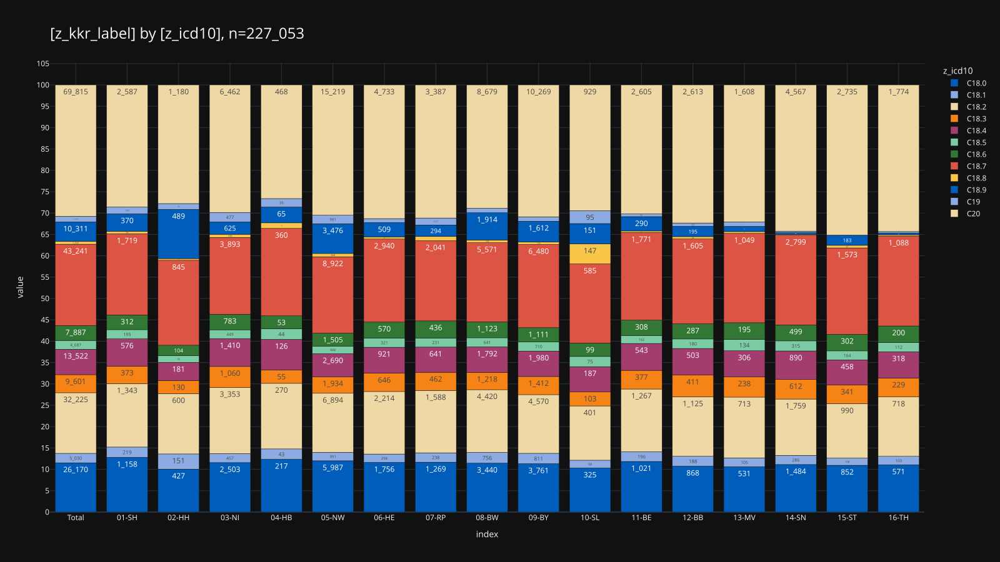
    


    
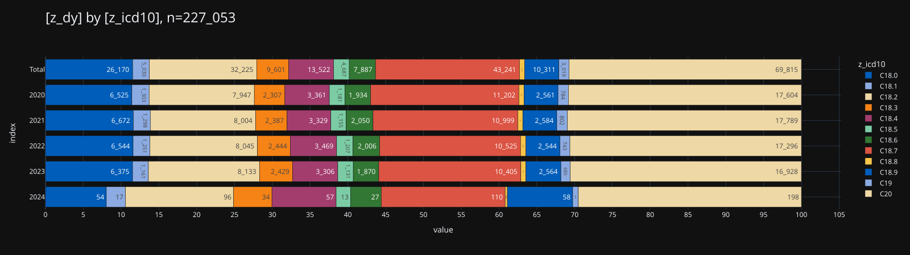
    


## <a id='toc1_4_'></a>[OP](#toc0_)

### <a id='toc1_4_1_'></a>[keine Operation erfolgt bei C18 mit T_p > 0](#toc0_)
> 💡 5% wäre realistisch. patho stadium müsste zwingend vorhanden sein nach OP


<!-- START_TOKEN -->


    counts: all rows (no grouping)
    ---
    n = 3_241_401
    └ [DJ 2020-2024]:  n = 2_998_753
    └ [ICD10 C18-C20]: n = 227_053 (100.0%) ██████████████████████████████
    └ [nur C18]:       n = 154_219  (67.9%) ░░░░░░░░░░████████████████████
    └ [t_p = 1-4]:     n = 119_780  (52.8%) ░░░░░░░░░░░░░░░███████████████


<!-- END_TOKEN -->


<details>
<summary>filter-sql</summary>

```sql
z_dy between 2020 and 2024
and z_icd10_3d in ('C18', 'C19', 'C20')
and z_icd10_3d in ('C18')
and z_t_p_1 in ('1','2','3','4')
```

</details>


<!-- SCALE-60% -->


<style type="text/css">
#T_2beaf th {
  text-align: right;
  font-size: 12pt;
}
#T_2beaf td {
  text-align: right;
  font-size: 11pt;
}
#T_2beaf_row0_col0 {
  font-family: Courier;
  background-color: #4e311f;
  color: #f1f1f1;
}
#T_2beaf_row0_col1 {
  font-family: Courier;
  background-color: #7c4e32;
  color: #f1f1f1;
}
#T_2beaf_row0_col2 {
  font-family: Courier;
  background-color: #855436;
  color: #f1f1f1;
}
#T_2beaf_row0_col3 {
  font-family: Courier;
  background-color: #69422a;
  color: #f1f1f1;
}
#T_2beaf_row0_col4, #T_2beaf_row1_col4, #T_2beaf_row2_col4, #T_2beaf_row3_col4, #T_2beaf_row4_col4, #T_2beaf_row6_col4, #T_2beaf_row7_col4, #T_2beaf_row9_col4, #T_2beaf_row13_col4, #T_2beaf_row15_col4 {
  font-family: Courier;
  background-color: #000000;
  color: #f1f1f1;
}
#T_2beaf_row0_col5, #T_2beaf_row9_col2 {
  font-family: Courier;
  background-color: #6e462c;
  color: #f1f1f1;
}
#T_2beaf_row1_col0 {
  font-family: Courier;
  background-color: #654029;
  color: #f1f1f1;
}
#T_2beaf_row1_col1 {
  font-family: Courier;
  background-color: #674129;
  color: #f1f1f1;
}
#T_2beaf_row1_col2, #T_2beaf_row3_col0 {
  font-family: Courier;
  background-color: #583723;
  color: #f1f1f1;
}
#T_2beaf_row1_col3 {
  font-family: Courier;
  background-color: #5f3c26;
  color: #f1f1f1;
}
#T_2beaf_row1_col5 {
  font-family: Courier;
  background-color: #603d27;
  color: #f1f1f1;
}
#T_2beaf_row2_col0 {
  font-family: Courier;
  background-color: #b9754b;
  color: #f1f1f1;
}
#T_2beaf_row2_col1, #T_2beaf_row6_col5 {
  font-family: Courier;
  background-color: #ad6d46;
  color: #f1f1f1;
}
#T_2beaf_row2_col2, #T_2beaf_row5_col1 {
  font-family: Courier;
  background-color: #c27b4e;
  color: #f1f1f1;
}
#T_2beaf_row2_col3 {
  font-family: Courier;
  background-color: #fda066;
  color: #000000;
}
#T_2beaf_row2_col5 {
  font-family: Courier;
  background-color: #c77e50;
  color: #f1f1f1;
}
#T_2beaf_row3_col1 {
  font-family: Courier;
  background-color: #4a2f1e;
  color: #f1f1f1;
}
#T_2beaf_row3_col2, #T_2beaf_row11_col2 {
  font-family: Courier;
  background-color: #593824;
  color: #f1f1f1;
}
#T_2beaf_row3_col3 {
  font-family: Courier;
  background-color: #73492e;
  color: #f1f1f1;
}
#T_2beaf_row3_col5, #T_2beaf_row12_col3 {
  font-family: Courier;
  background-color: #5b3a25;
  color: #f1f1f1;
}
#T_2beaf_row4_col0 {
  font-family: Courier;
  background-color: #d08354;
  color: #f1f1f1;
}
#T_2beaf_row4_col1 {
  font-family: Courier;
  background-color: #9e6440;
  color: #f1f1f1;
}
#T_2beaf_row4_col2 {
  font-family: Courier;
  background-color: #a26641;
  color: #f1f1f1;
}
#T_2beaf_row4_col3 {
  font-family: Courier;
  background-color: #bf794d;
  color: #f1f1f1;
}
#T_2beaf_row4_col5 {
  font-family: Courier;
  background-color: #b47249;
  color: #f1f1f1;
}
#T_2beaf_row5_col0 {
  font-family: Courier;
  background-color: #a96b44;
  color: #f1f1f1;
}
#T_2beaf_row5_col2 {
  font-family: Courier;
  background-color: #c17a4e;
  color: #f1f1f1;
}
#T_2beaf_row5_col3 {
  font-family: Courier;
  background-color: #c67d50;
  color: #f1f1f1;
}
#T_2beaf_row5_col4 {
  font-family: Courier;
  background-color: #e8935e;
  color: #f1f1f1;
}
#T_2beaf_row5_col5 {
  font-family: Courier;
  background-color: #bd784c;
  color: #f1f1f1;
}
#T_2beaf_row6_col0 {
  font-family: Courier;
  background-color: #945e3c;
  color: #f1f1f1;
}
#T_2beaf_row6_col1, #T_2beaf_row7_col0, #T_2beaf_row16_col3 {
  font-family: Courier;
  background-color: #955f3c;
  color: #f1f1f1;
}
#T_2beaf_row6_col2 {
  font-family: Courier;
  background-color: #bc774c;
  color: #f1f1f1;
}
#T_2beaf_row6_col3 {
  font-family: Courier;
  background-color: #d98958;
  color: #f1f1f1;
}
#T_2beaf_row7_col1, #T_2beaf_row8_col3 {
  font-family: Courier;
  background-color: #8f5b3a;
  color: #f1f1f1;
}
#T_2beaf_row7_col2 {
  font-family: Courier;
  background-color: #b67349;
  color: #f1f1f1;
}
#T_2beaf_row7_col3 {
  font-family: Courier;
  background-color: #a36742;
  color: #f1f1f1;
}
#T_2beaf_row7_col5 {
  font-family: Courier;
  background-color: #9f6540;
  color: #f1f1f1;
}
#T_2beaf_row8_col0 {
  font-family: Courier;
  background-color: #6f462d;
  color: #f1f1f1;
}
#T_2beaf_row8_col1 {
  font-family: Courier;
  background-color: #875536;
  color: #f1f1f1;
}
#T_2beaf_row8_col2 {
  font-family: Courier;
  background-color: #7a4d31;
  color: #f1f1f1;
}
#T_2beaf_row8_col4 {
  font-family: Courier;
  background-color: #ffc77f;
  color: #000000;
}
#T_2beaf_row8_col5, #T_2beaf_row16_col0 {
  font-family: Courier;
  background-color: #825234;
  color: #f1f1f1;
}
#T_2beaf_row9_col0, #T_2beaf_row9_col1, #T_2beaf_row9_col5 {
  font-family: Courier;
  background-color: #805134;
  color: #f1f1f1;
}
#T_2beaf_row9_col3 {
  font-family: Courier;
  background-color: #935d3b;
  color: #f1f1f1;
}
#T_2beaf_row10_col0 {
  font-family: Courier;
  background-color: #392417;
  color: #f1f1f1;
}
#T_2beaf_row10_col1 {
  font-family: Courier;
  background-color: #352215;
  color: #f1f1f1;
}
#T_2beaf_row10_col2, #T_2beaf_row14_col2 {
  font-family: Courier;
  background-color: #432a1b;
  color: #f1f1f1;
}
#T_2beaf_row10_col3 {
  font-family: Courier;
  background-color: #3e2719;
  color: #f1f1f1;
}
#T_2beaf_row10_col4 {
  font-family: Courier;
  background-color: #ffbf7a;
  color: #000000;
}
#T_2beaf_row10_col5 {
  font-family: Courier;
  background-color: #3d2618;
  color: #f1f1f1;
}
#T_2beaf_row11_col0 {
  font-family: Courier;
  background-color: #25170f;
  color: #f1f1f1;
}
#T_2beaf_row11_col1 {
  font-family: Courier;
  background-color: #442b1b;
  color: #f1f1f1;
}
#T_2beaf_row11_col3 {
  font-family: Courier;
  background-color: #41291a;
  color: #f1f1f1;
}
#T_2beaf_row11_col4 {
  font-family: Courier;
  background-color: #68422a;
  color: #f1f1f1;
}
#T_2beaf_row11_col5 {
  font-family: Courier;
  background-color: #40291a;
  color: #f1f1f1;
}
#T_2beaf_row12_col0 {
  font-family: Courier;
  background-color: #070503;
  color: #f1f1f1;
}
#T_2beaf_row12_col1 {
  font-family: Courier;
  background-color: #1b110b;
  color: #f1f1f1;
}
#T_2beaf_row12_col2 {
  font-family: Courier;
  background-color: #2b1b11;
  color: #f1f1f1;
}
#T_2beaf_row12_col4 {
  font-family: Courier;
  background-color: #382316;
  color: #f1f1f1;
}
#T_2beaf_row12_col5 {
  font-family: Courier;
  background-color: #2a1b11;
  color: #f1f1f1;
}
#T_2beaf_row13_col0 {
  font-family: Courier;
  background-color: #0f0906;
  color: #f1f1f1;
}
#T_2beaf_row13_col1, #T_2beaf_row13_col2 {
  font-family: Courier;
  background-color: #0c0805;
  color: #f1f1f1;
}
#T_2beaf_row13_col3, #T_2beaf_row13_col5 {
  font-family: Courier;
  background-color: #0e0905;
  color: #f1f1f1;
}
#T_2beaf_row14_col0, #T_2beaf_row15_col3 {
  font-family: Courier;
  background-color: #1a100a;
  color: #f1f1f1;
}
#T_2beaf_row14_col1 {
  font-family: Courier;
  background-color: #311f14;
  color: #f1f1f1;
}
#T_2beaf_row14_col3, #T_2beaf_row14_col5 {
  font-family: Courier;
  background-color: #301e13;
  color: #f1f1f1;
}
#T_2beaf_row14_col4 {
  font-family: Courier;
  background-color: #533421;
  color: #f1f1f1;
}
#T_2beaf_row15_col0 {
  font-family: Courier;
  background-color: #090503;
  color: #f1f1f1;
}
#T_2beaf_row15_col1 {
  font-family: Courier;
  background-color: #050302;
  color: #f1f1f1;
}
#T_2beaf_row15_col2 {
  font-family: Courier;
  background-color: #060402;
  color: #f1f1f1;
}
#T_2beaf_row15_col5 {
  font-family: Courier;
  background-color: #0b0704;
  color: #f1f1f1;
}
#T_2beaf_row16_col1 {
  font-family: Courier;
  background-color: #7e5033;
  color: #f1f1f1;
}
#T_2beaf_row16_col2, #T_2beaf_row16_col5 {
  font-family: Courier;
  background-color: #885637;
  color: #f1f1f1;
}
#T_2beaf_row16_col4 {
  font-family: Courier;
  background-color: #d28555;
  color: #f1f1f1;
}
</style>
<table id="T_2beaf">
  <thead>
    <tr>
      <th class="index_name level0" >z_dy</th>
      <th id="T_2beaf_level0_col0" class="col_heading level0 col0" >2020</th>
      <th id="T_2beaf_level0_col1" class="col_heading level0 col1" >2021</th>
      <th id="T_2beaf_level0_col2" class="col_heading level0 col2" >2022</th>
      <th id="T_2beaf_level0_col3" class="col_heading level0 col3" >2023</th>
      <th id="T_2beaf_level0_col4" class="col_heading level0 col4" >2024</th>
      <th id="T_2beaf_level0_col5" class="col_heading level0 col5" >Total</th>
    </tr>
    <tr>
      <th class="index_name level0" >z_kkr_label</th>
      <th class="blank col0" >&nbsp;</th>
      <th class="blank col1" >&nbsp;</th>
      <th class="blank col2" >&nbsp;</th>
      <th class="blank col3" >&nbsp;</th>
      <th class="blank col4" >&nbsp;</th>
      <th class="blank col5" >&nbsp;</th>
    </tr>
  </thead>
  <tbody>
    <tr>
      <th id="T_2beaf_level0_row0" class="row_heading level0 row0" >01-SH</th>
      <td id="T_2beaf_row0_col0" class="data row0 col0" >10.7% ⬛</td>
      <td id="T_2beaf_row0_col1" class="data row0 col1" >17.1% ⬛</td>
      <td id="T_2beaf_row0_col2" class="data row0 col2" >18.4% ⬛</td>
      <td id="T_2beaf_row0_col3" class="data row0 col3" >14.5% ⬛</td>
      <td id="T_2beaf_row0_col4" class="data row0 col4" ><span style="color: #888888">0 🟩</span></td>
      <td id="T_2beaf_row0_col5" class="data row0 col5" >15.2% ⬛</td>
    </tr>
    <tr>
      <th id="T_2beaf_level0_row1" class="row_heading level0 row1" >02-HH</th>
      <td id="T_2beaf_row1_col0" class="data row1 col0" >13.9% ⬛</td>
      <td id="T_2beaf_row1_col1" class="data row1 col1" >14.2% ⬛</td>
      <td id="T_2beaf_row1_col2" class="data row1 col2" >12.1% ⬛</td>
      <td id="T_2beaf_row1_col3" class="data row1 col3" >13.1% ⬛</td>
      <td id="T_2beaf_row1_col4" class="data row1 col4" ><span style="color: #888888">0 🟩</span></td>
      <td id="T_2beaf_row1_col5" class="data row1 col5" >13.3% ⬛</td>
    </tr>
    <tr>
      <th id="T_2beaf_level0_row2" class="row_heading level0 row2" >03-NI</th>
      <td id="T_2beaf_row2_col0" class="data row2 col0" >25.5% ⬛</td>
      <td id="T_2beaf_row2_col1" class="data row2 col1" >23.7% ⬛</td>
      <td id="T_2beaf_row2_col2" class="data row2 col2" >26.7% 🟥</td>
      <td id="T_2beaf_row2_col3" class="data row2 col3" >34.8% 🟥</td>
      <td id="T_2beaf_row2_col4" class="data row2 col4" ><span style="color: #888888">0 🟩</span></td>
      <td id="T_2beaf_row2_col5" class="data row2 col5" >27.4% 🟥</td>
    </tr>
    <tr>
      <th id="T_2beaf_level0_row3" class="row_heading level0 row3" >04-HB</th>
      <td id="T_2beaf_row3_col0" class="data row3 col0" >12.1% ⬛</td>
      <td id="T_2beaf_row3_col1" class="data row3 col1" >10.3% ⬛</td>
      <td id="T_2beaf_row3_col2" class="data row3 col2" >12.4% ⬛</td>
      <td id="T_2beaf_row3_col3" class="data row3 col3" >15.9% ⬛</td>
      <td id="T_2beaf_row3_col4" class="data row3 col4" ><span style="color: #888888">0 🟩</span></td>
      <td id="T_2beaf_row3_col5" class="data row3 col5" >12.6% ⬛</td>
    </tr>
    <tr>
      <th id="T_2beaf_level0_row4" class="row_heading level0 row4" >05-NW</th>
      <td id="T_2beaf_row4_col0" class="data row4 col0" >28.6% 🟥</td>
      <td id="T_2beaf_row4_col1" class="data row4 col1" >21.8% ⬛</td>
      <td id="T_2beaf_row4_col2" class="data row4 col2" >22.2% ⬛</td>
      <td id="T_2beaf_row4_col3" class="data row4 col3" >26.3% ⬛</td>
      <td id="T_2beaf_row4_col4" class="data row4 col4" ><span style="color: #888888">0 🟩</span></td>
      <td id="T_2beaf_row4_col5" class="data row4 col5" >24.7% ⬛</td>
    </tr>
    <tr>
      <th id="T_2beaf_level0_row5" class="row_heading level0 row5" >06-HE</th>
      <td id="T_2beaf_row5_col0" class="data row5 col0" >23.3% ⬛</td>
      <td id="T_2beaf_row5_col1" class="data row5 col1" >26.6% 🟥</td>
      <td id="T_2beaf_row5_col2" class="data row5 col2" >26.5% ⬛</td>
      <td id="T_2beaf_row5_col3" class="data row5 col3" >27.2% ⬛</td>
      <td id="T_2beaf_row5_col4" class="data row5 col4" >32.0% ⬛</td>
      <td id="T_2beaf_row5_col5" class="data row5 col5" >26.0% ⬛</td>
    </tr>
    <tr>
      <th id="T_2beaf_level0_row6" class="row_heading level0 row6" >07-RP</th>
      <td id="T_2beaf_row6_col0" class="data row6 col0" >20.4% ⬛</td>
      <td id="T_2beaf_row6_col1" class="data row6 col1" >20.6% ⬛</td>
      <td id="T_2beaf_row6_col2" class="data row6 col2" >25.8% ⬛</td>
      <td id="T_2beaf_row6_col3" class="data row6 col3" >29.9% ⬛</td>
      <td id="T_2beaf_row6_col4" class="data row6 col4" ><span style="color: #888888">0 🟩</span></td>
      <td id="T_2beaf_row6_col5" class="data row6 col5" >23.9% ⬛</td>
    </tr>
    <tr>
      <th id="T_2beaf_level0_row7" class="row_heading level0 row7" >08-BW</th>
      <td id="T_2beaf_row7_col0" class="data row7 col0" >20.5% ⬛</td>
      <td id="T_2beaf_row7_col1" class="data row7 col1" >19.8% ⬛</td>
      <td id="T_2beaf_row7_col2" class="data row7 col2" >25.0% ⬛</td>
      <td id="T_2beaf_row7_col3" class="data row7 col3" >22.4% ⬛</td>
      <td id="T_2beaf_row7_col4" class="data row7 col4" ><span style="color: #888888">0 🟩</span></td>
      <td id="T_2beaf_row7_col5" class="data row7 col5" >21.9% ⬛</td>
    </tr>
    <tr>
      <th id="T_2beaf_level0_row8" class="row_heading level0 row8" >09-BY</th>
      <td id="T_2beaf_row8_col0" class="data row8 col0" >15.4% ⬛</td>
      <td id="T_2beaf_row8_col1" class="data row8 col1" >18.5% ⬛</td>
      <td id="T_2beaf_row8_col2" class="data row8 col2" >16.9% ⬛</td>
      <td id="T_2beaf_row8_col3" class="data row8 col3" >19.8% ⬛</td>
      <td id="T_2beaf_row8_col4" class="data row8 col4" >43.4% 🟥</td>
      <td id="T_2beaf_row8_col5" class="data row8 col5" >17.8% ⬛</td>
    </tr>
    <tr>
      <th id="T_2beaf_level0_row9" class="row_heading level0 row9" >10-SL</th>
      <td id="T_2beaf_row9_col0" class="data row9 col0" >17.7% ⬛</td>
      <td id="T_2beaf_row9_col1" class="data row9 col1" >17.7% ⬛</td>
      <td id="T_2beaf_row9_col2" class="data row9 col2" >15.1% ⬛</td>
      <td id="T_2beaf_row9_col3" class="data row9 col3" >20.2% ⬛</td>
      <td id="T_2beaf_row9_col4" class="data row9 col4" ><span style="color: #888888">0 🟩</span></td>
      <td id="T_2beaf_row9_col5" class="data row9 col5" >17.6% ⬛</td>
    </tr>
    <tr>
      <th id="T_2beaf_level0_row10" class="row_heading level0 row10" >11-BE</th>
      <td id="T_2beaf_row10_col0" class="data row10 col0" >7.9% ⬛</td>
      <td id="T_2beaf_row10_col1" class="data row10 col1" >7.3% ⬛</td>
      <td id="T_2beaf_row10_col2" class="data row10 col2" >9.3% ⬛</td>
      <td id="T_2beaf_row10_col3" class="data row10 col3" >8.6% ⬛</td>
      <td id="T_2beaf_row10_col4" class="data row10 col4" >41.7% ⬛</td>
      <td id="T_2beaf_row10_col5" class="data row10 col5" >8.3% ⬛</td>
    </tr>
    <tr>
      <th id="T_2beaf_level0_row11" class="row_heading level0 row11" >12-BB</th>
      <td id="T_2beaf_row11_col0" class="data row11 col0" >5.2% ⬛</td>
      <td id="T_2beaf_row11_col1" class="data row11 col1" >9.4% ⬛</td>
      <td id="T_2beaf_row11_col2" class="data row11 col2" >12.3% ⬛</td>
      <td id="T_2beaf_row11_col3" class="data row11 col3" >9.0% ⬛</td>
      <td id="T_2beaf_row11_col4" class="data row11 col4" >14.3% ⬛</td>
      <td id="T_2beaf_row11_col5" class="data row11 col5" >8.9% ⬛</td>
    </tr>
    <tr>
      <th id="T_2beaf_level0_row12" class="row_heading level0 row12" >13-MV</th>
      <td id="T_2beaf_row12_col0" class="data row12 col0" >1.1% 🟩</td>
      <td id="T_2beaf_row12_col1" class="data row12 col1" >3.8% ⬛</td>
      <td id="T_2beaf_row12_col2" class="data row12 col2" >6.0% ⬛</td>
      <td id="T_2beaf_row12_col3" class="data row12 col3" >12.7% ⬛</td>
      <td id="T_2beaf_row12_col4" class="data row12 col4" >7.7% ⬛</td>
      <td id="T_2beaf_row12_col5" class="data row12 col5" >5.9% ⬛</td>
    </tr>
    <tr>
      <th id="T_2beaf_level0_row13" class="row_heading level0 row13" >14-SN</th>
      <td id="T_2beaf_row13_col0" class="data row13 col0" >2.1% ⬛</td>
      <td id="T_2beaf_row13_col1" class="data row13 col1" >1.8% ⬛</td>
      <td id="T_2beaf_row13_col2" class="data row13 col2" >1.8% ⬛</td>
      <td id="T_2beaf_row13_col3" class="data row13 col3" >2.0% 🟩</td>
      <td id="T_2beaf_row13_col4" class="data row13 col4" ><span style="color: #888888">0 🟩</span></td>
      <td id="T_2beaf_row13_col5" class="data row13 col5" >1.9% ⬛</td>
    </tr>
    <tr>
      <th id="T_2beaf_level0_row14" class="row_heading level0 row14" >15-ST</th>
      <td id="T_2beaf_row14_col0" class="data row14 col0" >3.7% ⬛</td>
      <td id="T_2beaf_row14_col1" class="data row14 col1" >6.9% ⬛</td>
      <td id="T_2beaf_row14_col2" class="data row14 col2" >9.3% ⬛</td>
      <td id="T_2beaf_row14_col3" class="data row14 col3" >6.8% ⬛</td>
      <td id="T_2beaf_row14_col4" class="data row14 col4" >11.4% ⬛</td>
      <td id="T_2beaf_row14_col5" class="data row14 col5" >6.6% ⬛</td>
    </tr>
    <tr>
      <th id="T_2beaf_level0_row15" class="row_heading level0 row15" >16-TH</th>
      <td id="T_2beaf_row15_col0" class="data row15 col0" >1.3% ⬛</td>
      <td id="T_2beaf_row15_col1" class="data row15 col1" >0.8% 🟩</td>
      <td id="T_2beaf_row15_col2" class="data row15 col2" >0.9% 🟩</td>
      <td id="T_2beaf_row15_col3" class="data row15 col3" >3.6% ⬛</td>
      <td id="T_2beaf_row15_col4" class="data row15 col4" ><span style="color: #888888">0 🟩</span></td>
      <td id="T_2beaf_row15_col5" class="data row15 col5" >1.6% 🟩</td>
    </tr>
    <tr>
      <th id="T_2beaf_level0_row16" class="row_heading level0 row16" >Total</th>
      <td id="T_2beaf_row16_col0" class="data row16 col0" >17.8% ⬛</td>
      <td id="T_2beaf_row16_col1" class="data row16 col1" >17.4% ⬛</td>
      <td id="T_2beaf_row16_col2" class="data row16 col2" >18.8% ⬛</td>
      <td id="T_2beaf_row16_col3" class="data row16 col3" >20.6% ⬛</td>
      <td id="T_2beaf_row16_col4" class="data row16 col4" >28.9% ⬛</td>
      <td id="T_2beaf_row16_col5" class="data row16 col5" >18.7% ⬛</td>
    </tr>
  </tbody>
</table>


### <a id='toc1_4_2_'></a>[Stratifizierung für keine OP erfolgt](#toc0_)
- `categ_treat`
  - `1-op` - OP dokumentiert
  - `2-noop-sy-st` - keine OP dokumentiert, aber ST oder SYST
  - `3-noop-nosy-nost` - keine Behandlung dokumentiert


<!-- START_TOKEN -->


    counts: all rows (no grouping)
    ---
    n = 3_241_401
    └ [DJ 2020-2024]:  n = 2_998_753
    └ [ICD10 C18-C20]: n = 227_053 (100.0%) ██████████████████████████████
    └ [nur C18]:       n = 154_219  (67.9%) ░░░░░░░░░░████████████████████
    └ [t_p = 1-4]:     n = 119_780  (52.8%) ░░░░░░░░░░░░░░░███████████████


<!-- END_TOKEN -->


<details>
<summary>filter-sql</summary>

```sql
z_dy between 2020 and 2024
and z_icd10_3d in ('C18', 'C19', 'C20')
and z_icd10_3d in ('C18')
and z_t_p_1 in ('1','2','3','4')
```

</details>


    
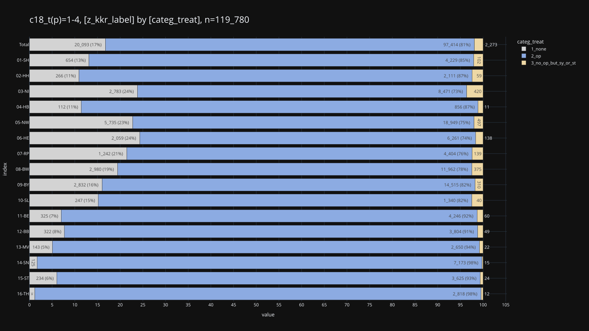
    


## <a id='toc1_5_'></a>[OPS](#toc0_)


### <a id='toc1_5_1_'></a>[OPS 5-4xx nach Diagnose](#toc0_)
- gezählt sind OPS Angaben, nicht Tumore

<br>

#### <a id='toc1_5_1_1_'></a>[C18](#toc0_)


<!-- START_TOKEN -->


    counts: distinct OPSId
    ---


    n = 3_147_760                    (100.0%) ██████████████████████████████
    └ [DJ 2020-2024]:  n = 3_094_975  (98.3%) ░█████████████████████████████


    └ [ICD10 C18-C20]:   n = 390_274  (12.4%) ░░░░░░░░░░░░░░░░░░░░░░░░░░░███
    └ [nur C18]:         n = 253_295   (8.0%) ░░░░░░░░░░░░░░░░░░░░░░░░░░░░██
    └ [OPS 5-4]:         n = 172_498   (5.5%) ░░░░░░░░░░░░░░░░░░░░░░░░░░░░░█


<!-- END_TOKEN -->


<details>
<summary>filter-sql</summary>

```sql
z_dy between 2020 and 2024
and z_icd10_3d in ('C18', 'C19', 'C20')
and z_icd10_3d in ('C18')
and left(Code,3) in ('5-4')
```

</details>


    Anzahl verschiedene ops_codes:  14492
    ┌─────────────────────────────────────────────────────────────────────────────────────────────────────────────────────────────────────┬─────────┐
    │                                                                 ops                                                                 │ cnt_ops │
    │                                                               varchar                                                               │  int32  │
    ├─────────────────────────────────────────────────────────────────────────────────────────────────────────────────────────────────────┼─────────┤
    │ 5-455.41 - Partielle Resektion des Dickdarmes: Resektion des Colon ascendens mit Coecum und rechter Flexur [Hemikolektomie rechts]… │   24976 │
    │ 5-455.45 - Partielle Resektion des Dickdarmes: Resektion des Colon ascendens mit Coecum und rechter Flexur [Hemikolektomie rechts]… │   15845 │
    │ 5-469.20 - Andere Operationen am Darm: Adhäsiolyse: Offen chirurgisch                                                               │    8361 │
    │ 5-455.75 - Partielle Resektion des Dickdarmes: Sigmaresektion: Laparoskopisch mit Anastomose                                        │    7660 │
    │ 5-406.9 - Regionale Lymphadenektomie (Ausräumung mehrerer Lymphknoten einer Region) im Rahmen einer anderen Operation: Mesenterial  │    6113 │
    │ 5-469.21 - Andere Operationen am Darm: Adhäsiolyse: Laparoskopisch                                                                  │    4267 │
    │ 5-484.35 - Rektumresektion unter Sphinktererhaltung: Anteriore Resektion: Laparoskopisch mit Anastomose                             │    3733 │
    │ 5-455.71 - Partielle Resektion des Dickdarmes: Sigmaresektion: Offen chirurgisch mit Anastomose                                     │    3662 │
    │ 5-455.61 - Partielle Resektion des Dickdarmes: Resektion des Colon descendens mit linker Flexur [Hemikolektomie links]: Offen chir… │    3403 │
    │ 5-455.65 - Partielle Resektion des Dickdarmes: Resektion des Colon descendens mit linker Flexur [Hemikolektomie links]: Laparoskop… │    3137 │
    └─────────────────────────────────────────────────────────────────────────────────────────────────────────────────────────────────────┴─────────┘
      10 rows                                                                                                                             2 columns
    


    
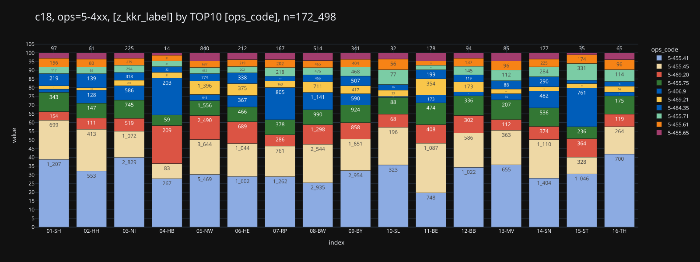
    


    
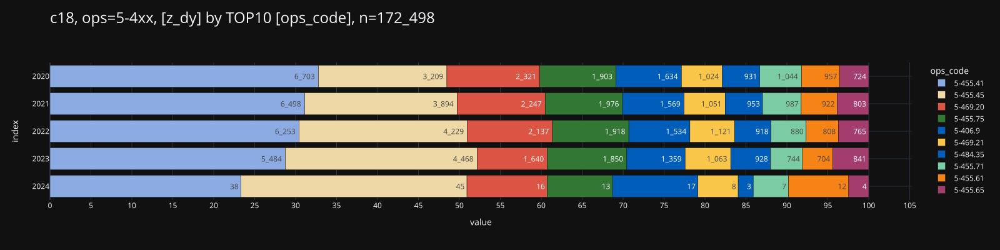
    


#### <a id='toc1_5_1_2_'></a>[C20](#toc0_)


<!-- START_TOKEN -->


    counts: distinct OPSId
    ---
    n = 3_147_760                    (100.0%) ██████████████████████████████


    └ [DJ 2020-2024]:  n = 3_094_975  (98.3%) ░█████████████████████████████
    └ [ICD10 C18-C20]:   n = 390_274  (12.4%) ░░░░░░░░░░░░░░░░░░░░░░░░░░░███
    └ [ICD10 C20]:       n = 133_352   (4.2%) ░░░░░░░░░░░░░░░░░░░░░░░░░░░░░█
    └ [OPS 5-4]:          n = 88_029   (2.8%) ░░░░░░░░░░░░░░░░░░░░░░░░░░░░░░


<!-- END_TOKEN -->


<details>
<summary>filter-sql</summary>

```sql
z_dy between 2020 and 2024
and z_icd10_3d in ('C18', 'C19', 'C20')
and z_icd10_3d in ('C20')
and left(Code,3) in ('5-4')
```

</details>


    Anzahl verschiedene ops_codes:  10645
    ┌─────────────────────────────────────────────────────────────────────────────────────────────────────────────────────────────────────┬─────────┐
    │                                                                 ops                                                                 │ cnt_ops │
    │                                                               varchar                                                               │  int32  │
    ├─────────────────────────────────────────────────────────────────────────────────────────────────────────────────────────────────────┼─────────┤
    │ 5-484.55 - Rektumresektion unter Sphinktererhaltung: Tiefe anteriore Resektion: Laparoskopisch mit Anastomose                       │    9580 │
    │ 5-462.1 - Anlegen eines Enterostomas (als protektive Maßnahme) im Rahmen eines anderen Eingriffs: Ileostoma                         │    9505 │
    │ 5-484.35 - Rektumresektion unter Sphinktererhaltung: Anteriore Resektion: Laparoskopisch mit Anastomose                             │    4329 │
    │ 5-485.02 - Rektumresektion ohne Sphinktererhaltung: Abdominoperineal: Kombiniert offen chirurgisch-laparoskopisch                   │    3475 │
    │ 5-484.51 - Rektumresektion unter Sphinktererhaltung: Tiefe anteriore Resektion: Offen chirurgisch mit Anastomose                    │    2942 │
    │ 5-465.1 - Rückverlagerung eines doppelläufigen Enterostomas: Ileostoma                                                              │    2702 │
    │ 5-469.21 - Andere Operationen am Darm: Adhäsiolyse: Laparoskopisch                                                                  │    2429 │
    │ 5-469.20 - Andere Operationen am Darm: Adhäsiolyse: Offen chirurgisch                                                               │    2427 │
    │ 5-484.65 - Rektumresektion unter Sphinktererhaltung: Tiefe anteriore Resektion mit peranaler Anastomose: Laparoskopisch mit Anasto… │    2200 │
    │ 5-406.9 - Regionale Lymphadenektomie (Ausräumung mehrerer Lymphknoten einer Region) im Rahmen einer anderen Operation: Mesenterial  │    1982 │
    └─────────────────────────────────────────────────────────────────────────────────────────────────────────────────────────────────────┴─────────┘
      10 rows                                                                                                                             2 columns
    


    
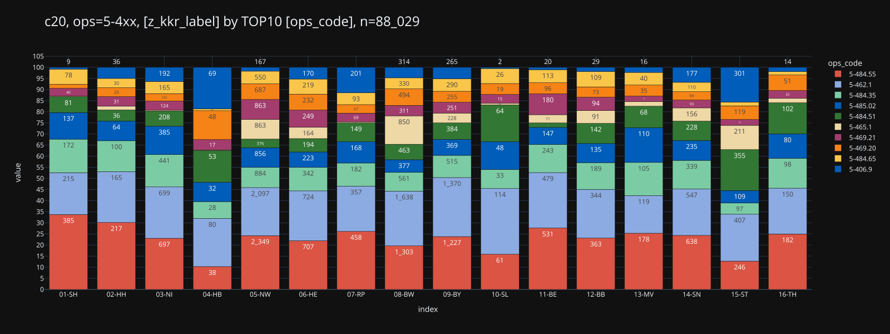
    


    
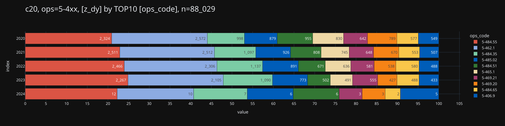
    


### <a id='toc1_5_2_'></a>[Vergleich laparoskopisch vs offen](#toc0_)
- gezählt sind Tumore
- im Filter: 
  - `C18.0-3`
  - nur Tumore, denen entweder `5-455.41` oder `5-455.45` zugeordnet ist (ℹ️ kein Tumor hat beide OPS)
- Metrik: Anteil Tumore mit `5-455.41` (offen) an allen Tumoren im Filter


<!-- START_TOKEN -->


    counts: distinct z_tum_id
    ---
    n = 3_241_401                    (100.0%) ██████████████████████████████


    └ [DJ 2020-2024]:  n = 2_998_753  (92.5%) ░░░███████████████████████████
    └ [ICD10 C18-C20]:   n = 227_053   (7.0%) ░░░░░░░░░░░░░░░░░░░░░░░░░░░░██
    └ [ICD C18.0-3]:      n = 73_026   (2.3%) ░░░░░░░░░░░░░░░░░░░░░░░░░░░░░░
    └ [ops=5-455.4xx]:    n = 37_479   (1.2%) ░░░░░░░░░░░░░░░░░░░░░░░░░░░░░░


<!-- END_TOKEN -->


<details>
<summary>filter-sql</summary>

```sql
z_dy between 2020 and 2024
and z_icd10_3d in ('C18', 'C19', 'C20')
and z_icd10 in ('C18.0','C18.1','C18.2','C18.3')
and Code in ('5-455.41', '5-455.45')
```

</details>


<!-- SCALE-80% -->


<style type="text/css">
#T_5a8c9 th {
  text-align: right;
  font-size: 12pt;
}
#T_5a8c9 td {
  text-align: right;
  font-size: 11pt;
}
#T_5a8c9_row0_col0 {
  width: 10em;
  background: linear-gradient(90deg, #444444 79.7%, transparent 79.7%);
  font-family: Courier;
}
#T_5a8c9_row0_col1, #T_5a8c9_row9_col3 {
  width: 10em;
  background: linear-gradient(90deg, #444444 73.0%, transparent 73.0%);
  font-family: Courier;
}
#T_5a8c9_row0_col2 {
  width: 10em;
  background: linear-gradient(90deg, #444444 75.4%, transparent 75.4%);
  font-family: Courier;
}
#T_5a8c9_row0_col3 {
  width: 10em;
  background: linear-gradient(90deg, #444444 73.3%, transparent 73.3%);
  font-family: Courier;
}
#T_5a8c9_row0_col4, #T_5a8c9_row1_col4, #T_5a8c9_row2_col4, #T_5a8c9_row3_col4, #T_5a8c9_row4_col4, #T_5a8c9_row6_col4, #T_5a8c9_row7_col4, #T_5a8c9_row9_col4, #T_5a8c9_row10_col4, #T_5a8c9_row13_col4, #T_5a8c9_row15_col4 {
  width: 10em;
  font-family: Courier;
}
#T_5a8c9_row0_col5 {
  width: 10em;
  background: linear-gradient(90deg, #444444 75.3%, transparent 75.3%);
  font-family: Courier;
}
#T_5a8c9_row1_col0 {
  width: 10em;
  background: linear-gradient(90deg, #444444 80.1%, transparent 80.1%);
  font-family: Courier;
}
#T_5a8c9_row1_col1 {
  width: 10em;
  background: linear-gradient(90deg, #444444 73.2%, transparent 73.2%);
  font-family: Courier;
}
#T_5a8c9_row1_col2 {
  width: 10em;
  background: linear-gradient(90deg, #444444 57.7%, transparent 57.7%);
  font-family: Courier;
}
#T_5a8c9_row1_col3 {
  width: 10em;
  background: linear-gradient(90deg, #444444 61.3%, transparent 61.3%);
  font-family: Courier;
}
#T_5a8c9_row1_col5 {
  width: 10em;
  background: linear-gradient(90deg, #444444 67.5%, transparent 67.5%);
  font-family: Courier;
}
#T_5a8c9_row2_col0, #T_5a8c9_row3_col5 {
  width: 10em;
  background: linear-gradient(90deg, #444444 92.1%, transparent 92.1%);
  font-family: Courier;
}
#T_5a8c9_row2_col1 {
  width: 10em;
  background: linear-gradient(90deg, #444444 87.9%, transparent 87.9%);
  font-family: Courier;
}
#T_5a8c9_row2_col2 {
  width: 10em;
  background: linear-gradient(90deg, #444444 84.5%, transparent 84.5%);
  font-family: Courier;
}
#T_5a8c9_row2_col3, #T_5a8c9_row16_col0 {
  width: 10em;
  background: linear-gradient(90deg, #444444 80.7%, transparent 80.7%);
  font-family: Courier;
}
#T_5a8c9_row2_col5 {
  width: 10em;
  background: linear-gradient(90deg, #444444 86.7%, transparent 86.7%);
  font-family: Courier;
}
#T_5a8c9_row3_col0 {
  width: 10em;
  background: linear-gradient(90deg, #444444 100.0%, transparent 100.0%);
  font-family: Courier;
}
#T_5a8c9_row3_col1 {
  width: 10em;
  background: linear-gradient(90deg, #444444 82.4%, transparent 82.4%);
  font-family: Courier;
}
#T_5a8c9_row3_col2 {
  width: 10em;
  background: linear-gradient(90deg, #444444 93.0%, transparent 93.0%);
  font-family: Courier;
}
#T_5a8c9_row3_col3 {
  width: 10em;
  background: linear-gradient(90deg, #444444 92.2%, transparent 92.2%);
  font-family: Courier;
}
#T_5a8c9_row4_col0 {
  width: 10em;
  background: linear-gradient(90deg, #444444 77.6%, transparent 77.6%);
  font-family: Courier;
}
#T_5a8c9_row4_col1 {
  width: 10em;
  background: linear-gradient(90deg, #444444 73.9%, transparent 73.9%);
  font-family: Courier;
}
#T_5a8c9_row4_col2 {
  width: 10em;
  background: linear-gradient(90deg, #444444 70.2%, transparent 70.2%);
  font-family: Courier;
}
#T_5a8c9_row4_col3 {
  width: 10em;
  background: linear-gradient(90deg, #444444 64.6%, transparent 64.6%);
  font-family: Courier;
}
#T_5a8c9_row4_col5 {
  width: 10em;
  background: linear-gradient(90deg, #444444 71.5%, transparent 71.5%);
  font-family: Courier;
}
#T_5a8c9_row5_col0 {
  width: 10em;
  background: linear-gradient(90deg, #444444 81.7%, transparent 81.7%);
  font-family: Courier;
}
#T_5a8c9_row5_col1, #T_5a8c9_row8_col2 {
  width: 10em;
  background: linear-gradient(90deg, #444444 73.4%, transparent 73.4%);
  font-family: Courier;
}
#T_5a8c9_row5_col2 {
  width: 10em;
  background: linear-gradient(90deg, #444444 70.3%, transparent 70.3%);
  font-family: Courier;
}
#T_5a8c9_row5_col3, #T_5a8c9_row13_col2 {
  width: 10em;
  background: linear-gradient(90deg, #444444 65.3%, transparent 65.3%);
  font-family: Courier;
}
#T_5a8c9_row5_col4 {
  width: 10em;
  background: linear-gradient(90deg, #444444 47.3%, transparent 47.3%);
  font-family: Courier;
}
#T_5a8c9_row5_col5 {
  width: 10em;
  background: linear-gradient(90deg, #444444 72.3%, transparent 72.3%);
  font-family: Courier;
}
#T_5a8c9_row6_col0 {
  width: 10em;
  background: linear-gradient(90deg, #444444 86.8%, transparent 86.8%);
  font-family: Courier;
}
#T_5a8c9_row6_col1, #T_5a8c9_row6_col3 {
  width: 10em;
  background: linear-gradient(90deg, #444444 68.4%, transparent 68.4%);
  font-family: Courier;
}
#T_5a8c9_row6_col2 {
  width: 10em;
  background: linear-gradient(90deg, #444444 71.8%, transparent 71.8%);
  font-family: Courier;
}
#T_5a8c9_row6_col5 {
  width: 10em;
  background: linear-gradient(90deg, #444444 74.4%, transparent 74.4%);
  font-family: Courier;
}
#T_5a8c9_row7_col0 {
  width: 10em;
  background: linear-gradient(90deg, #444444 69.5%, transparent 69.5%);
  font-family: Courier;
}
#T_5a8c9_row7_col1 {
  width: 10em;
  background: linear-gradient(90deg, #444444 65.6%, transparent 65.6%);
  font-family: Courier;
}
#T_5a8c9_row7_col2 {
  width: 10em;
  background: linear-gradient(90deg, #444444 62.9%, transparent 62.9%);
  font-family: Courier;
}
#T_5a8c9_row7_col3 {
  width: 10em;
  background: linear-gradient(90deg, #444444 55.3%, transparent 55.3%);
  font-family: Courier;
}
#T_5a8c9_row7_col5 {
  width: 10em;
  background: linear-gradient(90deg, #444444 63.5%, transparent 63.5%);
  font-family: Courier;
}
#T_5a8c9_row8_col0 {
  width: 10em;
  background: linear-gradient(90deg, #444444 87.3%, transparent 87.3%);
  font-family: Courier;
}
#T_5a8c9_row8_col1 {
  width: 10em;
  background: linear-gradient(90deg, #444444 81.0%, transparent 81.0%);
  font-family: Courier;
}
#T_5a8c9_row8_col3 {
  width: 10em;
  background: linear-gradient(90deg, #444444 68.2%, transparent 68.2%);
  font-family: Courier;
}
#T_5a8c9_row8_col4 {
  width: 10em;
  background: linear-gradient(90deg, #444444 49.4%, transparent 49.4%);
  font-family: Courier;
}
#T_5a8c9_row8_col5 {
  width: 10em;
  background: linear-gradient(90deg, #444444 76.7%, transparent 76.7%);
  font-family: Courier;
}
#T_5a8c9_row9_col0 {
  width: 10em;
  background: linear-gradient(90deg, #444444 81.9%, transparent 81.9%);
  font-family: Courier;
}
#T_5a8c9_row9_col1 {
  width: 10em;
  background: linear-gradient(90deg, #444444 85.8%, transparent 85.8%);
  font-family: Courier;
}
#T_5a8c9_row9_col2 {
  width: 10em;
  background: linear-gradient(90deg, #444444 55.0%, transparent 55.0%);
  font-family: Courier;
}
#T_5a8c9_row9_col5 {
  width: 10em;
  background: linear-gradient(90deg, #444444 74.6%, transparent 74.6%);
  font-family: Courier;
}
#T_5a8c9_row10_col0 {
  width: 10em;
  background: linear-gradient(90deg, #444444 51.7%, transparent 51.7%);
  font-family: Courier;
}
#T_5a8c9_row10_col1 {
  width: 10em;
  background: linear-gradient(90deg, #444444 49.9%, transparent 49.9%);
  font-family: Courier;
}
#T_5a8c9_row10_col2 {
  width: 10em;
  background: linear-gradient(90deg, #444444 48.2%, transparent 48.2%);
  font-family: Courier;
}
#T_5a8c9_row10_col3 {
  width: 10em;
  background: linear-gradient(90deg, #444444 41.0%, transparent 41.0%);
  font-family: Courier;
}
#T_5a8c9_row10_col5 {
  width: 10em;
  background: linear-gradient(90deg, #444444 47.9%, transparent 47.9%);
  font-family: Courier;
}
#T_5a8c9_row11_col0 {
  width: 10em;
  background: linear-gradient(90deg, #444444 87.4%, transparent 87.4%);
  font-family: Courier;
}
#T_5a8c9_row11_col1 {
  width: 10em;
  background: linear-gradient(90deg, #444444 77.2%, transparent 77.2%);
  font-family: Courier;
}
#T_5a8c9_row11_col2 {
  width: 10em;
  background: linear-gradient(90deg, #444444 76.0%, transparent 76.0%);
  font-family: Courier;
}
#T_5a8c9_row11_col3 {
  width: 10em;
  background: linear-gradient(90deg, #444444 61.2%, transparent 61.2%);
  font-family: Courier;
}
#T_5a8c9_row11_col4 {
  width: 10em;
  background: linear-gradient(90deg, #444444 69.0%, transparent 69.0%);
  font-family: Courier;
}
#T_5a8c9_row11_col5 {
  width: 10em;
  background: linear-gradient(90deg, #444444 75.9%, transparent 75.9%);
  font-family: Courier;
}
#T_5a8c9_row12_col0 {
  width: 10em;
  background: linear-gradient(90deg, #444444 90.2%, transparent 90.2%);
  font-family: Courier;
}
#T_5a8c9_row12_col1 {
  width: 10em;
  background: linear-gradient(90deg, #444444 84.0%, transparent 84.0%);
  font-family: Courier;
}
#T_5a8c9_row12_col2 {
  width: 10em;
  background: linear-gradient(90deg, #444444 64.9%, transparent 64.9%);
  font-family: Courier;
}
#T_5a8c9_row12_col3 {
  width: 10em;
  background: linear-gradient(90deg, #444444 68.0%, transparent 68.0%);
  font-family: Courier;
}
#T_5a8c9_row12_col4, #T_5a8c9_row14_col4 {
  width: 10em;
  background: linear-gradient(90deg, #444444 60.4%, transparent 60.4%);
  font-family: Courier;
}
#T_5a8c9_row12_col5 {
  width: 10em;
  background: linear-gradient(90deg, #444444 76.5%, transparent 76.5%);
  font-family: Courier;
}
#T_5a8c9_row13_col0 {
  width: 10em;
  background: linear-gradient(90deg, #444444 78.9%, transparent 78.9%);
  font-family: Courier;
}
#T_5a8c9_row13_col1 {
  width: 10em;
  background: linear-gradient(90deg, #444444 64.0%, transparent 64.0%);
  font-family: Courier;
}
#T_5a8c9_row13_col3 {
  width: 10em;
  background: linear-gradient(90deg, #444444 59.3%, transparent 59.3%);
  font-family: Courier;
}
#T_5a8c9_row13_col5 {
  width: 10em;
  background: linear-gradient(90deg, #444444 66.4%, transparent 66.4%);
  font-family: Courier;
}
#T_5a8c9_row14_col0 {
  width: 10em;
  background: linear-gradient(90deg, #444444 99.6%, transparent 99.6%);
  font-family: Courier;
}
#T_5a8c9_row14_col1 {
  width: 10em;
  background: linear-gradient(90deg, #444444 95.2%, transparent 95.2%);
  font-family: Courier;
}
#T_5a8c9_row14_col2 {
  width: 10em;
  background: linear-gradient(90deg, #444444 90.6%, transparent 90.6%);
  font-family: Courier;
}
#T_5a8c9_row14_col3 {
  width: 10em;
  background: linear-gradient(90deg, #444444 80.6%, transparent 80.6%);
  font-family: Courier;
}
#T_5a8c9_row14_col5 {
  width: 10em;
  background: linear-gradient(90deg, #444444 91.0%, transparent 91.0%);
  font-family: Courier;
}
#T_5a8c9_row15_col0 {
  width: 10em;
  background: linear-gradient(90deg, #444444 91.2%, transparent 91.2%);
  font-family: Courier;
}
#T_5a8c9_row15_col1 {
  width: 10em;
  background: linear-gradient(90deg, #444444 90.0%, transparent 90.0%);
  font-family: Courier;
}
#T_5a8c9_row15_col2 {
  width: 10em;
  background: linear-gradient(90deg, #444444 83.7%, transparent 83.7%);
  font-family: Courier;
}
#T_5a8c9_row15_col3 {
  width: 10em;
  background: linear-gradient(90deg, #444444 83.1%, transparent 83.1%);
  font-family: Courier;
}
#T_5a8c9_row15_col5 {
  width: 10em;
  background: linear-gradient(90deg, #444444 86.9%, transparent 86.9%);
  font-family: Courier;
}
#T_5a8c9_row16_col1 {
  width: 10em;
  background: linear-gradient(90deg, #444444 74.5%, transparent 74.5%);
  font-family: Courier;
}
#T_5a8c9_row16_col2 {
  width: 10em;
  background: linear-gradient(90deg, #444444 71.0%, transparent 71.0%);
  font-family: Courier;
}
#T_5a8c9_row16_col3 {
  width: 10em;
  background: linear-gradient(90deg, #444444 65.7%, transparent 65.7%);
  font-family: Courier;
}
#T_5a8c9_row16_col4 {
  width: 10em;
  background: linear-gradient(90deg, #444444 52.4%, transparent 52.4%);
  font-family: Courier;
}
#T_5a8c9_row16_col5 {
  width: 10em;
  background: linear-gradient(90deg, #444444 72.9%, transparent 72.9%);
  font-family: Courier;
}
</style>
<table id="T_5a8c9">
  <thead>
    <tr>
      <th class="index_name level0" >z_dy</th>
      <th id="T_5a8c9_level0_col0" class="col_heading level0 col0" >2020</th>
      <th id="T_5a8c9_level0_col1" class="col_heading level0 col1" >2021</th>
      <th id="T_5a8c9_level0_col2" class="col_heading level0 col2" >2022</th>
      <th id="T_5a8c9_level0_col3" class="col_heading level0 col3" >2023</th>
      <th id="T_5a8c9_level0_col4" class="col_heading level0 col4" >2024</th>
      <th id="T_5a8c9_level0_col5" class="col_heading level0 col5" >Total</th>
    </tr>
    <tr>
      <th class="index_name level0" >z_kkr_label</th>
      <th class="blank col0" >&nbsp;</th>
      <th class="blank col1" >&nbsp;</th>
      <th class="blank col2" >&nbsp;</th>
      <th class="blank col3" >&nbsp;</th>
      <th class="blank col4" >&nbsp;</th>
      <th class="blank col5" >&nbsp;</th>
    </tr>
  </thead>
  <tbody>
    <tr>
      <th id="T_5a8c9_level0_row0" class="row_heading level0 row0" >01-SH</th>
      <td id="T_5a8c9_row0_col0" class="data row0 col0" >66.0% ⬛</td>
      <td id="T_5a8c9_row0_col1" class="data row0 col1" >60.5% ⬛</td>
      <td id="T_5a8c9_row0_col2" class="data row0 col2" >62.4% ⬛</td>
      <td id="T_5a8c9_row0_col3" class="data row0 col3" >60.7% ⬛</td>
      <td id="T_5a8c9_row0_col4" class="data row0 col4" ><span style="color: #888888">0 🟩</span></td>
      <td id="T_5a8c9_row0_col5" class="data row0 col5" >62.3% ⬛</td>
    </tr>
    <tr>
      <th id="T_5a8c9_level0_row1" class="row_heading level0 row1" >02-HH</th>
      <td id="T_5a8c9_row1_col0" class="data row1 col0" >66.3% ⬛</td>
      <td id="T_5a8c9_row1_col1" class="data row1 col1" >60.6% ⬛</td>
      <td id="T_5a8c9_row1_col2" class="data row1 col2" >47.7% ⬛</td>
      <td id="T_5a8c9_row1_col3" class="data row1 col3" >50.7% ⬛</td>
      <td id="T_5a8c9_row1_col4" class="data row1 col4" ><span style="color: #888888">0 🟩</span></td>
      <td id="T_5a8c9_row1_col5" class="data row1 col5" >55.9% ⬛</td>
    </tr>
    <tr>
      <th id="T_5a8c9_level0_row2" class="row_heading level0 row2" >03-NI</th>
      <td id="T_5a8c9_row2_col0" class="data row2 col0" >76.3% ⬛</td>
      <td id="T_5a8c9_row2_col1" class="data row2 col1" >72.8% ⬛</td>
      <td id="T_5a8c9_row2_col2" class="data row2 col2" >70.0% ⬛</td>
      <td id="T_5a8c9_row2_col3" class="data row2 col3" >66.8% ⬛</td>
      <td id="T_5a8c9_row2_col4" class="data row2 col4" ><span style="color: #888888">0 🟩</span></td>
      <td id="T_5a8c9_row2_col5" class="data row2 col5" >71.8% ⬛</td>
    </tr>
    <tr>
      <th id="T_5a8c9_level0_row3" class="row_heading level0 row3" >04-HB</th>
      <td id="T_5a8c9_row3_col0" class="data row3 col0" >82.8% 🟥</td>
      <td id="T_5a8c9_row3_col1" class="data row3 col1" >68.2% ⬛</td>
      <td id="T_5a8c9_row3_col2" class="data row3 col2" >77.0% 🟥</td>
      <td id="T_5a8c9_row3_col3" class="data row3 col3" >76.3% 🟥</td>
      <td id="T_5a8c9_row3_col4" class="data row3 col4" ><span style="color: #888888">0 🟩</span></td>
      <td id="T_5a8c9_row3_col5" class="data row3 col5" >76.2% 🟥</td>
    </tr>
    <tr>
      <th id="T_5a8c9_level0_row4" class="row_heading level0 row4" >05-NW</th>
      <td id="T_5a8c9_row4_col0" class="data row4 col0" >64.2% ⬛</td>
      <td id="T_5a8c9_row4_col1" class="data row4 col1" >61.2% ⬛</td>
      <td id="T_5a8c9_row4_col2" class="data row4 col2" >58.1% ⬛</td>
      <td id="T_5a8c9_row4_col3" class="data row4 col3" >53.4% ⬛</td>
      <td id="T_5a8c9_row4_col4" class="data row4 col4" ><span style="color: #888888">0 🟩</span></td>
      <td id="T_5a8c9_row4_col5" class="data row4 col5" >59.2% ⬛</td>
    </tr>
    <tr>
      <th id="T_5a8c9_level0_row5" class="row_heading level0 row5" >06-HE</th>
      <td id="T_5a8c9_row5_col0" class="data row5 col0" >67.6% ⬛</td>
      <td id="T_5a8c9_row5_col1" class="data row5 col1" >60.8% ⬛</td>
      <td id="T_5a8c9_row5_col2" class="data row5 col2" >58.2% ⬛</td>
      <td id="T_5a8c9_row5_col3" class="data row5 col3" >54.0% ⬛</td>
      <td id="T_5a8c9_row5_col4" class="data row5 col4" >39.1% ⬛</td>
      <td id="T_5a8c9_row5_col5" class="data row5 col5" >59.9% ⬛</td>
    </tr>
    <tr>
      <th id="T_5a8c9_level0_row6" class="row_heading level0 row6" >07-RP</th>
      <td id="T_5a8c9_row6_col0" class="data row6 col0" >71.9% ⬛</td>
      <td id="T_5a8c9_row6_col1" class="data row6 col1" >56.6% ⬛</td>
      <td id="T_5a8c9_row6_col2" class="data row6 col2" >59.5% ⬛</td>
      <td id="T_5a8c9_row6_col3" class="data row6 col3" >56.6% ⬛</td>
      <td id="T_5a8c9_row6_col4" class="data row6 col4" ><span style="color: #888888">0 🟩</span></td>
      <td id="T_5a8c9_row6_col5" class="data row6 col5" >61.6% ⬛</td>
    </tr>
    <tr>
      <th id="T_5a8c9_level0_row7" class="row_heading level0 row7" >08-BW</th>
      <td id="T_5a8c9_row7_col0" class="data row7 col0" >57.5% ⬛</td>
      <td id="T_5a8c9_row7_col1" class="data row7 col1" >54.3% ⬛</td>
      <td id="T_5a8c9_row7_col2" class="data row7 col2" >52.1% ⬛</td>
      <td id="T_5a8c9_row7_col3" class="data row7 col3" >45.8% ⬛</td>
      <td id="T_5a8c9_row7_col4" class="data row7 col4" ><span style="color: #888888">0 🟩</span></td>
      <td id="T_5a8c9_row7_col5" class="data row7 col5" >52.6% ⬛</td>
    </tr>
    <tr>
      <th id="T_5a8c9_level0_row8" class="row_heading level0 row8" >09-BY</th>
      <td id="T_5a8c9_row8_col0" class="data row8 col0" >72.3% ⬛</td>
      <td id="T_5a8c9_row8_col1" class="data row8 col1" >67.0% ⬛</td>
      <td id="T_5a8c9_row8_col2" class="data row8 col2" >60.8% ⬛</td>
      <td id="T_5a8c9_row8_col3" class="data row8 col3" >56.5% ⬛</td>
      <td id="T_5a8c9_row8_col4" class="data row8 col4" >40.9% ⬛</td>
      <td id="T_5a8c9_row8_col5" class="data row8 col5" >63.5% ⬛</td>
    </tr>
    <tr>
      <th id="T_5a8c9_level0_row9" class="row_heading level0 row9" >10-SL</th>
      <td id="T_5a8c9_row9_col0" class="data row9 col0" >67.8% ⬛</td>
      <td id="T_5a8c9_row9_col1" class="data row9 col1" >71.1% ⬛</td>
      <td id="T_5a8c9_row9_col2" class="data row9 col2" >45.5% ⬛</td>
      <td id="T_5a8c9_row9_col3" class="data row9 col3" >60.4% ⬛</td>
      <td id="T_5a8c9_row9_col4" class="data row9 col4" ><span style="color: #888888">0 🟩</span></td>
      <td id="T_5a8c9_row9_col5" class="data row9 col5" >61.8% ⬛</td>
    </tr>
    <tr>
      <th id="T_5a8c9_level0_row10" class="row_heading level0 row10" >11-BE</th>
      <td id="T_5a8c9_row10_col0" class="data row10 col0" >42.8% 🟩</td>
      <td id="T_5a8c9_row10_col1" class="data row10 col1" >41.3% 🟩</td>
      <td id="T_5a8c9_row10_col2" class="data row10 col2" >39.9% 🟩</td>
      <td id="T_5a8c9_row10_col3" class="data row10 col3" >33.9% 🟩</td>
      <td id="T_5a8c9_row10_col4" class="data row10 col4" ><span style="color: #888888">0 🟩</span></td>
      <td id="T_5a8c9_row10_col5" class="data row10 col5" >39.7% 🟩</td>
    </tr>
    <tr>
      <th id="T_5a8c9_level0_row11" class="row_heading level0 row11" >12-BB</th>
      <td id="T_5a8c9_row11_col0" class="data row11 col0" >72.4% ⬛</td>
      <td id="T_5a8c9_row11_col1" class="data row11 col1" >63.9% ⬛</td>
      <td id="T_5a8c9_row11_col2" class="data row11 col2" >62.9% ⬛</td>
      <td id="T_5a8c9_row11_col3" class="data row11 col3" >50.7% ⬛</td>
      <td id="T_5a8c9_row11_col4" class="data row11 col4" >57.1% 🟥</td>
      <td id="T_5a8c9_row11_col5" class="data row11 col5" >62.9% ⬛</td>
    </tr>
    <tr>
      <th id="T_5a8c9_level0_row12" class="row_heading level0 row12" >13-MV</th>
      <td id="T_5a8c9_row12_col0" class="data row12 col0" >74.7% ⬛</td>
      <td id="T_5a8c9_row12_col1" class="data row12 col1" >69.6% ⬛</td>
      <td id="T_5a8c9_row12_col2" class="data row12 col2" >53.7% ⬛</td>
      <td id="T_5a8c9_row12_col3" class="data row12 col3" >56.3% ⬛</td>
      <td id="T_5a8c9_row12_col4" class="data row12 col4" >50.0% ⬛</td>
      <td id="T_5a8c9_row12_col5" class="data row12 col5" >63.3% ⬛</td>
    </tr>
    <tr>
      <th id="T_5a8c9_level0_row13" class="row_heading level0 row13" >14-SN</th>
      <td id="T_5a8c9_row13_col0" class="data row13 col0" >65.3% ⬛</td>
      <td id="T_5a8c9_row13_col1" class="data row13 col1" >53.0% ⬛</td>
      <td id="T_5a8c9_row13_col2" class="data row13 col2" >54.1% ⬛</td>
      <td id="T_5a8c9_row13_col3" class="data row13 col3" >49.1% ⬛</td>
      <td id="T_5a8c9_row13_col4" class="data row13 col4" ><span style="color: #888888">0 🟩</span></td>
      <td id="T_5a8c9_row13_col5" class="data row13 col5" >55.0% ⬛</td>
    </tr>
    <tr>
      <th id="T_5a8c9_level0_row14" class="row_heading level0 row14" >15-ST</th>
      <td id="T_5a8c9_row14_col0" class="data row14 col0" >82.5% ⬛</td>
      <td id="T_5a8c9_row14_col1" class="data row14 col1" >78.8% 🟥</td>
      <td id="T_5a8c9_row14_col2" class="data row14 col2" >75.0% ⬛</td>
      <td id="T_5a8c9_row14_col3" class="data row14 col3" >66.8% ⬛</td>
      <td id="T_5a8c9_row14_col4" class="data row14 col4" >50.0% ⬛</td>
      <td id="T_5a8c9_row14_col5" class="data row14 col5" >75.3% ⬛</td>
    </tr>
    <tr>
      <th id="T_5a8c9_level0_row15" class="row_heading level0 row15" >16-TH</th>
      <td id="T_5a8c9_row15_col0" class="data row15 col0" >75.5% ⬛</td>
      <td id="T_5a8c9_row15_col1" class="data row15 col1" >74.6% ⬛</td>
      <td id="T_5a8c9_row15_col2" class="data row15 col2" >69.3% ⬛</td>
      <td id="T_5a8c9_row15_col3" class="data row15 col3" >68.8% ⬛</td>
      <td id="T_5a8c9_row15_col4" class="data row15 col4" ><span style="color: #888888">0 🟩</span></td>
      <td id="T_5a8c9_row15_col5" class="data row15 col5" >71.9% ⬛</td>
    </tr>
    <tr>
      <th id="T_5a8c9_level0_row16" class="row_heading level0 row16" >Total</th>
      <td id="T_5a8c9_row16_col0" class="data row16 col0" >66.8% ⬛</td>
      <td id="T_5a8c9_row16_col1" class="data row16 col1" >61.6% ⬛</td>
      <td id="T_5a8c9_row16_col2" class="data row16 col2" >58.8% ⬛</td>
      <td id="T_5a8c9_row16_col3" class="data row16 col3" >54.4% ⬛</td>
      <td id="T_5a8c9_row16_col4" class="data row16 col4" >43.4% ⬛</td>
      <td id="T_5a8c9_row16_col5" class="data row16 col5" >60.4% ⬛</td>
    </tr>
  </tbody>
</table>


### <a id='toc1_5_3_'></a>[ Verteilung OPS 5-455 bei C18](#toc0_)
- Filter: `C18` und `M0`
- gezählt sind Tumore
- `has_5-455`: True wenn Tumor >= 1 OPS 5-455 hat
> 💡 Erwartet sind ~95% Anteil für True, tatsächlich sind es für D ~75%


<!-- START_TOKEN -->


    counts: all rows (no grouping)
    ---
    n = 3_241_401
    └ [DJ 2020-2024]:  n = 2_998_753
    └ [ICD10 C18-C20]: n = 227_053 (100.0%) ██████████████████████████████
    └ [nur C18]:       n = 154_219  (67.9%) ░░░░░░░░░░████████████████████
    └ [kein M1]:       n = 127_827  (56.3%) ░░░░░░░░░░░░░░████████████████
    └ [nur M0]:         n = 89_790  (39.5%) ░░░░░░░░░░░░░░░░░░░███████████


<!-- END_TOKEN -->


<details>
<summary>filter-sql</summary>

```sql
z_dy between 2020 and 2024
and z_icd10_3d in ('C18', 'C19', 'C20')
and z_icd10_3d in ('C18')
and ifnull(z_m_pc_1,'') <> '1'
and z_m_pc_1 = '0'
```

</details>


    
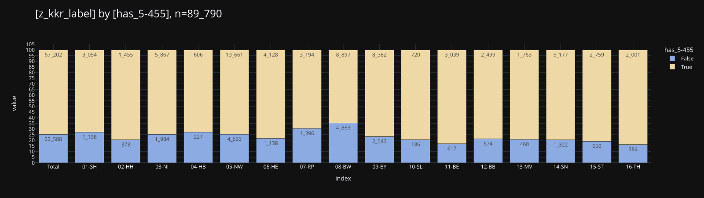
    


### <a id='toc1_5_4_'></a>[ Verteilung OPS 5-484 bei C20](#toc0_)
- Filter: `C18` und `M0`
- `has_5-48x`: True wenn Tumor >= 1 OPS 5-484 oder 5-485 hat
> 💡 ~40% haben True, weniger als erwartet 


<!-- START_TOKEN -->


    counts: all rows (no grouping)
    ---
    n = 3_241_401
    └ [DJ 2020-2024]:  n = 2_998_753
    └ [ICD10 C18-C20]: n = 227_053 (100.0%) ██████████████████████████████
    └ [ICD10 C20]:      n = 69_815  (30.7%) ░░░░░░░░░░░░░░░░░░░░░█████████
    └ [nur M0]:         n = 40_980  (18.0%) ░░░░░░░░░░░░░░░░░░░░░░░░░█████


<!-- END_TOKEN -->


<details>
<summary>filter-sql</summary>

```sql
z_dy between 2020 and 2024
and z_icd10_3d in ('C18', 'C19', 'C20')
and z_icd10_3d in ('C20')
and z_m_pc_1 = '0'
```

</details>


    
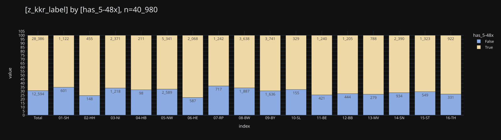
    


### <a id='toc1_5_5_'></a>[Details OPS 5-455](#toc0_)


#### <a id='toc1_5_5_1_'></a>[Kombination von Gruppen](#toc0_)
- gezählt sind Tumore
- die Gruppen können überlappen bei der Tumordarstellung
  - `has_ileo` - Ileozökalresektion
  - `has_hemi` - rechte Hemikolektomie
  - `has_sigma` - Sigmaresektion
  - `has_robo_01` - OPS `5-987.01` (Roboter) ist Tumor zugeordnet


<!-- START_TOKEN -->


    counts: distinct z_tum_id
    ---
    n = 3_241_401


    └ [DJ 2020-2024]: n = 2_998_753
    └ [nur C18]:      n = 154_219 (100.0%) ██████████████████████████████
    └ [OPS 5-4]:       n = 99_862  (64.8%) ░░░░░░░░░░░███████████████████


<!-- END_TOKEN -->


<details>
<summary>filter-sql</summary>

```sql
z_dy between 2020 and 2024
and z_icd10_3d in ('C18')
and left(Code,3) in ('5-4')
```

</details>


    n = 99_862 | n(true) = 62_806


    
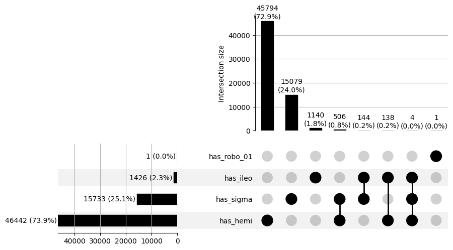
    


#### <a id='toc1_5_5_2_'></a>[Anteil Robotik](#toc0_)
- Metrik: Anteil Tumore mit `5-987` an allen Tumoren im Filter


<style type="text/css">
#T_026b5 th {
  text-align: right;
  font-size: 12pt;
}
#T_026b5 td {
  text-align: right;
  font-size: 11pt;
}
#T_026b5_row0_col0 {
  width: 10em;
  background: linear-gradient(90deg, #444444 6.5%, transparent 6.5%);
  font-family: Courier;
}
#T_026b5_row0_col1 {
  width: 10em;
  background: linear-gradient(90deg, #444444 5.7%, transparent 5.7%);
  font-family: Courier;
}
#T_026b5_row0_col2, #T_026b5_row16_col1 {
  width: 10em;
  background: linear-gradient(90deg, #444444 7.7%, transparent 7.7%);
  font-family: Courier;
}
#T_026b5_row0_col3 {
  width: 10em;
  background: linear-gradient(90deg, #444444 14.3%, transparent 14.3%);
  font-family: Courier;
}
#T_026b5_row0_col4, #T_026b5_row1_col4, #T_026b5_row2_col4, #T_026b5_row3_col1, #T_026b5_row3_col4, #T_026b5_row4_col4, #T_026b5_row6_col4, #T_026b5_row7_col4, #T_026b5_row9_col0, #T_026b5_row9_col4, #T_026b5_row13_col4, #T_026b5_row15_col4 {
  width: 10em;
  font-family: Courier;
}
#T_026b5_row0_col5 {
  width: 10em;
  background: linear-gradient(90deg, #444444 8.5%, transparent 8.5%);
  font-family: Courier;
}
#T_026b5_row1_col0 {
  width: 10em;
  background: linear-gradient(90deg, #444444 8.3%, transparent 8.3%);
  font-family: Courier;
}
#T_026b5_row1_col1 {
  width: 10em;
  background: linear-gradient(90deg, #444444 10.7%, transparent 10.7%);
  font-family: Courier;
}
#T_026b5_row1_col2 {
  width: 10em;
  background: linear-gradient(90deg, #444444 10.3%, transparent 10.3%);
  font-family: Courier;
}
#T_026b5_row1_col3, #T_026b5_row16_col3 {
  width: 10em;
  background: linear-gradient(90deg, #444444 17.2%, transparent 17.2%);
  font-family: Courier;
}
#T_026b5_row1_col5 {
  width: 10em;
  background: linear-gradient(90deg, #444444 11.7%, transparent 11.7%);
  font-family: Courier;
}
#T_026b5_row2_col0, #T_026b5_row13_col0 {
  width: 10em;
  background: linear-gradient(90deg, #444444 1.9%, transparent 1.9%);
  font-family: Courier;
}
#T_026b5_row2_col1 {
  width: 10em;
  background: linear-gradient(90deg, #444444 2.9%, transparent 2.9%);
  font-family: Courier;
}
#T_026b5_row2_col2 {
  width: 10em;
  background: linear-gradient(90deg, #444444 6.2%, transparent 6.2%);
  font-family: Courier;
}
#T_026b5_row2_col3, #T_026b5_row7_col5, #T_026b5_row8_col2 {
  width: 10em;
  background: linear-gradient(90deg, #444444 10.4%, transparent 10.4%);
  font-family: Courier;
}
#T_026b5_row2_col5 {
  width: 10em;
  background: linear-gradient(90deg, #444444 5.0%, transparent 5.0%);
  font-family: Courier;
}
#T_026b5_row3_col0, #T_026b5_row3_col2 {
  width: 10em;
  background: linear-gradient(90deg, #444444 1.0%, transparent 1.0%);
  font-family: Courier;
}
#T_026b5_row3_col3 {
  width: 10em;
  background: linear-gradient(90deg, #444444 1.2%, transparent 1.2%);
  font-family: Courier;
}
#T_026b5_row3_col5, #T_026b5_row9_col3 {
  width: 10em;
  background: linear-gradient(90deg, #444444 0.8%, transparent 0.8%);
  font-family: Courier;
}
#T_026b5_row4_col0 {
  width: 10em;
  background: linear-gradient(90deg, #444444 6.8%, transparent 6.8%);
  font-family: Courier;
}
#T_026b5_row4_col1, #T_026b5_row7_col2 {
  width: 10em;
  background: linear-gradient(90deg, #444444 12.0%, transparent 12.0%);
  font-family: Courier;
}
#T_026b5_row4_col2, #T_026b5_row5_col5 {
  width: 10em;
  background: linear-gradient(90deg, #444444 15.0%, transparent 15.0%);
  font-family: Courier;
}
#T_026b5_row4_col3 {
  width: 10em;
  background: linear-gradient(90deg, #444444 22.7%, transparent 22.7%);
  font-family: Courier;
}
#T_026b5_row4_col5 {
  width: 10em;
  background: linear-gradient(90deg, #444444 14.1%, transparent 14.1%);
  font-family: Courier;
}
#T_026b5_row5_col0 {
  width: 10em;
  background: linear-gradient(90deg, #444444 7.5%, transparent 7.5%);
  font-family: Courier;
}
#T_026b5_row5_col1, #T_026b5_row8_col5 {
  width: 10em;
  background: linear-gradient(90deg, #444444 9.7%, transparent 9.7%);
  font-family: Courier;
}
#T_026b5_row5_col2 {
  width: 10em;
  background: linear-gradient(90deg, #444444 16.9%, transparent 16.9%);
  font-family: Courier;
}
#T_026b5_row5_col3 {
  width: 10em;
  background: linear-gradient(90deg, #444444 25.5%, transparent 25.5%);
  font-family: Courier;
}
#T_026b5_row5_col4 {
  width: 10em;
  background: linear-gradient(90deg, #444444 30.2%, transparent 30.2%);
  font-family: Courier;
}
#T_026b5_row6_col0, #T_026b5_row12_col0 {
  width: 10em;
  background: linear-gradient(90deg, #444444 3.6%, transparent 3.6%);
  font-family: Courier;
}
#T_026b5_row6_col1 {
  width: 10em;
  background: linear-gradient(90deg, #444444 4.3%, transparent 4.3%);
  font-family: Courier;
}
#T_026b5_row6_col2 {
  width: 10em;
  background: linear-gradient(90deg, #444444 13.5%, transparent 13.5%);
  font-family: Courier;
}
#T_026b5_row6_col3 {
  width: 10em;
  background: linear-gradient(90deg, #444444 17.8%, transparent 17.8%);
  font-family: Courier;
}
#T_026b5_row6_col5 {
  width: 10em;
  background: linear-gradient(90deg, #444444 9.1%, transparent 9.1%);
  font-family: Courier;
}
#T_026b5_row7_col0 {
  width: 10em;
  background: linear-gradient(90deg, #444444 3.2%, transparent 3.2%);
  font-family: Courier;
}
#T_026b5_row7_col1, #T_026b5_row8_col1 {
  width: 10em;
  background: linear-gradient(90deg, #444444 7.9%, transparent 7.9%);
  font-family: Courier;
}
#T_026b5_row7_col3 {
  width: 10em;
  background: linear-gradient(90deg, #444444 19.2%, transparent 19.2%);
  font-family: Courier;
}
#T_026b5_row8_col0 {
  width: 10em;
  background: linear-gradient(90deg, #444444 3.4%, transparent 3.4%);
  font-family: Courier;
}
#T_026b5_row8_col3 {
  width: 10em;
  background: linear-gradient(90deg, #444444 18.9%, transparent 18.9%);
  font-family: Courier;
}
#T_026b5_row8_col4 {
  width: 10em;
  background: linear-gradient(90deg, #444444 16.7%, transparent 16.7%);
  font-family: Courier;
}
#T_026b5_row9_col1 {
  width: 10em;
  background: linear-gradient(90deg, #444444 0.6%, transparent 0.6%);
  font-family: Courier;
}
#T_026b5_row9_col2 {
  width: 10em;
  background: linear-gradient(90deg, #444444 0.7%, transparent 0.7%);
  font-family: Courier;
}
#T_026b5_row9_col5 {
  width: 10em;
  background: linear-gradient(90deg, #444444 0.5%, transparent 0.5%);
  font-family: Courier;
}
#T_026b5_row10_col0, #T_026b5_row13_col1, #T_026b5_row16_col0 {
  width: 10em;
  background: linear-gradient(90deg, #444444 4.6%, transparent 4.6%);
  font-family: Courier;
}
#T_026b5_row10_col1 {
  width: 10em;
  background: linear-gradient(90deg, #444444 4.1%, transparent 4.1%);
  font-family: Courier;
}
#T_026b5_row10_col2 {
  width: 10em;
  background: linear-gradient(90deg, #444444 8.6%, transparent 8.6%);
  font-family: Courier;
}
#T_026b5_row10_col3 {
  width: 10em;
  background: linear-gradient(90deg, #444444 12.8%, transparent 12.8%);
  font-family: Courier;
}
#T_026b5_row10_col4 {
  width: 10em;
  background: linear-gradient(90deg, #444444 100.0%, transparent 100.0%);
  font-family: Courier;
}
#T_026b5_row10_col5 {
  width: 10em;
  background: linear-gradient(90deg, #444444 7.4%, transparent 7.4%);
  font-family: Courier;
}
#T_026b5_row11_col0, #T_026b5_row15_col1 {
  width: 10em;
  background: linear-gradient(90deg, #444444 6.0%, transparent 6.0%);
  font-family: Courier;
}
#T_026b5_row11_col1, #T_026b5_row11_col5 {
  width: 10em;
  background: linear-gradient(90deg, #444444 9.6%, transparent 9.6%);
  font-family: Courier;
}
#T_026b5_row11_col2 {
  width: 10em;
  background: linear-gradient(90deg, #444444 5.2%, transparent 5.2%);
  font-family: Courier;
}
#T_026b5_row11_col3 {
  width: 10em;
  background: linear-gradient(90deg, #444444 18.1%, transparent 18.1%);
  font-family: Courier;
}
#T_026b5_row11_col4 {
  width: 10em;
  background: linear-gradient(90deg, #444444 24.6%, transparent 24.6%);
  font-family: Courier;
}
#T_026b5_row12_col1 {
  width: 10em;
  background: linear-gradient(90deg, #444444 7.2%, transparent 7.2%);
  font-family: Courier;
}
#T_026b5_row12_col2 {
  width: 10em;
  background: linear-gradient(90deg, #444444 14.7%, transparent 14.7%);
  font-family: Courier;
}
#T_026b5_row12_col3 {
  width: 10em;
  background: linear-gradient(90deg, #444444 15.5%, transparent 15.5%);
  font-family: Courier;
}
#T_026b5_row12_col4 {
  width: 10em;
  background: linear-gradient(90deg, #444444 18.7%, transparent 18.7%);
  font-family: Courier;
}
#T_026b5_row12_col5 {
  width: 10em;
  background: linear-gradient(90deg, #444444 10.1%, transparent 10.1%);
  font-family: Courier;
}
#T_026b5_row13_col2 {
  width: 10em;
  background: linear-gradient(90deg, #444444 6.4%, transparent 6.4%);
  font-family: Courier;
}
#T_026b5_row13_col3 {
  width: 10em;
  background: linear-gradient(90deg, #444444 9.2%, transparent 9.2%);
  font-family: Courier;
}
#T_026b5_row13_col5 {
  width: 10em;
  background: linear-gradient(90deg, #444444 5.5%, transparent 5.5%);
  font-family: Courier;
}
#T_026b5_row14_col0 {
  width: 10em;
  background: linear-gradient(90deg, #444444 7.8%, transparent 7.8%);
  font-family: Courier;
}
#T_026b5_row14_col1 {
  width: 10em;
  background: linear-gradient(90deg, #444444 12.6%, transparent 12.6%);
  font-family: Courier;
}
#T_026b5_row14_col2 {
  width: 10em;
  background: linear-gradient(90deg, #444444 13.3%, transparent 13.3%);
  font-family: Courier;
}
#T_026b5_row14_col3 {
  width: 10em;
  background: linear-gradient(90deg, #444444 15.1%, transparent 15.1%);
  font-family: Courier;
}
#T_026b5_row14_col4 {
  width: 10em;
  background: linear-gradient(90deg, #444444 21.2%, transparent 21.2%);
  font-family: Courier;
}
#T_026b5_row14_col5 {
  width: 10em;
  background: linear-gradient(90deg, #444444 12.2%, transparent 12.2%);
  font-family: Courier;
}
#T_026b5_row15_col0 {
  width: 10em;
  background: linear-gradient(90deg, #444444 4.8%, transparent 4.8%);
  font-family: Courier;
}
#T_026b5_row15_col2 {
  width: 10em;
  background: linear-gradient(90deg, #444444 3.3%, transparent 3.3%);
  font-family: Courier;
}
#T_026b5_row15_col3 {
  width: 10em;
  background: linear-gradient(90deg, #444444 5.6%, transparent 5.6%);
  font-family: Courier;
}
#T_026b5_row15_col5 {
  width: 10em;
  background: linear-gradient(90deg, #444444 4.9%, transparent 4.9%);
  font-family: Courier;
}
#T_026b5_row16_col2 {
  width: 10em;
  background: linear-gradient(90deg, #444444 10.9%, transparent 10.9%);
  font-family: Courier;
}
#T_026b5_row16_col4 {
  width: 10em;
  background: linear-gradient(90deg, #444444 24.5%, transparent 24.5%);
  font-family: Courier;
}
#T_026b5_row16_col5 {
  width: 10em;
  background: linear-gradient(90deg, #444444 9.9%, transparent 9.9%);
  font-family: Courier;
}
</style>
<table id="T_026b5">
  <thead>
    <tr>
      <th class="index_name level0" >z_dy</th>
      <th id="T_026b5_level0_col0" class="col_heading level0 col0" >2020</th>
      <th id="T_026b5_level0_col1" class="col_heading level0 col1" >2021</th>
      <th id="T_026b5_level0_col2" class="col_heading level0 col2" >2022</th>
      <th id="T_026b5_level0_col3" class="col_heading level0 col3" >2023</th>
      <th id="T_026b5_level0_col4" class="col_heading level0 col4" >2024</th>
      <th id="T_026b5_level0_col5" class="col_heading level0 col5" >Total</th>
    </tr>
    <tr>
      <th class="index_name level0" >z_kkr_label</th>
      <th class="blank col0" >&nbsp;</th>
      <th class="blank col1" >&nbsp;</th>
      <th class="blank col2" >&nbsp;</th>
      <th class="blank col3" >&nbsp;</th>
      <th class="blank col4" >&nbsp;</th>
      <th class="blank col5" >&nbsp;</th>
    </tr>
  </thead>
  <tbody>
    <tr>
      <th id="T_026b5_level0_row0" class="row_heading level0 row0" >01-SH</th>
      <td id="T_026b5_row0_col0" class="data row0 col0" >2.8% ⬛</td>
      <td id="T_026b5_row0_col1" class="data row0 col1" >2.4% ⬛</td>
      <td id="T_026b5_row0_col2" class="data row0 col2" >3.3% ⬛</td>
      <td id="T_026b5_row0_col3" class="data row0 col3" >6.1% ⬛</td>
      <td id="T_026b5_row0_col4" class="data row0 col4" ><span style="color: #888888">0 🟥</span></td>
      <td id="T_026b5_row0_col5" class="data row0 col5" >3.7% ⬛</td>
    </tr>
    <tr>
      <th id="T_026b5_level0_row1" class="row_heading level0 row1" >02-HH</th>
      <td id="T_026b5_row1_col0" class="data row1 col0" >3.6% 🟩</td>
      <td id="T_026b5_row1_col1" class="data row1 col1" >4.6% ⬛</td>
      <td id="T_026b5_row1_col2" class="data row1 col2" >4.4% ⬛</td>
      <td id="T_026b5_row1_col3" class="data row1 col3" >7.4% ⬛</td>
      <td id="T_026b5_row1_col4" class="data row1 col4" ><span style="color: #888888">0 🟥</span></td>
      <td id="T_026b5_row1_col5" class="data row1 col5" >5.0% ⬛</td>
    </tr>
    <tr>
      <th id="T_026b5_level0_row2" class="row_heading level0 row2" >03-NI</th>
      <td id="T_026b5_row2_col0" class="data row2 col0" >0.8% ⬛</td>
      <td id="T_026b5_row2_col1" class="data row2 col1" >1.2% ⬛</td>
      <td id="T_026b5_row2_col2" class="data row2 col2" >2.7% ⬛</td>
      <td id="T_026b5_row2_col3" class="data row2 col3" >4.5% ⬛</td>
      <td id="T_026b5_row2_col4" class="data row2 col4" ><span style="color: #888888">0 🟥</span></td>
      <td id="T_026b5_row2_col5" class="data row2 col5" >2.1% ⬛</td>
    </tr>
    <tr>
      <th id="T_026b5_level0_row3" class="row_heading level0 row3" >04-HB</th>
      <td id="T_026b5_row3_col0" class="data row3 col0" >0.4% ⬛</td>
      <td id="T_026b5_row3_col1" class="data row3 col1" ><span style="color: #888888">0 🟥</span></td>
      <td id="T_026b5_row3_col2" class="data row3 col2" >0.4% ⬛</td>
      <td id="T_026b5_row3_col3" class="data row3 col3" >0.5% ⬛</td>
      <td id="T_026b5_row3_col4" class="data row3 col4" ><span style="color: #888888">0 🟥</span></td>
      <td id="T_026b5_row3_col5" class="data row3 col5" >0.3% ⬛</td>
    </tr>
    <tr>
      <th id="T_026b5_level0_row4" class="row_heading level0 row4" >05-NW</th>
      <td id="T_026b5_row4_col0" class="data row4 col0" >2.9% ⬛</td>
      <td id="T_026b5_row4_col1" class="data row4 col1" >5.1% ⬛</td>
      <td id="T_026b5_row4_col2" class="data row4 col2" >6.4% ⬛</td>
      <td id="T_026b5_row4_col3" class="data row4 col3" >9.7% ⬛</td>
      <td id="T_026b5_row4_col4" class="data row4 col4" ><span style="color: #888888">0 🟥</span></td>
      <td id="T_026b5_row4_col5" class="data row4 col5" >6.1% ⬛</td>
    </tr>
    <tr>
      <th id="T_026b5_level0_row5" class="row_heading level0 row5" >06-HE</th>
      <td id="T_026b5_row5_col0" class="data row5 col0" >3.2% ⬛</td>
      <td id="T_026b5_row5_col1" class="data row5 col1" >4.2% ⬛</td>
      <td id="T_026b5_row5_col2" class="data row5 col2" >7.2% 🟩</td>
      <td id="T_026b5_row5_col3" class="data row5 col3" >10.9% 🟩</td>
      <td id="T_026b5_row5_col4" class="data row5 col4" >13.0% ⬛</td>
      <td id="T_026b5_row5_col5" class="data row5 col5" >6.4% 🟩</td>
    </tr>
    <tr>
      <th id="T_026b5_level0_row6" class="row_heading level0 row6" >07-RP</th>
      <td id="T_026b5_row6_col0" class="data row6 col0" >1.5% ⬛</td>
      <td id="T_026b5_row6_col1" class="data row6 col1" >1.8% ⬛</td>
      <td id="T_026b5_row6_col2" class="data row6 col2" >5.8% ⬛</td>
      <td id="T_026b5_row6_col3" class="data row6 col3" >7.6% ⬛</td>
      <td id="T_026b5_row6_col4" class="data row6 col4" ><span style="color: #888888">0 🟥</span></td>
      <td id="T_026b5_row6_col5" class="data row6 col5" >3.9% ⬛</td>
    </tr>
    <tr>
      <th id="T_026b5_level0_row7" class="row_heading level0 row7" >08-BW</th>
      <td id="T_026b5_row7_col0" class="data row7 col0" >1.4% ⬛</td>
      <td id="T_026b5_row7_col1" class="data row7 col1" >3.4% ⬛</td>
      <td id="T_026b5_row7_col2" class="data row7 col2" >5.2% ⬛</td>
      <td id="T_026b5_row7_col3" class="data row7 col3" >8.2% ⬛</td>
      <td id="T_026b5_row7_col4" class="data row7 col4" ><span style="color: #888888">0 🟥</span></td>
      <td id="T_026b5_row7_col5" class="data row7 col5" >4.5% ⬛</td>
    </tr>
    <tr>
      <th id="T_026b5_level0_row8" class="row_heading level0 row8" >09-BY</th>
      <td id="T_026b5_row8_col0" class="data row8 col0" >1.5% ⬛</td>
      <td id="T_026b5_row8_col1" class="data row8 col1" >3.4% ⬛</td>
      <td id="T_026b5_row8_col2" class="data row8 col2" >4.5% ⬛</td>
      <td id="T_026b5_row8_col3" class="data row8 col3" >8.1% ⬛</td>
      <td id="T_026b5_row8_col4" class="data row8 col4" >7.1% ⬛</td>
      <td id="T_026b5_row8_col5" class="data row8 col5" >4.1% ⬛</td>
    </tr>
    <tr>
      <th id="T_026b5_level0_row9" class="row_heading level0 row9" >10-SL</th>
      <td id="T_026b5_row9_col0" class="data row9 col0" ><span style="color: #888888">0 🟥</span></td>
      <td id="T_026b5_row9_col1" class="data row9 col1" >0.3% ⬛</td>
      <td id="T_026b5_row9_col2" class="data row9 col2" >0.3% 🟥</td>
      <td id="T_026b5_row9_col3" class="data row9 col3" >0.3% 🟥</td>
      <td id="T_026b5_row9_col4" class="data row9 col4" ><span style="color: #888888">0 🟥</span></td>
      <td id="T_026b5_row9_col5" class="data row9 col5" >0.2% 🟥</td>
    </tr>
    <tr>
      <th id="T_026b5_level0_row10" class="row_heading level0 row10" >11-BE</th>
      <td id="T_026b5_row10_col0" class="data row10 col0" >2.0% ⬛</td>
      <td id="T_026b5_row10_col1" class="data row10 col1" >1.7% ⬛</td>
      <td id="T_026b5_row10_col2" class="data row10 col2" >3.7% ⬛</td>
      <td id="T_026b5_row10_col3" class="data row10 col3" >5.5% ⬛</td>
      <td id="T_026b5_row10_col4" class="data row10 col4" >42.9% 🟩</td>
      <td id="T_026b5_row10_col5" class="data row10 col5" >3.2% ⬛</td>
    </tr>
    <tr>
      <th id="T_026b5_level0_row11" class="row_heading level0 row11" >12-BB</th>
      <td id="T_026b5_row11_col0" class="data row11 col0" >2.6% ⬛</td>
      <td id="T_026b5_row11_col1" class="data row11 col1" >4.1% ⬛</td>
      <td id="T_026b5_row11_col2" class="data row11 col2" >2.2% ⬛</td>
      <td id="T_026b5_row11_col3" class="data row11 col3" >7.7% ⬛</td>
      <td id="T_026b5_row11_col4" class="data row11 col4" >10.5% ⬛</td>
      <td id="T_026b5_row11_col5" class="data row11 col5" >4.1% ⬛</td>
    </tr>
    <tr>
      <th id="T_026b5_level0_row12" class="row_heading level0 row12" >13-MV</th>
      <td id="T_026b5_row12_col0" class="data row12 col0" >1.5% ⬛</td>
      <td id="T_026b5_row12_col1" class="data row12 col1" >3.1% ⬛</td>
      <td id="T_026b5_row12_col2" class="data row12 col2" >6.3% ⬛</td>
      <td id="T_026b5_row12_col3" class="data row12 col3" >6.7% ⬛</td>
      <td id="T_026b5_row12_col4" class="data row12 col4" >8.0% ⬛</td>
      <td id="T_026b5_row12_col5" class="data row12 col5" >4.3% ⬛</td>
    </tr>
    <tr>
      <th id="T_026b5_level0_row13" class="row_heading level0 row13" >14-SN</th>
      <td id="T_026b5_row13_col0" class="data row13 col0" >0.8% ⬛</td>
      <td id="T_026b5_row13_col1" class="data row13 col1" >2.0% ⬛</td>
      <td id="T_026b5_row13_col2" class="data row13 col2" >2.7% ⬛</td>
      <td id="T_026b5_row13_col3" class="data row13 col3" >4.0% ⬛</td>
      <td id="T_026b5_row13_col4" class="data row13 col4" ><span style="color: #888888">0 🟥</span></td>
      <td id="T_026b5_row13_col5" class="data row13 col5" >2.4% ⬛</td>
    </tr>
    <tr>
      <th id="T_026b5_level0_row14" class="row_heading level0 row14" >15-ST</th>
      <td id="T_026b5_row14_col0" class="data row14 col0" >3.3% ⬛</td>
      <td id="T_026b5_row14_col1" class="data row14 col1" >5.4% 🟩</td>
      <td id="T_026b5_row14_col2" class="data row14 col2" >5.7% ⬛</td>
      <td id="T_026b5_row14_col3" class="data row14 col3" >6.5% ⬛</td>
      <td id="T_026b5_row14_col4" class="data row14 col4" >9.1% ⬛</td>
      <td id="T_026b5_row14_col5" class="data row14 col5" >5.2% ⬛</td>
    </tr>
    <tr>
      <th id="T_026b5_level0_row15" class="row_heading level0 row15" >16-TH</th>
      <td id="T_026b5_row15_col0" class="data row15 col0" >2.0% ⬛</td>
      <td id="T_026b5_row15_col1" class="data row15 col1" >2.6% ⬛</td>
      <td id="T_026b5_row15_col2" class="data row15 col2" >1.4% ⬛</td>
      <td id="T_026b5_row15_col3" class="data row15 col3" >2.4% ⬛</td>
      <td id="T_026b5_row15_col4" class="data row15 col4" ><span style="color: #888888">0 🟥</span></td>
      <td id="T_026b5_row15_col5" class="data row15 col5" >2.1% ⬛</td>
    </tr>
    <tr>
      <th id="T_026b5_level0_row16" class="row_heading level0 row16" >Total</th>
      <td id="T_026b5_row16_col0" class="data row16 col0" >2.0% ⬛</td>
      <td id="T_026b5_row16_col1" class="data row16 col1" >3.3% ⬛</td>
      <td id="T_026b5_row16_col2" class="data row16 col2" >4.7% ⬛</td>
      <td id="T_026b5_row16_col3" class="data row16 col3" >7.4% ⬛</td>
      <td id="T_026b5_row16_col4" class="data row16 col4" >10.5% ⬛</td>
      <td id="T_026b5_row16_col5" class="data row16 col5" >4.3% ⬛</td>
    </tr>
  </tbody>
</table>


#### <a id='toc1_5_5_3_'></a>[Ileozökalresektion](#toc0_)
- Filter: alle Tumore, die einen OPS Code `5-455.2` aufweisen
- Gruppen
  - `5-455.21` - offen
  - `5-455.25` - laparoskopisch
  - `5-455.27` - konversion
  - `other` - sonstige, keine der genannten

<!-- > 💡 keine Robotik `5-987.1` geschlüsselt für diese Tumore -->


<!-- START_TOKEN -->


    counts: distinct z_tum_id
    ---


    n = 3_241_401


    └ [DJ 2020-2024]:  n = 2_998_753
    └ [ICD10 C18-C20]: n = 227_053 (100.0%) ██████████████████████████████
    └ [Tumor hat OP]:  n = 147_189  (64.8%) ░░░░░░░░░░░███████████████████
    └ [OPS ileo]:        n = 1_655   (0.7%) ░░░░░░░░░░░░░░░░░░░░░░░░░░░░░░


<!-- END_TOKEN -->


<details>
<summary>filter-sql</summary>

```sql
z_dy between 2020 and 2024
and z_icd10_3d in ('C18', 'C19', 'C20')
and z_tum_op_count > 0
and 
    z_tum_id in
        (select distinct z_tum_id from OPS where left(Code,7) in ('5-455.2'))
    
```

</details>


    n = 1_655 | n(true) = 1_509


    
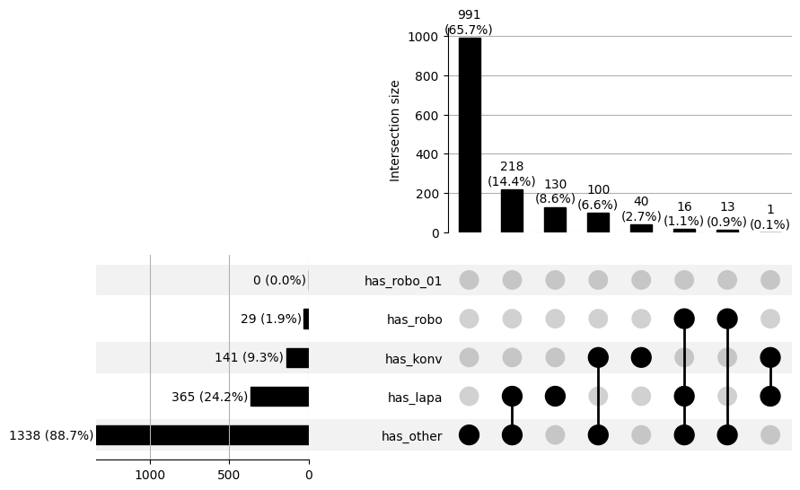
    


#### <a id='toc1_5_5_4_'></a>[rechte Hemikolektomie](#toc0_)
- Filter: alle Tumore, die einen OPS Code `5-455.4` aufweisen
- gezählt sind Tumore
- die Gruppen können überlappen

> 💡 kaum Robotik `5-987.1` geschlüsselt für diese Tumore (n=4)


<!-- START_TOKEN -->


    counts: distinct z_tum_id
    ---


    n = 3_241_401
    └ [DJ 2020-2024]:  n = 2_998_753


    └ [ICD10 C18-C20]: n = 227_053 (100.0%) ██████████████████████████████
    └ [Tumor hat OP]:  n = 147_189  (64.8%) ░░░░░░░░░░░███████████████████
    └ [OPS hemi]:       n = 49_413  (21.8%) ░░░░░░░░░░░░░░░░░░░░░░░░██████


<!-- END_TOKEN -->


<details>
<summary>filter-sql</summary>

```sql
z_dy between 2020 and 2024
and z_icd10_3d in ('C18', 'C19', 'C20')
and z_tum_op_count > 0
and 
    (
        left(Code,8) in ('5-455.41', '5-455.45', '5-455.47')
        OR left(Code,5) in ('5-987')
    )
```

</details>


    n = 49_413 | n(true) = 49_413


    
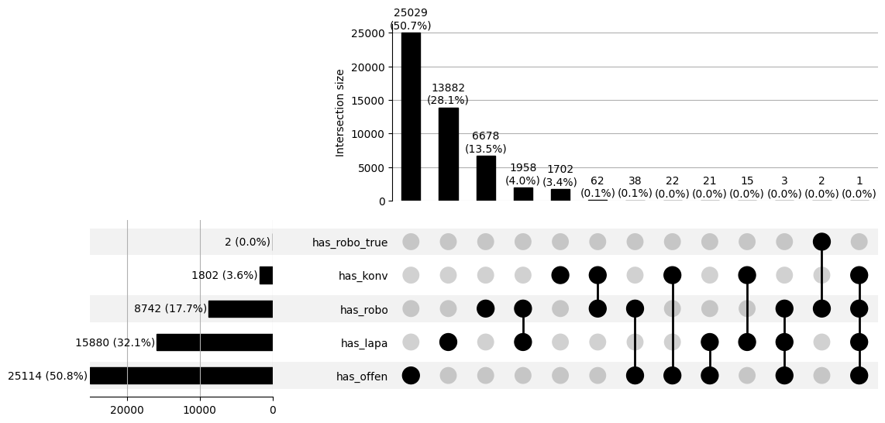
    


#### <a id='toc1_5_5_5_'></a>[Sigmaresektion](#toc0_)
- Filter: alle Tumore, die einen OPS Code `5-455.7` aufweisen
- gezählt sind Tumore
- die Gruppen können überlappen

> 💡 kaum Robotik `5-987.1` geschlüsselt für diese Tumore (n=4)


<!-- START_TOKEN -->


    counts: distinct z_tum_id
    ---


    n = 3_241_401
    └ [DJ 2020-2024]:  n = 2_998_753


    └ [ICD10 C18-C20]: n = 227_053 (100.0%) ██████████████████████████████
    └ [Tumor hat OP]:  n = 147_189  (64.8%) ░░░░░░░░░░░███████████████████
    └ [OPS sigma]:      n = 20_619   (9.1%) ░░░░░░░░░░░░░░░░░░░░░░░░░░░░██


<!-- END_TOKEN -->


<details>
<summary>filter-sql</summary>

```sql
z_dy between 2020 and 2024
and z_icd10_3d in ('C18', 'C19', 'C20')
and z_tum_op_count > 0
and 
    (
        left(Code,8) in ('5-455.71', '5-455.75', '5-455.77')
        OR left(Code,5) in ('5-987')
    )
```

</details>


    n = 20_619 | n(true) = 20_619


    
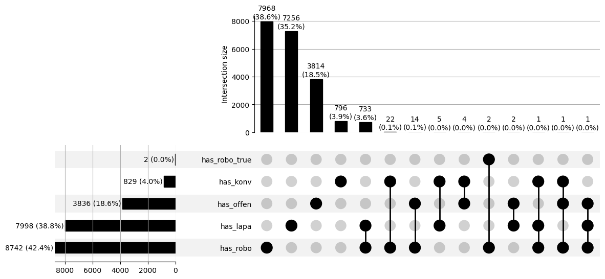
    


## <a id='toc1_6_'></a>[Lokalisation (Fernmetastasen) für C18](#toc0_)


### <a id='toc1_6_1_'></a>[nach M](#toc0_)
- gezählt sind Tumore
- M Angabe ist kombiniert aus pM (Vorrang) und cM
> 💡 45% von M1 haben Leber FM


<!-- START_TOKEN -->


    counts: all rows (no grouping)
    ---
    n = 3_241_401                   (100.0%) ██████████████████████████████
    └ [DJ 2020-2024]: n = 2_998_753  (92.5%) ░░░███████████████████████████
    └ [nur C18]:        n = 154_219   (4.8%) ░░░░░░░░░░░░░░░░░░░░░░░░░░░░░█


<!-- END_TOKEN -->


<details>
<summary>filter-sql</summary>

```sql
z_dy between 2020 and 2024
and z_icd10_3d in ('C18')
```

</details>


    
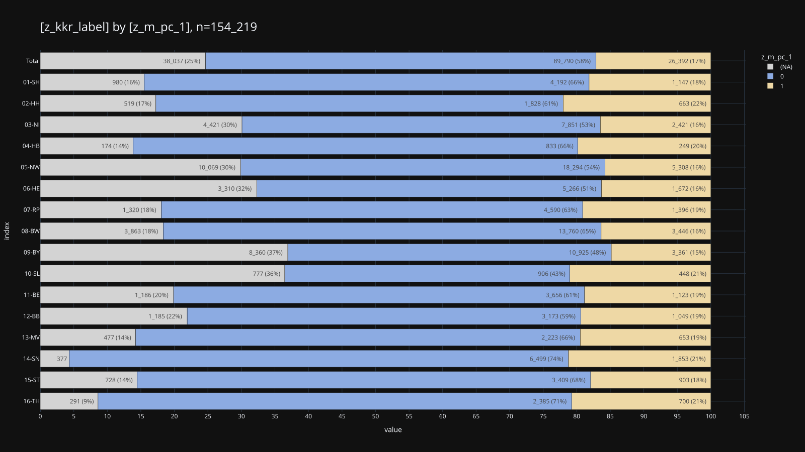
    


### <a id='toc1_6_2_'></a>[Anteil FM Lokalisation Leber bei M1](#toc0_)
- gezählt sind Tumore
- `HEP` liegt vor, wenn für **Diagnose** oder **Folgeereignis** diese Lokalisation vermerkt ist
- Metrik: Anteil Tumore mit >=1 `HEP`


<!-- START_TOKEN -->


    counts: all rows (no grouping)
    ---
    n = 3_241_401                   (100.0%) ██████████████████████████████
    └ [DJ 2020-2024]: n = 2_998_753  (92.5%) ░░░███████████████████████████
    └ [nur C18]:        n = 154_219   (4.8%) ░░░░░░░░░░░░░░░░░░░░░░░░░░░░░█
    └ [nur M1]:          n = 26_392   (0.8%) ░░░░░░░░░░░░░░░░░░░░░░░░░░░░░░


<!-- END_TOKEN -->


<details>
<summary>filter-sql</summary>

```sql
z_dy between 2020 and 2024
and z_icd10_3d in ('C18')
and z_m_pc_1 in ('1')
```

</details>


<!-- SCALE-80% -->


<style type="text/css">
#T_c245c th {
  text-align: right;
}
#T_c245c td {
  text-align: right;
}
#T_c245c_row0_col0 {
  width: 10em;
  background: linear-gradient(90deg, #444444 63.5%, transparent 63.5%);
  font-family: Courier;
}
#T_c245c_row0_col1, #T_c245c_row16_col0 {
  width: 10em;
  background: linear-gradient(90deg, #444444 66.2%, transparent 66.2%);
  font-family: Courier;
}
#T_c245c_row0_col2 {
  width: 10em;
  background: linear-gradient(90deg, #444444 66.0%, transparent 66.0%);
  font-family: Courier;
}
#T_c245c_row0_col3 {
  width: 10em;
  background: linear-gradient(90deg, #444444 55.4%, transparent 55.4%);
  font-family: Courier;
}
#T_c245c_row0_col4, #T_c245c_row1_col4, #T_c245c_row2_col4, #T_c245c_row3_col4, #T_c245c_row4_col4, #T_c245c_row6_col4, #T_c245c_row7_col4, #T_c245c_row9_col4, #T_c245c_row13_col4, #T_c245c_row15_col4 {
  width: 10em;
  font-family: Courier;
}
#T_c245c_row0_col5 {
  width: 10em;
  background: linear-gradient(90deg, #444444 62.9%, transparent 62.9%);
  font-family: Courier;
}
#T_c245c_row1_col0 {
  width: 10em;
  background: linear-gradient(90deg, #444444 63.9%, transparent 63.9%);
  font-family: Courier;
}
#T_c245c_row1_col1, #T_c245c_row9_col3 {
  width: 10em;
  background: linear-gradient(90deg, #444444 64.8%, transparent 64.8%);
  font-family: Courier;
}
#T_c245c_row1_col2 {
  width: 10em;
  background: linear-gradient(90deg, #444444 59.9%, transparent 59.9%);
  font-family: Courier;
}
#T_c245c_row1_col3 {
  width: 10em;
  background: linear-gradient(90deg, #444444 61.3%, transparent 61.3%);
  font-family: Courier;
}
#T_c245c_row1_col5, #T_c245c_row2_col5 {
  width: 10em;
  background: linear-gradient(90deg, #444444 62.4%, transparent 62.4%);
  font-family: Courier;
}
#T_c245c_row2_col0 {
  width: 10em;
  background: linear-gradient(90deg, #444444 65.4%, transparent 65.4%);
  font-family: Courier;
}
#T_c245c_row2_col1 {
  width: 10em;
  background: linear-gradient(90deg, #444444 64.2%, transparent 64.2%);
  font-family: Courier;
}
#T_c245c_row2_col2 {
  width: 10em;
  background: linear-gradient(90deg, #444444 62.1%, transparent 62.1%);
  font-family: Courier;
}
#T_c245c_row2_col3 {
  width: 10em;
  background: linear-gradient(90deg, #444444 57.3%, transparent 57.3%);
  font-family: Courier;
}
#T_c245c_row3_col0 {
  width: 10em;
  background: linear-gradient(90deg, #444444 65.7%, transparent 65.7%);
  font-family: Courier;
}
#T_c245c_row3_col1 {
  width: 10em;
  background: linear-gradient(90deg, #444444 59.0%, transparent 59.0%);
  font-family: Courier;
}
#T_c245c_row3_col2, #T_c245c_row8_col4 {
  width: 10em;
  background: linear-gradient(90deg, #444444 66.7%, transparent 66.7%);
  font-family: Courier;
}
#T_c245c_row3_col3 {
  width: 10em;
  background: linear-gradient(90deg, #444444 78.2%, transparent 78.2%);
  font-family: Courier;
}
#T_c245c_row3_col5, #T_c245c_row12_col5 {
  width: 10em;
  background: linear-gradient(90deg, #444444 67.1%, transparent 67.1%);
  font-family: Courier;
}
#T_c245c_row4_col0 {
  width: 10em;
  background: linear-gradient(90deg, #444444 53.3%, transparent 53.3%);
  font-family: Courier;
}
#T_c245c_row4_col1 {
  width: 10em;
  background: linear-gradient(90deg, #444444 61.0%, transparent 61.0%);
  font-family: Courier;
}
#T_c245c_row4_col2, #T_c245c_row16_col3 {
  width: 10em;
  background: linear-gradient(90deg, #444444 61.9%, transparent 61.9%);
  font-family: Courier;
}
#T_c245c_row4_col3, #T_c245c_row4_col5 {
  width: 10em;
  background: linear-gradient(90deg, #444444 58.7%, transparent 58.7%);
  font-family: Courier;
}
#T_c245c_row5_col0 {
  width: 10em;
  background: linear-gradient(90deg, #444444 71.1%, transparent 71.1%);
  font-family: Courier;
}
#T_c245c_row5_col1 {
  width: 10em;
  background: linear-gradient(90deg, #444444 67.5%, transparent 67.5%);
  font-family: Courier;
}
#T_c245c_row5_col2, #T_c245c_row7_col5, #T_c245c_row8_col5 {
  width: 10em;
  background: linear-gradient(90deg, #444444 68.0%, transparent 68.0%);
  font-family: Courier;
}
#T_c245c_row5_col3 {
  width: 10em;
  background: linear-gradient(90deg, #444444 66.1%, transparent 66.1%);
  font-family: Courier;
}
#T_c245c_row5_col4 {
  width: 10em;
  background: linear-gradient(90deg, #444444 55.6%, transparent 55.6%);
  font-family: Courier;
}
#T_c245c_row5_col5 {
  width: 10em;
  background: linear-gradient(90deg, #444444 68.2%, transparent 68.2%);
  font-family: Courier;
}
#T_c245c_row6_col0 {
  width: 10em;
  background: linear-gradient(90deg, #444444 57.6%, transparent 57.6%);
  font-family: Courier;
}
#T_c245c_row6_col1 {
  width: 10em;
  background: linear-gradient(90deg, #444444 50.8%, transparent 50.8%);
  font-family: Courier;
}
#T_c245c_row6_col2 {
  width: 10em;
  background: linear-gradient(90deg, #444444 44.3%, transparent 44.3%);
  font-family: Courier;
}
#T_c245c_row6_col3 {
  width: 10em;
  background: linear-gradient(90deg, #444444 17.8%, transparent 17.8%);
  font-family: Courier;
}
#T_c245c_row6_col5 {
  width: 10em;
  background: linear-gradient(90deg, #444444 44.6%, transparent 44.6%);
  font-family: Courier;
}
#T_c245c_row7_col0 {
  width: 10em;
  background: linear-gradient(90deg, #444444 69.0%, transparent 69.0%);
  font-family: Courier;
}
#T_c245c_row7_col1, #T_c245c_row10_col3 {
  width: 10em;
  background: linear-gradient(90deg, #444444 68.7%, transparent 68.7%);
  font-family: Courier;
}
#T_c245c_row7_col2 {
  width: 10em;
  background: linear-gradient(90deg, #444444 67.3%, transparent 67.3%);
  font-family: Courier;
}
#T_c245c_row7_col3, #T_c245c_row8_col2, #T_c245c_row15_col1 {
  width: 10em;
  background: linear-gradient(90deg, #444444 66.9%, transparent 66.9%);
  font-family: Courier;
}
#T_c245c_row8_col0 {
  width: 10em;
  background: linear-gradient(90deg, #444444 69.8%, transparent 69.8%);
  font-family: Courier;
}
#T_c245c_row8_col1 {
  width: 10em;
  background: linear-gradient(90deg, #444444 71.8%, transparent 71.8%);
  font-family: Courier;
}
#T_c245c_row8_col3 {
  width: 10em;
  background: linear-gradient(90deg, #444444 62.6%, transparent 62.6%);
  font-family: Courier;
}
#T_c245c_row9_col0 {
  width: 10em;
  background: linear-gradient(90deg, #444444 67.6%, transparent 67.6%);
  font-family: Courier;
}
#T_c245c_row9_col1 {
  width: 10em;
  background: linear-gradient(90deg, #444444 67.4%, transparent 67.4%);
  font-family: Courier;
}
#T_c245c_row9_col2 {
  width: 10em;
  background: linear-gradient(90deg, #444444 68.9%, transparent 68.9%);
  font-family: Courier;
}
#T_c245c_row9_col5 {
  width: 10em;
  background: linear-gradient(90deg, #444444 67.2%, transparent 67.2%);
  font-family: Courier;
}
#T_c245c_row10_col0 {
  width: 10em;
  background: linear-gradient(90deg, #444444 71.9%, transparent 71.9%);
  font-family: Courier;
}
#T_c245c_row10_col1 {
  width: 10em;
  background: linear-gradient(90deg, #444444 70.5%, transparent 70.5%);
  font-family: Courier;
}
#T_c245c_row10_col2, #T_c245c_row11_col2 {
  width: 10em;
  background: linear-gradient(90deg, #444444 69.3%, transparent 69.3%);
  font-family: Courier;
}
#T_c245c_row10_col4 {
  width: 10em;
  background: linear-gradient(90deg, #444444 50.0%, transparent 50.0%);
  font-family: Courier;
}
#T_c245c_row10_col5 {
  width: 10em;
  background: linear-gradient(90deg, #444444 70.2%, transparent 70.2%);
  font-family: Courier;
}
#T_c245c_row11_col0 {
  width: 10em;
  background: linear-gradient(90deg, #444444 76.7%, transparent 76.7%);
  font-family: Courier;
}
#T_c245c_row11_col1 {
  width: 10em;
  background: linear-gradient(90deg, #444444 76.0%, transparent 76.0%);
  font-family: Courier;
}
#T_c245c_row11_col3 {
  width: 10em;
  background: linear-gradient(90deg, #444444 71.2%, transparent 71.2%);
  font-family: Courier;
}
#T_c245c_row11_col4 {
  width: 10em;
  background: linear-gradient(90deg, #444444 100.0%, transparent 100.0%);
  font-family: Courier;
}
#T_c245c_row11_col5 {
  width: 10em;
  background: linear-gradient(90deg, #444444 73.6%, transparent 73.6%);
  font-family: Courier;
}
#T_c245c_row12_col0 {
  width: 10em;
  background: linear-gradient(90deg, #444444 72.0%, transparent 72.0%);
  font-family: Courier;
}
#T_c245c_row12_col1 {
  width: 10em;
  background: linear-gradient(90deg, #444444 70.0%, transparent 70.0%);
  font-family: Courier;
}
#T_c245c_row12_col2 {
  width: 10em;
  background: linear-gradient(90deg, #444444 60.6%, transparent 60.6%);
  font-family: Courier;
}
#T_c245c_row12_col3 {
  width: 10em;
  background: linear-gradient(90deg, #444444 65.3%, transparent 65.3%);
  font-family: Courier;
}
#T_c245c_row12_col4, #T_c245c_row13_col2, #T_c245c_row15_col5 {
  width: 10em;
  background: linear-gradient(90deg, #444444 72.7%, transparent 72.7%);
  font-family: Courier;
}
#T_c245c_row13_col0 {
  width: 10em;
  background: linear-gradient(90deg, #444444 79.1%, transparent 79.1%);
  font-family: Courier;
}
#T_c245c_row13_col1 {
  width: 10em;
  background: linear-gradient(90deg, #444444 73.4%, transparent 73.4%);
  font-family: Courier;
}
#T_c245c_row13_col3, #T_c245c_row14_col3 {
  width: 10em;
  background: linear-gradient(90deg, #444444 72.2%, transparent 72.2%);
  font-family: Courier;
}
#T_c245c_row13_col5 {
  width: 10em;
  background: linear-gradient(90deg, #444444 74.3%, transparent 74.3%);
  font-family: Courier;
}
#T_c245c_row14_col0 {
  width: 10em;
  background: linear-gradient(90deg, #444444 71.5%, transparent 71.5%);
  font-family: Courier;
}
#T_c245c_row14_col1 {
  width: 10em;
  background: linear-gradient(90deg, #444444 69.7%, transparent 69.7%);
  font-family: Courier;
}
#T_c245c_row14_col2 {
  width: 10em;
  background: linear-gradient(90deg, #444444 69.5%, transparent 69.5%);
  font-family: Courier;
}
#T_c245c_row14_col4 {
  width: 10em;
  background: linear-gradient(90deg, #444444 57.1%, transparent 57.1%);
  font-family: Courier;
}
#T_c245c_row14_col5 {
  width: 10em;
  background: linear-gradient(90deg, #444444 70.7%, transparent 70.7%);
  font-family: Courier;
}
#T_c245c_row15_col0 {
  width: 10em;
  background: linear-gradient(90deg, #444444 76.1%, transparent 76.1%);
  font-family: Courier;
}
#T_c245c_row15_col2, #T_c245c_row15_col3 {
  width: 10em;
  background: linear-gradient(90deg, #444444 73.9%, transparent 73.9%);
  font-family: Courier;
}
#T_c245c_row16_col1 {
  width: 10em;
  background: linear-gradient(90deg, #444444 66.5%, transparent 66.5%);
  font-family: Courier;
}
#T_c245c_row16_col2, #T_c245c_row16_col5 {
  width: 10em;
  background: linear-gradient(90deg, #444444 64.9%, transparent 64.9%);
  font-family: Courier;
}
#T_c245c_row16_col4 {
  width: 10em;
  background: linear-gradient(90deg, #444444 68.8%, transparent 68.8%);
  font-family: Courier;
}
</style>
<table id="T_c245c">
  <thead>
    <tr>
      <th class="index_name level0" >z_dy</th>
      <th id="T_c245c_level0_col0" class="col_heading level0 col0" >2020</th>
      <th id="T_c245c_level0_col1" class="col_heading level0 col1" >2021</th>
      <th id="T_c245c_level0_col2" class="col_heading level0 col2" >2022</th>
      <th id="T_c245c_level0_col3" class="col_heading level0 col3" >2023</th>
      <th id="T_c245c_level0_col4" class="col_heading level0 col4" >2024</th>
      <th id="T_c245c_level0_col5" class="col_heading level0 col5" >Total</th>
    </tr>
    <tr>
      <th class="index_name level0" >z_kkr_label</th>
      <th class="blank col0" >&nbsp;</th>
      <th class="blank col1" >&nbsp;</th>
      <th class="blank col2" >&nbsp;</th>
      <th class="blank col3" >&nbsp;</th>
      <th class="blank col4" >&nbsp;</th>
      <th class="blank col5" >&nbsp;</th>
    </tr>
  </thead>
  <tbody>
    <tr>
      <th id="T_c245c_level0_row0" class="row_heading level0 row0" >01-SH</th>
      <td id="T_c245c_row0_col0" class="data row0 col0" >63.5% </td>
      <td id="T_c245c_row0_col1" class="data row0 col1" >66.2% </td>
      <td id="T_c245c_row0_col2" class="data row0 col2" >66.0% </td>
      <td id="T_c245c_row0_col3" class="data row0 col3" >55.4% </td>
      <td id="T_c245c_row0_col4" class="data row0 col4" ><span style="color: #888888">0 </span></td>
      <td id="T_c245c_row0_col5" class="data row0 col5" >62.9% </td>
    </tr>
    <tr>
      <th id="T_c245c_level0_row1" class="row_heading level0 row1" >02-HH</th>
      <td id="T_c245c_row1_col0" class="data row1 col0" >63.9% </td>
      <td id="T_c245c_row1_col1" class="data row1 col1" >64.8% </td>
      <td id="T_c245c_row1_col2" class="data row1 col2" >59.9% </td>
      <td id="T_c245c_row1_col3" class="data row1 col3" >61.3% </td>
      <td id="T_c245c_row1_col4" class="data row1 col4" ><span style="color: #888888">0 </span></td>
      <td id="T_c245c_row1_col5" class="data row1 col5" >62.4% </td>
    </tr>
    <tr>
      <th id="T_c245c_level0_row2" class="row_heading level0 row2" >03-NI</th>
      <td id="T_c245c_row2_col0" class="data row2 col0" >65.4% </td>
      <td id="T_c245c_row2_col1" class="data row2 col1" >64.2% </td>
      <td id="T_c245c_row2_col2" class="data row2 col2" >62.1% </td>
      <td id="T_c245c_row2_col3" class="data row2 col3" >57.3% </td>
      <td id="T_c245c_row2_col4" class="data row2 col4" ><span style="color: #888888">0 </span></td>
      <td id="T_c245c_row2_col5" class="data row2 col5" >62.4% </td>
    </tr>
    <tr>
      <th id="T_c245c_level0_row3" class="row_heading level0 row3" >04-HB</th>
      <td id="T_c245c_row3_col0" class="data row3 col0" >65.7% </td>
      <td id="T_c245c_row3_col1" class="data row3 col1" >59.0% </td>
      <td id="T_c245c_row3_col2" class="data row3 col2" >66.7% </td>
      <td id="T_c245c_row3_col3" class="data row3 col3" >78.2% </td>
      <td id="T_c245c_row3_col4" class="data row3 col4" ><span style="color: #888888">0 </span></td>
      <td id="T_c245c_row3_col5" class="data row3 col5" >67.1% </td>
    </tr>
    <tr>
      <th id="T_c245c_level0_row4" class="row_heading level0 row4" >05-NW</th>
      <td id="T_c245c_row4_col0" class="data row4 col0" >53.3% </td>
      <td id="T_c245c_row4_col1" class="data row4 col1" >61.0% </td>
      <td id="T_c245c_row4_col2" class="data row4 col2" >61.9% </td>
      <td id="T_c245c_row4_col3" class="data row4 col3" >58.7% </td>
      <td id="T_c245c_row4_col4" class="data row4 col4" ><span style="color: #888888">0 </span></td>
      <td id="T_c245c_row4_col5" class="data row4 col5" >58.7% </td>
    </tr>
    <tr>
      <th id="T_c245c_level0_row5" class="row_heading level0 row5" >06-HE</th>
      <td id="T_c245c_row5_col0" class="data row5 col0" >71.1% </td>
      <td id="T_c245c_row5_col1" class="data row5 col1" >67.5% </td>
      <td id="T_c245c_row5_col2" class="data row5 col2" >68.0% </td>
      <td id="T_c245c_row5_col3" class="data row5 col3" >66.1% </td>
      <td id="T_c245c_row5_col4" class="data row5 col4" >55.6% </td>
      <td id="T_c245c_row5_col5" class="data row5 col5" >68.2% </td>
    </tr>
    <tr>
      <th id="T_c245c_level0_row6" class="row_heading level0 row6" >07-RP</th>
      <td id="T_c245c_row6_col0" class="data row6 col0" >57.6% </td>
      <td id="T_c245c_row6_col1" class="data row6 col1" >50.8% </td>
      <td id="T_c245c_row6_col2" class="data row6 col2" >44.3% </td>
      <td id="T_c245c_row6_col3" class="data row6 col3" >17.8% </td>
      <td id="T_c245c_row6_col4" class="data row6 col4" ><span style="color: #888888">0 </span></td>
      <td id="T_c245c_row6_col5" class="data row6 col5" >44.6% </td>
    </tr>
    <tr>
      <th id="T_c245c_level0_row7" class="row_heading level0 row7" >08-BW</th>
      <td id="T_c245c_row7_col0" class="data row7 col0" >69.0% </td>
      <td id="T_c245c_row7_col1" class="data row7 col1" >68.7% </td>
      <td id="T_c245c_row7_col2" class="data row7 col2" >67.3% </td>
      <td id="T_c245c_row7_col3" class="data row7 col3" >66.9% </td>
      <td id="T_c245c_row7_col4" class="data row7 col4" ><span style="color: #888888">0 </span></td>
      <td id="T_c245c_row7_col5" class="data row7 col5" >68.0% </td>
    </tr>
    <tr>
      <th id="T_c245c_level0_row8" class="row_heading level0 row8" >09-BY</th>
      <td id="T_c245c_row8_col0" class="data row8 col0" >69.8% </td>
      <td id="T_c245c_row8_col1" class="data row8 col1" >71.8% </td>
      <td id="T_c245c_row8_col2" class="data row8 col2" >66.9% </td>
      <td id="T_c245c_row8_col3" class="data row8 col3" >62.6% </td>
      <td id="T_c245c_row8_col4" class="data row8 col4" >66.7% </td>
      <td id="T_c245c_row8_col5" class="data row8 col5" >68.0% </td>
    </tr>
    <tr>
      <th id="T_c245c_level0_row9" class="row_heading level0 row9" >10-SL</th>
      <td id="T_c245c_row9_col0" class="data row9 col0" >67.6% </td>
      <td id="T_c245c_row9_col1" class="data row9 col1" >67.4% </td>
      <td id="T_c245c_row9_col2" class="data row9 col2" >68.9% </td>
      <td id="T_c245c_row9_col3" class="data row9 col3" >64.8% </td>
      <td id="T_c245c_row9_col4" class="data row9 col4" ><span style="color: #888888">0 </span></td>
      <td id="T_c245c_row9_col5" class="data row9 col5" >67.2% </td>
    </tr>
    <tr>
      <th id="T_c245c_level0_row10" class="row_heading level0 row10" >11-BE</th>
      <td id="T_c245c_row10_col0" class="data row10 col0" >71.9% </td>
      <td id="T_c245c_row10_col1" class="data row10 col1" >70.5% </td>
      <td id="T_c245c_row10_col2" class="data row10 col2" >69.3% </td>
      <td id="T_c245c_row10_col3" class="data row10 col3" >68.7% </td>
      <td id="T_c245c_row10_col4" class="data row10 col4" >50.0% </td>
      <td id="T_c245c_row10_col5" class="data row10 col5" >70.2% </td>
    </tr>
    <tr>
      <th id="T_c245c_level0_row11" class="row_heading level0 row11" >12-BB</th>
      <td id="T_c245c_row11_col0" class="data row11 col0" >76.7% </td>
      <td id="T_c245c_row11_col1" class="data row11 col1" >76.0% </td>
      <td id="T_c245c_row11_col2" class="data row11 col2" >69.3% </td>
      <td id="T_c245c_row11_col3" class="data row11 col3" >71.2% </td>
      <td id="T_c245c_row11_col4" class="data row11 col4" >100.0% </td>
      <td id="T_c245c_row11_col5" class="data row11 col5" >73.6% </td>
    </tr>
    <tr>
      <th id="T_c245c_level0_row12" class="row_heading level0 row12" >13-MV</th>
      <td id="T_c245c_row12_col0" class="data row12 col0" >72.0% </td>
      <td id="T_c245c_row12_col1" class="data row12 col1" >70.0% </td>
      <td id="T_c245c_row12_col2" class="data row12 col2" >60.6% </td>
      <td id="T_c245c_row12_col3" class="data row12 col3" >65.3% </td>
      <td id="T_c245c_row12_col4" class="data row12 col4" >72.7% </td>
      <td id="T_c245c_row12_col5" class="data row12 col5" >67.1% </td>
    </tr>
    <tr>
      <th id="T_c245c_level0_row13" class="row_heading level0 row13" >14-SN</th>
      <td id="T_c245c_row13_col0" class="data row13 col0" >79.1% </td>
      <td id="T_c245c_row13_col1" class="data row13 col1" >73.4% </td>
      <td id="T_c245c_row13_col2" class="data row13 col2" >72.7% </td>
      <td id="T_c245c_row13_col3" class="data row13 col3" >72.2% </td>
      <td id="T_c245c_row13_col4" class="data row13 col4" ><span style="color: #888888">0 </span></td>
      <td id="T_c245c_row13_col5" class="data row13 col5" >74.3% </td>
    </tr>
    <tr>
      <th id="T_c245c_level0_row14" class="row_heading level0 row14" >15-ST</th>
      <td id="T_c245c_row14_col0" class="data row14 col0" >71.5% </td>
      <td id="T_c245c_row14_col1" class="data row14 col1" >69.7% </td>
      <td id="T_c245c_row14_col2" class="data row14 col2" >69.5% </td>
      <td id="T_c245c_row14_col3" class="data row14 col3" >72.2% </td>
      <td id="T_c245c_row14_col4" class="data row14 col4" >57.1% </td>
      <td id="T_c245c_row14_col5" class="data row14 col5" >70.7% </td>
    </tr>
    <tr>
      <th id="T_c245c_level0_row15" class="row_heading level0 row15" >16-TH</th>
      <td id="T_c245c_row15_col0" class="data row15 col0" >76.1% </td>
      <td id="T_c245c_row15_col1" class="data row15 col1" >66.9% </td>
      <td id="T_c245c_row15_col2" class="data row15 col2" >73.9% </td>
      <td id="T_c245c_row15_col3" class="data row15 col3" >73.9% </td>
      <td id="T_c245c_row15_col4" class="data row15 col4" ><span style="color: #888888">0 </span></td>
      <td id="T_c245c_row15_col5" class="data row15 col5" >72.7% </td>
    </tr>
    <tr>
      <th id="T_c245c_level0_row16" class="row_heading level0 row16" >Total</th>
      <td id="T_c245c_row16_col0" class="data row16 col0" >66.2% </td>
      <td id="T_c245c_row16_col1" class="data row16 col1" >66.5% </td>
      <td id="T_c245c_row16_col2" class="data row16 col2" >64.9% </td>
      <td id="T_c245c_row16_col3" class="data row16 col3" >61.9% </td>
      <td id="T_c245c_row16_col4" class="data row16 col4" >68.8% </td>
      <td id="T_c245c_row16_col5" class="data row16 col5" >64.9% </td>
    </tr>
  </tbody>
</table>


### <a id='toc1_6_3_'></a>[Behandlungsverlauf](#toc0_)
- gezählt sind Tumore
- beschränkt auf die ersten 5 Therapien
- Therapien mit gleichem Tumor / Datum / Behandlung sind zusammengeführt
- verschiedene Therapien mit gleichem Tumor und Datum sind hier nicht entfernt


<!-- START_TOKEN -->


    counts: all rows (no grouping)
    ---
    n = 3_241_401
    └ [DJ 2020-2024]:                                           n = 2_998_753
    └ [nur C18]:                                                n = 154_219 (100.0%) ██████████████████████████████
    └ [nur M1]:                                                  n = 26_392  (17.1%) ░░░░░░░░░░░░░░░░░░░░░░░░░█████


    └ [Tumor mit HEP Lokalisation in FM Diagnose oder Verlauf]:  n = 17_141  (11.1%) ░░░░░░░░░░░░░░░░░░░░░░░░░░░███
    └ [Tumor hat Therapie]:                                      n = 14_167   (9.2%) ░░░░░░░░░░░░░░░░░░░░░░░░░░░░██


<!-- END_TOKEN -->


<details>
<summary>filter-sql</summary>

```sql
z_dy between 2020 and 2024
and z_icd10_3d in ('C18')
and z_m_pc_1 in ('1')
and 
    z_tum_id in (
        select distinct tum.z_tum_id
        from Tumor tum
        left join Diagnose_Fernmetastase dfm on tum.z_tum_id = dfm.z_tum_id
        left join Folgeereignis_Fernmetastase ffm on tum.z_tum_id = ffm.z_tum_id
        where (dfm.Lokalisation = 'HEP' or ffm.Lokalisation = 'HEP')
    )
and z_tum_op_count+z_tum_sy_count+z_tum_st_count > 0
```

</details>


    
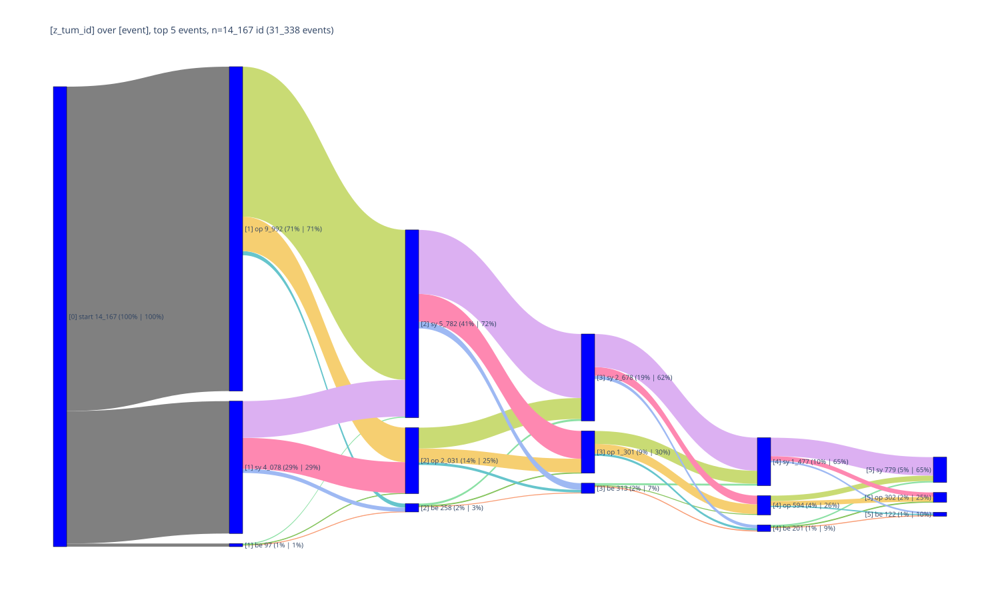
    


### <a id='toc1_6_4_'></a>[Erste Behandlung bei Leber FM](#toc0_)


<!-- START_TOKEN -->


    counts: all rows (no grouping)
    ---
    n = 3_241_401
    └ [DJ 2020-2024]:                                           n = 2_998_753
    └ [nur C18]:                                                n = 154_219 (100.0%) ██████████████████████████████
    └ [nur M1]:                                                  n = 26_392  (17.1%) ░░░░░░░░░░░░░░░░░░░░░░░░░█████
    └ [Tumor mit HEP Lokalisation in FM Diagnose oder Verlauf]:  n = 17_141  (11.1%) ░░░░░░░░░░░░░░░░░░░░░░░░░░░███


<!-- END_TOKEN -->


<details>
<summary>filter-sql</summary>

```sql
z_dy between 2020 and 2024
and z_icd10_3d in ('C18')
and z_m_pc_1 in ('1')
and 
    z_tum_id in (
        select distinct tum.z_tum_id
        from Tumor tum
        left join Diagnose_Fernmetastase dfm on tum.z_tum_id = dfm.z_tum_id
        left join Folgeereignis_Fernmetastase ffm on tum.z_tum_id = ffm.z_tum_id
        where (dfm.Lokalisation = 'HEP' or ffm.Lokalisation = 'HEP')
    )
```

</details>


    
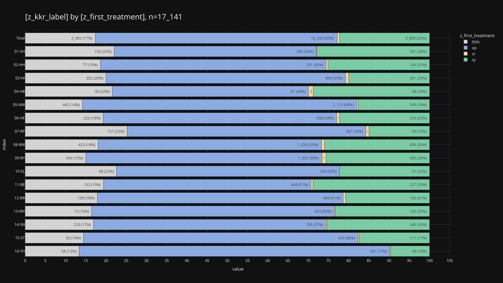
    


### <a id='toc1_6_5_'></a>[OPS wenn Erstbehandlung OPS](#toc0_)
- gezählt sind Tumore
- Kategorien OPS bei Erstbehandlung des Tumors
  - `1_other`: andere oder keine OPS
  - `2_colon`: erste 5 Stellen in `('5-455','5-484','5-485')`
  - `3_liver`: erste 5 Stellen in `('5-501','5-502','5-503')`
  - `4_both`: colon und liver geschlüsselt für Erstbehandlung


<!-- START_TOKEN -->


    counts: all rows (no grouping)
    ---
    n = 3_241_401
    └ [DJ 2020-2024]:                                           n = 2_998_753
    └ [nur C18]:                                                n = 154_219 (100.0%) ██████████████████████████████
    └ [nur M1]:                                                  n = 26_392  (17.1%) ░░░░░░░░░░░░░░░░░░░░░░░░░█████
    └ [Tumor mit HEP Lokalisation in FM Diagnose oder Verlauf]:  n = 17_141  (11.1%) ░░░░░░░░░░░░░░░░░░░░░░░░░░░███
    └ [Tumore mit OP als Erstbehandlung]:                        n = 10_250   (6.6%) ░░░░░░░░░░░░░░░░░░░░░░░░░░░░░█


<!-- END_TOKEN -->


<details>
<summary>filter-sql</summary>

```sql
z_dy between 2020 and 2024
and z_icd10_3d in ('C18')
and z_m_pc_1 in ('1')
and 
    z_tum_id in (
        select distinct tum.z_tum_id
        from Tumor tum
        left join Diagnose_Fernmetastase dfm on tum.z_tum_id = dfm.z_tum_id
        left join Folgeereignis_Fernmetastase ffm on tum.z_tum_id = ffm.z_tum_id
        where (dfm.Lokalisation = 'HEP' or ffm.Lokalisation = 'HEP')
    )
and z_first_treatment = 'op'
```

</details>


    
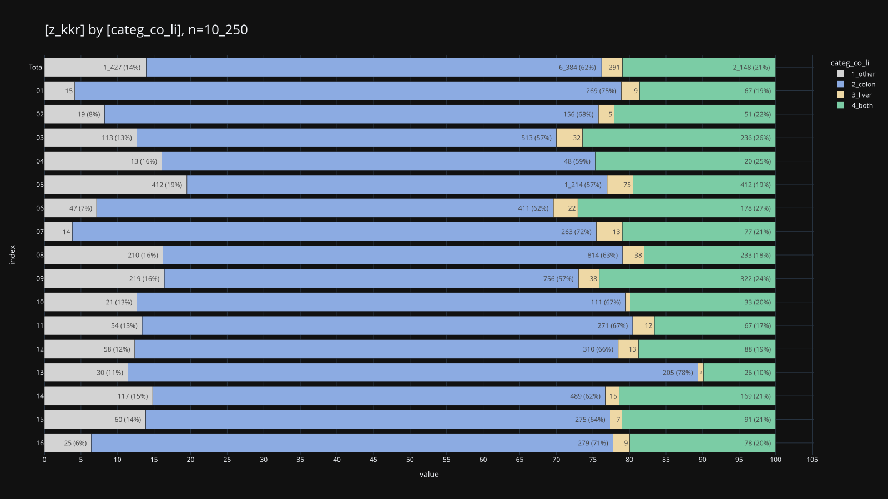
    


## <a id='toc1_7_'></a>[Rezidive](#toc0_)

### <a id='toc1_7_1_'></a>[Verteilung OP in 2020](#toc0_)
- Filter: `C18`-`C20`, 2020
- gezählt sind Tumore
- Einteilung der Verteilung in eine Kategorie Tabelle
  - `1_op_r0` - OP und R0 dokumentiert
  - `2_op_no_r0` - OP, kein R0
  - `3_no_op_but_pt` - keine OP, aber pT (Diagnose oder Verlauf)
  - `4_no_op_pt_but_st_sy` - keine OP, keine pT, aber ST oder SYST
  - `5_none` - keine Therapie oder pT


<!-- START_TOKEN -->


    counts: all rows (no grouping)
    ---
    n = 3_241_401
    └ [DJ 2020-2024]:  n = 2_998_753
    └ [ICD10 C18-C20]: n = 227_053 (100.0%) ██████████████████████████████
    └ [DJ 2020]:        n = 57_102  (25.1%) ░░░░░░░░░░░░░░░░░░░░░░░███████
    └ [nur C18]:        n = 38_714  (17.1%) ░░░░░░░░░░░░░░░░░░░░░░░░░█████


<!-- END_TOKEN -->


<details>
<summary>filter-sql</summary>

```sql
z_dy between 2020 and 2024
and z_icd10_3d in ('C18', 'C19', 'C20')
and z_dy = 2020
and z_icd10_3d in ('C18')
```

</details>


    
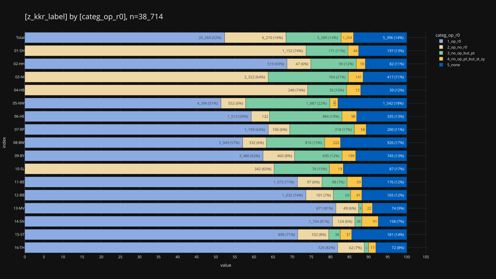
    


### <a id='toc1_7_2_'></a>[M Stadium und Vitalstatus bei Tumoren ohne Therapie und pT](#toc0_)

    n = 5_396


    
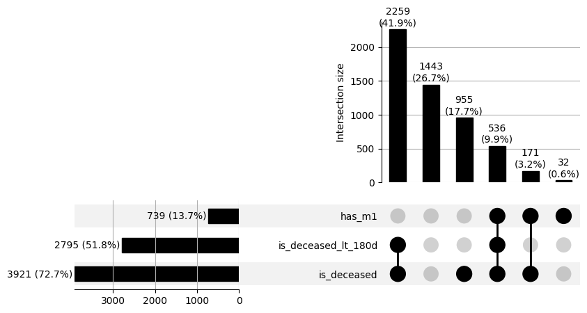
    


### <a id='toc1_7_3_'></a>[R Status](#toc0_)
- `r_status`
  - `1_R0`: wenn >= 1 OP zum Tumor dokumentiert is mit `R0`
  - `2_R1_R2`: wenn kein `R0` dokumentiert, aber >= 1 OP mit `R1` oder `R2`
  - `3_NA_U_RX`: wenn beides nicht zutrifft (Feld ist leer, `U` oder `RX`)


<!-- START_TOKEN -->


    counts: all rows (no grouping)
    ---
    n = 3_241_401
    └ [DJ 2020-2024]:  n = 2_998_753
    └ [ICD10 C18-C20]: n = 227_053 (100.0%) ██████████████████████████████
    └ [DJ 2020]:        n = 57_102  (25.1%) ░░░░░░░░░░░░░░░░░░░░░░░███████
    └ [nur C18]:        n = 38_714  (17.1%) ░░░░░░░░░░░░░░░░░░░░░░░░░█████


<!-- END_TOKEN -->


<details>
<summary>filter-sql</summary>

```sql
z_dy between 2020 and 2024
and z_icd10_3d in ('C18', 'C19', 'C20')
and z_dy = 2020
and z_icd10_3d in ('C18')
```

</details>


    
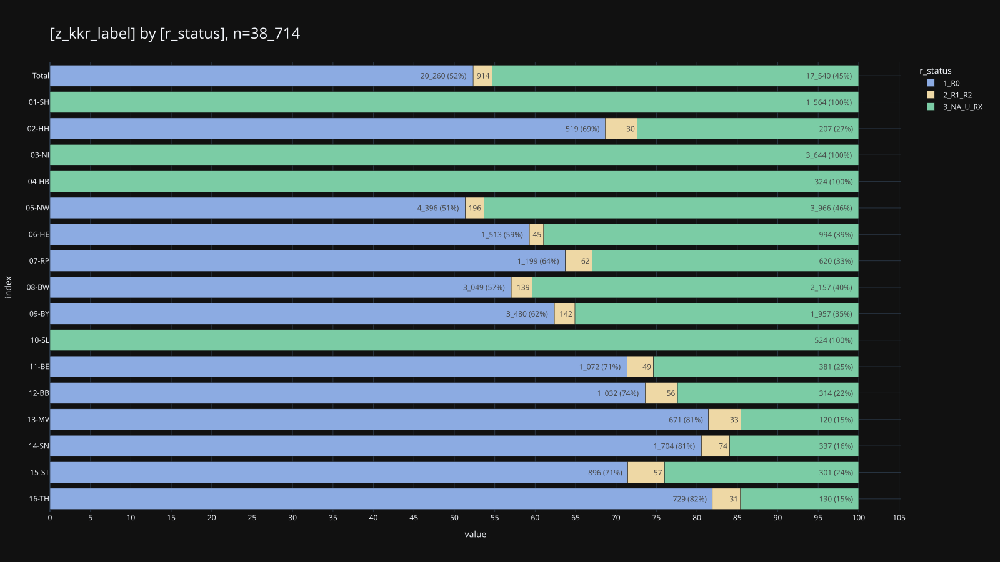
    


<!-- SCALE-40% -->


<style type="text/css">
#T_df27c th {
  text-align: right;
  font-size: 9pt;
}
#T_df27c td {
  text-align: right;
  font-size: 7pt;
}
#T_df27c_row0_col0, #T_df27c_row0_col1, #T_df27c_row2_col0, #T_df27c_row2_col1, #T_df27c_row3_col0, #T_df27c_row3_col1, #T_df27c_row9_col0, #T_df27c_row9_col1 {
  width: 10em;
  font-family: Courier;
}
#T_df27c_row0_col2 {
  width: 10em;
  background: linear-gradient(90deg, #444444 39.4%, transparent 39.4%);
  font-family: Courier;
}
#T_df27c_row0_col3, #T_df27c_row1_col3, #T_df27c_row2_col3, #T_df27c_row3_col3, #T_df27c_row4_col3, #T_df27c_row5_col3, #T_df27c_row6_col3, #T_df27c_row7_col3, #T_df27c_row8_col3, #T_df27c_row9_col3, #T_df27c_row10_col3, #T_df27c_row11_col3, #T_df27c_row12_col3, #T_df27c_row13_col3, #T_df27c_row14_col3, #T_df27c_row15_col3, #T_df27c_row16_col0, #T_df27c_row16_col1, #T_df27c_row16_col2, #T_df27c_row16_col3 {
  font-family: Courier;
}
#T_df27c_row1_col0 {
  width: 10em;
  background: linear-gradient(90deg, #444444 11.8%, transparent 11.8%);
  font-family: Courier;
}
#T_df27c_row1_col1, #T_df27c_row12_col0 {
  width: 10em;
  background: linear-gradient(90deg, #444444 15.3%, transparent 15.3%);
  font-family: Courier;
}
#T_df27c_row1_col2 {
  width: 10em;
  background: linear-gradient(90deg, #444444 5.2%, transparent 5.2%);
  font-family: Courier;
}
#T_df27c_row2_col2 {
  width: 10em;
  background: linear-gradient(90deg, #444444 91.9%, transparent 91.9%);
  font-family: Courier;
}
#T_df27c_row3_col2 {
  width: 10em;
  background: linear-gradient(90deg, #444444 8.2%, transparent 8.2%);
  font-family: Courier;
}
#T_df27c_row4_col0, #T_df27c_row4_col1, #T_df27c_row4_col2 {
  width: 10em;
  background: linear-gradient(90deg, #444444 100.0%, transparent 100.0%);
  font-family: Courier;
}
#T_df27c_row5_col0 {
  width: 10em;
  background: linear-gradient(90deg, #444444 34.4%, transparent 34.4%);
  font-family: Courier;
}
#T_df27c_row5_col1 {
  width: 10em;
  background: linear-gradient(90deg, #444444 23.0%, transparent 23.0%);
  font-family: Courier;
}
#T_df27c_row5_col2 {
  width: 10em;
  background: linear-gradient(90deg, #444444 25.1%, transparent 25.1%);
  font-family: Courier;
}
#T_df27c_row6_col0 {
  width: 10em;
  background: linear-gradient(90deg, #444444 27.3%, transparent 27.3%);
  font-family: Courier;
}
#T_df27c_row6_col1 {
  width: 10em;
  background: linear-gradient(90deg, #444444 31.6%, transparent 31.6%);
  font-family: Courier;
}
#T_df27c_row6_col2 {
  width: 10em;
  background: linear-gradient(90deg, #444444 15.6%, transparent 15.6%);
  font-family: Courier;
}
#T_df27c_row7_col0 {
  width: 10em;
  background: linear-gradient(90deg, #444444 69.4%, transparent 69.4%);
  font-family: Courier;
}
#T_df27c_row7_col1 {
  width: 10em;
  background: linear-gradient(90deg, #444444 70.9%, transparent 70.9%);
  font-family: Courier;
}
#T_df27c_row7_col2 {
  width: 10em;
  background: linear-gradient(90deg, #444444 54.4%, transparent 54.4%);
  font-family: Courier;
}
#T_df27c_row8_col0 {
  width: 10em;
  background: linear-gradient(90deg, #444444 79.2%, transparent 79.2%);
  font-family: Courier;
}
#T_df27c_row8_col1 {
  width: 10em;
  background: linear-gradient(90deg, #444444 72.4%, transparent 72.4%);
  font-family: Courier;
}
#T_df27c_row8_col2 {
  width: 10em;
  background: linear-gradient(90deg, #444444 49.3%, transparent 49.3%);
  font-family: Courier;
}
#T_df27c_row9_col2 {
  width: 10em;
  background: linear-gradient(90deg, #444444 13.2%, transparent 13.2%);
  font-family: Courier;
}
#T_df27c_row10_col0 {
  width: 10em;
  background: linear-gradient(90deg, #444444 24.4%, transparent 24.4%);
  font-family: Courier;
}
#T_df27c_row10_col1 {
  width: 10em;
  background: linear-gradient(90deg, #444444 25.0%, transparent 25.0%);
  font-family: Courier;
}
#T_df27c_row10_col2 {
  width: 10em;
  background: linear-gradient(90deg, #444444 9.6%, transparent 9.6%);
  font-family: Courier;
}
#T_df27c_row11_col0 {
  width: 10em;
  background: linear-gradient(90deg, #444444 23.5%, transparent 23.5%);
  font-family: Courier;
}
#T_df27c_row11_col1 {
  width: 10em;
  background: linear-gradient(90deg, #444444 28.6%, transparent 28.6%);
  font-family: Courier;
}
#T_df27c_row11_col2 {
  width: 10em;
  background: linear-gradient(90deg, #444444 7.9%, transparent 7.9%);
  font-family: Courier;
}
#T_df27c_row12_col1 {
  width: 10em;
  background: linear-gradient(90deg, #444444 16.8%, transparent 16.8%);
  font-family: Courier;
}
#T_df27c_row12_col2 {
  width: 10em;
  background: linear-gradient(90deg, #444444 3.0%, transparent 3.0%);
  font-family: Courier;
}
#T_df27c_row13_col0 {
  width: 10em;
  background: linear-gradient(90deg, #444444 38.8%, transparent 38.8%);
  font-family: Courier;
}
#T_df27c_row13_col1 {
  width: 10em;
  background: linear-gradient(90deg, #444444 37.8%, transparent 37.8%);
  font-family: Courier;
}
#T_df27c_row13_col2 {
  width: 10em;
  background: linear-gradient(90deg, #444444 8.5%, transparent 8.5%);
  font-family: Courier;
}
#T_df27c_row14_col0 {
  width: 10em;
  background: linear-gradient(90deg, #444444 20.4%, transparent 20.4%);
  font-family: Courier;
}
#T_df27c_row14_col1 {
  width: 10em;
  background: linear-gradient(90deg, #444444 29.1%, transparent 29.1%);
  font-family: Courier;
}
#T_df27c_row14_col2 {
  width: 10em;
  background: linear-gradient(90deg, #444444 7.6%, transparent 7.6%);
  font-family: Courier;
}
#T_df27c_row15_col0 {
  width: 10em;
  background: linear-gradient(90deg, #444444 16.6%, transparent 16.6%);
  font-family: Courier;
}
#T_df27c_row15_col1 {
  width: 10em;
  background: linear-gradient(90deg, #444444 15.8%, transparent 15.8%);
  font-family: Courier;
}
#T_df27c_row15_col2 {
  width: 10em;
  background: linear-gradient(90deg, #444444 3.3%, transparent 3.3%);
  font-family: Courier;
}
</style>
<table id="T_df27c">
  <thead>
    <tr>
      <th class="index_name level0" >r_status</th>
      <th id="T_df27c_level0_col0" class="col_heading level0 col0" >1_R0</th>
      <th id="T_df27c_level0_col1" class="col_heading level0 col1" >2_R1_R2</th>
      <th id="T_df27c_level0_col2" class="col_heading level0 col2" >3_NA_U_RX</th>
      <th id="T_df27c_level0_col3" class="col_heading level0 col3" >Total</th>
    </tr>
    <tr>
      <th class="index_name level0" >z_kkr_label</th>
      <th class="blank col0" >&nbsp;</th>
      <th class="blank col1" >&nbsp;</th>
      <th class="blank col2" >&nbsp;</th>
      <th class="blank col3" >&nbsp;</th>
    </tr>
  </thead>
  <tbody>
    <tr>
      <th id="T_df27c_level0_row0" class="row_heading level0 row0" >01-SH</th>
      <td id="T_df27c_row0_col0" class="data row0 col0" ><span style="color: #888888">0 </span></td>
      <td id="T_df27c_row0_col1" class="data row0 col1" ><span style="color: #888888">0 </span></td>
      <td id="T_df27c_row0_col2" class="data row0 col2" >1_564 </td>
      <td id="T_df27c_row0_col3" class="data row0 col3" >1_564 </td>
    </tr>
    <tr>
      <th id="T_df27c_level0_row1" class="row_heading level0 row1" >02-HH</th>
      <td id="T_df27c_row1_col0" class="data row1 col0" >519 </td>
      <td id="T_df27c_row1_col1" class="data row1 col1" >30 </td>
      <td id="T_df27c_row1_col2" class="data row1 col2" >207 </td>
      <td id="T_df27c_row1_col3" class="data row1 col3" >756 </td>
    </tr>
    <tr>
      <th id="T_df27c_level0_row2" class="row_heading level0 row2" >03-NI</th>
      <td id="T_df27c_row2_col0" class="data row2 col0" ><span style="color: #888888">0 </span></td>
      <td id="T_df27c_row2_col1" class="data row2 col1" ><span style="color: #888888">0 </span></td>
      <td id="T_df27c_row2_col2" class="data row2 col2" >3_644 </td>
      <td id="T_df27c_row2_col3" class="data row2 col3" >3_644 </td>
    </tr>
    <tr>
      <th id="T_df27c_level0_row3" class="row_heading level0 row3" >04-HB</th>
      <td id="T_df27c_row3_col0" class="data row3 col0" ><span style="color: #888888">0 </span></td>
      <td id="T_df27c_row3_col1" class="data row3 col1" ><span style="color: #888888">0 </span></td>
      <td id="T_df27c_row3_col2" class="data row3 col2" >324 </td>
      <td id="T_df27c_row3_col3" class="data row3 col3" >324 </td>
    </tr>
    <tr>
      <th id="T_df27c_level0_row4" class="row_heading level0 row4" >05-NW</th>
      <td id="T_df27c_row4_col0" class="data row4 col0" >4_396 </td>
      <td id="T_df27c_row4_col1" class="data row4 col1" >196 </td>
      <td id="T_df27c_row4_col2" class="data row4 col2" >3_966 </td>
      <td id="T_df27c_row4_col3" class="data row4 col3" >8_558 </td>
    </tr>
    <tr>
      <th id="T_df27c_level0_row5" class="row_heading level0 row5" >06-HE</th>
      <td id="T_df27c_row5_col0" class="data row5 col0" >1_513 </td>
      <td id="T_df27c_row5_col1" class="data row5 col1" >45 </td>
      <td id="T_df27c_row5_col2" class="data row5 col2" >994 </td>
      <td id="T_df27c_row5_col3" class="data row5 col3" >2_552 </td>
    </tr>
    <tr>
      <th id="T_df27c_level0_row6" class="row_heading level0 row6" >07-RP</th>
      <td id="T_df27c_row6_col0" class="data row6 col0" >1_199 </td>
      <td id="T_df27c_row6_col1" class="data row6 col1" >62 </td>
      <td id="T_df27c_row6_col2" class="data row6 col2" >620 </td>
      <td id="T_df27c_row6_col3" class="data row6 col3" >1_881 </td>
    </tr>
    <tr>
      <th id="T_df27c_level0_row7" class="row_heading level0 row7" >08-BW</th>
      <td id="T_df27c_row7_col0" class="data row7 col0" >3_049 </td>
      <td id="T_df27c_row7_col1" class="data row7 col1" >139 </td>
      <td id="T_df27c_row7_col2" class="data row7 col2" >2_157 </td>
      <td id="T_df27c_row7_col3" class="data row7 col3" >5_345 </td>
    </tr>
    <tr>
      <th id="T_df27c_level0_row8" class="row_heading level0 row8" >09-BY</th>
      <td id="T_df27c_row8_col0" class="data row8 col0" >3_480 </td>
      <td id="T_df27c_row8_col1" class="data row8 col1" >142 </td>
      <td id="T_df27c_row8_col2" class="data row8 col2" >1_957 </td>
      <td id="T_df27c_row8_col3" class="data row8 col3" >5_579 </td>
    </tr>
    <tr>
      <th id="T_df27c_level0_row9" class="row_heading level0 row9" >10-SL</th>
      <td id="T_df27c_row9_col0" class="data row9 col0" ><span style="color: #888888">0 </span></td>
      <td id="T_df27c_row9_col1" class="data row9 col1" ><span style="color: #888888">0 </span></td>
      <td id="T_df27c_row9_col2" class="data row9 col2" >524 </td>
      <td id="T_df27c_row9_col3" class="data row9 col3" >524 </td>
    </tr>
    <tr>
      <th id="T_df27c_level0_row10" class="row_heading level0 row10" >11-BE</th>
      <td id="T_df27c_row10_col0" class="data row10 col0" >1_072 </td>
      <td id="T_df27c_row10_col1" class="data row10 col1" >49 </td>
      <td id="T_df27c_row10_col2" class="data row10 col2" >381 </td>
      <td id="T_df27c_row10_col3" class="data row10 col3" >1_502 </td>
    </tr>
    <tr>
      <th id="T_df27c_level0_row11" class="row_heading level0 row11" >12-BB</th>
      <td id="T_df27c_row11_col0" class="data row11 col0" >1_032 </td>
      <td id="T_df27c_row11_col1" class="data row11 col1" >56 </td>
      <td id="T_df27c_row11_col2" class="data row11 col2" >314 </td>
      <td id="T_df27c_row11_col3" class="data row11 col3" >1_402 </td>
    </tr>
    <tr>
      <th id="T_df27c_level0_row12" class="row_heading level0 row12" >13-MV</th>
      <td id="T_df27c_row12_col0" class="data row12 col0" >671 </td>
      <td id="T_df27c_row12_col1" class="data row12 col1" >33 </td>
      <td id="T_df27c_row12_col2" class="data row12 col2" >120 </td>
      <td id="T_df27c_row12_col3" class="data row12 col3" >824 </td>
    </tr>
    <tr>
      <th id="T_df27c_level0_row13" class="row_heading level0 row13" >14-SN</th>
      <td id="T_df27c_row13_col0" class="data row13 col0" >1_704 </td>
      <td id="T_df27c_row13_col1" class="data row13 col1" >74 </td>
      <td id="T_df27c_row13_col2" class="data row13 col2" >337 </td>
      <td id="T_df27c_row13_col3" class="data row13 col3" >2_115 </td>
    </tr>
    <tr>
      <th id="T_df27c_level0_row14" class="row_heading level0 row14" >15-ST</th>
      <td id="T_df27c_row14_col0" class="data row14 col0" >896 </td>
      <td id="T_df27c_row14_col1" class="data row14 col1" >57 </td>
      <td id="T_df27c_row14_col2" class="data row14 col2" >301 </td>
      <td id="T_df27c_row14_col3" class="data row14 col3" >1_254 </td>
    </tr>
    <tr>
      <th id="T_df27c_level0_row15" class="row_heading level0 row15" >16-TH</th>
      <td id="T_df27c_row15_col0" class="data row15 col0" >729 </td>
      <td id="T_df27c_row15_col1" class="data row15 col1" >31 </td>
      <td id="T_df27c_row15_col2" class="data row15 col2" >130 </td>
      <td id="T_df27c_row15_col3" class="data row15 col3" >890 </td>
    </tr>
    <tr>
      <th id="T_df27c_level0_row16" class="row_heading level0 row16" >Total</th>
      <td id="T_df27c_row16_col0" class="data row16 col0" >20_260 </td>
      <td id="T_df27c_row16_col1" class="data row16 col1" >914 </td>
      <td id="T_df27c_row16_col2" class="data row16 col2" >17_540 </td>
      <td id="T_df27c_row16_col3" class="data row16 col3" >38_714 </td>
    </tr>
  </tbody>
</table>


#### <a id='toc1_7_3_1_'></a>[davon: Verteilung nur R0](#toc0_)

**enge Definition eines Rezidivs** 
- Filter: lokaler Beurteilung Residualstatus = R0 (UND M <> 1)
- Rezidiv wenn  
  - Gesamtbeurteilung: Y  oder  
  - Lokaler Tumorstatus: R  oder  
  - Tumorstatus Lymphknoten:R oder  
  - Verlauf Fernmetastasen:R   

**erweiterte Definition (Verworfen)**
- Rezidiv wenn
  - (TNM)r_Symbol:r UND 
  - (Folgeereignis T>0 oder Folgeereignis N>0 oder Folgeereignis M>0)

**Diagramm**
- gezählt sind Tumore mit R0
- Kategorien
  - `1_fo_relapse` - Tumore mit Rezidiv nach enger Definition
  - `2_fo_relapse_tnm` - Tumore mit Rezidiv nach erweiterter Definition
  - `3_fo_no_relapse` - Tumore mit Folgeereignis ohne o.a. Rezidiv
  - `4_no_fo` - Tumore ohne Folgeereignis
- ℹ️ kkr mit "leerem Balken" nicht nicht in der Grundmenge enthalten, da sie keine R0 ausweisen


<!-- START_TOKEN -->


    counts: distinct z_tum_id
    ---
    n = 3_241_401


    └ [DJ 2020]:           n = 741_531
    └ [nur C18]:           n = 38_714 (100.0%) ██████████████████████████████
    └ [Residualstatus R0]: n = 20_260  (52.3%) ░░░░░░░░░░░░░░░███████████████


<!-- END_TOKEN -->


<details>
<summary>filter-sql</summary>

```sql
z_dy = 2020
and z_icd10_3d in ('C18')
and upper(left(Lokale_Beurteilung_Residualstatus,2)) = 'R0'
```

</details>


    
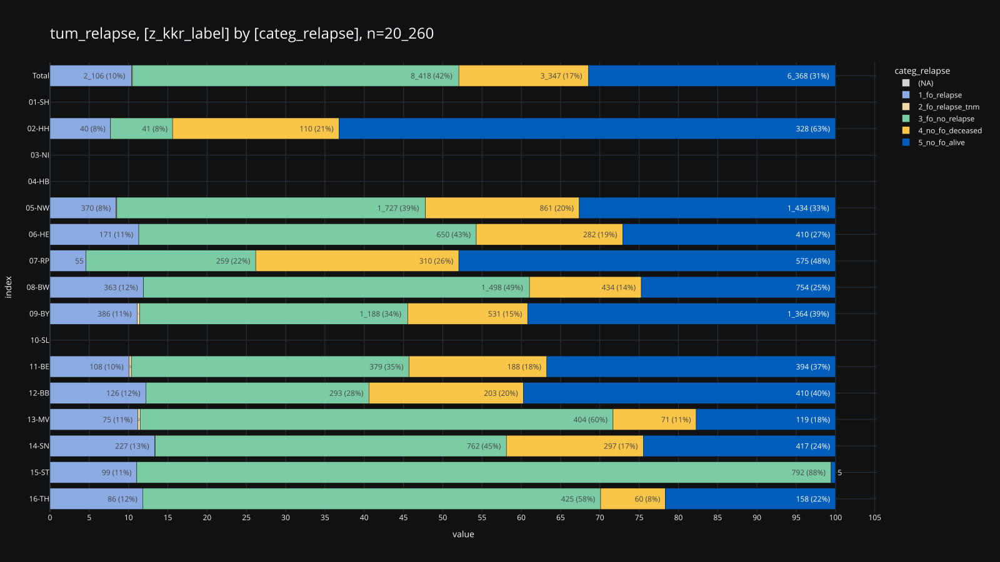
    


<!-- SCALE-50%, -->


<style type="text/css">
#T_39119 th {
  text-align: right;
}
#T_39119 td {
  text-align: right;
}
#T_39119_row0_col0, #T_39119_row0_col2 {
  width: 10em;
  background: linear-gradient(90deg, #444444 0.2%, transparent 0.2%);
  font-family: Courier;
}
#T_39119_row0_col1, #T_39119_row2_col1, #T_39119_row3_col1, #T_39119_row4_col1, #T_39119_row7_col1, #T_39119_row10_col1, #T_39119_row10_col3, #T_39119_row11_col1 {
  width: 10em;
  font-family: Courier;
}
#T_39119_row0_col3, #T_39119_row6_col0, #T_39119_row10_col0 {
  width: 10em;
  background: linear-gradient(90deg, #444444 0.5%, transparent 0.5%);
  font-family: Courier;
}
#T_39119_row0_col4 {
  width: 10em;
  background: linear-gradient(90deg, #444444 1.6%, transparent 1.6%);
  font-family: Courier;
}
#T_39119_row0_col5, #T_39119_row5_col3 {
  width: 10em;
  background: linear-gradient(90deg, #444444 2.6%, transparent 2.6%);
  font-family: Courier;
}
#T_39119_row1_col0, #T_39119_row4_col0 {
  width: 10em;
  background: linear-gradient(90deg, #444444 1.8%, transparent 1.8%);
  font-family: Courier;
}
#T_39119_row1_col1, #T_39119_row6_col1, #T_39119_row8_col1, #T_39119_row9_col1, #T_39119_row10_col4 {
  width: 10em;
  background: linear-gradient(90deg, #444444 0.0%, transparent 0.0%);
  font-family: Courier;
}
#T_39119_row1_col2 {
  width: 10em;
  background: linear-gradient(90deg, #444444 8.5%, transparent 8.5%);
  font-family: Courier;
}
#T_39119_row1_col3 {
  width: 10em;
  background: linear-gradient(90deg, #444444 4.2%, transparent 4.2%);
  font-family: Courier;
}
#T_39119_row1_col4 {
  width: 10em;
  background: linear-gradient(90deg, #444444 7.1%, transparent 7.1%);
  font-family: Courier;
}
#T_39119_row1_col5 {
  width: 10em;
  background: linear-gradient(90deg, #444444 21.7%, transparent 21.7%);
  font-family: Courier;
}
#T_39119_row2_col0, #T_39119_row11_col4 {
  width: 10em;
  background: linear-gradient(90deg, #444444 0.8%, transparent 0.8%);
  font-family: Courier;
}
#T_39119_row2_col2 {
  width: 10em;
  background: linear-gradient(90deg, #444444 3.2%, transparent 3.2%);
  font-family: Courier;
}
#T_39119_row2_col3, #T_39119_row7_col2 {
  width: 10em;
  background: linear-gradient(90deg, #444444 1.4%, transparent 1.4%);
  font-family: Courier;
}
#T_39119_row2_col4, #T_39119_row7_col4, #T_39119_row8_col2 {
  width: 10em;
  background: linear-gradient(90deg, #444444 2.0%, transparent 2.0%);
  font-family: Courier;
}
#T_39119_row2_col5 {
  width: 10em;
  background: linear-gradient(90deg, #444444 7.5%, transparent 7.5%);
  font-family: Courier;
}
#T_39119_row3_col0, #T_39119_row11_col3 {
  width: 10em;
  background: linear-gradient(90deg, #444444 0.3%, transparent 0.3%);
  font-family: Courier;
}
#T_39119_row3_col2 {
  width: 10em;
  background: linear-gradient(90deg, #444444 1.3%, transparent 1.3%);
  font-family: Courier;
}
#T_39119_row3_col3, #T_39119_row9_col3 {
  width: 10em;
  background: linear-gradient(90deg, #444444 1.5%, transparent 1.5%);
  font-family: Courier;
}
#T_39119_row3_col4 {
  width: 10em;
  background: linear-gradient(90deg, #444444 2.8%, transparent 2.8%);
  font-family: Courier;
}
#T_39119_row3_col5, #T_39119_row5_col2 {
  width: 10em;
  background: linear-gradient(90deg, #444444 5.9%, transparent 5.9%);
  font-family: Courier;
}
#T_39119_row4_col2 {
  width: 10em;
  background: linear-gradient(90deg, #444444 7.4%, transparent 7.4%);
  font-family: Courier;
}
#T_39119_row4_col3, #T_39119_row9_col4, #T_39119_row11_col2 {
  width: 10em;
  background: linear-gradient(90deg, #444444 2.1%, transparent 2.1%);
  font-family: Courier;
}
#T_39119_row4_col4 {
  width: 10em;
  background: linear-gradient(90deg, #444444 3.7%, transparent 3.7%);
  font-family: Courier;
}
#T_39119_row4_col5 {
  width: 10em;
  background: linear-gradient(90deg, #444444 15.0%, transparent 15.0%);
  font-family: Courier;
}
#T_39119_row5_col0, #T_39119_row6_col2, #T_39119_row6_col4 {
  width: 10em;
  background: linear-gradient(90deg, #444444 1.9%, transparent 1.9%);
  font-family: Courier;
}
#T_39119_row5_col1, #T_39119_row12_col1 {
  width: 10em;
  background: linear-gradient(90deg, #444444 0.1%, transparent 0.1%);
  font-family: Courier;
}
#T_39119_row5_col4 {
  width: 10em;
  background: linear-gradient(90deg, #444444 6.7%, transparent 6.7%);
  font-family: Courier;
}
#T_39119_row5_col5 {
  width: 10em;
  background: linear-gradient(90deg, #444444 17.2%, transparent 17.2%);
  font-family: Courier;
}
#T_39119_row6_col3 {
  width: 10em;
  background: linear-gradient(90deg, #444444 0.9%, transparent 0.9%);
  font-family: Courier;
}
#T_39119_row6_col5 {
  width: 10em;
  background: linear-gradient(90deg, #444444 5.3%, transparent 5.3%);
  font-family: Courier;
}
#T_39119_row7_col0, #T_39119_row8_col4 {
  width: 10em;
  background: linear-gradient(90deg, #444444 0.6%, transparent 0.6%);
  font-family: Courier;
}
#T_39119_row7_col3 {
  width: 10em;
  background: linear-gradient(90deg, #444444 1.0%, transparent 1.0%);
  font-family: Courier;
}
#T_39119_row7_col5 {
  width: 10em;
  background: linear-gradient(90deg, #444444 5.1%, transparent 5.1%);
  font-family: Courier;
}
#T_39119_row8_col0, #T_39119_row8_col3, #T_39119_row11_col0 {
  width: 10em;
  background: linear-gradient(90deg, #444444 0.4%, transparent 0.4%);
  font-family: Courier;
}
#T_39119_row8_col5 {
  width: 10em;
  background: linear-gradient(90deg, #444444 3.3%, transparent 3.3%);
  font-family: Courier;
}
#T_39119_row9_col0 {
  width: 10em;
  background: linear-gradient(90deg, #444444 1.1%, transparent 1.1%);
  font-family: Courier;
}
#T_39119_row9_col2 {
  width: 10em;
  background: linear-gradient(90deg, #444444 3.8%, transparent 3.8%);
  font-family: Courier;
}
#T_39119_row9_col5 {
  width: 10em;
  background: linear-gradient(90deg, #444444 8.4%, transparent 8.4%);
  font-family: Courier;
}
#T_39119_row10_col2 {
  width: 10em;
  background: linear-gradient(90deg, #444444 3.9%, transparent 3.9%);
  font-family: Courier;
}
#T_39119_row10_col5 {
  width: 10em;
  background: linear-gradient(90deg, #444444 4.4%, transparent 4.4%);
  font-family: Courier;
}
#T_39119_row11_col5 {
  width: 10em;
  background: linear-gradient(90deg, #444444 3.6%, transparent 3.6%);
  font-family: Courier;
}
#T_39119_row12_col0 {
  width: 10em;
  background: linear-gradient(90deg, #444444 10.4%, transparent 10.4%);
  font-family: Courier;
}
#T_39119_row12_col2 {
  width: 10em;
  background: linear-gradient(90deg, #444444 41.5%, transparent 41.5%);
  font-family: Courier;
}
#T_39119_row12_col3 {
  width: 10em;
  background: linear-gradient(90deg, #444444 16.5%, transparent 16.5%);
  font-family: Courier;
}
#T_39119_row12_col4 {
  width: 10em;
  background: linear-gradient(90deg, #444444 31.4%, transparent 31.4%);
  font-family: Courier;
}
#T_39119_row12_col5 {
  width: 10em;
  background: linear-gradient(90deg, #444444 100.0%, transparent 100.0%);
  font-family: Courier;
}
</style>
<table id="T_39119">
  <thead>
    <tr>
      <th class="index_name level0" >categ_relapse</th>
      <th id="T_39119_level0_col0" class="col_heading level0 col0" >1_fo_relapse</th>
      <th id="T_39119_level0_col1" class="col_heading level0 col1" >2_fo_relapse_tnm</th>
      <th id="T_39119_level0_col2" class="col_heading level0 col2" >3_fo_no_relapse</th>
      <th id="T_39119_level0_col3" class="col_heading level0 col3" >4_no_fo_deceased</th>
      <th id="T_39119_level0_col4" class="col_heading level0 col4" >5_no_fo_alive</th>
      <th id="T_39119_level0_col5" class="col_heading level0 col5" >Total</th>
    </tr>
    <tr>
      <th class="index_name level0" >z_kkr_label</th>
      <th class="blank col0" >&nbsp;</th>
      <th class="blank col1" >&nbsp;</th>
      <th class="blank col2" >&nbsp;</th>
      <th class="blank col3" >&nbsp;</th>
      <th class="blank col4" >&nbsp;</th>
      <th class="blank col5" >&nbsp;</th>
    </tr>
  </thead>
  <tbody>
    <tr>
      <th id="T_39119_level0_row0" class="row_heading level0 row0" >02-HH</th>
      <td id="T_39119_row0_col0" class="data row0 col0" >40 </td>
      <td id="T_39119_row0_col1" class="data row0 col1" ><span style="color: #888888">0 </span></td>
      <td id="T_39119_row0_col2" class="data row0 col2" >41 </td>
      <td id="T_39119_row0_col3" class="data row0 col3" >110 </td>
      <td id="T_39119_row0_col4" class="data row0 col4" >328 </td>
      <td id="T_39119_row0_col5" class="data row0 col5" >519 </td>
    </tr>
    <tr>
      <th id="T_39119_level0_row1" class="row_heading level0 row1" >05-NW</th>
      <td id="T_39119_row1_col0" class="data row1 col0" >370 </td>
      <td id="T_39119_row1_col1" class="data row1 col1" >4 </td>
      <td id="T_39119_row1_col2" class="data row1 col2" >1_727 </td>
      <td id="T_39119_row1_col3" class="data row1 col3" >861 </td>
      <td id="T_39119_row1_col4" class="data row1 col4" >1_434 </td>
      <td id="T_39119_row1_col5" class="data row1 col5" >4_396 </td>
    </tr>
    <tr>
      <th id="T_39119_level0_row2" class="row_heading level0 row2" >06-HE</th>
      <td id="T_39119_row2_col0" class="data row2 col0" >171 </td>
      <td id="T_39119_row2_col1" class="data row2 col1" ><span style="color: #888888">0 </span></td>
      <td id="T_39119_row2_col2" class="data row2 col2" >650 </td>
      <td id="T_39119_row2_col3" class="data row2 col3" >282 </td>
      <td id="T_39119_row2_col4" class="data row2 col4" >410 </td>
      <td id="T_39119_row2_col5" class="data row2 col5" >1_513 </td>
    </tr>
    <tr>
      <th id="T_39119_level0_row3" class="row_heading level0 row3" >07-RP</th>
      <td id="T_39119_row3_col0" class="data row3 col0" >55 </td>
      <td id="T_39119_row3_col1" class="data row3 col1" ><span style="color: #888888">0 </span></td>
      <td id="T_39119_row3_col2" class="data row3 col2" >259 </td>
      <td id="T_39119_row3_col3" class="data row3 col3" >310 </td>
      <td id="T_39119_row3_col4" class="data row3 col4" >575 </td>
      <td id="T_39119_row3_col5" class="data row3 col5" >1_199 </td>
    </tr>
    <tr>
      <th id="T_39119_level0_row4" class="row_heading level0 row4" >08-BW</th>
      <td id="T_39119_row4_col0" class="data row4 col0" >363 </td>
      <td id="T_39119_row4_col1" class="data row4 col1" ><span style="color: #888888">0 </span></td>
      <td id="T_39119_row4_col2" class="data row4 col2" >1_498 </td>
      <td id="T_39119_row4_col3" class="data row4 col3" >434 </td>
      <td id="T_39119_row4_col4" class="data row4 col4" >754 </td>
      <td id="T_39119_row4_col5" class="data row4 col5" >3_049 </td>
    </tr>
    <tr>
      <th id="T_39119_level0_row5" class="row_heading level0 row5" >09-BY</th>
      <td id="T_39119_row5_col0" class="data row5 col0" >386 </td>
      <td id="T_39119_row5_col1" class="data row5 col1" >11 </td>
      <td id="T_39119_row5_col2" class="data row5 col2" >1_188 </td>
      <td id="T_39119_row5_col3" class="data row5 col3" >531 </td>
      <td id="T_39119_row5_col4" class="data row5 col4" >1_364 </td>
      <td id="T_39119_row5_col5" class="data row5 col5" >3_480 </td>
    </tr>
    <tr>
      <th id="T_39119_level0_row6" class="row_heading level0 row6" >11-BE</th>
      <td id="T_39119_row6_col0" class="data row6 col0" >108 </td>
      <td id="T_39119_row6_col1" class="data row6 col1" >3 </td>
      <td id="T_39119_row6_col2" class="data row6 col2" >379 </td>
      <td id="T_39119_row6_col3" class="data row6 col3" >188 </td>
      <td id="T_39119_row6_col4" class="data row6 col4" >394 </td>
      <td id="T_39119_row6_col5" class="data row6 col5" >1_072 </td>
    </tr>
    <tr>
      <th id="T_39119_level0_row7" class="row_heading level0 row7" >12-BB</th>
      <td id="T_39119_row7_col0" class="data row7 col0" >126 </td>
      <td id="T_39119_row7_col1" class="data row7 col1" ><span style="color: #888888">0 </span></td>
      <td id="T_39119_row7_col2" class="data row7 col2" >293 </td>
      <td id="T_39119_row7_col3" class="data row7 col3" >203 </td>
      <td id="T_39119_row7_col4" class="data row7 col4" >410 </td>
      <td id="T_39119_row7_col5" class="data row7 col5" >1_032 </td>
    </tr>
    <tr>
      <th id="T_39119_level0_row8" class="row_heading level0 row8" >13-MV</th>
      <td id="T_39119_row8_col0" class="data row8 col0" >75 </td>
      <td id="T_39119_row8_col1" class="data row8 col1" >2 </td>
      <td id="T_39119_row8_col2" class="data row8 col2" >404 </td>
      <td id="T_39119_row8_col3" class="data row8 col3" >71 </td>
      <td id="T_39119_row8_col4" class="data row8 col4" >119 </td>
      <td id="T_39119_row8_col5" class="data row8 col5" >671 </td>
    </tr>
    <tr>
      <th id="T_39119_level0_row9" class="row_heading level0 row9" >14-SN</th>
      <td id="T_39119_row9_col0" class="data row9 col0" >227 </td>
      <td id="T_39119_row9_col1" class="data row9 col1" >1 </td>
      <td id="T_39119_row9_col2" class="data row9 col2" >762 </td>
      <td id="T_39119_row9_col3" class="data row9 col3" >297 </td>
      <td id="T_39119_row9_col4" class="data row9 col4" >417 </td>
      <td id="T_39119_row9_col5" class="data row9 col5" >1_704 </td>
    </tr>
    <tr>
      <th id="T_39119_level0_row10" class="row_heading level0 row10" >15-ST</th>
      <td id="T_39119_row10_col0" class="data row10 col0" >99 </td>
      <td id="T_39119_row10_col1" class="data row10 col1" ><span style="color: #888888">0 </span></td>
      <td id="T_39119_row10_col2" class="data row10 col2" >792 </td>
      <td id="T_39119_row10_col3" class="data row10 col3" ><span style="color: #888888">0 </span></td>
      <td id="T_39119_row10_col4" class="data row10 col4" >5 </td>
      <td id="T_39119_row10_col5" class="data row10 col5" >896 </td>
    </tr>
    <tr>
      <th id="T_39119_level0_row11" class="row_heading level0 row11" >16-TH</th>
      <td id="T_39119_row11_col0" class="data row11 col0" >86 </td>
      <td id="T_39119_row11_col1" class="data row11 col1" ><span style="color: #888888">0 </span></td>
      <td id="T_39119_row11_col2" class="data row11 col2" >425 </td>
      <td id="T_39119_row11_col3" class="data row11 col3" >60 </td>
      <td id="T_39119_row11_col4" class="data row11 col4" >158 </td>
      <td id="T_39119_row11_col5" class="data row11 col5" >729 </td>
    </tr>
    <tr>
      <th id="T_39119_level0_row12" class="row_heading level0 row12" >Total</th>
      <td id="T_39119_row12_col0" class="data row12 col0" >2_106 </td>
      <td id="T_39119_row12_col1" class="data row12 col1" >21 </td>
      <td id="T_39119_row12_col2" class="data row12 col2" >8_418 </td>
      <td id="T_39119_row12_col3" class="data row12 col3" >3_347 </td>
      <td id="T_39119_row12_col4" class="data row12 col4" >6_368 </td>
      <td id="T_39119_row12_col5" class="data row12 col5" >20_260 </td>
    </tr>
  </tbody>
</table>


<br>

## <a id='toc1_8_'></a>[Behandlung innerhalb von 6 Wochen](#toc0_)
- Filter: `C18`-`C20`
- `first_treatment_6w`
  - `<=6w`: erste Behandlung innerhalb von 6 Wochen
  - `>6w`: erste Behandlung nach 6 Wochen
  - `-`: keine Behandlung dokumentiert


<!-- START_TOKEN -->


    counts: all rows (no grouping)
    ---
    n = 3_241_401                    (100.0%) ██████████████████████████████
    └ [DJ 2020-2024]:  n = 2_998_753  (92.5%) ░░░███████████████████████████
    └ [ICD10 C18-C20]:   n = 227_053   (7.0%) ░░░░░░░░░░░░░░░░░░░░░░░░░░░░██


<!-- END_TOKEN -->


<details>
<summary>filter-sql</summary>

```sql
z_dy between 2020 and 2024
and z_icd10_3d in ('C18', 'C19', 'C20')
```

</details>


    
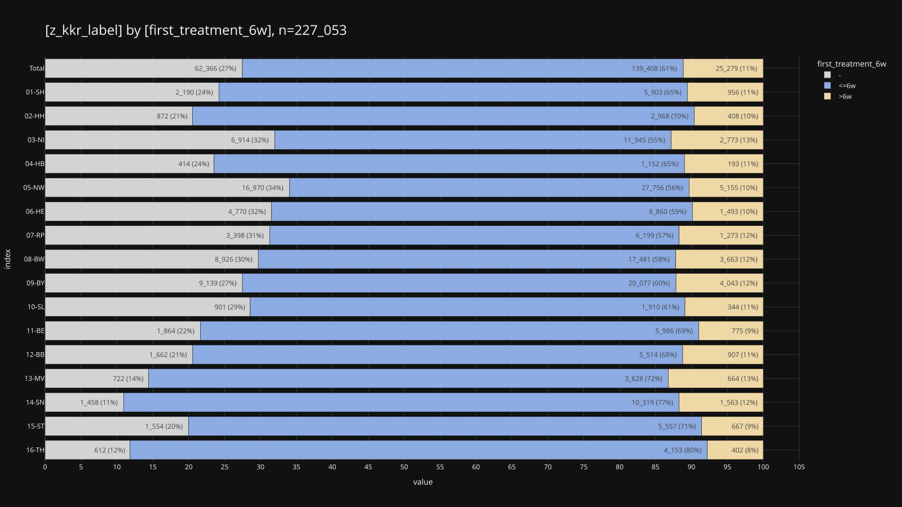
    


    
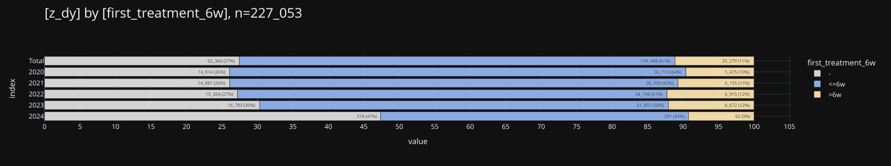
    


### <a id='toc1_8_1_'></a>[Zeitlicher Abstand der Behandlungen](#toc0_)
- Filter: `C18`, Tumore mit Behandlung
- gezählt sind Tumore
- abgebildet sind Median Werte für den Abstand Diagnose bis erste Behandlung in Tagen (logarithmische Skala)


<!-- START_TOKEN -->


    counts: all rows (no grouping)
    ---
    n = 3_241_401
    └ [DJ 2020-2024]:       n = 2_998_753
    └ [nur C18]:            n = 154_219 (100.0%) ██████████████████████████████
    └ [Tumor hat Therapie]: n = 110_579  (71.7%) ░░░░░░░░░█████████████████████


<!-- END_TOKEN -->


<details>
<summary>filter-sql</summary>

```sql
z_dy between 2020 and 2024
and z_icd10_3d in ('C18')
and z_tum_op_count+z_tum_sy_count+z_tum_st_count > 0
```

</details>


    
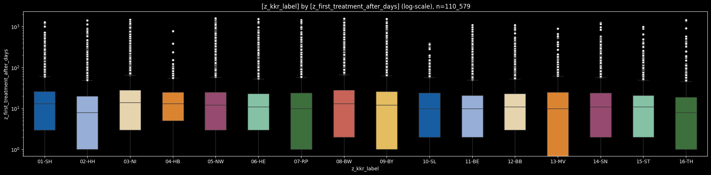
    


    
    column (n = 110_579)         |    notnull    | min | lower | q25  | median | mean  |  q75  | upper |  max  |  std  |  cv 
    -----------------------------+---------------+-----+-------+------+--------+-------+-------+-------+-------+-------+-----
    z_first_treatment_after_days | 110_431 (99%) |   0 |     0 | 2.00 |  12.00 | 24.08 | 25.00 |    59 | 1_604 | 66.87 | 2.78
    
    
    item (n = 110_579) | count  | min | lower | q25  | median | mean  |  q75  | upper |  max  |  std  |  cv 
    -------------------+--------+-----+-------+------+--------+-------+-------+-------+-------+-------+-----
    01-SH              |  4_768 |   0 |     0 | 3.00 |  13.00 | 21.30 | 26.00 |    60 | 1_279 | 48.67 | 2.28
    02-HH              |  2_404 |   0 |     0 | 1.00 |   8.00 | 21.00 | 20.00 |    48 | 1_413 | 67.73 | 3.23
    03-NI              |  9_781 |   0 |     0 | 3.00 |  14.00 | 26.30 | 28.00 |    65 | 1_464 | 67.27 | 2.56
    04-HB              |    961 |   0 |     0 | 5.00 |  13.00 | 19.52 | 25.00 |    55 |   775 | 34.01 | 1.74
    05-NW              | 21_986 |   0 |     0 | 3.00 |  12.00 | 27.21 | 25.00 |    58 | 1_604 | 81.37 | 2.99
    06-HE              |  6_900 |   0 |     0 | 3.00 |  11.00 | 23.55 | 23.00 |    53 | 1_534 | 65.50 | 2.78
    07-RP              |  4_975 |   0 |     0 | 1.00 |  10.00 | 24.69 | 24.00 |    58 | 1_448 | 70.20 | 2.84
    08-BW              | 14_244 |   0 |     0 | 2.00 |  13.00 | 28.89 | 28.00 |    67 | 1_573 | 82.88 | 2.87
    09-BY              | 16_242 |   0 |     0 | 1.00 |  12.00 | 24.96 | 26.00 |    63 | 1_545 | 66.86 | 2.68
    10-SL              |  1_496 |   0 |     0 | 2.00 |  10.00 | 19.17 | 24.00 |    57 |   387 | 35.62 | 1.86
    11-BE              |  4_687 |   0 |     0 | 2.00 |  10.00 | 19.93 | 21.00 |    49 | 1_084 | 53.31 | 2.67
    12-BB              |  4_245 |   0 |     0 | 3.00 |  11.00 | 20.01 | 23.00 |    53 | 1_098 | 45.49 | 2.27
    13-MV              |  2_891 |   0 |     0 | 0.00 |  10.00 | 18.84 | 25.00 |    62 |   898 | 39.51 | 2.10
    14-SN              |  7_827 |   0 |     0 | 2.00 |  11.00 | 19.22 | 24.00 |    57 | 1_216 | 40.53 | 2.11
    15-ST              |  4_000 |   0 |     0 | 2.00 |  11.00 | 17.74 | 21.00 |    49 |   975 | 37.32 | 2.10
    16-TH              |  3_024 |   0 |     0 | 1.00 |   8.00 | 15.63 | 19.00 |    46 | 1_456 | 50.20 | 3.21
    


<!-- ## <a id='toc1_9_'></a>[Behandlungsverlauf](#toc0_)
- Filter: `C18`, nur Tumore mit Therapie
- gezählt sind Tumore
- beschränkt auf die ersten 5 Therapien
- Therapien mit gleichem Tumor / Datum / Behandlung sind zusammengeführt
- verschiedene Therapien mit gleichem Tumor und Datum sind hier nicht entfernt -->

<!-- ## <a id='toc1_10_'></a>[🕹️ interaktiv](#toc0_) -->
