# <a id='toc1_'></a>[Auswertungen: kolorektale Krebserkrankungen](#toc0_)

**Table of contents**<a id='toc0_'></a>    
- [Auswertungen: kolorektale Krebserkrankungen](#toc1_)    
  - [📆 Datenstand](#toc1_1_)    
  - [⚙️ Teildatensatz](#toc1_2_)    
  - [Fallzahlen](#toc1_3_)    
    - [Teildatensatz](#toc1_3_1_)    
    - [Fallzahlen C18-C20 in Verhältnis zu allen Diagnosen](#toc1_3_2_)    
    - [Fallzahlen C18-C20 nach Viersteller](#toc1_3_3_)    
  - [OP](#toc1_4_)    
    - [Operation erfolgt bei C18 mit T_p > 0](#toc1_4_1_)    
    - [Operation erfolgt nach Jahren](#toc1_4_2_)    
  - [OPS](#toc1_5_)    
    - [OPS 5-4xx nach Diagnose](#toc1_5_1_)    
    - [ Verteilung OPS 5-455 bei C18](#toc1_5_2_)    
    - [ Verteilung OPS 5-484 bei C20](#toc1_5_3_)    
    - [Details OPS 5-455.2](#toc1_5_4_)    
      - [Ileozökalresektion](#toc1_5_4_1_)    
      - [rechte Hemikolektomie](#toc1_5_4_2_)    
      - [Sigmaresektion](#toc1_5_4_3_)    
  - [Lokalisation (Fernmetastasen)](#toc1_6_)    
    - [für M1](#toc1_6_1_)    
  - [Rezidive](#toc1_7_)    
    - [Verteilung OP in 2020](#toc1_7_1_)    
      - [davon: Verteilung nur R0](#toc1_7_1_1_)    
  - [Behandlung innerhalb von 6 Wochen](#toc1_8_)    
  - [Erste Behandlung](#toc1_9_)    
    - [Was wurde zuerst behandelt](#toc1_9_1_)    
    - [Zeitlicher Abstand der Behandlungen](#toc1_9_2_)    
  - [Behandlungsverlauf](#toc1_10_)    
  - [🕹️ interaktiv](#toc1_11_)    

<!-- vscode-jupyter-toc-config
	numbering=false
	anchor=true
	flat=false
	minLevel=1
	maxLevel=6
	/vscode-jupyter-toc-config -->
<!-- THIS CELL WILL BE REPLACED ON TOC UPDATE. DO NOT WRITE YOUR TEXT IN THIS CELL -->

    🐍 3.12.8 | 📦 pygwalker: 0.4.9.15 | 📦 plotly: 6.5.0 | 📦 pandas: 2.3.3 | 📦 numpy: 1.26.4 | 📦 duckdb: 1.4.2 | 📦 pandas-plots: 0.22.4 | 📦 connection-helper: 0.13.2


## <a id='toc1_1_'></a>[📆 Datenstand](#toc0_)

    database file:           2025-11-11_data_clin.duckdb
    data tag:                v2.3
    last kkr data import:    2025-09-30
    sql table created:       2025-11-11 11:52:01
    doi:                     10.18444/5.03.01.0005.0021.0002
    document created:        2025-11-26 10:40:56


## <a id='toc1_2_'></a>[⚙️ Teildatensatz](#toc0_)
- Filter für gültige Fälle: (dieser Filter ist für **alle** Analysen gesetzt)
  - `z_dy` (Diagnosejahr) in 2020-2023
  - nichtleere angaben zu
    - `z_kkr` (lieferndes Krebsregister)
    - `z_age` (Diagnosealter)
    - `z_icd10` (Primärdiagnose)
- Fachlicher Filter:
  - `z_icd10` (Primärdiagnose) in `C18`-`C20`
- aktuelle Fallzahlen mit diesen Filtern
  - Tumore: **226_006**

```python
    counts: rows
    ---
    n = 3_241_401                                        (100.0%) ██████████████████████████████
    └ [z_dy between 2020 and 2023]:        n = 2_989_092  (92.2%) ░░░███████████████████████████
    └ [z_kkr_label is not null]:           n = 2_989_092  (92.2%) ░░░███████████████████████████
    └ [z_ag05 is not null]:                n = 2_989_091  (92.2%) ░░░███████████████████████████
    └ [z_icd10_3d in ('C18','C19','C20')]:   n = 226_382   (7.0%) ░░░░░░░░░░░░░░░░░░░░░░░░░░░░██
```

<!-- ### <a id='toc1_2_1_'></a>[Deskriptive Statistik](#toc0_) -->

## <a id='toc1_3_'></a>[Fallzahlen](#toc0_)

### <a id='toc1_3_2_'></a>[Fallzahlen C18-C20 in Verhältnis zu allen Diagnosen](#toc0_)
- Filter: alle Diagnosen inkludiert (C,D)


    
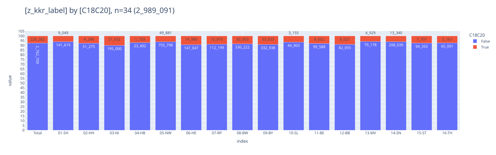
    


### <a id='toc1_3_3_'></a>[Fallzahlen C18-C20 nach Viersteller](#toc0_)
- Filter: `C18-20`
> 💡 `C19` darf eigentlich nicht verwendet werden, wird von Krebsgesellschaft nicht akzeptiert


    
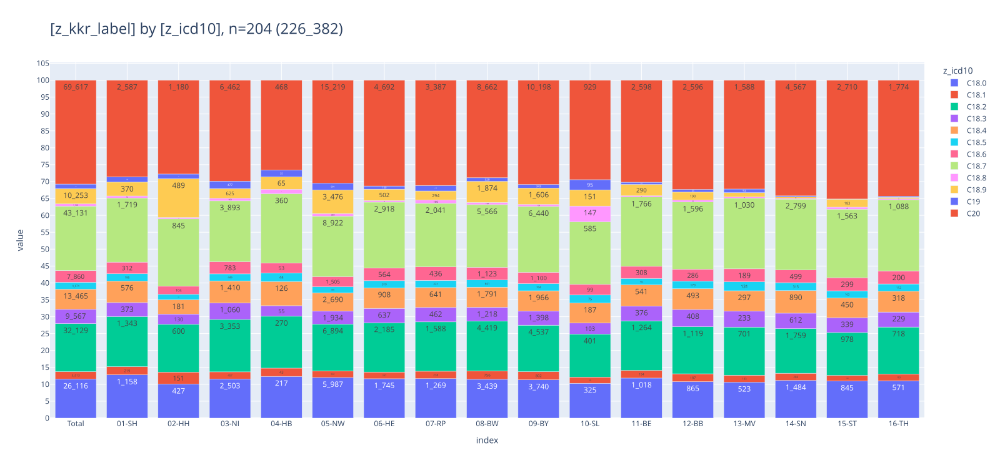
    


## <a id='toc1_4_'></a>[OP](#toc0_)

### <a id='toc1_4_1_'></a>[Operation erfolgt bei C18 mit T_p > 0](#toc0_)
- Filter: `C18` und pathologisches T in 1-4
> 💡 5% wäre realistisch. patho stadium müsste zwingend vorhanden sein nach OP


    
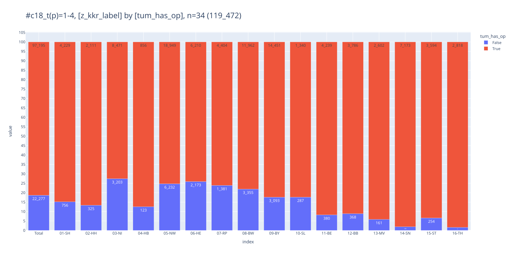
    


### <a id='toc1_4_2_'></a>[Operation erfolgt nach Jahren](#toc0_)
- Filter: `C18` und pathologisches T in 1-4
- `categ_treat`
  - `1-op` - OP dokumentiert
  - `2-noop-sy-st` - keine OP dokumentiert, aber ST oder SYST
  - `3-noop-nosy-nost` - keine Behandlung dokumentiert


    

    


## <a id='toc1_5_'></a>[OPS](#toc0_)


### <a id='toc1_5_1_'></a>[OPS 5-4xx nach Diagnose](#toc0_)
- Filter: `C18-C20`
- gezählt sind OPS Angaben, nicht Tumore

<br>

    FILTER: z_icd10_3d in ('C18','C19','C20') and left(ops.Code,3) in ('5-4')
    
    ┌─────────────────────────────────────────────────────────────────────────────────────────────────────────────────────────────────────┬─────────┐
    │                                                                 ops                                                                 │ cnt_ops │
    │                                                               varchar                                                               │  int32  │
    ├─────────────────────────────────────────────────────────────────────────────────────────────────────────────────────────────────────┼─────────┤
    │ 5-455.41 - Partielle Resektion des Dickdarmes: Resektion des Colon ascendens mit Coecum und rechter Flexur [Hemikolektomie rechts…  │   25109 │
    │ 5-455.45 - Partielle Resektion des Dickdarmes: Resektion des Colon ascendens mit Coecum und rechter Flexur [Hemikolektomie rechts…  │   15845 │
    │ 5-462.1 - Anlegen eines Enterostomas (als protektive Maßnahme) im Rahmen eines anderen Eingriffs: Ileostoma                         │   11667 │
    │ 5-469.20 - Andere Operationen am Darm: Adhäsiolyse: Offen chirurgisch                                                               │   10840 │
    │ 5-484.55 - Rektumresektion unter Sphinktererhaltung: Tiefe anteriore Resektion: Laparoskopisch mit Anastomose                       │   10104 │
    │ 5-484.35 - Rektumresektion unter Sphinktererhaltung: Anteriore Resektion: Laparoskopisch mit Anastomose                             │    8378 │
    │ 5-406.9 - Regionale Lymphadenektomie (Ausräumung mehrerer Lymphknoten einer Region) im Rahmen einer anderen Operation: Mesenterial  │    8109 │
    │ 5-455.75 - Partielle Resektion des Dickdarmes: Sigmaresektion: Laparoskopisch mit Anastomose                                        │    7998 │
    │ 5-469.21 - Andere Operationen am Darm: Adhäsiolyse: Laparoskopisch                                                                  │    6746 │
    │ 5-455.71 - Partielle Resektion des Dickdarmes: Sigmaresektion: Offen chirurgisch mit Anastomose                                     │    3844 │
    ├─────────────────────────────────────────────────────────────────────────────────────────────────────────────────────────────────────┴─────────┤
    │ 10 rows                                                                                                                             2 columns │
    └───────────────────────────────────────────────────────────────────────────────────────────────────────────────────────────────────────────────┘
    


    
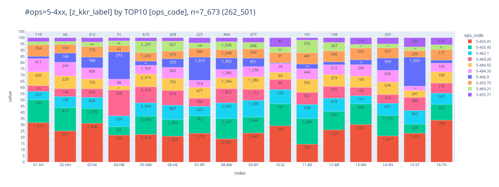
    


### <a id='toc1_5_2_'></a>[ Verteilung OPS 5-455 bei C18](#toc0_)
- Filter: `C18` und `M0`
- gezählt sind Tumore
- `has_5-455`: True wenn Tumor >= 1 OPS 5-455 hat
> 💡 Erwartet sind ~95% Anteil für True, tatsächlich sind es für D ~75%

    FILTER: z_icd10_3d = 'C18' and z_m_pc_1 = '0'
    


    
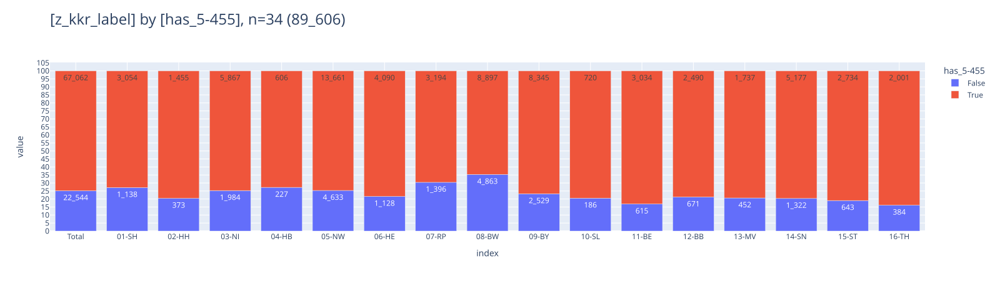
    


### <a id='toc1_5_3_'></a>[ Verteilung OPS 5-484 bei C20](#toc0_)
- Filter: `C18` und `M0`
- `has_5-48x`: True wenn Tumor >= 1 OPS 5-484 oder 5-485 hat
> 💡 ~40% haben True, weniger als erwartet 


    

    


### <a id='toc1_5_4_'></a>[Details OPS 5-455.2](#toc0_)
- Filter: `C18-C20`, alle Tumore mit min 1 OP
- gezählt sind Tumore / OPS
- die Gruppen können überlappen bei der Tumordarstellung
  - `lleo` - Ileozökalresektion
  - `hemi` - rechte Hemikolektomie
  - `sigma` - Sigmaresektion
- in allen Darstellungen ist Robotik ebenfalls angegeben (`5-987`)
 <!-- - `-` - keine der genannten OPS -->

```python
    counts: distinct z_tum_id
    ---
    n = 226_382                         (100.0%) ██████████████████████████████
    └ [z_tum_op_count > 0]: n = 146_898  (64.9%) ░░░░░░░░░░░███████████████████
    └ [ops]:                 n = 70_042  (30.9%) ░░░░░░░░░░░░░░░░░░░░░█████████

```


    

    


    
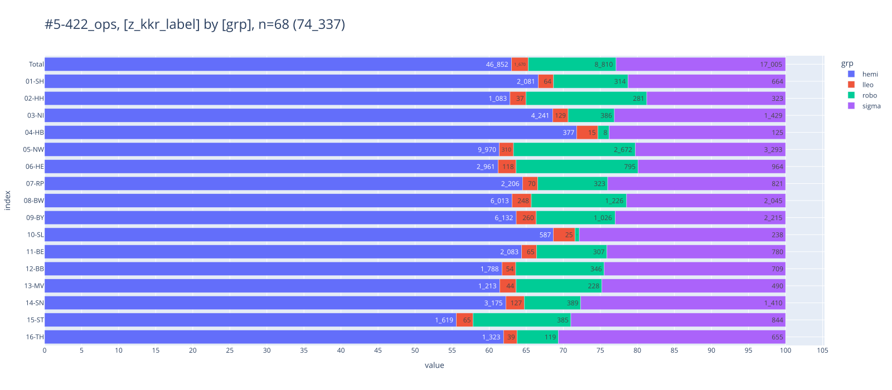
    


#### <a id='toc1_5_4_1_'></a>[Ileozökalresektion](#toc0_)
- Filter: alle Tumore, die einen OPS Code `5-455.2` aufweisen
- Gruppen
  - `5-455.21` - offen
  - `5-455.25` - laparoskopisch
  - `5-455.27` - konversion

```python
    counts: distinct z_tum_id
    ---
    n = 226_382                         (100.0%) ██████████████████████████████
    └ [z_tum_op_count > 0]: n = 146_898  (64.9%) ░░░░░░░░░░░███████████████████
    └ [ops-lleo]:            n = 10_055   (4.4%) ░░░░░░░░░░░░░░░░░░░░░░░░░░░░░█
```


    
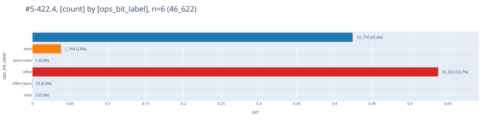
    


    
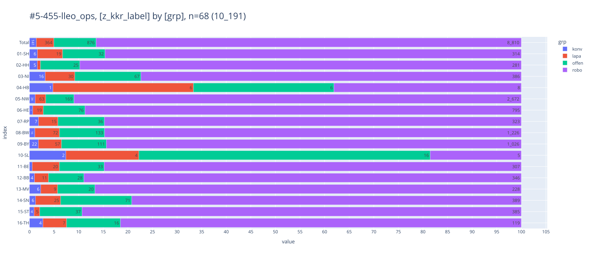
    


#### <a id='toc1_5_4_2_'></a>[rechte Hemikolektomie](#toc0_)
- Filter: alle Tumore, die einen OPS Code `5-455.4` aufweisen
- gezählt sind Tumore
- die Gruppen können überlappen

```python
    counts: distinct z_tum_id
    ---
    n = 226_382                         (100.0%) ██████████████████████████████
    └ [z_tum_op_count > 0]: n = 146_898  (64.9%) ░░░░░░░░░░░███████████████████
    └ [ops-hemi]:            n = 49_302  (21.8%) ░░░░░░░░░░░░░░░░░░░░░░░░██████
```


    
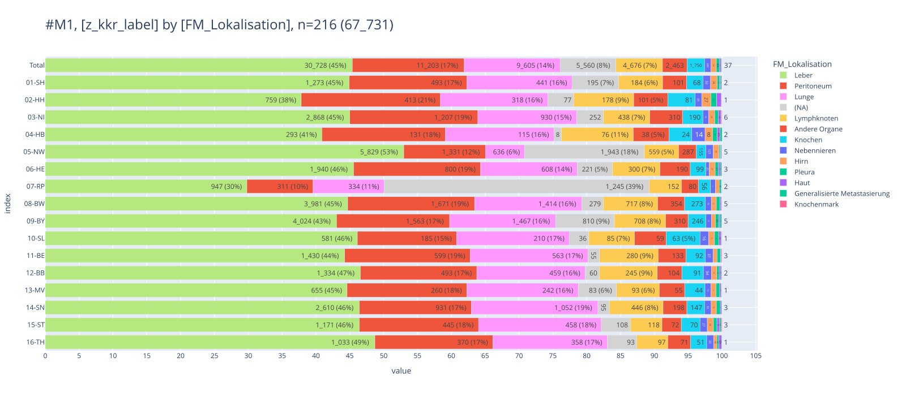
    


    

    


#### <a id='toc1_5_4_3_'></a>[Sigmaresektion](#toc0_)
- Filter: alle Tumore, die einen OPS Code `5-455.7` aufweisen
- gezählt sind Tumore
- die Gruppen können überlappen


```python
    counts: distinct z_tum_id
    ---
    n = 226_382                         (100.0%) ██████████████████████████████
    └ [z_tum_op_count > 0]: n = 146_898  (64.9%) ░░░░░░░░░░░███████████████████
    └ [ops-sigma]:           n = 20_571   (9.1%) ░░░░░░░░░░░░░░░░░░░░░░░░░░░░██
```


    

    


    
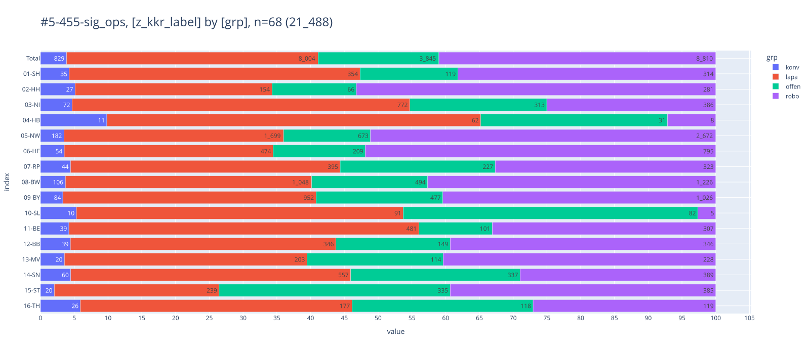
    


## <a id='toc1_6_'></a>[Lokalisation (Fernmetastasen)](#toc0_)


### <a id='toc1_6_1_'></a>[für M1](#toc0_)
- Filter: `C18`-`C20`, nur `M1`
- gezählt sind Tumore. Allerdings: Bei mehrfachen FM Angaben werden Tumore **mehrfach** gezählt

> 💡 50% von M1 haben Leber FM


    38_819 Tumore im Filter haben M1, 131_740 haben M0


    

    


## <a id='toc1_7_'></a>[Rezidive](#toc0_)

### <a id='toc1_7_1_'></a>[Verteilung OP in 2020](#toc0_)
- Filter: `C18`-`C20`, 2020
- gezählt sind Tumore
- Einteilung der Verteilung in eine Kategorie Tabelle
  - `1_op_r0` - OP und R0 dokumentiert
  - `2_op_no_r0` - OP, kein R0
  - `3_no_op_but_pt` - keine OP, aber pT (Diagnose oder Verlauf)
  - `4_no_op_pt_but_st_sy` - keine OP, keine pT, aber ST oder SYST
  - `5_no_op_st_sy_pt` - keine Therapie oder pT


```python
    counts: rows
    ---
    n = 226_382                  (100.0%) ██████████████████████████████
    └ [z_dy = 2020]:  n = 57_102  (25.2%) ░░░░░░░░░░░░░░░░░░░░░░░███████
```


    
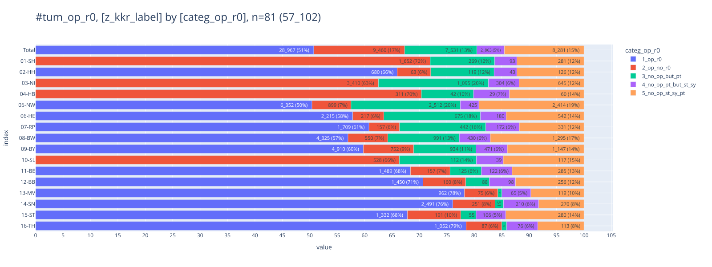
    


#### <a id='toc1_7_1_1_'></a>[davon: Verteilung nur R0](#toc0_)

**enge Definition eines Rezidivs** 
- Filter: lokaler Beurteilung Residualstatus = R0 (UND M <> 1)
- Rezidiv wenn  
  - Gesamtbeurteilung: Y  oder  
  - Lokaler Tumorstatus: R  oder  
  - Tumorstatus Lymphknoten:R oder  
  - Verlauf Fernmetastasen:R   

**erweiterte Definition (Verworfen)**
- Rezidiv wenn
  - (TNM)r_Symbol:r UND 
  - (Folgeereignis T>0 oder Folgeereignis N>0 oder Folgeereignis M>0)

**Diagramm**
- gezählt sind Tumore mit R0
- Kategorien
  - `1_fo_relapse` - Tumore mit Rezidiv nach enger Definition
  - `2_fo_relapse_tnm` - Tumore mit Rezidiv nach erweiterter Definition
  - `3_fo_no_relapse` - Tumore mit Folgeereignis ohne o.a. Rezidiv
  - `4_no_fo` - Tumore ohne Folgeereignis
  - `9_unknown` - Unbekannt

```python
    counts: distinct z_tum_id
    ---
    n = 226_382                        (100.0%) ██████████████████████████████
    └ [z_dy = 2020]:        n = 57_102  (25.2%) ░░░░░░░░░░░░░░░░░░░░░░░███████
    └ [Residualstatus R0]:  n = 28_967  (12.8%) ░░░░░░░░░░░░░░░░░░░░░░░░░░░███
```


    

    


    
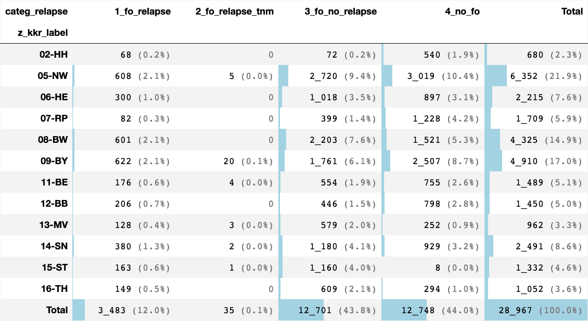
    


<br>

## <a id='toc1_8_'></a>[Behandlung innerhalb von 6 Wochen](#toc0_)
- Filter: `C18`-`C20`
- `first_treatment_6w`
  - `<=6w`: erste Behandlung innerhalb von 6 Wochen
  - `>6w`: erste Behandlung nach 6 Wochen
  - `no delta`: Behandlung ist dokumentiert, aber kein Abstand
  - `-`: keine Behandlung dokumentiert


    
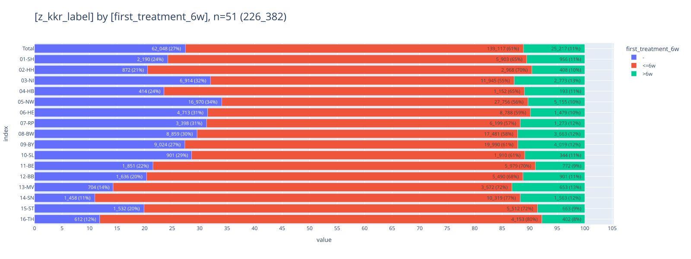
    


## <a id='toc1_9_'></a>[Erste Behandlung](#toc0_)

### <a id='toc1_9_1_'></a>[Was wurde zuerst behandelt](#toc0_)
- Filter: `M1` und Tumor hat Lebermetastasen und `C18` oder `C20`
- gezählt sind Tumore


    
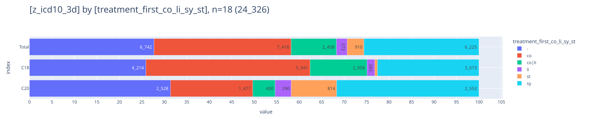
    


### <a id='toc1_9_2_'></a>[Zeitlicher Abstand der Behandlungen](#toc0_)
- Filter: `C18`-`C20`, Tumore mit Behandlung
- gezählt sind Tumore
- abgebildet sind Median Werte für den Abstand Diagnose bis erste Behandlung in Tagen (logarithmische Skala)


    

    


    
    column (n = 164_334)         |    present     | min | lower | q25  | median | mean  |  q75  | upper |  max  |  std  |  cv 
    -----------------------------+----------------+-----+-------+------+--------+-------+-------+-------+-------+-------+-----
    z_first_treatment_after_days | 164_334 (100%) |   0 |     0 | 5.00 |  16.00 | 29.85 | 32.00 |    72 | 1_645 | 70.95 | 2.38
    
    
    item (n = 164_334) | count  | min  | lower | q25  | median | mean  |  q75  | upper |   max    |  std  |  cv 
    -------------------+--------+------+-------+------+--------+-------+-------+-------+----------+-------+-----
    01-SH              |  6_859 | 0.00 |  0.00 | 6.00 |  17.00 | 26.53 | 31.00 | 68.00 | 1_279.00 | 53.83 | 2.03
    02-HH              |  3_376 | 0.00 |  0.00 | 3.00 |  12.00 | 27.68 | 27.00 | 63.00 | 1_413.00 | 79.01 | 2.85
    03-NI              | 14_718 | 0.00 |  0.00 | 6.00 |  19.00 | 31.70 | 36.00 | 81.00 | 1_464.00 | 66.03 | 2.08
    04-HB              |  1_345 | 0.00 |  0.00 | 7.00 |  16.00 | 23.97 | 32.00 | 67.00 |   791.00 | 38.62 | 1.61
    05-NW              | 32_911 | 0.00 |  0.00 | 5.00 |  15.00 | 33.86 | 31.00 | 70.00 | 1_604.00 | 86.22 | 2.55
    06-HE              | 10_267 | 0.00 |  0.00 | 6.00 |  15.00 | 30.66 | 31.00 | 68.00 | 1_609.00 | 75.23 | 2.45
    07-RP              |  7_472 | 0.00 |  0.00 | 4.00 |  15.00 | 33.77 | 32.00 | 74.00 | 1_611.00 | 82.45 | 2.44
    08-BW              | 21_144 | 0.00 |  0.00 | 5.00 |  17.00 | 33.64 | 34.00 | 77.00 | 1_573.00 | 83.39 | 2.48
    09-BY              | 24_009 | 0.00 |  0.00 | 4.00 |  17.00 | 30.92 | 34.00 | 79.00 | 1_645.00 | 69.89 | 2.26
    10-SL              |  2_254 | 0.00 |  0.00 | 4.00 |  15.00 | 25.05 | 32.00 | 74.00 |   752.00 | 43.15 | 1.72
    11-BE              |  6_751 | 0.00 |  0.00 | 4.00 |  13.00 | 25.11 | 27.00 | 61.00 | 1_084.00 | 60.74 | 2.42
    12-BB              |  6_391 | 0.00 |  0.00 | 5.00 |  15.00 | 24.60 | 31.00 | 70.00 | 1_158.00 | 47.35 | 1.93
    13-MV              |  4_225 | 0.00 |  0.00 | 2.00 |  15.00 | 23.63 | 33.00 | 79.00 |   898.00 | 39.33 | 1.66
    14-SN              | 11_882 | 0.00 |  0.00 | 4.00 |  15.00 | 23.92 | 30.00 | 69.00 | 1_216.00 | 47.17 | 1.97
    15-ST              |  6_175 | 0.00 |  0.00 | 4.00 |  14.00 | 22.12 | 27.00 | 61.00 |   983.00 | 40.73 | 1.84
    16-TH              |  4_555 | 0.00 |  0.00 | 2.00 |  11.00 | 20.22 | 25.00 | 59.00 | 1_456.00 | 53.07 | 2.62
    


## <a id='toc1_10_'></a>[Behandlungsverlauf](#toc0_)
- Filter: `C18`-`C20`, nur Tumore mit Therapie
- gezählt sind Tumore
- beschränkt auf die ersten 5 Therapien
- Therapien mit gleichem Tumor / Datum / Behandlung sind zusammengeführt
- verschiedene Therapien mit gleichem Tumor und Datum sind hier nicht entfernt

    FILTER: z_icd10_3d in ('C18','C19','C20') | darin 226_382 Tumore, 728_182 deduplizierte Therapien | darin mit Datum: 164_524 Tumore, 279_051 Therapien


    
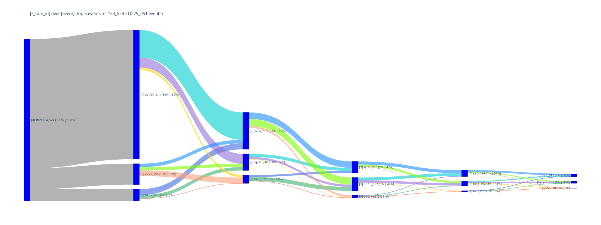
    


## <a id='toc1_11_'></a>[🕹️ interaktiv](#toc0_)
