# <a id='toc1_'></a>[Auswertungen: kolorektale Krebserkrankungen](#toc0_)

**Table of contents**<a id='toc0_'></a>    
- [Auswertungen: kolorektale Krebserkrankungen](#toc1_)    
  - [📆 Datenstand](#toc1_1_)    
  - [⚙️ Teildatensatz](#toc1_2_)    
  - [Fallzahlen](#toc1_3_)    
    - [Fallzahlen C18-C20 nach Viersteller](#toc1_3_1_)    
  - [OP](#toc1_4_)    
    - [keine Operation erfolgt bei C18 mit T_p > 0](#toc1_4_1_)    
    - [Stratifizierung für keine OP erfolgt](#toc1_4_2_)    
  - [OPS](#toc1_5_)    
    - [OPS 5-4xx nach Diagnose](#toc1_5_1_)    
      - [C18](#toc1_5_1_1_)    
      - [C20](#toc1_5_1_2_)    
    - [Vergleich laparoskopisch vs offen](#toc1_5_2_)    
    - [ Verteilung OPS 5-455 bei C18](#toc1_5_3_)    
    - [ Verteilung OPS 5-484 bei C20](#toc1_5_4_)    
    - [Details OPS 5-455](#toc1_5_5_)    
      - [Kombination von Gruppen](#toc1_5_5_1_)    
      - [Anteil Robotik](#toc1_5_5_2_)    
      - [Ileozökalresektion](#toc1_5_5_3_)    
      - [rechte Hemikolektomie](#toc1_5_5_4_)    
      - [Sigmaresektion](#toc1_5_5_5_)    
  - [Lokalisation (Fernmetastasen) für C18](#toc1_6_)    
    - [nach M](#toc1_6_1_)    
    - [Anteil FM Lokalisation Leber bei M1](#toc1_6_2_)    
    - [Behandlungsverlauf](#toc1_6_3_)    
    - [Erste Behandlung bei Leber FM](#toc1_6_4_)    
    - [OPS wenn Erstbehandlung OPS](#toc1_6_5_)    
  - [Rezidive](#toc1_7_)    
    - [Verteilung OP in 2020](#toc1_7_1_)    
    - [M Stadium und Vitalstatus bei Tumoren ohne Therapie und pT](#toc1_7_2_)    
    - [R Status](#toc1_7_3_)    
      - [davon: Verteilung nur R0](#toc1_7_3_1_)    
  - [Behandlung innerhalb von 6 Wochen](#toc1_8_)    
    - [Zeitlicher Abstand der Behandlungen](#toc1_8_1_)    

<!-- vscode-jupyter-toc-config
	numbering=false
	anchor=true
	flat=false
	minLevel=1
	maxLevel=6
	/vscode-jupyter-toc-config -->
<!-- THIS CELL WILL BE REPLACED ON TOC UPDATE. DO NOT WRITE YOUR TEXT IN THIS CELL -->

    🐍 3.12.8 | 📦 pandas: 2.3.3 | 📦 numpy: 1.26.4 | 📦 duckdb: 1.4.4 | 📦 pandas-plots: 1.4.1


<br>

## <a id='toc1_1_'></a>[📆 Datenstand](#toc0_)

    database file:           2026-03-04_data_clin.duckdb
    data tag:                v2.4
    last kkr data import:    2026-02-26
    sql table created:       2026-03-04 10:17:13
    doi:                     -
    document created:        2026-03-19 18:31:20


<br>

## <a id='toc1_2_'></a>[⚙️ Teildatensatz](#toc0_)
- Filter für gültige Fälle: (dieser Filter ist für **alle** Analysen gesetzt)
  - `z_dy` (Diagnosejahr) in 2020-2024
  - `z_icd10_3d` (Primärdiagnose) in `C18`-`C20`

<!-- ### <a id='toc1_2_1_'></a>[Deskriptive Statistik](#toc0_) -->


<br>

## <a id='toc1_3_'></a>[Fallzahlen](#toc0_)

### <a id='toc1_3_1_'></a>[Fallzahlen C18-C20 nach Viersteller](#toc0_)
> 💡 `C19` darf eigentlich nicht verwendet werden, wird von Krebsgesellschaft nicht akzeptiert


```
    counts: all rows (no grouping)
    ---
    n = 4_015_983                    (100.0%) ██████████████████████████████
    └ [DJ 2020-2024]:  n = 3_758_513  (93.6%) ░░████████████████████████████
    └ [ICD10 C18-C20]:   n = 284_931   (7.1%) ░░░░░░░░░░░░░░░░░░░░░░░░░░░░██
```

<details>
<summary>filter-sql</summary>

```sql
z_dy between 2020 and 2024
and z_icd10_3d in ('C18', 'C19', 'C20')
```

</details>


    

    


    
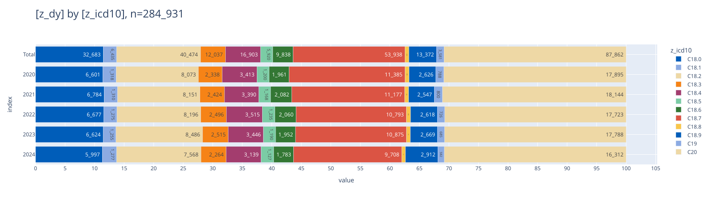
    


<br>

## <a id='toc1_4_'></a>[OP](#toc0_)

### <a id='toc1_4_1_'></a>[keine Operation erfolgt bei C18 mit T_p > 0](#toc0_)
> 💡 5% wäre realistisch. patho stadium müsste zwingend vorhanden sein nach OP


```
    counts: all rows (no grouping)
    ---
    n = 4_015_983
    └ [DJ 2020-2024]:  n = 3_758_513
    └ [ICD10 C18-C20]: n = 284_931 (100.0%) ██████████████████████████████
    └ [nur C18]:       n = 193_488  (67.9%) ░░░░░░░░░░████████████████████
    └ [t_p = 1-4]:     n = 150_961  (53.0%) ░░░░░░░░░░░░░░░███████████████
```

<details>
<summary>filter-sql</summary>

```sql
z_dy between 2020 and 2024
and z_icd10_3d in ('C18', 'C19', 'C20')
and z_icd10_3d in ('C18')
and z_t_p_1 in ('1','2','3','4')
```

</details>


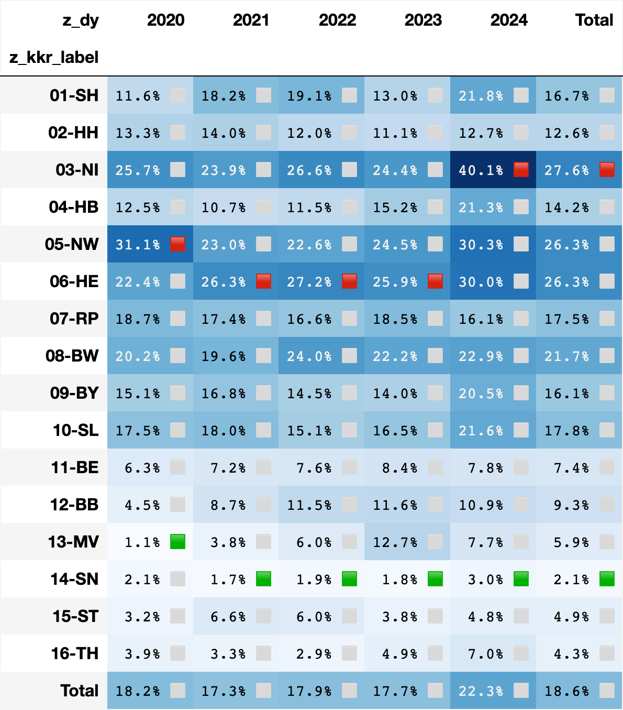
    


<br>

### <a id='toc1_4_2_'></a>[Stratifizierung für keine OP erfolgt](#toc0_)
- `categ_treat`
  - `1-op` - OP dokumentiert
  - `2-noop-sy-st` - keine OP dokumentiert, aber ST oder SYST
  - `3-noop-nosy-nost` - keine Behandlung dokumentiert


```
    counts: all rows (no grouping)
    ---
    n = 4_015_983
    └ [DJ 2020-2024]:  n = 3_758_513
    └ [ICD10 C18-C20]: n = 284_931 (100.0%) ██████████████████████████████
    └ [nur C18]:       n = 193_488  (67.9%) ░░░░░░░░░░████████████████████
    └ [t_p = 1-4]:     n = 150_961  (53.0%) ░░░░░░░░░░░░░░░███████████████
```

<details>
<summary>filter-sql</summary>

```sql
z_dy between 2020 and 2024
and z_icd10_3d in ('C18', 'C19', 'C20')
and z_icd10_3d in ('C18')
and z_t_p_1 in ('1','2','3','4')
```

</details>


    
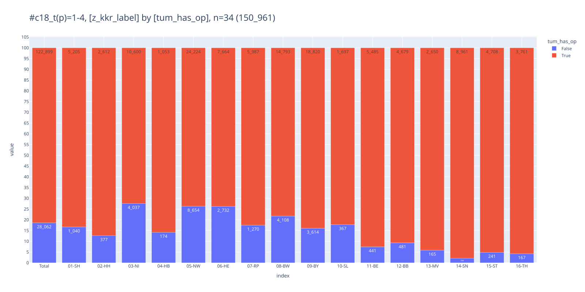
    


<br>

## <a id='toc1_5_'></a>[OPS](#toc0_)


### <a id='toc1_5_1_'></a>[OPS 5-4xx nach Diagnose](#toc0_)
- gezählt sind OPS Angaben, nicht Tumore

<br>

#### <a id='toc1_5_1_1_'></a>[C18](#toc0_)


```
    counts: distinct OPSId
    ---
    n = 4_039_783                    (100.0%) ██████████████████████████████
    └ [DJ 2020-2024]:  n = 3_990_198  (98.8%) ░█████████████████████████████
    └ [ICD10 C18-C20]:   n = 499_943  (12.4%) ░░░░░░░░░░░░░░░░░░░░░░░░░░░███
    └ [nur C18]:         n = 324_504   (8.0%) ░░░░░░░░░░░░░░░░░░░░░░░░░░░░██
    └ [OPS 5-4]:         n = 218_360   (5.4%) ░░░░░░░░░░░░░░░░░░░░░░░░░░░░░█
```

<details>
<summary>filter-sql</summary>

```sql
z_dy between 2020 and 2024
and z_icd10_3d in ('C18', 'C19', 'C20')
and z_icd10_3d in ('C18')
and left(Code,3) in ('5-4')
```

</details>


    Anzahl verschiedene ops_codes:  17902

```
    ┌─────────────────────────────────────────────────────────────────────────────────────────────────────────────────────────────────────┬─────────┐
    │                                                                 ops                                                                 │ cnt_ops │
    ├─────────────────────────────────────────────────────────────────────────────────────────────────────────────────────────────────────┼─────────┤
    │ 5-455.41 - Partielle Resektion des Dickdarmes: Resektion des Colon ascendens mit Coecum und rechter Flexur [Hemikolektomie rechts…  │   30629 │
    │ 5-455.45 - Partielle Resektion des Dickdarmes: Resektion des Colon ascendens mit Coecum und rechter Flexur [Hemikolektomie rechts…  │   21351 │
    │ 5-469.20 - Andere Operationen am Darm: Adhäsiolyse: Offen chirurgisch                                                               │   10319 │
    │ 5-455.75 - Partielle Resektion des Dickdarmes: Sigmaresektion: Laparoskopisch mit Anastomose                                        │    9885 │
    │ 5-406.9 - Regionale Lymphadenektomie (Ausräumung mehrerer Lymphknoten einer Region) im Rahmen einer anderen Operation: Mesenterial  │    7681 │
    │ 5-469.21 - Andere Operationen am Darm: Adhäsiolyse: Laparoskopisch                                                                  │    5539 │
    │ 5-484.35 - Rektumresektion unter Sphinktererhaltung: Anteriore Resektion: Laparoskopisch mit Anastomose                             │    4779 │
    │ 5-455.71 - Partielle Resektion des Dickdarmes: Sigmaresektion: Offen chirurgisch mit Anastomose                                     │    4438 │
    │ 5-455.65 - Partielle Resektion des Dickdarmes: Resektion des Colon descendens mit linker Flexur [Hemikolektomie links]: Laparosko…  │    4161 │
    │ 5-455.61 - Partielle Resektion des Dickdarmes: Resektion des Colon descendens mit linker Flexur [Hemikolektomie links]: Offen chi…  │    4125 │
    ├─────────────────────────────────────────────────────────────────────────────────────────────────────────────────────────────────────┴─────────┤
    │ 10 rows                                                                                                                             2 columns │
    └───────────────────────────────────────────────────────────────────────────────────────────────────────────────────────────────────────────────┘
```

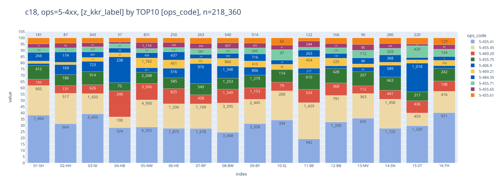
    


    

    


<br>

#### <a id='toc1_5_1_2_'></a>[C20](#toc0_)


```
    counts: distinct OPSId
    ---
    n = 4_039_783                    (100.0%) ██████████████████████████████
    └ [DJ 2020-2024]:  n = 3_990_198  (98.8%) ░█████████████████████████████
    └ [ICD10 C18-C20]:   n = 499_943  (12.4%) ░░░░░░░░░░░░░░░░░░░░░░░░░░░███
    └ [ICD10 C20]:       n = 171_216   (4.2%) ░░░░░░░░░░░░░░░░░░░░░░░░░░░░░█
    └ [OPS 5-4]:         n = 111_428   (2.8%) ░░░░░░░░░░░░░░░░░░░░░░░░░░░░░░
```

<details>
<summary>filter-sql</summary>

```sql
z_dy between 2020 and 2024
and z_icd10_3d in ('C18', 'C19', 'C20')
and z_icd10_3d in ('C20')
and left(Code,3) in ('5-4')
```

</details>


    Anzahl verschiedene ops_codes:  13205

```
    ┌─────────────────────────────────────────────────────────────────────────────────────────────────────────────────────────────────────┬─────────┐
    │                                                                 ops                                                                 │ cnt_ops │
    ├─────────────────────────────────────────────────────────────────────────────────────────────────────────────────────────────────────┼─────────┤
    │ 5-484.55 - Rektumresektion unter Sphinktererhaltung: Tiefe anteriore Resektion: Laparoskopisch mit Anastomose                       │   12559 │
    │ 5-462.1 - Anlegen eines Enterostomas (als protektive Maßnahme) im Rahmen eines anderen Eingriffs: Ileostoma                         │   12076 │
    │ 5-484.35 - Rektumresektion unter Sphinktererhaltung: Anteriore Resektion: Laparoskopisch mit Anastomose                             │    5611 │
    │ 5-485.02 - Rektumresektion ohne Sphinktererhaltung: Abdominoperineal: Kombiniert offen chirurgisch-laparoskopisch                   │    4477 │
    │ 5-484.51 - Rektumresektion unter Sphinktererhaltung: Tiefe anteriore Resektion: Offen chirurgisch mit Anastomose                    │    3502 │
    │ 5-465.1 - Rückverlagerung eines doppelläufigen Enterostomas: Ileostoma                                                              │    3224 │
    │ 5-469.21 - Andere Operationen am Darm: Adhäsiolyse: Laparoskopisch                                                                  │    3133 │
    │ 5-469.20 - Andere Operationen am Darm: Adhäsiolyse: Offen chirurgisch                                                               │    3045 │
    │ 5-484.65 - Rektumresektion unter Sphinktererhaltung: Tiefe anteriore Resektion mit peranaler Anastomose: Laparoskopisch mit Anast…  │    2852 │
    │ 5-406.9 - Regionale Lymphadenektomie (Ausräumung mehrerer Lymphknoten einer Region) im Rahmen einer anderen Operation: Mesenterial  │    2508 │
    ├─────────────────────────────────────────────────────────────────────────────────────────────────────────────────────────────────────┴─────────┤
    │ 10 rows                                                                                                                             2 columns │
    └───────────────────────────────────────────────────────────────────────────────────────────────────────────────────────────────────────────────┘
```


    


    
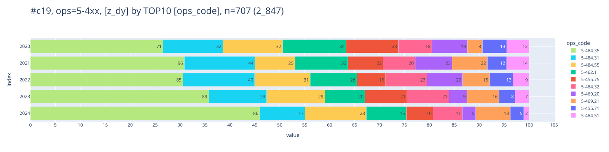
    


<br>

### <a id='toc1_5_2_'></a>[Vergleich laparoskopisch vs offen](#toc0_)
- gezählt sind Tumore
- im Filter: 
  - `C18.0-3`
  - nur Tumore, denen entweder `5-455.41` oder `5-455.45` zugeordnet ist (ℹ️ kein Tumor hat beide OPS)
- Metrik: Anteil Tumore mit `5-455.41` (offen) an allen Tumoren im Filter


```
    counts: distinct z_tum_id
    ---
    n = 4_015_983                    (100.0%) ██████████████████████████████
    └ [DJ 2020-2024]:  n = 3_758_513  (93.6%) ░░████████████████████████████
    └ [ICD10 C18-C20]:   n = 284_931   (7.1%) ░░░░░░░░░░░░░░░░░░░░░░░░░░░░██
    └ [ICD C18.0-3]:      n = 91_629   (2.3%) ░░░░░░░░░░░░░░░░░░░░░░░░░░░░░░
    └ [ops=5-455.4xx]:    n = 47_392   (1.2%) ░░░░░░░░░░░░░░░░░░░░░░░░░░░░░░
```

<details>
<summary>filter-sql</summary>

```sql
z_dy between 2020 and 2024
and z_icd10_3d in ('C18', 'C19', 'C20')
and z_icd10 in ('C18.0','C18.1','C18.2','C18.3')
and Code in ('5-455.41', '5-455.45')
```

</details>


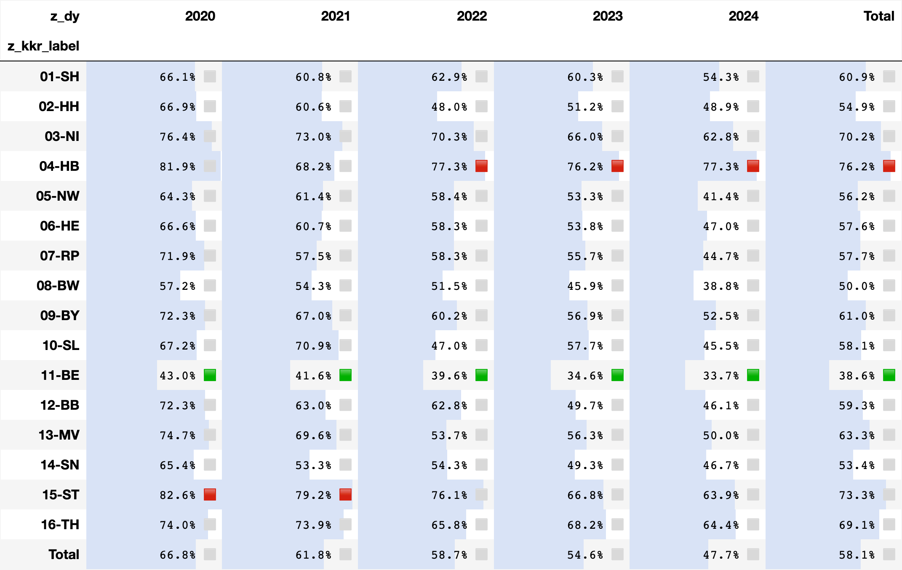
    


<br>

### <a id='toc1_5_3_'></a>[ Verteilung OPS 5-455 bei C18](#toc0_)
- Filter: `C18` und `M0`
- gezählt sind Tumore
- `has_5-455`: True wenn Tumor >= 1 OPS 5-455 hat
> 💡 Erwartet sind ~95% Anteil für True, tatsächlich sind es für D ~75%


```
    counts: all rows (no grouping)
    ---
    n = 4_015_983
    └ [DJ 2020-2024]:  n = 3_758_513
    └ [ICD10 C18-C20]: n = 284_931 (100.0%) ██████████████████████████████
    └ [nur C18]:       n = 193_488  (67.9%) ░░░░░░░░░░████████████████████
    └ [kein M1]:       n = 160_070  (56.2%) ░░░░░░░░░░░░░░████████████████
    └ [nur M0]:        n = 113_713  (39.9%) ░░░░░░░░░░░░░░░░░░░███████████
```

<details>
<summary>filter-sql</summary>

```sql
z_dy between 2020 and 2024
and z_icd10_3d in ('C18', 'C19', 'C20')
and z_icd10_3d in ('C18')
and ifnull(z_m_pc_1,'') <> '1'
and z_m_pc_1 = '0'
```

</details>


    
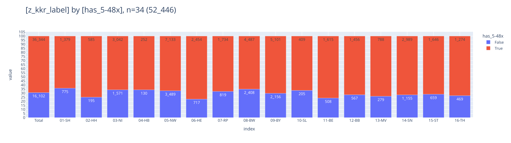
    


<br>

### <a id='toc1_5_4_'></a>[ Verteilung OPS 5-484 bei C20](#toc0_)
- Filter: `C18` und `M0`
- `has_5-48x`: True wenn Tumor >= 1 OPS 5-484 oder 5-485 hat
> 💡 ~40% haben True, weniger als erwartet 


```
    counts: all rows (no grouping)
    ---
    n = 4_015_983
    └ [DJ 2020-2024]:  n = 3_758_513
    └ [ICD10 C18-C20]: n = 284_931 (100.0%) ██████████████████████████████
    └ [ICD10 C20]:      n = 87_862  (30.8%) ░░░░░░░░░░░░░░░░░░░░░█████████
    └ [nur M0]:         n = 52_446  (18.4%) ░░░░░░░░░░░░░░░░░░░░░░░░░█████
```

<details>
<summary>filter-sql</summary>

```sql
z_dy between 2020 and 2024
and z_icd10_3d in ('C18', 'C19', 'C20')
and z_icd10_3d in ('C20')
and z_m_pc_1 = '0'
```

</details>


    
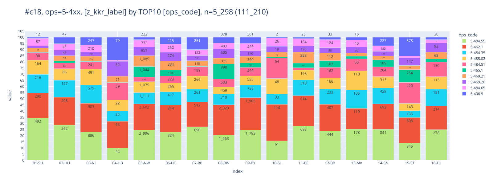
    


<br>

### <a id='toc1_5_5_'></a>[Details OPS 5-455](#toc0_)


#### <a id='toc1_5_5_1_'></a>[Kombination von Gruppen](#toc0_)
- gezählt sind Tumore
- die Gruppen können überlappen bei der Tumordarstellung
  - `has_ileo` - Ileozökalresektion
  - `has_hemi` - rechte Hemikolektomie
  - `has_sigma` - Sigmaresektion
  - `has_robo_01` - OPS `5-987.01` (Roboter) ist Tumor zugeordnet


```
    counts: distinct z_tum_id
    ---
    n = 4_015_983
    └ [DJ 2020-2024]: n = 3_758_513
    └ [nur C18]:      n = 193_488 (100.0%) ██████████████████████████████
    └ [OPS 5-4]:      n = 126_132  (65.2%) ░░░░░░░░░░░███████████████████
```

<details>
<summary>filter-sql</summary>

```sql
z_dy between 2020 and 2024
and z_icd10_3d in ('C18')
and left(Code,3) in ('5-4')
```

</details>


    n = 126_132 | n(true) = 79_504


    

    


<br>

#### <a id='toc1_5_5_2_'></a>[Anteil Robotik](#toc0_)
- Metrik: Anteil Tumore mit `5-987` an allen Tumoren im Filter


    
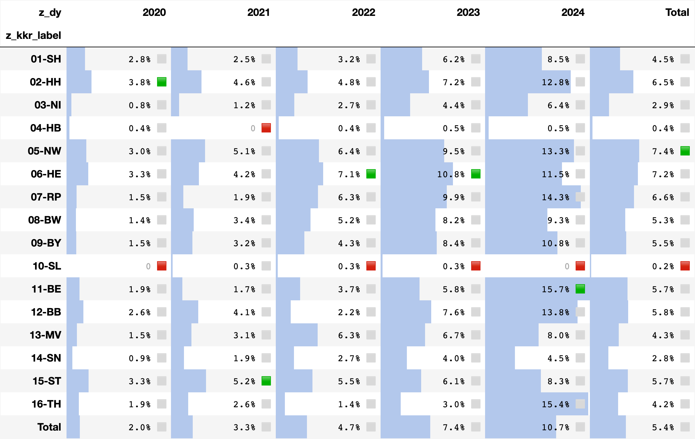
    


<br>

#### <a id='toc1_5_5_3_'></a>[Ileozökalresektion](#toc0_)
- Filter: alle Tumore, die einen OPS Code `5-455.2` aufweisen
- Gruppen
  - `5-455.21` - offen
  - `5-455.25` - laparoskopisch
  - `5-455.27` - konversion
  - `other` - sonstige, keine der genannten

<!-- > 💡 keine Robotik `5-987.1` geschlüsselt für diese Tumore -->


```
    counts: distinct z_tum_id
    ---
    n = 4_015_983
    └ [DJ 2020-2024]:  n = 3_758_513
    └ [ICD10 C18-C20]: n = 284_931 (100.0%) ██████████████████████████████
    └ [Tumor hat OP]:  n = 185_576  (65.1%) ░░░░░░░░░░░███████████████████
    └ [OPS ileo]:        n = 2_096   (0.7%) ░░░░░░░░░░░░░░░░░░░░░░░░░░░░░░
```

<details>
<summary>filter-sql</summary>

```sql
z_dy between 2020 and 2024
and z_icd10_3d in ('C18', 'C19', 'C20')
and z_tum_op_count > 0
and 
    z_tum_id in
        (select distinct z_tum_id from OPS where left(Code,7) in ('5-455.2'))
    
```

</details>


    n = 2_096 | n(true) = 1_918


    

    


<br>

#### <a id='toc1_5_5_4_'></a>[rechte Hemikolektomie](#toc0_)
- Filter: alle Tumore, die einen OPS Code `5-455.4` aufweisen
- gezählt sind Tumore
- die Gruppen können überlappen

> 💡 kaum Robotik `5-987.1` geschlüsselt für diese Tumore (n=4)


```
    counts: distinct z_tum_id
    ---
    n = 4_015_983
    └ [DJ 2020-2024]:  n = 3_758_513
    └ [ICD10 C18-C20]: n = 284_931 (100.0%) ██████████████████████████████
    └ [Tumor hat OP]:  n = 185_576  (65.1%) ░░░░░░░░░░░███████████████████
    └ [OPS hemi]:       n = 64_632  (22.7%) ░░░░░░░░░░░░░░░░░░░░░░░░██████
```

<details>
<summary>filter-sql</summary>

```sql
z_dy between 2020 and 2024
and z_icd10_3d in ('C18', 'C19', 'C20')
and z_tum_op_count > 0
and 
    (
        left(Code,8) in ('5-455.41', '5-455.45', '5-455.47')
        OR left(Code,5) in ('5-987')
    )
```

</details>


    n = 64_632 | n(true) = 64_632


    

    


<br>

#### <a id='toc1_5_5_5_'></a>[Sigmaresektion](#toc0_)
- Filter: alle Tumore, die einen OPS Code `5-455.7` aufweisen
- gezählt sind Tumore
- die Gruppen können überlappen

> 💡 kaum Robotik `5-987.1` geschlüsselt für diese Tumore (n=4)


```
    counts: distinct z_tum_id
    ---
    n = 4_015_983
    └ [DJ 2020-2024]:  n = 3_758_513
    └ [ICD10 C18-C20]: n = 284_931 (100.0%) ██████████████████████████████
    └ [Tumor hat OP]:  n = 185_576  (65.1%) ░░░░░░░░░░░███████████████████
    └ [OPS sigma]:      n = 28_345   (9.9%) ░░░░░░░░░░░░░░░░░░░░░░░░░░░░██
```

<details>
<summary>filter-sql</summary>

```sql
z_dy between 2020 and 2024
and z_icd10_3d in ('C18', 'C19', 'C20')
and z_tum_op_count > 0
and 
    (
        left(Code,8) in ('5-455.71', '5-455.75', '5-455.77')
        OR left(Code,5) in ('5-987')
    )
```

</details>


    n = 28_345 | n(true) = 28_345


    
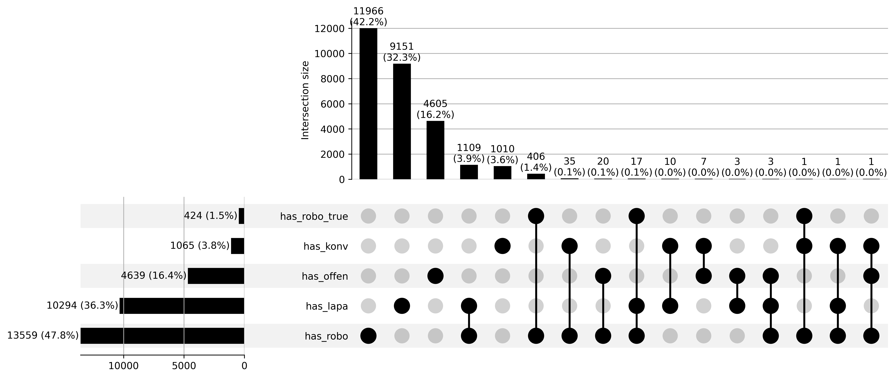
    


<br>

## <a id='toc1_6_'></a>[Lokalisation (Fernmetastasen) für C18](#toc0_)


### <a id='toc1_6_1_'></a>[nach M](#toc0_)
- gezählt sind Tumore
- M Angabe ist kombiniert aus pM (Vorrang) und cM
> 💡 45% von M1 haben Leber FM


```
    counts: all rows (no grouping)
    ---
    n = 4_015_983                   (100.0%) ██████████████████████████████
    └ [DJ 2020-2024]: n = 3_758_513  (93.6%) ░░████████████████████████████
    └ [nur C18]:        n = 193_488   (4.8%) ░░░░░░░░░░░░░░░░░░░░░░░░░░░░░█
```

<details>
<summary>filter-sql</summary>

```sql
z_dy between 2020 and 2024
and z_icd10_3d in ('C18')
```

</details>


    
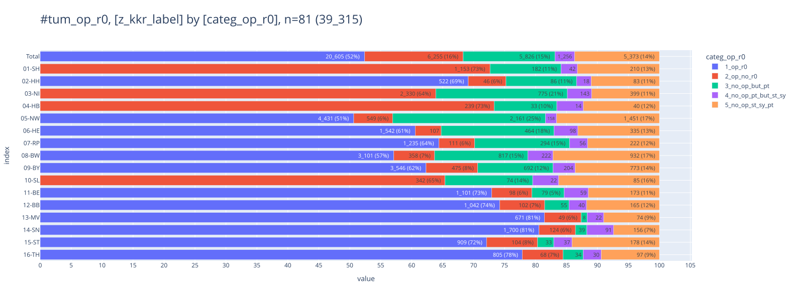
    


<br>

### <a id='toc1_6_2_'></a>[Anteil FM Lokalisation Leber bei M1](#toc0_)
- gezählt sind Tumore
- `HEP` liegt vor, wenn für **Diagnose** oder **Folgeereignis** diese Lokalisation vermerkt ist
- Metrik: Anteil Tumore mit >=1 `HEP`


```
    counts: all rows (no grouping)
    ---
    n = 4_015_983                   (100.0%) ██████████████████████████████
    └ [DJ 2020-2024]: n = 3_758_513  (93.6%) ░░████████████████████████████
    └ [nur C18]:        n = 193_488   (4.8%) ░░░░░░░░░░░░░░░░░░░░░░░░░░░░░█
    └ [nur M1]:          n = 33_418   (0.8%) ░░░░░░░░░░░░░░░░░░░░░░░░░░░░░░
```

<details>
<summary>filter-sql</summary>

```sql
z_dy between 2020 and 2024
and z_icd10_3d in ('C18')
and z_m_pc_1 in ('1')
```

</details>


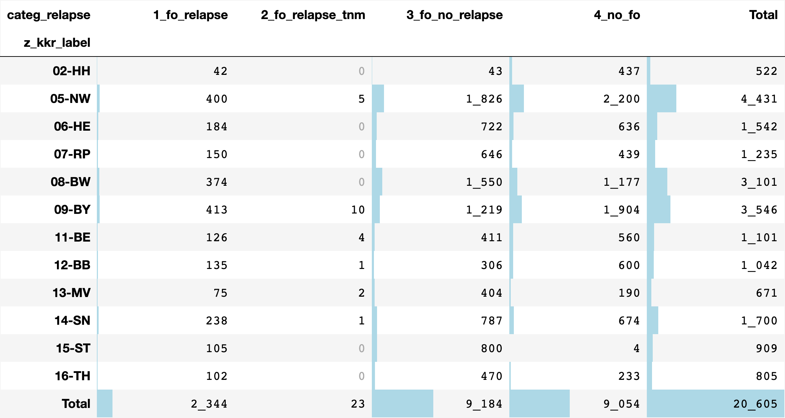
    


<br>

### <a id='toc1_6_3_'></a>[Behandlungsverlauf](#toc0_)
- gezählt sind Tumore
- beschränkt auf die ersten 5 Therapien
- Therapien mit gleichem Tumor / Datum / Behandlung sind zusammengeführt
- verschiedene Therapien mit gleichem Tumor und Datum sind hier nicht entfernt


```
    counts: all rows (no grouping)
    ---
    n = 4_015_983
    └ [DJ 2020-2024]:                                           n = 3_758_513
    └ [nur C18]:                                                n = 193_488 (100.0%) ██████████████████████████████
    └ [nur M1]:                                                  n = 33_418  (17.3%) ░░░░░░░░░░░░░░░░░░░░░░░░░█████
    └ [Tumor mit HEP Lokalisation in FM Diagnose oder Verlauf]:  n = 21_612  (11.2%) ░░░░░░░░░░░░░░░░░░░░░░░░░░░███
    └ [Tumor hat Therapie]:                                      n = 17_891   (9.2%) ░░░░░░░░░░░░░░░░░░░░░░░░░░░░██
```

<details>
<summary>filter-sql</summary>

```sql
z_dy between 2020 and 2024
and z_icd10_3d in ('C18')
and z_m_pc_1 in ('1')
and 
    z_tum_id in (
        select distinct tum.z_tum_id
        from Tumor tum
        left join Diagnose_Fernmetastase dfm on tum.z_tum_id = dfm.z_tum_id
        left join Folgeereignis_Fernmetastase ffm on tum.z_tum_id = ffm.z_tum_id
        where (dfm.Lokalisation = 'HEP' or ffm.Lokalisation = 'HEP')
    )
and z_tum_op_count+z_tum_sy_count+z_tum_st_count > 0
```

</details>


    
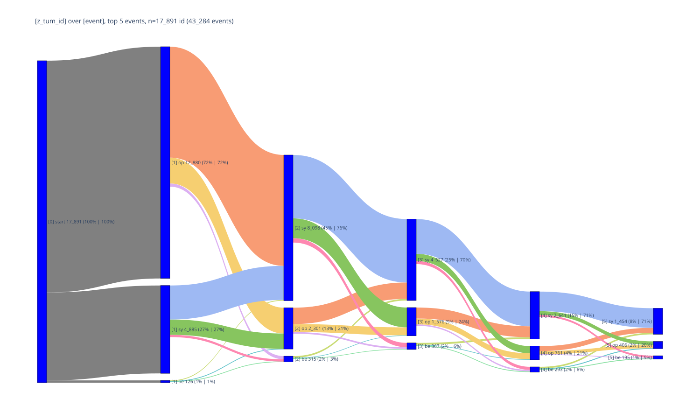
    


<br>

### <a id='toc1_6_4_'></a>[Erste Behandlung bei Leber FM](#toc0_)


```
    counts: all rows (no grouping)
    ---
    n = 4_015_983
    └ [DJ 2020-2024]:                                           n = 3_758_513
    └ [nur C18]:                                                n = 193_488 (100.0%) ██████████████████████████████
    └ [nur M1]:                                                  n = 33_418  (17.3%) ░░░░░░░░░░░░░░░░░░░░░░░░░█████
    └ [Tumor mit HEP Lokalisation in FM Diagnose oder Verlauf]:  n = 21_612  (11.2%) ░░░░░░░░░░░░░░░░░░░░░░░░░░░███
```

<details>
<summary>filter-sql</summary>

```sql
z_dy between 2020 and 2024
and z_icd10_3d in ('C18')
and z_m_pc_1 in ('1')
and 
    z_tum_id in (
        select distinct tum.z_tum_id
        from Tumor tum
        left join Diagnose_Fernmetastase dfm on tum.z_tum_id = dfm.z_tum_id
        left join Folgeereignis_Fernmetastase ffm on tum.z_tum_id = ffm.z_tum_id
        where (dfm.Lokalisation = 'HEP' or ffm.Lokalisation = 'HEP')
    )
```

</details>


    
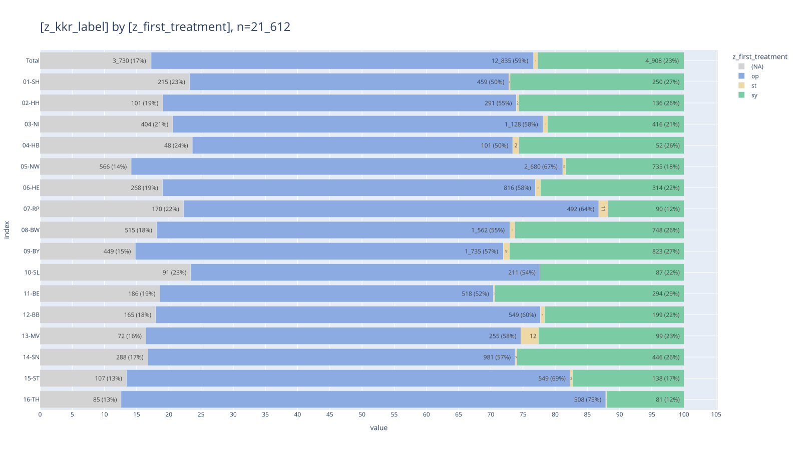
    


<br>

### <a id='toc1_6_5_'></a>[OPS wenn Erstbehandlung OPS](#toc0_)
- gezählt sind Tumore
- Kategorien OPS bei Erstbehandlung des Tumors
  - `1_other`: andere oder keine OPS
  - `2_colon`: erste 5 Stellen in `('5-455','5-484','5-485')`
  - `3_liver`: erste 5 Stellen in `('5-501','5-502','5-503')`
  - `4_both`: colon und liver geschlüsselt für Erstbehandlung


```
    counts: all rows (no grouping)
    ---
    n = 4_015_983
    └ [DJ 2020-2024]:                                           n = 3_758_513
    └ [nur C18]:                                                n = 193_488 (100.0%) ██████████████████████████████
    └ [nur M1]:                                                  n = 33_418  (17.3%) ░░░░░░░░░░░░░░░░░░░░░░░░░█████
    └ [Tumor mit HEP Lokalisation in FM Diagnose oder Verlauf]:  n = 21_612  (11.2%) ░░░░░░░░░░░░░░░░░░░░░░░░░░░███
    └ [Tumore mit OP als Erstbehandlung]:                        n = 12_835   (6.6%) ░░░░░░░░░░░░░░░░░░░░░░░░░░░░░█
```

<details>
<summary>filter-sql</summary>

```sql
z_dy between 2020 and 2024
and z_icd10_3d in ('C18')
and z_m_pc_1 in ('1')
and 
    z_tum_id in (
        select distinct tum.z_tum_id
        from Tumor tum
        left join Diagnose_Fernmetastase dfm on tum.z_tum_id = dfm.z_tum_id
        left join Folgeereignis_Fernmetastase ffm on tum.z_tum_id = ffm.z_tum_id
        where (dfm.Lokalisation = 'HEP' or ffm.Lokalisation = 'HEP')
    )
and z_first_treatment = 'op'
```

</details>


    
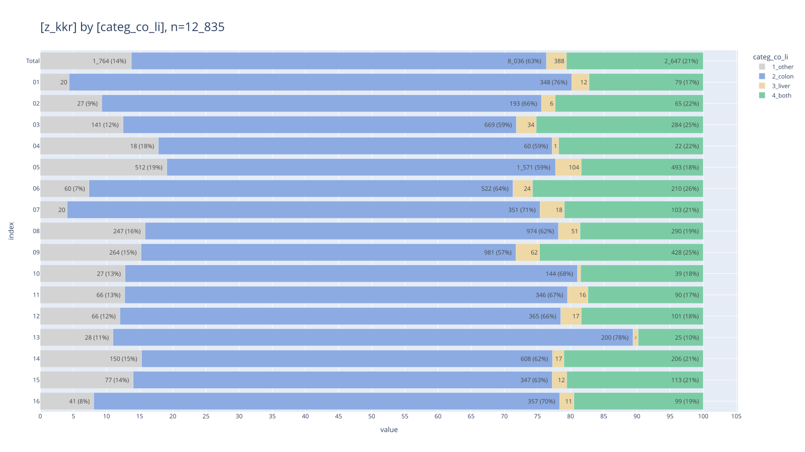
    


<br>

## <a id='toc1_7_'></a>[Rezidive](#toc0_)

### <a id='toc1_7_1_'></a>[Verteilung OP in 2020](#toc0_)
- Filter: `C18`-`C20`, 2020
- gezählt sind Tumore
- Einteilung der Verteilung in eine Kategorie Tabelle
  - `1_op_r0` - OP und R0 dokumentiert
  - `2_op_no_r0` - OP, kein R0
  - `3_no_op_but_pt` - keine OP, aber pT (Diagnose oder Verlauf)
  - `4_no_op_pt_but_st_sy` - keine OP, keine pT, aber ST oder SYST
  - `5_none` - keine Therapie oder pT


```
    counts: all rows (no grouping)
    ---
    n = 4_015_983
    └ [DJ 2020-2024]:  n = 3_758_513
    └ [ICD10 C18-C20]: n = 284_931 (100.0%) ██████████████████████████████
    └ [DJ 2020]:        n = 57_998  (20.4%) ░░░░░░░░░░░░░░░░░░░░░░░░██████
    └ [nur C18]:        n = 39_315  (13.8%) ░░░░░░░░░░░░░░░░░░░░░░░░░░████
```

<details>
<summary>filter-sql</summary>

```sql
z_dy between 2020 and 2024
and z_icd10_3d in ('C18', 'C19', 'C20')
and z_dy = 2020
and z_icd10_3d in ('C18')
```

</details>


    

    


<br>

### <a id='toc1_7_2_'></a>[M Stadium und Vitalstatus bei Tumoren ohne Therapie und pT](#toc0_)

    n = 5_373


    

    


<br>

### <a id='toc1_7_3_'></a>[R Status](#toc0_)
- `r_status`
  - `1_R0`: wenn >= 1 OP zum Tumor dokumentiert is mit `R0`
  - `2_R1_R2`: wenn kein `R0` dokumentiert, aber >= 1 OP mit `R1` oder `R2`
  - `3_NA_U_RX`: wenn beides nicht zutrifft (Feld ist leer, `U` oder `RX`)


```
    counts: all rows (no grouping)
    ---
    n = 4_015_983
    └ [DJ 2020-2024]:  n = 3_758_513
    └ [ICD10 C18-C20]: n = 284_931 (100.0%) ██████████████████████████████
    └ [DJ 2020]:        n = 57_998  (20.4%) ░░░░░░░░░░░░░░░░░░░░░░░░██████
    └ [nur C18]:        n = 39_315  (13.8%) ░░░░░░░░░░░░░░░░░░░░░░░░░░████
```

<details>
<summary>filter-sql</summary>

```sql
z_dy between 2020 and 2024
and z_icd10_3d in ('C18', 'C19', 'C20')
and z_dy = 2020
and z_icd10_3d in ('C18')
```

</details>


    
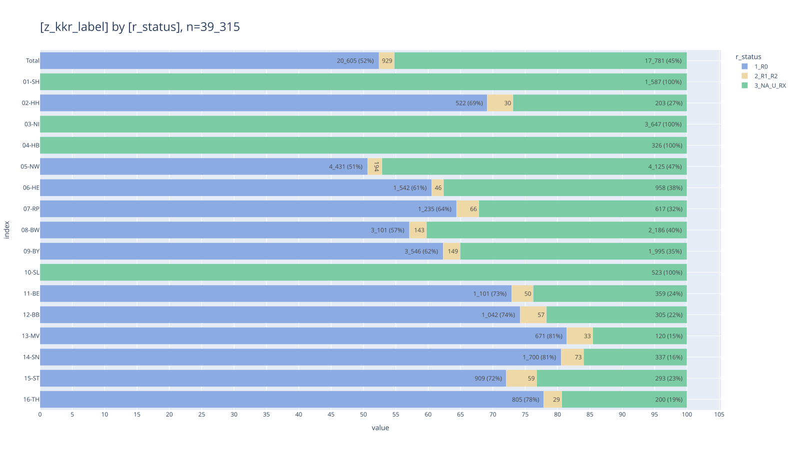
    


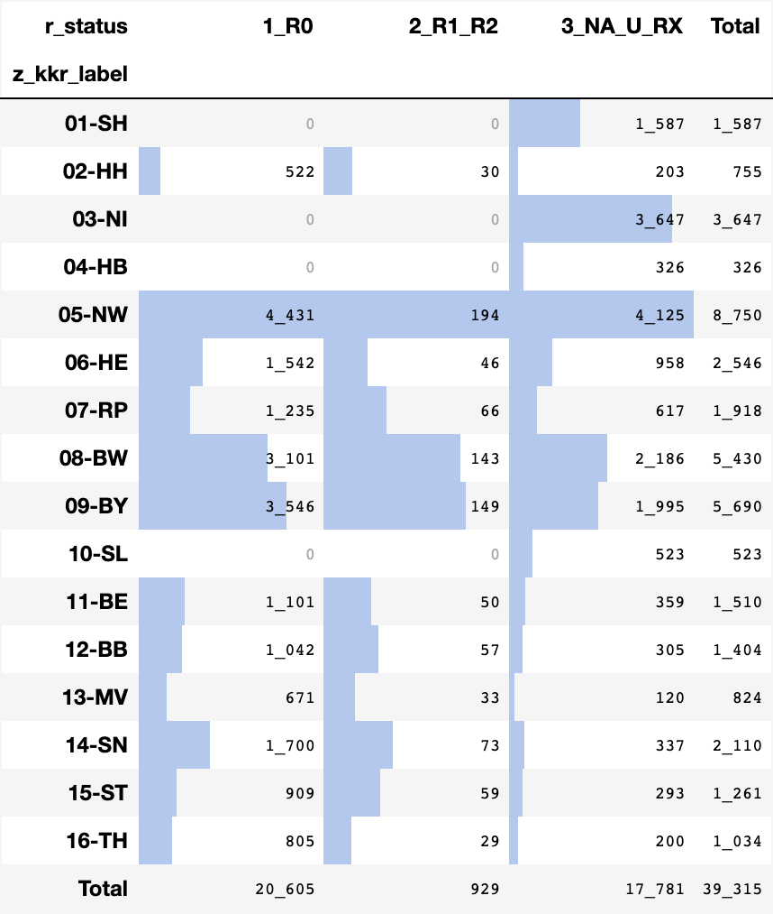
    


<br>

#### <a id='toc1_7_3_1_'></a>[davon: Verteilung nur R0](#toc0_)

**enge Definition eines Rezidivs** 
- Filter: lokaler Beurteilung Residualstatus = R0 (UND M <> 1)
- Rezidiv wenn  
  - Gesamtbeurteilung: Y  oder  
  - Lokaler Tumorstatus: R  oder  
  - Tumorstatus Lymphknoten:R oder  
  - Verlauf Fernmetastasen:R   

**erweiterte Definition (Verworfen)**
- Rezidiv wenn
  - (TNM)r_Symbol:r UND 
  - (Folgeereignis T>0 oder Folgeereignis N>0 oder Folgeereignis M>0)

**Diagramm**
- gezählt sind Tumore mit R0
- Kategorien
  - `1_fo_relapse` - Tumore mit Rezidiv nach enger Definition
  - `2_fo_relapse_tnm` - Tumore mit Rezidiv nach erweiterter Definition
  - `3_fo_no_relapse` - Tumore mit Folgeereignis ohne o.a. Rezidiv
  - `4_no_fo` - Tumore ohne Folgeereignis
- ℹ️ kkr mit "leerem Balken" nicht nicht in der Grundmenge enthalten, da sie keine R0 ausweisen


```
    counts: distinct z_tum_id
    ---
    n = 4_015_983
    └ [DJ 2020]:           n = 749_493
    └ [nur C18]:           n = 39_315 (100.0%) ██████████████████████████████
    └ [Residualstatus R0]: n = 20_605  (52.4%) ░░░░░░░░░░░░░░░███████████████
```

<details>
<summary>filter-sql</summary>

```sql
z_dy = 2020
and z_icd10_3d in ('C18')
and upper(left(Lokale_Beurteilung_Residualstatus,2)) = 'R0'
```

</details>


    
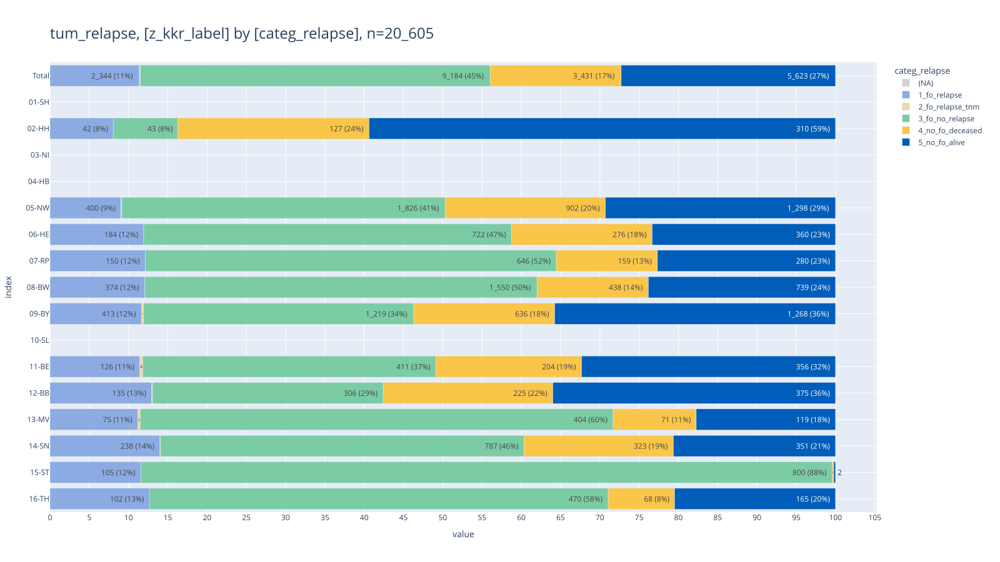
    


<!-- SCALE-50%, -->


    
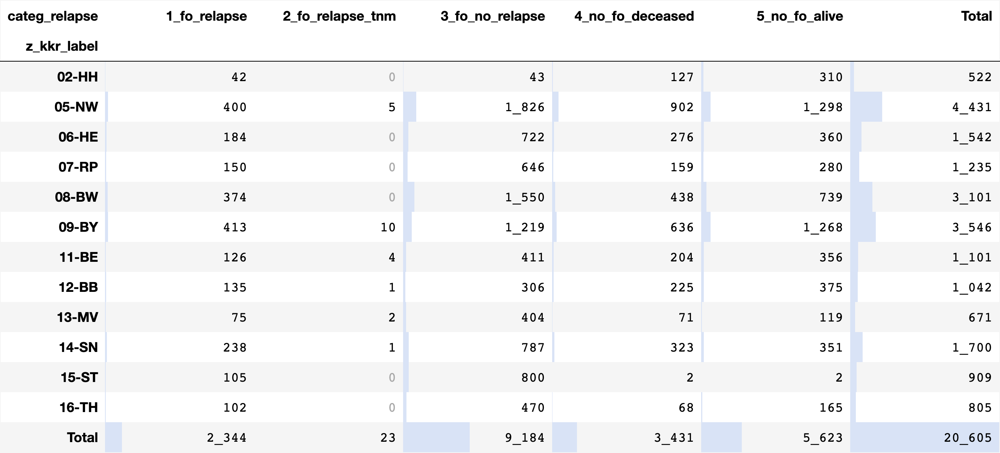
    


<br>

## <a id='toc1_8_'></a>[Behandlung innerhalb von 6 Wochen](#toc0_)
- Filter: `C18`-`C20`
- `first_treatment_6w`
  - `<=6w`: erste Behandlung innerhalb von 6 Wochen
  - `>6w`: erste Behandlung nach 6 Wochen
  - `-`: keine Behandlung dokumentiert


```
    counts: all rows (no grouping)
    ---
    n = 4_015_983                    (100.0%) ██████████████████████████████
    └ [DJ 2020-2024]:  n = 3_758_513  (93.6%) ░░████████████████████████████
    └ [ICD10 C18-C20]:   n = 284_931   (7.1%) ░░░░░░░░░░░░░░░░░░░░░░░░░░░░██
```

<details>
<summary>filter-sql</summary>

```sql
z_dy between 2020 and 2024
and z_icd10_3d in ('C18', 'C19', 'C20')
```

</details>


    
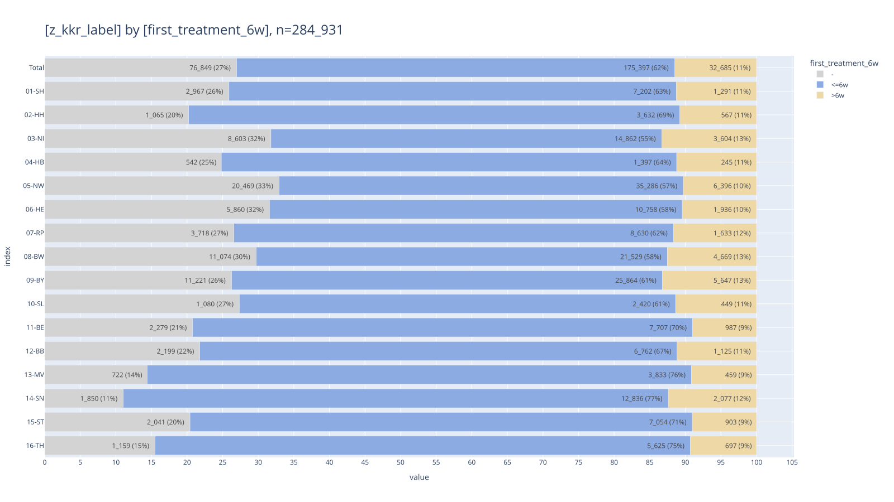
    


    
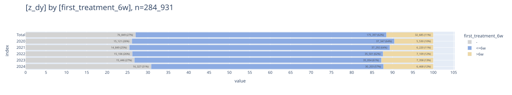
    


<br>

### <a id='toc1_8_1_'></a>[Zeitlicher Abstand der Behandlungen](#toc0_)
- Filter: `C18`, Tumore mit Behandlung
- gezählt sind Tumore
- abgebildet sind Median Werte für den Abstand Diagnose bis erste Behandlung in Tagen (logarithmische Skala)


```
    counts: all rows (no grouping)
    ---
    n = 4_015_983
    └ [DJ 2020-2024]:       n = 3_758_513
    └ [nur C18]:            n = 193_488 (100.0%) ██████████████████████████████
    └ [Tumor hat Therapie]: n = 139_667  (72.2%) ░░░░░░░░░█████████████████████
```

<details>
<summary>filter-sql</summary>

```sql
z_dy between 2020 and 2024
and z_icd10_3d in ('C18')
and z_tum_op_count+z_tum_sy_count+z_tum_st_count > 0
```

</details>


    
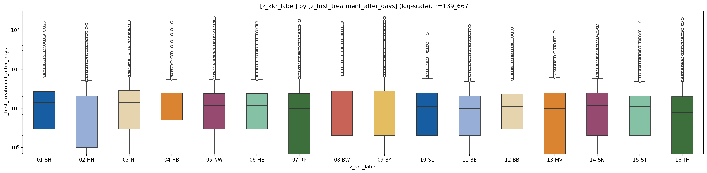
    


    
    column (n = 139_667)         |    notnull    | min | lower | q25  | median | mean  |  q75  | upper |  max  |  std  |  cv 
    -----------------------------+---------------+-----+-------+------+--------+-------+-------+-------+-------+-------+-----
    z_first_treatment_after_days | 139_477 (99%) |   0 |     0 | 2.00 |  12.00 | 24.94 | 25.00 |    59 | 2_092 | 73.57 | 2.95
    
    
    item (n = 139_667) | count  | min | lower | q25  | median | mean  |  q75  | upper |  max  |  std  |  cv 
    -------------------+--------+-----+-------+------+--------+-------+-------+-------+-------+-------+-----
    01-SH              |  5_899 |   0 |     0 | 3.00 |  14.00 | 22.26 | 27.00 |    63 | 1_520 | 56.66 | 2.54
    02-HH              |  2_962 |   0 |     0 | 1.00 |   9.00 | 21.21 | 21.00 |    51 | 1_413 | 65.26 | 3.08
    03-NI              | 12_255 |   0 |     0 | 3.00 |  14.00 | 28.50 | 29.00 |    68 | 1_645 | 83.94 | 2.95
    04-HB              |  1_172 |   0 |     0 | 5.00 |  13.00 | 21.88 | 25.00 |    55 | 1_584 | 65.25 | 2.98
    05-NW              | 27_852 |   0 |     0 | 3.00 |  12.00 | 27.86 | 24.00 |    55 | 2_051 | 89.89 | 3.23
    06-HE              |  8_495 |   0 |     0 | 3.00 |  12.00 | 23.84 | 24.00 |    55 | 1_615 | 67.95 | 2.85
    07-RP              |  6_888 |   0 |     0 | 0.00 |  10.00 | 24.73 | 24.00 |    60 | 1_743 | 77.67 | 3.14
    08-BW              | 17_655 |   0 |     0 | 2.00 |  13.00 | 28.43 | 28.00 |    67 | 1_573 | 79.71 | 2.80
    09-BY              | 21_126 |   0 |     0 | 2.00 |  13.00 | 26.55 | 28.00 |    67 | 2_092 | 74.38 | 2.80
    10-SL              |  1_902 |   0 |     0 | 2.00 |  11.00 | 19.88 | 25.00 |    59 |   804 | 38.51 | 1.94
    11-BE              |  6_033 |   0 |     0 | 2.00 |  10.00 | 20.27 | 21.00 |    49 | 1_289 | 57.73 | 2.85
    12-BB              |  5_221 |   0 |     0 | 3.00 |  11.00 | 20.79 | 23.00 |    53 | 1_098 | 48.08 | 2.31
    13-MV              |  2_891 |   0 |     0 | 0.00 |  10.00 | 18.68 | 25.00 |    62 |   898 | 39.47 | 2.11
    14-SN              |  9_823 |   0 |     0 | 2.00 |  12.00 | 19.77 | 25.00 |    59 | 1_325 | 43.00 | 2.17
    15-ST              |  5_175 |   0 |     0 | 2.00 |  11.00 | 18.89 | 21.00 |    49 | 1_701 | 48.86 | 2.59
    16-TH              |  4_128 |   0 |     0 | 0.00 |   8.00 | 20.03 | 20.00 |    50 | 1_939 | 78.47 | 3.92
    


<!-- ## <a id='toc1_9_'></a>[Behandlungsverlauf](#toc0_)
- Filter: `C18`, nur Tumore mit Therapie
- gezählt sind Tumore
- beschränkt auf die ersten 5 Therapien
- Therapien mit gleichem Tumor / Datum / Behandlung sind zusammengeführt
- verschiedene Therapien mit gleichem Tumor und Datum sind hier nicht entfernt -->

<!-- ## <a id='toc1_10_'></a>[🕹️ interaktiv](#toc0_) -->
