# [Auswertungen: kolorektale Krebserkrankungen](#toc0_)

**Table of contents**    
- [Auswertungen: kolorektale Krebserkrankungen](#toc1_)    
  - [📆 Datenstand](#toc1_1_)    
  - [⚙️ Teildatensatz](#toc1_2_)    
  - [Fallzahlen](#toc1_3_)    
    - [Fallzahlen C18-C20 in Verhältnis zu allen Diagnosen](#toc1_3_1_)    
    - [Fallzahlen C18-C20 nach Viersteller](#toc1_3_2_)    
  - [Verteilung T_p + T_c](#toc1_4_)    
    - [nach Diagnose](#toc1_4_1_)    
    - [T_p + T_c für operierte C18](#toc1_4_2_)    
    - [operiert nach UICC und kkr für C18](#toc1_4_3_)    
  - [Verteilung M_p](#toc1_5_)    
  - [Verteilung UICC_p](#toc1_6_)    
  - [OP](#toc1_7_)    
    - [Operation erfolgt bei C18 mit T_p > 0](#toc1_7_1_)    
    - [Operation erfolgt nach Jahren](#toc1_7_2_)    
  - [OPS](#toc1_8_)    
    - [OPS 5-4xx nach Diagnose](#toc1_8_1_)    
    - [ Verteilung OPS 5-455 bei C18](#toc1_8_2_)    
    - [ Verteilung OPS 5-484 bei C20](#toc1_8_3_)    
    - [Details OPS 5-455.2](#toc1_8_4_)    
      - [Ileozökalresektion](#toc1_8_4_1_)    
      - [rechte Hemikolektomie](#toc1_8_4_2_)    
      - [Sigmaresektion](#toc1_8_4_3_)    
  - [Lokalisation (Fernmetastasen)](#toc1_9_)    
    - [für M1](#toc1_9_1_)    
    - [für M0](#toc1_9_2_)    
    - [für M1a](#toc1_9_3_)    
  - [Rezidive](#toc1_10_)    
  - [Behandlung innerhalb von 6 Wochen](#toc1_11_)    
  - [Erste Behandlung](#toc1_12_)    
    - [Was wurde zuerst behandelt](#toc1_12_1_)    
    - [Zeitlicher Abstand der Behandlungen](#toc1_12_2_)    
  - [Behandlungsverlauf](#toc1_13_)    
  - [🕹️ interaktiv](#toc1_14_)    

<!-- vscode-jupyter-toc-config
	numbering=false
	anchor=true
	flat=false
	minLevel=1
	maxLevel=6
	/vscode-jupyter-toc-config -->
<!-- THIS CELL WILL BE REPLACED ON TOC UPDATE. DO NOT WRITE YOUR TEXT IN THIS CELL -->

    🐍 3.12.8 | 📦 pygwalker: 0.4.9.15 | 📦 plotly: 6.3.1 | 📦 pandas: 2.3.3 | 📦 numpy: 1.26.4 | 📦 duckdb: 1.4.1 | 📦 pandas-plots: 0.20.4 | 📦 connection-helper: 0.13.1

## [📆 Datenstand](#toc0_)

    sqlite db file:          2025-10-30_data_clin.duckdb
    data tag:                v2.3
    last kkr data import:    2025-09-30
    sql table created:       2025-10-30 16:25:02
    doi:                     10.18444/5.03.01.0005.0021.0001
    document created:        2025-10-31 13:50:04

## [⚙️ Teildatensatz](#toc0_)
- Filter für gültige Fälle: (dieser Filter ist für **alle** Analysen gesetzt)
  - `z_dy` (Diagnosejahr) in 2020-2023
  - nichtleere angaben zu
    - `z_kkr` (lieferndes Krebsregister)
    - `z_age` (Diagnosealter)
    - `z_icd10` (Primärdiagnose)
- Fachlicher Filter:
  - `z_icd10` (Primärdiagnose) in `C18`-`C20`
- aktuelle Fallzahlen mit diesen Filtern
  - Tumore: **226_006**

<!-- ### [Deskriptive Statistik](#toc0_) -->

## [Fallzahlen](#toc0_)

### [Fallzahlen C18-C20 in Verhältnis zu allen Diagnosen](#toc0_)
- Filter: alle Diagnosen inkludiert (C,D)

    
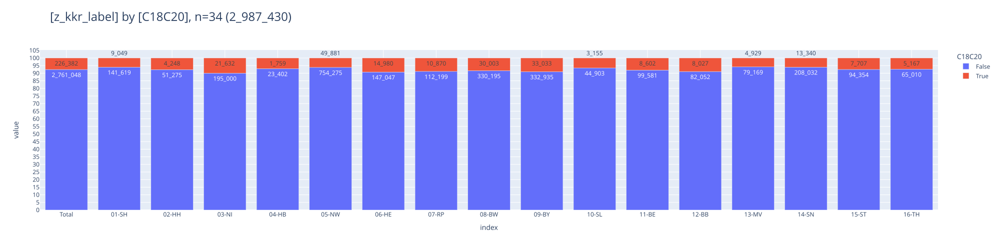
    

### [Fallzahlen C18-C20 nach Viersteller](#toc0_)
- Filter: `C18-20`
> 💡 `C19` darf eigentlich nicht verwendet werden, wird von Krebsgesellschaft nicht akzeptiert

    
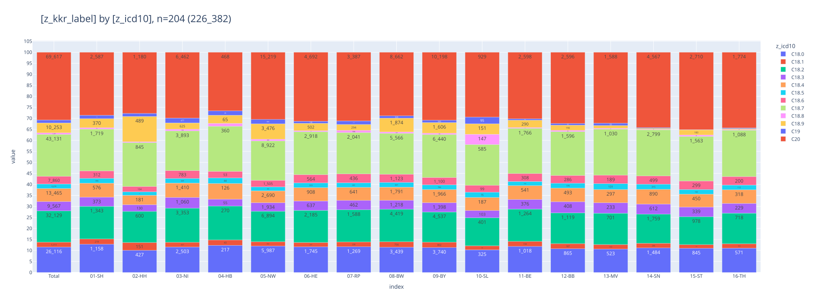
    

## [Verteilung T_p + T_c](#toc0_)
- Filter: `C18-20`
- `z_t_pc_1`: Variable kombiniert p und c Angabe

### [nach Diagnose](#toc0_)
> 💡 fast 20% NA + x sind zu viel, Festlegung Stadium ist eigentlich zwingend

    
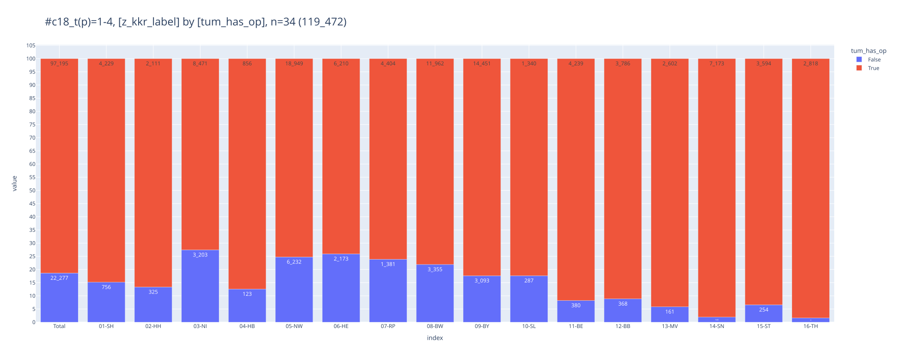
    

### [T_p + T_c für operierte C18](#toc0_)
- Filter: `C18` und Tumor hat (mind) 1 OP Angabe
- `z_t_pc_1`: Variable kombiniert p und c Angabe

    
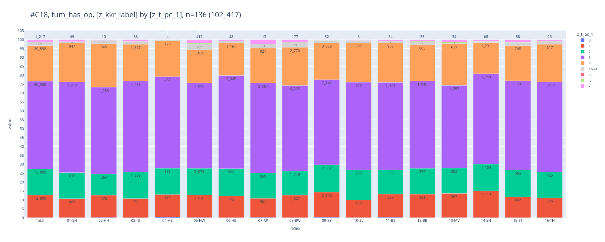
    

### [operiert nach UICC und kkr für C18](#toc0_)
- Filter: `C18` und Stadien 1-4 oder missing
- `tum_has_op`: wurde Tumor operiert

    
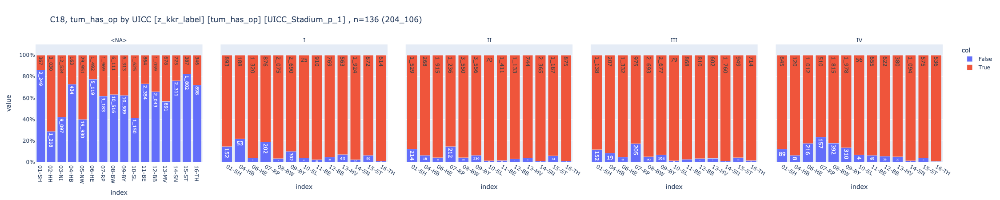
    

## [Verteilung M_p](#toc0_)
- Filter: `C18-20`

_"Wenn bei Erstdiagnose von Darmkrebs auch Lebermetastasen bekannt sind (synchrone hepatische Metastasierung), ob dann zuerst die Leber oder zuerst der Darm operiert wird."_

> 💡 `M1(HEP)` ist als `TNM-M` in den Daten gar nicht vorhanden, `1a(HEP)` nur 1x. In `Weitere Klassifikation` gibt es diese Kodierung ebenfalls nicht

    
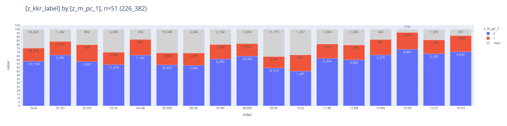
    

## [Verteilung UICC_p](#toc0_)
- Filter: `C18-20`

    
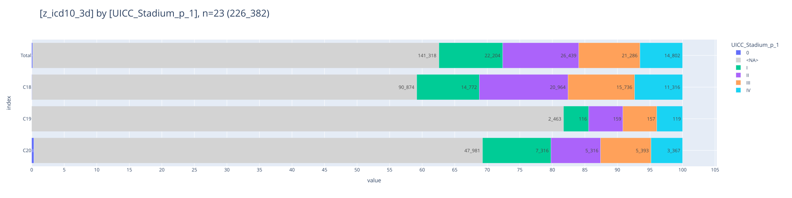
    

## [OP](#toc0_)

### [Operation erfolgt bei C18 mit T_p > 0](#toc0_)
- Filter: `C18` und pathologisches T in 1-4
> 💡 5% wäre realistisch. patho stadium müsste zwingend vorhanden sein nach OP

    

    

### [Operation erfolgt nach Jahren](#toc0_)
- Filter: `C18` und pathologisches T in 1-4
- `categ_treat`
  - `1-op` - OP dokumentiert
  - `2-noop-sy-st` - keine OP dokumentiert, aber ST oder SYST
  - `3-noop-nosy-nost` - keine Behandlung dokumentiert

    
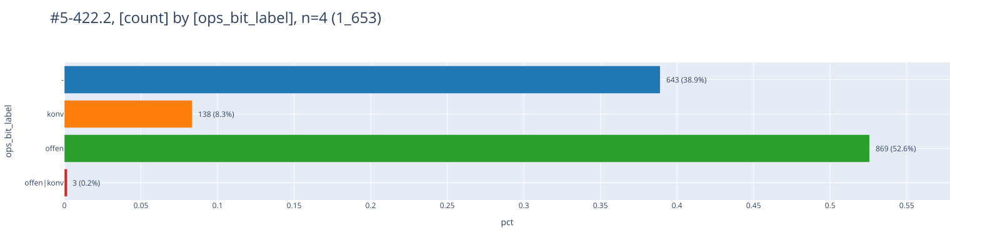
    

## [OPS](#toc0_)

### [OPS 5-4xx nach Diagnose](#toc0_)
- Filter: `C18-C20`
- gezählt sind OPS Angaben, nicht Tumore

 

    FILTER: z_icd10_3d in ('C18','C19','C20') and left(ops.Code,3) in ('5-4')
    
    ┌─────────────────────────────────────────────────────────────────────────────────────────────────────────────────────────────────────┬─────────┐
    │                                                                 ops                                                                 │ cnt_ops │
    │                                                               varchar                                                               │  int32  │
    ├─────────────────────────────────────────────────────────────────────────────────────────────────────────────────────────────────────┼─────────┤
    │ 5-455.41 - Partielle Resektion des Dickdarmes: Resektion des Colon ascendens mit Coecum und rechter Flexur [Hemikolektomie rechts…  │   25109 │
    │ 5-455.45 - Partielle Resektion des Dickdarmes: Resektion des Colon ascendens mit Coecum und rechter Flexur [Hemikolektomie rechts…  │   15845 │
    │ 5-462.1 - Anlegen eines Enterostomas (als protektive Maßnahme) im Rahmen eines anderen Eingriffs: Ileostoma                         │   11667 │
    │ 5-469.20 - Andere Operationen am Darm: Adhäsiolyse: Offen chirurgisch                                                               │   10840 │
    │ 5-484.55 - Rektumresektion unter Sphinktererhaltung: Tiefe anteriore Resektion: Laparoskopisch mit Anastomose                       │   10104 │
    │ 5-484.35 - Rektumresektion unter Sphinktererhaltung: Anteriore Resektion: Laparoskopisch mit Anastomose                             │    8378 │
    │ 5-406.9 - Regionale Lymphadenektomie (Ausräumung mehrerer Lymphknoten einer Region) im Rahmen einer anderen Operation: Mesenterial  │    8109 │
    │ 5-455.75 - Partielle Resektion des Dickdarmes: Sigmaresektion: Laparoskopisch mit Anastomose                                        │    7998 │
    │ 5-469.21 - Andere Operationen am Darm: Adhäsiolyse: Laparoskopisch                                                                  │    6746 │
    │ 5-455.71 - Partielle Resektion des Dickdarmes: Sigmaresektion: Offen chirurgisch mit Anastomose                                     │    3844 │
    ├─────────────────────────────────────────────────────────────────────────────────────────────────────────────────────────────────────┴─────────┤
    │ 10 rows                                                                                                                             2 columns │
    └───────────────────────────────────────────────────────────────────────────────────────────────────────────────────────────────────────────────┘
    

    
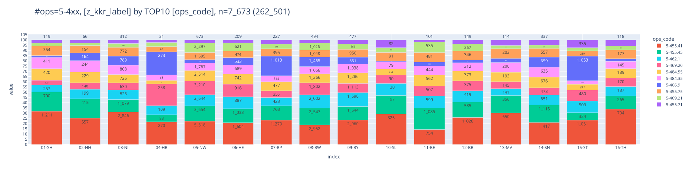
    

### [ Verteilung OPS 5-455 bei C18](#toc0_)
- Filter: `C18` und `M0`
- gezählt sind Tumore
- `has_5-455`: True wenn Tumor >= 1 OPS 5-455 hat
> 💡 Erwartet sind ~95% Anteil für True, tatsächlich sind es für D ~75%

    FILTER: z_icd10_3d = 'C18' and z_m_pc_1 = '0'
    

    
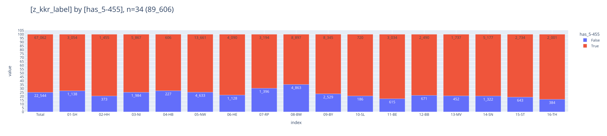
    

### [ Verteilung OPS 5-484 bei C20](#toc0_)
- Filter: `C18` und `M0`
- `has_5-48x`: True wenn Tumor >= 1 OPS 5-484 oder 5-485 hat
> 💡 ~40% haben True, weniger als erwartet 

    
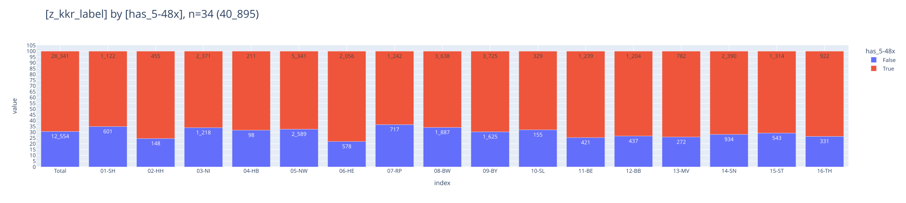
    

### [Details OPS 5-455.2](#toc0_)
- Filter: `C18-C20`, alle Tumore mit min 1 OP
- gezählt sind Tumore
- die Gruppen können überlappen
  - `lleo` - Ileozökalresektion
  - `hemi` - rechte Hemikolektomie
  - `sigma` - Sigmaresektion
  - `-` - keine der genannten OPS

    FILTER: z_icd10_3d in ('C18','C19','C20') and z_tum_op_count > 0
    

    
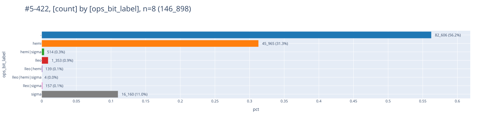
    

#### [Ileozökalresektion](#toc0_)
- Filter: alle Tumore, die einen OPS Code `5-455.2` aufweisen
- gezählt sind Tumore
- die Gruppen können überlappen

> 💡 keine Robotik `5-987.1` geschlüsselt für diese Tumore

    
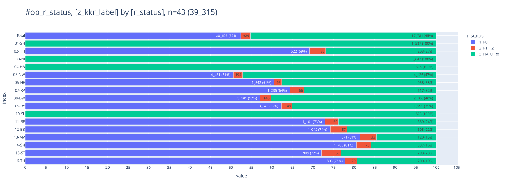
    

#### [rechte Hemikolektomie](#toc0_)
- Filter: alle Tumore, die einen OPS Code `5-455.4` aufweisen
- gezählt sind Tumore
- die Gruppen können überlappen

> 💡 kaum Robotik `5-987.1` geschlüsselt für diese Tumore (n=4)

    

    

#### [Sigmaresektion](#toc0_)
- Filter: alle Tumore, die einen OPS Code `5-455.7` aufweisen
- gezählt sind Tumore
- die Gruppen können überlappen

> 💡 kaum Robotik `5-987.1` geschlüsselt für diese Tumore (n=4)

    

    

## [Lokalisation (Fernmetastasen)](#toc0_)

### [für M1](#toc0_)
- Filter: `C18`-`C20`, nur `M1`
- gezählt sind Tumore. Allerdings: Bei mehrfachen FM Angaben werden Tumore **mehrfach** gezählt

> 💡 50% von M1 haben Leber FM

    38_819 Tumore im Filter haben M1, 131_740 haben M0

    
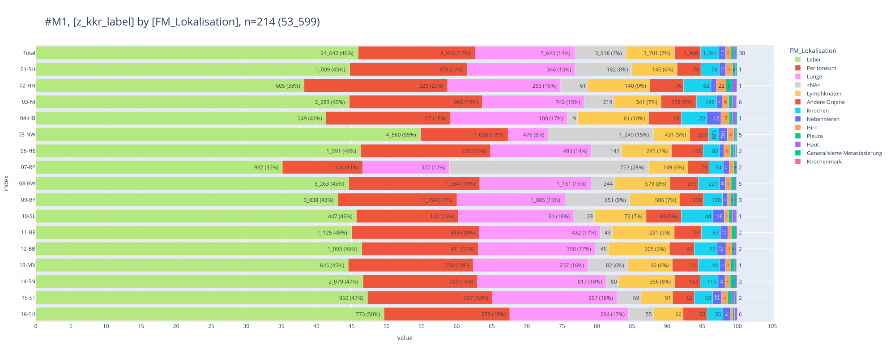
    

### [für M0](#toc0_)
- Filter: `C18`-`C20`, nur `M0`
- gezählt sind Tumore. Allerdings: Bei mehrfachen FM Angaben werden Tumore **mehrfach** gezählt

> 💡 FM Angaben trotz M0 bleiben eine Randerscheinung

    
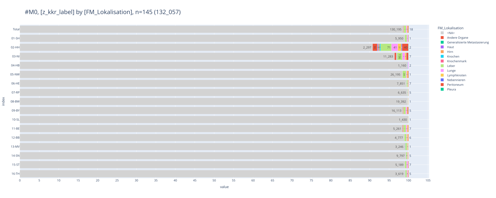
    

### [für M1a](#toc0_)
- Filter: `C18`-`C20`, nur `M1a`
- gezählt sind Tumore. Allerdings: Bei mehrfachen FM Angaben werden Tumore **mehrfach** gezählt

    
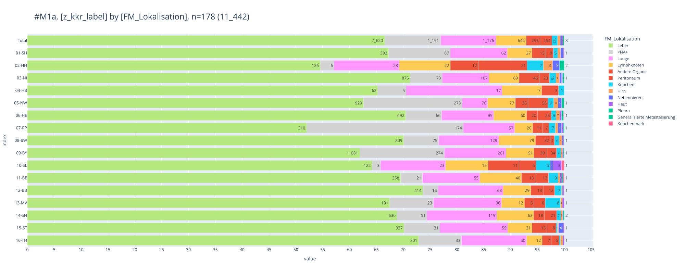
    

## [Rezidive](#toc0_)

**enge Definition eines Rezidivs** 
- Filter: lokaler Beurteilung Residualstatus = R0 (UND M <> 1)
- Rezidiv wenn  
  - Gesamtbeurteilung: Y  oder  
  - Lokaler Tumorstatus: R  oder  
  - Tumorstatus Lymphknoten:R oder  
  - Verlauf Fernmetastasen:R   

**erweiterte Definition (Verworfen)**
- Rezidiv wenn
  - (TNM)r_Symbol:r UND 
  - (Folgeereignis T>0 oder Folgeereignis N>0 oder Folgeereignis M>0)

**Diagramm**
- gezählt sind Tumore
- Kategorien
  - `1_fo_relapse` - Tumore mit Rezidiv nach enger Definition
  - `2_fo_relapse_tnm` - Tumore mit Rezidiv nach erweiterter Definition
  - `3_fo_no_relapse` - Tumore mit Folgeereignis ohne o.a. Rezidiv
  - `4_no_fo` - Tumore ohne Folgeereignis
  - `9_unknown` - Unbekannt

    FILTER: z_dy = 2020 and z_icd10_3d in ('C18','C19','C20') and upper(left(op.Lokale_Beurteilung_Residualstatus,2)) = 'R0' | darin 28_967 Tumore

    
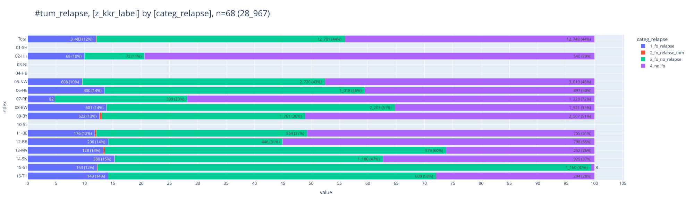
    

<table id="T_b3c75">
  <thead>
    <tr>
      <th class="index_name level0" >categ_relapse</th>
      <th id="T_b3c75_level0_col0" class="col_heading level0 col0" >1_fo_relapse</th>
      <th id="T_b3c75_level0_col1" class="col_heading level0 col1" >2_fo_relapse_tnm</th>
      <th id="T_b3c75_level0_col2" class="col_heading level0 col2" >3_fo_no_relapse</th>
      <th id="T_b3c75_level0_col3" class="col_heading level0 col3" >4_no_fo</th>
      <th id="T_b3c75_level0_col4" class="col_heading level0 col4" >Total</th>
    </tr>
    <tr>
      <th class="index_name level0" >z_kkr_label</th>
      <th class="blank col0" >&nbsp;</th>
      <th class="blank col1" >&nbsp;</th>
      <th class="blank col2" >&nbsp;</th>
      <th class="blank col3" >&nbsp;</th>
      <th class="blank col4" >&nbsp;</th>
    </tr>
  </thead>
  <tbody>
    <tr>
      <th id="T_b3c75_level0_row0" class="row_heading level0 row0" >02-HH</th>
      <td id="T_b3c75_row0_col0" class="data row0 col0" >68 (0.2%) </td>
      <td id="T_b3c75_row0_col1" class="data row0 col1" >0 </td>
      <td id="T_b3c75_row0_col2" class="data row0 col2" >72 (0.2%) </td>
      <td id="T_b3c75_row0_col3" class="data row0 col3" >540 (1.9%) </td>
      <td id="T_b3c75_row0_col4" class="data row0 col4" >680 (2.3%) </td>
    </tr>
    <tr>
      <th id="T_b3c75_level0_row1" class="row_heading level0 row1" >05-NW</th>
      <td id="T_b3c75_row1_col0" class="data row1 col0" >608 (2.1%) </td>
      <td id="T_b3c75_row1_col1" class="data row1 col1" >5 (0.0%) </td>
      <td id="T_b3c75_row1_col2" class="data row1 col2" >2_720 (9.4%) </td>
      <td id="T_b3c75_row1_col3" class="data row1 col3" >3_019 (10.4%) </td>
      <td id="T_b3c75_row1_col4" class="data row1 col4" >6_352 (21.9%) </td>
    </tr>
    <tr>
      <th id="T_b3c75_level0_row2" class="row_heading level0 row2" >06-HE</th>
      <td id="T_b3c75_row2_col0" class="data row2 col0" >300 (1.0%) </td>
      <td id="T_b3c75_row2_col1" class="data row2 col1" >0 </td>
      <td id="T_b3c75_row2_col2" class="data row2 col2" >1_018 (3.5%) </td>
      <td id="T_b3c75_row2_col3" class="data row2 col3" >897 (3.1%) </td>
      <td id="T_b3c75_row2_col4" class="data row2 col4" >2_215 (7.6%) </td>
    </tr>
    <tr>
      <th id="T_b3c75_level0_row3" class="row_heading level0 row3" >07-RP</th>
      <td id="T_b3c75_row3_col0" class="data row3 col0" >82 (0.3%) </td>
      <td id="T_b3c75_row3_col1" class="data row3 col1" >0 </td>
      <td id="T_b3c75_row3_col2" class="data row3 col2" >399 (1.4%) </td>
      <td id="T_b3c75_row3_col3" class="data row3 col3" >1_228 (4.2%) </td>
      <td id="T_b3c75_row3_col4" class="data row3 col4" >1_709 (5.9%) </td>
    </tr>
    <tr>
      <th id="T_b3c75_level0_row4" class="row_heading level0 row4" >08-BW</th>
      <td id="T_b3c75_row4_col0" class="data row4 col0" >601 (2.1%) </td>
      <td id="T_b3c75_row4_col1" class="data row4 col1" >0 </td>
      <td id="T_b3c75_row4_col2" class="data row4 col2" >2_203 (7.6%) </td>
      <td id="T_b3c75_row4_col3" class="data row4 col3" >1_521 (5.3%) </td>
      <td id="T_b3c75_row4_col4" class="data row4 col4" >4_325 (14.9%) </td>
    </tr>
    <tr>
      <th id="T_b3c75_level0_row5" class="row_heading level0 row5" >09-BY</th>
      <td id="T_b3c75_row5_col0" class="data row5 col0" >622 (2.1%) </td>
      <td id="T_b3c75_row5_col1" class="data row5 col1" >20 (0.1%) </td>
      <td id="T_b3c75_row5_col2" class="data row5 col2" >1_761 (6.1%) </td>
      <td id="T_b3c75_row5_col3" class="data row5 col3" >2_507 (8.7%) </td>
      <td id="T_b3c75_row5_col4" class="data row5 col4" >4_910 (17.0%) </td>
    </tr>
    <tr>
      <th id="T_b3c75_level0_row6" class="row_heading level0 row6" >11-BE</th>
      <td id="T_b3c75_row6_col0" class="data row6 col0" >176 (0.6%) </td>
      <td id="T_b3c75_row6_col1" class="data row6 col1" >4 (0.0%) </td>
      <td id="T_b3c75_row6_col2" class="data row6 col2" >554 (1.9%) </td>
      <td id="T_b3c75_row6_col3" class="data row6 col3" >755 (2.6%) </td>
      <td id="T_b3c75_row6_col4" class="data row6 col4" >1_489 (5.1%) </td>
    </tr>
    <tr>
      <th id="T_b3c75_level0_row7" class="row_heading level0 row7" >12-BB</th>
      <td id="T_b3c75_row7_col0" class="data row7 col0" >206 (0.7%) </td>
      <td id="T_b3c75_row7_col1" class="data row7 col1" >0 </td>
      <td id="T_b3c75_row7_col2" class="data row7 col2" >446 (1.5%) </td>
      <td id="T_b3c75_row7_col3" class="data row7 col3" >798 (2.8%) </td>
      <td id="T_b3c75_row7_col4" class="data row7 col4" >1_450 (5.0%) </td>
    </tr>
    <tr>
      <th id="T_b3c75_level0_row8" class="row_heading level0 row8" >13-MV</th>
      <td id="T_b3c75_row8_col0" class="data row8 col0" >128 (0.4%) </td>
      <td id="T_b3c75_row8_col1" class="data row8 col1" >3 (0.0%) </td>
      <td id="T_b3c75_row8_col2" class="data row8 col2" >579 (2.0%) </td>
      <td id="T_b3c75_row8_col3" class="data row8 col3" >252 (0.9%) </td>
      <td id="T_b3c75_row8_col4" class="data row8 col4" >962 (3.3%) </td>
    </tr>
    <tr>
      <th id="T_b3c75_level0_row9" class="row_heading level0 row9" >14-SN</th>
      <td id="T_b3c75_row9_col0" class="data row9 col0" >380 (1.3%) </td>
      <td id="T_b3c75_row9_col1" class="data row9 col1" >2 (0.0%) </td>
      <td id="T_b3c75_row9_col2" class="data row9 col2" >1_180 (4.1%) </td>
      <td id="T_b3c75_row9_col3" class="data row9 col3" >929 (3.2%) </td>
      <td id="T_b3c75_row9_col4" class="data row9 col4" >2_491 (8.6%) </td>
    </tr>
    <tr>
      <th id="T_b3c75_level0_row10" class="row_heading level0 row10" >15-ST</th>
      <td id="T_b3c75_row10_col0" class="data row10 col0" >163 (0.6%) </td>
      <td id="T_b3c75_row10_col1" class="data row10 col1" >1 (0.0%) </td>
      <td id="T_b3c75_row10_col2" class="data row10 col2" >1_160 (4.0%) </td>
      <td id="T_b3c75_row10_col3" class="data row10 col3" >8 (0.0%) </td>
      <td id="T_b3c75_row10_col4" class="data row10 col4" >1_332 (4.6%) </td>
    </tr>
    <tr>
      <th id="T_b3c75_level0_row11" class="row_heading level0 row11" >16-TH</th>
      <td id="T_b3c75_row11_col0" class="data row11 col0" >149 (0.5%) </td>
      <td id="T_b3c75_row11_col1" class="data row11 col1" >0 </td>
      <td id="T_b3c75_row11_col2" class="data row11 col2" >609 (2.1%) </td>
      <td id="T_b3c75_row11_col3" class="data row11 col3" >294 (1.0%) </td>
      <td id="T_b3c75_row11_col4" class="data row11 col4" >1_052 (3.6%) </td>
    </tr>
    <tr>
      <th id="T_b3c75_level0_row12" class="row_heading level0 row12" >Total</th>
      <td id="T_b3c75_row12_col0" class="data row12 col0" >3_483 (12.0%) </td>
      <td id="T_b3c75_row12_col1" class="data row12 col1" >35 (0.1%) </td>
      <td id="T_b3c75_row12_col2" class="data row12 col2" >12_701 (43.8%) </td>
      <td id="T_b3c75_row12_col3" class="data row12 col3" >12_748 (44.0%) </td>
      <td id="T_b3c75_row12_col4" class="data row12 col4" >28_967 (100.0%) </td>
    </tr>
  </tbody>
</table>

 

## [Behandlung innerhalb von 6 Wochen](#toc0_)
- Filter: `C18`-`C20`
- `first_treatment_6w`
  - `<=6w`: erste Behandlung innerhalb von 6 Wochen
  - `>6w`: erste Behandlung nach 6 Wochen
  - `no delta`: Behandlung ist dokumentiert, aber kein Abstand
  - `-`: keine Behandlung dokumentiert

    
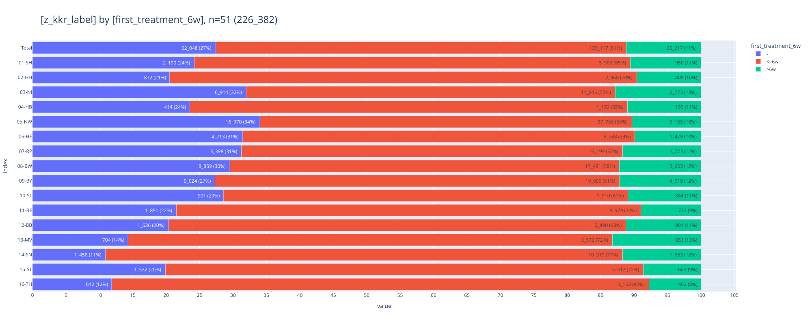
    

## [Erste Behandlung](#toc0_)

### [Was wurde zuerst behandelt](#toc0_)
- Filter: `M1` und Tumor hat Lebermetastasen und `C18` oder `C20`
- gezählt sind Tumore

    
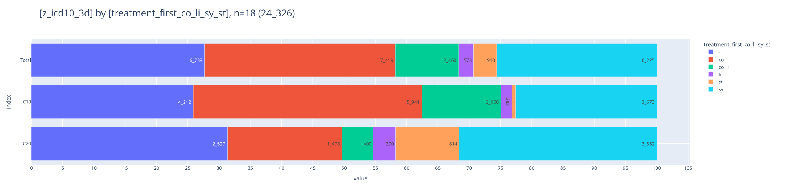
    

### [Zeitlicher Abstand der Behandlungen](#toc0_)
- Filter: `C18`-`C20`, Tumore mit Behandlung
- gezählt sind Tumore
- abgebildet sind Median Werte für den Abstand Diagnose bis erste Behandlung in Tagen (logarithmische Skala)

    
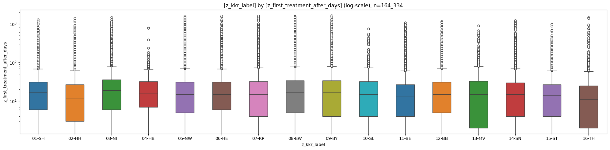
    

    
    column                       |  count  | min | lower | q25  | median | mean  |  q75  | upper |  max  |  std  |  cv  |    sum   
    -----------------------------+---------+-----+-------+------+--------+-------+-------+-------+-------+-------+------+----------
    z_first_treatment_after_days | 164_334 |   0 |     0 | 5.00 |  16.00 | 29.85 | 32.00 |    72 | 1_645 | 70.95 | 2.38 | 4_905_364
    
    
    column | count  | min  | lower | q25  | median | mean  |  q75  | upper |   max    |  std  |  cv  |     sum     
    -------+--------+------+-------+------+--------+-------+-------+-------+----------+-------+------+-------------
    01-SH  |  6_859 | 0.00 |  0.00 | 6.00 |  17.00 | 26.53 | 31.00 | 68.00 | 1_279.00 | 53.83 | 2.03 |   181_981.00
    02-HH  |  3_376 | 0.00 |  0.00 | 3.00 |  12.00 | 27.68 | 27.00 | 63.00 | 1_413.00 | 79.01 | 2.85 |    93_457.00
    03-NI  | 14_718 | 0.00 |  0.00 | 6.00 |  19.00 | 31.70 | 36.00 | 81.00 | 1_464.00 | 66.03 | 2.08 |   466_522.00
    04-HB  |  1_345 | 0.00 |  0.00 | 7.00 |  16.00 | 23.97 | 32.00 | 67.00 |   791.00 | 38.62 | 1.61 |    32_236.00
    05-NW  | 32_911 | 0.00 |  0.00 | 5.00 |  15.00 | 33.86 | 31.00 | 70.00 | 1_604.00 | 86.22 | 2.55 | 1_114_416.00
    06-HE  | 10_267 | 0.00 |  0.00 | 6.00 |  15.00 | 30.66 | 31.00 | 68.00 | 1_609.00 | 75.23 | 2.45 |   314_831.00
    07-RP  |  7_472 | 0.00 |  0.00 | 4.00 |  15.00 | 33.77 | 32.00 | 74.00 | 1_611.00 | 82.45 | 2.44 |   252_328.00
    08-BW  | 21_144 | 0.00 |  0.00 | 5.00 |  17.00 | 33.64 | 34.00 | 77.00 | 1_573.00 | 83.39 | 2.48 |   711_326.00
    09-BY  | 24_009 | 0.00 |  0.00 | 4.00 |  17.00 | 30.92 | 34.00 | 79.00 | 1_645.00 | 69.89 | 2.26 |   742_335.00
    10-SL  |  2_254 | 0.00 |  0.00 | 4.00 |  15.00 | 25.05 | 32.00 | 74.00 |   752.00 | 43.15 | 1.72 |    56_456.00
    11-BE  |  6_751 | 0.00 |  0.00 | 4.00 |  13.00 | 25.11 | 27.00 | 61.00 | 1_084.00 | 60.74 | 2.42 |   169_498.00
    12-BB  |  6_391 | 0.00 |  0.00 | 5.00 |  15.00 | 24.60 | 31.00 | 70.00 | 1_158.00 | 47.35 | 1.93 |   157_193.00
    13-MV  |  4_225 | 0.00 |  0.00 | 2.00 |  15.00 | 23.63 | 33.00 | 79.00 |   898.00 | 39.33 | 1.66 |    99_827.00
    14-SN  | 11_882 | 0.00 |  0.00 | 4.00 |  15.00 | 23.92 | 30.00 | 69.00 | 1_216.00 | 47.17 | 1.97 |   284_273.00
    15-ST  |  6_175 | 0.00 |  0.00 | 4.00 |  14.00 | 22.12 | 27.00 | 61.00 |   983.00 | 40.73 | 1.84 |   136_573.00
    16-TH  |  4_555 | 0.00 |  0.00 | 2.00 |  11.00 | 20.22 | 25.00 | 59.00 | 1_456.00 | 53.07 | 2.62 |    92_112.00
    

## [Behandlungsverlauf](#toc0_)
- Filter: `C18`-`C20`, nur Tumore mit Therapie
- gezählt sind Tumore
- beschränkt auf die ersten 5 Therapien
- Therapien mit gleichem Tumor / Datum / Behandlung sind zusammengeführt
- verschiedene Therapien mit gleichem Tumor und Datum sind hier nicht entfernt

    FILTER: z_icd10_3d in ('C18','C19','C20') | darin 226_382 Tumore, 728_182 deduplizierte Therapien | darin mit Datum: 164_524 Tumore, 279_051 Therapien

    

    

## [🕹️ interaktiv](#toc0_)
