# <a id='toc1_'></a>[Auswertungen: kolorektale Krebserkrankungen](#toc0_)

**Table of contents**<a id='toc0_'></a>    
- [Auswertungen: kolorektale Krebserkrankungen](#toc1_)    
  - [📆 Datenstand](#toc1_1_)    
  - [⚙️ Teildatensatz](#toc1_2_)    
  - [Fallzahlen](#toc1_3_)    
    - [Teildatensatz](#toc1_3_1_)    
    - [Fallzahlen C18-C20 in Verhältnis zu allen Diagnosen](#toc1_3_2_)    
    - [Fallzahlen C18-C20 nach Viersteller](#toc1_3_3_)    
  - [OP](#toc1_4_)    
    - [Operation erfolgt bei C18 mit T_p > 0](#toc1_4_1_)    
    - [Operation erfolgt nach Jahren](#toc1_4_2_)    
  - [OPS](#toc1_5_)    
    - [OPS 5-4xx nach Diagnose](#toc1_5_1_)    
    - [ Verteilung OPS 5-455 bei C18](#toc1_5_2_)    
    - [ Verteilung OPS 5-484 bei C20](#toc1_5_3_)    
    - [Details OPS 5-455.2](#toc1_5_4_)    
      - [Ileozökalresektion](#toc1_5_4_1_)    
      - [rechte Hemikolektomie](#toc1_5_4_2_)    
      - [Sigmaresektion](#toc1_5_4_3_)    
  - [Lokalisation (Fernmetastasen)](#toc1_6_)    
    - [für M1](#toc1_6_1_)    
  - [Rezidive](#toc1_7_)    
    - [Verteilung OP in 2020](#toc1_7_1_)    
      - [davon: Verteilung nur R0](#toc1_7_1_1_)    
  - [Behandlung innerhalb von 6 Wochen](#toc1_8_)    
  - [Erste Behandlung](#toc1_9_)    
    - [Was wurde zuerst behandelt](#toc1_9_1_)    
    - [Zeitlicher Abstand der Behandlungen](#toc1_9_2_)    
  - [Behandlungsverlauf](#toc1_10_)    
  - [🕹️ interaktiv](#toc1_11_)    

<!-- vscode-jupyter-toc-config
	numbering=false
	anchor=true
	flat=false
	minLevel=1
	maxLevel=6
	/vscode-jupyter-toc-config -->
<!-- THIS CELL WILL BE REPLACED ON TOC UPDATE. DO NOT WRITE YOUR TEXT IN THIS CELL -->

    🐍 3.12.8 | 📦 pandas: 2.3.3 | 📦 numpy: 1.26.4 | 📦 duckdb: 1.4.4 | 📦 pandas-plots: 1.2.12 | 📦 connection-helper: 0.13.3


## <a id='toc1_1_'></a>[📆 Datenstand](#toc0_)

    database file:           2026-03-04_data_clin.duckdb
    data tag:                v2.4
    last kkr data import:    2026-02-26
    sql table created:       2026-03-04 10:17:13
    doi:                     -
    document created:        2026-03-04 19:31:11


## <a id='toc1_2_'></a>[⚙️ Teildatensatz](#toc0_)
- Filter für gültige Fälle: (dieser Filter ist für **alle** Analysen gesetzt)
  - `z_dy` (Diagnosejahr) in 2020-2024
  - `z_icd10_3d` (Primärdiagnose) in `C18`-`C20`

<!-- ### <a id='toc1_2_1_'></a>[Deskriptive Statistik](#toc0_) -->

## <a id='toc1_3_'></a>[Fallzahlen](#toc0_)


```python
    counts: all rows (no grouping)
    ---
    n = 4_015_983                    (100.0%) ██████████████████████████████
    └ [DJ 2020-2024]:  n = 3_758_513  (93.6%) ░░████████████████████████████
    └ [ICD10 C18-C20]:   n = 284_931   (7.1%) ░░░░░░░░░░░░░░░░░░░░░░░░░░░░██
```

<details>
<summary>filter-sql</summary>

```sql
z_dy between 2020 and 2024
and z_icd10_3d in ('C18','C19','C20')
```

</details>


### <a id='toc1_3_2_'></a>[Fallzahlen C18-C20 in Verhältnis zu allen Diagnosen](#toc0_)
- Filter: alle Diagnosen inkludiert (C,D)


    
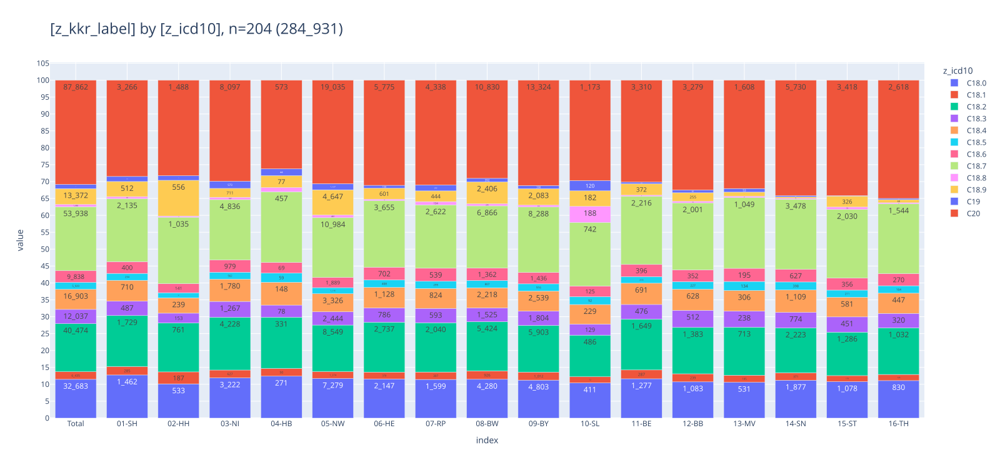
    


### <a id='toc1_3_3_'></a>[Fallzahlen C18-C20 nach Viersteller](#toc0_)
- Filter: `C18-20`
> 💡 `C19` darf eigentlich nicht verwendet werden, wird von Krebsgesellschaft nicht akzeptiert


    

    


    
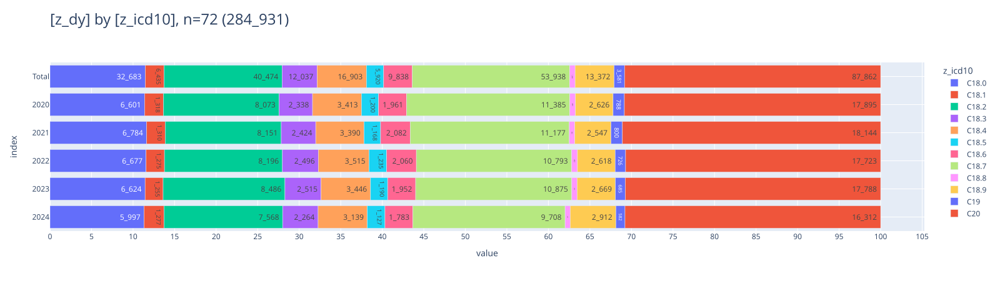
    


## <a id='toc1_4_'></a>[OP](#toc0_)

### <a id='toc1_4_1_'></a>[Operation erfolgt bei C18 mit T_p > 0](#toc0_)
- Filter: `C18` und pathologisches T in 1-4
> 💡 5% wäre realistisch. patho stadium müsste zwingend vorhanden sein nach OP


```python
    counts: all rows (no grouping)
    ---
    n = 4_015_983
    └ [DJ 2020-2024]:  n = 3_758_513
    └ [ICD10 C18-C20]: n = 284_931 (100.0%) ██████████████████████████████
    └ [nur C18]:       n = 193_488  (67.9%) ░░░░░░░░░░████████████████████
    └ [t_p = 1-4]:     n = 150_961  (53.0%) ░░░░░░░░░░░░░░░███████████████
```

<details>
<summary>filter-sql</summary>

```sql
z_dy between 2020 and 2024
and z_icd10_3d in ('C18','C19','C20')
and z_icd10_3d in ('C18')
and z_t_p_1 in ('1','2','3','4')
```

</details>


    
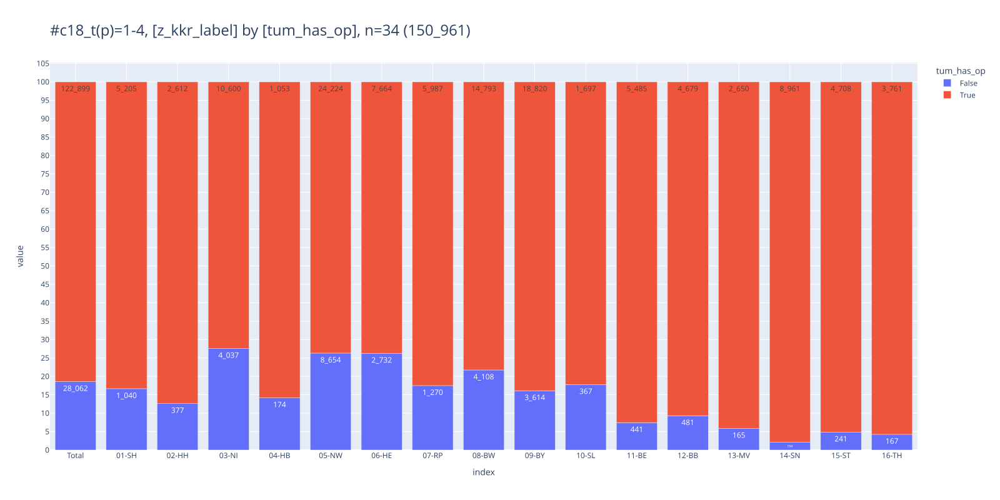
    


### <a id='toc1_4_2_'></a>[Operation erfolgt nach Jahren](#toc0_)
- Filter: `C18` und pathologisches T in 1-4
- `categ_treat`
  - `1-op` - OP dokumentiert
  - `2-noop-sy-st` - keine OP dokumentiert, aber ST oder SYST
  - `3-noop-nosy-nost` - keine Behandlung dokumentiert


```python
    counts: all rows (no grouping)
    ---
    n = 4_015_983
    └ [DJ 2020-2024]:  n = 3_758_513
    └ [ICD10 C18-C20]: n = 284_931 (100.0%) ██████████████████████████████
    └ [nur C18]:       n = 193_488  (67.9%) ░░░░░░░░░░████████████████████
    └ [t_p = 1-4]:     n = 150_961  (53.0%) ░░░░░░░░░░░░░░░███████████████
```

<details>
<summary>filter-sql</summary>

```sql
z_dy between 2020 and 2024
and z_icd10_3d in ('C18','C19','C20')
and z_icd10_3d in ('C18')
and z_t_p_1 in ('1','2','3','4')
```

</details>


    
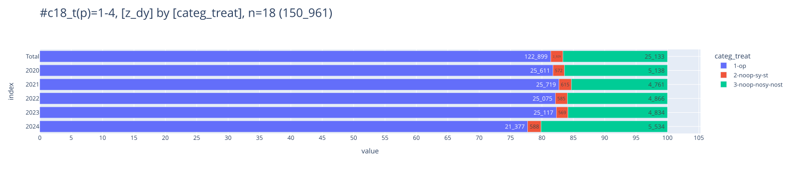
    


## <a id='toc1_5_'></a>[OPS](#toc0_)


### <a id='toc1_5_1_'></a>[OPS 5-4xx nach Diagnose](#toc0_)
- Filter: `C18-C20`
- gezählt sind OPS Angaben, nicht Tumore

<br>


```python
    counts: distinct OPSId
    ---
    n = 4_039_783                    (100.0%) ██████████████████████████████
    └ [DJ 2020-2024]:  n = 3_990_198  (98.8%) ░█████████████████████████████
    └ [ICD10 C18-C20]:   n = 499_943  (12.4%) ░░░░░░░░░░░░░░░░░░░░░░░░░░░███
    └ [nur C18]:         n = 324_504   (8.0%) ░░░░░░░░░░░░░░░░░░░░░░░░░░░░██
    └ [OPS 5-4]:         n = 218_360   (5.4%) ░░░░░░░░░░░░░░░░░░░░░░░░░░░░░█
```

<details>
<summary>filter-sql</summary>

```sql
z_dy between 2020 and 2024
and z_icd10_3d in ('C18','C19','C20')
and z_icd10_3d in ('C18')
and left(Code,3) in ('5-4')
```

</details>


    Anzahl verschiedene ops_codes:  17902

```python
    ┌─────────────────────────────────────────────────────────────────────────────────────────────────────────────────────────────────────┬─────────┐
    │                                                                 ops                                                                 │ cnt_ops │
    │                                                               varchar                                                               │  int32  │
    ├─────────────────────────────────────────────────────────────────────────────────────────────────────────────────────────────────────┼─────────┤
    │ 5-455.41 - Partielle Resektion des Dickdarmes: Resektion des Colon ascendens mit Coecum und rechter Flexur [Hemikolektomie rechts…  │   30629 │
    │ 5-455.45 - Partielle Resektion des Dickdarmes: Resektion des Colon ascendens mit Coecum und rechter Flexur [Hemikolektomie rechts…  │   21351 │
    │ 5-469.20 - Andere Operationen am Darm: Adhäsiolyse: Offen chirurgisch                                                               │   10319 │
    │ 5-455.75 - Partielle Resektion des Dickdarmes: Sigmaresektion: Laparoskopisch mit Anastomose                                        │    9885 │
    │ 5-406.9 - Regionale Lymphadenektomie (Ausräumung mehrerer Lymphknoten einer Region) im Rahmen einer anderen Operation: Mesenterial  │    7681 │
    │ 5-469.21 - Andere Operationen am Darm: Adhäsiolyse: Laparoskopisch                                                                  │    5539 │
    │ 5-484.35 - Rektumresektion unter Sphinktererhaltung: Anteriore Resektion: Laparoskopisch mit Anastomose                             │    4779 │
    │ 5-455.71 - Partielle Resektion des Dickdarmes: Sigmaresektion: Offen chirurgisch mit Anastomose                                     │    4438 │
    │ 5-455.65 - Partielle Resektion des Dickdarmes: Resektion des Colon descendens mit linker Flexur [Hemikolektomie links]: Laparosko…  │    4161 │
    │ 5-455.61 - Partielle Resektion des Dickdarmes: Resektion des Colon descendens mit linker Flexur [Hemikolektomie links]: Offen chi…  │    4125 │
    ├─────────────────────────────────────────────────────────────────────────────────────────────────────────────────────────────────────┴─────────┤
    │ 10 rows                                                                                                                             2 columns │
    └───────────────────────────────────────────────────────────────────────────────────────────────────────────────────────────────────────────────┘
```

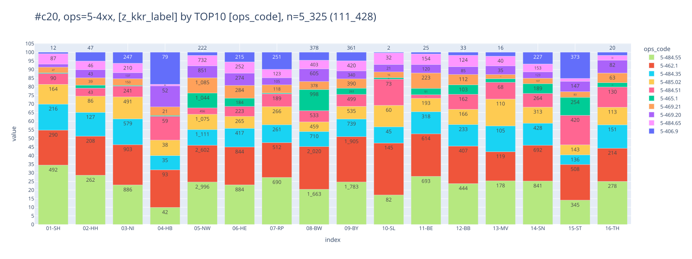
    


    
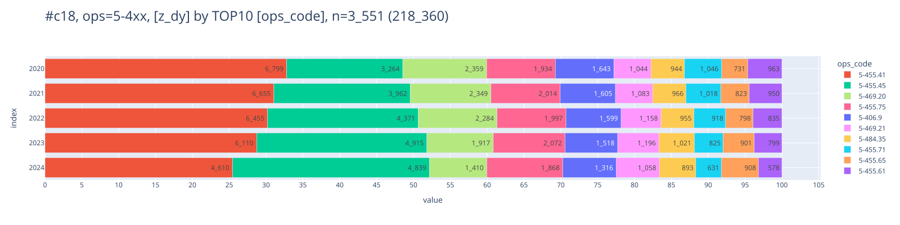
    


```python
    counts: distinct OPSId
    ---
    n = 4_039_783
    └ [DJ 2020-2024]:  n = 3_990_198 (100.0%) ██████████████████████████████
    └ [ICD10 C18-C20]:   n = 499_943  (12.5%) ░░░░░░░░░░░░░░░░░░░░░░░░░░░███
    └ [ICD10 C19]:         n = 4_223   (0.1%) ░░░░░░░░░░░░░░░░░░░░░░░░░░░░░░
    └ [OPS 5-4]:           n = 2_847   (0.1%) ░░░░░░░░░░░░░░░░░░░░░░░░░░░░░░
```

<details>
<summary>filter-sql</summary>

```sql
z_dy between 2020 and 2024
and z_icd10_3d in ('C18','C19','C20')
and z_icd10_3d in ('C19')
and left(Code,3) in ('5-4')
```

</details>


    Anzahl verschiedene ops_codes:  1489

```python
    ┌─────────────────────────────────────────────────────────────────────────────────────────────────────────────────────────────────┬─────────┐
    │                                                               ops                                                               │ cnt_ops │
    │                                                             varchar                                                             │  int32  │
    ├─────────────────────────────────────────────────────────────────────────────────────────────────────────────────────────────────┼─────────┤
    │ 5-484.35 - Rektumresektion unter Sphinktererhaltung: Anteriore Resektion: Laparoskopisch mit Anastomose                         │     427 │
    │ 5-484.31 - Rektumresektion unter Sphinktererhaltung: Anteriore Resektion: Offen chirurgisch mit Anastomose                      │     162 │
    │ 5-484.55 - Rektumresektion unter Sphinktererhaltung: Tiefe anteriore Resektion: Laparoskopisch mit Anastomose                   │     140 │
    │ 5-462.1 - Anlegen eines Enterostomas (als protektive Maßnahme) im Rahmen eines anderen Eingriffs: Ileostoma                     │     128 │
    │ 5-455.75 - Partielle Resektion des Dickdarmes: Sigmaresektion: Laparoskopisch mit Anastomose                                    │      97 │
    │ 5-484.32 - Rektumresektion unter Sphinktererhaltung: Anteriore Resektion: Offen chirurgisch mit Enterostoma und Blindverschluss │      93 │
    │ 5-469.20 - Andere Operationen am Darm: Adhäsiolyse: Offen chirurgisch                                                           │      76 │
    │ 5-469.21 - Andere Operationen am Darm: Adhäsiolyse: Laparoskopisch                                                              │      74 │
    │ 5-455.71 - Partielle Resektion des Dickdarmes: Sigmaresektion: Offen chirurgisch mit Anastomose                                 │      51 │
    │ 5-484.51 - Rektumresektion unter Sphinktererhaltung: Tiefe anteriore Resektion: Offen chirurgisch mit Anastomose                │      44 │
    ├─────────────────────────────────────────────────────────────────────────────────────────────────────────────────────────────────┴─────────┤
    │ 10 rows                                                                                                                         2 columns │
    └───────────────────────────────────────────────────────────────────────────────────────────────────────────────────────────────────────────┘
```

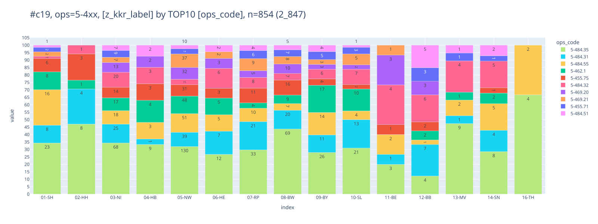
    


    
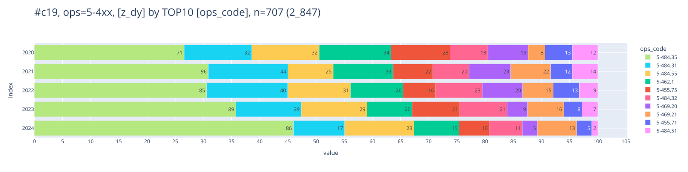
    


```python
    counts: distinct OPSId
    ---
    n = 4_039_783                    (100.0%) ██████████████████████████████
    └ [DJ 2020-2024]:  n = 3_990_198  (98.8%) ░█████████████████████████████
    └ [ICD10 C18-C20]:   n = 499_943  (12.4%) ░░░░░░░░░░░░░░░░░░░░░░░░░░░███
    └ [ICD10 C20]:       n = 171_216   (4.2%) ░░░░░░░░░░░░░░░░░░░░░░░░░░░░░█
    └ [OPS 5-4]:         n = 111_428   (2.8%) ░░░░░░░░░░░░░░░░░░░░░░░░░░░░░░
```

<details>
<summary>filter-sql</summary>

```sql
z_dy between 2020 and 2024
and z_icd10_3d in ('C18','C19','C20')
and z_icd10_3d in ('C20')
and left(Code,3) in ('5-4')
```

</details>


    Anzahl verschiedene ops_codes:  13205

```python
    ┌─────────────────────────────────────────────────────────────────────────────────────────────────────────────────────────────────────┬─────────┐
    │                                                                 ops                                                                 │ cnt_ops │
    │                                                               varchar                                                               │  int32  │
    ├─────────────────────────────────────────────────────────────────────────────────────────────────────────────────────────────────────┼─────────┤
    │ 5-484.55 - Rektumresektion unter Sphinktererhaltung: Tiefe anteriore Resektion: Laparoskopisch mit Anastomose                       │   12559 │
    │ 5-462.1 - Anlegen eines Enterostomas (als protektive Maßnahme) im Rahmen eines anderen Eingriffs: Ileostoma                         │   12076 │
    │ 5-484.35 - Rektumresektion unter Sphinktererhaltung: Anteriore Resektion: Laparoskopisch mit Anastomose                             │    5611 │
    │ 5-485.02 - Rektumresektion ohne Sphinktererhaltung: Abdominoperineal: Kombiniert offen chirurgisch-laparoskopisch                   │    4477 │
    │ 5-484.51 - Rektumresektion unter Sphinktererhaltung: Tiefe anteriore Resektion: Offen chirurgisch mit Anastomose                    │    3502 │
    │ 5-465.1 - Rückverlagerung eines doppelläufigen Enterostomas: Ileostoma                                                              │    3224 │
    │ 5-469.21 - Andere Operationen am Darm: Adhäsiolyse: Laparoskopisch                                                                  │    3133 │
    │ 5-469.20 - Andere Operationen am Darm: Adhäsiolyse: Offen chirurgisch                                                               │    3045 │
    │ 5-484.65 - Rektumresektion unter Sphinktererhaltung: Tiefe anteriore Resektion mit peranaler Anastomose: Laparoskopisch mit Anast…  │    2852 │
    │ 5-406.9 - Regionale Lymphadenektomie (Ausräumung mehrerer Lymphknoten einer Region) im Rahmen einer anderen Operation: Mesenterial  │    2508 │
    ├─────────────────────────────────────────────────────────────────────────────────────────────────────────────────────────────────────┴─────────┤
    │ 10 rows                                                                                                                             2 columns │
    └───────────────────────────────────────────────────────────────────────────────────────────────────────────────────────────────────────────────┘
```


    


    
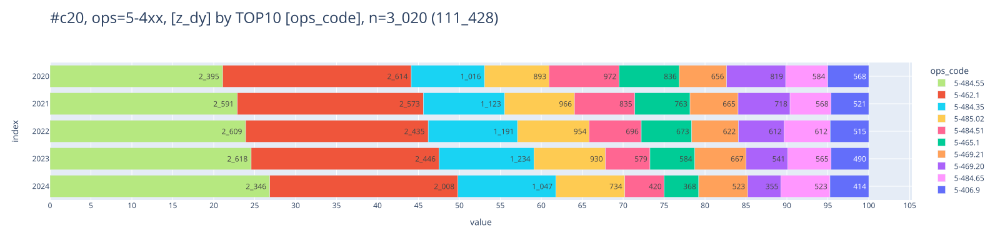
    


### <a id='toc1_5_2_'></a>[ Verteilung OPS 5-455 bei C18](#toc0_)
- Filter: `C18` und `M0`
- gezählt sind Tumore
- `has_5-455`: True wenn Tumor >= 1 OPS 5-455 hat
> 💡 Erwartet sind ~95% Anteil für True, tatsächlich sind es für D ~75%


```python
    counts: all rows (no grouping)
    ---
    n = 4_015_983
    └ [DJ 2020-2024]:  n = 3_758_513
    └ [ICD10 C18-C20]: n = 284_931 (100.0%) ██████████████████████████████
    └ [nur C18]:       n = 193_488  (67.9%) ░░░░░░░░░░████████████████████
    └ [nur M0]:        n = 113_713  (39.9%) ░░░░░░░░░░░░░░░░░░░███████████
```

<details>
<summary>filter-sql</summary>

```sql
z_dy between 2020 and 2024
and z_icd10_3d in ('C18','C19','C20')
and z_icd10_3d in ('C18')
and z_m_pc_1 = '0'
```

</details>


    

    


### <a id='toc1_5_3_'></a>[ Verteilung OPS 5-484 bei C20](#toc0_)
- Filter: `C18` und `M0`
- `has_5-48x`: True wenn Tumor >= 1 OPS 5-484 oder 5-485 hat
> 💡 ~40% haben True, weniger als erwartet 


```python
    counts: all rows (no grouping)
    ---
    n = 4_015_983
    └ [DJ 2020-2024]:  n = 3_758_513
    └ [ICD10 C18-C20]: n = 284_931 (100.0%) ██████████████████████████████
    └ [ICD10 C20]:      n = 87_862  (30.8%) ░░░░░░░░░░░░░░░░░░░░░█████████
    └ [nur M0]:         n = 52_446  (18.4%) ░░░░░░░░░░░░░░░░░░░░░░░░░█████
```

<details>
<summary>filter-sql</summary>

```sql
z_dy between 2020 and 2024
and z_icd10_3d in ('C18','C19','C20')
and z_icd10_3d in ('C20')
and z_m_pc_1 = '0'
```

</details>


    

    


### <a id='toc1_5_4_'></a>[Details OPS 5-455.2](#toc0_)
- Filter: `C18-C20`, alle Tumore mit min 1 OP
- gezählt sind Tumore / OPS
- die Gruppen können überlappen bei der Tumordarstellung
  - `lleo` - Ileozökalresektion
  - `hemi` - rechte Hemikolektomie
  - `sigma` - Sigmaresektion
- in allen Darstellungen ist Robotik ebenfalls angegeben (`5-987`) bzw `5-987.01`
  <!-- - `-` - keine der genannten OPS -->


```python
    counts: distinct z_tum_id
    ---
    n = 4_015_983
    └ [DJ 2020-2024]:      n = 3_758_513
    └ [ICD10 C18-C20]:     n = 284_931 (100.0%) ██████████████████████████████
    └ [> 0 OPS]:           n = 185_576  (65.1%) ░░░░░░░░░░░███████████████████
    └ [OPS 5-4xx | 5-987]:  n = 90_227  (31.7%) ░░░░░░░░░░░░░░░░░░░░░█████████
```

<details>
<summary>filter-sql</summary>

```sql
z_dy between 2020 and 2024
and z_icd10_3d in ('C18','C19','C20')
and z_tum_op_count > 0
and 
    (
        left(Code,7) in ('5-455.2', '5-455.4', '5-455.7')
        OR left(Code,5) in ('5-987')
    )
```

</details>


    n = 90_227 | n(true) = 90_227


    
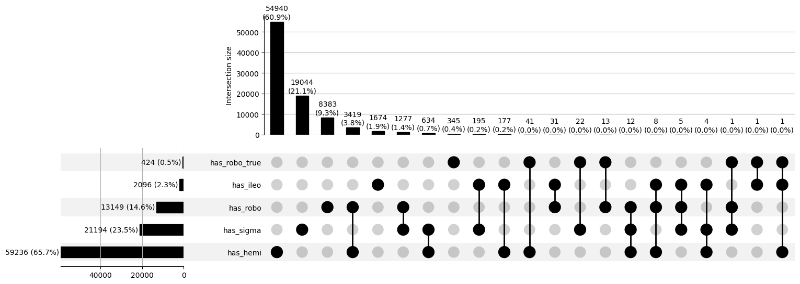
    


#### <a id='toc1_5_4_1_'></a>[Ileozökalresektion](#toc0_)
- Filter: alle Tumore, die einen OPS Code `5-455.2` aufweisen
- Gruppen
  - `5-455.21` - offen
  - `5-455.25` - laparoskopisch
  - `5-455.27` - konversion

> 💡 keine Robotik `5-987.1` geschlüsselt für diese Tumore


```python
    counts: distinct z_tum_id
    ---
    n = 4_015_983
    └ [DJ 2020-2024]:  n = 3_758_513
    └ [ICD10 C18-C20]: n = 284_931 (100.0%) ██████████████████████████████
    └ [> 0 OPS]:       n = 185_576  (65.1%) ░░░░░░░░░░░███████████████████
    └ [OPS ileo]:       n = 15_273   (5.4%) ░░░░░░░░░░░░░░░░░░░░░░░░░░░░░█
```

<details>
<summary>filter-sql</summary>

```sql
z_dy between 2020 and 2024
and z_icd10_3d in ('C18','C19','C20')
and z_tum_op_count > 0
and (left(Code,8) in ('5-455.21', '5-455.25', '5-455.27') OR left(Code,5) in ('5-987'))
```

</details>


    n = 15_273 | n(true) = 15_273


    
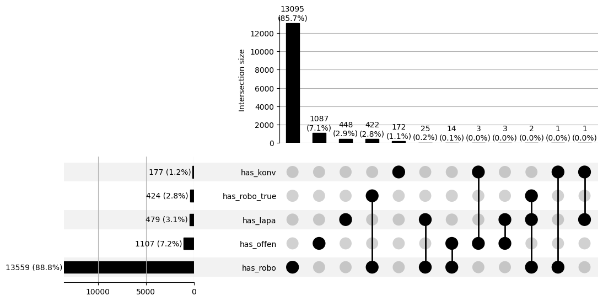
    


#### <a id='toc1_5_4_2_'></a>[rechte Hemikolektomie](#toc0_)
- Filter: alle Tumore, die einen OPS Code `5-455.4` aufweisen
- gezählt sind Tumore
- die Gruppen können überlappen

> 💡 kaum Robotik `5-987.1` geschlüsselt für diese Tumore (n=4)


```python
    counts: distinct z_tum_id
    ---
    n = 4_015_983
    └ [DJ 2020-2024]:  n = 3_758_513
    └ [ICD10 C18-C20]: n = 284_931 (100.0%) ██████████████████████████████
    └ [> 0 OPS]:       n = 185_576  (65.1%) ░░░░░░░░░░░███████████████████
    └ [OPS hemi]:       n = 64_632  (22.7%) ░░░░░░░░░░░░░░░░░░░░░░░░██████
```

<details>
<summary>filter-sql</summary>

```sql
z_dy between 2020 and 2024
and z_icd10_3d in ('C18','C19','C20')
and z_tum_op_count > 0
and 
    (
        left(Code,8) in ('5-455.41', '5-455.45', '5-455.47')
        OR left(Code,5) in ('5-987')
    )
```

</details>


    n = 64_632 | n(true) = 64_632


    
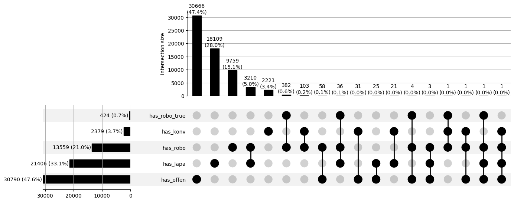
    


#### <a id='toc1_5_4_3_'></a>[Sigmaresektion](#toc0_)
- Filter: alle Tumore, die einen OPS Code `5-455.7` aufweisen
- gezählt sind Tumore
- die Gruppen können überlappen

> 💡 kaum Robotik `5-987.1` geschlüsselt für diese Tumore (n=4)


```python
    counts: distinct z_tum_id
    ---
    n = 4_015_983
    └ [DJ 2020-2024]:  n = 3_758_513
    └ [ICD10 C18-C20]: n = 284_931 (100.0%) ██████████████████████████████
    └ [> 0 OPS]:       n = 185_576  (65.1%) ░░░░░░░░░░░███████████████████
    └ [OPS sigma]:      n = 28_345   (9.9%) ░░░░░░░░░░░░░░░░░░░░░░░░░░░░██
```

<details>
<summary>filter-sql</summary>

```sql
z_dy between 2020 and 2024
and z_icd10_3d in ('C18','C19','C20')
and z_tum_op_count > 0
and 
    (
        left(Code,8) in ('5-455.71', '5-455.75', '5-455.77')
        OR left(Code,5) in ('5-987')
    )
```

</details>


    n = 28_345 | n(true) = 28_345


    

    


## <a id='toc1_6_'></a>[Lokalisation (Fernmetastasen)](#toc0_)


### <a id='toc1_6_1_'></a>[für M1](#toc0_)
- Filter: `C18`-`C20`, nur `M1`
- gezählt sind Tumore. Allerdings: Bei mehrfachen FM Angaben werden Tumore **mehrfach** gezählt

> 💡 45% von M1 haben Leber FM

    599_875 Tumore im Filter haben M1, 590_898 haben M0


    

    


## <a id='toc1_7_'></a>[Rezidive](#toc0_)

### <a id='toc1_7_1_'></a>[Verteilung OP in 2020](#toc0_)
- Filter: `C18`-`C20`, 2020
- gezählt sind Tumore
- Einteilung der Verteilung in eine Kategorie Tabelle
  - `1_op_r0` - OP und R0 dokumentiert
  - `2_op_no_r0` - OP, kein R0
  - `3_no_op_but_pt` - keine OP, aber pT (Diagnose oder Verlauf)
  - `4_no_op_pt_but_st_sy` - keine OP, keine pT, aber ST oder SYST
  - `5_no_op_st_sy_pt` - keine Therapie oder pT


```python
    counts: all rows (no grouping)
    ---
    n = 4_015_983              (100.0%) ██████████████████████████████
    └ [DJ 2020]:   n = 749_493  (18.7%) ░░░░░░░░░░░░░░░░░░░░░░░░░█████
    └ [nur C18]:    n = 39_315   (1.0%) ░░░░░░░░░░░░░░░░░░░░░░░░░░░░░░
```

<details>
<summary>filter-sql</summary>

```sql
z_dy = 2020
and z_icd10_3d in ('C18')
```

</details>


    

    


- `r_status`
  - `1_R0`: wenn >= 1 OP zum Tumor dokumentiert is mit `R0`
  - `2_R1_R2`: wenn kein `R0` dokumentiert, aber >= 1 OP mit `R1` oder `R2`
  - `3_NA_U_RX`: wenn beides nicht zutrifft (Feld ist leer, `U` oder `RX`)


    

    


    
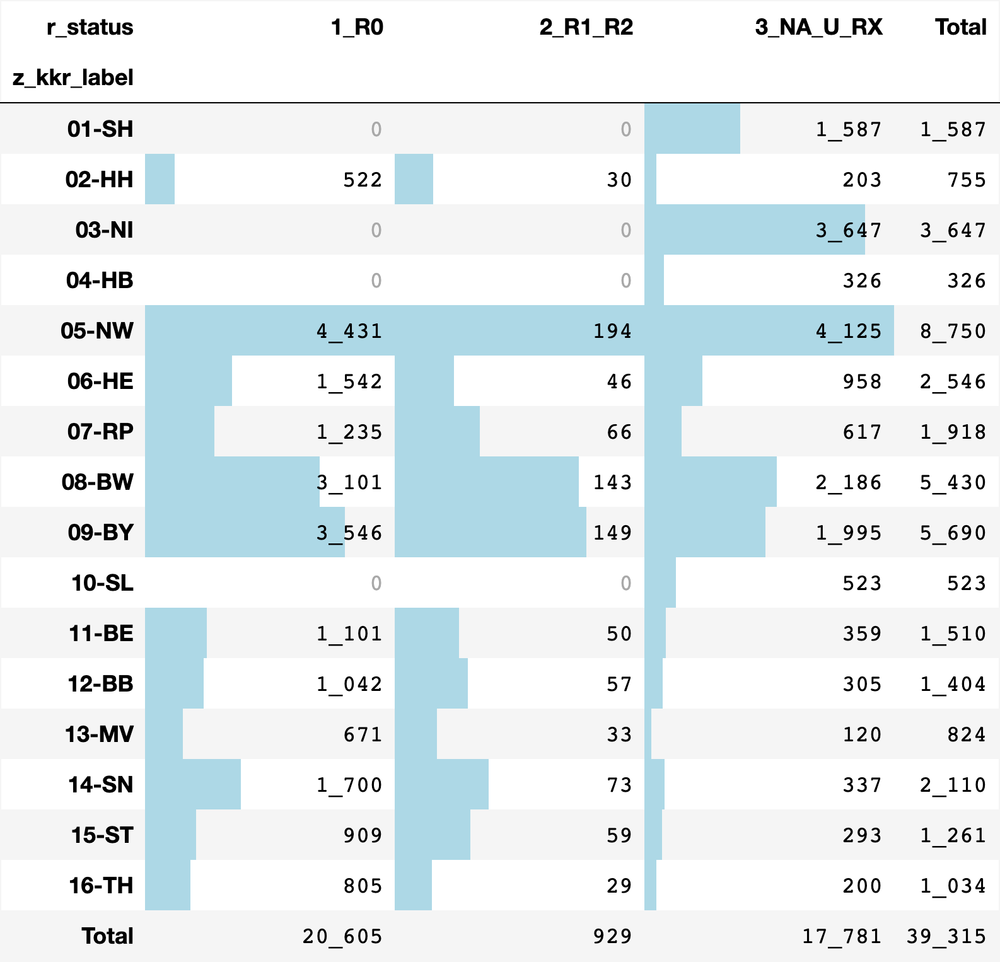
    


#### <a id='toc1_7_1_1_'></a>[davon: Verteilung nur R0](#toc0_)

**enge Definition eines Rezidivs** 
- Filter: lokaler Beurteilung Residualstatus = R0 (UND M <> 1)
- Rezidiv wenn  
  - Gesamtbeurteilung: Y  oder  
  - Lokaler Tumorstatus: R  oder  
  - Tumorstatus Lymphknoten:R oder  
  - Verlauf Fernmetastasen:R   

**erweiterte Definition (Verworfen)**
- Rezidiv wenn
  - (TNM)r_Symbol:r UND 
  - (Folgeereignis T>0 oder Folgeereignis N>0 oder Folgeereignis M>0)

**Diagramm**
- gezählt sind Tumore mit R0
- Kategorien
  - `1_fo_relapse` - Tumore mit Rezidiv nach enger Definition
  - `2_fo_relapse_tnm` - Tumore mit Rezidiv nach erweiterter Definition
  - `3_fo_no_relapse` - Tumore mit Folgeereignis ohne o.a. Rezidiv
  - `4_no_fo` - Tumore ohne Folgeereignis


```python
    counts: distinct z_tum_id
    ---
    n = 4_015_983
    └ [DJ 2020]:           n = 749_493
    └ [nur C18]:           n = 39_315 (100.0%) ██████████████████████████████
    └ [Residualstatus R0]: n = 20_605  (52.4%) ░░░░░░░░░░░░░░░███████████████
```

<details>
<summary>filter-sql</summary>

```sql
z_dy = 2020
and z_icd10_3d in ('C18')
and upper(left(Lokale_Beurteilung_Residualstatus,2)) = 'R0'
```

</details>


    
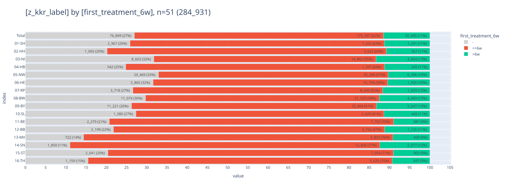
    


    

    


<br>

## <a id='toc1_8_'></a>[Behandlung innerhalb von 6 Wochen](#toc0_)
- Filter: `C18`-`C20`
- `first_treatment_6w`
  - `<=6w`: erste Behandlung innerhalb von 6 Wochen
  - `>6w`: erste Behandlung nach 6 Wochen
  - `-`: keine Behandlung dokumentiert


```python
    counts: all rows (no grouping)
    ---
    n = 4_015_983                    (100.0%) ██████████████████████████████
    └ [DJ 2020-2024]:  n = 3_758_513  (93.6%) ░░████████████████████████████
    └ [ICD10 C18-C20]:   n = 284_931   (7.1%) ░░░░░░░░░░░░░░░░░░░░░░░░░░░░██
```

<details>
<summary>filter-sql</summary>

```sql
z_dy between 2020 and 2024
and z_icd10_3d in ('C18','C19','C20')
```

</details>


    

    


    
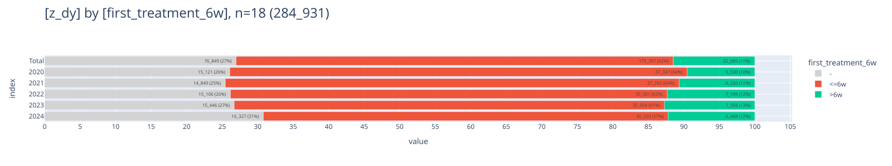
    


## <a id='toc1_9_'></a>[Erste Behandlung](#toc0_)

### <a id='toc1_9_1_'></a>[Was wurde zuerst behandelt](#toc0_)
- Filter: `M1` und Tumor hat Lebermetastasen und `C18` oder `C20`
- gezählt sind Tumore


    
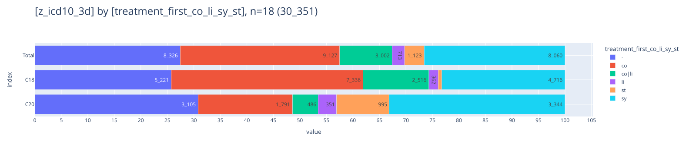
    


### <a id='toc1_9_2_'></a>[Zeitlicher Abstand der Behandlungen](#toc0_)
- Filter: `C18`, Tumore mit Behandlung
- gezählt sind Tumore
- abgebildet sind Median Werte für den Abstand Diagnose bis erste Behandlung in Tagen (logarithmische Skala)


```python
    counts: all rows (no grouping)
    ---
    n = 4_015_983
    └ [DJ 2020-2024]:          n = 3_758_513
    └ [nur C18]:               n = 193_488 (100.0%) ██████████████████████████████
    └ [Tumore mit Behandlung]: n = 139_477  (72.1%) ░░░░░░░░░█████████████████████
```

<details>
<summary>filter-sql</summary>

```sql
z_dy between 2020 and 2024
and z_icd10_3d in ('C18')
and 
    ifnull(z_first_treatment,'') <> ''
    and z_first_treatment_after_days >= 0
    
```

</details>


    
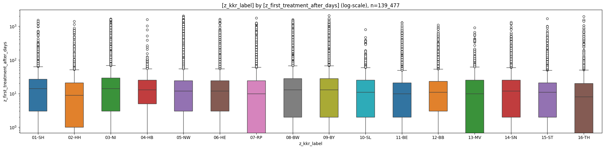
    


    
    column (n = 139_477)         |    notnull     | min | lower | q25  | median | mean  |  q75  | upper |  max  |  std  |  cv 
    -----------------------------+----------------+-----+-------+------+--------+-------+-------+-------+-------+-------+-----
    z_first_treatment_after_days | 139_477 (100%) |   0 |     0 | 2.00 |  12.00 | 24.94 | 25.00 |    59 | 2_092 | 73.57 | 2.95
    
    
    item (n = 139_477) | count  | min  | lower | q25  | median | mean  |  q75  | upper |   max    |  std  |  cv 
    -------------------+--------+------+-------+------+--------+-------+-------+-------+----------+-------+-----
    01-SH              |  5_899 | 0.00 |  0.00 | 3.00 |  14.00 | 22.26 | 27.00 | 63.00 | 1_520.00 | 56.66 | 2.54
    02-HH              |  2_962 | 0.00 |  0.00 | 1.00 |   9.00 | 21.21 | 21.00 | 51.00 | 1_413.00 | 65.26 | 3.08
    03-NI              | 12_255 | 0.00 |  0.00 | 3.00 |  14.00 | 28.50 | 29.00 | 68.00 | 1_645.00 | 83.94 | 2.95
    04-HB              |  1_172 | 0.00 |  0.00 | 5.00 |  13.00 | 21.88 | 25.00 | 55.00 | 1_584.00 | 65.25 | 2.98
    05-NW              | 27_852 | 0.00 |  0.00 | 3.00 |  12.00 | 27.86 | 24.00 | 55.00 | 2_051.00 | 89.89 | 3.23
    06-HE              |  8_495 | 0.00 |  0.00 | 3.00 |  12.00 | 23.84 | 24.00 | 55.00 | 1_615.00 | 67.95 | 2.85
    07-RP              |  6_888 | 0.00 |  0.00 | 0.00 |  10.00 | 24.73 | 24.00 | 60.00 | 1_743.00 | 77.67 | 3.14
    08-BW              | 17_655 | 0.00 |  0.00 | 2.00 |  13.00 | 28.43 | 28.00 | 67.00 | 1_573.00 | 79.71 | 2.80
    09-BY              | 21_126 | 0.00 |  0.00 | 2.00 |  13.00 | 26.55 | 28.00 | 67.00 | 2_092.00 | 74.38 | 2.80
    10-SL              |  1_902 | 0.00 |  0.00 | 2.00 |  11.00 | 19.88 | 25.00 | 59.00 |   804.00 | 38.51 | 1.94
    11-BE              |  6_033 | 0.00 |  0.00 | 2.00 |  10.00 | 20.27 | 21.00 | 49.00 | 1_289.00 | 57.73 | 2.85
    12-BB              |  5_221 | 0.00 |  0.00 | 3.00 |  11.00 | 20.79 | 23.00 | 53.00 | 1_098.00 | 48.08 | 2.31
    13-MV              |  2_891 | 0.00 |  0.00 | 0.00 |  10.00 | 18.68 | 25.00 | 62.00 |   898.00 | 39.47 | 2.11
    14-SN              |  9_823 | 0.00 |  0.00 | 2.00 |  12.00 | 19.77 | 25.00 | 59.00 | 1_325.00 | 43.00 | 2.17
    15-ST              |  5_175 | 0.00 |  0.00 | 2.00 |  11.00 | 18.89 | 21.00 | 49.00 | 1_701.00 | 48.86 | 2.59
    16-TH              |  4_128 | 0.00 |  0.00 | 0.00 |   8.00 | 20.03 | 20.00 | 50.00 | 1_939.00 | 78.47 | 3.92
    


## <a id='toc1_10_'></a>[Behandlungsverlauf](#toc0_)
- Filter: `C18`, nur Tumore mit Therapie
- gezählt sind Tumore
- beschränkt auf die ersten 5 Therapien
- Therapien mit gleichem Tumor / Datum / Behandlung sind zusammengeführt
- verschiedene Therapien mit gleichem Tumor und Datum sind hier nicht entfernt


```python
    counts: all rows (no grouping)
    ---
    n = 4_015_983
    └ [DJ 2020-2024]:          n = 3_758_513
    └ [nur C18]:               n = 193_488 (100.0%) ██████████████████████████████
    └ [Tumore mit Behandlung]: n = 139_477  (72.1%) ░░░░░░░░░█████████████████████
```

<details>
<summary>filter-sql</summary>

```sql
z_dy between 2020 and 2024
and z_icd10_3d in ('C18')
and 
    ifnull(z_first_treatment,'') <> ''
    and z_first_treatment_after_days >= 0
    
```

</details>


    darin 139_477 Tumore, 457_292 deduplizierte Therapien | darin mit Datum: 139_477 Tumore, 213_025 Therapien


    
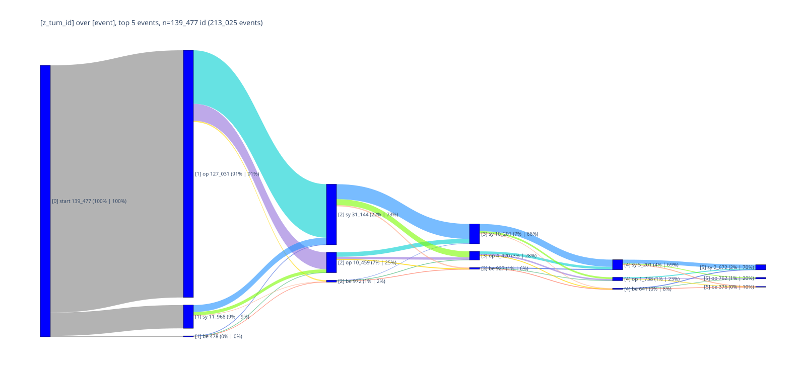
    


## <a id='toc1_11_'></a>[🕹️ interaktiv](#toc0_)
