# <a id='toc1_'></a>[Auswertungen: kolorektale Krebserkrankungen](#toc0_)


- [<a id='toc1_1_'></a>📆 Datenstand](#calendar-datenstand)
- [<a id='toc1_2_'></a>⚙️ Teildatensatz](#gear-teildatensatz)
- [<a id='toc1_3_'></a>Fallzahlen](#fallzahlen)
  - [<a id='toc1_3_1_'></a>Fallzahlen C18-C20 nach
    Viersteller](#fallzahlen-c18-c20-nach-viersteller)
- [<a id='toc1_4_'></a>OP](#op)
  - [<a id='toc1_4_1_'></a>keine Operation erfolgt bei C18 mit T_p \>
    0](#keine-operation-erfolgt-bei-c18-mit-t_p--0)
  - [<a id='toc1_4_2_'></a>Stratifizierung für keine OP
    erfolgt](#stratifizierung-für-keine-op-erfolgt)
- [<a id='toc1_5_'></a>OPS](#ops)
  - [<a id='toc1_5_1_'></a>OPS 5-4xx nach
    Diagnose](#ops-5-4xx-nach-diagnose)
  - [<a id='toc1_5_2_'></a>Vergleich laparoskopisch vs
    offen](#vergleich-laparoskopisch-vs-offen)
  - [<a id='toc1_5_3_'></a>Verteilung OPS 5-455 bei
    C18](#verteilung-ops-5-455-bei-c18)
  - [<a id='toc1_5_4_'></a>Verteilung OPS 5-484 bei
    C20](#verteilung-ops-5-484-bei-c20)
  - [<a id='toc1_5_5_'></a>Details OPS 5-455](#details-ops-5-455)
- [<a id='toc1_6_'></a>Lokalisation (Fernmetastasen) für
  C18](#lokalisation-fernmetastasen-für-c18)
  - [<a id='toc1_6_1_'></a>nach M](#nach-m)
  - [<a id='toc1_6_2_'></a>Anteil FM Lokalisation Leber bei
    M1](#anteil-fm-lokalisation-leber-bei-m1)
  - [<a id='toc1_6_3_'></a>Behandlungsverlauf](#behandlungsverlauf)
  - [<a id='toc1_6_4_'></a>Erste Behandlung bei Leber
    FM](#erste-behandlung-bei-leber-fm)
  - [<a id='toc1_6_5_'></a>OPS wenn Erstbehandlung
    OPS](#ops-wenn-erstbehandlung-ops)
- [<a id='toc1_7_'></a>Rezidive](#rezidive)
  - [<a id='toc1_7_1_'></a>Verteilung OP in
    2020](#verteilung-op-in-2020)
  - [<a id='toc1_7_2_'></a>M Stadium und Vitalstatus bei Tumoren ohne
    Therapie und
    pT](#m-stadium-und-vitalstatus-bei-tumoren-ohne-therapie-und-pt)
  - [<a id='toc1_7_3_'></a>R Status](#r-status)
- [<a id='toc1_8_'></a>Behandlung innerhalb von 6
  Wochen](#behandlung-innerhalb-von-6-wochen)
  - [<a id='toc1_8_1_'></a>Zeitlicher Abstand der
    Behandlungen](#zeitlicher-abstand-der-behandlungen)

**Table of contents**<a id='toc0_'></a>  
- [Auswertungen: kolorektale Krebserkrankungen](#toc1_)  
- [📆 Datenstand](#toc1_1_)  
- [⚙️ Teildatensatz](#toc1_2_)  
- [Fallzahlen](#toc1_3_)  
- [Fallzahlen C18-C20 nach Viersteller](#toc1_3_1_)  
- [OP](#toc1_4_)  
- [keine Operation erfolgt bei C18 mit T_p \> 0](#toc1_4_1_)  
- [Stratifizierung für keine OP erfolgt](#toc1_4_2_)  
- [OPS](#toc1_5_)  
- [OPS 5-4xx nach Diagnose](#toc1_5_1_)  
- [C18](#toc1_5_1_1_)  
- [C20](#toc1_5_1_2_)  
- [Vergleich laparoskopisch vs offen](#toc1_5_2_)  
- [Verteilung OPS 5-455 bei C18](#toc1_5_3_)  
- [Verteilung OPS 5-484 bei C20](#toc1_5_4_)  
- [Details OPS 5-455](#toc1_5_5_)  
- [Kombination von Gruppen](#toc1_5_5_1_)  
- [Anteil Robotik](#toc1_5_5_2_)  
- [Ileozökalresektion](#toc1_5_5_3_)  
- [rechte Hemikolektomie](#toc1_5_5_4_)  
- [Sigmaresektion](#toc1_5_5_5_)  
- [Lokalisation (Fernmetastasen) für C18](#toc1_6_)  
- [nach M](#toc1_6_1_)  
- [Anteil FM Lokalisation Leber bei M1](#toc1_6_2_)  
- [Behandlungsverlauf](#toc1_6_3_)  
- [Erste Behandlung bei Leber FM](#toc1_6_4_)  
- [OPS wenn Erstbehandlung OPS](#toc1_6_5_)  
- [Rezidive](#toc1_7_)  
- [Verteilung OP in 2020](#toc1_7_1_)  
- [M Stadium und Vitalstatus bei Tumoren ohne Therapie und
pT](#toc1_7_2_)  
- [R Status](#toc1_7_3_)  
- [davon: Verteilung nur R0](#toc1_7_3_1_)  
- [Behandlung innerhalb von 6 Wochen](#toc1_8_)  
- [Zeitlicher Abstand der Behandlungen](#toc1_8_1_)

<!-- vscode-jupyter-toc-config
    numbering=false
    anchor=true
    flat=false
    minLevel=1
    maxLevel=6
    /vscode-jupyter-toc-config -->

<!-- THIS CELL WILL BE REPLACED ON TOC UPDATE. DO NOT WRITE YOUR TEXT IN THIS CELL -->

    🐍 3.12.8 | 📦 pandas: 2.3.3 | 📦 numpy: 1.26.4 | 📦 duckdb: 1.5.0 | 📦 pandas-plots: 1.4.2

## <a id='toc1_1_'></a>[📆 Datenstand](#toc0_)

    database file:           2026-03-04_data_clin.duckdb
    data tag:                v2.4
    last kkr data import:    2026-02-26
    sql table created:       2026-03-04 10:17:13
    doi:                     -
    document created:        2026-03-20 19:36:36

## <a id='toc1_2_'></a>[⚙️ Teildatensatz](#toc0_)

- Filter für gültige Fälle: (dieser Filter ist für **alle** Analysen
  gesetzt)
  - `z_dy` (Diagnosejahr) in 2020-2024
  - `z_icd10_3d` (Primärdiagnose) in `C18`-`C20`

<!-- ### <a id='toc1_2_1_'></a>[Deskriptive Statistik](#toc0_) -->

## <a id='toc1_3_'></a>[Fallzahlen](#toc0_)

### <a id='toc1_3_1_'></a>[Fallzahlen C18-C20 nach Viersteller](#toc0_)

> 💡 `C19` darf eigentlich nicht verwendet werden, wird von
> Krebsgesellschaft nicht akzeptiert

<!-- START_TOKEN -->

    counts: all rows (no grouping)
    ---
    n = 4_015_983                    (100.0%) ██████████████████████████████
    └ [DJ 2020-2024]:  n = 3_758_513  (93.6%) ░░████████████████████████████
    └ [ICD10 C18-C20]:   n = 284_931   (7.1%) ░░░░░░░░░░░░░░░░░░░░░░░░░░░░██

<!-- END_TOKEN -->

<details>

<summary>

filter-sql
</summary>

``` sql
z_dy between 2020 and 2024
and z_icd10_3d in ('C18', 'C19', 'C20')
```

</details>

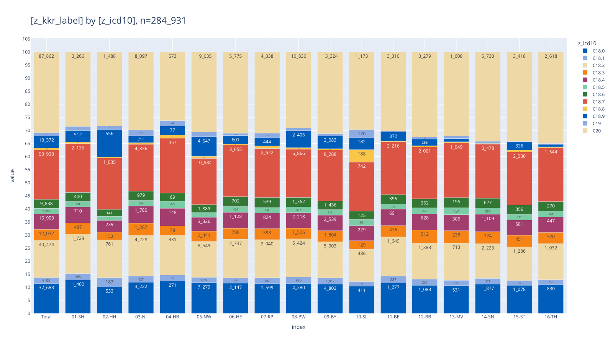

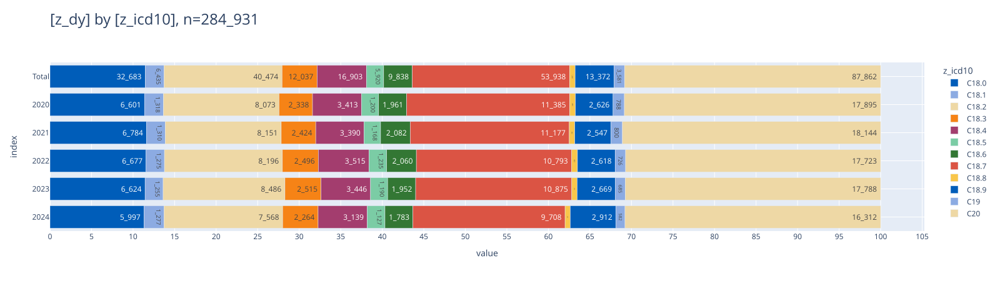

## <a id='toc1_4_'></a>[OP](#toc0_)

### <a id='toc1_4_1_'></a>[keine Operation erfolgt bei C18 mit T_p \> 0](#toc0_)

> 💡 5% wäre realistisch. patho stadium müsste zwingend vorhanden sein
> nach OP

<!-- START_TOKEN -->

    counts: all rows (no grouping)
    ---
    n = 4_015_983
    └ [DJ 2020-2024]:  n = 3_758_513
    └ [ICD10 C18-C20]: n = 284_931 (100.0%) ██████████████████████████████
    └ [nur C18]:       n = 193_488  (67.9%) ░░░░░░░░░░████████████████████
    └ [t_p = 1-4]:     n = 150_961  (53.0%) ░░░░░░░░░░░░░░░███████████████

<!-- END_TOKEN -->

<details>

<summary>

filter-sql
</summary>

``` sql
z_dy between 2020 and 2024
and z_icd10_3d in ('C18', 'C19', 'C20')
and z_icd10_3d in ('C18')
and z_t_p_1 in ('1','2','3','4')
```

</details>

<!-- SCALE-60% -->

<style type="text/css">
#T_ba8d2 th {
  text-align: right;
  font-size: 12pt;
}
#T_ba8d2 td {
  text-align: right;
  font-size: 11pt;
}
#T_ba8d2_row0_col0, #T_ba8d2_row3_col2, #T_ba8d2_row11_col2 {
  font-family: Courier;
  background-color: #c1d9ed;
  color: #000000;
}
#T_ba8d2_row0_col1, #T_ba8d2_row16_col0 {
  font-family: Courier;
  background-color: #84bcdb;
  color: #000000;
}
#T_ba8d2_row0_col2 {
  font-family: Courier;
  background-color: #7ab6d9;
  color: #000000;
}
#T_ba8d2_row0_col3 {
  font-family: Courier;
  background-color: #b5d4e9;
  color: #000000;
}
#T_ba8d2_row0_col4, #T_ba8d2_row7_col5 {
  font-family: Courier;
  background-color: #61a7d2;
  color: #f1f1f1;
}
#T_ba8d2_row0_col5, #T_ba8d2_row6_col2, #T_ba8d2_row9_col3 {
  font-family: Courier;
  background-color: #95c5df;
  color: #000000;
}
#T_ba8d2_row1_col0 {
  font-family: Courier;
  background-color: #b2d2e8;
  color: #000000;
}
#T_ba8d2_row1_col1, #T_ba8d2_row8_col3 {
  font-family: Courier;
  background-color: #add0e6;
  color: #000000;
}
#T_ba8d2_row1_col2 {
  font-family: Courier;
  background-color: #bdd7ec;
  color: #000000;
}
#T_ba8d2_row1_col3 {
  font-family: Courier;
  background-color: #c4daee;
  color: #000000;
}
#T_ba8d2_row1_col4, #T_ba8d2_row1_col5 {
  font-family: Courier;
  background-color: #b8d5ea;
  color: #000000;
}
#T_ba8d2_row2_col0 {
  font-family: Courier;
  background-color: #4090c5;
  color: #f1f1f1;
}
#T_ba8d2_row2_col1 {
  font-family: Courier;
  background-color: #4f9bcb;
  color: #f1f1f1;
}
#T_ba8d2_row2_col2 {
  font-family: Courier;
  background-color: #3a8ac2;
  color: #f1f1f1;
}
#T_ba8d2_row2_col3, #T_ba8d2_row4_col3 {
  font-family: Courier;
  background-color: #4a98c9;
  color: #f1f1f1;
}
#T_ba8d2_row2_col4 {
  font-family: Courier;
  background-color: #08306b;
  color: #f1f1f1;
}
#T_ba8d2_row2_col5 {
  font-family: Courier;
  background-color: #3484bf;
  color: #f1f1f1;
}
#T_ba8d2_row3_col0 {
  font-family: Courier;
  background-color: #b9d6ea;
  color: #000000;
}
#T_ba8d2_row3_col1 {
  font-family: Courier;
  background-color: #c7dbef;
  color: #000000;
}
#T_ba8d2_row3_col3 {
  font-family: Courier;
  background-color: #a3cce3;
  color: #000000;
}
#T_ba8d2_row3_col4 {
  font-family: Courier;
  background-color: #65aad4;
  color: #f1f1f1;
}
#T_ba8d2_row3_col5 {
  font-family: Courier;
  background-color: #abd0e6;
  color: #000000;
}
#T_ba8d2_row4_col0 {
  font-family: Courier;
  background-color: #1d6cb1;
  color: #f1f1f1;
}
#T_ba8d2_row4_col1 {
  font-family: Courier;
  background-color: #57a0ce;
  color: #f1f1f1;
}
#T_ba8d2_row4_col2 {
  font-family: Courier;
  background-color: #5ba3d0;
  color: #f1f1f1;
}
#T_ba8d2_row4_col4 {
  font-family: Courier;
  background-color: #2171b5;
  color: #f1f1f1;
}
#T_ba8d2_row4_col5, #T_ba8d2_row5_col1, #T_ba8d2_row5_col5 {
  font-family: Courier;
  background-color: #3c8cc3;
  color: #f1f1f1;
}
#T_ba8d2_row5_col0 {
  font-family: Courier;
  background-color: #5ca4d0;
  color: #f1f1f1;
}
#T_ba8d2_row5_col2 {
  font-family: Courier;
  background-color: #3686c0;
  color: #f1f1f1;
}
#T_ba8d2_row5_col3 {
  font-family: Courier;
  background-color: #3f8fc5;
  color: #f1f1f1;
}
#T_ba8d2_row5_col4 {
  font-family: Courier;
  background-color: #2373b6;
  color: #f1f1f1;
}
#T_ba8d2_row6_col0 {
  font-family: Courier;
  background-color: #7fb9da;
  color: #000000;
}
#T_ba8d2_row6_col1, #T_ba8d2_row6_col5, #T_ba8d2_row9_col0 {
  font-family: Courier;
  background-color: #8cc0dd;
  color: #000000;
}
#T_ba8d2_row6_col3 {
  font-family: Courier;
  background-color: #82bbdb;
  color: #000000;
}
#T_ba8d2_row6_col4, #T_ba8d2_row8_col5 {
  font-family: Courier;
  background-color: #9ac8e0;
  color: #000000;
}
#T_ba8d2_row7_col0 {
  font-family: Courier;
  background-color: #6fb0d7;
  color: #f1f1f1;
}
#T_ba8d2_row7_col1 {
  font-family: Courier;
  background-color: #77b5d9;
  color: #000000;
}
#T_ba8d2_row7_col2 {
  font-family: Courier;
  background-color: #4e9acb;
  color: #f1f1f1;
}
#T_ba8d2_row7_col3, #T_ba8d2_row16_col4 {
  font-family: Courier;
  background-color: #5da5d1;
  color: #f1f1f1;
}
#T_ba8d2_row7_col4 {
  font-family: Courier;
  background-color: #58a1cf;
  color: #f1f1f1;
}
#T_ba8d2_row8_col0, #T_ba8d2_row9_col2 {
  font-family: Courier;
  background-color: #a4cce3;
  color: #000000;
}
#T_ba8d2_row8_col1 {
  font-family: Courier;
  background-color: #94c4df;
  color: #000000;
}
#T_ba8d2_row8_col2 {
  font-family: Courier;
  background-color: #a9cfe5;
  color: #000000;
}
#T_ba8d2_row8_col4 {
  font-family: Courier;
  background-color: #6caed6;
  color: #f1f1f1;
}
#T_ba8d2_row9_col1 {
  font-family: Courier;
  background-color: #87bddc;
  color: #000000;
}
#T_ba8d2_row9_col4 {
  font-family: Courier;
  background-color: #63a8d3;
  color: #f1f1f1;
}
#T_ba8d2_row9_col5, #T_ba8d2_row16_col2 {
  font-family: Courier;
  background-color: #89bedc;
  color: #000000;
}
#T_ba8d2_row10_col0 {
  font-family: Courier;
  background-color: #ddeaf7;
  color: #000000;
}
#T_ba8d2_row10_col1 {
  font-family: Courier;
  background-color: #d9e7f5;
  color: #000000;
}
#T_ba8d2_row10_col2 {
  font-family: Courier;
  background-color: #d6e6f4;
  color: #000000;
}
#T_ba8d2_row10_col3 {
  font-family: Courier;
  background-color: #d3e3f3;
  color: #000000;
}
#T_ba8d2_row10_col4, #T_ba8d2_row12_col4 {
  font-family: Courier;
  background-color: #d6e5f4;
  color: #000000;
}
#T_ba8d2_row10_col5 {
  font-family: Courier;
  background-color: #d7e6f5;
  color: #000000;
}
#T_ba8d2_row11_col0 {
  font-family: Courier;
  background-color: #e6f0f9;
  color: #000000;
}
#T_ba8d2_row11_col1 {
  font-family: Courier;
  background-color: #d1e2f3;
  color: #000000;
}
#T_ba8d2_row11_col3 {
  font-family: Courier;
  background-color: #bfd8ed;
  color: #000000;
}
#T_ba8d2_row11_col4 {
  font-family: Courier;
  background-color: #c6dbef;
  color: #000000;
}
#T_ba8d2_row11_col5 {
  font-family: Courier;
  background-color: #cee0f2;
  color: #000000;
}
#T_ba8d2_row12_col0 {
  font-family: Courier;
  background-color: #f7fbff;
  color: #000000;
}
#T_ba8d2_row12_col1, #T_ba8d2_row14_col3 {
  font-family: Courier;
  background-color: #eaf2fb;
  color: #000000;
}
#T_ba8d2_row12_col2, #T_ba8d2_row14_col2 {
  font-family: Courier;
  background-color: #deebf7;
  color: #000000;
}
#T_ba8d2_row12_col3 {
  font-family: Courier;
  background-color: #b7d4ea;
  color: #000000;
}
#T_ba8d2_row12_col5 {
  font-family: Courier;
  background-color: #dfebf7;
  color: #000000;
}
#T_ba8d2_row13_col0, #T_ba8d2_row13_col5 {
  font-family: Courier;
  background-color: #f2f8fd;
  color: #000000;
}
#T_ba8d2_row13_col1 {
  font-family: Courier;
  background-color: #f5f9fe;
  color: #000000;
}
#T_ba8d2_row13_col2 {
  font-family: Courier;
  background-color: #f3f8fe;
  color: #000000;
}
#T_ba8d2_row13_col3 {
  font-family: Courier;
  background-color: #f4f9fe;
  color: #000000;
}
#T_ba8d2_row13_col4, #T_ba8d2_row15_col2 {
  font-family: Courier;
  background-color: #eef5fc;
  color: #000000;
}
#T_ba8d2_row14_col0 {
  font-family: Courier;
  background-color: #edf4fc;
  color: #000000;
}
#T_ba8d2_row14_col1 {
  font-family: Courier;
  background-color: #dce9f6;
  color: #000000;
}
#T_ba8d2_row14_col4, #T_ba8d2_row14_col5, #T_ba8d2_row15_col3 {
  font-family: Courier;
  background-color: #e4eff9;
  color: #000000;
}
#T_ba8d2_row15_col0 {
  font-family: Courier;
  background-color: #e9f2fa;
  color: #000000;
}
#T_ba8d2_row15_col1 {
  font-family: Courier;
  background-color: #ecf4fb;
  color: #000000;
}
#T_ba8d2_row15_col4 {
  font-family: Courier;
  background-color: #d9e8f5;
  color: #000000;
}
#T_ba8d2_row15_col5 {
  font-family: Courier;
  background-color: #e7f1fa;
  color: #000000;
}
#T_ba8d2_row16_col1 {
  font-family: Courier;
  background-color: #8dc1dd;
  color: #000000;
}
#T_ba8d2_row16_col3 {
  font-family: Courier;
  background-color: #8abfdd;
  color: #000000;
}
#T_ba8d2_row16_col5 {
  font-family: Courier;
  background-color: #81badb;
  color: #000000;
}
</style>

| z_dy        | 2020     | 2021     | 2022     | 2023     | 2024     | Total    |
|-------------|----------|----------|----------|----------|----------|----------|
| z_kkr_label |          |          |          |          |          |          |
| 01-SH       | 11.6% ⬜ | 18.2% ⬜ | 19.1% ⬜ | 13.0% ⬜ | 21.8% ⬜ | 16.7% ⬜ |
| 02-HH       | 13.3% ⬜ | 14.0% ⬜ | 12.0% ⬜ | 11.1% ⬜ | 12.7% ⬜ | 12.6% ⬜ |
| 03-NI       | 25.7% ⬜ | 23.9% ⬜ | 26.6% ⬜ | 24.4% ⬜ | 40.1% 🟥 | 27.6% 🟥 |
| 04-HB       | 12.5% ⬜ | 10.7% ⬜ | 11.5% ⬜ | 15.2% ⬜ | 21.3% ⬜ | 14.2% ⬜ |
| 05-NW       | 31.1% 🟥 | 23.0% ⬜ | 22.6% ⬜ | 24.5% ⬜ | 30.3% ⬜ | 26.3% ⬜ |
| 06-HE       | 22.4% ⬜ | 26.3% 🟥 | 27.2% 🟥 | 25.9% 🟥 | 30.0% ⬜ | 26.3% ⬜ |
| 07-RP       | 18.7% ⬜ | 17.4% ⬜ | 16.6% ⬜ | 18.5% ⬜ | 16.1% ⬜ | 17.5% ⬜ |
| 08-BW       | 20.2% ⬜ | 19.6% ⬜ | 24.0% ⬜ | 22.2% ⬜ | 22.9% ⬜ | 21.7% ⬜ |
| 09-BY       | 15.1% ⬜ | 16.8% ⬜ | 14.5% ⬜ | 14.0% ⬜ | 20.5% ⬜ | 16.1% ⬜ |
| 10-SL       | 17.5% ⬜ | 18.0% ⬜ | 15.1% ⬜ | 16.5% ⬜ | 21.6% ⬜ | 17.8% ⬜ |
| 11-BE       | 6.3% ⬜  | 7.2% ⬜  | 7.6% ⬜  | 8.4% ⬜  | 7.8% ⬜  | 7.4% ⬜  |
| 12-BB       | 4.5% ⬜  | 8.7% ⬜  | 11.5% ⬜ | 11.6% ⬜ | 10.9% ⬜ | 9.3% ⬜  |
| 13-MV       | 1.1% 🟩  | 3.8% ⬜  | 6.0% ⬜  | 12.7% ⬜ | 7.7% ⬜  | 5.9% ⬜  |
| 14-SN       | 2.1% ⬜  | 1.7% 🟩  | 1.9% 🟩  | 1.8% 🟩  | 3.0% 🟩  | 2.1% 🟩  |
| 15-ST       | 3.2% ⬜  | 6.6% ⬜  | 6.0% ⬜  | 3.8% ⬜  | 4.8% ⬜  | 4.9% ⬜  |
| 16-TH       | 3.9% ⬜  | 3.3% ⬜  | 2.9% ⬜  | 4.9% ⬜  | 7.0% ⬜  | 4.3% ⬜  |
| Total       | 18.2% ⬜ | 17.3% ⬜ | 17.9% ⬜ | 17.7% ⬜ | 22.3% ⬜ | 18.6% ⬜ |

### <a id='toc1_4_2_'></a>[Stratifizierung für keine OP erfolgt](#toc0_)

- `categ_treat`
  - `1-op` - OP dokumentiert
  - `2-noop-sy-st` - keine OP dokumentiert, aber ST oder SYST
  - `3-noop-nosy-nost` - keine Behandlung dokumentiert

<!-- START_TOKEN -->

    counts: all rows (no grouping)
    ---
    n = 4_015_983
    └ [DJ 2020-2024]:  n = 3_758_513
    └ [ICD10 C18-C20]: n = 284_931 (100.0%) ██████████████████████████████
    └ [nur C18]:       n = 193_488  (67.9%) ░░░░░░░░░░████████████████████
    └ [t_p = 1-4]:     n = 150_961  (53.0%) ░░░░░░░░░░░░░░░███████████████

<!-- END_TOKEN -->

<details>

<summary>

filter-sql
</summary>

``` sql
z_dy between 2020 and 2024
and z_icd10_3d in ('C18', 'C19', 'C20')
and z_icd10_3d in ('C18')
and z_t_p_1 in ('1','2','3','4')
```

</details>

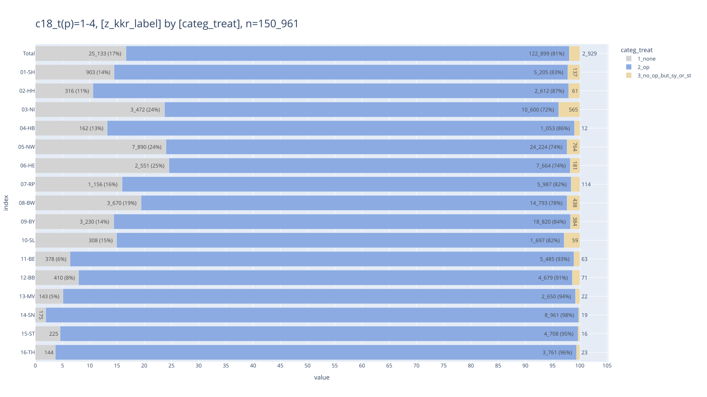

## <a id='toc1_5_'></a>[OPS](#toc0_)

### <a id='toc1_5_1_'></a>[OPS 5-4xx nach Diagnose](#toc0_)

- gezählt sind OPS Angaben, nicht Tumore

<br>

#### <a id='toc1_5_1_1_'></a>[C18](#toc0_)

<!-- START_TOKEN -->

    counts: distinct OPSId
    ---
    n = 4_039_783                    (100.0%) ██████████████████████████████
    └ [DJ 2020-2024]:  n = 3_990_198  (98.8%) ░█████████████████████████████
    └ [ICD10 C18-C20]:   n = 499_943  (12.4%) ░░░░░░░░░░░░░░░░░░░░░░░░░░░███
    └ [nur C18]:         n = 324_504   (8.0%) ░░░░░░░░░░░░░░░░░░░░░░░░░░░░██
    └ [OPS 5-4]:         n = 218_360   (5.4%) ░░░░░░░░░░░░░░░░░░░░░░░░░░░░░█

<!-- END_TOKEN -->

<details>

<summary>

filter-sql
</summary>

``` sql
z_dy between 2020 and 2024
and z_icd10_3d in ('C18', 'C19', 'C20')
and z_icd10_3d in ('C18')
and left(Code,3) in ('5-4')
```

</details>

    Anzahl verschiedene ops_codes:  17902
    ┌─────────────────────────────────────────────────────────────────────────────────────────────────────────────────────────────────────┬─────────┐
    │                                                                 ops                                                                 │ cnt_ops │
    │                                                               varchar                                                               │  int32  │
    ├─────────────────────────────────────────────────────────────────────────────────────────────────────────────────────────────────────┼─────────┤
    │ 5-455.41 - Partielle Resektion des Dickdarmes: Resektion des Colon ascendens mit Coecum und rechter Flexur [Hemikolektomie rechts]… │   30629 │
    │ 5-455.45 - Partielle Resektion des Dickdarmes: Resektion des Colon ascendens mit Coecum und rechter Flexur [Hemikolektomie rechts]… │   21351 │
    │ 5-469.20 - Andere Operationen am Darm: Adhäsiolyse: Offen chirurgisch                                                               │   10319 │
    │ 5-455.75 - Partielle Resektion des Dickdarmes: Sigmaresektion: Laparoskopisch mit Anastomose                                        │    9885 │
    │ 5-406.9 - Regionale Lymphadenektomie (Ausräumung mehrerer Lymphknoten einer Region) im Rahmen einer anderen Operation: Mesenterial  │    7681 │
    │ 5-469.21 - Andere Operationen am Darm: Adhäsiolyse: Laparoskopisch                                                                  │    5539 │
    │ 5-484.35 - Rektumresektion unter Sphinktererhaltung: Anteriore Resektion: Laparoskopisch mit Anastomose                             │    4779 │
    │ 5-455.71 - Partielle Resektion des Dickdarmes: Sigmaresektion: Offen chirurgisch mit Anastomose                                     │    4438 │
    │ 5-455.65 - Partielle Resektion des Dickdarmes: Resektion des Colon descendens mit linker Flexur [Hemikolektomie links]: Laparoskop… │    4161 │
    │ 5-455.61 - Partielle Resektion des Dickdarmes: Resektion des Colon descendens mit linker Flexur [Hemikolektomie links]: Offen chir… │    4125 │
    └─────────────────────────────────────────────────────────────────────────────────────────────────────────────────────────────────────┴─────────┘
      10 rows                                                                                                                             2 columns

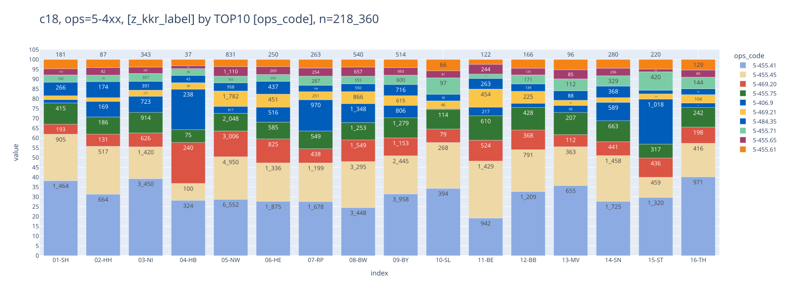

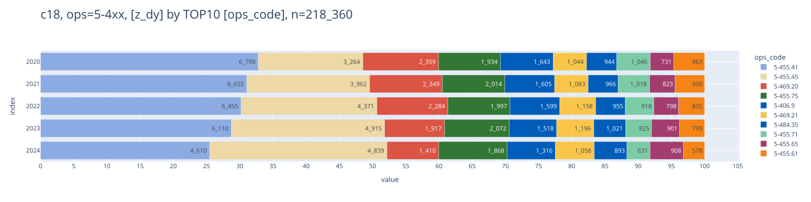

#### <a id='toc1_5_1_2_'></a>[C20](#toc0_)

<!-- START_TOKEN -->

    counts: distinct OPSId
    ---
    n = 4_039_783                    (100.0%) ██████████████████████████████
    └ [DJ 2020-2024]:  n = 3_990_198  (98.8%) ░█████████████████████████████
    └ [ICD10 C18-C20]:   n = 499_943  (12.4%) ░░░░░░░░░░░░░░░░░░░░░░░░░░░███
    └ [ICD10 C20]:       n = 171_216   (4.2%) ░░░░░░░░░░░░░░░░░░░░░░░░░░░░░█
    └ [OPS 5-4]:         n = 111_428   (2.8%) ░░░░░░░░░░░░░░░░░░░░░░░░░░░░░░

<!-- END_TOKEN -->

<details>

<summary>

filter-sql
</summary>

``` sql
z_dy between 2020 and 2024
and z_icd10_3d in ('C18', 'C19', 'C20')
and z_icd10_3d in ('C20')
and left(Code,3) in ('5-4')
```

</details>

    Anzahl verschiedene ops_codes:  13205
    ┌─────────────────────────────────────────────────────────────────────────────────────────────────────────────────────────────────────┬─────────┐
    │                                                                 ops                                                                 │ cnt_ops │
    │                                                               varchar                                                               │  int32  │
    ├─────────────────────────────────────────────────────────────────────────────────────────────────────────────────────────────────────┼─────────┤
    │ 5-484.55 - Rektumresektion unter Sphinktererhaltung: Tiefe anteriore Resektion: Laparoskopisch mit Anastomose                       │   12559 │
    │ 5-462.1 - Anlegen eines Enterostomas (als protektive Maßnahme) im Rahmen eines anderen Eingriffs: Ileostoma                         │   12076 │
    │ 5-484.35 - Rektumresektion unter Sphinktererhaltung: Anteriore Resektion: Laparoskopisch mit Anastomose                             │    5611 │
    │ 5-485.02 - Rektumresektion ohne Sphinktererhaltung: Abdominoperineal: Kombiniert offen chirurgisch-laparoskopisch                   │    4477 │
    │ 5-484.51 - Rektumresektion unter Sphinktererhaltung: Tiefe anteriore Resektion: Offen chirurgisch mit Anastomose                    │    3502 │
    │ 5-465.1 - Rückverlagerung eines doppelläufigen Enterostomas: Ileostoma                                                              │    3224 │
    │ 5-469.21 - Andere Operationen am Darm: Adhäsiolyse: Laparoskopisch                                                                  │    3133 │
    │ 5-469.20 - Andere Operationen am Darm: Adhäsiolyse: Offen chirurgisch                                                               │    3045 │
    │ 5-484.65 - Rektumresektion unter Sphinktererhaltung: Tiefe anteriore Resektion mit peranaler Anastomose: Laparoskopisch mit Anasto… │    2852 │
    │ 5-406.9 - Regionale Lymphadenektomie (Ausräumung mehrerer Lymphknoten einer Region) im Rahmen einer anderen Operation: Mesenterial  │    2508 │
    └─────────────────────────────────────────────────────────────────────────────────────────────────────────────────────────────────────┴─────────┘
      10 rows                                                                                                                             2 columns

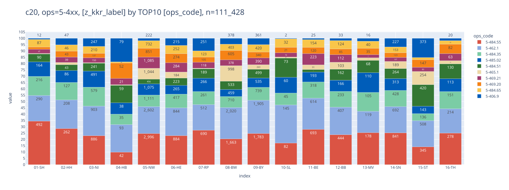

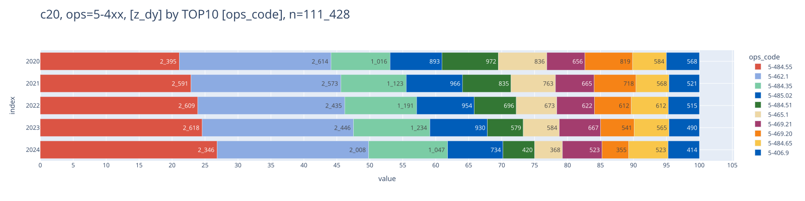

### <a id='toc1_5_2_'></a>[Vergleich laparoskopisch vs offen](#toc0_)

- gezählt sind Tumore
- im Filter:
  - `C18.0-3`
  - nur Tumore, denen entweder `5-455.41` oder `5-455.45` zugeordnet ist
    (ℹ️ kein Tumor hat beide OPS)
- Metrik: Anteil Tumore mit `5-455.41` (offen) an allen Tumoren im
  Filter

<!-- START_TOKEN -->

    counts: distinct z_tum_id
    ---
    n = 4_015_983                    (100.0%) ██████████████████████████████
    └ [DJ 2020-2024]:  n = 3_758_513  (93.6%) ░░████████████████████████████
    └ [ICD10 C18-C20]:   n = 284_931   (7.1%) ░░░░░░░░░░░░░░░░░░░░░░░░░░░░██
    └ [ICD C18.0-3]:      n = 91_629   (2.3%) ░░░░░░░░░░░░░░░░░░░░░░░░░░░░░░
    └ [ops=5-455.4xx]:    n = 47_392   (1.2%) ░░░░░░░░░░░░░░░░░░░░░░░░░░░░░░

<!-- END_TOKEN -->

<details>

<summary>

filter-sql
</summary>

``` sql
z_dy between 2020 and 2024
and z_icd10_3d in ('C18', 'C19', 'C20')
and z_icd10 in ('C18.0','C18.1','C18.2','C18.3')
and Code in ('5-455.41', '5-455.45')
```

</details>

<!-- SCALE-80% -->

<style type="text/css">
#T_93bad th {
  text-align: right;
  font-size: 12pt;
}
#T_93bad td {
  text-align: right;
  font-size: 11pt;
}
#T_93bad_row0_col0 {
  width: 10em;
  background: linear-gradient(90deg, #b3c8ec 80.1%, transparent 80.1%);
  font-family: Courier;
}
#T_93bad_row0_col1 {
  width: 10em;
  background: linear-gradient(90deg, #b3c8ec 73.6%, transparent 73.6%);
  font-family: Courier;
}
#T_93bad_row0_col2, #T_93bad_row11_col1 {
  width: 10em;
  background: linear-gradient(90deg, #b3c8ec 76.2%, transparent 76.2%);
  font-family: Courier;
}
#T_93bad_row0_col3 {
  width: 10em;
  background: linear-gradient(90deg, #b3c8ec 73.0%, transparent 73.0%);
  font-family: Courier;
}
#T_93bad_row0_col4, #T_93bad_row7_col1 {
  width: 10em;
  background: linear-gradient(90deg, #b3c8ec 65.8%, transparent 65.8%);
  font-family: Courier;
}
#T_93bad_row0_col5 {
  width: 10em;
  background: linear-gradient(90deg, #b3c8ec 73.8%, transparent 73.8%);
  font-family: Courier;
}
#T_93bad_row1_col0 {
  width: 10em;
  background: linear-gradient(90deg, #b3c8ec 81.0%, transparent 81.0%);
  font-family: Courier;
}
#T_93bad_row1_col1 {
  width: 10em;
  background: linear-gradient(90deg, #b3c8ec 73.4%, transparent 73.4%);
  font-family: Courier;
}
#T_93bad_row1_col2 {
  width: 10em;
  background: linear-gradient(90deg, #b3c8ec 58.1%, transparent 58.1%);
  font-family: Courier;
}
#T_93bad_row1_col3 {
  width: 10em;
  background: linear-gradient(90deg, #b3c8ec 62.0%, transparent 62.0%);
  font-family: Courier;
}
#T_93bad_row1_col4 {
  width: 10em;
  background: linear-gradient(90deg, #b3c8ec 59.2%, transparent 59.2%);
  font-family: Courier;
}
#T_93bad_row1_col5 {
  width: 10em;
  background: linear-gradient(90deg, #b3c8ec 66.4%, transparent 66.4%);
  font-family: Courier;
}
#T_93bad_row2_col0 {
  width: 10em;
  background: linear-gradient(90deg, #b3c8ec 92.5%, transparent 92.5%);
  font-family: Courier;
}
#T_93bad_row2_col1 {
  width: 10em;
  background: linear-gradient(90deg, #b3c8ec 88.4%, transparent 88.4%);
  font-family: Courier;
}
#T_93bad_row2_col2 {
  width: 10em;
  background: linear-gradient(90deg, #b3c8ec 85.1%, transparent 85.1%);
  font-family: Courier;
}
#T_93bad_row2_col3 {
  width: 10em;
  background: linear-gradient(90deg, #b3c8ec 79.9%, transparent 79.9%);
  font-family: Courier;
}
#T_93bad_row2_col4 {
  width: 10em;
  background: linear-gradient(90deg, #b3c8ec 76.1%, transparent 76.1%);
  font-family: Courier;
}
#T_93bad_row2_col5 {
  width: 10em;
  background: linear-gradient(90deg, #b3c8ec 85.0%, transparent 85.0%);
  font-family: Courier;
}
#T_93bad_row3_col0 {
  width: 10em;
  background: linear-gradient(90deg, #b3c8ec 99.2%, transparent 99.2%);
  font-family: Courier;
}
#T_93bad_row3_col1 {
  width: 10em;
  background: linear-gradient(90deg, #b3c8ec 82.6%, transparent 82.6%);
  font-family: Courier;
}
#T_93bad_row3_col2, #T_93bad_row3_col4 {
  width: 10em;
  background: linear-gradient(90deg, #b3c8ec 93.6%, transparent 93.6%);
  font-family: Courier;
}
#T_93bad_row3_col3, #T_93bad_row3_col5 {
  width: 10em;
  background: linear-gradient(90deg, #b3c8ec 92.3%, transparent 92.3%);
  font-family: Courier;
}
#T_93bad_row4_col0 {
  width: 10em;
  background: linear-gradient(90deg, #b3c8ec 77.9%, transparent 77.9%);
  font-family: Courier;
}
#T_93bad_row4_col1 {
  width: 10em;
  background: linear-gradient(90deg, #b3c8ec 74.4%, transparent 74.4%);
  font-family: Courier;
}
#T_93bad_row4_col2 {
  width: 10em;
  background: linear-gradient(90deg, #b3c8ec 70.7%, transparent 70.7%);
  font-family: Courier;
}
#T_93bad_row4_col3, #T_93bad_row13_col5 {
  width: 10em;
  background: linear-gradient(90deg, #b3c8ec 64.6%, transparent 64.6%);
  font-family: Courier;
}
#T_93bad_row4_col4 {
  width: 10em;
  background: linear-gradient(90deg, #b3c8ec 50.2%, transparent 50.2%);
  font-family: Courier;
}
#T_93bad_row4_col5 {
  width: 10em;
  background: linear-gradient(90deg, #b3c8ec 68.1%, transparent 68.1%);
  font-family: Courier;
}
#T_93bad_row5_col0 {
  width: 10em;
  background: linear-gradient(90deg, #b3c8ec 80.7%, transparent 80.7%);
  font-family: Courier;
}
#T_93bad_row5_col1 {
  width: 10em;
  background: linear-gradient(90deg, #b3c8ec 73.5%, transparent 73.5%);
  font-family: Courier;
}
#T_93bad_row5_col2, #T_93bad_row6_col2 {
  width: 10em;
  background: linear-gradient(90deg, #b3c8ec 70.6%, transparent 70.6%);
  font-family: Courier;
}
#T_93bad_row5_col3, #T_93bad_row12_col2 {
  width: 10em;
  background: linear-gradient(90deg, #b3c8ec 65.1%, transparent 65.1%);
  font-family: Courier;
}
#T_93bad_row5_col4 {
  width: 10em;
  background: linear-gradient(90deg, #b3c8ec 57.0%, transparent 57.0%);
  font-family: Courier;
}
#T_93bad_row5_col5, #T_93bad_row6_col5 {
  width: 10em;
  background: linear-gradient(90deg, #b3c8ec 69.8%, transparent 69.8%);
  font-family: Courier;
}
#T_93bad_row6_col0 {
  width: 10em;
  background: linear-gradient(90deg, #b3c8ec 87.1%, transparent 87.1%);
  font-family: Courier;
}
#T_93bad_row6_col1 {
  width: 10em;
  background: linear-gradient(90deg, #b3c8ec 69.6%, transparent 69.6%);
  font-family: Courier;
}
#T_93bad_row6_col3 {
  width: 10em;
  background: linear-gradient(90deg, #b3c8ec 67.4%, transparent 67.4%);
  font-family: Courier;
}
#T_93bad_row6_col4 {
  width: 10em;
  background: linear-gradient(90deg, #b3c8ec 54.1%, transparent 54.1%);
  font-family: Courier;
}
#T_93bad_row7_col0 {
  width: 10em;
  background: linear-gradient(90deg, #b3c8ec 69.3%, transparent 69.3%);
  font-family: Courier;
}
#T_93bad_row7_col2 {
  width: 10em;
  background: linear-gradient(90deg, #b3c8ec 62.3%, transparent 62.3%);
  font-family: Courier;
}
#T_93bad_row7_col3 {
  width: 10em;
  background: linear-gradient(90deg, #b3c8ec 55.5%, transparent 55.5%);
  font-family: Courier;
}
#T_93bad_row7_col4 {
  width: 10em;
  background: linear-gradient(90deg, #b3c8ec 47.0%, transparent 47.0%);
  font-family: Courier;
}
#T_93bad_row7_col5, #T_93bad_row12_col4 {
  width: 10em;
  background: linear-gradient(90deg, #b3c8ec 60.5%, transparent 60.5%);
  font-family: Courier;
}
#T_93bad_row8_col0, #T_93bad_row11_col0 {
  width: 10em;
  background: linear-gradient(90deg, #b3c8ec 87.6%, transparent 87.6%);
  font-family: Courier;
}
#T_93bad_row8_col1 {
  width: 10em;
  background: linear-gradient(90deg, #b3c8ec 81.1%, transparent 81.1%);
  font-family: Courier;
}
#T_93bad_row8_col2 {
  width: 10em;
  background: linear-gradient(90deg, #b3c8ec 72.9%, transparent 72.9%);
  font-family: Courier;
}
#T_93bad_row8_col3 {
  width: 10em;
  background: linear-gradient(90deg, #b3c8ec 68.9%, transparent 68.9%);
  font-family: Courier;
}
#T_93bad_row8_col4 {
  width: 10em;
  background: linear-gradient(90deg, #b3c8ec 63.6%, transparent 63.6%);
  font-family: Courier;
}
#T_93bad_row8_col5 {
  width: 10em;
  background: linear-gradient(90deg, #b3c8ec 73.9%, transparent 73.9%);
  font-family: Courier;
}
#T_93bad_row9_col0 {
  width: 10em;
  background: linear-gradient(90deg, #b3c8ec 81.4%, transparent 81.4%);
  font-family: Courier;
}
#T_93bad_row9_col1 {
  width: 10em;
  background: linear-gradient(90deg, #b3c8ec 85.9%, transparent 85.9%);
  font-family: Courier;
}
#T_93bad_row9_col2 {
  width: 10em;
  background: linear-gradient(90deg, #b3c8ec 56.9%, transparent 56.9%);
  font-family: Courier;
}
#T_93bad_row9_col3 {
  width: 10em;
  background: linear-gradient(90deg, #b3c8ec 69.9%, transparent 69.9%);
  font-family: Courier;
}
#T_93bad_row9_col4 {
  width: 10em;
  background: linear-gradient(90deg, #b3c8ec 55.0%, transparent 55.0%);
  font-family: Courier;
}
#T_93bad_row9_col5 {
  width: 10em;
  background: linear-gradient(90deg, #b3c8ec 70.4%, transparent 70.4%);
  font-family: Courier;
}
#T_93bad_row10_col0 {
  width: 10em;
  background: linear-gradient(90deg, #b3c8ec 52.1%, transparent 52.1%);
  font-family: Courier;
}
#T_93bad_row10_col1 {
  width: 10em;
  background: linear-gradient(90deg, #b3c8ec 50.3%, transparent 50.3%);
  font-family: Courier;
}
#T_93bad_row10_col2 {
  width: 10em;
  background: linear-gradient(90deg, #b3c8ec 47.9%, transparent 47.9%);
  font-family: Courier;
}
#T_93bad_row10_col3 {
  width: 10em;
  background: linear-gradient(90deg, #b3c8ec 41.9%, transparent 41.9%);
  font-family: Courier;
}
#T_93bad_row10_col4 {
  width: 10em;
  background: linear-gradient(90deg, #b3c8ec 40.8%, transparent 40.8%);
  font-family: Courier;
}
#T_93bad_row10_col5 {
  width: 10em;
  background: linear-gradient(90deg, #b3c8ec 46.8%, transparent 46.8%);
  font-family: Courier;
}
#T_93bad_row11_col2 {
  width: 10em;
  background: linear-gradient(90deg, #b3c8ec 76.0%, transparent 76.0%);
  font-family: Courier;
}
#T_93bad_row11_col3 {
  width: 10em;
  background: linear-gradient(90deg, #b3c8ec 60.2%, transparent 60.2%);
  font-family: Courier;
}
#T_93bad_row11_col4 {
  width: 10em;
  background: linear-gradient(90deg, #b3c8ec 55.8%, transparent 55.8%);
  font-family: Courier;
}
#T_93bad_row11_col5 {
  width: 10em;
  background: linear-gradient(90deg, #b3c8ec 71.8%, transparent 71.8%);
  font-family: Courier;
}
#T_93bad_row12_col0 {
  width: 10em;
  background: linear-gradient(90deg, #b3c8ec 90.4%, transparent 90.4%);
  font-family: Courier;
}
#T_93bad_row12_col1 {
  width: 10em;
  background: linear-gradient(90deg, #b3c8ec 84.3%, transparent 84.3%);
  font-family: Courier;
}
#T_93bad_row12_col3 {
  width: 10em;
  background: linear-gradient(90deg, #b3c8ec 68.2%, transparent 68.2%);
  font-family: Courier;
}
#T_93bad_row12_col5 {
  width: 10em;
  background: linear-gradient(90deg, #b3c8ec 76.7%, transparent 76.7%);
  font-family: Courier;
}
#T_93bad_row13_col0 {
  width: 10em;
  background: linear-gradient(90deg, #b3c8ec 79.2%, transparent 79.2%);
  font-family: Courier;
}
#T_93bad_row13_col1 {
  width: 10em;
  background: linear-gradient(90deg, #b3c8ec 64.5%, transparent 64.5%);
  font-family: Courier;
}
#T_93bad_row13_col2 {
  width: 10em;
  background: linear-gradient(90deg, #b3c8ec 65.7%, transparent 65.7%);
  font-family: Courier;
}
#T_93bad_row13_col3 {
  width: 10em;
  background: linear-gradient(90deg, #b3c8ec 59.7%, transparent 59.7%);
  font-family: Courier;
}
#T_93bad_row13_col4 {
  width: 10em;
  background: linear-gradient(90deg, #b3c8ec 56.5%, transparent 56.5%);
  font-family: Courier;
}
#T_93bad_row14_col0 {
  width: 10em;
  background: linear-gradient(90deg, #b3c8ec 100.0%, transparent 100.0%);
  font-family: Courier;
}
#T_93bad_row14_col1 {
  width: 10em;
  background: linear-gradient(90deg, #b3c8ec 95.9%, transparent 95.9%);
  font-family: Courier;
}
#T_93bad_row14_col2 {
  width: 10em;
  background: linear-gradient(90deg, #b3c8ec 92.2%, transparent 92.2%);
  font-family: Courier;
}
#T_93bad_row14_col3 {
  width: 10em;
  background: linear-gradient(90deg, #b3c8ec 80.9%, transparent 80.9%);
  font-family: Courier;
}
#T_93bad_row14_col4 {
  width: 10em;
  background: linear-gradient(90deg, #b3c8ec 77.3%, transparent 77.3%);
  font-family: Courier;
}
#T_93bad_row14_col5 {
  width: 10em;
  background: linear-gradient(90deg, #b3c8ec 88.7%, transparent 88.7%);
  font-family: Courier;
}
#T_93bad_row15_col0 {
  width: 10em;
  background: linear-gradient(90deg, #b3c8ec 89.6%, transparent 89.6%);
  font-family: Courier;
}
#T_93bad_row15_col1 {
  width: 10em;
  background: linear-gradient(90deg, #b3c8ec 89.5%, transparent 89.5%);
  font-family: Courier;
}
#T_93bad_row15_col2 {
  width: 10em;
  background: linear-gradient(90deg, #b3c8ec 79.7%, transparent 79.7%);
  font-family: Courier;
}
#T_93bad_row15_col3 {
  width: 10em;
  background: linear-gradient(90deg, #b3c8ec 82.5%, transparent 82.5%);
  font-family: Courier;
}
#T_93bad_row15_col4 {
  width: 10em;
  background: linear-gradient(90deg, #b3c8ec 78.0%, transparent 78.0%);
  font-family: Courier;
}
#T_93bad_row15_col5 {
  width: 10em;
  background: linear-gradient(90deg, #b3c8ec 83.7%, transparent 83.7%);
  font-family: Courier;
}
#T_93bad_row16_col0 {
  width: 10em;
  background: linear-gradient(90deg, #b3c8ec 80.8%, transparent 80.8%);
  font-family: Courier;
}
#T_93bad_row16_col1 {
  width: 10em;
  background: linear-gradient(90deg, #b3c8ec 74.8%, transparent 74.8%);
  font-family: Courier;
}
#T_93bad_row16_col2 {
  width: 10em;
  background: linear-gradient(90deg, #b3c8ec 71.1%, transparent 71.1%);
  font-family: Courier;
}
#T_93bad_row16_col3 {
  width: 10em;
  background: linear-gradient(90deg, #b3c8ec 66.2%, transparent 66.2%);
  font-family: Courier;
}
#T_93bad_row16_col4 {
  width: 10em;
  background: linear-gradient(90deg, #b3c8ec 57.8%, transparent 57.8%);
  font-family: Courier;
}
#T_93bad_row16_col5 {
  width: 10em;
  background: linear-gradient(90deg, #b3c8ec 70.3%, transparent 70.3%);
  font-family: Courier;
}
</style>

| z_dy        | 2020     | 2021     | 2022     | 2023     | 2024     | Total    |
|-------------|----------|----------|----------|----------|----------|----------|
| z_kkr_label |          |          |          |          |          |          |
| 01-SH       | 66.1% ⬜ | 60.8% ⬜ | 62.9% ⬜ | 60.3% ⬜ | 54.3% ⬜ | 60.9% ⬜ |
| 02-HH       | 66.9% ⬜ | 60.6% ⬜ | 48.0% ⬜ | 51.2% ⬜ | 48.9% ⬜ | 54.9% ⬜ |
| 03-NI       | 76.4% ⬜ | 73.0% ⬜ | 70.3% ⬜ | 66.0% ⬜ | 62.8% ⬜ | 70.2% ⬜ |
| 04-HB       | 81.9% ⬜ | 68.2% ⬜ | 77.3% 🟥 | 76.2% 🟥 | 77.3% 🟥 | 76.2% 🟥 |
| 05-NW       | 64.3% ⬜ | 61.4% ⬜ | 58.4% ⬜ | 53.3% ⬜ | 41.4% ⬜ | 56.2% ⬜ |
| 06-HE       | 66.6% ⬜ | 60.7% ⬜ | 58.3% ⬜ | 53.8% ⬜ | 47.0% ⬜ | 57.6% ⬜ |
| 07-RP       | 71.9% ⬜ | 57.5% ⬜ | 58.3% ⬜ | 55.7% ⬜ | 44.7% ⬜ | 57.7% ⬜ |
| 08-BW       | 57.2% ⬜ | 54.3% ⬜ | 51.5% ⬜ | 45.9% ⬜ | 38.8% ⬜ | 50.0% ⬜ |
| 09-BY       | 72.3% ⬜ | 67.0% ⬜ | 60.2% ⬜ | 56.9% ⬜ | 52.5% ⬜ | 61.0% ⬜ |
| 10-SL       | 67.2% ⬜ | 70.9% ⬜ | 47.0% ⬜ | 57.7% ⬜ | 45.5% ⬜ | 58.1% ⬜ |
| 11-BE       | 43.0% 🟩 | 41.6% 🟩 | 39.6% 🟩 | 34.6% 🟩 | 33.7% 🟩 | 38.6% 🟩 |
| 12-BB       | 72.3% ⬜ | 63.0% ⬜ | 62.8% ⬜ | 49.7% ⬜ | 46.1% ⬜ | 59.3% ⬜ |
| 13-MV       | 74.7% ⬜ | 69.6% ⬜ | 53.7% ⬜ | 56.3% ⬜ | 50.0% ⬜ | 63.3% ⬜ |
| 14-SN       | 65.4% ⬜ | 53.3% ⬜ | 54.3% ⬜ | 49.3% ⬜ | 46.7% ⬜ | 53.4% ⬜ |
| 15-ST       | 82.6% 🟥 | 79.2% 🟥 | 76.1% ⬜ | 66.8% ⬜ | 63.9% ⬜ | 73.3% ⬜ |
| 16-TH       | 74.0% ⬜ | 73.9% ⬜ | 65.8% ⬜ | 68.2% ⬜ | 64.4% ⬜ | 69.1% ⬜ |
| Total       | 66.8% ⬜ | 61.8% ⬜ | 58.7% ⬜ | 54.6% ⬜ | 47.7% ⬜ | 58.1% ⬜ |

### <a id='toc1_5_3_'></a>[Verteilung OPS 5-455 bei C18](#toc0_)

- Filter: `C18` und `M0`
- gezählt sind Tumore
- `has_5-455`: True wenn Tumor \>= 1 OPS 5-455 hat \> 💡 Erwartet sind
  ~95% Anteil für True, tatsächlich sind es für D ~75%

<!-- START_TOKEN -->

    counts: all rows (no grouping)
    ---
    n = 4_015_983
    └ [DJ 2020-2024]:  n = 3_758_513
    └ [ICD10 C18-C20]: n = 284_931 (100.0%) ██████████████████████████████
    └ [nur C18]:       n = 193_488  (67.9%) ░░░░░░░░░░████████████████████
    └ [kein M1]:       n = 160_070  (56.2%) ░░░░░░░░░░░░░░████████████████
    └ [nur M0]:        n = 113_713  (39.9%) ░░░░░░░░░░░░░░░░░░░███████████

<!-- END_TOKEN -->

<details>

<summary>

filter-sql
</summary>

``` sql
z_dy between 2020 and 2024
and z_icd10_3d in ('C18', 'C19', 'C20')
and z_icd10_3d in ('C18')
and ifnull(z_m_pc_1,'') <> '1'
and z_m_pc_1 = '0'
```

</details>

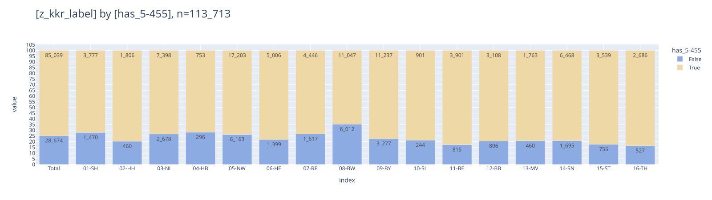

### <a id='toc1_5_4_'></a>[Verteilung OPS 5-484 bei C20](#toc0_)

- Filter: `C18` und `M0`
- `has_5-48x`: True wenn Tumor \>= 1 OPS 5-484 oder 5-485 hat \> 💡 ~40%
  haben True, weniger als erwartet

<!-- START_TOKEN -->

    counts: all rows (no grouping)
    ---
    n = 4_015_983
    └ [DJ 2020-2024]:  n = 3_758_513
    └ [ICD10 C18-C20]: n = 284_931 (100.0%) ██████████████████████████████
    └ [ICD10 C20]:      n = 87_862  (30.8%) ░░░░░░░░░░░░░░░░░░░░░█████████
    └ [nur M0]:         n = 52_446  (18.4%) ░░░░░░░░░░░░░░░░░░░░░░░░░█████

<!-- END_TOKEN -->

<details>

<summary>

filter-sql
</summary>

``` sql
z_dy between 2020 and 2024
and z_icd10_3d in ('C18', 'C19', 'C20')
and z_icd10_3d in ('C20')
and z_m_pc_1 = '0'
```

</details>

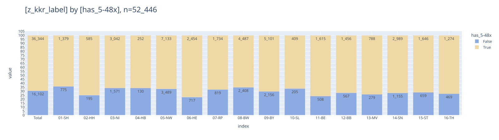

### <a id='toc1_5_5_'></a>[Details OPS 5-455](#toc0_)

#### <a id='toc1_5_5_1_'></a>[Kombination von Gruppen](#toc0_)

- gezählt sind Tumore
- die Gruppen können überlappen bei der Tumordarstellung
  - `has_ileo` - Ileozökalresektion
  - `has_hemi` - rechte Hemikolektomie
  - `has_sigma` - Sigmaresektion
  - `has_robo_01` - OPS `5-987.01` (Roboter) ist Tumor zugeordnet

<!-- START_TOKEN -->

    counts: distinct z_tum_id
    ---
    n = 4_015_983
    └ [DJ 2020-2024]: n = 3_758_513
    └ [nur C18]:      n = 193_488 (100.0%) ██████████████████████████████
    └ [OPS 5-4]:      n = 126_132  (65.2%) ░░░░░░░░░░░███████████████████

<!-- END_TOKEN -->

<details>

<summary>

filter-sql
</summary>

``` sql
z_dy between 2020 and 2024
and z_icd10_3d in ('C18')
and left(Code,3) in ('5-4')
```

</details>

    n = 126_132 | n(true) = 79_504

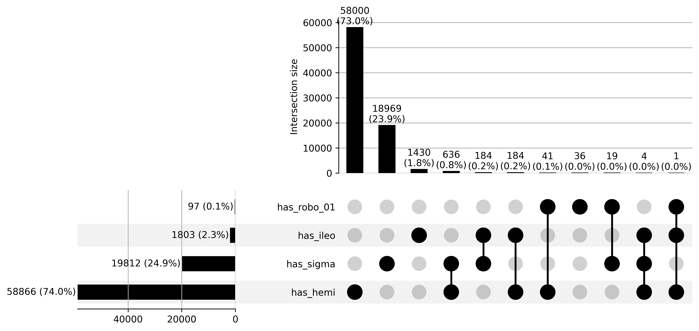

#### <a id='toc1_5_5_2_'></a>[Anteil Robotik](#toc0_)

- Metrik: Anteil Tumore mit `5-987` an allen Tumoren im Filter

<style type="text/css">
#T_23492 th {
  text-align: right;
  font-size: 12pt;
}
#T_23492 td {
  text-align: right;
  font-size: 11pt;
}
#T_23492_row0_col0, #T_23492_row13_col5 {
  width: 10em;
  background: linear-gradient(90deg, #b3c8ec 17.8%, transparent 17.8%);
  font-family: Courier;
}
#T_23492_row0_col1 {
  width: 10em;
  background: linear-gradient(90deg, #b3c8ec 15.9%, transparent 15.9%);
  font-family: Courier;
}
#T_23492_row0_col2 {
  width: 10em;
  background: linear-gradient(90deg, #b3c8ec 20.6%, transparent 20.6%);
  font-family: Courier;
}
#T_23492_row0_col3 {
  width: 10em;
  background: linear-gradient(90deg, #b3c8ec 39.6%, transparent 39.6%);
  font-family: Courier;
}
#T_23492_row0_col4 {
  width: 10em;
  background: linear-gradient(90deg, #b3c8ec 54.2%, transparent 54.2%);
  font-family: Courier;
}
#T_23492_row0_col5 {
  width: 10em;
  background: linear-gradient(90deg, #b3c8ec 28.9%, transparent 28.9%);
  font-family: Courier;
}
#T_23492_row1_col0 {
  width: 10em;
  background: linear-gradient(90deg, #b3c8ec 23.9%, transparent 23.9%);
  font-family: Courier;
}
#T_23492_row1_col1 {
  width: 10em;
  background: linear-gradient(90deg, #b3c8ec 29.2%, transparent 29.2%);
  font-family: Courier;
}
#T_23492_row1_col2 {
  width: 10em;
  background: linear-gradient(90deg, #b3c8ec 30.4%, transparent 30.4%);
  font-family: Courier;
}
#T_23492_row1_col3 {
  width: 10em;
  background: linear-gradient(90deg, #b3c8ec 46.2%, transparent 46.2%);
  font-family: Courier;
}
#T_23492_row1_col4 {
  width: 10em;
  background: linear-gradient(90deg, #b3c8ec 81.8%, transparent 81.8%);
  font-family: Courier;
}
#T_23492_row1_col5 {
  width: 10em;
  background: linear-gradient(90deg, #b3c8ec 41.5%, transparent 41.5%);
  font-family: Courier;
}
#T_23492_row2_col0 {
  width: 10em;
  background: linear-gradient(90deg, #b3c8ec 4.8%, transparent 4.8%);
  font-family: Courier;
}
#T_23492_row2_col1 {
  width: 10em;
  background: linear-gradient(90deg, #b3c8ec 7.8%, transparent 7.8%);
  font-family: Courier;
}
#T_23492_row2_col2 {
  width: 10em;
  background: linear-gradient(90deg, #b3c8ec 17.5%, transparent 17.5%);
  font-family: Courier;
}
#T_23492_row2_col3 {
  width: 10em;
  background: linear-gradient(90deg, #b3c8ec 28.3%, transparent 28.3%);
  font-family: Courier;
}
#T_23492_row2_col4 {
  width: 10em;
  background: linear-gradient(90deg, #b3c8ec 41.0%, transparent 41.0%);
  font-family: Courier;
}
#T_23492_row2_col5 {
  width: 10em;
  background: linear-gradient(90deg, #b3c8ec 18.2%, transparent 18.2%);
  font-family: Courier;
}
#T_23492_row3_col0 {
  width: 10em;
  background: linear-gradient(90deg, #b3c8ec 2.7%, transparent 2.7%);
  font-family: Courier;
}
#T_23492_row3_col1, #T_23492_row9_col0, #T_23492_row9_col4 {
  width: 10em;
  font-family: Courier;
}
#T_23492_row3_col2 {
  width: 10em;
  background: linear-gradient(90deg, #b3c8ec 2.8%, transparent 2.8%);
  font-family: Courier;
}
#T_23492_row3_col3, #T_23492_row3_col4 {
  width: 10em;
  background: linear-gradient(90deg, #b3c8ec 3.3%, transparent 3.3%);
  font-family: Courier;
}
#T_23492_row3_col5 {
  width: 10em;
  background: linear-gradient(90deg, #b3c8ec 2.4%, transparent 2.4%);
  font-family: Courier;
}
#T_23492_row4_col0 {
  width: 10em;
  background: linear-gradient(90deg, #b3c8ec 19.0%, transparent 19.0%);
  font-family: Courier;
}
#T_23492_row4_col1 {
  width: 10em;
  background: linear-gradient(90deg, #b3c8ec 32.5%, transparent 32.5%);
  font-family: Courier;
}
#T_23492_row4_col2 {
  width: 10em;
  background: linear-gradient(90deg, #b3c8ec 41.1%, transparent 41.1%);
  font-family: Courier;
}
#T_23492_row4_col3 {
  width: 10em;
  background: linear-gradient(90deg, #b3c8ec 60.8%, transparent 60.8%);
  font-family: Courier;
}
#T_23492_row4_col4 {
  width: 10em;
  background: linear-gradient(90deg, #b3c8ec 84.8%, transparent 84.8%);
  font-family: Courier;
}
#T_23492_row4_col5 {
  width: 10em;
  background: linear-gradient(90deg, #b3c8ec 47.3%, transparent 47.3%);
  font-family: Courier;
}
#T_23492_row5_col0 {
  width: 10em;
  background: linear-gradient(90deg, #b3c8ec 20.7%, transparent 20.7%);
  font-family: Courier;
}
#T_23492_row5_col1 {
  width: 10em;
  background: linear-gradient(90deg, #b3c8ec 26.7%, transparent 26.7%);
  font-family: Courier;
}
#T_23492_row5_col2 {
  width: 10em;
  background: linear-gradient(90deg, #b3c8ec 45.2%, transparent 45.2%);
  font-family: Courier;
}
#T_23492_row5_col3 {
  width: 10em;
  background: linear-gradient(90deg, #b3c8ec 69.1%, transparent 69.1%);
  font-family: Courier;
}
#T_23492_row5_col4 {
  width: 10em;
  background: linear-gradient(90deg, #b3c8ec 73.3%, transparent 73.3%);
  font-family: Courier;
}
#T_23492_row5_col5 {
  width: 10em;
  background: linear-gradient(90deg, #b3c8ec 46.1%, transparent 46.1%);
  font-family: Courier;
}
#T_23492_row6_col0 {
  width: 10em;
  background: linear-gradient(90deg, #b3c8ec 9.6%, transparent 9.6%);
  font-family: Courier;
}
#T_23492_row6_col1, #T_23492_row15_col0 {
  width: 10em;
  background: linear-gradient(90deg, #b3c8ec 11.9%, transparent 11.9%);
  font-family: Courier;
}
#T_23492_row6_col2 {
  width: 10em;
  background: linear-gradient(90deg, #b3c8ec 40.1%, transparent 40.1%);
  font-family: Courier;
}
#T_23492_row6_col3 {
  width: 10em;
  background: linear-gradient(90deg, #b3c8ec 63.2%, transparent 63.2%);
  font-family: Courier;
}
#T_23492_row6_col4 {
  width: 10em;
  background: linear-gradient(90deg, #b3c8ec 91.3%, transparent 91.3%);
  font-family: Courier;
}
#T_23492_row6_col5 {
  width: 10em;
  background: linear-gradient(90deg, #b3c8ec 42.3%, transparent 42.3%);
  font-family: Courier;
}
#T_23492_row7_col0 {
  width: 10em;
  background: linear-gradient(90deg, #b3c8ec 8.9%, transparent 8.9%);
  font-family: Courier;
}
#T_23492_row7_col1 {
  width: 10em;
  background: linear-gradient(90deg, #b3c8ec 21.6%, transparent 21.6%);
  font-family: Courier;
}
#T_23492_row7_col2 {
  width: 10em;
  background: linear-gradient(90deg, #b3c8ec 33.0%, transparent 33.0%);
  font-family: Courier;
}
#T_23492_row7_col3 {
  width: 10em;
  background: linear-gradient(90deg, #b3c8ec 52.4%, transparent 52.4%);
  font-family: Courier;
}
#T_23492_row7_col4 {
  width: 10em;
  background: linear-gradient(90deg, #b3c8ec 59.4%, transparent 59.4%);
  font-family: Courier;
}
#T_23492_row7_col5 {
  width: 10em;
  background: linear-gradient(90deg, #b3c8ec 33.9%, transparent 33.9%);
  font-family: Courier;
}
#T_23492_row8_col0 {
  width: 10em;
  background: linear-gradient(90deg, #b3c8ec 9.4%, transparent 9.4%);
  font-family: Courier;
}
#T_23492_row8_col1 {
  width: 10em;
  background: linear-gradient(90deg, #b3c8ec 20.3%, transparent 20.3%);
  font-family: Courier;
}
#T_23492_row8_col2 {
  width: 10em;
  background: linear-gradient(90deg, #b3c8ec 27.1%, transparent 27.1%);
  font-family: Courier;
}
#T_23492_row8_col3 {
  width: 10em;
  background: linear-gradient(90deg, #b3c8ec 53.8%, transparent 53.8%);
  font-family: Courier;
}
#T_23492_row8_col4 {
  width: 10em;
  background: linear-gradient(90deg, #b3c8ec 69.0%, transparent 69.0%);
  font-family: Courier;
}
#T_23492_row8_col5 {
  width: 10em;
  background: linear-gradient(90deg, #b3c8ec 34.8%, transparent 34.8%);
  font-family: Courier;
}
#T_23492_row9_col1 {
  width: 10em;
  background: linear-gradient(90deg, #b3c8ec 1.6%, transparent 1.6%);
  font-family: Courier;
}
#T_23492_row9_col2, #T_23492_row9_col3 {
  width: 10em;
  background: linear-gradient(90deg, #b3c8ec 1.9%, transparent 1.9%);
  font-family: Courier;
}
#T_23492_row9_col5 {
  width: 10em;
  background: linear-gradient(90deg, #b3c8ec 1.1%, transparent 1.1%);
  font-family: Courier;
}
#T_23492_row10_col0, #T_23492_row13_col1 {
  width: 10em;
  background: linear-gradient(90deg, #b3c8ec 12.3%, transparent 12.3%);
  font-family: Courier;
}
#T_23492_row10_col1 {
  width: 10em;
  background: linear-gradient(90deg, #b3c8ec 10.9%, transparent 10.9%);
  font-family: Courier;
}
#T_23492_row10_col2 {
  width: 10em;
  background: linear-gradient(90deg, #b3c8ec 23.3%, transparent 23.3%);
  font-family: Courier;
}
#T_23492_row10_col3 {
  width: 10em;
  background: linear-gradient(90deg, #b3c8ec 37.2%, transparent 37.2%);
  font-family: Courier;
}
#T_23492_row10_col4 {
  width: 10em;
  background: linear-gradient(90deg, #b3c8ec 100.0%, transparent 100.0%);
  font-family: Courier;
}
#T_23492_row10_col5 {
  width: 10em;
  background: linear-gradient(90deg, #b3c8ec 36.1%, transparent 36.1%);
  font-family: Courier;
}
#T_23492_row11_col0 {
  width: 10em;
  background: linear-gradient(90deg, #b3c8ec 16.3%, transparent 16.3%);
  font-family: Courier;
}
#T_23492_row11_col1 {
  width: 10em;
  background: linear-gradient(90deg, #b3c8ec 25.9%, transparent 25.9%);
  font-family: Courier;
}
#T_23492_row11_col2 {
  width: 10em;
  background: linear-gradient(90deg, #b3c8ec 14.1%, transparent 14.1%);
  font-family: Courier;
}
#T_23492_row11_col3 {
  width: 10em;
  background: linear-gradient(90deg, #b3c8ec 48.5%, transparent 48.5%);
  font-family: Courier;
}
#T_23492_row11_col4 {
  width: 10em;
  background: linear-gradient(90deg, #b3c8ec 88.2%, transparent 88.2%);
  font-family: Courier;
}
#T_23492_row11_col5 {
  width: 10em;
  background: linear-gradient(90deg, #b3c8ec 36.8%, transparent 36.8%);
  font-family: Courier;
}
#T_23492_row12_col0 {
  width: 10em;
  background: linear-gradient(90deg, #b3c8ec 9.8%, transparent 9.8%);
  font-family: Courier;
}
#T_23492_row12_col1 {
  width: 10em;
  background: linear-gradient(90deg, #b3c8ec 19.6%, transparent 19.6%);
  font-family: Courier;
}
#T_23492_row12_col2 {
  width: 10em;
  background: linear-gradient(90deg, #b3c8ec 40.0%, transparent 40.0%);
  font-family: Courier;
}
#T_23492_row12_col3 {
  width: 10em;
  background: linear-gradient(90deg, #b3c8ec 42.5%, transparent 42.5%);
  font-family: Courier;
}
#T_23492_row12_col4 {
  width: 10em;
  background: linear-gradient(90deg, #b3c8ec 51.0%, transparent 51.0%);
  font-family: Courier;
}
#T_23492_row12_col5 {
  width: 10em;
  background: linear-gradient(90deg, #b3c8ec 27.5%, transparent 27.5%);
  font-family: Courier;
}
#T_23492_row13_col0 {
  width: 10em;
  background: linear-gradient(90deg, #b3c8ec 5.6%, transparent 5.6%);
  font-family: Courier;
}
#T_23492_row13_col2 {
  width: 10em;
  background: linear-gradient(90deg, #b3c8ec 17.4%, transparent 17.4%);
  font-family: Courier;
}
#T_23492_row13_col3 {
  width: 10em;
  background: linear-gradient(90deg, #b3c8ec 25.2%, transparent 25.2%);
  font-family: Courier;
}
#T_23492_row13_col4 {
  width: 10em;
  background: linear-gradient(90deg, #b3c8ec 28.4%, transparent 28.4%);
  font-family: Courier;
}
#T_23492_row14_col0 {
  width: 10em;
  background: linear-gradient(90deg, #b3c8ec 21.0%, transparent 21.0%);
  font-family: Courier;
}
#T_23492_row14_col1 {
  width: 10em;
  background: linear-gradient(90deg, #b3c8ec 33.4%, transparent 33.4%);
  font-family: Courier;
}
#T_23492_row14_col2 {
  width: 10em;
  background: linear-gradient(90deg, #b3c8ec 35.0%, transparent 35.0%);
  font-family: Courier;
}
#T_23492_row14_col3 {
  width: 10em;
  background: linear-gradient(90deg, #b3c8ec 38.8%, transparent 38.8%);
  font-family: Courier;
}
#T_23492_row14_col4 {
  width: 10em;
  background: linear-gradient(90deg, #b3c8ec 53.2%, transparent 53.2%);
  font-family: Courier;
}
#T_23492_row14_col5 {
  width: 10em;
  background: linear-gradient(90deg, #b3c8ec 36.2%, transparent 36.2%);
  font-family: Courier;
}
#T_23492_row15_col1 {
  width: 10em;
  background: linear-gradient(90deg, #b3c8ec 16.5%, transparent 16.5%);
  font-family: Courier;
}
#T_23492_row15_col2 {
  width: 10em;
  background: linear-gradient(90deg, #b3c8ec 8.8%, transparent 8.8%);
  font-family: Courier;
}
#T_23492_row15_col3 {
  width: 10em;
  background: linear-gradient(90deg, #b3c8ec 19.2%, transparent 19.2%);
  font-family: Courier;
}
#T_23492_row15_col4 {
  width: 10em;
  background: linear-gradient(90deg, #b3c8ec 98.5%, transparent 98.5%);
  font-family: Courier;
}
#T_23492_row15_col5 {
  width: 10em;
  background: linear-gradient(90deg, #b3c8ec 26.9%, transparent 26.9%);
  font-family: Courier;
}
#T_23492_row16_col0 {
  width: 10em;
  background: linear-gradient(90deg, #b3c8ec 12.6%, transparent 12.6%);
  font-family: Courier;
}
#T_23492_row16_col1 {
  width: 10em;
  background: linear-gradient(90deg, #b3c8ec 20.8%, transparent 20.8%);
  font-family: Courier;
}
#T_23492_row16_col2 {
  width: 10em;
  background: linear-gradient(90deg, #b3c8ec 29.7%, transparent 29.7%);
  font-family: Courier;
}
#T_23492_row16_col3 {
  width: 10em;
  background: linear-gradient(90deg, #b3c8ec 47.4%, transparent 47.4%);
  font-family: Courier;
}
#T_23492_row16_col4 {
  width: 10em;
  background: linear-gradient(90deg, #b3c8ec 67.9%, transparent 67.9%);
  font-family: Courier;
}
#T_23492_row16_col5 {
  width: 10em;
  background: linear-gradient(90deg, #b3c8ec 34.6%, transparent 34.6%);
  font-family: Courier;
}
</style>

| z_dy | 2020 | 2021 | 2022 | 2023 | 2024 | Total |
|----|----|----|----|----|----|----|
| z_kkr_label |   |   |   |   |   |   |
| 01-SH | 2.8% ⬜ | 2.5% ⬜ | 3.2% ⬜ | 6.2% ⬜ | 8.5% ⬜ | 4.5% ⬜ |
| 02-HH | 3.8% 🟩 | 4.6% ⬜ | 4.8% ⬜ | 7.2% ⬜ | 12.8% ⬜ | 6.5% ⬜ |
| 03-NI | 0.8% ⬜ | 1.2% ⬜ | 2.7% ⬜ | 4.4% ⬜ | 6.4% ⬜ | 2.9% ⬜ |
| 04-HB | 0.4% ⬜ | <span style="color: #A9A9A9">0 🟥</span> | 0.4% ⬜ | 0.5% ⬜ | 0.5% ⬜ | 0.4% ⬜ |
| 05-NW | 3.0% ⬜ | 5.1% ⬜ | 6.4% ⬜ | 9.5% ⬜ | 13.3% ⬜ | 7.4% 🟩 |
| 06-HE | 3.3% ⬜ | 4.2% ⬜ | 7.1% 🟩 | 10.8% 🟩 | 11.5% ⬜ | 7.2% ⬜ |
| 07-RP | 1.5% ⬜ | 1.9% ⬜ | 6.3% ⬜ | 9.9% ⬜ | 14.3% ⬜ | 6.6% ⬜ |
| 08-BW | 1.4% ⬜ | 3.4% ⬜ | 5.2% ⬜ | 8.2% ⬜ | 9.3% ⬜ | 5.3% ⬜ |
| 09-BY | 1.5% ⬜ | 3.2% ⬜ | 4.3% ⬜ | 8.4% ⬜ | 10.8% ⬜ | 5.5% ⬜ |
| 10-SL | <span style="color: #A9A9A9">0 🟥</span> | 0.3% ⬜ | 0.3% 🟥 | 0.3% 🟥 | <span style="color: #A9A9A9">0 🟥</span> | 0.2% 🟥 |
| 11-BE | 1.9% ⬜ | 1.7% ⬜ | 3.7% ⬜ | 5.8% ⬜ | 15.7% 🟩 | 5.7% ⬜ |
| 12-BB | 2.6% ⬜ | 4.1% ⬜ | 2.2% ⬜ | 7.6% ⬜ | 13.8% ⬜ | 5.8% ⬜ |
| 13-MV | 1.5% ⬜ | 3.1% ⬜ | 6.3% ⬜ | 6.7% ⬜ | 8.0% ⬜ | 4.3% ⬜ |
| 14-SN | 0.9% ⬜ | 1.9% ⬜ | 2.7% ⬜ | 4.0% ⬜ | 4.5% ⬜ | 2.8% ⬜ |
| 15-ST | 3.3% ⬜ | 5.2% 🟩 | 5.5% ⬜ | 6.1% ⬜ | 8.3% ⬜ | 5.7% ⬜ |
| 16-TH | 1.9% ⬜ | 2.6% ⬜ | 1.4% ⬜ | 3.0% ⬜ | 15.4% ⬜ | 4.2% ⬜ |
| Total | 2.0% ⬜ | 3.3% ⬜ | 4.7% ⬜ | 7.4% ⬜ | 10.7% ⬜ | 5.4% ⬜ |

#### <a id='toc1_5_5_3_'></a>[Ileozökalresektion](#toc0_)

- Filter: alle Tumore, die einen OPS Code `5-455.2` aufweisen
- Gruppen
  - `5-455.21` - offen
  - `5-455.25` - laparoskopisch
  - `5-455.27` - konversion
  - `other` - sonstige, keine der genannten

<!-- > 💡 keine Robotik `5-987.1` geschlüsselt für diese Tumore -->

<!-- START_TOKEN -->

    counts: distinct z_tum_id
    ---
    n = 4_015_983
    └ [DJ 2020-2024]:  n = 3_758_513
    └ [ICD10 C18-C20]: n = 284_931 (100.0%) ██████████████████████████████
    └ [Tumor hat OP]:  n = 185_576  (65.1%) ░░░░░░░░░░░███████████████████
    └ [OPS ileo]:        n = 2_096   (0.7%) ░░░░░░░░░░░░░░░░░░░░░░░░░░░░░░

<!-- END_TOKEN -->

<details>

<summary>

filter-sql
</summary>

``` sql
z_dy between 2020 and 2024
and z_icd10_3d in ('C18', 'C19', 'C20')
and z_tum_op_count > 0
and 
    z_tum_id in
        (select distinct z_tum_id from OPS where left(Code,7) in ('5-455.2'))
    
```

</details>

    n = 2_096 | n(true) = 1_918

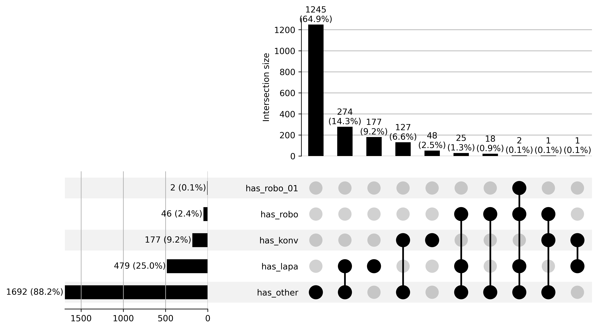

#### <a id='toc1_5_5_4_'></a>[rechte Hemikolektomie](#toc0_)

- Filter: alle Tumore, die einen OPS Code `5-455.4` aufweisen
- gezählt sind Tumore
- die Gruppen können überlappen

> 💡 kaum Robotik `5-987.1` geschlüsselt für diese Tumore (n=4)

<!-- START_TOKEN -->

    counts: distinct z_tum_id
    ---
    n = 4_015_983
    └ [DJ 2020-2024]:  n = 3_758_513
    └ [ICD10 C18-C20]: n = 284_931 (100.0%) ██████████████████████████████
    └ [Tumor hat OP]:  n = 185_576  (65.1%) ░░░░░░░░░░░███████████████████
    └ [OPS hemi]:       n = 64_632  (22.7%) ░░░░░░░░░░░░░░░░░░░░░░░░██████

<!-- END_TOKEN -->

<details>

<summary>

filter-sql
</summary>

``` sql
z_dy between 2020 and 2024
and z_icd10_3d in ('C18', 'C19', 'C20')
and z_tum_op_count > 0
and 
    (
        left(Code,8) in ('5-455.41', '5-455.45', '5-455.47')
        OR left(Code,5) in ('5-987')
    )
```

</details>

    n = 64_632 | n(true) = 64_632

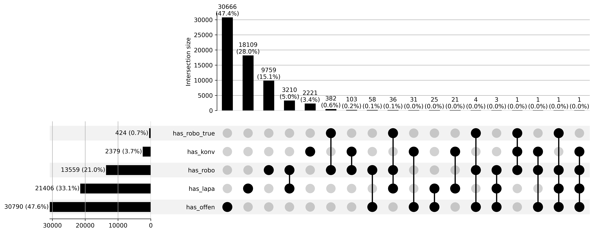

#### <a id='toc1_5_5_5_'></a>[Sigmaresektion](#toc0_)

- Filter: alle Tumore, die einen OPS Code `5-455.7` aufweisen
- gezählt sind Tumore
- die Gruppen können überlappen

> 💡 kaum Robotik `5-987.1` geschlüsselt für diese Tumore (n=4)

<!-- START_TOKEN -->

    counts: distinct z_tum_id
    ---
    n = 4_015_983
    └ [DJ 2020-2024]:  n = 3_758_513
    └ [ICD10 C18-C20]: n = 284_931 (100.0%) ██████████████████████████████
    └ [Tumor hat OP]:  n = 185_576  (65.1%) ░░░░░░░░░░░███████████████████
    └ [OPS sigma]:      n = 28_345   (9.9%) ░░░░░░░░░░░░░░░░░░░░░░░░░░░░██

<!-- END_TOKEN -->

<details>

<summary>

filter-sql
</summary>

``` sql
z_dy between 2020 and 2024
and z_icd10_3d in ('C18', 'C19', 'C20')
and z_tum_op_count > 0
and 
    (
        left(Code,8) in ('5-455.71', '5-455.75', '5-455.77')
        OR left(Code,5) in ('5-987')
    )
```

</details>

    n = 28_345 | n(true) = 28_345


## <a id='toc1_6_'></a>[Lokalisation (Fernmetastasen) für C18](#toc0_)

### <a id='toc1_6_1_'></a>[nach M](#toc0_)

- gezählt sind Tumore
- M Angabe ist kombiniert aus pM (Vorrang) und cM \> 💡 45% von M1 haben
  Leber FM

<!-- START_TOKEN -->

    counts: all rows (no grouping)
    ---
    n = 4_015_983                   (100.0%) ██████████████████████████████
    └ [DJ 2020-2024]: n = 3_758_513  (93.6%) ░░████████████████████████████
    └ [nur C18]:        n = 193_488   (4.8%) ░░░░░░░░░░░░░░░░░░░░░░░░░░░░░█

<!-- END_TOKEN -->

<details>

<summary>

filter-sql
</summary>

``` sql
z_dy between 2020 and 2024
and z_icd10_3d in ('C18')
```

</details>

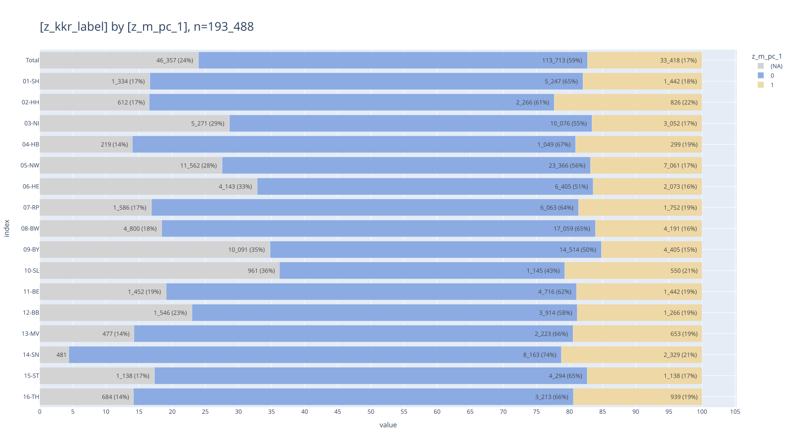

### <a id='toc1_6_2_'></a>[Anteil FM Lokalisation Leber bei M1](#toc0_)

- gezählt sind Tumore
- `HEP` liegt vor, wenn für **Diagnose** oder **Folgeereignis** diese
  Lokalisation vermerkt ist
- Metrik: Anteil Tumore mit \>=1 `HEP`

<!-- START_TOKEN -->

    counts: all rows (no grouping)
    ---
    n = 4_015_983                   (100.0%) ██████████████████████████████
    └ [DJ 2020-2024]: n = 3_758_513  (93.6%) ░░████████████████████████████
    └ [nur C18]:        n = 193_488   (4.8%) ░░░░░░░░░░░░░░░░░░░░░░░░░░░░░█
    └ [nur M1]:          n = 33_418   (0.8%) ░░░░░░░░░░░░░░░░░░░░░░░░░░░░░░

<!-- END_TOKEN -->

<details>

<summary>

filter-sql
</summary>

``` sql
z_dy between 2020 and 2024
and z_icd10_3d in ('C18')
and z_m_pc_1 in ('1')
```

</details>

<!-- SCALE-80% -->

<style type="text/css">
#T_15f61 th {
  text-align: right;
}
#T_15f61 td {
  text-align: right;
}
#T_15f61_row0_col0 {
  width: 10em;
  background: linear-gradient(90deg, #b3c8ec 80.2%, transparent 80.2%);
  font-family: Courier;
}
#T_15f61_row0_col1, #T_15f61_row7_col3 {
  width: 10em;
  background: linear-gradient(90deg, #b3c8ec 83.0%, transparent 83.0%);
  font-family: Courier;
}
#T_15f61_row0_col2, #T_15f61_row7_col4 {
  width: 10em;
  background: linear-gradient(90deg, #b3c8ec 83.4%, transparent 83.4%);
  font-family: Courier;
}
#T_15f61_row0_col3 {
  width: 10em;
  background: linear-gradient(90deg, #b3c8ec 71.3%, transparent 71.3%);
  font-family: Courier;
}
#T_15f61_row0_col4, #T_15f61_row0_col5, #T_15f61_row2_col2, #T_15f61_row2_col5 {
  width: 10em;
  background: linear-gradient(90deg, #b3c8ec 79.6%, transparent 79.6%);
  font-family: Courier;
}
#T_15f61_row1_col0 {
  width: 10em;
  background: linear-gradient(90deg, #b3c8ec 79.7%, transparent 79.7%);
  font-family: Courier;
}
#T_15f61_row1_col1 {
  width: 10em;
  background: linear-gradient(90deg, #b3c8ec 80.6%, transparent 80.6%);
  font-family: Courier;
}
#T_15f61_row1_col2 {
  width: 10em;
  background: linear-gradient(90deg, #b3c8ec 77.4%, transparent 77.4%);
  font-family: Courier;
}
#T_15f61_row1_col3 {
  width: 10em;
  background: linear-gradient(90deg, #b3c8ec 81.2%, transparent 81.2%);
  font-family: Courier;
}
#T_15f61_row1_col4 {
  width: 10em;
  background: linear-gradient(90deg, #b3c8ec 78.4%, transparent 78.4%);
  font-family: Courier;
}
#T_15f61_row1_col5 {
  width: 10em;
  background: linear-gradient(90deg, #b3c8ec 79.5%, transparent 79.5%);
  font-family: Courier;
}
#T_15f61_row2_col0, #T_15f61_row5_col4 {
  width: 10em;
  background: linear-gradient(90deg, #b3c8ec 82.7%, transparent 82.7%);
  font-family: Courier;
}
#T_15f61_row2_col1 {
  width: 10em;
  background: linear-gradient(90deg, #b3c8ec 81.1%, transparent 81.1%);
  font-family: Courier;
}
#T_15f61_row2_col3, #T_15f61_row4_col1 {
  width: 10em;
  background: linear-gradient(90deg, #b3c8ec 72.6%, transparent 72.6%);
  font-family: Courier;
}
#T_15f61_row2_col4, #T_15f61_row12_col5 {
  width: 10em;
  background: linear-gradient(90deg, #b3c8ec 83.1%, transparent 83.1%);
  font-family: Courier;
}
#T_15f61_row3_col0 {
  width: 10em;
  background: linear-gradient(90deg, #b3c8ec 84.4%, transparent 84.4%);
  font-family: Courier;
}
#T_15f61_row3_col1 {
  width: 10em;
  background: linear-gradient(90deg, #b3c8ec 71.4%, transparent 71.4%);
  font-family: Courier;
}
#T_15f61_row3_col2, #T_15f61_row5_col1 {
  width: 10em;
  background: linear-gradient(90deg, #b3c8ec 83.9%, transparent 83.9%);
  font-family: Courier;
}
#T_15f61_row3_col3 {
  width: 10em;
  background: linear-gradient(90deg, #b3c8ec 100.0%, transparent 100.0%);
  font-family: Courier;
}
#T_15f61_row3_col4, #T_15f61_row16_col2 {
  width: 10em;
  background: linear-gradient(90deg, #b3c8ec 81.0%, transparent 81.0%);
  font-family: Courier;
}
#T_15f61_row3_col5 {
  width: 10em;
  background: linear-gradient(90deg, #b3c8ec 84.1%, transparent 84.1%);
  font-family: Courier;
}
#T_15f61_row4_col0 {
  width: 10em;
  background: linear-gradient(90deg, #b3c8ec 63.0%, transparent 63.0%);
  font-family: Courier;
}
#T_15f61_row4_col2 {
  width: 10em;
  background: linear-gradient(90deg, #b3c8ec 74.7%, transparent 74.7%);
  font-family: Courier;
}
#T_15f61_row4_col3 {
  width: 10em;
  background: linear-gradient(90deg, #b3c8ec 72.7%, transparent 72.7%);
  font-family: Courier;
}
#T_15f61_row4_col4 {
  width: 10em;
  background: linear-gradient(90deg, #b3c8ec 67.8%, transparent 67.8%);
  font-family: Courier;
}
#T_15f61_row4_col5, #T_15f61_row6_col1 {
  width: 10em;
  background: linear-gradient(90deg, #b3c8ec 70.2%, transparent 70.2%);
  font-family: Courier;
}
#T_15f61_row5_col0 {
  width: 10em;
  background: linear-gradient(90deg, #b3c8ec 87.1%, transparent 87.1%);
  font-family: Courier;
}
#T_15f61_row5_col2 {
  width: 10em;
  background: linear-gradient(90deg, #b3c8ec 85.3%, transparent 85.3%);
  font-family: Courier;
}
#T_15f61_row5_col3 {
  width: 10em;
  background: linear-gradient(90deg, #b3c8ec 81.6%, transparent 81.6%);
  font-family: Courier;
}
#T_15f61_row5_col5, #T_15f61_row7_col5 {
  width: 10em;
  background: linear-gradient(90deg, #b3c8ec 84.2%, transparent 84.2%);
  font-family: Courier;
}
#T_15f61_row6_col0 {
  width: 10em;
  background: linear-gradient(90deg, #b3c8ec 75.3%, transparent 75.3%);
  font-family: Courier;
}
#T_15f61_row6_col2 {
  width: 10em;
  background: linear-gradient(90deg, #b3c8ec 58.2%, transparent 58.2%);
  font-family: Courier;
}
#T_15f61_row6_col3 {
  width: 10em;
  background: linear-gradient(90deg, #b3c8ec 35.3%, transparent 35.3%);
  font-family: Courier;
}
#T_15f61_row6_col4 {
  width: 10em;
  background: linear-gradient(90deg, #b3c8ec 15.3%, transparent 15.3%);
  font-family: Courier;
}
#T_15f61_row6_col5 {
  width: 10em;
  background: linear-gradient(90deg, #b3c8ec 54.0%, transparent 54.0%);
  font-family: Courier;
}
#T_15f61_row7_col0, #T_15f61_row10_col5 {
  width: 10em;
  background: linear-gradient(90deg, #b3c8ec 85.9%, transparent 85.9%);
  font-family: Courier;
}
#T_15f61_row7_col1, #T_15f61_row11_col2 {
  width: 10em;
  background: linear-gradient(90deg, #b3c8ec 84.9%, transparent 84.9%);
  font-family: Courier;
}
#T_15f61_row7_col2 {
  width: 10em;
  background: linear-gradient(90deg, #b3c8ec 83.3%, transparent 83.3%);
  font-family: Courier;
}
#T_15f61_row8_col0 {
  width: 10em;
  background: linear-gradient(90deg, #b3c8ec 87.5%, transparent 87.5%);
  font-family: Courier;
}
#T_15f61_row8_col1 {
  width: 10em;
  background: linear-gradient(90deg, #b3c8ec 89.0%, transparent 89.0%);
  font-family: Courier;
}
#T_15f61_row8_col2, #T_15f61_row8_col5 {
  width: 10em;
  background: linear-gradient(90deg, #b3c8ec 85.4%, transparent 85.4%);
  font-family: Courier;
}
#T_15f61_row8_col3, #T_15f61_row9_col3 {
  width: 10em;
  background: linear-gradient(90deg, #b3c8ec 81.9%, transparent 81.9%);
  font-family: Courier;
}
#T_15f61_row8_col4 {
  width: 10em;
  background: linear-gradient(90deg, #b3c8ec 82.3%, transparent 82.3%);
  font-family: Courier;
}
#T_15f61_row9_col0, #T_15f61_row10_col1 {
  width: 10em;
  background: linear-gradient(90deg, #b3c8ec 86.3%, transparent 86.3%);
  font-family: Courier;
}
#T_15f61_row9_col1 {
  width: 10em;
  background: linear-gradient(90deg, #b3c8ec 88.6%, transparent 88.6%);
  font-family: Courier;
}
#T_15f61_row9_col2 {
  width: 10em;
  background: linear-gradient(90deg, #b3c8ec 89.4%, transparent 89.4%);
  font-family: Courier;
}
#T_15f61_row9_col4 {
  width: 10em;
  background: linear-gradient(90deg, #b3c8ec 92.3%, transparent 92.3%);
  font-family: Courier;
}
#T_15f61_row9_col5 {
  width: 10em;
  background: linear-gradient(90deg, #b3c8ec 87.6%, transparent 87.6%);
  font-family: Courier;
}
#T_15f61_row10_col0, #T_15f61_row11_col4, #T_15f61_row12_col0, #T_15f61_row14_col0, #T_15f61_row15_col4 {
  width: 10em;
  background: linear-gradient(90deg, #b3c8ec 89.3%, transparent 89.3%);
  font-family: Courier;
}
#T_15f61_row10_col2, #T_15f61_row12_col1, #T_15f61_row15_col3 {
  width: 10em;
  background: linear-gradient(90deg, #b3c8ec 86.7%, transparent 86.7%);
  font-family: Courier;
}
#T_15f61_row10_col3 {
  width: 10em;
  background: linear-gradient(90deg, #b3c8ec 87.0%, transparent 87.0%);
  font-family: Courier;
}
#T_15f61_row10_col4, #T_15f61_row16_col5 {
  width: 10em;
  background: linear-gradient(90deg, #b3c8ec 80.1%, transparent 80.1%);
  font-family: Courier;
}
#T_15f61_row11_col0 {
  width: 10em;
  background: linear-gradient(90deg, #b3c8ec 94.8%, transparent 94.8%);
  font-family: Courier;
}
#T_15f61_row11_col1 {
  width: 10em;
  background: linear-gradient(90deg, #b3c8ec 93.5%, transparent 93.5%);
  font-family: Courier;
}
#T_15f61_row11_col3 {
  width: 10em;
  background: linear-gradient(90deg, #b3c8ec 86.6%, transparent 86.6%);
  font-family: Courier;
}
#T_15f61_row11_col5 {
  width: 10em;
  background: linear-gradient(90deg, #b3c8ec 89.9%, transparent 89.9%);
  font-family: Courier;
}
#T_15f61_row12_col2 {
  width: 10em;
  background: linear-gradient(90deg, #b3c8ec 75.1%, transparent 75.1%);
  font-family: Courier;
}
#T_15f61_row12_col3 {
  width: 10em;
  background: linear-gradient(90deg, #b3c8ec 80.9%, transparent 80.9%);
  font-family: Courier;
}
#T_15f61_row12_col4 {
  width: 10em;
  background: linear-gradient(90deg, #b3c8ec 90.1%, transparent 90.1%);
  font-family: Courier;
}
#T_15f61_row13_col0 {
  width: 10em;
  background: linear-gradient(90deg, #b3c8ec 97.8%, transparent 97.8%);
  font-family: Courier;
}
#T_15f61_row13_col1 {
  width: 10em;
  background: linear-gradient(90deg, #b3c8ec 90.9%, transparent 90.9%);
  font-family: Courier;
}
#T_15f61_row13_col2 {
  width: 10em;
  background: linear-gradient(90deg, #b3c8ec 91.2%, transparent 91.2%);
  font-family: Courier;
}
#T_15f61_row13_col3 {
  width: 10em;
  background: linear-gradient(90deg, #b3c8ec 89.6%, transparent 89.6%);
  font-family: Courier;
}
#T_15f61_row13_col4 {
  width: 10em;
  background: linear-gradient(90deg, #b3c8ec 88.4%, transparent 88.4%);
  font-family: Courier;
}
#T_15f61_row13_col5 {
  width: 10em;
  background: linear-gradient(90deg, #b3c8ec 91.5%, transparent 91.5%);
  font-family: Courier;
}
#T_15f61_row14_col1, #T_15f61_row14_col5 {
  width: 10em;
  background: linear-gradient(90deg, #b3c8ec 86.8%, transparent 86.8%);
  font-family: Courier;
}
#T_15f61_row14_col2 {
  width: 10em;
  background: linear-gradient(90deg, #b3c8ec 85.7%, transparent 85.7%);
  font-family: Courier;
}
#T_15f61_row14_col3 {
  width: 10em;
  background: linear-gradient(90deg, #b3c8ec 90.6%, transparent 90.6%);
  font-family: Courier;
}
#T_15f61_row14_col4 {
  width: 10em;
  background: linear-gradient(90deg, #b3c8ec 81.3%, transparent 81.3%);
  font-family: Courier;
}
#T_15f61_row15_col0 {
  width: 10em;
  background: linear-gradient(90deg, #b3c8ec 94.4%, transparent 94.4%);
  font-family: Courier;
}
#T_15f61_row15_col1 {
  width: 10em;
  background: linear-gradient(90deg, #b3c8ec 86.4%, transparent 86.4%);
  font-family: Courier;
}
#T_15f61_row15_col2 {
  width: 10em;
  background: linear-gradient(90deg, #b3c8ec 88.5%, transparent 88.5%);
  font-family: Courier;
}
#T_15f61_row15_col5 {
  width: 10em;
  background: linear-gradient(90deg, #b3c8ec 89.1%, transparent 89.1%);
  font-family: Courier;
}
#T_15f61_row16_col0 {
  width: 10em;
  background: linear-gradient(90deg, #b3c8ec 81.8%, transparent 81.8%);
  font-family: Courier;
}
#T_15f61_row16_col1 {
  width: 10em;
  background: linear-gradient(90deg, #b3c8ec 82.5%, transparent 82.5%);
  font-family: Courier;
}
#T_15f61_row16_col3 {
  width: 10em;
  background: linear-gradient(90deg, #b3c8ec 77.9%, transparent 77.9%);
  font-family: Courier;
}
#T_15f61_row16_col4 {
  width: 10em;
  background: linear-gradient(90deg, #b3c8ec 76.7%, transparent 76.7%);
  font-family: Courier;
}
</style>

| z_dy        | 2020  | 2021  | 2022  | 2023  | 2024  | Total |
|-------------|-------|-------|-------|-------|-------|-------|
| z_kkr_label |       |       |       |       |       |       |
| 01-SH       | 64.7% | 67.0% | 67.3% | 57.5% | 64.2% | 64.2% |
| 02-HH       | 64.3% | 65.1% | 62.4% | 65.6% | 63.3% | 64.2% |
| 03-NI       | 66.8% | 65.4% | 64.3% | 58.6% | 67.1% | 64.3% |
| 04-HB       | 68.1% | 57.6% | 67.7% | 80.7% | 65.4% | 67.9% |
| 05-NW       | 50.9% | 58.6% | 60.3% | 58.7% | 54.7% | 56.6% |
| 06-HE       | 70.3% | 67.7% | 68.8% | 65.8% | 66.8% | 68.0% |
| 07-RP       | 60.8% | 56.7% | 46.9% | 28.5% | 12.4% | 43.6% |
| 08-BW       | 69.3% | 68.5% | 67.2% | 67.0% | 67.3% | 67.9% |
| 09-BY       | 70.6% | 71.8% | 69.0% | 66.1% | 66.5% | 68.9% |
| 10-SL       | 69.6% | 71.5% | 72.1% | 66.1% | 74.5% | 70.7% |
| 11-BE       | 72.0% | 69.6% | 69.9% | 70.2% | 64.6% | 69.3% |
| 12-BB       | 76.5% | 75.5% | 68.5% | 69.9% | 72.1% | 72.6% |
| 13-MV       | 72.0% | 70.0% | 60.6% | 65.3% | 72.7% | 67.1% |
| 14-SN       | 78.9% | 73.4% | 73.6% | 72.3% | 71.3% | 73.9% |
| 15-ST       | 72.1% | 70.0% | 69.1% | 73.1% | 65.6% | 70.0% |
| 16-TH       | 76.2% | 69.7% | 71.4% | 70.0% | 72.1% | 71.9% |
| Total       | 66.0% | 66.6% | 65.4% | 62.9% | 61.9% | 64.7% |

### <a id='toc1_6_3_'></a>[Behandlungsverlauf](#toc0_)

- gezählt sind Tumore
- beschränkt auf die ersten 5 Therapien
- Therapien mit gleichem Tumor / Datum / Behandlung sind zusammengeführt
- verschiedene Therapien mit gleichem Tumor und Datum sind hier nicht
  entfernt

<!-- START_TOKEN -->

    counts: all rows (no grouping)
    ---
    n = 4_015_983
    └ [DJ 2020-2024]:                                           n = 3_758_513
    └ [nur C18]:                                                n = 193_488 (100.0%) ██████████████████████████████
    └ [nur M1]:                                                  n = 33_418  (17.3%) ░░░░░░░░░░░░░░░░░░░░░░░░░█████
    └ [Tumor mit HEP Lokalisation in FM Diagnose oder Verlauf]:  n = 21_612  (11.2%) ░░░░░░░░░░░░░░░░░░░░░░░░░░░███
    └ [Tumor hat Therapie]:                                      n = 17_891   (9.2%) ░░░░░░░░░░░░░░░░░░░░░░░░░░░░██

<!-- END_TOKEN -->

<details>

<summary>

filter-sql
</summary>

``` sql
z_dy between 2020 and 2024
and z_icd10_3d in ('C18')
and z_m_pc_1 in ('1')
and 
    z_tum_id in (
        select distinct tum.z_tum_id
        from Tumor tum
        left join Diagnose_Fernmetastase dfm on tum.z_tum_id = dfm.z_tum_id
        left join Folgeereignis_Fernmetastase ffm on tum.z_tum_id = ffm.z_tum_id
        where (dfm.Lokalisation = 'HEP' or ffm.Lokalisation = 'HEP')
    )
and z_tum_op_count+z_tum_sy_count+z_tum_st_count > 0
```

</details>

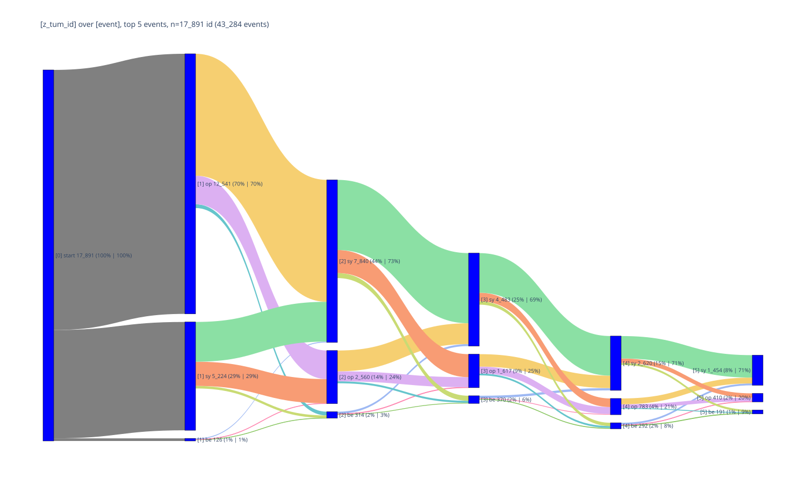

### <a id='toc1_6_4_'></a>[Erste Behandlung bei Leber FM](#toc0_)

<!-- START_TOKEN -->

    counts: all rows (no grouping)
    ---
    n = 4_015_983
    └ [DJ 2020-2024]:                                           n = 3_758_513
    └ [nur C18]:                                                n = 193_488 (100.0%) ██████████████████████████████
    └ [nur M1]:                                                  n = 33_418  (17.3%) ░░░░░░░░░░░░░░░░░░░░░░░░░█████
    └ [Tumor mit HEP Lokalisation in FM Diagnose oder Verlauf]:  n = 21_612  (11.2%) ░░░░░░░░░░░░░░░░░░░░░░░░░░░███

<!-- END_TOKEN -->

<details>

<summary>

filter-sql
</summary>

``` sql
z_dy between 2020 and 2024
and z_icd10_3d in ('C18')
and z_m_pc_1 in ('1')
and 
    z_tum_id in (
        select distinct tum.z_tum_id
        from Tumor tum
        left join Diagnose_Fernmetastase dfm on tum.z_tum_id = dfm.z_tum_id
        left join Folgeereignis_Fernmetastase ffm on tum.z_tum_id = ffm.z_tum_id
        where (dfm.Lokalisation = 'HEP' or ffm.Lokalisation = 'HEP')
    )
```

</details>

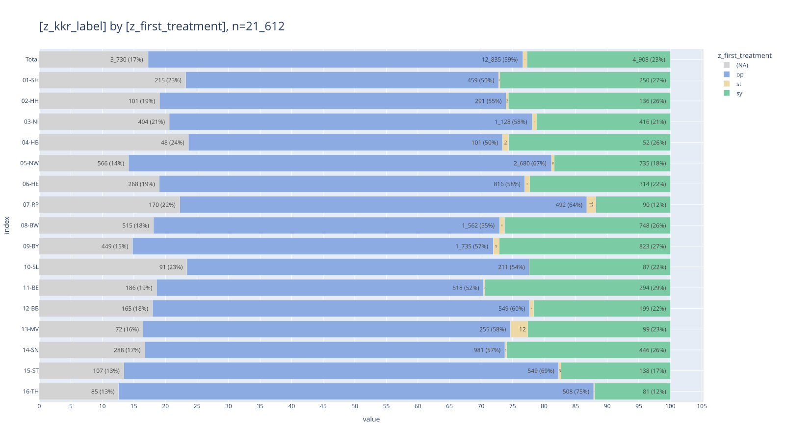

### <a id='toc1_6_5_'></a>[OPS wenn Erstbehandlung OPS](#toc0_)

- gezählt sind Tumore
- Kategorien OPS bei Erstbehandlung des Tumors
  - `1_other`: andere oder keine OPS
  - `2_colon`: erste 5 Stellen in `('5-455','5-484','5-485')`
  - `3_liver`: erste 5 Stellen in `('5-501','5-502','5-503')`
  - `4_both`: colon und liver geschlüsselt für Erstbehandlung

<!-- START_TOKEN -->

    counts: all rows (no grouping)
    ---
    n = 4_015_983
    └ [DJ 2020-2024]:                                           n = 3_758_513
    └ [nur C18]:                                                n = 193_488 (100.0%) ██████████████████████████████
    └ [nur M1]:                                                  n = 33_418  (17.3%) ░░░░░░░░░░░░░░░░░░░░░░░░░█████
    └ [Tumor mit HEP Lokalisation in FM Diagnose oder Verlauf]:  n = 21_612  (11.2%) ░░░░░░░░░░░░░░░░░░░░░░░░░░░███
    └ [Tumore mit OP als Erstbehandlung]:                        n = 12_835   (6.6%) ░░░░░░░░░░░░░░░░░░░░░░░░░░░░░█

<!-- END_TOKEN -->

<details>

<summary>

filter-sql
</summary>

``` sql
z_dy between 2020 and 2024
and z_icd10_3d in ('C18')
and z_m_pc_1 in ('1')
and 
    z_tum_id in (
        select distinct tum.z_tum_id
        from Tumor tum
        left join Diagnose_Fernmetastase dfm on tum.z_tum_id = dfm.z_tum_id
        left join Folgeereignis_Fernmetastase ffm on tum.z_tum_id = ffm.z_tum_id
        where (dfm.Lokalisation = 'HEP' or ffm.Lokalisation = 'HEP')
    )
and z_first_treatment = 'op'
```

</details>


## <a id='toc1_7_'></a>[Rezidive](#toc0_)

### <a id='toc1_7_1_'></a>[Verteilung OP in 2020](#toc0_)

- Filter: `C18`-`C20`, 2020
- gezählt sind Tumore
- Kategorien
  - `1_op_r0` - OP und R0 dokumentiert
  - `2_op_no_r0` - OP, kein R0
  - `3_no_op_but_pt` - keine OP, aber pT (Diagnose oder Verlauf)
  - `4_no_op_pt_but_st_sy` - keine OP, keine pT, aber ST oder SYST
  - `5_none` - keine Therapie oder pT

<!-- START_TOKEN -->

    counts: all rows (no grouping)
    ---
    n = 4_015_983
    └ [DJ 2020-2024]:  n = 3_758_513
    └ [ICD10 C18-C20]: n = 284_931 (100.0%) ██████████████████████████████
    └ [DJ 2020]:        n = 57_998  (20.4%) ░░░░░░░░░░░░░░░░░░░░░░░░██████
    └ [nur C18]:        n = 39_315  (13.8%) ░░░░░░░░░░░░░░░░░░░░░░░░░░████

<!-- END_TOKEN -->

<details>

<summary>

filter-sql
</summary>

``` sql
z_dy between 2020 and 2024
and z_icd10_3d in ('C18', 'C19', 'C20')
and z_dy = 2020
and z_icd10_3d in ('C18')
```

</details>

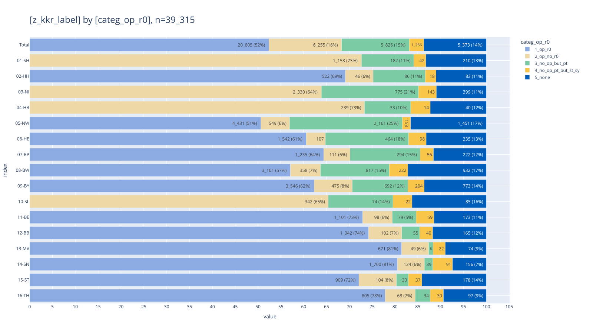

### <a id='toc1_7_2_'></a>[M Stadium und Vitalstatus bei Tumoren ohne Therapie und pT](#toc0_)

    n = 5_373

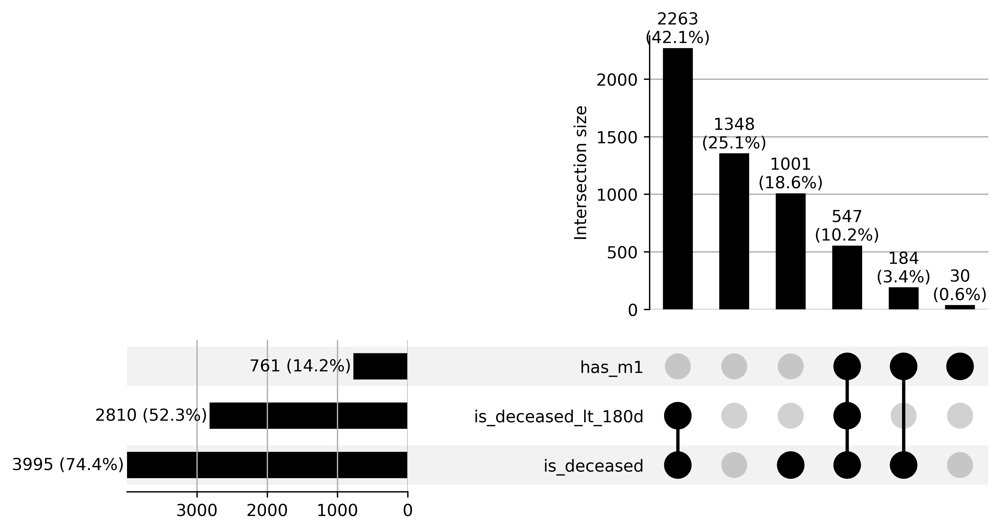

### <a id='toc1_7_3_'></a>[R Status](#toc0_)

- `r_status`
  - `1_R0`: wenn \>= 1 OP zum Tumor dokumentiert is mit `R0`
  - `2_R1_R2`: wenn kein `R0` dokumentiert, aber \>= 1 OP mit `R1` oder
    `R2`
  - `3_NA_U_RX`: wenn beides nicht zutrifft (Feld ist leer, `U` oder
    `RX`)

<!-- START_TOKEN -->

    counts: all rows (no grouping)
    ---
    n = 4_015_983
    └ [DJ 2020-2024]:  n = 3_758_513
    └ [ICD10 C18-C20]: n = 284_931 (100.0%) ██████████████████████████████
    └ [DJ 2020]:        n = 57_998  (20.4%) ░░░░░░░░░░░░░░░░░░░░░░░░██████
    └ [nur C18]:        n = 39_315  (13.8%) ░░░░░░░░░░░░░░░░░░░░░░░░░░████

<!-- END_TOKEN -->

<details>

<summary>

filter-sql
</summary>

``` sql
z_dy between 2020 and 2024
and z_icd10_3d in ('C18', 'C19', 'C20')
and z_dy = 2020
and z_icd10_3d in ('C18')
```

</details>

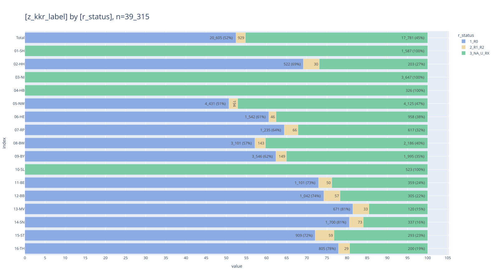

<!-- SCALE-40% -->

<style type="text/css">
#T_2ccec th {
  text-align: right;
  font-size: 9pt;
}
#T_2ccec td {
  text-align: right;
  font-size: 7pt;
}
#T_2ccec_row0_col0, #T_2ccec_row0_col1, #T_2ccec_row2_col0, #T_2ccec_row2_col1, #T_2ccec_row3_col0, #T_2ccec_row3_col1, #T_2ccec_row9_col0, #T_2ccec_row9_col1 {
  width: 10em;
  font-family: Courier;
}
#T_2ccec_row0_col2 {
  width: 10em;
  background: linear-gradient(90deg, #b3c8ec 38.5%, transparent 38.5%);
  font-family: Courier;
}
#T_2ccec_row0_col3, #T_2ccec_row1_col3, #T_2ccec_row2_col3, #T_2ccec_row3_col3, #T_2ccec_row4_col3, #T_2ccec_row5_col3, #T_2ccec_row6_col3, #T_2ccec_row7_col3, #T_2ccec_row8_col3, #T_2ccec_row9_col3, #T_2ccec_row10_col3, #T_2ccec_row11_col3, #T_2ccec_row12_col3, #T_2ccec_row13_col3, #T_2ccec_row14_col3, #T_2ccec_row15_col3, #T_2ccec_row16_col0, #T_2ccec_row16_col1, #T_2ccec_row16_col2, #T_2ccec_row16_col3 {
  font-family: Courier;
}
#T_2ccec_row1_col0 {
  width: 10em;
  background: linear-gradient(90deg, #b3c8ec 11.8%, transparent 11.8%);
  font-family: Courier;
}
#T_2ccec_row1_col1 {
  width: 10em;
  background: linear-gradient(90deg, #b3c8ec 15.5%, transparent 15.5%);
  font-family: Courier;
}
#T_2ccec_row1_col2 {
  width: 10em;
  background: linear-gradient(90deg, #b3c8ec 4.9%, transparent 4.9%);
  font-family: Courier;
}
#T_2ccec_row2_col2 {
  width: 10em;
  background: linear-gradient(90deg, #b3c8ec 88.4%, transparent 88.4%);
  font-family: Courier;
}
#T_2ccec_row3_col2 {
  width: 10em;
  background: linear-gradient(90deg, #b3c8ec 7.9%, transparent 7.9%);
  font-family: Courier;
}
#T_2ccec_row4_col0, #T_2ccec_row4_col1, #T_2ccec_row4_col2 {
  width: 10em;
  background: linear-gradient(90deg, #b3c8ec 100.0%, transparent 100.0%);
  font-family: Courier;
}
#T_2ccec_row5_col0 {
  width: 10em;
  background: linear-gradient(90deg, #b3c8ec 34.8%, transparent 34.8%);
  font-family: Courier;
}
#T_2ccec_row5_col1 {
  width: 10em;
  background: linear-gradient(90deg, #b3c8ec 23.7%, transparent 23.7%);
  font-family: Courier;
}
#T_2ccec_row5_col2 {
  width: 10em;
  background: linear-gradient(90deg, #b3c8ec 23.2%, transparent 23.2%);
  font-family: Courier;
}
#T_2ccec_row6_col0 {
  width: 10em;
  background: linear-gradient(90deg, #b3c8ec 27.9%, transparent 27.9%);
  font-family: Courier;
}
#T_2ccec_row6_col1 {
  width: 10em;
  background: linear-gradient(90deg, #b3c8ec 34.0%, transparent 34.0%);
  font-family: Courier;
}
#T_2ccec_row6_col2 {
  width: 10em;
  background: linear-gradient(90deg, #b3c8ec 15.0%, transparent 15.0%);
  font-family: Courier;
}
#T_2ccec_row7_col0 {
  width: 10em;
  background: linear-gradient(90deg, #b3c8ec 70.0%, transparent 70.0%);
  font-family: Courier;
}
#T_2ccec_row7_col1 {
  width: 10em;
  background: linear-gradient(90deg, #b3c8ec 73.7%, transparent 73.7%);
  font-family: Courier;
}
#T_2ccec_row7_col2 {
  width: 10em;
  background: linear-gradient(90deg, #b3c8ec 53.0%, transparent 53.0%);
  font-family: Courier;
}
#T_2ccec_row8_col0 {
  width: 10em;
  background: linear-gradient(90deg, #b3c8ec 80.0%, transparent 80.0%);
  font-family: Courier;
}
#T_2ccec_row8_col1 {
  width: 10em;
  background: linear-gradient(90deg, #b3c8ec 76.8%, transparent 76.8%);
  font-family: Courier;
}
#T_2ccec_row8_col2 {
  width: 10em;
  background: linear-gradient(90deg, #b3c8ec 48.4%, transparent 48.4%);
  font-family: Courier;
}
#T_2ccec_row9_col2 {
  width: 10em;
  background: linear-gradient(90deg, #b3c8ec 12.7%, transparent 12.7%);
  font-family: Courier;
}
#T_2ccec_row10_col0 {
  width: 10em;
  background: linear-gradient(90deg, #b3c8ec 24.8%, transparent 24.8%);
  font-family: Courier;
}
#T_2ccec_row10_col1 {
  width: 10em;
  background: linear-gradient(90deg, #b3c8ec 25.8%, transparent 25.8%);
  font-family: Courier;
}
#T_2ccec_row10_col2 {
  width: 10em;
  background: linear-gradient(90deg, #b3c8ec 8.7%, transparent 8.7%);
  font-family: Courier;
}
#T_2ccec_row11_col0 {
  width: 10em;
  background: linear-gradient(90deg, #b3c8ec 23.5%, transparent 23.5%);
  font-family: Courier;
}
#T_2ccec_row11_col1 {
  width: 10em;
  background: linear-gradient(90deg, #b3c8ec 29.4%, transparent 29.4%);
  font-family: Courier;
}
#T_2ccec_row11_col2 {
  width: 10em;
  background: linear-gradient(90deg, #b3c8ec 7.4%, transparent 7.4%);
  font-family: Courier;
}
#T_2ccec_row12_col0 {
  width: 10em;
  background: linear-gradient(90deg, #b3c8ec 15.1%, transparent 15.1%);
  font-family: Courier;
}
#T_2ccec_row12_col1 {
  width: 10em;
  background: linear-gradient(90deg, #b3c8ec 17.0%, transparent 17.0%);
  font-family: Courier;
}
#T_2ccec_row12_col2 {
  width: 10em;
  background: linear-gradient(90deg, #b3c8ec 2.9%, transparent 2.9%);
  font-family: Courier;
}
#T_2ccec_row13_col0 {
  width: 10em;
  background: linear-gradient(90deg, #b3c8ec 38.4%, transparent 38.4%);
  font-family: Courier;
}
#T_2ccec_row13_col1 {
  width: 10em;
  background: linear-gradient(90deg, #b3c8ec 37.6%, transparent 37.6%);
  font-family: Courier;
}
#T_2ccec_row13_col2 {
  width: 10em;
  background: linear-gradient(90deg, #b3c8ec 8.2%, transparent 8.2%);
  font-family: Courier;
}
#T_2ccec_row14_col0 {
  width: 10em;
  background: linear-gradient(90deg, #b3c8ec 20.5%, transparent 20.5%);
  font-family: Courier;
}
#T_2ccec_row14_col1 {
  width: 10em;
  background: linear-gradient(90deg, #b3c8ec 30.4%, transparent 30.4%);
  font-family: Courier;
}
#T_2ccec_row14_col2 {
  width: 10em;
  background: linear-gradient(90deg, #b3c8ec 7.1%, transparent 7.1%);
  font-family: Courier;
}
#T_2ccec_row15_col0 {
  width: 10em;
  background: linear-gradient(90deg, #b3c8ec 18.2%, transparent 18.2%);
  font-family: Courier;
}
#T_2ccec_row15_col1 {
  width: 10em;
  background: linear-gradient(90deg, #b3c8ec 14.9%, transparent 14.9%);
  font-family: Courier;
}
#T_2ccec_row15_col2 {
  width: 10em;
  background: linear-gradient(90deg, #b3c8ec 4.8%, transparent 4.8%);
  font-family: Courier;
}
</style>

| r_status | 1_R0 | 2_R1_R2 | 3_NA_U_RX | Total |
|----|----|----|----|----|
| z_kkr_label |   |   |   |   |
| 01-SH | <span style="color: #A9A9A9">0 </span> | <span style="color: #A9A9A9">0 </span> | 1_587 | 1_587 |
| 02-HH | 522 | 30 | 203 | 755 |
| 03-NI | <span style="color: #A9A9A9">0 </span> | <span style="color: #A9A9A9">0 </span> | 3_647 | 3_647 |
| 04-HB | <span style="color: #A9A9A9">0 </span> | <span style="color: #A9A9A9">0 </span> | 326 | 326 |
| 05-NW | 4_431 | 194 | 4_125 | 8_750 |
| 06-HE | 1_542 | 46 | 958 | 2_546 |
| 07-RP | 1_235 | 66 | 617 | 1_918 |
| 08-BW | 3_101 | 143 | 2_186 | 5_430 |
| 09-BY | 3_546 | 149 | 1_995 | 5_690 |
| 10-SL | <span style="color: #A9A9A9">0 </span> | <span style="color: #A9A9A9">0 </span> | 523 | 523 |
| 11-BE | 1_101 | 50 | 359 | 1_510 |
| 12-BB | 1_042 | 57 | 305 | 1_404 |
| 13-MV | 671 | 33 | 120 | 824 |
| 14-SN | 1_700 | 73 | 337 | 2_110 |
| 15-ST | 909 | 59 | 293 | 1_261 |
| 16-TH | 805 | 29 | 200 | 1_034 |
| Total | 20_605 | 929 | 17_781 | 39_315 |

#### <a id='toc1_7_3_1_'></a>[davon: Verteilung nur R0](#toc0_)

**enge Definition eines Rezidivs** - Filter: lokaler Beurteilung
Residualstatus = R0 (UND M \<\> 1) - Rezidiv wenn  
- Gesamtbeurteilung: Y oder  
- Lokaler Tumorstatus: R oder  
- Tumorstatus Lymphknoten:R oder  
- Verlauf Fernmetastasen:R

**erweiterte Definition (Verworfen)** - Rezidiv wenn - (TNM)r_Symbol:r
UND - (Folgeereignis T\>0 oder Folgeereignis N\>0 oder Folgeereignis
M\>0)

**Diagramm** - gezählt sind Tumore mit R0 - Kategorien -
`1_fo_relapse` - Tumore mit Rezidiv nach enger Definition -
`2_fo_relapse_tnm` - Tumore mit Rezidiv nach erweiterter Definition -
`3_fo_no_relapse` - Tumore mit Folgeereignis ohne o.a. Rezidiv -
`4_no_fo` - Tumore ohne Folgeereignis - ℹ️ kkr mit “leerem Balken” nicht
nicht in der Grundmenge enthalten, da sie keine R0 ausweisen

<!-- START_TOKEN -->

    counts: distinct z_tum_id
    ---
    n = 4_015_983
    └ [DJ 2020]:           n = 749_493
    └ [nur C18]:           n = 39_315 (100.0%) ██████████████████████████████
    └ [Residualstatus R0]: n = 20_605  (52.4%) ░░░░░░░░░░░░░░░███████████████

<!-- END_TOKEN -->

<details>

<summary>

filter-sql
</summary>

``` sql
z_dy = 2020
and z_icd10_3d in ('C18')
and upper(left(Lokale_Beurteilung_Residualstatus,2)) = 'R0'
```

</details>

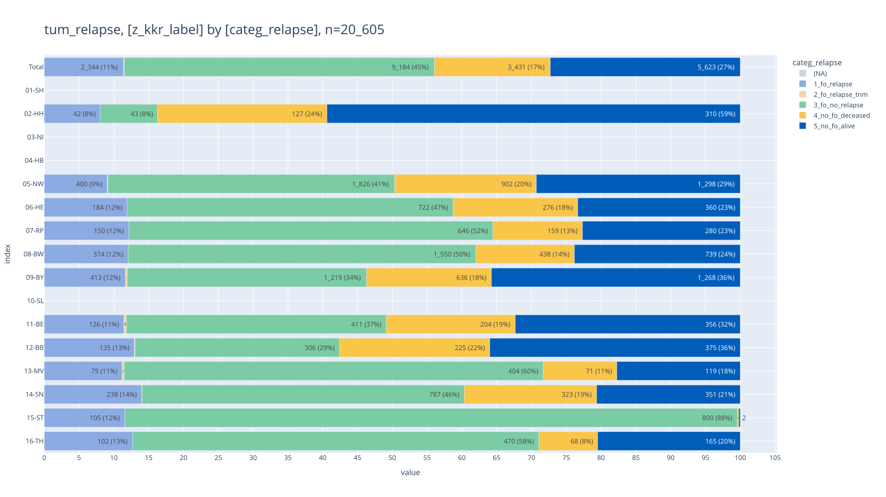

<!-- SCALE-50%, -->

<style type="text/css">
#T_5299b th {
  text-align: right;
}
#T_5299b td {
  text-align: right;
}
#T_5299b_row0_col0, #T_5299b_row0_col2 {
  width: 10em;
  background: linear-gradient(90deg, #b3c8ec 0.2%, transparent 0.2%);
  font-family: Courier;
}
#T_5299b_row0_col1, #T_5299b_row2_col1, #T_5299b_row3_col1, #T_5299b_row4_col1, #T_5299b_row10_col1, #T_5299b_row11_col1 {
  width: 10em;
  font-family: Courier;
}
#T_5299b_row0_col3, #T_5299b_row6_col0, #T_5299b_row8_col4 {
  width: 10em;
  background: linear-gradient(90deg, #b3c8ec 0.6%, transparent 0.6%);
  font-family: Courier;
}
#T_5299b_row0_col4, #T_5299b_row7_col2 {
  width: 10em;
  background: linear-gradient(90deg, #b3c8ec 1.5%, transparent 1.5%);
  font-family: Courier;
}
#T_5299b_row0_col5 {
  width: 10em;
  background: linear-gradient(90deg, #b3c8ec 2.5%, transparent 2.5%);
  font-family: Courier;
}
#T_5299b_row1_col0 {
  width: 10em;
  background: linear-gradient(90deg, #b3c8ec 1.9%, transparent 1.9%);
  font-family: Courier;
}
#T_5299b_row1_col1, #T_5299b_row5_col1, #T_5299b_row6_col1, #T_5299b_row7_col1, #T_5299b_row8_col1, #T_5299b_row9_col1, #T_5299b_row10_col3, #T_5299b_row10_col4 {
  width: 10em;
  background: linear-gradient(90deg, #b3c8ec 0.0%, transparent 0.0%);
  font-family: Courier;
}
#T_5299b_row1_col2 {
  width: 10em;
  background: linear-gradient(90deg, #b3c8ec 8.9%, transparent 8.9%);
  font-family: Courier;
}
#T_5299b_row1_col3, #T_5299b_row10_col5 {
  width: 10em;
  background: linear-gradient(90deg, #b3c8ec 4.4%, transparent 4.4%);
  font-family: Courier;
}
#T_5299b_row1_col4 {
  width: 10em;
  background: linear-gradient(90deg, #b3c8ec 6.3%, transparent 6.3%);
  font-family: Courier;
}
#T_5299b_row1_col5 {
  width: 10em;
  background: linear-gradient(90deg, #b3c8ec 21.5%, transparent 21.5%);
  font-family: Courier;
}
#T_5299b_row2_col0 {
  width: 10em;
  background: linear-gradient(90deg, #b3c8ec 0.9%, transparent 0.9%);
  font-family: Courier;
}
#T_5299b_row2_col2 {
  width: 10em;
  background: linear-gradient(90deg, #b3c8ec 3.5%, transparent 3.5%);
  font-family: Courier;
}
#T_5299b_row2_col3 {
  width: 10em;
  background: linear-gradient(90deg, #b3c8ec 1.3%, transparent 1.3%);
  font-family: Courier;
}
#T_5299b_row2_col4, #T_5299b_row6_col4, #T_5299b_row9_col4 {
  width: 10em;
  background: linear-gradient(90deg, #b3c8ec 1.7%, transparent 1.7%);
  font-family: Courier;
}
#T_5299b_row2_col5, #T_5299b_row4_col2 {
  width: 10em;
  background: linear-gradient(90deg, #b3c8ec 7.5%, transparent 7.5%);
  font-family: Courier;
}
#T_5299b_row3_col0, #T_5299b_row7_col0 {
  width: 10em;
  background: linear-gradient(90deg, #b3c8ec 0.7%, transparent 0.7%);
  font-family: Courier;
}
#T_5299b_row3_col2, #T_5299b_row5_col3 {
  width: 10em;
  background: linear-gradient(90deg, #b3c8ec 3.1%, transparent 3.1%);
  font-family: Courier;
}
#T_5299b_row3_col3, #T_5299b_row11_col4 {
  width: 10em;
  background: linear-gradient(90deg, #b3c8ec 0.8%, transparent 0.8%);
  font-family: Courier;
}
#T_5299b_row3_col4 {
  width: 10em;
  background: linear-gradient(90deg, #b3c8ec 1.4%, transparent 1.4%);
  font-family: Courier;
}
#T_5299b_row3_col5 {
  width: 10em;
  background: linear-gradient(90deg, #b3c8ec 6.0%, transparent 6.0%);
  font-family: Courier;
}
#T_5299b_row4_col0, #T_5299b_row7_col4 {
  width: 10em;
  background: linear-gradient(90deg, #b3c8ec 1.8%, transparent 1.8%);
  font-family: Courier;
}
#T_5299b_row4_col3 {
  width: 10em;
  background: linear-gradient(90deg, #b3c8ec 2.1%, transparent 2.1%);
  font-family: Courier;
}
#T_5299b_row4_col4 {
  width: 10em;
  background: linear-gradient(90deg, #b3c8ec 3.6%, transparent 3.6%);
  font-family: Courier;
}
#T_5299b_row4_col5 {
  width: 10em;
  background: linear-gradient(90deg, #b3c8ec 15.0%, transparent 15.0%);
  font-family: Courier;
}
#T_5299b_row5_col0, #T_5299b_row6_col2, #T_5299b_row8_col2 {
  width: 10em;
  background: linear-gradient(90deg, #b3c8ec 2.0%, transparent 2.0%);
  font-family: Courier;
}
#T_5299b_row5_col2 {
  width: 10em;
  background: linear-gradient(90deg, #b3c8ec 5.9%, transparent 5.9%);
  font-family: Courier;
}
#T_5299b_row5_col4 {
  width: 10em;
  background: linear-gradient(90deg, #b3c8ec 6.2%, transparent 6.2%);
  font-family: Courier;
}
#T_5299b_row5_col5 {
  width: 10em;
  background: linear-gradient(90deg, #b3c8ec 17.2%, transparent 17.2%);
  font-family: Courier;
}
#T_5299b_row6_col3 {
  width: 10em;
  background: linear-gradient(90deg, #b3c8ec 1.0%, transparent 1.0%);
  font-family: Courier;
}
#T_5299b_row6_col5 {
  width: 10em;
  background: linear-gradient(90deg, #b3c8ec 5.3%, transparent 5.3%);
  font-family: Courier;
}
#T_5299b_row7_col3 {
  width: 10em;
  background: linear-gradient(90deg, #b3c8ec 1.1%, transparent 1.1%);
  font-family: Courier;
}
#T_5299b_row7_col5 {
  width: 10em;
  background: linear-gradient(90deg, #b3c8ec 5.1%, transparent 5.1%);
  font-family: Courier;
}
#T_5299b_row8_col0 {
  width: 10em;
  background: linear-gradient(90deg, #b3c8ec 0.4%, transparent 0.4%);
  font-family: Courier;
}
#T_5299b_row8_col3, #T_5299b_row11_col3 {
  width: 10em;
  background: linear-gradient(90deg, #b3c8ec 0.3%, transparent 0.3%);
  font-family: Courier;
}
#T_5299b_row8_col5 {
  width: 10em;
  background: linear-gradient(90deg, #b3c8ec 3.3%, transparent 3.3%);
  font-family: Courier;
}
#T_5299b_row9_col0 {
  width: 10em;
  background: linear-gradient(90deg, #b3c8ec 1.2%, transparent 1.2%);
  font-family: Courier;
}
#T_5299b_row9_col2 {
  width: 10em;
  background: linear-gradient(90deg, #b3c8ec 3.8%, transparent 3.8%);
  font-family: Courier;
}
#T_5299b_row9_col3 {
  width: 10em;
  background: linear-gradient(90deg, #b3c8ec 1.6%, transparent 1.6%);
  font-family: Courier;
}
#T_5299b_row9_col5 {
  width: 10em;
  background: linear-gradient(90deg, #b3c8ec 8.3%, transparent 8.3%);
  font-family: Courier;
}
#T_5299b_row10_col0, #T_5299b_row11_col0 {
  width: 10em;
  background: linear-gradient(90deg, #b3c8ec 0.5%, transparent 0.5%);
  font-family: Courier;
}
#T_5299b_row10_col2, #T_5299b_row11_col5 {
  width: 10em;
  background: linear-gradient(90deg, #b3c8ec 3.9%, transparent 3.9%);
  font-family: Courier;
}
#T_5299b_row11_col2 {
  width: 10em;
  background: linear-gradient(90deg, #b3c8ec 2.3%, transparent 2.3%);
  font-family: Courier;
}
#T_5299b_row12_col0 {
  width: 10em;
  background: linear-gradient(90deg, #b3c8ec 11.4%, transparent 11.4%);
  font-family: Courier;
}
#T_5299b_row12_col1 {
  width: 10em;
  background: linear-gradient(90deg, #b3c8ec 0.1%, transparent 0.1%);
  font-family: Courier;
}
#T_5299b_row12_col2 {
  width: 10em;
  background: linear-gradient(90deg, #b3c8ec 44.6%, transparent 44.6%);
  font-family: Courier;
}
#T_5299b_row12_col3 {
  width: 10em;
  background: linear-gradient(90deg, #b3c8ec 16.7%, transparent 16.7%);
  font-family: Courier;
}
#T_5299b_row12_col4 {
  width: 10em;
  background: linear-gradient(90deg, #b3c8ec 27.3%, transparent 27.3%);
  font-family: Courier;
}
#T_5299b_row12_col5 {
  width: 10em;
  background: linear-gradient(90deg, #b3c8ec 100.0%, transparent 100.0%);
  font-family: Courier;
}
</style>

| categ_relapse | 1_fo_relapse | 2_fo_relapse_tnm | 3_fo_no_relapse | 4_no_fo_deceased | 5_no_fo_alive | Total |
|----|----|----|----|----|----|----|
| z_kkr_label |   |   |   |   |   |   |
| 02-HH | 42 | <span style="color: #A9A9A9">0 </span> | 43 | 127 | 310 | 522 |
| 05-NW | 400 | 5 | 1_826 | 902 | 1_298 | 4_431 |
| 06-HE | 184 | <span style="color: #A9A9A9">0 </span> | 722 | 276 | 360 | 1_542 |
| 07-RP | 150 | <span style="color: #A9A9A9">0 </span> | 646 | 159 | 280 | 1_235 |
| 08-BW | 374 | <span style="color: #A9A9A9">0 </span> | 1_550 | 438 | 739 | 3_101 |
| 09-BY | 413 | 10 | 1_219 | 636 | 1_268 | 3_546 |
| 11-BE | 126 | 4 | 411 | 204 | 356 | 1_101 |
| 12-BB | 135 | 1 | 306 | 225 | 375 | 1_042 |
| 13-MV | 75 | 2 | 404 | 71 | 119 | 671 |
| 14-SN | 238 | 1 | 787 | 323 | 351 | 1_700 |
| 15-ST | 105 | <span style="color: #A9A9A9">0 </span> | 800 | 2 | 2 | 909 |
| 16-TH | 102 | <span style="color: #A9A9A9">0 </span> | 470 | 68 | 165 | 805 |
| Total | 2_344 | 23 | 9_184 | 3_431 | 5_623 | 20_605 |

<br>

## <a id='toc1_8_'></a>[Behandlung innerhalb von 6 Wochen](#toc0_)

- Filter: `C18`-`C20`
- `first_treatment_6w`
  - `<=6w`: erste Behandlung innerhalb von 6 Wochen
  - `>6w`: erste Behandlung nach 6 Wochen
  - `-`: keine Behandlung dokumentiert

<!-- START_TOKEN -->

    counts: all rows (no grouping)
    ---
    n = 4_015_983                    (100.0%) ██████████████████████████████
    └ [DJ 2020-2024]:  n = 3_758_513  (93.6%) ░░████████████████████████████
    └ [ICD10 C18-C20]:   n = 284_931   (7.1%) ░░░░░░░░░░░░░░░░░░░░░░░░░░░░██

<!-- END_TOKEN -->

<details>

<summary>

filter-sql
</summary>

``` sql
z_dy between 2020 and 2024
and z_icd10_3d in ('C18', 'C19', 'C20')
```

</details>


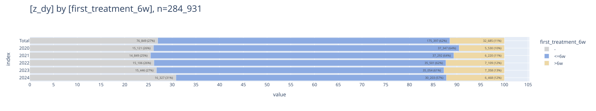

### <a id='toc1_8_1_'></a>[Zeitlicher Abstand der Behandlungen](#toc0_)

- Filter: `C18`, Tumore mit Behandlung
- gezählt sind Tumore
- abgebildet sind Median Werte für den Abstand Diagnose bis erste
  Behandlung in Tagen (logarithmische Skala)

<!-- START_TOKEN -->

    counts: all rows (no grouping)
    ---
    n = 4_015_983
    └ [DJ 2020-2024]:       n = 3_758_513
    └ [nur C18]:            n = 193_488 (100.0%) ██████████████████████████████
    └ [Tumor hat Therapie]: n = 139_667  (72.2%) ░░░░░░░░░█████████████████████

<!-- END_TOKEN -->

<details>

<summary>

filter-sql
</summary>

``` sql
z_dy between 2020 and 2024
and z_icd10_3d in ('C18')
and z_tum_op_count+z_tum_sy_count+z_tum_st_count > 0
```

</details>


    column (n = 139_667)         |    notnull    | min | lower | q25  | median | mean  |  q75  | upper |  max  |  std  |  cv 
    -----------------------------+---------------+-----+-------+------+--------+-------+-------+-------+-------+-------+-----
    z_first_treatment_after_days | 139_477 (99%) |   0 |     0 | 2.00 |  12.00 | 24.94 | 25.00 |    59 | 2_092 | 73.57 | 2.95


    item (n = 139_667) | count  | min | lower | q25  | median | mean  |  q75  | upper |  max  |  std  |  cv 
    -------------------+--------+-----+-------+------+--------+-------+-------+-------+-------+-------+-----
    01-SH              |  5_899 |   0 |     0 | 3.00 |  14.00 | 22.26 | 27.00 |    63 | 1_520 | 56.66 | 2.54
    02-HH              |  2_962 |   0 |     0 | 1.00 |   9.00 | 21.21 | 21.00 |    51 | 1_413 | 65.26 | 3.08
    03-NI              | 12_255 |   0 |     0 | 3.00 |  14.00 | 28.50 | 29.00 |    68 | 1_645 | 83.94 | 2.95
    04-HB              |  1_172 |   0 |     0 | 5.00 |  13.00 | 21.88 | 25.00 |    55 | 1_584 | 65.25 | 2.98
    05-NW              | 27_852 |   0 |     0 | 3.00 |  12.00 | 27.86 | 24.00 |    55 | 2_051 | 89.89 | 3.23
    06-HE              |  8_495 |   0 |     0 | 3.00 |  12.00 | 23.84 | 24.00 |    55 | 1_615 | 67.95 | 2.85
    07-RP              |  6_888 |   0 |     0 | 0.00 |  10.00 | 24.73 | 24.00 |    60 | 1_743 | 77.67 | 3.14
    08-BW              | 17_655 |   0 |     0 | 2.00 |  13.00 | 28.43 | 28.00 |    67 | 1_573 | 79.71 | 2.80
    09-BY              | 21_126 |   0 |     0 | 2.00 |  13.00 | 26.55 | 28.00 |    67 | 2_092 | 74.38 | 2.80
    10-SL              |  1_902 |   0 |     0 | 2.00 |  11.00 | 19.88 | 25.00 |    59 |   804 | 38.51 | 1.94
    11-BE              |  6_033 |   0 |     0 | 2.00 |  10.00 | 20.27 | 21.00 |    49 | 1_289 | 57.73 | 2.85
    12-BB              |  5_221 |   0 |     0 | 3.00 |  11.00 | 20.79 | 23.00 |    53 | 1_098 | 48.08 | 2.31
    13-MV              |  2_891 |   0 |     0 | 0.00 |  10.00 | 18.68 | 25.00 |    62 |   898 | 39.47 | 2.11
    14-SN              |  9_823 |   0 |     0 | 2.00 |  12.00 | 19.77 | 25.00 |    59 | 1_325 | 43.00 | 2.17
    15-ST              |  5_175 |   0 |     0 | 2.00 |  11.00 | 18.89 | 21.00 |    49 | 1_701 | 48.86 | 2.59
    16-TH              |  4_128 |   0 |     0 | 0.00 |   8.00 | 20.03 | 20.00 |    50 | 1_939 | 78.47 | 3.92

<!-- ## <a id='toc1_9_'></a>[Behandlungsverlauf](#toc0_)
- Filter: `C18`, nur Tumore mit Therapie
- gezählt sind Tumore
- beschränkt auf die ersten 5 Therapien
- Therapien mit gleichem Tumor / Datum / Behandlung sind zusammengeführt
- verschiedene Therapien mit gleichem Tumor und Datum sind hier nicht entfernt -->

<!-- ## <a id='toc1_10_'></a>[🕹️ interaktiv](#toc0_) -->
