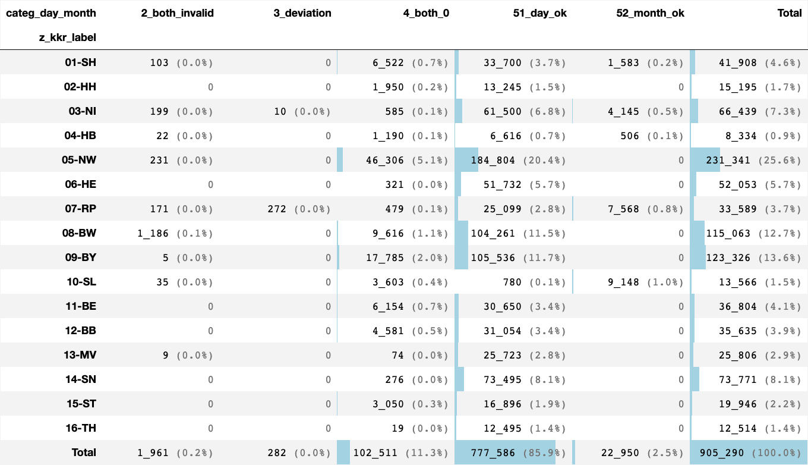
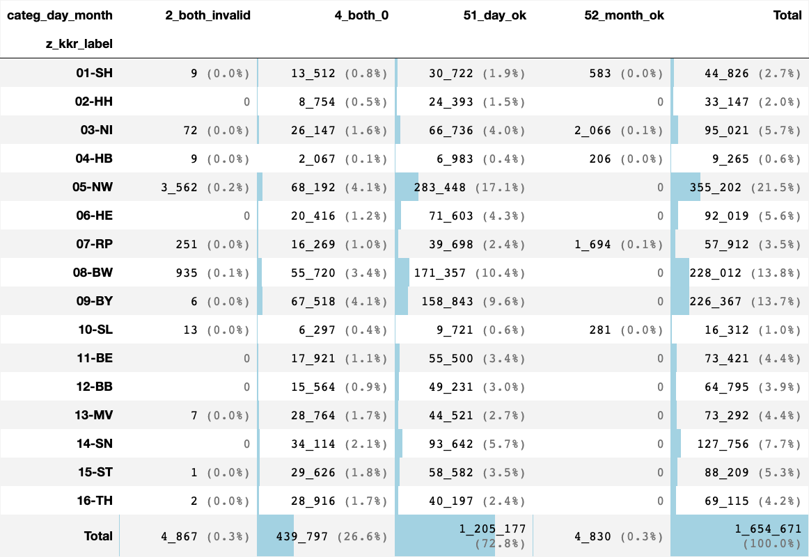
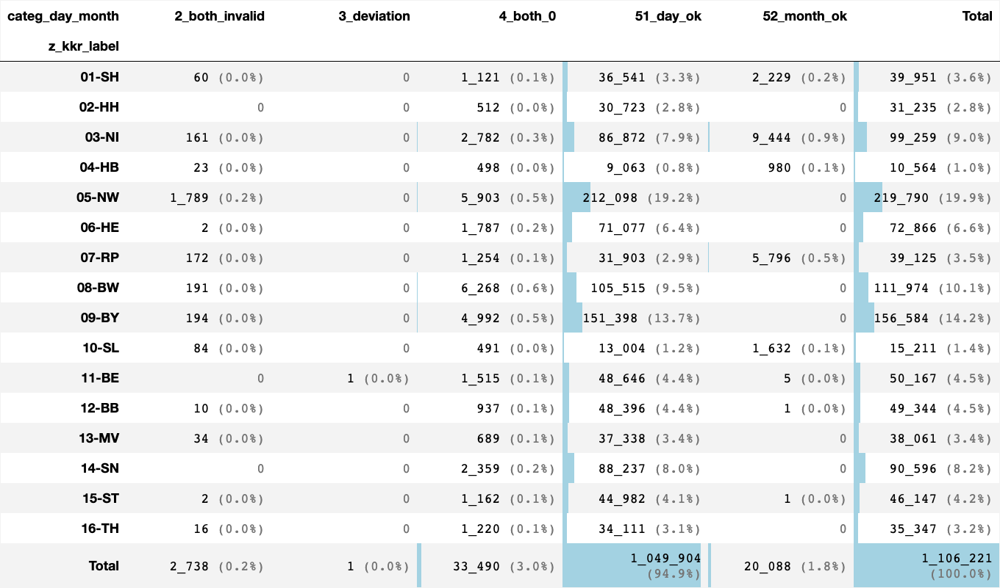
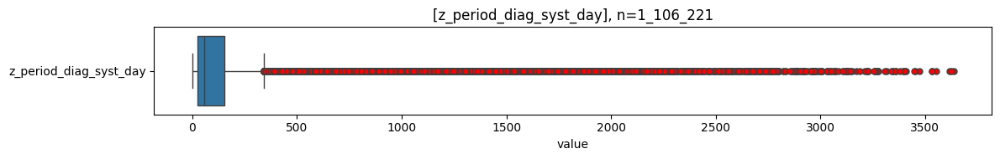
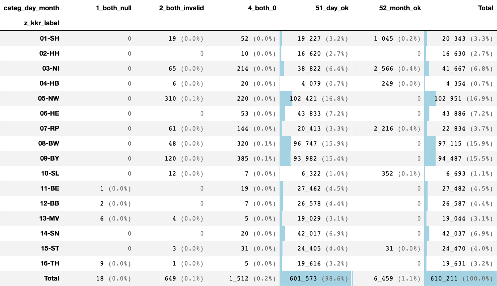
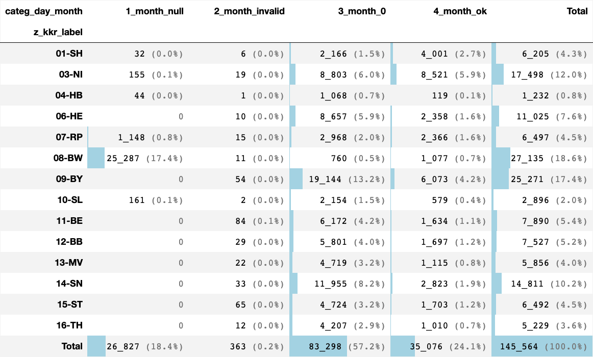
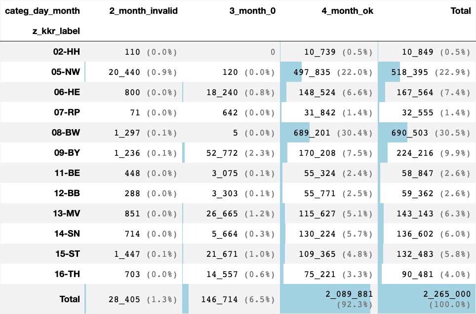

# [date periods](#toc0_)
- **🎯 Ziel**
  - Bilden von berechneten z_ Variablen für Zeitabstände durch Zusammenführung und Fehlerausschluss bei mehreren Abstandsangaben
    - _Tagesabstand_ wird jeweils gebildet aus z.B. `Anzahl_Tage_Diagnose_OP`
    - _Datumsangaben_ werden jeweils gebildet aus der Differenz zwischen Diagnosedatum und z.B. `Datum_OP`
  - z_ Variablen gebildet aus Tagesabstand und Datumsangaben
    - `z_period_diag_death_day`
    - `z_period_diag_op_day`
    - `z_period_diag_syst_day`
    - `z_period_diag_be_day`
  - z_ Variablen gebildet aus Datumsangaben
    - `z_period_diag_psa_day`
    - `z_period_diag_fo_day`
  - zur Visualisierung werden folgende Analysen berücksichtigt
    - _Tagesabstand vs Datumsangaben_
      - Vergleich der Konstellationen in den Daten, welche Variablen jeweils vorhanden bzw. fehlend sind
    - _Tagesabstand_
      - Vergleich von gruppierten Tagesabständen
    - _Kategorien_
      - Vergleich von Kombinationen von Tagesabstand und Datumsangaben
      - diese verdeutlichen, welche Wirkung die Bildung der z_ Variable hat

- **⚖️ Zusammenfassung**
  - Datumsangaben fehlen selten (<5% in D gesamt, aber bis ~17% in einzelnen kkr)
  - Tagesabstände sind nahezu immer vorhanden, und werden aufgrund der spezifischeren Angabe bei der Bildung der z_ Variablen bevorzugt
  - beide Angaben fehlend ist extrem selten
  - Regeln für Bildung der z_ Variablen
    - ungültig sind
      - Datum vor `1970-01-01`
      - negative Abstände bei Tagen oder Datum (Ausnahme PSA)
      - Abstände > `10 Jahre` für Therapien, > `100 Jahre` bei Vitalstatus
      - geschätzte Datumsangaben (`M`, `V`)
    - Abstände von 0 Tagen sind gültig
    - wenn beide Angaben leer / ungültig -> NULL
    - bei leeren / ungültigen Tagesabstand -> Datumsangabe
    - ansonsten: Tagesabstand

**Table of contents**    
- [date periods](#toc1_)    
  - [📆 Datenstand](#toc1_1_)    
  - [Diagnose -> Tod](#toc1_2_)    
    - [Tagesabstand vs Datumsangaben](#toc1_2_1_)    
    - [Tagesabstand](#toc1_2_2_)    
    - [Kategorien](#toc1_2_3_)    
  - [Diagnose -> OP](#toc1_3_)    
    - [Tagesabstand vs Datumsangaben](#toc1_3_1_)    
    - [Tagesabstand](#toc1_3_2_)    
    - [Kategorien](#toc1_3_3_)    
  - [Diagnose -> SYST](#toc1_4_)    
    - [Tagesabstand vs Datumsangaben](#toc1_4_1_)    
    - [Tagesabstand](#toc1_4_2_)    
    - [Kategorien](#toc1_4_3_)    
  - [Diagnose -> Bestrahlung](#toc1_5_)    
    - [Tagesabstand vs Datumsangaben](#toc1_5_1_)    
    - [Tagesabstand](#toc1_5_2_)    
    - [Kategorien](#toc1_5_3_)    
  - [PSA](#toc1_6_)    
  - [Folgeereignis](#toc1_7_)    

<!-- vscode-jupyter-toc-config
	numbering=false
	anchor=true
	flat=false
	minLevel=1
	maxLevel=6
	/vscode-jupyter-toc-config -->
<!-- THIS CELL WILL BE REPLACED ON TOC UPDATE. DO NOT WRITE YOUR TEXT IN THIS CELL -->

    🐍 3.12.8 | 📦 pandas: 2.3.3 | 📦 numpy: 1.26.4 | 📦 duckdb: 1.4.1 | 📦 pandas-plots: 0.20.8 | 📦 connection-helper: 0.13.1

## [📆 Datenstand](#toc0_)

    sqlite db file:          2025-10-30_data_clin.duckdb
    data tag:                v2.3
    last kkr data import:    2025-09-30
    sql table created:       2025-10-30 16:25:02
    doi:                     10.18444/5.03.01.0005.0021.0001
    document created:        2025-11-07 09:33:59

## [Diagnose -> Tod](#toc0_)
- Filter: `Verstorben` = `J`
- gezählt sind Tumore
- Variablen
  - `Diagnosedatum`/`DatumVitalstatus`
  - `Anzahl_Tage_Diagnose_Tod`

### [Tagesabstand vs Datumsangaben](#toc0_)
- **Werte für Variablen zur Verteilung**
  - `1_noperiod_date` - kein Tagesabstand, aber Datumsangaben
  - `2_period_nodate` - Tagesabstand, aber keine Datumsangaben
  - `3_period_date` - Tagesabstand und Datumsangaben
  - `4_noperiod_nodate` - kein Tagesabstand, keine Datumsangaben

    

    

### [Tagesabstand](#toc0_)
- **Werte für Gruppierung nach Tagesabstand**
  - `A_<0d` - Wert negativ
  - `B_0d` - Wert ist 0
  - `C_1-365d` - Wert ist 1-365 Tage
  - `D_1-10y` - Wert ist 1-10 Jahre
  - `E_>10y` - Wert ist > 10 Jahre

    

    

    

    

    

    

    
    column                   |  count  |   min   | lower |  q25  | median |  mean  |  q75   | upper |  max   |   std    |  cv  |     sum    
    -------------------------+---------+---------+-------+-------+--------+--------+--------+-------+--------+----------+------+------------
    Anzahl_Tage_Diagnose_Tod | 877_789 | -27_320 |  -212 | 48.00 | 237.00 | 599.56 | 632.00 | 1_508 | 81_801 | 1_219.97 | 2.03 | 526_287_885
    
    
    column |  count  |   min   | lower |  q25   | median |   mean   |   q75    | upper |  max   |   std    |  cv  |     sum    
    -------+---------+---------+-------+--------+--------+----------+----------+-------+--------+----------+------+------------
    01-SH  |  40_150 |       0 |     0 |  29.00 | 193.00 |   336.30 |   527.00 | 1_274 |  1_783 |   381.00 | 1.13 |  13_502_416
    02-HH  |  15_195 |       0 |     0 |  24.00 | 113.00 |   232.92 |   346.00 |   829 |  1_424 |   283.40 | 1.22 |   3_539_175
    03-NI  |  61_903 |       0 |     0 |  72.00 | 237.00 |   353.45 |   528.00 | 1_212 |  1_752 |   352.17 | 1.00 |  21_879_714
    04-HB  |   7_786 |       0 |     0 |  25.00 | 143.00 |   287.09 |   448.75 | 1_084 |  1_688 |   338.68 | 1.18 |   2_235_289
    05-NW  | 230_941 |       0 |     0 |  28.00 | 187.00 |   333.87 |   523.00 | 1_265 |  1_847 |   383.06 | 1.15 |  77_103_307
    06-HE  |  52_053 |       0 |     0 |  84.00 | 287.00 |   560.95 |   674.00 | 1_559 | 20_880 |   905.90 | 1.61 |  29_199_049
    07-RP  |  25_580 |       0 |     0 |  57.00 | 197.00 |   309.62 |   463.00 | 1_072 |  1_857 |   324.37 | 1.05 |   7_920_133
    08-BW  | 113_669 |       0 |     0 |  55.00 | 243.00 |   373.43 |   577.00 | 1_360 |  2_043 |   391.38 | 1.05 |  42_447_082
    09-BY  | 123_325 |       0 |     0 |  43.00 | 281.00 | 1_030.24 |   880.00 | 2_135 | 81_801 | 1_963.93 | 1.91 | 127_054_702
    10-SL  |   2_711 |       0 |     0 |   0.00 |   0.00 |    34.98 |     7.50 |    18 |  1_309 |   118.27 | 3.38 |      94_829
    11-BE  |  36_804 |       0 |     0 |  24.00 | 160.00 |   374.32 |   496.00 | 1_204 | 12_262 |   625.57 | 1.67 |  13_776_593
    12-BB  |  35_635 |       0 |     0 |  38.00 | 222.00 |   894.02 |   729.00 | 1_765 | 18_846 | 1_772.39 | 1.98 |  31_858_484
    13-MV  |  25_806 | -27_320 |  -212 | 113.00 | 394.00 | 1_146.03 | 1_127.00 | 2_648 | 16_507 | 1_859.12 | 1.62 |  29_574_535
    14-SN  |  73_771 |       0 |     0 | 137.00 | 487.00 | 1_329.08 | 1_450.00 | 3_419 | 30_549 | 2_020.37 | 1.52 |  98_047_409
    15-ST  |  19_946 |       0 |     0 |  24.00 | 158.00 |   723.30 |   557.00 | 1_355 | 14_859 | 1_543.28 | 2.13 |  14_426_989
    16-TH  |  12_514 |       0 |     0 |  84.00 | 336.00 | 1_089.03 | 1_100.00 | 2_623 | 17_766 | 1_823.47 | 1.67 |  13_628_179
    

### [Kategorien](#toc0_)
- Kategorien für `categ_day_month` und deren mapping zur jeweiligen `z_` Variable (jede Kategorie impliziert, dass die vorherigen **nicht** zutreffen)
  - `1_both_null` - Datumsabstand und Tagesangaben sind beide NULL ➡️ NULL
  - `2_both_invalid` - Datumsabstand und Tagesangaben sind ungültig ➡️ NULL
  - `3_deviation` - Abweichungen zwischen Datumsabstand / Tagesangaben sind erheblich ➡️ Tagesangabe
  - `4_both_0` - Datumsabstand und Tagesangaben sind beide 0 ➡️ 0
  - `51_day_ok` - Tagesangabe ist valide ➡️ Tagesangabe
  - `52_month_ok` - Datumsabstand ist valide ➡️ Datumsabstand

    

    

    

    

## [Diagnose -> OP](#toc0_)
- Filter: keiner
- gezählt sind OP

### [Tagesabstand vs Datumsangaben](#toc0_)
- **Werte für Variablen zur Verteilung**
  - `1_noperiod_date` - kein Tagesabstand, aber Datumsangaben
  - `2_period_nodate` - Tagesabstand, aber keine Datumsangaben
  - `3_period_date` - Tagesabstand und Datumsangaben
  - `4_noperiod_nodate` - kein Tagesabstand, keine Datumsangaben

    

    

### [Tagesabstand](#toc0_)
- **Werte für Gruppierung nach Tagesabstand**
  - `A_<0d` - Wert negativ
  - `B_0d` - Wert ist 0
  - `C_1-365d` - Wert ist 1-365 Tage
  - `D_1-10y` - Wert ist 1-10 Jahre
  - `E_>10y` - Wert ist > 10 Jahre

    

    

    

    

    

    

    
    column                  |   count   | min  | lower | q25  | median | mean  |  q75  | upper |  max  |  std   |  cv  |     sum    
    ------------------------+-----------+------+-------+------+--------+-------+-------+-------+-------+--------+------+------------
    Anzahl_Tage_Diagnose_OP | 1_632_658 | -304 |   -56 | 0.00 |  26.00 | 74.88 | 65.00 |   162 | 4_835 | 163.28 | 2.18 | 122_254_917
    
    
    column |  count  | min  | lower | q25  | median | mean  |  q75  | upper |  max  |  std   |  cv  |    sum    
    -------+---------+------+-------+------+--------+-------+-------+-------+-------+--------+------+-----------
    01     |  44_153 |    0 |     0 | 0.00 |  20.00 | 39.21 | 46.00 |   115 | 1_498 |  59.89 | 1.53 |  1_731_156
    02     |  33_147 |    0 |     0 | 0.00 |  22.00 | 77.09 | 61.00 |   152 | 2_204 | 169.17 | 2.19 |  2_555_286
    03     |  92_380 |    0 |     0 | 0.00 |  22.00 | 47.08 | 55.00 |   137 | 1_635 |  76.37 | 1.62 |  4_348_967
    04     |   9_001 |    0 |     0 | 3.00 |  25.00 | 42.04 | 49.00 |   118 |   384 |  57.03 | 1.36 |    378_417
    05     | 344_903 |    0 |     0 | 8.00 |  31.00 | 92.92 | 81.00 |   190 | 1_812 | 183.44 | 1.97 | 32_049_246
    06     |  92_019 |    0 |     0 | 3.00 |  26.00 | 70.56 | 61.00 |   148 | 3_448 | 166.10 | 2.35 |  6_493_018
    07     |  55_139 |    0 |     0 | 0.00 |  23.00 | 50.58 | 51.00 |   127 | 1_649 |  98.22 | 1.94 |  2_788_909
    08     | 223_074 |    0 |     0 | 2.00 |  31.00 | 91.13 | 78.00 |   192 | 1_996 | 187.00 | 2.05 | 20_328_089
    09     | 226_364 |    0 |     0 | 0.00 |  25.00 | 65.13 | 61.00 |   152 | 4_835 | 134.19 | 2.06 | 14_743_943
    10     |  15_891 |    0 |     0 | 0.00 |  13.00 | 35.94 | 38.00 |    95 | 1_080 |  65.85 | 1.83 |    571_103
    11     |  73_421 |    0 |     0 | 1.00 |  29.00 | 74.31 | 71.00 |   176 | 1_619 | 143.70 | 1.93 |  5_455_929
    12     |  64_795 |    0 |     0 | 1.00 |  28.00 | 75.85 | 71.00 |   176 | 1_724 | 149.43 | 1.97 |  4_914_771
    13     |  73_292 | -304 |   -56 | 0.00 |  15.00 | 70.74 | 53.00 |   132 | 2_702 | 186.60 | 2.64 |  5_184_965
    14     | 127_756 |    0 |     0 | 0.00 |  28.00 | 81.02 | 72.00 |   180 | 1_799 | 167.22 | 2.06 | 10_350_569
    15     |  88_209 |    0 |     0 | 0.00 |  15.00 | 64.46 | 52.00 |   130 | 3_656 | 179.19 | 2.78 |  5_685_939
    16     |  69_114 |    0 |     0 | 0.00 |   7.00 | 67.64 | 45.00 |   112 | 3_770 | 204.89 | 3.03 |  4_674_610
    

### [Kategorien](#toc0_)
- Kategorien für `categ_day_month` und deren mapping zur jeweiligen `z_` Variable (jede Kategorie impliziert, dass die vorherigen **nicht** zutreffen)
  - `1_both_null` - Datumsabstand und Tagesangaben sind beide NULL ➡️ NULL
  - `2_both_invalid` - Datumsabstand und Tagesangaben sind ungültig ➡️ NULL
  - `3_deviation` - Abweichungen zwischen Datumsabstand / Tagesangaben sind erheblich ➡️ Tagesangabe
  - `4_both_0` - Datumsabstand und Tagesangaben sind beide 0 ➡️ 0
  - `51_day_ok` - Tagesangabe ist valide ➡️ Tagesangabe
  - `52_month_ok` - Datumsabstand ist valide ➡️ Datumsabstand

    

    

    

    

    

    

    
    column               |   count   | min | lower |  q25  | median |  mean  |  q75   | upper |  max  |   std   |  cv   |     sum    
    ---------------------+-----------+-----+-------+-------+--------+--------+--------+-------+-------+---------+-------+------------
    z_period_diag_op_day | 1_649_804 |   0 |     0 | 0.000 | 26.000 | 74.369 | 64.000 |   160 | 3_648 | 162.508 | 2.185 | 122_694_977
    

## [Diagnose -> SYST](#toc0_)
- Filter: keiner
- gezählt sind SYST

### [Tagesabstand vs Datumsangaben](#toc0_)
- **Werte für Variablen zur Verteilung**
  - `1_noperiod_date` - kein Tagesabstand, aber Datumsangaben
  - `2_period_nodate` - Tagesabstand, aber keine Datumsangaben
  - `3_period_date` - Tagesabstand und Datumsangaben
  - `4_noperiod_nodate` - kein Tagesabstand, keine Datumsangaben

    

    

### [Tagesabstand](#toc0_)
- **Werte für Gruppierung nach Tagesabstand**
  - `A_<0d` - Wert negativ
  - `B_0d` - Wert ist 0
  - `C_1-365d` - Wert ist 1-365 Tage
  - `D_1-10y` - Wert ist 1-10 Jahre
  - `E_>10y` - Wert ist > 10 Jahre

    

    

    

    

    

    

    
    column                    |   count   |  min   | lower |  q25  | median |  mean  |  q75   | upper |  max  |  std   |  cv  |     sum    
    --------------------------+-----------+--------+-------+-------+--------+--------+--------+-------+-------+--------+------+------------
    Anzahl_Tage_Diagnose_SYST | 1_079_570 | -1_772 |  -139 | 27.00 |  57.00 | 144.63 | 154.00 |   344 | 4_275 | 227.24 | 1.57 | 156_140_617
    
    
    column |  count  |  min   | lower |  q25  | median |  mean  |  q75   | upper |  max  |  std   |  cv  |    sum    
    -------+---------+--------+-------+-------+--------+--------+--------+-------+-------+--------+------+-----------
    01     |  37_388 |      0 |     0 | 23.00 |  48.00 | 111.69 | 105.00 |   228 | 1_637 | 184.84 | 1.65 |  4_176_042
    02     |  31_235 |      0 |     0 | 29.00 |  66.00 | 193.25 | 241.00 |   559 | 1_758 | 272.75 | 1.41 |  6_036_248
    03     |  88_237 |      0 |     0 | 27.00 |  49.00 | 107.14 | 100.00 |   209 | 1_724 | 173.22 | 1.62 |  9_453_875
    04     |   9_260 |      0 |     0 | 27.00 |  48.00 | 106.23 |  96.00 |   199 | 1_611 | 172.78 | 1.63 |    983_655
    05     | 217_395 |      0 |     0 | 30.00 |  63.00 | 161.04 | 185.00 |   417 | 1_834 | 235.35 | 1.46 | 35_009_328
    06     |  72_866 |      0 |     0 | 28.00 |  61.00 | 146.82 | 164.75 |   369 | 4_275 | 239.67 | 1.63 | 10_698_421
    07     |  32_535 |      0 |     0 | 29.00 |  59.00 | 114.59 | 127.00 |   274 | 1_763 | 160.67 | 1.40 |  3_728_076
    08     | 111_460 |      0 |     0 | 20.00 |  41.00 |  87.99 |  80.00 |   170 | 1_977 | 169.25 | 1.92 |  9_806_842
    09     | 156_389 |      0 |     0 | 27.00 |  62.00 | 151.75 | 184.00 |   419 | 1_844 | 218.90 | 1.44 | 23_731_802
    10     |  13_195 |      0 |     0 | 27.00 |  47.00 |  92.18 |  88.00 |   179 | 1_350 | 136.12 | 1.48 |  1_216_308
    11     |  50_162 |      0 |     0 | 24.00 |  56.00 | 142.80 | 162.00 |   369 | 2_201 | 211.74 | 1.48 |  7_163_069
    12     |  49_333 |      0 |     0 | 27.00 |  61.00 | 152.81 | 175.00 |   397 | 1_778 | 224.39 | 1.47 |  7_538_602
    13     |  38_041 | -1_772 |  -208 | 31.00 |  74.00 | 185.04 | 210.00 |   478 | 2_836 | 278.08 | 1.50 |  7_039_191
    14     |  90_596 |      0 |     0 | 29.00 |  70.00 | 170.76 | 204.00 |   466 | 1_758 | 244.46 | 1.43 | 15_469_750
    15     |  46_146 |      0 |     0 | 28.00 |  65.00 | 174.58 | 185.00 |   420 | 3_797 | 301.10 | 1.72 |  8_056_379
    16     |  35_332 |      0 |     0 | 27.00 |  61.00 | 170.75 | 182.00 |   414 | 3_737 | 292.21 | 1.71 |  6_033_029
    

### [Kategorien](#toc0_)
- Kategorien für `categ_day_month` und deren mapping zur jeweiligen `z_` Variable (jede Kategorie impliziert, dass die vorherigen **nicht** zutreffen)
  - `1_both_null` - Datumsabstand und Tagesangaben sind beide NULL ➡️ NULL
  - `2_both_invalid` - Datumsabstand und Tagesangaben sind ungültig ➡️ NULL
  - `3_deviation` - Abweichungen zwischen Datumsabstand / Tagesangaben sind erheblich ➡️ Tagesangabe
  - `4_both_0` - Datumsabstand und Tagesangaben sind beide 0 ➡️ 0
  - `51_day_ok` - Tagesangabe ist valide ➡️ Tagesangabe
  - `52_month_ok` - Datumsabstand ist valide ➡️ Datumsabstand

    

    

    

    

    

    

    
    column                 |   count   | min | lower |  q25   | median |  mean   |   q75   | upper |  max  |   std   |  cv   |     sum    
    -----------------------+-----------+-----+-------+--------+--------+---------+---------+-------+-------+---------+-------+------------
    z_period_diag_syst_day | 1_103_483 |   0 |     0 | 27.000 | 57.000 | 143.982 | 153.000 |   342 | 3_636 | 226.106 | 1.570 | 158_882_159
    

## [Diagnose -> Bestrahlung](#toc0_)
- Filter: keiner
- gezählt sind Teilbestrahlungen

### [Tagesabstand vs Datumsangaben](#toc0_)
- **Werte für Variablen zur Verteilung**
  - `1_noperiod_date` - kein Tagesabstand, aber Datumsangaben
  - `2_period_nodate` - Tagesabstand, aber keine Datumsangaben
  - `3_period_date` - Tagesabstand und Datumsangaben
  - `4_noperiod_nodate` - kein Tagesabstand, keine Datumsangaben

    

    

### [Tagesabstand](#toc0_)
- **Werte für Gruppierung nach Tagesabstand**
  - `A_<0d` - Wert negativ
  - `B_0d` - Wert ist 0
  - `C_1-365d` - Wert ist 1-365 Tage
  - `D_1-10y` - Wert ist 1-10 Jahre
  - `E_>10y` - Wert ist > 10 Jahre

    

    

    

    

    

    

    
    column                  |  count  | min  | lower |  q25  | median |  mean  |  q75   | upper |  max  |  std   |  cv  |     sum    
    ------------------------+---------+------+-------+-------+--------+--------+--------+-------+-------+--------+------+------------
    Anzahl_Tage_Diagnose_ST | 602_718 | -339 |   -27 | 52.00 |  92.00 | 177.71 | 227.00 |   489 | 3_782 | 227.51 | 1.28 | 107_111_215
    
    
    column |  count  |   min   |  lower  |  q25  | median |  mean  |  q75   | upper  |   max    |  std   |  cv  |      sum     
    -------+---------+---------+---------+-------+--------+--------+--------+--------+----------+--------+------+--------------
    01     |  19_257 |    0.00 |    0.00 | 52.00 |  85.00 | 144.28 | 182.00 | 377.00 | 1_519.00 | 168.12 | 1.17 |  2_778_428.00
    02     |  16_630 |    0.00 |    0.00 | 59.00 | 105.00 | 201.91 | 250.00 | 535.00 | 1_814.00 | 246.49 | 1.22 |  3_357_732.00
    03     |  38_892 |    0.00 |    0.00 | 54.00 |  89.00 | 145.43 | 193.00 | 401.00 | 1_700.00 | 164.06 | 1.13 |  5_656_103.00
    04     |   4_089 |    0.00 |    0.00 | 52.00 |  90.00 | 143.12 | 196.00 | 412.00 | 1_447.00 | 154.34 | 1.08 |    585_223.00
    05     | 102_583 |    0.00 |    0.00 | 49.00 |  88.00 | 171.77 | 215.00 | 464.00 | 1_779.00 | 218.63 | 1.27 | 17_620_436.00
    06     |  43_886 |    0.00 |    0.00 | 50.00 |  89.00 | 155.94 | 195.00 | 412.00 | 3_259.00 | 208.48 | 1.34 |  6_843_382.00
    07     |  20_459 |    0.00 |    0.00 | 54.00 |  88.00 | 148.09 | 198.00 | 414.00 | 1_715.00 | 169.86 | 1.15 |  3_029_680.00
    08     |  97_032 |    0.00 |    0.00 | 56.00 | 103.00 | 211.54 | 252.00 | 546.00 | 2_056.00 | 272.34 | 1.29 | 20_525_683.00
    09     |  94_367 |    0.00 |    0.00 | 48.00 |  90.00 | 175.22 | 229.00 | 500.00 | 1_721.00 | 217.95 | 1.24 | 16_534_853.00
    10     |   6_323 |    0.00 |    0.00 | 49.00 |  77.00 | 131.87 | 169.00 | 349.00 | 1_311.00 | 140.66 | 1.07 |    833_838.00
    11     |  27_481 |    0.00 |    0.00 | 48.00 |  88.00 | 171.63 | 231.00 | 505.00 | 1_773.00 | 212.03 | 1.24 |  4_716_448.00
    12     |  26_585 |    0.00 |    0.00 | 48.00 |  91.00 | 175.74 | 236.00 | 518.00 | 1_684.00 | 214.97 | 1.22 |  4_672_145.00
    13     |  19_037 | -339.00 | -218.00 | 56.00 |  96.00 | 197.69 | 248.00 | 536.00 | 2_488.00 | 261.92 | 1.32 |  3_763_475.00
    14     |  42_037 |    0.00 |    0.00 | 59.00 | 110.00 | 196.62 | 249.00 | 534.00 | 1_753.00 | 233.18 | 1.19 |  8_265_128.00
    15     |  24_438 |    0.00 |    0.00 | 45.00 |  84.00 | 174.90 | 223.00 | 490.00 | 3_782.00 | 255.55 | 1.46 |  4_274_282.00
    16     |  19_622 |    0.00 |    0.00 | 54.00 |  95.00 | 186.24 | 233.75 | 503.00 | 3_777.00 | 264.37 | 1.42 |  3_654_379.00
    

### [Kategorien](#toc0_)
- Kategorien für `categ_day_month` und deren mapping zur jeweiligen `z_` Variable (jede Kategorie impliziert, dass die vorherigen **nicht** zutreffen)
  - `1_both_null` - Datumsabstand und Tagesangaben sind beide NULL ➡️ NULL
  - `2_both_invalid` - Datumsabstand und Tagesangaben sind ungültig ➡️ NULL
  - `3_deviation` - Abweichungen zwischen Datumsabstand / Tagesangaben sind erheblich ➡️ Tagesangabe
  - `4_both_0` - Datumsabstand und Tagesangaben sind beide 0 ➡️ 0
  - `51_day_ok` - Tagesangabe ist valide ➡️ Tagesangabe
  - `52_month_ok` - Datumsabstand ist valide ➡️ Datumsabstand

    

    

    

    

    

    

    
    column               |  count  | min | lower |  q25   | median |  mean   |   q75   | upper |  max  |   std   |  cv   |     sum    
    ---------------------+---------+-----+-------+--------+--------+---------+---------+-------+-------+---------+-------+------------
    z_period_diag_be_day | 609_544 |   0 |     0 | 52.000 | 92.000 | 177.420 | 226.000 |   487 | 3_500 | 226.954 | 1.279 | 108_145_211
    

## [PSA](#toc0_)
- DatumPSA vor Diagnose is zulässig, somit auch negative Datumsabstände

- Kategorien für `categ_day_month` und deren mapping zur jeweiligen `z_` Variable (jede Kategorie impliziert, dass die vorherigen **nicht** zutreffen)
  - `1_month_null` - Datumsabstand NULL ➡️ NULL
  - `2_month_invalid` - Datumsabstand ungültig ➡️ NULL (negative Werte sind gültig)
  - `3_month_0` - Datumsabstand 0 ➡️ 0
  - `4_month_ok` - Datumsabstand valide ➡️ Datumsabstand

    

    

    

    

    

    

    
    column                |  count  |  min   | lower |  q25  | median |  mean   |  q75  | upper |  max  |   std   |   cv    |    sum    
    ----------------------+---------+--------+-------+-------+--------+---------+-------+-------+-------+---------+---------+-----------
    z_period_diag_psa_day | 118_374 | -3_623 |     0 | 0.000 |  0.000 | -11.248 | 0.000 |     0 | 1_947 | 134.060 | -11.919 | -1_331_423
    

## [Folgeereignis](#toc0_)
- Kategorien für `categ_day_month` und deren mapping zur jeweiligen `z_` Variable (jede Kategorie impliziert, dass die vorherigen **nicht** zutreffen)
  - `1_month_null` - Datumsabstand NULL ➡️ NULL
  - `2_month_invalid` - Datumsabstand ungültig ➡️ NULL
  - `3_month_0` - Datumsabstand 0 ➡️ 0
  - `4_month_ok` - Datumsabstand valide ➡️ Datumsabstand

    

    

    

    

    

    

    
    column               |   count   | min | lower |   q25   | median  |  mean   |   q75   | upper |  max  |   std   |  cv   |      sum     
    ---------------------+-----------+-----+-------+---------+---------+---------+---------+-------+-------+---------+-------+--------------
    z_period_diag_fo_day | 2_236_595 |   0 |     0 | 183.000 | 393.000 | 480.916 | 700.000 | 1_461 | 3_624 | 399.063 | 0.830 | 1_075_614_089
    

