# [date periods](#toc0_)
- **🎯 Ziel**
  - Bilden von berechneten z_ Variablen für Zeitabstände durch Zusammenführung und Fehlerausschluss bei mehreren Abstandsangaben
    - _Tagesabstand_ wird jeweils gebildet aus z.B. `Anzahl_Tage_Diagnose_OP`
    - _Datumsangaben_ werden jeweils gebildet aus der Differenz zwischen Diagnosedatum und z.B. `Datum_OP`
  - z_ Variablen gebildet aus Tagesabstand und Datumsangaben
    - `z_period_diag_death_day`
    - `z_period_diag_op_day`
    - `z_period_diag_syst_day`
    - `z_period_diag_be_day`
  - z_ Variablen gebildet aus Datumsangaben
    - `z_period_diag_psa_day`
    - `z_period_diag_fo_day`
  - zur Visualisierung werden folgende Analysen berücksichtigt
    - _Tagesabstand vs Datumsangaben_
      - Vergleich der Konstellationen in den Daten, welche Variablen jeweils vorhanden bzw. fehlend sind
    - _Tagesabstand_
      - Vergleich von gruppierten Tagesabständen
    - _Kategorien_
      - Vergleich von Kombinationen von Tagesabstand und Datumsangaben
      - diese verdeutlichen, welche Wirkung die Bildung der z_ Variable hat

- **⚖️ Zusammenfassung**
  - Datumsangaben fehlen selten (<5% in D gesamt, aber bis ~17% in einzelnen kkr)
  - Tagesabstände sind nahezu immer vorhanden, und werden aufgrund der spezifischeren Angabe bei der Bildung der z_ Variablen bevorzugt
  - beide Angaben fehlend ist extrem selten
  - Regeln für Bildung der z_ Variablen
    - ungültig sind
      - Datum vor `1970-01-01`
      - negative Abstände bei Tagen oder Datum (Ausnahme PSA)
      - Abstände > `10 Jahre` für Therapien, > `100 Jahre` bei Vitalstatus
      - geschätzte Datumsangaben (`M`, `V`)
    - Abstände von 0 Tagen sind gültig
    - wenn beide Angaben leer / ungültig -> NULL
    - bei leeren / ungültigen Tagesabstand -> Datumsangabe
    - ansonsten: Tagesabstand

**Table of contents**    
- [date periods](#toc1_)    
  - [📆 Datenstand](#toc1_1_)    
  - [Diagnose -> Tod](#toc1_2_)    
    - [Tagesabstand vs Datumsangaben](#toc1_2_1_)    
    - [Tagesabstand](#toc1_2_2_)    
    - [Kategorien](#toc1_2_3_)    
  - [Diagnose -> OP](#toc1_3_)    
    - [Tagesabstand vs Datumsangaben](#toc1_3_1_)    
    - [Tagesabstand](#toc1_3_2_)    
    - [Kategorien](#toc1_3_3_)    
  - [Diagnose -> SYST](#toc1_4_)    
    - [Tagesabstand vs Datumsangaben](#toc1_4_1_)    
    - [Tagesabstand](#toc1_4_2_)    
    - [Kategorien](#toc1_4_3_)    
  - [Diagnose -> Bestrahlung](#toc1_5_)    
    - [Tagesabstand vs Datumsangaben](#toc1_5_1_)    
    - [Tagesabstand](#toc1_5_2_)    
    - [Kategorien](#toc1_5_3_)    
  - [PSA](#toc1_6_)    
  - [Folgeereignis](#toc1_7_)    

<!-- vscode-jupyter-toc-config
	numbering=false
	anchor=true
	flat=false
	minLevel=1
	maxLevel=6
	/vscode-jupyter-toc-config -->
<!-- THIS CELL WILL BE REPLACED ON TOC UPDATE. DO NOT WRITE YOUR TEXT IN THIS CELL -->

    🐍 3.12.8 | 📦 pandas: 2.3.3 | 📦 numpy: 1.26.4 | 📦 duckdb: 1.4.1 | 📦 pandas-plots: 0.20.4 | 📦 connection-helper: 0.13.1

## [📆 Datenstand](#toc0_)

    sqlite db file:          2025-10-20_data_clin.duckdb
    data tag:                v2.3
    last kkr data import:    2025-09-30
    sql table created:       2025-10-20 18:49:45
    doi:                     10.18444/5.03.01.0005.0021.0001
    document created:        2025-10-31 14:02:04

## [Diagnose -> Tod](#toc0_)
- Filter: `Verstorben` = `J`
- gezählt sind Tumore
- Variablen
  - `Diagnosedatum`/`DatumVitalstatus`
  - `Anzahl_Tage_Diagnose_Tod`

### [Tagesabstand vs Datumsangaben](#toc0_)
- **Werte für Variablen zur Verteilung**
  - `1_noperiod_date` - kein Tagesabstand, aber Datumsangaben
  - `2_period_nodate` - Tagesabstand, aber keine Datumsangaben
  - `3_period_date` - Tagesabstand und Datumsangaben
  - `4_noperiod_nodate` - kein Tagesabstand, keine Datumsangaben

    
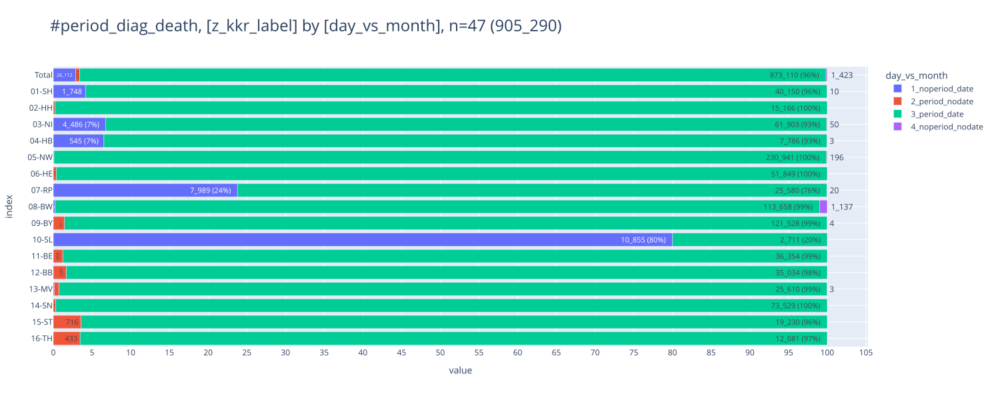
    

### [Tagesabstand](#toc0_)
- **Werte für Gruppierung nach Tagesabstand**
  - `A_<0d` - Wert negativ
  - `B_0d` - Wert ist 0
  - `C_1-365d` - Wert ist 1-365 Tage
  - `D_1-10y` - Wert ist 1-10 Jahre
  - `E_>10y` - Wert ist > 10 Jahre

    
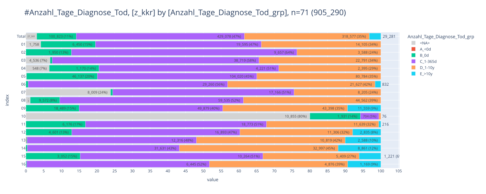
    

    
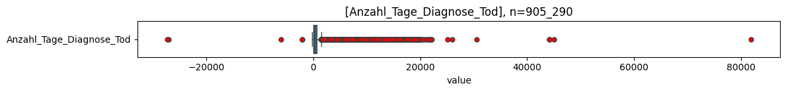
    

    
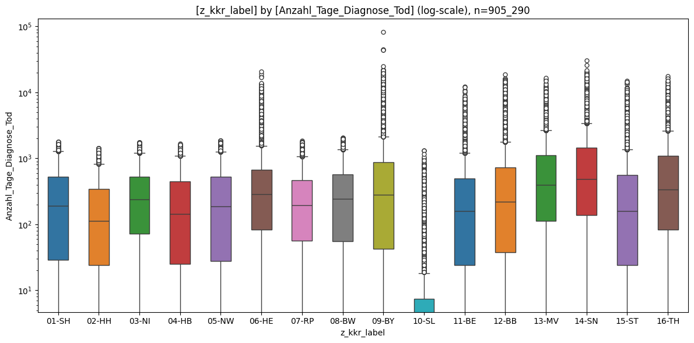
    

    
    column                   |  count  |   min   | lower |  q25  | median |  mean  |  q75   | upper |  max   |   std    |  cv  |     sum    
    -------------------------+---------+---------+-------+-------+--------+--------+--------+-------+--------+----------+------+------------
    Anzahl_Tage_Diagnose_Tod | 877_789 | -27_320 |  -212 | 48.00 | 237.00 | 599.56 | 632.00 | 1_508 | 81_801 | 1_219.97 | 2.03 | 526_287_885
    

    
    column |  count  |   min   | lower |  q25   | median |   mean   |   q75    | upper |  max   |   std    |  cv  |     sum    
    -------+---------+---------+-------+--------+--------+----------+----------+-------+--------+----------+------+------------
    01-SH  |  40_150 |       0 |     0 |  29.00 | 193.00 |   336.30 |   527.00 | 1_274 |  1_783 |   381.00 | 1.13 |  13_502_416
    02-HH  |  15_195 |       0 |     0 |  24.00 | 113.00 |   232.92 |   346.00 |   829 |  1_424 |   283.40 | 1.22 |   3_539_175
    03-NI  |  61_903 |       0 |     0 |  72.00 | 237.00 |   353.45 |   528.00 | 1_212 |  1_752 |   352.17 | 1.00 |  21_879_714
    04-HB  |   7_786 |       0 |     0 |  25.00 | 143.00 |   287.09 |   448.75 | 1_084 |  1_688 |   338.68 | 1.18 |   2_235_289
    05-NW  | 230_941 |       0 |     0 |  28.00 | 187.00 |   333.87 |   523.00 | 1_265 |  1_847 |   383.06 | 1.15 |  77_103_307
    06-HE  |  52_053 |       0 |     0 |  84.00 | 287.00 |   560.95 |   674.00 | 1_559 | 20_880 |   905.90 | 1.61 |  29_199_049
    07-RP  |  25_580 |       0 |     0 |  57.00 | 197.00 |   309.62 |   463.00 | 1_072 |  1_857 |   324.37 | 1.05 |   7_920_133
    08-BW  | 113_669 |       0 |     0 |  55.00 | 243.00 |   373.43 |   577.00 | 1_360 |  2_043 |   391.38 | 1.05 |  42_447_082
    09-BY  | 123_325 |       0 |     0 |  43.00 | 281.00 | 1_030.24 |   880.00 | 2_135 | 81_801 | 1_963.93 | 1.91 | 127_054_702
    10-SL  |   2_711 |       0 |     0 |   0.00 |   0.00 |    34.98 |     7.50 |    18 |  1_309 |   118.27 | 3.38 |      94_829
    11-BE  |  36_804 |       0 |     0 |  24.00 | 160.00 |   374.32 |   496.00 | 1_204 | 12_262 |   625.57 | 1.67 |  13_776_593
    12-BB  |  35_635 |       0 |     0 |  38.00 | 222.00 |   894.02 |   729.00 | 1_765 | 18_846 | 1_772.39 | 1.98 |  31_858_484
    13-MV  |  25_806 | -27_320 |  -212 | 113.00 | 394.00 | 1_146.03 | 1_127.00 | 2_648 | 16_507 | 1_859.12 | 1.62 |  29_574_535
    14-SN  |  73_771 |       0 |     0 | 137.00 | 487.00 | 1_329.08 | 1_450.00 | 3_419 | 30_549 | 2_020.37 | 1.52 |  98_047_409
    15-ST  |  19_946 |       0 |     0 |  24.00 | 158.00 |   723.30 |   557.00 | 1_355 | 14_859 | 1_543.28 | 2.13 |  14_426_989
    16-TH  |  12_514 |       0 |     0 |  84.00 | 336.00 | 1_089.03 | 1_100.00 | 2_623 | 17_766 | 1_823.47 | 1.67 |  13_628_179
    

### [Kategorien](#toc0_)
- Kategorien für `categ_day_month` und deren mapping zur jeweiligen `z_` Variable (jede Kategorie impliziert, dass die vorherigen **nicht** zutreffen)
  - `1_both_null` - Datumsabstand und Tagesangaben sind beide NULL ➡️ NULL
  - `2_both_invalid` - Datumsabstand und Tagesangaben sind ungültig ➡️ NULL
  - `3_deviation` - Abweichungen zwischen Datumsabstand / Tagesangaben sind erheblich ➡️ Tagesangabe
  - `4_both_0` - Datumsabstand und Tagesangaben sind beide 0 ➡️ 0
  - `51_day_ok` - Tagesangabe ist valide ➡️ Tagesangabe
  - `52_month_ok` - Datumsabstand ist valide ➡️ Datumsabstand

    
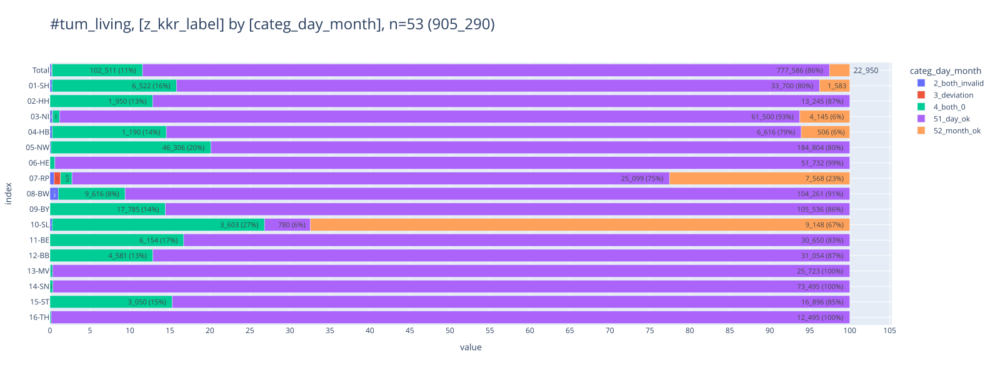
    

<table id="T_e6cc8">
  <thead>
    <tr>
      <th class="index_name level0" >categ_day_month</th>
      <th id="T_e6cc8_level0_col0" class="col_heading level0 col0" >2_both_invalid</th>
      <th id="T_e6cc8_level0_col1" class="col_heading level0 col1" >3_deviation</th>
      <th id="T_e6cc8_level0_col2" class="col_heading level0 col2" >4_both_0</th>
      <th id="T_e6cc8_level0_col3" class="col_heading level0 col3" >51_day_ok</th>
      <th id="T_e6cc8_level0_col4" class="col_heading level0 col4" >52_month_ok</th>
      <th id="T_e6cc8_level0_col5" class="col_heading level0 col5" >Total</th>
    </tr>
    <tr>
      <th class="index_name level0" >z_kkr_label</th>
      <th class="blank col0" >&nbsp;</th>
      <th class="blank col1" >&nbsp;</th>
      <th class="blank col2" >&nbsp;</th>
      <th class="blank col3" >&nbsp;</th>
      <th class="blank col4" >&nbsp;</th>
      <th class="blank col5" >&nbsp;</th>
    </tr>
  </thead>
  <tbody>
    <tr>
      <th id="T_e6cc8_level0_row0" class="row_heading level0 row0" >01-SH</th>
      <td id="T_e6cc8_row0_col0" class="data row0 col0" >103 (0.0%) </td>
      <td id="T_e6cc8_row0_col1" class="data row0 col1" >0 </td>
      <td id="T_e6cc8_row0_col2" class="data row0 col2" >6_522 (0.7%) </td>
      <td id="T_e6cc8_row0_col3" class="data row0 col3" >33_700 (3.7%) </td>
      <td id="T_e6cc8_row0_col4" class="data row0 col4" >1_583 (0.2%) </td>
      <td id="T_e6cc8_row0_col5" class="data row0 col5" >41_908 (4.6%) </td>
    </tr>
    <tr>
      <th id="T_e6cc8_level0_row1" class="row_heading level0 row1" >02-HH</th>
      <td id="T_e6cc8_row1_col0" class="data row1 col0" >0 </td>
      <td id="T_e6cc8_row1_col1" class="data row1 col1" >0 </td>
      <td id="T_e6cc8_row1_col2" class="data row1 col2" >1_950 (0.2%) </td>
      <td id="T_e6cc8_row1_col3" class="data row1 col3" >13_245 (1.5%) </td>
      <td id="T_e6cc8_row1_col4" class="data row1 col4" >0 </td>
      <td id="T_e6cc8_row1_col5" class="data row1 col5" >15_195 (1.7%) </td>
    </tr>
    <tr>
      <th id="T_e6cc8_level0_row2" class="row_heading level0 row2" >03-NI</th>
      <td id="T_e6cc8_row2_col0" class="data row2 col0" >199 (0.0%) </td>
      <td id="T_e6cc8_row2_col1" class="data row2 col1" >10 (0.0%) </td>
      <td id="T_e6cc8_row2_col2" class="data row2 col2" >585 (0.1%) </td>
      <td id="T_e6cc8_row2_col3" class="data row2 col3" >61_500 (6.8%) </td>
      <td id="T_e6cc8_row2_col4" class="data row2 col4" >4_145 (0.5%) </td>
      <td id="T_e6cc8_row2_col5" class="data row2 col5" >66_439 (7.3%) </td>
    </tr>
    <tr>
      <th id="T_e6cc8_level0_row3" class="row_heading level0 row3" >04-HB</th>
      <td id="T_e6cc8_row3_col0" class="data row3 col0" >22 (0.0%) </td>
      <td id="T_e6cc8_row3_col1" class="data row3 col1" >0 </td>
      <td id="T_e6cc8_row3_col2" class="data row3 col2" >1_190 (0.1%) </td>
      <td id="T_e6cc8_row3_col3" class="data row3 col3" >6_616 (0.7%) </td>
      <td id="T_e6cc8_row3_col4" class="data row3 col4" >506 (0.1%) </td>
      <td id="T_e6cc8_row3_col5" class="data row3 col5" >8_334 (0.9%) </td>
    </tr>
    <tr>
      <th id="T_e6cc8_level0_row4" class="row_heading level0 row4" >05-NW</th>
      <td id="T_e6cc8_row4_col0" class="data row4 col0" >231 (0.0%) </td>
      <td id="T_e6cc8_row4_col1" class="data row4 col1" >0 </td>
      <td id="T_e6cc8_row4_col2" class="data row4 col2" >46_306 (5.1%) </td>
      <td id="T_e6cc8_row4_col3" class="data row4 col3" >184_804 (20.4%) </td>
      <td id="T_e6cc8_row4_col4" class="data row4 col4" >0 </td>
      <td id="T_e6cc8_row4_col5" class="data row4 col5" >231_341 (25.6%) </td>
    </tr>
    <tr>
      <th id="T_e6cc8_level0_row5" class="row_heading level0 row5" >06-HE</th>
      <td id="T_e6cc8_row5_col0" class="data row5 col0" >0 </td>
      <td id="T_e6cc8_row5_col1" class="data row5 col1" >0 </td>
      <td id="T_e6cc8_row5_col2" class="data row5 col2" >321 (0.0%) </td>
      <td id="T_e6cc8_row5_col3" class="data row5 col3" >51_732 (5.7%) </td>
      <td id="T_e6cc8_row5_col4" class="data row5 col4" >0 </td>
      <td id="T_e6cc8_row5_col5" class="data row5 col5" >52_053 (5.7%) </td>
    </tr>
    <tr>
      <th id="T_e6cc8_level0_row6" class="row_heading level0 row6" >07-RP</th>
      <td id="T_e6cc8_row6_col0" class="data row6 col0" >171 (0.0%) </td>
      <td id="T_e6cc8_row6_col1" class="data row6 col1" >272 (0.0%) </td>
      <td id="T_e6cc8_row6_col2" class="data row6 col2" >479 (0.1%) </td>
      <td id="T_e6cc8_row6_col3" class="data row6 col3" >25_099 (2.8%) </td>
      <td id="T_e6cc8_row6_col4" class="data row6 col4" >7_568 (0.8%) </td>
      <td id="T_e6cc8_row6_col5" class="data row6 col5" >33_589 (3.7%) </td>
    </tr>
    <tr>
      <th id="T_e6cc8_level0_row7" class="row_heading level0 row7" >08-BW</th>
      <td id="T_e6cc8_row7_col0" class="data row7 col0" >1_186 (0.1%) </td>
      <td id="T_e6cc8_row7_col1" class="data row7 col1" >0 </td>
      <td id="T_e6cc8_row7_col2" class="data row7 col2" >9_616 (1.1%) </td>
      <td id="T_e6cc8_row7_col3" class="data row7 col3" >104_261 (11.5%) </td>
      <td id="T_e6cc8_row7_col4" class="data row7 col4" >0 </td>
      <td id="T_e6cc8_row7_col5" class="data row7 col5" >115_063 (12.7%) </td>
    </tr>
    <tr>
      <th id="T_e6cc8_level0_row8" class="row_heading level0 row8" >09-BY</th>
      <td id="T_e6cc8_row8_col0" class="data row8 col0" >5 (0.0%) </td>
      <td id="T_e6cc8_row8_col1" class="data row8 col1" >0 </td>
      <td id="T_e6cc8_row8_col2" class="data row8 col2" >17_785 (2.0%) </td>
      <td id="T_e6cc8_row8_col3" class="data row8 col3" >105_536 (11.7%) </td>
      <td id="T_e6cc8_row8_col4" class="data row8 col4" >0 </td>
      <td id="T_e6cc8_row8_col5" class="data row8 col5" >123_326 (13.6%) </td>
    </tr>
    <tr>
      <th id="T_e6cc8_level0_row9" class="row_heading level0 row9" >10-SL</th>
      <td id="T_e6cc8_row9_col0" class="data row9 col0" >35 (0.0%) </td>
      <td id="T_e6cc8_row9_col1" class="data row9 col1" >0 </td>
      <td id="T_e6cc8_row9_col2" class="data row9 col2" >3_603 (0.4%) </td>
      <td id="T_e6cc8_row9_col3" class="data row9 col3" >780 (0.1%) </td>
      <td id="T_e6cc8_row9_col4" class="data row9 col4" >9_148 (1.0%) </td>
      <td id="T_e6cc8_row9_col5" class="data row9 col5" >13_566 (1.5%) </td>
    </tr>
    <tr>
      <th id="T_e6cc8_level0_row10" class="row_heading level0 row10" >11-BE</th>
      <td id="T_e6cc8_row10_col0" class="data row10 col0" >0 </td>
      <td id="T_e6cc8_row10_col1" class="data row10 col1" >0 </td>
      <td id="T_e6cc8_row10_col2" class="data row10 col2" >6_154 (0.7%) </td>
      <td id="T_e6cc8_row10_col3" class="data row10 col3" >30_650 (3.4%) </td>
      <td id="T_e6cc8_row10_col4" class="data row10 col4" >0 </td>
      <td id="T_e6cc8_row10_col5" class="data row10 col5" >36_804 (4.1%) </td>
    </tr>
    <tr>
      <th id="T_e6cc8_level0_row11" class="row_heading level0 row11" >12-BB</th>
      <td id="T_e6cc8_row11_col0" class="data row11 col0" >0 </td>
      <td id="T_e6cc8_row11_col1" class="data row11 col1" >0 </td>
      <td id="T_e6cc8_row11_col2" class="data row11 col2" >4_581 (0.5%) </td>
      <td id="T_e6cc8_row11_col3" class="data row11 col3" >31_054 (3.4%) </td>
      <td id="T_e6cc8_row11_col4" class="data row11 col4" >0 </td>
      <td id="T_e6cc8_row11_col5" class="data row11 col5" >35_635 (3.9%) </td>
    </tr>
    <tr>
      <th id="T_e6cc8_level0_row12" class="row_heading level0 row12" >13-MV</th>
      <td id="T_e6cc8_row12_col0" class="data row12 col0" >9 (0.0%) </td>
      <td id="T_e6cc8_row12_col1" class="data row12 col1" >0 </td>
      <td id="T_e6cc8_row12_col2" class="data row12 col2" >74 (0.0%) </td>
      <td id="T_e6cc8_row12_col3" class="data row12 col3" >25_723 (2.8%) </td>
      <td id="T_e6cc8_row12_col4" class="data row12 col4" >0 </td>
      <td id="T_e6cc8_row12_col5" class="data row12 col5" >25_806 (2.9%) </td>
    </tr>
    <tr>
      <th id="T_e6cc8_level0_row13" class="row_heading level0 row13" >14-SN</th>
      <td id="T_e6cc8_row13_col0" class="data row13 col0" >0 </td>
      <td id="T_e6cc8_row13_col1" class="data row13 col1" >0 </td>
      <td id="T_e6cc8_row13_col2" class="data row13 col2" >276 (0.0%) </td>
      <td id="T_e6cc8_row13_col3" class="data row13 col3" >73_495 (8.1%) </td>
      <td id="T_e6cc8_row13_col4" class="data row13 col4" >0 </td>
      <td id="T_e6cc8_row13_col5" class="data row13 col5" >73_771 (8.1%) </td>
    </tr>
    <tr>
      <th id="T_e6cc8_level0_row14" class="row_heading level0 row14" >15-ST</th>
      <td id="T_e6cc8_row14_col0" class="data row14 col0" >0 </td>
      <td id="T_e6cc8_row14_col1" class="data row14 col1" >0 </td>
      <td id="T_e6cc8_row14_col2" class="data row14 col2" >3_050 (0.3%) </td>
      <td id="T_e6cc8_row14_col3" class="data row14 col3" >16_896 (1.9%) </td>
      <td id="T_e6cc8_row14_col4" class="data row14 col4" >0 </td>
      <td id="T_e6cc8_row14_col5" class="data row14 col5" >19_946 (2.2%) </td>
    </tr>
    <tr>
      <th id="T_e6cc8_level0_row15" class="row_heading level0 row15" >16-TH</th>
      <td id="T_e6cc8_row15_col0" class="data row15 col0" >0 </td>
      <td id="T_e6cc8_row15_col1" class="data row15 col1" >0 </td>
      <td id="T_e6cc8_row15_col2" class="data row15 col2" >19 (0.0%) </td>
      <td id="T_e6cc8_row15_col3" class="data row15 col3" >12_495 (1.4%) </td>
      <td id="T_e6cc8_row15_col4" class="data row15 col4" >0 </td>
      <td id="T_e6cc8_row15_col5" class="data row15 col5" >12_514 (1.4%) </td>
    </tr>
    <tr>
      <th id="T_e6cc8_level0_row16" class="row_heading level0 row16" >Total</th>
      <td id="T_e6cc8_row16_col0" class="data row16 col0" >1_961 (0.2%) </td>
      <td id="T_e6cc8_row16_col1" class="data row16 col1" >282 (0.0%) </td>
      <td id="T_e6cc8_row16_col2" class="data row16 col2" >102_511 (11.3%) </td>
      <td id="T_e6cc8_row16_col3" class="data row16 col3" >777_586 (85.9%) </td>
      <td id="T_e6cc8_row16_col4" class="data row16 col4" >22_950 (2.5%) </td>
      <td id="T_e6cc8_row16_col5" class="data row16 col5" >905_290 (100.0%) </td>
    </tr>
  </tbody>
</table>

## [Diagnose -> OP](#toc0_)
- Filter: keiner
- gezählt sind OP

### [Tagesabstand vs Datumsangaben](#toc0_)
- **Werte für Variablen zur Verteilung**
  - `1_noperiod_date` - kein Tagesabstand, aber Datumsangaben
  - `2_period_nodate` - Tagesabstand, aber keine Datumsangaben
  - `3_period_date` - Tagesabstand und Datumsangaben
  - `4_noperiod_nodate` - kein Tagesabstand, keine Datumsangaben

    
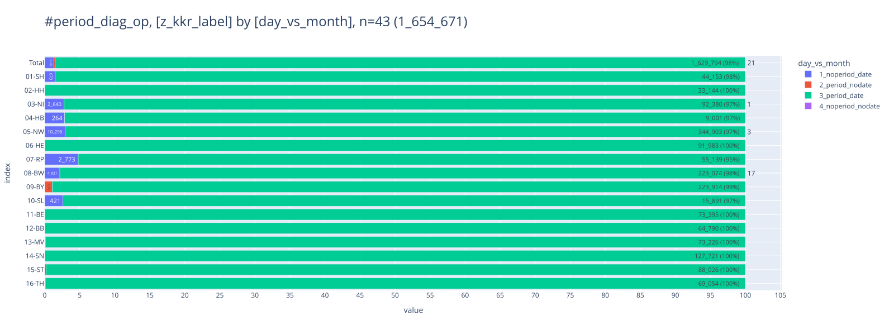
    

### [Tagesabstand](#toc0_)
- **Werte für Gruppierung nach Tagesabstand**
  - `A_<0d` - Wert negativ
  - `B_0d` - Wert ist 0
  - `C_1-365d` - Wert ist 1-365 Tage
  - `D_1-10y` - Wert ist 1-10 Jahre
  - `E_>10y` - Wert ist > 10 Jahre

    
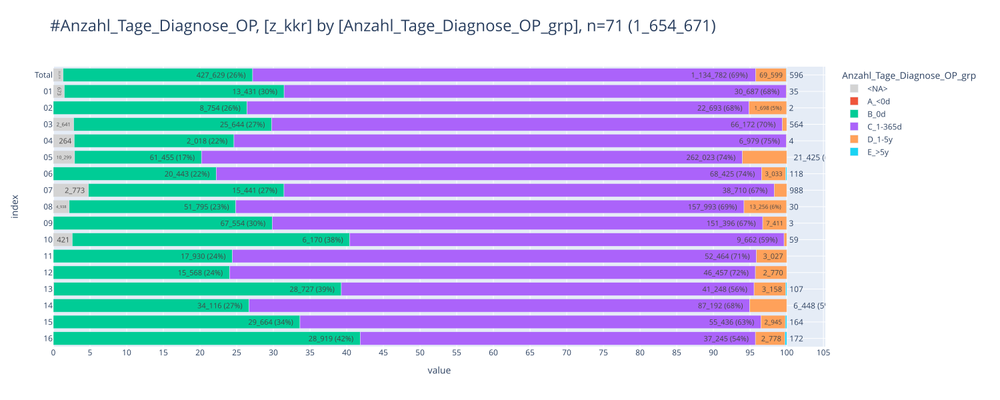
    

    
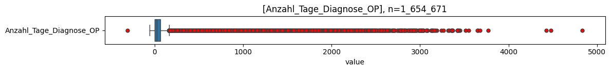
    

    
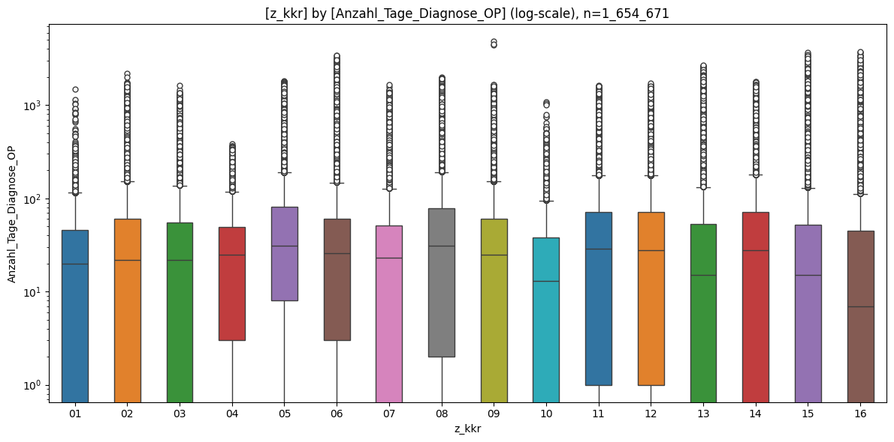
    

    
    column                  |   count   | min  | lower | q25  | median | mean  |  q75  | upper |  max  |  std   |  cv  |     sum    
    ------------------------+-----------+------+-------+------+--------+-------+-------+-------+-------+--------+------+------------
    Anzahl_Tage_Diagnose_OP | 1_632_658 | -304 |   -56 | 0.00 |  26.00 | 74.88 | 65.00 |   162 | 4_835 | 163.28 | 2.18 | 122_254_917
    

    
    column |  count  | min  | lower | q25  | median | mean  |  q75  | upper |  max  |  std   |  cv  |    sum    
    -------+---------+------+-------+------+--------+-------+-------+-------+-------+--------+------+-----------
    01     |  44_153 |    0 |     0 | 0.00 |  20.00 | 39.21 | 46.00 |   115 | 1_498 |  59.89 | 1.53 |  1_731_156
    02     |  33_147 |    0 |     0 | 0.00 |  22.00 | 77.09 | 61.00 |   152 | 2_204 | 169.17 | 2.19 |  2_555_286
    03     |  92_380 |    0 |     0 | 0.00 |  22.00 | 47.08 | 55.00 |   137 | 1_635 |  76.37 | 1.62 |  4_348_967
    04     |   9_001 |    0 |     0 | 3.00 |  25.00 | 42.04 | 49.00 |   118 |   384 |  57.03 | 1.36 |    378_417
    05     | 344_903 |    0 |     0 | 8.00 |  31.00 | 92.92 | 81.00 |   190 | 1_812 | 183.44 | 1.97 | 32_049_246
    06     |  92_019 |    0 |     0 | 3.00 |  26.00 | 70.56 | 61.00 |   148 | 3_448 | 166.10 | 2.35 |  6_493_018
    07     |  55_139 |    0 |     0 | 0.00 |  23.00 | 50.58 | 51.00 |   127 | 1_649 |  98.22 | 1.94 |  2_788_909
    08     | 223_074 |    0 |     0 | 2.00 |  31.00 | 91.13 | 78.00 |   192 | 1_996 | 187.00 | 2.05 | 20_328_089
    09     | 226_364 |    0 |     0 | 0.00 |  25.00 | 65.13 | 61.00 |   152 | 4_835 | 134.19 | 2.06 | 14_743_943
    10     |  15_891 |    0 |     0 | 0.00 |  13.00 | 35.94 | 38.00 |    95 | 1_080 |  65.85 | 1.83 |    571_103
    11     |  73_421 |    0 |     0 | 1.00 |  29.00 | 74.31 | 71.00 |   176 | 1_619 | 143.70 | 1.93 |  5_455_929
    12     |  64_795 |    0 |     0 | 1.00 |  28.00 | 75.85 | 71.00 |   176 | 1_724 | 149.43 | 1.97 |  4_914_771
    13     |  73_292 | -304 |   -56 | 0.00 |  15.00 | 70.74 | 53.00 |   132 | 2_702 | 186.60 | 2.64 |  5_184_965
    14     | 127_756 |    0 |     0 | 0.00 |  28.00 | 81.02 | 72.00 |   180 | 1_799 | 167.22 | 2.06 | 10_350_569
    15     |  88_209 |    0 |     0 | 0.00 |  15.00 | 64.46 | 52.00 |   130 | 3_656 | 179.19 | 2.78 |  5_685_939
    16     |  69_114 |    0 |     0 | 0.00 |   7.00 | 67.64 | 45.00 |   112 | 3_770 | 204.89 | 3.03 |  4_674_610
    

### [Kategorien](#toc0_)
- Kategorien für `categ_day_month` und deren mapping zur jeweiligen `z_` Variable (jede Kategorie impliziert, dass die vorherigen **nicht** zutreffen)
  - `1_both_null` - Datumsabstand und Tagesangaben sind beide NULL ➡️ NULL
  - `2_both_invalid` - Datumsabstand und Tagesangaben sind ungültig ➡️ NULL
  - `3_deviation` - Abweichungen zwischen Datumsabstand / Tagesangaben sind erheblich ➡️ Tagesangabe
  - `4_both_0` - Datumsabstand und Tagesangaben sind beide 0 ➡️ 0
  - `51_day_ok` - Tagesangabe ist valide ➡️ Tagesangabe
  - `52_month_ok` - Datumsabstand ist valide ➡️ Datumsabstand

    
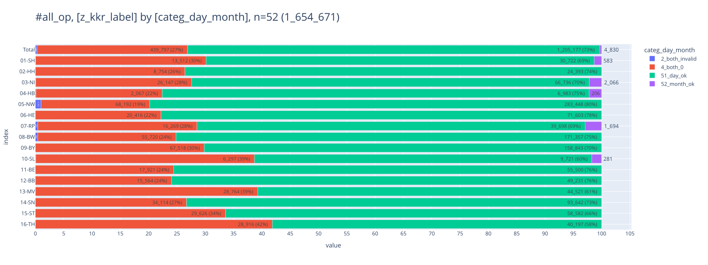
    

<table id="T_950c6">
  <thead>
    <tr>
      <th class="index_name level0" >categ_day_month</th>
      <th id="T_950c6_level0_col0" class="col_heading level0 col0" >2_both_invalid</th>
      <th id="T_950c6_level0_col1" class="col_heading level0 col1" >4_both_0</th>
      <th id="T_950c6_level0_col2" class="col_heading level0 col2" >51_day_ok</th>
      <th id="T_950c6_level0_col3" class="col_heading level0 col3" >52_month_ok</th>
      <th id="T_950c6_level0_col4" class="col_heading level0 col4" >Total</th>
    </tr>
    <tr>
      <th class="index_name level0" >z_kkr_label</th>
      <th class="blank col0" >&nbsp;</th>
      <th class="blank col1" >&nbsp;</th>
      <th class="blank col2" >&nbsp;</th>
      <th class="blank col3" >&nbsp;</th>
      <th class="blank col4" >&nbsp;</th>
    </tr>
  </thead>
  <tbody>
    <tr>
      <th id="T_950c6_level0_row0" class="row_heading level0 row0" >01-SH</th>
      <td id="T_950c6_row0_col0" class="data row0 col0" >9 (0.0%) </td>
      <td id="T_950c6_row0_col1" class="data row0 col1" >13_512 (0.8%) </td>
      <td id="T_950c6_row0_col2" class="data row0 col2" >30_722 (1.9%) </td>
      <td id="T_950c6_row0_col3" class="data row0 col3" >583 (0.0%) </td>
      <td id="T_950c6_row0_col4" class="data row0 col4" >44_826 (2.7%) </td>
    </tr>
    <tr>
      <th id="T_950c6_level0_row1" class="row_heading level0 row1" >02-HH</th>
      <td id="T_950c6_row1_col0" class="data row1 col0" >0 </td>
      <td id="T_950c6_row1_col1" class="data row1 col1" >8_754 (0.5%) </td>
      <td id="T_950c6_row1_col2" class="data row1 col2" >24_393 (1.5%) </td>
      <td id="T_950c6_row1_col3" class="data row1 col3" >0 </td>
      <td id="T_950c6_row1_col4" class="data row1 col4" >33_147 (2.0%) </td>
    </tr>
    <tr>
      <th id="T_950c6_level0_row2" class="row_heading level0 row2" >03-NI</th>
      <td id="T_950c6_row2_col0" class="data row2 col0" >72 (0.0%) </td>
      <td id="T_950c6_row2_col1" class="data row2 col1" >26_147 (1.6%) </td>
      <td id="T_950c6_row2_col2" class="data row2 col2" >66_736 (4.0%) </td>
      <td id="T_950c6_row2_col3" class="data row2 col3" >2_066 (0.1%) </td>
      <td id="T_950c6_row2_col4" class="data row2 col4" >95_021 (5.7%) </td>
    </tr>
    <tr>
      <th id="T_950c6_level0_row3" class="row_heading level0 row3" >04-HB</th>
      <td id="T_950c6_row3_col0" class="data row3 col0" >9 (0.0%) </td>
      <td id="T_950c6_row3_col1" class="data row3 col1" >2_067 (0.1%) </td>
      <td id="T_950c6_row3_col2" class="data row3 col2" >6_983 (0.4%) </td>
      <td id="T_950c6_row3_col3" class="data row3 col3" >206 (0.0%) </td>
      <td id="T_950c6_row3_col4" class="data row3 col4" >9_265 (0.6%) </td>
    </tr>
    <tr>
      <th id="T_950c6_level0_row4" class="row_heading level0 row4" >05-NW</th>
      <td id="T_950c6_row4_col0" class="data row4 col0" >3_562 (0.2%) </td>
      <td id="T_950c6_row4_col1" class="data row4 col1" >68_192 (4.1%) </td>
      <td id="T_950c6_row4_col2" class="data row4 col2" >283_448 (17.1%) </td>
      <td id="T_950c6_row4_col3" class="data row4 col3" >0 </td>
      <td id="T_950c6_row4_col4" class="data row4 col4" >355_202 (21.5%) </td>
    </tr>
    <tr>
      <th id="T_950c6_level0_row5" class="row_heading level0 row5" >06-HE</th>
      <td id="T_950c6_row5_col0" class="data row5 col0" >0 </td>
      <td id="T_950c6_row5_col1" class="data row5 col1" >20_416 (1.2%) </td>
      <td id="T_950c6_row5_col2" class="data row5 col2" >71_603 (4.3%) </td>
      <td id="T_950c6_row5_col3" class="data row5 col3" >0 </td>
      <td id="T_950c6_row5_col4" class="data row5 col4" >92_019 (5.6%) </td>
    </tr>
    <tr>
      <th id="T_950c6_level0_row6" class="row_heading level0 row6" >07-RP</th>
      <td id="T_950c6_row6_col0" class="data row6 col0" >251 (0.0%) </td>
      <td id="T_950c6_row6_col1" class="data row6 col1" >16_269 (1.0%) </td>
      <td id="T_950c6_row6_col2" class="data row6 col2" >39_698 (2.4%) </td>
      <td id="T_950c6_row6_col3" class="data row6 col3" >1_694 (0.1%) </td>
      <td id="T_950c6_row6_col4" class="data row6 col4" >57_912 (3.5%) </td>
    </tr>
    <tr>
      <th id="T_950c6_level0_row7" class="row_heading level0 row7" >08-BW</th>
      <td id="T_950c6_row7_col0" class="data row7 col0" >935 (0.1%) </td>
      <td id="T_950c6_row7_col1" class="data row7 col1" >55_720 (3.4%) </td>
      <td id="T_950c6_row7_col2" class="data row7 col2" >171_357 (10.4%) </td>
      <td id="T_950c6_row7_col3" class="data row7 col3" >0 </td>
      <td id="T_950c6_row7_col4" class="data row7 col4" >228_012 (13.8%) </td>
    </tr>
    <tr>
      <th id="T_950c6_level0_row8" class="row_heading level0 row8" >09-BY</th>
      <td id="T_950c6_row8_col0" class="data row8 col0" >6 (0.0%) </td>
      <td id="T_950c6_row8_col1" class="data row8 col1" >67_518 (4.1%) </td>
      <td id="T_950c6_row8_col2" class="data row8 col2" >158_843 (9.6%) </td>
      <td id="T_950c6_row8_col3" class="data row8 col3" >0 </td>
      <td id="T_950c6_row8_col4" class="data row8 col4" >226_367 (13.7%) </td>
    </tr>
    <tr>
      <th id="T_950c6_level0_row9" class="row_heading level0 row9" >10-SL</th>
      <td id="T_950c6_row9_col0" class="data row9 col0" >13 (0.0%) </td>
      <td id="T_950c6_row9_col1" class="data row9 col1" >6_297 (0.4%) </td>
      <td id="T_950c6_row9_col2" class="data row9 col2" >9_721 (0.6%) </td>
      <td id="T_950c6_row9_col3" class="data row9 col3" >281 (0.0%) </td>
      <td id="T_950c6_row9_col4" class="data row9 col4" >16_312 (1.0%) </td>
    </tr>
    <tr>
      <th id="T_950c6_level0_row10" class="row_heading level0 row10" >11-BE</th>
      <td id="T_950c6_row10_col0" class="data row10 col0" >0 </td>
      <td id="T_950c6_row10_col1" class="data row10 col1" >17_921 (1.1%) </td>
      <td id="T_950c6_row10_col2" class="data row10 col2" >55_500 (3.4%) </td>
      <td id="T_950c6_row10_col3" class="data row10 col3" >0 </td>
      <td id="T_950c6_row10_col4" class="data row10 col4" >73_421 (4.4%) </td>
    </tr>
    <tr>
      <th id="T_950c6_level0_row11" class="row_heading level0 row11" >12-BB</th>
      <td id="T_950c6_row11_col0" class="data row11 col0" >0 </td>
      <td id="T_950c6_row11_col1" class="data row11 col1" >15_564 (0.9%) </td>
      <td id="T_950c6_row11_col2" class="data row11 col2" >49_231 (3.0%) </td>
      <td id="T_950c6_row11_col3" class="data row11 col3" >0 </td>
      <td id="T_950c6_row11_col4" class="data row11 col4" >64_795 (3.9%) </td>
    </tr>
    <tr>
      <th id="T_950c6_level0_row12" class="row_heading level0 row12" >13-MV</th>
      <td id="T_950c6_row12_col0" class="data row12 col0" >7 (0.0%) </td>
      <td id="T_950c6_row12_col1" class="data row12 col1" >28_764 (1.7%) </td>
      <td id="T_950c6_row12_col2" class="data row12 col2" >44_521 (2.7%) </td>
      <td id="T_950c6_row12_col3" class="data row12 col3" >0 </td>
      <td id="T_950c6_row12_col4" class="data row12 col4" >73_292 (4.4%) </td>
    </tr>
    <tr>
      <th id="T_950c6_level0_row13" class="row_heading level0 row13" >14-SN</th>
      <td id="T_950c6_row13_col0" class="data row13 col0" >0 </td>
      <td id="T_950c6_row13_col1" class="data row13 col1" >34_114 (2.1%) </td>
      <td id="T_950c6_row13_col2" class="data row13 col2" >93_642 (5.7%) </td>
      <td id="T_950c6_row13_col3" class="data row13 col3" >0 </td>
      <td id="T_950c6_row13_col4" class="data row13 col4" >127_756 (7.7%) </td>
    </tr>
    <tr>
      <th id="T_950c6_level0_row14" class="row_heading level0 row14" >15-ST</th>
      <td id="T_950c6_row14_col0" class="data row14 col0" >1 (0.0%) </td>
      <td id="T_950c6_row14_col1" class="data row14 col1" >29_626 (1.8%) </td>
      <td id="T_950c6_row14_col2" class="data row14 col2" >58_582 (3.5%) </td>
      <td id="T_950c6_row14_col3" class="data row14 col3" >0 </td>
      <td id="T_950c6_row14_col4" class="data row14 col4" >88_209 (5.3%) </td>
    </tr>
    <tr>
      <th id="T_950c6_level0_row15" class="row_heading level0 row15" >16-TH</th>
      <td id="T_950c6_row15_col0" class="data row15 col0" >2 (0.0%) </td>
      <td id="T_950c6_row15_col1" class="data row15 col1" >28_916 (1.7%) </td>
      <td id="T_950c6_row15_col2" class="data row15 col2" >40_197 (2.4%) </td>
      <td id="T_950c6_row15_col3" class="data row15 col3" >0 </td>
      <td id="T_950c6_row15_col4" class="data row15 col4" >69_115 (4.2%) </td>
    </tr>
    <tr>
      <th id="T_950c6_level0_row16" class="row_heading level0 row16" >Total</th>
      <td id="T_950c6_row16_col0" class="data row16 col0" >4_867 (0.3%) </td>
      <td id="T_950c6_row16_col1" class="data row16 col1" >439_797 (26.6%) </td>
      <td id="T_950c6_row16_col2" class="data row16 col2" >1_205_177 (72.8%) </td>
      <td id="T_950c6_row16_col3" class="data row16 col3" >4_830 (0.3%) </td>
      <td id="T_950c6_row16_col4" class="data row16 col4" >1_654_671 (100.0%) </td>
    </tr>
  </tbody>
</table>

    
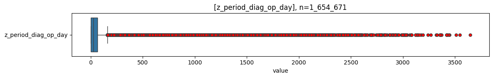
    

    
    column               |   count   | min | lower |  q25  | median |  mean  |  q75   | upper |  max  |   std   |  cv   |     sum    
    ---------------------+-----------+-----+-------+-------+--------+--------+--------+-------+-------+---------+-------+------------
    z_period_diag_op_day | 1_649_804 |   0 |     0 | 0.000 | 26.000 | 74.369 | 64.000 |   160 | 3_648 | 162.508 | 2.185 | 122_694_977
    

## [Diagnose -> SYST](#toc0_)
- Filter: keiner
- gezählt sind SYST

### [Tagesabstand vs Datumsangaben](#toc0_)
- **Werte für Variablen zur Verteilung**
  - `1_noperiod_date` - kein Tagesabstand, aber Datumsangaben
  - `2_period_nodate` - Tagesabstand, aber keine Datumsangaben
  - `3_period_date` - Tagesabstand und Datumsangaben
  - `4_noperiod_nodate` - kein Tagesabstand, keine Datumsangaben

    
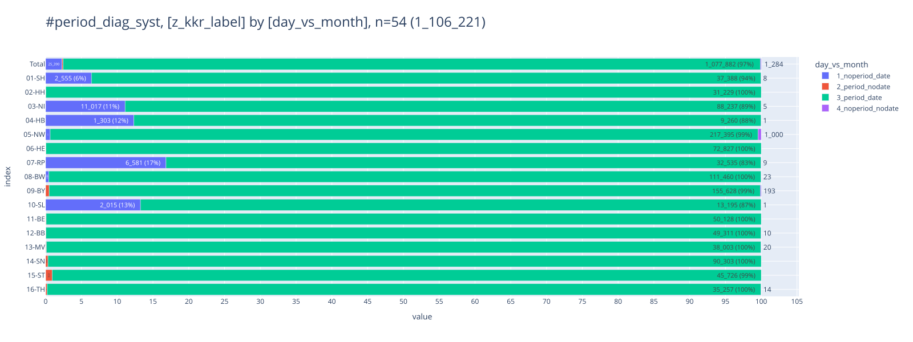
    

### [Tagesabstand](#toc0_)
- **Werte für Gruppierung nach Tagesabstand**
  - `A_<0d` - Wert negativ
  - `B_0d` - Wert ist 0
  - `C_1-365d` - Wert ist 1-365 Tage
  - `D_1-10y` - Wert ist 1-10 Jahre
  - `E_>10y` - Wert ist > 10 Jahre

    
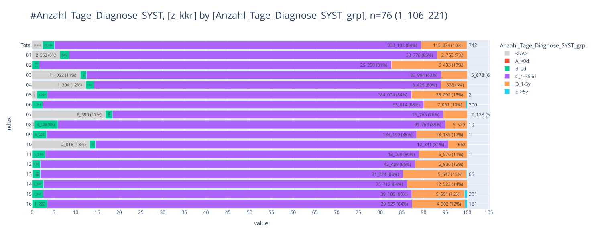
    

    
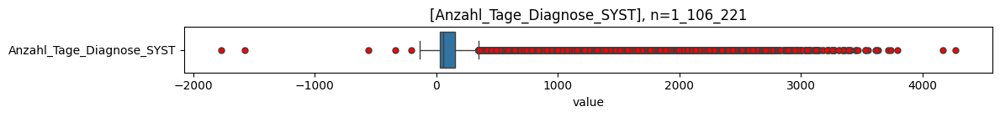
    

    
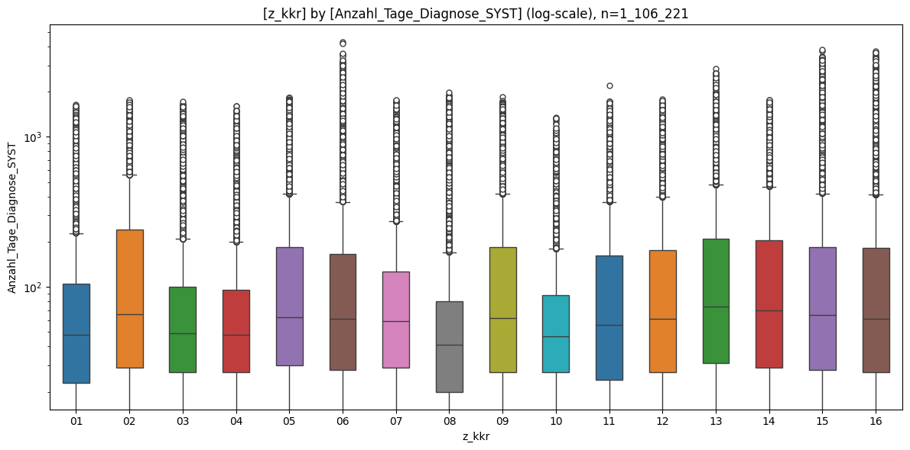
    

    
    column                    |   count   |  min   | lower |  q25  | median |  mean  |  q75   | upper |  max  |  std   |  cv  |     sum    
    --------------------------+-----------+--------+-------+-------+--------+--------+--------+-------+-------+--------+------+------------
    Anzahl_Tage_Diagnose_SYST | 1_079_570 | -1_772 |  -139 | 27.00 |  57.00 | 144.63 | 154.00 |   344 | 4_275 | 227.24 | 1.57 | 156_140_617
    

    
    column |  count  |  min   | lower |  q25  | median |  mean  |  q75   | upper |  max  |  std   |  cv  |    sum    
    -------+---------+--------+-------+-------+--------+--------+--------+-------+-------+--------+------+-----------
    01     |  37_388 |      0 |     0 | 23.00 |  48.00 | 111.69 | 105.00 |   228 | 1_637 | 184.84 | 1.65 |  4_176_042
    02     |  31_235 |      0 |     0 | 29.00 |  66.00 | 193.25 | 241.00 |   559 | 1_758 | 272.75 | 1.41 |  6_036_248
    03     |  88_237 |      0 |     0 | 27.00 |  49.00 | 107.14 | 100.00 |   209 | 1_724 | 173.22 | 1.62 |  9_453_875
    04     |   9_260 |      0 |     0 | 27.00 |  48.00 | 106.23 |  96.00 |   199 | 1_611 | 172.78 | 1.63 |    983_655
    05     | 217_395 |      0 |     0 | 30.00 |  63.00 | 161.04 | 185.00 |   417 | 1_834 | 235.35 | 1.46 | 35_009_328
    06     |  72_866 |      0 |     0 | 28.00 |  61.00 | 146.82 | 164.75 |   369 | 4_275 | 239.67 | 1.63 | 10_698_421
    07     |  32_535 |      0 |     0 | 29.00 |  59.00 | 114.59 | 127.00 |   274 | 1_763 | 160.67 | 1.40 |  3_728_076
    08     | 111_460 |      0 |     0 | 20.00 |  41.00 |  87.99 |  80.00 |   170 | 1_977 | 169.25 | 1.92 |  9_806_842
    09     | 156_389 |      0 |     0 | 27.00 |  62.00 | 151.75 | 184.00 |   419 | 1_844 | 218.90 | 1.44 | 23_731_802
    10     |  13_195 |      0 |     0 | 27.00 |  47.00 |  92.18 |  88.00 |   179 | 1_350 | 136.12 | 1.48 |  1_216_308
    11     |  50_162 |      0 |     0 | 24.00 |  56.00 | 142.80 | 162.00 |   369 | 2_201 | 211.74 | 1.48 |  7_163_069
    12     |  49_333 |      0 |     0 | 27.00 |  61.00 | 152.81 | 175.00 |   397 | 1_778 | 224.39 | 1.47 |  7_538_602
    13     |  38_041 | -1_772 |  -208 | 31.00 |  74.00 | 185.04 | 210.00 |   478 | 2_836 | 278.08 | 1.50 |  7_039_191
    14     |  90_596 |      0 |     0 | 29.00 |  70.00 | 170.76 | 204.00 |   466 | 1_758 | 244.46 | 1.43 | 15_469_750
    15     |  46_146 |      0 |     0 | 28.00 |  65.00 | 174.58 | 185.00 |   420 | 3_797 | 301.10 | 1.72 |  8_056_379
    16     |  35_332 |      0 |     0 | 27.00 |  61.00 | 170.75 | 182.00 |   414 | 3_737 | 292.21 | 1.71 |  6_033_029
    

### [Kategorien](#toc0_)
- Kategorien für `categ_day_month` und deren mapping zur jeweiligen `z_` Variable (jede Kategorie impliziert, dass die vorherigen **nicht** zutreffen)
  - `1_both_null` - Datumsabstand und Tagesangaben sind beide NULL ➡️ NULL
  - `2_both_invalid` - Datumsabstand und Tagesangaben sind ungültig ➡️ NULL
  - `3_deviation` - Abweichungen zwischen Datumsabstand / Tagesangaben sind erheblich ➡️ Tagesangabe
  - `4_both_0` - Datumsabstand und Tagesangaben sind beide 0 ➡️ 0
  - `51_day_ok` - Tagesangabe ist valide ➡️ Tagesangabe
  - `52_month_ok` - Datumsabstand ist valide ➡️ Datumsabstand

    
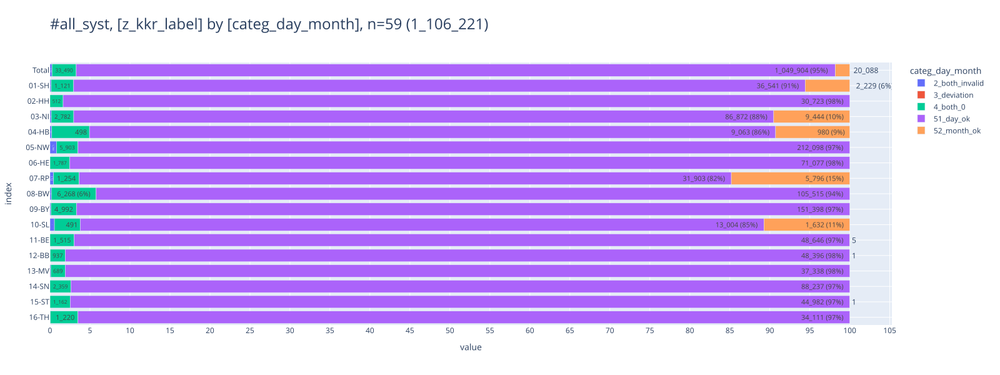
    

<table id="T_b01a6">
  <thead>
    <tr>
      <th class="index_name level0" >categ_day_month</th>
      <th id="T_b01a6_level0_col0" class="col_heading level0 col0" >2_both_invalid</th>
      <th id="T_b01a6_level0_col1" class="col_heading level0 col1" >3_deviation</th>
      <th id="T_b01a6_level0_col2" class="col_heading level0 col2" >4_both_0</th>
      <th id="T_b01a6_level0_col3" class="col_heading level0 col3" >51_day_ok</th>
      <th id="T_b01a6_level0_col4" class="col_heading level0 col4" >52_month_ok</th>
      <th id="T_b01a6_level0_col5" class="col_heading level0 col5" >Total</th>
    </tr>
    <tr>
      <th class="index_name level0" >z_kkr_label</th>
      <th class="blank col0" >&nbsp;</th>
      <th class="blank col1" >&nbsp;</th>
      <th class="blank col2" >&nbsp;</th>
      <th class="blank col3" >&nbsp;</th>
      <th class="blank col4" >&nbsp;</th>
      <th class="blank col5" >&nbsp;</th>
    </tr>
  </thead>
  <tbody>
    <tr>
      <th id="T_b01a6_level0_row0" class="row_heading level0 row0" >01-SH</th>
      <td id="T_b01a6_row0_col0" class="data row0 col0" >60 (0.0%) </td>
      <td id="T_b01a6_row0_col1" class="data row0 col1" >0 </td>
      <td id="T_b01a6_row0_col2" class="data row0 col2" >1_121 (0.1%) </td>
      <td id="T_b01a6_row0_col3" class="data row0 col3" >36_541 (3.3%) </td>
      <td id="T_b01a6_row0_col4" class="data row0 col4" >2_229 (0.2%) </td>
      <td id="T_b01a6_row0_col5" class="data row0 col5" >39_951 (3.6%) </td>
    </tr>
    <tr>
      <th id="T_b01a6_level0_row1" class="row_heading level0 row1" >02-HH</th>
      <td id="T_b01a6_row1_col0" class="data row1 col0" >0 </td>
      <td id="T_b01a6_row1_col1" class="data row1 col1" >0 </td>
      <td id="T_b01a6_row1_col2" class="data row1 col2" >512 (0.0%) </td>
      <td id="T_b01a6_row1_col3" class="data row1 col3" >30_723 (2.8%) </td>
      <td id="T_b01a6_row1_col4" class="data row1 col4" >0 </td>
      <td id="T_b01a6_row1_col5" class="data row1 col5" >31_235 (2.8%) </td>
    </tr>
    <tr>
      <th id="T_b01a6_level0_row2" class="row_heading level0 row2" >03-NI</th>
      <td id="T_b01a6_row2_col0" class="data row2 col0" >161 (0.0%) </td>
      <td id="T_b01a6_row2_col1" class="data row2 col1" >0 </td>
      <td id="T_b01a6_row2_col2" class="data row2 col2" >2_782 (0.3%) </td>
      <td id="T_b01a6_row2_col3" class="data row2 col3" >86_872 (7.9%) </td>
      <td id="T_b01a6_row2_col4" class="data row2 col4" >9_444 (0.9%) </td>
      <td id="T_b01a6_row2_col5" class="data row2 col5" >99_259 (9.0%) </td>
    </tr>
    <tr>
      <th id="T_b01a6_level0_row3" class="row_heading level0 row3" >04-HB</th>
      <td id="T_b01a6_row3_col0" class="data row3 col0" >23 (0.0%) </td>
      <td id="T_b01a6_row3_col1" class="data row3 col1" >0 </td>
      <td id="T_b01a6_row3_col2" class="data row3 col2" >498 (0.0%) </td>
      <td id="T_b01a6_row3_col3" class="data row3 col3" >9_063 (0.8%) </td>
      <td id="T_b01a6_row3_col4" class="data row3 col4" >980 (0.1%) </td>
      <td id="T_b01a6_row3_col5" class="data row3 col5" >10_564 (1.0%) </td>
    </tr>
    <tr>
      <th id="T_b01a6_level0_row4" class="row_heading level0 row4" >05-NW</th>
      <td id="T_b01a6_row4_col0" class="data row4 col0" >1_789 (0.2%) </td>
      <td id="T_b01a6_row4_col1" class="data row4 col1" >0 </td>
      <td id="T_b01a6_row4_col2" class="data row4 col2" >5_903 (0.5%) </td>
      <td id="T_b01a6_row4_col3" class="data row4 col3" >212_098 (19.2%) </td>
      <td id="T_b01a6_row4_col4" class="data row4 col4" >0 </td>
      <td id="T_b01a6_row4_col5" class="data row4 col5" >219_790 (19.9%) </td>
    </tr>
    <tr>
      <th id="T_b01a6_level0_row5" class="row_heading level0 row5" >06-HE</th>
      <td id="T_b01a6_row5_col0" class="data row5 col0" >2 (0.0%) </td>
      <td id="T_b01a6_row5_col1" class="data row5 col1" >0 </td>
      <td id="T_b01a6_row5_col2" class="data row5 col2" >1_787 (0.2%) </td>
      <td id="T_b01a6_row5_col3" class="data row5 col3" >71_077 (6.4%) </td>
      <td id="T_b01a6_row5_col4" class="data row5 col4" >0 </td>
      <td id="T_b01a6_row5_col5" class="data row5 col5" >72_866 (6.6%) </td>
    </tr>
    <tr>
      <th id="T_b01a6_level0_row6" class="row_heading level0 row6" >07-RP</th>
      <td id="T_b01a6_row6_col0" class="data row6 col0" >172 (0.0%) </td>
      <td id="T_b01a6_row6_col1" class="data row6 col1" >0 </td>
      <td id="T_b01a6_row6_col2" class="data row6 col2" >1_254 (0.1%) </td>
      <td id="T_b01a6_row6_col3" class="data row6 col3" >31_903 (2.9%) </td>
      <td id="T_b01a6_row6_col4" class="data row6 col4" >5_796 (0.5%) </td>
      <td id="T_b01a6_row6_col5" class="data row6 col5" >39_125 (3.5%) </td>
    </tr>
    <tr>
      <th id="T_b01a6_level0_row7" class="row_heading level0 row7" >08-BW</th>
      <td id="T_b01a6_row7_col0" class="data row7 col0" >191 (0.0%) </td>
      <td id="T_b01a6_row7_col1" class="data row7 col1" >0 </td>
      <td id="T_b01a6_row7_col2" class="data row7 col2" >6_268 (0.6%) </td>
      <td id="T_b01a6_row7_col3" class="data row7 col3" >105_515 (9.5%) </td>
      <td id="T_b01a6_row7_col4" class="data row7 col4" >0 </td>
      <td id="T_b01a6_row7_col5" class="data row7 col5" >111_974 (10.1%) </td>
    </tr>
    <tr>
      <th id="T_b01a6_level0_row8" class="row_heading level0 row8" >09-BY</th>
      <td id="T_b01a6_row8_col0" class="data row8 col0" >194 (0.0%) </td>
      <td id="T_b01a6_row8_col1" class="data row8 col1" >0 </td>
      <td id="T_b01a6_row8_col2" class="data row8 col2" >4_992 (0.5%) </td>
      <td id="T_b01a6_row8_col3" class="data row8 col3" >151_398 (13.7%) </td>
      <td id="T_b01a6_row8_col4" class="data row8 col4" >0 </td>
      <td id="T_b01a6_row8_col5" class="data row8 col5" >156_584 (14.2%) </td>
    </tr>
    <tr>
      <th id="T_b01a6_level0_row9" class="row_heading level0 row9" >10-SL</th>
      <td id="T_b01a6_row9_col0" class="data row9 col0" >84 (0.0%) </td>
      <td id="T_b01a6_row9_col1" class="data row9 col1" >0 </td>
      <td id="T_b01a6_row9_col2" class="data row9 col2" >491 (0.0%) </td>
      <td id="T_b01a6_row9_col3" class="data row9 col3" >13_004 (1.2%) </td>
      <td id="T_b01a6_row9_col4" class="data row9 col4" >1_632 (0.1%) </td>
      <td id="T_b01a6_row9_col5" class="data row9 col5" >15_211 (1.4%) </td>
    </tr>
    <tr>
      <th id="T_b01a6_level0_row10" class="row_heading level0 row10" >11-BE</th>
      <td id="T_b01a6_row10_col0" class="data row10 col0" >0 </td>
      <td id="T_b01a6_row10_col1" class="data row10 col1" >1 (0.0%) </td>
      <td id="T_b01a6_row10_col2" class="data row10 col2" >1_515 (0.1%) </td>
      <td id="T_b01a6_row10_col3" class="data row10 col3" >48_646 (4.4%) </td>
      <td id="T_b01a6_row10_col4" class="data row10 col4" >5 (0.0%) </td>
      <td id="T_b01a6_row10_col5" class="data row10 col5" >50_167 (4.5%) </td>
    </tr>
    <tr>
      <th id="T_b01a6_level0_row11" class="row_heading level0 row11" >12-BB</th>
      <td id="T_b01a6_row11_col0" class="data row11 col0" >10 (0.0%) </td>
      <td id="T_b01a6_row11_col1" class="data row11 col1" >0 </td>
      <td id="T_b01a6_row11_col2" class="data row11 col2" >937 (0.1%) </td>
      <td id="T_b01a6_row11_col3" class="data row11 col3" >48_396 (4.4%) </td>
      <td id="T_b01a6_row11_col4" class="data row11 col4" >1 (0.0%) </td>
      <td id="T_b01a6_row11_col5" class="data row11 col5" >49_344 (4.5%) </td>
    </tr>
    <tr>
      <th id="T_b01a6_level0_row12" class="row_heading level0 row12" >13-MV</th>
      <td id="T_b01a6_row12_col0" class="data row12 col0" >34 (0.0%) </td>
      <td id="T_b01a6_row12_col1" class="data row12 col1" >0 </td>
      <td id="T_b01a6_row12_col2" class="data row12 col2" >689 (0.1%) </td>
      <td id="T_b01a6_row12_col3" class="data row12 col3" >37_338 (3.4%) </td>
      <td id="T_b01a6_row12_col4" class="data row12 col4" >0 </td>
      <td id="T_b01a6_row12_col5" class="data row12 col5" >38_061 (3.4%) </td>
    </tr>
    <tr>
      <th id="T_b01a6_level0_row13" class="row_heading level0 row13" >14-SN</th>
      <td id="T_b01a6_row13_col0" class="data row13 col0" >0 </td>
      <td id="T_b01a6_row13_col1" class="data row13 col1" >0 </td>
      <td id="T_b01a6_row13_col2" class="data row13 col2" >2_359 (0.2%) </td>
      <td id="T_b01a6_row13_col3" class="data row13 col3" >88_237 (8.0%) </td>
      <td id="T_b01a6_row13_col4" class="data row13 col4" >0 </td>
      <td id="T_b01a6_row13_col5" class="data row13 col5" >90_596 (8.2%) </td>
    </tr>
    <tr>
      <th id="T_b01a6_level0_row14" class="row_heading level0 row14" >15-ST</th>
      <td id="T_b01a6_row14_col0" class="data row14 col0" >2 (0.0%) </td>
      <td id="T_b01a6_row14_col1" class="data row14 col1" >0 </td>
      <td id="T_b01a6_row14_col2" class="data row14 col2" >1_162 (0.1%) </td>
      <td id="T_b01a6_row14_col3" class="data row14 col3" >44_982 (4.1%) </td>
      <td id="T_b01a6_row14_col4" class="data row14 col4" >1 (0.0%) </td>
      <td id="T_b01a6_row14_col5" class="data row14 col5" >46_147 (4.2%) </td>
    </tr>
    <tr>
      <th id="T_b01a6_level0_row15" class="row_heading level0 row15" >16-TH</th>
      <td id="T_b01a6_row15_col0" class="data row15 col0" >16 (0.0%) </td>
      <td id="T_b01a6_row15_col1" class="data row15 col1" >0 </td>
      <td id="T_b01a6_row15_col2" class="data row15 col2" >1_220 (0.1%) </td>
      <td id="T_b01a6_row15_col3" class="data row15 col3" >34_111 (3.1%) </td>
      <td id="T_b01a6_row15_col4" class="data row15 col4" >0 </td>
      <td id="T_b01a6_row15_col5" class="data row15 col5" >35_347 (3.2%) </td>
    </tr>
    <tr>
      <th id="T_b01a6_level0_row16" class="row_heading level0 row16" >Total</th>
      <td id="T_b01a6_row16_col0" class="data row16 col0" >2_738 (0.2%) </td>
      <td id="T_b01a6_row16_col1" class="data row16 col1" >1 (0.0%) </td>
      <td id="T_b01a6_row16_col2" class="data row16 col2" >33_490 (3.0%) </td>
      <td id="T_b01a6_row16_col3" class="data row16 col3" >1_049_904 (94.9%) </td>
      <td id="T_b01a6_row16_col4" class="data row16 col4" >20_088 (1.8%) </td>
      <td id="T_b01a6_row16_col5" class="data row16 col5" >1_106_221 (100.0%) </td>
    </tr>
  </tbody>
</table>

    ---------------------------------------------------------------------------

    AttributeError                            Traceback (most recent call last)

    /var/folders/w4/577kzvnj52s7tzq0qtdh7dkm0000gn/T/ipykernel_84112/1938158245.py in ?()
    ----> 1 pls.plot_box_large(db_syst.to_df().z_period_diag_sy_day)

    ~/Documents/repos/github/cancerdata-quality/.venv/lib/python3.12/site-packages/pandas/core/generic.py in ?(self, name)
       6317             and name not in self._accessors
       6318             and self._info_axis._can_hold_identifiers_and_holds_name(name)
       6319         ):
       6320             return self[name]
    -> 6321         return object.__getattribute__(self, name)

    AttributeError: 'DataFrame' object has no attribute 'z_period_diag_sy_day'

## [Diagnose -> Bestrahlung](#toc0_)
- Filter: keiner
- gezählt sind Teilbestrahlungen

### [Tagesabstand vs Datumsangaben](#toc0_)
- **Werte für Variablen zur Verteilung**
  - `1_noperiod_date` - kein Tagesabstand, aber Datumsangaben
  - `2_period_nodate` - Tagesabstand, aber keine Datumsangaben
  - `3_period_date` - Tagesabstand und Datumsangaben
  - `4_noperiod_nodate` - kein Tagesabstand, keine Datumsangaben

    
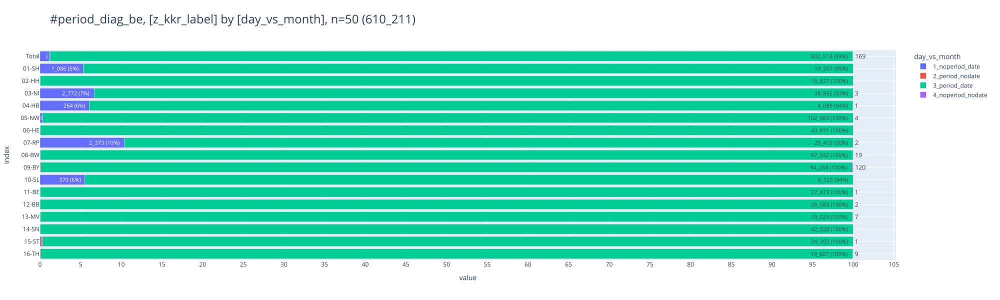
    

### [Tagesabstand](#toc0_)
- **Werte für Gruppierung nach Tagesabstand**
  - `A_<0d` - Wert negativ
  - `B_0d` - Wert ist 0
  - `C_1-365d` - Wert ist 1-365 Tage
  - `D_1-10y` - Wert ist 1-10 Jahre
  - `E_>10y` - Wert ist > 10 Jahre

    
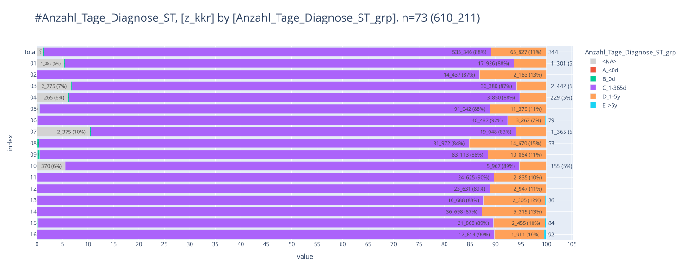
    

    
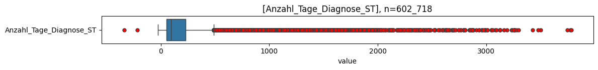
    

    
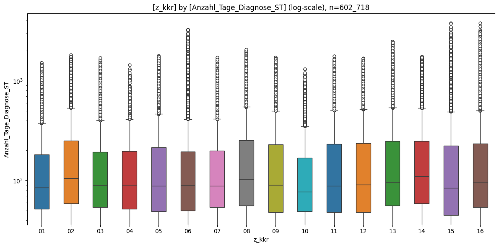
    

    
    column                  |  count  | min  | lower |  q25  | median |  mean  |  q75   | upper |  max  |  std   |  cv  |     sum    
    ------------------------+---------+------+-------+-------+--------+--------+--------+-------+-------+--------+------+------------
    Anzahl_Tage_Diagnose_ST | 602_718 | -339 |   -27 | 52.00 |  92.00 | 177.71 | 227.00 |   489 | 3_782 | 227.51 | 1.28 | 107_111_215
    

    
    column |  count  |   min   |  lower  |  q25  | median |  mean  |  q75   | upper  |   max    |  std   |  cv  |      sum     
    -------+---------+---------+---------+-------+--------+--------+--------+--------+----------+--------+------+--------------
    01     |  19_257 |    0.00 |    0.00 | 52.00 |  85.00 | 144.28 | 182.00 | 377.00 | 1_519.00 | 168.12 | 1.17 |  2_778_428.00
    02     |  16_630 |    0.00 |    0.00 | 59.00 | 105.00 | 201.91 | 250.00 | 535.00 | 1_814.00 | 246.49 | 1.22 |  3_357_732.00
    03     |  38_892 |    0.00 |    0.00 | 54.00 |  89.00 | 145.43 | 193.00 | 401.00 | 1_700.00 | 164.06 | 1.13 |  5_656_103.00
    04     |   4_089 |    0.00 |    0.00 | 52.00 |  90.00 | 143.12 | 196.00 | 412.00 | 1_447.00 | 154.34 | 1.08 |    585_223.00
    05     | 102_583 |    0.00 |    0.00 | 49.00 |  88.00 | 171.77 | 215.00 | 464.00 | 1_779.00 | 218.63 | 1.27 | 17_620_436.00
    06     |  43_886 |    0.00 |    0.00 | 50.00 |  89.00 | 155.94 | 195.00 | 412.00 | 3_259.00 | 208.48 | 1.34 |  6_843_382.00
    07     |  20_459 |    0.00 |    0.00 | 54.00 |  88.00 | 148.09 | 198.00 | 414.00 | 1_715.00 | 169.86 | 1.15 |  3_029_680.00
    08     |  97_032 |    0.00 |    0.00 | 56.00 | 103.00 | 211.54 | 252.00 | 546.00 | 2_056.00 | 272.34 | 1.29 | 20_525_683.00
    09     |  94_367 |    0.00 |    0.00 | 48.00 |  90.00 | 175.22 | 229.00 | 500.00 | 1_721.00 | 217.95 | 1.24 | 16_534_853.00
    10     |   6_323 |    0.00 |    0.00 | 49.00 |  77.00 | 131.87 | 169.00 | 349.00 | 1_311.00 | 140.66 | 1.07 |    833_838.00
    11     |  27_481 |    0.00 |    0.00 | 48.00 |  88.00 | 171.63 | 231.00 | 505.00 | 1_773.00 | 212.03 | 1.24 |  4_716_448.00
    12     |  26_585 |    0.00 |    0.00 | 48.00 |  91.00 | 175.74 | 236.00 | 518.00 | 1_684.00 | 214.97 | 1.22 |  4_672_145.00
    13     |  19_037 | -339.00 | -218.00 | 56.00 |  96.00 | 197.69 | 248.00 | 536.00 | 2_488.00 | 261.92 | 1.32 |  3_763_475.00
    14     |  42_037 |    0.00 |    0.00 | 59.00 | 110.00 | 196.62 | 249.00 | 534.00 | 1_753.00 | 233.18 | 1.19 |  8_265_128.00
    15     |  24_438 |    0.00 |    0.00 | 45.00 |  84.00 | 174.90 | 223.00 | 490.00 | 3_782.00 | 255.55 | 1.46 |  4_274_282.00
    16     |  19_622 |    0.00 |    0.00 | 54.00 |  95.00 | 186.24 | 233.75 | 503.00 | 3_777.00 | 264.37 | 1.42 |  3_654_379.00
    

### [Kategorien](#toc0_)
- Kategorien für `categ_day_month` und deren mapping zur jeweiligen `z_` Variable (jede Kategorie impliziert, dass die vorherigen **nicht** zutreffen)
  - `1_both_null` - Datumsabstand und Tagesangaben sind beide NULL ➡️ NULL
  - `2_both_invalid` - Datumsabstand und Tagesangaben sind ungültig ➡️ NULL
  - `3_deviation` - Abweichungen zwischen Datumsabstand / Tagesangaben sind erheblich ➡️ Tagesangabe
  - `4_both_0` - Datumsabstand und Tagesangaben sind beide 0 ➡️ 0
  - `51_day_ok` - Tagesangabe ist valide ➡️ Tagesangabe
  - `52_month_ok` - Datumsabstand ist valide ➡️ Datumsabstand

    
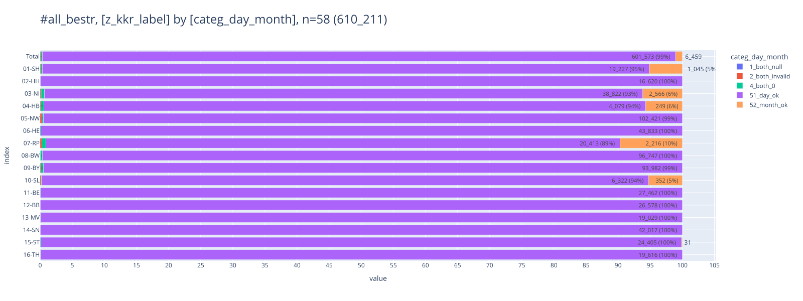
    

<table id="T_f1ae5">
  <thead>
    <tr>
      <th class="index_name level0" >categ_day_month</th>
      <th id="T_f1ae5_level0_col0" class="col_heading level0 col0" >1_both_null</th>
      <th id="T_f1ae5_level0_col1" class="col_heading level0 col1" >2_both_invalid</th>
      <th id="T_f1ae5_level0_col2" class="col_heading level0 col2" >4_both_0</th>
      <th id="T_f1ae5_level0_col3" class="col_heading level0 col3" >51_day_ok</th>
      <th id="T_f1ae5_level0_col4" class="col_heading level0 col4" >52_month_ok</th>
      <th id="T_f1ae5_level0_col5" class="col_heading level0 col5" >Total</th>
    </tr>
    <tr>
      <th class="index_name level0" >z_kkr_label</th>
      <th class="blank col0" >&nbsp;</th>
      <th class="blank col1" >&nbsp;</th>
      <th class="blank col2" >&nbsp;</th>
      <th class="blank col3" >&nbsp;</th>
      <th class="blank col4" >&nbsp;</th>
      <th class="blank col5" >&nbsp;</th>
    </tr>
  </thead>
  <tbody>
    <tr>
      <th id="T_f1ae5_level0_row0" class="row_heading level0 row0" >01-SH</th>
      <td id="T_f1ae5_row0_col0" class="data row0 col0" >0 </td>
      <td id="T_f1ae5_row0_col1" class="data row0 col1" >19 (0.0%) </td>
      <td id="T_f1ae5_row0_col2" class="data row0 col2" >52 (0.0%) </td>
      <td id="T_f1ae5_row0_col3" class="data row0 col3" >19_227 (3.2%) </td>
      <td id="T_f1ae5_row0_col4" class="data row0 col4" >1_045 (0.2%) </td>
      <td id="T_f1ae5_row0_col5" class="data row0 col5" >20_343 (3.3%) </td>
    </tr>
    <tr>
      <th id="T_f1ae5_level0_row1" class="row_heading level0 row1" >02-HH</th>
      <td id="T_f1ae5_row1_col0" class="data row1 col0" >0 </td>
      <td id="T_f1ae5_row1_col1" class="data row1 col1" >0 </td>
      <td id="T_f1ae5_row1_col2" class="data row1 col2" >10 (0.0%) </td>
      <td id="T_f1ae5_row1_col3" class="data row1 col3" >16_620 (2.7%) </td>
      <td id="T_f1ae5_row1_col4" class="data row1 col4" >0 </td>
      <td id="T_f1ae5_row1_col5" class="data row1 col5" >16_630 (2.7%) </td>
    </tr>
    <tr>
      <th id="T_f1ae5_level0_row2" class="row_heading level0 row2" >03-NI</th>
      <td id="T_f1ae5_row2_col0" class="data row2 col0" >0 </td>
      <td id="T_f1ae5_row2_col1" class="data row2 col1" >65 (0.0%) </td>
      <td id="T_f1ae5_row2_col2" class="data row2 col2" >214 (0.0%) </td>
      <td id="T_f1ae5_row2_col3" class="data row2 col3" >38_822 (6.4%) </td>
      <td id="T_f1ae5_row2_col4" class="data row2 col4" >2_566 (0.4%) </td>
      <td id="T_f1ae5_row2_col5" class="data row2 col5" >41_667 (6.8%) </td>
    </tr>
    <tr>
      <th id="T_f1ae5_level0_row3" class="row_heading level0 row3" >04-HB</th>
      <td id="T_f1ae5_row3_col0" class="data row3 col0" >0 </td>
      <td id="T_f1ae5_row3_col1" class="data row3 col1" >6 (0.0%) </td>
      <td id="T_f1ae5_row3_col2" class="data row3 col2" >20 (0.0%) </td>
      <td id="T_f1ae5_row3_col3" class="data row3 col3" >4_079 (0.7%) </td>
      <td id="T_f1ae5_row3_col4" class="data row3 col4" >249 (0.0%) </td>
      <td id="T_f1ae5_row3_col5" class="data row3 col5" >4_354 (0.7%) </td>
    </tr>
    <tr>
      <th id="T_f1ae5_level0_row4" class="row_heading level0 row4" >05-NW</th>
      <td id="T_f1ae5_row4_col0" class="data row4 col0" >0 </td>
      <td id="T_f1ae5_row4_col1" class="data row4 col1" >310 (0.1%) </td>
      <td id="T_f1ae5_row4_col2" class="data row4 col2" >220 (0.0%) </td>
      <td id="T_f1ae5_row4_col3" class="data row4 col3" >102_421 (16.8%) </td>
      <td id="T_f1ae5_row4_col4" class="data row4 col4" >0 </td>
      <td id="T_f1ae5_row4_col5" class="data row4 col5" >102_951 (16.9%) </td>
    </tr>
    <tr>
      <th id="T_f1ae5_level0_row5" class="row_heading level0 row5" >06-HE</th>
      <td id="T_f1ae5_row5_col0" class="data row5 col0" >0 </td>
      <td id="T_f1ae5_row5_col1" class="data row5 col1" >0 </td>
      <td id="T_f1ae5_row5_col2" class="data row5 col2" >53 (0.0%) </td>
      <td id="T_f1ae5_row5_col3" class="data row5 col3" >43_833 (7.2%) </td>
      <td id="T_f1ae5_row5_col4" class="data row5 col4" >0 </td>
      <td id="T_f1ae5_row5_col5" class="data row5 col5" >43_886 (7.2%) </td>
    </tr>
    <tr>
      <th id="T_f1ae5_level0_row6" class="row_heading level0 row6" >07-RP</th>
      <td id="T_f1ae5_row6_col0" class="data row6 col0" >0 </td>
      <td id="T_f1ae5_row6_col1" class="data row6 col1" >61 (0.0%) </td>
      <td id="T_f1ae5_row6_col2" class="data row6 col2" >144 (0.0%) </td>
      <td id="T_f1ae5_row6_col3" class="data row6 col3" >20_413 (3.3%) </td>
      <td id="T_f1ae5_row6_col4" class="data row6 col4" >2_216 (0.4%) </td>
      <td id="T_f1ae5_row6_col5" class="data row6 col5" >22_834 (3.7%) </td>
    </tr>
    <tr>
      <th id="T_f1ae5_level0_row7" class="row_heading level0 row7" >08-BW</th>
      <td id="T_f1ae5_row7_col0" class="data row7 col0" >0 </td>
      <td id="T_f1ae5_row7_col1" class="data row7 col1" >48 (0.0%) </td>
      <td id="T_f1ae5_row7_col2" class="data row7 col2" >320 (0.1%) </td>
      <td id="T_f1ae5_row7_col3" class="data row7 col3" >96_747 (15.9%) </td>
      <td id="T_f1ae5_row7_col4" class="data row7 col4" >0 </td>
      <td id="T_f1ae5_row7_col5" class="data row7 col5" >97_115 (15.9%) </td>
    </tr>
    <tr>
      <th id="T_f1ae5_level0_row8" class="row_heading level0 row8" >09-BY</th>
      <td id="T_f1ae5_row8_col0" class="data row8 col0" >0 </td>
      <td id="T_f1ae5_row8_col1" class="data row8 col1" >120 (0.0%) </td>
      <td id="T_f1ae5_row8_col2" class="data row8 col2" >385 (0.1%) </td>
      <td id="T_f1ae5_row8_col3" class="data row8 col3" >93_982 (15.4%) </td>
      <td id="T_f1ae5_row8_col4" class="data row8 col4" >0 </td>
      <td id="T_f1ae5_row8_col5" class="data row8 col5" >94_487 (15.5%) </td>
    </tr>
    <tr>
      <th id="T_f1ae5_level0_row9" class="row_heading level0 row9" >10-SL</th>
      <td id="T_f1ae5_row9_col0" class="data row9 col0" >0 </td>
      <td id="T_f1ae5_row9_col1" class="data row9 col1" >12 (0.0%) </td>
      <td id="T_f1ae5_row9_col2" class="data row9 col2" >7 (0.0%) </td>
      <td id="T_f1ae5_row9_col3" class="data row9 col3" >6_322 (1.0%) </td>
      <td id="T_f1ae5_row9_col4" class="data row9 col4" >352 (0.1%) </td>
      <td id="T_f1ae5_row9_col5" class="data row9 col5" >6_693 (1.1%) </td>
    </tr>
    <tr>
      <th id="T_f1ae5_level0_row10" class="row_heading level0 row10" >11-BE</th>
      <td id="T_f1ae5_row10_col0" class="data row10 col0" >1 (0.0%) </td>
      <td id="T_f1ae5_row10_col1" class="data row10 col1" >0 </td>
      <td id="T_f1ae5_row10_col2" class="data row10 col2" >19 (0.0%) </td>
      <td id="T_f1ae5_row10_col3" class="data row10 col3" >27_462 (4.5%) </td>
      <td id="T_f1ae5_row10_col4" class="data row10 col4" >0 </td>
      <td id="T_f1ae5_row10_col5" class="data row10 col5" >27_482 (4.5%) </td>
    </tr>
    <tr>
      <th id="T_f1ae5_level0_row11" class="row_heading level0 row11" >12-BB</th>
      <td id="T_f1ae5_row11_col0" class="data row11 col0" >2 (0.0%) </td>
      <td id="T_f1ae5_row11_col1" class="data row11 col1" >0 </td>
      <td id="T_f1ae5_row11_col2" class="data row11 col2" >7 (0.0%) </td>
      <td id="T_f1ae5_row11_col3" class="data row11 col3" >26_578 (4.4%) </td>
      <td id="T_f1ae5_row11_col4" class="data row11 col4" >0 </td>
      <td id="T_f1ae5_row11_col5" class="data row11 col5" >26_587 (4.4%) </td>
    </tr>
    <tr>
      <th id="T_f1ae5_level0_row12" class="row_heading level0 row12" >13-MV</th>
      <td id="T_f1ae5_row12_col0" class="data row12 col0" >6 (0.0%) </td>
      <td id="T_f1ae5_row12_col1" class="data row12 col1" >4 (0.0%) </td>
      <td id="T_f1ae5_row12_col2" class="data row12 col2" >5 (0.0%) </td>
      <td id="T_f1ae5_row12_col3" class="data row12 col3" >19_029 (3.1%) </td>
      <td id="T_f1ae5_row12_col4" class="data row12 col4" >0 </td>
      <td id="T_f1ae5_row12_col5" class="data row12 col5" >19_044 (3.1%) </td>
    </tr>
    <tr>
      <th id="T_f1ae5_level0_row13" class="row_heading level0 row13" >14-SN</th>
      <td id="T_f1ae5_row13_col0" class="data row13 col0" >0 </td>
      <td id="T_f1ae5_row13_col1" class="data row13 col1" >0 </td>
      <td id="T_f1ae5_row13_col2" class="data row13 col2" >20 (0.0%) </td>
      <td id="T_f1ae5_row13_col3" class="data row13 col3" >42_017 (6.9%) </td>
      <td id="T_f1ae5_row13_col4" class="data row13 col4" >0 </td>
      <td id="T_f1ae5_row13_col5" class="data row13 col5" >42_037 (6.9%) </td>
    </tr>
    <tr>
      <th id="T_f1ae5_level0_row14" class="row_heading level0 row14" >15-ST</th>
      <td id="T_f1ae5_row14_col0" class="data row14 col0" >0 </td>
      <td id="T_f1ae5_row14_col1" class="data row14 col1" >3 (0.0%) </td>
      <td id="T_f1ae5_row14_col2" class="data row14 col2" >31 (0.0%) </td>
      <td id="T_f1ae5_row14_col3" class="data row14 col3" >24_405 (4.0%) </td>
      <td id="T_f1ae5_row14_col4" class="data row14 col4" >31 (0.0%) </td>
      <td id="T_f1ae5_row14_col5" class="data row14 col5" >24_470 (4.0%) </td>
    </tr>
    <tr>
      <th id="T_f1ae5_level0_row15" class="row_heading level0 row15" >16-TH</th>
      <td id="T_f1ae5_row15_col0" class="data row15 col0" >9 (0.0%) </td>
      <td id="T_f1ae5_row15_col1" class="data row15 col1" >1 (0.0%) </td>
      <td id="T_f1ae5_row15_col2" class="data row15 col2" >5 (0.0%) </td>
      <td id="T_f1ae5_row15_col3" class="data row15 col3" >19_616 (3.2%) </td>
      <td id="T_f1ae5_row15_col4" class="data row15 col4" >0 </td>
      <td id="T_f1ae5_row15_col5" class="data row15 col5" >19_631 (3.2%) </td>
    </tr>
    <tr>
      <th id="T_f1ae5_level0_row16" class="row_heading level0 row16" >Total</th>
      <td id="T_f1ae5_row16_col0" class="data row16 col0" >18 (0.0%) </td>
      <td id="T_f1ae5_row16_col1" class="data row16 col1" >649 (0.1%) </td>
      <td id="T_f1ae5_row16_col2" class="data row16 col2" >1_512 (0.2%) </td>
      <td id="T_f1ae5_row16_col3" class="data row16 col3" >601_573 (98.6%) </td>
      <td id="T_f1ae5_row16_col4" class="data row16 col4" >6_459 (1.1%) </td>
      <td id="T_f1ae5_row16_col5" class="data row16 col5" >610_211 (100.0%) </td>
    </tr>
  </tbody>
</table>

    
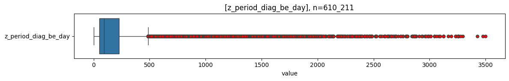
    

    
    column               |  count  | min | lower |  q25   | median |  mean   |   q75   | upper |  max  |   std   |  cv   |     sum    
    ---------------------+---------+-----+-------+--------+--------+---------+---------+-------+-------+---------+-------+------------
    z_period_diag_be_day | 609_544 |   0 |     0 | 52.000 | 92.000 | 177.420 | 226.000 |   487 | 3_500 | 226.954 | 1.279 | 108_145_211
    

## [PSA](#toc0_)
- DatumPSA vor Diagnose is zulässig, somit auch negative Datumsabstände

- Kategorien für `categ_day_month` und deren mapping zur jeweiligen `z_` Variable (jede Kategorie impliziert, dass die vorherigen **nicht** zutreffen)
  - `1_month_null` - Datumsabstand NULL ➡️ NULL
  - `2_month_invalid` - Datumsabstand ungültig ➡️ NULL (negative Werte sind gültig)
  - `3_month_0` - Datumsabstand 0 ➡️ 0
  - `4_month_ok` - Datumsabstand valide ➡️ Datumsabstand

    
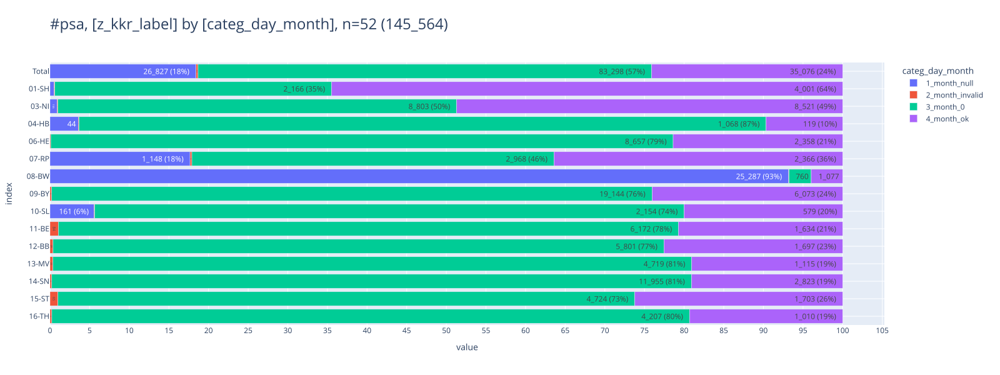
    

<table id="T_f82b5">
  <thead>
    <tr>
      <th class="index_name level0" >categ_day_month</th>
      <th id="T_f82b5_level0_col0" class="col_heading level0 col0" >1_month_null</th>
      <th id="T_f82b5_level0_col1" class="col_heading level0 col1" >2_month_invalid</th>
      <th id="T_f82b5_level0_col2" class="col_heading level0 col2" >3_month_0</th>
      <th id="T_f82b5_level0_col3" class="col_heading level0 col3" >4_month_ok</th>
      <th id="T_f82b5_level0_col4" class="col_heading level0 col4" >Total</th>
    </tr>
    <tr>
      <th class="index_name level0" >z_kkr_label</th>
      <th class="blank col0" >&nbsp;</th>
      <th class="blank col1" >&nbsp;</th>
      <th class="blank col2" >&nbsp;</th>
      <th class="blank col3" >&nbsp;</th>
      <th class="blank col4" >&nbsp;</th>
    </tr>
  </thead>
  <tbody>
    <tr>
      <th id="T_f82b5_level0_row0" class="row_heading level0 row0" >01-SH</th>
      <td id="T_f82b5_row0_col0" class="data row0 col0" >32 (0.0%) </td>
      <td id="T_f82b5_row0_col1" class="data row0 col1" >6 (0.0%) </td>
      <td id="T_f82b5_row0_col2" class="data row0 col2" >2_166 (1.5%) </td>
      <td id="T_f82b5_row0_col3" class="data row0 col3" >4_001 (2.7%) </td>
      <td id="T_f82b5_row0_col4" class="data row0 col4" >6_205 (4.3%) </td>
    </tr>
    <tr>
      <th id="T_f82b5_level0_row1" class="row_heading level0 row1" >03-NI</th>
      <td id="T_f82b5_row1_col0" class="data row1 col0" >155 (0.1%) </td>
      <td id="T_f82b5_row1_col1" class="data row1 col1" >19 (0.0%) </td>
      <td id="T_f82b5_row1_col2" class="data row1 col2" >8_803 (6.0%) </td>
      <td id="T_f82b5_row1_col3" class="data row1 col3" >8_521 (5.9%) </td>
      <td id="T_f82b5_row1_col4" class="data row1 col4" >17_498 (12.0%) </td>
    </tr>
    <tr>
      <th id="T_f82b5_level0_row2" class="row_heading level0 row2" >04-HB</th>
      <td id="T_f82b5_row2_col0" class="data row2 col0" >44 (0.0%) </td>
      <td id="T_f82b5_row2_col1" class="data row2 col1" >1 (0.0%) </td>
      <td id="T_f82b5_row2_col2" class="data row2 col2" >1_068 (0.7%) </td>
      <td id="T_f82b5_row2_col3" class="data row2 col3" >119 (0.1%) </td>
      <td id="T_f82b5_row2_col4" class="data row2 col4" >1_232 (0.8%) </td>
    </tr>
    <tr>
      <th id="T_f82b5_level0_row3" class="row_heading level0 row3" >06-HE</th>
      <td id="T_f82b5_row3_col0" class="data row3 col0" >0 </td>
      <td id="T_f82b5_row3_col1" class="data row3 col1" >10 (0.0%) </td>
      <td id="T_f82b5_row3_col2" class="data row3 col2" >8_657 (5.9%) </td>
      <td id="T_f82b5_row3_col3" class="data row3 col3" >2_358 (1.6%) </td>
      <td id="T_f82b5_row3_col4" class="data row3 col4" >11_025 (7.6%) </td>
    </tr>
    <tr>
      <th id="T_f82b5_level0_row4" class="row_heading level0 row4" >07-RP</th>
      <td id="T_f82b5_row4_col0" class="data row4 col0" >1_148 (0.8%) </td>
      <td id="T_f82b5_row4_col1" class="data row4 col1" >15 (0.0%) </td>
      <td id="T_f82b5_row4_col2" class="data row4 col2" >2_968 (2.0%) </td>
      <td id="T_f82b5_row4_col3" class="data row4 col3" >2_366 (1.6%) </td>
      <td id="T_f82b5_row4_col4" class="data row4 col4" >6_497 (4.5%) </td>
    </tr>
    <tr>
      <th id="T_f82b5_level0_row5" class="row_heading level0 row5" >08-BW</th>
      <td id="T_f82b5_row5_col0" class="data row5 col0" >25_287 (17.4%) </td>
      <td id="T_f82b5_row5_col1" class="data row5 col1" >11 (0.0%) </td>
      <td id="T_f82b5_row5_col2" class="data row5 col2" >760 (0.5%) </td>
      <td id="T_f82b5_row5_col3" class="data row5 col3" >1_077 (0.7%) </td>
      <td id="T_f82b5_row5_col4" class="data row5 col4" >27_135 (18.6%) </td>
    </tr>
    <tr>
      <th id="T_f82b5_level0_row6" class="row_heading level0 row6" >09-BY</th>
      <td id="T_f82b5_row6_col0" class="data row6 col0" >0 </td>
      <td id="T_f82b5_row6_col1" class="data row6 col1" >54 (0.0%) </td>
      <td id="T_f82b5_row6_col2" class="data row6 col2" >19_144 (13.2%) </td>
      <td id="T_f82b5_row6_col3" class="data row6 col3" >6_073 (4.2%) </td>
      <td id="T_f82b5_row6_col4" class="data row6 col4" >25_271 (17.4%) </td>
    </tr>
    <tr>
      <th id="T_f82b5_level0_row7" class="row_heading level0 row7" >10-SL</th>
      <td id="T_f82b5_row7_col0" class="data row7 col0" >161 (0.1%) </td>
      <td id="T_f82b5_row7_col1" class="data row7 col1" >2 (0.0%) </td>
      <td id="T_f82b5_row7_col2" class="data row7 col2" >2_154 (1.5%) </td>
      <td id="T_f82b5_row7_col3" class="data row7 col3" >579 (0.4%) </td>
      <td id="T_f82b5_row7_col4" class="data row7 col4" >2_896 (2.0%) </td>
    </tr>
    <tr>
      <th id="T_f82b5_level0_row8" class="row_heading level0 row8" >11-BE</th>
      <td id="T_f82b5_row8_col0" class="data row8 col0" >0 </td>
      <td id="T_f82b5_row8_col1" class="data row8 col1" >84 (0.1%) </td>
      <td id="T_f82b5_row8_col2" class="data row8 col2" >6_172 (4.2%) </td>
      <td id="T_f82b5_row8_col3" class="data row8 col3" >1_634 (1.1%) </td>
      <td id="T_f82b5_row8_col4" class="data row8 col4" >7_890 (5.4%) </td>
    </tr>
    <tr>
      <th id="T_f82b5_level0_row9" class="row_heading level0 row9" >12-BB</th>
      <td id="T_f82b5_row9_col0" class="data row9 col0" >0 </td>
      <td id="T_f82b5_row9_col1" class="data row9 col1" >29 (0.0%) </td>
      <td id="T_f82b5_row9_col2" class="data row9 col2" >5_801 (4.0%) </td>
      <td id="T_f82b5_row9_col3" class="data row9 col3" >1_697 (1.2%) </td>
      <td id="T_f82b5_row9_col4" class="data row9 col4" >7_527 (5.2%) </td>
    </tr>
    <tr>
      <th id="T_f82b5_level0_row10" class="row_heading level0 row10" >13-MV</th>
      <td id="T_f82b5_row10_col0" class="data row10 col0" >0 </td>
      <td id="T_f82b5_row10_col1" class="data row10 col1" >22 (0.0%) </td>
      <td id="T_f82b5_row10_col2" class="data row10 col2" >4_719 (3.2%) </td>
      <td id="T_f82b5_row10_col3" class="data row10 col3" >1_115 (0.8%) </td>
      <td id="T_f82b5_row10_col4" class="data row10 col4" >5_856 (4.0%) </td>
    </tr>
    <tr>
      <th id="T_f82b5_level0_row11" class="row_heading level0 row11" >14-SN</th>
      <td id="T_f82b5_row11_col0" class="data row11 col0" >0 </td>
      <td id="T_f82b5_row11_col1" class="data row11 col1" >33 (0.0%) </td>
      <td id="T_f82b5_row11_col2" class="data row11 col2" >11_955 (8.2%) </td>
      <td id="T_f82b5_row11_col3" class="data row11 col3" >2_823 (1.9%) </td>
      <td id="T_f82b5_row11_col4" class="data row11 col4" >14_811 (10.2%) </td>
    </tr>
    <tr>
      <th id="T_f82b5_level0_row12" class="row_heading level0 row12" >15-ST</th>
      <td id="T_f82b5_row12_col0" class="data row12 col0" >0 </td>
      <td id="T_f82b5_row12_col1" class="data row12 col1" >65 (0.0%) </td>
      <td id="T_f82b5_row12_col2" class="data row12 col2" >4_724 (3.2%) </td>
      <td id="T_f82b5_row12_col3" class="data row12 col3" >1_703 (1.2%) </td>
      <td id="T_f82b5_row12_col4" class="data row12 col4" >6_492 (4.5%) </td>
    </tr>
    <tr>
      <th id="T_f82b5_level0_row13" class="row_heading level0 row13" >16-TH</th>
      <td id="T_f82b5_row13_col0" class="data row13 col0" >0 </td>
      <td id="T_f82b5_row13_col1" class="data row13 col1" >12 (0.0%) </td>
      <td id="T_f82b5_row13_col2" class="data row13 col2" >4_207 (2.9%) </td>
      <td id="T_f82b5_row13_col3" class="data row13 col3" >1_010 (0.7%) </td>
      <td id="T_f82b5_row13_col4" class="data row13 col4" >5_229 (3.6%) </td>
    </tr>
    <tr>
      <th id="T_f82b5_level0_row14" class="row_heading level0 row14" >Total</th>
      <td id="T_f82b5_row14_col0" class="data row14 col0" >26_827 (18.4%) </td>
      <td id="T_f82b5_row14_col1" class="data row14 col1" >363 (0.2%) </td>
      <td id="T_f82b5_row14_col2" class="data row14 col2" >83_298 (57.2%) </td>
      <td id="T_f82b5_row14_col3" class="data row14 col3" >35_076 (24.1%) </td>
      <td id="T_f82b5_row14_col4" class="data row14 col4" >145_564 (100.0%) </td>
    </tr>
  </tbody>
</table>

    
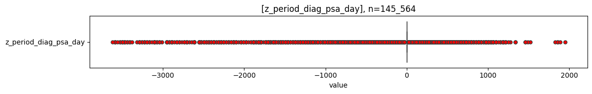
    

    
    column                |  count  |  min   | lower |  q25  | median |  mean   |  q75  | upper |  max  |   std   |   cv    |    sum    
    ----------------------+---------+--------+-------+-------+--------+---------+-------+-------+-------+---------+---------+-----------
    z_period_diag_psa_day | 118_374 | -3_623 |     0 | 0.000 |  0.000 | -11.248 | 0.000 |     0 | 1_947 | 134.060 | -11.919 | -1_331_423
    

## [Folgeereignis](#toc0_)
- Kategorien für `categ_day_month` und deren mapping zur jeweiligen `z_` Variable (jede Kategorie impliziert, dass die vorherigen **nicht** zutreffen)
  - `1_month_null` - Datumsabstand NULL ➡️ NULL
  - `2_month_invalid` - Datumsabstand ungültig ➡️ NULL
  - `3_month_0` - Datumsabstand 0 ➡️ 0
  - `4_month_ok` - Datumsabstand valide ➡️ Datumsabstand

    
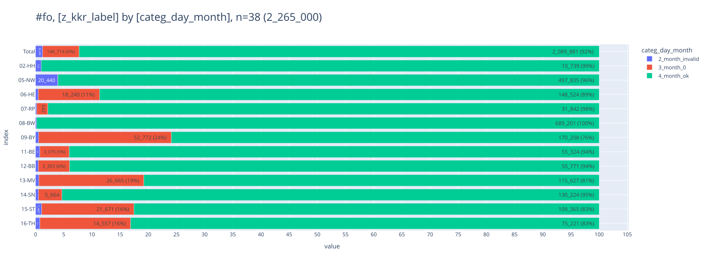
    

<table id="T_f1223">
  <thead>
    <tr>
      <th class="index_name level0" >categ_day_month</th>
      <th id="T_f1223_level0_col0" class="col_heading level0 col0" >2_month_invalid</th>
      <th id="T_f1223_level0_col1" class="col_heading level0 col1" >3_month_0</th>
      <th id="T_f1223_level0_col2" class="col_heading level0 col2" >4_month_ok</th>
      <th id="T_f1223_level0_col3" class="col_heading level0 col3" >Total</th>
    </tr>
    <tr>
      <th class="index_name level0" >z_kkr_label</th>
      <th class="blank col0" >&nbsp;</th>
      <th class="blank col1" >&nbsp;</th>
      <th class="blank col2" >&nbsp;</th>
      <th class="blank col3" >&nbsp;</th>
    </tr>
  </thead>
  <tbody>
    <tr>
      <th id="T_f1223_level0_row0" class="row_heading level0 row0" >02-HH</th>
      <td id="T_f1223_row0_col0" class="data row0 col0" >110 (0.0%) </td>
      <td id="T_f1223_row0_col1" class="data row0 col1" >0 </td>
      <td id="T_f1223_row0_col2" class="data row0 col2" >10_739 (0.5%) </td>
      <td id="T_f1223_row0_col3" class="data row0 col3" >10_849 (0.5%) </td>
    </tr>
    <tr>
      <th id="T_f1223_level0_row1" class="row_heading level0 row1" >05-NW</th>
      <td id="T_f1223_row1_col0" class="data row1 col0" >20_440 (0.9%) </td>
      <td id="T_f1223_row1_col1" class="data row1 col1" >120 (0.0%) </td>
      <td id="T_f1223_row1_col2" class="data row1 col2" >497_835 (22.0%) </td>
      <td id="T_f1223_row1_col3" class="data row1 col3" >518_395 (22.9%) </td>
    </tr>
    <tr>
      <th id="T_f1223_level0_row2" class="row_heading level0 row2" >06-HE</th>
      <td id="T_f1223_row2_col0" class="data row2 col0" >800 (0.0%) </td>
      <td id="T_f1223_row2_col1" class="data row2 col1" >18_240 (0.8%) </td>
      <td id="T_f1223_row2_col2" class="data row2 col2" >148_524 (6.6%) </td>
      <td id="T_f1223_row2_col3" class="data row2 col3" >167_564 (7.4%) </td>
    </tr>
    <tr>
      <th id="T_f1223_level0_row3" class="row_heading level0 row3" >07-RP</th>
      <td id="T_f1223_row3_col0" class="data row3 col0" >71 (0.0%) </td>
      <td id="T_f1223_row3_col1" class="data row3 col1" >642 (0.0%) </td>
      <td id="T_f1223_row3_col2" class="data row3 col2" >31_842 (1.4%) </td>
      <td id="T_f1223_row3_col3" class="data row3 col3" >32_555 (1.4%) </td>
    </tr>
    <tr>
      <th id="T_f1223_level0_row4" class="row_heading level0 row4" >08-BW</th>
      <td id="T_f1223_row4_col0" class="data row4 col0" >1_297 (0.1%) </td>
      <td id="T_f1223_row4_col1" class="data row4 col1" >5 (0.0%) </td>
      <td id="T_f1223_row4_col2" class="data row4 col2" >689_201 (30.4%) </td>
      <td id="T_f1223_row4_col3" class="data row4 col3" >690_503 (30.5%) </td>
    </tr>
    <tr>
      <th id="T_f1223_level0_row5" class="row_heading level0 row5" >09-BY</th>
      <td id="T_f1223_row5_col0" class="data row5 col0" >1_236 (0.1%) </td>
      <td id="T_f1223_row5_col1" class="data row5 col1" >52_772 (2.3%) </td>
      <td id="T_f1223_row5_col2" class="data row5 col2" >170_208 (7.5%) </td>
      <td id="T_f1223_row5_col3" class="data row5 col3" >224_216 (9.9%) </td>
    </tr>
    <tr>
      <th id="T_f1223_level0_row6" class="row_heading level0 row6" >11-BE</th>
      <td id="T_f1223_row6_col0" class="data row6 col0" >448 (0.0%) </td>
      <td id="T_f1223_row6_col1" class="data row6 col1" >3_075 (0.1%) </td>
      <td id="T_f1223_row6_col2" class="data row6 col2" >55_324 (2.4%) </td>
      <td id="T_f1223_row6_col3" class="data row6 col3" >58_847 (2.6%) </td>
    </tr>
    <tr>
      <th id="T_f1223_level0_row7" class="row_heading level0 row7" >12-BB</th>
      <td id="T_f1223_row7_col0" class="data row7 col0" >288 (0.0%) </td>
      <td id="T_f1223_row7_col1" class="data row7 col1" >3_303 (0.1%) </td>
      <td id="T_f1223_row7_col2" class="data row7 col2" >55_771 (2.5%) </td>
      <td id="T_f1223_row7_col3" class="data row7 col3" >59_362 (2.6%) </td>
    </tr>
    <tr>
      <th id="T_f1223_level0_row8" class="row_heading level0 row8" >13-MV</th>
      <td id="T_f1223_row8_col0" class="data row8 col0" >851 (0.0%) </td>
      <td id="T_f1223_row8_col1" class="data row8 col1" >26_665 (1.2%) </td>
      <td id="T_f1223_row8_col2" class="data row8 col2" >115_627 (5.1%) </td>
      <td id="T_f1223_row8_col3" class="data row8 col3" >143_143 (6.3%) </td>
    </tr>
    <tr>
      <th id="T_f1223_level0_row9" class="row_heading level0 row9" >14-SN</th>
      <td id="T_f1223_row9_col0" class="data row9 col0" >714 (0.0%) </td>
      <td id="T_f1223_row9_col1" class="data row9 col1" >5_664 (0.3%) </td>
      <td id="T_f1223_row9_col2" class="data row9 col2" >130_224 (5.7%) </td>
      <td id="T_f1223_row9_col3" class="data row9 col3" >136_602 (6.0%) </td>
    </tr>
    <tr>
      <th id="T_f1223_level0_row10" class="row_heading level0 row10" >15-ST</th>
      <td id="T_f1223_row10_col0" class="data row10 col0" >1_447 (0.1%) </td>
      <td id="T_f1223_row10_col1" class="data row10 col1" >21_671 (1.0%) </td>
      <td id="T_f1223_row10_col2" class="data row10 col2" >109_365 (4.8%) </td>
      <td id="T_f1223_row10_col3" class="data row10 col3" >132_483 (5.8%) </td>
    </tr>
    <tr>
      <th id="T_f1223_level0_row11" class="row_heading level0 row11" >16-TH</th>
      <td id="T_f1223_row11_col0" class="data row11 col0" >703 (0.0%) </td>
      <td id="T_f1223_row11_col1" class="data row11 col1" >14_557 (0.6%) </td>
      <td id="T_f1223_row11_col2" class="data row11 col2" >75_221 (3.3%) </td>
      <td id="T_f1223_row11_col3" class="data row11 col3" >90_481 (4.0%) </td>
    </tr>
    <tr>
      <th id="T_f1223_level0_row12" class="row_heading level0 row12" >Total</th>
      <td id="T_f1223_row12_col0" class="data row12 col0" >28_405 (1.3%) </td>
      <td id="T_f1223_row12_col1" class="data row12 col1" >146_714 (6.5%) </td>
      <td id="T_f1223_row12_col2" class="data row12 col2" >2_089_881 (92.3%) </td>
      <td id="T_f1223_row12_col3" class="data row12 col3" >2_265_000 (100.0%) </td>
    </tr>
  </tbody>
</table>

    
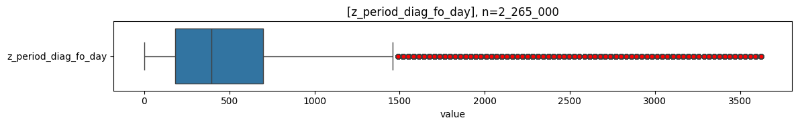
    

    
    column               |   count   | min | lower |   q25   | median  |  mean   |   q75   | upper |  max  |   std   |  cv   |      sum     
    ---------------------+-----------+-----+-------+---------+---------+---------+---------+-------+-------+---------+-------+--------------
    z_period_diag_fo_day | 2_236_595 |   0 |     0 | 183.000 | 393.000 | 480.916 | 700.000 | 1_461 | 3_624 | 399.063 | 0.830 | 1_075_614_089
    

