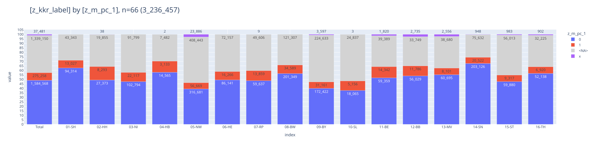
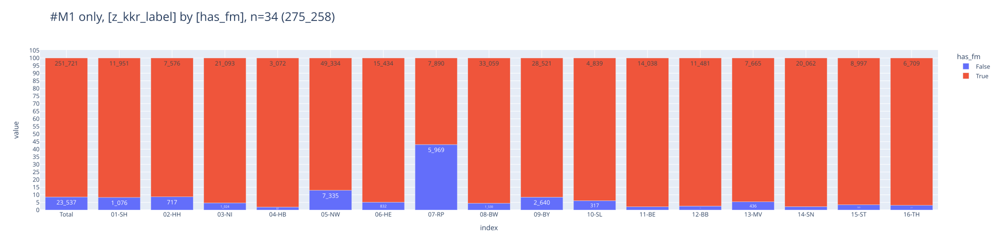
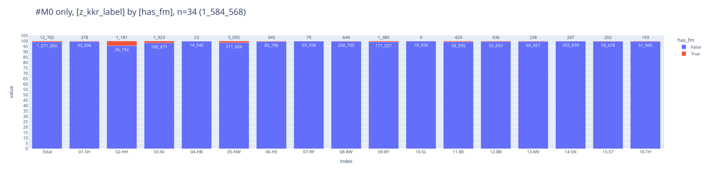

# fernmetastasen

    🐍 3.12.8 | 📦 pygwalker: 0.4.9.15 | 📦 pandas: 2.3.3 | 📦 numpy: 1.26.4 | 📦 duckdb: 1.4.1 | 📦 pandas-plots: 0.20.6 | 📦 connection-helper: 0.13.1

## dataset
- filter
  - `z_dy` 2020-2022
- metrics
  - tum, pat, fm

 

    Anzahl Patienten: 2_731_110
    Anzahl Tumoren: 3_236_457
    Anzahl FM: 488_024
    🗄️ fm-items,M1,2020-2022	3_414_096, 9
    	("fm_localisation, z_tum_id, z_pat_id, z_kkr_label, z_dy, z_icd10_3d, z_m_pc_1, M_p, FernmetastaseId")
    ┌─────────────────┬──────────────────────┬──────────────────────┬─────────────┬───────┬────────────┬──────────┬─────────┬───────────────────────┐
    │ fm_localisation │       z_tum_id       │       z_pat_id       │ z_kkr_label │ z_dy  │ z_icd10_3d │ z_m_pc_1 │   M_p   │    FernmetastaseId    │
    │     varchar     │       varchar        │       varchar        │   varchar   │ int32 │  varchar   │ varchar  │ varchar │        varchar        │
    ├─────────────────┼──────────────────────┼──────────────────────┼─────────────┼───────┼────────────┼──────────┼─────────┼───────────────────────┤
    │ NULL            │ 4aa076ac-0f31-422b…  │ 57ff7c20-805a-49bd…  │ 05-NW       │  2023 │ C34        │ 1        │ NULL    │ e2d5ee5f-da76-41e7-…  │
    │ NULL            │ 4aa0e730-3d05-4a0f…  │ 0ea0564e-e2c5-47ce…  │ 09-BY       │  2023 │ C80        │ NULL     │ NULL    │ 0a4ef525-f9b8-474e-…  │
    │ NULL            │ 4aa10d9b-9b36-4639…  │ bae38382-ab24-4609…  │ 06-HE       │  2024 │ C20        │ NULL     │ NULL    │ 26c37142-2321-4fed-…  │
    └─────────────────┴──────────────────────┴──────────────────────┴─────────────┴───────┴────────────┴──────────┴─────────┴───────────────────────┘
    

## 🕹️ interactive

## M1 vs has_fm
- `M1`: either M_c or M_p
- `has_fm`: any FM is assigned to tumor?

### share of M1 in all tumors
- 10% of all tumors have `M1` (273k)

    

    

### share of has_fm in M1
- 10% of `M1` have no FM assigned

    

    

    

    

