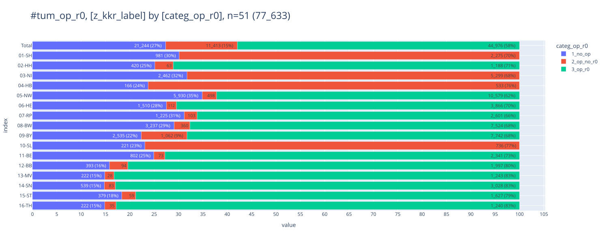
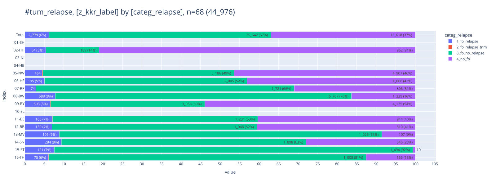
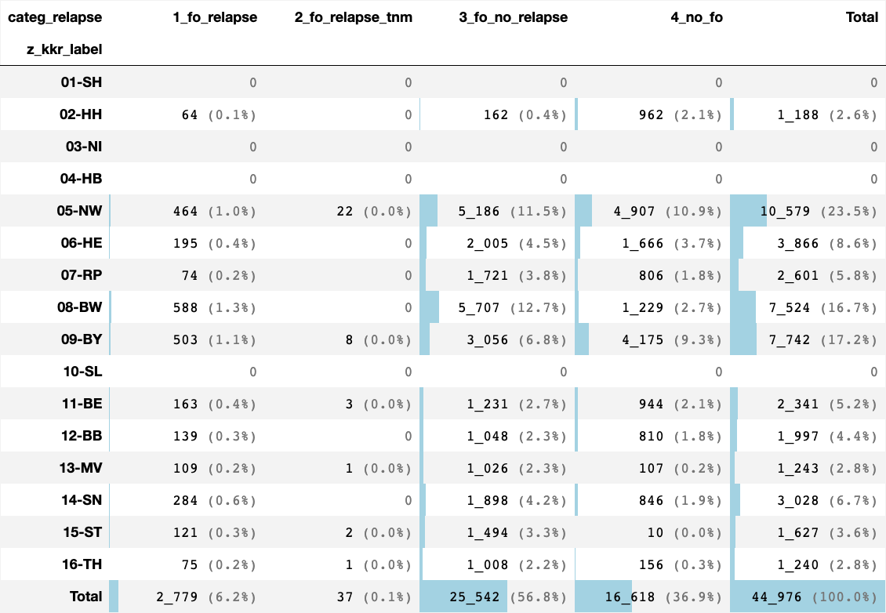
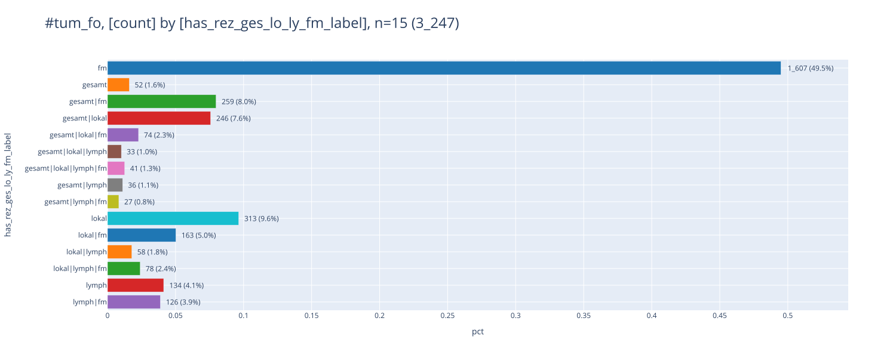
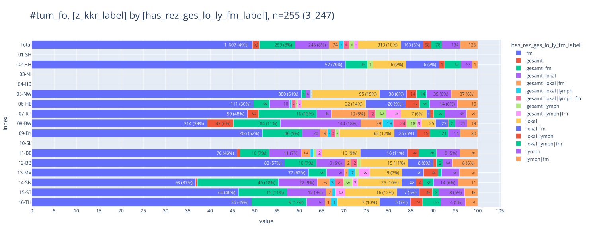

# [relapse](#toc0_)

**enge Definition eines Rezidivs** 
- Filter: lokaler Beurteilung Residualstatus = R0 (UND M <> 1)
- Rezidiv wenn  
  - Gesamtbeurteilung: Y  oder  
  - Lokaler Tumorstatus: R  oder  
  - Tumorstatus Lymphknoten:R oder  
  - Verlauf Fernmetastasen:R   

**erweiterte Definition (Verworfen)**
- Rezidiv wenn
  - (TNM)r_Symbol:r UND 
  - (Folgeereignis T>0 oder Folgeereignis N>0 oder Folgeereignis M>0)
 

**Table of contents**    
- [relapse](#toc1_)    
  - [⚙️ settings](#toc1_1_)    
  - [📆 data as of](#toc1_2_)    
  - [op](#toc1_3_)    
  - [analysis relapse categorization](#toc1_4_)    
  - [bitmask](#toc1_5_)    

<!-- vscode-jupyter-toc-config
	numbering=false
	anchor=true
	flat=false
	minLevel=1
	maxLevel=6
	/vscode-jupyter-toc-config -->
<!-- THIS CELL WILL BE REPLACED ON TOC UPDATE. DO NOT WRITE YOUR TEXT IN THIS CELL -->

    🐍 3.12.8 | 📦 pygwalker: 0.4.9.15 | 📦 pandas: 2.3.3 | 📦 numpy: 1.26.4 | 📦 duckdb: 1.4.1 | 📦 pandas-plots: 0.21.2 | 📦 connection-helper: 0.13.1

## [⚙️ settings](#toc0_)

## [📆 data as of](#toc0_)

    sqlite db file:          2025-11-11_data_clin.duckdb
    data tag:                v2.3
    last kkr data import:    2025-09-30
    sql table created:       2025-11-11 11:52:01
    doi:                     10.18444/5.03.01.0005.0021.0002
    document created:        2025-11-11 16:04:06

## [tum vs op](#toc0_)

    FILTER: z_dy=2020 and z_icd10_3d in ('C50') | darin 70_309 Operationen, 77_633 Tumore

    

    

## [analysis relapse categorization](#toc0_)
- gezählt sind Tumore
- Kategorien
  - `1_fo_relapse` - Tumore mit Rezidiv nach enger Definition
  - `2_fo_relapse_tnm` - Tumore mit Rezidiv nach erweiterter Definition
  - `3_fo_no_relapse` - Tumore mit Folgeereignis ohne o.a. Rezidiv
  - `4_no_fo` - Tumore ohne Folgeereignis
  - `9_unknown` - UNbekannt

    FILTER: z_dy=2020 and z_icd10_3d in ('C50') and upper(left(op.Lokale_Beurteilung_Residualstatus,2)) = 'R0' | darin 44_976 Tumore

    

    

    

    

## [combinations](#toc0_)

    FILTER: z_dy=2020 and z_icd10_3d in ('C50') and has_rez_ges_lo_ly_fm_label != '-' | darin 3_247 Folgeereignisse

    

    

    

    

