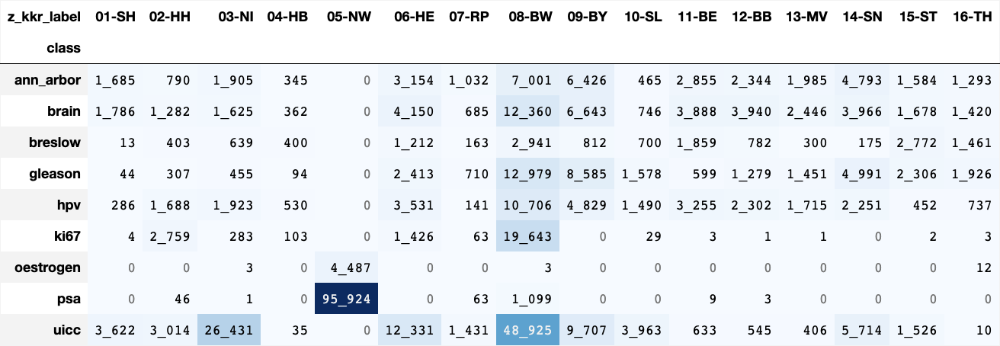

# further classifications

    🐍 3.12.8 | 📦 pygwalker: 0.4.9.15 | 📦 pandas: 2.3.3 | 📦 numpy: 1.26.4 | 📦 duckdb: 1.4.1 | 📦 pandas-plots: 0.21.2 | 📦 connection-helper: 0.13.1

## [📆 data as of](#toc0_)

    sqlite db file:          2025-11-11_data_clin.duckdb
    data tag:                v2.3
    last kkr data import:    2025-09-30
    sql table created:       2025-11-11 11:52:01
    doi:                     10.18444/5.03.01.0005.0021.0002
    document created:        2025-11-11 16:05:20

    array(['19q', '1p', '1p19q-Deletion', 'AAIPI', 'ABSTANDPT_MM', 'ADOREG',
           'AEG', 'AEG (Ösophagus)', 'AEG n Siewert', 'AEG nach Siewert',
           'AEG/Siewert (Ösophagus/Kardia)', 'AEG/Siewert-Klassifikation',
           'AJC - Osteosarkome', 'AJC - Weichteile', 'AJC/UICC', 'AJCC',
           'AJCC (Haut)', 'AJCC (kutane T-Zell-Lymphome)',
           'AJCC (nicht Haut)', 'AJCC 2016', 'AJCC Klassifikation MM 2016',
           'AJCC Stadieneinteilung MM 2017', 'AJCC+TNM (Malignes Melanom)',
           'AJCC-STADIUM', 'AJCC-Stadieneinteilung', 'AJCC-malignes Melanom',
           'ALK', 'AML ELN - C92.0', 'AML ELN-Klassifikation (2010)',
           'AML EuropLeukNet 2017', 'AML EuropLeukNet 2017 (ELN)',
           'AML EuropLeukNet 2022', 'AML European Leukemia Net',
           'AML European LeukemiaNet', 'ANN_ARBOR', 'ANN_ARBOR_BULKY',
           'ANN_ARBOR_EXTRA', 'ANN_ARBOR_MILZ', 'ANN_ARBOR_STADIUM',
           'ANN_ARBOR_ZUSATZ', 'AP (alkalische Phosphatase)',
           'ASA Risikoklassifikation',
           'Adenokarzinome des ösophago-gastralen Übergangs (AEG), Klassifikation nach Siewer',
           'AllgDiff', 'Ann Arbor', 'Ann Arbor Zusatz', 'Ann-Arbor',
           'Ann-Arbor nach Musshoff', 'Ann-Arbor-Klass. nach Musshoff',
           'Ann-Arbor-Klassifikation', 'Ann-Arbor-Klassifikation (Lymphom)',
           'Ann-Arbor-Stadium', 'Ann-Arbor-Stadium (inkl. Zusat',
           'Ann-Arbor-Stadium: Zusatz X = bulky disease', 'Ann-Arbor-Zusatz',
           'AnnArbor', 'AnnArbor Zusatz', 'Ann_Arbor', 'Ausbreitung',
           'Ausbreitung bei non-Hodgkin-Lymphom (Kinder)', 'B-Klassifikation',
           'BCLC', 'BCLC (Barcelona Clinic Liver C', 'BCLC (HCC) aktuell',
           'BCLC (LeberCA EASL)', 'BCLC (alt)', 'BCLC (neu ab 2022)',
           'BCLC Stadium', 'BCLC-Klassifikation', 'BCLC-Klassifikation (HCC)',
           'BCLC-Klassifikation (HCC) (alt)', 'BCLC-Stadium', 'BECKER',
           'BI-RADS', 'BINET', 'BISMUTH', 'BISMUTHCORLETTE', 'BK', 'BL-IPI',
           'BRAF', 'BRCA1,2-Mutation', 'BRESLOW', 'BRESLOW_MM', 'Barcelona',
           'Barcelona Clinic Liver Cancer Staging System',
           'Barcelona Clinic Liver Cancer Staging System/BCLC-Klassifikation (HCC)',
           'Barrett-CA Mukosatyp (nur C15)', 'Beta-2-Mikroglobulin', 'Binet',
           'Binet (CLL)', 'Binet (für CLL)', 'Binet bei CLL', 'Binet-Stadium',
           'Binet: Risikogruppe bei CLL', 'Bismuth',
           'Bismuth (Klatskin-Tumor)', 'Bismuth (neu ab 2022)',
           'Bismuth Corlette', 'Bismuth Klassifikation', 'Bismuth-Corlette',
           'Bismuth-Corlette-Klassifik.', 'Bismuth-Klass.(Klatskin-Tu.)',
           'Bochumer Regressionsgrad', 'Bochumer Regressionsgrading',
           'Borrmann', 'Breslow', 'Breslow (in mm)',
           'Breslow (max. Tumordicke)', 'Breslow 2016', 'Breslow Index',
           'Breslow Tumordicke', 'Breslow veraltet', 'Breslow- Index',
           'Breslow-Index', 'Breslow-Index_mod_4mm',
           'Bronchialkarzinome,kleinzellig', 'CA 19-9', 'CEA', 'CEA-WERT',
           'CHILD', 'CHILD-PUGH-SCORE', 'CIN', 'CIN (Graduierung)',
           'CIN2, VAIN2, VIN2', 'CIN2, VAIN2, VIN2, AIN2', 'CLARK',
           'CLARK-Level (Eindringtiefe)', 'CLARKLEVEL', 'CLIP', 'CLL - IPI',
           'CLL nach Binet', 'CLL nach Rai', 'CLL-IPI', 'CME', 'CML',
           'CML-Erkrankungsphase', 'CML-Hasford-Risiko', 'CML-Phase',
           'CML-Phasen', 'CMML', 'CMNL', 'COG ALL staging', 'CPSS',
           'CPSS (CMML)', 'CPSS-Molekular', 'CPSS-R', 'CRAB',
           'CRAB-Kriterien', 'CRM-Klassifikation', 'Cervantes-Score', 'Child',
           'Child-Pugh', 'Child-Pugh-Score',
           'Child-Pugh-Score zur Beurteilung der Schwere einer Leberzirrhose',
           'Chron. myeloische Leukämie', 'Chron.myel.Leukämie', 'Clark',
           'Clark Level', 'Clark-Level', 'DARM: ABSTAND_ABORAL',
           'DARM: ABSTAND_MESOREKTALE_FASZIE', 'DARM: ABSTAND_ZIRKULAER',
           'DARM: MMR-PROTEINE', 'DARM: RISIKO_PATIENTENFRAGEBOG',
           'DARM: RISIKO_PATIENTENFRAGEBOGEN', 'DCIS-Grading WHO',
           'DCIS-Grading WHO (Mamma)', 'DDG (Mal. Melanom)',
           'DDG (Melanom) ab 2002', 'DDG (Melanom) bis 2001',
           'DETRUSORMUSKULATUR MITERFASST', 'DGHO-ET', 'DIPP-plus-Score',
           'DIPPS', 'DIPPS (Risikogruppe)', 'DIPPS (Score)',
           'DIPPS-Plus (Risikogruppe)', 'DIPPS-Plus (Score)', 'DIPSS',
           'DIPSS plus', 'DIPSS-PLUS (PMF)', 'DIPSS-Plus', 'DIPSS-Plus-Score',
           'DIPSS-Score', 'DIPSS-plus-Score', 'DM in cm', 'DUKES',
           'DURIE SALMON', 'DURIESALMON', 'DURIESALMON_STADIUM',
           'DURIESALMON_ZUSATZ', 'DURIE_SALMON', 'DWORAK',
           'Dickemessung Breslow', 'Dukes',
           'Dukes-Klassif. beim Colorektal-Ca.', 'Durie', 'Durie Salmon',
           'Durie und Salmon', 'Durie und Salmon (1975)',
           'Durie und Salmon (Mu.Myelome)', 'Durie und Salmon/ ISS',
           'Durie und Salmon/Zusatz', 'Durie-Salmon-Stadium',
           'Durie-Salmon-Zusatz', 'Durie/Salmon', 'EB nach WHO', 'EBV',
           'EGFR E18-21', 'EGIL', 'EGIL ALL', 'ELLIS-Kateg. Mammastanzpräp.',
           'ELN', 'ELN - C92.0', 'ELN - C92.1', 'ELN 2017', 'ELN 2022',
           'ELN Klassifikation', 'ELN-KLASSIFIKATION',
           'ELN-Klassfika nehmention (CML)', 'ELN-Klassifikation',
           'ELN-Klassifikation (AML)', 'ELN-Klassifikation (C92.0)',
           'ELN-Klassifikation (C92.1)', 'ELN-Klassifikation - C92.0',
           'ELN-Klassifikation - C92.1', 'ELN-Risikogruppe',
           'ELN-Risikogruppe 2022 (AML)', 'ELN_AML', 'ELN_CML', 'ELTS',
           'ENDOCA_INFILTRATION', 'ENNEKING', 'EORTC', 'EORTC (Progression)',
           'EORTC (Rezidiv)', 'EORTC Risikoklass. Blase',
           'EORTC Risikoklassifkation', 'EORTC-RISIKO',
           'EORTC-Risk (HarnblasenCa Ta/T1)', 'EPSTEIN', 'ER', 'ER %',
           'ER Östrogenrezeptor', 'ET', 'ET Risikoeinteilung', 'ET-Score',
           'EUTOS Risikogruppe', 'EUTOS Risikoklasse (CML)',
           'EUTOS Scoe: 7*Basophile+4*Milz', 'EUTOS Score', 'EUTOS-SCORE',
           'EUTOS-Score', 'EUTOSSCORE', 'EUTOS_SCORE', 'EXPOSITIONEN',
           'Einteilung AEG-Karzinome', 'Elston und Ellis (Klassen)',
           'Elston und Ellis - Score', 'Elston und Ellis Score',
           'Elston/Ellis grading system', 'Enneking',
           'Epstein Grading-Schema', 'Epstein-Grading',
           'Epstein-Grading (Prostata)', 'Epstein-Grading (Prostata-',
           'Epstein-Grading (RUED)', 'FAB', 'FAB (2000, Basisdok. 5.A.)',
           'FAB (AML und ALL)', 'FAB (Akute myel. Leukämien)',
           'FAB (Leukämien)', 'FAB (TUDOK)', 'FAB (für akute Leukämien)',
           'FAB (nach Basisdok. 4. Aufl.)', 'FAB - AML/ALL',
           'FAB - Klassifikation (AML)', 'FAB - MDS', 'FAB - Typ L2',
           'FAB - Typ M1', 'FAB - Typ M4', 'FAB - Typ M5', 'FAB ALL',
           'FAB AML', 'FAB MDS', 'FAB für MDS', 'FAB für akute Leukämien',
           'FAB- Klassifikation (ALL)', 'FAB-AML', 'FAB-Klassifikation',
           'FAB-Klassifikation (AML,ALL)', 'FAB-MDS', 'FAB-MIC', 'FAB-Subtyp',
           'FGFR4', 'FIGO', 'FIGO   -   Corpus uteri', 'FIGO (Cervix/Corpus)',
           'FIGO (Korpuskarzinom)', 'FIGO (Ovarialkarzinom)', 'FIGO (TUDOK)',
           'FIGO (Vaginalkarzinom)', 'FIGO (Vulvakarzinom)',
           'FIGO (Zervixkarzinom)', 'FIGO (alle GYN Tumore)',
           'FIGO (alle TU)', 'FIGO (alle Tu.)', 'FIGO (alle gyn. Tu.)',
           'FIGO (klinisch)', 'FIGO (mindestens)', 'FIGO - Ovar / Peritoneum',
           'FIGO - Schwangerschaftstumoren', 'FIGO 2014',
           'FIGO 2014 (Ovar,Tube,prim.Per)', 'FIGO-Cervix',
           'FIGO-Cervix (5) vor 2014', 'FIGO-Corpus',
           'FIGO-Corpus (5) vor 2014', 'FIGO-Ovar', 'FIGO-Ovar vor 2014',
           'FIGO-Stadium', 'FISH', 'FLETCHER', 'FLETCHER-RISIKOGRUPPE',
           'FLIP-Index', 'FLIPI', 'FLIPI (Follikulaere Lymphome)',
           'FLIPI (Follikuläre Lymphome)', 'FLIPI Prognose Index', 'FLIPI2',
           'FNCLCC', 'FNCLCC (Sarkome)', 'FNCLCC GRADING', 'FNCLCC-Grading',
           'FNCLCC-Grading (CREDOS)', 'FNCLCC-Grading-System', 'FNCLCC-Score',
           'FNCLCC.', 'FNCLCCG', 'FORMEN HCL', 'FUHRMAN', 'FUHRMANN',
           'Fibrosegrad', 'Figo', 'Figo (Ovar)', 'Follikuläres Lymphom',
           'Form der Haarzell-Leukämie', 'Formen',
           'Formen der Haarzellleukämie', 'Fuhrman-Graduierungssystem',
           'Fuhrmann', 'Fuhrmann-Klassifikation',
           'Fédération Nationale des Centr', 'GHSG', 'GHSG Risikogruppe',
           'GHSG Risikogruppen Hodgkin-Lymphome', 'GHSG-Risikogruppen',
           'GIST', 'GIST-Klassifikation', 'GIST-Klassifikation n.Fletcher',
           'GIST: Risiko nach Miettinen und Lasota (2006)', 'GLEASON',
           'GLEASON SCORE', 'GLEASONGRADING1', 'GLEASONGRADING2', 'GLEASONS',
           'GLEASONSANLASS', 'GLEASONSCORE', 'GNEUE', 'GRADING_WHO_1973',
           'Gamma-GT', 'Gleas.-Summe', 'Gleason', 'Gleason Score',
           'Gleason-Grading', 'Gleason-Grading (prim. Grad)',
           'Gleason-Graduierung (ISUP)', 'Gleason-Gruppe (WHO 2016)',
           'Gleason-Muster', 'Gleason-Score', 'Gleason-Score gesamt',
           'Gleason-modif.', 'Gonzalez-Crussi-Grading', 'Grad', 'Grade Group',
           'Grading (WHO 1973)', 'Grading nach Lauren', 'Grading nach Laurén',
           'Graduierungsgruppe', 'H3K27', 'HCT-CI', 'HELPAP',
           'HELPAP-Grading', 'HER-2-neu', 'HER2-NEU', 'HER2-neu',
           'HER2-neu (C00-C14,C15,C16)', 'HER2/NEU (C00-C14,C15,C16) [P/N]',
           'HER2NEU', 'HER2_Status', 'HNPCC', 'HOLOYE', 'HP', 'HPV',
           'HPV (Humanes Papilloma Virus)', 'HPV-DNA-TEST', 'HR-ER', 'HR-PR',
           'HSIL', 'Haggitt-Level', 'Hannover-Klassifikation',
           'Hasford-Score', 'Hasford-Score (CML)', 'Helpap',
           'Helpap - pluriformer Aufbau', 'Helpap - uniformer Aufbau',
           'Her2-neu Status', 'Her2neuStatus', 'Hughes', 'IASLC',
           'IASLC (kleinz.BCA)', 'IC-SCORE', 'ICC 2022', 'ICDOM',
           'IDH1,2-Mutation', 'IDH1,2-Mutation (Gliom)', 'IGCCC', 'IGCCCG',
           'IGCCCG (1997)', 'IGCCCG (UCT)', 'IGCCCG PROGNOSE', 'IGHV',
           'IMDC Score', 'IMDC Score (Niere)', 'INSS',
           'INSS Intl. Neuroblastoma Stag.', 'IPI', 'IPI (Hodgkin)',
           'IPI (NHL)', 'IPI (NHL) - Risiko-Klassen',
           'IPI (NHL) altersadaptiert', 'IPI CLL  ( 6)',
           'IPI altersadaptiert', 'IPI-ZNS', 'IPPS-R', 'IPSS', 'IPSS (MDS)',
           'IPSS (PMF)', 'IPSS (Risikogruppe)', 'IPSS (Score)',
           'IPSS R low risk Score', 'IPSS Score', 'IPSS-M', 'IPSS-R',
           'IPSS-R (MDS)', 'IPSS-R (MDS) [Cat. & Scores]',
           'IPSS-R (MDS)zu IPSS', 'IPSS-R (MPN)', 'IPSS-R (Risikogruppe)',
           'IPSS-R (Score)', 'IPSS-R (für MDS)', 'IPSS-R Score',
           'IPSS-R-Score', 'IRS', 'ISCL/EORTC', 'ISCL/EORTC-Stadien',
           'ISLC/EORTC', 'ISLC/EORTC Mycosis fung./Sézary-S.',
           'ISLC/EORTC(2007) Myc.Fung/Sez.', 'ISS',
           'ISS (Internat. Staging System)', 'ISS (Plasmozyt./Multip.Myelom)',
           'ISS Score', 'ISS-R', 'ISS-Score', 'ISS-Stadium',
           'ISSMW- Risiko-Score', 'ISSWM', 'ISSWM (Morbus Waldenstroem)',
           'ISSWM (Morbus Waldenström)', 'ISUP', 'ISUP- Nierenzellkarzinome',
           'ISUP/WHO', 'ISUP/WHO-Grad 14/16 (Epstein)', 'ISUPGLEASON', 'ISUp',
           'IWG-MRT (b. Osteomyelofibrose)', 'Indiana-Klassifikation',
           'Internationales Staging-System beim multiplen Myelom',
           'Intl. Neuroblastoma Stag. INSS',
           'Intraepitheliale Neoplasie Grad', 'Invasions-Level', 'JANSEN',
           'Jansen', 'KAPOSI SUBTYP', 'KASTRATIONSRESISTENT', 'KERNGRAD',
           'KI-67 (MIB-1)', 'KI67', 'KI67 %', 'KI67%', 'KLIN. TUMORGRÖßE',
           'KNOSP', 'KOOS-GRADIERUNG', 'KRAS', 'Ki-67', 'Ki67',
           'Ki67-Proliferationsindex', 'Kiel', 'Kiel-Klassifikation',
           'Kikuchi', 'Kikuchi Klassifikation', 'Kikuchi-Klassifikation',
           'Klassif.Kleinzellige Karzinome', 'Klassifikation ISCL',
           'Klassifikation allg.', 'Klassifikation allg. (RUED)',
           'Klassifikation nach Sheldon', 'Klassifikation nach Siewert',
           'Kleinzeller', 'Kleinzelliges BronchialCA',
           'Klinisches Stadium Hoden-Tumor (historisch)',
           'KomplPostOP_ClavienDindo', 'L1CAM', 'LAURÉN', 'LDH', 'LUGANO',
           'Lauren', 'Lauren (Magen)', 'Lauren (Magenkarzinome)',
           'Lauren-Klassif. beim Magen-Ca.', 'Laurén', 'Lille-Dupriez-Score',
           'Lugano', 'Lugano (Hoden)', 'Lugano (MALT-Lym.)',
           'Lugano (MALT-Lymphom)', 'Lugano 1979 (Hodentumoren)',
           'Lugano Klassifik. 1979 (Hoden)', 'Lugano Klassifikation',
           'Lugano Modifikation Ann Arbor', 'Lugano-Klassifikataion',
           'Lugano-Klassifikation', 'Lugano-Klassifikation (Hoden-Tm.)',
           'Lugano-Klassiifikation (NHL)', 'M.E.R.C.U.R.Y',
           'M.E.R.C.U.R.Y.-Klassifikation', 'MALT-IPI', 'MARBURGER',
           'MASAOKA', 'MASAOKA-KOGA', 'MAYO', 'MDS', 'MDS (WHO)',
           'MDS WHO 2016', 'MDS nach FAB', 'MDS-Subtyp', 'MDS/MPN WHO 2016',
           'MDS/MPS WHO 2016', 'MELANOM.Breslow Index',
           'MELANOM.Breslow-Level [I-IV]', 'MELANOM???.Breslow Index',
           'MENOPAUSENSTATUS', 'MERCURY', 'MET', 'MGMT',
           'MGMT-Promotormethylierung', 'MGMT-STATUS', 'MIETTINEN',
           'MINABSTAND', 'MIPI',
           'MIPI  (Mantelzelllymphome) - MIPI auf Basis Calculator - mit Ki67',
           'MIPI (Mantelzelllymphome)', 'MIPI (Mantelzelllymphome) - MI',
           'MIPI (Mantelzelllymphome) - MIPI auf Basis Calculator - ohne Ki67',
           'MIPI (Mantelzelllymphome) - S-',
           'MIPI (Mantelzelllymphome) - S-MIPI', 'MIPI-Score', 'MIPI-c',
           'MIPIb (Mantelzelllymphome mit Ki67)',
           'MIPIb (Mantelzelllymphome) - MIPI auf Basis Calculator - mit Ki67',
           'MIPSS70', 'MIPSSv2', 'MITOSEGIST', 'MITOSERATE GIST',
           'MITOSERATE-GIST', 'MITOSERATE_GIST', 'MM auf NZN', 'MMR',
           'MOLEKULARER SUBTYP', 'MOLEKULARES_GRADING', 'MPN',
           'MRD (Minimale Resterkrankung)', 'MSI', 'MSI Status', 'MSI-Status',
           'MSISTATUS', 'MSI_INSTABILITAET', 'MSI_INSTABILITÄT', 'MSS',
           'MSS_STABILITAET', 'MSS_STABILITÄT', 'MSS_Stabilitaet',
           'MUSSHOFF (MALT-LYMPHOME)', 'MUSSHOFF (MALT-Lymphome)',
           'MacFarlane (Nebennieren-TU)', 'Marburger Klass.',
           'Marburger Klass. (SCLC)', 'Marburger Klassifikation', 'Mas',
           'Masaoka', 'Masaoka (Thymom)', 'Masaoka (neu ab 2022)',
           'Masaoka Staging', 'Masaoka Staging (Thymom)',
           'Masaoka-Klassifikation', 'Masaoka-Stadium', 'Mayo Score',
           'Melanomstadium', 'Mercury', 'Miettinen',
           'Miettinen Risikoklassifikation (GIST)',
           'Miettinen, Risiko nach  (GIST)', 'Mikrosatellitenstatus',
           'Mitose (CREDOS)', 'Mitose-Rate GIST', 'Mitosen/qmm', 'Mitoserate',
           'Mitoserate (GIST)', 'Mitoserate GIST', 'Mitoserate- GIST',
           'Mitoserate-GIST', 'Mitoserate-GIST [H/N]', 'Mitoserate:',
           'Mitsuyasu / Groopman', 'Mod. Wien-Klassifikation',
           'Modi.Wien-Klassifikation (MWK)', 'Motzer / MSKCC Score',
           'Motzer / MSKCC Score (Risiko)', 'Musshoff',
           'Musshoff-Klassif. beim Magenlymphom',
           'Musshoff/Radaszkiewicz (MALT)', 'Myelofibrose',
           'Myelofibrose WHO', 'Myelofibrose WHO Grad', 'Myelofibrosestadium',
           'Myeloma ISS', 'Myeloma-ISS', 'NACHSORGE', 'NTREK', 'NTRK1',
           'NTRK2', 'NTRK3', 'Niere', 'Nordic Score', 'Nordic-Score',
           'OMF Fibrose', 'ONCOTYPE-DX', 'OPERABILITÄT', 'Oestrogen_Status',
           'Okuda', 'P.vera', 'P16', 'P53', 'PAP', 'PAP-Klasse',
           'PATIENTENFALL', 'PD-L1', 'PD-L1 CPS', 'PD-L1 TPS', 'PDL1',
           'PDL1_CPS', 'PDL1_IC', 'PDL1_TPS', 'PF JAHR-MONAT', 'PGR', 'PGR %',
           'PHASEN CML', 'PHASENCML', 'PHASEN_CML', 'PHILADELPHIA',
           'PI-RADS-Score', 'PMF', 'POLE', 'PR', 'PR Progesteronrezeptor',
           'PROSTATA.Gleason-Group(WHO2016', 'PROSTATA.Gleason-OP-Score',
           'PROSTATA.Gleason-PE-Score', 'PROSTATA.Gleason-Score',
           'PROSTATA.WHO Gleason-Group (2016)', 'PROSTATA.WHO Grade Group???',
           'PROSTATA.WHO-Grading Prostatca', 'PSA', 'PTEN', 'PV-Score', 'Pap',
           'Papanicolaou', 'Pattern', 'Phasen CML', 'Phasen-CML',
           'Philadelphia', 'Plasmozytom - Ausbreitung',
           'Plasmozytom - Sezernierung', 'Progesteron_Status',
           'Progesteronrezeptor', 'Progesteronrezeptor positiv',
           'Prostatastanzbiopsie', 'R-IPI', 'R-IPI Score', 'R-ISS',
           'R-ISS (Rev.Intl.Stag.System)', 'R-ISS-Stadium',
           'R.E.N.A.L.-Score', 'RA (Resektionsausmaß)', 'RADASZKIEWICZ',
           'RAI', 'RAI (für CLL)', 'RAS', 'RASMUTATION', 'RCC papillaer Typ',
           'RCC papillär Typ', 'REGRESSIONSGRAD', 'RESEKTABILITÄT PANKREAS',
           'RET', 'REZEPTORSTATUS', 'RISIKOGRUPPEN GHSG',
           'RISIKOGRUPPEN_GHSG', 'RISIKOPROFIL C61', 'RISIKO_GHSG',
           'ROBINSON', 'ROBSON', 'ROS1', 'Radaszkiewicz',
           'Radaszkiewicz/Musshoff (MALT)', 'Rai', 'Rai - Klassifikation',
           'Rai bei CLL', 'Regressions-Grading nach Dworak: 3',
           'Regressionsgrad', 'Regressionsgrad b. Pankreas-Ca',
           'Regressionsgrad n. Dworak', 'Regressionsgrad nach Becker',
           'Regressionsgrad nach Dworak', 'Regressionsgrad nach Mandard',
           'Regressionsgrad nach Sinn', 'Regressionsgrading nach Dworak',
           'Revidiertes Internationales Staging-System beim multiplen Myelom',
           'Revised IPI', 'Revised ISS', 'Revised-IPI Score', 'Risiko',
           'Risiko nach Miettinen', 'Risiko nach Miettinen (GIST)',
           'Risiko nach Miettinen - GIST', 'Risikoeinstufung nach Miettine',
           'Risikogruppen GHSG', 'Risikoscore', 'Risikostatifizierung',
           'Risikostratifizierung', 'Robinson',
           'Robinson Stadium IIIA (N2) (Lunge)', 'Robinson-Klassifikation',
           'Robson', 'Rye - Klassif. bei Mb. Hodgkin', 'S-Stadium',
           'SALZER-KUNTSCHIK', 'SANZ', 'SANZ-SCORE', 'SANZSCORE', 'SCLC',
           'SICHERHEITSABSTAND', 'SIEWERT', 'SIOP', 'SLIM-CRAB-Kriterien',
           'SLiM', 'SLiM-CRAB-Kriterium', 'SMADA4', 'STK11',
           'Salmon Durie (Plasmozytom)', 'Salmon und Durie',
           'Salzer-Kuntschik grading system', 'Salzer-Kutschik', 'Sanz-Score',
           'Sarkom FNCLCC',
           'Schweregrad bei intraepithelialen Neoplasien (CIN,',
           'Schweregrad bei intraepithelialen Neoplasien (CIN, VIN, AIN,...)',
           'Score', 'Serumtumormarker', 'Serumtumormarker (Hoden)',
           'Serumtumormarker bei Hoden-Tumor', 'Siewert',
           'Siewert-Klassif. beim Adeno-Ca. des ösophagogastr.Übergangs(AEG)',
           'Siewert-Klassifikation (AEG)', 'Simpson', 'Slim-CRAB-Kriterien',
           'Sonstige', 'Stadien beim Kleinzeller-Bronchial-Ca.',
           'Stadien kutane T-Zell-Lymphome', 'Stadien nach Holland/Robson',
           'Stadieneinteilungen nach SIOP', 'Stadiengrupp.', 'Stadium',
           'Stadium (AJCC)', 'Stadium (Durie u. Salmon)',
           'Stadium nach LUGANO', 'Störkel-Index', 'TCluster', 'THOENNES',
           'TK (Thymidin-Kinase)', 'TNM', 'TNMB', 'TNM_2020_02',
           'TP53-DELETION FISH-DEL17P', 'TP53-MUTATIONSANALYSE',
           'TRANSFORMATION', 'TRG NACH MANDART',
           'TSH (Thyroidea stimulierendes Hormon)', 'TUMORDICKE',
           'TUMORGROESSE', 'TUMORGROESSE_INV', 'TUMORRUPTUR', 'Thoenes',
           'Thymus-Tumore nach Masaoka', 'Transformation NHL', 'Tumordicke',
           'Tumordicke veraltet', 'Tumorstadium', 'Typ nach Laurén', 'UICC',
           'UICC C18-C20 (bis Auflage 5)', 'UICC C23 (bis Auflage 5)',
           'UICC C50 (bis Auflage 5)',
           'UICC-Klassifikation, Bronchien und Lunge',
           'UICC-Klassifikation, Hoden', 'UICC-STADIUM', 'UICC-Stad. Anus',
           'UICC-Stad. Cervix uteri', 'UICC-Stad. Corpus uteri',
           'UICC-Stad. Dünndarm', 'UICC-Stad. Gallenblase',
           'UICC-Stad. Harnblase', 'UICC-Stad. Haut', 'UICC-Stad. Hoden',
           'UICC-Stad. Kolon, Rektum', 'UICC-Stad. Larynx',
           'UICC-Stad. Leber', 'UICC-Stad. Lippe, Mundhöhle',
           'UICC-Stad. Lunge', 'UICC-Stad. Magen',
           'UICC-Stad. Malignes Melanom', 'UICC-Stad. Mamma',
           'UICC-Stad. Nasopharynx', 'UICC-Stad. Nierenbecken,Ureter',
           'UICC-Stad. Oro-, Hypopharynx', 'UICC-Stad. Ovar',
           'UICC-Stad. Pankreas', 'UICC-Stad. Parotis,Speicheldr.',
           'UICC-Stad. Penis', 'UICC-Stad. Pleuramesotheliom',
           'UICC-Stad. Prostata', 'UICC-Stad. Schilddr. (medull.)',
           'UICC-Stad. Schilddr.(pap,foll)', 'UICC-Stad. Tuba uterina',
           'UICC-Stad. Vulva', 'UICC-Stad. Ösophagus', 'UICC-Stadien Niere',
           'UICC-Stadien allgemein (RUED)', 'UICC-Stadium', 'Unbekannt',
           'Untergruppen (ALL,MDS)', 'VAIN', 'VAIN - Atypiegrad', 'VALG',
           'VANNUYS', 'VIN', 'VIN - Graduierung', 'Van Nuys',
           'Van Nuys - Klassifikation', 'Van Nuys - Prognoseindex',
           'Van Nuys Prognose Index', 'WHO', 'WHO (Grading)', 'WHO (MDS)',
           'WHO Follikuläres Lymphom', 'WHO Gehirn', 'WHO Grad',
           'WHO Grad (Hirntumoren)', 'WHO Grading für Gehintumoren',
           'WHO Grading für Gehirntumoren', 'WHO Gruppe 5',
           'WHO Klassifikation', 'WHO für Gehirntumoren', 'WHO-2013',
           'WHO-2016', 'WHO-2021', 'WHO-AML', 'WHO-Fibrose', 'WHO-GEHIRN',
           'WHO-GRADING FÜR GEHIRNTUMOREN (nur C71,D32)', 'WHO-Gehirn',
           'WHO-Grad', 'WHO-Grad (Hirntumore)', 'WHO-Grad (Hirntumoren)',
           'WHO-Grad (ZNS)', 'WHO-Grad Hirntumore', 'WHO-Grad Thymus-TU',
           'WHO-Grad für Gehirntumore (neu ab 2022)',
           'WHO-Grading DCIS (Mamma)', 'WHO-Grading fuer Gehirntumoren',
           'WHO-Grading für Gehirntumoren', 'WHO-Grading für Prostata',
           'WHO-Gruppe', 'WHO-ISUP', 'WHO-ISUP Graduierungssystem',
           'WHO-ISUP Niere', 'WHO-Klassifik. d. Hirntumoren',
           'WHO-Klassifikation', 'WHO-Klassifikation (Hirn)',
           'WHO-Klassifikation MDS', 'WHO-Klassifikation MPS',
           'WHO-Klassifikation der MDS', 'WHO-Klassifikation des ZNS',
           'WHO-Klassifkation (MDS/MPD)', 'WHO-MDS', 'WHO-MDS 2016',
           'WHO-MDS 2022', 'WHO-MPS', 'WHO-Prognosegr. Prostata-Ca.',
           'WHO-Thymom', 'WHO-ZNS-Grad/WHO-2021 des ZNS',
           'WHO/ISUP Grading (Niere)', 'WHO/ISUP Gruppe', 'WHO2022',
           'WHOGEHIRN', 'WHOGRAD', 'WHOGehirn', 'WHOHypophyse', 'WHO_GEHIRN',
           'WHO_HISTOLOGIE', 'WPSS (MDS)', 'WPSS (Risikogruppe)',
           'WPSS (Score)', 'Wien', 'Wien-Klassifikation', 'ZNS-WHO-2021',
           'ZNS-WHO-Grad/WHO-2021 des ZNS', 'ZUORDNUNG C05.8',
           'ZUORDNUNG C06.9', 'ZUORDNUNG C14.8', 'ZUORDNUNG D00.0',
           'Zellreihe', 'Zelltyp (Lymphom)', 'aaIPI',
           'altersadaptierter IPI (NHL)',
           'grade bei Histo 81302, pap.Urothel-Ca.', 'high risk', 'isup',
           'kleinzell. Bronchial-Ca.', 'kleinzelliges Bronchial-Ca.',
           'mod. Wien-Klassifikation(RUED)', 'nach Lauren (1965)',
           'nach Siewert (AEG)', 'nach Sinn', 'p16',
           'p16-Überexpression [p/n]', 'p53',
           'pTNM-Stadium(WHO) Mammatumoren',
           'posttherap. FIGO-Klassif. bei gynäkologischen Tumoren',
           'prätherap. FIGO-Klassif. bei gynäkologischen Tumoren',
           'risk bei Colorektal-Ca pT1', 'sm',
           'sm (Invasionstiefe T1-Tumoren)', 'sonstige',
           'sonstige Klassifikation', 'uicc', 'unbekannt', 'Östrogenrezeptor',
           'Östrogenrezeptor positiv'], dtype=object)

    🗄️ db_class	653_691, 6
    	("z_tum_id, Name, Stadium, z_kkr_label, source, class")
    ┌──────────────────────────────────────┬────────────────────────┬─────────┬─────────────┬─────────┬─────────┐
    │               z_tum_id               │          Name          │ Stadium │ z_kkr_label │ source  │  class  │
    │               varchar                │        varchar         │ varchar │   varchar   │ varchar │ varchar │
    ├──────────────────────────────────────┼────────────────────────┼─────────┼─────────────┼─────────┼─────────┤
    │ 0e7ba901-8512-4346-933d-019da31093f7 │ PROSTATA.Gleason-Score │ 4+4=8   │ 09-BY       │ fol     │ gleason │
    │ c5635830-7173-4786-9724-59eac004e346 │ Gleason-Score          │ 3+4=7a  │ 06-HE       │ fol     │ gleason │
    │ a9b806d9-b1d7-468c-a3e8-7f30c6e0deb7 │ Gleason-Score          │ 4+4=8   │ 06-HE       │ fol     │ gleason │
    └──────────────────────────────────────┴────────────────────────┴─────────┴─────────────┴─────────┴─────────┘
    

    

    

