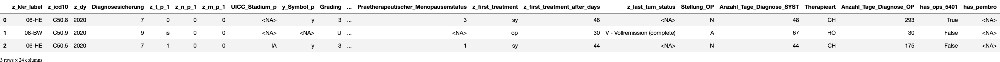

# [triple N](#toc0_)

**Table of contents**    
- [triple N](#toc1_)    
  - [📆 data as of](#toc1_1_)    
  - [dataset](#toc1_2_)    
  - [🕹️ interactive](#toc1_3_)    
  - [📉 plots](#toc1_4_)    
    - [HormonrezeptorStatus_Oestrogen](#toc1_4_1_)    
    - [Anzahl_Tage_Diagnose_SYST](#toc1_4_2_)    
      - [groups](#toc1_4_2_1_)    

<!-- vscode-jupyter-toc-config
	numbering=false
	anchor=true
	flat=false
	minLevel=1
	maxLevel=6
	/vscode-jupyter-toc-config -->
<!-- THIS CELL WILL BE REPLACED ON TOC UPDATE. DO NOT WRITE YOUR TEXT IN THIS CELL -->

    🐍 3.12.8 | 📦 pandas: 2.3.3 | 📦 numpy: 1.26.4 | 📦 duckdb: 1.4.1 | 📦 pandas-plots: 0.21.3 | 📦 connection-helper: 0.13.1

## [📆 data as of](#toc0_)

    sqlite db file:          2025-11-11_data_clin.duckdb
    data tag:                v2.3
    last kkr data import:    2025-09-30
    sql table created:       2025-11-11 11:52:01
    doi:                     10.18444/5.03.01.0005.0021.0002
    document created:        2025-11-11 18:55:23

## [dataset](#toc0_)

- **Tabellen**
  - `Tumor` - gefiltert
  - `OP` - nur erste pro Tumor
  - `SYST` - nur erste pro Tumor

- **nicht-standard Variablen**
  - `has_ops_5401` - true wenn dem Tumor >= 1 OPS `5-401.11` zugeordnet ist
  - `has_pembro` - true wenn dem Tumor >= 1 Substanz _oder_ Protokoll zugeordnet ist:
    - Code = `L01FF02`
    - _oder_ Bezeichnung = `Pembro|Keytruda` (regex)

- **Filter**
  - `z_icd10`: C50, D05
  - `z_sex`: w
  - `z_dy`: 2020 - 2023

- **Metriken**
  - es werden **Tumore** gezählt, jede 1:n Information (z.B. Behandlungen) gibt es nur einmal pro Tumor

 

    🗄️ is_ops_5401	150_263, 4
    	("z_tum_id, Code, Version, is_ops_5401")
    ┌──────────────────────────────────────┬──────────┬─────────┬─────────────┐
    │               z_tum_id               │   Code   │ Version │ is_ops_5401 │
    │               varchar                │ varchar  │ varchar │   boolean   │
    ├──────────────────────────────────────┼──────────┼─────────┼─────────────┤
    │ f2ed656c-fb4d-4ba1-809d-b6e8d6a3a014 │ 5-401.11 │ 2020    │ true        │
    │ ed66180c-28be-496c-9ca7-63df2de08546 │ 5-401.11 │ 2020    │ true        │
    │ 145b0873-b980-4119-a5b1-05e043e4eac9 │ 5-401.11 │ 2021    │ true        │
    └──────────────────────────────────────┴──────────┴─────────┴─────────────┘
    
    🗄️ is_pembro	187_380, 5
    	("z_tum_id, subst_code, subst_name, prot_name, is_pembro")
    ┌──────────────────────────────────────┬────────────┬───────────────┬──────────────────────────────────────┬───────────┐
    │               z_tum_id               │ subst_code │  subst_name   │              prot_name               │ is_pembro │
    │               varchar                │  varchar   │    varchar    │               varchar                │  boolean  │
    ├──────────────────────────────────────┼────────────┼───────────────┼──────────────────────────────────────┼───────────┤
    │ 6614ab80-2c09-438a-8d57-b2ffae3eb37c │ NULL       │ Pembrolizumab │ (Fehlt)                              │ true      │
    │ 15e65a59-50e2-4f11-b21d-a5b132bc1bc7 │ NULL       │ Pembrolizumab │ (Fehlt)                              │ true      │
    │ b345e223-7c2f-4d25-8c7f-2bbba565c54a │ NULL       │ Paclitaxel    │ Carboplatin/Paclitaxel/Pembrolizumab │ true      │
    └──────────────────────────────────────┴────────────┴───────────────┴──────────────────────────────────────┴───────────┘
    
    🗄️ tum	343_375, 19
    	("z_tum_id, z_kkr_label, z_icd10, z_dy, Diagnosesicherung, z_t_p_1, z_n_p_1, z_m_p_1, UICC_Stadium_p, y_Symbol_p, Grading, Morphologie_Code, HormonrezeptorStatus_Oestrogen, Her2neuStatus, HormonrezeptorStatus_Progesteron, Praetherapeutischer_Menopausenstatus, z_first_treatment, z_first_treatment_after_days, z_last_tum_status")
    ┌──────────────────────────────────────┬─────────────┬─────────┬───────┬───────────────────┬─────────┬─────────┬─────────┬────────────────┬────────────┬─────────┬──────────────────┬────────────────────────────────┬───────────────┬──────────────────────────────────┬──────────────────────────────────────┬───────────────────┬──────────────────────────────┬──────────────────────┐
    │               z_tum_id               │ z_kkr_label │ z_icd10 │ z_dy  │ Diagnosesicherung │ z_t_p_1 │ z_n_p_1 │ z_m_p_1 │ UICC_Stadium_p │ y_Symbol_p │ Grading │ Morphologie_Code │ HormonrezeptorStatus_Oestrogen │ Her2neuStatus │ HormonrezeptorStatus_Progesteron │ Praetherapeutischer_Menopausenstatus │ z_first_treatment │ z_first_treatment_after_days │  z_last_tum_status   │
    │               varchar                │   varchar   │ varchar │ int16 │      varchar      │ varchar │ varchar │ varchar │    varchar     │  varchar   │ varchar │     varchar      │            varchar             │    varchar    │             varchar              │               varchar                │      varchar      │            int32             │       varchar        │
    ├──────────────────────────────────────┼─────────────┼─────────┼───────┼───────────────────┼─────────┼─────────┼─────────┼────────────────┼────────────┼─────────┼──────────────────┼────────────────────────────────┼───────────────┼──────────────────────────────────┼──────────────────────────────────────┼───────────────────┼──────────────────────────────┼──────────────────────┤
    │ 8bb6d4e3-a87b-4308-88ac-fd0b8e5d5535 │ 05-NW       │ C50.9   │  2023 │ 0                 │ NULL    │ NULL    │ NULL    │ NULL           │ NULL       │ U       │ 8000/3           │ NULL                           │ NULL          │ NULL                             │ NULL                                 │ NULL              │                         NULL │ NULL                 │
    │ f6b58b9e-2bfd-4591-a61d-20a330df9702 │ 09-BY       │ C50.4   │  2021 │ 6                 │ 1       │ 1       │ 1       │ IV             │ y          │ 3       │ 8520/3           │ NULL                           │ NULL          │ NULL                             │ NULL                                 │ sy                │                           14 │ X - fehlende Angaben │
    │ 3b144fd1-052c-4624-8c34-c4589c5ebd88 │ 05-NW       │ C50.4   │  2022 │ 7                 │ 2       │ 1       │ 0       │ NULL           │ NULL       │ 2       │ 8520/3           │ NULL                           │ NULL          │ NULL                             │ NULL                                 │ NULL              │                         NULL │ NULL                 │
    └──────────────────────────────────────┴─────────────┴─────────┴───────┴───────────────────┴─────────┴─────────┴─────────┴────────────────┴────────────┴─────────┴──────────────────┴────────────────────────────────┴───────────────┴──────────────────────────────────┴──────────────────────────────────────┴───────────────────┴──────────────────────────────┴──────────────────────┘
    

    🗄️ all data	343_375, 25
    	("z_tum_id, z_kkr_label, z_icd10, z_dy, Diagnosesicherung, z_t_p_1, z_n_p_1, z_m_p_1, UICC_Stadium_p, y_Symbol_p, Grading, Morphologie_Code, HormonrezeptorStatus_Oestrogen, Her2neuStatus, HormonrezeptorStatus_Progesteron, Praetherapeutischer_Menopausenstatus, z_first_treatment, z_first_treatment_after_days, z_last_tum_status, Stellung_OP, Anzahl_Tage_Diagnose_SYST, Therapieart, Anzahl_Tage_Diagnose_OP, has_ops_5401, has_pembro")
    ┌──────────────────────────────────────┬─────────────┬─────────┬───────┬───────────────────┬─────────┬─────────┬─────────┬────────────────┬────────────┬─────────┬──────────────────┬────────────────────────────────┬───────────────┬──────────────────────────────────┬──────────────────────────────────────┬───────────────────┬──────────────────────────────┬──────────────────────────────┬─────────────┬───────────────────────────┬─────────────┬─────────────────────────┬──────────────┬────────────┐
    │               z_tum_id               │ z_kkr_label │ z_icd10 │ z_dy  │ Diagnosesicherung │ z_t_p_1 │ z_n_p_1 │ z_m_p_1 │ UICC_Stadium_p │ y_Symbol_p │ Grading │ Morphologie_Code │ HormonrezeptorStatus_Oestrogen │ Her2neuStatus │ HormonrezeptorStatus_Progesteron │ Praetherapeutischer_Menopausenstatus │ z_first_treatment │ z_first_treatment_after_days │      z_last_tum_status       │ Stellung_OP │ Anzahl_Tage_Diagnose_SYST │ Therapieart │ Anzahl_Tage_Diagnose_OP │ has_ops_5401 │ has_pembro │
    │               varchar                │   varchar   │ varchar │ int16 │      varchar      │ varchar │ varchar │ varchar │    varchar     │  varchar   │ varchar │     varchar      │            varchar             │    varchar    │             varchar              │               varchar                │      varchar      │            int32             │           varchar            │   varchar   │           int32           │   varchar   │          int32          │   boolean    │  boolean   │
    ├──────────────────────────────────────┼─────────────┼─────────┼───────┼───────────────────┼─────────┼─────────┼─────────┼────────────────┼────────────┼─────────┼──────────────────┼────────────────────────────────┼───────────────┼──────────────────────────────────┼──────────────────────────────────────┼───────────────────┼──────────────────────────────┼──────────────────────────────┼─────────────┼───────────────────────────┼─────────────┼─────────────────────────┼──────────────┼────────────┤
    │ 062c1937-ae46-4afa-9ec0-7a0b038aab0d │ 08-BW       │ C50.8   │  2020 │ 7                 │ 1       │ 0       │ 0       │ IA             │ NULL       │ 2       │ 8520/3           │ P                              │ N             │ P                                │ 3                                    │ op                │                           50 │ V - Vollremission (complete) │ A           │                       122 │ HO          │                      50 │ true         │ NULL       │
    │ 5b42ba34-b6d8-448d-9408-02c64bf51778 │ 08-BW       │ D05.1   │  2020 │ 7                 │ is      │ NULL    │ 0       │ NULL           │ NULL       │ L       │ 8500/2           │ P                              │ U             │ P                                │ 3                                    │ op                │                           53 │ V - Vollremission (complete) │ A           │                       185 │ HO          │                      53 │ false        │ NULL       │
    │ 5c7d8246-3e0a-4576-a471-dae78413ec7b │ 08-BW       │ C50.2   │  2021 │ 7                 │ 3       │ x       │ 0       │ NULL           │ NULL       │ 2       │ 8500/3           │ P                              │ N             │ P                                │ 3                                    │ op                │                           43 │ V - Vollremission (complete) │ A           │                        84 │ HO          │                      43 │ false        │ NULL       │
    └──────────────────────────────────────┴─────────────┴─────────┴───────┴───────────────────┴─────────┴─────────┴─────────┴────────────────┴────────────┴─────────┴──────────────────┴────────────────────────────────┴───────────────┴──────────────────────────────────┴──────────────────────────────────────┴───────────────────┴──────────────────────────────┴──────────────────────────────┴─────────────┴───────────────────────────┴─────────────┴─────────────────────────┴──────────────┴────────────┘
    

    ✅ tum count ok (343_375)

    🔵 *** df: all ***  
    🟣 shape: (343_375, 24)
    🟣 duplicates: 33_548  
    🟠 column stats all (dtype | uniques | missings) [values]  
    - index [0, 1, 2, 3, 4,]  
    - z_kkr_label (object | 16 | 0 (0%)) ['01-SH', '02-HH', '03-NI', '04-HB', '05-NW',]  
    - z_icd10 (object | 13 | 0 (0%)) ['C50.0', 'C50.1', 'C50.2', 'C50.3', 'C50.4',]  
    - z_dy (int16 | 4 | 0 (0%)) [2020, 2021, 2022, 2023,]  
    - Diagnosesicherung (object | 8 | 0 (0%)) ['0', '1', '2', '4', '5',]  
    - z_t_p_1 (object | 9 | 101_810 (30%)) ['0', '1', '2', '3', '4',]  
    - z_n_p_1 (object | 6 | 112_758 (33%)) ['0', '1', '2', '3', '<NA>',]  
    - z_m_p_1 (object | 3 | 169_824 (49%)) ['0', '1', '<NA>',]  
    - UICC_Stadium_p (object | 21 | 213_778 (62%)) ['0', '0is', '<NA>', 'I', 'IA',]  
    - y_Symbol_p (object | 2 | 304_527 (89%)) ['<NA>', 'y',]  
    - Grading (object | 13 | 5_392 (2%)) ['0', '1', '2', '3', '4',]  
    - Morphologie_Code (object | 195 | 5_393 (2%)) ['8000/0', '8000/1', '8000/3', '8000/6', '8000/9',]  
    - HormonrezeptorStatus_Oestrogen (object | 4 | 84_043 (24%)) ['<NA>', 'N', 'P', 'U',]  
    - Her2neuStatus (object | 4 | 74_717 (22%)) ['<NA>', 'N', 'P', 'U',]  
    - HormonrezeptorStatus_Progesteron (object | 4 | 86_145 (25%)) ['<NA>', 'N', 'P', 'U',]  
    - Praetherapeutischer_Menopausenstatus (object | 4 | 125_988 (37%)) ['1', '3', '<NA>', 'U',]  
    - z_first_treatment (object | 4 | 57_921 (17%)) ['<NA>', 'op', 'st', 'sy',]  
    - z_first_treatment_after_days (Int32 | 1_072 | 57_921 (17%)) [0, 1, 2, 3, 4,]  
    - z_last_tum_status (object | 11 | 207_457 (60%)) ['<NA>', 'B - klinische Besserung des Zustandes', 'D - divergentes Geschehen',  
    'K - keine Änderung', 'P - Progression',]  
    - Stellung_OP (object | 6 | 188_080 (55%)) ['<NA>', 'A', 'I', 'N', 'O',]  
    - Anzahl_Tage_Diagnose_SYST (Int32 | 1_222 | 191_634 (56%)) [-208, 0, 1, 2, 3,]  
    - Therapieart (object | 13 | 188_080 (55%)) ['<NA>', 'AS', 'CH', 'CI', 'CIZ',]  
    - Anzahl_Tage_Diagnose_OP (Int32 | 1_032 | 101_512 (30%)) [-1, 0, 1, 2, 3,]  
    - has_ops_5401 (boolean | 3 | 102_778 (30%)) [False, True, <NA>,]  
    - has_pembro (boolean | 3 | 305_441 (89%)) [False, True, <NA>,]  
    🟠 column stats numeric  
    
    column (n = 343_375)         |    present     | min  | lower |    q25    |  median   |   mean    |    q75    | upper |  max  |   std   |  cv  
    -----------------------------+----------------+------+-------+-----------+-----------+-----------+-----------+-------+-------+---------+------
    z_dy                         | 343_375 (100%) | 2020 |  2020 | 2_021.000 | 2_022.000 | 2_021.509 | 2_023.000 |  2023 |  2023 |   1.113 | 0.001
    z_first_treatment_after_days |  285_454 (83%) |    0 |     0 |    20.000 |    32.000 |    48.718 |    49.000 |    92 | 1_852 |  73.666 | 1.512
    Anzahl_Tage_Diagnose_SYST    |  151_741 (44%) | -208 |     0 |    28.000 |    46.000 |    70.680 |    78.000 |   153 | 1_901 | 104.747 | 1.482
    Anzahl_Tage_Diagnose_OP      |  241_863 (70%) |   -1 |    -1 |    22.000 |    37.000 |    73.139 |    72.000 |   147 | 1_905 |  91.336 | 1.249
    

    

    

## [🕹️ interactive](#toc0_)

## [📉 plots](#toc0_)

### [HormonrezeptorStatus_Oestrogen](#toc0_)

### [Anzahl_Tage_Diagnose_SYST](#toc0_)

#### [groups](#toc0_)

    

    

    
    column (n = 236_341)      |    present     | min | lower |  q25  | median |  mean  |  q75   | upper |  max  |  std   |  cv 
    --------------------------+----------------+-----+-------+-------+--------+--------+--------+-------+-------+--------+-----
    Anzahl_Tage_Diagnose_SYST | 236_341 (100%) |   0 |     0 | 34.00 |  64.00 | 125.85 | 137.00 |   291 | 1_901 | 179.19 | 1.42
    
    
    item (n = 236_341) | count  | min  | lower |  q25  | median |  mean  |  q75   | upper  |   max    |  std   |  cv 
    -------------------+--------+------+-------+-------+--------+--------+--------+--------+----------+--------+-----
    01-SH              |  7_390 | 0.00 |  0.00 | 35.00 |  61.00 | 114.38 | 116.00 | 237.00 | 1_578.00 | 165.32 | 1.45
    02-HH              |  5_744 | 0.00 |  0.00 | 34.00 |  61.00 | 163.81 | 187.00 | 414.00 | 1_728.00 | 245.32 | 1.50
    03-NI              | 18_714 | 0.00 |  0.00 | 36.00 |  58.00 | 102.82 | 110.00 | 221.00 | 1_581.00 | 134.56 | 1.31
    04-HB              |  2_100 | 0.00 |  0.00 | 38.00 |  56.00 | 103.05 |  97.00 | 184.00 | 1_611.00 | 157.30 | 1.53
    05-NW              | 45_645 | 0.00 |  0.00 | 30.00 |  60.00 | 131.06 | 144.00 | 315.00 | 1_754.00 | 197.88 | 1.51
    06-HE              | 16_094 | 0.00 |  0.00 | 35.00 |  63.00 | 113.79 | 132.00 | 277.00 | 1_848.00 | 148.77 | 1.31
    07-RP              |  9_788 | 0.00 |  0.00 | 43.00 |  80.50 | 119.69 | 141.00 | 288.00 | 1_377.00 | 130.62 | 1.09
    08-BW              | 26_158 | 0.00 |  0.00 | 31.00 |  54.00 |  81.55 |  92.00 | 183.00 | 1_901.00 | 124.95 | 1.53
    09-BY              | 36_014 | 0.00 |  0.00 | 34.00 |  69.00 | 137.17 | 180.00 | 399.00 | 1_701.00 | 181.45 | 1.32
    10-SL              |  3_492 | 0.00 |  0.00 | 33.00 |  49.00 |  88.21 |  90.00 | 175.00 | 1_212.00 | 113.99 | 1.29
    11-BE              |  9_707 | 0.00 |  0.00 | 29.00 |  62.00 | 124.99 | 143.00 | 314.00 | 1_540.00 | 170.09 | 1.36
    12-BB              | 10_677 | 0.00 |  0.00 | 31.00 |  63.00 | 138.89 | 156.00 | 343.00 | 1_748.00 | 201.86 | 1.45
    13-MV              |  7_328 | 0.00 |  0.00 | 45.00 |  84.00 | 153.73 | 163.00 | 340.00 | 1_708.00 | 207.30 | 1.35
    14-SN              | 19_617 | 0.00 |  0.00 | 38.00 |  80.00 | 159.17 | 200.00 | 443.00 | 1_720.00 | 218.66 | 1.37
    15-ST              |  9_732 | 0.00 |  0.00 | 41.00 |  87.00 | 146.33 | 174.00 | 373.00 | 1_501.00 | 188.45 | 1.29
    16-TH              |  8_141 | 0.00 |  0.00 | 36.00 |  72.00 | 132.78 | 154.00 | 331.00 | 1_563.00 | 181.36 | 1.37
    

