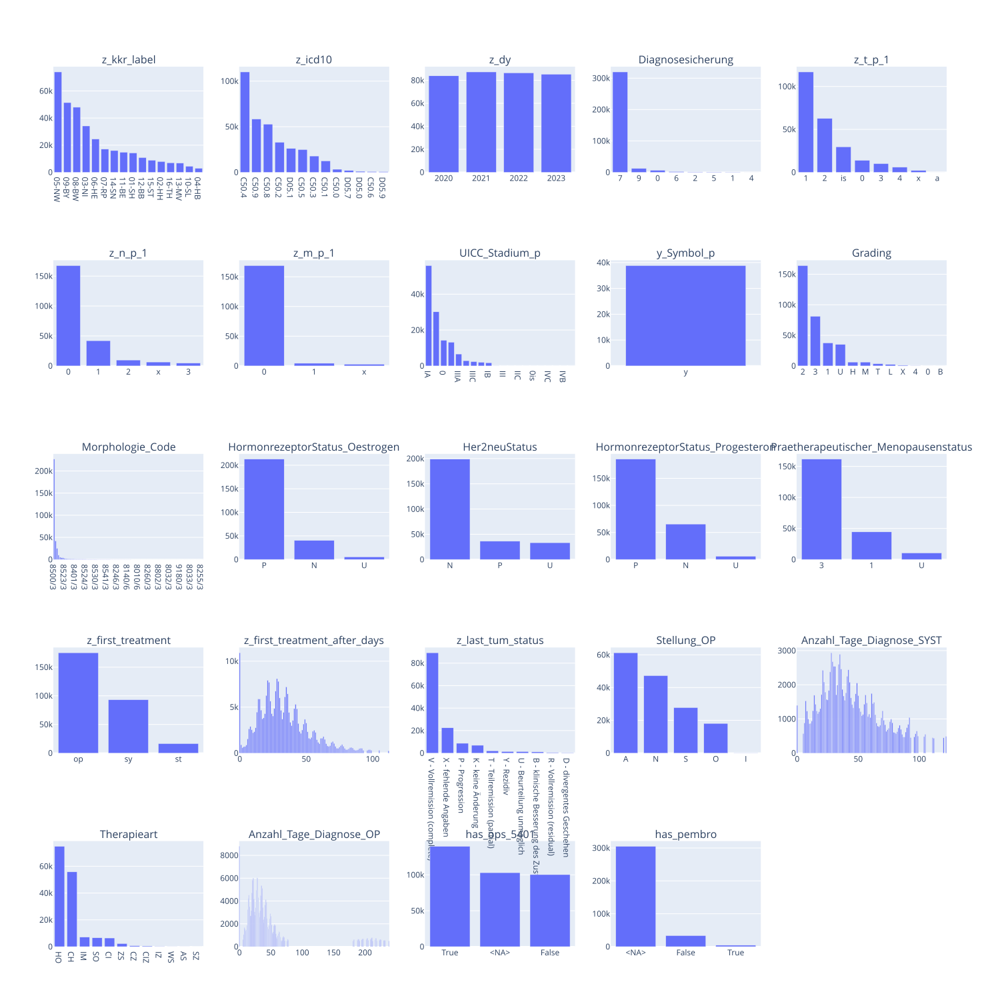
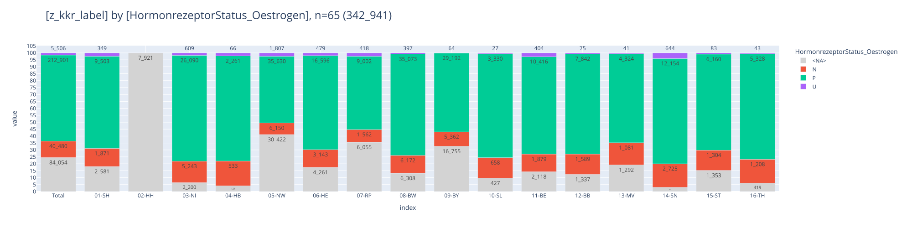
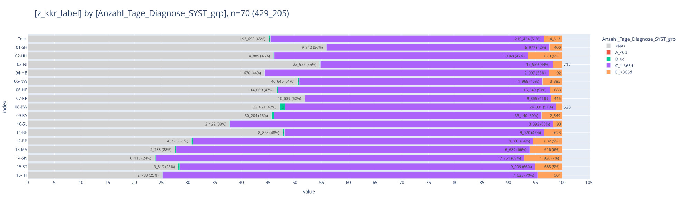
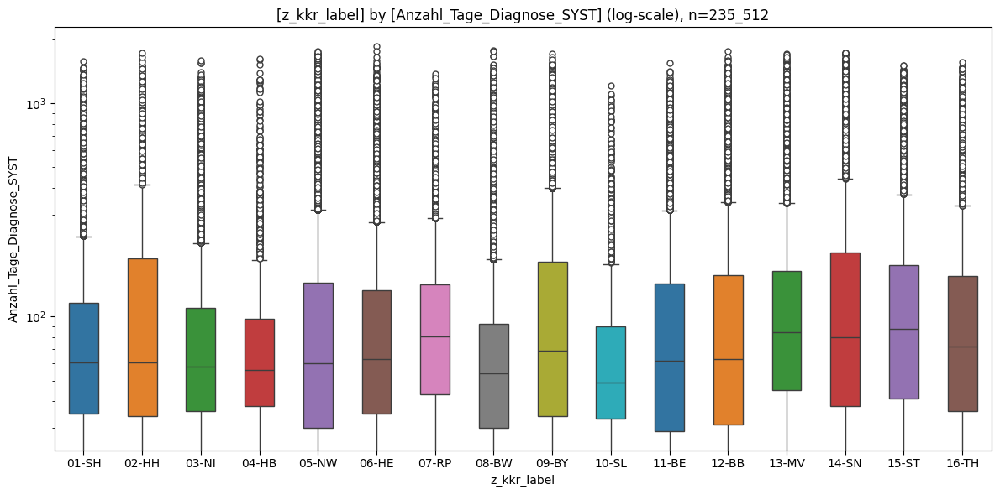

# [triple N](#toc0_)

**Table of contents**    
- [triple N](#toc1_)    
  - [📆 data as of](#toc1_1_)    
  - [dataset](#toc1_2_)    
  - [🕹️ interactive](#toc1_3_)    
  - [📉 plots](#toc1_4_)    
    - [HormonrezeptorStatus_Oestrogen](#toc1_4_1_)    
    - [Anzahl_Tage_Diagnose_SYST](#toc1_4_2_)    
      - [groups](#toc1_4_2_1_)    

<!-- vscode-jupyter-toc-config
	numbering=false
	anchor=true
	flat=false
	minLevel=1
	maxLevel=6
	/vscode-jupyter-toc-config -->
<!-- THIS CELL WILL BE REPLACED ON TOC UPDATE. DO NOT WRITE YOUR TEXT IN THIS CELL -->

    🐍 3.12.8 | 📦 pandas: 2.3.3 | 📦 numpy: 1.26.4 | 📦 duckdb: 1.4.1 | 📦 pandas-plots: 0.20.7 | 📦 connection-helper: 0.13.1

## [📆 data as of](#toc0_)

    sqlite db file:          2025-06-24_data_clin.duckdb
    data tag:                v2.2
    last kkr data import:    2025-05-27
    sql table created:       2025-06-24 13:47:18
    doi:                     10.18444/5.03.01.0005.0021.0001
    document created:        2025-10-31 19:00:38

## [dataset](#toc0_)

- **Tabellen**
  - `Tumor` - gefiltert
  - `OP` - nur erste pro Tumor
  - `SYST` - nur erste pro Tumor

- **nicht-standard Variablen**
  - `has_ops_5401` - true wenn dem Tumor >= 1 OPS `5-401.11` zugeordnet ist
  - `has_pembro` - true wenn dem Tumor >= 1 Substanz _oder_ Protokoll zugeordnet ist:
    - Code = `L01FF02`
    - _oder_ Bezeichnung = `Pembro|Keytruda` (regex)

- **Filter**
  - `z_icd10`: C50, D05
  - `z_sex`: w
  - `z_dy`: 2020 - 2023

- **Metriken**
  - es werden **Tumore** gezählt, jede 1:n Information (z.B. Behandlungen) gibt es nur einmal pro Tumor

 

    🗄️ is_ops_5401	149_953, 4
    	("z_tum_id, Code, Version, is_ops_5401")
    ┌──────────────────────────────────────┬───────────┬─────────┬─────────────┐
    │               z_tum_id               │   Code    │ Version │ is_ops_5401 │
    │               varchar                │  varchar  │ varchar │   boolean   │
    ├──────────────────────────────────────┼───────────┼─────────┼─────────────┤
    │ 77214160-8b3a-461a-bed7-dbd93577e5e1 │ 5-401.11  │ 2021    │ true        │
    │ 7a15c850-8304-4211-babf-7233a92b3b15 │ 5-401.11  │ 2023    │ true        │
    │ 219dcbff-a553-4a4d-8812-87fd4300ffa4 │ 5-401.11L │ 2021    │ true        │
    └──────────────────────────────────────┴───────────┴─────────┴─────────────┘
    

    🗄️ is_pembro	187_333, 5
    	("z_tum_id, subst_code, subst_name, prot_name, is_pembro")

    ┌──────────────────────┬────────────┬────────────┬──────────────────────────────────────────────────────────────────────────────────┬───────────┐
    │       z_tum_id       │ subst_code │ subst_name │                                    prot_name                                     │ is_pembro │
    │       varchar        │  varchar   │  varchar   │                                     varchar                                      │  boolean  │
    ├──────────────────────┼────────────┼────────────┼──────────────────────────────────────────────────────────────────────────────────┼───────────┤
    │ 7d05cba9-c127-4ec5…  │ L01BA04    │ NULL       │ Pembrolizumab                                                                    │ true      │
    │ 5b00ff9f-768e-437e…  │ L01FF02    │ NULL       │ neoadjuvante Systemtherapie mit 12x Pacliaxel weekly und 4x Carboplatin q3w ge…  │ true      │
    │ 4e1a2984-00d2-40c4…  │ L01FF02    │ NULL       │ Pembrolizumab, Pemetrexed                                                        │ true      │
    └──────────────────────┴────────────┴────────────┴──────────────────────────────────────────────────────────────────────────────────┴───────────┘
    
    🗄️ tum	342_941, 19
    	("z_tum_id, z_kkr_label, z_icd10, z_dy, Diagnosesicherung, z_t_p_1, z_n_p_1, z_m_p_1, UICC_Stadium_p, y_Symbol_p, Grading, Morphologie_Code, HormonrezeptorStatus_Oestrogen, Her2neuStatus, HormonrezeptorStatus_Progesteron, Praetherapeutischer_Menopausenstatus, z_first_treatment, z_first_treatment_after_days, z_last_tum_status")
    ┌──────────────────────┬─────────────┬─────────┬───┬──────────────────────┬───────────────────┬──────────────────────┬──────────────────────┐
    │       z_tum_id       │ z_kkr_label │ z_icd10 │ … │ Praetherapeutische…  │ z_first_treatment │ z_first_treatment_…  │  z_last_tum_status   │
    │       varchar        │   varchar   │ varchar │   │       varchar        │      varchar      │        int32         │       varchar        │
    ├──────────────────────┼─────────────┼─────────┼───┼──────────────────────┼───────────────────┼──────────────────────┼──────────────────────┤
    │ 00004846-25fc-4532…  │ 08-BW       │ C50.5   │ … │ 3                    │ NULL              │                 NULL │ P - Progression      │
    │ 000059c6-52ce-4635…  │ 07-RP       │ C50.4   │ … │ 3                    │ op                │                   38 │ V - Vollremission …  │
    │ 00008731-4586-4ac2…  │ 14-SN       │ C50.9   │ … │ U                    │ op                │                   15 │ V - Vollremission …  │
    ├──────────────────────┴─────────────┴─────────┴───┴──────────────────────┴───────────────────┴──────────────────────┴──────────────────────┤
    │ 3 rows                                                                                                               19 columns (7 shown) │
    └───────────────────────────────────────────────────────────────────────────────────────────────────────────────────────────────────────────┘
    

    🗄️ all data	342_941, 25
    	("z_tum_id, z_kkr_label, z_icd10, z_dy, Diagnosesicherung, z_t_p_1, z_n_p_1, z_m_p_1, UICC_Stadium_p, y_Symbol_p, Grading, Morphologie_Code, HormonrezeptorStatus_Oestrogen, Her2neuStatus, HormonrezeptorStatus_Progesteron, Praetherapeutischer_Menopausenstatus, z_first_treatment, z_first_treatment_after_days, z_last_tum_status, Stellung_OP, Anzahl_Tage_Diagnose_SYST, Therapieart, Anzahl_Tage_Diagnose_OP, has_ops_5401, has_pembro")

    ┌──────────────────────┬─────────────┬─────────┬───────┬───┬─────────────┬──────────────────────┬──────────────┬────────────┐
    │       z_tum_id       │ z_kkr_label │ z_icd10 │ z_dy  │ … │ Therapieart │ Anzahl_Tage_Diagno…  │ has_ops_5401 │ has_pembro │
    │       varchar        │   varchar   │ varchar │ int32 │   │   varchar   │        int32         │   boolean    │  boolean   │
    ├──────────────────────┼─────────────┼─────────┼───────┼───┼─────────────┼──────────────────────┼──────────────┼────────────┤
    │ 2ce36902-c617-4a04…  │ 12-BB       │ C50.4   │  2020 │ … │ CI          │                  161 │ true         │ NULL       │
    │ 92cade6c-9cff-4ffe…  │ 09-BY       │ C50.3   │  2023 │ … │ CH          │                  279 │ false        │ false      │
    │ cae068c8-bed3-4a9d…  │ 09-BY       │ C50.5   │  2020 │ … │ HO          │                    0 │ false        │ false      │
    ├──────────────────────┴─────────────┴─────────┴───────┴───┴─────────────┴──────────────────────┴──────────────┴────────────┤
    │ 3 rows                                                                                               25 columns (8 shown) │
    └───────────────────────────────────────────────────────────────────────────────────────────────────────────────────────────┘
    

    ✅ tum count ok (342_941)

    🔵 *** df: all ***  
    🟣 shape: (342_941, 24)

    🟣 duplicates: 33_491  
    🟠 column stats all (dtype | uniques | missings) [values]  
    - index [0, 1, 2, 3, 4,]  
    - z_kkr_label (object | 16 | 0 (0%)) ['01-SH', '02-HH', '03-NI', '04-HB', '05-NW',]  
    - z_icd10 (object | 13 | 0 (0%)) ['C50.0', 'C50.1', 'C50.2', 'C50.3', 'C50.4',]  
    - z_dy (int32 | 4 | 0 (0%)) [2020, 2021, 2022, 2023,]  
    - Diagnosesicherung (object | 8 | 0 (0%)) ['0', '1', '2', '4', '5',]  
    - z_t_p_1 (object | 9 | 101_600 (30%)) ['0', '1', '2', '3', '4',]  
    - z_n_p_1 (object | 6 | 112_544 (33%)) ['0', '1', '2', '3', '<NA>',]  
    - z_m_p_1 (object | 4 | 166_878 (49%)) ['0', '1', '<NA>', 'x',]  
    - UICC_Stadium_p (object | 21 | 213_624 (62%)) ['0', '0is', '<NA>', 'I', 'IA',]  
    - y_Symbol_p (object | 2 | 304_093 (89%)) ['<NA>', 'y',]  

    - Grading (object | 13 | 5_392 (2%)) ['0', '1', '2', '3', '4',]  
    - Morphologie_Code (object | 196 | 5_393 (2%)) ['8000/0', '8000/1', '8000/3', '8000/6', '8000/9',]  
    - HormonrezeptorStatus_Oestrogen (object | 4 | 84_054 (25%)) ['<NA>', 'N', 'P', 'U',]  
    - Her2neuStatus (object | 4 | 74_653 (22%)) ['<NA>', 'N', 'P', 'U',]  
    - HormonrezeptorStatus_Progesteron (object | 4 | 85_983 (25%)) ['<NA>', 'N', 'P', 'U',]  
    - Praetherapeutischer_Menopausenstatus (object | 4 | 126_410 (37%)) ['1', '3', '<NA>', 'U',]  
    - z_first_treatment (object | 4 | 58_080 (17%)) ['<NA>', 'op', 'st', 'sy',]  
    - z_first_treatment_after_days (Int32 | 1_056 | 60_165 (18%)) [-208, -139, -16, -1, 0,]  
    - z_last_tum_status (object | 11 | 209_042 (61%)) ['<NA>', 'B - klinische Besserung des Zustandes', 'D - divergentes Geschehen',  
    'K - keine Änderung', 'P - Progression',]  
    - Stellung_OP (object | 6 | 188_477 (55%)) ['<NA>', 'A', 'I', 'N', 'O',]  
    - Anzahl_Tage_Diagnose_SYST (Int32 | 1_191 | 192_263 (56%)) [-208, -139, -16, 0, 1,]  

    - Therapieart (object | 13 | 188_477 (55%)) ['<NA>', 'AS', 'CH', 'CI', 'CIZ',]  
    - Anzahl_Tage_Diagnose_OP (Int32 | 1_019 | 101_882 (30%)) [-1, 0, 1, 2, 3,]  
    - has_ops_5401 (boolean | 3 | 102_981 (30%)) [False, True, <NA>,]  
    - has_pembro (boolean | 3 | 305_000 (89%)) [False, True, <NA>,]  
    🟠 column stats numeric  
    
    column                       |  count  |  min  | lower |    q25    |  median   |   mean    |    q75    | upper |  max  |   std   |  cv   |     sum    
    -----------------------------+---------+-------+-------+-----------+-----------+-----------+-----------+-------+-------+---------+-------+------------
    z_dy                         | 342_941 | 2_020 | 2_020 | 2_021.000 | 2_022.000 | 2_021.505 | 2_022.000 | 2_023 | 2_023 |   1.112 | 0.001 | 693_256_931
    z_first_treatment_after_days | 282_776 |  -208 |   -16 |    21.000 |    32.000 |    48.576 |    49.000 |    91 | 1_827 |  72.257 | 1.487 |  13_736_206
    Anzahl_Tage_Diagnose_SYST    | 150_678 |  -208 |   -16 |    28.000 |    46.000 |    70.212 |    78.000 |   153 | 1_765 | 101.593 | 1.447 |  10_579_432
    Anzahl_Tage_Diagnose_OP      | 241_059 |    -1 |    -1 |    22.000 |    37.000 |    73.265 |    73.000 |   149 | 1_742 |  90.322 | 1.233 |  17_661_160
    

<table border="1" class="dataframe">
  <thead>
    <tr style="text-align: right;">
      <th></th>
      <th>z_kkr_label</th>
      <th>z_icd10</th>
      <th>z_dy</th>
      <th>Diagnosesicherung</th>
      <th>z_t_p_1</th>
      <th>z_n_p_1</th>
      <th>z_m_p_1</th>
      <th>UICC_Stadium_p</th>
      <th>y_Symbol_p</th>
      <th>Grading</th>
      <th>...</th>
      <th>Praetherapeutischer_Menopausenstatus</th>
      <th>z_first_treatment</th>
      <th>z_first_treatment_after_days</th>
      <th>z_last_tum_status</th>
      <th>Stellung_OP</th>
      <th>Anzahl_Tage_Diagnose_SYST</th>
      <th>Therapieart</th>
      <th>Anzahl_Tage_Diagnose_OP</th>
      <th>has_ops_5401</th>
      <th>has_pembro</th>
    </tr>
  </thead>
  <tbody>
    <tr>
      <th>0</th>
      <td>09-BY</td>
      <td>C50.4</td>
      <td>2022</td>
      <td>7</td>
      <td>1</td>
      <td>0</td>
      <td>0</td>
      <td>IA</td>
      <td>y</td>
      <td>3</td>
      <td>...</td>
      <td>3</td>
      <td>sy</td>
      <td>35</td>
      <td>&lt;NA&gt;</td>
      <td>N</td>
      <td>35</td>
      <td>CH</td>
      <td>132</td>
      <td>False</td>
      <td>False</td>
    </tr>
    <tr>
      <th>1</th>
      <td>09-BY</td>
      <td>C50.4</td>
      <td>2022</td>
      <td>7</td>
      <td>3</td>
      <td>0</td>
      <td>0</td>
      <td>IIB</td>
      <td>y</td>
      <td>3</td>
      <td>...</td>
      <td>3</td>
      <td>sy</td>
      <td>239</td>
      <td>&lt;NA&gt;</td>
      <td>A</td>
      <td>261</td>
      <td>ZS</td>
      <td>239</td>
      <td>True</td>
      <td>&lt;NA&gt;</td>
    </tr>
    <tr>
      <th>2</th>
      <td>09-BY</td>
      <td>C50.8</td>
      <td>2022</td>
      <td>7</td>
      <td>1</td>
      <td>0</td>
      <td>0</td>
      <td>IA</td>
      <td>&lt;NA&gt;</td>
      <td>2</td>
      <td>...</td>
      <td>&lt;NA&gt;</td>
      <td>op</td>
      <td>0</td>
      <td>V - Vollremission (complete)</td>
      <td>A</td>
      <td>73</td>
      <td>HO</td>
      <td>0</td>
      <td>False</td>
      <td>False</td>
    </tr>
  </tbody>
</table>

3 rows × 24 columns

    

    

## [🕹️ interactive](#toc0_)

## [📉 plots](#toc0_)

### [HormonrezeptorStatus_Oestrogen](#toc0_)

    

    

### [Anzahl_Tage_Diagnose_SYST](#toc0_)

#### [groups](#toc0_)

    

    

    

    

    
    column                    |  count  | min | lower |  q25  | median |  mean  |  q75   | upper |  max  |  std   |  cv  |    sum    
    --------------------------+---------+-----+-------+-------+--------+--------+--------+-------+-------+--------+------+-----------
    Anzahl_Tage_Diagnose_SYST | 235_512 |   0 |     0 | 34.00 |  64.00 | 125.65 | 137.00 |   291 | 1_848 | 178.31 | 1.42 | 29_591_324
    
    
    column | count  | min  | lower |  q25  | median |  mean  |  q75   | upper  |   max    |  std   |  cv  |     sum     
    -------+--------+------+-------+-------+--------+--------+--------+--------+----------+--------+------+-------------
    01-SH  |  7_390 | 0.00 |  0.00 | 35.00 |  61.00 | 114.38 | 116.00 | 237.00 | 1_578.00 | 165.32 | 1.45 |   845_244.00
    02-HH  |  5_744 | 0.00 |  0.00 | 34.00 |  61.00 | 163.81 | 187.00 | 414.00 | 1_728.00 | 245.32 | 1.50 |   940_926.00
    03-NI  | 18_714 | 0.00 |  0.00 | 36.00 |  58.00 | 102.82 | 110.00 | 221.00 | 1_581.00 | 134.56 | 1.31 | 1_924_135.00
    04-HB  |  2_100 | 0.00 |  0.00 | 38.00 |  56.00 | 103.05 |  97.00 | 184.00 | 1_611.00 | 157.30 | 1.53 |   216_395.00
    05-NW  | 45_645 | 0.00 |  0.00 | 30.00 |  60.00 | 131.06 | 144.00 | 315.00 | 1_754.00 | 197.88 | 1.51 | 5_982_448.00
    06-HE  | 16_094 | 0.00 |  0.00 | 35.00 |  63.00 | 113.79 | 132.00 | 277.00 | 1_848.00 | 148.77 | 1.31 | 1_831_297.00
    07-RP  |  9_788 | 0.00 |  0.00 | 43.00 |  80.50 | 119.69 | 141.00 | 288.00 | 1_377.00 | 130.62 | 1.09 | 1_171_513.00
    08-BW  | 25_329 | 0.00 |  0.00 | 30.00 |  54.00 |  78.21 |  92.00 | 185.00 | 1_765.00 | 109.08 | 1.39 | 1_981_055.00
    09-BY  | 36_014 | 0.00 |  0.00 | 34.00 |  69.00 | 137.17 | 180.00 | 399.00 | 1_701.00 | 181.45 | 1.32 | 4_940_122.00
    10-SL  |  3_492 | 0.00 |  0.00 | 33.00 |  49.00 |  88.21 |  90.00 | 175.00 | 1_212.00 | 113.99 | 1.29 |   308_029.00
    11-BE  |  9_707 | 0.00 |  0.00 | 29.00 |  62.00 | 124.99 | 143.00 | 314.00 | 1_540.00 | 170.09 | 1.36 | 1_213_275.00
    12-BB  | 10_677 | 0.00 |  0.00 | 31.00 |  63.00 | 138.89 | 156.00 | 343.00 | 1_748.00 | 201.86 | 1.45 | 1_482_878.00
    13-MV  |  7_328 | 0.00 |  0.00 | 45.00 |  84.00 | 153.73 | 163.00 | 340.00 | 1_708.00 | 207.30 | 1.35 | 1_126_516.00
    14-SN  | 19_617 | 0.00 |  0.00 | 38.00 |  80.00 | 159.17 | 200.00 | 443.00 | 1_720.00 | 218.66 | 1.37 | 3_122_445.00
    15-ST  |  9_732 | 0.00 |  0.00 | 41.00 |  87.00 | 146.33 | 174.00 | 373.00 | 1_501.00 | 188.45 | 1.29 | 1_424_063.00
    16-TH  |  8_141 | 0.00 |  0.00 | 36.00 |  72.00 | 132.78 | 154.00 | 331.00 | 1_563.00 | 181.36 | 1.37 | 1_080_983.00
    

