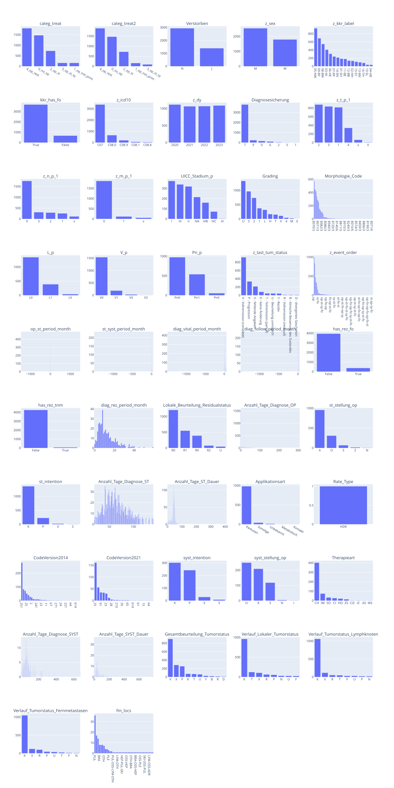
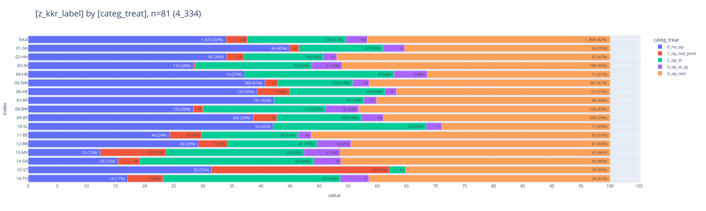
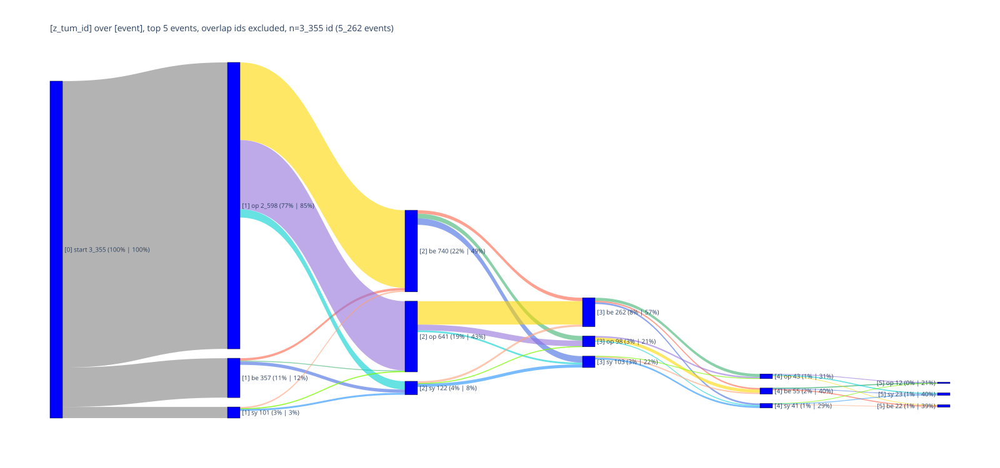

# [C07-C08](#toc0_)

**Table of contents**    
- [C07-C08](#toc1_)    
  - [📆 Datenstand](#toc1_1_)    
  - [Datensatz](#toc1_2_)    
  - [Tests](#toc1_3_)    
  - [Histogramme](#toc1_4_)    
  - [🕹️ interactive](#toc1_5_)    
  - [📉 plots](#toc1_6_)    
    - [Rezidive](#toc1_6_1_)    
    - [Verteilung categ_treat](#toc1_6_2_)    
    - [Therapieablauf](#toc1_6_3_)    

<!-- vscode-jupyter-toc-config
	numbering=false
	anchor=true
	flat=false
	minLevel=1
	maxLevel=6
	/vscode-jupyter-toc-config -->
<!-- THIS CELL WILL BE REPLACED ON TOC UPDATE. DO NOT WRITE YOUR TEXT IN THIS CELL -->

    🐍 3.12.8 | 📦 plotly: 6.3.1 | 📦 pandas: 2.3.3 | 📦 numpy: 1.26.4 | 📦 duckdb: 1.4.1 | 📦 pandas-plots: 0.20.4 | 📦 connection-helper: 0.13.1

## [📆 Datenstand](#toc0_)

    sqlite db file:          2025-06-24_data_clin.duckdb
    data tag:                v2.2
    last kkr data import:    2025-05-27
    sql table created:       2025-06-24 13:47:18
    doi:                     10.18444/5.03.01.0005.0021.0001
    document created:        2025-10-31 15:21:27

## [Datensatz](#toc0_)

- **Tabellen**
  - `Tumor` - gefiltert
  - `OP` - nur erste pro Tumor
  - `SYST` - nur erste pro Tumor
  - `Bestrahlung` - nur erste pro Tumor
  - `ST` - nur Elemente, die mit den gefilterten `Bestrahlung` verbunden sind 
  - `Folgeereignis` - nur erste pro Tumor

- **nicht-standard Variablen**
  - `categ_treat` - Behandlungskategorie
    - `0_no_op` - keine OP dokumentiert
    - `1_op_not_prim` - OP dokumentiert, aber nicht primär
    - `2_op_st` - primäre OP -> ST _[adjuvant or <=16w]_, danach keine SYST
    - `3_op_st_sy` - primäre OP -> ST -> SYST _[<=30d nach start erste bestrahlung]_
    - `4_op_rest` - primäre OP, restliche Fälle
  - `op_st_period_month` - Zeit OP -> ST in Monaten
  - `st_syst_period_month` - Zeit (erste) Bestrahlung -> SYST
  - `diag_vital_period_month` - Zeit Diagnose -> Vitalstatus in Monaten
  - `diag_follow_period_month` - Zeit Diagnose -> FollowUp in Monaten
  - `fm_locs` - alle dokumentierten FM Lokalisationen eines Folgeereignisses in einem Wert
  - `kkr_has_fo` - true wenn kkr überhaupt Folgeereignisse liefert
  - `has_rez_fo` - true wenn dem Tumor ein Rezidiv über Folgeereignis zugeordnet ist _(>1 Beurteilung)_
  - `has_rez_tnm` - true wenn dem Tumor ein Folgeereignis TNM mit r_symbol zugeordnet ist _(>1 Angabe mit Stadium >0)_

- **Filter**
  - `z_icd10`: C07, C08
  - `z_dy`: 2020 - 2023

- **Metriken**
  - es werden **Tumore** gezählt, jede 1:n Information (z.B. Behandlungen) gibt es nur einmal pro Tumor

## [Tests](#toc0_)

    ✅ tum count ok 4_334

## [Histogramme](#toc0_)

    🔵 *** df: tum ***  
    🟣 shape: (4_334, 47)
    🟣 duplicates: 89  
    🟠 column stats all (dtype | uniques | missings) [values]  
    - index [0, 1, 2, 3, 4,]  
    - categ_treat (object | 5 | 0 (0%)) ['0_no_op', '1_op_not_prim', '2_op_st', '3_op_st_sy', '4_op_rest',]  
    - categ_treat2 (object | 5 | 0 (0%)) ['0_no_op', '1_op_not_prim', '2_op_st', '3_op_st_sy', '4_op_rest',]  
    - Verstorben (object | 2 | 0 (0%)) ['J', 'N',]  
    - z_sex (object | 2 | 0 (0%)) ['M', 'W',]  
    - z_kkr_label (object | 16 | 0 (0%)) ['01-SH', '02-HH', '03-NI', '04-HB', '05-NW',]  
    - kkr_has_fo (bool | 2 | 0 (0%)) [False, True,]  
    - z_icd10 (object | 5 | 0 (0%)) ['C07', 'C08.0', 'C08.1', 'C08.8', 'C08.9',]  
    - z_dy (int32 | 4 | 0 (0%)) [2020, 2021, 2022, 2023,]  
    - Diagnosesicherung (object | 7 | 0 (0%)) ['0', '1', '2', '5', '6',]  
    - z_t_p_1 (object | 7 | 1_394 (32%)) ['0', '1', '2', '3', '4',]  
    - z_n_p_1 (object | 6 | 1_609 (37%)) ['0', '1', '2', '3', '<NA>',]  
    - z_m_p_1 (object | 4 | 2_297 (53%)) ['0', '1', '<NA>', 'x',]  
    - UICC_Stadium_p (object | 8 | 2_853 (66%)) ['<NA>', 'I', 'II', 'III', 'IV',]  
    - Grading (object | 12 | 111 (3%)) ['0', '1', '2', '3', '4',]  
    - Morphologie_Code (object | 93 | 111 (3%)) ['8000/3', '8001/3', '8004/3', '8010/3', '8010/6',]  
    - L_p (object | 4 | 2_565 (59%)) ['<NA>', 'L0', 'L1', 'LX',]  
    - V_p (object | 5 | 2_577 (59%)) ['<NA>', 'V0', 'V1', 'V2', 'VX',]  
    - Pn_p (object | 4 | 2_769 (64%)) ['<NA>', 'Pn0', 'Pn1', 'PnX',]  
    - z_last_tum_status (object | 11 | 2_618 (60%)) ['<NA>', 'B - klinische Besserung des Zustandes', 'D - divergentes Geschehen',  
    'K - keine Änderung', 'P - Progression',]  
    - z_event_order (object | 281 | 0 (0%)) ['-', 'fo', 'fo-op', 'fo-op-fo', 'fo-op-fo-op',]  
    - op_st_period_month (Int16 | 45 | 3_129 (72%)) [-1461, -25, -20, -16, -15,]  
    - st_syst_period_month (Int16 | 52 | 3_913 (90%)) [-1486, -1445, -34, -32, -23,]  
    - diag_vital_period_month (int16 | 75 | 0 (0%)) [-1484, -1481, -1479, -1477, -1467,]  
    - diag_follow_period_month (Int16 | 57 | 2_618 (60%)) [-1482, -1470, -1465, -1463, -1462,]  
    - has_rez_fo (bool | 2 | 0 (0%)) [False, True,]  
    - has_rez_tnm (bool | 2 | 0 (0%)) [False, True,]  
    - diag_rez_period_month (Int16 | 43 | 3_951 (91%)) [0, 1, 2, 3, 4,]  
    - Lokale_Beurteilung_Residualstatus (object | 6 | 2_067 (48%)) ['<NA>', 'R0', 'R1', 'R2', 'RX',]  
    - Anzahl_Tage_Diagnose_OP (Int32 | 168 | 1_537 (35%)) [0, 1, 2, 3, 4,]  
    - st_stellung_op (object | 6 | 2_979 (69%)) ['<NA>', 'A', 'N', 'O', 'S',]  
    - st_intention (object | 5 | 2_721 (63%)) ['<NA>', 'K', 'P', 'S', 'X',]  
    - Anzahl_Tage_Diagnose_ST (Int32 | 276 | 2_746 (63%)) [0, 1, 3, 4, 7,]  
    - Anzahl_Tage_ST_Dauer (Int32 | 78 | 3_016 (70%)) [0, 1, 2, 3, 4,]  
    - Applikationsart (object | 6 | 3_296 (76%)) ['<NA>', 'Kontakt', 'Metabolisch', 'Perkutan', 'Sonstige',]  
    - Rate_Type (object | 2 | 4_333 (100%)) ['<NA>', 'HDR',]  
    - CodeVersion2014 (object | 37 | 3_658 (84%)) ['1', '11', '12', '2', '21',]  
    - CodeVersion2021 (object | 23 | 3_978 (92%)) ['103', '11', '12', '15', '210',]  
    - syst_intention (object | 5 | 3_753 (87%)) ['<NA>', 'K', 'P', 'S', 'X',]  
    - syst_stellung_op (object | 6 | 3_753 (87%)) ['<NA>', 'A', 'I', 'N', 'O',]  
    - Therapieart (object | 11 | 3_753 (87%)) ['<NA>', 'AS', 'CH', 'CI', 'CIZ',]  
    - Anzahl_Tage_Diagnose_SYST (Int32 | 272 | 3_764 (87%)) [0, 3, 5, 7, 8,]  
    - Anzahl_Tage_SYST_Dauer (Int32 | 141 | 3_957 (91%)) [0, 1, 2, 3, 4,]  
    - Gesamtbeurteilung_Tumorstatus (object | 11 | 2_618 (60%)) ['<NA>', 'B', 'D', 'K', 'P',]  
    - Verlauf_Lokaler_Tumorstatus (object | 9 | 2_946 (68%)) ['<NA>', 'F', 'K', 'N', 'P',]  
    - Verlauf_Tumorstatus_Lymphknoten (object | 9 | 2_956 (68%)) ['<NA>', 'F', 'K', 'N', 'P',]  
    - Verlauf_Tumorstatus_Fernmetastasen (object | 9 | 2_926 (68%)) ['<NA>', 'F', 'K', 'N', 'P',]  
    - fm_locs (object | 40 | 4_194 (97%)) ['<NA>', 'ADR', 'ADR-PUL', 'BRA', 'BRA-LYM',]  
    🟠 column stats numeric  
    
    column                    | count |  min  | lower |    q25    |  median   |   mean    |    q75    | upper |  max   |    std    |   cv    |    sum   
    --------------------------+-------+-------+-------+-----------+-----------+-----------+-----------+-------+--------+-----------+---------+----------
    z_dy                      | 4_334 | 2_020 | 2_020 | 2_020.000 | 2_021.000 | 2_021.491 | 2_023.000 | 2_023 |  2_023 |     1.125 |   0.001 | 8_761_144
    op_st_period_month        | 1_205 | -1461 |    -1 |     1.000 |     2.000 |     7.482 |     3.000 |     6 |   1484 |   103.918 |  13.889 |     9_016
    st_syst_period_month      |   421 | -1486 |    -1 |     0.000 |     0.000 |    -4.960 |     1.000 |     2 |     48 |   101.377 | -20.440 |    -2_088
    diag_vital_period_month   | 4_334 | -1484 |   -11 |     4.000 |    12.000 |    13.147 |    26.000 |    59 |     59 |    72.824 |   5.539 |    56_979
    diag_follow_period_month  | 1_716 | -1482 |    -1 |     2.000 |     6.000 |   -12.203 |     8.000 |    17 |     46 |   164.618 | -13.490 |   -20_941
    diag_rez_period_month     |   383 |     0 |     0 |     6.000 |    10.000 |    12.159 |    16.000 |    31 |     59 |     8.991 |   0.739 |     4_657
    Anzahl_Tage_Diagnose_OP   | 2_797 |     0 |     0 |     0.000 |     0.000 |    19.868 |    20.000 |    50 |  1_258 |    66.038 |   3.324 |    55_571
    Anzahl_Tage_Diagnose_ST   | 1_588 |     0 |     0 |    48.000 |    64.500 |    98.079 |    94.000 |   163 |  1_604 |   134.732 |   1.374 |   155_749
    Anzahl_Tage_ST_Dauer      | 1_318 |     0 |    22 |    37.000 |    43.000 |    40.094 |    47.000 |    62 |    409 |    16.498 |   0.411 |    52_844
    Anzahl_Tage_Diagnose_SYST |   570 |     0 |     0 |    53.000 |    78.500 |   183.811 |   197.500 |   414 |  1_579 |   254.133 |   1.383 |   104_772
    Anzahl_Tage_SYST_Dauer    |   377 |     0 |     0 |    28.000 |    41.000 |   200.875 |    75.000 |   144 | 49_002 | 2_522.275 |  12.556 |    75_730
    

<table border="1" class="dataframe">
  <thead>
    <tr style="text-align: right;">
      <th></th>
      <th>categ_treat</th>
      <th>categ_treat2</th>
      <th>Verstorben</th>
      <th>z_sex</th>
      <th>z_kkr_label</th>
      <th>kkr_has_fo</th>
      <th>z_icd10</th>
      <th>z_dy</th>
      <th>Diagnosesicherung</th>
      <th>z_t_p_1</th>
      <th>...</th>
      <th>syst_intention</th>
      <th>syst_stellung_op</th>
      <th>Therapieart</th>
      <th>Anzahl_Tage_Diagnose_SYST</th>
      <th>Anzahl_Tage_SYST_Dauer</th>
      <th>Gesamtbeurteilung_Tumorstatus</th>
      <th>Verlauf_Lokaler_Tumorstatus</th>
      <th>Verlauf_Tumorstatus_Lymphknoten</th>
      <th>Verlauf_Tumorstatus_Fernmetastasen</th>
      <th>fm_locs</th>
    </tr>
  </thead>
  <tbody>
    <tr>
      <th>0</th>
      <td>4_op_rest</td>
      <td>4_op_rest</td>
      <td>N</td>
      <td>M</td>
      <td>02-HH</td>
      <td>True</td>
      <td>C08.0</td>
      <td>2023</td>
      <td>7</td>
      <td>2</td>
      <td>...</td>
      <td>&lt;NA&gt;</td>
      <td>&lt;NA&gt;</td>
      <td>&lt;NA&gt;</td>
      <td>&lt;NA&gt;</td>
      <td>&lt;NA&gt;</td>
      <td>&lt;NA&gt;</td>
      <td>&lt;NA&gt;</td>
      <td>&lt;NA&gt;</td>
      <td>&lt;NA&gt;</td>
      <td>&lt;NA&gt;</td>
    </tr>
    <tr>
      <th>1</th>
      <td>4_op_rest</td>
      <td>4_op_rest</td>
      <td>N</td>
      <td>W</td>
      <td>09-BY</td>
      <td>True</td>
      <td>C07</td>
      <td>2023</td>
      <td>7</td>
      <td>2</td>
      <td>...</td>
      <td>&lt;NA&gt;</td>
      <td>&lt;NA&gt;</td>
      <td>&lt;NA&gt;</td>
      <td>&lt;NA&gt;</td>
      <td>&lt;NA&gt;</td>
      <td>&lt;NA&gt;</td>
      <td>&lt;NA&gt;</td>
      <td>&lt;NA&gt;</td>
      <td>&lt;NA&gt;</td>
      <td>&lt;NA&gt;</td>
    </tr>
    <tr>
      <th>2</th>
      <td>4_op_rest</td>
      <td>4_op_rest</td>
      <td>N</td>
      <td>M</td>
      <td>07-RP</td>
      <td>True</td>
      <td>C08.9</td>
      <td>2023</td>
      <td>7</td>
      <td>&lt;NA&gt;</td>
      <td>...</td>
      <td>&lt;NA&gt;</td>
      <td>&lt;NA&gt;</td>
      <td>&lt;NA&gt;</td>
      <td>&lt;NA&gt;</td>
      <td>&lt;NA&gt;</td>
      <td>&lt;NA&gt;</td>
      <td>&lt;NA&gt;</td>
      <td>&lt;NA&gt;</td>
      <td>&lt;NA&gt;</td>
      <td>&lt;NA&gt;</td>
    </tr>
  </tbody>
</table>

3 rows × 47 columns

    

    

    

    

## [🕹️ interactive](#toc0_)

## [📉 plots](#toc0_)

### [Rezidive](#toc0_)
- Filter: 
  - Tumorfälle aus kkr die Folgeereignisse liefern 
  - Tumor hat `R0` zugeordnet
 

    

    

### [Verteilung categ_treat](#toc0_)

    

    

### [Therapieablauf](#toc0_)
- abgebildet ist die Verteilung der Tumorfälle auf Therapien
- Therapien = die ersten 5 OP / SYST / Bestrahlung im Zeitablauf

    

    

