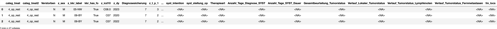
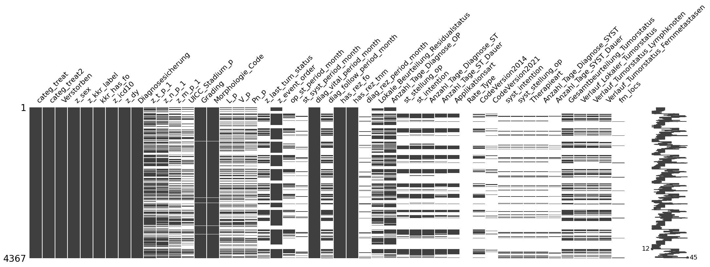
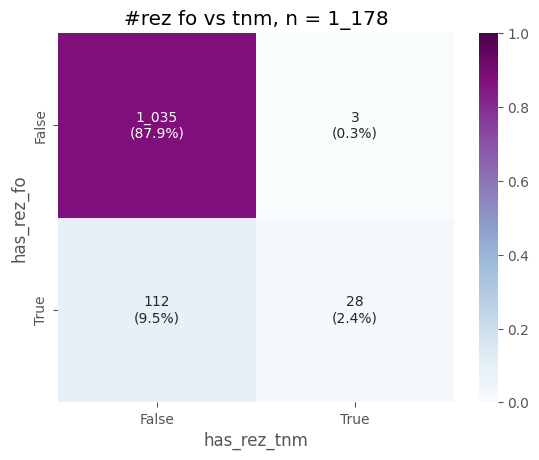

# [C07-C08](#toc0_)

**Table of contents**    
- [C07-C08](#toc1_)    
  - [📆 Datenstand](#toc1_1_)    
  - [Datensatz](#toc1_2_)    
  - [Tests](#toc1_3_)    
  - [Histogramme](#toc1_4_)    
  - [🕹️ interactive](#toc1_5_)    
  - [📉 plots](#toc1_6_)    
    - [Rezidive](#toc1_6_1_)    
    - [Verteilung categ_treat](#toc1_6_2_)    
    - [Therapieablauf](#toc1_6_3_)    

<!-- vscode-jupyter-toc-config
	numbering=false
	anchor=true
	flat=false
	minLevel=1
	maxLevel=6
	/vscode-jupyter-toc-config -->
<!-- THIS CELL WILL BE REPLACED ON TOC UPDATE. DO NOT WRITE YOUR TEXT IN THIS CELL -->

    🐍 3.12.8 | 📦 plotly: 6.4.0 | 📦 pandas: 2.3.3 | 📦 numpy: 1.26.4 | 📦 duckdb: 1.4.1 | 📦 pandas-plots: 0.21.3 | 📦 connection-helper: 0.13.1

## [📆 Datenstand](#toc0_)

    sqlite db file:          2025-11-11_data_clin.duckdb
    data tag:                v2.3
    last kkr data import:    2025-09-30
    sql table created:       2025-11-11 11:52:01
    doi:                     10.18444/5.03.01.0005.0021.0002
    document created:        2025-11-11 18:56:55

## [Datensatz](#toc0_)

- **Tabellen**
  - `Tumor` - gefiltert
  - `OP` - nur erste pro Tumor
  - `SYST` - nur erste pro Tumor
  - `Bestrahlung` - nur erste pro Tumor
  - `ST` - nur Elemente, die mit den gefilterten `Bestrahlung` verbunden sind 
  - `Folgeereignis` - nur erste pro Tumor

- **nicht-standard Variablen**
  - `categ_treat` - Behandlungskategorie
    - `0_no_op` - keine OP dokumentiert
    - `1_op_not_prim` - OP dokumentiert, aber nicht primär
    - `2_op_st` - primäre OP -> ST _[adjuvant or <=16w]_, danach keine SYST
    - `3_op_st_sy` - primäre OP -> ST -> SYST _[<=30d nach start erste bestrahlung]_
    - `4_op_rest` - primäre OP, restliche Fälle
  - `op_st_period_month` - Zeit OP -> ST in Monaten
  - `st_syst_period_month` - Zeit (erste) Bestrahlung -> SYST
  - `diag_vital_period_month` - Zeit Diagnose -> Vitalstatus in Monaten
  - `diag_follow_period_month` - Zeit Diagnose -> FollowUp in Monaten
  - `fm_locs` - alle dokumentierten FM Lokalisationen eines Folgeereignisses in einem Wert
  - `kkr_has_fo` - true wenn kkr überhaupt Folgeereignisse liefert
  - `has_rez_fo` - true wenn dem Tumor ein Rezidiv über Folgeereignis zugeordnet ist _(>1 Beurteilung)_
  - `has_rez_tnm` - true wenn dem Tumor ein Folgeereignis TNM mit r_symbol zugeordnet ist _(>1 Angabe mit Stadium >0)_

- **Filter**
  - `z_icd10`: C07, C08
  - `z_dy`: 2020 - 2023

- **Metriken**
  - es werden **Tumore** gezählt, jede 1:n Information (z.B. Behandlungen) gibt es nur einmal pro Tumor

## [Tests](#toc0_)

    ✅ tum count ok 4_367

## [Histogramme](#toc0_)

    🔵 *** df: tum ***  
    🟣 shape: (4_367, 47)
    🟣 duplicates: 92  
    🟠 column stats all (dtype | uniques | missings) [values]  
    - index [0, 1, 2, 3, 4,]  
    - categ_treat (object | 5 | 0 (0%)) ['0_no_op', '1_op_not_prim', '2_op_st', '3_op_st_sy', '4_op_rest',]  
    - categ_treat2 (object | 5 | 0 (0%)) ['0_no_op', '1_op_not_prim', '2_op_st', '3_op_st_sy', '4_op_rest',]  
    - Verstorben (object | 2 | 0 (0%)) ['J', 'N',]  
    - z_sex (object | 2 | 0 (0%)) ['M', 'W',]  
    - z_kkr_label (object | 16 | 0 (0%)) ['01-SH', '02-HH', '03-NI', '04-HB', '05-NW',]  
    - kkr_has_fo (bool | 2 | 0 (0%)) [False, True,]  
    - z_icd10 (object | 5 | 0 (0%)) ['C07', 'C08.0', 'C08.1', 'C08.8', 'C08.9',]  
    - z_dy (int16 | 4 | 0 (0%)) [2020, 2021, 2022, 2023,]  
    - Diagnosesicherung (object | 7 | 0 (0%)) ['0', '1', '2', '5', '6',]  
    - z_t_p_1 (object | 7 | 1_407 (32%)) ['0', '1', '2', '3', '4',]  
    - z_n_p_1 (object | 6 | 1_626 (37%)) ['0', '1', '2', '3', '<NA>',]  
    - z_m_p_1 (object | 3 | 2_367 (54%)) ['0', '1', '<NA>',]  
    - UICC_Stadium_p (object | 8 | 2_877 (66%)) ['<NA>', 'I', 'II', 'III', 'IV',]  
    - Grading (object | 12 | 111 (3%)) ['0', '1', '2', '3', '4',]  
    - Morphologie_Code (object | 92 | 111 (3%)) ['8000/3', '8001/3', '8004/3', '8010/3', '8010/6',]  
    - L_p (object | 4 | 2_579 (59%)) ['<NA>', 'L0', 'L1', 'LX',]  
    - V_p (object | 5 | 2_591 (59%)) ['<NA>', 'V0', 'V1', 'V2', 'VX',]  
    - Pn_p (object | 4 | 2_783 (64%)) ['<NA>', 'Pn0', 'Pn1', 'PnX',]  
    - z_last_tum_status (object | 11 | 2_636 (60%)) ['<NA>', 'B - klinische Besserung des Zustandes', 'D - divergentes Geschehen',  
    'K - keine Änderung', 'P - Progression',]  
    - z_event_order (object | 270 | 849 (19%)) ['<NA>', 'fo', 'fo-op', 'fo-op-fo', 'fo-op-fo-op',]  
    - op_st_period_month (Int16 | 46 | 3_153 (72%)) [-1461, -25, -20, -16, -15,]  
    - st_syst_period_month (Int16 | 51 | 3_946 (90%)) [-1445, -34, -32, -23, -17,]  
    - diag_vital_period_month (int16 | 71 | 0 (0%)) [-1484, -1483, -1467, -1458, -1454,]  
    - diag_follow_period_month (Int16 | 57 | 2_636 (60%)) [-1482, -1470, -1465, -1463, -1462,]  
    - has_rez_fo (bool | 2 | 0 (0%)) [False, True,]  
    - has_rez_tnm (bool | 2 | 0 (0%)) [False, True,]  
    - diag_rez_period_month (Int16 | 44 | 3_980 (91%)) [0, 1, 2, 3, 4,]  
    - Lokale_Beurteilung_Residualstatus (object | 6 | 2_080 (48%)) ['<NA>', 'R0', 'R1', 'R2', 'RX',]  
    - Anzahl_Tage_Diagnose_OP (Int32 | 170 | 1_552 (36%)) [0, 1, 2, 3, 4,]  
    - st_stellung_op (object | 6 | 3_004 (69%)) ['<NA>', 'A', 'N', 'O', 'S',]  
    - st_intention (object | 5 | 2_746 (63%)) ['<NA>', 'K', 'P', 'S', 'X',]  
    - Anzahl_Tage_Diagnose_ST (Int32 | 279 | 2_771 (63%)) [0, 1, 3, 4, 7,]  
    - Anzahl_Tage_ST_Dauer (Int32 | 78 | 3_040 (70%)) [0, 1, 2, 3, 4,]  
    - Applikationsart (object | 6 | 3_087 (71%)) ['<NA>', 'Kontakt', 'Metabolisch', 'Perkutan', 'Sonstige',]  
    - Rate_Type (object | 2 | 4_366 (100%)) ['<NA>', 'HDR',]  
    - CodeVersion2014 (object | 37 | 3_484 (80%)) ['1', '11', '12', '2', '21',]  
    - CodeVersion2021 (object | 25 | 3_976 (91%)) ['103', '11', '12', '15', '210',]  
    - syst_intention (object | 5 | 3_784 (87%)) ['<NA>', 'K', 'P', 'S', 'X',]  
    - syst_stellung_op (object | 6 | 3_784 (87%)) ['<NA>', 'A', 'I', 'N', 'O',]  
    - Therapieart (object | 11 | 3_784 (87%)) ['<NA>', 'AS', 'CH', 'CI', 'CIZ',]  
    - Anzahl_Tage_Diagnose_SYST (Int32 | 275 | 3_794 (87%)) [0, 3, 5, 7, 8,]  
    - Anzahl_Tage_SYST_Dauer (Int32 | 145 | 3_984 (91%)) [0, 1, 2, 3, 4,]  
    - Gesamtbeurteilung_Tumorstatus (object | 11 | 2_636 (60%)) ['<NA>', 'B', 'D', 'K', 'P',]  
    - Verlauf_Lokaler_Tumorstatus (object | 9 | 2_964 (68%)) ['<NA>', 'F', 'K', 'N', 'P',]  
    - Verlauf_Tumorstatus_Lymphknoten (object | 9 | 2_975 (68%)) ['<NA>', 'F', 'K', 'N', 'P',]  
    - Verlauf_Tumorstatus_Fernmetastasen (object | 9 | 2_941 (67%)) ['<NA>', 'F', 'K', 'N', 'P',]  
    - fm_locs (object | 40 | 4_228 (97%)) ['<NA>', 'ADR', 'BRA', 'BRA-LYM-PLE-PUL-HEP', 'BRA-OTH',]  
    🟠 column stats numeric  
    
    column (n = 4_367)        |   present    |  min  | lower |    q25    |  median   |   mean    |    q75    | upper |  max  |   std   |   cv   
    --------------------------+--------------+-------+-------+-----------+-----------+-----------+-----------+-------+-------+---------+--------
    z_dy                      | 4_367 (100%) |  2020 |  2020 | 2_020.000 | 2_022.000 | 2_021.501 | 2_023.000 |  2023 |  2023 |   1.128 |   0.001
    op_st_period_month        |  1_214 (27%) | -1461 |    -1 |     1.000 |     2.000 |     6.274 |     3.000 |     6 |  1484 |  94.617 |  15.080
    st_syst_period_month      |     421 (9%) | -1445 |    -1 |     0.000 |     0.000 |    -1.404 |     1.000 |     2 |    48 |  71.013 | -50.586
    diag_vital_period_month   | 4_367 (100%) | -1484 |    -9 |     4.000 |    13.000 |    15.281 |    28.000 |    59 |    59 |  61.345 |   4.014
    diag_follow_period_month  |  1_731 (39%) | -1482 |    -1 |     2.000 |     6.000 |   -12.017 |     8.000 |    17 |    46 | 163.916 | -13.640
    diag_rez_period_month     |     387 (8%) |     0 |     0 |     6.000 |    10.000 |    12.341 |    16.000 |    31 |    59 |   9.112 |   0.738
    Anzahl_Tage_Diagnose_OP   |  2_815 (64%) |     0 |     0 |     0.000 |     0.000 |    19.276 |    19.000 |    47 | 1_132 |  63.568 |   3.298
    Anzahl_Tage_Diagnose_ST   |  1_596 (36%) |     0 |     0 |    48.000 |    65.000 |    98.547 |    94.000 |   163 | 1_604 | 135.458 |   1.375
    Anzahl_Tage_ST_Dauer      |  1_327 (30%) |     0 |    22 |    37.000 |    43.000 |    40.070 |    47.000 |    62 |   409 |  16.519 |   0.412
    Anzahl_Tage_Diagnose_SYST |    573 (13%) |     0 |     0 |    53.000 |    79.000 |   184.921 |   209.000 |   442 | 1_579 | 254.089 |   1.374
    Anzahl_Tage_SYST_Dauer    |     383 (8%) |     0 |     0 |    28.000 |    41.000 |    72.488 |    72.000 |   138 |   791 | 108.817 |   1.501
    

    

    

    

    

## [🕹️ interactive](#toc0_)

## [📉 plots](#toc0_)

### [Rezidive](#toc0_)
- Filter: 
  - Tumorfälle aus kkr die Folgeereignisse liefern 
  - Tumor hat `R0` zugeordnet
 

    

    

### [Verteilung categ_treat](#toc0_)

### [Therapieablauf](#toc0_)
- abgebildet ist die Verteilung der Tumorfälle auf Therapien
- Therapien = die ersten 5 OP / SYST / Bestrahlung im Zeitablauf

