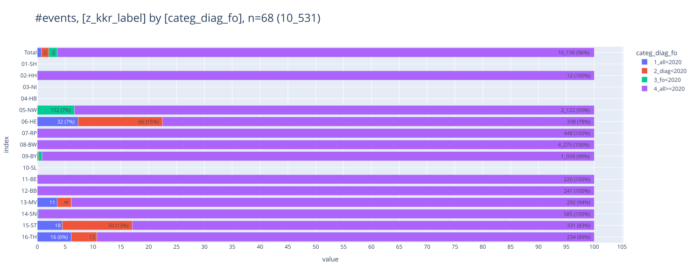
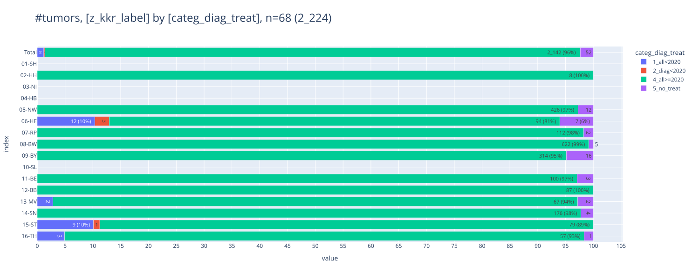

# [C50 / brain fm - date of diagnosis vs follow up / treatment dates](#toc0_)

**❓ Fragestellung**
> Die meisten Hirnmetastasen (als Folgeereignis_Fernmetastase), die man für die Kalenderjahre 2020-2023 erwarten würde, entstehen bei Frauen, die ihre Primärdiagnose weit vor 2020 hatten. Beziehen sich die klinischen ZfKD Daten, einschließlich Therapien und Folgeereignissen, tatsächlich aber nur auf Patienten, die auch während 2020-2023 einen Primärtumor hatten (z_tum_id)? Dieser Filter würde einen großen Teil der Events in „Folgeereignis_Fernmetastase“ entfernen, so dass die Zahlen in den deutschlandweiten Registerdaten deutlich unterhalb den Daten aus der Versorgung liegen. Wir wüssten dann z.B. nicht, wie viele Hirnmetastasen pro Kalenderjahr versorgt werden müssen.

**⚖️ Analyse**
- Filter: alle Tumore mit `C50` und einer zugeordneten FM mit Lokalisation `BRA` **(2.1k)**
- _follow up_
  - gezählt sind alle Folgeereignisse zu den Tumoren im Filter **(9k)**
  - die gezeigten 5 Kategorien/Gruppen sind immer disjunkt
  - bei 96% liegen Diagnose und Folgeereignis > 2020
  - Altfälle (Gruppe 1) gibt in einigen GTDS Registern
  - Folgeereignisse vor 2020 (Gruppe 3) kommen fast nur aus NW
- _treatments_
  - gezählt sind alle Tumoren im Filter **(2.1k)**
  - bei 96% liegen Diagnose und erste Therapie >2020
  - Gruppe 5 sind Fälle ohne Therapieangabe (3%)
  - Altfälle sind selten, Therapien <2020 bei Fällen nach 2020 kommen gar nicht vor

**Table of contents**    
- [C71 brain - date of diagnosis vs follow up / treatment dates](#toc1_)    
  - [📆 data as of](#toc1_1_)    
  - [analysis](#toc1_2_)    
    - [follow up](#toc1_2_1_)    
    - [treatment](#toc1_2_2_)    

<!-- vscode-jupyter-toc-config
	numbering=false
	anchor=true
	flat=false
	minLevel=1
	maxLevel=6
	/vscode-jupyter-toc-config -->
<!-- THIS CELL WILL BE REPLACED ON TOC UPDATE. DO NOT WRITE YOUR TEXT IN THIS CELL -->

    🐍 3.12.8 | 📦 pygwalker: 0.4.9.15 | 📦 pandas: 2.3.3 | 📦 numpy: 1.26.4 | 📦 duckdb: 1.4.1 | 📦 pandas-plots: 0.20.4 | 📦 connection-helper: 0.13.1

## [📆 data as of](#toc0_)

    sqlite db file:          2025-10-30_data_clin.duckdb
    data tag:                v2.3
    last kkr data import:    2025-09-30
    sql table created:       2025-10-30 16:25:02
    doi:                     10.18444/5.03.01.0005.0021.0001
    document created:        2025-10-31 15:26:57

## [analysis](#toc0_)

    Anzahel Tumore im Filter: n = 2_224
    🗄️ filter	2_224, 6
    	("z_tum_id, z_kkr_label, z_icd10, Diagnosedatum, z_first_treatment_after_days, z_first_treatment")
    ┌──────────────────────────────────────┬─────────────┬─────────┬───────────────┬──────────────────────────────┬───────────────────┐
    │               z_tum_id               │ z_kkr_label │ z_icd10 │ Diagnosedatum │ z_first_treatment_after_days │ z_first_treatment │
    │               varchar                │   varchar   │ varchar │     date      │            int32             │      varchar      │
    ├──────────────────────────────────────┼─────────────┼─────────┼───────────────┼──────────────────────────────┼───────────────────┤
    │ 33805f58-8902-4977-b00f-890e53a7ea0a │ 08-BW       │ C50.1   │ 2023-04-15    │                           43 │ sy                │
    │ bcfae0a1-bc0c-4df0-a661-9e05c9406a52 │ 05-NW       │ C50.2   │ 2020-01-15    │                           30 │ sy                │
    │ ecf26a05-6a7d-4479-96de-81bc024b80d9 │ 05-NW       │ C50.9   │ 2020-05-15    │                         NULL │ NULL              │
    └──────────────────────────────────────┴─────────────┴─────────┴───────────────┴──────────────────────────────┴───────────────────┘
    

### [follow up](#toc0_)

    Anzahl Folgeereignisse im Filter: n = 10_531

    

    

<table id="T_9c1d9">
  <thead>
    <tr>
      <th class="index_name level0" >categ_diag_fo</th>
      <th id="T_9c1d9_level0_col0" class="col_heading level0 col0" >1_all<2020</th>
      <th id="T_9c1d9_level0_col1" class="col_heading level0 col1" >2_diag<2020</th>
      <th id="T_9c1d9_level0_col2" class="col_heading level0 col2" >3_fo<2020</th>
      <th id="T_9c1d9_level0_col3" class="col_heading level0 col3" >4_all>=2020</th>
      <th id="T_9c1d9_level0_col4" class="col_heading level0 col4" >Total</th>
    </tr>
    <tr>
      <th class="index_name level0" >z_kkr_label</th>
      <th class="blank col0" >&nbsp;</th>
      <th class="blank col1" >&nbsp;</th>
      <th class="blank col2" >&nbsp;</th>
      <th class="blank col3" >&nbsp;</th>
      <th class="blank col4" >&nbsp;</th>
    </tr>
  </thead>
  <tbody>
    <tr>
      <th id="T_9c1d9_level0_row0" class="row_heading level0 row0" >02-HH</th>
      <td id="T_9c1d9_row0_col0" class="data row0 col0" >0 </td>
      <td id="T_9c1d9_row0_col1" class="data row0 col1" >0 </td>
      <td id="T_9c1d9_row0_col2" class="data row0 col2" >0 </td>
      <td id="T_9c1d9_row0_col3" class="data row0 col3" >12 (0.1%) </td>
      <td id="T_9c1d9_row0_col4" class="data row0 col4" >12 (0.1%) </td>
    </tr>
    <tr>
      <th id="T_9c1d9_level0_row1" class="row_heading level0 row1" >05-NW</th>
      <td id="T_9c1d9_row1_col0" class="data row1 col0" >0 </td>
      <td id="T_9c1d9_row1_col1" class="data row1 col1" >0 </td>
      <td id="T_9c1d9_row1_col2" class="data row1 col2" >152 (1.4%) </td>
      <td id="T_9c1d9_row1_col3" class="data row1 col3" >2_122 (20.2%) </td>
      <td id="T_9c1d9_row1_col4" class="data row1 col4" >2_274 (21.6%) </td>
    </tr>
    <tr>
      <th id="T_9c1d9_level0_row2" class="row_heading level0 row2" >06-HE</th>
      <td id="T_9c1d9_row2_col0" class="data row2 col0" >32 (0.3%) </td>
      <td id="T_9c1d9_row2_col1" class="data row2 col1" >66 (0.6%) </td>
      <td id="T_9c1d9_row2_col2" class="data row2 col2" >0 </td>
      <td id="T_9c1d9_row2_col3" class="data row2 col3" >338 (3.2%) </td>
      <td id="T_9c1d9_row2_col4" class="data row2 col4" >436 (4.1%) </td>
    </tr>
    <tr>
      <th id="T_9c1d9_level0_row3" class="row_heading level0 row3" >07-RP</th>
      <td id="T_9c1d9_row3_col0" class="data row3 col0" >0 </td>
      <td id="T_9c1d9_row3_col1" class="data row3 col1" >0 </td>
      <td id="T_9c1d9_row3_col2" class="data row3 col2" >0 </td>
      <td id="T_9c1d9_row3_col3" class="data row3 col3" >448 (4.3%) </td>
      <td id="T_9c1d9_row3_col4" class="data row3 col4" >448 (4.3%) </td>
    </tr>
    <tr>
      <th id="T_9c1d9_level0_row4" class="row_heading level0 row4" >08-BW</th>
      <td id="T_9c1d9_row4_col0" class="data row4 col0" >0 </td>
      <td id="T_9c1d9_row4_col1" class="data row4 col1" >0 </td>
      <td id="T_9c1d9_row4_col2" class="data row4 col2" >0 </td>
      <td id="T_9c1d9_row4_col3" class="data row4 col3" >4_275 (40.6%) </td>
      <td id="T_9c1d9_row4_col4" class="data row4 col4" >4_275 (40.6%) </td>
    </tr>
    <tr>
      <th id="T_9c1d9_level0_row5" class="row_heading level0 row5" >09-BY</th>
      <td id="T_9c1d9_row5_col0" class="data row5 col0" >0 </td>
      <td id="T_9c1d9_row5_col1" class="data row5 col1" >2 (0.0%) </td>
      <td id="T_9c1d9_row5_col2" class="data row5 col2" >7 (0.1%) </td>
      <td id="T_9c1d9_row5_col3" class="data row5 col3" >1_058 (10.0%) </td>
      <td id="T_9c1d9_row5_col4" class="data row5 col4" >1_067 (10.1%) </td>
    </tr>
    <tr>
      <th id="T_9c1d9_level0_row6" class="row_heading level0 row6" >11-BE</th>
      <td id="T_9c1d9_row6_col0" class="data row6 col0" >0 </td>
      <td id="T_9c1d9_row6_col1" class="data row6 col1" >0 </td>
      <td id="T_9c1d9_row6_col2" class="data row6 col2" >0 </td>
      <td id="T_9c1d9_row6_col3" class="data row6 col3" >220 (2.1%) </td>
      <td id="T_9c1d9_row6_col4" class="data row6 col4" >220 (2.1%) </td>
    </tr>
    <tr>
      <th id="T_9c1d9_level0_row7" class="row_heading level0 row7" >12-BB</th>
      <td id="T_9c1d9_row7_col0" class="data row7 col0" >0 </td>
      <td id="T_9c1d9_row7_col1" class="data row7 col1" >0 </td>
      <td id="T_9c1d9_row7_col2" class="data row7 col2" >0 </td>
      <td id="T_9c1d9_row7_col3" class="data row7 col3" >241 (2.3%) </td>
      <td id="T_9c1d9_row7_col4" class="data row7 col4" >241 (2.3%) </td>
    </tr>
    <tr>
      <th id="T_9c1d9_level0_row8" class="row_heading level0 row8" >13-MV</th>
      <td id="T_9c1d9_row8_col0" class="data row8 col0" >11 (0.1%) </td>
      <td id="T_9c1d9_row8_col1" class="data row8 col1" >8 (0.1%) </td>
      <td id="T_9c1d9_row8_col2" class="data row8 col2" >0 </td>
      <td id="T_9c1d9_row8_col3" class="data row8 col3" >292 (2.8%) </td>
      <td id="T_9c1d9_row8_col4" class="data row8 col4" >311 (3.0%) </td>
    </tr>
    <tr>
      <th id="T_9c1d9_level0_row9" class="row_heading level0 row9" >14-SN</th>
      <td id="T_9c1d9_row9_col0" class="data row9 col0" >0 </td>
      <td id="T_9c1d9_row9_col1" class="data row9 col1" >0 </td>
      <td id="T_9c1d9_row9_col2" class="data row9 col2" >1 (0.0%) </td>
      <td id="T_9c1d9_row9_col3" class="data row9 col3" >585 (5.6%) </td>
      <td id="T_9c1d9_row9_col4" class="data row9 col4" >586 (5.6%) </td>
    </tr>
    <tr>
      <th id="T_9c1d9_level0_row10" class="row_heading level0 row10" >15-ST</th>
      <td id="T_9c1d9_row10_col0" class="data row10 col0" >18 (0.2%) </td>
      <td id="T_9c1d9_row10_col1" class="data row10 col1" >50 (0.5%) </td>
      <td id="T_9c1d9_row10_col2" class="data row10 col2" >0 </td>
      <td id="T_9c1d9_row10_col3" class="data row10 col3" >331 (3.1%) </td>
      <td id="T_9c1d9_row10_col4" class="data row10 col4" >399 (3.8%) </td>
    </tr>
    <tr>
      <th id="T_9c1d9_level0_row11" class="row_heading level0 row11" >16-TH</th>
      <td id="T_9c1d9_row11_col0" class="data row11 col0" >16 (0.2%) </td>
      <td id="T_9c1d9_row11_col1" class="data row11 col1" >12 (0.1%) </td>
      <td id="T_9c1d9_row11_col2" class="data row11 col2" >0 </td>
      <td id="T_9c1d9_row11_col3" class="data row11 col3" >234 (2.2%) </td>
      <td id="T_9c1d9_row11_col4" class="data row11 col4" >262 (2.5%) </td>
    </tr>
    <tr>
      <th id="T_9c1d9_level0_row12" class="row_heading level0 row12" >Total</th>
      <td id="T_9c1d9_row12_col0" class="data row12 col0" >77 (0.7%) </td>
      <td id="T_9c1d9_row12_col1" class="data row12 col1" >138 (1.3%) </td>
      <td id="T_9c1d9_row12_col2" class="data row12 col2" >160 (1.5%) </td>
      <td id="T_9c1d9_row12_col3" class="data row12 col3" >10_156 (96.4%) </td>
      <td id="T_9c1d9_row12_col4" class="data row12 col4" >10_531 (100.0%) </td>
    </tr>
  </tbody>
</table>

### [treatment](#toc0_)

    

    

<table id="T_1f0fa">
  <thead>
    <tr>
      <th class="index_name level0" >categ_diag_treat</th>
      <th id="T_1f0fa_level0_col0" class="col_heading level0 col0" >1_all<2020</th>
      <th id="T_1f0fa_level0_col1" class="col_heading level0 col1" >2_diag<2020</th>
      <th id="T_1f0fa_level0_col2" class="col_heading level0 col2" >4_all>=2020</th>
      <th id="T_1f0fa_level0_col3" class="col_heading level0 col3" >5_no_treat</th>
      <th id="T_1f0fa_level0_col4" class="col_heading level0 col4" >Total</th>
    </tr>
    <tr>
      <th class="index_name level0" >z_kkr_label</th>
      <th class="blank col0" >&nbsp;</th>
      <th class="blank col1" >&nbsp;</th>
      <th class="blank col2" >&nbsp;</th>
      <th class="blank col3" >&nbsp;</th>
      <th class="blank col4" >&nbsp;</th>
    </tr>
  </thead>
  <tbody>
    <tr>
      <th id="T_1f0fa_level0_row0" class="row_heading level0 row0" >02-HH</th>
      <td id="T_1f0fa_row0_col0" class="data row0 col0" >0 </td>
      <td id="T_1f0fa_row0_col1" class="data row0 col1" >0 </td>
      <td id="T_1f0fa_row0_col2" class="data row0 col2" >8 (0.4%) </td>
      <td id="T_1f0fa_row0_col3" class="data row0 col3" >0 </td>
      <td id="T_1f0fa_row0_col4" class="data row0 col4" >8 (0.4%) </td>
    </tr>
    <tr>
      <th id="T_1f0fa_level0_row1" class="row_heading level0 row1" >05-NW</th>
      <td id="T_1f0fa_row1_col0" class="data row1 col0" >0 </td>
      <td id="T_1f0fa_row1_col1" class="data row1 col1" >0 </td>
      <td id="T_1f0fa_row1_col2" class="data row1 col2" >426 (19.2%) </td>
      <td id="T_1f0fa_row1_col3" class="data row1 col3" >12 (0.5%) </td>
      <td id="T_1f0fa_row1_col4" class="data row1 col4" >438 (19.7%) </td>
    </tr>
    <tr>
      <th id="T_1f0fa_level0_row2" class="row_heading level0 row2" >06-HE</th>
      <td id="T_1f0fa_row2_col0" class="data row2 col0" >12 (0.5%) </td>
      <td id="T_1f0fa_row2_col1" class="data row2 col1" >3 (0.1%) </td>
      <td id="T_1f0fa_row2_col2" class="data row2 col2" >94 (4.2%) </td>
      <td id="T_1f0fa_row2_col3" class="data row2 col3" >7 (0.3%) </td>
      <td id="T_1f0fa_row2_col4" class="data row2 col4" >116 (5.2%) </td>
    </tr>
    <tr>
      <th id="T_1f0fa_level0_row3" class="row_heading level0 row3" >07-RP</th>
      <td id="T_1f0fa_row3_col0" class="data row3 col0" >0 </td>
      <td id="T_1f0fa_row3_col1" class="data row3 col1" >0 </td>
      <td id="T_1f0fa_row3_col2" class="data row3 col2" >112 (5.0%) </td>
      <td id="T_1f0fa_row3_col3" class="data row3 col3" >2 (0.1%) </td>
      <td id="T_1f0fa_row3_col4" class="data row3 col4" >114 (5.1%) </td>
    </tr>
    <tr>
      <th id="T_1f0fa_level0_row4" class="row_heading level0 row4" >08-BW</th>
      <td id="T_1f0fa_row4_col0" class="data row4 col0" >0 </td>
      <td id="T_1f0fa_row4_col1" class="data row4 col1" >0 </td>
      <td id="T_1f0fa_row4_col2" class="data row4 col2" >622 (28.0%) </td>
      <td id="T_1f0fa_row4_col3" class="data row4 col3" >5 (0.2%) </td>
      <td id="T_1f0fa_row4_col4" class="data row4 col4" >627 (28.2%) </td>
    </tr>
    <tr>
      <th id="T_1f0fa_level0_row5" class="row_heading level0 row5" >09-BY</th>
      <td id="T_1f0fa_row5_col0" class="data row5 col0" >0 </td>
      <td id="T_1f0fa_row5_col1" class="data row5 col1" >0 </td>
      <td id="T_1f0fa_row5_col2" class="data row5 col2" >314 (14.1%) </td>
      <td id="T_1f0fa_row5_col3" class="data row5 col3" >16 (0.7%) </td>
      <td id="T_1f0fa_row5_col4" class="data row5 col4" >330 (14.8%) </td>
    </tr>
    <tr>
      <th id="T_1f0fa_level0_row6" class="row_heading level0 row6" >11-BE</th>
      <td id="T_1f0fa_row6_col0" class="data row6 col0" >0 </td>
      <td id="T_1f0fa_row6_col1" class="data row6 col1" >0 </td>
      <td id="T_1f0fa_row6_col2" class="data row6 col2" >100 (4.5%) </td>
      <td id="T_1f0fa_row6_col3" class="data row6 col3" >3 (0.1%) </td>
      <td id="T_1f0fa_row6_col4" class="data row6 col4" >103 (4.6%) </td>
    </tr>
    <tr>
      <th id="T_1f0fa_level0_row7" class="row_heading level0 row7" >12-BB</th>
      <td id="T_1f0fa_row7_col0" class="data row7 col0" >0 </td>
      <td id="T_1f0fa_row7_col1" class="data row7 col1" >0 </td>
      <td id="T_1f0fa_row7_col2" class="data row7 col2" >87 (3.9%) </td>
      <td id="T_1f0fa_row7_col3" class="data row7 col3" >0 </td>
      <td id="T_1f0fa_row7_col4" class="data row7 col4" >87 (3.9%) </td>
    </tr>
    <tr>
      <th id="T_1f0fa_level0_row8" class="row_heading level0 row8" >13-MV</th>
      <td id="T_1f0fa_row8_col0" class="data row8 col0" >2 (0.1%) </td>
      <td id="T_1f0fa_row8_col1" class="data row8 col1" >0 </td>
      <td id="T_1f0fa_row8_col2" class="data row8 col2" >67 (3.0%) </td>
      <td id="T_1f0fa_row8_col3" class="data row8 col3" >2 (0.1%) </td>
      <td id="T_1f0fa_row8_col4" class="data row8 col4" >71 (3.2%) </td>
    </tr>
    <tr>
      <th id="T_1f0fa_level0_row9" class="row_heading level0 row9" >14-SN</th>
      <td id="T_1f0fa_row9_col0" class="data row9 col0" >0 </td>
      <td id="T_1f0fa_row9_col1" class="data row9 col1" >0 </td>
      <td id="T_1f0fa_row9_col2" class="data row9 col2" >176 (7.9%) </td>
      <td id="T_1f0fa_row9_col3" class="data row9 col3" >4 (0.2%) </td>
      <td id="T_1f0fa_row9_col4" class="data row9 col4" >180 (8.1%) </td>
    </tr>
    <tr>
      <th id="T_1f0fa_level0_row10" class="row_heading level0 row10" >15-ST</th>
      <td id="T_1f0fa_row10_col0" class="data row10 col0" >9 (0.4%) </td>
      <td id="T_1f0fa_row10_col1" class="data row10 col1" >1 (0.0%) </td>
      <td id="T_1f0fa_row10_col2" class="data row10 col2" >79 (3.6%) </td>
      <td id="T_1f0fa_row10_col3" class="data row10 col3" >0 </td>
      <td id="T_1f0fa_row10_col4" class="data row10 col4" >89 (4.0%) </td>
    </tr>
    <tr>
      <th id="T_1f0fa_level0_row11" class="row_heading level0 row11" >16-TH</th>
      <td id="T_1f0fa_row11_col0" class="data row11 col0" >3 (0.1%) </td>
      <td id="T_1f0fa_row11_col1" class="data row11 col1" >0 </td>
      <td id="T_1f0fa_row11_col2" class="data row11 col2" >57 (2.6%) </td>
      <td id="T_1f0fa_row11_col3" class="data row11 col3" >1 (0.0%) </td>
      <td id="T_1f0fa_row11_col4" class="data row11 col4" >61 (2.7%) </td>
    </tr>
    <tr>
      <th id="T_1f0fa_level0_row12" class="row_heading level0 row12" >Total</th>
      <td id="T_1f0fa_row12_col0" class="data row12 col0" >26 (1.2%) </td>
      <td id="T_1f0fa_row12_col1" class="data row12 col1" >4 (0.2%) </td>
      <td id="T_1f0fa_row12_col2" class="data row12 col2" >2_142 (96.3%) </td>
      <td id="T_1f0fa_row12_col3" class="data row12 col3" >52 (2.3%) </td>
      <td id="T_1f0fa_row12_col4" class="data row12 col4" >2_224 (100.0%) </td>
    </tr>
  </tbody>
</table>

