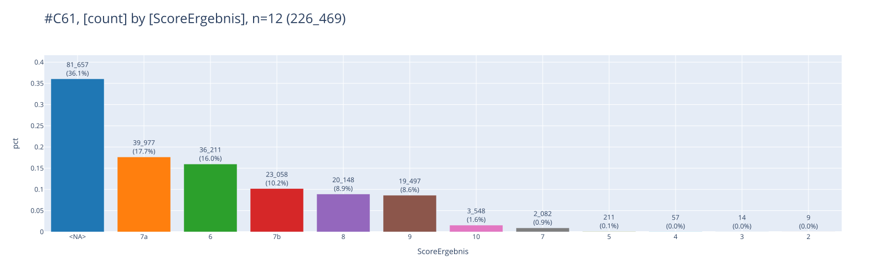
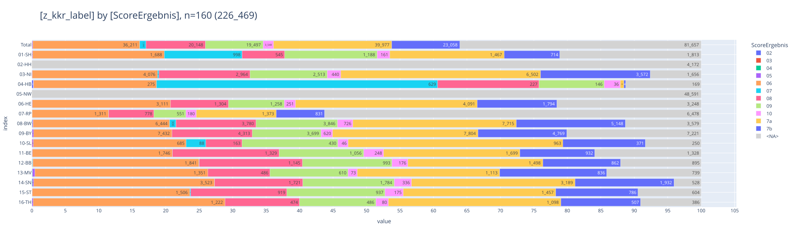
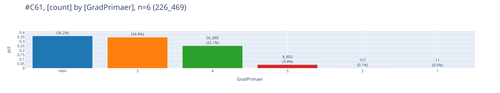
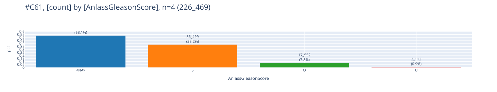

# [C61](#toc0_)

**Table of contents**    
- [C61](#toc1_)    
  - [📆 data as of](#toc1_1_)    
  - [C61 gleason](#toc1_2_)    
  - [C50](#toc1_3_)    
  - [D35.2](#toc1_4_)    

<!-- vscode-jupyter-toc-config
	numbering=false
	anchor=true
	flat=false
	minLevel=1
	maxLevel=6
	/vscode-jupyter-toc-config -->
<!-- THIS CELL WILL BE REPLACED ON TOC UPDATE. DO NOT WRITE YOUR TEXT IN THIS CELL -->

    🐍 3.12.8 | 📦 pygwalker: 0.4.9.15 | 📦 pandas: 2.3.3 | 📦 numpy: 1.26.4 | 📦 duckdb: 1.4.1 | 📦 pandas-plots: 0.20.4 | 📦 connection-helper: 0.13.1

## [📆 data as of](#toc0_)

    sqlite db file:          2025-06-24_data_clin.duckdb
    data tag:                v2.2
    last kkr data import:    2025-05-27
    sql table created:       2025-06-24 13:47:18
    doi:                     10.18444/5.03.01.0005.0021.0001
    document created:        2025-10-31 16:27:00

    ['oBDS_RKIPatientTumorId', 'oBDS_RKIPatientId', 'Diagnosedatum', 'Diagnosedatum_Genauigkeit', 'Inzidenzort', 'Diagnose_ICD10_Code', 'Diagnose_ICD10_Version', 'Topographie_Code', 'Topographie_Version', 'Diagnosesicherung', 'TNM_Auflage_c', 'y_Symbol_c', 'r_Symbol_c', 'a_Symbol_c', 'm_Symbol_c', 'c_p_u_Praefix_T_c', 'T_c', 'c_p_u_Praefix_N_c', 'N_c', 'c_p_u_Praefix_M_c', 'M_c', 'L_c', 'V_c', 'Pn_c', 'S_c', 'UICC_Stadium_c', 'TNM_Auflage_p', 'y_Symbol_p', 'r_Symbol_p', 'a_Symbol_p', 'm_Symbol_p', 'c_p_u_Praefix_T_p', 'T_p', 'c_p_u_Praefix_N_p', 'N_p', 'c_p_u_Praefix_M_p', 'M_p', 'L_p', 'V_p', 'Pn_p', 'S_p', 'UICC_Stadium_p', 'Grading', 'LK_befallen', 'LK_untersucht', 'Morphologie_Code', 'Morphologie_Version', 'Praetherapeutischer_Menopausenstatus', 'HormonrezeptorStatus_Oestrogen', 'HormonrezeptorStatus_Progesteron', 'Her2neuStatus', 'TumorgroesseInvasiv', 'TumorgroesseDCIS', 'RASMutation', 'RektumAbstandAnokutanlinie', 'GradPrimaer', 'GradSekundaer', 'ScoreErgebnis', 'AnlassGleasonScore', 'PSA', 'DatumPSA', 'DatumPSA_Genauigkeit', 'Tumordicke', 'LDH', 'Ulzeration', 'Seitenlokalisation', 'DCN', 'Anzahl_Tage_Diagnose_Tod', 'z_tum_id', 'z_pat_id', 'z_kkr', 'z_kkr_label', 'z_dy', 'z_age', 'z_ag05', 'z_icd10', 'z_icd10_3d', 'z_t_c_0', 'z_t_c_1', 'z_t_p_0', 'z_t_p_1', 'z_n_c_0', 'z_n_c_1', 'z_n_p_0', 'z_n_p_1', 'z_m_c_0', 'z_m_c_1', 'z_m_p_0', 'z_m_p_1', 'z_m_pc_1', 'z_is_dco', 'z_last_tum_status', 'z_tum_op_count', 'z_tum_st_count', 'z_tum_sy_count', 'z_tum_fo_count', 'z_first_treatment', 'z_first_treatment_after_days', 'z_event_order', 'z_event_op_st_sy_fo', 'z_class_hpv', 'z_tum_order', 'z_sex']

## [C61 gleason](#toc0_)

    🗄️ gleason	226_469, 7
    	("z_icd10, z_kkr_label, z_sex, ScoreErgebnis, GradPrimaer, GradSekundaer, AnlassGleasonScore")
    ┌─────────┬─────────────┬─────────┬───────────────┬─────────────┬───────────────┬────────────────────┐
    │ z_icd10 │ z_kkr_label │  z_sex  │ ScoreErgebnis │ GradPrimaer │ GradSekundaer │ AnlassGleasonScore │
    │ varchar │   varchar   │ varchar │    varchar    │   varchar   │    varchar    │      varchar       │
    ├─────────┼─────────────┼─────────┼───────────────┼─────────────┼───────────────┼────────────────────┤
    │ C61     │ 01-SH       │ M       │ 7a            │ 3           │ 4             │ O                  │
    │ C61     │ 06-HE       │ M       │ 8             │ 4           │ 4             │ NULL               │
    │ C61     │ 05-NW       │ M       │ NULL          │ NULL        │ NULL          │ NULL               │
    └─────────┴─────────────┴─────────┴───────────────┴─────────────┴───────────────┴────────────────────┘
    

    

    

    

    

    

    

    

    

    

    

