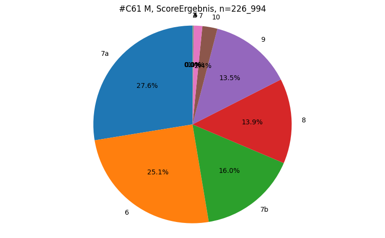

# [C61](#toc0_)

**Table of contents**    
- [C61](#toc1_)    
  - [📆 data as of](#toc1_1_)    
  - [C61 gleason](#toc1_2_)    
  - [C50](#toc1_3_)    
  - [D35.2](#toc1_4_)    

 

<!-- vscode-jupyter-toc-config
	numbering=false
	anchor=true
	flat=false
	minLevel=1
	maxLevel=6
	/vscode-jupyter-toc-config -->
<!-- THIS CELL WILL BE REPLACED ON TOC UPDATE. DO NOT WRITE YOUR TEXT IN THIS CELL -->

    🐍 3.12.8 | 📦 pygwalker: 0.4.9.15 | 📦 pandas: 2.3.3 | 📦 numpy: 1.26.4 | 📦 duckdb: 1.4.1 | 📦 pandas-plots: 0.21.2 | 📦 connection-helper: 0.13.1

## [📆 data as of](#toc0_)

    sqlite db file:          2025-11-11_data_clin.duckdb
    data tag:                v2.3
    last kkr data import:    2025-09-30
    sql table created:       2025-11-11 11:52:01
    doi:                     10.18444/5.03.01.0005.0021.0002
    document created:        2025-11-11 16:09:19

## [C61 gleason](#toc0_)

    🗄️ gleason	226_994, 7
    	("z_icd10, z_kkr_label, z_sex, ScoreErgebnis, GradPrimaer, GradSekundaer, AnlassGleasonScore")
    ┌─────────┬─────────────┬─────────┬───────────────┬─────────────┬───────────────┬────────────────────┐
    │ z_icd10 │ z_kkr_label │  z_sex  │ ScoreErgebnis │ GradPrimaer │ GradSekundaer │ AnlassGleasonScore │
    │ varchar │   varchar   │ varchar │    varchar    │   varchar   │    varchar    │      varchar       │
    ├─────────┼─────────────┼─────────┼───────────────┼─────────────┼───────────────┼────────────────────┤
    │ C61     │ 07-RP       │ M       │ NULL          │ NULL        │ NULL          │ NULL               │
    │ C61     │ 05-NW       │ M       │ NULL          │ NULL        │ NULL          │ NULL               │
    │ C61     │ 05-NW       │ M       │ NULL          │ NULL        │ NULL          │ NULL               │
    └─────────┴─────────────┴─────────┴───────────────┴─────────────┴───────────────┴────────────────────┘
    

    

    

