# <a id='toc1_'></a>[Bericht zur Qualität der klinischen Daten](#toc0_)

**Inhalt**<a id='toc0_'></a>    
- [Bericht zur Qualität der klinischen Daten](#toc1_)    
  - [Informationen zum Dokument](#toc1_1_)    
  - [Änderungen seit der letzten Version](#toc1_2_)    
  - [Datenstand](#toc1_3_)    
  - [Lieferdatum](#toc1_4_)    
  - [Fallzahlen](#toc1_5_)    
    - [absolut](#toc1_5_1_)    
    - [relativ](#toc1_5_2_)    
      - [nach KKR](#toc1_5_2_1_)    
      - [nach System](#toc1_5_2_2_)    
  - [Fehlende Therapieangaben](#toc1_6_)    
    - [alle Therapien](#toc1_6_1_)    
    - [OP](#toc1_6_2_)    
      - [OP wenn OP erwartet](#toc1_6_2_1_)    
        - [C50](#toc1_6_2_1_1_)    
        - [C18-C20](#toc1_6_2_1_2_)    
    - [ST](#toc1_6_3_)    
    - [SYST](#toc1_6_4_)    
  - [Fallzahlen epi vs clin](#toc1_7_)    
  - [Verteilung von Variablen](#toc1_8_)    
    - [UICC (p)](#toc1_8_1_)    
    - [Diagnosesicherung](#toc1_8_2_)    
    - [DCO](#toc1_8_3_)    
    - [DCN](#toc1_8_4_)    
    - [Geschlecht](#toc1_8_5_)    
    - [Grading](#toc1_8_6_)    
      - [Verteilung](#toc1_8_6_1_)    
      - [Anteile Unbekannt](#toc1_8_6_2_)    
    - [Diagnosejahr mit Altdaten](#toc1_8_7_)    
    - [Diagnosejahr ohne Altdaten](#toc1_8_8_)    
    - [Inzidenzort vs Lieferregister](#toc1_8_9_)    
    - [ICD10 Gruppen](#toc1_8_10_)    
    - [Altersgruppen Kinder und Heranwachsende](#toc1_8_11_)    
    - [Verstorben](#toc1_8_12_)    
    - [TNM-T (p)](#toc1_8_13_)    
    - [TNM-N (p)](#toc1_8_14_)    
    - [TNM-M (p)](#toc1_8_15_)    
  - [Todesursachen (TU)](#toc1_9_)    
    - [nach ICD10 Einstellern](#toc1_9_1_)    
    - [nach Sterbejahr und Todesursachen](#toc1_9_2_)    
    - [nach ICD10 Dreistellern (TOP 5)](#toc1_9_3_)    
    - [nach IsGrundleiden](#toc1_9_4_)    
  - [Therapien](#toc1_10_)    
    - [OP](#toc1_10_1_)    
      - [nach ICD10](#toc1_10_1_1_)    
      - [nach Intention](#toc1_10_1_2_)    
    - [OPS](#toc1_10_2_)    
      - [nach OPS ICD Kapitel (Top 10)](#toc1_10_2_1_)    
    - [SYST](#toc1_10_3_)    
      - [nach Stellung_OP](#toc1_10_3_1_)    
  - [Missings- und Unbekannt-Kodierungen](#toc1_11_)    
    - [Verpflichtende Tumorvariablen](#toc1_11_1_)    
    - [Weitere Tumorangaben](#toc1_11_2_)    
    - [Tumorstadien](#toc1_11_3_)    
    - [Therapieangaben](#toc1_11_4_)    
      - [OP](#toc1_11_4_1_)    
      - [ST](#toc1_11_4_2_)    
      - [SYST](#toc1_11_4_3_)    
    - [Folgeereignisse](#toc1_11_5_)    
    - [Freitexte](#toc1_11_6_)    
    - [Organspezifische Variablen](#toc1_11_7_)    
      - [Mamma](#toc1_11_7_1_)    
      - [Prostata](#toc1_11_7_2_)    
      - [Darm](#toc1_11_7_3_)    
      - [Melanom](#toc1_11_7_4_)    
  - [Weitere Klassifikationen](#toc1_12_)    
    - [nach Quelle](#toc1_12_1_)    
    - [nach KKR](#toc1_12_2_)    
    - [nach Jahren](#toc1_12_3_)    
    - [PSA](#toc1_12_4_)    
      - [Angabe zu Diagnose vs Weitere Klassifikationen](#toc1_12_4_1_)    
      - [Kombinationen der PSA Merkmale](#toc1_12_4_2_)    
      - [Weitere Klassifikationen: Diagnose vs Folgeereignis](#toc1_12_4_3_)    
    - [UICC](#toc1_12_5_)    
      - [Kombinationen](#toc1_12_5_1_)    
      - [nach KKR](#toc1_12_5_2_)    
  - [Freitextkodierung](#toc1_13_)    
    - [Substanzen](#toc1_13_1_)    
  - [Datum Vitalstatus](#toc1_14_)    
    - [Zeitpunkt der Erhebung](#toc1_14_1_)    
  - [Numerische Variablen](#toc1_15_)    
    - [Diagnosealter](#toc1_15_1_)    
    - [Anzahl Tage zwischen Diagnose und Tod](#toc1_15_2_)    
    - [Tumordicke](#toc1_15_3_)    
    - [PSA](#toc1_15_4_)    
    - [LK_befallen](#toc1_15_5_)    
    - [LK_untersucht](#toc1_15_6_)    
    - [RektumAbstandAnokutanlinie](#toc1_15_7_)    
    - [LDH](#toc1_15_8_)    

<!-- vscode-jupyter-toc-config
	numbering=false
	anchor=true
	flat=false
	minLevel=1
	maxLevel=6
	/vscode-jupyter-toc-config -->
<!-- THIS CELL WILL BE REPLACED ON TOC UPDATE. DO NOT WRITE YOUR TEXT IN THIS CELL -->


<br>

## <a id='toc1_1_'></a>[Informationen zum Dokument](#toc0_)
- Neben den Hinweisen zum Verständnis der Auswertungen sind auch häufig **Interpretationen** angefügt, diese sind optisch abgesetzt als **Notiz** erkennbar
- die jeweils angewendeten **Filter** sind für jede Auswertung dargestellt, jeweils zur besseren Einordnung als Anteil von der Gesamtzahl der Entität in unserer Datenbank
- die _relativen_ Barcharts enthalten ein `Total` item für den Gesamtvergleich
- die Filter können exakt nachvollzogen werden mit Hilfe der **ausklappbaren SQL Abfragen**
- in den Diagrammen gibt ebenfalls das angegebene _`n=`_ einen Hinweis auf die verwendete Grundgesamtheit
- der komplette Quellcode dieses Dokumentes ist [hier abrufbar](../../clin_analyze.ipynb)

<div style="page-break-after: always;"></div>


<br>

## <a id='toc1_2_'></a>[Änderungen seit der letzten Version](#toc0_)
- Neulieferung für Daten mit max DJ=2024

> [!WARNING]
> Ungetestet

<br>

## <a id='toc1_3_'></a>[Datenstand](#toc0_)
**Diagnosejahr 2024**

    database file:           2026-05-12_data_clin.duckdb
    data tag:                v2.4
    last kkr data import:    2026-04-18
    sql table created:       2026-05-12 16:38:32
    doi:                     -
    document created:        2026-05-13 09:55:18


<br>

## <a id='toc1_4_'></a>[Lieferdatum](#toc0_)
- `kkr` = Klinisches Krebsregister
- `Lieferdatum` = Datum der letzten Übermittlung durch die KKR
- `Diagnosemonat` = letzter Diagnosemonat in den Daten


    
<picture>
  <source media="(prefers-color-scheme: dark)" srcset="clin_files_dark/output_12_0.png">
  <source media="(prefers-color-scheme: light)" srcset="clin_files/output_12_0.png">
  
</picture>
    


    kkr ohne aktuelle Daten:  []


<div style="page-break-after: always;"></div>


<br>

## <a id='toc1_5_'></a>[Fallzahlen](#toc0_)
- in den Darstellungen sind keine Filter angewendet, solange nicht explizit angegeben

<br>

### <a id='toc1_5_1_'></a>[absolut](#toc0_)
- aufgespannt sind die Fallzahlen für Lieferregister und Elementknoten
- für jedes Register ist hier insbesondere einsehbar, wie viele Tumore/Patienten aus der aktuellsten Lieferung verarbeitet wurden
- kein Filter, "Altfälle" (DJ < 2020) sind also enthalten
- aufgeteilt auf 2 Tabellen zur besseren Übersicht
- die `%` Werte sowie die farbigen Datenbalken zeigen das relative Gewicht jedes KKR an "D gesamt" (`Total` Zeile)
- Erklärung für einige Elementknoten:
  - **Diagnose**
    - `diag_weitere` = Weitere Klassifikation im Elementknoten "Diagnose"
    - `diag_fm` = Fernmetastasen im Elementknoten "Diagnose"
  - **Folge**
    - `folge_fm`= Fernmetastasen im Elementknoten "Folgeereignis"
    - `folge_weitere` = Weitere Klassifikation im Elementknoten "Folgeereignis"
    - `folge_tnm` = TNM im Elementknoten "Folgeereignis"

> [!NOTE]
> 💡 **ZfKD**
> - inzwischen liegen die meisten Elemente flächendeckend vor, bis auf `Applikationsart` und `Folgeereignis_WeitereKlassifikation`
> - einige Elemente sind überproportional zur Verteilung der Tumore vorhanden, z.B. Weitere Klassifikationen bei Folgeereignissen aus `05-NW`
> - die für viele Analysen relevanten `Folgeereignisse` sind nun zwar deutschlandweit verfügbar, aber aus einigen KKR mit sehr geringem Anteil


    
<picture>
  <source media="(prefers-color-scheme: dark)" srcset="clin_files_dark/output_17_0.png">
  <source media="(prefers-color-scheme: light)" srcset="clin_files/output_17_0.png">
  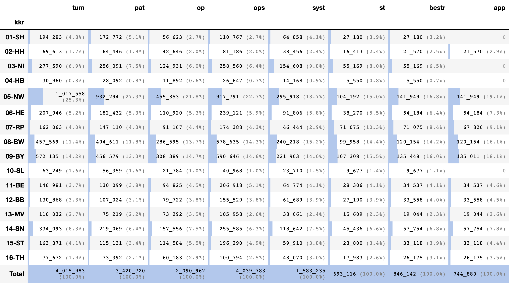
</picture>
    


    
<picture>
  <source media="(prefers-color-scheme: dark)" srcset="clin_files_dark/output_18_0.png">
  <source media="(prefers-color-scheme: light)" srcset="clin_files/output_18_0.png">
  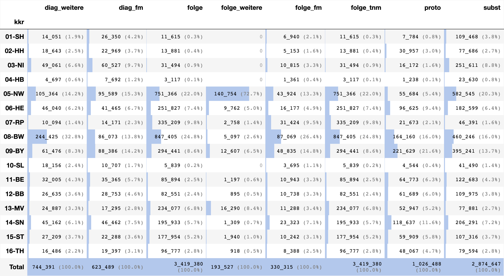
</picture>
    


<br>

### <a id='toc1_5_2_'></a>[relativ](#toc0_)
- der Filter ist gewählt, um eine bessere Vergleichbarkeit der Werte zu gewährleisten
- die Metriken sind **einfache Verhältiszahlen**, z.B: `op_per_tum` = alle OP / alle Tumore (pro kkr)
- es sind jeweils die kumulierten Werte aufgespannt:
  - nach einzelnen **Lieferregistern**
  - nach verwendeten **Tumordokumentationssystemen** (um systemische Effekte darstellen zu können)

> [!NOTE]
> 💡 **ZfKD**
> - die Quote Tumor pro Patient ist verlässlich konstant
> - bei den Therapien gibt es einige Auffälligkeiten, wie z.B. wenige Folgeereignisse aus den `tristan` Ländern, oder hohe ST pro Tumor Quote aus `07-RP`


<br>

#### <a id='toc1_5_2_1_'></a>[nach KKR](#toc0_)


```
    n = 4_062_856                                    (100.0%) ██████████████████████████████
    └ [DJ 2020-2024]:                  n = 3_794_188  (93.4%) ░░████████████████████████████
    └ [keine DCO]:                     n = 3_672_629  (90.4%) ░░░███████████████████████████
    └ [keine C44,D04]:                 n = 3_065_024  (75.4%) ░░░░░░░░██████████████████████
    └ [keine Verstorbenen < 180 Tage]: n = 2_688_879  (66.2%) ░░░░░░░░░░░███████████████████
    └ [kein M1]:                       n = 2_472_554  (60.9%) ░░░░░░░░░░░░██████████████████
```

<details>
<summary>filter-sql</summary>

```sql
z_dy between 2020 and 2024
and not z_is_dco
and z_icd10_3d not in ('C44','D04')
and ifnull(z_period_diag_death_day,181) >= 180
and ifnull(z_m_pc_1,'') <> '1'
```

</details>


    
    


<picture>
  <source media="(prefers-color-scheme: dark)" srcset="clin_files_dark/output_21_6.png">
  <source media="(prefers-color-scheme: light)" srcset="clin_files/output_21_6.png">
  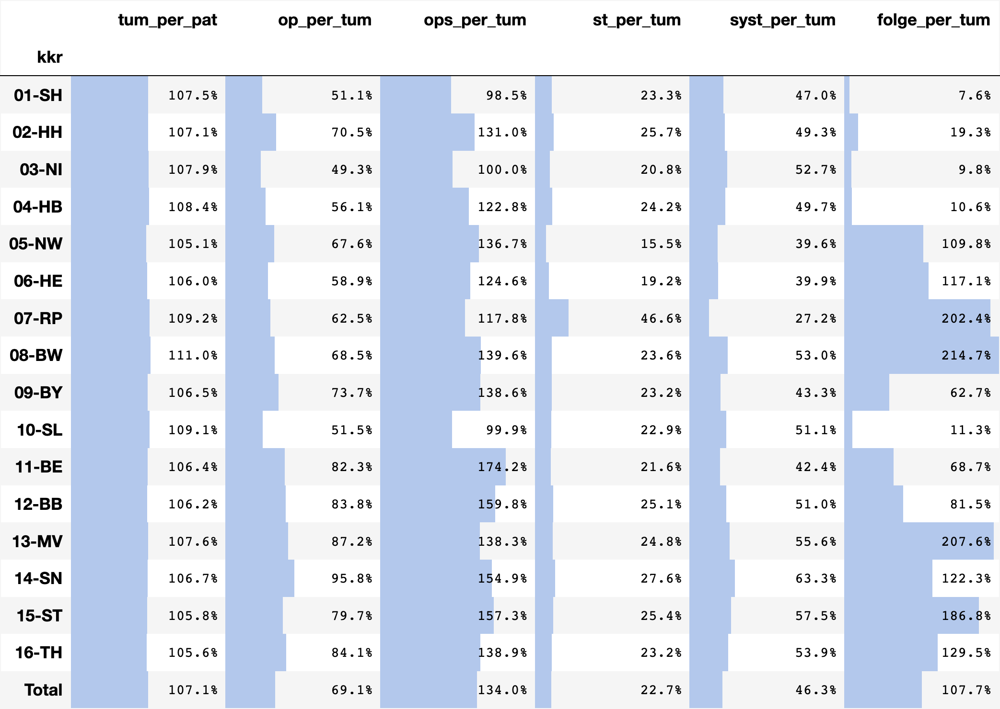
</picture>
    


<br>

#### <a id='toc1_5_2_2_'></a>[nach System](#toc0_)


<picture>
  <source media="(prefers-color-scheme: dark)" srcset="clin_files_dark/output_23_1.png">
  <source media="(prefers-color-scheme: light)" srcset="clin_files/output_23_1.png">
  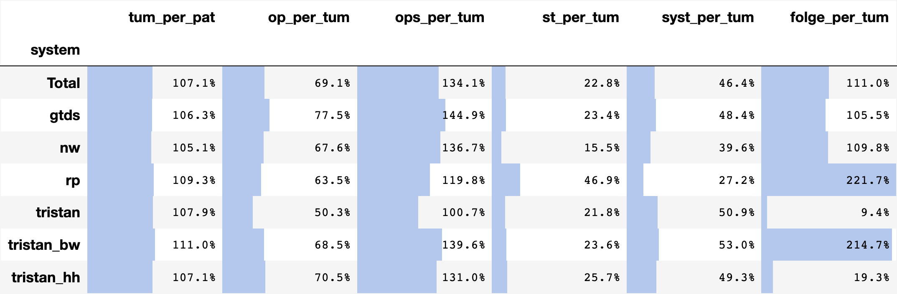
</picture>
    


<br>

## <a id='toc1_6_'></a>[Fehlende Therapieangaben](#toc0_)

- ein Wert von bspw. 0.68 ist zu interpretieren als: _"68% aller Tumorfälle im KKR haben keine zugeordneten OP Angaben, die restlichen 32% mindestens eine."_
- `treat_missing_per_tum` stellt den Anteil Fälle dar, bei denen keinerlei Therapieangabe (OP, ST, SYST) vorliegt
- in der Darstellung sind die Max/Min Werte pro Kennzahl mit 🟥/🟩 markiert (kleiner ist besser)


<br>

### <a id='toc1_6_1_'></a>[alle Therapien](#toc0_)
- da hier alle Therapieangabe im Überblick dargestellt sind können keine therapiespezifischen Filter wie etwa "nur solide Tumoren" wirken
- der Filter `DJ 2020-2024 ohne letzte 6m` soll gezielt Effekte des jüngsten Lieferjahres ausschliessen

> [!NOTE]
> 💡 **ZfKD**
> - der Anteil liegt in den neuen Bundesländern und Berlin fast durchgehend niedriger (10%-19%) als in den alten Bundesländern (17%-31%)
> - im Zeitverlauf ist zwischen 2020 und 2023 keine eindeutige Tendenz zu beobachten
> - trotz Ausschluss der Diagnosen im 2. Halbjahr 2023 liegt der Anteil von Fällen ohne Therapieangabenin 2023 noch etwas über dem Wert der Vorjahre, auch hier ist wahrscheinlich noch mit nachträglichen Ergänzungen zu rechnen


```
    n = 4_062_856                                    (100.0%) ██████████████████████████████
    └ [DJ 2020-2024]:                  n = 3_794_188  (93.4%) ░░████████████████████████████
    └ [DJ 2020-2024 ohne letzte 6m]:   n = 3_447_269  (84.8%) ░░░░░█████████████████████████
    └ [keine DCO]:                     n = 3_335_696  (82.1%) ░░░░░░████████████████████████
    └ [ICD10 nur C]:                   n = 2_787_382  (68.6%) ░░░░░░░░░░████████████████████
    └ [keine C44,D04]:                 n = 2_301_507  (56.6%) ░░░░░░░░░░░░░░████████████████
    └ [keine Verstorbenen < 180 Tage]: n = 1_968_506  (48.5%) ░░░░░░░░░░░░░░░░██████████████
    └ [kein M1]:                       n = 1_771_571  (43.6%) ░░░░░░░░░░░░░░░░░█████████████
```

<details>
<summary>filter-sql</summary>

```sql
z_dy between 2020 and 2024
and Diagnosedatum between '2020-01-01' and '2024-06-30'
and not z_is_dco
and left(z_icd10_3d,1) = 'C'
and z_icd10_3d not in ('C44','D04')
and ifnull(z_period_diag_death_day,181) >= 180
and ifnull(z_m_pc_1,'') <> '1'
```

</details>


    
    


<picture>
  <source media="(prefers-color-scheme: dark)" srcset="clin_files_dark/output_27_6.png">
  <source media="(prefers-color-scheme: light)" srcset="clin_files/output_27_6.png">
  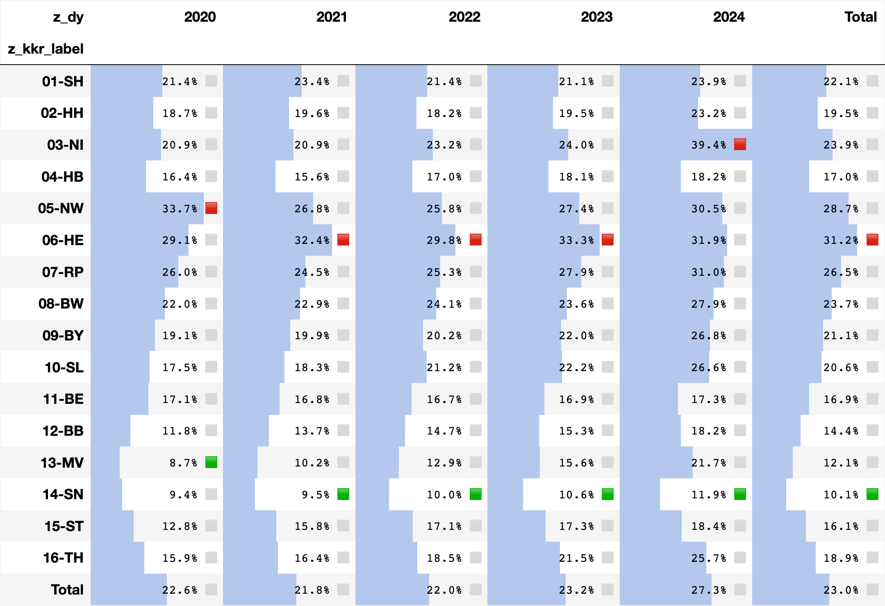
</picture>
    


<br>

### <a id='toc1_6_2_'></a>[OP](#toc0_)
- **nur solide Tumoren**  schliesst folgende Diagnosen aus: C44, C76-C97, alle D


```
    n = 4_062_856                                    (100.0%) ██████████████████████████████
    └ [DJ 2020-2024]:                  n = 3_794_188  (93.4%) ░░████████████████████████████
    └ [DJ 2020-2024 ohne letzte 6m]:   n = 3_447_269  (84.8%) ░░░░░█████████████████████████
    └ [keine DCO]:                     n = 3_335_696  (82.1%) ░░░░░░████████████████████████
    └ [keine C44,D04]:                 n = 2_781_485  (68.5%) ░░░░░░░░░░████████████████████
    └ [nur solide Tumore]:             n = 2_073_984  (51.0%) ░░░░░░░░░░░░░░░███████████████
    └ [keine Verstorbenen < 180 Tage]: n = 1_789_432  (44.0%) ░░░░░░░░░░░░░░░░░█████████████
    └ [kein M1]:                       n = 1_597_594  (39.3%) ░░░░░░░░░░░░░░░░░░░███████████
```

<details>
<summary>filter-sql</summary>

```sql
z_dy between 2020 and 2024
and Diagnosedatum between '2020-01-01' and '2024-06-30'
and not z_is_dco
and z_icd10_3d not in ('C44','D04')
and 
    z_icd10_3d not in ('C44')
    and left(z_icd10_3d,1) = 'C'
    and right(z_icd10_3d, 2)::int8 <= 75
and ifnull(z_period_diag_death_day,181) >= 180
and ifnull(z_m_pc_1,'') <> '1'
```

</details>


    
    


<picture>
  <source media="(prefers-color-scheme: dark)" srcset="clin_files_dark/output_29_6.png">
  <source media="(prefers-color-scheme: light)" srcset="clin_files/output_29_6.png">
  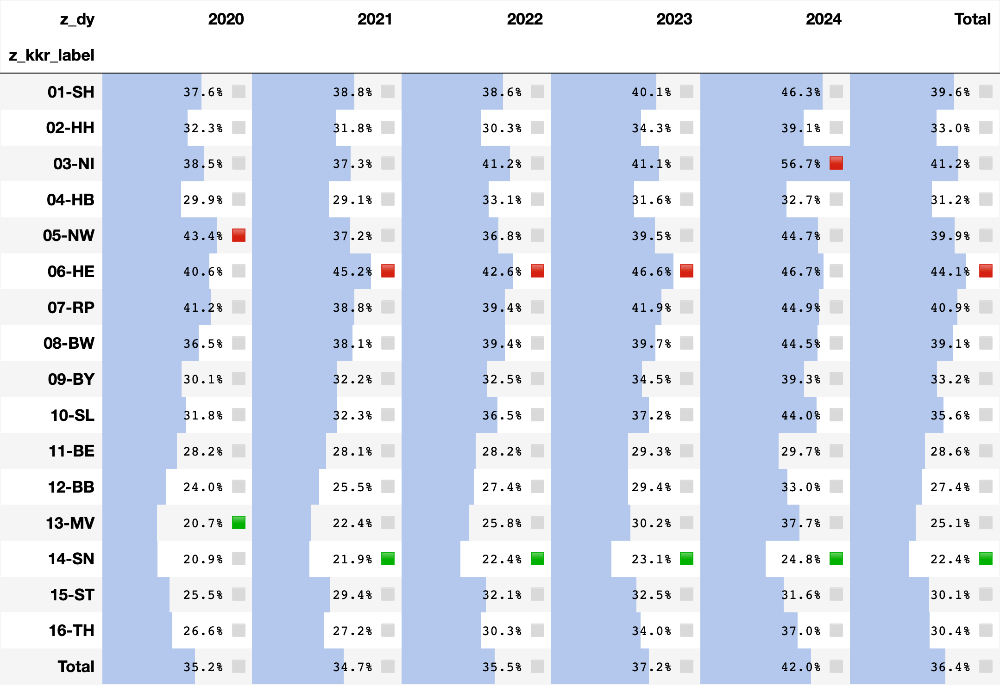
</picture>
    


<br>

#### <a id='toc1_6_2_1_'></a>[OP wenn OP erwartet](#toc0_)
- kategorien
  - `1_op`: mind. eine OPS im definierten Bereich (3Steller, organspezifisch) ist dokumentiert
  - `2_no_op_but_tp`: keine OPS, aber pT 1-4 ist dokumentiert
  - `3_rest`: keine der zuvor genannten Merkmale trifft


<br>

##### <a id='toc1_6_2_1_1_'></a>[C50](#toc0_)


```
    n = 4_062_856                                    (100.0%) ██████████████████████████████
    └ [DJ 2020-2024]:                  n = 3_794_188  (93.4%) ░░████████████████████████████
    └ [DJ 2020-2024 ohne letzte 6m]:   n = 3_447_269  (84.8%) ░░░░░█████████████████████████
    └ [keine DCO]:                     n = 3_335_696  (82.1%) ░░░░░░████████████████████████
    └ [ICD10 C50]:                       n = 356_237   (8.8%) ░░░░░░░░░░░░░░░░░░░░░░░░░░░░██
    └ [kein M1]:                         n = 330_742   (8.1%) ░░░░░░░░░░░░░░░░░░░░░░░░░░░░██
    └ [keine Verstorbenen < 180 Tage]:   n = 323_899   (8.0%) ░░░░░░░░░░░░░░░░░░░░░░░░░░░░██
```

<details>
<summary>filter-sql</summary>

```sql
z_dy between 2020 and 2024
and Diagnosedatum between '2020-01-01' and '2024-06-30'
and not z_is_dco
and z_icd10_3d = 'C50'
and ifnull(z_m_pc_1,'') <> '1'
and ifnull(z_period_diag_death_day,181) >= 180
```

</details>


    
    


<picture>
  <source media="(prefers-color-scheme: dark)" srcset="clin_files_dark/output_32_6.svg">
  <source media="(prefers-color-scheme: light)" srcset="clin_files/output_32_6.svg">
  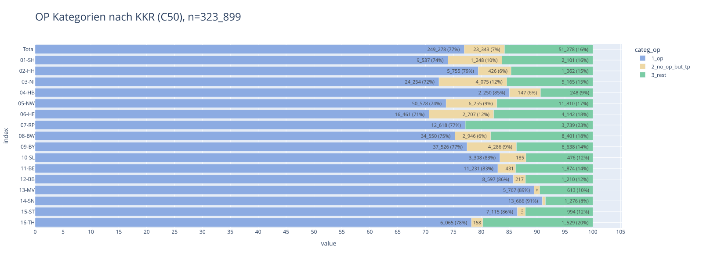
</picture>
    


<br>

##### <a id='toc1_6_2_1_2_'></a>[C18-C20](#toc0_)


```
    n = 4_062_856                                    (100.0%) ██████████████████████████████
    └ [DJ 2020-2024]:                  n = 3_794_188  (93.4%) ░░████████████████████████████
    └ [DJ 2020-2024 ohne letzte 6m]:   n = 3_447_269  (84.8%) ░░░░░█████████████████████████
    └ [keine DCO]:                     n = 3_335_696  (82.1%) ░░░░░░████████████████████████
    └ [ICD10 C18-C20]:                   n = 252_341   (6.2%) ░░░░░░░░░░░░░░░░░░░░░░░░░░░░░█
    └ [kein M1]:                         n = 206_884   (5.1%) ░░░░░░░░░░░░░░░░░░░░░░░░░░░░░█
    └ [keine Verstorbenen < 180 Tage]:   n = 185_172   (4.6%) ░░░░░░░░░░░░░░░░░░░░░░░░░░░░░█
```

<details>
<summary>filter-sql</summary>

```sql
z_dy between 2020 and 2024
and Diagnosedatum between '2020-01-01' and '2024-06-30'
and not z_is_dco
and z_icd10_3d in ('C18', 'C19', 'C20')
and ifnull(z_m_pc_1,'') <> '1'
and ifnull(z_period_diag_death_day,181) >= 180
```

</details>


    
    


<picture>
  <source media="(prefers-color-scheme: dark)" srcset="clin_files_dark/output_34_6.svg">
  <source media="(prefers-color-scheme: light)" srcset="clin_files/output_34_6.svg">
  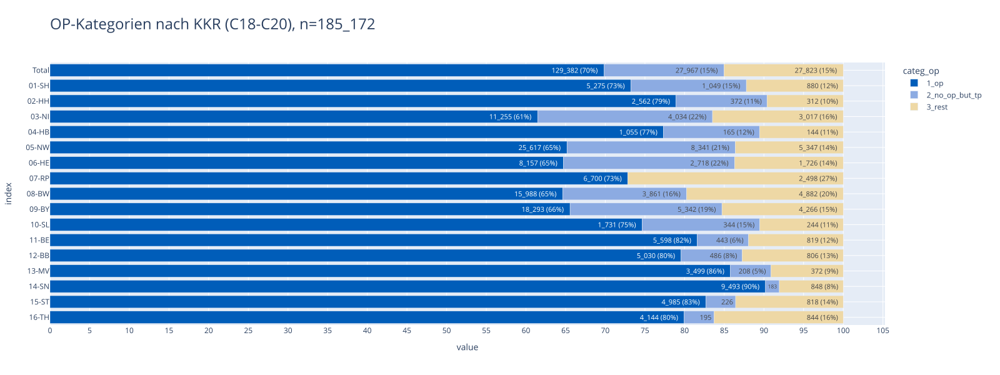
</picture>
    


<br>

### <a id='toc1_6_3_'></a>[ST](#toc0_)
- Metrik: Anteil Tumore **ohne** Strahlentherapie an Gesamt
- die experimentelle Darstellung verwendet eine heatmap, um Nuancen in diesem relativ homogenen Diagramm optisch hervorzuheben

> [!NOTE]
> 💡 **ZfKD**
> - der Anteil Tumore ohne ST (~75%) entspricht grob der Annahme von 30% Anteil von Strahlentherapien an primären Diagnosen
> - `05-NW` und `06-HE` weisen optisch relativ hohe Anteile auf
> - in nahezu allen KKR nimmt der Anteil in jüngeren DJ zu


```
    n = 4_062_856                                    (100.0%) ██████████████████████████████
    └ [DJ 2020-2024]:                  n = 3_794_188  (93.4%) ░░████████████████████████████
    └ [DJ 2020-2024 ohne letzte 6m]:   n = 3_447_269  (84.8%) ░░░░░█████████████████████████
    └ [keine DCO]:                     n = 3_335_696  (82.1%) ░░░░░░████████████████████████
    └ [nur solide Tumore]:             n = 2_073_984  (51.0%) ░░░░░░░░░░░░░░░███████████████
    └ [kein M1]:                       n = 1_763_564  (43.4%) ░░░░░░░░░░░░░░░░░█████████████
    └ [keine Verstorbenen < 180 Tage]: n = 1_597_594  (39.3%) ░░░░░░░░░░░░░░░░░░░███████████
```

<details>
<summary>filter-sql</summary>

```sql
z_dy between 2020 and 2024
and Diagnosedatum between '2020-01-01' and '2024-06-30'
and not z_is_dco
and 
    z_icd10_3d not in ('C44')
    and left(z_icd10_3d,1) = 'C'
    and right(z_icd10_3d, 2)::int8 <= 75
and ifnull(z_m_pc_1,'') <> '1'
and ifnull(z_period_diag_death_day,181) >= 180
```

</details>


    
    


<picture>
  <source media="(prefers-color-scheme: dark)" srcset="clin_files_dark/output_37_1.png">
  <source media="(prefers-color-scheme: light)" srcset="clin_files/output_37_1.png">
  
</picture>
    


<br>

### <a id='toc1_6_4_'></a>[SYST](#toc0_)
- Metrik: Anteil Tumore **ohne** systemische Therapie an Gesamt

> [!NOTE]
> 💡 **ZfKD**
> - entgegen dem Trend sinkt der Anteil in `04-HB` im letzten DJ
> - den stabil geringsten Anteil weist `16-TH` auf


```
    n = 4_062_856                                    (100.0%) ██████████████████████████████
    └ [DJ 2020-2024]:                  n = 3_794_188  (93.4%) ░░████████████████████████████
    └ [DJ 2020-2024 ohne letzte 6m]:   n = 3_447_269  (84.8%) ░░░░░█████████████████████████
    └ [keine DCO]:                     n = 3_335_696  (82.1%) ░░░░░░████████████████████████
    └ [kein M1]:                       n = 3_011_971  (74.1%) ░░░░░░░░██████████████████████
    └ [keine Verstorbenen < 180 Tage]: n = 2_783_094  (68.5%) ░░░░░░░░░░████████████████████
```

<details>
<summary>filter-sql</summary>

```sql
z_dy between 2020 and 2024
and Diagnosedatum between '2020-01-01' and '2024-06-30'
and not z_is_dco
and ifnull(z_m_pc_1,'') <> '1'
and ifnull(z_period_diag_death_day,181) >= 180
```

</details>


    
    


<picture>
  <source media="(prefers-color-scheme: dark)" srcset="clin_files_dark/output_39_6.png">
  <source media="(prefers-color-scheme: light)" srcset="clin_files/output_39_6.png">
  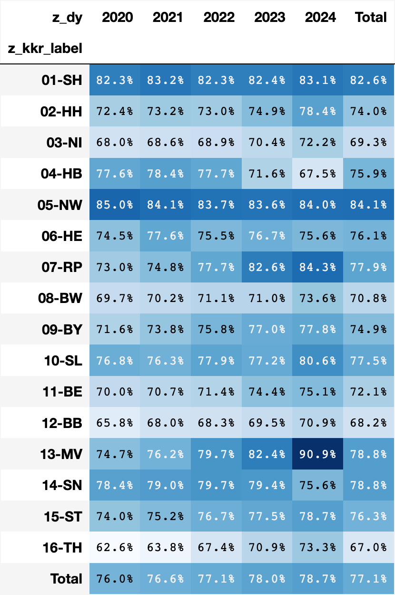
</picture>
    


<br>

## <a id='toc1_7_'></a>[Fallzahlen epi vs clin](#toc0_)
- Ziel der Darstellung: Abschätzung der Vollzähligkeit der klinischen Daten
- dargestellt sind die gefilterten Fallzahlen jeweils aus den epi und den klinischen Daten, hier allerdings nur aus dem aktuellstem DJ
- Hinweis: Die Auswertung Daten basiert auf `Inzidenzort` anstatt `Lieferregister`, da in den epi Daten bislang die einzelnen Länder des GKR nicht aufgeschlüsselt waren, und ein matching auf EKRNR somit fehlschlägt

> [!NOTE]
> 💡 **NI**: _"Die **höhere Fallzahl** des epidemiologischen Registers im Vergleich zum klinischen Register ist vermutlich auf unterschiedliche Filterkriterien in den beiden Registern zurückzuführen. Im KKN werden neben den Kriterien die das Lieferschema vorgibt auch noch weitere Plausibilitätsprüfungen angewandt. Tumoren, welche diese Prüfungen nicht bestehen, werden vom Export ausgeschlossen"_ 
> 
> ---
> 💡 **ZfKD**: Die quota in den anderen KKR entspricht der Erwartung, dass die Fallzahl bei klin. Daten höher sein sollte als bei epi Daten.


```
    n = 4_062_856                    (100.0%) ██████████████████████████████
    └ [DJ 2024]:         n = 723_706  (17.8%) ░░░░░░░░░░░░░░░░░░░░░░░░░█████
    └ [keine DCO]:       n = 704_349  (17.3%) ░░░░░░░░░░░░░░░░░░░░░░░░░█████
    └ [keine C44,D04]:   n = 592_575  (14.6%) ░░░░░░░░░░░░░░░░░░░░░░░░░░████
```

<details>
<summary>filter-sql</summary>

```sql
z_dy in (2024)
and not z_is_dco
and z_icd10_3d not in ('C44','D04')
```

</details>


    
    


```
    ┌──────────┬─────────┬─────────┬─────────┬─────────┬─────────┬─────────┬─────────┬─────────┬─────────┬─────────┬─────────┬─────────┬─────────┬─────────┬─────────┬─────────┐
    │   kkr    │  01-SH  │  02-HH  │  03-NI  │  04-HB  │  05-NW  │  06-HE  │  07-RP  │  08-BW  │  09-BY  │  10-SL  │  11-BE  │  12-BB  │  13-MV  │  14-SN  │  15-ST  │  16-TH  │
    ├──────────┼─────────┼─────────┼─────────┼─────────┼─────────┼─────────┼─────────┼─────────┼─────────┼─────────┼─────────┼─────────┼─────────┼─────────┼─────────┼─────────┤
    │ clin_cnt │ 23_860  │ 13_000  │ 47_622  │ 4_541   │ 129_531 │ 38_762  │ 30_424  │ 80_889  │ 88_739  │ 8_774   │ 25_458  │ 20_419  │ 15_070  │ 33_716  │ 17_665  │ 14_045  │
    │ epi_cnt  │ 22_820  │ 12_347  │ 56_134  │ 4_371   │ 129_466 │ 27_955  │ 28_807  │ 74_961  │ 81_866  │ 8_349   │ 24_019  │ 19_266  │ 1_011   │ 32_952  │ 17_291  │ 13_473  │
    │ quota    │ 105     │ 105     │ 85      │ 104     │ 100     │ 139     │ 106     │ 108     │ 108     │ 105     │ 106     │ 106     │ 1_491   │ 102     │ 102     │ 104     │
    └──────────┴─────────┴─────────┴─────────┴─────────┴─────────┴─────────┴─────────┴─────────┴─────────┴─────────┴─────────┴─────────┴─────────┴─────────┴─────────┴─────────┘
```

<div style="page-break-after: always;"></div>


<br>

## <a id='toc1_8_'></a>[Verteilung von Variablen](#toc0_)

<br>

### <a id='toc1_8_1_'></a>[UICC (p)](#toc0_)
- nach den absoluten Werten ist auch die relative Verteilung gegeben unter Ausschluss der hohen Zahl an UICC missings
- die Variable wird in den meisten KKR selbst gebildet. Für GTDS Länder ist dafür ein Standard definiert  


```
    n = 4_062_856                               (100.0%) ██████████████████████████████
    └ [DJ 2020-2024]:             n = 3_794_188  (93.4%) ░░████████████████████████████
    └ [keine DCO]:                n = 3_672_629  (90.4%) ░░░███████████████████████████
    └ [keine C44,D04]:            n = 3_065_024  (75.4%) ░░░░░░░░██████████████████████
    └ [nur tnm-relevante Tumore]: n = 2_082_538  (51.3%) ░░░░░░░░░░░░░░░███████████████
```

<details>
<summary>filter-sql</summary>

```sql
z_dy between 2020 and 2024
and not z_is_dco
and z_icd10_3d not in ('C44','D04')
and 
    (
        left(z_icd10_3d, 1) ='C' and
        (
            right(z_icd10_3d, 2)::int8 between 00 and 43
            or right(z_icd10_3d, 2)::int8 between 45 and 69
            or right(z_icd10_3d, 2)::int8 between 73 and 74
        )
        and left(Morphologie_Code,4)::int between 8010 and 8790
        and z_icd10_3d not in ('C26', 'C39', 'C55')
        and z_icd10 not in ('C14.0', 'C57.9', 'C63.9')
    )
```

</details>


    
    


<picture>
  <source media="(prefers-color-scheme: dark)" srcset="clin_files_dark/output_45_6.svg">
  <source media="(prefers-color-scheme: light)" srcset="clin_files/output_45_6.svg">
  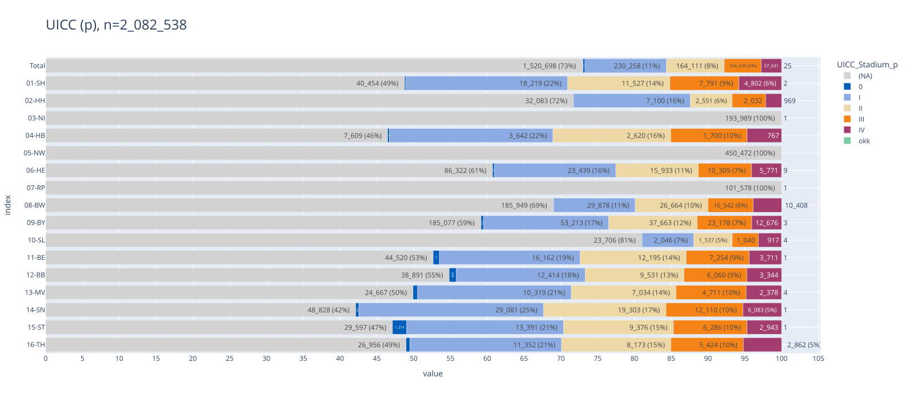
</picture>
    


<br>

### <a id='toc1_8_2_'></a>[Diagnosesicherung](#toc0_)

> [!NOTE]
> 💡 **ZfKD**: _die Kodes `6` und `7` werden von vielen KKR noch geliefert, sind allerdings in der aktuellen oBDS Referenz nicht mehr gültig_


```
    n = 4_062_856                    (100.0%) ██████████████████████████████
    └ [DJ 2020-2024]:  n = 3_794_188  (93.4%) ░░████████████████████████████
    └ [keine C44,D04]: n = 3_185_327  (78.4%) ░░░░░░░███████████████████████
```

<details>
<summary>filter-sql</summary>

```sql
z_dy between 2020 and 2024
and z_icd10_3d not in ('C44','D04')
```

</details>


    
    


    
<picture>
  <source media="(prefers-color-scheme: dark)" srcset="clin_files_dark/output_47_5.svg">
  <source media="(prefers-color-scheme: light)" srcset="clin_files/output_47_5.svg">
  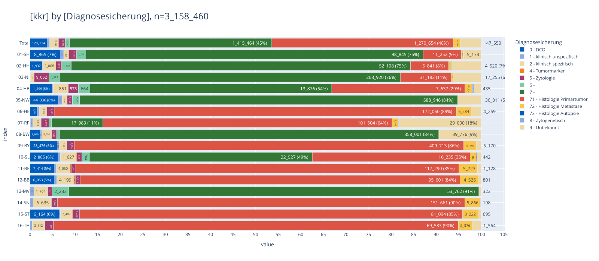
</picture>
    


<br>

### <a id='toc1_8_3_'></a>[DCO](#toc0_)

- Metrik: Anteil der als DCO markierten Fälle an Gesamt

> [!NOTE]
> 💡 **ZfKD**
> - aus einigen KKR sind DCO nicht, oder nur rudimentär markiert
> - ein weiterer sichtbarer Effekt ist die Zunahme des DCO Anteils in den jüngeren DJ in einigen KKR


```
    n = 4_062_856                    (100.0%) ██████████████████████████████
    └ [DJ 2020-2024]:  n = 3_794_188  (93.4%) ░░████████████████████████████
    └ [keine C44,D04]: n = 3_185_327  (78.4%) ░░░░░░░███████████████████████
    └ [ICD10 nur C]:   n = 2_649_060  (65.2%) ░░░░░░░░░░░███████████████████
```

<details>
<summary>filter-sql</summary>

```sql
z_dy between 2020 and 2024
and z_icd10_3d not in ('C44','D04')
and left(z_icd10_3d,1) = 'C'
```

</details>


    
    


<picture>
  <source media="(prefers-color-scheme: dark)" srcset="clin_files_dark/output_49_6.png">
  <source media="(prefers-color-scheme: light)" srcset="clin_files/output_49_6.png">
  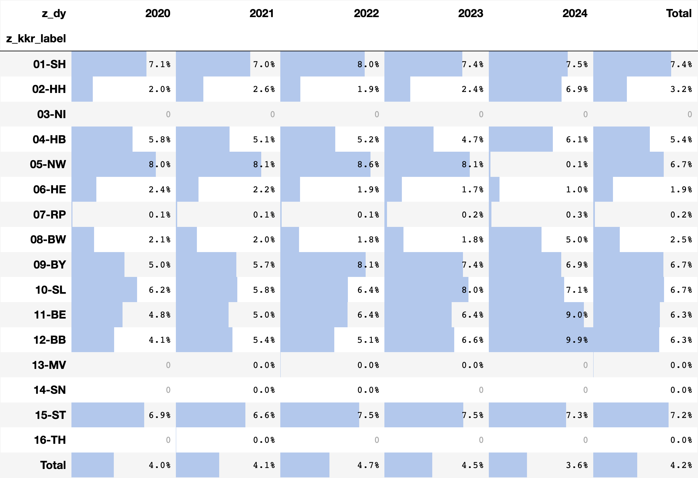
</picture>
    


<br>

### <a id='toc1_8_4_'></a>[DCN](#toc0_)

- Metrik: Anteil der als DCN markierten Fälle an Gesamt

> [!NOTE]
> 💡 **ZfKD**: aus einigen KKR sind DCN nicht, oder nur rudimentär markiert


```
    n = 4_062_856                    (100.0%) ██████████████████████████████
    └ [DJ 2020-2024]:  n = 3_794_188  (93.4%) ░░████████████████████████████
    └ [keine C44,D04]: n = 3_185_327  (78.4%) ░░░░░░░███████████████████████
    └ [ICD10 nur C]:   n = 2_649_060  (65.2%) ░░░░░░░░░░░███████████████████
```

<details>
<summary>filter-sql</summary>

```sql
z_dy between 2020 and 2024
and z_icd10_3d not in ('C44','D04')
and left(z_icd10_3d,1) = 'C'
```

</details>


    
    


<picture>
  <source media="(prefers-color-scheme: dark)" srcset="clin_files_dark/output_51_6.png">
  <source media="(prefers-color-scheme: light)" srcset="clin_files/output_51_6.png">
  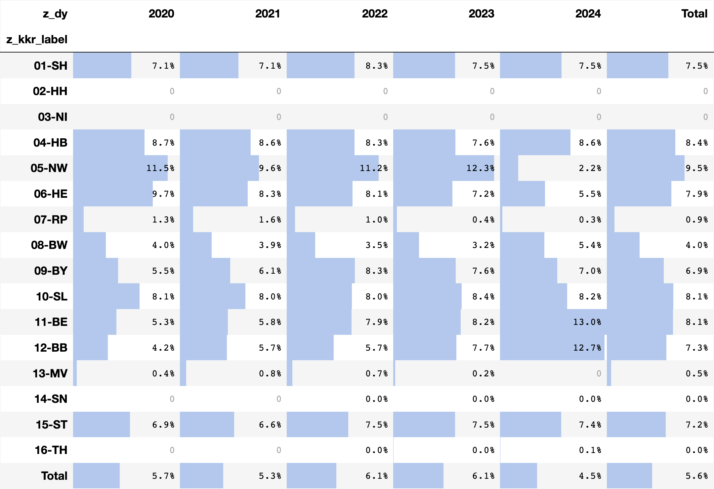
</picture>
    


<br>

### <a id='toc1_8_6_'></a>[Grading](#toc0_)

#### <a id='toc1_8_6_1_'></a>[Verteilung](#toc0_)


```
    n = 4_062_856                                  (100.0%) ██████████████████████████████
    └ [DJ 2020-2024]:                n = 3_794_188  (93.4%) ░░████████████████████████████
    └ [keine DCO]:                   n = 3_672_629  (90.4%) ░░░███████████████████████████
    └ [nur gradingrelevante Tumore]: n = 1_275_551  (31.4%) ░░░░░░░░░░░░░░░░░░░░░█████████
```

<details>
<summary>filter-sql</summary>

```sql
z_dy between 2020 and 2024
and not z_is_dco
and 
    (
        left(z_icd10_3d, 1) ='C' and
        (
            right(z_icd10_3d, 2)::int8 between 00 and 33
            or right(z_icd10_3d, 2)::int8 between 50 and 57
            or right(z_icd10_3d, 2)::int8 between 63 and 68
            or right(z_icd10_3d, 2)::int8 = 60
        )
        and left(Morphologie_Code,4)::int between 8010 and 8576
    )
```

</details>


    
    


    
<picture>
  <source media="(prefers-color-scheme: dark)" srcset="clin_files_dark/output_54_5.svg">
  <source media="(prefers-color-scheme: light)" srcset="clin_files/output_54_5.svg">
  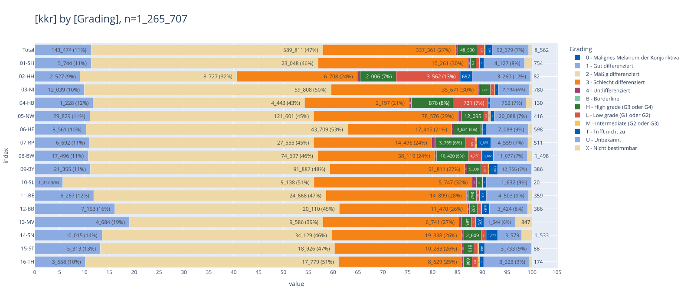
</picture>
    


<br>

#### <a id='toc1_8_6_2_'></a>[Anteile Unbekannt](#toc0_)
- Metrik: Anteil Codes (`U`,`T`) an Gesamt


```
    n = 4_062_856                                  (100.0%) ██████████████████████████████
    └ [DJ 2020-2024]:                n = 3_794_188  (93.4%) ░░████████████████████████████
    └ [keine DCO]:                   n = 3_672_629  (90.4%) ░░░███████████████████████████
    └ [nur gradingrelevante Tumore]: n = 1_275_551  (31.4%) ░░░░░░░░░░░░░░░░░░░░░█████████
```

<details>
<summary>filter-sql</summary>

```sql
z_dy between 2020 and 2024
and not z_is_dco
and 
    (
        left(z_icd10_3d, 1) ='C' and
        (
            right(z_icd10_3d, 2)::int8 between 00 and 33
            or right(z_icd10_3d, 2)::int8 between 50 and 57
            or right(z_icd10_3d, 2)::int8 between 63 and 68
            or right(z_icd10_3d, 2)::int8 = 60
        )
        and left(Morphologie_Code,4)::int between 8010 and 8576
    )
```

</details>


    
    


<picture>
  <source media="(prefers-color-scheme: dark)" srcset="clin_files_dark/output_56_6.png">
  <source media="(prefers-color-scheme: light)" srcset="clin_files/output_56_6.png">
  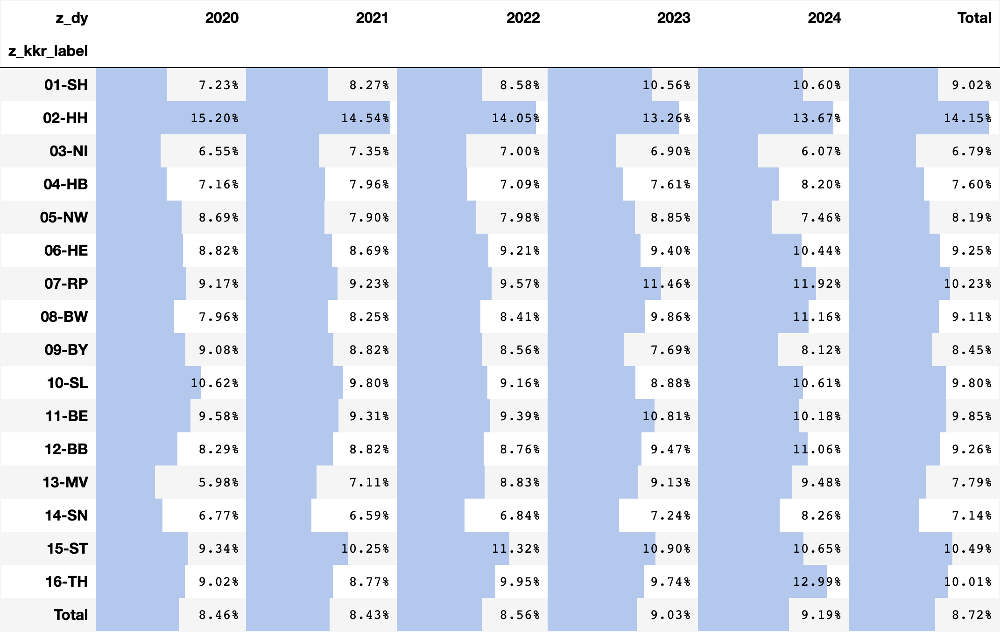
</picture>
    


<br>

### <a id='toc1_8_7_'></a>[Diagnosejahr mit Altdaten](#toc0_)
- Filter: Top 5 Diagnosejahre
- Legende ist **absteigend sortiert nach Fallzahl im DJ**, Restkategorie `<other>` ist aufgeführt


<picture>
  <source media="(prefers-color-scheme: dark)" srcset="clin_files_dark/output_58_1.svg">
  <source media="(prefers-color-scheme: light)" srcset="clin_files/output_58_1.svg">
  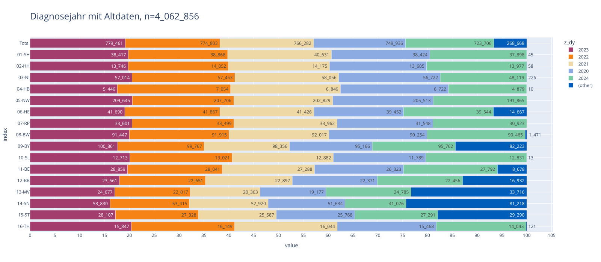
</picture>
    


<br>

### <a id='toc1_8_9_'></a>[Inzidenzort vs Lieferregister](#toc0_)
- **Filter: keiner**
- vertikal: `Inzidenzort` (Zeile `00` bündelt alle Fälle mit ungültiger Ortsangabe). horizontal: `Lieferregister`
- Beispiel: `03-NI` liefert zu 100% Fälle aus dem Inzidenzort `03`, `13-MV` liefert 159 Fälle aus `03`

> [!NOTE]
> 💡 **ZfKD**: _Angestrebt ist eine "Diagonale", möglichst nur noch Fallübermittlungen aus dem eigenen Einzugsgebiet, was inzwischen schon besser erreicht ist. ~ 99% der Fälle stammen aus dem liefernden Register_


    
<picture>
  <source media="(prefers-color-scheme: dark)" srcset="clin_files_dark/output_60_0.png">
  <source media="(prefers-color-scheme: light)" srcset="clin_files/output_60_0.png">
  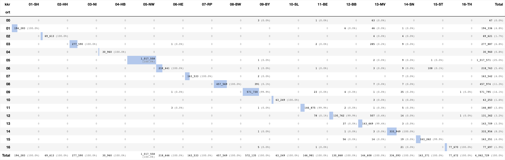
</picture>
    


<br>

### <a id='toc1_8_10_'></a>[ICD10 Gruppen](#toc0_)
- die verwendete ICD10 Skala entspricht der Darstellung aus *"Krebs in Deutschland"*


```
    n = 4_062_856                   (100.0%) ██████████████████████████████
    └ [DJ 2020-2024]: n = 3_794_188  (93.4%) ░░████████████████████████████
    └ [keine DCO]:    n = 3_672_629  (90.4%) ░░░███████████████████████████
```

<details>
<summary>filter-sql</summary>

```sql
z_dy between 2020 and 2024
and not z_is_dco
```

</details>


    
    


    
<picture>
  <source media="(prefers-color-scheme: dark)" srcset="clin_files_dark/output_62_5.svg">
  <source media="(prefers-color-scheme: light)" srcset="clin_files/output_62_5.svg">
  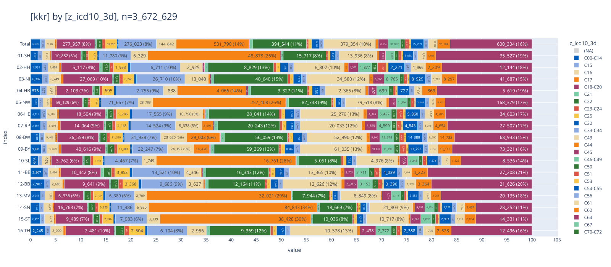
</picture>
    


<br>

### <a id='toc1_8_11_'></a>[Altersgruppen Kinder und Heranwachsende](#toc0_)

> [!NOTE]
> 💡 **ZfKD**: Fälle von unter 18-jährigen Personen sind nicht flächendeckend vorhanden


```
    count: distinct z_pat_id
    ---
    n = 3_452_844                   (100.0%) ██████████████████████████████
    └ [DJ 2020-2024]: n = 3_444_458  (99.8%) ░█████████████████████████████
    └ [Alter <= 20]:     n = 10_614   (0.3%) ░░░░░░░░░░░░░░░░░░░░░░░░░░░░░░
```

<details>
<summary>filter-sql</summary>

```sql
z_dy between 2020 and 2024
and z_age <= 20
```

</details>


    
    


<picture>
  <source media="(prefers-color-scheme: dark)" srcset="clin_files_dark/output_64_6.svg">
  <source media="(prefers-color-scheme: light)" srcset="clin_files/output_64_6.svg">
  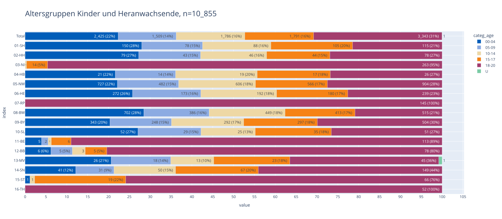
</picture>
    


<br>

### <a id='toc1_8_12_'></a>[Verstorben](#toc0_)

- gezählt sind **Personen**
- Metrik: Anteil Verstorbener an Gesamtzahl Patienten pro erstes DJ der Person


```
    count: distinct z_pat_id
    ---
    n = 3_452_844                    (100.0%) ██████████████████████████████
    └ [DJ 2020-2024]:  n = 3_444_458  (99.8%) ░█████████████████████████████
    └ [keine DCO]:     n = 3_332_300  (96.5%) ░░████████████████████████████
    └ [keine C44,D04]: n = 2_848_584  (82.5%) ░░░░░░████████████████████████
```

<details>
<summary>filter-sql</summary>

```sql
z_dy between 2020 and 2024
and not z_is_dco
and z_icd10_3d not in ('C44','D04')
```

</details>


    
    


<picture>
  <source media="(prefers-color-scheme: dark)" srcset="clin_files_dark/output_68_7.png">
  <source media="(prefers-color-scheme: light)" srcset="clin_files/output_68_7.png">
  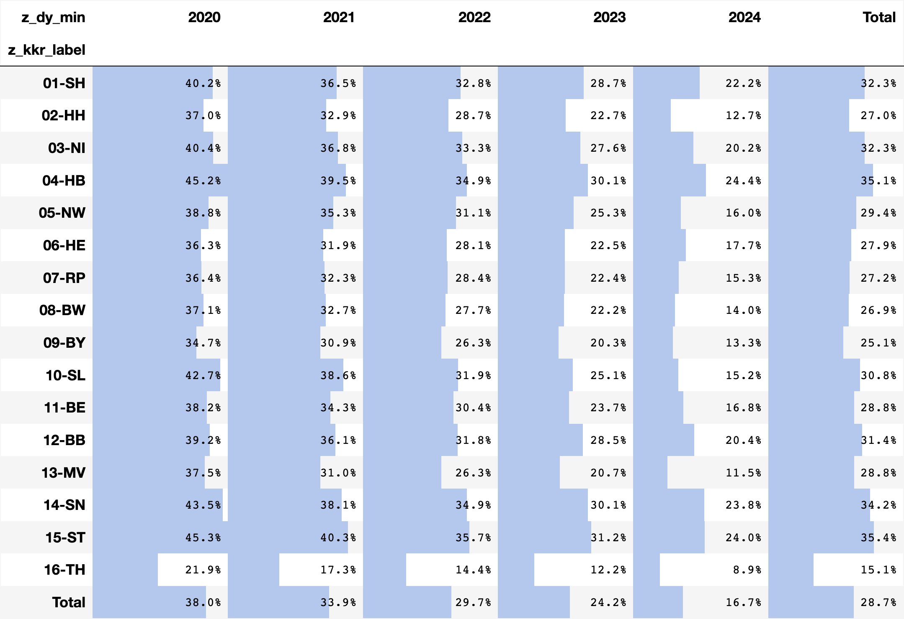
</picture>
    


<br>

### <a id='toc1_8_13_'></a>[TNM-T (p)](#toc0_)


```
    n = 4_062_856                               (100.0%) ██████████████████████████████
    └ [DJ 2020-2024]:             n = 3_794_188  (93.4%) ░░████████████████████████████
    └ [keine DCO]:                n = 3_672_629  (90.4%) ░░░███████████████████████████
    └ [nur tnm-relevante Tumore]: n = 2_082_538  (51.3%) ░░░░░░░░░░░░░░░███████████████
```

<details>
<summary>filter-sql</summary>

```sql
z_dy between 2020 and 2024
and not z_is_dco
and 
    (
        left(z_icd10_3d, 1) ='C' and
        (
            right(z_icd10_3d, 2)::int8 between 00 and 43
            or right(z_icd10_3d, 2)::int8 between 45 and 69
            or right(z_icd10_3d, 2)::int8 between 73 and 74
        )
        and left(Morphologie_Code,4)::int between 8010 and 8790
        and z_icd10_3d not in ('C26', 'C39', 'C55')
        and z_icd10 not in ('C14.0', 'C57.9', 'C63.9')
    )
```

</details>


    
    


    
<picture>
  <source media="(prefers-color-scheme: dark)" srcset="clin_files_dark/output_70_6.svg">
  <source media="(prefers-color-scheme: light)" srcset="clin_files/output_70_6.svg">
  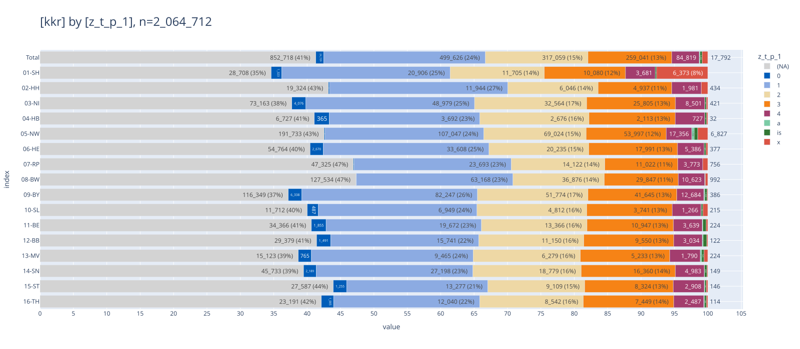
</picture>
    


<br>

### <a id='toc1_8_14_'></a>[TNM-N (p)](#toc0_)
<!-- (_solide Tumoren_ schliesst folgende Diagnosen _aus_: C44, C70-C72, C76-C97, alle D) -->


```
    n = 4_062_856                               (100.0%) ██████████████████████████████
    └ [DJ 2020-2024]:             n = 3_794_188  (93.4%) ░░████████████████████████████
    └ [keine DCO]:                n = 3_672_629  (90.4%) ░░░███████████████████████████
    └ [nur tnm-relevante Tumore]: n = 2_082_538  (51.3%) ░░░░░░░░░░░░░░░███████████████
```

<details>
<summary>filter-sql</summary>

```sql
z_dy between 2020 and 2024
and not z_is_dco
and 
    (
        left(z_icd10_3d, 1) ='C' and
        (
            right(z_icd10_3d, 2)::int8 between 00 and 43
            or right(z_icd10_3d, 2)::int8 between 45 and 69
            or right(z_icd10_3d, 2)::int8 between 73 and 74
        )
        and left(Morphologie_Code,4)::int between 8010 and 8790
        and z_icd10_3d not in ('C26', 'C39', 'C55')
        and z_icd10 not in ('C14.0', 'C57.9', 'C63.9')
    )
```

</details>


    
    


    
<picture>
  <source media="(prefers-color-scheme: dark)" srcset="clin_files_dark/output_72_5.svg">
  <source media="(prefers-color-scheme: light)" srcset="clin_files/output_72_5.svg">
  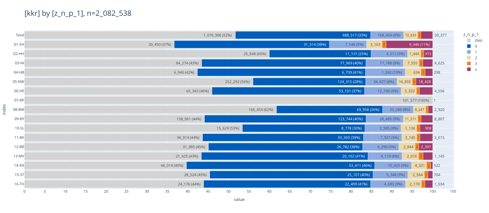
</picture>
    


<br>

### <a id='toc1_8_15_'></a>[TNM-M (pc)](#toc0_)

- abweichend von den anderen TNM Angaben ist hier die Verbundvariable `z_m_pc_1` dargestellt
- diese enthält den Wert aus `p`, wenn leer dann aus `c`


```
    n = 4_062_856                               (100.0%) ██████████████████████████████
    └ [DJ 2020-2024]:             n = 3_794_188  (93.4%) ░░████████████████████████████
    └ [keine DCO]:                n = 3_672_629  (90.4%) ░░░███████████████████████████
    └ [nur tnm-relevante Tumore]: n = 2_082_538  (51.3%) ░░░░░░░░░░░░░░░███████████████
```

<details>
<summary>filter-sql</summary>

```sql
z_dy between 2020 and 2024
and not z_is_dco
and 
    (
        left(z_icd10_3d, 1) ='C' and
        (
            right(z_icd10_3d, 2)::int8 between 00 and 43
            or right(z_icd10_3d, 2)::int8 between 45 and 69
            or right(z_icd10_3d, 2)::int8 between 73 and 74
        )
        and left(Morphologie_Code,4)::int between 8010 and 8790
        and z_icd10_3d not in ('C26', 'C39', 'C55')
        and z_icd10 not in ('C14.0', 'C57.9', 'C63.9')
    )
```

</details>


    
    


    
<picture>
  <source media="(prefers-color-scheme: dark)" srcset="clin_files_dark/output_75_5.svg">
  <source media="(prefers-color-scheme: light)" srcset="clin_files/output_75_5.svg">
  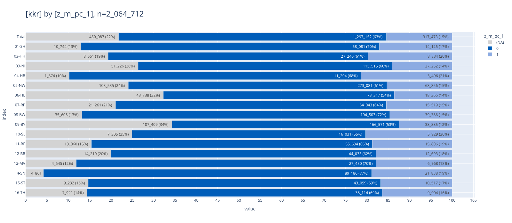
</picture>
    


<br>

## <a id='toc1_9_'></a>[Todesursachen (TU)](#toc0_)

### <a id='toc1_9_1_'></a>[nach ICD10 Einstellern](#toc0_)
- gezählt sind die ersten Stellen aller TU Codes ohne jeglichen Filter


<picture>
  <source media="(prefers-color-scheme: dark)" srcset="clin_files_dark/output_78_1.svg">
  <source media="(prefers-color-scheme: light)" srcset="clin_files/output_78_1.svg">
  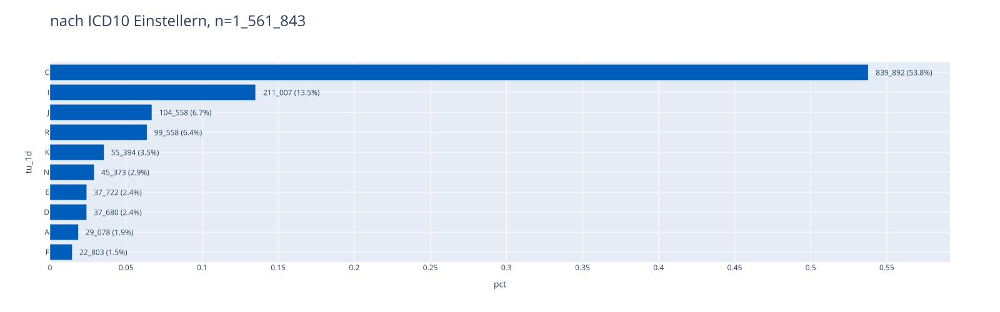
</picture>
    


<br>

### <a id='toc1_9_2_'></a>[nach Sterbejahr und Todesursachen](#toc0_)
- gezählt werden **Personen**
- `tu_type` Art der TU pro Patient
  - `<NA>` keine Todesursache zugeordnet
  - `c_only` nur Todesursachen Cxx
  - `other_only` nur Todesursachen <> Cxx
  - `c_and_other` Cxx und andere Todesursachen

<!-- > 💡 ZfKD: _"`03-NI` und `06-HE` übermitteln deutlich weniger Todesursachen asl in den epi Daten, für `07-RP` ist der Anteil in beiden Datenräumen gering. Für `15-ST` sind auffällig wenige Todesfälle in 2023 übermittelt."_ -->


```
    count: distinct z_pat_id
    ---
    n = 3_452_844                      (100.0%) ██████████████████████████████
    └ [SJ 2020-2024]:    n = 2_636_984  (76.4%) ░░░░░░░░██████████████████████
    └ [nur Verstorbene]:   n = 900_310  (26.1%) ░░░░░░░░░░░░░░░░░░░░░░░███████
```

<details>
<summary>filter-sql</summary>

```sql
year(Datum_Vitalstatus::date) between 2020 and 2024
and Verstorben='J'
```

</details>


    
    


<picture>
  <source media="(prefers-color-scheme: dark)" srcset="clin_files_dark/output_80_7.svg">
  <source media="(prefers-color-scheme: light)" srcset="clin_files/output_80_7.svg">
  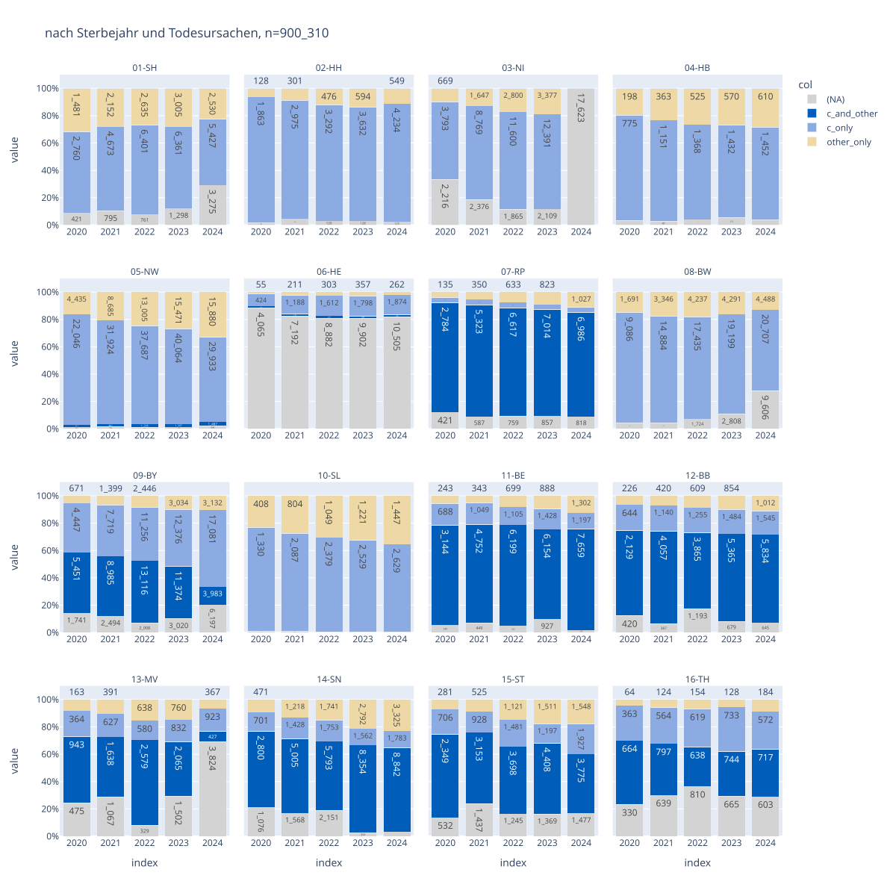
</picture>
    


<br>

### <a id='toc1_9_3_'></a>[nach ICD10 Dreistellern (TOP 5)](#toc0_)
- Grundgesamtheit: alle **Todesursachen**, kein Filter

> 💡 **ZfKD**: _Enthalten sind in einigen KKR auch `C79` (Metastasen), welche in offizieller Todesursachen-Statistik nicht kodiert sind_


<picture>
  <source media="(prefers-color-scheme: dark)" srcset="clin_files_dark/output_83_1.png">
  <source media="(prefers-color-scheme: light)" srcset="clin_files/output_83_1.png">
  
</picture>
    


<br>

### <a id='toc1_9_4_'></a>[nach IsGrundleiden](#toc0_)
- Grundgesamtheit: **alle Todesursachen**


<picture>
  <source media="(prefers-color-scheme: dark)" srcset="clin_files_dark/output_85_1.svg">
  <source media="(prefers-color-scheme: light)" srcset="clin_files/output_85_1.svg">
  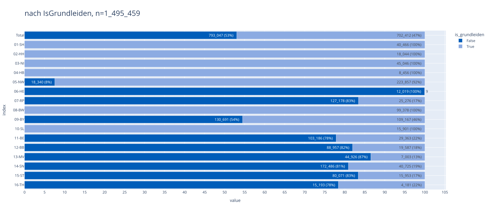
</picture>
    


<br>

## <a id='toc1_10_'></a>[Therapien](#toc0_)

<br>

### <a id='toc1_10_1_'></a>[OP](#toc0_)


#### <a id='toc1_10_1_1_'></a>[nach ICD10](#toc0_)
- Grundgesamtheit: alle **OP Meldungen**


```
    count: distinct OPId
    ---
    n = 2_121_378                    (100.0%) ██████████████████████████████
    └ [DJ 2020-2024]:  n = 2_085_372  (98.3%) ░█████████████████████████████
    └ [keine DCO]:     n = 2_085_319  (98.3%) ░█████████████████████████████
    └ [keine C44,D04]: n = 1_919_103  (90.5%) ░░░███████████████████████████
    └ [nur erste OP]:  n = 1_532_530  (72.2%) ░░░░░░░░░█████████████████████
```

<details>
<summary>filter-sql</summary>

```sql
z_dy between 2020 and 2024
and not z_is_dco
and z_icd10_3d not in ('C44','D04')
and z_op_order = 1
```

</details>


    
    


<picture>
  <source media="(prefers-color-scheme: dark)" srcset="clin_files_dark/output_89_7.svg">
  <source media="(prefers-color-scheme: light)" srcset="clin_files/output_89_7.svg">
  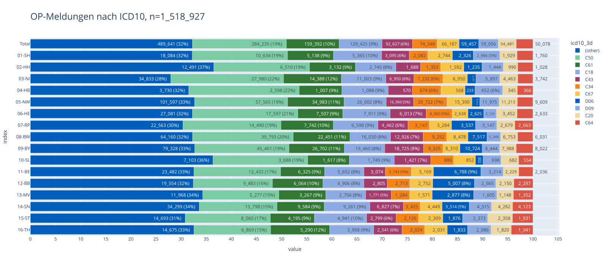
</picture>
    


<br>

#### <a id='toc1_10_1_2_'></a>[nach Intention](#toc0_)
- Grundgesamtheit: alle **OP Meldungen**


<picture>
  <source media="(prefers-color-scheme: dark)" srcset="clin_files_dark/output_91_1.svg">
  <source media="(prefers-color-scheme: light)" srcset="clin_files/output_91_1.svg">
  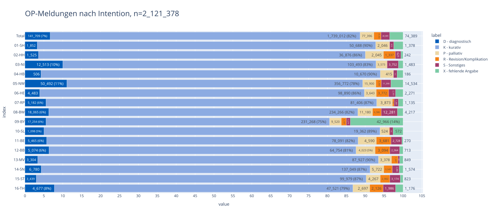
</picture>
    


<br>

### <a id='toc1_10_2_'></a>[OPS](#toc0_)


#### <a id='toc1_10_2_1_'></a>[nach OPS ICD Kapitel (Top 10)](#toc0_)
- Grundgesamtheit: **alle OPS Codes**

> 💡 **ZfKD**: lediglich `02-HH` und `05-NW` übermitteln ausschliesslich Kapitel 5. Der Anteil von Meldungen <> Kapitel 5 sind wahrscheinlich diagnostische Massnahmen oder nicht-operative Therapien. Vorschlag: nur noch Kapitel 5 übermitteln


<picture>
  <source media="(prefers-color-scheme: dark)" srcset="clin_files_dark/output_94_1.svg">
  <source media="(prefers-color-scheme: light)" srcset="clin_files/output_94_1.svg">
  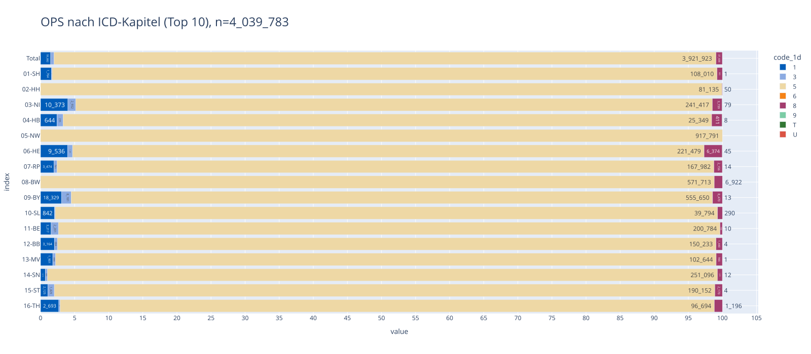
</picture>
    


<br>

### <a id='toc1_10_3_'></a>[SYST](#toc0_)

#### <a id='toc1_10_3_1_'></a>[nach Stellung_OP](#toc0_)

- Grundgesamtheit: **alle SYST Elemente**


<picture>
  <source media="(prefers-color-scheme: dark)" srcset="clin_files_dark/output_97_1.svg">
  <source media="(prefers-color-scheme: light)" srcset="clin_files/output_97_1.svg">
  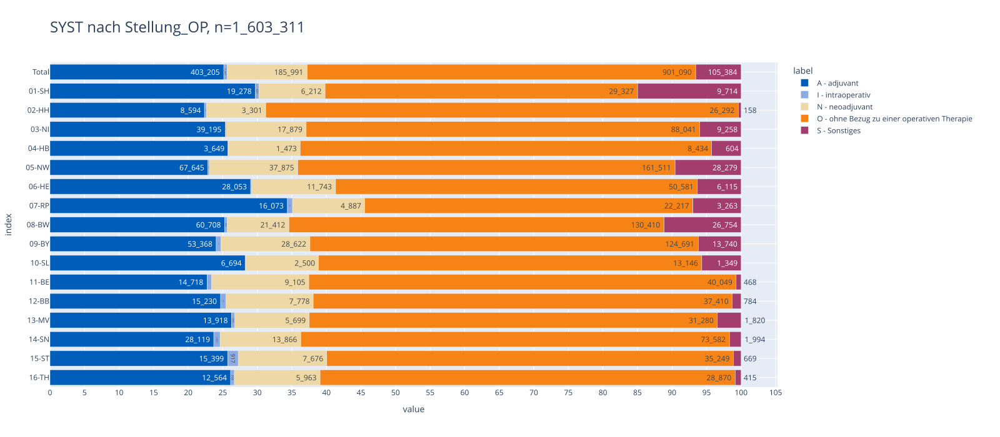
</picture>
    


<div style="page-break-after: always;"></div>


<br>

## <a id='toc1_11_'></a>[Missings- und Unbekannt-Kodierungen](#toc0_)
- in diesem Kapitel sind Ampelfarben zugeordnet, da Zielwerte klar identifizierbar sind
- die Zuordnung zu Wertebereichen ist Diskussionsgrundlage
- es sind folgende Schwellwerte verwendet:
  - 🟩 0 bis <5%
  - 🟨 **missings**: 5% bis <100% | **unbekannt**: 5% bis <35%>
  - 🟥 **missings**: bei 100% | **unbekannt** >= 35%
- dargestellt sind Variablen aus dem Schema in folgender Notation: `[Elementknoten]Variablenname`
- die graumelierte `0` kennzeichnet einen leeren Wert (=keine missings), 0% entsteht durch Rundung von kleinen Werten
- die Prozentwerte sind bei allen Darstellungen gerundet, "100%" bei einer gelben Ampel kann interpretiert werden als knapp unter 100%
- - `Total` 
  - ist als Spalte neu eingefügt, und bildet den Anteil von missings bzw unbekannt deutschlandweit ab
  - ⚠️ verliert an Aussagekraft, wenn aus KKR keine Daten vorliegen für diese Variable (100% missings), der Wert wirkt dann geschönt

**unbekannt**
- bei 100% missings wird auch unbekannt auf 100% gesetzt
- Beispiele für gewertete Unbekannt-Kodierungen:
  - `Diagnosesicherung` = 9
  - `Seitenlokalisation` = U
  - `Datumsgenauigkeit` in ('M','V')
- der Quellcode zur Bestimmung von `Unbekannt` Kodierungen ist hier abrufbar: [sql](sql/check_if_unknown.sql)

<br>

### <a id='toc1_11_1_'></a>[Verpflichtende Tumorvariablen](#toc0_)
- kein Filter
- Pflichtangaben aus anderen Elementknoten (z.B. Datum aus dem OP Knoten) sind nicht aufgeführt, da diese selbst optional sind

> [!NOTE]
> 💡 **ZfKD** 
> - Pflichtfelder sind nahezu komplett vorhanden, die wenigen Ausnahmen werden allerdings Stand heute nicht korrigiert
> - `Gesamtbeurteilung_Tumorstatus`ist zwar vollständig geliefert (siehe vorherige Grafiken), aber häufig als Unbekannt kodiert. Viele Pflichtvariablen haben keine Unbekannt Kodes, etwas auffällig sind hier `Diagnosesicherung` und `Seitenlokalisation`. Ähnlich auch `Morphologie` (kein Pflichtfeld)


```
    n = 4_062_856                   (100.0%) ██████████████████████████████
    └ [DJ 2020-2024]: n = 3_794_188  (93.4%) ░░████████████████████████████
```

<details>
<summary>filter-sql</summary>

```sql
z_dy between 2020 and 2024
```

</details>


    
    


    🟠 missings


    
<picture>
  <source media="(prefers-color-scheme: dark)" srcset="clin_files_dark/output_102_6.png">
  <source media="(prefers-color-scheme: light)" srcset="clin_files/output_102_6.png">
  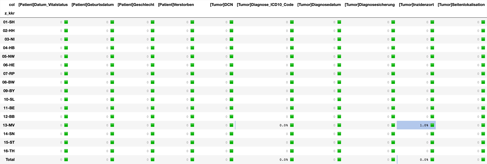
</picture>
    


    🟠 unknowns


    
<picture>
  <source media="(prefers-color-scheme: dark)" srcset="clin_files_dark/output_102_8.png">
  <source media="(prefers-color-scheme: light)" srcset="clin_files/output_102_8.png">
  
</picture>
    


<br>

### <a id='toc1_11_2_'></a>[Weitere Tumorangaben](#toc0_)


```
    n = 4_062_856                    (100.0%) ██████████████████████████████
    └ [DJ 2020-2024]:  n = 3_794_188  (93.4%) ░░████████████████████████████
    └ [keine DCO]:     n = 3_672_629  (90.4%) ░░░███████████████████████████
    └ [keine C44,D04]: n = 3_065_024  (75.4%) ░░░░░░░░██████████████████████
```

<details>
<summary>filter-sql</summary>

```sql
z_dy between 2020 and 2024
and not z_is_dco
and z_icd10_3d not in ('C44','D04')
```

</details>


    
    
    🟠 missings


<picture>
  <source media="(prefers-color-scheme: dark)" srcset="clin_files_dark/output_104_6.png">
  <source media="(prefers-color-scheme: light)" srcset="clin_files/output_104_6.png">
  
</picture>
    


    🟠 unknowns


<picture>
  <source media="(prefers-color-scheme: dark)" srcset="clin_files_dark/output_104_9.png">
  <source media="(prefers-color-scheme: light)" srcset="clin_files/output_104_9.png">
  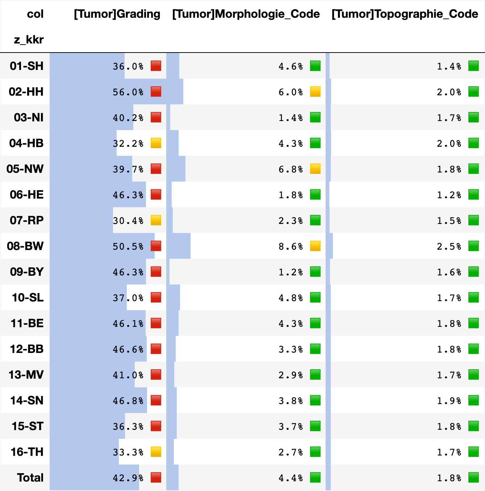
</picture>
    


<br>

### <a id='toc1_11_3_'></a>[Tumorstadien](#toc0_)

> 💡 ZfKD: _"`05-NW` hat die Auflage als Konstante im Datensatz hinterlegt"_


```
    n = 4_062_856                               (100.0%) ██████████████████████████████
    └ [DJ 2020-2024]:             n = 3_794_188  (93.4%) ░░████████████████████████████
    └ [keine DCO]:                n = 3_672_629  (90.4%) ░░░███████████████████████████
    └ [nur tnm-relevante Tumore]: n = 2_082_538  (51.3%) ░░░░░░░░░░░░░░░███████████████
```

<details>
<summary>filter-sql</summary>

```sql
z_dy between 2020 and 2024
and not z_is_dco
and 
    (
        left(z_icd10_3d, 1) ='C' and
        (
            right(z_icd10_3d, 2)::int8 between 00 and 43
            or right(z_icd10_3d, 2)::int8 between 45 and 69
            or right(z_icd10_3d, 2)::int8 between 73 and 74
        )
        and left(Morphologie_Code,4)::int between 8010 and 8790
        and z_icd10_3d not in ('C26', 'C39', 'C55')
        and z_icd10 not in ('C14.0', 'C57.9', 'C63.9')
    )
```

</details>


    
    


    🟠 missings


    
<picture>
  <source media="(prefers-color-scheme: dark)" srcset="clin_files_dark/output_106_6.png">
  <source media="(prefers-color-scheme: light)" srcset="clin_files/output_106_6.png">
  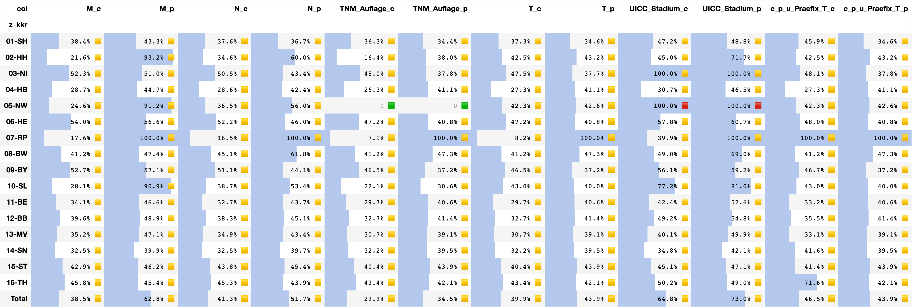
</picture>
    


    🟠 unknowns


    
<picture>
  <source media="(prefers-color-scheme: dark)" srcset="clin_files_dark/output_106_8.png">
  <source media="(prefers-color-scheme: light)" srcset="clin_files/output_106_8.png">
  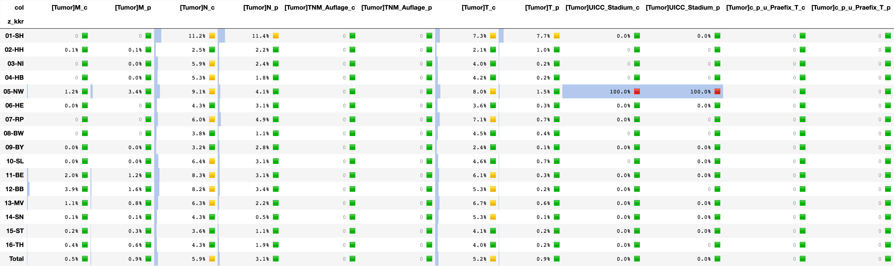
</picture>
    


<br>

### <a id='toc1_11_4_'></a>[Therapieangaben](#toc0_)


#### <a id='toc1_11_4_1_'></a>[OP](#toc0_)

> 💡 **ZfKD**: für überlieferte OP liegen `Datum_OP` und `Intention` komplett vollständig vor. Der Tagesabstand hat wenige Lücken, während `Lokale_Beurteilung_Residualstatus` auch ausserhalb der Tristan KKR erkennbar häufiger fehlt


```
    n = 4_062_856                    (100.0%) ██████████████████████████████
    └ [DJ 2020-2024]:  n = 3_794_188  (93.4%) ░░████████████████████████████
    └ [keine DCO]:     n = 3_672_629  (90.4%) ░░░███████████████████████████
    └ [keine C44,D04]: n = 3_065_024  (75.4%) ░░░░░░░░██████████████████████
```

<details>
<summary>filter-sql</summary>

```sql
z_dy between 2020 and 2024
and not z_is_dco
and z_icd10_3d not in ('C44','D04')
```

</details>


    
    
    🟠 missings


<picture>
  <source media="(prefers-color-scheme: dark)" srcset="clin_files_dark/output_109_6.png">
  <source media="(prefers-color-scheme: light)" srcset="clin_files/output_109_6.png">
  
</picture>
    


    🟠 unknowns


<picture>
  <source media="(prefers-color-scheme: dark)" srcset="clin_files_dark/output_109_9.png">
  <source media="(prefers-color-scheme: light)" srcset="clin_files/output_109_9.png">
  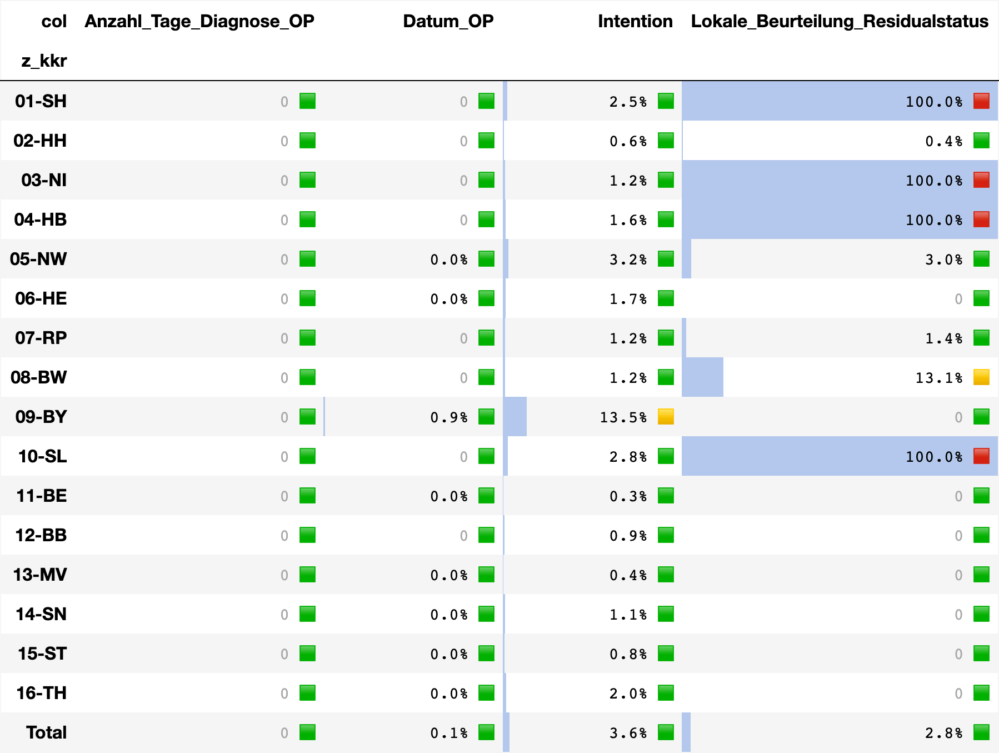
</picture>
    


<br>

#### <a id='toc1_11_4_2_'></a>[ST](#toc0_)

> [!NOTE]
> 💡 **ZfKD**
> - `Datum_Beginn_Bestrahlung` und `Intention` sind nahezu komplett verfügbar in den dokumentierten ST / Bestrahlungen, mit Abstrichen auch `Anzahl_Tage_Diagnose_Bestrahlung`._  
> - `Anzahl_Tage_Bestrahlung_Dauer` und `Stellung_OP` fehlen bei Tristan
> - `Applikationsart` wird nicht von allen kkr übermittelt, davon abgesehen ist `Seite_Zielgebiet` zuverlässig angegeben, die CodeVersionen ergänzen sich, wobei `2014` deutlich häufiger angewendet wird als `2021`


```
    n = 4_062_856                    (100.0%) ██████████████████████████████
    └ [DJ 2020-2024]:  n = 3_794_188  (93.4%) ░░████████████████████████████
    └ [keine DCO]:     n = 3_672_629  (90.4%) ░░░███████████████████████████
    └ [keine C44,D04]: n = 3_065_024  (75.4%) ░░░░░░░░██████████████████████
```

<details>
<summary>filter-sql</summary>

```sql
z_dy between 2020 and 2024
and not z_is_dco
and z_icd10_3d not in ('C44','D04')
```

</details>


    
    


    🟠 missings


    
<picture>
  <source media="(prefers-color-scheme: dark)" srcset="clin_files_dark/output_111_6.png">
  <source media="(prefers-color-scheme: light)" srcset="clin_files/output_111_6.png">
  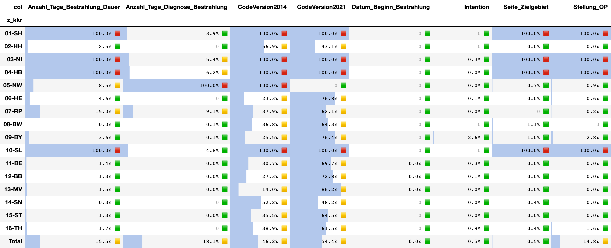
</picture>
    


    🟠 unknowns


    
<picture>
  <source media="(prefers-color-scheme: dark)" srcset="clin_files_dark/output_111_8.png">
  <source media="(prefers-color-scheme: light)" srcset="clin_files/output_111_8.png">
  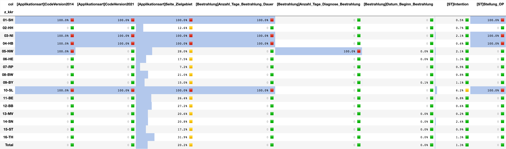
</picture>
    


<br>

#### <a id='toc1_11_4_3_'></a>[SYST](#toc0_)

> [!NOTE]
> 💡 **ZfKD**: die meisten Angaben im SYST Element liegen komplett vor. `Anzahl_Tage_SYST_Dauer` fehlt häufig, was auch an noch nicht abgeschlossenen Therapien liegen könnte


```
    n = 4_062_856                    (100.0%) ██████████████████████████████
    └ [DJ 2020-2024]:  n = 3_794_188  (93.4%) ░░████████████████████████████
    └ [keine DCO]:     n = 3_672_629  (90.4%) ░░░███████████████████████████
    └ [keine C44,D04]: n = 3_065_024  (75.4%) ░░░░░░░░██████████████████████
```

<details>
<summary>filter-sql</summary>

```sql
z_dy between 2020 and 2024
and not z_is_dco
and z_icd10_3d not in ('C44','D04')
```

</details>


    
    


    🟠 missings


    
<picture>
  <source media="(prefers-color-scheme: dark)" srcset="clin_files_dark/output_113_6.png">
  <source media="(prefers-color-scheme: light)" srcset="clin_files/output_113_6.png">
  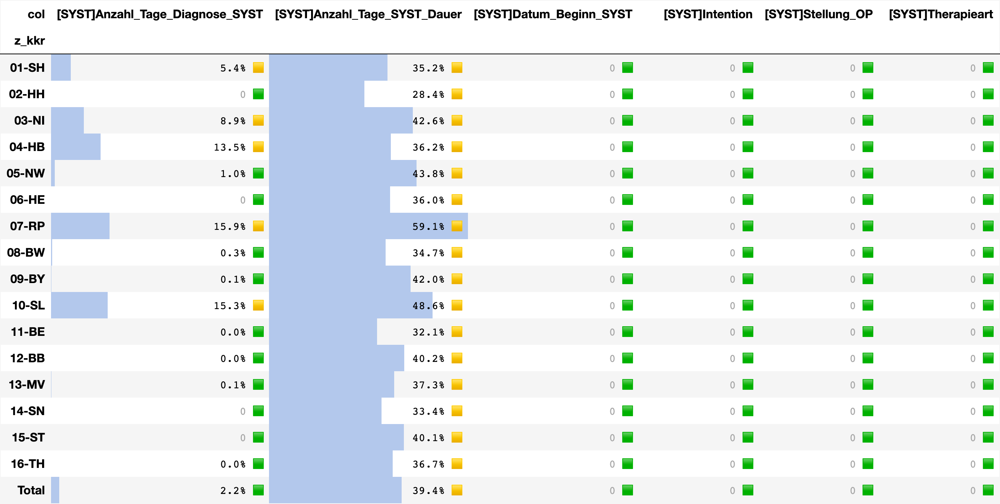
</picture>
    


    🟠 unknowns


    
<picture>
  <source media="(prefers-color-scheme: dark)" srcset="clin_files_dark/output_113_8.png">
  <source media="(prefers-color-scheme: light)" srcset="clin_files/output_113_8.png">
  
</picture>
    


<br>

### <a id='toc1_11_5_'></a>[Folgeereignisse](#toc0_)
- die Variablen aus `Folgeereignis` und `Folgeereignis_TNM` sind hier zusammengefasst

> [!NOTE]
> 💡 **ZfKD**
> - `Datum_Folgeereignis` und `Gesamtbeurteilung_Tumorstatus` liegen komplett vor, die anderen Angaben zum Tumorstatus allerdings nicht
> - die Erkennung von Rezidiven ist so deutlich erschwert
> - Angaben für `Folgeereignis_TNM` fehlen ganz überwiegend, auch wenn Folgereignisse keine TNM enthalten müssen
> - Folgeereignisse aus `07-RP` und `08-BW` enthalten keine Missings, dafür allerdings erhöhte Anteile an Unbekannt Kodierungen
> - T-Stadien zu Folgeereignissen weisen in `02-HH` einen ungewöhnlich niedrigen Missing Anteil auf, bei gleichzeitig fast Unbekannt-freien Kodierungen. Die Fallzahlen dieser Folgeereignisse sind in etwa im erwarteten Rahmen


```
    n = 4_062_856                    (100.0%) ██████████████████████████████
    └ [DJ 2020-2024]:  n = 3_794_188  (93.4%) ░░████████████████████████████
    └ [keine DCO]:     n = 3_672_629  (90.4%) ░░░███████████████████████████
    └ [keine C44,D04]: n = 3_065_024  (75.4%) ░░░░░░░░██████████████████████
```

<details>
<summary>filter-sql</summary>

```sql
z_dy between 2020 and 2024
and not z_is_dco
and z_icd10_3d not in ('C44','D04')
```

</details>


    
    


    🟠 missings


    
<picture>
  <source media="(prefers-color-scheme: dark)" srcset="clin_files_dark/output_115_6.png">
  <source media="(prefers-color-scheme: light)" srcset="clin_files/output_115_6.png">
  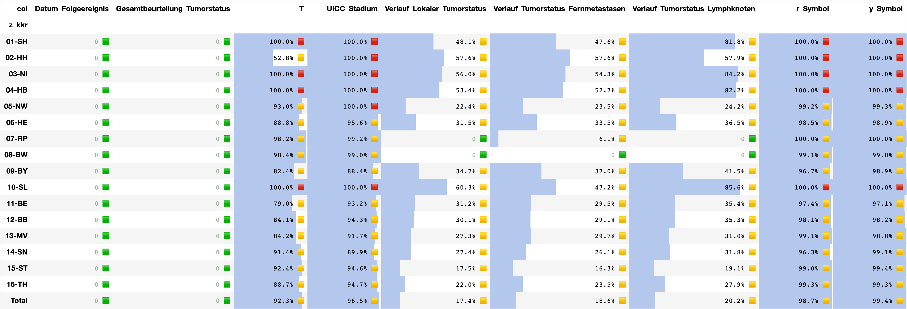
</picture>
    


    🟠 unknowns


    
<picture>
  <source media="(prefers-color-scheme: dark)" srcset="clin_files_dark/output_115_8.png">
  <source media="(prefers-color-scheme: light)" srcset="clin_files/output_115_8.png">
  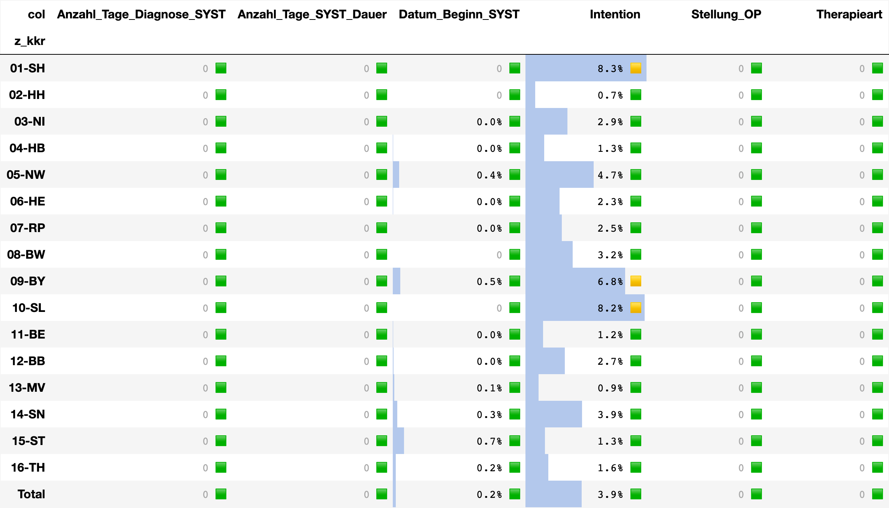
</picture>
    


<br>

### <a id='toc1_11_6_'></a>[Freitexte](#toc0_)

> 💡 **ZfKD**: 
> - Protokolle und Substanzen werden nach und nach in den Datensatz eingebunden. Protokolle bislang ausschliesslich als Freitext
> - bei Substanzen komplementieren sich Freitexte und Kodierungen, bei vielen GTDS Ländern überwiegen inzwischen die Kodierungen


```
    n = 4_062_856                    (100.0%) ██████████████████████████████
    └ [DJ 2020-2024]:  n = 3_794_188  (93.4%) ░░████████████████████████████
    └ [keine DCO]:     n = 3_672_629  (90.4%) ░░░███████████████████████████
    └ [keine C44,D04]: n = 3_065_024  (75.4%) ░░░░░░░░██████████████████████
```

<details>
<summary>filter-sql</summary>

```sql
z_dy between 2020 and 2024
and not z_is_dco
and z_icd10_3d not in ('C44','D04')
```

</details>


    
    
    🟠 missings


    
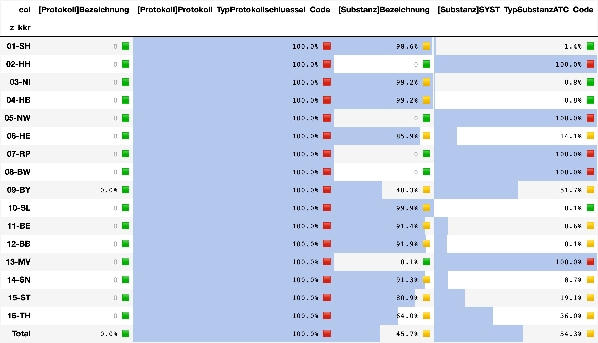
    


    🟠 unknowns


    
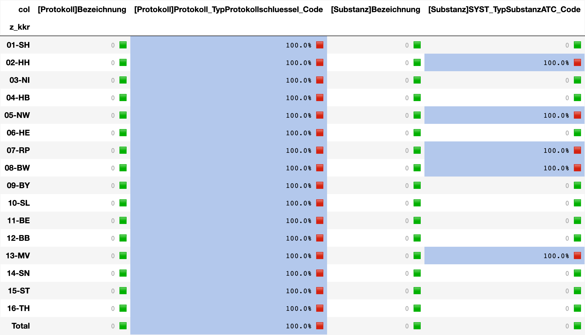
    


<br>

### <a id='toc1_11_7_'></a>[Organspezifische Variablen](#toc0_)

> [!NOTE]
> 💡 **HH**: "Fehlende Modul-Angaben (C50, C61) 2021. Sind bei uns noch nicht im xml enthalten."

<br>

#### <a id='toc1_11_7_1_'></a>[Mamma](#toc0_)

> [!NOTE]
> 💡 **ZfKD**
> - missing Anteile sind besonders niedrig aus `04-HB` und den GTDS Ländern bei gleichzeitig unauffälligem Unbekannt Anteil
> - `HormonrezeptorStatus_Progesteron` ist in der Fläche erkennbar schlechter erfasst als z.B. `Her2neuStatus`


```
    n = 4_062_856                   (100.0%) ██████████████████████████████
    └ [DJ 2020-2024]: n = 3_794_188  (93.4%) ░░████████████████████████████
    └ [keine DCO]:    n = 3_672_629  (90.4%) ░░░███████████████████████████
    └ [ICD10 C50]:      n = 394_544   (9.7%) ░░░░░░░░░░░░░░░░░░░░░░░░░░░░██
```

<details>
<summary>filter-sql</summary>

```sql
z_dy between 2020 and 2024
and not z_is_dco
and z_icd10_3d = 'C50'
```

</details>


    
    
    🟠 missings


    
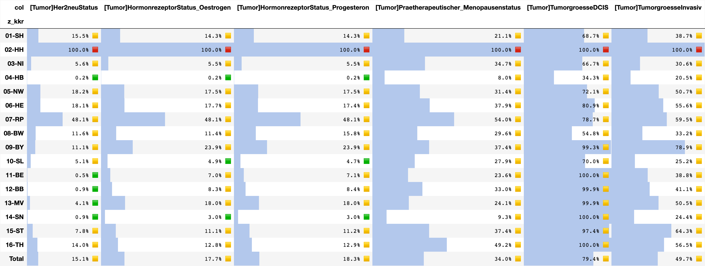
    


    🟠 unknowns


    
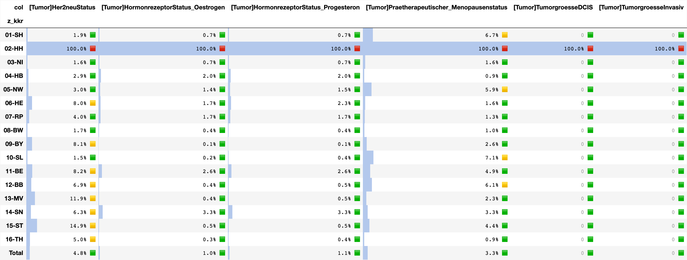
    


<br>

#### <a id='toc1_11_7_2_'></a>[Prostata](#toc0_)

> 💡 **ZfKD**: auch innerhalb eines KKR gibt es deutliche Varianzen zwischen Variablen des organspezifischen Moduls, z.B. in den NBL


```
    n = 4_062_856                   (100.0%) ██████████████████████████████
    └ [DJ 2020-2024]: n = 3_794_188  (93.4%) ░░████████████████████████████
    └ [keine DCO]:    n = 3_672_629  (90.4%) ░░░███████████████████████████
    └ [ICD C61]:        n = 379_354   (9.3%) ░░░░░░░░░░░░░░░░░░░░░░░░░░░░██
```

<details>
<summary>filter-sql</summary>

```sql
z_dy between 2020 and 2024
and not z_is_dco
and z_icd10_3d = 'C61'
```

</details>


    
    
    🟠 missings


    


    🟠 unknowns


    


<br>

#### <a id='toc1_11_7_3_'></a>[Darm](#toc0_)


```
    n = 4_062_856                   (100.0%) ██████████████████████████████
    └ [DJ 2020-2024]: n = 3_794_188  (93.4%) ░░████████████████████████████
    └ [keine DCO]:    n = 3_672_629  (90.4%) ░░░███████████████████████████
    └ [ICD C18-20]:     n = 277_957   (6.8%) ░░░░░░░░░░░░░░░░░░░░░░░░░░░░██
```

<details>
<summary>filter-sql</summary>

```sql
z_dy between 2020 and 2024
and not z_is_dco
and z_icd10_3d in ('C18','C19','C20')
```

</details>


    
    
    🟠 missings


<picture>
  <source media="(prefers-color-scheme: dark)" srcset="clin_files_dark/output_124_6.png">
  <source media="(prefers-color-scheme: light)" srcset="clin_files/output_124_6.png">
  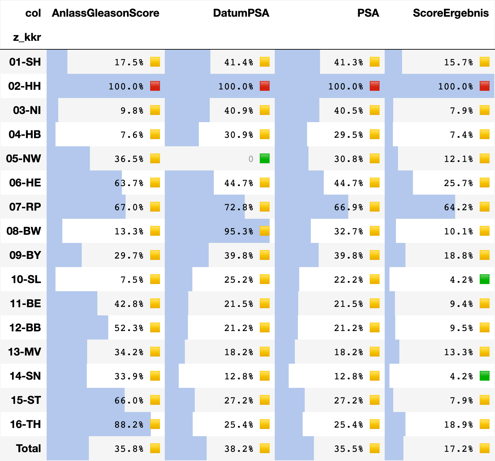
</picture>
    


    🟠 unknowns


<picture>
  <source media="(prefers-color-scheme: dark)" srcset="clin_files_dark/output_124_9.png">
  <source media="(prefers-color-scheme: light)" srcset="clin_files/output_124_9.png">
  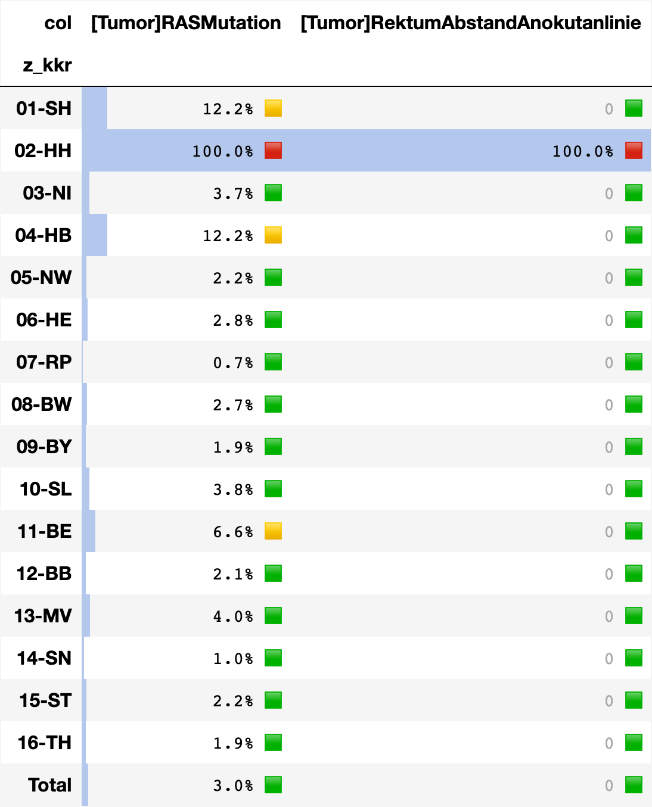
</picture>
    


<br>

#### <a id='toc1_11_7_4_'></a>[Melanom](#toc0_)

> [!NOTE]
> 💡 **ZfKD**: insgesamt weist dieses Modul die höchsten Werte für Missings auf


```
    n = 4_062_856                   (100.0%) ██████████████████████████████
    └ [DJ 2020-2024]: n = 3_794_188  (93.4%) ░░████████████████████████████
    └ [keine DCO]:    n = 3_672_629  (90.4%) ░░░███████████████████████████
    └ [ICD C43]:        n = 144_842   (3.6%) ░░░░░░░░░░░░░░░░░░░░░░░░░░░░░█
```

<details>
<summary>filter-sql</summary>

```sql
z_dy between 2020 and 2024
and not z_is_dco
and z_icd10_3d = 'C43'
```

</details>


    
    


    🟠 missings


<picture>
  <source media="(prefers-color-scheme: dark)" srcset="clin_files_dark/output_126_7.png">
  <source media="(prefers-color-scheme: light)" srcset="clin_files/output_126_7.png">
  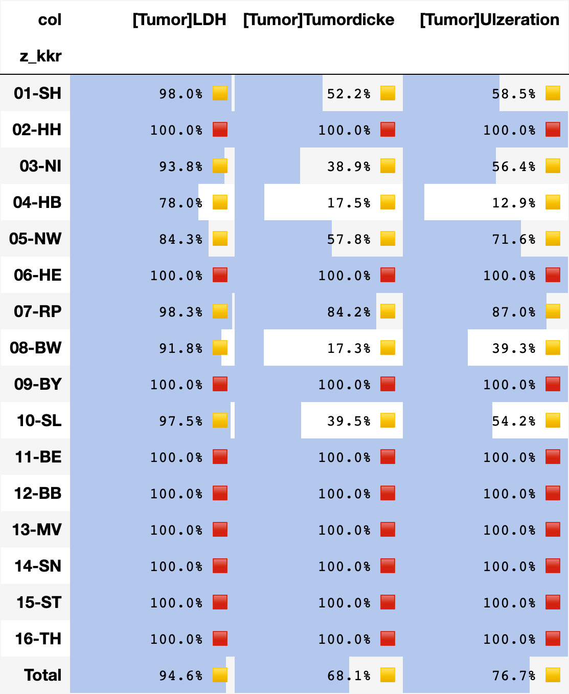
</picture>
    


    🟠 unknowns


<picture>
  <source media="(prefers-color-scheme: dark)" srcset="clin_files_dark/output_126_10.png">
  <source media="(prefers-color-scheme: light)" srcset="clin_files/output_126_10.png">
  
</picture>
    


<br>

## <a id='toc1_12_'></a>[Weitere Klassifikationen](#toc0_)
- Kodierungen zu `Weitere Klassifikationen` können an verschiedenen Orten des Schemas übermittelt werden
  - im Element `Primärdiagnose`
  - im Element `Folgeereignisse`
- darüber hinaus können diese Kodierungen Angaben darstellen, welche in dedizierten Feldern vorgesehen sind (z.B. UICC, PSA)
- die Zuordnung der Freitexte zu von der Plattform 65c definierten Klassifikationen (internes Plattform Dokument)[https://plattform65c.atlassian.net/wiki/spaces/UMK/pages/15532511/Weitere+Klassifikationen] erfolgt per regex in diesem [sql script](../sql/check_if_class.sql)


<br>

### <a id='toc1_12_1_'></a>[nach Quelle](#toc0_)
- untersucht wird der Zusammenhang zwischen den Orten im Schema ("Quelle"), wo die Klassifikation übermittelt wird
- gezeigt sind die 20 häufigsten Klassifikationen
- Kategorie `source`
  - `diag`: Klassifikation ist der Diagnose zugeordnet
  - `fol`: Klassifikation ist einem Folgeereignis zugeordnet

> [!NOTE]
> **💡 ZfKD**
> - die überwiegende Zahl der Kodierungen ist der Diagnose zugeordnet
> - Ausnahme: für PSA gibt es viele Kodes aus Folgeereignissen, für Hormonrezeptoren sogar überwiegend


```
    n = 873_871                        (100.0%) ██████████████████████████████
    └ [Stadium vorhanden]: n = 873_871 (100.0%) ██████████████████████████████
```

<details>
<summary>filter-sql</summary>

```sql
Stadium is not null
```

</details>


    
    


<picture>
  <source media="(prefers-color-scheme: dark)" srcset="clin_files_dark/output_132_1.svg">
  <source media="(prefers-color-scheme: light)" srcset="clin_files/output_132_1.svg">
  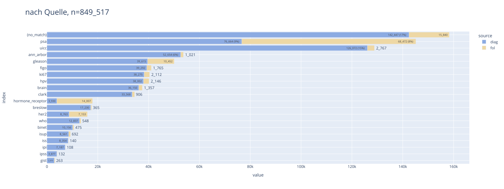
</picture>
    


<br>

### <a id='toc1_12_2_'></a>[nach KKR](#toc0_)
- gezeigt sind die 20 häufigsten Klassifikationen

> [!NOTE]
> **💡 ZfKD**
> - visuell erkennbare "hotspots":
>   - die grösste Gruppe der Kodierungen stellt `PSA` dar aus `05-NW`
>   - markante Anteile sind `KI67` und `UICC` aus `08-BW`
>   - ebenfalls erwähnenswert: Anteile vor allem aus `05-NW` und `08-BH`, welche nicht zu den von der Plattform definierten Klassifikationen zugeordnet werden können (siehe Zeile `(NA)`) 


<picture>
  <source media="(prefers-color-scheme: dark)" srcset="clin_files_dark/output_134_1.png">
  <source media="(prefers-color-scheme: light)" srcset="clin_files/output_134_1.png">
  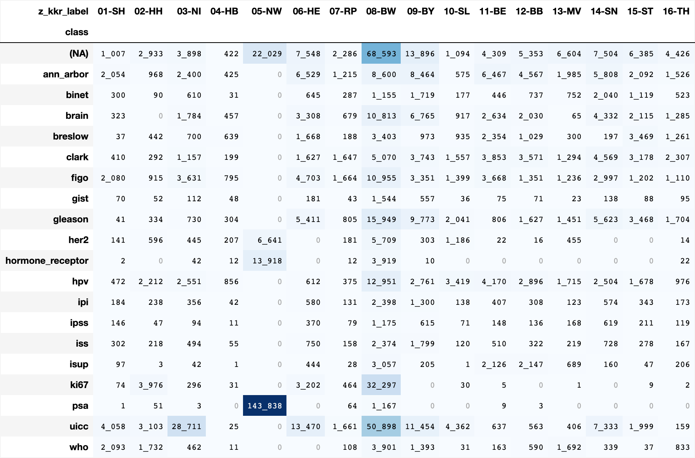
</picture>
    


<br>

### <a id='toc1_12_3_'></a>[nach Jahren](#toc0_)

> [!NOTE]
> 💡 **ZfKD**
> - keine nennenswerten Verschiebungen der meistkodierten Klassifikationen in den letzten DJ, die Zeitachse wird im folgenden nicht weiter berücksichtigt


<picture>
  <source media="(prefers-color-scheme: dark)" srcset="clin_files_dark/output_136_1.svg">
  <source media="(prefers-color-scheme: light)" srcset="clin_files/output_136_1.svg">
  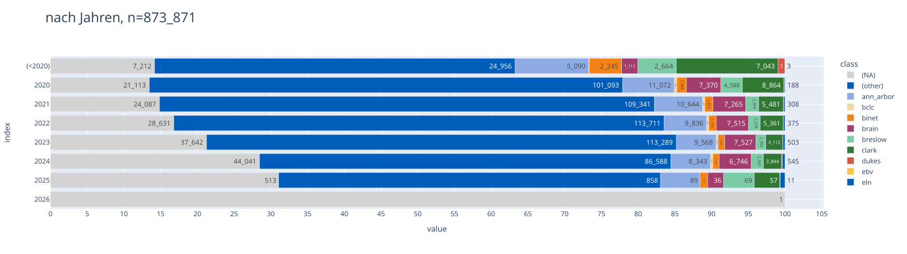
</picture>
    


<br>

### <a id='toc1_12_4_'></a>[PSA](#toc0_)


```
    n = 4_062_856                   (100.0%) ██████████████████████████████
    └ [DJ 2020-2024]: n = 3_794_188  (93.4%) ░░████████████████████████████
    └ [keine DCO]:    n = 3_672_629  (90.4%) ░░░███████████████████████████
    └ [ICD C61]:        n = 379_354   (9.3%) ░░░░░░░░░░░░░░░░░░░░░░░░░░░░██
```

<details>
<summary>filter-sql</summary>

```sql
z_dy between 2020 and 2024
and not z_is_dco
and z_icd10_3d = 'C61'
```

</details>


    
    


<br>

#### <a id='toc1_12_4_1_'></a>[Angabe zu Diagnose vs Weitere Klassifikationen](#toc0_)
- untersucht wird, ob PSA Angaben jeweils Diagnosen zugeordnet sind (erwartete Quelle der Angabe), oder Weiteren Klassifikationen (aus Freitext isoliert)
- Kategorien für die Kombination von PSA Werten zu jedem Tumor
  - `1_all_null`: keine PSA Werte zum Tumor
  - `2_tum_only`: PSA Wert nur vom Organmodul
  - `3_class_only`: PSA Wert nur aus Weitere Klassifikationen (Diagnose oder Folgeereignis)
  - `4_tum_and_class`: PSA Werte aus Organmodul und Weitere Klassifikationen

> [!NOTE]
> 💡 **ZfKD**
> - Angaben aus `02-HH` sind fast komplett leer aufgrund der fehlenden Organmodule
> - überwiegend stammen die PSA Werte aus dem Diagnose Element, mit bis zu 87% der C61 Fälle (`14-SN`)
> - Besonderheit `05-NW`: hier stammen zum grossen Teil PSA Angaben sowohl aus Diagnosen als auch aus Weiteren Klassifikationen


<picture>
  <source media="(prefers-color-scheme: dark)" srcset="clin_files_dark/output_141_1.svg">
  <source media="(prefers-color-scheme: light)" srcset="clin_files/output_141_1.svg">
  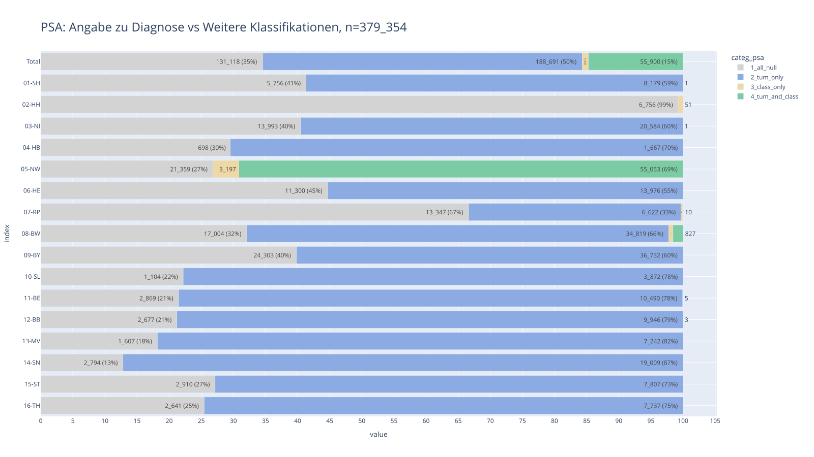
</picture>
    


<br>

#### <a id='toc1_12_4_2_'></a>[Kombinationen der PSA Merkmale](#toc0_)
- untersucht wird, in welchen Kombinationen folgende Merkmale auftreten (deutschlandweit):
  - `has_psa` - Tumor hat einen PSA Wert aus dem Organmodul
  - `has_diag` - Tumor hat einen PSA Wert aus Diagnose -> Weitere Klassifikationen
  - `has_fol` - Tumor hat einen PSA Wert aus Folgeereignis -> Weitere Klassifikationen
- Tumore ohne jegliche PSA Angabe sind ignoriert

> [!NOTE]
> 💡 **ZfKD**
> - von den 375k Tumore im Filter haben 245k mind. eine PSA Angabe
>   - 98% der Tumore mit PSA haben eine Angabe im Organmodul
>   - 75% der Tumore mit PSA haben ausschliesslich eine Angabe im Organmodul
>   - 23% (addiert) der Tumore mit PSA haben Angaben sowohl im Organmodul als auch kodiert im Element Diagnose und sind somit potentiell widersprüchlich
>   - 9% der Tumore mit PSA haben Angaben zum Verlauf (kodiert in Folgeereignissen)

    n = 379_354 | n(true) = 248_236


<picture>
  <source media="(prefers-color-scheme: dark)" srcset="clin_files_dark/output_143_2.png">
  <source media="(prefers-color-scheme: light)" srcset="clin_files/output_143_2.png">
  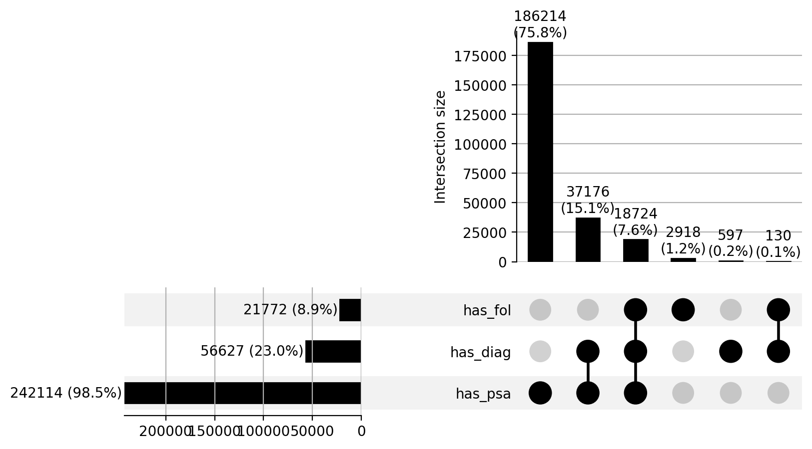
</picture>
    


<br>

#### <a id='toc1_12_4_3_'></a>[Weitere Klassifikationen: Diagnose vs Folgeereignis](#toc0_)
- untersucht wird pro KKR, ob sich PSA Angaben aus `Weitere Klassifikationen` überlappen
- um Verlaufsangaben zu erkennen ist es relevant, ob Angaben in `Weitere Klassifikationen` jeweils zur Diagnose oder Folgeereignis gemacht werden
- Kategorien für die Kombination von PSA Werten zu jedem Tumor:
  - `1_none`: kein PSA Wert in `Weitere Klassifikationen` 
  - `2_both`: PSA Wert sowohl für Diagnose als auch für Folgeereignis vorhanden 
  - `3_diag_only`: PSA Wert nur für Diagnose vorhanden
  - `4_fol_only`: PSA Werte nur für Folgeereignis vorhanden

> [!NOTE]
> 💡 **ZfKD**
> - nur `05-NW`: 
>   - kodiert nennenswert in `Weitere Klassifikationen` (78% der Tumore im Filter)
>   - für ~27% der Tumore (addiert) liegen Verlaufsangaben vor


<picture>
  <source media="(prefers-color-scheme: dark)" srcset="clin_files_dark/output_145_1.svg">
  <source media="(prefers-color-scheme: light)" srcset="clin_files/output_145_1.svg">
  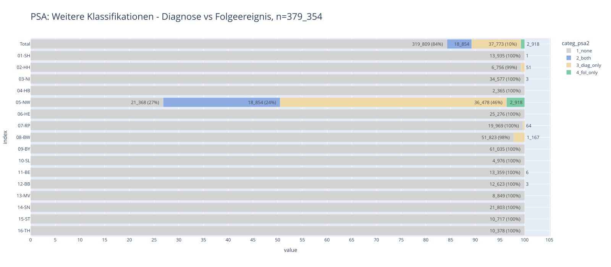
</picture>
    


<br>

### <a id='toc1_12_5_'></a>[UICC](#toc0_)


```
    n = 4_062_856                               (100.0%) ██████████████████████████████
    └ [DJ 2020-2024]:             n = 3_794_188  (93.4%) ░░████████████████████████████
    └ [keine DCO]:                n = 3_672_629  (90.4%) ░░░███████████████████████████
    └ [nur tnm-relevante Tumore]: n = 2_082_538  (51.3%) ░░░░░░░░░░░░░░░███████████████
```

<details>
<summary>filter-sql</summary>

```sql
z_dy between 2020 and 2024
and not z_is_dco
and 
    (
        left(z_icd10_3d, 1) ='C' and
        (
            right(z_icd10_3d, 2)::int8 between 00 and 43
            or right(z_icd10_3d, 2)::int8 between 45 and 69
            or right(z_icd10_3d, 2)::int8 between 73 and 74
        )
        and left(Morphologie_Code,4)::int between 8010 and 8790
        and z_icd10_3d not in ('C26', 'C39', 'C55')
        and z_icd10 not in ('C14.0', 'C57.9', 'C63.9')
    )
```

</details>


    
    


<br>

#### <a id='toc1_12_5_1_'></a>[Kombinationen](#toc0_)

- untersucht wird die Überlappung von UICC Angaben
- UICC Angaben können an folgenden Orten im Schema überliefert sein:
  - Element `Diagnose` im `TNM` Modul (hier sind `c` und `p` Angaben zusammengefasst) - `has_diag_uicc`
  - Element `Diagnose` in `Weitere Klassifikationen` - `has_diag_class` 
  - Element `Folgeereignis` im `TNM` Modul - `has_fol`
  - Element `Folgeereignis` in `Weitere Klassifikationen` - `has_fol`
- Angaben in den Folgeereignissen sind hier nicht weiter differenziert (TNM Modul und Freitext zusammengefasst)

> [!NOTE] 
> **💡 ZfKD**
> - bei ~7% (addiert) der Tumore werden UICC zur Diagnose übermittelt sowohl im TNM Modul als auch als Freitext Klassifikation
> - diese Angaben sind potentiell widersprüchlich

    n = 2_082_538 | n(true) = 1_056_708


<picture>
  <source media="(prefers-color-scheme: dark)" srcset="clin_files_dark/output_149_2.png">
  <source media="(prefers-color-scheme: light)" srcset="clin_files/output_149_2.png">
  
</picture>
    


<br>

#### <a id='toc1_12_5_2_'></a>[nach KKR](#toc0_)
- Folgeereignisse sind hier nicht betrachtet
- Kategorien:
  - `1_no_diag`: keine UICC Angabe im Diagnose Element
  - `2_diag_uicc_only`: UICC Angabe nur im `TNM` Modul
  - `3_diag_both`: UICC Angabe sowohl im `TNM` Modul als auch in `Weitere Klassifikationen`
  - `4_diag_class_only`: UICC Angabe nur in `Weitere Klassifikationen`
- 

> [!NOTE]
> 💡 **ZfKD**
> - Anteil Tumore im Filter mit UICC Angabe ist sehr variabel, zwischen 0% in `05-NW` und 94% in `14-SN`
> - überlappende Angaben (Kategorie `3_diag_both`) sind potentiell widersprüchlich, bis zu 15% der Tumore in `08-BW`
> - `03-NI` liefert die UICC Angaben zur Diagnose ausschliesslich als Freitext, `10-SL` mit erheblichem Anteil. Diese Werte werden bei UICC Auswertungen üblicherweise nicht erfasst


<picture>
  <source media="(prefers-color-scheme: dark)" srcset="clin_files_dark/output_151_1.svg">
  <source media="(prefers-color-scheme: light)" srcset="clin_files/output_151_1.svg">
  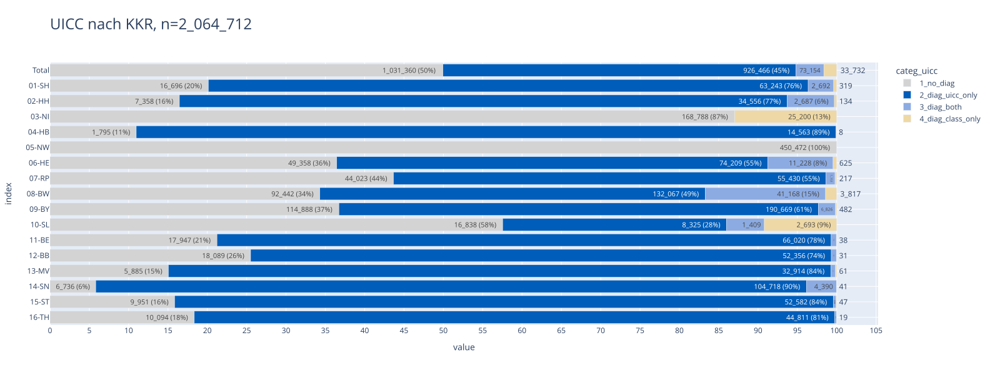
</picture>
    


<br>

## <a id='toc1_13_'></a>[Freitextkodierung](#toc0_)

### <a id='toc1_13_1_'></a>[Substanzen](#toc0_)
- untersucht wird die Abdeckung von kodierten Freitexten im `Substanz` Element
- die Freitextkodierung (abrufbar in: `z_substance_prediction_name`) wird hier als erfolgreich angesehen, wenn der Score (abrufbar in: `z_substance_prediction_score`) über 85% liegt
- Kategorien:
  - `1_all_null` - weder ATC noch Freitext vorhanden
  - `2_code_only` - nur ATC vorhanden, keine Kodierung möglich
  - `3_text_unpredicted` - Freitext vorhanden, keine erfolgreiche Kodierung
  - `4_text_predicted` - Freitext vorhanden, Kodierung erfolgreich

> [!NOTE]
> **💡 ZfKD**
> - Substanz Informationen werden inzwischen überwiegend als Kodierung übermittelt
> - wenn Freitexte vorhanden sind werden diese mit hohem Anteil von dem Algorithmus zur Kodierung erfasst
> - Extreme: in `07-RP` / `13-MV` sind fast alle Freitexte kodiert, in `14-SN` fast keine. Ursache noch unklar


<picture>
  <source media="(prefers-color-scheme: dark)" srcset="clin_files_dark/output_153_1.svg">
  <source media="(prefers-color-scheme: light)" srcset="clin_files/output_153_1.svg">
  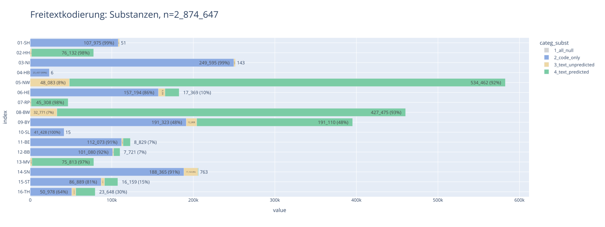
</picture>
    


<br>

## <a id='toc1_14_'></a>[Datum Vitalstatus](#toc0_)

### <a id='toc1_14_1_'></a>[Zeitpunkt der Erhebung](#toc0_)

> [!NOTE]
> 💡 **HH**: _"Das liegt an unserer Darstellung des Vitalstatus-Datum. Nach Abschluss der DC-Recherche, die nach Abschluss des 'Todesjahres' durchgeführt wird, wird bei allen Patienten bei denen wir keine weiteren Meldungen bzw Informationen zum Vitalstatus bekommen haben der 31.12. des abgeschlossenen 'Todesjahres' gesetzt. In diesem Fall ist dies das aktuelle Jahr - 2 -> 31.12.2022, da die DC-Recherche zum Zeitpunkt der Datenlieferung noch nicht abgeschlossen war. Wenn jetzt ein Patient die letzte Meldung mit einem Leistungsdatum in 2019 hatte, wir aber keine weiteren Informationen bekommen haben, gehen wir also nach Abschluss der Recherche davon aus, dass der Patient am 31.12.2022 noch gelebt hat. Dadurch 'verbessert' sich tatsächlich der Vitalstatus in unseren Daten, ansonsten wäre dieser nämlich irgendwann in 2019."_
>
> ---
> 💡 **ZfKD**: angestrebt ist die Verwendung eines einzelnen Erhebungszeitpunkts (z.B. Dezember)


```
    count: distinct z_pat_id
    ---
    n = 3_452_844                          (100.0%) ██████████████████████████████
    └ [DJ 2020-2024]:        n = 3_444_458  (99.8%) ░█████████████████████████████
    └ [Verstorben = 'N']:    n = 2_452_511  (71.0%) ░░░░░░░░░█████████████████████
    └ [Vitalstatus >= 2020]: n = 2_447_358  (70.9%) ░░░░░░░░░█████████████████████
```

<details>
<summary>filter-sql</summary>

```sql
z_dy between 2020 and 2024
and Verstorben = 'N'
and year(Datum_Vitalstatus) >= 2020
```

</details>


    
    


<picture>
  <source media="(prefers-color-scheme: dark)" srcset="clin_files_dark/output_157_1.svg">
  <source media="(prefers-color-scheme: light)" srcset="clin_files/output_157_1.svg">
  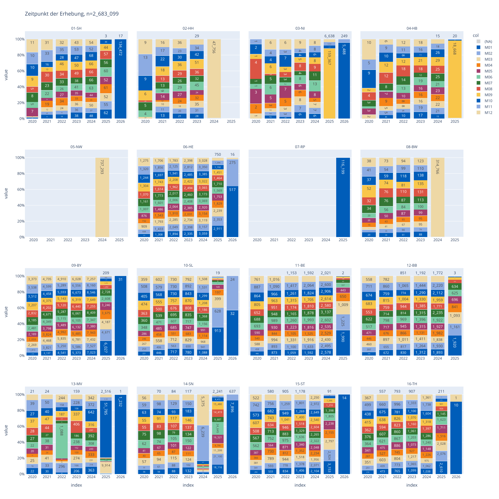
</picture>
    


<div style="page-break-after: always;"></div>


<br>

## <a id='toc1_15_'></a>[Numerische Variablen](#toc0_)

<br>

### <a id='toc1_15_1_'></a>[Diagnosealter](#toc0_)
- berechnet aus `Diagnosejahr` - `Geburtsjahr`
- negative Werte entstehen aus falscher Datumsreihenfolge von Ereignissen
- die Datumsangaben sind **nicht bereinigt**, um strukturelle Effekte sichtbar zu machen

> [!NOTE]
> 💡 `HH`: _"Ja, das liegt an dem Geschätzt-Flag in den Datumsangaben. In unseren Daten haben wir noch die alte Ausprägung 'Jahr geschätzt', diese wird dann im ZFKD-Datensatz mit 'Vollständig geschätzt' übersetzt. Theoretisch könnten Sie statt 1900 auch das angegebene Jahr nutzen… Aber diese Schätz-Angabe ist uns auch ein Dorn im Auge. Wir werden es auch noch in unseren Daten bereinigen. Zumeist handelt es sich da bei uns um Dokumentations oder Verständnisfehler."_


    
<picture>
  <source media="(prefers-color-scheme: dark)" srcset="clin_files_dark/output_161_0.png">
  <source media="(prefers-color-scheme: light)" srcset="clin_files/output_161_0.png">
  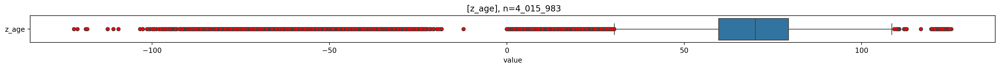
</picture>
    


    
<picture>
  <source media="(prefers-color-scheme: dark)" srcset="clin_files_dark/output_161_1.png">
  <source media="(prefers-color-scheme: light)" srcset="clin_files/output_161_1.png">
  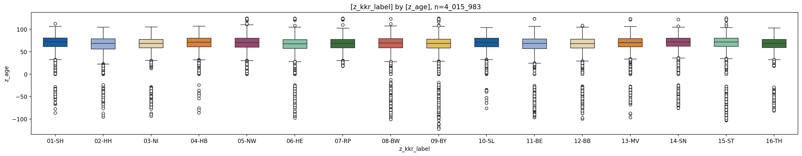
</picture>
    


    
    column (n = 4_062_856) |     notnull      |   min   | lower |  q25  | median | mean  |  q75  | upper  |  max   |  std  |  cv 
    -----------------------+------------------+---------+-------+-------+--------+-------+-------+--------+--------+-------+-----
    z_age                  | 4_062_856 (100%) | -122.00 | 30.25 | 59.67 |  70.00 | 68.03 | 79.33 | 108.50 | 983.33 | 15.27 | 0.22
    


    
    item (n = 4_062_856) |   count   |   min   | lower |  q25  | median | mean  |  q75  | upper  |  max   |  std  |  cv 
    ---------------------+-----------+---------+-------+-------+--------+-------+-------+--------+--------+-------+-----
    01-SH                |   194_283 |  -86.25 | 32.58 | 61.58 |  72.50 | 70.09 | 80.92 | 106.67 | 112.50 | 14.37 | 0.21
    02-HH                |    69_613 |  -95.17 | 22.83 | 56.42 |  68.58 | 66.06 | 78.83 | 104.83 | 104.83 | 16.54 | 0.25
    03-NI                |   277_590 |  -93.33 | 30.58 | 58.92 |  68.75 | 67.02 | 77.83 | 105.33 | 105.33 | 14.50 | 0.22
    04-HB                |    30_960 |  -85.83 | 32.08 | 61.08 |  71.58 | 69.41 | 80.42 | 107.33 | 107.33 | 14.72 | 0.21
    05-NW                | 1_017_558 |    0.00 | 30.33 | 60.33 |  70.75 | 69.00 | 80.33 | 110.33 | 124.67 | 14.67 | 0.21
    06-HE                |   218_646 |  -97.50 | 28.25 | 57.58 |  68.00 | 65.92 | 77.17 | 105.00 | 124.67 | 15.48 | 0.23
    07-RP                |   163_533 |   18.00 | 30.33 | 58.83 |  68.67 | 67.03 | 77.83 | 102.75 | 124.67 | 14.34 | 0.21
    08-BW                |   457_569 | -100.83 | 28.17 | 59.00 |  69.75 | 67.45 | 79.58 | 107.83 | 123.17 | 16.54 | 0.25
    09-BY                |   572_135 | -122.00 | 29.00 | 58.42 |  68.75 | 66.79 | 78.08 | 106.67 | 124.67 | 15.87 | 0.24
    10-SL                |    63_249 |  -76.17 | 32.50 | 61.25 |  70.83 | 69.37 | 80.42 | 103.92 | 103.92 | 14.41 | 0.21
    11-BE                |   146_981 |  -96.50 | 24.50 | 57.00 |  68.75 | 65.78 | 78.67 | 106.75 | 123.92 | 17.95 | 0.27
    12-BB                |   130_868 |  -99.92 | 29.25 | 58.50 |  68.17 | 66.63 | 78.00 | 105.00 | 108.50 | 15.23 | 0.23
    13-MV                |   144_735 |  -96.58 | 34.50 | 61.58 |  70.67 | 69.24 | 79.67 | 106.25 | 983.33 | 14.11 | 0.20
    14-SN                |   334_093 |  -76.25 | 36.25 | 62.58 |  72.08 | 70.02 | 80.17 | 105.00 | 122.00 | 13.77 | 0.20
    15-ST                |   163_371 | -103.42 | 34.83 | 62.17 |  71.75 | 69.56 | 80.42 | 104.17 | 125.25 | 16.02 | 0.23
    16-TH                |    77_672 |  -81.83 | 32.33 | 59.42 |  68.67 | 66.89 | 77.50 | 103.08 | 103.08 | 14.55 | 0.22
    


<br>

### <a id='toc1_15_2_'></a>[Anzahl Tage zwischen Diagnose und Tod](#toc0_)

> [!NOTE]
> 💡 ZfKD
> - es treten Extremwerte auf, weit ausserhalb des Interquartilsabstandes. Grund dafür sind mutmasslich fehlende Datumsangaben, die auf 1900 kodiert werden  
> - in der KKR Verteilung sind die Extreme in den GTDS Ländern besonders ausgeprägt


    
<picture>
  <source media="(prefers-color-scheme: dark)" srcset="clin_files_dark/output_163_0.png">
  <source media="(prefers-color-scheme: light)" srcset="clin_files/output_163_0.png">
  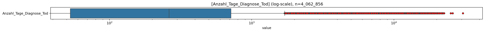
</picture>
    


    
<picture>
  <source media="(prefers-color-scheme: dark)" srcset="clin_files_dark/output_163_1.png">
  <source media="(prefers-color-scheme: light)" srcset="clin_files/output_163_1.png">
  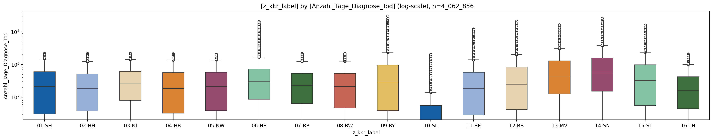
</picture>
    


    
    column (n = 4_062_856)   |     notnull     |  min   | lower |  q25  | median |  mean  |  q75   | upper |  max   |   std    |  cv 
    -------------------------+-----------------+--------+-------+-------+--------+--------+--------+-------+--------+----------+-----
    Anzahl_Tage_Diagnose_Tod | 1_168_451 (28%) | -7_324 |  -347 | 53.00 | 262.00 | 660.85 | 714.00 | 1_705 | 30_590 | 1_280.21 | 1.94
    


    
    item (n = 4_062_856) |  count  |  min   | lower |  q25   | median |   mean   |   q75    | upper |  max   |   std    |  cv 
    ---------------------+---------+--------+-------+--------+--------+----------+----------+-------+--------+----------+-----
    01-SH                |  55_342 |      0 |     0 |  31.00 | 217.00 |   391.41 |   611.00 | 1_481 |  2_185 |   450.63 | 1.15
    02-HH                |  23_361 |      0 |     0 |  38.00 | 184.00 |   349.72 |   521.00 | 1_245 |  2_159 |   415.34 | 1.19
    03-NI                |  85_931 |      0 |     0 |  81.00 | 273.00 |   420.74 |   625.00 | 1_441 |  2_187 |   431.13 | 1.02
    04-HB                |  10_380 |      0 |     0 |  33.00 | 187.00 |   366.26 |   568.00 | 1_370 |  2_126 |   433.75 | 1.18
    05-NW                | 279_472 |      0 |     0 |  39.00 | 215.00 |   375.82 |   582.00 | 1_396 |  2_064 |   426.00 | 1.13
    06-HE                |  66_126 |      0 |     0 |  87.00 | 299.00 |   607.12 |   735.00 | 1_707 | 20_880 |   974.57 | 1.61
    07-RP                |  33_818 |      0 |     0 |  65.00 | 228.00 |   368.01 |   544.00 | 1_262 |  2_181 |   392.79 | 1.07
    08-BW                | 130_832 |      0 |     0 |  47.00 | 214.00 |   355.38 |   542.00 | 1_284 |  2_192 |   391.62 | 1.10
    09-BY                | 181_562 |      0 |     0 |  39.00 | 296.00 | 1_055.89 |   980.00 | 2_391 | 30_590 | 1_954.06 | 1.85
    10-SL                |   3_859 |      0 |     0 |   0.00 |   0.00 |    93.34 |    56.00 |   140 |  2_054 |   239.94 | 2.57
    11-BE                |  49_512 |      0 |     0 |  29.00 | 184.00 |   452.70 |   583.00 | 1_414 | 12_262 |   769.67 | 1.70
    12-BB                |  48_367 |      0 |     0 |  42.00 | 251.00 |   949.41 |   838.00 | 2_032 | 21_026 | 1_806.10 | 1.90
    13-MV                |  35_836 | -7_324 |  -347 | 128.00 | 450.00 | 1_228.31 | 1_317.00 | 3_100 | 16_507 | 1_893.86 | 1.54
    14-SN                |  98_743 |      0 |     0 | 154.00 | 558.00 | 1_405.87 | 1_610.00 | 3_793 | 25_923 | 2_062.48 | 1.47
    15-ST                |  53_400 |      0 |     0 |  56.00 | 322.00 |   963.14 |   991.00 | 2_393 | 16_227 | 1_696.78 | 1.76
    16-TH                |  11_910 |      0 |     0 |  45.00 | 165.00 |   301.56 |   427.75 | 1_001 |  2_112 |   354.96 | 1.18
    


<br>

### <a id='toc1_15_3_'></a>[Tumordicke](#toc0_)


    
<picture>
  <source media="(prefers-color-scheme: dark)" srcset="clin_files_dark/output_165_0.png">
  <source media="(prefers-color-scheme: light)" srcset="clin_files/output_165_0.png">
  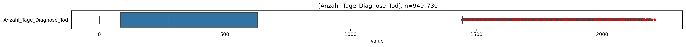
</picture>
    


    
    column (n = 4_062_856) |   notnull   |  min  | lower |  q25  | median | mean  |  q75  | upper |  max   |  std  |  cv  
    -----------------------+-------------+-------+-------+-------+--------+-------+-------+-------+--------+-------+------
    Tumordicke             | 59_055 (1%) | 0.010 | 0.010 | 0.400 |  0.900 | 1.950 | 2.200 | 4.900 | 99.000 | 3.516 | 1.804
    


    
<picture>
  <source media="(prefers-color-scheme: dark)" srcset="clin_files_dark/output_165_2.png">
  <source media="(prefers-color-scheme: light)" srcset="clin_files/output_165_2.png">
  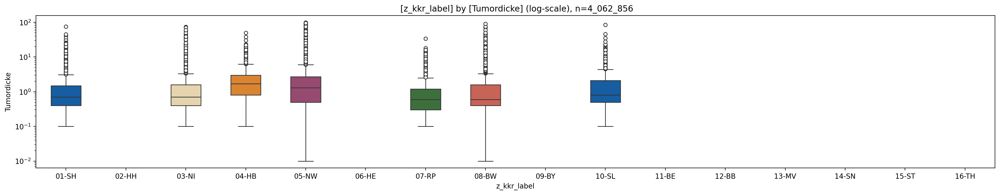
</picture>
    


<br>

### <a id='toc1_15_4_'></a>[PSA](#toc0_)


    
<picture>
  <source media="(prefers-color-scheme: dark)" srcset="clin_files_dark/output_167_0.png">
  <source media="(prefers-color-scheme: light)" srcset="clin_files/output_167_0.png">
  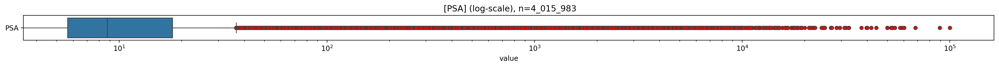
</picture>
    


    
    column (n = 4_062_856) |   notnull    |  min  | lower |  q25  | median |  mean  |  q75   | upper  |    max     |   std   |  cv  
    -----------------------+--------------+-------+-------+-------+--------+--------+--------+--------+------------+---------+------
    PSA                    | 247_409 (6%) | 0.000 | 0.000 | 5.630 |  8.740 | 90.354 | 18.000 | 36.550 | 99_999.000 | 741.810 | 8.210
    


    
<picture>
  <source media="(prefers-color-scheme: dark)" srcset="clin_files_dark/output_167_2.png">
  <source media="(prefers-color-scheme: light)" srcset="clin_files/output_167_2.png">
  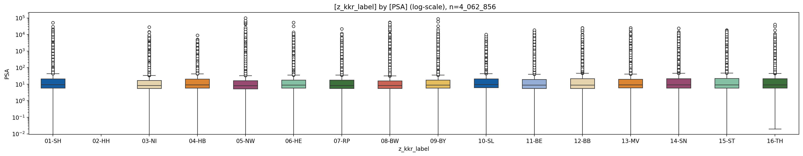
</picture>
    


<br>

### <a id='toc1_15_5_'></a>[LK_befallen](#toc0_)


    
<picture>
  <source media="(prefers-color-scheme: dark)" srcset="clin_files_dark/output_169_0.png">
  <source media="(prefers-color-scheme: light)" srcset="clin_files/output_169_0.png">
  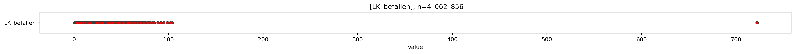
</picture>
    


    
    column (n = 4_062_856) |    notnull    | min | lower |  q25  | median | mean  |  q75  | upper | max |  std  |  cv  
    -----------------------+---------------+-----+-------+-------+--------+-------+-------+-------+-----+-------+------
    LK_befallen            | 800_119 (19%) |   0 |     0 | 0.000 |  0.000 | 0.918 | 0.000 |     0 | 722 | 3.078 | 3.354
    


    
<picture>
  <source media="(prefers-color-scheme: dark)" srcset="clin_files_dark/output_169_2.png">
  <source media="(prefers-color-scheme: light)" srcset="clin_files/output_169_2.png">
  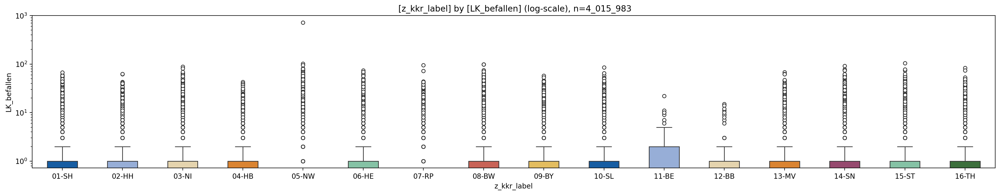
</picture>
    


<br>

### <a id='toc1_15_6_'></a>[LK_untersucht](#toc0_)


    
<picture>
  <source media="(prefers-color-scheme: dark)" srcset="clin_files_dark/output_171_0.png">
  <source media="(prefers-color-scheme: light)" srcset="clin_files/output_171_0.png">
  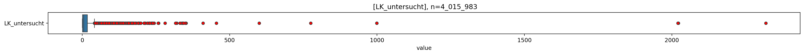
</picture>
    


    
    column (n = 4_062_856) |    notnull    | min | lower |  q25  | median |  mean  |  q75   | upper |  max  |  std   |  cv  
    -----------------------+---------------+-----+-------+-------+--------+--------+--------+-------+-------+--------+------
    LK_untersucht          | 974_256 (23%) |   0 |     0 | 1.000 |  5.000 | 10.636 | 17.000 |    41 | 2_319 | 13.656 | 1.284
    


    
<picture>
  <source media="(prefers-color-scheme: dark)" srcset="clin_files_dark/output_171_2.png">
  <source media="(prefers-color-scheme: light)" srcset="clin_files/output_171_2.png">
  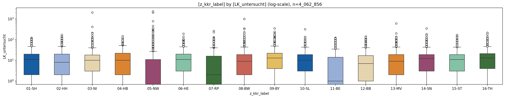
</picture>
    


<br>

### <a id='toc1_15_7_'></a>[RektumAbstandAnokutanlinie](#toc0_)


    
<picture>
  <source media="(prefers-color-scheme: dark)" srcset="clin_files_dark/output_173_0.png">
  <source media="(prefers-color-scheme: light)" srcset="clin_files/output_173_0.png">
  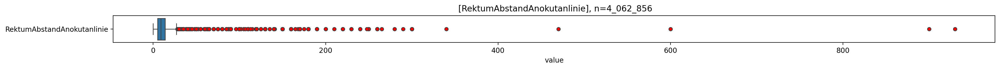
</picture>
    


    
    column (n = 4_062_856)     |   notnull   | min | lower |  q25  | median |  mean  |  q75   | upper | max |  std   |  cv  
    ---------------------------+-------------+-----+-------+-------+--------+--------+--------+-------+-----+--------+------
    RektumAbstandAnokutanlinie | 42_811 (1%) |   0 |     0 | 5.000 |  9.000 | 11.289 | 14.000 |    27 | 930 | 16.996 | 1.506
    


    
<picture>
  <source media="(prefers-color-scheme: dark)" srcset="clin_files_dark/output_173_2.png">
  <source media="(prefers-color-scheme: light)" srcset="clin_files/output_173_2.png">
  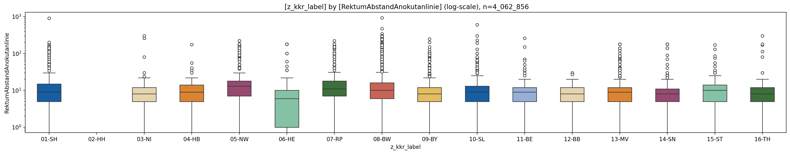
</picture>
    


<br>

### <a id='toc1_15_8_'></a>[LDH](#toc0_)


    
<picture>
  <source media="(prefers-color-scheme: dark)" srcset="clin_files_dark/output_175_0.png">
  <source media="(prefers-color-scheme: light)" srcset="clin_files/output_175_0.png">
  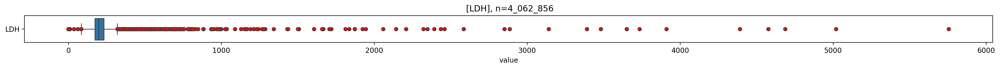
</picture>
    


    
    column (n = 4_062_856) |  notnull   | min | lower |   q25   | median  |  mean   |   q75   | upper |  max  |   std   |  cv  
    -----------------------+------------+-----+-------+---------+---------+---------+---------+-------+-------+---------+------
    LDH                    | 8_083 (0%) |   1 |    85 | 173.000 | 198.000 | 223.739 | 232.000 |   320 | 5_756 | 207.009 | 0.925
    


    
<picture>
  <source media="(prefers-color-scheme: dark)" srcset="clin_files_dark/output_175_2.png">
  <source media="(prefers-color-scheme: light)" srcset="clin_files/output_175_2.png">
  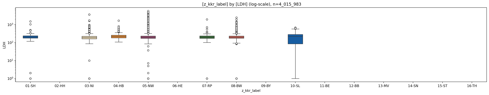
</picture>
    

