# [Bericht zur Datenqualität (klin) 📉](#toc0_)

**Table of contents**    
- [Bericht zur Datenqualität (klin) 📉](#toc1_)    
  - [Änderungen seit der letzten Version](#toc1_1_)    
  - [Datenstand ⏱️](#toc1_2_)    
  - [Lieferdatum 📆](#toc1_3_)    
  - [Fallzahlen](#toc1_4_)    
    - [absolut](#toc1_4_1_)    
    - [relativ](#toc1_4_2_)    
  - [missings](#toc1_5_)    
  - [Fallzahlen epi vs clin](#toc1_6_)    
  - [Verteilung von Variablen](#toc1_7_)    
    - [UICC (p)](#toc1_7_1_)    
    - [Diagnosesicherung](#toc1_7_2_)    
    - [Geschlecht](#toc1_7_3_)    
    - [Diagnosejahr](#toc1_7_4_)    
    - [Inzidenzort vs Lieferregister](#toc1_7_5_)    
    - [ICD10 Gruppen](#toc1_7_6_)    
    - [Verstorben](#toc1_7_7_)    
    - [TNM-T (p)](#toc1_7_8_)    
    - [TNM-N (p)](#toc1_7_9_)    
    - [TNM-M (p)](#toc1_7_10_)    
    - [TNM-Auflage (p)](#toc1_7_11_)    
    - [Todesursachen (TU)](#toc1_7_12_)    
      - [nach ICD10 Einstellern](#toc1_7_12_1_)    
      - [nach Sterbejahr und Todesursachen](#toc1_7_12_2_)    
      - [nach hat_todesursache bei Nicht-Verstorbenen](#toc1_7_12_3_)    
      - [nach ICD10 Dreistellern (TOP 5)](#toc1_7_12_4_)    
      - [nach IsGrundleiden](#toc1_7_12_5_)    
    - [OP](#toc1_7_13_)    
      - [nach ICD10](#toc1_7_13_1_)    
      - [nach Intention](#toc1_7_13_2_)    
    - [OPS](#toc1_7_14_)    
      - [nach OPS ICD Kapitel (Top 10)](#toc1_7_14_1_)    
      - [nach OPS Einzelcodes (Top 5)](#toc1_7_14_2_)    
    - [SYST](#toc1_7_15_)    
      - [nach Stellung_OP](#toc1_7_15_1_)    
  - [Missings / Unbekannt in den Daten](#toc1_8_)    
    - [Missings für verpflichtende Variablen in Tumor Element](#toc1_8_1_)    
    - [Missings für Therapieangaben](#toc1_8_2_)    
    - [Missings für Tumorstadien](#toc1_8_3_)    
    - [Missings für organspezifische Variablen (Mamma)](#toc1_8_4_)    
    - [Missings für organspezifische Variablen (Prostata)](#toc1_8_5_)    
    - [Missings für organspezifische Variablen (Darm)](#toc1_8_6_)    
    - [Missings für organspezifische Variablen (Melanom)](#toc1_8_7_)    
    - [Missings für Prio Variablen](#toc1_8_8_)    
    - [Unbekannt für verpflichtende Variablen](#toc1_8_9_)    
  - [Verteilung Monat von DatumVitalstatus](#toc1_9_)    
  - [Numerische Variablen 🔢](#toc1_10_)    
    - [Diagnosealter](#toc1_10_1_)    
    - [Anzahl Tage zwischen Diagnose und Tod](#toc1_10_2_)    
    - [Tumordicke](#toc1_10_3_)    
    - [PSA](#toc1_10_4_)    
    - [LK_befallen](#toc1_10_5_)    
    - [LK_untersucht](#toc1_10_6_)    
    - [RektumAbstandAnokutanlinie](#toc1_10_7_)    
    - [LDH](#toc1_10_8_)    

<!-- vscode-jupyter-toc-config
	numbering=false
	anchor=true
	flat=false
	minLevel=1
	maxLevel=6
	/vscode-jupyter-toc-config -->
<!-- THIS CELL WILL BE REPLACED ON TOC UPDATE. DO NOT WRITE YOUR TEXT IN THIS CELL -->

## [Änderungen seit der letzten Version](#toc0_)
- Neulieferung `06-HE`
- [Numerische Variablen 🔢](#toc1_10_) enthalten nun mehr Diagramme

 

## [Datenstand ⏱️](#toc0_)

    🐍 3.12.8 | 📦 pandas: 2.3.3 | 📦 numpy: 1.26.4 | 📦 duckdb: 1.4.1 | 📦 pandas-plots: 0.20.4 | 📦 connection-helper: 0.13.1

    sqlite db file:          2025-10-30_data_clin.duckdb
    data tag:                v2.3
    last kkr data import:    2025-09-30
    sql table created:       2025-10-30 16:25:02
    doi:                     10.18444/5.03.01.0005.0021.0001
    document created:        2025-10-31 13:14:20

 

## [Lieferdatum 📆](#toc0_)
- `kkr` = Klinisches Krebsregister
- `Lieferdatum` = Datum der letzten Übermittlung durch die KKR
- `Diagnosemonat` = letzter Diagnosemonat in den Daten

<table border="1" class="dataframe">
  <thead>
    <tr style="text-align: right;">
      <th>z_kkr_label</th>
      <th>01-SH</th>
      <th>02-HH</th>
      <th>03-NI</th>
      <th>04-HB</th>
      <th>05-NW</th>
      <th>06-HE</th>
      <th>07-RP</th>
      <th>08-BW</th>
      <th>09-BY</th>
      <th>10-SL</th>
      <th>11-BE</th>
      <th>12-BB</th>
      <th>13-MV</th>
      <th>14-SN</th>
      <th>15-ST</th>
      <th>16-TH</th>
    </tr>
  </thead>
  <tbody>
    <tr>
      <th>Diagnosemonat</th>
      <td>2023-12</td>
      <td>2023-12</td>
      <td>2023-12</td>
      <td>2023-12</td>
      <td>2023-12</td>
      <td>2025-04</td>
      <td>2023-12</td>
      <td>2024-12</td>
      <td>2024-12</td>
      <td>2023-12</td>
      <td>2025-01</td>
      <td>2025-01</td>
      <td>2025-01</td>
      <td>2023-12</td>
      <td>2024-11</td>
      <td>2023-12</td>
    </tr>
    <tr>
      <th>Lieferdatum</th>
      <td>2025-01-06</td>
      <td>2025-01-29</td>
      <td>2025-01-08</td>
      <td>2025-02-04</td>
      <td>2025-02-23</td>
      <td>2025-05-27</td>
      <td>2025-02-21</td>
      <td>2025-09-30</td>
      <td>2025-01-10</td>
      <td>2025-02-13</td>
      <td>2025-03-10</td>
      <td>2025-03-10</td>
      <td>2025-01-21</td>
      <td>2025-01-13</td>
      <td>2025-01-29</td>
      <td>2025-02-28</td>
    </tr>
    <tr>
      <th>Tumorfälle_2023</th>
      <td>36_066</td>
      <td>13_937</td>
      <td>48_361</td>
      <td>5_251</td>
      <td>202_729</td>
      <td>40_386</td>
      <td>28_342</td>
      <td>90_457</td>
      <td>91_020</td>
      <td>10_697</td>
      <td>27_295</td>
      <td>22_556</td>
      <td>23_661</td>
      <td>56_030</td>
      <td>25_326</td>
      <td>15_869</td>
    </tr>
  </tbody>
</table>

## [Fallzahlen](#toc0_)
- in den Darstellungen sind keine Filter angewendet, solange nicht explizit angegeben

 

### [absolut](#toc0_)
- aufgespannt sind die Fallzahlen für Lieferregister und Elementknoten
- für jedes Register ist hier insbesondere einsehbar, wie viele Tumore/Patienten aus der aktuellsten Lieferung verarbeitet wurden
- kein Filter, "Altfälle" (DJ < 2020) sind also enthalten
- aufgeteilt auf 2 Tabellen zur besseren Übersicht
- die `%` Werte sowie die farbigen Datenbalken zeigen das relative Gewicht jedes KKR an "D gesamt" (`Total` Zeile)
- Erklärung für einige Elementknoten: (_cnt = count/Fallzahl)
  - `weitere_diag_cnt` = Weitere Klassifikation im Elementknoten "Diagnose"
  - `weitere_folge_cnt` = Weitere Klassifikation im Elementknoten "Folgeereignis"
  - `fm_folge_cnt`= Fernmetastasen im Elementknoten "Folgeereignis"
  - `fm_diag_cnt` = Fernmetastasen im Elementknoten "Diagnose"
  - `tnm_folge_cnt` = TNM im Elementknoten "Folgeereignis"

> 💡 `ZfKD`: _"die absoluten Werte lassen erkennen, dass inzwischen die meisten Elemente flächendeckend vorliegen. Ausnahmen: `Applikationsart`, `Folgeereignisse`, `Protokolle` / `Substanzen`"_

<table id="T_115d6">
  <thead>
    <tr>
      <th class="blank level0" >&nbsp;</th>
      <th id="T_115d6_level0_col0" class="col_heading level0 col0" >tum_cnt</th>
      <th id="T_115d6_level0_col1" class="col_heading level0 col1" >pat_cnt</th>
      <th id="T_115d6_level0_col2" class="col_heading level0 col2" >op_cnt</th>
      <th id="T_115d6_level0_col3" class="col_heading level0 col3" >ops_cnt</th>
      <th id="T_115d6_level0_col4" class="col_heading level0 col4" >syst_cnt</th>
      <th id="T_115d6_level0_col5" class="col_heading level0 col5" >st_cnt</th>
      <th id="T_115d6_level0_col6" class="col_heading level0 col6" >bestr_cnt</th>
      <th id="T_115d6_level0_col7" class="col_heading level0 col7" >app_cnt</th>
    </tr>
    <tr>
      <th class="index_name level0" >kkr</th>
      <th class="blank col0" >&nbsp;</th>
      <th class="blank col1" >&nbsp;</th>
      <th class="blank col2" >&nbsp;</th>
      <th class="blank col3" >&nbsp;</th>
      <th class="blank col4" >&nbsp;</th>
      <th class="blank col5" >&nbsp;</th>
      <th class="blank col6" >&nbsp;</th>
      <th class="blank col7" >&nbsp;</th>
    </tr>
  </thead>
  <tbody>
    <tr>
      <th id="T_115d6_level0_row0" class="row_heading level0 row0" >01-SH</th>
      <td id="T_115d6_row0_col0" class="data row0 col0" >150_685 (4.6%) </td>
      <td id="T_115d6_row0_col1" class="data row0 col1" >136_279 (5.0%) </td>
      <td id="T_115d6_row0_col2" class="data row0 col2" >44_826 (2.7%) </td>
      <td id="T_115d6_row0_col3" class="data row0 col3" >86_663 (2.8%) </td>
      <td id="T_115d6_row0_col4" class="data row0 col4" >39_951 (3.6%) </td>
      <td id="T_115d6_row0_col5" class="data row0 col5" >20_343 (4.0%) </td>
      <td id="T_115d6_row0_col6" class="data row0 col6" >20_343 (3.3%) </td>
      <td id="T_115d6_row0_col7" class="data row0 col7" >0 </td>
    </tr>
    <tr>
      <th id="T_115d6_level0_row1" class="row_heading level0 row1" >02-HH</th>
      <td id="T_115d6_row1_col0" class="data row1 col0" >55_559 (1.7%) </td>
      <td id="T_115d6_row1_col1" class="data row1 col1" >51_555 (1.9%) </td>
      <td id="T_115d6_row1_col2" class="data row1 col2" >33_147 (2.0%) </td>
      <td id="T_115d6_row1_col3" class="data row1 col3" >61_766 (2.0%) </td>
      <td id="T_115d6_row1_col4" class="data row1 col4" >31_235 (2.8%) </td>
      <td id="T_115d6_row1_col5" class="data row1 col5" >12_733 (2.5%) </td>
      <td id="T_115d6_row1_col6" class="data row1 col6" >16_630 (2.7%) </td>
      <td id="T_115d6_row1_col7" class="data row1 col7" >16_630 (3.2%) </td>
    </tr>
    <tr>
      <th id="T_115d6_level0_row2" class="row_heading level0 row2" >03-NI</th>
      <td id="T_115d6_row2_col0" class="data row2 col0" >216_710 (6.7%) </td>
      <td id="T_115d6_row2_col1" class="data row2 col1" >201_385 (7.4%) </td>
      <td id="T_115d6_row2_col2" class="data row2 col2" >95_021 (5.7%) </td>
      <td id="T_115d6_row2_col3" class="data row2 col3" >197_982 (6.3%) </td>
      <td id="T_115d6_row2_col4" class="data row2 col4" >99_259 (9.0%) </td>
      <td id="T_115d6_row2_col5" class="data row2 col5" >41_667 (8.3%) </td>
      <td id="T_115d6_row2_col6" class="data row2 col6" >41_667 (6.8%) </td>
      <td id="T_115d6_row2_col7" class="data row2 col7" >0 </td>
    </tr>
    <tr>
      <th id="T_115d6_level0_row3" class="row_heading level0 row3" >04-HB</th>
      <td id="T_115d6_row3_col0" class="data row3 col0" >25_182 (0.8%) </td>
      <td id="T_115d6_row3_col1" class="data row3 col1" >22_954 (0.8%) </td>
      <td id="T_115d6_row3_col2" class="data row3 col2" >9_265 (0.6%) </td>
      <td id="T_115d6_row3_col3" class="data row3 col3" >21_345 (0.7%) </td>
      <td id="T_115d6_row3_col4" class="data row3 col4" >10_564 (1.0%) </td>
      <td id="T_115d6_row3_col5" class="data row3 col5" >4_354 (0.9%) </td>
      <td id="T_115d6_row3_col6" class="data row3 col6" >4_354 (0.7%) </td>
      <td id="T_115d6_row3_col7" class="data row3 col7" >0 </td>
    </tr>
    <tr>
      <th id="T_115d6_level0_row4" class="row_heading level0 row4" >05-NW</th>
      <td id="T_115d6_row4_col0" class="data row4 col0" >805_679 (24.9%) </td>
      <td id="T_115d6_row4_col1" class="data row4 col1" >746_553 (27.3%) </td>
      <td id="T_115d6_row4_col2" class="data row4 col2" >355_202 (21.5%) </td>
      <td id="T_115d6_row4_col3" class="data row4 col3" >713_974 (22.7%) </td>
      <td id="T_115d6_row4_col4" class="data row4 col4" >219_790 (19.9%) </td>
      <td id="T_115d6_row4_col5" class="data row4 col5" >76_685 (15.3%) </td>
      <td id="T_115d6_row4_col6" class="data row4 col6" >102_951 (16.9%) </td>
      <td id="T_115d6_row4_col7" class="data row4 col7" >102_951 (20.0%) </td>
    </tr>
    <tr>
      <th id="T_115d6_level0_row5" class="row_heading level0 row5" >06-HE</th>
      <td id="T_115d6_row5_col0" class="data row5 col0" >174_565 (5.4%) </td>
      <td id="T_115d6_row5_col1" class="data row5 col1" >153_528 (5.6%) </td>
      <td id="T_115d6_row5_col2" class="data row5 col2" >92_019 (5.6%) </td>
      <td id="T_115d6_row5_col3" class="data row5 col3" >198_038 (6.3%) </td>
      <td id="T_115d6_row5_col4" class="data row5 col4" >72_866 (6.6%) </td>
      <td id="T_115d6_row5_col5" class="data row5 col5" >31_072 (6.2%) </td>
      <td id="T_115d6_row5_col6" class="data row5 col6" >43_886 (7.2%) </td>
      <td id="T_115d6_row5_col7" class="data row5 col7" >43_886 (8.5%) </td>
    </tr>
    <tr>
      <th id="T_115d6_level0_row6" class="row_heading level0 row6" >07-RP</th>
      <td id="T_115d6_row6_col0" class="data row6 col0" >123_111 (3.8%) </td>
      <td id="T_115d6_row6_col1" class="data row6 col1" >112_755 (4.1%) </td>
      <td id="T_115d6_row6_col2" class="data row6 col2" >57_912 (3.5%) </td>
      <td id="T_115d6_row6_col3" class="data row6 col3" >108_047 (3.4%) </td>
      <td id="T_115d6_row6_col4" class="data row6 col4" >39_125 (3.5%) </td>
      <td id="T_115d6_row6_col5" class="data row6 col5" >22_834 (4.5%) </td>
      <td id="T_115d6_row6_col6" class="data row6 col6" >22_834 (3.7%) </td>
      <td id="T_115d6_row6_col7" class="data row6 col7" >0 </td>
    </tr>
    <tr>
      <th id="T_115d6_level0_row7" class="row_heading level0 row7" >08-BW</th>
      <td id="T_115d6_row7_col0" class="data row7 col0" >362_189 (11.2%) </td>
      <td id="T_115d6_row7_col1" class="data row7 col1" >322_201 (11.8%) </td>
      <td id="T_115d6_row7_col2" class="data row7 col2" >228_012 (13.8%) </td>
      <td id="T_115d6_row7_col3" class="data row7 col3" >464_617 (14.8%) </td>
      <td id="T_115d6_row7_col4" class="data row7 col4" >111_974 (10.1%) </td>
      <td id="T_115d6_row7_col5" class="data row7 col5" >82_173 (16.3%) </td>
      <td id="T_115d6_row7_col6" class="data row7 col6" >97_115 (15.9%) </td>
      <td id="T_115d6_row7_col7" class="data row7 col7" >97_115 (18.9%) </td>
    </tr>
    <tr>
      <th id="T_115d6_level0_row8" class="row_heading level0 row8" >09-BY</th>
      <td id="T_115d6_row8_col0" class="data row8 col0" >431_813 (13.3%) </td>
      <td id="T_115d6_row8_col1" class="data row8 col1" >343_452 (12.6%) </td>
      <td id="T_115d6_row8_col2" class="data row8 col2" >226_367 (13.7%) </td>
      <td id="T_115d6_row8_col3" class="data row8 col3" >421_347 (13.4%) </td>
      <td id="T_115d6_row8_col4" class="data row8 col4" >156_584 (14.2%) </td>
      <td id="T_115d6_row8_col5" class="data row8 col5" >77_356 (15.4%) </td>
      <td id="T_115d6_row8_col6" class="data row8 col6" >94_487 (15.5%) </td>
      <td id="T_115d6_row8_col7" class="data row8 col7" >93_652 (18.2%) </td>
    </tr>
    <tr>
      <th id="T_115d6_level0_row9" class="row_heading level0 row9" >10-SL</th>
      <td id="T_115d6_row9_col0" class="data row9 col0" >48_061 (1.5%) </td>
      <td id="T_115d6_row9_col1" class="data row9 col1" >43_489 (1.6%) </td>
      <td id="T_115d6_row9_col2" class="data row9 col2" >16_312 (1.0%) </td>
      <td id="T_115d6_row9_col3" class="data row9 col3" >31_262 (1.0%) </td>
      <td id="T_115d6_row9_col4" class="data row9 col4" >15_211 (1.4%) </td>
      <td id="T_115d6_row9_col5" class="data row9 col5" >6_693 (1.3%) </td>
      <td id="T_115d6_row9_col6" class="data row9 col6" >6_693 (1.1%) </td>
      <td id="T_115d6_row9_col7" class="data row9 col7" >0 </td>
    </tr>
    <tr>
      <th id="T_115d6_level0_row10" class="row_heading level0 row10" >11-BE</th>
      <td id="T_115d6_row10_col0" class="data row10 col0" >114_910 (3.5%) </td>
      <td id="T_115d6_row10_col1" class="data row10 col1" >102_652 (3.8%) </td>
      <td id="T_115d6_row10_col2" class="data row10 col2" >73_421 (4.4%) </td>
      <td id="T_115d6_row10_col3" class="data row10 col3" >158_694 (5.0%) </td>
      <td id="T_115d6_row10_col4" class="data row10 col4" >50_167 (4.5%) </td>
      <td id="T_115d6_row10_col5" class="data row10 col5" >22_942 (4.6%) </td>
      <td id="T_115d6_row10_col6" class="data row10 col6" >27_482 (4.5%) </td>
      <td id="T_115d6_row10_col7" class="data row10 col7" >27_482 (5.4%) </td>
    </tr>
    <tr>
      <th id="T_115d6_level0_row11" class="row_heading level0 row11" >12-BB</th>
      <td id="T_115d6_row11_col0" class="data row11 col0" >104_299 (3.2%) </td>
      <td id="T_115d6_row11_col1" class="data row11 col1" >85_150 (3.1%) </td>
      <td id="T_115d6_row11_col2" class="data row11 col2" >64_795 (3.9%) </td>
      <td id="T_115d6_row11_col3" class="data row11 col3" >124_370 (4.0%) </td>
      <td id="T_115d6_row11_col4" class="data row11 col4" >49_344 (4.5%) </td>
      <td id="T_115d6_row11_col5" class="data row11 col5" >22_240 (4.4%) </td>
      <td id="T_115d6_row11_col6" class="data row11 col6" >26_587 (4.4%) </td>
      <td id="T_115d6_row11_col7" class="data row11 col7" >26_587 (5.2%) </td>
    </tr>
    <tr>
      <th id="T_115d6_level0_row12" class="row_heading level0 row12" >13-MV</th>
      <td id="T_115d6_row12_col0" class="data row12 col0" >110_032 (3.4%) </td>
      <td id="T_115d6_row12_col1" class="data row12 col1" >75_219 (2.8%) </td>
      <td id="T_115d6_row12_col2" class="data row12 col2" >73_292 (4.4%) </td>
      <td id="T_115d6_row12_col3" class="data row12 col3" >105_958 (3.4%) </td>
      <td id="T_115d6_row12_col4" class="data row12 col4" >38_061 (3.4%) </td>
      <td id="T_115d6_row12_col5" class="data row12 col5" >15_609 (3.1%) </td>
      <td id="T_115d6_row12_col6" class="data row12 col6" >19_044 (3.1%) </td>
      <td id="T_115d6_row12_col7" class="data row12 col7" >19_044 (3.7%) </td>
    </tr>
    <tr>
      <th id="T_115d6_level0_row13" class="row_heading level0 row13" >14-SN</th>
      <td id="T_115d6_row13_col0" class="data row13 col0" >300_228 (9.3%) </td>
      <td id="T_115d6_row13_col1" class="data row13 col1" >187_586 (6.9%) </td>
      <td id="T_115d6_row13_col2" class="data row13 col2" >127_756 (7.7%) </td>
      <td id="T_115d6_row13_col3" class="data row13 col3" >205_189 (6.5%) </td>
      <td id="T_115d6_row13_col4" class="data row13 col4" >90_596 (8.2%) </td>
      <td id="T_115d6_row13_col5" class="data row13 col5" >34_876 (6.9%) </td>
      <td id="T_115d6_row13_col6" class="data row13 col6" >42_037 (6.9%) </td>
      <td id="T_115d6_row13_col7" class="data row13 col7" >42_037 (8.2%) </td>
    </tr>
    <tr>
      <th id="T_115d6_level0_row14" class="row_heading level0 row14" >15-ST</th>
      <td id="T_115d6_row14_col0" class="data row14 col0" >126_193 (3.9%) </td>
      <td id="T_115d6_row14_col1" class="data row14 col1" >88_787 (3.2%) </td>
      <td id="T_115d6_row14_col2" class="data row14 col2" >88_209 (5.3%) </td>
      <td id="T_115d6_row14_col3" class="data row14 col3" >150_496 (4.8%) </td>
      <td id="T_115d6_row14_col4" class="data row14 col4" >46_147 (4.2%) </td>
      <td id="T_115d6_row14_col5" class="data row14 col5" >17_570 (3.5%) </td>
      <td id="T_115d6_row14_col6" class="data row14 col6" >24_470 (4.0%) </td>
      <td id="T_115d6_row14_col7" class="data row14 col7" >24_470 (4.8%) </td>
    </tr>
    <tr>
      <th id="T_115d6_level0_row15" class="row_heading level0 row15" >16-TH</th>
      <td id="T_115d6_row15_col0" class="data row15 col0" >92_185 (2.8%) </td>
      <td id="T_115d6_row15_col1" class="data row15 col1" >61_607 (2.3%) </td>
      <td id="T_115d6_row15_col2" class="data row15 col2" >69_115 (4.2%) </td>
      <td id="T_115d6_row15_col3" class="data row15 col3" >98_012 (3.1%) </td>
      <td id="T_115d6_row15_col4" class="data row15 col4" >35_347 (3.2%) </td>
      <td id="T_115d6_row15_col5" class="data row15 col5" >13_523 (2.7%) </td>
      <td id="T_115d6_row15_col6" class="data row15 col6" >19_631 (3.2%) </td>
      <td id="T_115d6_row15_col7" class="data row15 col7" >19_631 (3.8%) </td>
    </tr>
    <tr>
      <th id="T_115d6_level0_row16" class="row_heading level0 row16" >Total</th>
      <td id="T_115d6_row16_col0" class="data row16 col0" >3_241_401 (100.0%) </td>
      <td id="T_115d6_row16_col1" class="data row16 col1" >2_735_152 (100.0%) </td>
      <td id="T_115d6_row16_col2" class="data row16 col2" >1_654_671 (100.0%) </td>
      <td id="T_115d6_row16_col3" class="data row16 col3" >3_147_760 (100.0%) </td>
      <td id="T_115d6_row16_col4" class="data row16 col4" >1_106_221 (100.0%) </td>
      <td id="T_115d6_row16_col5" class="data row16 col5" >502_670 (100.0%) </td>
      <td id="T_115d6_row16_col6" class="data row16 col6" >610_211 (100.0%) </td>
      <td id="T_115d6_row16_col7" class="data row16 col7" >513_485 (100.0%) </td>
    </tr>
  </tbody>
</table>

<table id="T_2d491">
  <thead>
    <tr>
      <th class="blank level0" >&nbsp;</th>
      <th id="T_2d491_level0_col0" class="col_heading level0 col0" >weitere_diag_cnt</th>
      <th id="T_2d491_level0_col1" class="col_heading level0 col1" >fm_diag_cnt</th>
      <th id="T_2d491_level0_col2" class="col_heading level0 col2" >folge_cnt</th>
      <th id="T_2d491_level0_col3" class="col_heading level0 col3" >weitere_folge_cnt</th>
      <th id="T_2d491_level0_col4" class="col_heading level0 col4" >fm_folge_cnt</th>
      <th id="T_2d491_level0_col5" class="col_heading level0 col5" >tnm_folge_cnt</th>
      <th id="T_2d491_level0_col6" class="col_heading level0 col6" >proto_cnt</th>
      <th id="T_2d491_level0_col7" class="col_heading level0 col7" >subst_cnt</th>
    </tr>
    <tr>
      <th class="index_name level0" >kkr</th>
      <th class="blank col0" >&nbsp;</th>
      <th class="blank col1" >&nbsp;</th>
      <th class="blank col2" >&nbsp;</th>
      <th class="blank col3" >&nbsp;</th>
      <th class="blank col4" >&nbsp;</th>
      <th class="blank col5" >&nbsp;</th>
      <th class="blank col6" >&nbsp;</th>
      <th class="blank col7" >&nbsp;</th>
    </tr>
  </thead>
  <tbody>
    <tr>
      <th id="T_2d491_level0_row0" class="row_heading level0 row0" >01-SH</th>
      <td id="T_2d491_row0_col0" class="data row0 col0" >10_991 (1.9%) </td>
      <td id="T_2d491_row0_col1" class="data row0 col1" >20_491 (4.2%) </td>
      <td id="T_2d491_row0_col2" class="data row0 col2" >0 </td>
      <td id="T_2d491_row0_col3" class="data row0 col3" >0 </td>
      <td id="T_2d491_row0_col4" class="data row0 col4" >0 </td>
      <td id="T_2d491_row0_col5" class="data row0 col5" >0 </td>
      <td id="T_2d491_row0_col6" class="data row0 col6" >0 </td>
      <td id="T_2d491_row0_col7" class="data row0 col7" >0 </td>
    </tr>
    <tr>
      <th id="T_2d491_level0_row1" class="row_heading level0 row1" >02-HH</th>
      <td id="T_2d491_row1_col0" class="data row1 col0" >14_732 (2.6%) </td>
      <td id="T_2d491_row1_col1" class="data row1 col1" >18_160 (3.7%) </td>
      <td id="T_2d491_row1_col2" class="data row1 col2" >10_849 (0.5%) </td>
      <td id="T_2d491_row1_col3" class="data row1 col3" >0 </td>
      <td id="T_2d491_row1_col4" class="data row1 col4" >1_124 (0.5%) </td>
      <td id="T_2d491_row1_col5" class="data row1 col5" >10_849 (0.5%) </td>
      <td id="T_2d491_row1_col6" class="data row1 col6" >31_235 (5.1%) </td>
      <td id="T_2d491_row1_col7" class="data row1 col7" >73_168 (4.3%) </td>
    </tr>
    <tr>
      <th id="T_2d491_level0_row2" class="row_heading level0 row2" >03-NI</th>
      <td id="T_2d491_row2_col0" class="data row2 col0" >42_158 (7.3%) </td>
      <td id="T_2d491_row2_col1" class="data row2 col1" >47_648 (9.7%) </td>
      <td id="T_2d491_row2_col2" class="data row2 col2" >0 </td>
      <td id="T_2d491_row2_col3" class="data row2 col3" >0 </td>
      <td id="T_2d491_row2_col4" class="data row2 col4" >0 </td>
      <td id="T_2d491_row2_col5" class="data row2 col5" >0 </td>
      <td id="T_2d491_row2_col6" class="data row2 col6" >0 </td>
      <td id="T_2d491_row2_col7" class="data row2 col7" >0 </td>
    </tr>
    <tr>
      <th id="T_2d491_level0_row3" class="row_heading level0 row3" >04-HB</th>
      <td id="T_2d491_row3_col0" class="data row3 col0" >3_419 (0.6%) </td>
      <td id="T_2d491_row3_col1" class="data row3 col1" >6_231 (1.3%) </td>
      <td id="T_2d491_row3_col2" class="data row3 col2" >0 </td>
      <td id="T_2d491_row3_col3" class="data row3 col3" >0 </td>
      <td id="T_2d491_row3_col4" class="data row3 col4" >0 </td>
      <td id="T_2d491_row3_col5" class="data row3 col5" >0 </td>
      <td id="T_2d491_row3_col6" class="data row3 col6" >0 </td>
      <td id="T_2d491_row3_col7" class="data row3 col7" >0 </td>
    </tr>
    <tr>
      <th id="T_2d491_level0_row4" class="row_heading level0 row4" >05-NW</th>
      <td id="T_2d491_row4_col0" class="data row4 col0" >73_844 (12.9%) </td>
      <td id="T_2d491_row4_col1" class="data row4 col1" >75_618 (15.4%) </td>
      <td id="T_2d491_row4_col2" class="data row4 col2" >518_395 (22.9%) </td>
      <td id="T_2d491_row4_col3" class="data row4 col3" >84_781 (70.2%) </td>
      <td id="T_2d491_row4_col4" class="data row4 col4" >34_296 (16.0%) </td>
      <td id="T_2d491_row4_col5" class="data row4 col5" >518_395 (22.9%) </td>
      <td id="T_2d491_row4_col6" class="data row4 col6" >42_452 (6.9%) </td>
      <td id="T_2d491_row4_col7" class="data row4 col7" >435_310 (25.6%) </td>
    </tr>
    <tr>
      <th id="T_2d491_level0_row5" class="row_heading level0 row5" >06-HE</th>
      <td id="T_2d491_row5_col0" class="data row5 col0" >37_730 (6.6%) </td>
      <td id="T_2d491_row5_col1" class="data row5 col1" >33_816 (6.9%) </td>
      <td id="T_2d491_row5_col2" class="data row5 col2" >167_564 (7.4%) </td>
      <td id="T_2d491_row5_col3" class="data row5 col3" >7_558 (6.3%) </td>
      <td id="T_2d491_row5_col4" class="data row5 col4" >12_506 (5.8%) </td>
      <td id="T_2d491_row5_col5" class="data row5 col5" >167_564 (7.4%) </td>
      <td id="T_2d491_row5_col6" class="data row5 col6" >72_861 (11.9%) </td>
      <td id="T_2d491_row5_col7" class="data row5 col7" >138_412 (8.1%) </td>
    </tr>
    <tr>
      <th id="T_2d491_level0_row6" class="row_heading level0 row6" >07-RP</th>
      <td id="T_2d491_row6_col0" class="data row6 col0" >9_624 (1.7%) </td>
      <td id="T_2d491_row6_col1" class="data row6 col1" >13_677 (2.8%) </td>
      <td id="T_2d491_row6_col2" class="data row6 col2" >32_555 (1.4%) </td>
      <td id="T_2d491_row6_col3" class="data row6 col3" >0 </td>
      <td id="T_2d491_row6_col4" class="data row6 col4" >6_738 (3.1%) </td>
      <td id="T_2d491_row6_col5" class="data row6 col5" >32_555 (1.4%) </td>
      <td id="T_2d491_row6_col6" class="data row6 col6" >0 </td>
      <td id="T_2d491_row6_col7" class="data row6 col7" >0 </td>
    </tr>
    <tr>
      <th id="T_2d491_level0_row7" class="row_heading level0 row7" >08-BW</th>
      <td id="T_2d491_row7_col0" class="data row7 col0" >188_128 (32.8%) </td>
      <td id="T_2d491_row7_col1" class="data row7 col1" >68_967 (14.1%) </td>
      <td id="T_2d491_row7_col2" class="data row7 col2" >690_503 (30.5%) </td>
      <td id="T_2d491_row7_col3" class="data row7 col3" >4_332 (3.6%) </td>
      <td id="T_2d491_row7_col4" class="data row7 col4" >69_701 (32.5%) </td>
      <td id="T_2d491_row7_col5" class="data row7 col5" >690_503 (30.5%) </td>
      <td id="T_2d491_row7_col6" class="data row7 col6" >0 </td>
      <td id="T_2d491_row7_col7" class="data row7 col7" >243_297 (14.3%) </td>
    </tr>
    <tr>
      <th id="T_2d491_level0_row8" class="row_heading level0 row8" >09-BY</th>
      <td id="T_2d491_row8_col0" class="data row8 col0" >50_090 (8.7%) </td>
      <td id="T_2d491_row8_col1" class="data row8 col1" >65_503 (13.4%) </td>
      <td id="T_2d491_row8_col2" class="data row8 col2" >224_216 (9.9%) </td>
      <td id="T_2d491_row8_col3" class="data row8 col3" >14_374 (11.9%) </td>
      <td id="T_2d491_row8_col4" class="data row8 col4" >35_862 (16.7%) </td>
      <td id="T_2d491_row8_col5" class="data row8 col5" >224_216 (9.9%) </td>
      <td id="T_2d491_row8_col6" class="data row8 col6" >156_343 (25.5%) </td>
      <td id="T_2d491_row8_col7" class="data row8 col7" >276_299 (16.2%) </td>
    </tr>
    <tr>
      <th id="T_2d491_level0_row9" class="row_heading level0 row9" >10-SL</th>
      <td id="T_2d491_row9_col0" class="data row9 col0" >14_362 (2.5%) </td>
      <td id="T_2d491_row9_col1" class="data row9 col1" >7_964 (1.6%) </td>
      <td id="T_2d491_row9_col2" class="data row9 col2" >0 </td>
      <td id="T_2d491_row9_col3" class="data row9 col3" >0 </td>
      <td id="T_2d491_row9_col4" class="data row9 col4" >0 </td>
      <td id="T_2d491_row9_col5" class="data row9 col5" >0 </td>
      <td id="T_2d491_row9_col6" class="data row9 col6" >0 </td>
      <td id="T_2d491_row9_col7" class="data row9 col7" >0 </td>
    </tr>
    <tr>
      <th id="T_2d491_level0_row10" class="row_heading level0 row10" >11-BE</th>
      <td id="T_2d491_row10_col0" class="data row10 col0" >22_609 (3.9%) </td>
      <td id="T_2d491_row10_col1" class="data row10 col1" >27_544 (5.6%) </td>
      <td id="T_2d491_row10_col2" class="data row10 col2" >58_847 (2.6%) </td>
      <td id="T_2d491_row10_col3" class="data row10 col3" >458 (0.4%) </td>
      <td id="T_2d491_row10_col4" class="data row10 col4" >8_147 (3.8%) </td>
      <td id="T_2d491_row10_col5" class="data row10 col5" >58_847 (2.6%) </td>
      <td id="T_2d491_row10_col6" class="data row10 col6" >50_166 (8.2%) </td>
      <td id="T_2d491_row10_col7" class="data row10 col7" >94_598 (5.6%) </td>
    </tr>
    <tr>
      <th id="T_2d491_level0_row11" class="row_heading level0 row11" >12-BB</th>
      <td id="T_2d491_row11_col0" class="data row11 col0" >19_989 (3.5%) </td>
      <td id="T_2d491_row11_col1" class="data row11 col1" >23_298 (4.8%) </td>
      <td id="T_2d491_row11_col2" class="data row11 col2" >59_362 (2.6%) </td>
      <td id="T_2d491_row11_col3" class="data row11 col3" >367 (0.3%) </td>
      <td id="T_2d491_row11_col4" class="data row11 col4" >8_495 (4.0%) </td>
      <td id="T_2d491_row11_col5" class="data row11 col5" >59_362 (2.6%) </td>
      <td id="T_2d491_row11_col6" class="data row11 col6" >49_344 (8.1%) </td>
      <td id="T_2d491_row11_col7" class="data row11 col7" >88_186 (5.2%) </td>
    </tr>
    <tr>
      <th id="T_2d491_level0_row12" class="row_heading level0 row12" >13-MV</th>
      <td id="T_2d491_row12_col0" class="data row12 col0" >13_994 (2.4%) </td>
      <td id="T_2d491_row12_col1" class="data row12 col1" >13_453 (2.7%) </td>
      <td id="T_2d491_row12_col2" class="data row12 col2" >143_143 (6.3%) </td>
      <td id="T_2d491_row12_col3" class="data row12 col3" >5_889 (4.9%) </td>
      <td id="T_2d491_row12_col4" class="data row12 col4" >7_598 (3.5%) </td>
      <td id="T_2d491_row12_col5" class="data row12 col5" >143_143 (6.3%) </td>
      <td id="T_2d491_row12_col6" class="data row12 col6" >38_043 (6.2%) </td>
      <td id="T_2d491_row12_col7" class="data row12 col7" >54_318 (3.2%) </td>
    </tr>
    <tr>
      <th id="T_2d491_level0_row13" class="row_heading level0 row13" >14-SN</th>
      <td id="T_2d491_row13_col0" class="data row13 col0" >36_914 (6.4%) </td>
      <td id="T_2d491_row13_col1" class="data row13 col1" >36_866 (7.5%) </td>
      <td id="T_2d491_row13_col2" class="data row13 col2" >136_602 (6.0%) </td>
      <td id="T_2d491_row13_col3" class="data row13 col3" >984 (0.8%) </td>
      <td id="T_2d491_row13_col4" class="data row13 col4" >16_772 (7.8%) </td>
      <td id="T_2d491_row13_col5" class="data row13 col5" >136_602 (6.0%) </td>
      <td id="T_2d491_row13_col6" class="data row13 col6" >90_592 (14.8%) </td>
      <td id="T_2d491_row13_col7" class="data row13 col7" >157_546 (9.3%) </td>
    </tr>
    <tr>
      <th id="T_2d491_level0_row14" class="row_heading level0 row14" >15-ST</th>
      <td id="T_2d491_row14_col0" class="data row14 col0" >21_144 (3.7%) </td>
      <td id="T_2d491_row14_col1" class="data row14 col1" >17_770 (3.6%) </td>
      <td id="T_2d491_row14_col2" class="data row14 col2" >132_483 (5.8%) </td>
      <td id="T_2d491_row14_col3" class="data row14 col3" >1_322 (1.1%) </td>
      <td id="T_2d491_row14_col4" class="data row14 col4" >7_603 (3.5%) </td>
      <td id="T_2d491_row14_col5" class="data row14 col5" >132_483 (5.8%) </td>
      <td id="T_2d491_row14_col6" class="data row14 col6" >46_146 (7.5%) </td>
      <td id="T_2d491_row14_col7" class="data row14 col7" >82_339 (4.8%) </td>
    </tr>
    <tr>
      <th id="T_2d491_level0_row15" class="row_heading level0 row15" >16-TH</th>
      <td id="T_2d491_row15_col0" class="data row15 col0" >14_220 (2.5%) </td>
      <td id="T_2d491_row15_col1" class="data row15 col1" >13_357 (2.7%) </td>
      <td id="T_2d491_row15_col2" class="data row15 col2" >90_481 (4.0%) </td>
      <td id="T_2d491_row15_col3" class="data row15 col3" >697 (0.6%) </td>
      <td id="T_2d491_row15_col4" class="data row15 col4" >5_886 (2.7%) </td>
      <td id="T_2d491_row15_col5" class="data row15 col5" >90_481 (4.0%) </td>
      <td id="T_2d491_row15_col6" class="data row15 col6" >35_344 (5.8%) </td>
      <td id="T_2d491_row15_col7" class="data row15 col7" >57_016 (3.4%) </td>
    </tr>
    <tr>
      <th id="T_2d491_level0_row16" class="row_heading level0 row16" >Total</th>
      <td id="T_2d491_row16_col0" class="data row16 col0" >573_948 (100.0%) </td>
      <td id="T_2d491_row16_col1" class="data row16 col1" >490_363 (100.0%) </td>
      <td id="T_2d491_row16_col2" class="data row16 col2" >2_265_000 (100.0%) </td>
      <td id="T_2d491_row16_col3" class="data row16 col3" >120_762 (100.0%) </td>
      <td id="T_2d491_row16_col4" class="data row16 col4" >214_728 (100.0%) </td>
      <td id="T_2d491_row16_col5" class="data row16 col5" >2_265_000 (100.0%) </td>
      <td id="T_2d491_row16_col6" class="data row16 col6" >612_526 (100.0%) </td>
      <td id="T_2d491_row16_col7" class="data row16 col7" >1_700_489 (100.0%) </td>
    </tr>
  </tbody>
</table>

 

### [relativ](#toc0_)
- **Filter: `DJ` = 2020-2023, `DCO` = N, `ICD10` != C44**
- der Filter ist gewählt, um eine bessere Vergleichbarkeit der Werte zu gewährleisten
- die Metriken sind **einfache Verhältiszahlen**, z.B: `op_per_tum` = alle OP / alle Tumore (pro kkr)
- es sind jeweils die kumulierten Werte aufgespannt:
  - nach einzelnen **Lieferregistern**
  - nach verwendeten **Tumordokumentationssystemen** (um systemische Effekte darstellen zu können)

<table id="T_94201">
  <thead>
    <tr>
      <th class="blank level0" >&nbsp;</th>
      <th id="T_94201_level0_col0" class="col_heading level0 col0" >tum_per_pat</th>
      <th id="T_94201_level0_col1" class="col_heading level0 col1" >op_per_tum</th>
      <th id="T_94201_level0_col2" class="col_heading level0 col2" >ops_per_tum</th>
      <th id="T_94201_level0_col3" class="col_heading level0 col3" >st_per_tum</th>
      <th id="T_94201_level0_col4" class="col_heading level0 col4" >syst_per_tum</th>
      <th id="T_94201_level0_col5" class="col_heading level0 col5" >folge_per_tum</th>
    </tr>
    <tr>
      <th class="index_name level0" >kkr</th>
      <th class="blank col0" >&nbsp;</th>
      <th class="blank col1" >&nbsp;</th>
      <th class="blank col2" >&nbsp;</th>
      <th class="blank col3" >&nbsp;</th>
      <th class="blank col4" >&nbsp;</th>
      <th class="blank col5" >&nbsp;</th>
    </tr>
  </thead>
  <tbody>
    <tr>
      <th id="T_94201_level0_row0" class="row_heading level0 row0" >01-SH</th>
      <td id="T_94201_row0_col0" class="data row0 col0" >1.07 </td>
      <td id="T_94201_row0_col1" class="data row0 col1" >0.42 </td>
      <td id="T_94201_row0_col2" class="data row0 col2" >0.81 </td>
      <td id="T_94201_row0_col3" class="data row0 col3" >0.19 </td>
      <td id="T_94201_row0_col4" class="data row0 col4" >0.38 </td>
      <td id="T_94201_row0_col5" class="data row0 col5" >0 </td>
    </tr>
    <tr>
      <th id="T_94201_level0_row1" class="row_heading level0 row1" >02-HH</th>
      <td id="T_94201_row1_col0" class="data row1 col0" >1.07 </td>
      <td id="T_94201_row1_col1" class="data row1 col1" >0.61 </td>
      <td id="T_94201_row1_col2" class="data row1 col2" >1.15 </td>
      <td id="T_94201_row1_col3" class="data row1 col3" >0.24 </td>
      <td id="T_94201_row1_col4" class="data row1 col4" >0.58 </td>
      <td id="T_94201_row1_col5" class="data row1 col5" >0.20 </td>
    </tr>
    <tr>
      <th id="T_94201_level0_row2" class="row_heading level0 row2" >03-NI</th>
      <td id="T_94201_row2_col0" class="data row2 col0" >1.08 </td>
      <td id="T_94201_row2_col1" class="data row2 col1" >0.44 </td>
      <td id="T_94201_row2_col2" class="data row2 col2" >0.91 </td>
      <td id="T_94201_row2_col3" class="data row2 col3" >0.19 </td>
      <td id="T_94201_row2_col4" class="data row2 col4" >0.46 </td>
      <td id="T_94201_row2_col5" class="data row2 col5" >0 </td>
    </tr>
    <tr>
      <th id="T_94201_level0_row3" class="row_heading level0 row3" >04-HB</th>
      <td id="T_94201_row3_col0" class="data row3 col0" >1.08 </td>
      <td id="T_94201_row3_col1" class="data row3 col1" >0.45 </td>
      <td id="T_94201_row3_col2" class="data row3 col2" >1.04 </td>
      <td id="T_94201_row3_col3" class="data row3 col3" >0.21 </td>
      <td id="T_94201_row3_col4" class="data row3 col4" >0.52 </td>
      <td id="T_94201_row3_col5" class="data row3 col5" >0 </td>
    </tr>
    <tr>
      <th id="T_94201_level0_row4" class="row_heading level0 row4" >05-NW</th>
      <td id="T_94201_row4_col0" class="data row4 col0" >1.06 </td>
      <td id="T_94201_row4_col1" class="data row4 col1" >0.58 </td>
      <td id="T_94201_row4_col2" class="data row4 col2" >1.19 </td>
      <td id="T_94201_row4_col3" class="data row4 col3" >0.14 </td>
      <td id="T_94201_row4_col4" class="data row4 col4" >0.39 </td>
      <td id="T_94201_row4_col5" class="data row4 col5" >0.84 </td>
    </tr>
    <tr>
      <th id="T_94201_level0_row5" class="row_heading level0 row5" >06-HE</th>
      <td id="T_94201_row5_col0" class="data row5 col0" >1.06 </td>
      <td id="T_94201_row5_col1" class="data row5 col1" >0.54 </td>
      <td id="T_94201_row5_col2" class="data row5 col2" >1.16 </td>
      <td id="T_94201_row5_col3" class="data row5 col3" >0.18 </td>
      <td id="T_94201_row5_col4" class="data row5 col4" >0.44 </td>
      <td id="T_94201_row5_col5" class="data row5 col5" >0.93 </td>
    </tr>
    <tr>
      <th id="T_94201_level0_row6" class="row_heading level0 row6" >07-RP</th>
      <td id="T_94201_row6_col0" class="data row6 col0" >1.09 </td>
      <td id="T_94201_row6_col1" class="data row6 col1" >0.47 </td>
      <td id="T_94201_row6_col2" class="data row6 col2" >0.88 </td>
      <td id="T_94201_row6_col3" class="data row6 col3" >0.19 </td>
      <td id="T_94201_row6_col4" class="data row6 col4" >0.33 </td>
      <td id="T_94201_row6_col5" class="data row6 col5" >0.27 </td>
    </tr>
    <tr>
      <th id="T_94201_level0_row7" class="row_heading level0 row7" >08-BW</th>
      <td id="T_94201_row7_col0" class="data row7 col0" >1.11 </td>
      <td id="T_94201_row7_col1" class="data row7 col1" >0.63 </td>
      <td id="T_94201_row7_col2" class="data row7 col2" >1.32 </td>
      <td id="T_94201_row7_col3" class="data row7 col3" >0.24 </td>
      <td id="T_94201_row7_col4" class="data row7 col4" >0.34 </td>
      <td id="T_94201_row7_col5" class="data row7 col5" >2.04 </td>
    </tr>
    <tr>
      <th id="T_94201_level0_row8" class="row_heading level0 row8" >09-BY</th>
      <td id="T_94201_row8_col0" class="data row8 col0" >1.06 </td>
      <td id="T_94201_row8_col1" class="data row8 col1" >0.66 </td>
      <td id="T_94201_row8_col2" class="data row8 col2" >1.24 </td>
      <td id="T_94201_row8_col3" class="data row8 col3" >0.23 </td>
      <td id="T_94201_row8_col4" class="data row8 col4" >0.47 </td>
      <td id="T_94201_row8_col5" class="data row8 col5" >0.65 </td>
    </tr>
    <tr>
      <th id="T_94201_level0_row9" class="row_heading level0 row9" >10-SL</th>
      <td id="T_94201_row9_col0" class="data row9 col0" >1.09 </td>
      <td id="T_94201_row9_col1" class="data row9 col1" >0.45 </td>
      <td id="T_94201_row9_col2" class="data row9 col2" >0.89 </td>
      <td id="T_94201_row9_col3" class="data row9 col3" >0.20 </td>
      <td id="T_94201_row9_col4" class="data row9 col4" >0.45 </td>
      <td id="T_94201_row9_col5" class="data row9 col5" >0 </td>
    </tr>
    <tr>
      <th id="T_94201_level0_row10" class="row_heading level0 row10" >11-BE</th>
      <td id="T_94201_row10_col0" class="data row10 col0" >1.06 </td>
      <td id="T_94201_row10_col1" class="data row10 col1" >0.72 </td>
      <td id="T_94201_row10_col2" class="data row10 col2" >1.55 </td>
      <td id="T_94201_row10_col3" class="data row10 col3" >0.22 </td>
      <td id="T_94201_row10_col4" class="data row10 col4" >0.49 </td>
      <td id="T_94201_row10_col5" class="data row10 col5" >0.57 </td>
    </tr>
    <tr>
      <th id="T_94201_level0_row11" class="row_heading level0 row11" >12-BB</th>
      <td id="T_94201_row11_col0" class="data row11 col0" >1.06 </td>
      <td id="T_94201_row11_col1" class="data row11 col1" >0.75 </td>
      <td id="T_94201_row11_col2" class="data row11 col2" >1.45 </td>
      <td id="T_94201_row11_col3" class="data row11 col3" >0.26 </td>
      <td id="T_94201_row11_col4" class="data row11 col4" >0.58 </td>
      <td id="T_94201_row11_col5" class="data row11 col5" >0.69 </td>
    </tr>
    <tr>
      <th id="T_94201_level0_row12" class="row_heading level0 row12" >13-MV</th>
      <td id="T_94201_row12_col0" class="data row12 col0" >1.07 </td>
      <td id="T_94201_row12_col1" class="data row12 col1" >0.76 </td>
      <td id="T_94201_row12_col2" class="data row12 col2" >1.20 </td>
      <td id="T_94201_row12_col3" class="data row12 col3" >0.23 </td>
      <td id="T_94201_row12_col4" class="data row12 col4" >0.58 </td>
      <td id="T_94201_row12_col5" class="data row12 col5" >1.85 </td>
    </tr>
    <tr>
      <th id="T_94201_level0_row13" class="row_heading level0 row13" >14-SN</th>
      <td id="T_94201_row13_col0" class="data row13 col0" >1.07 </td>
      <td id="T_94201_row13_col1" class="data row13 col1" >0.77 </td>
      <td id="T_94201_row13_col2" class="data row13 col2" >1.26 </td>
      <td id="T_94201_row13_col3" class="data row13 col3" >0.24 </td>
      <td id="T_94201_row13_col4" class="data row13 col4" >0.63 </td>
      <td id="T_94201_row13_col5" class="data row13 col5" >0.89 </td>
    </tr>
    <tr>
      <th id="T_94201_level0_row14" class="row_heading level0 row14" >15-ST</th>
      <td id="T_94201_row14_col0" class="data row14 col0" >1.05 </td>
      <td id="T_94201_row14_col1" class="data row14 col1" >0.69 </td>
      <td id="T_94201_row14_col2" class="data row14 col2" >1.37 </td>
      <td id="T_94201_row14_col3" class="data row14 col3" >0.23 </td>
      <td id="T_94201_row14_col4" class="data row14 col4" >0.61 </td>
      <td id="T_94201_row14_col5" class="data row14 col5" >1.58 </td>
    </tr>
    <tr>
      <th id="T_94201_level0_row15" class="row_heading level0 row15" >16-TH</th>
      <td id="T_94201_row15_col0" class="data row15 col0" >1.06 </td>
      <td id="T_94201_row15_col1" class="data row15 col1" >0.82 </td>
      <td id="T_94201_row15_col2" class="data row15 col2" >1.31 </td>
      <td id="T_94201_row15_col3" class="data row15 col3" >0.25 </td>
      <td id="T_94201_row15_col4" class="data row15 col4" >0.66 </td>
      <td id="T_94201_row15_col5" class="data row15 col5" >1.22 </td>
    </tr>
    <tr>
      <th id="T_94201_level0_row16" class="row_heading level0 row16" >Total</th>
      <td id="T_94201_row16_col0" class="data row16 col0" >1.07 </td>
      <td id="T_94201_row16_col1" class="data row16 col1" >0.60 </td>
      <td id="T_94201_row16_col2" class="data row16 col2" >1.19 </td>
      <td id="T_94201_row16_col3" class="data row16 col3" >0.20 </td>
      <td id="T_94201_row16_col4" class="data row16 col4" >0.45 </td>
      <td id="T_94201_row16_col5" class="data row16 col5" >0.85 </td>
    </tr>
  </tbody>
</table>

<table id="T_922b8">
  <thead>
    <tr>
      <th class="blank level0" >&nbsp;</th>
      <th id="T_922b8_level0_col0" class="col_heading level0 col0" >tum_per_pat</th>
      <th id="T_922b8_level0_col1" class="col_heading level0 col1" >op_per_tum</th>
      <th id="T_922b8_level0_col2" class="col_heading level0 col2" >ops_per_tum</th>
      <th id="T_922b8_level0_col3" class="col_heading level0 col3" >st_per_tum</th>
      <th id="T_922b8_level0_col4" class="col_heading level0 col4" >syst_per_tum</th>
      <th id="T_922b8_level0_col5" class="col_heading level0 col5" >folge_per_tum</th>
    </tr>
    <tr>
      <th class="index_name level0" >system</th>
      <th class="blank col0" >&nbsp;</th>
      <th class="blank col1" >&nbsp;</th>
      <th class="blank col2" >&nbsp;</th>
      <th class="blank col3" >&nbsp;</th>
      <th class="blank col4" >&nbsp;</th>
      <th class="blank col5" >&nbsp;</th>
    </tr>
  </thead>
  <tbody>
    <tr>
      <th id="T_922b8_level0_row0" class="row_heading level0 row0" >Total</th>
      <td id="T_922b8_row0_col0" class="data row0 col0" >1.07 </td>
      <td id="T_922b8_row0_col1" class="data row0 col1" >0.60 </td>
      <td id="T_922b8_row0_col2" class="data row0 col2" >1.19 </td>
      <td id="T_922b8_row0_col3" class="data row0 col3" >0.20 </td>
      <td id="T_922b8_row0_col4" class="data row0 col4" >0.45 </td>
      <td id="T_922b8_row0_col5" class="data row0 col5" >0.85 </td>
    </tr>
    <tr>
      <th id="T_922b8_level0_row1" class="row_heading level0 row1" >gtds</th>
      <td id="T_922b8_row1_col0" class="data row1 col0" >1.06 </td>
      <td id="T_922b8_row1_col1" class="data row1 col1" >0.69 </td>
      <td id="T_922b8_row1_col2" class="data row1 col2" >1.29 </td>
      <td id="T_922b8_row1_col3" class="data row1 col3" >0.23 </td>
      <td id="T_922b8_row1_col4" class="data row1 col4" >0.52 </td>
      <td id="T_922b8_row1_col5" class="data row1 col5" >0.89 </td>
    </tr>
    <tr>
      <th id="T_922b8_level0_row2" class="row_heading level0 row2" >nw</th>
      <td id="T_922b8_row2_col0" class="data row2 col0" >1.06 </td>
      <td id="T_922b8_row2_col1" class="data row2 col1" >0.58 </td>
      <td id="T_922b8_row2_col2" class="data row2 col2" >1.19 </td>
      <td id="T_922b8_row2_col3" class="data row2 col3" >0.14 </td>
      <td id="T_922b8_row2_col4" class="data row2 col4" >0.39 </td>
      <td id="T_922b8_row2_col5" class="data row2 col5" >0.84 </td>
    </tr>
    <tr>
      <th id="T_922b8_level0_row3" class="row_heading level0 row3" >rp</th>
      <td id="T_922b8_row3_col0" class="data row3 col0" >1.09 </td>
      <td id="T_922b8_row3_col1" class="data row3 col1" >0.47 </td>
      <td id="T_922b8_row3_col2" class="data row3 col2" >0.88 </td>
      <td id="T_922b8_row3_col3" class="data row3 col3" >0.19 </td>
      <td id="T_922b8_row3_col4" class="data row3 col4" >0.33 </td>
      <td id="T_922b8_row3_col5" class="data row3 col5" >0.27 </td>
    </tr>
    <tr>
      <th id="T_922b8_level0_row4" class="row_heading level0 row4" >tristan</th>
      <td id="T_922b8_row4_col0" class="data row4 col0" >1.08 </td>
      <td id="T_922b8_row4_col1" class="data row4 col1" >0.43 </td>
      <td id="T_922b8_row4_col2" class="data row4 col2" >0.89 </td>
      <td id="T_922b8_row4_col3" class="data row4 col3" >0.19 </td>
      <td id="T_922b8_row4_col4" class="data row4 col4" >0.44 </td>
      <td id="T_922b8_row4_col5" class="data row4 col5" >0 </td>
    </tr>
    <tr>
      <th id="T_922b8_level0_row5" class="row_heading level0 row5" >tristan_bw</th>
      <td id="T_922b8_row5_col0" class="data row5 col0" >1.11 </td>
      <td id="T_922b8_row5_col1" class="data row5 col1" >0.63 </td>
      <td id="T_922b8_row5_col2" class="data row5 col2" >1.32 </td>
      <td id="T_922b8_row5_col3" class="data row5 col3" >0.24 </td>
      <td id="T_922b8_row5_col4" class="data row5 col4" >0.34 </td>
      <td id="T_922b8_row5_col5" class="data row5 col5" >2.04 </td>
    </tr>
    <tr>
      <th id="T_922b8_level0_row6" class="row_heading level0 row6" >tristan_hh</th>
      <td id="T_922b8_row6_col0" class="data row6 col0" >1.07 </td>
      <td id="T_922b8_row6_col1" class="data row6 col1" >0.61 </td>
      <td id="T_922b8_row6_col2" class="data row6 col2" >1.15 </td>
      <td id="T_922b8_row6_col3" class="data row6 col3" >0.24 </td>
      <td id="T_922b8_row6_col4" class="data row6 col4" >0.58 </td>
      <td id="T_922b8_row6_col5" class="data row6 col5" >0.20 </td>
    </tr>
  </tbody>
</table>

 

## [missings](#toc0_)
- **Filter: `DJ` = 2020-2023, `DCO` = N, `ICD10` nur solide Tumoren** (_solide Tumoren_ schliesst folgende Diagnosen _aus_: C44, C70-C72, C76-C97, alle D)
- ein Wert von bspw. 0.68 ist zu interpretieren als: _"68% aller Tumorfälle im KKR haben keine zugeordneten OP Angaben, die restlichen 32% mindestens eine."_
- `treat_missing_per_tum` stellt den Anteil Fälle dar, bei denen keinerlei Therapieangabe (OP, ST, SYST) vorliegt
- in der Darstellung sind die Max/Min Werte pro Kennzahl mit 🟥/🟩 markiert (kleiner ist besser)
> 💡 `NI`: _"Die **Missings für Folgeereignis, Strahlentherapie und Systemische Therapie** sind Resultat der noch ausstehenden Implementierung in der Registersoftware Tristan zur Bildung der jeweiligen Best-Of-Informationen. Die Implementierung ist bereits beauftragt. Neben Niedersachsen nutzen die Bundesländer Schleswig-Holstein, Bremen und das Saarland dieselbe Tristan-Implementierung"_

> 💡 `ZfKD`: _"aus `st_missing_per_tum` lässt sich ablesen, dass ~23% der Tumoren deutschlandweit mind. eine ST zugeordnet ist (Total: 1 - 0.77 = 0.23). Das entspricht in etwa der Annahme von 30% Anteil von Strahlentherapien an primären Diagnosen "_

<table id="T_52408">
  <thead>
    <tr>
      <th class="blank level0" >&nbsp;</th>
      <th id="T_52408_level0_col0" class="col_heading level0 col0" >op_missing_per_tum</th>
      <th id="T_52408_level0_col1" class="col_heading level0 col1" >st_missing_per_tum</th>
      <th id="T_52408_level0_col2" class="col_heading level0 col2" >syst_missing_per_tum</th>
      <th id="T_52408_level0_col3" class="col_heading level0 col3" >folge_missings_per_tum</th>
      <th id="T_52408_level0_col4" class="col_heading level0 col4" >treat_missing_per_tum</th>
    </tr>
    <tr>
      <th class="index_name level0" >kkr</th>
      <th class="blank col0" >&nbsp;</th>
      <th class="blank col1" >&nbsp;</th>
      <th class="blank col2" >&nbsp;</th>
      <th class="blank col3" >&nbsp;</th>
      <th class="blank col4" >&nbsp;</th>
    </tr>
  </thead>
  <tbody>
    <tr>
      <th id="T_52408_level0_row0" class="row_heading level0 row0" >01-SH</th>
      <td id="T_52408_row0_col0" class="data row0 col0" >0.48 ⬜</td>
      <td id="T_52408_row0_col1" class="data row0 col1" >0.74 ⬜</td>
      <td id="T_52408_row0_col2" class="data row0 col2" >0.67 ⬜</td>
      <td id="T_52408_row0_col3" class="data row0 col3" >1.00 🟥</td>
      <td id="T_52408_row0_col4" class="data row0 col4" >0.25 ⬜</td>
    </tr>
    <tr>
      <th id="T_52408_level0_row1" class="row_heading level0 row1" >02-HH</th>
      <td id="T_52408_row1_col0" class="data row1 col0" >0.43 ⬜</td>
      <td id="T_52408_row1_col1" class="data row1 col1" >0.73 ⬜</td>
      <td id="T_52408_row1_col2" class="data row1 col2" >0.70 ⬜</td>
      <td id="T_52408_row1_col3" class="data row1 col3" >0.82 ⬜</td>
      <td id="T_52408_row1_col4" class="data row1 col4" >0.24 ⬜</td>
    </tr>
    <tr>
      <th id="T_52408_level0_row2" class="row_heading level0 row2" >03-NI</th>
      <td id="T_52408_row2_col0" class="data row2 col0" >0.50 ⬜</td>
      <td id="T_52408_row2_col1" class="data row2 col1" >0.78 ⬜</td>
      <td id="T_52408_row2_col2" class="data row2 col2" >0.69 ⬜</td>
      <td id="T_52408_row2_col3" class="data row2 col3" >1.00 🟥</td>
      <td id="T_52408_row2_col4" class="data row2 col4" >0.30 ⬜</td>
    </tr>
    <tr>
      <th id="T_52408_level0_row3" class="row_heading level0 row3" >04-HB</th>
      <td id="T_52408_row3_col0" class="data row3 col0" >0.45 ⬜</td>
      <td id="T_52408_row3_col1" class="data row3 col1" >0.72 ⬜</td>
      <td id="T_52408_row3_col2" class="data row3 col2" >0.61 ⬜</td>
      <td id="T_52408_row3_col3" class="data row3 col3" >1.00 🟥</td>
      <td id="T_52408_row3_col4" class="data row3 col4" >0.23 ⬜</td>
    </tr>
    <tr>
      <th id="T_52408_level0_row4" class="row_heading level0 row4" >05-NW</th>
      <td id="T_52408_row4_col0" class="data row4 col0" >0.47 ⬜</td>
      <td id="T_52408_row4_col1" class="data row4 col1" >0.84 🟥</td>
      <td id="T_52408_row4_col2" class="data row4 col2" >0.71 ⬜</td>
      <td id="T_52408_row4_col3" class="data row4 col3" >0.65 ⬜</td>
      <td id="T_52408_row4_col4" class="data row4 col4" >0.31 ⬜</td>
    </tr>
    <tr>
      <th id="T_52408_level0_row5" class="row_heading level0 row5" >06-HE</th>
      <td id="T_52408_row5_col0" class="data row5 col0" >0.51 ⬜</td>
      <td id="T_52408_row5_col1" class="data row5 col1" >0.80 ⬜</td>
      <td id="T_52408_row5_col2" class="data row5 col2" >0.72 ⬜</td>
      <td id="T_52408_row5_col3" class="data row5 col3" >0.54 ⬜</td>
      <td id="T_52408_row5_col4" class="data row5 col4" >0.34 ⬜</td>
    </tr>
    <tr>
      <th id="T_52408_level0_row6" class="row_heading level0 row6" >07-RP</th>
      <td id="T_52408_row6_col0" class="data row6 col0" >0.54 🟥</td>
      <td id="T_52408_row6_col1" class="data row6 col1" >0.79 ⬜</td>
      <td id="T_52408_row6_col2" class="data row6 col2" >0.72 🟥</td>
      <td id="T_52408_row6_col3" class="data row6 col3" >0.80 ⬜</td>
      <td id="T_52408_row6_col4" class="data row6 col4" >0.34 🟥</td>
    </tr>
    <tr>
      <th id="T_52408_level0_row7" class="row_heading level0 row7" >08-BW</th>
      <td id="T_52408_row7_col0" class="data row7 col0" >0.46 ⬜</td>
      <td id="T_52408_row7_col1" class="data row7 col1" >0.74 ⬜</td>
      <td id="T_52408_row7_col2" class="data row7 col2" >0.64 ⬜</td>
      <td id="T_52408_row7_col3" class="data row7 col3" >0.46 ⬜</td>
      <td id="T_52408_row7_col4" class="data row7 col4" >0.26 ⬜</td>
    </tr>
    <tr>
      <th id="T_52408_level0_row8" class="row_heading level0 row8" >09-BY</th>
      <td id="T_52408_row8_col0" class="data row8 col0" >0.43 ⬜</td>
      <td id="T_52408_row8_col1" class="data row8 col1" >0.76 ⬜</td>
      <td id="T_52408_row8_col2" class="data row8 col2" >0.71 ⬜</td>
      <td id="T_52408_row8_col3" class="data row8 col3" >0.62 ⬜</td>
      <td id="T_52408_row8_col4" class="data row8 col4" >0.25 ⬜</td>
    </tr>
    <tr>
      <th id="T_52408_level0_row9" class="row_heading level0 row9" >10-SL</th>
      <td id="T_52408_row9_col0" class="data row9 col0" >0.49 ⬜</td>
      <td id="T_52408_row9_col1" class="data row9 col1" >0.76 ⬜</td>
      <td id="T_52408_row9_col2" class="data row9 col2" >0.64 ⬜</td>
      <td id="T_52408_row9_col3" class="data row9 col3" >1.00 🟥</td>
      <td id="T_52408_row9_col4" class="data row9 col4" >0.29 ⬜</td>
    </tr>
    <tr>
      <th id="T_52408_level0_row10" class="row_heading level0 row10" >11-BE</th>
      <td id="T_52408_row10_col0" class="data row10 col0" >0.41 ⬜</td>
      <td id="T_52408_row10_col1" class="data row10 col1" >0.74 ⬜</td>
      <td id="T_52408_row10_col2" class="data row10 col2" >0.65 ⬜</td>
      <td id="T_52408_row10_col3" class="data row10 col3" >0.62 ⬜</td>
      <td id="T_52408_row10_col4" class="data row10 col4" >0.21 ⬜</td>
    </tr>
    <tr>
      <th id="T_52408_level0_row11" class="row_heading level0 row11" >12-BB</th>
      <td id="T_52408_row11_col0" class="data row11 col0" >0.39 ⬜</td>
      <td id="T_52408_row11_col1" class="data row11 col1" >0.71 🟩</td>
      <td id="T_52408_row11_col2" class="data row11 col2" >0.61 ⬜</td>
      <td id="T_52408_row11_col3" class="data row11 col3" >0.58 ⬜</td>
      <td id="T_52408_row11_col4" class="data row11 col4" >0.18 ⬜</td>
    </tr>
    <tr>
      <th id="T_52408_level0_row12" class="row_heading level0 row12" >13-MV</th>
      <td id="T_52408_row12_col0" class="data row12 col0" >0.37 ⬜</td>
      <td id="T_52408_row12_col1" class="data row12 col1" >0.71 ⬜</td>
      <td id="T_52408_row12_col2" class="data row12 col2" >0.60 ⬜</td>
      <td id="T_52408_row12_col3" class="data row12 col3" >0.27 ⬜</td>
      <td id="T_52408_row12_col4" class="data row12 col4" >0.17 ⬜</td>
    </tr>
    <tr>
      <th id="T_52408_level0_row13" class="row_heading level0 row13" >14-SN</th>
      <td id="T_52408_row13_col0" class="data row13 col0" >0.36 ⬜</td>
      <td id="T_52408_row13_col1" class="data row13 col1" >0.72 ⬜</td>
      <td id="T_52408_row13_col2" class="data row13 col2" >0.59 ⬜</td>
      <td id="T_52408_row13_col3" class="data row13 col3" >0.52 ⬜</td>
      <td id="T_52408_row13_col4" class="data row13 col4" >0.15 🟩</td>
    </tr>
    <tr>
      <th id="T_52408_level0_row14" class="row_heading level0 row14" >15-ST</th>
      <td id="T_52408_row14_col0" class="data row14 col0" >0.42 ⬜</td>
      <td id="T_52408_row14_col1" class="data row14 col1" >0.74 ⬜</td>
      <td id="T_52408_row14_col2" class="data row14 col2" >0.61 ⬜</td>
      <td id="T_52408_row14_col3" class="data row14 col3" >0.26 🟩</td>
      <td id="T_52408_row14_col4" class="data row14 col4" >0.21 ⬜</td>
    </tr>
    <tr>
      <th id="T_52408_level0_row15" class="row_heading level0 row15" >16-TH</th>
      <td id="T_52408_row15_col0" class="data row15 col0" >0.34 🟩</td>
      <td id="T_52408_row15_col1" class="data row15 col1" >0.72 ⬜</td>
      <td id="T_52408_row15_col2" class="data row15 col2" >0.59 🟩</td>
      <td id="T_52408_row15_col3" class="data row15 col3" >0.47 ⬜</td>
      <td id="T_52408_row15_col4" class="data row15 col4" >0.16 ⬜</td>
    </tr>
    <tr>
      <th id="T_52408_level0_row16" class="row_heading level0 row16" >Total</th>
      <td id="T_52408_row16_col0" class="data row16 col0" >0.45 ⬜</td>
      <td id="T_52408_row16_col1" class="data row16 col1" >0.77 ⬜</td>
      <td id="T_52408_row16_col2" class="data row16 col2" >0.68 ⬜</td>
      <td id="T_52408_row16_col3" class="data row16 col3" >0.64 ⬜</td>
      <td id="T_52408_row16_col4" class="data row16 col4" >0.27 ⬜</td>
    </tr>
  </tbody>
</table>

<table id="T_fa744">
  <thead>
    <tr>
      <th class="blank level0" >&nbsp;</th>
      <th id="T_fa744_level0_col0" class="col_heading level0 col0" >op_missing_per_tum</th>
      <th id="T_fa744_level0_col1" class="col_heading level0 col1" >st_missing_per_tum</th>
      <th id="T_fa744_level0_col2" class="col_heading level0 col2" >syst_missing_per_tum</th>
      <th id="T_fa744_level0_col3" class="col_heading level0 col3" >folge_missings_per_tum</th>
      <th id="T_fa744_level0_col4" class="col_heading level0 col4" >treat_missing_per_tum</th>
    </tr>
    <tr>
      <th class="index_name level0" >system</th>
      <th class="blank col0" >&nbsp;</th>
      <th class="blank col1" >&nbsp;</th>
      <th class="blank col2" >&nbsp;</th>
      <th class="blank col3" >&nbsp;</th>
      <th class="blank col4" >&nbsp;</th>
    </tr>
  </thead>
  <tbody>
    <tr>
      <th id="T_fa744_level0_row0" class="row_heading level0 row0" >Total</th>
      <td id="T_fa744_row0_col0" class="data row0 col0" >0.45 ⬜</td>
      <td id="T_fa744_row0_col1" class="data row0 col1" >0.77 ⬜</td>
      <td id="T_fa744_row0_col2" class="data row0 col2" >0.68 ⬜</td>
      <td id="T_fa744_row0_col3" class="data row0 col3" >0.64 ⬜</td>
      <td id="T_fa744_row0_col4" class="data row0 col4" >0.27 ⬜</td>
    </tr>
    <tr>
      <th id="T_fa744_level0_row1" class="row_heading level0 row1" >gtds</th>
      <td id="T_fa744_row1_col0" class="data row1 col0" >0.42 🟩</td>
      <td id="T_fa744_row1_col1" class="data row1 col1" >0.75 ⬜</td>
      <td id="T_fa744_row1_col2" class="data row1 col2" >0.66 ⬜</td>
      <td id="T_fa744_row1_col3" class="data row1 col3" >0.54 ⬜</td>
      <td id="T_fa744_row1_col4" class="data row1 col4" >0.23 🟩</td>
    </tr>
    <tr>
      <th id="T_fa744_level0_row2" class="row_heading level0 row2" >nw</th>
      <td id="T_fa744_row2_col0" class="data row2 col0" >0.47 ⬜</td>
      <td id="T_fa744_row2_col1" class="data row2 col1" >0.84 🟥</td>
      <td id="T_fa744_row2_col2" class="data row2 col2" >0.71 ⬜</td>
      <td id="T_fa744_row2_col3" class="data row2 col3" >0.65 ⬜</td>
      <td id="T_fa744_row2_col4" class="data row2 col4" >0.31 ⬜</td>
    </tr>
    <tr>
      <th id="T_fa744_level0_row3" class="row_heading level0 row3" >rp</th>
      <td id="T_fa744_row3_col0" class="data row3 col0" >0.54 🟥</td>
      <td id="T_fa744_row3_col1" class="data row3 col1" >0.79 ⬜</td>
      <td id="T_fa744_row3_col2" class="data row3 col2" >0.72 🟥</td>
      <td id="T_fa744_row3_col3" class="data row3 col3" >0.80 ⬜</td>
      <td id="T_fa744_row3_col4" class="data row3 col4" >0.34 🟥</td>
    </tr>
    <tr>
      <th id="T_fa744_level0_row4" class="row_heading level0 row4" >tristan</th>
      <td id="T_fa744_row4_col0" class="data row4 col0" >0.49 ⬜</td>
      <td id="T_fa744_row4_col1" class="data row4 col1" >0.76 ⬜</td>
      <td id="T_fa744_row4_col2" class="data row4 col2" >0.68 ⬜</td>
      <td id="T_fa744_row4_col3" class="data row4 col3" >1.00 🟥</td>
      <td id="T_fa744_row4_col4" class="data row4 col4" >0.28 ⬜</td>
    </tr>
    <tr>
      <th id="T_fa744_level0_row5" class="row_heading level0 row5" >tristan_bw</th>
      <td id="T_fa744_row5_col0" class="data row5 col0" >0.46 ⬜</td>
      <td id="T_fa744_row5_col1" class="data row5 col1" >0.74 ⬜</td>
      <td id="T_fa744_row5_col2" class="data row5 col2" >0.64 🟩</td>
      <td id="T_fa744_row5_col3" class="data row5 col3" >0.46 🟩</td>
      <td id="T_fa744_row5_col4" class="data row5 col4" >0.26 ⬜</td>
    </tr>
    <tr>
      <th id="T_fa744_level0_row6" class="row_heading level0 row6" >tristan_hh</th>
      <td id="T_fa744_row6_col0" class="data row6 col0" >0.43 ⬜</td>
      <td id="T_fa744_row6_col1" class="data row6 col1" >0.73 🟩</td>
      <td id="T_fa744_row6_col2" class="data row6 col2" >0.70 ⬜</td>
      <td id="T_fa744_row6_col3" class="data row6 col3" >0.82 ⬜</td>
      <td id="T_fa744_row6_col4" class="data row6 col4" >0.24 ⬜</td>
    </tr>
  </tbody>
</table>

 

## [Fallzahlen epi vs clin](#toc0_)
- **Filter: `DJ` = 2023, `DCO` = N, `ICD10` != C44, Inzidenzort(BL) = Register**
- Ziel der Darstellung: Abschätzung der Vollzähligkeit der klinischen Daten
- dargestellt sind die gefilterten Fallzahlen jeweils aus den epi und den klinischen Daten, hier allerdings nur aus dem letzten DJ 2023
- Hinweis: Die Auswertung Daten basiert auf `Inzidenzort` anstatt `Lieferregister`, da in den epi Daten bislang die einzelnen Länder des GKR nicht aufgeschlüsselt waren, und ein matching auf EKRNR somit fehlschlägt
> 💡 `NI`: _"Die **höhere Fallzahl** des epidemiologischen Registers im Vergleich zum klinischen Register ist vermutlich auf unterschiedliche Filterkriterien in den beiden Registern zurückzuführen. Im KKN werden neben den Kriterien die das Lieferschema vorgibt auch noch weitere Plausibilitätsprüfungen angewandt. Tumoren, welche diese Prüfungen nicht bestehen, werden vom Export ausgeschlossen"_  

> 💡 `ZfKD`: _"Die quota in den anderen KKR entspricht der Erwartung, dass die Fallzahl bei klin. Daten höher sein sollte als bei epi Daten. Beim Vergleich der ehemaligen GKR Länder entstehen prozessbedingt Artefakte, welche das Ergebnis leicht verfälschen. Die Fallzahl bei den epi Daten kann nicht höher sein, da diese aus den klinischen Daten generiert wurden."_

<table id="T_11c72">
  <thead>
    <tr>
      <th class="index_name level0" >kkr</th>
      <th id="T_11c72_level0_col0" class="col_heading level0 col0" >01-SH</th>
      <th id="T_11c72_level0_col1" class="col_heading level0 col1" >02-HH</th>
      <th id="T_11c72_level0_col2" class="col_heading level0 col2" >03-NI</th>
      <th id="T_11c72_level0_col3" class="col_heading level0 col3" >04-HB</th>
      <th id="T_11c72_level0_col4" class="col_heading level0 col4" >05-NW</th>
      <th id="T_11c72_level0_col5" class="col_heading level0 col5" >06-HE</th>
      <th id="T_11c72_level0_col6" class="col_heading level0 col6" >07-RP</th>
      <th id="T_11c72_level0_col7" class="col_heading level0 col7" >08-BW</th>
      <th id="T_11c72_level0_col8" class="col_heading level0 col8" >09-BY</th>
      <th id="T_11c72_level0_col9" class="col_heading level0 col9" >10-SL</th>
      <th id="T_11c72_level0_col10" class="col_heading level0 col10" >11-BE</th>
      <th id="T_11c72_level0_col11" class="col_heading level0 col11" >12-BB</th>
      <th id="T_11c72_level0_col12" class="col_heading level0 col12" >13-MV</th>
      <th id="T_11c72_level0_col13" class="col_heading level0 col13" >14-SN</th>
      <th id="T_11c72_level0_col14" class="col_heading level0 col14" >15-ST</th>
      <th id="T_11c72_level0_col15" class="col_heading level0 col15" >16-TH</th>
    </tr>
  </thead>
  <tbody>
    <tr>
      <th id="T_11c72_level0_row0" class="row_heading level0 row0" >clin_cnt</th>
      <td id="T_11c72_row0_col0" class="data row0 col0" >25_481 </td>
      <td id="T_11c72_row0_col1" class="data row0 col1" >13_121 </td>
      <td id="T_11c72_row0_col2" class="data row0 col2" >48_277 </td>
      <td id="T_11c72_row0_col3" class="data row0 col3" >4_691 </td>
      <td id="T_11c72_row0_col4" class="data row0 col4" >140_041 </td>
      <td id="T_11c72_row0_col5" class="data row0 col5" >39_467 </td>
      <td id="T_11c72_row0_col6" class="data row0 col6" >27_715 </td>
      <td id="T_11c72_row0_col7" class="data row0 col7" >83_186 </td>
      <td id="T_11c72_row0_col8" class="data row0 col8" >85_344 </td>
      <td id="T_11c72_row0_col9" class="data row0 col9" >7_992 </td>
      <td id="T_11c72_row0_col10" class="data row0 col10" >24_742 </td>
      <td id="T_11c72_row0_col11" class="data row0 col11" >20_901 </td>
      <td id="T_11c72_row0_col12" class="data row0 col12" >15_391 </td>
      <td id="T_11c72_row0_col13" class="data row0 col13" >36_244 </td>
      <td id="T_11c72_row0_col14" class="data row0 col14" >17_194 </td>
      <td id="T_11c72_row0_col15" class="data row0 col15" >11_910 </td>
    </tr>
    <tr>
      <th id="T_11c72_level0_row1" class="row_heading level0 row1" >epi_cnt</th>
      <td id="T_11c72_row1_col0" class="data row1 col0" >23_920 </td>
      <td id="T_11c72_row1_col1" class="data row1 col1" >12_701 </td>
      <td id="T_11c72_row1_col2" class="data row1 col2" >60_704 </td>
      <td id="T_11c72_row1_col3" class="data row1 col3" >4_533 </td>
      <td id="T_11c72_row1_col4" class="data row1 col4" >139_870 </td>
      <td id="T_11c72_row1_col5" class="data row1 col5" >39_146 </td>
      <td id="T_11c72_row1_col6" class="data row1 col6" >27_415 </td>
      <td id="T_11c72_row1_col7" class="data row1 col7" >73_780 </td>
      <td id="T_11c72_row1_col8" class="data row1 col8" >80_381 </td>
      <td id="T_11c72_row1_col9" class="data row1 col9" >7_986 </td>
      <td id="T_11c72_row1_col10" class="data row1 col10" >23_705 </td>
      <td id="T_11c72_row1_col11" class="data row1 col11" >19_638 </td>
      <td id="T_11c72_row1_col12" class="data row1 col12" >14_766 </td>
      <td id="T_11c72_row1_col13" class="data row1 col13" >34_932 </td>
      <td id="T_11c72_row1_col14" class="data row1 col14" >16_251 </td>
      <td id="T_11c72_row1_col15" class="data row1 col15" >11_361 </td>
    </tr>
    <tr>
      <th id="T_11c72_level0_row2" class="row_heading level0 row2" >quota</th>
      <td id="T_11c72_row2_col0" class="data row2 col0" >107 </td>
      <td id="T_11c72_row2_col1" class="data row2 col1" >103 </td>
      <td id="T_11c72_row2_col2" class="data row2 col2" >80 </td>
      <td id="T_11c72_row2_col3" class="data row2 col3" >103 </td>
      <td id="T_11c72_row2_col4" class="data row2 col4" >100 </td>
      <td id="T_11c72_row2_col5" class="data row2 col5" >101 </td>
      <td id="T_11c72_row2_col6" class="data row2 col6" >101 </td>
      <td id="T_11c72_row2_col7" class="data row2 col7" >113 </td>
      <td id="T_11c72_row2_col8" class="data row2 col8" >106 </td>
      <td id="T_11c72_row2_col9" class="data row2 col9" >100 </td>
      <td id="T_11c72_row2_col10" class="data row2 col10" >104 </td>
      <td id="T_11c72_row2_col11" class="data row2 col11" >106 </td>
      <td id="T_11c72_row2_col12" class="data row2 col12" >104 </td>
      <td id="T_11c72_row2_col13" class="data row2 col13" >104 </td>
      <td id="T_11c72_row2_col14" class="data row2 col14" >106 </td>
      <td id="T_11c72_row2_col15" class="data row2 col15" >105 </td>
    </tr>
  </tbody>
</table>

## [Verteilung von Variablen](#toc0_)
- in den Diagrammen gibt das angegebene _`n=`_ einen Hinweis auf die verwendete Grundgesamtheit
- die _relativen_ Barcharts enthalten ein `Total` item für den Gesamtvergleich

 

### [UICC (p)](#toc0_)
- **Filter: `DJ` = 2020-2023, `DCO` = N, `ICD10` nur solide Tumoren** (_solide Tumoren_ schliesst folgende Diagnosen _aus_: C44, C70-C72, C76-C97, alle D)
- nach den absoluten Werten ist auch die relative Verteilung gegeben unter Ausschluss der hohen Zahl an UICC missings
- die Variable wird in den meisten kkr selbst gebildet. Für GTDS Länder ist dafür ein Standard definiert  

> 💡 `NI`: _"UICC-Stadium: In Tristan ist die Implementierung zur automatisierten Ermittlung des UICC-Stadiums ausstehend. Bis zur Umsetzung der Implementierung wird das KKN **keine gesonderte Berechnung** des UICC-Stadiums vornehmen, liefert aber die Werte, die gemeldet worden sind"_  

> 💡 `HH`: _"Komplett fehlende UICC-Stadien: Teilweise bei uns unter **weitere Klassifikationen** zu finden und erst ab 2023 in einem eigenen Feld. UICC nach TNM-8 ist noch nicht vollständig in unserer Datenbank berechnet."_

    
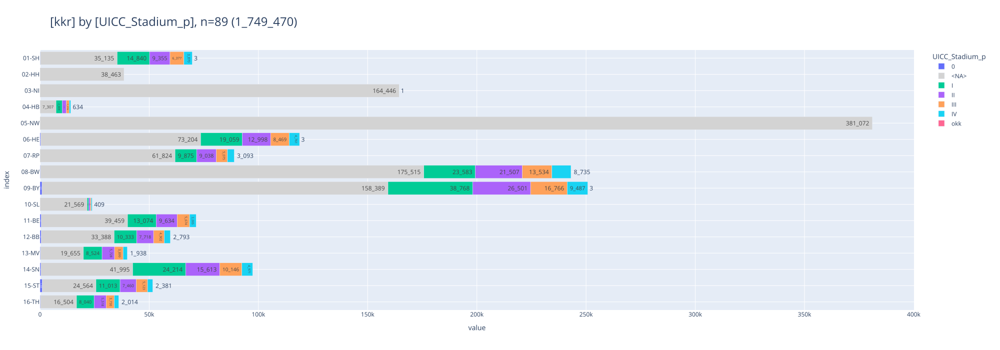
    

    
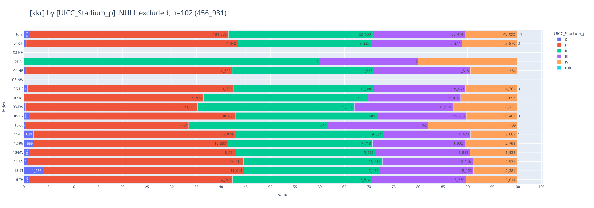
    

 

### [Diagnosesicherung](#toc0_)
- **Filter: `DJ` = 2020-2023**

> 💡 `NI`: _"Die Ausprägung **DCO als Diagnosesicherung** kommt im KKN-Datensatz nicht vor. Diese Information liegt bisher nur dem EKN vor und wird gegebenenfalls zur Anreicherung von Datenexporten fallspezifisch vom KKN beim EKN angefragt. Der Prozess zur automatisierten Übermittlung dieser Informationen vom EKN zum KKN ist in Planung"_

> 💡 `ZfKD`: _"aufgrund der verschiedenartigen Handhabung von DCO in den übermittelten Daten ist die Filterung nach DCO mit erheblicher Unschärfe verbunden"_

    
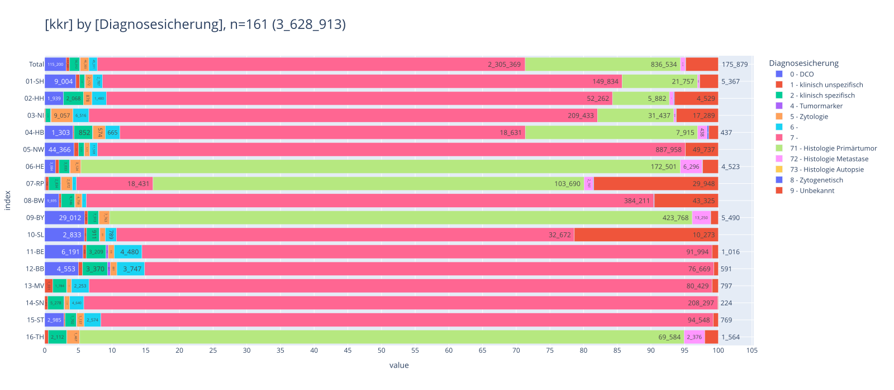
    

 

### [Geschlecht](#toc0_)
- Grundgesamtheit: Menge aller **Patienten** 
- **Filter: `DJ` = 2020-2023**

> 💡 `ZfKD`: _"Angaben zu Geschlecht ungleich `M` oder `W` sind sehr selten, diese Fälle werden nicht gesondert verarbeitet"_

    
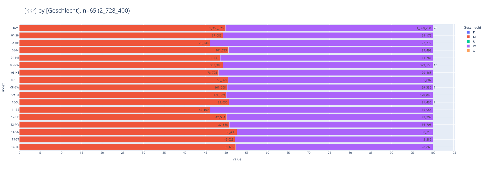
    

    Anzahl Ausprägungen <> M oder W im Gesamtdatensatz: {'D': 37, 'U': 212, 'X': 28}

 

### [Diagnosejahr](#toc0_)
- Filter: Top 5 Diagnosejahre
- Legende ist **absteigend sortiert nach Fallzahl im DJ**, Restkategorie `<other>` ist aufgeführt

    Anzahl 2024 Fälle: {'15-ST': 1917, '08-BW': 679, '06-HE': 844, '09-BY': 2233, '12-BB': 642, '13-MV': 2835, '11-BE': 509}

    
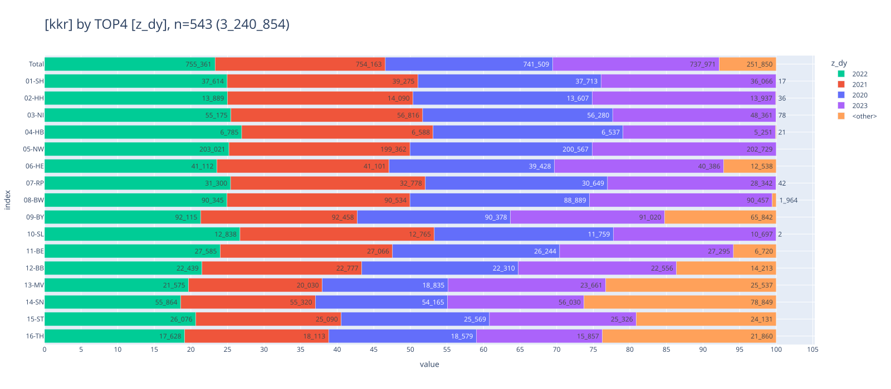
    

 

### [Inzidenzort vs Lieferregister](#toc0_)
- **Filter: keiner, Grundgesamtheit sind alle Fälle**
- vertikal: `Inzidenzort` (Zeile `00` bündelt alle Fälle mit ungültiger Ortsangabe). horizontal: `Lieferregister`
- Beispiel: `03-NI` liefert zu 100% Fälle aus dem Inzidenzort `03`, `13-MV` liefert 159 Fälle aus `03`
> 💡 `ZfKD`: _"angestrebt ist eine "Diagonale", möglichst nur noch Fallübermittlungen aus dem eigenen Einzugsgebiet, was inzwischen schon besser erreicht ist. Mindestens `99%` der Fälle stammen aus dem liefernden Register"_

<table id="T_f5c09">
  <thead>
    <tr>
      <th class="index_name level0" >kkr</th>
      <th id="T_f5c09_level0_col0" class="col_heading level0 col0" >01-SH</th>
      <th id="T_f5c09_level0_col1" class="col_heading level0 col1" >02-HH</th>
      <th id="T_f5c09_level0_col2" class="col_heading level0 col2" >03-NI</th>
      <th id="T_f5c09_level0_col3" class="col_heading level0 col3" >04-HB</th>
      <th id="T_f5c09_level0_col4" class="col_heading level0 col4" >05-NW</th>
      <th id="T_f5c09_level0_col5" class="col_heading level0 col5" >06-HE</th>
      <th id="T_f5c09_level0_col6" class="col_heading level0 col6" >07-RP</th>
      <th id="T_f5c09_level0_col7" class="col_heading level0 col7" >08-BW</th>
      <th id="T_f5c09_level0_col8" class="col_heading level0 col8" >09-BY</th>
      <th id="T_f5c09_level0_col9" class="col_heading level0 col9" >10-SL</th>
      <th id="T_f5c09_level0_col10" class="col_heading level0 col10" >11-BE</th>
      <th id="T_f5c09_level0_col11" class="col_heading level0 col11" >12-BB</th>
      <th id="T_f5c09_level0_col12" class="col_heading level0 col12" >13-MV</th>
      <th id="T_f5c09_level0_col13" class="col_heading level0 col13" >14-SN</th>
      <th id="T_f5c09_level0_col14" class="col_heading level0 col14" >15-ST</th>
      <th id="T_f5c09_level0_col15" class="col_heading level0 col15" >16-TH</th>
      <th id="T_f5c09_level0_col16" class="col_heading level0 col16" >Total</th>
    </tr>
    <tr>
      <th class="index_name level0" >ort</th>
      <th class="blank col0" >&nbsp;</th>
      <th class="blank col1" >&nbsp;</th>
      <th class="blank col2" >&nbsp;</th>
      <th class="blank col3" >&nbsp;</th>
      <th class="blank col4" >&nbsp;</th>
      <th class="blank col5" >&nbsp;</th>
      <th class="blank col6" >&nbsp;</th>
      <th class="blank col7" >&nbsp;</th>
      <th class="blank col8" >&nbsp;</th>
      <th class="blank col9" >&nbsp;</th>
      <th class="blank col10" >&nbsp;</th>
      <th class="blank col11" >&nbsp;</th>
      <th class="blank col12" >&nbsp;</th>
      <th class="blank col13" >&nbsp;</th>
      <th class="blank col14" >&nbsp;</th>
      <th class="blank col15" >&nbsp;</th>
      <th class="blank col16" >&nbsp;</th>
    </tr>
  </thead>
  <tbody>
    <tr>
      <th id="T_f5c09_level0_row0" class="row_heading level0 row0" >00</th>
      <td id="T_f5c09_row0_col0" class="data row0 col0" >0 </td>
      <td id="T_f5c09_row0_col1" class="data row0 col1" >0 </td>
      <td id="T_f5c09_row0_col2" class="data row0 col2" >0 </td>
      <td id="T_f5c09_row0_col3" class="data row0 col3" >0 </td>
      <td id="T_f5c09_row0_col4" class="data row0 col4" >0 </td>
      <td id="T_f5c09_row0_col5" class="data row0 col5" >1 (0.0%) </td>
      <td id="T_f5c09_row0_col6" class="data row0 col6" >0 </td>
      <td id="T_f5c09_row0_col7" class="data row0 col7" >0 </td>
      <td id="T_f5c09_row0_col8" class="data row0 col8" >4 (0.0%) </td>
      <td id="T_f5c09_row0_col9" class="data row0 col9" >0 </td>
      <td id="T_f5c09_row0_col10" class="data row0 col10" >1 (0.0%) </td>
      <td id="T_f5c09_row0_col11" class="data row0 col11" >36 (0.0%) </td>
      <td id="T_f5c09_row0_col12" class="data row0 col12" >497 (0.5%) </td>
      <td id="T_f5c09_row0_col13" class="data row0 col13" >0 </td>
      <td id="T_f5c09_row0_col14" class="data row0 col14" >0 </td>
      <td id="T_f5c09_row0_col15" class="data row0 col15" >0 </td>
      <td id="T_f5c09_row0_col16" class="data row0 col16" >539 (0.0%) </td>
    </tr>
    <tr>
      <th id="T_f5c09_level0_row1" class="row_heading level0 row1" >01</th>
      <td id="T_f5c09_row1_col0" class="data row1 col0" >150_685 (100.0%) </td>
      <td id="T_f5c09_row1_col1" class="data row1 col1" >0 </td>
      <td id="T_f5c09_row1_col2" class="data row1 col2" >0 </td>
      <td id="T_f5c09_row1_col3" class="data row1 col3" >0 </td>
      <td id="T_f5c09_row1_col4" class="data row1 col4" >0 </td>
      <td id="T_f5c09_row1_col5" class="data row1 col5" >0 </td>
      <td id="T_f5c09_row1_col6" class="data row1 col6" >0 </td>
      <td id="T_f5c09_row1_col7" class="data row1 col7" >0 </td>
      <td id="T_f5c09_row1_col8" class="data row1 col8" >0 </td>
      <td id="T_f5c09_row1_col9" class="data row1 col9" >0 </td>
      <td id="T_f5c09_row1_col10" class="data row1 col10" >0 </td>
      <td id="T_f5c09_row1_col11" class="data row1 col11" >7 (0.0%) </td>
      <td id="T_f5c09_row1_col12" class="data row1 col12" >29 (0.0%) </td>
      <td id="T_f5c09_row1_col13" class="data row1 col13" >1 (0.0%) </td>
      <td id="T_f5c09_row1_col14" class="data row1 col14" >0 </td>
      <td id="T_f5c09_row1_col15" class="data row1 col15" >0 </td>
      <td id="T_f5c09_row1_col16" class="data row1 col16" >150_722 (4.7%) </td>
    </tr>
    <tr>
      <th id="T_f5c09_level0_row2" class="row_heading level0 row2" >02</th>
      <td id="T_f5c09_row2_col0" class="data row2 col0" >0 </td>
      <td id="T_f5c09_row2_col1" class="data row2 col1" >55_559 (100.0%) </td>
      <td id="T_f5c09_row2_col2" class="data row2 col2" >0 </td>
      <td id="T_f5c09_row2_col3" class="data row2 col3" >0 </td>
      <td id="T_f5c09_row2_col4" class="data row2 col4" >0 </td>
      <td id="T_f5c09_row2_col5" class="data row2 col5" >0 </td>
      <td id="T_f5c09_row2_col6" class="data row2 col6" >0 </td>
      <td id="T_f5c09_row2_col7" class="data row2 col7" >0 </td>
      <td id="T_f5c09_row2_col8" class="data row2 col8" >0 </td>
      <td id="T_f5c09_row2_col9" class="data row2 col9" >0 </td>
      <td id="T_f5c09_row2_col10" class="data row2 col10" >0 </td>
      <td id="T_f5c09_row2_col11" class="data row2 col11" >0 </td>
      <td id="T_f5c09_row2_col12" class="data row2 col12" >2 (0.0%) </td>
      <td id="T_f5c09_row2_col13" class="data row2 col13" >4 (0.0%) </td>
      <td id="T_f5c09_row2_col14" class="data row2 col14" >0 </td>
      <td id="T_f5c09_row2_col15" class="data row2 col15" >0 </td>
      <td id="T_f5c09_row2_col16" class="data row2 col16" >55_565 (1.7%) </td>
    </tr>
    <tr>
      <th id="T_f5c09_level0_row3" class="row_heading level0 row3" >03</th>
      <td id="T_f5c09_row3_col0" class="data row3 col0" >0 </td>
      <td id="T_f5c09_row3_col1" class="data row3 col1" >0 </td>
      <td id="T_f5c09_row3_col2" class="data row3 col2" >216_710 (100.0%) </td>
      <td id="T_f5c09_row3_col3" class="data row3 col3" >0 </td>
      <td id="T_f5c09_row3_col4" class="data row3 col4" >0 </td>
      <td id="T_f5c09_row3_col5" class="data row3 col5" >238 (0.1%) </td>
      <td id="T_f5c09_row3_col6" class="data row3 col6" >0 </td>
      <td id="T_f5c09_row3_col7" class="data row3 col7" >0 </td>
      <td id="T_f5c09_row3_col8" class="data row3 col8" >0 </td>
      <td id="T_f5c09_row3_col9" class="data row3 col9" >0 </td>
      <td id="T_f5c09_row3_col10" class="data row3 col10" >1 (0.0%) </td>
      <td id="T_f5c09_row3_col11" class="data row3 col11" >0 </td>
      <td id="T_f5c09_row3_col12" class="data row3 col12" >226 (0.2%) </td>
      <td id="T_f5c09_row3_col13" class="data row3 col13" >3 (0.0%) </td>
      <td id="T_f5c09_row3_col14" class="data row3 col14" >0 </td>
      <td id="T_f5c09_row3_col15" class="data row3 col15" >0 </td>
      <td id="T_f5c09_row3_col16" class="data row3 col16" >217_178 (6.7%) </td>
    </tr>
    <tr>
      <th id="T_f5c09_level0_row4" class="row_heading level0 row4" >04</th>
      <td id="T_f5c09_row4_col0" class="data row4 col0" >0 </td>
      <td id="T_f5c09_row4_col1" class="data row4 col1" >0 </td>
      <td id="T_f5c09_row4_col2" class="data row4 col2" >0 </td>
      <td id="T_f5c09_row4_col3" class="data row4 col3" >25_182 (100.0%) </td>
      <td id="T_f5c09_row4_col4" class="data row4 col4" >0 </td>
      <td id="T_f5c09_row4_col5" class="data row4 col5" >0 </td>
      <td id="T_f5c09_row4_col6" class="data row4 col6" >0 </td>
      <td id="T_f5c09_row4_col7" class="data row4 col7" >0 </td>
      <td id="T_f5c09_row4_col8" class="data row4 col8" >0 </td>
      <td id="T_f5c09_row4_col9" class="data row4 col9" >0 </td>
      <td id="T_f5c09_row4_col10" class="data row4 col10" >0 </td>
      <td id="T_f5c09_row4_col11" class="data row4 col11" >0 </td>
      <td id="T_f5c09_row4_col12" class="data row4 col12" >0 </td>
      <td id="T_f5c09_row4_col13" class="data row4 col13" >0 </td>
      <td id="T_f5c09_row4_col14" class="data row4 col14" >0 </td>
      <td id="T_f5c09_row4_col15" class="data row4 col15" >0 </td>
      <td id="T_f5c09_row4_col16" class="data row4 col16" >25_182 (0.8%) </td>
    </tr>
    <tr>
      <th id="T_f5c09_level0_row5" class="row_heading level0 row5" >05</th>
      <td id="T_f5c09_row5_col0" class="data row5 col0" >0 </td>
      <td id="T_f5c09_row5_col1" class="data row5 col1" >0 </td>
      <td id="T_f5c09_row5_col2" class="data row5 col2" >0 </td>
      <td id="T_f5c09_row5_col3" class="data row5 col3" >0 </td>
      <td id="T_f5c09_row5_col4" class="data row5 col4" >805_679 (100.0%) </td>
      <td id="T_f5c09_row5_col5" class="data row5 col5" >100 (0.1%) </td>
      <td id="T_f5c09_row5_col6" class="data row5 col6" >0 </td>
      <td id="T_f5c09_row5_col7" class="data row5 col7" >0 </td>
      <td id="T_f5c09_row5_col8" class="data row5 col8" >0 </td>
      <td id="T_f5c09_row5_col9" class="data row5 col9" >0 </td>
      <td id="T_f5c09_row5_col10" class="data row5 col10" >0 </td>
      <td id="T_f5c09_row5_col11" class="data row5 col11" >1 (0.0%) </td>
      <td id="T_f5c09_row5_col12" class="data row5 col12" >0 </td>
      <td id="T_f5c09_row5_col13" class="data row5 col13" >8 (0.0%) </td>
      <td id="T_f5c09_row5_col14" class="data row5 col14" >0 </td>
      <td id="T_f5c09_row5_col15" class="data row5 col15" >0 </td>
      <td id="T_f5c09_row5_col16" class="data row5 col16" >805_788 (24.9%) </td>
    </tr>
    <tr>
      <th id="T_f5c09_level0_row6" class="row_heading level0 row6" >06</th>
      <td id="T_f5c09_row6_col0" class="data row6 col0" >0 </td>
      <td id="T_f5c09_row6_col1" class="data row6 col1" >0 </td>
      <td id="T_f5c09_row6_col2" class="data row6 col2" >0 </td>
      <td id="T_f5c09_row6_col3" class="data row6 col3" >0 </td>
      <td id="T_f5c09_row6_col4" class="data row6 col4" >0 </td>
      <td id="T_f5c09_row6_col5" class="data row6 col5" >174_121 (99.7%) </td>
      <td id="T_f5c09_row6_col6" class="data row6 col6" >0 </td>
      <td id="T_f5c09_row6_col7" class="data row6 col7" >0 </td>
      <td id="T_f5c09_row6_col8" class="data row6 col8" >1 (0.0%) </td>
      <td id="T_f5c09_row6_col9" class="data row6 col9" >0 </td>
      <td id="T_f5c09_row6_col10" class="data row6 col10" >0 </td>
      <td id="T_f5c09_row6_col11" class="data row6 col11" >0 </td>
      <td id="T_f5c09_row6_col12" class="data row6 col12" >0 </td>
      <td id="T_f5c09_row6_col13" class="data row6 col13" >8 (0.0%) </td>
      <td id="T_f5c09_row6_col14" class="data row6 col14" >78 (0.1%) </td>
      <td id="T_f5c09_row6_col15" class="data row6 col15" >0 </td>
      <td id="T_f5c09_row6_col16" class="data row6 col16" >174_208 (5.4%) </td>
    </tr>
    <tr>
      <th id="T_f5c09_level0_row7" class="row_heading level0 row7" >07</th>
      <td id="T_f5c09_row7_col0" class="data row7 col0" >0 </td>
      <td id="T_f5c09_row7_col1" class="data row7 col1" >0 </td>
      <td id="T_f5c09_row7_col2" class="data row7 col2" >0 </td>
      <td id="T_f5c09_row7_col3" class="data row7 col3" >0 </td>
      <td id="T_f5c09_row7_col4" class="data row7 col4" >0 </td>
      <td id="T_f5c09_row7_col5" class="data row7 col5" >3 (0.0%) </td>
      <td id="T_f5c09_row7_col6" class="data row7 col6" >123_111 (100.0%) </td>
      <td id="T_f5c09_row7_col7" class="data row7 col7" >0 </td>
      <td id="T_f5c09_row7_col8" class="data row7 col8" >1 (0.0%) </td>
      <td id="T_f5c09_row7_col9" class="data row7 col9" >0 </td>
      <td id="T_f5c09_row7_col10" class="data row7 col10" >0 </td>
      <td id="T_f5c09_row7_col11" class="data row7 col11" >0 </td>
      <td id="T_f5c09_row7_col12" class="data row7 col12" >0 </td>
      <td id="T_f5c09_row7_col13" class="data row7 col13" >4 (0.0%) </td>
      <td id="T_f5c09_row7_col14" class="data row7 col14" >0 </td>
      <td id="T_f5c09_row7_col15" class="data row7 col15" >0 </td>
      <td id="T_f5c09_row7_col16" class="data row7 col16" >123_119 (3.8%) </td>
    </tr>
    <tr>
      <th id="T_f5c09_level0_row8" class="row_heading level0 row8" >08</th>
      <td id="T_f5c09_row8_col0" class="data row8 col0" >0 </td>
      <td id="T_f5c09_row8_col1" class="data row8 col1" >0 </td>
      <td id="T_f5c09_row8_col2" class="data row8 col2" >0 </td>
      <td id="T_f5c09_row8_col3" class="data row8 col3" >0 </td>
      <td id="T_f5c09_row8_col4" class="data row8 col4" >0 </td>
      <td id="T_f5c09_row8_col5" class="data row8 col5" >10 (0.0%) </td>
      <td id="T_f5c09_row8_col6" class="data row8 col6" >0 </td>
      <td id="T_f5c09_row8_col7" class="data row8 col7" >362_189 (100.0%) </td>
      <td id="T_f5c09_row8_col8" class="data row8 col8" >269 (0.1%) </td>
      <td id="T_f5c09_row8_col9" class="data row8 col9" >0 </td>
      <td id="T_f5c09_row8_col10" class="data row8 col10" >0 </td>
      <td id="T_f5c09_row8_col11" class="data row8 col11" >0 </td>
      <td id="T_f5c09_row8_col12" class="data row8 col12" >6 (0.0%) </td>
      <td id="T_f5c09_row8_col13" class="data row8 col13" >6 (0.0%) </td>
      <td id="T_f5c09_row8_col14" class="data row8 col14" >0 </td>
      <td id="T_f5c09_row8_col15" class="data row8 col15" >0 </td>
      <td id="T_f5c09_row8_col16" class="data row8 col16" >362_480 (11.2%) </td>
    </tr>
    <tr>
      <th id="T_f5c09_level0_row9" class="row_heading level0 row9" >09</th>
      <td id="T_f5c09_row9_col0" class="data row9 col0" >0 </td>
      <td id="T_f5c09_row9_col1" class="data row9 col1" >0 </td>
      <td id="T_f5c09_row9_col2" class="data row9 col2" >0 </td>
      <td id="T_f5c09_row9_col3" class="data row9 col3" >0 </td>
      <td id="T_f5c09_row9_col4" class="data row9 col4" >0 </td>
      <td id="T_f5c09_row9_col5" class="data row9 col5" >90 (0.1%) </td>
      <td id="T_f5c09_row9_col6" class="data row9 col6" >0 </td>
      <td id="T_f5c09_row9_col7" class="data row9 col7" >0 </td>
      <td id="T_f5c09_row9_col8" class="data row9 col8" >431_537 (99.9%) </td>
      <td id="T_f5c09_row9_col9" class="data row9 col9" >0 </td>
      <td id="T_f5c09_row9_col10" class="data row9 col10" >8 (0.0%) </td>
      <td id="T_f5c09_row9_col11" class="data row9 col11" >15 (0.0%) </td>
      <td id="T_f5c09_row9_col12" class="data row9 col12" >5 (0.0%) </td>
      <td id="T_f5c09_row9_col13" class="data row9 col13" >25 (0.0%) </td>
      <td id="T_f5c09_row9_col14" class="data row9 col14" >0 </td>
      <td id="T_f5c09_row9_col15" class="data row9 col15" >0 </td>
      <td id="T_f5c09_row9_col16" class="data row9 col16" >431_680 (13.3%) </td>
    </tr>
    <tr>
      <th id="T_f5c09_level0_row10" class="row_heading level0 row10" >10</th>
      <td id="T_f5c09_row10_col0" class="data row10 col0" >0 </td>
      <td id="T_f5c09_row10_col1" class="data row10 col1" >0 </td>
      <td id="T_f5c09_row10_col2" class="data row10 col2" >0 </td>
      <td id="T_f5c09_row10_col3" class="data row10 col3" >0 </td>
      <td id="T_f5c09_row10_col4" class="data row10 col4" >0 </td>
      <td id="T_f5c09_row10_col5" class="data row10 col5" >0 </td>
      <td id="T_f5c09_row10_col6" class="data row10 col6" >0 </td>
      <td id="T_f5c09_row10_col7" class="data row10 col7" >0 </td>
      <td id="T_f5c09_row10_col8" class="data row10 col8" >0 </td>
      <td id="T_f5c09_row10_col9" class="data row10 col9" >48_061 (100.0%) </td>
      <td id="T_f5c09_row10_col10" class="data row10 col10" >0 </td>
      <td id="T_f5c09_row10_col11" class="data row10 col11" >0 </td>
      <td id="T_f5c09_row10_col12" class="data row10 col12" >2 (0.0%) </td>
      <td id="T_f5c09_row10_col13" class="data row10 col13" >0 </td>
      <td id="T_f5c09_row10_col14" class="data row10 col14" >0 </td>
      <td id="T_f5c09_row10_col15" class="data row10 col15" >0 </td>
      <td id="T_f5c09_row10_col16" class="data row10 col16" >48_063 (1.5%) </td>
    </tr>
    <tr>
      <th id="T_f5c09_level0_row11" class="row_heading level0 row11" >11</th>
      <td id="T_f5c09_row11_col0" class="data row11 col0" >0 </td>
      <td id="T_f5c09_row11_col1" class="data row11 col1" >0 </td>
      <td id="T_f5c09_row11_col2" class="data row11 col2" >0 </td>
      <td id="T_f5c09_row11_col3" class="data row11 col3" >0 </td>
      <td id="T_f5c09_row11_col4" class="data row11 col4" >0 </td>
      <td id="T_f5c09_row11_col5" class="data row11 col5" >0 </td>
      <td id="T_f5c09_row11_col6" class="data row11 col6" >0 </td>
      <td id="T_f5c09_row11_col7" class="data row11 col7" >0 </td>
      <td id="T_f5c09_row11_col8" class="data row11 col8" >0 </td>
      <td id="T_f5c09_row11_col9" class="data row11 col9" >0 </td>
      <td id="T_f5c09_row11_col10" class="data row11 col10" >114_554 (99.7%) </td>
      <td id="T_f5c09_row11_col11" class="data row11 col11" >4 (0.0%) </td>
      <td id="T_f5c09_row11_col12" class="data row11 col12" >1 (0.0%) </td>
      <td id="T_f5c09_row11_col13" class="data row11 col13" >4 (0.0%) </td>
      <td id="T_f5c09_row11_col14" class="data row11 col14" >0 </td>
      <td id="T_f5c09_row11_col15" class="data row11 col15" >0 </td>
      <td id="T_f5c09_row11_col16" class="data row11 col16" >114_563 (3.5%) </td>
    </tr>
    <tr>
      <th id="T_f5c09_level0_row12" class="row_heading level0 row12" >12</th>
      <td id="T_f5c09_row12_col0" class="data row12 col0" >0 </td>
      <td id="T_f5c09_row12_col1" class="data row12 col1" >0 </td>
      <td id="T_f5c09_row12_col2" class="data row12 col2" >0 </td>
      <td id="T_f5c09_row12_col3" class="data row12 col3" >0 </td>
      <td id="T_f5c09_row12_col4" class="data row12 col4" >0 </td>
      <td id="T_f5c09_row12_col5" class="data row12 col5" >0 </td>
      <td id="T_f5c09_row12_col6" class="data row12 col6" >0 </td>
      <td id="T_f5c09_row12_col7" class="data row12 col7" >0 </td>
      <td id="T_f5c09_row12_col8" class="data row12 col8" >0 </td>
      <td id="T_f5c09_row12_col9" class="data row12 col9" >0 </td>
      <td id="T_f5c09_row12_col10" class="data row12 col10" >345 (0.3%) </td>
      <td id="T_f5c09_row12_col11" class="data row12 col11" >104_155 (99.9%) </td>
      <td id="T_f5c09_row12_col12" class="data row12 col12" >375 (0.3%) </td>
      <td id="T_f5c09_row12_col13" class="data row12 col13" >12 (0.0%) </td>
      <td id="T_f5c09_row12_col14" class="data row12 col14" >0 </td>
      <td id="T_f5c09_row12_col15" class="data row12 col15" >0 </td>
      <td id="T_f5c09_row12_col16" class="data row12 col16" >104_887 (3.2%) </td>
    </tr>
    <tr>
      <th id="T_f5c09_level0_row13" class="row_heading level0 row13" >13</th>
      <td id="T_f5c09_row13_col0" class="data row13 col0" >0 </td>
      <td id="T_f5c09_row13_col1" class="data row13 col1" >0 </td>
      <td id="T_f5c09_row13_col2" class="data row13 col2" >0 </td>
      <td id="T_f5c09_row13_col3" class="data row13 col3" >0 </td>
      <td id="T_f5c09_row13_col4" class="data row13 col4" >0 </td>
      <td id="T_f5c09_row13_col5" class="data row13 col5" >0 </td>
      <td id="T_f5c09_row13_col6" class="data row13 col6" >0 </td>
      <td id="T_f5c09_row13_col7" class="data row13 col7" >0 </td>
      <td id="T_f5c09_row13_col8" class="data row13 col8" >0 </td>
      <td id="T_f5c09_row13_col9" class="data row13 col9" >0 </td>
      <td id="T_f5c09_row13_col10" class="data row13 col10" >0 </td>
      <td id="T_f5c09_row13_col11" class="data row13 col11" >26 (0.0%) </td>
      <td id="T_f5c09_row13_col12" class="data row13 col12" >107_984 (98.9%) </td>
      <td id="T_f5c09_row13_col13" class="data row13 col13" >1 (0.0%) </td>
      <td id="T_f5c09_row13_col14" class="data row13 col14" >0 </td>
      <td id="T_f5c09_row13_col15" class="data row13 col15" >0 </td>
      <td id="T_f5c09_row13_col16" class="data row13 col16" >108_011 (3.3%) </td>
    </tr>
    <tr>
      <th id="T_f5c09_level0_row14" class="row_heading level0 row14" >14</th>
      <td id="T_f5c09_row14_col0" class="data row14 col0" >0 </td>
      <td id="T_f5c09_row14_col1" class="data row14 col1" >0 </td>
      <td id="T_f5c09_row14_col2" class="data row14 col2" >0 </td>
      <td id="T_f5c09_row14_col3" class="data row14 col3" >0 </td>
      <td id="T_f5c09_row14_col4" class="data row14 col4" >0 </td>
      <td id="T_f5c09_row14_col5" class="data row14 col5" >0 </td>
      <td id="T_f5c09_row14_col6" class="data row14 col6" >0 </td>
      <td id="T_f5c09_row14_col7" class="data row14 col7" >0 </td>
      <td id="T_f5c09_row14_col8" class="data row14 col8" >0 </td>
      <td id="T_f5c09_row14_col9" class="data row14 col9" >0 </td>
      <td id="T_f5c09_row14_col10" class="data row14 col10" >0 </td>
      <td id="T_f5c09_row14_col11" class="data row14 col11" >1 (0.0%) </td>
      <td id="T_f5c09_row14_col12" class="data row14 col12" >2 (0.0%) </td>
      <td id="T_f5c09_row14_col13" class="data row14 col13" >300_118 (100.0%) </td>
      <td id="T_f5c09_row14_col14" class="data row14 col14" >0 </td>
      <td id="T_f5c09_row14_col15" class="data row14 col15" >0 </td>
      <td id="T_f5c09_row14_col16" class="data row14 col16" >300_121 (9.3%) </td>
    </tr>
    <tr>
      <th id="T_f5c09_level0_row15" class="row_heading level0 row15" >15</th>
      <td id="T_f5c09_row15_col0" class="data row15 col0" >0 </td>
      <td id="T_f5c09_row15_col1" class="data row15 col1" >0 </td>
      <td id="T_f5c09_row15_col2" class="data row15 col2" >0 </td>
      <td id="T_f5c09_row15_col3" class="data row15 col3" >0 </td>
      <td id="T_f5c09_row15_col4" class="data row15 col4" >0 </td>
      <td id="T_f5c09_row15_col5" class="data row15 col5" >0 </td>
      <td id="T_f5c09_row15_col6" class="data row15 col6" >0 </td>
      <td id="T_f5c09_row15_col7" class="data row15 col7" >0 </td>
      <td id="T_f5c09_row15_col8" class="data row15 col8" >0 </td>
      <td id="T_f5c09_row15_col9" class="data row15 col9" >0 </td>
      <td id="T_f5c09_row15_col10" class="data row15 col10" >0 </td>
      <td id="T_f5c09_row15_col11" class="data row15 col11" >50 (0.0%) </td>
      <td id="T_f5c09_row15_col12" class="data row15 col12" >12 (0.0%) </td>
      <td id="T_f5c09_row15_col13" class="data row15 col13" >17 (0.0%) </td>
      <td id="T_f5c09_row15_col14" class="data row15 col14" >126_114 (99.9%) </td>
      <td id="T_f5c09_row15_col15" class="data row15 col15" >0 </td>
      <td id="T_f5c09_row15_col16" class="data row15 col16" >126_193 (3.9%) </td>
    </tr>
    <tr>
      <th id="T_f5c09_level0_row16" class="row_heading level0 row16" >16</th>
      <td id="T_f5c09_row16_col0" class="data row16 col0" >0 </td>
      <td id="T_f5c09_row16_col1" class="data row16 col1" >0 </td>
      <td id="T_f5c09_row16_col2" class="data row16 col2" >0 </td>
      <td id="T_f5c09_row16_col3" class="data row16 col3" >0 </td>
      <td id="T_f5c09_row16_col4" class="data row16 col4" >0 </td>
      <td id="T_f5c09_row16_col5" class="data row16 col5" >1 (0.0%) </td>
      <td id="T_f5c09_row16_col6" class="data row16 col6" >0 </td>
      <td id="T_f5c09_row16_col7" class="data row16 col7" >0 </td>
      <td id="T_f5c09_row16_col8" class="data row16 col8" >1 (0.0%) </td>
      <td id="T_f5c09_row16_col9" class="data row16 col9" >0 </td>
      <td id="T_f5c09_row16_col10" class="data row16 col10" >1 (0.0%) </td>
      <td id="T_f5c09_row16_col11" class="data row16 col11" >0 </td>
      <td id="T_f5c09_row16_col12" class="data row16 col12" >0 </td>
      <td id="T_f5c09_row16_col13" class="data row16 col13" >17 (0.0%) </td>
      <td id="T_f5c09_row16_col14" class="data row16 col14" >0 </td>
      <td id="T_f5c09_row16_col15" class="data row16 col15" >92_037 (100.0%) </td>
      <td id="T_f5c09_row16_col16" class="data row16 col16" >92_057 (2.8%) </td>
    </tr>
    <tr>
      <th id="T_f5c09_level0_row17" class="row_heading level0 row17" >Total</th>
      <td id="T_f5c09_row17_col0" class="data row17 col0" >150_685 (100.0%) </td>
      <td id="T_f5c09_row17_col1" class="data row17 col1" >55_559 (100.0%) </td>
      <td id="T_f5c09_row17_col2" class="data row17 col2" >216_710 (100.0%) </td>
      <td id="T_f5c09_row17_col3" class="data row17 col3" >25_182 (100.0%) </td>
      <td id="T_f5c09_row17_col4" class="data row17 col4" >805_679 (100.0%) </td>
      <td id="T_f5c09_row17_col5" class="data row17 col5" >174_564 (100.0%) </td>
      <td id="T_f5c09_row17_col6" class="data row17 col6" >123_111 (100.0%) </td>
      <td id="T_f5c09_row17_col7" class="data row17 col7" >362_189 (100.0%) </td>
      <td id="T_f5c09_row17_col8" class="data row17 col8" >431_813 (100.0%) </td>
      <td id="T_f5c09_row17_col9" class="data row17 col9" >48_061 (100.0%) </td>
      <td id="T_f5c09_row17_col10" class="data row17 col10" >114_910 (100.0%) </td>
      <td id="T_f5c09_row17_col11" class="data row17 col11" >104_295 (100.0%) </td>
      <td id="T_f5c09_row17_col12" class="data row17 col12" >109_141 (100.0%) </td>
      <td id="T_f5c09_row17_col13" class="data row17 col13" >300_228 (100.0%) </td>
      <td id="T_f5c09_row17_col14" class="data row17 col14" >126_192 (100.0%) </td>
      <td id="T_f5c09_row17_col15" class="data row17 col15" >92_037 (100.0%) </td>
      <td id="T_f5c09_row17_col16" class="data row17 col16" >3_240_356 (100.0%) </td>
    </tr>
  </tbody>
</table>

 

### [ICD10 Gruppen](#toc0_)
- die verwendete ICD10 Skala entspricht der Darstellung aus *"Krebs in Deutschland"*
> 💡 `NI`: _"Für nicht-melanozytäre Hautkrebsarten bestimmter Histologien sowie fortgeschrittene Plattenepithelkarzinome gilt ab dem 20. September 2023 eine geänderte Meldepflicht. Erst seit diesem Zeitpunkt sind die prognostisch ungünstigen Hauttumore **(C44)** an das KKN zu melden und kommen daher im gelieferten Datensatz bisher nicht vor. In den nächsten Lieferungen werden diese Daten enthalten sein"_

    
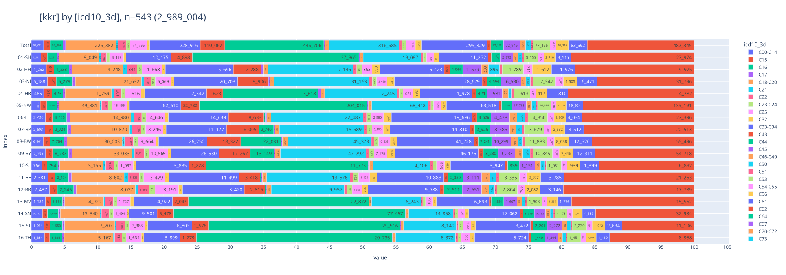
    

 

### [Verstorben](#toc0_)

- **Filter: `DJ` = 2020-2023, `DCO` = N, `ICD10` != C44**

    
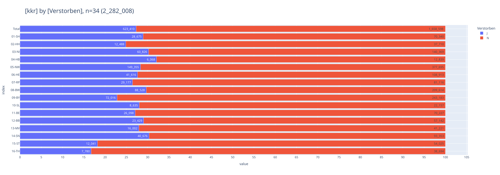
    

 

### [TNM-T (p)](#toc0_)
- **Filter: `DJ` = 2020-2023, `DCO` = N, `ICD10` nur solide Tumoren** (_solide Tumoren_ schliesst folgende Diagnosen _aus_: C44, C70-C72, C76-C97, alle D)

    
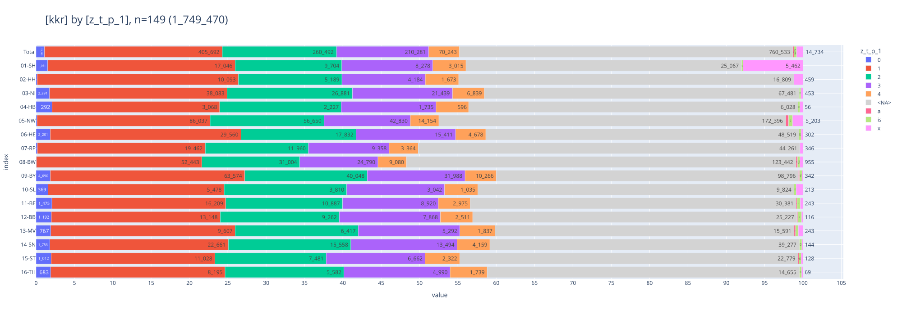
    

 

### [TNM-N (p)](#toc0_)
- **Filter: `DJ` = 2020-2023, `DCO` = N, `ICD10` nur solide Tumoren** (_solide Tumoren_ schliesst folgende Diagnosen _aus_: C44, C70-C72, C76-C97, alle D)

    
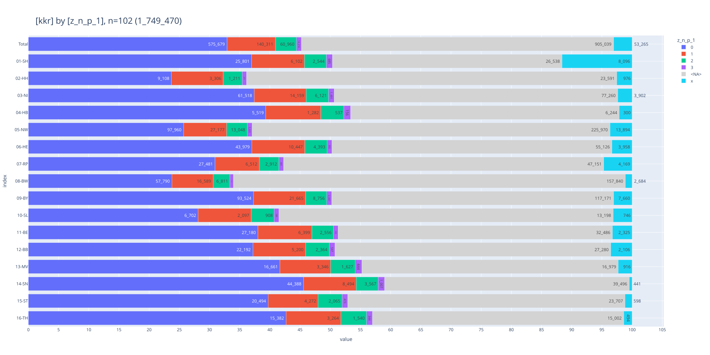
    

 

### [TNM-M (p)](#toc0_)
- **Filter: `DJ` = 2020-2023, `DCO` = N, `ICD10` nur solide Tumoren**

> 💡 `ZfKD`: _"pM0 und pMX sind nach TNM Manual keine anwendbaren Kodierungen"_

    
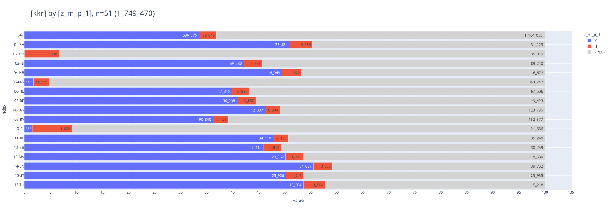
    

 

### [TNM-Auflage (p)](#toc0_)

- **Filter: `DJ` = 2020-2023**

    
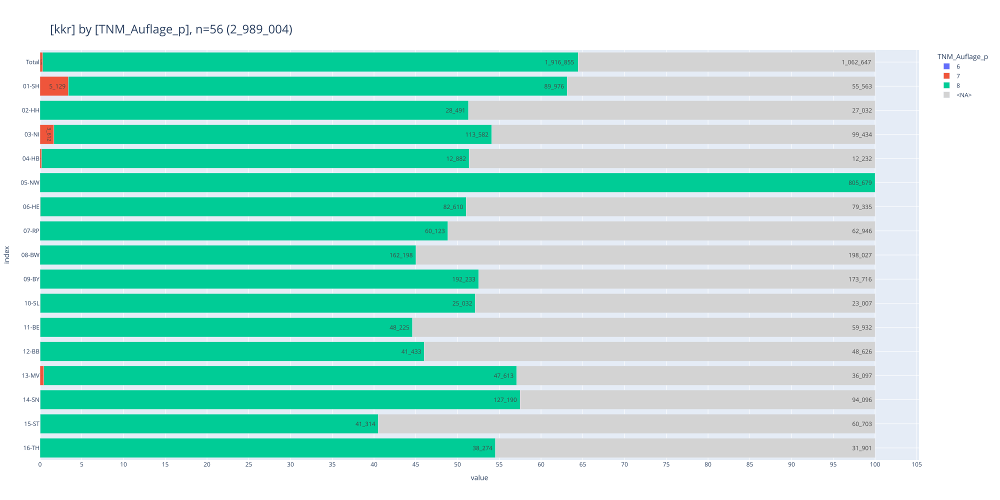
    

 

### [Todesursachen (TU)](#toc0_)

#### [nach ICD10 Einstellern](#toc0_)
- gezählt sind die ersten Stellen aller TU Codes ohne jeglichen Filter

    
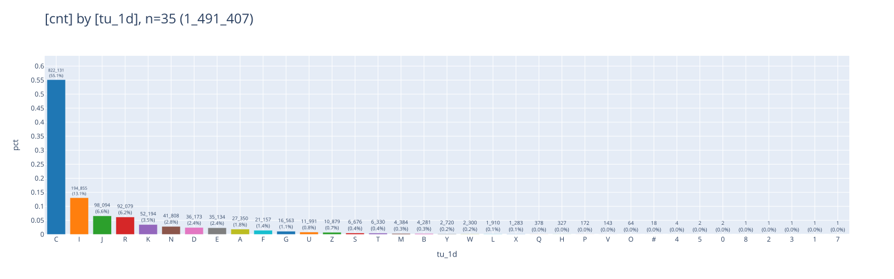
    

#### [nach Sterbejahr und Todesursachen](#toc0_)
- gezählt werden **Personen**
- **Filter: `SJ`= 2020-2023, `Verstorben` = J**
- `tu_type` Art der TU pro Patient
  - `<NA>` keine Todesursache
  - `C` Todesursache Cxx
  - `<other>` andere Todesursache

> 💡 `ZfKD`: _"`03-NI` und `06-HE` übermitteln deutlich weniger Todesursachen asl in den epi Daten, für `07-RP` ist der Anteil in beiden Datenräumen gering. Für `15-ST` sind auffällig wenige Todesfälle in 2023 übermittelt."_

    

    

 

#### [nach hat_todesursache bei Nicht-Verstorbenen](#toc0_)
- gezählt werden **Personen**
- **Filter: `Verstorben` = N**

> 💡 `HH`: _"Da haben wir jetzt gesehen, dass es an dem Überhang-Konstrukt liegt. Da handelt es sich um Patienten, die im Datenlieferungszeitraum <31.12.2022 noch gelebt haben, aber dann innerhalb des Zeitraums zur Erstellung des Datensatzes (01.02.2024) verstorben sind. Da passen wir unseren Datenexport noch einmal an."_

<table id="T_0ce2b">
  <thead>
    <tr>
      <th class="index_name level0" >kkr</th>
      <th id="T_0ce2b_level0_col0" class="col_heading level0 col0" >01-SH</th>
      <th id="T_0ce2b_level0_col1" class="col_heading level0 col1" >02-HH</th>
      <th id="T_0ce2b_level0_col2" class="col_heading level0 col2" >03-NI</th>
      <th id="T_0ce2b_level0_col3" class="col_heading level0 col3" >04-HB</th>
      <th id="T_0ce2b_level0_col4" class="col_heading level0 col4" >05-NW</th>
      <th id="T_0ce2b_level0_col5" class="col_heading level0 col5" >06-HE</th>
      <th id="T_0ce2b_level0_col6" class="col_heading level0 col6" >07-RP</th>
      <th id="T_0ce2b_level0_col7" class="col_heading level0 col7" >08-BW</th>
      <th id="T_0ce2b_level0_col8" class="col_heading level0 col8" >09-BY</th>
      <th id="T_0ce2b_level0_col9" class="col_heading level0 col9" >10-SL</th>
      <th id="T_0ce2b_level0_col10" class="col_heading level0 col10" >11-BE</th>
      <th id="T_0ce2b_level0_col11" class="col_heading level0 col11" >12-BB</th>
      <th id="T_0ce2b_level0_col12" class="col_heading level0 col12" >13-MV</th>
      <th id="T_0ce2b_level0_col13" class="col_heading level0 col13" >14-SN</th>
      <th id="T_0ce2b_level0_col14" class="col_heading level0 col14" >15-ST</th>
      <th id="T_0ce2b_level0_col15" class="col_heading level0 col15" >16-TH</th>
      <th id="T_0ce2b_level0_col16" class="col_heading level0 col16" >Total</th>
    </tr>
  </thead>
  <tbody>
    <tr>
      <th id="T_0ce2b_level0_row0" class="row_heading level0 row0" >has_tu</th>
      <td id="T_0ce2b_row0_col0" class="data row0 col0" >0 </td>
      <td id="T_0ce2b_row0_col1" class="data row0 col1" >980 </td>
      <td id="T_0ce2b_row0_col2" class="data row0 col2" >0 </td>
      <td id="T_0ce2b_row0_col3" class="data row0 col3" >0 </td>
      <td id="T_0ce2b_row0_col4" class="data row0 col4" >0 </td>
      <td id="T_0ce2b_row0_col5" class="data row0 col5" >0 </td>
      <td id="T_0ce2b_row0_col6" class="data row0 col6" >0 </td>
      <td id="T_0ce2b_row0_col7" class="data row0 col7" >0 </td>
      <td id="T_0ce2b_row0_col8" class="data row0 col8" >1 </td>
      <td id="T_0ce2b_row0_col9" class="data row0 col9" >8 </td>
      <td id="T_0ce2b_row0_col10" class="data row0 col10" >1 </td>
      <td id="T_0ce2b_row0_col11" class="data row0 col11" >5 </td>
      <td id="T_0ce2b_row0_col12" class="data row0 col12" >472 </td>
      <td id="T_0ce2b_row0_col13" class="data row0 col13" >0 </td>
      <td id="T_0ce2b_row0_col14" class="data row0 col14" >0 </td>
      <td id="T_0ce2b_row0_col15" class="data row0 col15" >3 </td>
      <td id="T_0ce2b_row0_col16" class="data row0 col16" >0 </td>
    </tr>
  </tbody>
</table>

 

#### [nach ICD10 Dreistellern (TOP 5)](#toc0_)
- Grundgesamtheit: alle **Todesursachen**, kein Filter

> 💡 `ZfKD`: _"enthalten sind in einigen KKR auch `C79` (Metastasen), welche in offizieller Todesursachen-Statistik nicht kodiert sind"_

<table id="T_4281e">
  <thead>
    <tr>
      <th class="index_name level0" >kkr</th>
      <th id="T_4281e_level0_col0" class="col_heading level0 col0" >01-SH</th>
      <th id="T_4281e_level0_col1" class="col_heading level0 col1" >02-HH</th>
      <th id="T_4281e_level0_col2" class="col_heading level0 col2" >03-NI</th>
      <th id="T_4281e_level0_col3" class="col_heading level0 col3" >04-HB</th>
      <th id="T_4281e_level0_col4" class="col_heading level0 col4" >05-NW</th>
      <th id="T_4281e_level0_col5" class="col_heading level0 col5" >06-HE</th>
      <th id="T_4281e_level0_col6" class="col_heading level0 col6" >07-RP</th>
      <th id="T_4281e_level0_col7" class="col_heading level0 col7" >08-BW</th>
      <th id="T_4281e_level0_col8" class="col_heading level0 col8" >09-BY</th>
      <th id="T_4281e_level0_col9" class="col_heading level0 col9" >10-SL</th>
      <th id="T_4281e_level0_col10" class="col_heading level0 col10" >11-BE</th>
      <th id="T_4281e_level0_col11" class="col_heading level0 col11" >12-BB</th>
      <th id="T_4281e_level0_col12" class="col_heading level0 col12" >13-MV</th>
      <th id="T_4281e_level0_col13" class="col_heading level0 col13" >14-SN</th>
      <th id="T_4281e_level0_col14" class="col_heading level0 col14" >15-ST</th>
      <th id="T_4281e_level0_col15" class="col_heading level0 col15" >16-TH</th>
      <th id="T_4281e_level0_col16" class="col_heading level0 col16" >Total</th>
    </tr>
    <tr>
      <th class="index_name level0" >tu_3d</th>
      <th class="blank col0" >&nbsp;</th>
      <th class="blank col1" >&nbsp;</th>
      <th class="blank col2" >&nbsp;</th>
      <th class="blank col3" >&nbsp;</th>
      <th class="blank col4" >&nbsp;</th>
      <th class="blank col5" >&nbsp;</th>
      <th class="blank col6" >&nbsp;</th>
      <th class="blank col7" >&nbsp;</th>
      <th class="blank col8" >&nbsp;</th>
      <th class="blank col9" >&nbsp;</th>
      <th class="blank col10" >&nbsp;</th>
      <th class="blank col11" >&nbsp;</th>
      <th class="blank col12" >&nbsp;</th>
      <th class="blank col13" >&nbsp;</th>
      <th class="blank col14" >&nbsp;</th>
      <th class="blank col15" >&nbsp;</th>
      <th class="blank col16" >&nbsp;</th>
    </tr>
  </thead>
  <tbody>
    <tr>
      <th id="T_4281e_level0_row0" class="row_heading level0 row0" >C18</th>
      <td id="T_4281e_row0_col0" class="data row0 col0" >974 </td>
      <td id="T_4281e_row0_col1" class="data row0 col1" >794 </td>
      <td id="T_4281e_row0_col2" class="data row0 col2" >15 </td>
      <td id="T_4281e_row0_col3" class="data row0 col3" >259 </td>
      <td id="T_4281e_row0_col4" class="data row0 col4" >8_683 </td>
      <td id="T_4281e_row0_col5" class="data row0 col5" >121 </td>
      <td id="T_4281e_row0_col6" class="data row0 col6" >257 </td>
      <td id="T_4281e_row0_col7" class="data row0 col7" >4_522 </td>
      <td id="T_4281e_row0_col8" class="data row0 col8" >5_709 </td>
      <td id="T_4281e_row0_col9" class="data row0 col9" >520 </td>
      <td id="T_4281e_row0_col10" class="data row0 col10" >1_862 </td>
      <td id="T_4281e_row0_col11" class="data row0 col11" >1_765 </td>
      <td id="T_4281e_row0_col12" class="data row0 col12" >924 </td>
      <td id="T_4281e_row0_col13" class="data row0 col13" >3_038 </td>
      <td id="T_4281e_row0_col14" class="data row0 col14" >746 </td>
      <td id="T_4281e_row0_col15" class="data row0 col15" >363 </td>
      <td id="T_4281e_row0_col16" class="data row0 col16" >30_552 </td>
    </tr>
    <tr>
      <th id="T_4281e_level0_row1" class="row_heading level0 row1" >C25</th>
      <td id="T_4281e_row1_col0" class="data row1 col0" >1_740 </td>
      <td id="T_4281e_row1_col1" class="data row1 col1" >1_209 </td>
      <td id="T_4281e_row1_col2" class="data row1 col2" >29 </td>
      <td id="T_4281e_row1_col3" class="data row1 col3" >423 </td>
      <td id="T_4281e_row1_col4" class="data row1 col4" >13_927 </td>
      <td id="T_4281e_row1_col5" class="data row1 col5" >196 </td>
      <td id="T_4281e_row1_col6" class="data row1 col6" >353 </td>
      <td id="T_4281e_row1_col7" class="data row1 col7" >7_329 </td>
      <td id="T_4281e_row1_col8" class="data row1 col8" >7_380 </td>
      <td id="T_4281e_row1_col9" class="data row1 col9" >744 </td>
      <td id="T_4281e_row1_col10" class="data row1 col10" >3_207 </td>
      <td id="T_4281e_row1_col11" class="data row1 col11" >2_736 </td>
      <td id="T_4281e_row1_col12" class="data row1 col12" >1_566 </td>
      <td id="T_4281e_row1_col13" class="data row1 col13" >4_300 </td>
      <td id="T_4281e_row1_col14" class="data row1 col14" >966 </td>
      <td id="T_4281e_row1_col15" class="data row1 col15" >584 </td>
      <td id="T_4281e_row1_col16" class="data row1 col16" >46_689 </td>
    </tr>
    <tr>
      <th id="T_4281e_level0_row2" class="row_heading level0 row2" >C34</th>
      <td id="T_4281e_row2_col0" class="data row2 col0" >4_533 </td>
      <td id="T_4281e_row2_col1" class="data row2 col1" >3_335 </td>
      <td id="T_4281e_row2_col2" class="data row2 col2" >85 </td>
      <td id="T_4281e_row2_col3" class="data row2 col3" >1_299 </td>
      <td id="T_4281e_row2_col4" class="data row2 col4" >36_471 </td>
      <td id="T_4281e_row2_col5" class="data row2 col5" >776 </td>
      <td id="T_4281e_row2_col6" class="data row2 col6" >935 </td>
      <td id="T_4281e_row2_col7" class="data row2 col7" >14_222 </td>
      <td id="T_4281e_row2_col8" class="data row2 col8" >14_437 </td>
      <td id="T_4281e_row2_col9" class="data row2 col9" >2_068 </td>
      <td id="T_4281e_row2_col10" class="data row2 col10" >8_296 </td>
      <td id="T_4281e_row2_col11" class="data row2 col11" >6_121 </td>
      <td id="T_4281e_row2_col12" class="data row2 col12" >3_621 </td>
      <td id="T_4281e_row2_col13" class="data row2 col13" >7_126 </td>
      <td id="T_4281e_row2_col14" class="data row2 col14" >2_047 </td>
      <td id="T_4281e_row2_col15" class="data row2 col15" >1_246 </td>
      <td id="T_4281e_row2_col16" class="data row2 col16" >106_618 </td>
    </tr>
    <tr>
      <th id="T_4281e_level0_row3" class="row_heading level0 row3" >C78</th>
      <td id="T_4281e_row3_col0" class="data row3 col0" >0 </td>
      <td id="T_4281e_row3_col1" class="data row3 col1" >0 </td>
      <td id="T_4281e_row3_col2" class="data row3 col2" >0 </td>
      <td id="T_4281e_row3_col3" class="data row3 col3" >0 </td>
      <td id="T_4281e_row3_col4" class="data row3 col4" >190 </td>
      <td id="T_4281e_row3_col5" class="data row3 col5" >2_338 </td>
      <td id="T_4281e_row3_col6" class="data row3 col6" >1_462 </td>
      <td id="T_4281e_row3_col7" class="data row3 col7" >0 </td>
      <td id="T_4281e_row3_col8" class="data row3 col8" >6_731 </td>
      <td id="T_4281e_row3_col9" class="data row3 col9" >0 </td>
      <td id="T_4281e_row3_col10" class="data row3 col10" >4_476 </td>
      <td id="T_4281e_row3_col11" class="data row3 col11" >4_035 </td>
      <td id="T_4281e_row3_col12" class="data row3 col12" >1_948 </td>
      <td id="T_4281e_row3_col13" class="data row3 col13" >6_013 </td>
      <td id="T_4281e_row3_col14" class="data row3 col14" >1_373 </td>
      <td id="T_4281e_row3_col15" class="data row3 col15" >921 </td>
      <td id="T_4281e_row3_col16" class="data row3 col16" >29_487 </td>
    </tr>
    <tr>
      <th id="T_4281e_level0_row4" class="row_heading level0 row4" >C79</th>
      <td id="T_4281e_row4_col0" class="data row4 col0" >0 </td>
      <td id="T_4281e_row4_col1" class="data row4 col1" >0 </td>
      <td id="T_4281e_row4_col2" class="data row4 col2" >0 </td>
      <td id="T_4281e_row4_col3" class="data row4 col3" >0 </td>
      <td id="T_4281e_row4_col4" class="data row4 col4" >166 </td>
      <td id="T_4281e_row4_col5" class="data row4 col5" >2_703 </td>
      <td id="T_4281e_row4_col6" class="data row4 col6" >1_984 </td>
      <td id="T_4281e_row4_col7" class="data row4 col7" >0 </td>
      <td id="T_4281e_row4_col8" class="data row4 col8" >19_442 </td>
      <td id="T_4281e_row4_col9" class="data row4 col9" >0 </td>
      <td id="T_4281e_row4_col10" class="data row4 col10" >3_804 </td>
      <td id="T_4281e_row4_col11" class="data row4 col11" >2_294 </td>
      <td id="T_4281e_row4_col12" class="data row4 col12" >1_184 </td>
      <td id="T_4281e_row4_col13" class="data row4 col13" >3_536 </td>
      <td id="T_4281e_row4_col14" class="data row4 col14" >715 </td>
      <td id="T_4281e_row4_col15" class="data row4 col15" >405 </td>
      <td id="T_4281e_row4_col16" class="data row4 col16" >36_233 </td>
    </tr>
  </tbody>
</table>

 

#### [nach IsGrundleiden](#toc0_)
- Grundgesamtheit: **alle Todesursachen**

    
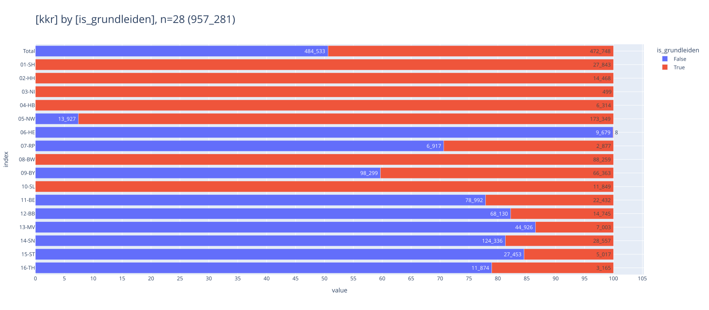
    

 

### [OP](#toc0_)

#### [nach ICD10](#toc0_)
- Grundgesamtheit: alle **OP Meldungen**

    
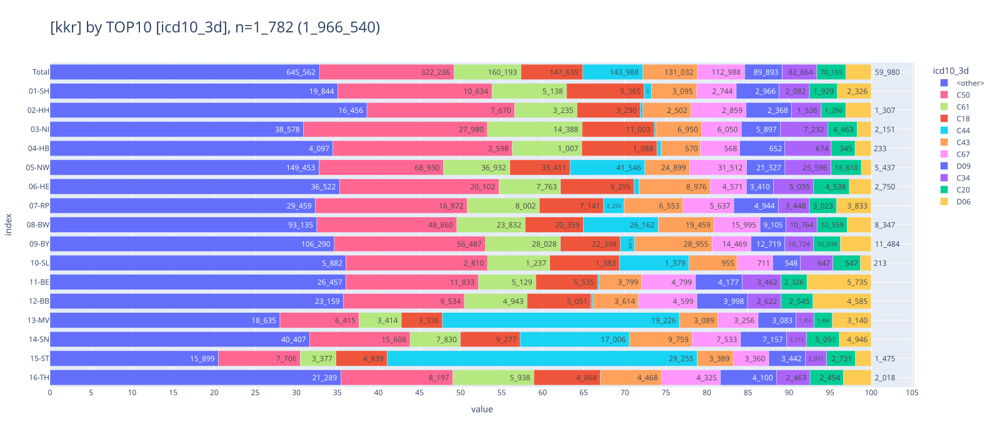
    

 

#### [nach Intention](#toc0_)
- Grundgesamtheit: alle **OP Meldungen**

    
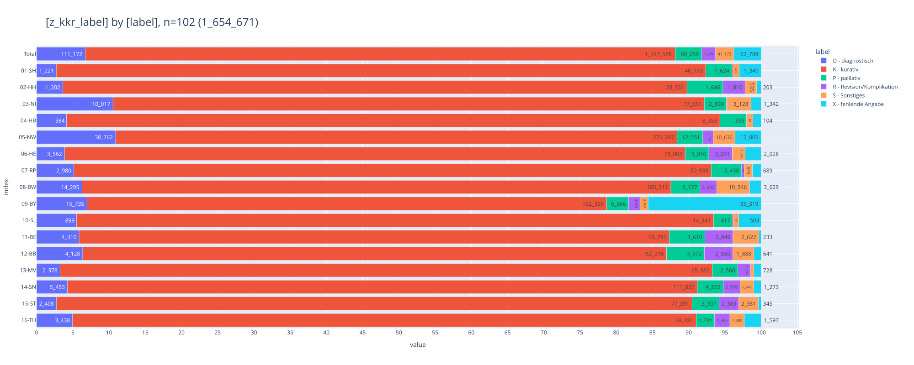
    

 

### [OPS](#toc0_)

#### [nach OPS ICD Kapitel (Top 10)](#toc0_)
- Grundgesamtheit: **alle OPS Codes**

> 💡 `ZfKD`: _"lediglich `02-HH` und `05-NW` übermitteln ausschliesslich Kapitel 5. Der Anteil von Meldungen <> Kapitel 5 sind wahrscheinlich diagnostische Massnahmen oder nicht-operative Therapien. Vorschlag: nur noch Kapitel 5 übermitteln"_

    
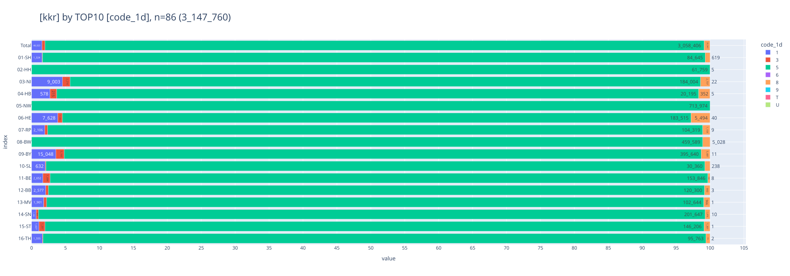
    

 

#### [nach OPS Einzelcodes (Top 5)](#toc0_)
- Grundgesamtheit: **alle OPS Codes**

<table id="T_f0f14">
  <thead>
    <tr>
      <th class="index_name level0" >kkr</th>
      <th id="T_f0f14_level0_col0" class="col_heading level0 col0" >01-SH</th>
      <th id="T_f0f14_level0_col1" class="col_heading level0 col1" >02-HH</th>
      <th id="T_f0f14_level0_col2" class="col_heading level0 col2" >03-NI</th>
      <th id="T_f0f14_level0_col3" class="col_heading level0 col3" >04-HB</th>
      <th id="T_f0f14_level0_col4" class="col_heading level0 col4" >05-NW</th>
      <th id="T_f0f14_level0_col5" class="col_heading level0 col5" >06-HE</th>
      <th id="T_f0f14_level0_col6" class="col_heading level0 col6" >07-RP</th>
      <th id="T_f0f14_level0_col7" class="col_heading level0 col7" >08-BW</th>
      <th id="T_f0f14_level0_col8" class="col_heading level0 col8" >09-BY</th>
      <th id="T_f0f14_level0_col9" class="col_heading level0 col9" >10-SL</th>
      <th id="T_f0f14_level0_col10" class="col_heading level0 col10" >11-BE</th>
      <th id="T_f0f14_level0_col11" class="col_heading level0 col11" >12-BB</th>
      <th id="T_f0f14_level0_col12" class="col_heading level0 col12" >13-MV</th>
      <th id="T_f0f14_level0_col13" class="col_heading level0 col13" >14-SN</th>
      <th id="T_f0f14_level0_col14" class="col_heading level0 col14" >15-ST</th>
      <th id="T_f0f14_level0_col15" class="col_heading level0 col15" >16-TH</th>
      <th id="T_f0f14_level0_col16" class="col_heading level0 col16" >Total</th>
    </tr>
    <tr>
      <th class="index_name level0" >Code</th>
      <th class="blank col0" >&nbsp;</th>
      <th class="blank col1" >&nbsp;</th>
      <th class="blank col2" >&nbsp;</th>
      <th class="blank col3" >&nbsp;</th>
      <th class="blank col4" >&nbsp;</th>
      <th class="blank col5" >&nbsp;</th>
      <th class="blank col6" >&nbsp;</th>
      <th class="blank col7" >&nbsp;</th>
      <th class="blank col8" >&nbsp;</th>
      <th class="blank col9" >&nbsp;</th>
      <th class="blank col10" >&nbsp;</th>
      <th class="blank col11" >&nbsp;</th>
      <th class="blank col12" >&nbsp;</th>
      <th class="blank col13" >&nbsp;</th>
      <th class="blank col14" >&nbsp;</th>
      <th class="blank col15" >&nbsp;</th>
      <th class="blank col16" >&nbsp;</th>
    </tr>
  </thead>
  <tbody>
    <tr>
      <th id="T_f0f14_level0_row0" class="row_heading level0 row0" >5-401.11</th>
      <td id="T_f0f14_row0_col0" class="data row0 col0" >5_918 </td>
      <td id="T_f0f14_row0_col1" class="data row0 col1" >3_813 </td>
      <td id="T_f0f14_row0_col2" class="data row0 col2" >15_148 </td>
      <td id="T_f0f14_row0_col3" class="data row0 col3" >1_567 </td>
      <td id="T_f0f14_row0_col4" class="data row0 col4" >26_109 </td>
      <td id="T_f0f14_row0_col5" class="data row0 col5" >10_773 </td>
      <td id="T_f0f14_row0_col6" class="data row0 col6" >7_035 </td>
      <td id="T_f0f14_row0_col7" class="data row0 col7" >20_972 </td>
      <td id="T_f0f14_row0_col8" class="data row0 col8" >11_089 </td>
      <td id="T_f0f14_row0_col9" class="data row0 col9" >1_802 </td>
      <td id="T_f0f14_row0_col10" class="data row0 col10" >6_533 </td>
      <td id="T_f0f14_row0_col11" class="data row0 col11" >4_868 </td>
      <td id="T_f0f14_row0_col12" class="data row0 col12" >3_709 </td>
      <td id="T_f0f14_row0_col13" class="data row0 col13" >8_246 </td>
      <td id="T_f0f14_row0_col14" class="data row0 col14" >4_534 </td>
      <td id="T_f0f14_row0_col15" class="data row0 col15" >3_710 </td>
      <td id="T_f0f14_row0_col16" class="data row0 col16" >135_826 </td>
    </tr>
    <tr>
      <th id="T_f0f14_level0_row1" class="row_heading level0 row1" >5-573.40</th>
      <td id="T_f0f14_row1_col0" class="data row1 col0" >3_533 </td>
      <td id="T_f0f14_row1_col1" class="data row1 col1" >2_481 </td>
      <td id="T_f0f14_row1_col2" class="data row1 col2" >4_993 </td>
      <td id="T_f0f14_row1_col3" class="data row1 col3" >658 </td>
      <td id="T_f0f14_row1_col4" class="data row1 col4" >27_975 </td>
      <td id="T_f0f14_row1_col5" class="data row1 col5" >3_653 </td>
      <td id="T_f0f14_row1_col6" class="data row1 col6" >4_640 </td>
      <td id="T_f0f14_row1_col7" class="data row1 col7" >10_415 </td>
      <td id="T_f0f14_row1_col8" class="data row1 col8" >7_042 </td>
      <td id="T_f0f14_row1_col9" class="data row1 col9" >750 </td>
      <td id="T_f0f14_row1_col10" class="data row1 col10" >4_815 </td>
      <td id="T_f0f14_row1_col11" class="data row1 col11" >4_751 </td>
      <td id="T_f0f14_row1_col12" class="data row1 col12" >2_709 </td>
      <td id="T_f0f14_row1_col13" class="data row1 col13" >8_896 </td>
      <td id="T_f0f14_row1_col14" class="data row1 col14" >4_184 </td>
      <td id="T_f0f14_row1_col15" class="data row1 col15" >2_771 </td>
      <td id="T_f0f14_row1_col16" class="data row1 col16" >94_266 </td>
    </tr>
    <tr>
      <th id="T_f0f14_level0_row2" class="row_heading level0 row2" >5-870.a1</th>
      <td id="T_f0f14_row2_col0" class="data row2 col0" >2_540 </td>
      <td id="T_f0f14_row2_col1" class="data row2 col1" >1_565 </td>
      <td id="T_f0f14_row2_col2" class="data row2 col2" >7_058 </td>
      <td id="T_f0f14_row2_col3" class="data row2 col3" >421 </td>
      <td id="T_f0f14_row2_col4" class="data row2 col4" >12_354 </td>
      <td id="T_f0f14_row2_col5" class="data row2 col5" >6_018 </td>
      <td id="T_f0f14_row2_col6" class="data row2 col6" >4_259 </td>
      <td id="T_f0f14_row2_col7" class="data row2 col7" >9_957 </td>
      <td id="T_f0f14_row2_col8" class="data row2 col8" >5_532 </td>
      <td id="T_f0f14_row2_col9" class="data row2 col9" >730 </td>
      <td id="T_f0f14_row2_col10" class="data row2 col10" >3_600 </td>
      <td id="T_f0f14_row2_col11" class="data row2 col11" >1_670 </td>
      <td id="T_f0f14_row2_col12" class="data row2 col12" >1_381 </td>
      <td id="T_f0f14_row2_col13" class="data row2 col13" >3_660 </td>
      <td id="T_f0f14_row2_col14" class="data row2 col14" >1_768 </td>
      <td id="T_f0f14_row2_col15" class="data row2 col15" >2_527 </td>
      <td id="T_f0f14_row2_col16" class="data row2 col16" >65_040 </td>
    </tr>
    <tr>
      <th id="T_f0f14_level0_row3" class="row_heading level0 row3" >5-870.a2</th>
      <td id="T_f0f14_row3_col0" class="data row3 col0" >2_217 </td>
      <td id="T_f0f14_row3_col1" class="data row3 col1" >2_467 </td>
      <td id="T_f0f14_row3_col2" class="data row3 col2" >4_447 </td>
      <td id="T_f0f14_row3_col3" class="data row3 col3" >236 </td>
      <td id="T_f0f14_row3_col4" class="data row3 col4" >10_668 </td>
      <td id="T_f0f14_row3_col5" class="data row3 col5" >3_894 </td>
      <td id="T_f0f14_row3_col6" class="data row3 col6" >2_255 </td>
      <td id="T_f0f14_row3_col7" class="data row3 col7" >9_726 </td>
      <td id="T_f0f14_row3_col8" class="data row3 col8" >5_972 </td>
      <td id="T_f0f14_row3_col9" class="data row3 col9" >901 </td>
      <td id="T_f0f14_row3_col10" class="data row3 col10" >2_858 </td>
      <td id="T_f0f14_row3_col11" class="data row3 col11" >1_903 </td>
      <td id="T_f0f14_row3_col12" class="data row3 col12" >1_155 </td>
      <td id="T_f0f14_row3_col13" class="data row3 col13" >1_890 </td>
      <td id="T_f0f14_row3_col14" class="data row3 col14" >1_428 </td>
      <td id="T_f0f14_row3_col15" class="data row3 col15" >393 </td>
      <td id="T_f0f14_row3_col16" class="data row3 col16" >52_410 </td>
    </tr>
    <tr>
      <th id="T_f0f14_level0_row4" class="row_heading level0 row4" >5-987.0</th>
      <td id="T_f0f14_row4_col0" class="data row4 col0" >1_983 </td>
      <td id="T_f0f14_row4_col1" class="data row4 col1" >980 </td>
      <td id="T_f0f14_row4_col2" class="data row4 col2" >5_718 </td>
      <td id="T_f0f14_row4_col3" class="data row4 col3" >391 </td>
      <td id="T_f0f14_row4_col4" class="data row4 col4" >25_080 </td>
      <td id="T_f0f14_row4_col5" class="data row4 col5" >4_778 </td>
      <td id="T_f0f14_row4_col6" class="data row4 col6" >2_841 </td>
      <td id="T_f0f14_row4_col7" class="data row4 col7" >13_487 </td>
      <td id="T_f0f14_row4_col8" class="data row4 col8" >11_218 </td>
      <td id="T_f0f14_row4_col9" class="data row4 col9" >758 </td>
      <td id="T_f0f14_row4_col10" class="data row4 col10" >3_753 </td>
      <td id="T_f0f14_row4_col11" class="data row4 col11" >2_804 </td>
      <td id="T_f0f14_row4_col12" class="data row4 col12" >1_063 </td>
      <td id="T_f0f14_row4_col13" class="data row4 col13" >4_136 </td>
      <td id="T_f0f14_row4_col14" class="data row4 col14" >2_419 </td>
      <td id="T_f0f14_row4_col15" class="data row4 col15" >1_352 </td>
      <td id="T_f0f14_row4_col16" class="data row4 col16" >82_761 </td>
    </tr>
  </tbody>
</table>

    ┌──────────┬───────────────────────────────────────────────────────────────────────────────────────────────────────────────────────────┬────────┐
    │   code   │                                                           name                                                            │  cnt   │
    │ varchar  │                                                          varchar                                                          │ int32  │
    ├──────────┼───────────────────────────────────────────────────────────────────────────────────────────────────────────────────────────┼────────┤
    │ 5-401.11 │ Exzision einzelner Lymphknoten und Lymphgefäße: Axillär: Mit Radionuklidmarkierung (Sentinel-Lymphonodektomie)            │ 135826 │
    │ 5-573.40 │ Transurethrale Inzision, Exzision, Destruktion und Resektion von (erkranktem) Gewebe der Harnblase: Resektion: Nicht fl…  │  94266 │
    │ 5-987.0  │ Anwendung eines OP-Roboters: Komplexer OP-Roboter                                                                         │  82761 │
    │ 5-870.a1 │ Partielle (brusterhaltende) Exzision der Mamma und Destruktion von Mammagewebe: Partielle Resektion: Defektdeckung durc…  │  65040 │
    │ 5-870.a2 │ Partielle (brusterhaltende) Exzision der Mamma und Destruktion von Mammagewebe: Partielle Resektion: Defektdeckung durc…  │  52410 │
    └──────────┴───────────────────────────────────────────────────────────────────────────────────────────────────────────────────────────┴────────┘
    

### [SYST](#toc0_)

#### [nach Stellung_OP](#toc0_)

- Grundgesamtheit: **alle SYST Elemente**
> 💡 `ZfKD`: _"einige KKR übermitteln de facto keine OP Stellung"_

    

    

## [Missings / Unbekannt in den Daten](#toc0_)
- es sind folgende Schwellwerte angezeigt:
  - 🟩 0 bis <5%
  - 🟨 5 bis <100%
  - 🟥 bei 100%
- **Filter: `DJ` 2020-2023** Weitere Filter sind extra aufgeführt
- dargestellt sind Variablen aus dem Schema in folgender Notation: `[Elementknoten]Variablenname`
- die graumelierte `0` kennzeichnet einen leeren Wert (=keine missings), 0% entsteht durch Rundung von kleinen Werten

 

### [Missings für verpflichtende Variablen in Tumor Element](#toc0_)
- kein Filter
- Pflichtangaben aus anderen Elementknoten (z.B. Datum aus dem OP Knoten) sind nicht aufgeführt, da diese selbst optional sind
- ganz überwiegend sind die Angaben vollständig, die wenigen Ausnahmen werden allerdings Stand heute nicht korrigiert

> 💡 `ZfKD`: _"Die absoluten Fallzahlen für fehlende ICD10 oder Inzidenzort sind sehr gering, verursachen jedoch in Analysen einige Artefakte, wenn sie in Filtern nicht korrekt adressiert werden"_

<table id="T_fb458">
  <thead>
    <tr>
      <th class="index_name level0" >kkr</th>
      <th id="T_fb458_level0_col0" class="col_heading level0 col0" >01-SH</th>
      <th id="T_fb458_level0_col1" class="col_heading level0 col1" >02-HH</th>
      <th id="T_fb458_level0_col2" class="col_heading level0 col2" >03-NI</th>
      <th id="T_fb458_level0_col3" class="col_heading level0 col3" >04-HB</th>
      <th id="T_fb458_level0_col4" class="col_heading level0 col4" >05-NW</th>
      <th id="T_fb458_level0_col5" class="col_heading level0 col5" >06-HE</th>
      <th id="T_fb458_level0_col6" class="col_heading level0 col6" >07-RP</th>
      <th id="T_fb458_level0_col7" class="col_heading level0 col7" >08-BW</th>
      <th id="T_fb458_level0_col8" class="col_heading level0 col8" >09-BY</th>
      <th id="T_fb458_level0_col9" class="col_heading level0 col9" >10-SL</th>
      <th id="T_fb458_level0_col10" class="col_heading level0 col10" >11-BE</th>
      <th id="T_fb458_level0_col11" class="col_heading level0 col11" >12-BB</th>
      <th id="T_fb458_level0_col12" class="col_heading level0 col12" >13-MV</th>
      <th id="T_fb458_level0_col13" class="col_heading level0 col13" >14-SN</th>
      <th id="T_fb458_level0_col14" class="col_heading level0 col14" >15-ST</th>
      <th id="T_fb458_level0_col15" class="col_heading level0 col15" >16-TH</th>
    </tr>
    <tr>
      <th class="index_name level0" >tablecolumn</th>
      <th class="blank col0" >&nbsp;</th>
      <th class="blank col1" >&nbsp;</th>
      <th class="blank col2" >&nbsp;</th>
      <th class="blank col3" >&nbsp;</th>
      <th class="blank col4" >&nbsp;</th>
      <th class="blank col5" >&nbsp;</th>
      <th class="blank col6" >&nbsp;</th>
      <th class="blank col7" >&nbsp;</th>
      <th class="blank col8" >&nbsp;</th>
      <th class="blank col9" >&nbsp;</th>
      <th class="blank col10" >&nbsp;</th>
      <th class="blank col11" >&nbsp;</th>
      <th class="blank col12" >&nbsp;</th>
      <th class="blank col13" >&nbsp;</th>
      <th class="blank col14" >&nbsp;</th>
      <th class="blank col15" >&nbsp;</th>
    </tr>
  </thead>
  <tbody>
    <tr>
      <th id="T_fb458_level0_row0" class="row_heading level0 row0" >[Patient]DatumVitalStatus</th>
      <td id="T_fb458_row0_col0" class="data row0 col0" >0 🟩</td>
      <td id="T_fb458_row0_col1" class="data row0 col1" >0 🟩</td>
      <td id="T_fb458_row0_col2" class="data row0 col2" >0 🟩</td>
      <td id="T_fb458_row0_col3" class="data row0 col3" >0 🟩</td>
      <td id="T_fb458_row0_col4" class="data row0 col4" >0 🟩</td>
      <td id="T_fb458_row0_col5" class="data row0 col5" >0 🟩</td>
      <td id="T_fb458_row0_col6" class="data row0 col6" >0 🟩</td>
      <td id="T_fb458_row0_col7" class="data row0 col7" >0 🟩</td>
      <td id="T_fb458_row0_col8" class="data row0 col8" >0 🟩</td>
      <td id="T_fb458_row0_col9" class="data row0 col9" >0 🟩</td>
      <td id="T_fb458_row0_col10" class="data row0 col10" >0 🟩</td>
      <td id="T_fb458_row0_col11" class="data row0 col11" >0 🟩</td>
      <td id="T_fb458_row0_col12" class="data row0 col12" >0 🟩</td>
      <td id="T_fb458_row0_col13" class="data row0 col13" >0 🟩</td>
      <td id="T_fb458_row0_col14" class="data row0 col14" >0 🟩</td>
      <td id="T_fb458_row0_col15" class="data row0 col15" >0 🟩</td>
    </tr>
    <tr>
      <th id="T_fb458_level0_row1" class="row_heading level0 row1" >[Patient]Geburtsdatum</th>
      <td id="T_fb458_row1_col0" class="data row1 col0" >0 🟩</td>
      <td id="T_fb458_row1_col1" class="data row1 col1" >0 🟩</td>
      <td id="T_fb458_row1_col2" class="data row1 col2" >0 🟩</td>
      <td id="T_fb458_row1_col3" class="data row1 col3" >0 🟩</td>
      <td id="T_fb458_row1_col4" class="data row1 col4" >0 🟩</td>
      <td id="T_fb458_row1_col5" class="data row1 col5" >0 🟩</td>
      <td id="T_fb458_row1_col6" class="data row1 col6" >0 🟩</td>
      <td id="T_fb458_row1_col7" class="data row1 col7" >0 🟩</td>
      <td id="T_fb458_row1_col8" class="data row1 col8" >0 🟩</td>
      <td id="T_fb458_row1_col9" class="data row1 col9" >0 🟩</td>
      <td id="T_fb458_row1_col10" class="data row1 col10" >0 🟩</td>
      <td id="T_fb458_row1_col11" class="data row1 col11" >0 🟩</td>
      <td id="T_fb458_row1_col12" class="data row1 col12" >0 🟩</td>
      <td id="T_fb458_row1_col13" class="data row1 col13" >0 🟩</td>
      <td id="T_fb458_row1_col14" class="data row1 col14" >0 🟩</td>
      <td id="T_fb458_row1_col15" class="data row1 col15" >0 🟩</td>
    </tr>
    <tr>
      <th id="T_fb458_level0_row2" class="row_heading level0 row2" >[Patient]Geschlecht</th>
      <td id="T_fb458_row2_col0" class="data row2 col0" >0 🟩</td>
      <td id="T_fb458_row2_col1" class="data row2 col1" >0 🟩</td>
      <td id="T_fb458_row2_col2" class="data row2 col2" >0 🟩</td>
      <td id="T_fb458_row2_col3" class="data row2 col3" >0 🟩</td>
      <td id="T_fb458_row2_col4" class="data row2 col4" >0 🟩</td>
      <td id="T_fb458_row2_col5" class="data row2 col5" >0 🟩</td>
      <td id="T_fb458_row2_col6" class="data row2 col6" >0 🟩</td>
      <td id="T_fb458_row2_col7" class="data row2 col7" >0 🟩</td>
      <td id="T_fb458_row2_col8" class="data row2 col8" >0 🟩</td>
      <td id="T_fb458_row2_col9" class="data row2 col9" >0 🟩</td>
      <td id="T_fb458_row2_col10" class="data row2 col10" >0 🟩</td>
      <td id="T_fb458_row2_col11" class="data row2 col11" >0 🟩</td>
      <td id="T_fb458_row2_col12" class="data row2 col12" >0 🟩</td>
      <td id="T_fb458_row2_col13" class="data row2 col13" >0 🟩</td>
      <td id="T_fb458_row2_col14" class="data row2 col14" >0 🟩</td>
      <td id="T_fb458_row2_col15" class="data row2 col15" >0 🟩</td>
    </tr>
    <tr>
      <th id="T_fb458_level0_row3" class="row_heading level0 row3" >[Patient]Verstorben</th>
      <td id="T_fb458_row3_col0" class="data row3 col0" >0 🟩</td>
      <td id="T_fb458_row3_col1" class="data row3 col1" >0 🟩</td>
      <td id="T_fb458_row3_col2" class="data row3 col2" >0 🟩</td>
      <td id="T_fb458_row3_col3" class="data row3 col3" >0 🟩</td>
      <td id="T_fb458_row3_col4" class="data row3 col4" >0 🟩</td>
      <td id="T_fb458_row3_col5" class="data row3 col5" >0 🟩</td>
      <td id="T_fb458_row3_col6" class="data row3 col6" >0 🟩</td>
      <td id="T_fb458_row3_col7" class="data row3 col7" >0 🟩</td>
      <td id="T_fb458_row3_col8" class="data row3 col8" >0 🟩</td>
      <td id="T_fb458_row3_col9" class="data row3 col9" >0 🟩</td>
      <td id="T_fb458_row3_col10" class="data row3 col10" >0 🟩</td>
      <td id="T_fb458_row3_col11" class="data row3 col11" >0 🟩</td>
      <td id="T_fb458_row3_col12" class="data row3 col12" >0 🟩</td>
      <td id="T_fb458_row3_col13" class="data row3 col13" >0 🟩</td>
      <td id="T_fb458_row3_col14" class="data row3 col14" >0 🟩</td>
      <td id="T_fb458_row3_col15" class="data row3 col15" >0 🟩</td>
    </tr>
    <tr>
      <th id="T_fb458_level0_row4" class="row_heading level0 row4" >[Tumor]DCN</th>
      <td id="T_fb458_row4_col0" class="data row4 col0" >0 🟩</td>
      <td id="T_fb458_row4_col1" class="data row4 col1" >0 🟩</td>
      <td id="T_fb458_row4_col2" class="data row4 col2" >0 🟩</td>
      <td id="T_fb458_row4_col3" class="data row4 col3" >0 🟩</td>
      <td id="T_fb458_row4_col4" class="data row4 col4" >0 🟩</td>
      <td id="T_fb458_row4_col5" class="data row4 col5" >0 🟩</td>
      <td id="T_fb458_row4_col6" class="data row4 col6" >0 🟩</td>
      <td id="T_fb458_row4_col7" class="data row4 col7" >0 🟩</td>
      <td id="T_fb458_row4_col8" class="data row4 col8" >0 🟩</td>
      <td id="T_fb458_row4_col9" class="data row4 col9" >0 🟩</td>
      <td id="T_fb458_row4_col10" class="data row4 col10" >0 🟩</td>
      <td id="T_fb458_row4_col11" class="data row4 col11" >0 🟩</td>
      <td id="T_fb458_row4_col12" class="data row4 col12" >0 🟩</td>
      <td id="T_fb458_row4_col13" class="data row4 col13" >0 🟩</td>
      <td id="T_fb458_row4_col14" class="data row4 col14" >0 🟩</td>
      <td id="T_fb458_row4_col15" class="data row4 col15" >0 🟩</td>
    </tr>
    <tr>
      <th id="T_fb458_level0_row5" class="row_heading level0 row5" >[Tumor]Diagnose_ICD10_Code</th>
      <td id="T_fb458_row5_col0" class="data row5 col0" >0 🟩</td>
      <td id="T_fb458_row5_col1" class="data row5 col1" >0 🟩</td>
      <td id="T_fb458_row5_col2" class="data row5 col2" >0 🟩</td>
      <td id="T_fb458_row5_col3" class="data row5 col3" >0 🟩</td>
      <td id="T_fb458_row5_col4" class="data row5 col4" >0 🟩</td>
      <td id="T_fb458_row5_col5" class="data row5 col5" >0 🟩</td>
      <td id="T_fb458_row5_col6" class="data row5 col6" >0 🟩</td>
      <td id="T_fb458_row5_col7" class="data row5 col7" >0 🟩</td>
      <td id="T_fb458_row5_col8" class="data row5 col8" >0 🟩</td>
      <td id="T_fb458_row5_col9" class="data row5 col9" >0 🟩</td>
      <td id="T_fb458_row5_col10" class="data row5 col10" >0 🟩</td>
      <td id="T_fb458_row5_col11" class="data row5 col11" >0.0% 🟩</td>
      <td id="T_fb458_row5_col12" class="data row5 col12" >0.4% 🟩</td>
      <td id="T_fb458_row5_col13" class="data row5 col13" >0 🟩</td>
      <td id="T_fb458_row5_col14" class="data row5 col14" >0 🟩</td>
      <td id="T_fb458_row5_col15" class="data row5 col15" >0.2% 🟩</td>
    </tr>
    <tr>
      <th id="T_fb458_level0_row6" class="row_heading level0 row6" >[Tumor]Diagnosedatum</th>
      <td id="T_fb458_row6_col0" class="data row6 col0" >0 🟩</td>
      <td id="T_fb458_row6_col1" class="data row6 col1" >0 🟩</td>
      <td id="T_fb458_row6_col2" class="data row6 col2" >0 🟩</td>
      <td id="T_fb458_row6_col3" class="data row6 col3" >0 🟩</td>
      <td id="T_fb458_row6_col4" class="data row6 col4" >0 🟩</td>
      <td id="T_fb458_row6_col5" class="data row6 col5" >0 🟩</td>
      <td id="T_fb458_row6_col6" class="data row6 col6" >0 🟩</td>
      <td id="T_fb458_row6_col7" class="data row6 col7" >0 🟩</td>
      <td id="T_fb458_row6_col8" class="data row6 col8" >0 🟩</td>
      <td id="T_fb458_row6_col9" class="data row6 col9" >0 🟩</td>
      <td id="T_fb458_row6_col10" class="data row6 col10" >0 🟩</td>
      <td id="T_fb458_row6_col11" class="data row6 col11" >0 🟩</td>
      <td id="T_fb458_row6_col12" class="data row6 col12" >0 🟩</td>
      <td id="T_fb458_row6_col13" class="data row6 col13" >0 🟩</td>
      <td id="T_fb458_row6_col14" class="data row6 col14" >0 🟩</td>
      <td id="T_fb458_row6_col15" class="data row6 col15" >0 🟩</td>
    </tr>
    <tr>
      <th id="T_fb458_level0_row7" class="row_heading level0 row7" >[Tumor]Diagnosesicherung</th>
      <td id="T_fb458_row7_col0" class="data row7 col0" >0 🟩</td>
      <td id="T_fb458_row7_col1" class="data row7 col1" >0 🟩</td>
      <td id="T_fb458_row7_col2" class="data row7 col2" >0 🟩</td>
      <td id="T_fb458_row7_col3" class="data row7 col3" >0 🟩</td>
      <td id="T_fb458_row7_col4" class="data row7 col4" >0 🟩</td>
      <td id="T_fb458_row7_col5" class="data row7 col5" >0 🟩</td>
      <td id="T_fb458_row7_col6" class="data row7 col6" >0 🟩</td>
      <td id="T_fb458_row7_col7" class="data row7 col7" >0 🟩</td>
      <td id="T_fb458_row7_col8" class="data row7 col8" >0 🟩</td>
      <td id="T_fb458_row7_col9" class="data row7 col9" >0 🟩</td>
      <td id="T_fb458_row7_col10" class="data row7 col10" >0 🟩</td>
      <td id="T_fb458_row7_col11" class="data row7 col11" >0 🟩</td>
      <td id="T_fb458_row7_col12" class="data row7 col12" >0 🟩</td>
      <td id="T_fb458_row7_col13" class="data row7 col13" >0 🟩</td>
      <td id="T_fb458_row7_col14" class="data row7 col14" >0 🟩</td>
      <td id="T_fb458_row7_col15" class="data row7 col15" >0 🟩</td>
    </tr>
    <tr>
      <th id="T_fb458_level0_row8" class="row_heading level0 row8" >[Tumor]Inzidenzort</th>
      <td id="T_fb458_row8_col0" class="data row8 col0" >0 🟩</td>
      <td id="T_fb458_row8_col1" class="data row8 col1" >0 🟩</td>
      <td id="T_fb458_row8_col2" class="data row8 col2" >0 🟩</td>
      <td id="T_fb458_row8_col3" class="data row8 col3" >0 🟩</td>
      <td id="T_fb458_row8_col4" class="data row8 col4" >0 🟩</td>
      <td id="T_fb458_row8_col5" class="data row8 col5" >0 🟩</td>
      <td id="T_fb458_row8_col6" class="data row8 col6" >0 🟩</td>
      <td id="T_fb458_row8_col7" class="data row8 col7" >0 🟩</td>
      <td id="T_fb458_row8_col8" class="data row8 col8" >0 🟩</td>
      <td id="T_fb458_row8_col9" class="data row8 col9" >0 🟩</td>
      <td id="T_fb458_row8_col10" class="data row8 col10" >0 🟩</td>
      <td id="T_fb458_row8_col11" class="data row8 col11" >0 🟩</td>
      <td id="T_fb458_row8_col12" class="data row8 col12" >0.9% 🟩</td>
      <td id="T_fb458_row8_col13" class="data row8 col13" >0 🟩</td>
      <td id="T_fb458_row8_col14" class="data row8 col14" >0 🟩</td>
      <td id="T_fb458_row8_col15" class="data row8 col15" >0 🟩</td>
    </tr>
    <tr>
      <th id="T_fb458_level0_row9" class="row_heading level0 row9" >[Tumor]Seitenlokalisation</th>
      <td id="T_fb458_row9_col0" class="data row9 col0" >0 🟩</td>
      <td id="T_fb458_row9_col1" class="data row9 col1" >0 🟩</td>
      <td id="T_fb458_row9_col2" class="data row9 col2" >0 🟩</td>
      <td id="T_fb458_row9_col3" class="data row9 col3" >0 🟩</td>
      <td id="T_fb458_row9_col4" class="data row9 col4" >0 🟩</td>
      <td id="T_fb458_row9_col5" class="data row9 col5" >0 🟩</td>
      <td id="T_fb458_row9_col6" class="data row9 col6" >0 🟩</td>
      <td id="T_fb458_row9_col7" class="data row9 col7" >0 🟩</td>
      <td id="T_fb458_row9_col8" class="data row9 col8" >0 🟩</td>
      <td id="T_fb458_row9_col9" class="data row9 col9" >0 🟩</td>
      <td id="T_fb458_row9_col10" class="data row9 col10" >0 🟩</td>
      <td id="T_fb458_row9_col11" class="data row9 col11" >0 🟩</td>
      <td id="T_fb458_row9_col12" class="data row9 col12" >0 🟩</td>
      <td id="T_fb458_row9_col13" class="data row9 col13" >0 🟩</td>
      <td id="T_fb458_row9_col14" class="data row9 col14" >0 🟩</td>
      <td id="T_fb458_row9_col15" class="data row9 col15" >0 🟩</td>
    </tr>
  </tbody>
</table>

 

### [Missings für Therapieangaben](#toc0_)
- **Filter: `DJ` 2020-2023, `DCO` = N, `ICD10` != C44**
- Rechenbeispiel für `[Bestrahlung]Anzahl_Tage_Diagnose_ST` in 01-SH (Zahlen sind veraltet, aber Prinzip bleibt gleich):
  - 5363 Bestrahlungen sind in den Daten unter Beachtung des Filters (DCO/DJ/ICD10) für den zugeordneten Tumor
  - davon enthalten 302 ein leeres Feld `Anzahl_Tage_Diagnose_ST` -> ~ 6%

> 💡 `ZfKD`: _"Es gibt deutliche Unterschiede in der Nutzbarkeit von Therapieangaben. So weist etwa `Anzahl_Tage_Diagnose_OP` fast keine missings auf, `Anzahl_Tage_SYST_Dauer` jedoch (flächendeckend) sehr viele."_

<table id="T_08171">
  <thead>
    <tr>
      <th class="index_name level0" >kkr</th>
      <th id="T_08171_level0_col0" class="col_heading level0 col0" >01-SH</th>
      <th id="T_08171_level0_col1" class="col_heading level0 col1" >02-HH</th>
      <th id="T_08171_level0_col2" class="col_heading level0 col2" >03-NI</th>
      <th id="T_08171_level0_col3" class="col_heading level0 col3" >04-HB</th>
      <th id="T_08171_level0_col4" class="col_heading level0 col4" >05-NW</th>
      <th id="T_08171_level0_col5" class="col_heading level0 col5" >06-HE</th>
      <th id="T_08171_level0_col6" class="col_heading level0 col6" >07-RP</th>
      <th id="T_08171_level0_col7" class="col_heading level0 col7" >08-BW</th>
      <th id="T_08171_level0_col8" class="col_heading level0 col8" >09-BY</th>
      <th id="T_08171_level0_col9" class="col_heading level0 col9" >10-SL</th>
      <th id="T_08171_level0_col10" class="col_heading level0 col10" >11-BE</th>
      <th id="T_08171_level0_col11" class="col_heading level0 col11" >12-BB</th>
      <th id="T_08171_level0_col12" class="col_heading level0 col12" >13-MV</th>
      <th id="T_08171_level0_col13" class="col_heading level0 col13" >14-SN</th>
      <th id="T_08171_level0_col14" class="col_heading level0 col14" >15-ST</th>
      <th id="T_08171_level0_col15" class="col_heading level0 col15" >16-TH</th>
    </tr>
    <tr>
      <th class="index_name level0" >tablecolumn</th>
      <th class="blank col0" >&nbsp;</th>
      <th class="blank col1" >&nbsp;</th>
      <th class="blank col2" >&nbsp;</th>
      <th class="blank col3" >&nbsp;</th>
      <th class="blank col4" >&nbsp;</th>
      <th class="blank col5" >&nbsp;</th>
      <th class="blank col6" >&nbsp;</th>
      <th class="blank col7" >&nbsp;</th>
      <th class="blank col8" >&nbsp;</th>
      <th class="blank col9" >&nbsp;</th>
      <th class="blank col10" >&nbsp;</th>
      <th class="blank col11" >&nbsp;</th>
      <th class="blank col12" >&nbsp;</th>
      <th class="blank col13" >&nbsp;</th>
      <th class="blank col14" >&nbsp;</th>
      <th class="blank col15" >&nbsp;</th>
    </tr>
  </thead>
  <tbody>
    <tr>
      <th id="T_08171_level0_row0" class="row_heading level0 row0" >[Bestrahlung]Anzahl_Tage_Diagnose_ST</th>
      <td id="T_08171_row0_col0" class="data row0 col0" >5.3% 🟨</td>
      <td id="T_08171_row0_col1" class="data row0 col1" >0 🟩</td>
      <td id="T_08171_row0_col2" class="data row0 col2" >6.7% 🟨</td>
      <td id="T_08171_row0_col3" class="data row0 col3" >6.1% 🟨</td>
      <td id="T_08171_row0_col4" class="data row0 col4" >0.4% 🟩</td>
      <td id="T_08171_row0_col5" class="data row0 col5" >0 🟩</td>
      <td id="T_08171_row0_col6" class="data row0 col6" >10.2% 🟨</td>
      <td id="T_08171_row0_col7" class="data row0 col7" >0.1% 🟩</td>
      <td id="T_08171_row0_col8" class="data row0 col8" >0.1% 🟩</td>
      <td id="T_08171_row0_col9" class="data row0 col9" >5.4% 🟨</td>
      <td id="T_08171_row0_col10" class="data row0 col10" >0.0% 🟩</td>
      <td id="T_08171_row0_col11" class="data row0 col11" >0.0% 🟩</td>
      <td id="T_08171_row0_col12" class="data row0 col12" >0.0% 🟩</td>
      <td id="T_08171_row0_col13" class="data row0 col13" >0 🟩</td>
      <td id="T_08171_row0_col14" class="data row0 col14" >0.0% 🟩</td>
      <td id="T_08171_row0_col15" class="data row0 col15" >0.0% 🟩</td>
    </tr>
    <tr>
      <th id="T_08171_level0_row1" class="row_heading level0 row1" >[Bestrahlung]Anzahl_Tage_ST_Dauer</th>
      <td id="T_08171_row1_col0" class="data row1 col0" >100.0% 🟥</td>
      <td id="T_08171_row1_col1" class="data row1 col1" >2.2% 🟩</td>
      <td id="T_08171_row1_col2" class="data row1 col2" >100.0% 🟥</td>
      <td id="T_08171_row1_col3" class="data row1 col3" >100.0% 🟥</td>
      <td id="T_08171_row1_col4" class="data row1 col4" >8.6% 🟨</td>
      <td id="T_08171_row1_col5" class="data row1 col5" >3.9% 🟩</td>
      <td id="T_08171_row1_col6" class="data row1 col6" >5.8% 🟨</td>
      <td id="T_08171_row1_col7" class="data row1 col7" >0 🟩</td>
      <td id="T_08171_row1_col8" class="data row1 col8" >3.8% 🟩</td>
      <td id="T_08171_row1_col9" class="data row1 col9" >100.0% 🟥</td>
      <td id="T_08171_row1_col10" class="data row1 col10" >1.4% 🟩</td>
      <td id="T_08171_row1_col11" class="data row1 col11" >1.3% 🟩</td>
      <td id="T_08171_row1_col12" class="data row1 col12" >1.9% 🟩</td>
      <td id="T_08171_row1_col13" class="data row1 col13" >0.4% 🟩</td>
      <td id="T_08171_row1_col14" class="data row1 col14" >1.3% 🟩</td>
      <td id="T_08171_row1_col15" class="data row1 col15" >1.4% 🟩</td>
    </tr>
    <tr>
      <th id="T_08171_level0_row2" class="row_heading level0 row2" >[Bestrahlung]Datum_Beginn_Bestrahlung</th>
      <td id="T_08171_row2_col0" class="data row2 col0" >0 🟩</td>
      <td id="T_08171_row2_col1" class="data row2 col1" >0 🟩</td>
      <td id="T_08171_row2_col2" class="data row2 col2" >0 🟩</td>
      <td id="T_08171_row2_col3" class="data row2 col3" >0 🟩</td>
      <td id="T_08171_row2_col4" class="data row2 col4" >0 🟩</td>
      <td id="T_08171_row2_col5" class="data row2 col5" >0 🟩</td>
      <td id="T_08171_row2_col6" class="data row2 col6" >0 🟩</td>
      <td id="T_08171_row2_col7" class="data row2 col7" >0 🟩</td>
      <td id="T_08171_row2_col8" class="data row2 col8" >0 🟩</td>
      <td id="T_08171_row2_col9" class="data row2 col9" >0 🟩</td>
      <td id="T_08171_row2_col10" class="data row2 col10" >0.0% 🟩</td>
      <td id="T_08171_row2_col11" class="data row2 col11" >0.0% 🟩</td>
      <td id="T_08171_row2_col12" class="data row2 col12" >0.0% 🟩</td>
      <td id="T_08171_row2_col13" class="data row2 col13" >0 🟩</td>
      <td id="T_08171_row2_col14" class="data row2 col14" >0 🟩</td>
      <td id="T_08171_row2_col15" class="data row2 col15" >0.0% 🟩</td>
    </tr>
    <tr>
      <th id="T_08171_level0_row3" class="row_heading level0 row3" >[OP]Anzahl_Tage_Diagnose_OP</th>
      <td id="T_08171_row3_col0" class="data row3 col0" >1.5% 🟩</td>
      <td id="T_08171_row3_col1" class="data row3 col1" >0 🟩</td>
      <td id="T_08171_row3_col2" class="data row3 col2" >2.8% 🟩</td>
      <td id="T_08171_row3_col3" class="data row3 col3" >2.9% 🟩</td>
      <td id="T_08171_row3_col4" class="data row3 col4" >3.0% 🟩</td>
      <td id="T_08171_row3_col5" class="data row3 col5" >0 🟩</td>
      <td id="T_08171_row3_col6" class="data row3 col6" >4.8% 🟩</td>
      <td id="T_08171_row3_col7" class="data row3 col7" >2.2% 🟩</td>
      <td id="T_08171_row3_col8" class="data row3 col8" >0.0% 🟩</td>
      <td id="T_08171_row3_col9" class="data row3 col9" >2.7% 🟩</td>
      <td id="T_08171_row3_col10" class="data row3 col10" >0 🟩</td>
      <td id="T_08171_row3_col11" class="data row3 col11" >0 🟩</td>
      <td id="T_08171_row3_col12" class="data row3 col12" >0 🟩</td>
      <td id="T_08171_row3_col13" class="data row3 col13" >0 🟩</td>
      <td id="T_08171_row3_col14" class="data row3 col14" >0 🟩</td>
      <td id="T_08171_row3_col15" class="data row3 col15" >0.0% 🟩</td>
    </tr>
    <tr>
      <th id="T_08171_level0_row4" class="row_heading level0 row4" >[OP]Datum_OP</th>
      <td id="T_08171_row4_col0" class="data row4 col0" >0 🟩</td>
      <td id="T_08171_row4_col1" class="data row4 col1" >0 🟩</td>
      <td id="T_08171_row4_col2" class="data row4 col2" >0 🟩</td>
      <td id="T_08171_row4_col3" class="data row4 col3" >0 🟩</td>
      <td id="T_08171_row4_col4" class="data row4 col4" >0 🟩</td>
      <td id="T_08171_row4_col5" class="data row4 col5" >0 🟩</td>
      <td id="T_08171_row4_col6" class="data row4 col6" >0 🟩</td>
      <td id="T_08171_row4_col7" class="data row4 col7" >0 🟩</td>
      <td id="T_08171_row4_col8" class="data row4 col8" >0 🟩</td>
      <td id="T_08171_row4_col9" class="data row4 col9" >0 🟩</td>
      <td id="T_08171_row4_col10" class="data row4 col10" >0 🟩</td>
      <td id="T_08171_row4_col11" class="data row4 col11" >0 🟩</td>
      <td id="T_08171_row4_col12" class="data row4 col12" >0 🟩</td>
      <td id="T_08171_row4_col13" class="data row4 col13" >0 🟩</td>
      <td id="T_08171_row4_col14" class="data row4 col14" >0 🟩</td>
      <td id="T_08171_row4_col15" class="data row4 col15" >0 🟩</td>
    </tr>
    <tr>
      <th id="T_08171_level0_row5" class="row_heading level0 row5" >[OP]Intention</th>
      <td id="T_08171_row5_col0" class="data row5 col0" >0 🟩</td>
      <td id="T_08171_row5_col1" class="data row5 col1" >0 🟩</td>
      <td id="T_08171_row5_col2" class="data row5 col2" >0 🟩</td>
      <td id="T_08171_row5_col3" class="data row5 col3" >0 🟩</td>
      <td id="T_08171_row5_col4" class="data row5 col4" >0 🟩</td>
      <td id="T_08171_row5_col5" class="data row5 col5" >0 🟩</td>
      <td id="T_08171_row5_col6" class="data row5 col6" >0 🟩</td>
      <td id="T_08171_row5_col7" class="data row5 col7" >0 🟩</td>
      <td id="T_08171_row5_col8" class="data row5 col8" >0 🟩</td>
      <td id="T_08171_row5_col9" class="data row5 col9" >0 🟩</td>
      <td id="T_08171_row5_col10" class="data row5 col10" >0 🟩</td>
      <td id="T_08171_row5_col11" class="data row5 col11" >0 🟩</td>
      <td id="T_08171_row5_col12" class="data row5 col12" >0 🟩</td>
      <td id="T_08171_row5_col13" class="data row5 col13" >0 🟩</td>
      <td id="T_08171_row5_col14" class="data row5 col14" >0 🟩</td>
      <td id="T_08171_row5_col15" class="data row5 col15" >0 🟩</td>
    </tr>
    <tr>
      <th id="T_08171_level0_row6" class="row_heading level0 row6" >[OP]Lokale_Beurteilung_Residualstatus</th>
      <td id="T_08171_row6_col0" class="data row6 col0" >100.0% 🟥</td>
      <td id="T_08171_row6_col1" class="data row6 col1" >4.2% 🟩</td>
      <td id="T_08171_row6_col2" class="data row6 col2" >100.0% 🟥</td>
      <td id="T_08171_row6_col3" class="data row6 col3" >100.0% 🟥</td>
      <td id="T_08171_row6_col4" class="data row6 col4" >8.7% 🟨</td>
      <td id="T_08171_row6_col5" class="data row6 col5" >10.3% 🟨</td>
      <td id="T_08171_row6_col6" class="data row6 col6" >1.8% 🟩</td>
      <td id="T_08171_row6_col7" class="data row6 col7" >0.0% 🟩</td>
      <td id="T_08171_row6_col8" class="data row6 col8" >14.7% 🟨</td>
      <td id="T_08171_row6_col9" class="data row6 col9" >100.0% 🟥</td>
      <td id="T_08171_row6_col10" class="data row6 col10" >10.8% 🟨</td>
      <td id="T_08171_row6_col11" class="data row6 col11" >11.1% 🟨</td>
      <td id="T_08171_row6_col12" class="data row6 col12" >5.1% 🟨</td>
      <td id="T_08171_row6_col13" class="data row6 col13" >7.0% 🟨</td>
      <td id="T_08171_row6_col14" class="data row6 col14" >15.4% 🟨</td>
      <td id="T_08171_row6_col15" class="data row6 col15" >16.4% 🟨</td>
    </tr>
    <tr>
      <th id="T_08171_level0_row7" class="row_heading level0 row7" >[ST]Intention</th>
      <td id="T_08171_row7_col0" class="data row7 col0" >0.0% 🟩</td>
      <td id="T_08171_row7_col1" class="data row7 col1" >0 🟩</td>
      <td id="T_08171_row7_col2" class="data row7 col2" >0.4% 🟩</td>
      <td id="T_08171_row7_col3" class="data row7 col3" >0.0% 🟩</td>
      <td id="T_08171_row7_col4" class="data row7 col4" >0.0% 🟩</td>
      <td id="T_08171_row7_col5" class="data row7 col5" >0.1% 🟩</td>
      <td id="T_08171_row7_col6" class="data row7 col6" >0 🟩</td>
      <td id="T_08171_row7_col7" class="data row7 col7" >0 🟩</td>
      <td id="T_08171_row7_col8" class="data row7 col8" >3.5% 🟩</td>
      <td id="T_08171_row7_col9" class="data row7 col9" >0 🟩</td>
      <td id="T_08171_row7_col10" class="data row7 col10" >0.2% 🟩</td>
      <td id="T_08171_row7_col11" class="data row7 col11" >0.1% 🟩</td>
      <td id="T_08171_row7_col12" class="data row7 col12" >0.0% 🟩</td>
      <td id="T_08171_row7_col13" class="data row7 col13" >0.0% 🟩</td>
      <td id="T_08171_row7_col14" class="data row7 col14" >0.0% 🟩</td>
      <td id="T_08171_row7_col15" class="data row7 col15" >1.1% 🟩</td>
    </tr>
    <tr>
      <th id="T_08171_level0_row8" class="row_heading level0 row8" >[ST]Stellung_OP</th>
      <td id="T_08171_row8_col0" class="data row8 col0" >100.0% 🟥</td>
      <td id="T_08171_row8_col1" class="data row8 col1" >0.0% 🟩</td>
      <td id="T_08171_row8_col2" class="data row8 col2" >100.0% 🟥</td>
      <td id="T_08171_row8_col3" class="data row8 col3" >100.0% 🟥</td>
      <td id="T_08171_row8_col4" class="data row8 col4" >0 🟩</td>
      <td id="T_08171_row8_col5" class="data row8 col5" >0.7% 🟩</td>
      <td id="T_08171_row8_col6" class="data row8 col6" >0.3% 🟩</td>
      <td id="T_08171_row8_col7" class="data row8 col7" >0 🟩</td>
      <td id="T_08171_row8_col8" class="data row8 col8" >3.9% 🟩</td>
      <td id="T_08171_row8_col9" class="data row8 col9" >100.0% 🟥</td>
      <td id="T_08171_row8_col10" class="data row8 col10" >0 🟩</td>
      <td id="T_08171_row8_col11" class="data row8 col11" >0.0% 🟩</td>
      <td id="T_08171_row8_col12" class="data row8 col12" >0.1% 🟩</td>
      <td id="T_08171_row8_col13" class="data row8 col13" >0.0% 🟩</td>
      <td id="T_08171_row8_col14" class="data row8 col14" >0.0% 🟩</td>
      <td id="T_08171_row8_col15" class="data row8 col15" >1.6% 🟩</td>
    </tr>
    <tr>
      <th id="T_08171_level0_row9" class="row_heading level0 row9" >[SYST]Anzahl_Tage_Diagnose_SYST</th>
      <td id="T_08171_row9_col0" class="data row9 col0" >6.4% 🟨</td>
      <td id="T_08171_row9_col1" class="data row9 col1" >0 🟩</td>
      <td id="T_08171_row9_col2" class="data row9 col2" >11.1% 🟨</td>
      <td id="T_08171_row9_col3" class="data row9 col3" >12.3% 🟨</td>
      <td id="T_08171_row9_col4" class="data row9 col4" >1.1% 🟩</td>
      <td id="T_08171_row9_col5" class="data row9 col5" >0 🟩</td>
      <td id="T_08171_row9_col6" class="data row9 col6" >16.8% 🟨</td>
      <td id="T_08171_row9_col7" class="data row9 col7" >0.4% 🟩</td>
      <td id="T_08171_row9_col8" class="data row9 col8" >0.1% 🟩</td>
      <td id="T_08171_row9_col9" class="data row9 col9" >13.3% 🟨</td>
      <td id="T_08171_row9_col10" class="data row9 col10" >0.0% 🟩</td>
      <td id="T_08171_row9_col11" class="data row9 col11" >0.0% 🟩</td>
      <td id="T_08171_row9_col12" class="data row9 col12" >0.1% 🟩</td>
      <td id="T_08171_row9_col13" class="data row9 col13" >0 🟩</td>
      <td id="T_08171_row9_col14" class="data row9 col14" >0.0% 🟩</td>
      <td id="T_08171_row9_col15" class="data row9 col15" >0.0% 🟩</td>
    </tr>
    <tr>
      <th id="T_08171_level0_row10" class="row_heading level0 row10" >[SYST]Anzahl_Tage_SYST_Dauer</th>
      <td id="T_08171_row10_col0" class="data row10 col0" >100.0% 🟥</td>
      <td id="T_08171_row10_col1" class="data row10 col1" >31.3% 🟨</td>
      <td id="T_08171_row10_col2" class="data row10 col2" >100.0% 🟥</td>
      <td id="T_08171_row10_col3" class="data row10 col3" >100.0% 🟥</td>
      <td id="T_08171_row10_col4" class="data row10 col4" >43.1% 🟨</td>
      <td id="T_08171_row10_col5" class="data row10 col5" >35.7% 🟨</td>
      <td id="T_08171_row10_col6" class="data row10 col6" >40.8% 🟨</td>
      <td id="T_08171_row10_col7" class="data row10 col7" >0 🟩</td>
      <td id="T_08171_row10_col8" class="data row10 col8" >44.7% 🟨</td>
      <td id="T_08171_row10_col9" class="data row10 col9" >100.0% 🟥</td>
      <td id="T_08171_row10_col10" class="data row10 col10" >32.2% 🟨</td>
      <td id="T_08171_row10_col11" class="data row10 col11" >40.1% 🟨</td>
      <td id="T_08171_row10_col12" class="data row10 col12" >37.0% 🟨</td>
      <td id="T_08171_row10_col13" class="data row10 col13" >33.3% 🟨</td>
      <td id="T_08171_row10_col14" class="data row10 col14" >40.5% 🟨</td>
      <td id="T_08171_row10_col15" class="data row10 col15" >37.3% 🟨</td>
    </tr>
    <tr>
      <th id="T_08171_level0_row11" class="row_heading level0 row11" >[SYST]Datum_Beginn_SYST</th>
      <td id="T_08171_row11_col0" class="data row11 col0" >0 🟩</td>
      <td id="T_08171_row11_col1" class="data row11 col1" >0 🟩</td>
      <td id="T_08171_row11_col2" class="data row11 col2" >0 🟩</td>
      <td id="T_08171_row11_col3" class="data row11 col3" >0 🟩</td>
      <td id="T_08171_row11_col4" class="data row11 col4" >0 🟩</td>
      <td id="T_08171_row11_col5" class="data row11 col5" >0 🟩</td>
      <td id="T_08171_row11_col6" class="data row11 col6" >0 🟩</td>
      <td id="T_08171_row11_col7" class="data row11 col7" >0 🟩</td>
      <td id="T_08171_row11_col8" class="data row11 col8" >0 🟩</td>
      <td id="T_08171_row11_col9" class="data row11 col9" >0 🟩</td>
      <td id="T_08171_row11_col10" class="data row11 col10" >0 🟩</td>
      <td id="T_08171_row11_col11" class="data row11 col11" >0 🟩</td>
      <td id="T_08171_row11_col12" class="data row11 col12" >0 🟩</td>
      <td id="T_08171_row11_col13" class="data row11 col13" >0 🟩</td>
      <td id="T_08171_row11_col14" class="data row11 col14" >0 🟩</td>
      <td id="T_08171_row11_col15" class="data row11 col15" >0 🟩</td>
    </tr>
    <tr>
      <th id="T_08171_level0_row12" class="row_heading level0 row12" >[SYST]Intention</th>
      <td id="T_08171_row12_col0" class="data row12 col0" >0 🟩</td>
      <td id="T_08171_row12_col1" class="data row12 col1" >0 🟩</td>
      <td id="T_08171_row12_col2" class="data row12 col2" >0 🟩</td>
      <td id="T_08171_row12_col3" class="data row12 col3" >0 🟩</td>
      <td id="T_08171_row12_col4" class="data row12 col4" >0 🟩</td>
      <td id="T_08171_row12_col5" class="data row12 col5" >0 🟩</td>
      <td id="T_08171_row12_col6" class="data row12 col6" >0 🟩</td>
      <td id="T_08171_row12_col7" class="data row12 col7" >0 🟩</td>
      <td id="T_08171_row12_col8" class="data row12 col8" >0 🟩</td>
      <td id="T_08171_row12_col9" class="data row12 col9" >0 🟩</td>
      <td id="T_08171_row12_col10" class="data row12 col10" >0 🟩</td>
      <td id="T_08171_row12_col11" class="data row12 col11" >0 🟩</td>
      <td id="T_08171_row12_col12" class="data row12 col12" >0 🟩</td>
      <td id="T_08171_row12_col13" class="data row12 col13" >0 🟩</td>
      <td id="T_08171_row12_col14" class="data row12 col14" >0 🟩</td>
      <td id="T_08171_row12_col15" class="data row12 col15" >0 🟩</td>
    </tr>
    <tr>
      <th id="T_08171_level0_row13" class="row_heading level0 row13" >[SYST]Stellung_OP</th>
      <td id="T_08171_row13_col0" class="data row13 col0" >0 🟩</td>
      <td id="T_08171_row13_col1" class="data row13 col1" >0 🟩</td>
      <td id="T_08171_row13_col2" class="data row13 col2" >0 🟩</td>
      <td id="T_08171_row13_col3" class="data row13 col3" >0 🟩</td>
      <td id="T_08171_row13_col4" class="data row13 col4" >0 🟩</td>
      <td id="T_08171_row13_col5" class="data row13 col5" >0 🟩</td>
      <td id="T_08171_row13_col6" class="data row13 col6" >0 🟩</td>
      <td id="T_08171_row13_col7" class="data row13 col7" >0 🟩</td>
      <td id="T_08171_row13_col8" class="data row13 col8" >0 🟩</td>
      <td id="T_08171_row13_col9" class="data row13 col9" >0 🟩</td>
      <td id="T_08171_row13_col10" class="data row13 col10" >0 🟩</td>
      <td id="T_08171_row13_col11" class="data row13 col11" >0 🟩</td>
      <td id="T_08171_row13_col12" class="data row13 col12" >0 🟩</td>
      <td id="T_08171_row13_col13" class="data row13 col13" >0 🟩</td>
      <td id="T_08171_row13_col14" class="data row13 col14" >0 🟩</td>
      <td id="T_08171_row13_col15" class="data row13 col15" >0 🟩</td>
    </tr>
    <tr>
      <th id="T_08171_level0_row14" class="row_heading level0 row14" >[SYST]Therapieart</th>
      <td id="T_08171_row14_col0" class="data row14 col0" >0 🟩</td>
      <td id="T_08171_row14_col1" class="data row14 col1" >0 🟩</td>
      <td id="T_08171_row14_col2" class="data row14 col2" >0 🟩</td>
      <td id="T_08171_row14_col3" class="data row14 col3" >0 🟩</td>
      <td id="T_08171_row14_col4" class="data row14 col4" >0 🟩</td>
      <td id="T_08171_row14_col5" class="data row14 col5" >0 🟩</td>
      <td id="T_08171_row14_col6" class="data row14 col6" >0 🟩</td>
      <td id="T_08171_row14_col7" class="data row14 col7" >0 🟩</td>
      <td id="T_08171_row14_col8" class="data row14 col8" >0 🟩</td>
      <td id="T_08171_row14_col9" class="data row14 col9" >0 🟩</td>
      <td id="T_08171_row14_col10" class="data row14 col10" >0 🟩</td>
      <td id="T_08171_row14_col11" class="data row14 col11" >0 🟩</td>
      <td id="T_08171_row14_col12" class="data row14 col12" >0 🟩</td>
      <td id="T_08171_row14_col13" class="data row14 col13" >0 🟩</td>
      <td id="T_08171_row14_col14" class="data row14 col14" >0 🟩</td>
      <td id="T_08171_row14_col15" class="data row14 col15" >0 🟩</td>
    </tr>
  </tbody>
</table>

 

### [Missings für Tumorstadien](#toc0_)
- **Filter: `DJ` 2020-2023, `DCO` = N, `ICD10` nur solide Tumoren**

> 💡 `ZfKD`: _"0% missings ist bei diagnoseabhängigen Angaben wie den Tumorstadien nicht zu erreichen (`05-NW` hat die Auflage als Konstante im Datensatz hinterlegt). Hier kann nur der relative Vergleich als Maßstab dienen."_

<table id="T_578f4">
  <thead>
    <tr>
      <th class="index_name level0" >kkr</th>
      <th id="T_578f4_level0_col0" class="col_heading level0 col0" >01-SH</th>
      <th id="T_578f4_level0_col1" class="col_heading level0 col1" >02-HH</th>
      <th id="T_578f4_level0_col2" class="col_heading level0 col2" >03-NI</th>
      <th id="T_578f4_level0_col3" class="col_heading level0 col3" >04-HB</th>
      <th id="T_578f4_level0_col4" class="col_heading level0 col4" >05-NW</th>
      <th id="T_578f4_level0_col5" class="col_heading level0 col5" >06-HE</th>
      <th id="T_578f4_level0_col6" class="col_heading level0 col6" >07-RP</th>
      <th id="T_578f4_level0_col7" class="col_heading level0 col7" >08-BW</th>
      <th id="T_578f4_level0_col8" class="col_heading level0 col8" >09-BY</th>
      <th id="T_578f4_level0_col9" class="col_heading level0 col9" >10-SL</th>
      <th id="T_578f4_level0_col10" class="col_heading level0 col10" >11-BE</th>
      <th id="T_578f4_level0_col11" class="col_heading level0 col11" >12-BB</th>
      <th id="T_578f4_level0_col12" class="col_heading level0 col12" >13-MV</th>
      <th id="T_578f4_level0_col13" class="col_heading level0 col13" >14-SN</th>
      <th id="T_578f4_level0_col14" class="col_heading level0 col14" >15-ST</th>
      <th id="T_578f4_level0_col15" class="col_heading level0 col15" >16-TH</th>
    </tr>
    <tr>
      <th class="index_name level0" >tablecolumn</th>
      <th class="blank col0" >&nbsp;</th>
      <th class="blank col1" >&nbsp;</th>
      <th class="blank col2" >&nbsp;</th>
      <th class="blank col3" >&nbsp;</th>
      <th class="blank col4" >&nbsp;</th>
      <th class="blank col5" >&nbsp;</th>
      <th class="blank col6" >&nbsp;</th>
      <th class="blank col7" >&nbsp;</th>
      <th class="blank col8" >&nbsp;</th>
      <th class="blank col9" >&nbsp;</th>
      <th class="blank col10" >&nbsp;</th>
      <th class="blank col11" >&nbsp;</th>
      <th class="blank col12" >&nbsp;</th>
      <th class="blank col13" >&nbsp;</th>
      <th class="blank col14" >&nbsp;</th>
      <th class="blank col15" >&nbsp;</th>
    </tr>
  </thead>
  <tbody>
    <tr>
      <th id="T_578f4_level0_row0" class="row_heading level0 row0" >[Tumor]M_c</th>
      <td id="T_578f4_row0_col0" class="data row0 col0" >39.9% 🟨</td>
      <td id="T_578f4_row0_col1" class="data row0 col1" >24.3% 🟨</td>
      <td id="T_578f4_row0_col2" class="data row0 col2" >55.4% 🟨</td>
      <td id="T_578f4_row0_col3" class="data row0 col3" >32.2% 🟨</td>
      <td id="T_578f4_row0_col4" class="data row0 col4" >28.4% 🟨</td>
      <td id="T_578f4_row0_col5" class="data row0 col5" >55.1% 🟨</td>
      <td id="T_578f4_row0_col6" class="data row0 col6" >71.5% 🟨</td>
      <td id="T_578f4_row0_col7" class="data row0 col7" >45.5% 🟨</td>
      <td id="T_578f4_row0_col8" class="data row0 col8" >56.2% 🟨</td>
      <td id="T_578f4_row0_col9" class="data row0 col9" >31.4% 🟨</td>
      <td id="T_578f4_row0_col10" class="data row0 col10" >36.3% 🟨</td>
      <td id="T_578f4_row0_col11" class="data row0 col11" >40.1% 🟨</td>
      <td id="T_578f4_row0_col12" class="data row0 col12" >35.0% 🟨</td>
      <td id="T_578f4_row0_col13" class="data row0 col13" >34.2% 🟨</td>
      <td id="T_578f4_row0_col14" class="data row0 col14" >44.2% 🟨</td>
      <td id="T_578f4_row0_col15" class="data row0 col15" >44.6% 🟨</td>
    </tr>
    <tr>
      <th id="T_578f4_level0_row1" class="row_heading level0 row1" >[Tumor]M_p</th>
      <td id="T_578f4_row1_col0" class="data row1 col0" >44.6% 🟨</td>
      <td id="T_578f4_row1_col1" class="data row1 col1" >93.3% 🟨</td>
      <td id="T_578f4_row1_col2" class="data row1 col2" >54.3% 🟨</td>
      <td id="T_578f4_row1_col3" class="data row1 col3" >46.8% 🟨</td>
      <td id="T_578f4_row1_col4" class="data row1 col4" >92.5% 🟨</td>
      <td id="T_578f4_row1_col5" class="data row1 col5" >56.8% 🟨</td>
      <td id="T_578f4_row1_col6" class="data row1 col6" >55.6% 🟨</td>
      <td id="T_578f4_row1_col7" class="data row1 col7" >50.9% 🟨</td>
      <td id="T_578f4_row1_col8" class="data row1 col8" >60.7% 🟨</td>
      <td id="T_578f4_row1_col9" class="data row1 col9" >90.9% 🟨</td>
      <td id="T_578f4_row1_col10" class="data row1 col10" >48.2% 🟨</td>
      <td id="T_578f4_row1_col11" class="data row1 col11" >49.2% 🟨</td>
      <td id="T_578f4_row1_col12" class="data row1 col12" >45.6% 🟨</td>
      <td id="T_578f4_row1_col13" class="data row1 col13" >40.8% 🟨</td>
      <td id="T_578f4_row1_col14" class="data row1 col14" >46.1% 🟨</td>
      <td id="T_578f4_row1_col15" class="data row1 col15" >42.1% 🟨</td>
    </tr>
    <tr>
      <th id="T_578f4_level0_row2" class="row_heading level0 row2" >[Tumor]N_c</th>
      <td id="T_578f4_row2_col0" class="data row2 col0" >39.2% 🟨</td>
      <td id="T_578f4_row2_col1" class="data row2 col1" >36.9% 🟨</td>
      <td id="T_578f4_row2_col2" class="data row2 col2" >53.4% 🟨</td>
      <td id="T_578f4_row2_col3" class="data row2 col3" >32.2% 🟨</td>
      <td id="T_578f4_row2_col4" class="data row2 col4" >40.5% 🟨</td>
      <td id="T_578f4_row2_col5" class="data row2 col5" >53.3% 🟨</td>
      <td id="T_578f4_row2_col6" class="data row2 col6" >72.2% 🟨</td>
      <td id="T_578f4_row2_col7" class="data row2 col7" >49.3% 🟨</td>
      <td id="T_578f4_row2_col8" class="data row2 col8" >54.5% 🟨</td>
      <td id="T_578f4_row2_col9" class="data row2 col9" >41.7% 🟨</td>
      <td id="T_578f4_row2_col10" class="data row2 col10" >34.9% 🟨</td>
      <td id="T_578f4_row2_col11" class="data row2 col11" >39.1% 🟨</td>
      <td id="T_578f4_row2_col12" class="data row2 col12" >34.7% 🟨</td>
      <td id="T_578f4_row2_col13" class="data row2 col13" >34.2% 🟨</td>
      <td id="T_578f4_row2_col14" class="data row2 col14" >45.2% 🟨</td>
      <td id="T_578f4_row2_col15" class="data row2 col15" >44.3% 🟨</td>
    </tr>
    <tr>
      <th id="T_578f4_level0_row3" class="row_heading level0 row3" >[Tumor]N_p</th>
      <td id="T_578f4_row3_col0" class="data row3 col0" >38.0% 🟨</td>
      <td id="T_578f4_row3_col1" class="data row3 col1" >61.3% 🟨</td>
      <td id="T_578f4_row3_col2" class="data row3 col2" >47.0% 🟨</td>
      <td id="T_578f4_row3_col3" class="data row3 col3" >44.5% 🟨</td>
      <td id="T_578f4_row3_col4" class="data row3 col4" >59.3% 🟨</td>
      <td id="T_578f4_row3_col5" class="data row3 col5" >46.4% 🟨</td>
      <td id="T_578f4_row3_col6" class="data row3 col6" >53.0% 🟨</td>
      <td id="T_578f4_row3_col7" class="data row3 col7" >64.9% 🟨</td>
      <td id="T_578f4_row3_col8" class="data row3 col8" >46.7% 🟨</td>
      <td id="T_578f4_row3_col9" class="data row3 col9" >55.4% 🟨</td>
      <td id="T_578f4_row3_col10" class="data row3 col10" >45.5% 🟨</td>
      <td id="T_578f4_row3_col11" class="data row3 col11" >45.7% 🟨</td>
      <td id="T_578f4_row3_col12" class="data row3 col12" >42.5% 🟨</td>
      <td id="T_578f4_row3_col13" class="data row3 col13" >40.6% 🟨</td>
      <td id="T_578f4_row3_col14" class="data row3 col14" >45.9% 🟨</td>
      <td id="T_578f4_row3_col15" class="data row3 col15" >41.6% 🟨</td>
    </tr>
    <tr>
      <th id="T_578f4_level0_row4" class="row_heading level0 row4" >[Tumor]TNM_Auflage_c</th>
      <td id="T_578f4_row4_col0" class="data row4 col0" >38.1% 🟨</td>
      <td id="T_578f4_row4_col1" class="data row4 col1" >19.7% 🟨</td>
      <td id="T_578f4_row4_col2" class="data row4 col2" >51.4% 🟨</td>
      <td id="T_578f4_row4_col3" class="data row4 col3" >30.1% 🟨</td>
      <td id="T_578f4_row4_col4" class="data row4 col4" >0 🟩</td>
      <td id="T_578f4_row4_col5" class="data row4 col5" >48.5% 🟨</td>
      <td id="T_578f4_row4_col6" class="data row4 col6" >63.4% 🟨</td>
      <td id="T_578f4_row4_col7" class="data row4 col7" >45.5% 🟨</td>
      <td id="T_578f4_row4_col8" class="data row4 col8" >49.9% 🟨</td>
      <td id="T_578f4_row4_col9" class="data row4 col9" >25.8% 🟨</td>
      <td id="T_578f4_row4_col10" class="data row4 col10" >32.2% 🟨</td>
      <td id="T_578f4_row4_col11" class="data row4 col11" >33.9% 🟨</td>
      <td id="T_578f4_row4_col12" class="data row4 col12" >31.8% 🟨</td>
      <td id="T_578f4_row4_col13" class="data row4 col13" >33.9% 🟨</td>
      <td id="T_578f4_row4_col14" class="data row4 col14" >42.1% 🟨</td>
      <td id="T_578f4_row4_col15" class="data row4 col15" >43.1% 🟨</td>
    </tr>
    <tr>
      <th id="T_578f4_level0_row5" class="row_heading level0 row5" >[Tumor]TNM_Auflage_p</th>
      <td id="T_578f4_row5_col0" class="data row5 col0" >35.7% 🟨</td>
      <td id="T_578f4_row5_col1" class="data row5 col1" >38.8% 🟨</td>
      <td id="T_578f4_row5_col2" class="data row5 col2" >41.0% 🟨</td>
      <td id="T_578f4_row5_col3" class="data row5 col3" >43.0% 🟨</td>
      <td id="T_578f4_row5_col4" class="data row5 col4" >0 🟩</td>
      <td id="T_578f4_row5_col5" class="data row5 col5" >40.8% 🟨</td>
      <td id="T_578f4_row5_col6" class="data row5 col6" >49.8% 🟨</td>
      <td id="T_578f4_row5_col7" class="data row5 col7" >50.8% 🟨</td>
      <td id="T_578f4_row5_col8" class="data row5 col8" >39.4% 🟨</td>
      <td id="T_578f4_row5_col9" class="data row5 col9" >32.6% 🟨</td>
      <td id="T_578f4_row5_col10" class="data row5 col10" >42.5% 🟨</td>
      <td id="T_578f4_row5_col11" class="data row5 col11" >42.3% 🟨</td>
      <td id="T_578f4_row5_col12" class="data row5 col12" >39.0% 🟨</td>
      <td id="T_578f4_row5_col13" class="data row5 col13" >40.3% 🟨</td>
      <td id="T_578f4_row5_col14" class="data row5 col14" >44.1% 🟨</td>
      <td id="T_578f4_row5_col15" class="data row5 col15" >40.7% 🟨</td>
    </tr>
    <tr>
      <th id="T_578f4_level0_row6" class="row_heading level0 row6" >[Tumor]T_c</th>
      <td id="T_578f4_row6_col0" class="data row6 col0" >39.0% 🟨</td>
      <td id="T_578f4_row6_col1" class="data row6 col1" >45.7% 🟨</td>
      <td id="T_578f4_row6_col2" class="data row6 col2" >50.8% 🟨</td>
      <td id="T_578f4_row6_col3" class="data row6 col3" >31.2% 🟨</td>
      <td id="T_578f4_row6_col4" class="data row6 col4" >47.0% 🟨</td>
      <td id="T_578f4_row6_col5" class="data row6 col5" >48.5% 🟨</td>
      <td id="T_578f4_row6_col6" class="data row6 col6" >65.3% 🟨</td>
      <td id="T_578f4_row6_col7" class="data row6 col7" >45.5% 🟨</td>
      <td id="T_578f4_row6_col8" class="data row6 col8" >49.9% 🟨</td>
      <td id="T_578f4_row6_col9" class="data row6 col9" >47.2% 🟨</td>
      <td id="T_578f4_row6_col10" class="data row6 col10" >32.2% 🟨</td>
      <td id="T_578f4_row6_col11" class="data row6 col11" >33.9% 🟨</td>
      <td id="T_578f4_row6_col12" class="data row6 col12" >31.7% 🟨</td>
      <td id="T_578f4_row6_col13" class="data row6 col13" >33.9% 🟨</td>
      <td id="T_578f4_row6_col14" class="data row6 col14" >42.0% 🟨</td>
      <td id="T_578f4_row6_col15" class="data row6 col15" >43.1% 🟨</td>
    </tr>
    <tr>
      <th id="T_578f4_level0_row7" class="row_heading level0 row7" >[Tumor]T_p</th>
      <td id="T_578f4_row7_col0" class="data row7 col0" >35.9% 🟨</td>
      <td id="T_578f4_row7_col1" class="data row7 col1" >43.7% 🟨</td>
      <td id="T_578f4_row7_col2" class="data row7 col2" >41.0% 🟨</td>
      <td id="T_578f4_row7_col3" class="data row7 col3" >42.9% 🟨</td>
      <td id="T_578f4_row7_col4" class="data row7 col4" >45.2% 🟨</td>
      <td id="T_578f4_row7_col5" class="data row7 col5" >40.8% 🟨</td>
      <td id="T_578f4_row7_col6" class="data row7 col6" >49.8% 🟨</td>
      <td id="T_578f4_row7_col7" class="data row7 col7" >50.8% 🟨</td>
      <td id="T_578f4_row7_col8" class="data row7 col8" >39.4% 🟨</td>
      <td id="T_578f4_row7_col9" class="data row7 col9" >41.2% 🟨</td>
      <td id="T_578f4_row7_col10" class="data row7 col10" >42.5% 🟨</td>
      <td id="T_578f4_row7_col11" class="data row7 col11" >42.3% 🟨</td>
      <td id="T_578f4_row7_col12" class="data row7 col12" >39.0% 🟨</td>
      <td id="T_578f4_row7_col13" class="data row7 col13" >40.3% 🟨</td>
      <td id="T_578f4_row7_col14" class="data row7 col14" >44.1% 🟨</td>
      <td id="T_578f4_row7_col15" class="data row7 col15" >40.7% 🟨</td>
    </tr>
    <tr>
      <th id="T_578f4_level0_row8" class="row_heading level0 row8" >[Tumor]UICC_Stadium_c</th>
      <td id="T_578f4_row8_col0" class="data row8 col0" >49.6% 🟨</td>
      <td id="T_578f4_row8_col1" class="data row8 col1" >100.0% 🟥</td>
      <td id="T_578f4_row8_col2" class="data row8 col2" >100.0% 🟨</td>
      <td id="T_578f4_row8_col3" class="data row8 col3" >38.0% 🟨</td>
      <td id="T_578f4_row8_col4" class="data row8 col4" >100.0% 🟥</td>
      <td id="T_578f4_row8_col5" class="data row8 col5" >59.4% 🟨</td>
      <td id="T_578f4_row8_col6" class="data row8 col6" >76.8% 🟨</td>
      <td id="T_578f4_row8_col7" class="data row8 col7" >53.8% 🟨</td>
      <td id="T_578f4_row8_col8" class="data row8 col8" >60.5% 🟨</td>
      <td id="T_578f4_row8_col9" class="data row8 col9" >87.6% 🟨</td>
      <td id="T_578f4_row8_col10" class="data row8 col10" >45.3% 🟨</td>
      <td id="T_578f4_row8_col11" class="data row8 col11" >50.4% 🟨</td>
      <td id="T_578f4_row8_col12" class="data row8 col12" >40.7% 🟨</td>
      <td id="T_578f4_row8_col13" class="data row8 col13" >36.8% 🟨</td>
      <td id="T_578f4_row8_col14" class="data row8 col14" >46.6% 🟨</td>
      <td id="T_578f4_row8_col15" class="data row8 col15" >50.2% 🟨</td>
    </tr>
    <tr>
      <th id="T_578f4_level0_row9" class="row_heading level0 row9" >[Tumor]UICC_Stadium_p</th>
      <td id="T_578f4_row9_col0" class="data row9 col0" >50.4% 🟨</td>
      <td id="T_578f4_row9_col1" class="data row9 col1" >100.0% 🟥</td>
      <td id="T_578f4_row9_col2" class="data row9 col2" >100.0% 🟨</td>
      <td id="T_578f4_row9_col3" class="data row9 col3" >52.1% 🟨</td>
      <td id="T_578f4_row9_col4" class="data row9 col4" >100.0% 🟥</td>
      <td id="T_578f4_row9_col5" class="data row9 col5" >61.6% 🟨</td>
      <td id="T_578f4_row9_col6" class="data row9 col6" >69.5% 🟨</td>
      <td id="T_578f4_row9_col7" class="data row9 col7" >72.2% 🟨</td>
      <td id="T_578f4_row9_col8" class="data row9 col8" >63.1% 🟨</td>
      <td id="T_578f4_row9_col9" class="data row9 col9" >90.5% 🟨</td>
      <td id="T_578f4_row9_col10" class="data row9 col10" >55.2% 🟨</td>
      <td id="T_578f4_row9_col11" class="data row9 col11" >55.9% 🟨</td>
      <td id="T_578f4_row9_col12" class="data row9 col12" >49.2% 🟨</td>
      <td id="T_578f4_row9_col13" class="data row9 col13" >43.1% 🟨</td>
      <td id="T_578f4_row9_col14" class="data row9 col14" >47.6% 🟨</td>
      <td id="T_578f4_row9_col15" class="data row9 col15" >45.8% 🟨</td>
    </tr>
    <tr>
      <th id="T_578f4_level0_row10" class="row_heading level0 row10" >[Tumor]c_p_u_Praefix_T_c</th>
      <td id="T_578f4_row10_col0" class="data row10 col0" >47.6% 🟨</td>
      <td id="T_578f4_row10_col1" class="data row10 col1" >45.7% 🟨</td>
      <td id="T_578f4_row10_col2" class="data row10 col2" >51.5% 🟨</td>
      <td id="T_578f4_row10_col3" class="data row10 col3" >31.3% 🟨</td>
      <td id="T_578f4_row10_col4" class="data row10 col4" >47.0% 🟨</td>
      <td id="T_578f4_row10_col5" class="data row10 col5" >49.4% 🟨</td>
      <td id="T_578f4_row10_col6" class="data row10 col6" >72.7% 🟨</td>
      <td id="T_578f4_row10_col7" class="data row10 col7" >45.5% 🟨</td>
      <td id="T_578f4_row10_col8" class="data row10 col8" >50.1% 🟨</td>
      <td id="T_578f4_row10_col9" class="data row10 col9" >47.2% 🟨</td>
      <td id="T_578f4_row10_col10" class="data row10 col10" >35.5% 🟨</td>
      <td id="T_578f4_row10_col11" class="data row10 col11" >36.8% 🟨</td>
      <td id="T_578f4_row10_col12" class="data row10 col12" >34.2% 🟨</td>
      <td id="T_578f4_row10_col13" class="data row10 col13" >43.1% 🟨</td>
      <td id="T_578f4_row10_col14" class="data row10 col14" >43.2% 🟨</td>
      <td id="T_578f4_row10_col15" class="data row10 col15" >71.2% 🟨</td>
    </tr>
    <tr>
      <th id="T_578f4_level0_row11" class="row_heading level0 row11" >[Tumor]c_p_u_Praefix_T_p</th>
      <td id="T_578f4_row11_col0" class="data row11 col0" >35.9% 🟨</td>
      <td id="T_578f4_row11_col1" class="data row11 col1" >43.7% 🟨</td>
      <td id="T_578f4_row11_col2" class="data row11 col2" >41.2% 🟨</td>
      <td id="T_578f4_row11_col3" class="data row11 col3" >43.0% 🟨</td>
      <td id="T_578f4_row11_col4" class="data row11 col4" >45.2% 🟨</td>
      <td id="T_578f4_row11_col5" class="data row11 col5" >40.8% 🟨</td>
      <td id="T_578f4_row11_col6" class="data row11 col6" >49.8% 🟨</td>
      <td id="T_578f4_row11_col7" class="data row11 col7" >50.8% 🟨</td>
      <td id="T_578f4_row11_col8" class="data row11 col8" >39.4% 🟨</td>
      <td id="T_578f4_row11_col9" class="data row11 col9" >41.2% 🟨</td>
      <td id="T_578f4_row11_col10" class="data row11 col10" >42.5% 🟨</td>
      <td id="T_578f4_row11_col11" class="data row11 col11" >42.3% 🟨</td>
      <td id="T_578f4_row11_col12" class="data row11 col12" >39.0% 🟨</td>
      <td id="T_578f4_row11_col13" class="data row11 col13" >40.3% 🟨</td>
      <td id="T_578f4_row11_col14" class="data row11 col14" >44.1% 🟨</td>
      <td id="T_578f4_row11_col15" class="data row11 col15" >40.7% 🟨</td>
    </tr>
  </tbody>
</table>

 

### [Missings für organspezifische Variablen (Mamma)](#toc0_)
- **Filter: `DJ` 2020-2023, `DCO` = N, `ICD10` = C50**
- die Prozentwerte sind bei allen Darstellungen gerundet, "100%" bei einer gelben Ampel kann interpretiert werden als knapp unter 100%
> 💡 `HH` _"Fehlende Modul-Angaben (C50, C61) 2021. Sind bei uns noch nicht im xml enthalten."_

<table id="T_64887">
  <thead>
    <tr>
      <th class="index_name level0" >kkr</th>
      <th id="T_64887_level0_col0" class="col_heading level0 col0" >01-SH</th>
      <th id="T_64887_level0_col1" class="col_heading level0 col1" >02-HH</th>
      <th id="T_64887_level0_col2" class="col_heading level0 col2" >03-NI</th>
      <th id="T_64887_level0_col3" class="col_heading level0 col3" >04-HB</th>
      <th id="T_64887_level0_col4" class="col_heading level0 col4" >05-NW</th>
      <th id="T_64887_level0_col5" class="col_heading level0 col5" >06-HE</th>
      <th id="T_64887_level0_col6" class="col_heading level0 col6" >07-RP</th>
      <th id="T_64887_level0_col7" class="col_heading level0 col7" >08-BW</th>
      <th id="T_64887_level0_col8" class="col_heading level0 col8" >09-BY</th>
      <th id="T_64887_level0_col9" class="col_heading level0 col9" >10-SL</th>
      <th id="T_64887_level0_col10" class="col_heading level0 col10" >11-BE</th>
      <th id="T_64887_level0_col11" class="col_heading level0 col11" >12-BB</th>
      <th id="T_64887_level0_col12" class="col_heading level0 col12" >13-MV</th>
      <th id="T_64887_level0_col13" class="col_heading level0 col13" >14-SN</th>
      <th id="T_64887_level0_col14" class="col_heading level0 col14" >15-ST</th>
      <th id="T_64887_level0_col15" class="col_heading level0 col15" >16-TH</th>
    </tr>
    <tr>
      <th class="index_name level0" >tablecolumn</th>
      <th class="blank col0" >&nbsp;</th>
      <th class="blank col1" >&nbsp;</th>
      <th class="blank col2" >&nbsp;</th>
      <th class="blank col3" >&nbsp;</th>
      <th class="blank col4" >&nbsp;</th>
      <th class="blank col5" >&nbsp;</th>
      <th class="blank col6" >&nbsp;</th>
      <th class="blank col7" >&nbsp;</th>
      <th class="blank col8" >&nbsp;</th>
      <th class="blank col9" >&nbsp;</th>
      <th class="blank col10" >&nbsp;</th>
      <th class="blank col11" >&nbsp;</th>
      <th class="blank col12" >&nbsp;</th>
      <th class="blank col13" >&nbsp;</th>
      <th class="blank col14" >&nbsp;</th>
      <th class="blank col15" >&nbsp;</th>
    </tr>
  </thead>
  <tbody>
    <tr>
      <th id="T_64887_level0_row0" class="row_heading level0 row0" >[Tumor]Her2neuStatus</th>
      <td id="T_64887_row0_col0" class="data row0 col0" >16.9% 🟨</td>
      <td id="T_64887_row0_col1" class="data row0 col1" >100.0% 🟥</td>
      <td id="T_64887_row0_col2" class="data row0 col2" >6.2% 🟨</td>
      <td id="T_64887_row0_col3" class="data row0 col3" >1.0% 🟩</td>
      <td id="T_64887_row0_col4" class="data row0 col4" >40.9% 🟨</td>
      <td id="T_64887_row0_col5" class="data row0 col5" >18.0% 🟨</td>
      <td id="T_64887_row0_col6" class="data row0 col6" >35.7% 🟨</td>
      <td id="T_64887_row0_col7" class="data row0 col7" >11.9% 🟨</td>
      <td id="T_64887_row0_col8" class="data row0 col8" >13.1% 🟨</td>
      <td id="T_64887_row0_col9" class="data row0 col9" >5.7% 🟨</td>
      <td id="T_64887_row0_col10" class="data row0 col10" >0.6% 🟩</td>
      <td id="T_64887_row0_col11" class="data row0 col11" >0.9% 🟩</td>
      <td id="T_64887_row0_col12" class="data row0 col12" >4.0% 🟩</td>
      <td id="T_64887_row0_col13" class="data row0 col13" >0.9% 🟩</td>
      <td id="T_64887_row0_col14" class="data row0 col14" >8.5% 🟨</td>
      <td id="T_64887_row0_col15" class="data row0 col15" >9.4% 🟨</td>
    </tr>
    <tr>
      <th id="T_64887_level0_row1" class="row_heading level0 row1" >[Tumor]HormonrezeptorStatus_Oestrogen</th>
      <td id="T_64887_row1_col0" class="data row1 col0" >14.3% 🟨</td>
      <td id="T_64887_row1_col1" class="data row1 col1" >100.0% 🟥</td>
      <td id="T_64887_row1_col2" class="data row1 col2" >6.2% 🟨</td>
      <td id="T_64887_row1_col3" class="data row1 col3" >1.0% 🟩</td>
      <td id="T_64887_row1_col4" class="data row1 col4" >40.1% 🟨</td>
      <td id="T_64887_row1_col5" class="data row1 col5" >17.6% 🟨</td>
      <td id="T_64887_row1_col6" class="data row1 col6" >35.8% 🟨</td>
      <td id="T_64887_row1_col7" class="data row1 col7" >11.8% 🟨</td>
      <td id="T_64887_row1_col8" class="data row1 col8" >29.5% 🟨</td>
      <td id="T_64887_row1_col9" class="data row1 col9" >5.4% 🟨</td>
      <td id="T_64887_row1_col10" class="data row1 col10" >7.9% 🟨</td>
      <td id="T_64887_row1_col11" class="data row1 col11" >8.2% 🟨</td>
      <td id="T_64887_row1_col12" class="data row1 col12" >18.0% 🟨</td>
      <td id="T_64887_row1_col13" class="data row1 col13" >2.9% 🟩</td>
      <td id="T_64887_row1_col14" class="data row1 col14" >11.2% 🟨</td>
      <td id="T_64887_row1_col15" class="data row1 col15" >5.6% 🟨</td>
    </tr>
    <tr>
      <th id="T_64887_level0_row2" class="row_heading level0 row2" >[Tumor]HormonrezeptorStatus_Progesteron</th>
      <td id="T_64887_row2_col0" class="data row2 col0" >14.4% 🟨</td>
      <td id="T_64887_row2_col1" class="data row2 col1" >100.0% 🟥</td>
      <td id="T_64887_row2_col2" class="data row2 col2" >6.2% 🟨</td>
      <td id="T_64887_row2_col3" class="data row2 col3" >1.0% 🟩</td>
      <td id="T_64887_row2_col4" class="data row2 col4" >40.0% 🟨</td>
      <td id="T_64887_row2_col5" class="data row2 col5" >17.3% 🟨</td>
      <td id="T_64887_row2_col6" class="data row2 col6" >35.8% 🟨</td>
      <td id="T_64887_row2_col7" class="data row2 col7" >16.1% 🟨</td>
      <td id="T_64887_row2_col8" class="data row2 col8" >29.5% 🟨</td>
      <td id="T_64887_row2_col9" class="data row2 col9" >5.2% 🟨</td>
      <td id="T_64887_row2_col10" class="data row2 col10" >8.0% 🟨</td>
      <td id="T_64887_row2_col11" class="data row2 col11" >8.3% 🟨</td>
      <td id="T_64887_row2_col12" class="data row2 col12" >18.0% 🟨</td>
      <td id="T_64887_row2_col13" class="data row2 col13" >2.9% 🟩</td>
      <td id="T_64887_row2_col14" class="data row2 col14" >11.3% 🟨</td>
      <td id="T_64887_row2_col15" class="data row2 col15" >5.6% 🟨</td>
    </tr>
    <tr>
      <th id="T_64887_level0_row3" class="row_heading level0 row3" >[Tumor]Praetherapeutischer_Menopausenstatus</th>
      <td id="T_64887_row3_col0" class="data row3 col0" >21.1% 🟨</td>
      <td id="T_64887_row3_col1" class="data row3 col1" >100.0% 🟥</td>
      <td id="T_64887_row3_col2" class="data row3 col2" >39.0% 🟨</td>
      <td id="T_64887_row3_col3" class="data row3 col3" >6.3% 🟨</td>
      <td id="T_64887_row3_col4" class="data row3 col4" >34.4% 🟨</td>
      <td id="T_64887_row3_col5" class="data row3 col5" >39.5% 🟨</td>
      <td id="T_64887_row3_col6" class="data row3 col6" >43.2% 🟨</td>
      <td id="T_64887_row3_col7" class="data row3 col7" >29.7% 🟨</td>
      <td id="T_64887_row3_col8" class="data row3 col8" >43.0% 🟨</td>
      <td id="T_64887_row3_col9" class="data row3 col9" >27.1% 🟨</td>
      <td id="T_64887_row3_col10" class="data row3 col10" >24.9% 🟨</td>
      <td id="T_64887_row3_col11" class="data row3 col11" >34.3% 🟨</td>
      <td id="T_64887_row3_col12" class="data row3 col12" >24.0% 🟨</td>
      <td id="T_64887_row3_col13" class="data row3 col13" >9.3% 🟨</td>
      <td id="T_64887_row3_col14" class="data row3 col14" >34.5% 🟨</td>
      <td id="T_64887_row3_col15" class="data row3 col15" >42.4% 🟨</td>
    </tr>
    <tr>
      <th id="T_64887_level0_row4" class="row_heading level0 row4" >[Tumor]TumorgroesseDCIS</th>
      <td id="T_64887_row4_col0" class="data row4 col0" >70.6% 🟨</td>
      <td id="T_64887_row4_col1" class="data row4 col1" >100.0% 🟥</td>
      <td id="T_64887_row4_col2" class="data row4 col2" >67.8% 🟨</td>
      <td id="T_64887_row4_col3" class="data row4 col3" >36.6% 🟨</td>
      <td id="T_64887_row4_col4" class="data row4 col4" >74.5% 🟨</td>
      <td id="T_64887_row4_col5" class="data row4 col5" >80.9% 🟨</td>
      <td id="T_64887_row4_col6" class="data row4 col6" >73.6% 🟨</td>
      <td id="T_64887_row4_col7" class="data row4 col7" >53.1% 🟨</td>
      <td id="T_64887_row4_col8" class="data row4 col8" >99.1% 🟨</td>
      <td id="T_64887_row4_col9" class="data row4 col9" >68.4% 🟨</td>
      <td id="T_64887_row4_col10" class="data row4 col10" >99.9% 🟨</td>
      <td id="T_64887_row4_col11" class="data row4 col11" >99.8% 🟨</td>
      <td id="T_64887_row4_col12" class="data row4 col12" >99.9% 🟨</td>
      <td id="T_64887_row4_col13" class="data row4 col13" >100.0% 🟨</td>
      <td id="T_64887_row4_col14" class="data row4 col14" >97.6% 🟨</td>
      <td id="T_64887_row4_col15" class="data row4 col15" >100.0% 🟨</td>
    </tr>
    <tr>
      <th id="T_64887_level0_row5" class="row_heading level0 row5" >[Tumor]TumorgroesseInvasiv</th>
      <td id="T_64887_row5_col0" class="data row5 col0" >36.6% 🟨</td>
      <td id="T_64887_row5_col1" class="data row5 col1" >100.0% 🟥</td>
      <td id="T_64887_row5_col2" class="data row5 col2" >32.1% 🟨</td>
      <td id="T_64887_row5_col3" class="data row5 col3" >22.3% 🟨</td>
      <td id="T_64887_row5_col4" class="data row5 col4" >51.9% 🟨</td>
      <td id="T_64887_row5_col5" class="data row5 col5" >54.6% 🟨</td>
      <td id="T_64887_row5_col6" class="data row5 col6" >49.7% 🟨</td>
      <td id="T_64887_row5_col7" class="data row5 col7" >31.7% 🟨</td>
      <td id="T_64887_row5_col8" class="data row5 col8" >74.5% 🟨</td>
      <td id="T_64887_row5_col9" class="data row5 col9" >26.6% 🟨</td>
      <td id="T_64887_row5_col10" class="data row5 col10" >39.3% 🟨</td>
      <td id="T_64887_row5_col11" class="data row5 col11" >40.4% 🟨</td>
      <td id="T_64887_row5_col12" class="data row5 col12" >50.4% 🟨</td>
      <td id="T_64887_row5_col13" class="data row5 col13" >24.5% 🟨</td>
      <td id="T_64887_row5_col14" class="data row5 col14" >61.8% 🟨</td>
      <td id="T_64887_row5_col15" class="data row5 col15" >45.6% 🟨</td>
    </tr>
  </tbody>
</table>

 

### [Missings für organspezifische Variablen (Prostata)](#toc0_)
- **Filter: `DJ` 2020-2023, `DCO` = N, `ICD10` = C61**

> 💡 `ZfKD` _"Auch innerhalb eines KKR gibt es deutliche Varianzen zwischen Variablen des organspezifischen Moduls, z.B. in 11-16"_

<table id="T_c3213">
  <thead>
    <tr>
      <th class="index_name level0" >kkr</th>
      <th id="T_c3213_level0_col0" class="col_heading level0 col0" >01-SH</th>
      <th id="T_c3213_level0_col1" class="col_heading level0 col1" >02-HH</th>
      <th id="T_c3213_level0_col2" class="col_heading level0 col2" >03-NI</th>
      <th id="T_c3213_level0_col3" class="col_heading level0 col3" >04-HB</th>
      <th id="T_c3213_level0_col4" class="col_heading level0 col4" >05-NW</th>
      <th id="T_c3213_level0_col5" class="col_heading level0 col5" >06-HE</th>
      <th id="T_c3213_level0_col6" class="col_heading level0 col6" >07-RP</th>
      <th id="T_c3213_level0_col7" class="col_heading level0 col7" >08-BW</th>
      <th id="T_c3213_level0_col8" class="col_heading level0 col8" >09-BY</th>
      <th id="T_c3213_level0_col9" class="col_heading level0 col9" >10-SL</th>
      <th id="T_c3213_level0_col10" class="col_heading level0 col10" >11-BE</th>
      <th id="T_c3213_level0_col11" class="col_heading level0 col11" >12-BB</th>
      <th id="T_c3213_level0_col12" class="col_heading level0 col12" >13-MV</th>
      <th id="T_c3213_level0_col13" class="col_heading level0 col13" >14-SN</th>
      <th id="T_c3213_level0_col14" class="col_heading level0 col14" >15-ST</th>
      <th id="T_c3213_level0_col15" class="col_heading level0 col15" >16-TH</th>
    </tr>
    <tr>
      <th class="index_name level0" >tablecolumn</th>
      <th class="blank col0" >&nbsp;</th>
      <th class="blank col1" >&nbsp;</th>
      <th class="blank col2" >&nbsp;</th>
      <th class="blank col3" >&nbsp;</th>
      <th class="blank col4" >&nbsp;</th>
      <th class="blank col5" >&nbsp;</th>
      <th class="blank col6" >&nbsp;</th>
      <th class="blank col7" >&nbsp;</th>
      <th class="blank col8" >&nbsp;</th>
      <th class="blank col9" >&nbsp;</th>
      <th class="blank col10" >&nbsp;</th>
      <th class="blank col11" >&nbsp;</th>
      <th class="blank col12" >&nbsp;</th>
      <th class="blank col13" >&nbsp;</th>
      <th class="blank col14" >&nbsp;</th>
      <th class="blank col15" >&nbsp;</th>
    </tr>
  </thead>
  <tbody>
    <tr>
      <th id="T_c3213_level0_row0" class="row_heading level0 row0" >[Tumor]AnlassGleasonScore</th>
      <td id="T_c3213_row0_col0" class="data row0 col0" >20.5% 🟨</td>
      <td id="T_c3213_row0_col1" class="data row0 col1" >100.0% 🟥</td>
      <td id="T_c3213_row0_col2" class="data row0 col2" >10.4% 🟨</td>
      <td id="T_c3213_row0_col3" class="data row0 col3" >7.7% 🟨</td>
      <td id="T_c3213_row0_col4" class="data row0 col4" >100.0% 🟥</td>
      <td id="T_c3213_row0_col5" class="data row0 col5" >65.3% 🟨</td>
      <td id="T_c3213_row0_col6" class="data row0 col6" >56.4% 🟨</td>
      <td id="T_c3213_row0_col7" class="data row0 col7" >13.9% 🟨</td>
      <td id="T_c3213_row0_col8" class="data row0 col8" >54.7% 🟨</td>
      <td id="T_c3213_row0_col9" class="data row0 col9" >8.2% 🟨</td>
      <td id="T_c3213_row0_col10" class="data row0 col10" >46.0% 🟨</td>
      <td id="T_c3213_row0_col11" class="data row0 col11" >56.4% 🟨</td>
      <td id="T_c3213_row0_col12" class="data row0 col12" >40.8% 🟨</td>
      <td id="T_c3213_row0_col13" class="data row0 col13" >39.2% 🟨</td>
      <td id="T_c3213_row0_col14" class="data row0 col14" >74.7% 🟨</td>
      <td id="T_c3213_row0_col15" class="data row0 col15" >87.8% 🟨</td>
    </tr>
    <tr>
      <th id="T_c3213_level0_row1" class="row_heading level0 row1" >[Tumor]DatumPSA</th>
      <td id="T_c3213_row1_col0" class="data row1 col0" >42.2% 🟨</td>
      <td id="T_c3213_row1_col1" class="data row1 col1" >100.0% 🟥</td>
      <td id="T_c3213_row1_col2" class="data row1 col2" >39.6% 🟨</td>
      <td id="T_c3213_row1_col3" class="data row1 col3" >36.5% 🟨</td>
      <td id="T_c3213_row1_col4" class="data row1 col4" >100.0% 🟥</td>
      <td id="T_c3213_row1_col5" class="data row1 col5" >45.6% 🟨</td>
      <td id="T_c3213_row1_col6" class="data row1 col6" >63.9% 🟨</td>
      <td id="T_c3213_row1_col7" class="data row1 col7" >95.5% 🟨</td>
      <td id="T_c3213_row1_col8" class="data row1 col8" >44.0% 🟨</td>
      <td id="T_c3213_row1_col9" class="data row1 col9" >27.4% 🟨</td>
      <td id="T_c3213_row1_col10" class="data row1 col10" >23.1% 🟨</td>
      <td id="T_c3213_row1_col11" class="data row1 col11" >21.5% 🟨</td>
      <td id="T_c3213_row1_col12" class="data row1 col12" >19.9% 🟨</td>
      <td id="T_c3213_row1_col13" class="data row1 col13" >13.3% 🟨</td>
      <td id="T_c3213_row1_col14" class="data row1 col14" >28.9% 🟨</td>
      <td id="T_c3213_row1_col15" class="data row1 col15" >17.8% 🟨</td>
    </tr>
    <tr>
      <th id="T_c3213_level0_row2" class="row_heading level0 row2" >[Tumor]PSA</th>
      <td id="T_c3213_row2_col0" class="data row2 col0" >41.9% 🟨</td>
      <td id="T_c3213_row2_col1" class="data row2 col1" >100.0% 🟥</td>
      <td id="T_c3213_row2_col2" class="data row2 col2" >39.0% 🟨</td>
      <td id="T_c3213_row2_col3" class="data row2 col3" >34.2% 🟨</td>
      <td id="T_c3213_row2_col4" class="data row2 col4" >100.0% 🟥</td>
      <td id="T_c3213_row2_col5" class="data row2 col5" >45.6% 🟨</td>
      <td id="T_c3213_row2_col6" class="data row2 col6" >56.1% 🟨</td>
      <td id="T_c3213_row2_col7" class="data row2 col7" >34.0% 🟨</td>
      <td id="T_c3213_row2_col8" class="data row2 col8" >44.0% 🟨</td>
      <td id="T_c3213_row2_col9" class="data row2 col9" >23.1% 🟨</td>
      <td id="T_c3213_row2_col10" class="data row2 col10" >23.1% 🟨</td>
      <td id="T_c3213_row2_col11" class="data row2 col11" >21.5% 🟨</td>
      <td id="T_c3213_row2_col12" class="data row2 col12" >19.9% 🟨</td>
      <td id="T_c3213_row2_col13" class="data row2 col13" >13.3% 🟨</td>
      <td id="T_c3213_row2_col14" class="data row2 col14" >28.9% 🟨</td>
      <td id="T_c3213_row2_col15" class="data row2 col15" >17.8% 🟨</td>
    </tr>
    <tr>
      <th id="T_c3213_level0_row3" class="row_heading level0 row3" >[Tumor]ScoreErgebnis</th>
      <td id="T_c3213_row3_col0" class="data row3 col0" >18.5% 🟨</td>
      <td id="T_c3213_row3_col1" class="data row3 col1" >100.0% 🟥</td>
      <td id="T_c3213_row3_col2" class="data row3 col2" >8.5% 🟨</td>
      <td id="T_c3213_row3_col3" class="data row3 col3" >7.7% 🟨</td>
      <td id="T_c3213_row3_col4" class="data row3 col4" >100.0% 🟥</td>
      <td id="T_c3213_row3_col5" class="data row3 col5" >20.7% 🟨</td>
      <td id="T_c3213_row3_col6" class="data row3 col6" >52.6% 🟨</td>
      <td id="T_c3213_row3_col7" class="data row3 col7" >10.5% 🟨</td>
      <td id="T_c3213_row3_col8" class="data row3 col8" >22.0% 🟨</td>
      <td id="T_c3213_row3_col9" class="data row3 col9" >4.1% 🟩</td>
      <td id="T_c3213_row3_col10" class="data row3 col10" >9.5% 🟨</td>
      <td id="T_c3213_row3_col11" class="data row3 col11" >8.6% 🟨</td>
      <td id="T_c3213_row3_col12" class="data row3 col12" >12.3% 🟨</td>
      <td id="T_c3213_row3_col13" class="data row3 col13" >4.2% 🟩</td>
      <td id="T_c3213_row3_col14" class="data row3 col14" >8.1% 🟨</td>
      <td id="T_c3213_row3_col15" class="data row3 col15" >9.4% 🟨</td>
    </tr>
  </tbody>
</table>

 

### [Missings für organspezifische Variablen (Darm)](#toc0_)
- **Filter: `DJ` 2020-2023, `DCO` = N, `ICD10` = C18-C20**

<table id="T_42a44">
  <thead>
    <tr>
      <th class="index_name level0" >kkr</th>
      <th id="T_42a44_level0_col0" class="col_heading level0 col0" >01-SH</th>
      <th id="T_42a44_level0_col1" class="col_heading level0 col1" >02-HH</th>
      <th id="T_42a44_level0_col2" class="col_heading level0 col2" >03-NI</th>
      <th id="T_42a44_level0_col3" class="col_heading level0 col3" >04-HB</th>
      <th id="T_42a44_level0_col4" class="col_heading level0 col4" >05-NW</th>
      <th id="T_42a44_level0_col5" class="col_heading level0 col5" >06-HE</th>
      <th id="T_42a44_level0_col6" class="col_heading level0 col6" >07-RP</th>
      <th id="T_42a44_level0_col7" class="col_heading level0 col7" >08-BW</th>
      <th id="T_42a44_level0_col8" class="col_heading level0 col8" >09-BY</th>
      <th id="T_42a44_level0_col9" class="col_heading level0 col9" >10-SL</th>
      <th id="T_42a44_level0_col10" class="col_heading level0 col10" >11-BE</th>
      <th id="T_42a44_level0_col11" class="col_heading level0 col11" >12-BB</th>
      <th id="T_42a44_level0_col12" class="col_heading level0 col12" >13-MV</th>
      <th id="T_42a44_level0_col13" class="col_heading level0 col13" >14-SN</th>
      <th id="T_42a44_level0_col14" class="col_heading level0 col14" >15-ST</th>
      <th id="T_42a44_level0_col15" class="col_heading level0 col15" >16-TH</th>
    </tr>
    <tr>
      <th class="index_name level0" >tablecolumn</th>
      <th class="blank col0" >&nbsp;</th>
      <th class="blank col1" >&nbsp;</th>
      <th class="blank col2" >&nbsp;</th>
      <th class="blank col3" >&nbsp;</th>
      <th class="blank col4" >&nbsp;</th>
      <th class="blank col5" >&nbsp;</th>
      <th class="blank col6" >&nbsp;</th>
      <th class="blank col7" >&nbsp;</th>
      <th class="blank col8" >&nbsp;</th>
      <th class="blank col9" >&nbsp;</th>
      <th class="blank col10" >&nbsp;</th>
      <th class="blank col11" >&nbsp;</th>
      <th class="blank col12" >&nbsp;</th>
      <th class="blank col13" >&nbsp;</th>
      <th class="blank col14" >&nbsp;</th>
      <th class="blank col15" >&nbsp;</th>
    </tr>
  </thead>
  <tbody>
    <tr>
      <th id="T_42a44_level0_row0" class="row_heading level0 row0" >[Tumor]RASMutation</th>
      <td id="T_42a44_row0_col0" class="data row0 col0" >57.5% 🟨</td>
      <td id="T_42a44_row0_col1" class="data row0 col1" >100.0% 🟥</td>
      <td id="T_42a44_row0_col2" class="data row0 col2" >64.6% 🟨</td>
      <td id="T_42a44_row0_col3" class="data row0 col3" >43.8% 🟨</td>
      <td id="T_42a44_row0_col4" class="data row0 col4" >74.3% 🟨</td>
      <td id="T_42a44_row0_col5" class="data row0 col5" >71.2% 🟨</td>
      <td id="T_42a44_row0_col6" class="data row0 col6" >84.1% 🟨</td>
      <td id="T_42a44_row0_col7" class="data row0 col7" >64.7% 🟨</td>
      <td id="T_42a44_row0_col8" class="data row0 col8" >83.1% 🟨</td>
      <td id="T_42a44_row0_col9" class="data row0 col9" >78.2% 🟨</td>
      <td id="T_42a44_row0_col10" class="data row0 col10" >64.6% 🟨</td>
      <td id="T_42a44_row0_col11" class="data row0 col11" >71.5% 🟨</td>
      <td id="T_42a44_row0_col12" class="data row0 col12" >64.0% 🟨</td>
      <td id="T_42a44_row0_col13" class="data row0 col13" >86.8% 🟨</td>
      <td id="T_42a44_row0_col14" class="data row0 col14" >94.8% 🟨</td>
      <td id="T_42a44_row0_col15" class="data row0 col15" >79.5% 🟨</td>
    </tr>
    <tr>
      <th id="T_42a44_level0_row1" class="row_heading level0 row1" >[Tumor]RektumAbstandAnokutanlinie</th>
      <td id="T_42a44_row1_col0" class="data row1 col0" >86.4% 🟨</td>
      <td id="T_42a44_row1_col1" class="data row1 col1" >100.0% 🟥</td>
      <td id="T_42a44_row1_col2" class="data row1 col2" >88.7% 🟨</td>
      <td id="T_42a44_row1_col3" class="data row1 col3" >87.0% 🟨</td>
      <td id="T_42a44_row1_col4" class="data row1 col4" >84.1% 🟨</td>
      <td id="T_42a44_row1_col5" class="data row1 col5" >80.2% 🟨</td>
      <td id="T_42a44_row1_col6" class="data row1 col6" >88.4% 🟨</td>
      <td id="T_42a44_row1_col7" class="data row1 col7" >82.8% 🟨</td>
      <td id="T_42a44_row1_col8" class="data row1 col8" >87.1% 🟨</td>
      <td id="T_42a44_row1_col9" class="data row1 col9" >83.2% 🟨</td>
      <td id="T_42a44_row1_col10" class="data row1 col10" >90.5% 🟨</td>
      <td id="T_42a44_row1_col11" class="data row1 col11" >84.2% 🟨</td>
      <td id="T_42a44_row1_col12" class="data row1 col12" >80.8% 🟨</td>
      <td id="T_42a44_row1_col13" class="data row1 col13" >77.6% 🟨</td>
      <td id="T_42a44_row1_col14" class="data row1 col14" >95.9% 🟨</td>
      <td id="T_42a44_row1_col15" class="data row1 col15" >92.3% 🟨</td>
    </tr>
  </tbody>
</table>

 

### [Missings für organspezifische Variablen (Melanom)](#toc0_)
- **Filter: `DJ` 2020-2023, `DCO` = N, `ICD10` = C43**

<table id="T_a76b7">
  <thead>
    <tr>
      <th class="index_name level0" >kkr</th>
      <th id="T_a76b7_level0_col0" class="col_heading level0 col0" >01-SH</th>
      <th id="T_a76b7_level0_col1" class="col_heading level0 col1" >02-HH</th>
      <th id="T_a76b7_level0_col2" class="col_heading level0 col2" >03-NI</th>
      <th id="T_a76b7_level0_col3" class="col_heading level0 col3" >04-HB</th>
      <th id="T_a76b7_level0_col4" class="col_heading level0 col4" >05-NW</th>
      <th id="T_a76b7_level0_col5" class="col_heading level0 col5" >06-HE</th>
      <th id="T_a76b7_level0_col6" class="col_heading level0 col6" >07-RP</th>
      <th id="T_a76b7_level0_col7" class="col_heading level0 col7" >08-BW</th>
      <th id="T_a76b7_level0_col8" class="col_heading level0 col8" >09-BY</th>
      <th id="T_a76b7_level0_col9" class="col_heading level0 col9" >10-SL</th>
      <th id="T_a76b7_level0_col10" class="col_heading level0 col10" >11-BE</th>
      <th id="T_a76b7_level0_col11" class="col_heading level0 col11" >12-BB</th>
      <th id="T_a76b7_level0_col12" class="col_heading level0 col12" >13-MV</th>
      <th id="T_a76b7_level0_col13" class="col_heading level0 col13" >14-SN</th>
      <th id="T_a76b7_level0_col14" class="col_heading level0 col14" >15-ST</th>
      <th id="T_a76b7_level0_col15" class="col_heading level0 col15" >16-TH</th>
    </tr>
    <tr>
      <th class="index_name level0" >tablecolumn</th>
      <th class="blank col0" >&nbsp;</th>
      <th class="blank col1" >&nbsp;</th>
      <th class="blank col2" >&nbsp;</th>
      <th class="blank col3" >&nbsp;</th>
      <th class="blank col4" >&nbsp;</th>
      <th class="blank col5" >&nbsp;</th>
      <th class="blank col6" >&nbsp;</th>
      <th class="blank col7" >&nbsp;</th>
      <th class="blank col8" >&nbsp;</th>
      <th class="blank col9" >&nbsp;</th>
      <th class="blank col10" >&nbsp;</th>
      <th class="blank col11" >&nbsp;</th>
      <th class="blank col12" >&nbsp;</th>
      <th class="blank col13" >&nbsp;</th>
      <th class="blank col14" >&nbsp;</th>
      <th class="blank col15" >&nbsp;</th>
    </tr>
  </thead>
  <tbody>
    <tr>
      <th id="T_a76b7_level0_row0" class="row_heading level0 row0" >[Tumor]LDH</th>
      <td id="T_a76b7_row0_col0" class="data row0 col0" >98.4% 🟨</td>
      <td id="T_a76b7_row0_col1" class="data row0 col1" >100.0% 🟥</td>
      <td id="T_a76b7_row0_col2" class="data row0 col2" >96.3% 🟨</td>
      <td id="T_a76b7_row0_col3" class="data row0 col3" >87.0% 🟨</td>
      <td id="T_a76b7_row0_col4" class="data row0 col4" >100.0% 🟥</td>
      <td id="T_a76b7_row0_col5" class="data row0 col5" >100.0% 🟥</td>
      <td id="T_a76b7_row0_col6" class="data row0 col6" >97.7% 🟨</td>
      <td id="T_a76b7_row0_col7" class="data row0 col7" >91.9% 🟨</td>
      <td id="T_a76b7_row0_col8" class="data row0 col8" >100.0% 🟥</td>
      <td id="T_a76b7_row0_col9" class="data row0 col9" >97.3% 🟨</td>
      <td id="T_a76b7_row0_col10" class="data row0 col10" >100.0% 🟥</td>
      <td id="T_a76b7_row0_col11" class="data row0 col11" >100.0% 🟥</td>
      <td id="T_a76b7_row0_col12" class="data row0 col12" >100.0% 🟥</td>
      <td id="T_a76b7_row0_col13" class="data row0 col13" >100.0% 🟥</td>
      <td id="T_a76b7_row0_col14" class="data row0 col14" >100.0% 🟥</td>
      <td id="T_a76b7_row0_col15" class="data row0 col15" >100.0% 🟥</td>
    </tr>
    <tr>
      <th id="T_a76b7_level0_row1" class="row_heading level0 row1" >[Tumor]Tumordicke</th>
      <td id="T_a76b7_row1_col0" class="data row1 col0" >56.5% 🟨</td>
      <td id="T_a76b7_row1_col1" class="data row1 col1" >100.0% 🟥</td>
      <td id="T_a76b7_row1_col2" class="data row1 col2" >47.3% 🟨</td>
      <td id="T_a76b7_row1_col3" class="data row1 col3" >21.2% 🟨</td>
      <td id="T_a76b7_row1_col4" class="data row1 col4" >100.0% 🟥</td>
      <td id="T_a76b7_row1_col5" class="data row1 col5" >100.0% 🟥</td>
      <td id="T_a76b7_row1_col6" class="data row1 col6" >78.5% 🟨</td>
      <td id="T_a76b7_row1_col7" class="data row1 col7" >17.1% 🟨</td>
      <td id="T_a76b7_row1_col8" class="data row1 col8" >100.0% 🟥</td>
      <td id="T_a76b7_row1_col9" class="data row1 col9" >46.0% 🟨</td>
      <td id="T_a76b7_row1_col10" class="data row1 col10" >100.0% 🟥</td>
      <td id="T_a76b7_row1_col11" class="data row1 col11" >100.0% 🟥</td>
      <td id="T_a76b7_row1_col12" class="data row1 col12" >100.0% 🟥</td>
      <td id="T_a76b7_row1_col13" class="data row1 col13" >100.0% 🟥</td>
      <td id="T_a76b7_row1_col14" class="data row1 col14" >100.0% 🟥</td>
      <td id="T_a76b7_row1_col15" class="data row1 col15" >100.0% 🟥</td>
    </tr>
    <tr>
      <th id="T_a76b7_level0_row2" class="row_heading level0 row2" >[Tumor]Ulzeration</th>
      <td id="T_a76b7_row2_col0" class="data row2 col0" >62.7% 🟨</td>
      <td id="T_a76b7_row2_col1" class="data row2 col1" >100.0% 🟥</td>
      <td id="T_a76b7_row2_col2" class="data row2 col2" >64.2% 🟨</td>
      <td id="T_a76b7_row2_col3" class="data row2 col3" >16.9% 🟨</td>
      <td id="T_a76b7_row2_col4" class="data row2 col4" >100.0% 🟥</td>
      <td id="T_a76b7_row2_col5" class="data row2 col5" >100.0% 🟥</td>
      <td id="T_a76b7_row2_col6" class="data row2 col6" >82.3% 🟨</td>
      <td id="T_a76b7_row2_col7" class="data row2 col7" >42.2% 🟨</td>
      <td id="T_a76b7_row2_col8" class="data row2 col8" >100.0% 🟥</td>
      <td id="T_a76b7_row2_col9" class="data row2 col9" >61.5% 🟨</td>
      <td id="T_a76b7_row2_col10" class="data row2 col10" >100.0% 🟥</td>
      <td id="T_a76b7_row2_col11" class="data row2 col11" >100.0% 🟥</td>
      <td id="T_a76b7_row2_col12" class="data row2 col12" >100.0% 🟥</td>
      <td id="T_a76b7_row2_col13" class="data row2 col13" >100.0% 🟥</td>
      <td id="T_a76b7_row2_col14" class="data row2 col14" >100.0% 🟥</td>
      <td id="T_a76b7_row2_col15" class="data row2 col15" >100.0% 🟥</td>
    </tr>
  </tbody>
</table>

 

### [Missings für Prio Variablen](#toc0_)
- **Filter: `DJ` 2020-2023, `DCO` = N, `ICD10` != C44**
- diese Variablen sind wesentlich für die Darstellung der Datenqualität ggü. Antragstellenden

<table id="T_c356d">
  <thead>
    <tr>
      <th class="index_name level0" >kkr</th>
      <th id="T_c356d_level0_col0" class="col_heading level0 col0" >01-SH</th>
      <th id="T_c356d_level0_col1" class="col_heading level0 col1" >02-HH</th>
      <th id="T_c356d_level0_col2" class="col_heading level0 col2" >03-NI</th>
      <th id="T_c356d_level0_col3" class="col_heading level0 col3" >04-HB</th>
      <th id="T_c356d_level0_col4" class="col_heading level0 col4" >05-NW</th>
      <th id="T_c356d_level0_col5" class="col_heading level0 col5" >06-HE</th>
      <th id="T_c356d_level0_col6" class="col_heading level0 col6" >07-RP</th>
      <th id="T_c356d_level0_col7" class="col_heading level0 col7" >08-BW</th>
      <th id="T_c356d_level0_col8" class="col_heading level0 col8" >09-BY</th>
      <th id="T_c356d_level0_col9" class="col_heading level0 col9" >10-SL</th>
      <th id="T_c356d_level0_col10" class="col_heading level0 col10" >11-BE</th>
      <th id="T_c356d_level0_col11" class="col_heading level0 col11" >12-BB</th>
      <th id="T_c356d_level0_col12" class="col_heading level0 col12" >13-MV</th>
      <th id="T_c356d_level0_col13" class="col_heading level0 col13" >14-SN</th>
      <th id="T_c356d_level0_col14" class="col_heading level0 col14" >15-ST</th>
      <th id="T_c356d_level0_col15" class="col_heading level0 col15" >16-TH</th>
    </tr>
    <tr>
      <th class="index_name level0" >tablecolumn</th>
      <th class="blank col0" >&nbsp;</th>
      <th class="blank col1" >&nbsp;</th>
      <th class="blank col2" >&nbsp;</th>
      <th class="blank col3" >&nbsp;</th>
      <th class="blank col4" >&nbsp;</th>
      <th class="blank col5" >&nbsp;</th>
      <th class="blank col6" >&nbsp;</th>
      <th class="blank col7" >&nbsp;</th>
      <th class="blank col8" >&nbsp;</th>
      <th class="blank col9" >&nbsp;</th>
      <th class="blank col10" >&nbsp;</th>
      <th class="blank col11" >&nbsp;</th>
      <th class="blank col12" >&nbsp;</th>
      <th class="blank col13" >&nbsp;</th>
      <th class="blank col14" >&nbsp;</th>
      <th class="blank col15" >&nbsp;</th>
    </tr>
  </thead>
  <tbody>
    <tr>
      <th id="T_c356d_level0_row0" class="row_heading level0 row0" >[Applikationsart]CodeVersion2014</th>
      <td id="T_c356d_row0_col0" class="data row0 col0" >nan% 🟥</td>
      <td id="T_c356d_row0_col1" class="data row0 col1" >46.7% 🟨</td>
      <td id="T_c356d_row0_col2" class="data row0 col2" >nan% 🟥</td>
      <td id="T_c356d_row0_col3" class="data row0 col3" >nan% 🟥</td>
      <td id="T_c356d_row0_col4" class="data row0 col4" >100.0% 🟥</td>
      <td id="T_c356d_row0_col5" class="data row0 col5" >10.7% 🟨</td>
      <td id="T_c356d_row0_col6" class="data row0 col6" >nan% 🟥</td>
      <td id="T_c356d_row0_col7" class="data row0 col7" >24.9% 🟨</td>
      <td id="T_c356d_row0_col8" class="data row0 col8" >8.5% 🟨</td>
      <td id="T_c356d_row0_col9" class="data row0 col9" >nan% 🟥</td>
      <td id="T_c356d_row0_col10" class="data row0 col10" >16.9% 🟨</td>
      <td id="T_c356d_row0_col11" class="data row0 col11" >11.8% 🟨</td>
      <td id="T_c356d_row0_col12" class="data row0 col12" >0.4% 🟩</td>
      <td id="T_c356d_row0_col13" class="data row0 col13" >34.9% 🟨</td>
      <td id="T_c356d_row0_col14" class="data row0 col14" >18.7% 🟨</td>
      <td id="T_c356d_row0_col15" class="data row0 col15" >27.4% 🟨</td>
    </tr>
    <tr>
      <th id="T_c356d_level0_row1" class="row_heading level0 row1" >[Applikationsart]CodeVersion2021</th>
      <td id="T_c356d_row1_col0" class="data row1 col0" >nan% 🟥</td>
      <td id="T_c356d_row1_col1" class="data row1 col1" >53.3% 🟨</td>
      <td id="T_c356d_row1_col2" class="data row1 col2" >nan% 🟥</td>
      <td id="T_c356d_row1_col3" class="data row1 col3" >nan% 🟥</td>
      <td id="T_c356d_row1_col4" class="data row1 col4" >0 🟩</td>
      <td id="T_c356d_row1_col5" class="data row1 col5" >89.4% 🟨</td>
      <td id="T_c356d_row1_col6" class="data row1 col6" >nan% 🟥</td>
      <td id="T_c356d_row1_col7" class="data row1 col7" >75.9% 🟨</td>
      <td id="T_c356d_row1_col8" class="data row1 col8" >93.3% 🟨</td>
      <td id="T_c356d_row1_col9" class="data row1 col9" >nan% 🟥</td>
      <td id="T_c356d_row1_col10" class="data row1 col10" >83.5% 🟨</td>
      <td id="T_c356d_row1_col11" class="data row1 col11" >88.4% 🟨</td>
      <td id="T_c356d_row1_col12" class="data row1 col12" >99.7% 🟨</td>
      <td id="T_c356d_row1_col13" class="data row1 col13" >65.3% 🟨</td>
      <td id="T_c356d_row1_col14" class="data row1 col14" >81.3% 🟨</td>
      <td id="T_c356d_row1_col15" class="data row1 col15" >73.0% 🟨</td>
    </tr>
    <tr>
      <th id="T_c356d_level0_row2" class="row_heading level0 row2" >[Applikationsart]Seite_Zielgebiet</th>
      <td id="T_c356d_row2_col0" class="data row2 col0" >nan% 🟥</td>
      <td id="T_c356d_row2_col1" class="data row2 col1" >0.0% 🟩</td>
      <td id="T_c356d_row2_col2" class="data row2 col2" >nan% 🟥</td>
      <td id="T_c356d_row2_col3" class="data row2 col3" >nan% 🟥</td>
      <td id="T_c356d_row2_col4" class="data row2 col4" >0 🟩</td>
      <td id="T_c356d_row2_col5" class="data row2 col5" >0.0% 🟩</td>
      <td id="T_c356d_row2_col6" class="data row2 col6" >nan% 🟥</td>
      <td id="T_c356d_row2_col7" class="data row2 col7" >0.9% 🟩</td>
      <td id="T_c356d_row2_col8" class="data row2 col8" >0.9% 🟩</td>
      <td id="T_c356d_row2_col9" class="data row2 col9" >nan% 🟥</td>
      <td id="T_c356d_row2_col10" class="data row2 col10" >0.0% 🟩</td>
      <td id="T_c356d_row2_col11" class="data row2 col11" >0.0% 🟩</td>
      <td id="T_c356d_row2_col12" class="data row2 col12" >0.0% 🟩</td>
      <td id="T_c356d_row2_col13" class="data row2 col13" >0.2% 🟩</td>
      <td id="T_c356d_row2_col14" class="data row2 col14" >0.0% 🟩</td>
      <td id="T_c356d_row2_col15" class="data row2 col15" >0.3% 🟩</td>
    </tr>
    <tr>
      <th id="T_c356d_level0_row3" class="row_heading level0 row3" >[Diagnose_WeitereKlassifikation]Name</th>
      <td id="T_c356d_row3_col0" class="data row3 col0" >0 🟩</td>
      <td id="T_c356d_row3_col1" class="data row3 col1" >0 🟩</td>
      <td id="T_c356d_row3_col2" class="data row3 col2" >0 🟩</td>
      <td id="T_c356d_row3_col3" class="data row3 col3" >0 🟩</td>
      <td id="T_c356d_row3_col4" class="data row3 col4" >0 🟩</td>
      <td id="T_c356d_row3_col5" class="data row3 col5" >0 🟩</td>
      <td id="T_c356d_row3_col6" class="data row3 col6" >0 🟩</td>
      <td id="T_c356d_row3_col7" class="data row3 col7" >0 🟩</td>
      <td id="T_c356d_row3_col8" class="data row3 col8" >0 🟩</td>
      <td id="T_c356d_row3_col9" class="data row3 col9" >0 🟩</td>
      <td id="T_c356d_row3_col10" class="data row3 col10" >0 🟩</td>
      <td id="T_c356d_row3_col11" class="data row3 col11" >0 🟩</td>
      <td id="T_c356d_row3_col12" class="data row3 col12" >0 🟩</td>
      <td id="T_c356d_row3_col13" class="data row3 col13" >0 🟩</td>
      <td id="T_c356d_row3_col14" class="data row3 col14" >0 🟩</td>
      <td id="T_c356d_row3_col15" class="data row3 col15" >0 🟩</td>
    </tr>
    <tr>
      <th id="T_c356d_level0_row4" class="row_heading level0 row4" >[Diagnose_WeitereKlassifikation]Stadium</th>
      <td id="T_c356d_row4_col0" class="data row4 col0" >0 🟩</td>
      <td id="T_c356d_row4_col1" class="data row4 col1" >0 🟩</td>
      <td id="T_c356d_row4_col2" class="data row4 col2" >0 🟩</td>
      <td id="T_c356d_row4_col3" class="data row4 col3" >0 🟩</td>
      <td id="T_c356d_row4_col4" class="data row4 col4" >0 🟩</td>
      <td id="T_c356d_row4_col5" class="data row4 col5" >0 🟩</td>
      <td id="T_c356d_row4_col6" class="data row4 col6" >0 🟩</td>
      <td id="T_c356d_row4_col7" class="data row4 col7" >0 🟩</td>
      <td id="T_c356d_row4_col8" class="data row4 col8" >0 🟩</td>
      <td id="T_c356d_row4_col9" class="data row4 col9" >0 🟩</td>
      <td id="T_c356d_row4_col10" class="data row4 col10" >0 🟩</td>
      <td id="T_c356d_row4_col11" class="data row4 col11" >0 🟩</td>
      <td id="T_c356d_row4_col12" class="data row4 col12" >0 🟩</td>
      <td id="T_c356d_row4_col13" class="data row4 col13" >0 🟩</td>
      <td id="T_c356d_row4_col14" class="data row4 col14" >0 🟩</td>
      <td id="T_c356d_row4_col15" class="data row4 col15" >0 🟩</td>
    </tr>
    <tr>
      <th id="T_c356d_level0_row5" class="row_heading level0 row5" >[Folgeereignis]Datum_Folgeereignis</th>
      <td id="T_c356d_row5_col0" class="data row5 col0" >nan% 🟥</td>
      <td id="T_c356d_row5_col1" class="data row5 col1" >0 🟩</td>
      <td id="T_c356d_row5_col2" class="data row5 col2" >nan% 🟥</td>
      <td id="T_c356d_row5_col3" class="data row5 col3" >nan% 🟥</td>
      <td id="T_c356d_row5_col4" class="data row5 col4" >0 🟩</td>
      <td id="T_c356d_row5_col5" class="data row5 col5" >0 🟩</td>
      <td id="T_c356d_row5_col6" class="data row5 col6" >0 🟩</td>
      <td id="T_c356d_row5_col7" class="data row5 col7" >0 🟩</td>
      <td id="T_c356d_row5_col8" class="data row5 col8" >0 🟩</td>
      <td id="T_c356d_row5_col9" class="data row5 col9" >nan% 🟥</td>
      <td id="T_c356d_row5_col10" class="data row5 col10" >0 🟩</td>
      <td id="T_c356d_row5_col11" class="data row5 col11" >0 🟩</td>
      <td id="T_c356d_row5_col12" class="data row5 col12" >0 🟩</td>
      <td id="T_c356d_row5_col13" class="data row5 col13" >0 🟩</td>
      <td id="T_c356d_row5_col14" class="data row5 col14" >0 🟩</td>
      <td id="T_c356d_row5_col15" class="data row5 col15" >0 🟩</td>
    </tr>
    <tr>
      <th id="T_c356d_level0_row6" class="row_heading level0 row6" >[Folgeereignis]Gesamtbeurteilung_Tumorstatus</th>
      <td id="T_c356d_row6_col0" class="data row6 col0" >nan% 🟥</td>
      <td id="T_c356d_row6_col1" class="data row6 col1" >0 🟩</td>
      <td id="T_c356d_row6_col2" class="data row6 col2" >nan% 🟥</td>
      <td id="T_c356d_row6_col3" class="data row6 col3" >nan% 🟥</td>
      <td id="T_c356d_row6_col4" class="data row6 col4" >0 🟩</td>
      <td id="T_c356d_row6_col5" class="data row6 col5" >0 🟩</td>
      <td id="T_c356d_row6_col6" class="data row6 col6" >0 🟩</td>
      <td id="T_c356d_row6_col7" class="data row6 col7" >0 🟩</td>
      <td id="T_c356d_row6_col8" class="data row6 col8" >0 🟩</td>
      <td id="T_c356d_row6_col9" class="data row6 col9" >nan% 🟥</td>
      <td id="T_c356d_row6_col10" class="data row6 col10" >0 🟩</td>
      <td id="T_c356d_row6_col11" class="data row6 col11" >0 🟩</td>
      <td id="T_c356d_row6_col12" class="data row6 col12" >0 🟩</td>
      <td id="T_c356d_row6_col13" class="data row6 col13" >0 🟩</td>
      <td id="T_c356d_row6_col14" class="data row6 col14" >0 🟩</td>
      <td id="T_c356d_row6_col15" class="data row6 col15" >0 🟩</td>
    </tr>
    <tr>
      <th id="T_c356d_level0_row7" class="row_heading level0 row7" >[Folgeereignis]Verlauf_Lokaler_Tumorstatus</th>
      <td id="T_c356d_row7_col0" class="data row7 col0" >nan% 🟥</td>
      <td id="T_c356d_row7_col1" class="data row7 col1" >61.2% 🟨</td>
      <td id="T_c356d_row7_col2" class="data row7 col2" >nan% 🟥</td>
      <td id="T_c356d_row7_col3" class="data row7 col3" >nan% 🟥</td>
      <td id="T_c356d_row7_col4" class="data row7 col4" >24.0% 🟨</td>
      <td id="T_c356d_row7_col5" class="data row7 col5" >26.1% 🟨</td>
      <td id="T_c356d_row7_col6" class="data row7 col6" >0.3% 🟩</td>
      <td id="T_c356d_row7_col7" class="data row7 col7" >0 🟩</td>
      <td id="T_c356d_row7_col8" class="data row7 col8" >37.9% 🟨</td>
      <td id="T_c356d_row7_col9" class="data row7 col9" >nan% 🟥</td>
      <td id="T_c356d_row7_col10" class="data row7 col10" >25.9% 🟨</td>
      <td id="T_c356d_row7_col11" class="data row7 col11" >26.8% 🟨</td>
      <td id="T_c356d_row7_col12" class="data row7 col12" >28.6% 🟨</td>
      <td id="T_c356d_row7_col13" class="data row7 col13" >28.7% 🟨</td>
      <td id="T_c356d_row7_col14" class="data row7 col14" >18.3% 🟨</td>
      <td id="T_c356d_row7_col15" class="data row7 col15" >21.5% 🟨</td>
    </tr>
    <tr>
      <th id="T_c356d_level0_row8" class="row_heading level0 row8" >[Folgeereignis]Verlauf_Tumorstatus_Fernmetastasen</th>
      <td id="T_c356d_row8_col0" class="data row8 col0" >nan% 🟥</td>
      <td id="T_c356d_row8_col1" class="data row8 col1" >61.3% 🟨</td>
      <td id="T_c356d_row8_col2" class="data row8 col2" >nan% 🟥</td>
      <td id="T_c356d_row8_col3" class="data row8 col3" >nan% 🟥</td>
      <td id="T_c356d_row8_col4" class="data row8 col4" >25.2% 🟨</td>
      <td id="T_c356d_row8_col5" class="data row8 col5" >28.2% 🟨</td>
      <td id="T_c356d_row8_col6" class="data row8 col6" >0.4% 🟩</td>
      <td id="T_c356d_row8_col7" class="data row8 col7" >0 🟩</td>
      <td id="T_c356d_row8_col8" class="data row8 col8" >39.6% 🟨</td>
      <td id="T_c356d_row8_col9" class="data row8 col9" >nan% 🟥</td>
      <td id="T_c356d_row8_col10" class="data row8 col10" >24.1% 🟨</td>
      <td id="T_c356d_row8_col11" class="data row8 col11" >25.4% 🟨</td>
      <td id="T_c356d_row8_col12" class="data row8 col12" >31.0% 🟨</td>
      <td id="T_c356d_row8_col13" class="data row8 col13" >27.5% 🟨</td>
      <td id="T_c356d_row8_col14" class="data row8 col14" >17.0% 🟨</td>
      <td id="T_c356d_row8_col15" class="data row8 col15" >22.1% 🟨</td>
    </tr>
    <tr>
      <th id="T_c356d_level0_row9" class="row_heading level0 row9" >[Folgeereignis]Verlauf_Tumorstatus_Lymphknoten</th>
      <td id="T_c356d_row9_col0" class="data row9 col0" >nan% 🟥</td>
      <td id="T_c356d_row9_col1" class="data row9 col1" >61.5% 🟨</td>
      <td id="T_c356d_row9_col2" class="data row9 col2" >nan% 🟥</td>
      <td id="T_c356d_row9_col3" class="data row9 col3" >nan% 🟥</td>
      <td id="T_c356d_row9_col4" class="data row9 col4" >26.0% 🟨</td>
      <td id="T_c356d_row9_col5" class="data row9 col5" >31.9% 🟨</td>
      <td id="T_c356d_row9_col6" class="data row9 col6" >0.4% 🟩</td>
      <td id="T_c356d_row9_col7" class="data row9 col7" >0 🟩</td>
      <td id="T_c356d_row9_col8" class="data row9 col8" >44.1% 🟨</td>
      <td id="T_c356d_row9_col9" class="data row9 col9" >nan% 🟥</td>
      <td id="T_c356d_row9_col10" class="data row9 col10" >31.0% 🟨</td>
      <td id="T_c356d_row9_col11" class="data row9 col11" >32.6% 🟨</td>
      <td id="T_c356d_row9_col12" class="data row9 col12" >32.7% 🟨</td>
      <td id="T_c356d_row9_col13" class="data row9 col13" >33.6% 🟨</td>
      <td id="T_c356d_row9_col14" class="data row9 col14" >20.5% 🟨</td>
      <td id="T_c356d_row9_col15" class="data row9 col15" >27.1% 🟨</td>
    </tr>
    <tr>
      <th id="T_c356d_level0_row10" class="row_heading level0 row10" >[Folgeereignis_Fernmetastase]Lokalisation</th>
      <td id="T_c356d_row10_col0" class="data row10 col0" >nan% 🟥</td>
      <td id="T_c356d_row10_col1" class="data row10 col1" >0 🟩</td>
      <td id="T_c356d_row10_col2" class="data row10 col2" >nan% 🟥</td>
      <td id="T_c356d_row10_col3" class="data row10 col3" >nan% 🟥</td>
      <td id="T_c356d_row10_col4" class="data row10 col4" >0 🟩</td>
      <td id="T_c356d_row10_col5" class="data row10 col5" >0 🟩</td>
      <td id="T_c356d_row10_col6" class="data row10 col6" >0 🟩</td>
      <td id="T_c356d_row10_col7" class="data row10 col7" >0 🟩</td>
      <td id="T_c356d_row10_col8" class="data row10 col8" >0 🟩</td>
      <td id="T_c356d_row10_col9" class="data row10 col9" >nan% 🟥</td>
      <td id="T_c356d_row10_col10" class="data row10 col10" >0 🟩</td>
      <td id="T_c356d_row10_col11" class="data row10 col11" >0 🟩</td>
      <td id="T_c356d_row10_col12" class="data row10 col12" >0 🟩</td>
      <td id="T_c356d_row10_col13" class="data row10 col13" >0 🟩</td>
      <td id="T_c356d_row10_col14" class="data row10 col14" >0 🟩</td>
      <td id="T_c356d_row10_col15" class="data row10 col15" >0 🟩</td>
    </tr>
    <tr>
      <th id="T_c356d_level0_row11" class="row_heading level0 row11" >[Folgeereignis_WeitereKlassifikation]Name</th>
      <td id="T_c356d_row11_col0" class="data row11 col0" >nan% 🟥</td>
      <td id="T_c356d_row11_col1" class="data row11 col1" >nan% 🟥</td>
      <td id="T_c356d_row11_col2" class="data row11 col2" >nan% 🟥</td>
      <td id="T_c356d_row11_col3" class="data row11 col3" >nan% 🟥</td>
      <td id="T_c356d_row11_col4" class="data row11 col4" >0 🟩</td>
      <td id="T_c356d_row11_col5" class="data row11 col5" >0 🟩</td>
      <td id="T_c356d_row11_col6" class="data row11 col6" >nan% 🟥</td>
      <td id="T_c356d_row11_col7" class="data row11 col7" >0 🟩</td>
      <td id="T_c356d_row11_col8" class="data row11 col8" >0 🟩</td>
      <td id="T_c356d_row11_col9" class="data row11 col9" >nan% 🟥</td>
      <td id="T_c356d_row11_col10" class="data row11 col10" >0 🟩</td>
      <td id="T_c356d_row11_col11" class="data row11 col11" >0 🟩</td>
      <td id="T_c356d_row11_col12" class="data row11 col12" >0 🟩</td>
      <td id="T_c356d_row11_col13" class="data row11 col13" >0 🟩</td>
      <td id="T_c356d_row11_col14" class="data row11 col14" >0 🟩</td>
      <td id="T_c356d_row11_col15" class="data row11 col15" >0 🟩</td>
    </tr>
    <tr>
      <th id="T_c356d_level0_row12" class="row_heading level0 row12" >[Folgeereignis_WeitereKlassifikation]Stadium</th>
      <td id="T_c356d_row12_col0" class="data row12 col0" >nan% 🟥</td>
      <td id="T_c356d_row12_col1" class="data row12 col1" >nan% 🟥</td>
      <td id="T_c356d_row12_col2" class="data row12 col2" >nan% 🟥</td>
      <td id="T_c356d_row12_col3" class="data row12 col3" >nan% 🟥</td>
      <td id="T_c356d_row12_col4" class="data row12 col4" >0 🟩</td>
      <td id="T_c356d_row12_col5" class="data row12 col5" >0 🟩</td>
      <td id="T_c356d_row12_col6" class="data row12 col6" >nan% 🟥</td>
      <td id="T_c356d_row12_col7" class="data row12 col7" >0 🟩</td>
      <td id="T_c356d_row12_col8" class="data row12 col8" >0 🟩</td>
      <td id="T_c356d_row12_col9" class="data row12 col9" >nan% 🟥</td>
      <td id="T_c356d_row12_col10" class="data row12 col10" >0 🟩</td>
      <td id="T_c356d_row12_col11" class="data row12 col11" >0 🟩</td>
      <td id="T_c356d_row12_col12" class="data row12 col12" >0 🟩</td>
      <td id="T_c356d_row12_col13" class="data row12 col13" >0 🟩</td>
      <td id="T_c356d_row12_col14" class="data row12 col14" >0 🟩</td>
      <td id="T_c356d_row12_col15" class="data row12 col15" >0 🟩</td>
    </tr>
    <tr>
      <th id="T_c356d_level0_row13" class="row_heading level0 row13" >[OPS]Code</th>
      <td id="T_c356d_row13_col0" class="data row13 col0" >0 🟩</td>
      <td id="T_c356d_row13_col1" class="data row13 col1" >0 🟩</td>
      <td id="T_c356d_row13_col2" class="data row13 col2" >0 🟩</td>
      <td id="T_c356d_row13_col3" class="data row13 col3" >0 🟩</td>
      <td id="T_c356d_row13_col4" class="data row13 col4" >0 🟩</td>
      <td id="T_c356d_row13_col5" class="data row13 col5" >0 🟩</td>
      <td id="T_c356d_row13_col6" class="data row13 col6" >0 🟩</td>
      <td id="T_c356d_row13_col7" class="data row13 col7" >0 🟩</td>
      <td id="T_c356d_row13_col8" class="data row13 col8" >0 🟩</td>
      <td id="T_c356d_row13_col9" class="data row13 col9" >0 🟩</td>
      <td id="T_c356d_row13_col10" class="data row13 col10" >0 🟩</td>
      <td id="T_c356d_row13_col11" class="data row13 col11" >0 🟩</td>
      <td id="T_c356d_row13_col12" class="data row13 col12" >0 🟩</td>
      <td id="T_c356d_row13_col13" class="data row13 col13" >0 🟩</td>
      <td id="T_c356d_row13_col14" class="data row13 col14" >0 🟩</td>
      <td id="T_c356d_row13_col15" class="data row13 col15" >0 🟩</td>
    </tr>
    <tr>
      <th id="T_c356d_level0_row14" class="row_heading level0 row14" >[OP]Anzahl_Tage_Diagnose_OP</th>
      <td id="T_c356d_row14_col0" class="data row14 col0" >1.5% 🟩</td>
      <td id="T_c356d_row14_col1" class="data row14 col1" >0 🟩</td>
      <td id="T_c356d_row14_col2" class="data row14 col2" >2.8% 🟩</td>
      <td id="T_c356d_row14_col3" class="data row14 col3" >2.9% 🟩</td>
      <td id="T_c356d_row14_col4" class="data row14 col4" >3.0% 🟩</td>
      <td id="T_c356d_row14_col5" class="data row14 col5" >0 🟩</td>
      <td id="T_c356d_row14_col6" class="data row14 col6" >4.8% 🟩</td>
      <td id="T_c356d_row14_col7" class="data row14 col7" >2.2% 🟩</td>
      <td id="T_c356d_row14_col8" class="data row14 col8" >0.0% 🟩</td>
      <td id="T_c356d_row14_col9" class="data row14 col9" >2.7% 🟩</td>
      <td id="T_c356d_row14_col10" class="data row14 col10" >0 🟩</td>
      <td id="T_c356d_row14_col11" class="data row14 col11" >0 🟩</td>
      <td id="T_c356d_row14_col12" class="data row14 col12" >0 🟩</td>
      <td id="T_c356d_row14_col13" class="data row14 col13" >0 🟩</td>
      <td id="T_c356d_row14_col14" class="data row14 col14" >0 🟩</td>
      <td id="T_c356d_row14_col15" class="data row14 col15" >0.0% 🟩</td>
    </tr>
    <tr>
      <th id="T_c356d_level0_row15" class="row_heading level0 row15" >[OP]Lokale_Beurteilung_Residualstatus</th>
      <td id="T_c356d_row15_col0" class="data row15 col0" >100.0% 🟥</td>
      <td id="T_c356d_row15_col1" class="data row15 col1" >4.2% 🟩</td>
      <td id="T_c356d_row15_col2" class="data row15 col2" >100.0% 🟥</td>
      <td id="T_c356d_row15_col3" class="data row15 col3" >100.0% 🟥</td>
      <td id="T_c356d_row15_col4" class="data row15 col4" >8.7% 🟨</td>
      <td id="T_c356d_row15_col5" class="data row15 col5" >10.3% 🟨</td>
      <td id="T_c356d_row15_col6" class="data row15 col6" >1.8% 🟩</td>
      <td id="T_c356d_row15_col7" class="data row15 col7" >0.0% 🟩</td>
      <td id="T_c356d_row15_col8" class="data row15 col8" >14.7% 🟨</td>
      <td id="T_c356d_row15_col9" class="data row15 col9" >100.0% 🟥</td>
      <td id="T_c356d_row15_col10" class="data row15 col10" >10.8% 🟨</td>
      <td id="T_c356d_row15_col11" class="data row15 col11" >11.1% 🟨</td>
      <td id="T_c356d_row15_col12" class="data row15 col12" >5.1% 🟨</td>
      <td id="T_c356d_row15_col13" class="data row15 col13" >7.0% 🟨</td>
      <td id="T_c356d_row15_col14" class="data row15 col14" >15.4% 🟨</td>
      <td id="T_c356d_row15_col15" class="data row15 col15" >16.4% 🟨</td>
    </tr>
    <tr>
      <th id="T_c356d_level0_row16" class="row_heading level0 row16" >[Protokoll]Bezeichnung</th>
      <td id="T_c356d_row16_col0" class="data row16 col0" >nan% 🟥</td>
      <td id="T_c356d_row16_col1" class="data row16 col1" >0 🟩</td>
      <td id="T_c356d_row16_col2" class="data row16 col2" >nan% 🟥</td>
      <td id="T_c356d_row16_col3" class="data row16 col3" >nan% 🟥</td>
      <td id="T_c356d_row16_col4" class="data row16 col4" >0 🟩</td>
      <td id="T_c356d_row16_col5" class="data row16 col5" >0 🟩</td>
      <td id="T_c356d_row16_col6" class="data row16 col6" >nan% 🟥</td>
      <td id="T_c356d_row16_col7" class="data row16 col7" >nan% 🟥</td>
      <td id="T_c356d_row16_col8" class="data row16 col8" >0 🟩</td>
      <td id="T_c356d_row16_col9" class="data row16 col9" >nan% 🟥</td>
      <td id="T_c356d_row16_col10" class="data row16 col10" >0 🟩</td>
      <td id="T_c356d_row16_col11" class="data row16 col11" >0 🟩</td>
      <td id="T_c356d_row16_col12" class="data row16 col12" >0 🟩</td>
      <td id="T_c356d_row16_col13" class="data row16 col13" >0 🟩</td>
      <td id="T_c356d_row16_col14" class="data row16 col14" >0 🟩</td>
      <td id="T_c356d_row16_col15" class="data row16 col15" >0 🟩</td>
    </tr>
    <tr>
      <th id="T_c356d_level0_row17" class="row_heading level0 row17" >[Protokoll]Protokoll_TypProtokollschluessel_Code</th>
      <td id="T_c356d_row17_col0" class="data row17 col0" >nan% 🟥</td>
      <td id="T_c356d_row17_col1" class="data row17 col1" >100.0% 🟥</td>
      <td id="T_c356d_row17_col2" class="data row17 col2" >nan% 🟥</td>
      <td id="T_c356d_row17_col3" class="data row17 col3" >nan% 🟥</td>
      <td id="T_c356d_row17_col4" class="data row17 col4" >100.0% 🟥</td>
      <td id="T_c356d_row17_col5" class="data row17 col5" >100.0% 🟥</td>
      <td id="T_c356d_row17_col6" class="data row17 col6" >nan% 🟥</td>
      <td id="T_c356d_row17_col7" class="data row17 col7" >nan% 🟥</td>
      <td id="T_c356d_row17_col8" class="data row17 col8" >100.0% 🟥</td>
      <td id="T_c356d_row17_col9" class="data row17 col9" >nan% 🟥</td>
      <td id="T_c356d_row17_col10" class="data row17 col10" >100.0% 🟥</td>
      <td id="T_c356d_row17_col11" class="data row17 col11" >100.0% 🟥</td>
      <td id="T_c356d_row17_col12" class="data row17 col12" >100.0% 🟥</td>
      <td id="T_c356d_row17_col13" class="data row17 col13" >100.0% 🟥</td>
      <td id="T_c356d_row17_col14" class="data row17 col14" >100.0% 🟥</td>
      <td id="T_c356d_row17_col15" class="data row17 col15" >100.0% 🟥</td>
    </tr>
    <tr>
      <th id="T_c356d_level0_row18" class="row_heading level0 row18" >[ST]Stellung_OP</th>
      <td id="T_c356d_row18_col0" class="data row18 col0" >100.0% 🟥</td>
      <td id="T_c356d_row18_col1" class="data row18 col1" >0.0% 🟩</td>
      <td id="T_c356d_row18_col2" class="data row18 col2" >100.0% 🟥</td>
      <td id="T_c356d_row18_col3" class="data row18 col3" >100.0% 🟥</td>
      <td id="T_c356d_row18_col4" class="data row18 col4" >0 🟩</td>
      <td id="T_c356d_row18_col5" class="data row18 col5" >0.7% 🟩</td>
      <td id="T_c356d_row18_col6" class="data row18 col6" >0.3% 🟩</td>
      <td id="T_c356d_row18_col7" class="data row18 col7" >0 🟩</td>
      <td id="T_c356d_row18_col8" class="data row18 col8" >3.9% 🟩</td>
      <td id="T_c356d_row18_col9" class="data row18 col9" >100.0% 🟥</td>
      <td id="T_c356d_row18_col10" class="data row18 col10" >0 🟩</td>
      <td id="T_c356d_row18_col11" class="data row18 col11" >0.0% 🟩</td>
      <td id="T_c356d_row18_col12" class="data row18 col12" >0.1% 🟩</td>
      <td id="T_c356d_row18_col13" class="data row18 col13" >0.0% 🟩</td>
      <td id="T_c356d_row18_col14" class="data row18 col14" >0.0% 🟩</td>
      <td id="T_c356d_row18_col15" class="data row18 col15" >1.6% 🟩</td>
    </tr>
    <tr>
      <th id="T_c356d_level0_row19" class="row_heading level0 row19" >[SYST]Stellung_OP</th>
      <td id="T_c356d_row19_col0" class="data row19 col0" >0 🟩</td>
      <td id="T_c356d_row19_col1" class="data row19 col1" >0 🟩</td>
      <td id="T_c356d_row19_col2" class="data row19 col2" >0 🟩</td>
      <td id="T_c356d_row19_col3" class="data row19 col3" >0 🟩</td>
      <td id="T_c356d_row19_col4" class="data row19 col4" >0 🟩</td>
      <td id="T_c356d_row19_col5" class="data row19 col5" >0 🟩</td>
      <td id="T_c356d_row19_col6" class="data row19 col6" >0 🟩</td>
      <td id="T_c356d_row19_col7" class="data row19 col7" >0 🟩</td>
      <td id="T_c356d_row19_col8" class="data row19 col8" >0 🟩</td>
      <td id="T_c356d_row19_col9" class="data row19 col9" >0 🟩</td>
      <td id="T_c356d_row19_col10" class="data row19 col10" >0 🟩</td>
      <td id="T_c356d_row19_col11" class="data row19 col11" >0 🟩</td>
      <td id="T_c356d_row19_col12" class="data row19 col12" >0 🟩</td>
      <td id="T_c356d_row19_col13" class="data row19 col13" >0 🟩</td>
      <td id="T_c356d_row19_col14" class="data row19 col14" >0 🟩</td>
      <td id="T_c356d_row19_col15" class="data row19 col15" >0 🟩</td>
    </tr>
    <tr>
      <th id="T_c356d_level0_row20" class="row_heading level0 row20" >[SYST]Therapieart</th>
      <td id="T_c356d_row20_col0" class="data row20 col0" >0 🟩</td>
      <td id="T_c356d_row20_col1" class="data row20 col1" >0 🟩</td>
      <td id="T_c356d_row20_col2" class="data row20 col2" >0 🟩</td>
      <td id="T_c356d_row20_col3" class="data row20 col3" >0 🟩</td>
      <td id="T_c356d_row20_col4" class="data row20 col4" >0 🟩</td>
      <td id="T_c356d_row20_col5" class="data row20 col5" >0 🟩</td>
      <td id="T_c356d_row20_col6" class="data row20 col6" >0 🟩</td>
      <td id="T_c356d_row20_col7" class="data row20 col7" >0 🟩</td>
      <td id="T_c356d_row20_col8" class="data row20 col8" >0 🟩</td>
      <td id="T_c356d_row20_col9" class="data row20 col9" >0 🟩</td>
      <td id="T_c356d_row20_col10" class="data row20 col10" >0 🟩</td>
      <td id="T_c356d_row20_col11" class="data row20 col11" >0 🟩</td>
      <td id="T_c356d_row20_col12" class="data row20 col12" >0 🟩</td>
      <td id="T_c356d_row20_col13" class="data row20 col13" >0 🟩</td>
      <td id="T_c356d_row20_col14" class="data row20 col14" >0 🟩</td>
      <td id="T_c356d_row20_col15" class="data row20 col15" >0 🟩</td>
    </tr>
    <tr>
      <th id="T_c356d_level0_row21" class="row_heading level0 row21" >[Substanz]Bezeichnung</th>
      <td id="T_c356d_row21_col0" class="data row21 col0" >nan% 🟥</td>
      <td id="T_c356d_row21_col1" class="data row21 col1" >0 🟩</td>
      <td id="T_c356d_row21_col2" class="data row21 col2" >nan% 🟥</td>
      <td id="T_c356d_row21_col3" class="data row21 col3" >nan% 🟥</td>
      <td id="T_c356d_row21_col4" class="data row21 col4" >0 🟩</td>
      <td id="T_c356d_row21_col5" class="data row21 col5" >86.0% 🟨</td>
      <td id="T_c356d_row21_col6" class="data row21 col6" >nan% 🟥</td>
      <td id="T_c356d_row21_col7" class="data row21 col7" >0 🟩</td>
      <td id="T_c356d_row21_col8" class="data row21 col8" >43.0% 🟨</td>
      <td id="T_c356d_row21_col9" class="data row21 col9" >nan% 🟥</td>
      <td id="T_c356d_row21_col10" class="data row21 col10" >91.4% 🟨</td>
      <td id="T_c356d_row21_col11" class="data row21 col11" >91.7% 🟨</td>
      <td id="T_c356d_row21_col12" class="data row21 col12" >0.1% 🟩</td>
      <td id="T_c356d_row21_col13" class="data row21 col13" >85.6% 🟨</td>
      <td id="T_c356d_row21_col14" class="data row21 col14" >81.4% 🟨</td>
      <td id="T_c356d_row21_col15" class="data row21 col15" >59.0% 🟨</td>
    </tr>
    <tr>
      <th id="T_c356d_level0_row22" class="row_heading level0 row22" >[Substanz]SYST_TypSubstanzATC_Code</th>
      <td id="T_c356d_row22_col0" class="data row22 col0" >nan% 🟥</td>
      <td id="T_c356d_row22_col1" class="data row22 col1" >100.0% 🟥</td>
      <td id="T_c356d_row22_col2" class="data row22 col2" >nan% 🟥</td>
      <td id="T_c356d_row22_col3" class="data row22 col3" >nan% 🟥</td>
      <td id="T_c356d_row22_col4" class="data row22 col4" >100.0% 🟥</td>
      <td id="T_c356d_row22_col5" class="data row22 col5" >14.0% 🟨</td>
      <td id="T_c356d_row22_col6" class="data row22 col6" >nan% 🟥</td>
      <td id="T_c356d_row22_col7" class="data row22 col7" >100.0% 🟥</td>
      <td id="T_c356d_row22_col8" class="data row22 col8" >57.0% 🟨</td>
      <td id="T_c356d_row22_col9" class="data row22 col9" >nan% 🟥</td>
      <td id="T_c356d_row22_col10" class="data row22 col10" >8.6% 🟨</td>
      <td id="T_c356d_row22_col11" class="data row22 col11" >8.3% 🟨</td>
      <td id="T_c356d_row22_col12" class="data row22 col12" >100.0% 🟥</td>
      <td id="T_c356d_row22_col13" class="data row22 col13" >14.4% 🟨</td>
      <td id="T_c356d_row22_col14" class="data row22 col14" >18.6% 🟨</td>
      <td id="T_c356d_row22_col15" class="data row22 col15" >41.0% 🟨</td>
    </tr>
  </tbody>
</table>

 

### [Unbekannt für verpflichtende Variablen](#toc0_)
- kein Filter
- die Darstellungen sind vorläufig, da die Definitionen für unbekannte Ausprägungen noch nicht ausgereift sind
- einige gewertet Unbekannt-Kodierungen aus der Auflistung
  - `Diagnosesicherung = 9`
  - `Seitenlokalisation = U`
  - _`Inzidenzort` ist bislang nicht berücksichtigt_

<table id="T_984cc">
  <thead>
    <tr>
      <th class="index_name level0" >kkr</th>
      <th id="T_984cc_level0_col0" class="col_heading level0 col0" >01-SH</th>
      <th id="T_984cc_level0_col1" class="col_heading level0 col1" >02-HH</th>
      <th id="T_984cc_level0_col2" class="col_heading level0 col2" >03-NI</th>
      <th id="T_984cc_level0_col3" class="col_heading level0 col3" >04-HB</th>
      <th id="T_984cc_level0_col4" class="col_heading level0 col4" >05-NW</th>
      <th id="T_984cc_level0_col5" class="col_heading level0 col5" >06-HE</th>
      <th id="T_984cc_level0_col6" class="col_heading level0 col6" >07-RP</th>
      <th id="T_984cc_level0_col7" class="col_heading level0 col7" >08-BW</th>
      <th id="T_984cc_level0_col8" class="col_heading level0 col8" >09-BY</th>
      <th id="T_984cc_level0_col9" class="col_heading level0 col9" >10-SL</th>
      <th id="T_984cc_level0_col10" class="col_heading level0 col10" >11-BE</th>
      <th id="T_984cc_level0_col11" class="col_heading level0 col11" >12-BB</th>
      <th id="T_984cc_level0_col12" class="col_heading level0 col12" >13-MV</th>
      <th id="T_984cc_level0_col13" class="col_heading level0 col13" >14-SN</th>
      <th id="T_984cc_level0_col14" class="col_heading level0 col14" >15-ST</th>
      <th id="T_984cc_level0_col15" class="col_heading level0 col15" >16-TH</th>
    </tr>
    <tr>
      <th class="index_name level0" >tablecolumn</th>
      <th class="blank col0" >&nbsp;</th>
      <th class="blank col1" >&nbsp;</th>
      <th class="blank col2" >&nbsp;</th>
      <th class="blank col3" >&nbsp;</th>
      <th class="blank col4" >&nbsp;</th>
      <th class="blank col5" >&nbsp;</th>
      <th class="blank col6" >&nbsp;</th>
      <th class="blank col7" >&nbsp;</th>
      <th class="blank col8" >&nbsp;</th>
      <th class="blank col9" >&nbsp;</th>
      <th class="blank col10" >&nbsp;</th>
      <th class="blank col11" >&nbsp;</th>
      <th class="blank col12" >&nbsp;</th>
      <th class="blank col13" >&nbsp;</th>
      <th class="blank col14" >&nbsp;</th>
      <th class="blank col15" >&nbsp;</th>
    </tr>
  </thead>
  <tbody>
    <tr>
      <th id="T_984cc_level0_row0" class="row_heading level0 row0" >[Patient]DatumVitalStatus</th>
      <td id="T_984cc_row0_col0" class="data row0 col0" >0 🟩</td>
      <td id="T_984cc_row0_col1" class="data row0 col1" >0 🟩</td>
      <td id="T_984cc_row0_col2" class="data row0 col2" >0 🟩</td>
      <td id="T_984cc_row0_col3" class="data row0 col3" >0 🟩</td>
      <td id="T_984cc_row0_col4" class="data row0 col4" >0 🟩</td>
      <td id="T_984cc_row0_col5" class="data row0 col5" >0 🟩</td>
      <td id="T_984cc_row0_col6" class="data row0 col6" >0 🟩</td>
      <td id="T_984cc_row0_col7" class="data row0 col7" >0 🟩</td>
      <td id="T_984cc_row0_col8" class="data row0 col8" >0 🟩</td>
      <td id="T_984cc_row0_col9" class="data row0 col9" >0 🟩</td>
      <td id="T_984cc_row0_col10" class="data row0 col10" >0 🟩</td>
      <td id="T_984cc_row0_col11" class="data row0 col11" >0 🟩</td>
      <td id="T_984cc_row0_col12" class="data row0 col12" >0 🟩</td>
      <td id="T_984cc_row0_col13" class="data row0 col13" >0 🟩</td>
      <td id="T_984cc_row0_col14" class="data row0 col14" >0 🟩</td>
      <td id="T_984cc_row0_col15" class="data row0 col15" >0 🟩</td>
    </tr>
    <tr>
      <th id="T_984cc_level0_row1" class="row_heading level0 row1" >[Patient]Geburtsdatum</th>
      <td id="T_984cc_row1_col0" class="data row1 col0" >0 🟩</td>
      <td id="T_984cc_row1_col1" class="data row1 col1" >0 🟩</td>
      <td id="T_984cc_row1_col2" class="data row1 col2" >0 🟩</td>
      <td id="T_984cc_row1_col3" class="data row1 col3" >0 🟩</td>
      <td id="T_984cc_row1_col4" class="data row1 col4" >0 🟩</td>
      <td id="T_984cc_row1_col5" class="data row1 col5" >0 🟩</td>
      <td id="T_984cc_row1_col6" class="data row1 col6" >0 🟩</td>
      <td id="T_984cc_row1_col7" class="data row1 col7" >0 🟩</td>
      <td id="T_984cc_row1_col8" class="data row1 col8" >0 🟩</td>
      <td id="T_984cc_row1_col9" class="data row1 col9" >0 🟩</td>
      <td id="T_984cc_row1_col10" class="data row1 col10" >0 🟩</td>
      <td id="T_984cc_row1_col11" class="data row1 col11" >0 🟩</td>
      <td id="T_984cc_row1_col12" class="data row1 col12" >0 🟩</td>
      <td id="T_984cc_row1_col13" class="data row1 col13" >0 🟩</td>
      <td id="T_984cc_row1_col14" class="data row1 col14" >0 🟩</td>
      <td id="T_984cc_row1_col15" class="data row1 col15" >0 🟩</td>
    </tr>
    <tr>
      <th id="T_984cc_level0_row2" class="row_heading level0 row2" >[Patient]Geschlecht</th>
      <td id="T_984cc_row2_col0" class="data row2 col0" >0.0% 🟩</td>
      <td id="T_984cc_row2_col1" class="data row2 col1" >0.0% 🟩</td>
      <td id="T_984cc_row2_col2" class="data row2 col2" >0.0% 🟩</td>
      <td id="T_984cc_row2_col3" class="data row2 col3" >0.0% 🟩</td>
      <td id="T_984cc_row2_col4" class="data row2 col4" >0.0% 🟩</td>
      <td id="T_984cc_row2_col5" class="data row2 col5" >0 🟩</td>
      <td id="T_984cc_row2_col6" class="data row2 col6" >0.0% 🟩</td>
      <td id="T_984cc_row2_col7" class="data row2 col7" >0.0% 🟩</td>
      <td id="T_984cc_row2_col8" class="data row2 col8" >0.0% 🟩</td>
      <td id="T_984cc_row2_col9" class="data row2 col9" >0.0% 🟩</td>
      <td id="T_984cc_row2_col10" class="data row2 col10" >0.0% 🟩</td>
      <td id="T_984cc_row2_col11" class="data row2 col11" >0 🟩</td>
      <td id="T_984cc_row2_col12" class="data row2 col12" >0.0% 🟩</td>
      <td id="T_984cc_row2_col13" class="data row2 col13" >0 🟩</td>
      <td id="T_984cc_row2_col14" class="data row2 col14" >0 🟩</td>
      <td id="T_984cc_row2_col15" class="data row2 col15" >0.0% 🟩</td>
    </tr>
    <tr>
      <th id="T_984cc_level0_row3" class="row_heading level0 row3" >[Patient]Verstorben</th>
      <td id="T_984cc_row3_col0" class="data row3 col0" >0 🟩</td>
      <td id="T_984cc_row3_col1" class="data row3 col1" >0 🟩</td>
      <td id="T_984cc_row3_col2" class="data row3 col2" >0 🟩</td>
      <td id="T_984cc_row3_col3" class="data row3 col3" >0 🟩</td>
      <td id="T_984cc_row3_col4" class="data row3 col4" >0 🟩</td>
      <td id="T_984cc_row3_col5" class="data row3 col5" >0 🟩</td>
      <td id="T_984cc_row3_col6" class="data row3 col6" >0 🟩</td>
      <td id="T_984cc_row3_col7" class="data row3 col7" >0 🟩</td>
      <td id="T_984cc_row3_col8" class="data row3 col8" >0 🟩</td>
      <td id="T_984cc_row3_col9" class="data row3 col9" >0 🟩</td>
      <td id="T_984cc_row3_col10" class="data row3 col10" >0 🟩</td>
      <td id="T_984cc_row3_col11" class="data row3 col11" >0 🟩</td>
      <td id="T_984cc_row3_col12" class="data row3 col12" >0 🟩</td>
      <td id="T_984cc_row3_col13" class="data row3 col13" >0 🟩</td>
      <td id="T_984cc_row3_col14" class="data row3 col14" >0 🟩</td>
      <td id="T_984cc_row3_col15" class="data row3 col15" >0 🟩</td>
    </tr>
    <tr>
      <th id="T_984cc_level0_row4" class="row_heading level0 row4" >[Tumor]DCN</th>
      <td id="T_984cc_row4_col0" class="data row4 col0" >0 🟩</td>
      <td id="T_984cc_row4_col1" class="data row4 col1" >0 🟩</td>
      <td id="T_984cc_row4_col2" class="data row4 col2" >0 🟩</td>
      <td id="T_984cc_row4_col3" class="data row4 col3" >0 🟩</td>
      <td id="T_984cc_row4_col4" class="data row4 col4" >0 🟩</td>
      <td id="T_984cc_row4_col5" class="data row4 col5" >0 🟩</td>
      <td id="T_984cc_row4_col6" class="data row4 col6" >0 🟩</td>
      <td id="T_984cc_row4_col7" class="data row4 col7" >0 🟩</td>
      <td id="T_984cc_row4_col8" class="data row4 col8" >0 🟩</td>
      <td id="T_984cc_row4_col9" class="data row4 col9" >0 🟩</td>
      <td id="T_984cc_row4_col10" class="data row4 col10" >0 🟩</td>
      <td id="T_984cc_row4_col11" class="data row4 col11" >0 🟩</td>
      <td id="T_984cc_row4_col12" class="data row4 col12" >0 🟩</td>
      <td id="T_984cc_row4_col13" class="data row4 col13" >0 🟩</td>
      <td id="T_984cc_row4_col14" class="data row4 col14" >0 🟩</td>
      <td id="T_984cc_row4_col15" class="data row4 col15" >0 🟩</td>
    </tr>
    <tr>
      <th id="T_984cc_level0_row5" class="row_heading level0 row5" >[Tumor]Diagnose_ICD10_Code</th>
      <td id="T_984cc_row5_col0" class="data row5 col0" >0 🟩</td>
      <td id="T_984cc_row5_col1" class="data row5 col1" >0 🟩</td>
      <td id="T_984cc_row5_col2" class="data row5 col2" >0 🟩</td>
      <td id="T_984cc_row5_col3" class="data row5 col3" >0 🟩</td>
      <td id="T_984cc_row5_col4" class="data row5 col4" >0 🟩</td>
      <td id="T_984cc_row5_col5" class="data row5 col5" >0 🟩</td>
      <td id="T_984cc_row5_col6" class="data row5 col6" >0 🟩</td>
      <td id="T_984cc_row5_col7" class="data row5 col7" >0 🟩</td>
      <td id="T_984cc_row5_col8" class="data row5 col8" >0 🟩</td>
      <td id="T_984cc_row5_col9" class="data row5 col9" >0 🟩</td>
      <td id="T_984cc_row5_col10" class="data row5 col10" >0 🟩</td>
      <td id="T_984cc_row5_col11" class="data row5 col11" >0 🟩</td>
      <td id="T_984cc_row5_col12" class="data row5 col12" >0 🟩</td>
      <td id="T_984cc_row5_col13" class="data row5 col13" >0 🟩</td>
      <td id="T_984cc_row5_col14" class="data row5 col14" >0 🟩</td>
      <td id="T_984cc_row5_col15" class="data row5 col15" >0 🟩</td>
    </tr>
    <tr>
      <th id="T_984cc_level0_row6" class="row_heading level0 row6" >[Tumor]Diagnosedatum</th>
      <td id="T_984cc_row6_col0" class="data row6 col0" >0 🟩</td>
      <td id="T_984cc_row6_col1" class="data row6 col1" >0 🟩</td>
      <td id="T_984cc_row6_col2" class="data row6 col2" >0 🟩</td>
      <td id="T_984cc_row6_col3" class="data row6 col3" >0 🟩</td>
      <td id="T_984cc_row6_col4" class="data row6 col4" >0 🟩</td>
      <td id="T_984cc_row6_col5" class="data row6 col5" >0 🟩</td>
      <td id="T_984cc_row6_col6" class="data row6 col6" >0 🟩</td>
      <td id="T_984cc_row6_col7" class="data row6 col7" >0 🟩</td>
      <td id="T_984cc_row6_col8" class="data row6 col8" >0 🟩</td>
      <td id="T_984cc_row6_col9" class="data row6 col9" >0 🟩</td>
      <td id="T_984cc_row6_col10" class="data row6 col10" >0 🟩</td>
      <td id="T_984cc_row6_col11" class="data row6 col11" >0 🟩</td>
      <td id="T_984cc_row6_col12" class="data row6 col12" >0 🟩</td>
      <td id="T_984cc_row6_col13" class="data row6 col13" >0 🟩</td>
      <td id="T_984cc_row6_col14" class="data row6 col14" >0 🟩</td>
      <td id="T_984cc_row6_col15" class="data row6 col15" >0 🟩</td>
    </tr>
    <tr>
      <th id="T_984cc_level0_row7" class="row_heading level0 row7" >[Tumor]Diagnosesicherung</th>
      <td id="T_984cc_row7_col0" class="data row7 col0" >4.9% 🟩</td>
      <td id="T_984cc_row7_col1" class="data row7 col1" >6.2% 🟨</td>
      <td id="T_984cc_row7_col2" class="data row7 col2" >8.3% 🟨</td>
      <td id="T_984cc_row7_col3" class="data row7 col3" >16.0% 🟨</td>
      <td id="T_984cc_row7_col4" class="data row7 col4" >5.8% 🟨</td>
      <td id="T_984cc_row7_col5" class="data row7 col5" >2.3% 🟩</td>
      <td id="T_984cc_row7_col6" class="data row7 col6" >11.4% 🟨</td>
      <td id="T_984cc_row7_col7" class="data row7 col7" >10.1% 🟨</td>
      <td id="T_984cc_row7_col8" class="data row7 col8" >1.7% 🟩</td>
      <td id="T_984cc_row7_col9" class="data row7 col9" >21.4% 🟨</td>
      <td id="T_984cc_row7_col10" class="data row7 col10" >1.2% 🟩</td>
      <td id="T_984cc_row7_col11" class="data row7 col11" >1.6% 🟩</td>
      <td id="T_984cc_row7_col12" class="data row7 col12" >1.8% 🟩</td>
      <td id="T_984cc_row7_col13" class="data row7 col13" >0.5% 🟩</td>
      <td id="T_984cc_row7_col14" class="data row7 col14" >1.2% 🟩</td>
      <td id="T_984cc_row7_col15" class="data row7 col15" >1.4% 🟩</td>
    </tr>
    <tr>
      <th id="T_984cc_level0_row8" class="row_heading level0 row8" >[Tumor]Inzidenzort</th>
      <td id="T_984cc_row8_col0" class="data row8 col0" >0 🟩</td>
      <td id="T_984cc_row8_col1" class="data row8 col1" >0 🟩</td>
      <td id="T_984cc_row8_col2" class="data row8 col2" >0 🟩</td>
      <td id="T_984cc_row8_col3" class="data row8 col3" >0 🟩</td>
      <td id="T_984cc_row8_col4" class="data row8 col4" >0 🟩</td>
      <td id="T_984cc_row8_col5" class="data row8 col5" >0 🟩</td>
      <td id="T_984cc_row8_col6" class="data row8 col6" >0 🟩</td>
      <td id="T_984cc_row8_col7" class="data row8 col7" >0 🟩</td>
      <td id="T_984cc_row8_col8" class="data row8 col8" >0 🟩</td>
      <td id="T_984cc_row8_col9" class="data row8 col9" >0 🟩</td>
      <td id="T_984cc_row8_col10" class="data row8 col10" >0 🟩</td>
      <td id="T_984cc_row8_col11" class="data row8 col11" >0 🟩</td>
      <td id="T_984cc_row8_col12" class="data row8 col12" >0 🟩</td>
      <td id="T_984cc_row8_col13" class="data row8 col13" >0 🟩</td>
      <td id="T_984cc_row8_col14" class="data row8 col14" >0 🟩</td>
      <td id="T_984cc_row8_col15" class="data row8 col15" >0 🟩</td>
    </tr>
    <tr>
      <th id="T_984cc_level0_row9" class="row_heading level0 row9" >[Tumor]Seitenlokalisation</th>
      <td id="T_984cc_row9_col0" class="data row9 col0" >5.8% 🟨</td>
      <td id="T_984cc_row9_col1" class="data row9 col1" >2.0% 🟩</td>
      <td id="T_984cc_row9_col2" class="data row9 col2" >2.0% 🟩</td>
      <td id="T_984cc_row9_col3" class="data row9 col3" >5.1% 🟨</td>
      <td id="T_984cc_row9_col4" class="data row9 col4" >18.8% 🟨</td>
      <td id="T_984cc_row9_col5" class="data row9 col5" >2.4% 🟩</td>
      <td id="T_984cc_row9_col6" class="data row9 col6" >1.4% 🟩</td>
      <td id="T_984cc_row9_col7" class="data row9 col7" >6.7% 🟨</td>
      <td id="T_984cc_row9_col8" class="data row9 col8" >5.0% 🟩</td>
      <td id="T_984cc_row9_col9" class="data row9 col9" >7.0% 🟨</td>
      <td id="T_984cc_row9_col10" class="data row9 col10" >2.3% 🟩</td>
      <td id="T_984cc_row9_col11" class="data row9 col11" >4.1% 🟩</td>
      <td id="T_984cc_row9_col12" class="data row9 col12" >0.7% 🟩</td>
      <td id="T_984cc_row9_col13" class="data row9 col13" >1.7% 🟩</td>
      <td id="T_984cc_row9_col14" class="data row9 col14" >5.6% 🟨</td>
      <td id="T_984cc_row9_col15" class="data row9 col15" >4.0% 🟩</td>
    </tr>
  </tbody>
</table>

 

## [Verteilung Monat von DatumVitalstatus](#toc0_)
- **Filter: alle Patienten mit `Verstorben`=N, `DJ` und `SJ` 2020-2023**

> 💡 `HH`: _"Das liegt an unserer Darstellung des Vitalstatus-Datum. Nach Abschluss der DC-Recherche, die nach Abschluss des 'Todesjahres' durchgeführt wird, wird bei allen Patienten bei denen wir keine weiteren Meldungen bzw Informationen zum Vitalstatus bekommen haben der 31.12. des abgeschlossenen 'Todesjahres' gesetzt. In diesem Fall ist dies das aktuelle Jahr - 2 -> 31.12.2022, da die DC-Recherche zum Zeitpunkt der Datenlieferung noch nicht abgeschlossen war. Wenn jetzt ein Patient die letzte Meldung mit einem Leistungsdatum in 2019 hatte, wir aber keine weiteren Informationen bekommen haben, gehen wir also nach Abschluss der Recherche davon aus, dass der Patient am 31.12.2022 noch gelebt hat. Dadurch 'verbessert' sich tatsächlich der Vitalstatus in unseren Daten, ansonsten wäre dieser nämlich irgendwann in 2019."_

> 💡 `ZfKD`: angestrebt ist die Verwendung eines einzelnen Erhebungszeitpunkts (z.B. Dezember)

    
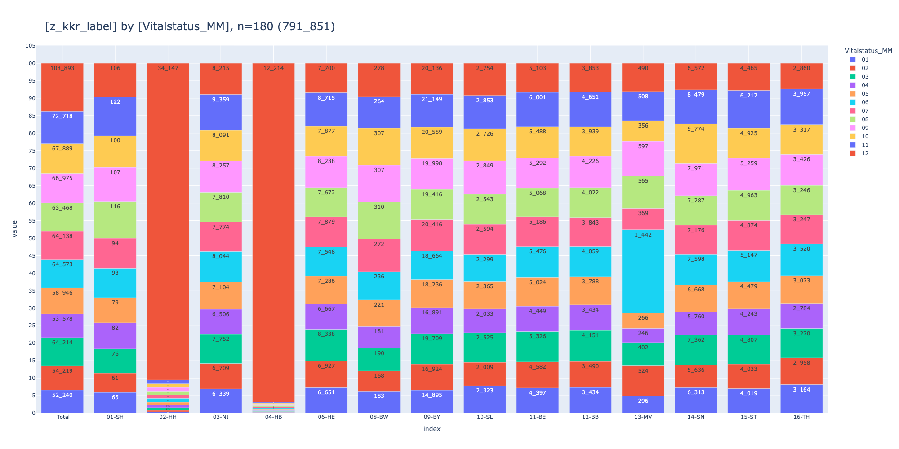
    

## [Numerische Variablen 🔢](#toc0_)

 

### [Diagnosealter](#toc0_)
- berechnet aus `Diagnosejahr` - `Geburtsjahr`
- negative Werte entstehen aus falscher Datumsreihenfolge von Ereignissen
- die Datumsangaben sind **nicht bereinigt**, um strukturelle Effekte sichtbar zu machen

> 💡 `HH`: _"Ja, das liegt an dem Geschätzt-Flag in den Datumsangaben. In unseren Daten haben wir noch die alte Ausprägung 'Jahr geschätzt', diese wird dann im ZFKD-Datensatz mit 'Vollständig geschätzt' übersetzt. Theoretisch könnten Sie statt 1900 auch das angegebene Jahr nutzen… Aber diese Schätz-Angabe ist uns auch ein Dorn im Auge. Wir werden es auch noch in unseren Daten bereinigen. Zumeist handelt es sich da bei uns um Dokumentations oder Verständnisfehler."_

    
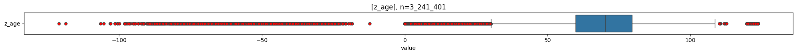
    

    
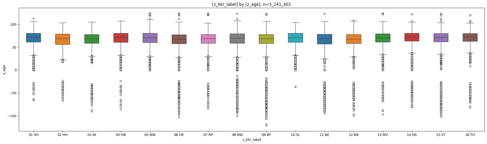
    

    
    column |   count   |   min   | lower |  q25  | median | mean  |  q75  | upper  |  max   |  std  |  cv  |      sum      
    -------+-----------+---------+-------+-------+--------+-------+-------+--------+--------+-------+------+---------------
    z_age  | 3_241_401 | -121.00 | 30.17 | 59.75 |  70.17 | 68.14 | 79.50 | 108.50 | 123.67 | 15.21 | 0.22 | 220_885_151.06
    

    
    column |  count  |   min   | lower |  q25  | median | mean  |  q75  | upper  |  max   |  std  |  cv  |      sum     
    -------+---------+---------+-------+-------+--------+-------+-------+--------+--------+-------+------+--------------
    01-SH  | 150_685 |  -65.75 | 31.83 | 61.17 |  72.33 | 69.85 | 80.75 | 106.67 | 112.50 | 14.30 | 0.20 | 10_526_086.49
    02-HH  |  55_559 |  -67.17 | 22.50 | 56.25 |  68.67 | 66.15 | 78.75 | 103.50 | 103.50 | 16.19 | 0.24 |  3_675_406.72
    03-NI  | 216_710 |  -90.17 | 30.25 | 58.83 |  68.75 | 67.03 | 77.92 | 105.33 | 105.33 | 14.23 | 0.21 | 14_526_445.88
    04-HB  |  25_182 |  -85.83 | 32.08 | 61.08 |  71.67 | 69.36 | 80.42 | 107.33 | 107.33 | 15.00 | 0.22 |  1_746_681.28
    05-NW  | 805_679 |    0.00 | 30.08 | 60.33 |  70.92 | 69.14 | 80.50 | 110.58 | 123.67 | 14.83 | 0.21 | 55_707_787.00
    06-HE  | 174_565 | -103.08 | 27.75 | 57.42 |  67.92 | 65.82 | 77.25 | 105.00 | 123.67 | 15.61 | 0.24 | 11_489_971.53
    07-RP  | 123_111 |  -83.25 | 29.83 | 58.67 |  68.58 | 66.89 | 77.92 | 102.75 | 123.67 | 14.60 | 0.22 |  8_235_295.90
    08-BW  | 362_189 | -100.58 | 28.00 | 58.92 |  69.67 | 67.35 | 79.58 | 107.83 | 123.17 | 16.66 | 0.25 | 24_393_498.26
    09-BY  | 431_813 | -121.00 | 28.83 | 58.33 |  68.75 | 66.65 | 78.00 | 106.67 | 123.25 | 15.83 | 0.24 | 28_780_598.59
    10-SL  |  48_061 |  -36.58 | 32.08 | 61.00 |  70.75 | 69.23 | 80.33 | 103.92 | 103.92 | 14.43 | 0.21 |  3_327_310.08
    11-BE  | 114_910 |  -94.33 | 24.33 | 56.92 |  68.75 | 65.83 | 78.67 | 106.75 | 123.25 | 17.67 | 0.27 |  7_564_274.42
    12-BB  | 104_299 |  -99.92 | 28.83 | 58.33 |  68.00 | 66.51 | 78.00 | 107.33 | 108.50 | 14.98 | 0.23 |  6_936_657.61
    13-MV  | 110_032 |  -96.58 | 33.92 | 61.25 |  70.42 | 68.97 | 79.50 | 106.25 | 123.17 | 13.72 | 0.20 |  7_588_761.64
    14-SN  | 300_228 |  -80.83 | 37.50 | 63.25 |  72.67 | 70.50 | 80.42 | 105.00 | 122.00 | 13.57 | 0.19 | 21_167_261.67
    15-ST  | 126_193 | -101.42 | 34.92 | 62.00 |  71.58 | 69.38 | 80.08 | 103.42 | 123.50 | 15.86 | 0.23 |  8_755_539.57
    16-TH  |  92_185 |  -81.83 | 37.17 | 62.75 |  71.83 | 70.12 | 79.83 | 103.08 | 120.17 | 13.15 | 0.19 |  6_463_574.42
    

 

### [Anzahl Tage zwischen Diagnose und Tod](#toc0_)

> 💡 `ZfKD`: _"es treten Extremwerte auf, weit ausserhalb des Interquartilsabstandes. Grund dafür sind mutmasslich fehlende Datumsangaben, die auf 1900 kodiert werden"_  
> 💡 `ZfKD`: _"in der KKR Verteilung sind die Extreme in den GTDS Ländern besonders ausgeprägt"_

    
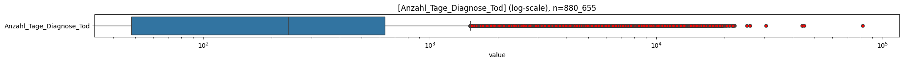
    

    

    

    
    column                   |  count  |   min   | lower |  q25  | median |  mean  |  q75   | upper |  max   |   std    |  cv  |     sum    
    -------------------------+---------+---------+-------+-------+--------+--------+--------+-------+--------+----------+------+------------
    Anzahl_Tage_Diagnose_Tod | 880_655 | -27_320 |  -212 | 48.00 | 238.00 | 599.84 | 633.00 | 1_510 | 81_801 | 1_218.24 | 2.03 | 528_249_239
    

    
    column |  count  |   min   | lower |  q25   | median |   mean   |   q75    | upper |  max   |   std    |  cv  |     sum    
    -------+---------+---------+-------+--------+--------+----------+----------+-------+--------+----------+------+------------
    01-SH  |  40_150 |       0 |     0 |  29.00 | 193.00 |   336.30 |   527.00 | 1_274 |  1_783 |   381.00 | 1.13 |  13_502_416
    02-HH  |  17_931 |       0 |     0 |  34.00 | 163.00 |   301.89 |   456.00 | 1_089 |  1_784 |   350.89 | 1.16 |   5_413_197
    03-NI  |  62_000 |       0 |     0 |  72.00 | 238.00 |   354.04 |   529.00 | 1_214 |  1_752 |   352.65 | 1.00 |  21_950_735
    04-HB  |   7_806 |       0 |     0 |  25.00 | 145.00 |   287.97 |   451.00 | 1_089 |  1_688 |   339.30 | 1.18 |   2_247_856
    05-NW  | 230_941 |       0 |     0 |  28.00 | 187.00 |   333.87 |   523.00 | 1_265 |  1_847 |   383.06 | 1.15 |  77_103_307
    06-HE  |  52_053 |       0 |     0 |  84.00 | 287.00 |   560.95 |   674.00 | 1_559 | 20_880 |   905.90 | 1.61 |  29_199_049
    07-RP  |  25_580 |       0 |     0 |  57.00 | 197.00 |   309.62 |   463.00 | 1_072 |  1_857 |   324.37 | 1.05 |   7_920_133
    08-BW  | 113_669 |       0 |     0 |  55.00 | 243.00 |   373.43 |   577.00 | 1_360 |  2_043 |   391.38 | 1.05 |  42_447_082
    09-BY  | 123_325 |       0 |     0 |  43.00 | 281.00 | 1_030.24 |   880.00 | 2_135 | 81_801 | 1_963.93 | 1.91 | 127_054_702
    10-SL  |   2_724 |       0 |     0 |   0.00 |   0.00 |    36.19 |     8.00 |    20 |  1_309 |   120.67 | 3.33 |      98_573
    11-BE  |  36_804 |       0 |     0 |  24.00 | 160.00 |   374.32 |   496.00 | 1_204 | 12_262 |   625.57 | 1.67 |  13_776_593
    12-BB  |  35_635 |       0 |     0 |  38.00 | 222.00 |   894.02 |   729.00 | 1_765 | 18_846 | 1_772.39 | 1.98 |  31_858_484
    13-MV  |  25_806 | -27_320 |  -212 | 113.00 | 394.00 | 1_146.03 | 1_127.00 | 2_648 | 16_507 | 1_859.12 | 1.62 |  29_574_535
    14-SN  |  73_771 |       0 |     0 | 137.00 | 487.00 | 1_329.08 | 1_450.00 | 3_419 | 30_549 | 2_020.37 | 1.52 |  98_047_409
    15-ST  |  19_946 |       0 |     0 |  24.00 | 158.00 |   723.30 |   557.00 | 1_355 | 14_859 | 1_543.28 | 2.13 |  14_426_989
    16-TH  |  12_514 |       0 |     0 |  84.00 | 336.00 | 1_089.03 | 1_100.00 | 2_623 | 17_766 | 1_823.47 | 1.67 |  13_628_179
    

 

### [Tumordicke](#toc0_)

    
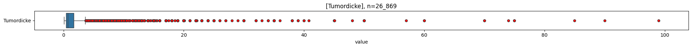
    

    
    column     | count  |  min  | lower |  q25  | median | mean  |  q75  | upper |  max   |  std  |  cv   |    sum    
    -----------+--------+-------+-------+-------+--------+-------+-------+-------+--------+-------+-------+-----------
    Tumordicke | 26_869 | 0.100 | 0.100 | 0.400 |  0.700 | 1.732 | 1.700 | 3.600 | 99.000 | 3.269 | 1.887 | 46_537.301
    

    
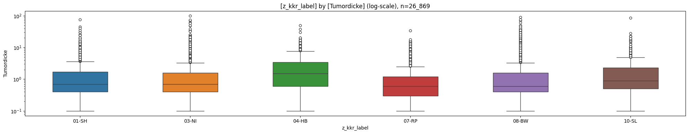
    

### [PSA](#toc0_)

    
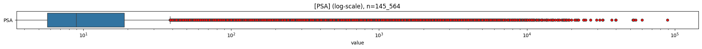
    

    
    column |  count  |  min  | lower |  q25  | median |  mean  |  q75   | upper  |    max     |   std   |  cv   |      sum      
    -------+---------+-------+-------+-------+--------+--------+--------+--------+------------+---------+-------+---------------
    PSA    | 145_564 | 0.000 | 0.000 | 5.720 |  8.930 | 94.472 | 18.900 | 38.670 | 89_280.000 | 728.099 | 7.707 | 13_751_676.000
    

    
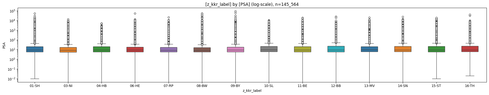
    

### [LK_befallen](#toc0_)

    
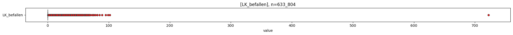
    

    
    column      |  count  | min | lower |  q25  | median | mean  |  q75  | upper | max |  std  |  cv   |   sum  
    ------------+---------+-----+-------+-------+--------+-------+-------+-------+-----+-------+-------+--------
    LK_befallen | 633_804 |   0 |     0 | 0.000 |  0.000 | 0.911 | 0.000 |     0 | 722 | 3.095 | 3.397 | 577_541
    

    

    

### [LK_untersucht](#toc0_)

    

    

    
    column        |  count  | min | lower |  q25  | median |  mean  |  q75   | upper |  max  |  std   |  cv   |    sum   
    --------------+---------+-----+-------+-------+--------+--------+--------+-------+-------+--------+-------+----------
    LK_untersucht | 761_827 |   0 |     0 | 0.000 |  5.000 | 10.543 | 17.000 |    42 | 2_319 | 13.518 | 1.282 | 8_031_748
    

    
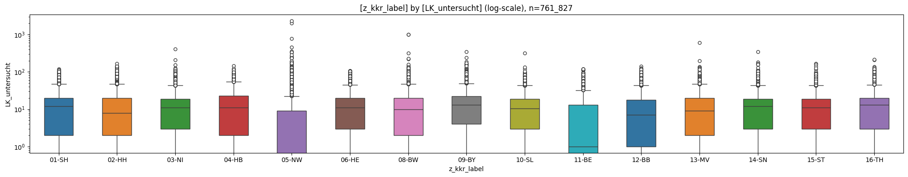
    

### [RektumAbstandAnokutanlinie](#toc0_)

    
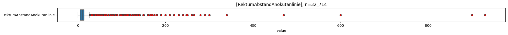
    

    
    column                     | count  | min | lower |  q25  | median |  mean  |  q75   | upper | max |  std   |  cv   |   sum  
    ---------------------------+--------+-----+-------+-------+--------+--------+--------+-------+-----+--------+-------+--------
    RektumAbstandAnokutanlinie | 32_714 |   0 |     0 | 5.000 | 10.000 | 11.615 | 14.000 |    27 | 930 | 18.365 | 1.581 | 379_983
    

    
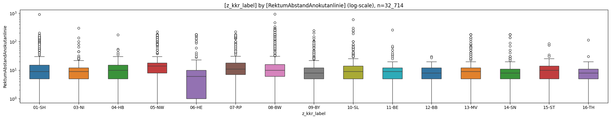
    

### [LDH](#toc0_)

    

    

    
    column | count | min | lower |   q25   | median  |  mean   |   q75   | upper |  max  |   std   |  cv   |   sum  
    -------+-------+-----+-------+---------+---------+---------+---------+-------+-------+---------+-------+--------
    LDH    | 2_231 |   1 |    83 | 174.000 | 200.000 | 219.252 | 235.000 |   326 | 3_650 | 141.193 | 0.644 | 489_151
    

    
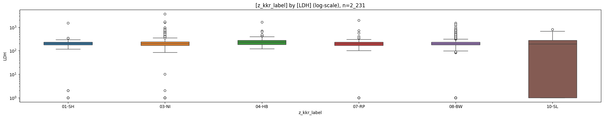
    

