# [Technische Prüfungen in klinischen und epi Daten](#toc0_)

**Table of contents**    
- [Technische Prüfungen in klinischen und epi Daten](#toc1_)    
  - [Hintergrund](#toc1_1_)    
  - [Zusammenfassung ⚖️](#toc1_2_)    
  - [load data 📁](#toc1_3_)    
  - [Datenstand ⏱️](#toc1_4_)    
  - [Qualitätsprüfungen](#toc1_5_)    
    - [geschlecht_missing](#toc1_5_1_)    
    - [verstorben_missing](#toc1_5_2_)    
    - [diagnose_missing](#toc1_5_3_)    
    - [inzidenzort_missing](#toc1_5_4_)    
    - [geschlecht_icd_konflikt](#toc1_5_5_)    
    - [datum_missing](#toc1_5_6_)    
    - [datum_fehlerhaft](#toc1_5_7_)    
  - [Duplikate](#toc1_6_)    
    - [Echte Duplikate](#toc1_6_1_)    
    - [Duplikatverdacht](#toc1_6_2_)    
      - [Verteilung nach Inzidenzort](#toc1_6_2_1_)    
      - [Verteilung nach Diagnosejahr](#toc1_6_2_2_)    
      - [Verteilung nach ICD10](#toc1_6_2_3_)    
      - [Verteilung der Gruppen mit gleichen Merkmalen](#toc1_6_2_4_)    

<!-- vscode-jupyter-toc-config
	numbering=false
	anchor=true
	flat=false
	minLevel=1
	maxLevel=6
	/vscode-jupyter-toc-config -->
<!-- THIS CELL WILL BE REPLACED ON TOC UPDATE. DO NOT WRITE YOUR TEXT IN THIS CELL -->

 

## [Hintergrund](#toc0_)
- Ziel der Auswertungen ist es, Qualitätsprüfungen auf **technischer** Ebene darzustellen
- im Abgrenzung zu den **inhaltlichen** Prüfungen des klinischen Datenberichtes sollen hier eher Auffälligkeiten des Verarbeitungsprozesses sichtbar werden, z.B. missings / Konflikte bei zentralen Variablen wie Datumsangaben, Geschlecht etc.
- die Auswertungen sind angelehnt an die bei den epi Daten etablierten _ABC Prüfungen_ (siehe `Bericht zur Datenqualität (epi2023)`)
- die Abgrenzung dieses Dokumentes zum DQ Bericht epi ist derzeit nicht zufriedenstellend gelöst und muss zukünftig verbessert werden
- dargestellt sind hier jeweils Auffälligkeiten sowohl in den klinischen als auch in den epi Daten
- weiterhin nehmen wir bei keinem dieser Prüfungen eine Korrektur in den **klinischen Daten** vor

## [Zusammenfassung ⚖️](#toc0_)
- [fehlendes Geschlecht](#toc1_4_1_) tritt nicht auf in den klinischen Daten, in den epi Daten überwiegend in `06-HE`
- für [fehlende Diagnose](#toc1_4_3_) bei den klinischen Daten gibt es einige wenige Fälle in `13-MV` und `16-TH`. Für die epi Daten ist eine Bewertung schwierig aufgrund der vielfältigen Bearbeitungsschritte nach Lieferung
- fehlender Inzidenzort tritt in den klinischen Daten nur in `13-MV` auf. Bei den epi Daten wird diese Variable bei missings auto-korrigiert 
- Widerspruch zwischen Geschlecht und Diagnose ist in den klinischen Daten eine Randerscheinung, in den epi Daten treten diese Kombinationen inzwischen nicht mehr auf
- fehlende Datumsangaben sind in den klinischen Daten in etwa proportional zur Registergrösse, bei den epi Daten überwiegend in `10-SL`
- [echte Duplikate](#toc1_5_1_) (gleiches set an Merkmalen und gleiche ID) für klinische Daten kommen ausschliesslich aus `09-BY`, bleiben aber Randfälle
- [Duplikatverdachtsfälle](#toc1_5_2_) sind deutlich weniger auffällig als letztes Jahr. Diese verteilen sich hauptsächlich auf `11-BE`, `09-BY` und `03-NI`, was möglicherweise an lokalen Häufungen von Fällen mit gleichem Inzidenzort liegt

 

## [load data 📁](#toc0_)

    🐍 3.12.8 | 📦 pandas: 2.3.3 | 📦 numpy: 1.26.4 | 📦 duckdb: 1.4.1 | 📦 pandas-plots: 0.21.3 | 📦 connection-helper: 0.13.1

 

## [Datenstand ⏱️](#toc0_)

    sqlite db file:          2025-11-11_data_clin.duckdb
    data tag:                v2.3
    last kkr data import:    2025-09-30
    sql table created:       2025-11-11 11:52:01
    doi:                     10.18444/5.03.01.0005.0021.0002
    document created:        2025-11-17 12:29:01
    
    sqlite db file:          2025-06-20_data_epi.duckdb
    data tag:                epi2024_2
    sql table created:       2025-06-20 15:31:26
    document created:        2025-11-17 12:29:01

## [Qualitätsprüfungen](#toc0_)
- kein Filter, die Prüfungen wirken auf den gesamten Datenbestand
- zur Darstellung wird eine heatmap verwendet, dem maximalen Wert je Prüfung wird die kräftigste Farbe zugewiesen. Aus diesem relativ gesetzten Farbton ist nicht ableitbar, wie schwerwiegend die Fallzahl ist

 

### [geschlecht_missing](#toc0_)
- Variable `Geschlecht` / `SEX` missing

    🟧 🗄️ klin

    
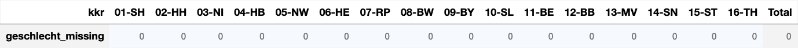
    

    🟧 🗄️ epi

    
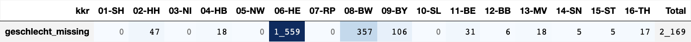
    

 

### [verstorben_missing](#toc0_)
- Variable `Verstorben` / `TOD` missing

>Die Variable `TOD` wird in den epi Daten imputiert, kann also dort auch nicht fehlen

    🟧 🗄️ klin

    
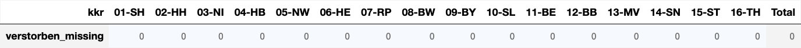
    

    🟧 🗄️ epi

    

    

 

### [diagnose_missing](#toc0_)
- Variable `Diagnose_ICD10_Code` ist 
  - leer (konkret sind hier die Felder bei der Übermittlung zumeist nicht fehlend, sondern als `''` kodiert)
  - oder nicht in [`C`,`D`]
> klin: nur wenige Kodierungen im Datensatz aus anderen Kapiteln

> ⚠️ epi: In den ABC Prüfungen der epi Daten wird getestet, ob ein Diagnosecode leer ist oder ausserhalb des "Diagnosebandes" des ZfKD (konkret: `A_ICD10_keineAuswertung[54]`). Der Test ist auch im Datenbericht der epi Daten sichtbar, dort wird allerdings nur das letzte DJ herangezogen, um auf die aktuelle Entwicklung zu fokussieren.

    🟧 🗄️ klin

    
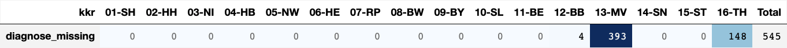
    

    Verteilung icd10 ausserhalb [C,D]: {None: 545}

    🟧 🗄️ epi

    
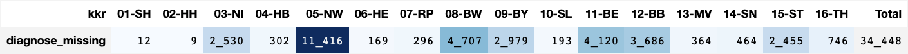
    

    Verteilung icd10 ausserhalb [C,D]: {None: 34482}

 

### [inzidenzort_missing](#toc0_)
- Variable `Inzidenzort` fehlt, oder ist unbrauchbar kodiert (_00000_, _99999_, oder Länge !> 5)
> epi: die Variable GKZlk wird nachbearbeitet im workflow

    🟧 🗄️ klin

    
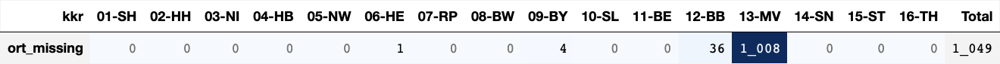
    

    Verteilung inzidenzort missing oder ungültig{'99999': 49, None: 1000}

    🟧 🗄️ epi

    
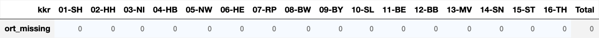
    

    Verteilung inzidenzort missing oder ungültig{}

 

### [geschlecht_icd_konflikt](#toc0_)
- Widerspruch zwischen Geschlecht und Diagnose, eines der Kombinationen:
  - männlich und `['C51','C52','C53','C54','C55','C56','C57','C58']`
  - weiblich und `['C60','C61','C62','C63']`

    🟧 🗄️ klin

    
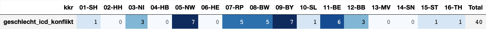
    

    Kombination Geschlecht - ICD10 ungültig: {'C61-W': 24, 'C54-M': 4, 'C56-M': 2, 'C62-W': 2, 'C51-M': 2, 'C63-W': 1, 'C57-M': 1, 'C52-M': 1, 'C53-M': 1, 'C55-M': 1, 'C58-M': 1}

    🟧 🗄️ epi

    
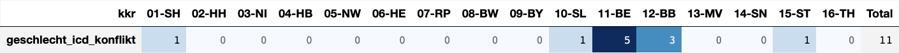
    

    Kombination Geschlecht - ICD10 ungültig: {'C61-W': 7, 'C52-M': 1, 'C56-M': 1, 'C62-W': 1, 'C63-W': 1}

 

### [datum_missing](#toc0_)
- `Diagnosedatum` oder `Geburtsdatum` ist leer (bzw. als Jahr 1900 kodiert)
- nicht gesetzte Angaben zum Vitalstatus sind ignoriert
> ⚠️ hier sind auch regulär übermittelte Fälle mit vollständig (`V`) geschätztem Datum enthalten

    🟧 🗄️ klin

    
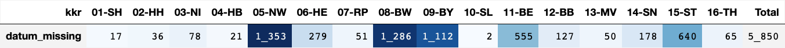
    

    Verteilung top 3 (GebDat - DiagDat): {'1900-04-01-2023-07-15': 171, '1900-04-01-2023-01-15': 169, '1900-04-01-2023-06-15': 89}

    🟧 🗄️ epi

    
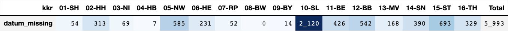
    

    Verteilung top 3 (GebDat - DiagDat): {'<NA>-': 155, '1932-06-15-1900-04-15': 12, '1939-10-15-1900-04-15': 12}

 

### [datum_fehlerhaft](#toc0_)
- `Vitalstatus` vor `Geburt` oder `Diagnose` vor/gleich `Geburt`
- alle 3 beteiligten Felder dürfen nicht missing sein

 

    🟧 🗄️ klin

    
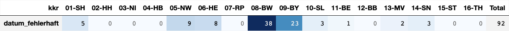
    

    Verteilung datum_fehlerhaft top 5:
    ┌──────────────┬───────────────┬───────┐
    │ Geburtsdatum │ Diagnosedatum │  cnt  │
    │     date     │     date      │ int64 │
    ├──────────────┼───────────────┼───────┤
    │ 2023-03-15   │ 2023-03-15    │     4 │
    │ 2020-10-15   │ 2020-10-15    │     3 │
    │ 2021-01-15   │ 2021-01-15    │     3 │
    │ 2022-07-15   │ 2022-07-15    │     3 │
    │ 2023-01-15   │ 2023-01-15    │     3 │
    └──────────────┴───────────────┴───────┘
    

    🟧 🗄️ epi

    
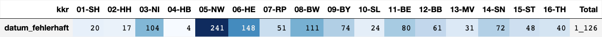
    

    Verteilung datum_fehlerhaft top 5:
    ┌──────────────┬───────────────┬───────┐
    │ Geburtsdatum │ Diagnosedatum │  cnt  │
    │     date     │     date      │ int64 │
    ├──────────────┼───────────────┼───────┤
    │ 2013-09-15   │ 2013-09-15    │    12 │
    │ 2013-04-15   │ 2013-04-15    │    10 │
    │ 2019-03-15   │ 2019-03-15    │    10 │
    │ 2019-04-15   │ 2019-04-15    │    10 │
    │ 2013-11-15   │ 2013-11-15    │    10 │
    └──────────────┴───────────────┴───────┘
    

## [Duplikate](#toc0_)

- Echte Duplikate stellen Fälle **mit gleicher Id und gleichem hash-wert dar**
- Duplikat-Verdacht: Duplikate **mit gleicher Id**, **aber ohne inhaltliche Gleichheit** sind häufiger, stellen aber lediglich eine Folge der Id Vergabe im GTDS Verbund dar. Da in der Verarbeitung eine zufällige `uuid` vergeben wird entstehen hier auch keine Kollisionen

 

### [Echte Duplikate](#toc0_)
- analysiert werden Tumorfälle auf Basis gleicher `Tumor_ID` (original gelieferte Id)
- ebenfalls herangezogen wird ein #️⃣hash-wert über eine Auswahl von Spalten
- haben Tumorfälle den gleichen hash-wert, kann eine inhaltliche Gleichheit **angenommen** werden

- **Ergebnis**
  - ~1000 Paare mit echten Duplikaten sind in den Daten, alle aus `09-BY`.
  - keine der Paare sind innerhalb einer Lieferdatei, also keine Gefahr für die Verarbeitung
  - im Beispiel sind zwei Tumore mit gleicher originalen ID und gleichem hash-wert, aber verschiedenen Dateien
  - in allen Duplikaten werden technische ID neu vergeben, es kommt also nicht zu Kollisionen

 

Tests:

    Für den hash-wert sind folgende Spalten herangezogen:
    Diagnose_ICD10_Code, Morphologie_Code, Topographie_Code, Geburtsdatum, Diagnosedatum, Geschlecht, Verstorben, Inzidenzort, Seitenlokalisation, T_p, Grading, N_p, Diagnosesicherung, M_p

    Echte Duplikate (gleiche Tumor_ID UND gleicher Inhalt/hash):
    ┌──────┬──────────┬───────────┬───────────┬───────────────────┬────────────────────────────────────────────┐
    │ kkr  │ same_kkr │ same_file │ cnt_cases │ max_cases_in_dupl │              example_Tumor_ID              │
    │ int8 │ boolean  │  boolean  │   int64   │       int64       │                  varchar                   │
    ├──────┼──────────┼───────────┼───────────┼───────────────────┼────────────────────────────────────────────┤
    │    9 │ true     │ false     │      1096 │                 2 │ 00045650C5B00E9E723E8655919ABBC20F15348B_1 │
    └──────┴──────────┴───────────┴───────────┴───────────────────┴────────────────────────────────────────────┘
    

    
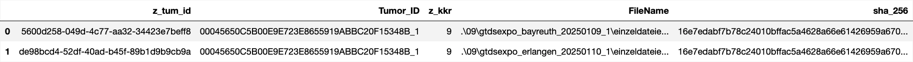
    

 

### [Duplikatverdacht](#toc0_)
- die originale `Tumor_ID` wird hier ignoriert
- es wird für alle Tumorfälle geprüft, ob es Fälle mit gleicher Kombination verschiedener Merkmale gibt
- Verdachtsfälle mit gleicher Kombination aus verschiedenen Registern und Patienten sind möglich
- die Übereinstimmungswahrscheinlichkeit steigt deutlich, wenn mehr Merkmale leer sind

    Verwendete Merkmale: Diagnose_ICD10_Code, Morphologie_Code, Topographie_Code, Geburtsdatum, Diagnosedatum, Geschlecht, Verstorben, Inzidenzort, Seitenlokalisation, T_p, Grading, N_p, Diagnosesicherung, M_p
    
    🟧 🗄️ klin

    
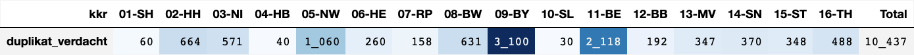
    

    🟧 🗄️ epi

    
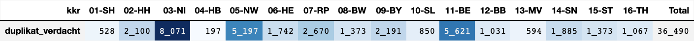
    

 

#### [Verteilung nach Inzidenzort](#toc0_)

    🟧 🗄️ klin

    
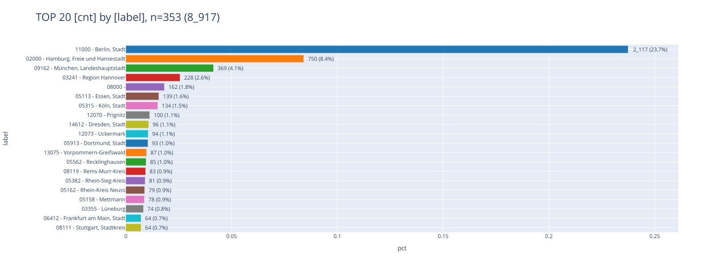
    

    🟧 🗄️ epi

    
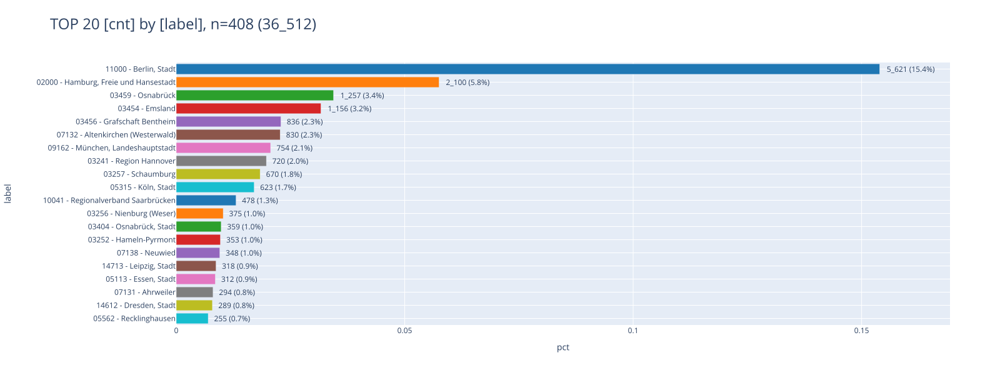
    

 

#### [Verteilung nach Diagnosejahr](#toc0_)

    🟧 🗄️ klin

    
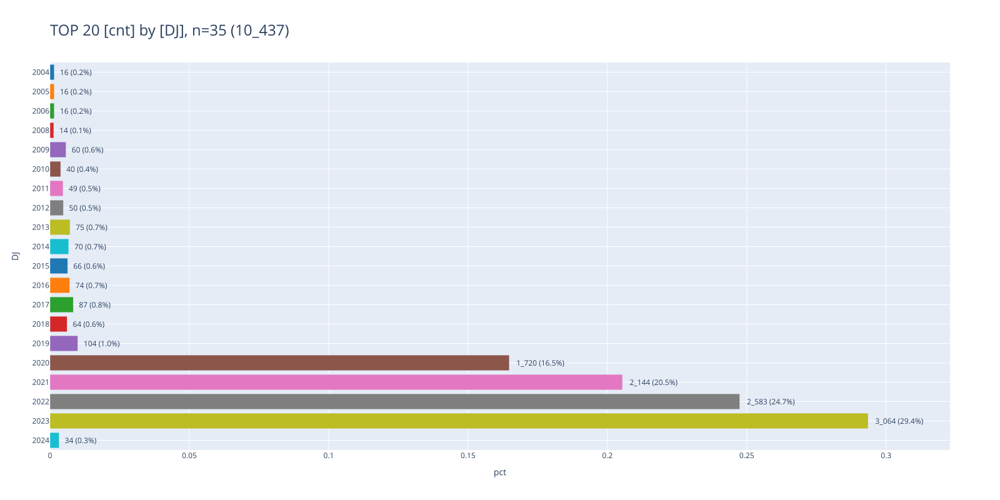
    

    🟧 🗄️ epi

    
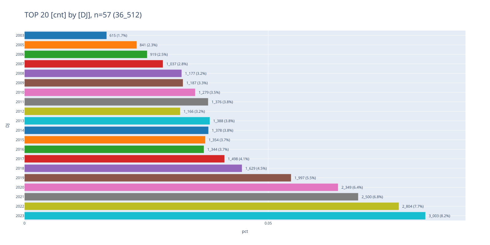
    

 

#### [Verteilung nach ICD10](#toc0_)

    🟧 🗄️ klin

    
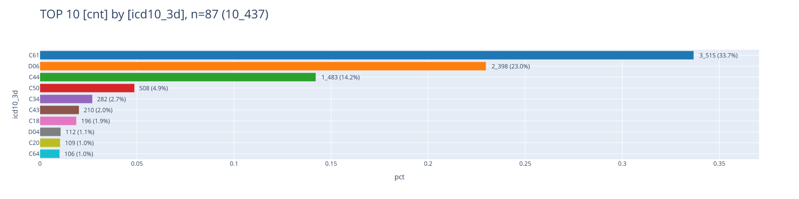
    

    🟧 🗄️ epi

    
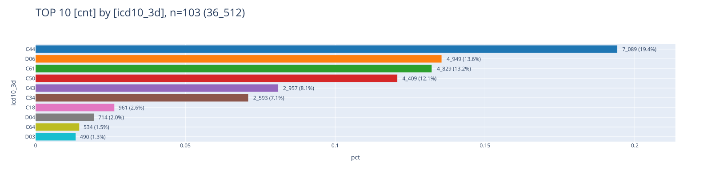
    

 

#### [Verteilung der Gruppen mit gleichen Merkmalen](#toc0_)
- "_Gruppe_" = >1 Verdachtsfälle mit gleichen Merkmalen
- verwendete Metriken (jeweils aufgetragen: `is_equal` = "alle Fälle in der Gruppe haben den gleichen Wert")
> es gibt wenige Gruppen, in denen die Duplikate aus verschiedenen kkr stammen  
> in den meisten Gruppen stammen die Duplikate nicht von einem einzelnen Patienten  

    🟧 🗄️ klin
    10_437 Fälle verteilen sich auf 5_103 Gruppen mit max 4 Fällen in einer Gruppe
    Anzahl Gruppen, in denen alle Fälle das gleiche Merkmal aufweisen: REGISTER {True: 4903, False: 200}
    Anzahl Gruppen, in denen alle Fälle das gleiche Merkmal aufweisen: PATIENTID {False: 4470, True: 633}

    🟧 🗄️ epi
    36_512 Fälle verteilen sich auf 18_022 Gruppen mit max 6 Fällen in einer Gruppe
    Anzahl Gruppen, in denen alle Fälle das gleiche Merkmal aufweisen: REGISTER {True: 18022}
    Anzahl Gruppen, in denen alle Fälle das gleiche Merkmal aufweisen: PATIENTID {False: 16671, True: 1351}

