# <a id='toc1_'></a>[Bericht zur Datenqualität (epi2025_beta) 📉](#toc0_)

**Table of contents**<a id='toc0_'></a>    
- [Bericht zur Datenqualität (epi2025_beta) 📉](#toc1_)    
  - [Änderungen seit der letzten Version](#toc1_1_)    
  - [Hinweise](#toc1_2_)    
  - [Datenstand 🕥](#toc1_3_)    
  - [Fallzahlen im Verlauf der Jahreslieferungen](#toc1_4_)    
    - [original geliefert vor ZfKD Prüfungen](#toc1_4_1_)    
    - [jeweils letztes DJ nach ZfKD  Prüfungen](#toc1_4_2_)    
  - [Variablenverteilung](#toc1_5_)    
    - [Diagnosejahr](#toc1_5_1_)    
    - [Diagnosegruppen](#toc1_5_2_)    
    - [Diagnosesicherung](#toc1_5_3_)    
    - [DCO Diagramm](#toc1_5_4_)    
    - [DCO](#toc1_5_5_)    
    - [Angabe Register vs Bundesland](#toc1_5_6_)    
    - [Dignität](#toc1_5_7_)    
    - [Grading Verteilung](#toc1_5_8_)    
    - [Grading Anteil](#toc1_5_9_)    
    - [Altersgruppen](#toc1_5_10_)    
    - [UICC](#toc1_5_11_)    
    - [TNM-Auflage](#toc1_5_12_)    
    - [Tod](#toc1_5_13_)    
      - [Anteil Verstorbene](#toc1_5_13_1_)    
      - [Verteilung Todesursachen nach ICDT10](#toc1_5_13_2_)    
  - [Anteil Mehrfachtumore](#toc1_6_)    
  - [Plausibilitätsprüfungen](#toc1_7_)    
    - [⚠️ 01-SH](#toc1_7_1_)    
    - [✅ 02-HH](#toc1_7_2_)    
    - [✅ 03-NI](#toc1_7_3_)    
    - [✅ 04-HB](#toc1_7_4_)    
    - [⚠️ 05-NW](#toc1_7_5_)    
    - [🚨 06-HE](#toc1_7_6_)    
    - [✅ 07-RP](#toc1_7_7_)    
    - [✅ 08-BW](#toc1_7_8_)    
    - [✅ 09-BY](#toc1_7_9_)    
    - [✅ 10-SL](#toc1_7_10_)    
    - [✅ 11-GKR (ehemals)](#toc1_7_11_)    

<!-- vscode-jupyter-toc-config
	numbering=false
	anchor=true
	flat=false
	minLevel=1
	maxLevel=6
	/vscode-jupyter-toc-config -->
<!-- THIS CELL WILL BE REPLACED ON TOC UPDATE. DO NOT WRITE YOUR TEXT IN THIS CELL -->

<br>

## <a id='toc1_1_'></a>[Änderungen seit der letzten Version](#toc0_)
<!-- - bisher wurden folgende Angaben in einer umfangreichen Verarbeitung im workflow umkodiert: `ICDGM10`, `HISC`, `ICDO3`, `DIG`. Diese Umformung wurde deaktiviert, es finden nun nur noch punktuelle Korrekturen statt -->
- Lieferung Daten mit DJ=2024
- ausstehend: `13-MV`

<br>

## <a id='toc1_2_'></a>[Hinweise](#toc0_)
- Bewertungen der Analysen sind mit 💡 markiert
- bei den Plausibilitätsprüfungen weist ein ✅ darauf hin, dass keine Mängel erkennbar sind

<br>

## <a id='toc1_3_'></a>[Datenstand 🕥](#toc0_)

    🐍 3.12.8 | 📦 pandas: 2.3.3 | 📦 numpy: 1.26.4 | 📦 duckdb: 1.5.0 | 📦 pandas-plots: 1.4.5


    database file:           2026-03-03_data_epi.duckdb
    data tag:                epi2025_beta2
    sql table created:       2026-03-03 09:47:44
    doi:                     -
    document created:        2026-03-26 16:41:50


    
    aktuellster batch               425
    aktuellstes Diagnosejahr 📆     (2024)


<div style="page-break-after: always;"></div>


<br>

## <a id='toc1_4_'></a>[Fallzahlen im Verlauf der Jahreslieferungen](#toc0_)
- kein Filter
- es werden Datenstände (_batch_) aus mehreren Lieferjahren dargestellt , welche über eine laufende Nummer sowie das Datum der Ausführung vergleichbar sind
- in Abgrenzung zu den klinischen Daten ist jede einzelne EKR Lieferung für das gesamte Lieferjahr gültig
- dargestellt sind die **letzten 5 veröffentlichten** Datenstände 

<br>

### <a id='toc1_4_1_'></a>[original geliefert vor ZfKD Prüfungen](#toc0_)
- die Übersicht macht erkennbar, wie sich die Fallzahlen absolut und relativ im Laufe der letzten Lieferungen entwickelt haben
- aufgeführt sind die Fallzahlen aus den überlieferten Dateien **vor** den ZfKD Anpassungen
- `batch_label` markiert den jeweils letzten offiziellen Datenstand des Lieferjahres, sowie den aktuellen Datenstand


    
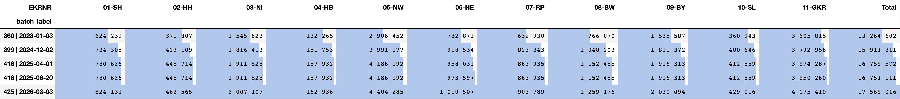
    


<br>

### <a id='toc1_4_2_'></a>[jeweils letztes DJ nach ZfKD  Prüfungen](#toc0_)
- Filter: jeweils das **letzte DJ** der einzelnen Jahreslieferung
- aufgeführt sind die Fallzahlen aus den überlieferten Dateien **nach** den ZfKD Anpassungen


    

    


<div style="page-break-after: always;"></div>


<br>

## <a id='toc1_5_'></a>[Variablenverteilung](#toc0_)
<!-- - **Filter:**
  - **🚨 sofern nicht anders angegeben ist der Zeitraum beschränkt auf das höchste Diagnosejahr (für `epi2024`: 2023) 🚨**
  - Diagnosen: ausgeschlossen sind `C44` und alle `D` -->
- ab hier wird nur noch die **aktuelle Datenlieferung** dargestellt
- als ungültig markierte Fälle (_A-Prüfungen_) sind in allen Fallzahlen **ausgeschlossen**
- in den barplots sind die relativen Häufigkeiten von Variablen im Datensatz der Register aufgetragen
- zusätzlich ist die Angabe für alle Register enthalten (`Total`)
- näherungsweise sind **GKZ-Bundesländer** verwendet anstatt Lieferregister, um 11-16 aufspannen zu können

<br>

### <a id='toc1_5_1_'></a>[Diagnosejahr](#toc0_)


```
    n = 17_569_016                             (100.0%) ██████████████████████████████
    └ [keine gelöschten Fälle]: n = 16_964_151  (96.6%) ░░████████████████████████████
    └ [DJ 2019-2025]:            n = 4_597_256  (26.2%) ░░░░░░░░░░░░░░░░░░░░░░░███████
    └ [ICD10 nur C]:             n = 3_886_792  (22.1%) ░░░░░░░░░░░░░░░░░░░░░░░░██████
    └ [keine C44,D04]:           n = 3_143_607  (17.9%) ░░░░░░░░░░░░░░░░░░░░░░░░░█████
```

<details>
<summary>filter-sql</summary>

```sql
is_deleted = 0
and z_dy between 2019 and 2025
and left(z_icd10_3d,1) = 'C'
and z_icd10_3d not in ('C44','D04')
```

</details>


    
    


    
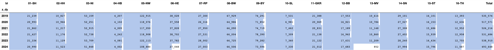
    


<br>

### <a id='toc1_5_2_'></a>[Diagnosegruppen](#toc0_)

> 💡 **ZfKD**
>
> D-Diagnosen (Vorstufen & unsichere Befunde)
> * Die Anteile sind in fast allen Bundesländern sehr ähnlich. 
> * Das zeigt, dass die Meldungen aus der Pathologie deutschlandweit relativ einheitlich erfasst werden.
> * Die Werte sind ein gutes Zeichen für eine vergleichbare Datenqualität.
>
> ---
>
> C44 (Heller Hautkrebs)
> * Hier sind die Fallzahlen überall hoch, aber die Anteile in der Grafik schwanken stark. 
> * Das liegt zum einen an der hohen Entdeckungsrate durch das Hautkrebs-Screening. 
> * Der Hauptgrund für die Unterschiede sind jedoch die **Landesgesetze**: Je nach Bundesland werden einfache Fälle (wie Basaliome) unterschiedlich streng gemeldet oder vergütet. Während manche Länder noch fast alles erfassen, konzentrieren sich andere bereits auf die schweren, "prognostisch ungünstigen" Verläufe.


```
    n = 17_569_016                             (100.0%) ██████████████████████████████
    └ [keine gelöschten Fälle]: n = 16_964_151  (96.6%) ░░████████████████████████████
    └ [DJ 2024]:                   n = 705_950   (4.0%) ░░░░░░░░░░░░░░░░░░░░░░░░░░░░░█
```

<details>
<summary>filter-sql</summary>

```sql
is_deleted = 0
and z_dy = 2024
```

</details>


    
    


    
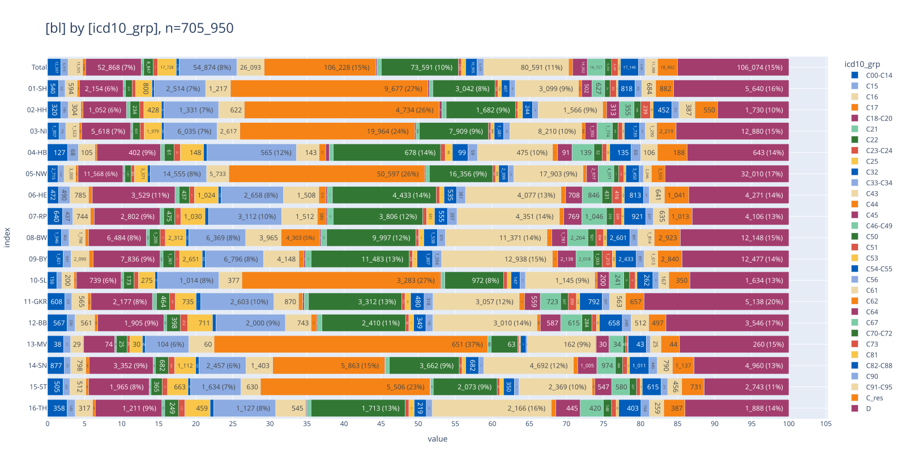
    


<br>

### <a id='toc1_5_3_'></a>[Diagnosesicherung](#toc0_)

> 💡 **ZfKD**
> 
> Fehlende Angabe
> * `08-BW` hat einen hohen Anteil an fehlenden Diagnosesicherungen mit zuletzt stark ansteigendem Trend
> ---
> Histologie Primärtumor
> * Der Großteil der Meldungen basiert auf einer soliden feingeweblichen Untersuchung.
> ---
> Zytologie
> * In einigen Ländern ist dieser Anteil erkennbar breiter als in anderen. Da die Zytologie oft bei Lungen- oder Schilddrüsenuntersuchungen genutzt wird, könnte dies auf eine starke Vernetzung mit entsprechenden Fachkliniken hindeuten, die ihre Befunde sehr detailliert an das Register melden.


```
    n = 17_569_016                             (100.0%) ██████████████████████████████
    └ [keine gelöschten Fälle]: n = 16_964_151  (96.6%) ░░████████████████████████████
    └ [DJ 2024]:                   n = 705_950   (4.0%) ░░░░░░░░░░░░░░░░░░░░░░░░░░░░░█
    └ [ICD10 nur C]:               n = 599_876   (3.4%) ░░░░░░░░░░░░░░░░░░░░░░░░░░░░░█
    └ [keine C44,D04]:             n = 493_648   (2.8%) ░░░░░░░░░░░░░░░░░░░░░░░░░░░░░░
```

<details>
<summary>filter-sql</summary>

```sql
is_deleted = 0
and z_dy = 2024
and left(z_icd10_3d,1) = 'C'
and z_icd10_3d not in ('C44','D04')
```

</details>


    
    


    
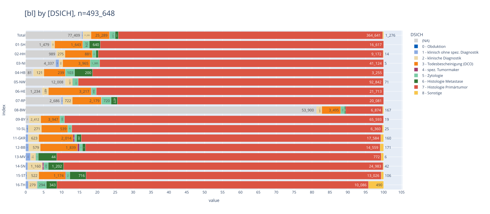
    


```
    n = 17_569_016                             (100.0%) ██████████████████████████████
    └ [keine gelöschten Fälle]: n = 16_964_151  (96.6%) ░░████████████████████████████
    └ [DJ ab 2010]:             n = 11_220_232  (63.9%) ░░░░░░░░░░░███████████████████
    └ [ICD10 nur C]:             n = 9_692_961  (55.2%) ░░░░░░░░░░░░░░████████████████
    └ [keine C44,D04]:           n = 7_646_321  (43.5%) ░░░░░░░░░░░░░░░░░█████████████
```

<details>
<summary>filter-sql</summary>

```sql
is_deleted = 0
and DJ >= 2010
and left(z_icd10_3d,1) = 'C'
and z_icd10_3d not in ('C44','D04')
```

</details>


    
    


    
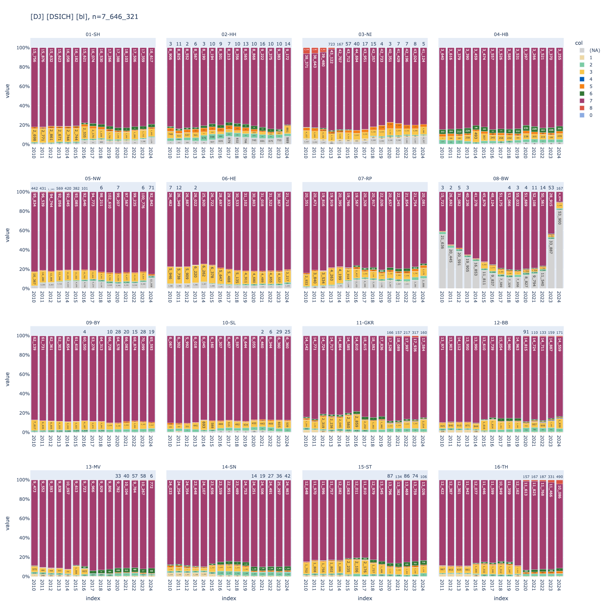
    


<!-- <br>


<br>

### <a id='toc1_5_4_'></a>[DCO Diagramm](#toc0_)
- **Filter: DJ = 2020-2024, C44 und D-Diagnosen sind ausgeschlossen, GKZbl 01-16**
- die epi Variable `DCO` wird wie folgt gebildet:
  - 1 wenn Diagnosesicherung = 3
  - sonst 2 (auch für Diagnosesicherung missing)  -->


<br>

### <a id='toc1_5_5_'></a>[DCO](#toc0_)
- Metrik: Anteil DCO an Gesamtfallzahl in %

> 💡 **ZfKD**
> 
> Fehlende DCO Fälle bzw Markierungen
> * es ist nicht ersichtlich, ob DCO Fälle nicht übermittelt oder nicht markiert sind
> * `05-NW` hat fast keine DCO Fälle im aktuelle Jahr
> * `08-BW` keine / kaum DCO Fälle vor 2015
> * `13-MV` `14-SN` `16-TH` haben kaum DCO Fälle seit Beginn der klinischen Lieferungen


```
    n = 17_569_016                             (100.0%) ██████████████████████████████
    └ [keine gelöschten Fälle]: n = 16_964_151  (96.6%) ░░████████████████████████████
    └ [ICD10 nur C]:            n = 14_973_906  (85.2%) ░░░░░█████████████████████████
    └ [keine C44,D04]:          n = 12_161_317  (69.2%) ░░░░░░░░░░████████████████████
    └ [DJ 2010-2024]:            n = 7_646_321  (43.5%) ░░░░░░░░░░░░░░░░░█████████████
```

<details>
<summary>filter-sql</summary>

```sql
is_deleted = 0
and left(z_icd10_3d,1) = 'C'
and z_icd10_3d not in ('C44','D04')
and z_dy between 2010 and 2024
```

</details>


    
    


    
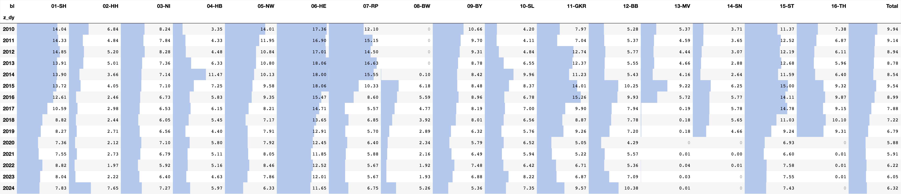
    


<br>

### <a id='toc1_5_6_'></a>[Angabe Register vs Bundesland](#toc0_)
- neue Bundesländer sind nicht aufgeführt, da Daten erst ab 2020 aus Länderregistern vorliegen
- Fälle ausserhalb des Einzugsbereichs werden im ZfKD ausgeschlossen (`A_EKRNR_GKZ_unplausibel`)

> 💡 **ZfKD**
> 
> Fallübermittlung außerhalb des Einzugsbereichs
> * generell wird angestrebt, dass die Fallübermittlung ausschließlich innerhalb des Einzugsbereichs stattfindet
> * `05-NW` übermittelt einen relativ hohen Anteil an Fällen aus anderen Bundesländern


```
    n = 17_569_016                (100.0%) ██████████████████████████████
    └ [keine NBL]: n = 13_493_606  (76.8%) ░░░░░░░███████████████████████
```

<details>
<summary>filter-sql</summary>

```sql
z_kkr < 11
```

</details>


    
    


    
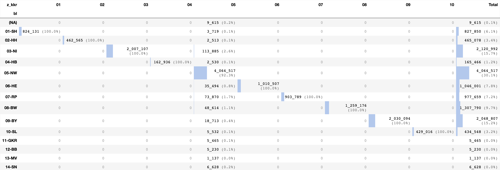
    


<br>

### <a id='toc1_5_7_'></a>[Dignität](#toc0_)


```
    n = 17_569_016                             (100.0%) ██████████████████████████████
    └ [keine gelöschten Fälle]: n = 16_964_151  (96.6%) ░░████████████████████████████
    └ [DJ 2020-2024]:            n = 3_814_755  (21.7%) ░░░░░░░░░░░░░░░░░░░░░░░░██████
```

<details>
<summary>filter-sql</summary>

```sql
is_deleted = 0
and z_dy between 2020 and 2024
```

</details>


    
    


    

    


<br>

### <a id='toc1_5_8_'></a>[Grading Verteilung](#toc0_)
❓filter


```
    n = 17_569_016                                  (100.0%) ██████████████████████████████
    └ [keine gelöschten Fälle]:      n = 16_964_151  (96.6%) ░░████████████████████████████
    └ [DJ 2024]:                        n = 705_950   (4.0%) ░░░░░░░░░░░░░░░░░░░░░░░░░░░░░█
    └ [keine DCO]:                      n = 678_450   (3.9%) ░░░░░░░░░░░░░░░░░░░░░░░░░░░░░█
    └ [nur gradingrelevante Tumore]:    n = 232_350   (1.3%) ░░░░░░░░░░░░░░░░░░░░░░░░░░░░░░
```

<details>
<summary>filter-sql</summary>

```sql
is_deleted = 0
and z_dy = 2024
and not z_is_dco
and 
    (
        left(z_icd10_3d, 1) ='C' and
        (
            right(z_icd10_3d, 2)::int8 between 00 and 33
            or right(z_icd10_3d, 2)::int8 between 50 and 57
            or right(z_icd10_3d, 2)::int8 between 63 and 68
            or right(z_icd10_3d, 2)::int8 = 60
        )
        and left(Morphologie_Code,4)::int between 8010 and 8576
    )
```

</details>


    
    


    
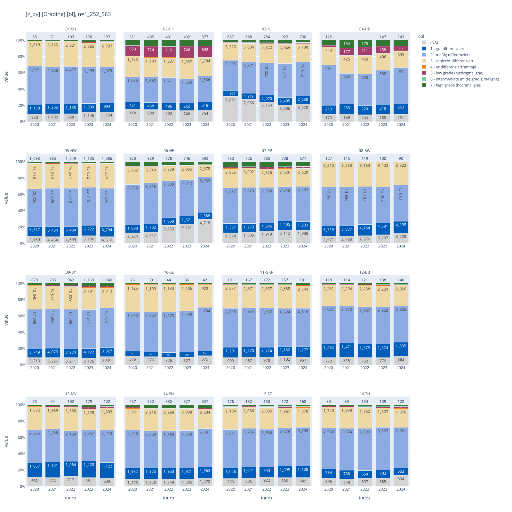
    


<br>

### <a id='toc1_5_9_'></a>[Grading Anteil](#toc0_)
- Metrik: Anteil GRAD missings


```
    n = 17_569_016                                  (100.0%) ██████████████████████████████
    └ [keine gelöschten Fälle]:      n = 16_964_151  (96.6%) ░░████████████████████████████
    └ [DJ 2020-2024]:                 n = 3_814_755  (21.7%) ░░░░░░░░░░░░░░░░░░░░░░░░██████
    └ [keine DCO]:                    n = 3_643_458  (20.7%) ░░░░░░░░░░░░░░░░░░░░░░░░██████
    └ [nur gradingrelevante Tumore]:  n = 1_238_330   (7.0%) ░░░░░░░░░░░░░░░░░░░░░░░░░░░░██
```

<details>
<summary>filter-sql</summary>

```sql
is_deleted = 0
and z_dy between 2020 and 2024
and not z_is_dco
and 
    (
        left(z_icd10_3d, 1) ='C' and
        (
            right(z_icd10_3d, 2)::int8 between 00 and 33
            or right(z_icd10_3d, 2)::int8 between 50 and 57
            or right(z_icd10_3d, 2)::int8 between 63 and 68
            or right(z_icd10_3d, 2)::int8 = 60
        )
        and left(Morphologie_Code,4)::int between 8010 and 8576
    )
```

</details>


    
    


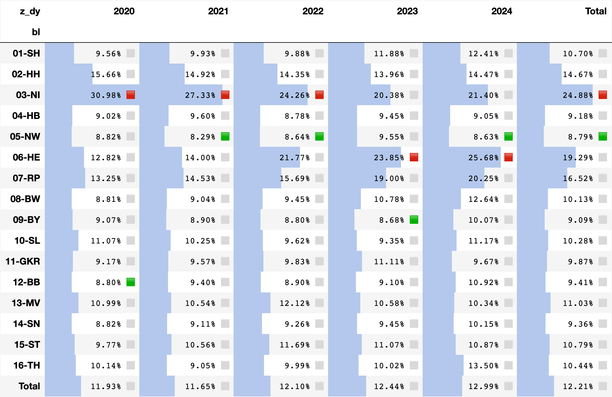
    


<br>

### <a id='toc1_5_10_'></a>[Altersgruppen](#toc0_)


```
    n = 17_569_016                             (100.0%) ██████████████████████████████
    └ [keine gelöschten Fälle]: n = 16_964_151  (96.6%) ░░████████████████████████████
    └ [DJ 2024]:                   n = 705_950   (4.0%) ░░░░░░░░░░░░░░░░░░░░░░░░░░░░░█
    └ [ICD10 nur C]:               n = 599_876   (3.4%) ░░░░░░░░░░░░░░░░░░░░░░░░░░░░░█
    └ [keine C44,D04]:             n = 493_648   (2.8%) ░░░░░░░░░░░░░░░░░░░░░░░░░░░░░░
```

<details>
<summary>filter-sql</summary>

```sql
is_deleted = 0
and z_dy = 2024
and left(z_icd10_3d,1) = 'C'
and z_icd10_3d not in ('C44','D04')
```

</details>


    
    


    
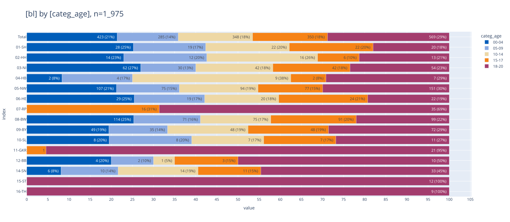
    


<br>

### <a id='toc1_5_11_'></a>[UICC](#toc0_)
- die Variable `UICC` wird vom ZfKD gebildet


```
    n = 17_569_016                             (100.0%) ██████████████████████████████
    └ [keine gelöschten Fälle]: n = 16_964_151  (96.6%) ░░████████████████████████████
    └ [DJ 2024]:                   n = 705_950   (4.0%) ░░░░░░░░░░░░░░░░░░░░░░░░░░░░░█
    └ [ICD10 nur C]:               n = 599_876   (3.4%) ░░░░░░░░░░░░░░░░░░░░░░░░░░░░░█
    └ [keine C44,D04]:             n = 493_648   (2.8%) ░░░░░░░░░░░░░░░░░░░░░░░░░░░░░░
```

<details>
<summary>filter-sql</summary>

```sql
is_deleted = 0
and z_dy = 2024
and left(z_icd10_3d,1) = 'C'
and z_icd10_3d not in ('C44','D04')
```

</details>


    
    


    
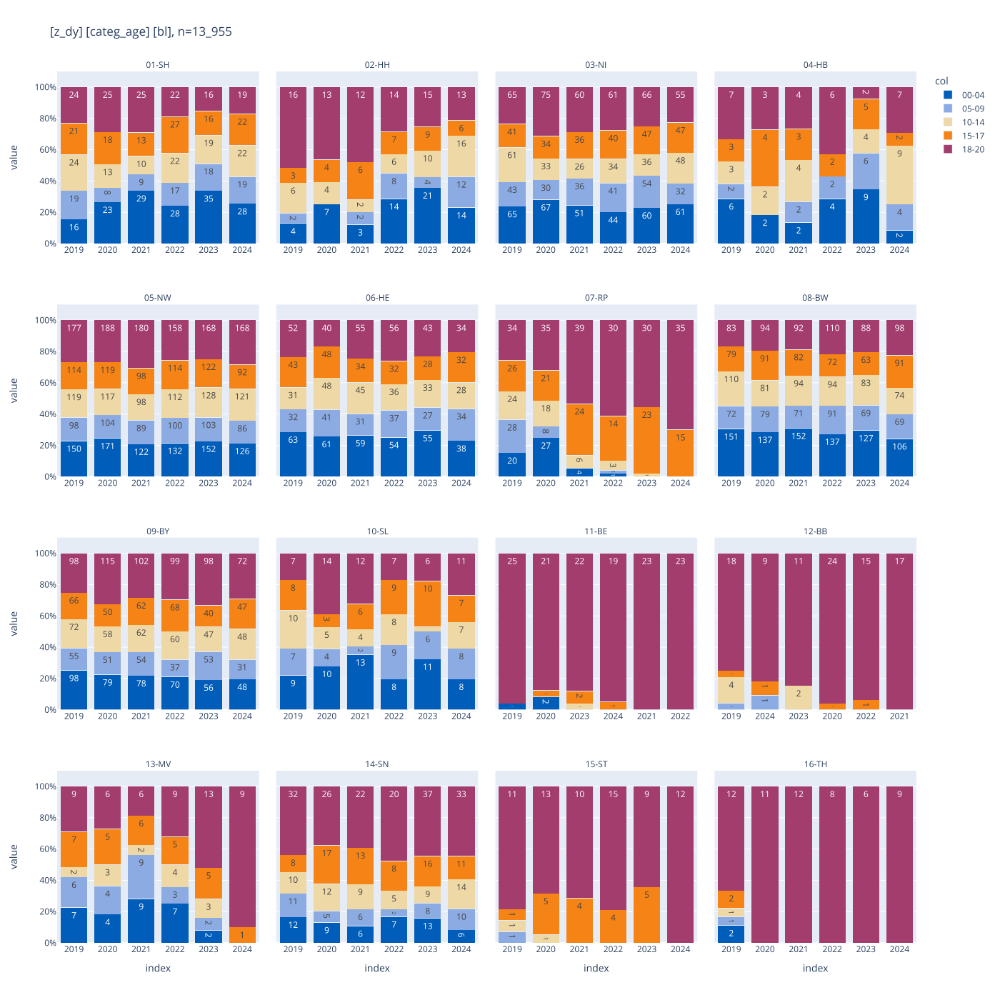
    


```
    n = 17_569_016                             (100.0%) ██████████████████████████████
    └ [keine gelöschten Fälle]: n = 16_964_151  (96.6%) ░░████████████████████████████
    └ [DJ ab 2010]:             n = 11_220_232  (63.9%) ░░░░░░░░░░░███████████████████
    └ [ICD10 nur C]:             n = 9_692_961  (55.2%) ░░░░░░░░░░░░░░████████████████
    └ [keine C44,D04]:           n = 7_646_321  (43.5%) ░░░░░░░░░░░░░░░░░█████████████
```

<details>
<summary>filter-sql</summary>

```sql
is_deleted = 0
and DJ >= 2010
and left(z_icd10_3d,1) = 'C'
and z_icd10_3d not in ('C44','D04')
```

</details>


    
    


    
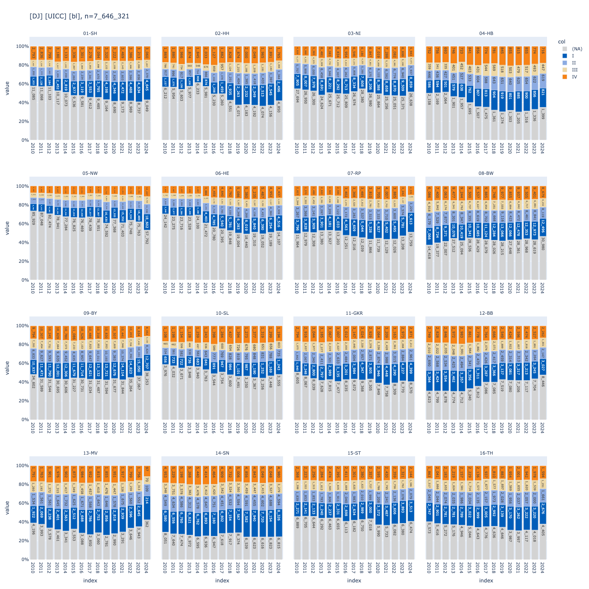
    


<br>

### <a id='toc1_5_12_'></a>[TNM-Auflage](#toc0_)
- nicht übermittelte Auflagen werden im ZfKD geschätzt und imputiert anhand des DJ, daher keine missings im Datensatz

> 💡 **ZfKD**
> 
> Auflage 7 wird nur noch von 03-NI in nennenswertem Umfang übermittelt


```
    n = 17_569_016                             (100.0%) ██████████████████████████████
    └ [keine gelöschten Fälle]: n = 16_964_151  (96.6%) ░░████████████████████████████
    └ [DJ 2024]:                   n = 705_950   (4.0%) ░░░░░░░░░░░░░░░░░░░░░░░░░░░░░█
    └ [ICD10 nur C]:               n = 599_876   (3.4%) ░░░░░░░░░░░░░░░░░░░░░░░░░░░░░█
    └ [keine C44,D04]:             n = 493_648   (2.8%) ░░░░░░░░░░░░░░░░░░░░░░░░░░░░░░
```

<details>
<summary>filter-sql</summary>

```sql
is_deleted = 0
and z_dy = 2024
and left(z_icd10_3d,1) = 'C'
and z_icd10_3d not in ('C44','D04')
```

</details>


    
    


    
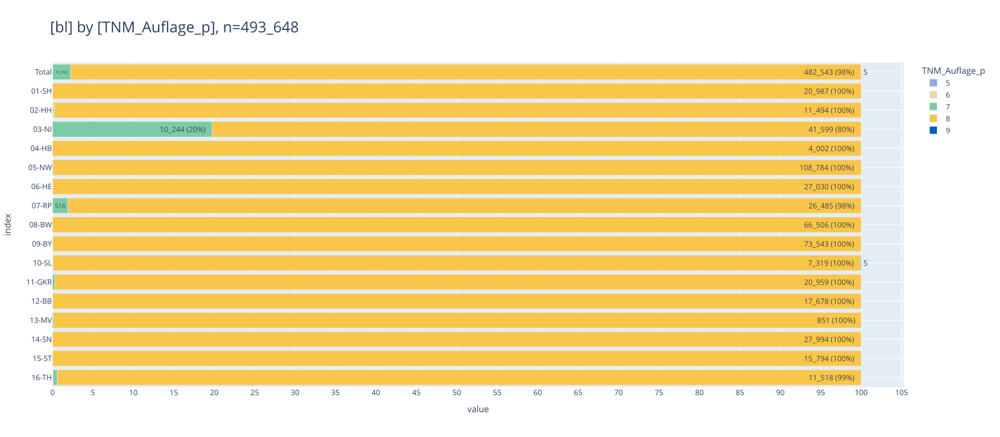
    


<br>

### <a id='toc1_5_13_'></a>[Tod](#toc0_)

#### <a id='toc1_5_13_1_'></a>[Anteil Verstorbene](#toc0_)
- gezählt sind **Personen**
- Metrik: Anteil Verstorbene


```
    count: distinct GLOBALPATID
    ---
    n = 14_998_886                             (100.0%) ██████████████████████████████
    └ [keine gelöschten Fälle]: n = 14_585_410  (97.2%) ░█████████████████████████████
    └ [DJ 2020-2024]:            n = 3_548_356  (23.7%) ░░░░░░░░░░░░░░░░░░░░░░░███████
    └ [ICD10 nur C]:             n = 3_021_090  (20.1%) ░░░░░░░░░░░░░░░░░░░░░░░░██████
    └ [keine C44,D04]:           n = 2_486_711  (16.6%) ░░░░░░░░░░░░░░░░░░░░░░░░░░████
```

<details>
<summary>filter-sql</summary>

```sql
is_deleted = 0
and z_dy between 2020 and 2024
and left(z_icd10_3d,1) = 'C'
and z_icd10_3d not in ('C44','D04')
```

</details>


    
    


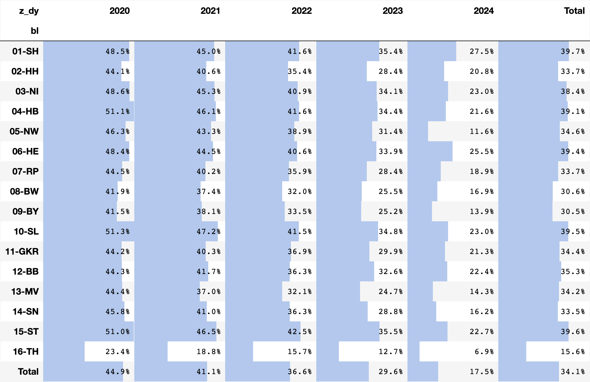
    


<br>

#### <a id='toc1_5_13_2_'></a>[Verteilung Todesursachen nach ICDT10](#toc0_)
- gezählt sind **Personen**
- `icdt10_1d` gibt die erste Stelle der Todesursache (TU) an


> 💡 **ZfKD**
> 
> Fehlende Angabe
> * `03-NI` hat für das aktuelle DJ nahezu keine TU mit nicht-tumorrelevanten TU übermittelt


```
    count: distinct GLOBALPATID
    ---
    n = 14_998_886                             (100.0%) ██████████████████████████████
    └ [keine gelöschten Fälle]: n = 14_585_410  (97.2%) ░█████████████████████████████
    └ [nur Verstorbene]:         n = 7_558_161  (50.4%) ░░░░░░░░░░░░░░░███████████████
    └ [SJ ab 2010]:              n = 5_099_012  (34.0%) ░░░░░░░░░░░░░░░░░░░░██████████
```

<details>
<summary>filter-sql</summary>

```sql
is_deleted = 0
and Verstorben = 'J'
and year(SDIMP) >= 2010
```

</details>


    
    


    
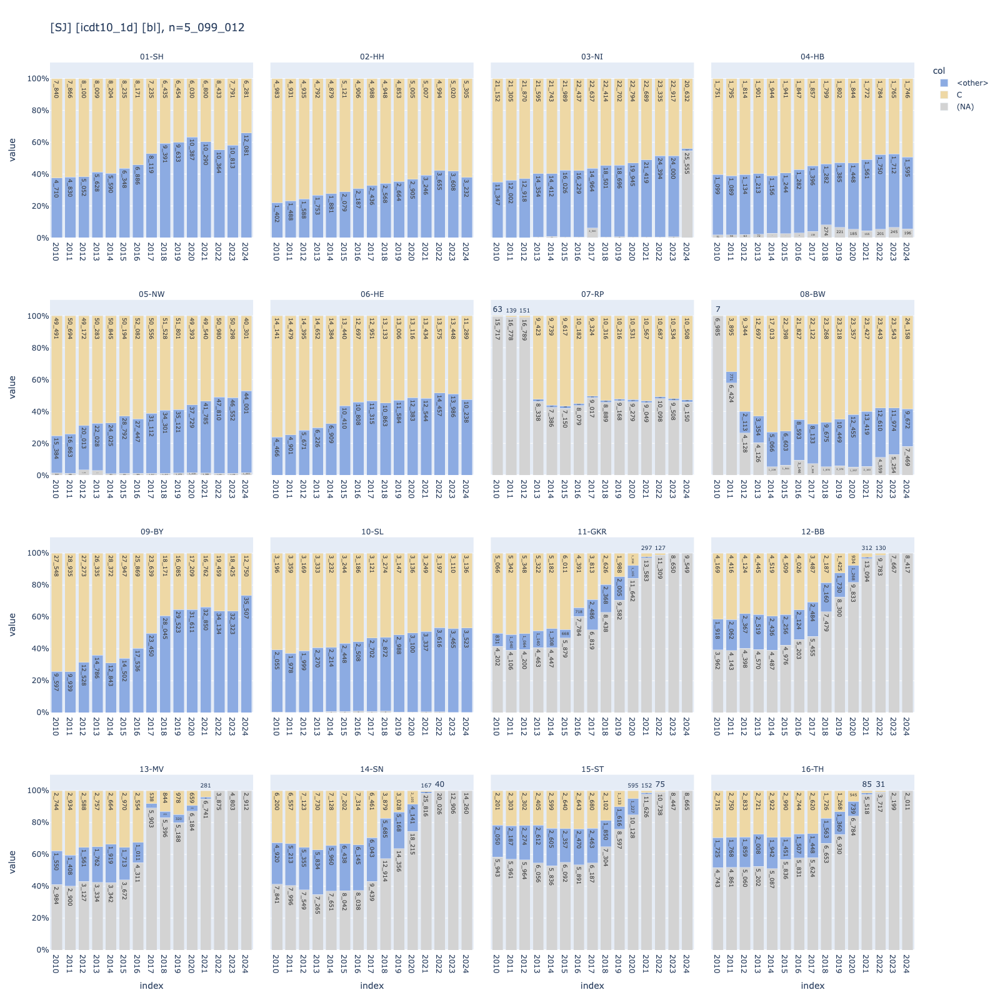
    


<br>

## <a id='toc1_6_'></a>[Anteil Mehrfachtumore](#toc0_)
- Metrik: Anteil Tumore mit `A_Mehrfachmeldung`
- diese Tumore werden vom ZfKD ausgeschlossen

> 💡 **ZfKD**
> 
> für `13-NI`,`14-SN` und `15-ST` ermittelt das ZfKD sichtbar erhöhte Anteile an Mehrfachtumoren für DJ seit Beginn der klin. Registrierung


```
    n = 17_569_016                     (100.0%) ██████████████████████████████
    └ [DJ 2010-2024]:   n = 11_641_922  (66.3%) ░░░░░░░░░░░███████████████████
    └ [nur gültige BL]: n = 11_632_852  (66.2%) ░░░░░░░░░░░███████████████████
```

<details>
<summary>filter-sql</summary>

```sql
z_dy between 2010 and 2024
and GKZbl::tinyint <= 16
```

</details>


    
    


    

    


<div style="page-break-after: always;"></div>


<br>

## <a id='toc1_7_'></a>[Plausibilitätsprüfungen](#toc0_)
**Filter**
- **es ist jeweils nur das aktuellste DJ berücksichtigt (aktuell `epi2025`: 2024, zum Vergleich `epi2024`: 2023)**

Die Tabellen sind zur besseren Lesbarkeit nun aufgeteilt nach den Plausibilitätsprüfungen ([pdf hier verfügbar](https://www.krebsregisterverbund.de/attachments/download/8743/Plausibilit%C3%A4tspr%C3%BCfungen_details.pdf))
- `A`: Fälle ausgeschlossen
- `B`: Fälle markiert
- `C`: Fälle (auto) korrigiert

Spalten
- `cnt_epi2024`: Absolute Fallzahl der checks für das in diesem Datensatz höchste DJ (2023)
- `cnt_now`: Absolute Fallzahl der checks für das im aktuellen Datensatz höchsten DJ (2024)
- `pct_epi2024`: Anteil Fallzahl der checks an allen Fällen für das in diesem Datensatz höchste DJ (2023)
- `pct_now`: Anteil Fallzahl der checks an allen Fällen für das im aktuellen Datensatz höchste DJ (2024)
- _(Absolute Fallzahlen = nach Abzug der A-Prüfungen)_

Die markierten Fälle können im übermittelten Datensatz geprüft werden, Beispiel: 
<details>
    <summary>click</summary>

```sql
    select * 
    from Tumor4 
    where IARC like '%A_Mehrfach%'
```

</details>

<br>

### <a id='toc1_7_1_'></a>[⚠️ 01-SH](#toc0_)
- `B_TOD_Ja_Aber_Kein_SJ`: 0 -> 4%
- alle Fälle wurden korrigiert laut `C_TOD=1_korrigiert_aufgrund_Sterbeangaben`


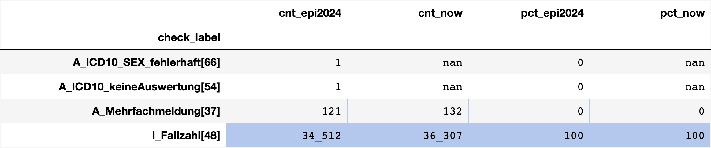
    


    


    


<div style="page-break-after: always;"></div>


<br>

### <a id='toc1_7_2_'></a>[✅ 02-HH](#toc0_)


    


    


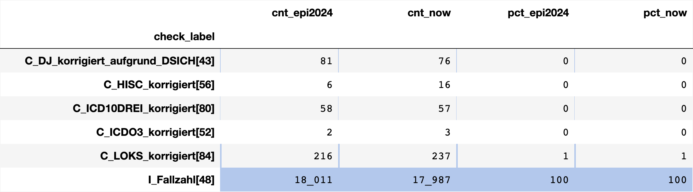
    


<div style="page-break-after: always;"></div>


<br>

### <a id='toc1_7_3_'></a>[✅ 03-NI](#toc0_)


    


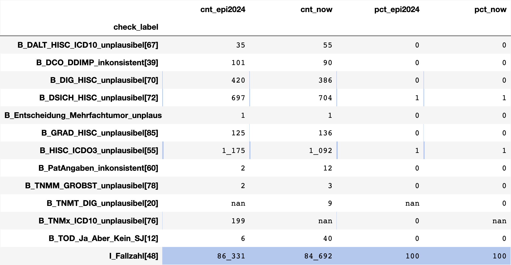
    


    


<div style="page-break-after: always;"></div>


<br>

### <a id='toc1_7_4_'></a>[✅ 04-HB](#toc0_)


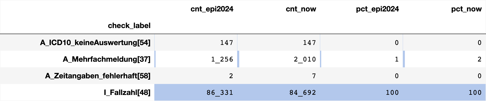
    


    


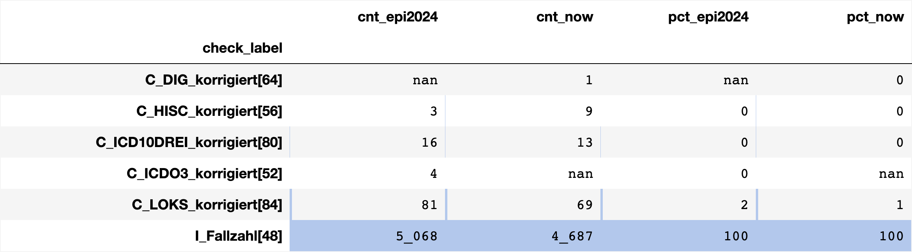
    


<div style="page-break-after: always;"></div>


<br>

### <a id='toc1_7_5_'></a>[⚠️ 05-NW](#toc0_)
- unverändert hohe werte bei `A_EKRNR_GKZ_unplausibel`


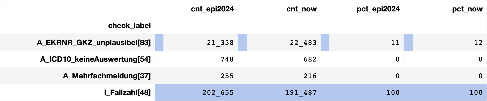
    


    


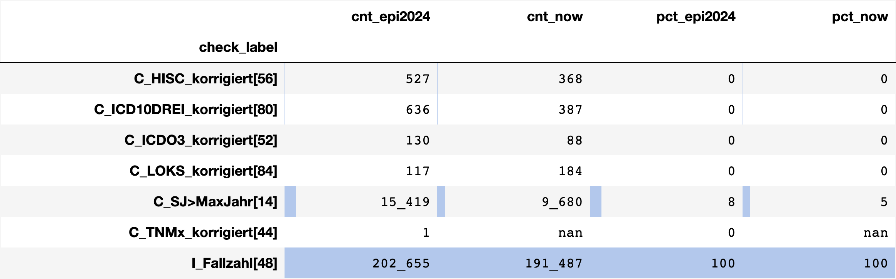
    


<div style="page-break-after: always;"></div>


<br>

### <a id='toc1_7_6_'></a>[🚨 06-HE](#toc0_)
- Fallzahl DJ=2024 deutlich geringer


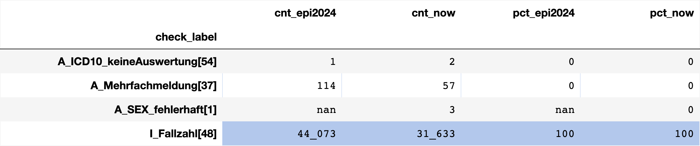
    


    


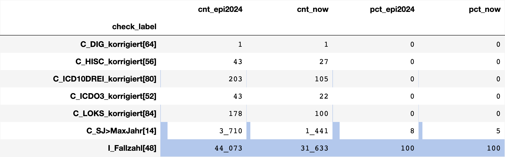
    


<div style="page-break-after: always;"></div>


<br>

### <a id='toc1_7_7_'></a>[✅ 07-RP](#toc0_)


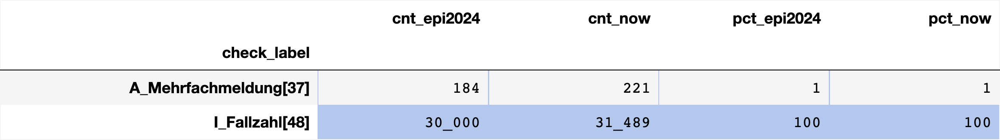
    


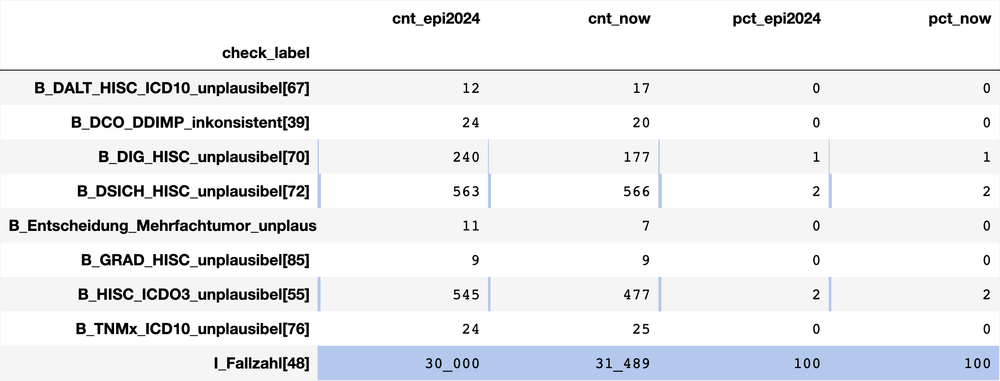
    


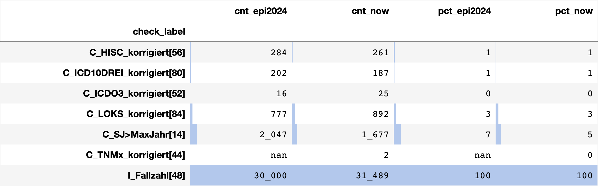
    


<div style="page-break-after: always;"></div>


<br>

### <a id='toc1_7_8_'></a>[✅ 08-BW](#toc0_)


    


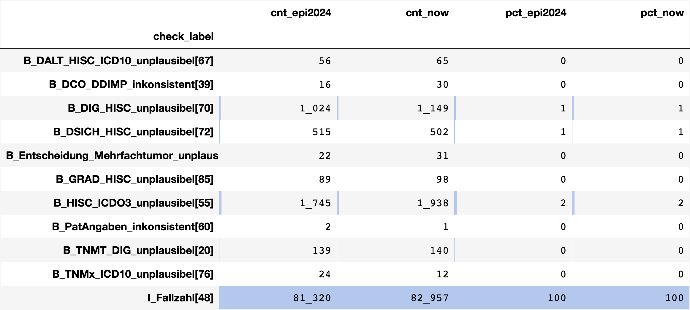
    


    


<div style="page-break-after: always;"></div>


<br>

### <a id='toc1_7_9_'></a>[✅ 09-BY](#toc0_)


    


    


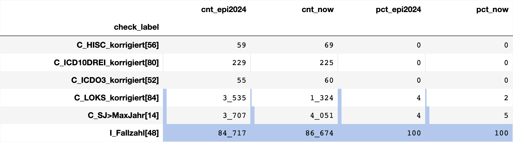
    


<div style="page-break-after: always;"></div>


<br>

### <a id='toc1_7_10_'></a>[✅ 10-SL](#toc0_)
- `A_Mehrfachmeldung` leicht erhöht mit ~4%


    


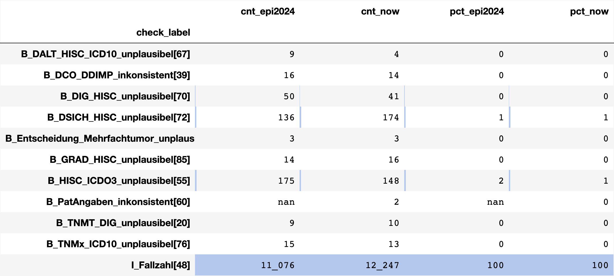
    


    


<div style="page-break-after: always;"></div>


<br>

### <a id='toc1_7_11_'></a>[✅ 11-GKR (ehemals)](#toc0_)


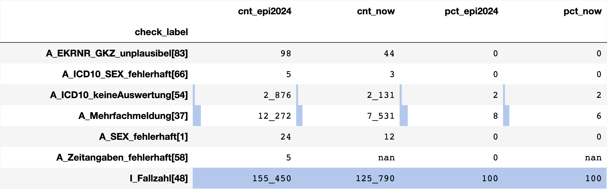
    


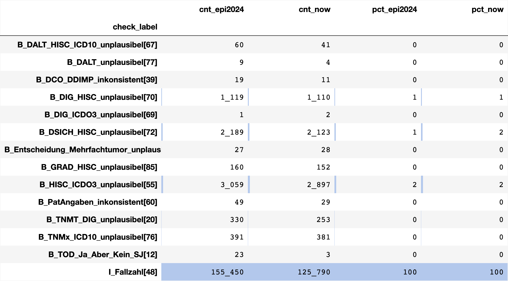
    


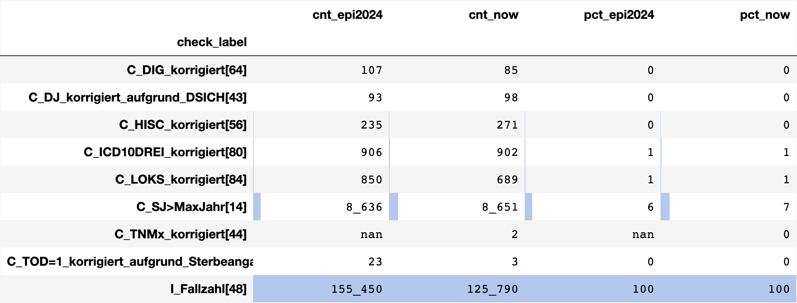
    

