# <a id='toc1_'></a>[Bericht zur Datenqualität (epi2025_beta) 📉](#toc0_)

**Table of contents**<a id='toc0_'></a>    
- [Bericht zur Datenqualität (epi2025_beta) 📉](#toc1_)    
  - [Änderungen seit der letzten Version](#toc1_1_)    
  - [Hinweise](#toc1_2_)    
  - [Datenstand 🕥](#toc1_3_)    
  - [Fallzahlen im Verlauf der Jahreslieferungen](#toc1_4_)    
    - [original geliefert](#toc1_4_1_)    
    - [nach Abschluss der Prüfungen im ZfKD](#toc1_4_2_)    
  - [Variablenverteilung](#toc1_5_)    
    - [Diagnosejahr](#toc1_5_1_)    
    - [Diagnosegruppen](#toc1_5_2_)    
    - [Diagnosesicherung](#toc1_5_3_)    
    - [DCO Diagramm](#toc1_5_4_)    
    - [DCO](#toc1_5_5_)    
    - [Anteil Mehrfachtumore](#toc1_5_6_)    
    - [Dignität](#toc1_5_7_)    
    - [Grading 1](#toc1_5_8_)    
    - [Grading 2](#toc1_5_9_)    
    - [Altersgruppen](#toc1_5_10_)    
    - [TNM](#toc1_5_11_)    
    - [UICC](#toc1_5_12_)    
    - [TNM-Auflage](#toc1_5_13_)    
    - [Tod](#toc1_5_14_)    
      - [Verteilung der Variable TOD im verarbeiteten Datensatz](#toc1_5_14_1_)    
      - [Verteilung der Variable TOD in den original gelieferten Daten](#toc1_5_14_2_)    
    - [Verteilung Todesursachen nach ICDT10](#toc1_5_15_)    
  - [Plausibilitätsprüfungen](#toc1_6_)    
    - [ℹ️ 01-SH](#toc1_6_1_)    
    - [✅ 02-HH](#toc1_6_2_)    
    - [✅ 03-NI](#toc1_6_3_)    
    - [✅ 04-HB](#toc1_6_4_)    
    - [⚠️ 05-NW](#toc1_6_5_)    
    - [🚨 06-HE](#toc1_6_6_)    
    - [✅ 07-RP](#toc1_6_7_)    
    - [✅ 08-BW](#toc1_6_8_)    
    - [✅ 09-BY](#toc1_6_9_)    
    - [✅ 10-SL](#toc1_6_10_)    
    - [✅ 11-GKR (ehemals)](#toc1_6_11_)    

<!-- vscode-jupyter-toc-config
	numbering=false
	anchor=true
	flat=false
	minLevel=1
	maxLevel=6
	/vscode-jupyter-toc-config -->
<!-- THIS CELL WILL BE REPLACED ON TOC UPDATE. DO NOT WRITE YOUR TEXT IN THIS CELL -->

<br>

## <a id='toc1_1_'></a>[Änderungen seit der letzten Version](#toc0_)
<!-- - bisher wurden folgende Angaben in einer umfangreichen Verarbeitung im workflow umkodiert: `ICDGM10`, `HISC`, `ICDO3`, `DIG`. Diese Umformung wurde deaktiviert, es finden nun nur noch punktuelle Korrekturen statt -->
- Lieferung Daten mit DJ=2024
- ausstehend: `13-MV`

<br>

## <a id='toc1_2_'></a>[Hinweise](#toc0_)
- Bewertungen der Analysen sind mit 💡 markiert
- bei den Plausibilitätsprüfungen weist ein ✅ darauf hin, dass keine Mängel erkennbar sind

<br>

## <a id='toc1_3_'></a>[Datenstand 🕥](#toc0_)

    🐍 3.12.8 | 📦 pandas: 2.3.3 | 📦 numpy: 1.26.4 | 📦 duckdb: 1.4.4 | 📦 pandas-plots: 1.2.8 | 📦 connection-helper: 0.13.3


    database file:           2026-03-03_data_epi.duckdb
    data tag:                epi2024_2
    sql table created:       2026-03-03 09:47:44
    doi:                     10.18444/5.03.01.0005.0020.0002
    document created:        2026-03-04 08:13:00


    
    aktuellster batch               425
    aktuellstes Diagnosejahr 📆     (2024)


<div style="page-break-after: always;"></div>

## <a id='toc1_4_'></a>[Fallzahlen im Verlauf der Jahreslieferungen](#toc0_)
- kein Filter
- es werden Datenstände (_batch_) aus mehreren Lieferjahren dargestellt , welche über eine laufende Nummer sowie das Datum der Ausführung vergleichbar sind
- in Abgrenzung zu den klinischen Daten ist jede einzelne EKR Lieferung für das gesamte Lieferjahr gültig

<br>

### <a id='toc1_4_1_'></a>[original geliefert](#toc0_)
- aufgeführt sind die Fallzahlen aus den überlieferten Dateien **vor** den ZfKD Anpassungen
- `batch_label` markiert den jeweils letzten offiziellen Datenstand des Lieferjahres, sowie den aktuellen Datenstand


    
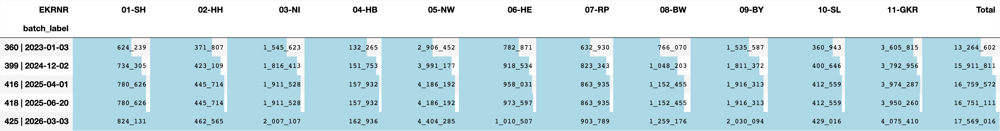
    


<br>

### <a id='toc1_4_2_'></a>[nach Abschluss der Prüfungen im ZfKD](#toc0_)
- Filter: jeweils das **letzte DJ** der einzelnen Jahreslieferung
- aufgeführt sind die Fallzahlen aus den überlieferten Dateien **nach** den ZfKD Anpassungen


    
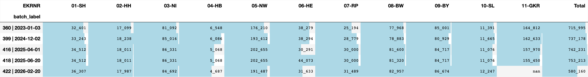
    


<div style="page-break-after: always;"></div>

## <a id='toc1_5_'></a>[Variablenverteilung](#toc0_)
<!-- - **Filter:**
  - **🚨 sofern nicht anders angegeben ist der Zeitraum beschränkt auf das höchste Diagnosejahr (für `epi2024`: 2023) 🚨**
  - Diagnosen: ausgeschlossen sind `C44` und alle `D` -->
- ab hier wird nur die aktuelle Datenlieferung dargestellt
- als ungültig markierte Fälle (_A-Prüfungen_) sind in allen Fallzahlen ausgeschlossen
- in den barplots sind die relativen Häufigkeiten von Variablen im Datensatz der Register aufgetragen
- zusätzlich ist die Angabe für alle kkr enthalten (`Total`)
- näherungsweise sind GKZ-Bundesländer verwendet anstatt Lieferregister, um 11-16 aufspannen zu können

<br>

### <a id='toc1_5_1_'></a>[Diagnosejahr](#toc0_)
- **Filter: DJ > 2018, C44 und D-Diagnosen sind ausgeschlossen**


    
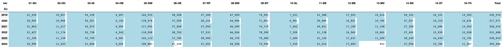
    


### <a id='toc1_5_2_'></a>[Diagnosegruppen](#toc0_)
- **Filter: DJ = 2024, C44 und D-Diagnosen sind eingeschlossen**

> 💡 `ZfKD`: _"Die Anteile für D-Diagnosen sind in etwa vergleichbar, die für C44 unterscheiden sich recht deutlich"_


    
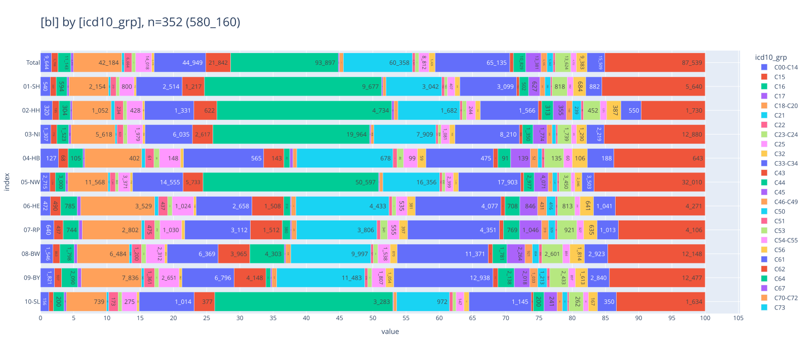
    


<br>

### <a id='toc1_5_3_'></a>[Diagnosesicherung](#toc0_)
- **Filter: DJ = 2023, C44 und D-Diagnosen sind ausgeschlossen**

> 💡 `ZfKD`: _"auffällig ist der hohe Anteil an fehlenden Diagnosesicherungen in `08-BW`"_  
> 💡 `ZfKD`: _"keine DCO Markierungen für Fälle aus `05-NW`"_


    
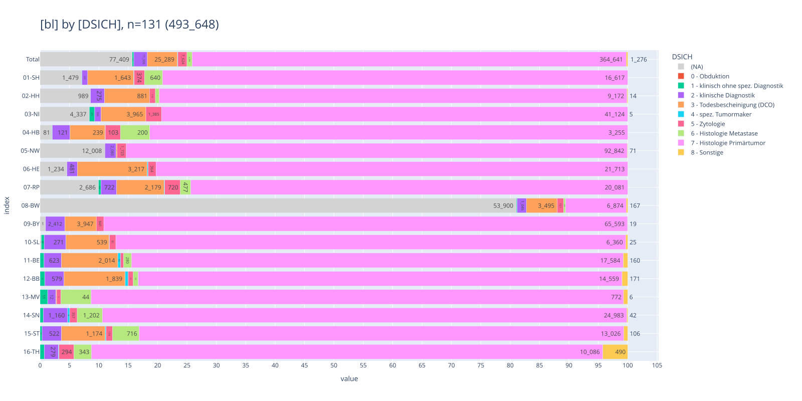
    


<!-- <br>

### <a id='toc1_5_4_'></a>[DCO Diagramm](#toc0_)
- **Filter: DJ = 2020-2024, C44 und D-Diagnosen sind ausgeschlossen, GKZbl 01-16**
- die epi Variable `DCO` wird wie folgt gebildet:
  - 1 wenn Diagnosesicherung = 3
  - sonst 2 (auch für Diagnosesicherung missing)  -->

### <a id='toc1_5_5_'></a>[DCO](#toc0_)
- **Filter: DJ = 2010-2024, GKZbl 01-16**
- Metrik: Anteil DCO an Gesamtfallzahl in %
<!-- > 💡 für 09-BY sind in dieser Lieferung erheblich weniger DCO Fälle festzustellen -->


```python
    # filter
        bl::int between 1 and 16
        and z_dy::int between 2010 and 2024
        and z_icd10_3d not in ('C44','D04')
        and left(z_icd10_3d,1) = 'C'
```

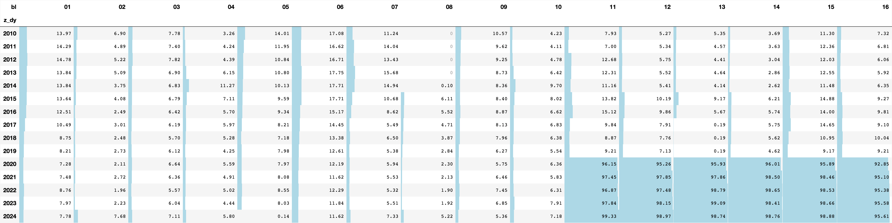
    


### <a id='toc1_5_6_'></a>[Anteil Mehrfachtumore](#toc0_)


    
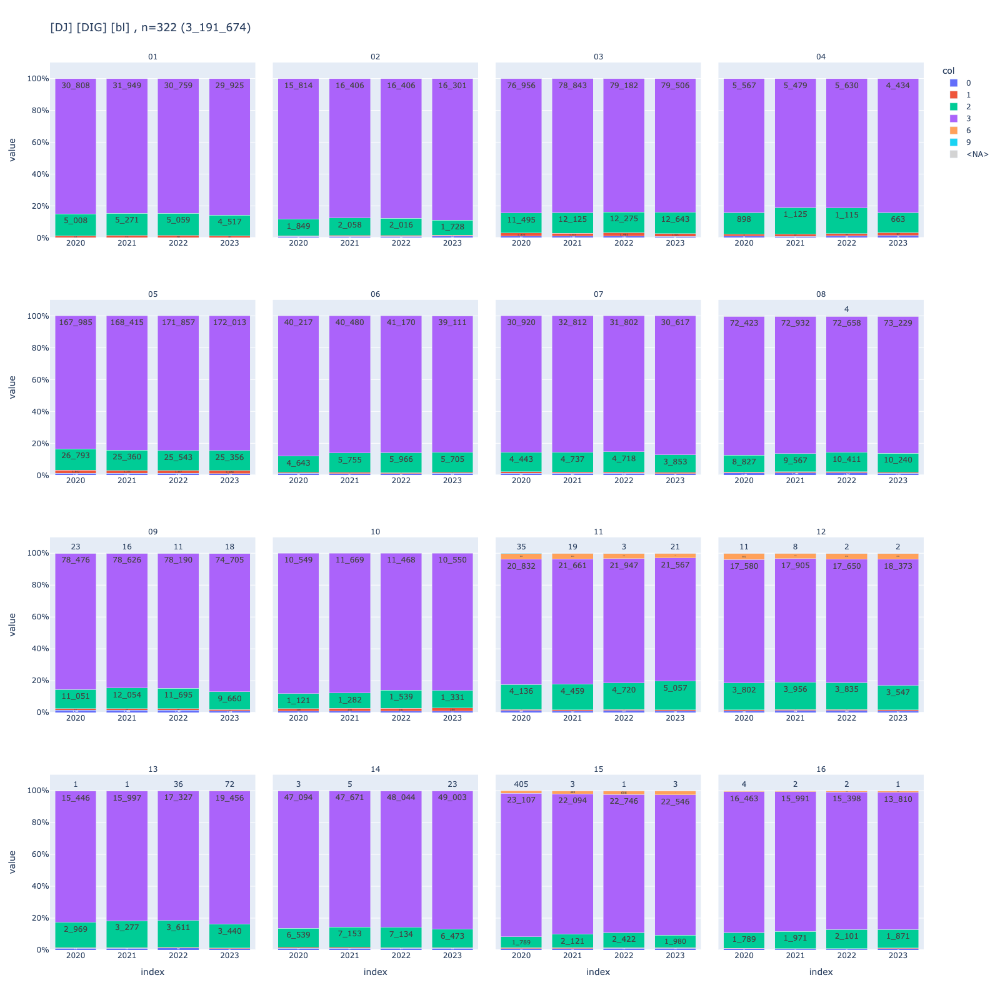
    


<br>

### <a id='toc1_5_7_'></a>[Dignität](#toc0_)
- **Filter: DJ = 2020-2023, C44 und D-Diagnosen sind eingeschlossen**


    
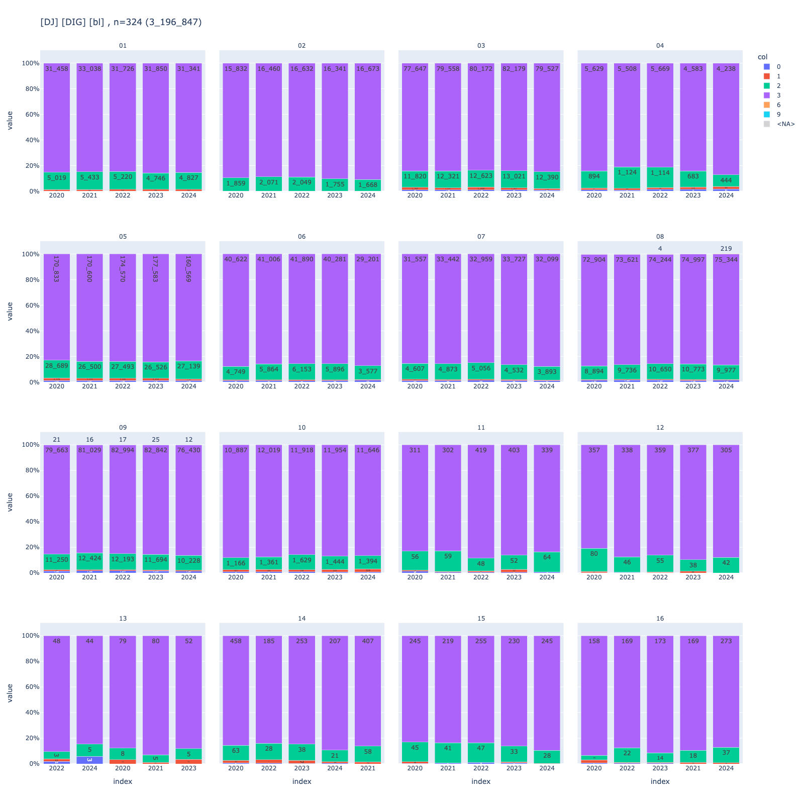
    


<br>

### <a id='toc1_5_8_'></a>[Grading 1](#toc0_)
- **Filter: DJ = 2024, C44 und D-Diagnosen sind ausgeschlossen**


    
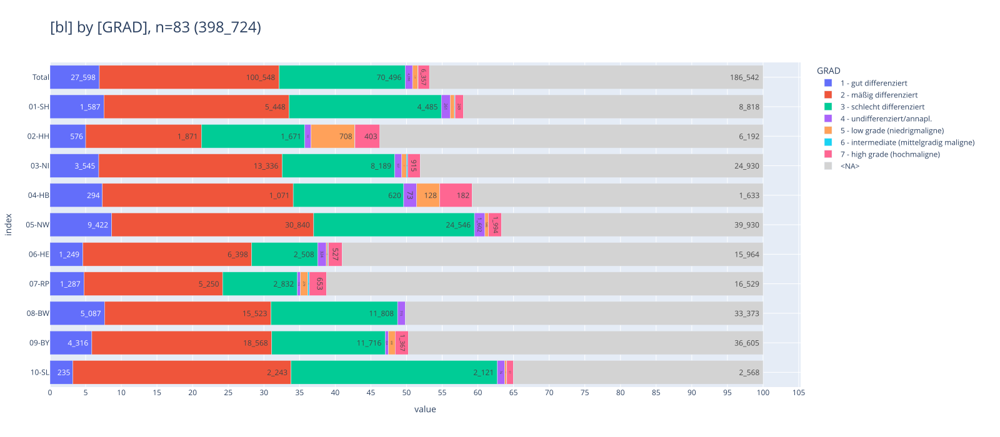
    


### <a id='toc1_5_9_'></a>[Grading 2](#toc0_)
- **Filter: DJ = 2020-2024, kein DCO, gradingrelevante ICD10+HISC**


```python
    # filter
            DJ between 2020 and 2024
            and DCO = 2
            and (
            left(ICDGM10, 1) ='C' 
            and
                (
                    right(left(ICDGM10,3), 2)::int8 between 00 and 33
                    or right(left(ICDGM10,3), 2)::int8 between 50 and 57
                    or right(left(ICDGM10,3), 2)::int8 between 63 and 68
                    or right(left(ICDGM10,3), 2)::int8 = 60
                )
            and left(HISC,4)::int between 8010 and 8576
            and GKZbl::int between 1 and 16
            )
```

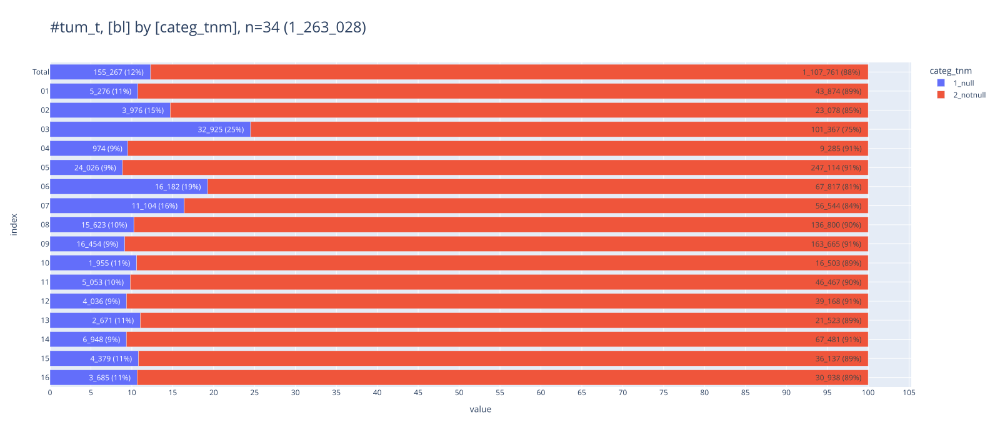
    


<br>

### <a id='toc1_5_10_'></a>[Altersgruppen](#toc0_)

- **Filter: DJ = 2024, C44 und D-Diagnosen sind ausgeschlossen**


    
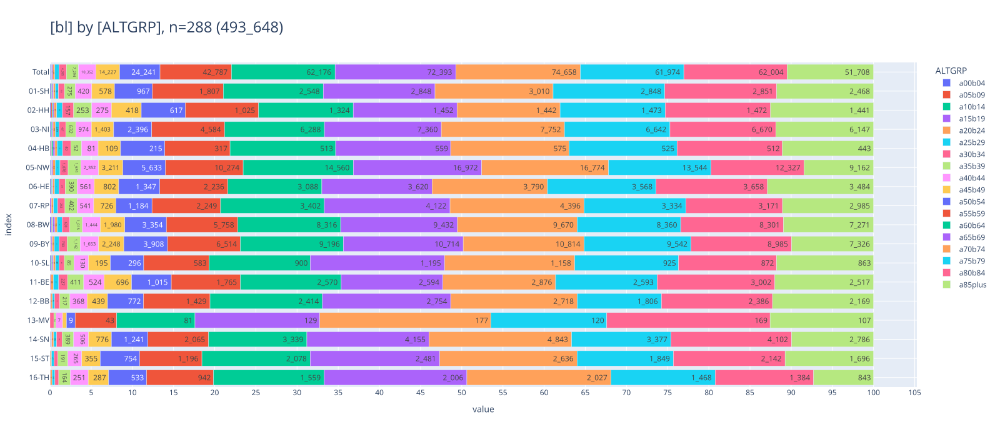
    


### <a id='toc1_5_11_'></a>[TNM](#toc0_)


```python
    # filter
            DJ between 2020 and 2024
            and DCO = 2
            and (
            left(ICDGM10, 1) ='C' and
                (
                    right(left(ICDGM10,3), 2)::int8 between 00 and 43
                    or right(left(ICDGM10,3), 2)::int8 between 45 and 69
                    or right(left(ICDGM10,3), 2)::int8 between 73 and 75
                )
                and left(HISC,4)::int between 8010 and 8790
                and left(ICDGM10,3) not in ('C26', 'C39', 'C55')
                and ICDGM10 not in ('C140', 'C579', 'C639', 'C759')
            )
            and GKZbl::int between 1 and 16
```

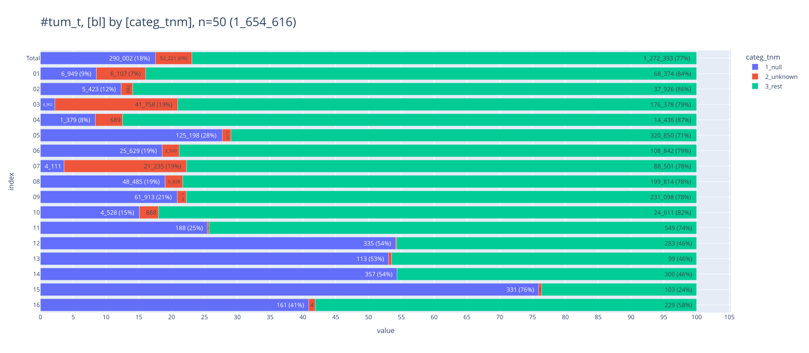
    


<br>

### <a id='toc1_5_12_'></a>[UICC](#toc0_)
- **Filter: DJ = 2024, C44 und D-Diagnosen sind ausgeschlossen**
- die Variable `UICC` wird vom ZfKD gebildet


    
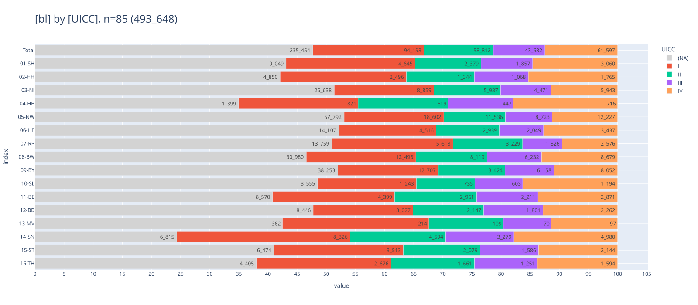
    


<br>

### <a id='toc1_5_13_'></a>[TNM-Auflage](#toc0_)
- **Filter: DJ = 2024, C44 und D-Diagnosen sind ausgeschlossen**
- nicht übermittelte Auflagen werden im ZfKD geschätzt und imputiert anhand des DJ, daher keine missings

> 💡 `ZfKD`: _"Auflage 7 nur noch von 03-NI in nennenswertem Umfang übermittelt"_


    
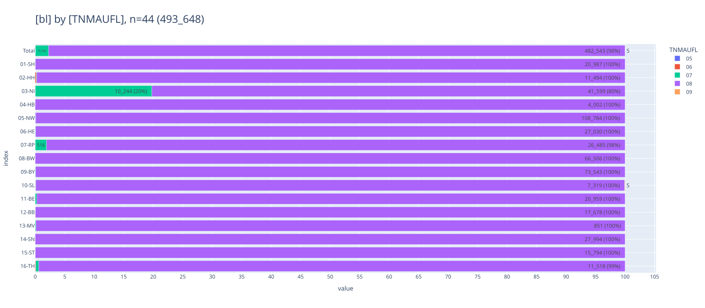
    


<br>

### <a id='toc1_5_14_'></a>[Tod](#toc0_)

#### <a id='toc1_5_14_1_'></a>[Verteilung der Variable TOD im verarbeiteten Datensatz](#toc0_)
- **Filter: DJ = 2024, C44 und D-Diagnosen sind ausgeschlossen**


    
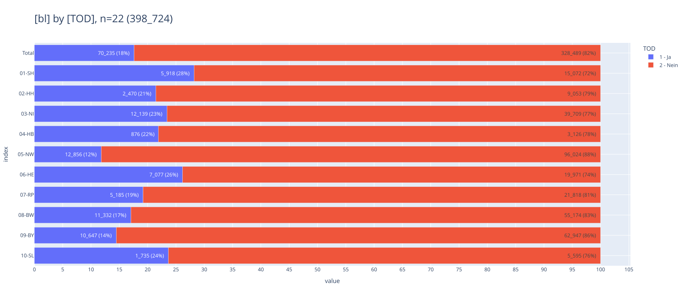
    


<br>

#### <a id='toc1_5_14_2_'></a>[Verteilung der Variable TOD in den original gelieferten Daten](#toc0_)
- Grundgesamtheit: alle Daten mit DJ > 1970
- neben `J` und `N` sind diverse Formen von Leerkodierungen unterschieden (`NULL`, `''`, `' '` etc.)
- die Daten den Registern ohne missings enthalten eine eindeutige Information zu `TOD`
- bei allen sonstigen EKR wird angenommen: Todesangabe leer -> lebend


    
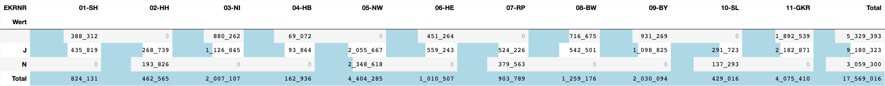
    


### <a id='toc1_5_15_'></a>[Verteilung Todesursachen nach ICDT10](#toc0_)
- gezählt sind **Personen**
- **Filter: `SJ` >= 2010**
- `icdt10_1d` gibt die erste Stelle der Todesursache an
- ⚠️ für `01-SH` und `02-HH` sind die DJ nicht in korrekter Reihenfolge


    
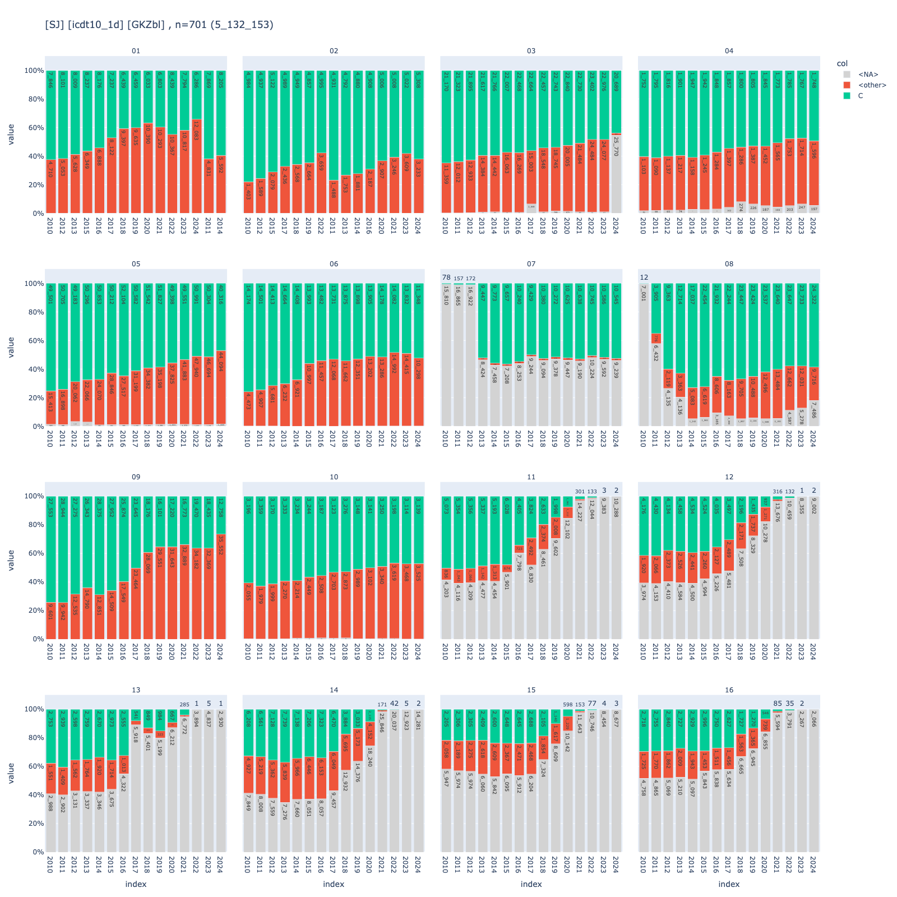
    


<div style="page-break-after: always;"></div>

## <a id='toc1_6_'></a>[Plausibilitätsprüfungen](#toc0_)
- **Filter**
  - **es ist jeweils nur das aktuellste DJ berücksichtigt (aktuell: 2024, ins letzter Lieferung: 2023)**
- Die Tabellen sind zur besseren Lesbarkeit nun aufgeteilt nach den Plausibilitätsprüfungen ([pdf](https://www.krebsregisterverbund.de/attachments/download/8743/Plausibilit%C3%A4tspr%C3%BCfungen_details.pdf))
  - `A`: Fälle ausgeschlossen
  - `B`: Fälle markiert
  - `C`: Fälle korrigiert
- Spalten
  - `cnt_epi2024`: Absolute Fallzahl der checks für das in diesem Datensatz höchste DJ (2023)
  - `cnt_now`: Absolute Fallzahl der checks für das im aktuellen Datensatz höchsten DJ (2024)
  - `pct_epi2024`: Anteil Fallzahl der checks an allen Fällen für das in diesem Datensatz höchste DJ (2023)
  - `pct_now`: Anteil Fallzahl der checks an allen Fällen für das im aktuellen Datensatz höchste DJ (2024)
  - _(Absolute Fallzahlen = nach Abzug der A-Prüfungen)_

<br>

### <a id='toc1_6_1_'></a>[ℹ️ 01-SH](#toc0_)
- `B_TOD_Ja_Aber_Kein_SJ`: 0 -> 4%
- alle Fälle wurden korrigiert laut `C_TOD=1_korrigiert_aufgrund_Sterbeangaben`


    
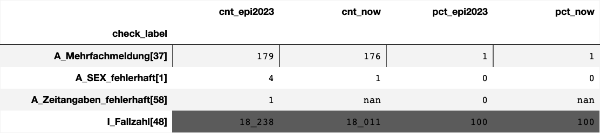
    


    
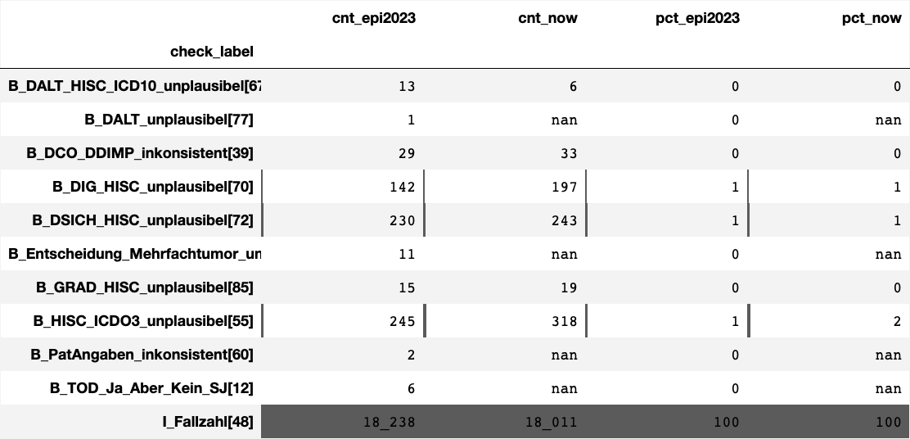
    


    
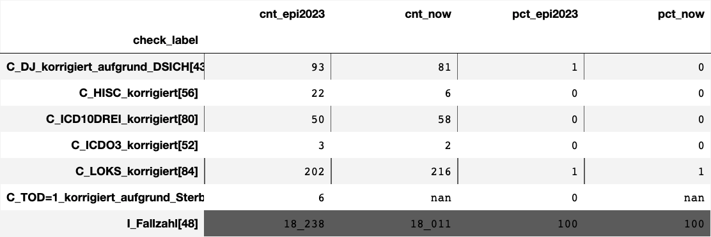
    


<div style="page-break-after: always;"></div>

### <a id='toc1_6_2_'></a>[✅ 02-HH](#toc0_)


    
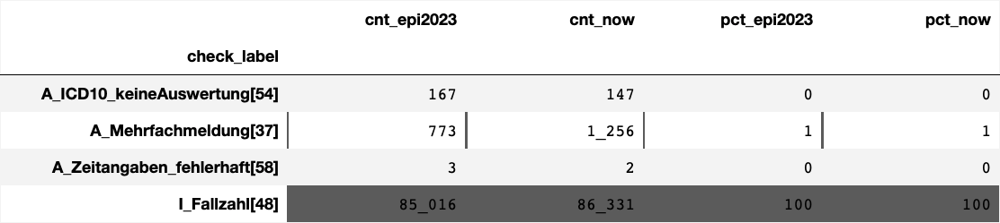
    


    
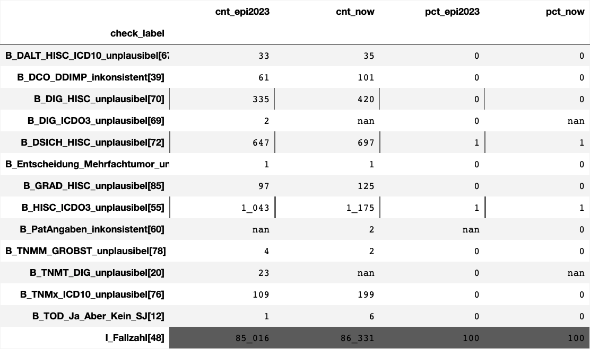
    


    
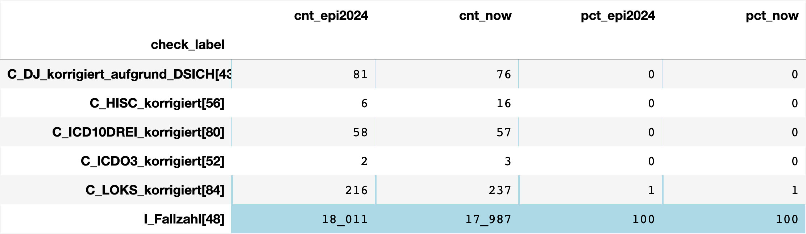
    


<div style="page-break-after: always;"></div>

### <a id='toc1_6_3_'></a>[✅ 03-NI](#toc0_)


    

    


    
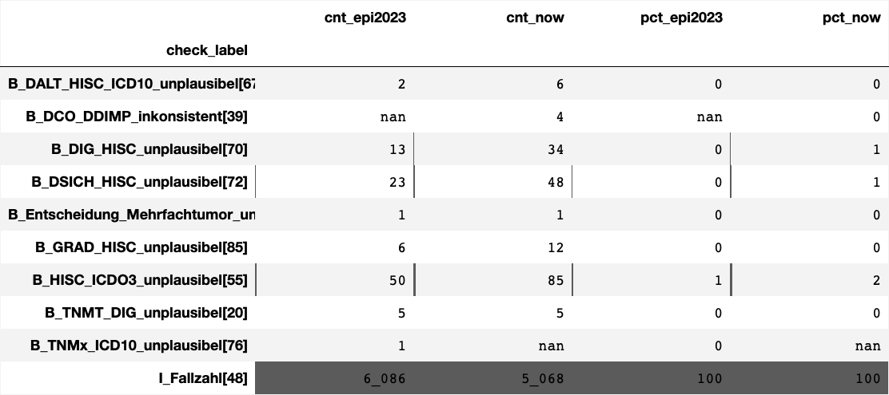
    


    
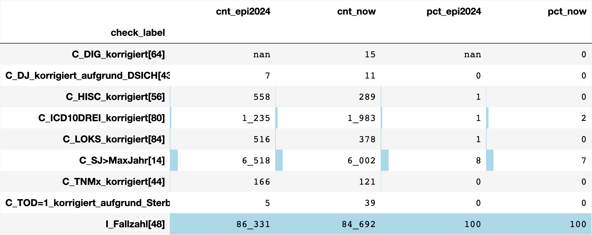
    


<div style="page-break-after: always;"></div>

### <a id='toc1_6_4_'></a>[✅ 04-HB](#toc0_)


    

    


    

    


    

    


<div style="page-break-after: always;"></div>

### <a id='toc1_6_5_'></a>[⚠️ 05-NW](#toc0_)
- unverändert hohe werte bei `A_EKRNR_GKZ_unplausibel`


    
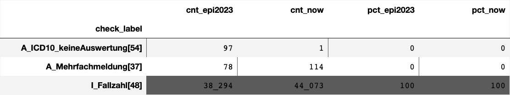
    


    
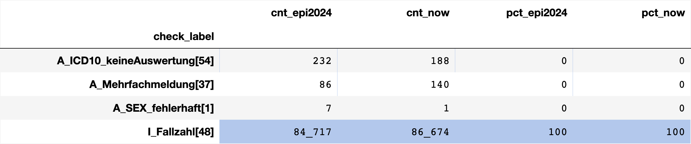
    


    
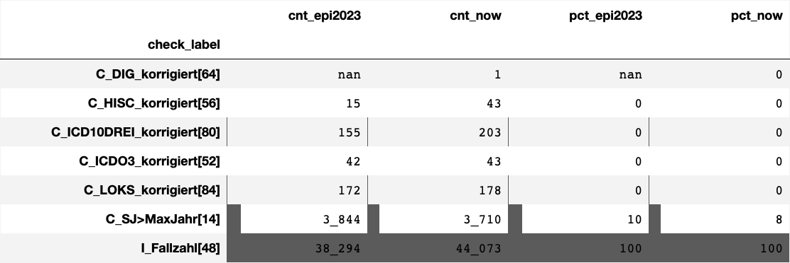
    


<div style="page-break-after: always;"></div>

### <a id='toc1_6_6_'></a>[🚨 06-HE](#toc0_)
- Fallzahl DJ=2024 deutlich geringer


    
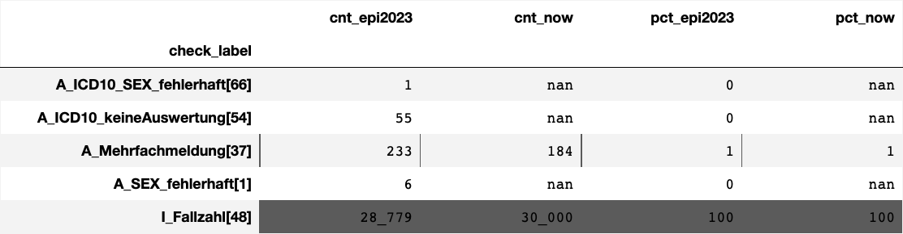
    


    
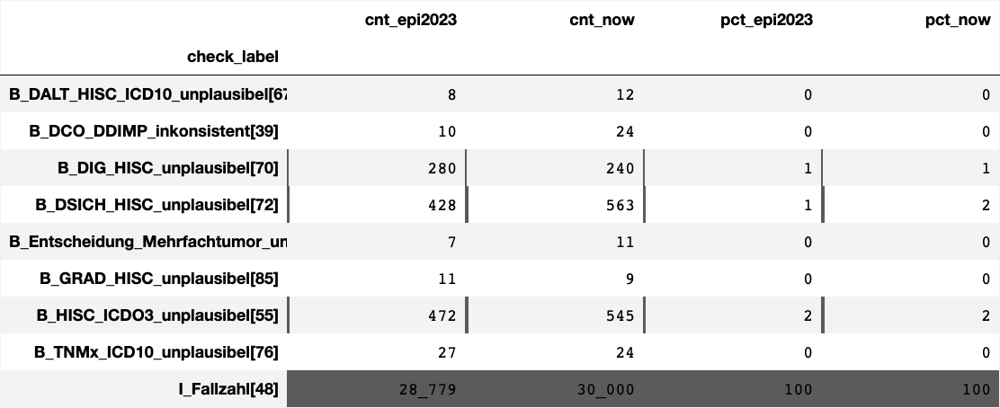
    


    
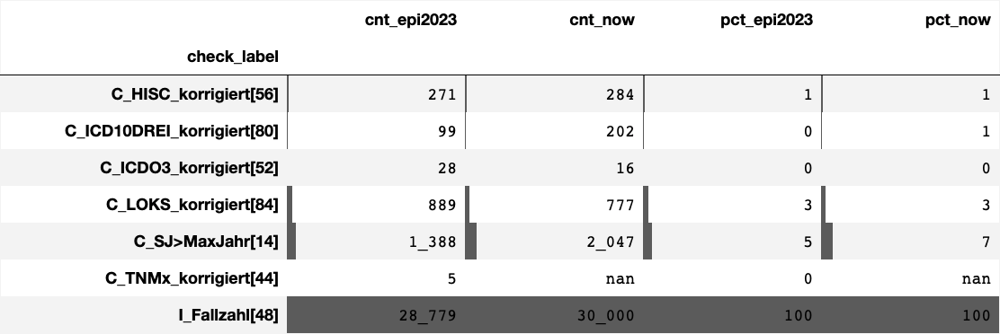
    


<div style="page-break-after: always;"></div>

### <a id='toc1_6_7_'></a>[✅ 07-RP](#toc0_)


    
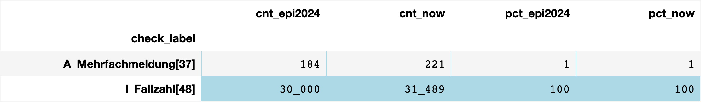
    


    
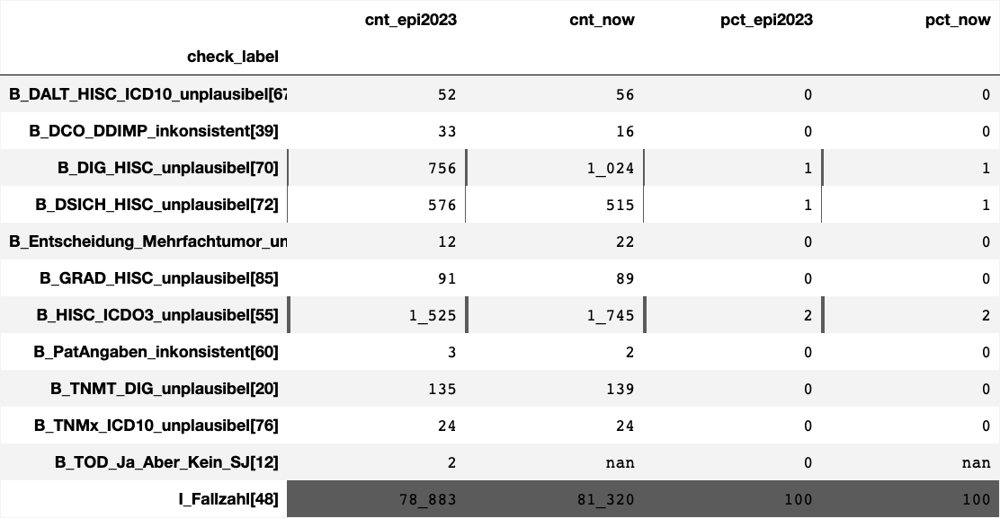
    


    
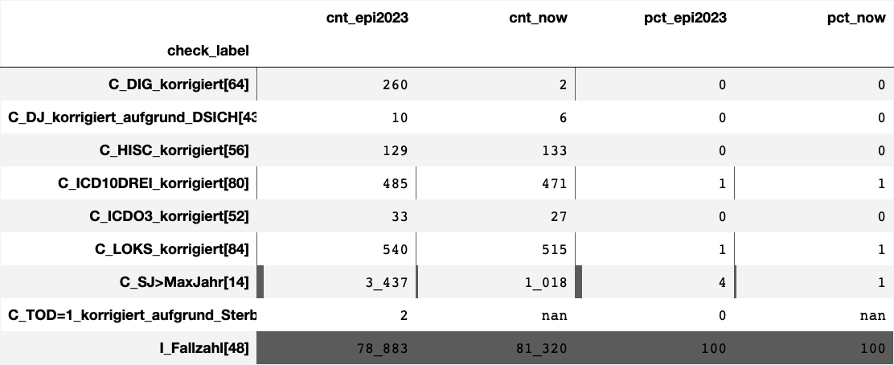
    


<div style="page-break-after: always;"></div>

### <a id='toc1_6_8_'></a>[✅ 08-BW](#toc0_)


    
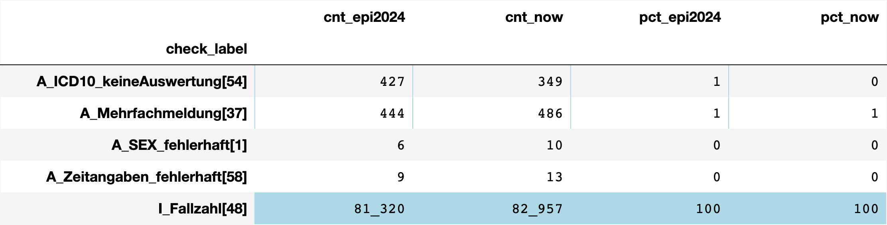
    


    

    


    
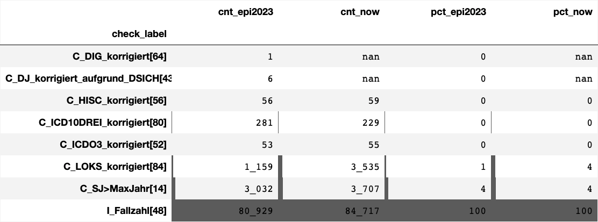
    


<div style="page-break-after: always;"></div>

### <a id='toc1_6_9_'></a>[✅ 09-BY](#toc0_)


    
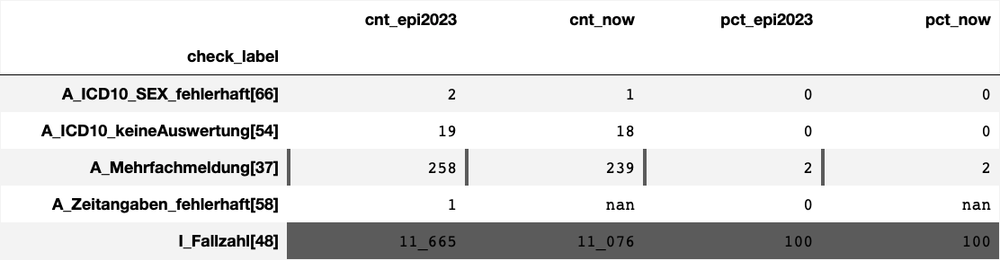
    


    

    


    

    


<div style="page-break-after: always;"></div>

### <a id='toc1_6_10_'></a>[✅ 10-SL](#toc0_)
- `A_Mehrfachmeldung` leicht erhöht mit ~4%


    
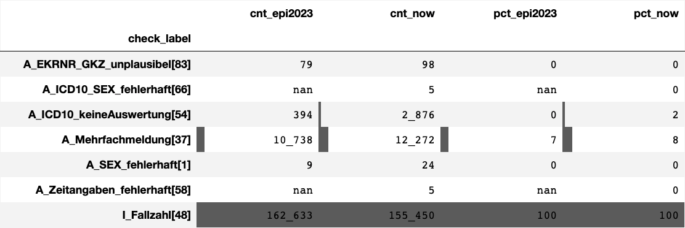
    


    
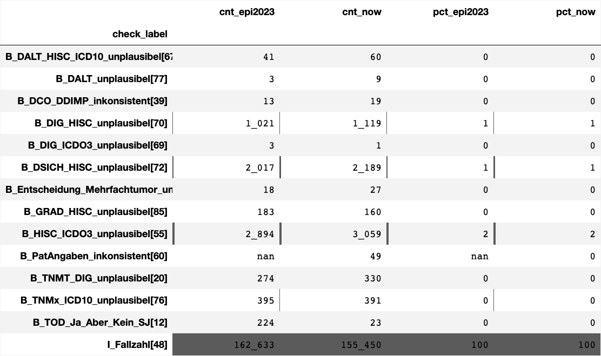
    


    

    


<div style="page-break-after: always;"></div>

### <a id='toc1_6_11_'></a>[✅ 11-GKR (ehemals)](#toc0_)


    
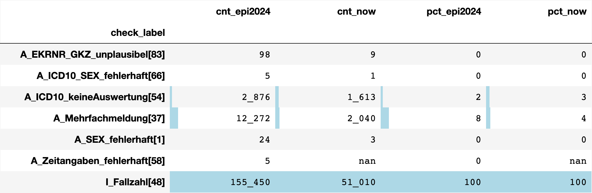
    


    

    


    

    

