# <a id='toc1_'></a>[Bericht zur Datenqualität (epi2025_beta) 📉](#toc0_)

**Table of contents**<a id='toc0_'></a>    
- [Bericht zur Datenqualität (epi2025_beta) 📉](#toc1_)    
  - [Änderungen seit der letzten Version](#toc1_1_)    
  - [Hinweise](#toc1_2_)    
  - [Datenstand 🕥](#toc1_3_)    
  - [Fallzahlen im Verlauf der Jahreslieferungen](#toc1_4_)    
    - [original geliefert](#toc1_4_1_)    
    - [nach Abschluss der Prüfungen im ZfKD](#toc1_4_2_)    
  - [Variablenverteilung](#toc1_5_)    
    - [Diagnosejahr](#toc1_5_1_)    
    - [Diagnosegruppen](#toc1_5_2_)    
    - [Diagnosesicherung](#toc1_5_3_)    
    - [DCO Diagramm](#toc1_5_4_)    
    - [DCO](#toc1_5_5_)    
    - [BL vs EKRNR](#toc1_5_6_)    
    - [Dignität](#toc1_5_7_)    
    - [Grading Verteilung](#toc1_5_8_)    
    - [🚧  Grading Anteil](#toc1_5_9_)    
    - [T Anteil (c oder p)](#toc1_5_10_)    
    - [Altersgruppen](#toc1_5_11_)    
    - [UICC](#toc1_5_12_)    
    - [TNM-Auflage](#toc1_5_13_)    
    - [Tod](#toc1_5_14_)    
      - [Anteil Verstorbene](#toc1_5_14_1_)    
      - [Verteilung Todesursachen nach ICDT10](#toc1_5_14_2_)    
  - [Anteil Mehrfachtumore](#toc1_6_)    
  - [Plausibilitätsprüfungen](#toc1_7_)    
    - [⚠️ 01-SH](#toc1_7_1_)    
    - [✅ 02-HH](#toc1_7_2_)    
    - [✅ 03-NI](#toc1_7_3_)    
    - [✅ 04-HB](#toc1_7_4_)    
    - [⚠️ 05-NW](#toc1_7_5_)    
    - [🚨 06-HE](#toc1_7_6_)    
    - [✅ 07-RP](#toc1_7_7_)    
    - [✅ 08-BW](#toc1_7_8_)    
    - [✅ 09-BY](#toc1_7_9_)    
    - [✅ 10-SL](#toc1_7_10_)    
    - [✅ 11-GKR (ehemals)](#toc1_7_11_)    
      - [Verteilung der Variable TOD in den original gelieferten Daten](#toc1_7_11_1_)    

<!-- vscode-jupyter-toc-config
	numbering=false
	anchor=true
	flat=false
	minLevel=1
	maxLevel=6
	/vscode-jupyter-toc-config -->
<!-- THIS CELL WILL BE REPLACED ON TOC UPDATE. DO NOT WRITE YOUR TEXT IN THIS CELL -->

<br>

## <a id='toc1_1_'></a>[Änderungen seit der letzten Version](#toc0_)
<!-- - bisher wurden folgende Angaben in einer umfangreichen Verarbeitung im workflow umkodiert: `ICDGM10`, `HISC`, `ICDO3`, `DIG`. Diese Umformung wurde deaktiviert, es finden nun nur noch punktuelle Korrekturen statt -->
- Lieferung Daten mit DJ=2024
- ausstehend: `13-MV`

<br>

## <a id='toc1_2_'></a>[Hinweise](#toc0_)
- Bewertungen der Analysen sind mit 💡 markiert
- bei den Plausibilitätsprüfungen weist ein ✅ darauf hin, dass keine Mängel erkennbar sind

<br>

## <a id='toc1_3_'></a>[Datenstand 🕥](#toc0_)

    🐍 3.12.8 | 📦 pandas: 2.3.3 | 📦 numpy: 1.26.4 | 📦 duckdb: 1.4.4 | 📦 pandas-plots: 1.3.0 | 📦 connection-helper: 0.13.3


    database file:           2026-03-03_data_epi.duckdb
    data tag:                epi2025_beta
    sql table created:       2026-03-03 09:47:44
    doi:                     -
    document created:        2026-03-17 09:07:16


    
    aktuellster batch               425
    aktuellstes Diagnosejahr 📆     (2024)


<div style="page-break-after: always;"></div>

## <a id='toc1_4_'></a>[Fallzahlen im Verlauf der Jahreslieferungen](#toc0_)
- kein Filter
- es werden Datenstände (_batch_) aus mehreren Lieferjahren dargestellt , welche über eine laufende Nummer sowie das Datum der Ausführung vergleichbar sind
- in Abgrenzung zu den klinischen Daten ist jede einzelne EKR Lieferung für das gesamte Lieferjahr gültig

<br>

### <a id='toc1_4_1_'></a>[original geliefert](#toc0_)
- aufgeführt sind die Fallzahlen aus den überlieferten Dateien **vor** den ZfKD Anpassungen
- `batch_label` markiert den jeweils letzten offiziellen Datenstand des Lieferjahres, sowie den aktuellen Datenstand


    

    


<br>

### <a id='toc1_4_2_'></a>[nach Abschluss der Prüfungen im ZfKD](#toc0_)
- Filter: jeweils das **letzte DJ** der einzelnen Jahreslieferung
- aufgeführt sind die Fallzahlen aus den überlieferten Dateien **nach** den ZfKD Anpassungen


    
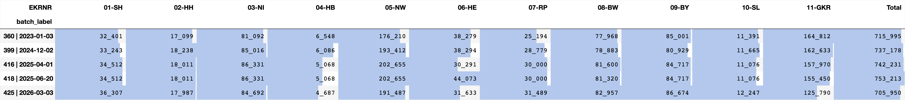
    


<div style="page-break-after: always;"></div>

## <a id='toc1_5_'></a>[Variablenverteilung](#toc0_)
<!-- - **Filter:**
  - **🚨 sofern nicht anders angegeben ist der Zeitraum beschränkt auf das höchste Diagnosejahr (für `epi2024`: 2023) 🚨**
  - Diagnosen: ausgeschlossen sind `C44` und alle `D` -->
- ab hier wird nur die aktuelle Datenlieferung dargestellt
- als ungültig markierte Fälle (_A-Prüfungen_) sind in allen Fallzahlen ausgeschlossen
- in den barplots sind die relativen Häufigkeiten von Variablen im Datensatz der Register aufgetragen
- zusätzlich ist die Angabe für alle kkr enthalten (`Total`)
- näherungsweise sind GKZ-Bundesländer verwendet anstatt Lieferregister, um 11-16 aufspannen zu können

<br>

### <a id='toc1_5_1_'></a>[Diagnosejahr](#toc0_)


```
    counts: all rows (no grouping)
    ---
    n = 17_569_016                             (100.0%) ██████████████████████████████
    └ [keine gelöschten Fälle]: n = 16_964_151  (96.6%) ░░████████████████████████████
    └ [DJ 2019-2025]:            n = 4_597_256  (26.2%) ░░░░░░░░░░░░░░░░░░░░░░░███████
    └ [ICD10 nur C]:             n = 3_886_792  (22.1%) ░░░░░░░░░░░░░░░░░░░░░░░░██████
    └ [keine C44,D04]:           n = 3_143_607  (17.9%) ░░░░░░░░░░░░░░░░░░░░░░░░░█████
```

<details>
<summary>filter-sql</summary>

```sql
is_deleted = 0
and z_dy between 2019 and 2025
and left(z_icd10_3d,1) = 'C'
and z_icd10_3d not in ('C44','D04')
```

</details>


    
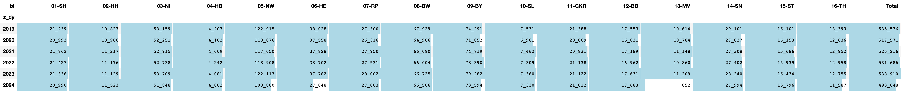
    


### <a id='toc1_5_2_'></a>[Diagnosegruppen](#toc0_)

> 💡 `ZfKD`: _"Die Anteile für D-Diagnosen sind in etwa vergleichbar, die für C44 unterscheiden sich recht deutlich"_


```
    counts: all rows (no grouping)
    ---
    n = 17_569_016                             (100.0%) ██████████████████████████████
    └ [keine gelöschten Fälle]: n = 16_964_151  (96.6%) ░░████████████████████████████
    └ [DJ 2024]:                   n = 705_950   (4.0%) ░░░░░░░░░░░░░░░░░░░░░░░░░░░░░█
```

<details>
<summary>filter-sql</summary>

```sql
is_deleted = 0
and z_dy = 2024
```

</details>


    
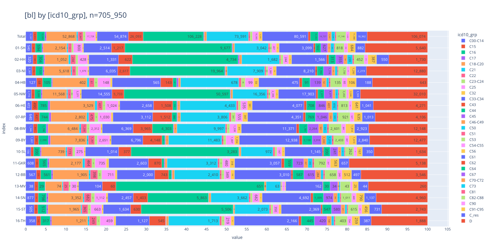
    


<br>

### <a id='toc1_5_3_'></a>[Diagnosesicherung](#toc0_)

> 💡 `ZfKD`: _"auffällig ist der hohe Anteil an fehlenden Diagnosesicherungen in `08-BW`"_  


```
    counts: all rows (no grouping)
    ---
    n = 17_569_016                             (100.0%) ██████████████████████████████
    └ [keine gelöschten Fälle]: n = 16_964_151  (96.6%) ░░████████████████████████████
    └ [DJ 2024]:                   n = 705_950   (4.0%) ░░░░░░░░░░░░░░░░░░░░░░░░░░░░░█
    └ [ICD10 nur C]:               n = 599_876   (3.4%) ░░░░░░░░░░░░░░░░░░░░░░░░░░░░░█
    └ [keine C44,D04]:             n = 493_648   (2.8%) ░░░░░░░░░░░░░░░░░░░░░░░░░░░░░░
```

<details>
<summary>filter-sql</summary>

```sql
is_deleted = 0
and z_dy = 2024
and left(z_icd10_3d,1) = 'C'
and z_icd10_3d not in ('C44','D04')
```

</details>


    
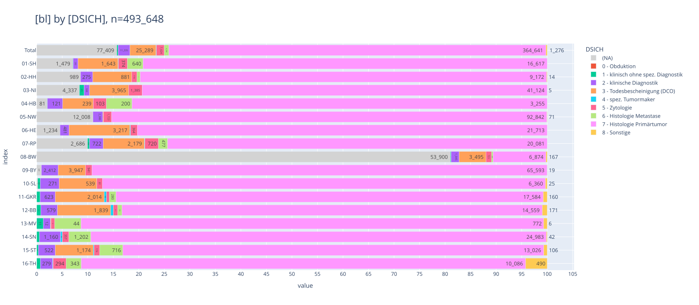
    


<!-- <br>

### <a id='toc1_5_4_'></a>[DCO Diagramm](#toc0_)
- **Filter: DJ = 2020-2024, C44 und D-Diagnosen sind ausgeschlossen, GKZbl 01-16**
- die epi Variable `DCO` wird wie folgt gebildet:
  - 1 wenn Diagnosesicherung = 3
  - sonst 2 (auch für Diagnosesicherung missing)  -->

### <a id='toc1_5_5_'></a>[DCO](#toc0_)
- Metrik: Anteil DCO an Gesamtfallzahl in %
<!-- > 💡 für 09-BY sind in dieser Lieferung erheblich weniger DCO Fälle festzustellen -->
> 💡 `ZfKD`: _"kaum DCO Markierungen für Fälle aus `05-NW` in 2024"_


```
    counts: all rows (no grouping)
    ---
    n = 17_569_016                             (100.0%) ██████████████████████████████
    └ [keine gelöschten Fälle]: n = 16_964_151  (96.6%) ░░████████████████████████████
    └ [ICD10 nur C]:            n = 14_973_906  (85.2%) ░░░░░█████████████████████████
    └ [keine C44,D04]:          n = 12_161_317  (69.2%) ░░░░░░░░░░████████████████████
    └ [DJ 2010-2024]:            n = 7_646_321  (43.5%) ░░░░░░░░░░░░░░░░░█████████████
```

<details>
<summary>filter-sql</summary>

```sql
is_deleted = 0
and left(z_icd10_3d,1) = 'C'
and z_icd10_3d not in ('C44','D04')
and z_dy between 2010 and 2024
```

</details>


    
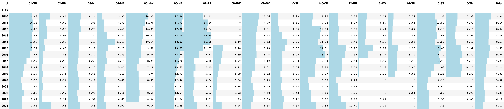
    


### <a id='toc1_5_6_'></a>[BL vs EKRNR](#toc0_)
- neue Bundesländer sind nicht aufgeführt, da Daten erst ab 2020 aus Länderregistern


```
    counts: all rows (no grouping)
    ---
    n = 17_569_016                (100.0%) ██████████████████████████████
    └ [keine NBL]: n = 13_493_606  (76.8%) ░░░░░░░███████████████████████
```

<details>
<summary>filter-sql</summary>

```sql
z_kkr < 11
```

</details>


    
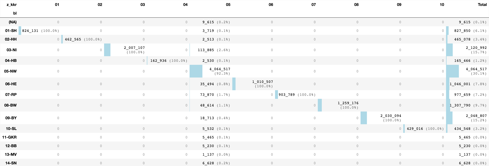
    


<br>

### <a id='toc1_5_7_'></a>[Dignität](#toc0_)


```
    counts: all rows (no grouping)
    ---
    n = 17_569_016                             (100.0%) ██████████████████████████████
    └ [keine gelöschten Fälle]: n = 16_964_151  (96.6%) ░░████████████████████████████
    └ [DJ 2020-2024]:            n = 3_814_755  (21.7%) ░░░░░░░░░░░░░░░░░░░░░░░░██████
```

<details>
<summary>filter-sql</summary>

```sql
is_deleted = 0
and z_dy between 2020 and 2024
```

</details>


    
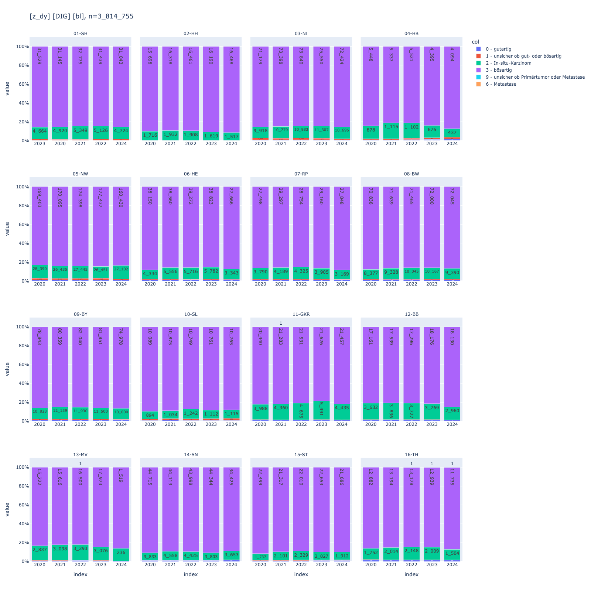
    


    GRAD 6

```
    ┌─────────┬────────────┬───────┐
    │  EKRNR  │ is_deleted │  cnt  │
    │ varchar │    int8    │ int64 │
    ├─────────┼────────────┼───────┤
    │ 11      │          0 │     1 │
    │ 03      │          1 │     4 │
    │ 08      │          1 │  2226 │
    │ 11      │          1 │ 10084 │
    └─────────┴────────────┴───────┘
```

<br>

### <a id='toc1_5_8_'></a>[Grading Verteilung](#toc0_)
❓filter


```
    counts: all rows (no grouping)
    ---
    n = 17_569_016                                  (100.0%) ██████████████████████████████
    └ [keine gelöschten Fälle]:      n = 16_964_151  (96.6%) ░░████████████████████████████
    └ [DJ 2024]:                        n = 705_950   (4.0%) ░░░░░░░░░░░░░░░░░░░░░░░░░░░░░█
    └ [keine DCO]:                      n = 678_450   (3.9%) ░░░░░░░░░░░░░░░░░░░░░░░░░░░░░█
    └ [nur gradingrelevante Tumore]:    n = 232_350   (1.3%) ░░░░░░░░░░░░░░░░░░░░░░░░░░░░░░
```

<details>
<summary>filter-sql</summary>

```sql
is_deleted = 0
and z_dy = 2024
and not z_is_dco
and 
    (
        left(z_icd10_3d, 1) ='C' and
        (
            right(z_icd10_3d, 2)::int8 between 00 and 33
            or right(z_icd10_3d, 2)::int8 between 50 and 57
            or right(z_icd10_3d, 2)::int8 between 63 and 68
            or right(z_icd10_3d, 2)::int8 = 60
        )
        and left(Morphologie_Code,4)::int between 8010 and 8576
    )
```

</details>


    
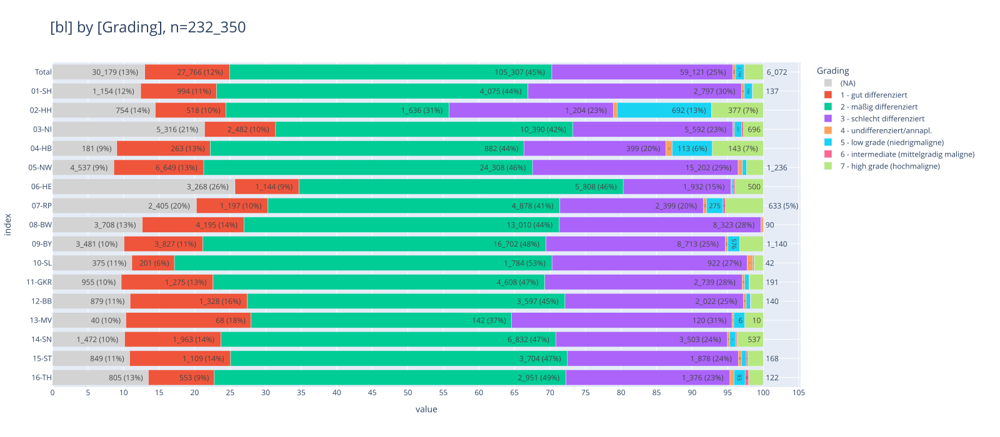
    


### <a id='toc1_5_9_'></a>[🚧  Grading Anteil](#toc0_)
- Metrik: Anteil GRAD missings


```
    counts: all rows (no grouping)
    ---
    n = 17_569_016                                  (100.0%) ██████████████████████████████
    └ [keine gelöschten Fälle]:      n = 16_964_151  (96.6%) ░░████████████████████████████
    └ [DJ 2020-2024]:                 n = 3_814_755  (21.7%) ░░░░░░░░░░░░░░░░░░░░░░░░██████
    └ [keine DCO]:                    n = 3_643_458  (20.7%) ░░░░░░░░░░░░░░░░░░░░░░░░██████
    └ [nur gradingrelevante Tumore]:  n = 1_238_330   (7.0%) ░░░░░░░░░░░░░░░░░░░░░░░░░░░░██
```

<details>
<summary>filter-sql</summary>

```sql
is_deleted = 0
and z_dy between 2020 and 2024
and not z_is_dco
and 
    (
        left(z_icd10_3d, 1) ='C' and
        (
            right(z_icd10_3d, 2)::int8 between 00 and 33
            or right(z_icd10_3d, 2)::int8 between 50 and 57
            or right(z_icd10_3d, 2)::int8 between 63 and 68
            or right(z_icd10_3d, 2)::int8 = 60
        )
        and left(Morphologie_Code,4)::int between 8010 and 8576
    )
```

</details>


    
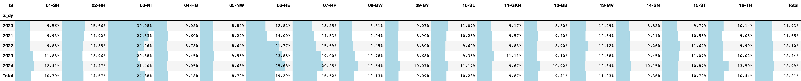
    


### <a id='toc1_5_10_'></a>[T Anteil (c oder p)](#toc0_)
- Metrik: Anteil `TNMTKURZ` missings


```
    counts: all rows (no grouping)
    ---
    n = 17_569_016                               (100.0%) ██████████████████████████████
    └ [keine gelöschten Fälle]:   n = 16_964_151  (96.6%) ░░████████████████████████████
    └ [DJ 2020-2024]:              n = 3_814_755  (21.7%) ░░░░░░░░░░░░░░░░░░░░░░░░██████
    └ [keine DCO]:                 n = 3_643_458  (20.7%) ░░░░░░░░░░░░░░░░░░░░░░░░██████
    └ [nur tnm-relevante Tumore]:  n = 2_029_346  (11.6%) ░░░░░░░░░░░░░░░░░░░░░░░░░░░███
```

<details>
<summary>filter-sql</summary>

```sql
is_deleted = 0
and z_dy between 2020 and 2024
and not z_is_dco
and 
    (
        left(z_icd10_3d, 1) ='C' and
        (
            right(z_icd10_3d, 2)::int8 between 00 and 43
            or right(z_icd10_3d, 2)::int8 between 45 and 69
            or right(z_icd10_3d, 2)::int8 between 73 and 74
        )
        and left(Morphologie_Code,4)::int between 8010 and 8790
        and z_icd10_3d not in ('C26', 'C39', 'C55')
        and z_icd10 not in ('C14.0', 'C57.9', 'C63.9')
    )
```

</details>


    
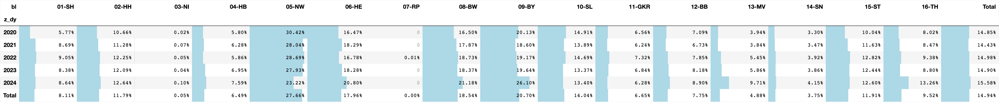
    


<br>

### <a id='toc1_5_11_'></a>[Altersgruppen](#toc0_)


```
    counts: all rows (no grouping)
    ---
    n = 17_569_016                             (100.0%) ██████████████████████████████
    └ [keine gelöschten Fälle]: n = 16_964_151  (96.6%) ░░████████████████████████████
    └ [DJ 2024]:                   n = 705_950   (4.0%) ░░░░░░░░░░░░░░░░░░░░░░░░░░░░░█
    └ [ICD10 nur C]:               n = 599_876   (3.4%) ░░░░░░░░░░░░░░░░░░░░░░░░░░░░░█
    └ [keine C44,D04]:             n = 493_648   (2.8%) ░░░░░░░░░░░░░░░░░░░░░░░░░░░░░░
```

<details>
<summary>filter-sql</summary>

```sql
is_deleted = 0
and z_dy = 2024
and left(z_icd10_3d,1) = 'C'
and z_icd10_3d not in ('C44','D04')
```

</details>


    
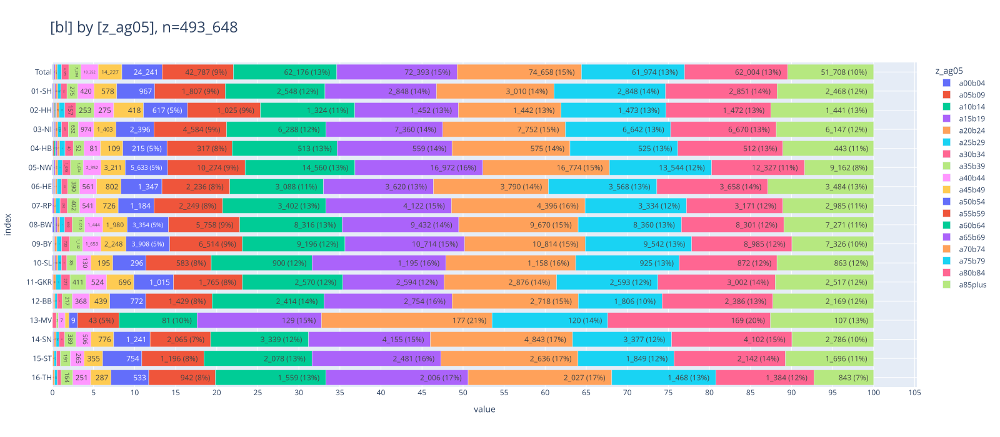
    


<br>

### <a id='toc1_5_12_'></a>[UICC](#toc0_)
- die Variable `UICC` wird vom ZfKD gebildet


```
    counts: all rows (no grouping)
    ---
    n = 17_569_016                             (100.0%) ██████████████████████████████
    └ [keine gelöschten Fälle]: n = 16_964_151  (96.6%) ░░████████████████████████████
    └ [DJ 2024]:                   n = 705_950   (4.0%) ░░░░░░░░░░░░░░░░░░░░░░░░░░░░░█
    └ [ICD10 nur C]:               n = 599_876   (3.4%) ░░░░░░░░░░░░░░░░░░░░░░░░░░░░░█
    └ [keine C44,D04]:             n = 493_648   (2.8%) ░░░░░░░░░░░░░░░░░░░░░░░░░░░░░░
```

<details>
<summary>filter-sql</summary>

```sql
is_deleted = 0
and z_dy = 2024
and left(z_icd10_3d,1) = 'C'
and z_icd10_3d not in ('C44','D04')
```

</details>


    
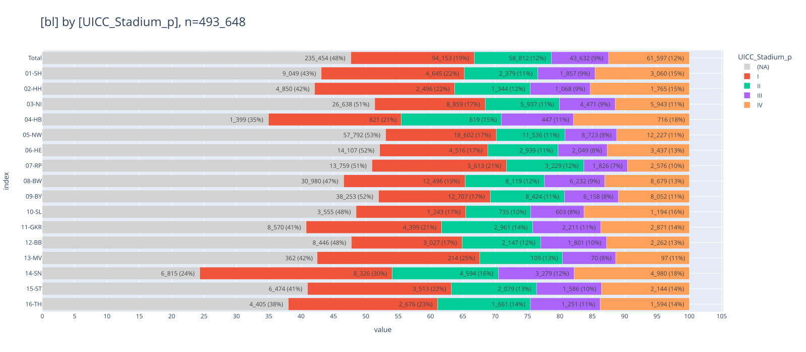
    


<br>

### <a id='toc1_5_13_'></a>[TNM-Auflage](#toc0_)
- nicht übermittelte Auflagen werden im ZfKD geschätzt und imputiert anhand des DJ, daher keine missings

> 💡 `ZfKD`: _"Auflage 7 nur noch von 03-NI in nennenswertem Umfang übermittelt"_


```
    counts: all rows (no grouping)
    ---
    n = 17_569_016                             (100.0%) ██████████████████████████████
    └ [keine gelöschten Fälle]: n = 16_964_151  (96.6%) ░░████████████████████████████
    └ [DJ 2024]:                   n = 705_950   (4.0%) ░░░░░░░░░░░░░░░░░░░░░░░░░░░░░█
    └ [ICD10 nur C]:               n = 599_876   (3.4%) ░░░░░░░░░░░░░░░░░░░░░░░░░░░░░█
    └ [keine C44,D04]:             n = 493_648   (2.8%) ░░░░░░░░░░░░░░░░░░░░░░░░░░░░░░
```

<details>
<summary>filter-sql</summary>

```sql
is_deleted = 0
and z_dy = 2024
and left(z_icd10_3d,1) = 'C'
and z_icd10_3d not in ('C44','D04')
```

</details>


    
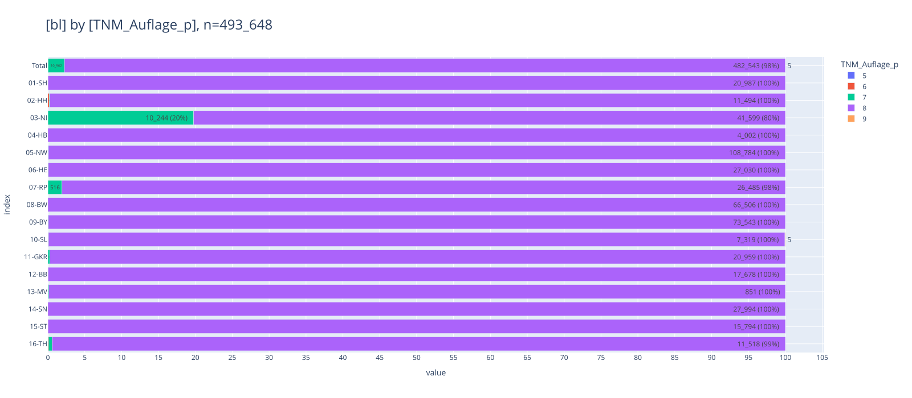
    


<br>

### <a id='toc1_5_14_'></a>[Tod](#toc0_)

#### <a id='toc1_5_14_1_'></a>[Anteil Verstorbene](#toc0_)
- gezählt sind **Personen**
- Metrik: Anteil Verstorbene


```
    counts: distinct GLOBALPATID
    ---
    n = 14_998_886                             (100.0%) ██████████████████████████████
    └ [keine gelöschten Fälle]: n = 14_585_410  (97.2%) ░█████████████████████████████
    └ [DJ 2020-2024]:            n = 3_548_356  (23.7%) ░░░░░░░░░░░░░░░░░░░░░░░███████
    └ [ICD10 nur C]:             n = 3_021_090  (20.1%) ░░░░░░░░░░░░░░░░░░░░░░░░██████
    └ [keine C44,D04]:           n = 2_486_711  (16.6%) ░░░░░░░░░░░░░░░░░░░░░░░░░░████
```

<details>
<summary>filter-sql</summary>

```sql
is_deleted = 0
and z_dy between 2020 and 2024
and left(z_icd10_3d,1) = 'C'
and z_icd10_3d not in ('C44','D04')
```

</details>


    
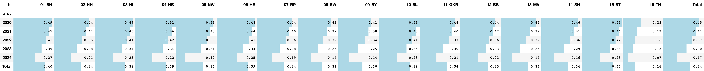
    


#### <a id='toc1_5_14_2_'></a>[Verteilung Todesursachen nach ICDT10](#toc0_)
- gezählt sind **Personen**
- `icdt10_1d` gibt die erste Stelle der Todesursache an


```
    counts: distinct GLOBALPATID
    ---
    n = 14_998_886                             (100.0%) ██████████████████████████████
    └ [keine gelöschten Fälle]: n = 14_585_410  (97.2%) ░█████████████████████████████
    └ [nur Verstorbene]:         n = 7_558_161  (50.4%) ░░░░░░░░░░░░░░░███████████████
    └ [SJ ab 2010]:              n = 5_099_012  (34.0%) ░░░░░░░░░░░░░░░░░░░░██████████
```

<details>
<summary>filter-sql</summary>

```sql
is_deleted = 0
and Verstorben = 'J'
and year(SDIMP) >= 2010
```

</details>


    

    


## <a id='toc1_6_'></a>[Anteil Mehrfachtumore](#toc0_)


```
    counts: all rows (no grouping)
    ---
    n = 17_569_016                     (100.0%) ██████████████████████████████
    └ [DJ 2010-2024]:   n = 11_641_922  (66.3%) ░░░░░░░░░░░███████████████████
    └ [nur gültige BL]: n = 11_632_852  (66.2%) ░░░░░░░░░░░███████████████████
```

<details>
<summary>filter-sql</summary>

```sql
z_dy between 2010 and 2024
and GKZbl::tinyint <= 16
```

</details>


    
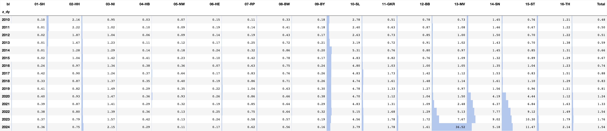
    


<div style="page-break-after: always;"></div>

## <a id='toc1_7_'></a>[Plausibilitätsprüfungen](#toc0_)
- **Filter**
  - **es ist jeweils nur das aktuellste DJ berücksichtigt (aktuell: 2024, ins letzter Lieferung: 2023)**
- Die Tabellen sind zur besseren Lesbarkeit nun aufgeteilt nach den Plausibilitätsprüfungen ([pdf](https://www.krebsregisterverbund.de/attachments/download/8743/Plausibilit%C3%A4tspr%C3%BCfungen_details.pdf))
  - `A`: Fälle ausgeschlossen
  - `B`: Fälle markiert
  - `C`: Fälle korrigiert
- Spalten
  - `cnt_epi2024`: Absolute Fallzahl der checks für das in diesem Datensatz höchste DJ (2023)
  - `cnt_now`: Absolute Fallzahl der checks für das im aktuellen Datensatz höchsten DJ (2024)
  - `pct_epi2024`: Anteil Fallzahl der checks an allen Fällen für das in diesem Datensatz höchste DJ (2023)
  - `pct_now`: Anteil Fallzahl der checks an allen Fällen für das im aktuellen Datensatz höchste DJ (2024)
  - _(Absolute Fallzahlen = nach Abzug der A-Prüfungen)_

<br>

### <a id='toc1_7_1_'></a>[⚠️ 01-SH](#toc0_)
- `B_TOD_Ja_Aber_Kein_SJ`: 0 -> 4%
- alle Fälle wurden korrigiert laut `C_TOD=1_korrigiert_aufgrund_Sterbeangaben`


    


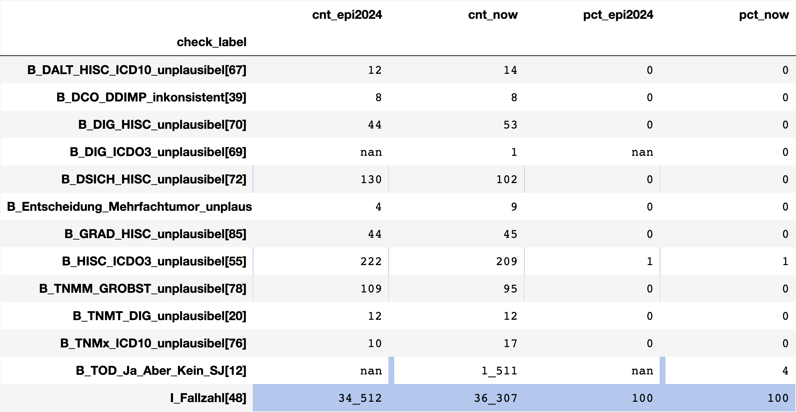
    


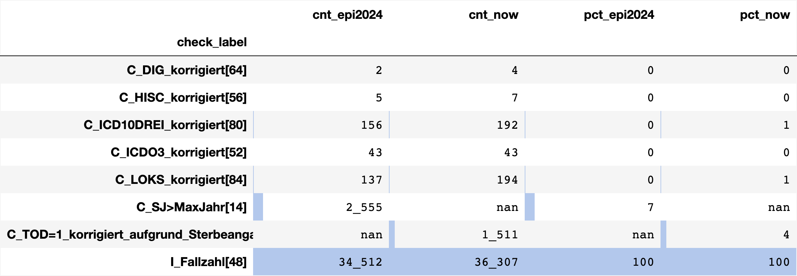
    


<div style="page-break-after: always;"></div>

### <a id='toc1_7_2_'></a>[✅ 02-HH](#toc0_)


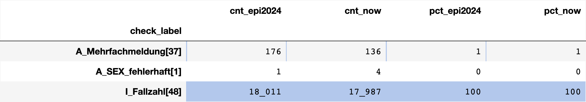
    


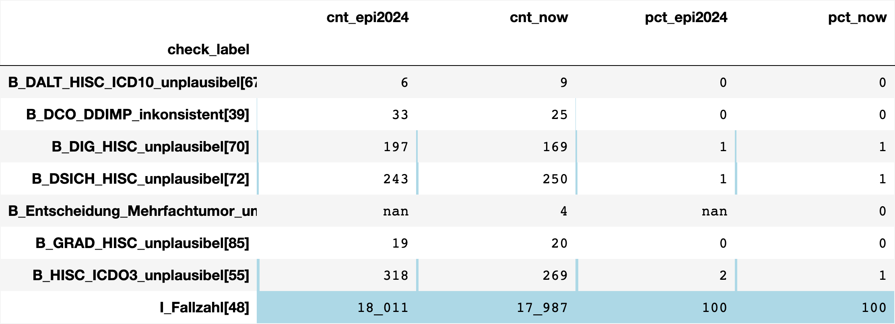
    


    


<div style="page-break-after: always;"></div>

### <a id='toc1_7_3_'></a>[✅ 03-NI](#toc0_)


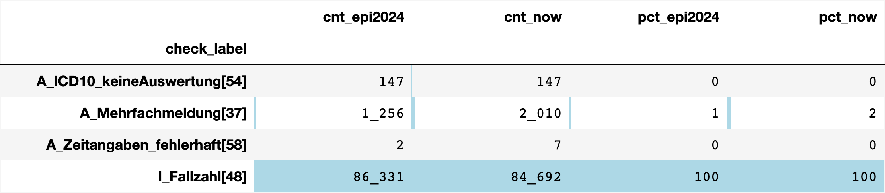
    


    


    


<div style="page-break-after: always;"></div>

### <a id='toc1_7_4_'></a>[✅ 04-HB](#toc0_)


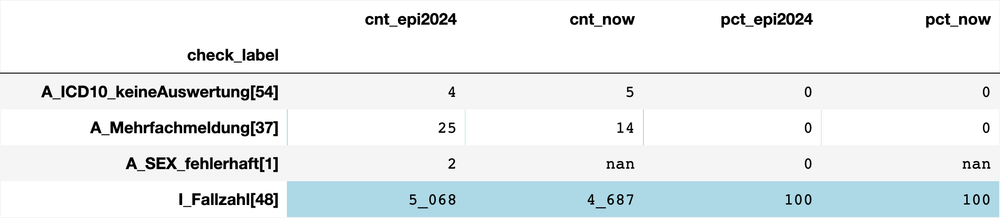
    


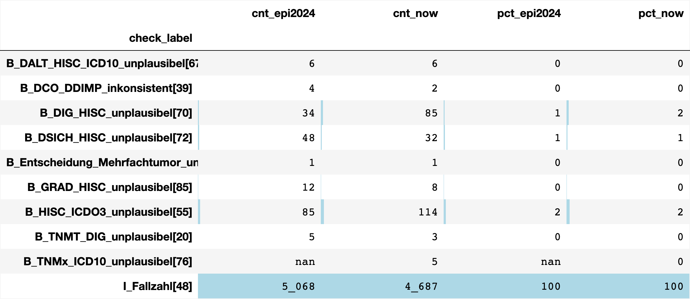
    


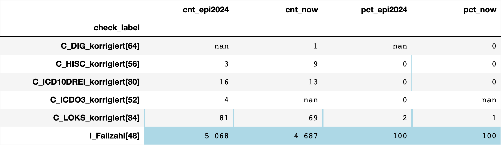
    


<div style="page-break-after: always;"></div>

### <a id='toc1_7_5_'></a>[⚠️ 05-NW](#toc0_)
- unverändert hohe werte bei `A_EKRNR_GKZ_unplausibel`


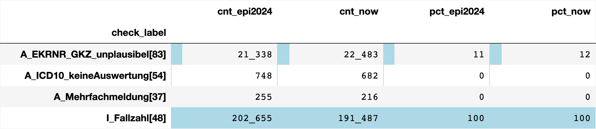
    


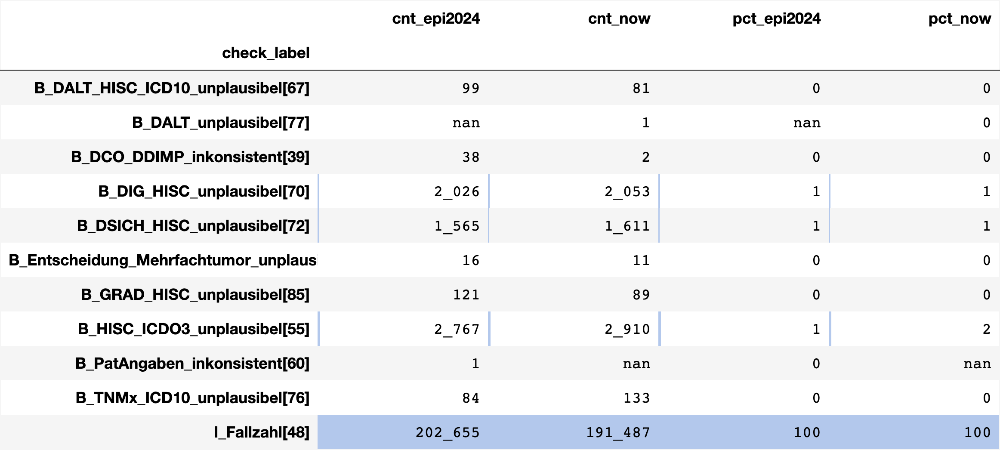
    


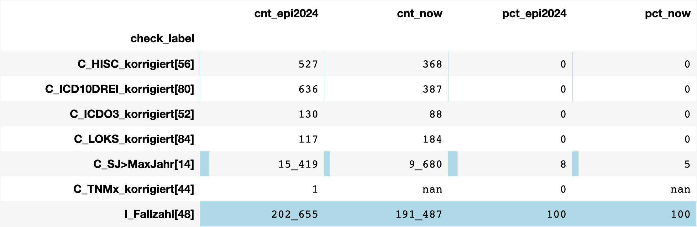
    


<div style="page-break-after: always;"></div>

### <a id='toc1_7_6_'></a>[🚨 06-HE](#toc0_)
- Fallzahl DJ=2024 deutlich geringer


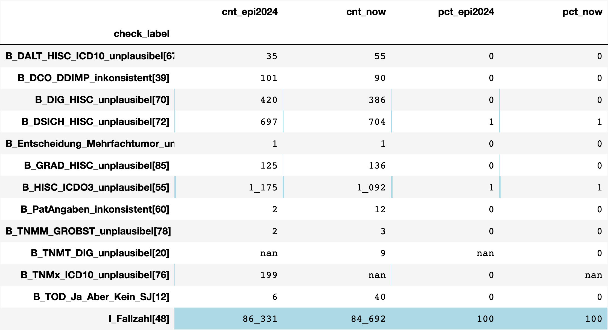
    


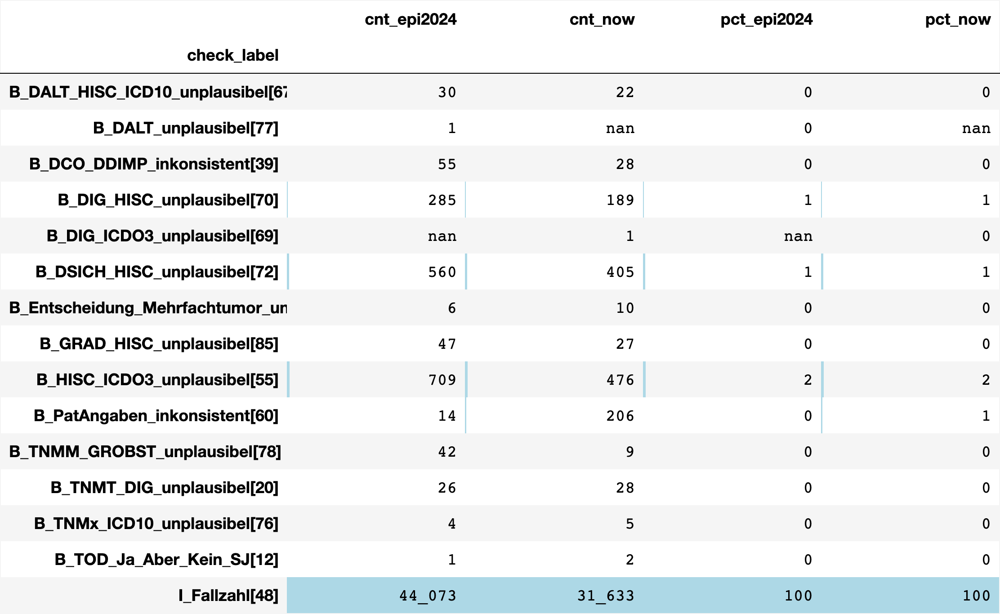
    


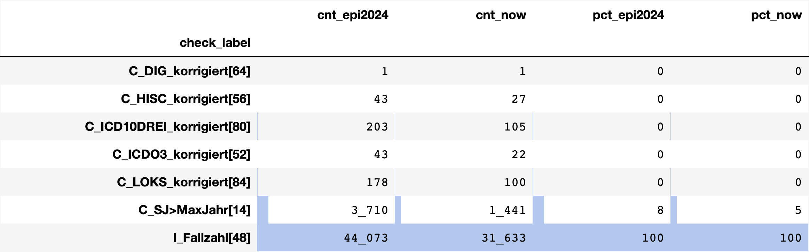
    


<div style="page-break-after: always;"></div>

### <a id='toc1_7_7_'></a>[✅ 07-RP](#toc0_)


    


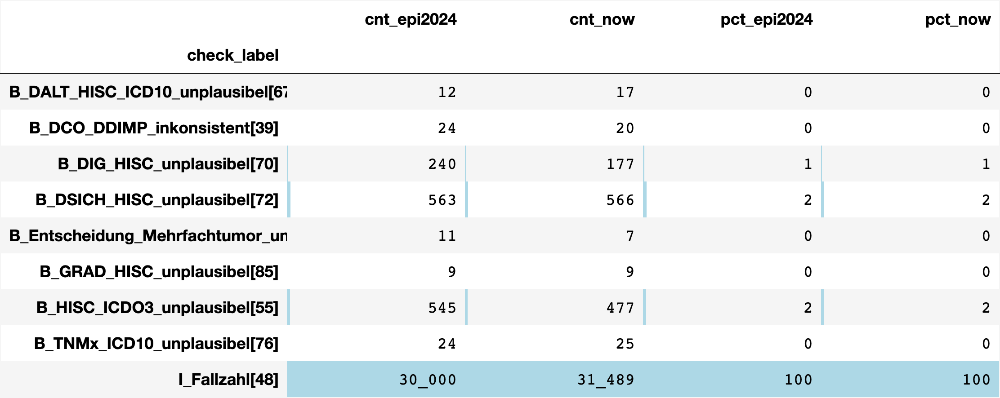
    


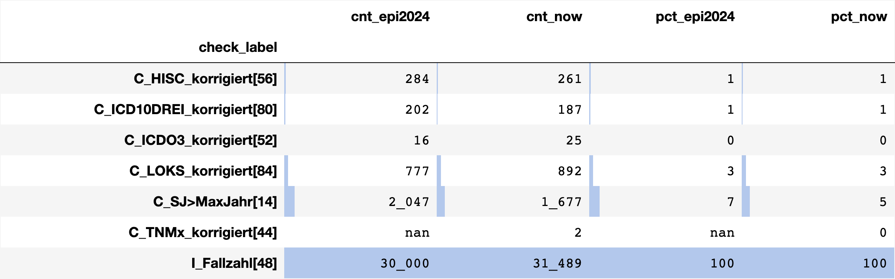
    


<div style="page-break-after: always;"></div>

### <a id='toc1_7_8_'></a>[✅ 08-BW](#toc0_)


    


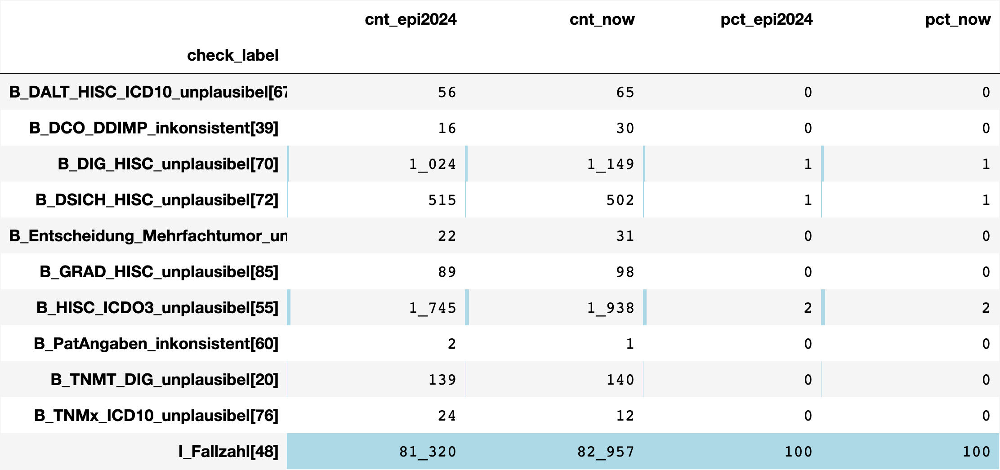
    


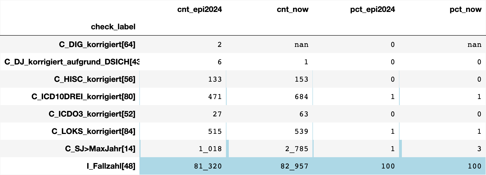
    


<div style="page-break-after: always;"></div>

### <a id='toc1_7_9_'></a>[✅ 09-BY](#toc0_)


    


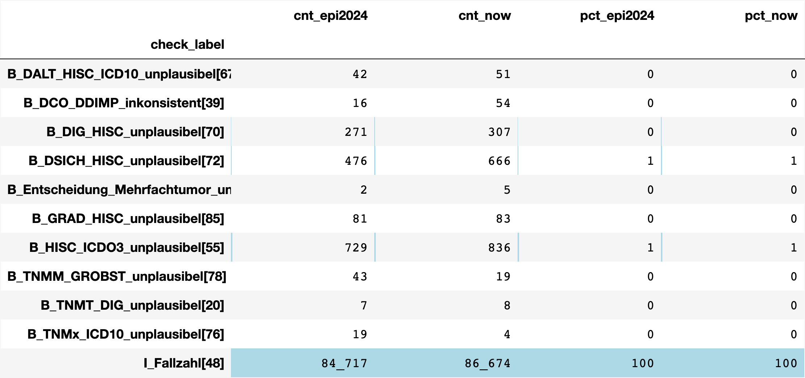
    


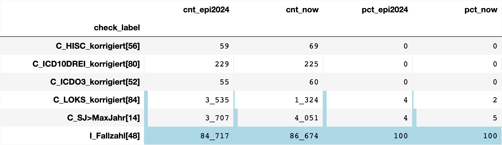
    


<div style="page-break-after: always;"></div>

### <a id='toc1_7_10_'></a>[✅ 10-SL](#toc0_)
- `A_Mehrfachmeldung` leicht erhöht mit ~4%


    


    


    


<div style="page-break-after: always;"></div>

### <a id='toc1_7_11_'></a>[✅ 11-GKR (ehemals)](#toc0_)


    


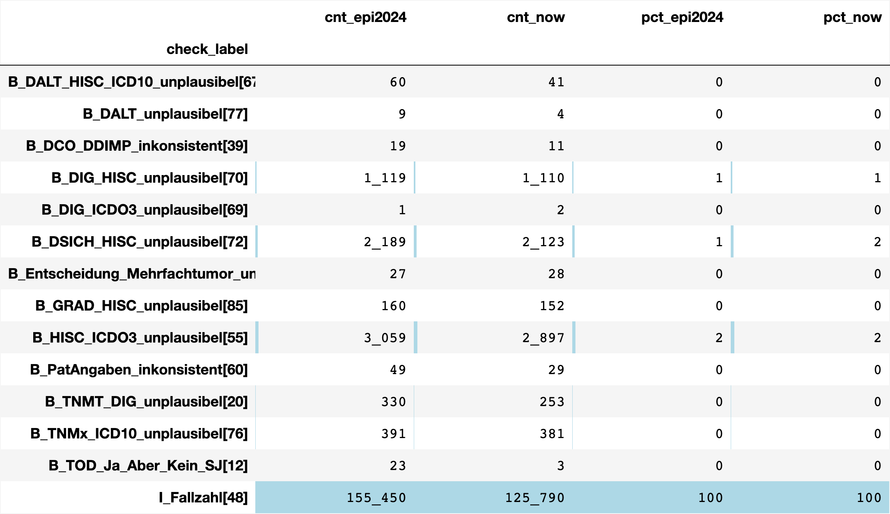
    


    


<!-- <br>

#### <a id='toc1_7_11_1_'></a>[Verteilung der Variable TOD in den original gelieferten Daten](#toc0_)
- Grundgesamtheit: alle Daten mit DJ > 1970
- neben `J` und `N` sind diverse Formen von Leerkodierungen unterschieden (`NULL`, `''`, `' '` etc.)
- die Daten den Registern ohne missings enthalten eine eindeutige Information zu `TOD`
- bei allen sonstigen EKR wird angenommen: Todesangabe leer -> lebend -->
