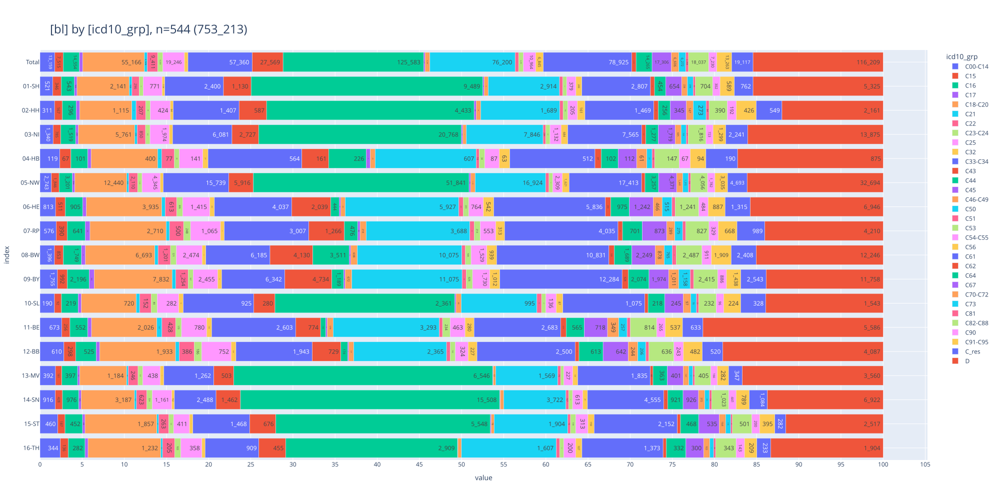
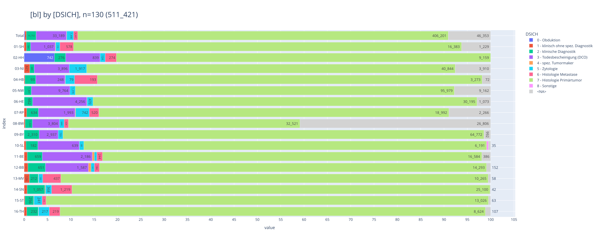
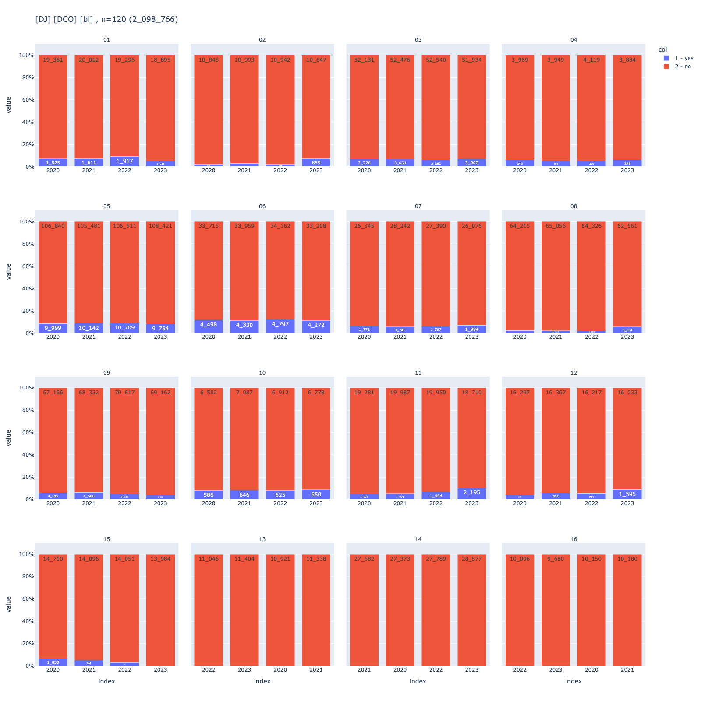
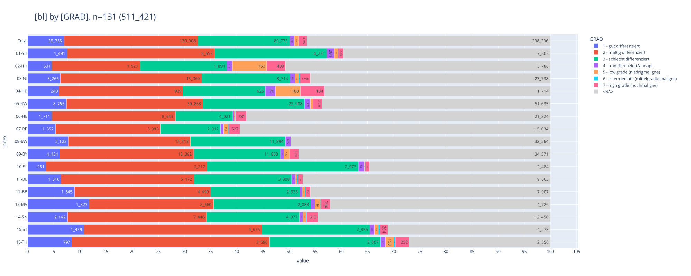
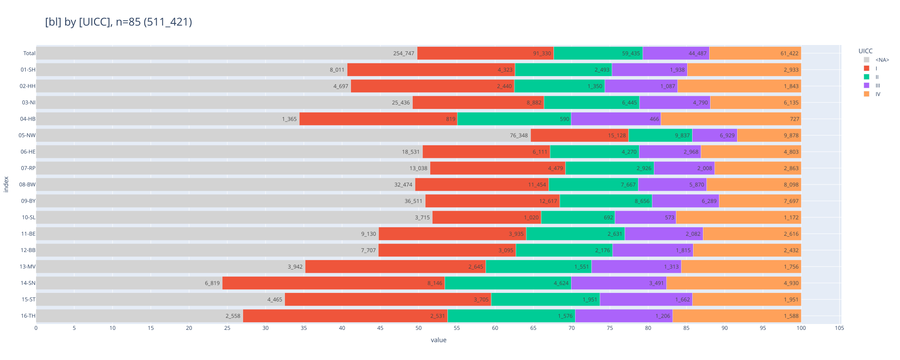
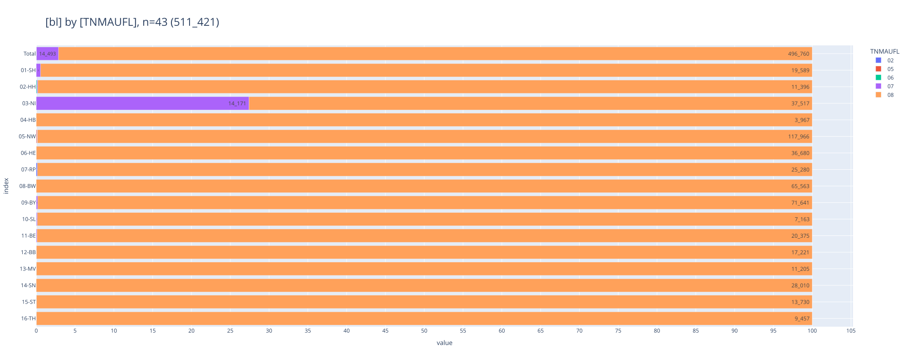
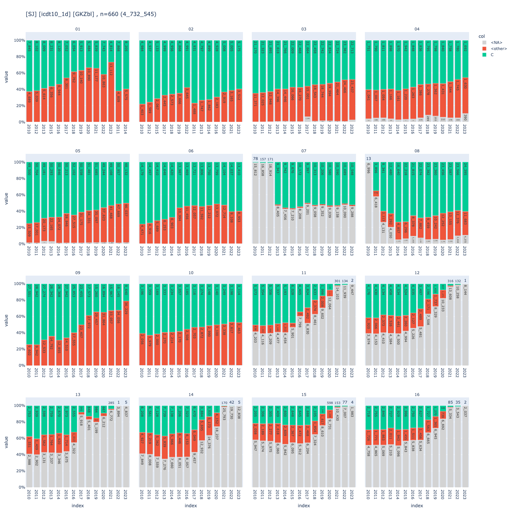

# [Bericht zur Datenqualität (epi2024_2) 📉](#toc0_)

**Table of contents**    
- [Bericht zur Datenqualität (epi2024_2) 📉](#toc1_)    
  - [Änderungen seit der letzten Version](#toc1_1_)    
  - [Hinweise](#toc1_2_)    
  - [Datenstand 🕥](#toc1_3_)    
  - [Fallzahlen im Verlauf der Jahreslieferungen](#toc1_4_)    
    - [original geliefert](#toc1_4_1_)    
    - [nach Abschluss der Prüfungen im ZfKD](#toc1_4_2_)    
  - [Variablenverteilung](#toc1_5_)    
    - [Diagnosejahr](#toc1_5_1_)    
    - [Diagnosegruppen](#toc1_5_2_)    
    - [Diagnosesicherung](#toc1_5_3_)    
    - [DCO Diagramm](#toc1_5_4_)    
    - [DCO Tabelle](#toc1_5_5_)    
    - [Dignität](#toc1_5_6_)    
    - [Grading](#toc1_5_7_)    
    - [Altersgruppen](#toc1_5_8_)    
    - [UICC](#toc1_5_9_)    
    - [TNM-Auflage](#toc1_5_10_)    
    - [Tod](#toc1_5_11_)    
      - [Verteilung der Variable TOD im verarbeiteten Datensatz](#toc1_5_11_1_)    
      - [Verteilung der Variable TOD in den original gelieferten Daten](#toc1_5_11_2_)    
    - [Verteilung Todesursachen nach ICDT10](#toc1_5_12_)    
  - [Plausibilitätsprüfungen](#toc1_6_)    
    - [ ✅ 01-SH](#toc1_6_1_)    
    - [✅ 02-HH](#toc1_6_2_)    
    - [✅ 03-NI](#toc1_6_3_)    
    - [✅ 04-HB](#toc1_6_4_)    
    - [✅ 05-NW](#toc1_6_5_)    
    - [✅ 06-HE](#toc1_6_6_)    
    - [✅ 07-RP](#toc1_6_7_)    
    - [✅ 08-BW](#toc1_6_8_)    
    - [✅ 09-BY](#toc1_6_9_)    
    - [✅ 10-SL](#toc1_6_10_)    
    - [✅ 11-GKR (ehemals)](#toc1_6_11_)    

<!-- vscode-jupyter-toc-config
	numbering=false
	anchor=true
	flat=false
	minLevel=1
	maxLevel=6
	/vscode-jupyter-toc-config -->
<!-- THIS CELL WILL BE REPLACED ON TOC UPDATE. DO NOT WRITE YOUR TEXT IN THIS CELL -->

 

## [Änderungen seit der letzten Version](#toc0_)
<!-- - bisher wurden folgende Angaben in einer umfangreichen Verarbeitung im workflow umkodiert: `ICDGM10`, `HISC`, `ICDO3`, `DIG`. Diese Umformung wurde deaktiviert, es finden nun nur noch punktuelle Korrekturen statt -->
- bei dem Kombinieren von klinischen Daten und dem GKR-Archiv wurden im letzten Datenstand filterbedingt Altfälle übernommen, die im workflow als DCO deklariert wurden und somit für `DJ` > 2020 gezählt sind. Diese Artefakte wurden entfernt
- seit `epi2023` wurde `DIG` 6 auf 3 gesetzt, diese Korrektur ist nun entfernt
- Neulieferung `06-HE` Daten

 

## [Hinweise](#toc0_)
- Bewertungen der Analysen sind mit 💡 markiert
- bei den Plausibilitätsprüfungen weist ein ✅ darauf hin, dass keine Mängel erkennbar sind

 

## [Datenstand 🕥](#toc0_)

    🐍 3.12.8 | 📦 plotly: 6.3.1 | 📦 pandas: 2.3.3 | 📦 numpy: 1.26.4 | 📦 duckdb: 1.4.1 | 📦 pandas-plots: 0.20.4 | 📦 connection-helper: 0.13.1

    sqlite db file:          2025-06-20_data_epi.duckdb
    data tag:                epi2024_2
    sql table created:       2025-06-20 15:31:26
    document created:        2025-10-31 14:15:28

    
    latest batch:            418
    Berücksichtigt werden folgende Diagnosejahre 📆: (2023)

## [Fallzahlen im Verlauf der Jahreslieferungen](#toc0_)
- kein Filter
- es werden Datenstände (_batch_) aus mehreren Lieferjahren dargestellt , welche über eine laufende Nummer sowie das Datum der Ausführung vergleichbar sind
- in Abgrenzung zu den klinischen Daten ist jede einzelne EKR Lieferung für das gesamte Lieferjahr gültig

 

### [original geliefert](#toc0_)
- aufgeführt sind die Fallzahlen aus den überlieferten Dateien **vor** den ZfKD Anpassungen
- `batch_label` markiert den jeweils letzten offiziellen Datenstand des Lieferjahres, sowie den aktuellen Datenstand

<table id="T_a2552">
  <thead>
    <tr>
      <th class="index_name level0" >EKRNR</th>
      <th id="T_a2552_level0_col0" class="col_heading level0 col0" >01-SH</th>
      <th id="T_a2552_level0_col1" class="col_heading level0 col1" >02-HH</th>
      <th id="T_a2552_level0_col2" class="col_heading level0 col2" >03-NI</th>
      <th id="T_a2552_level0_col3" class="col_heading level0 col3" >04-HB</th>
      <th id="T_a2552_level0_col4" class="col_heading level0 col4" >05-NW</th>
      <th id="T_a2552_level0_col5" class="col_heading level0 col5" >06-HE</th>
      <th id="T_a2552_level0_col6" class="col_heading level0 col6" >07-RP</th>
      <th id="T_a2552_level0_col7" class="col_heading level0 col7" >08-BW</th>
      <th id="T_a2552_level0_col8" class="col_heading level0 col8" >09-BY</th>
      <th id="T_a2552_level0_col9" class="col_heading level0 col9" >10-SL</th>
      <th id="T_a2552_level0_col10" class="col_heading level0 col10" >11-GKR</th>
      <th id="T_a2552_level0_col11" class="col_heading level0 col11" >Total</th>
    </tr>
    <tr>
      <th class="index_name level0" >batch_label</th>
      <th class="blank col0" >&nbsp;</th>
      <th class="blank col1" >&nbsp;</th>
      <th class="blank col2" >&nbsp;</th>
      <th class="blank col3" >&nbsp;</th>
      <th class="blank col4" >&nbsp;</th>
      <th class="blank col5" >&nbsp;</th>
      <th class="blank col6" >&nbsp;</th>
      <th class="blank col7" >&nbsp;</th>
      <th class="blank col8" >&nbsp;</th>
      <th class="blank col9" >&nbsp;</th>
      <th class="blank col10" >&nbsp;</th>
      <th class="blank col11" >&nbsp;</th>
    </tr>
  </thead>
  <tbody>
    <tr>
      <th id="T_a2552_level0_row0" class="row_heading level0 row0" >331 | 2021-08-27</th>
      <td id="T_a2552_row0_col0" class="data row0 col0" >587_631 </td>
      <td id="T_a2552_row0_col1" class="data row0 col1" >360_229 </td>
      <td id="T_a2552_row0_col2" class="data row0 col2" >1_463_161 </td>
      <td id="T_a2552_row0_col3" class="data row0 col3" >125_482 </td>
      <td id="T_a2552_row0_col4" class="data row0 col4" >2_724_356 </td>
      <td id="T_a2552_row0_col5" class="data row0 col5" >734_674 </td>
      <td id="T_a2552_row0_col6" class="data row0 col6" >704_114 </td>
      <td id="T_a2552_row0_col7" class="data row0 col7" >679_700 </td>
      <td id="T_a2552_row0_col8" class="data row0 col8" >1_428_235 </td>
      <td id="T_a2552_row0_col9" class="data row0 col9" >347_949 </td>
      <td id="T_a2552_row0_col10" class="data row0 col10" >3_191_041 </td>
      <td id="T_a2552_row0_col11" class="data row0 col11" >12_346_572 </td>
    </tr>
    <tr>
      <th id="T_a2552_level0_row1" class="row_heading level0 row1" >360 | 2023-01-03</th>
      <td id="T_a2552_row1_col0" class="data row1 col0" >624_239 </td>
      <td id="T_a2552_row1_col1" class="data row1 col1" >371_807 </td>
      <td id="T_a2552_row1_col2" class="data row1 col2" >1_545_623 </td>
      <td id="T_a2552_row1_col3" class="data row1 col3" >132_265 </td>
      <td id="T_a2552_row1_col4" class="data row1 col4" >2_906_452 </td>
      <td id="T_a2552_row1_col5" class="data row1 col5" >782_871 </td>
      <td id="T_a2552_row1_col6" class="data row1 col6" >632_930 </td>
      <td id="T_a2552_row1_col7" class="data row1 col7" >766_070 </td>
      <td id="T_a2552_row1_col8" class="data row1 col8" >1_535_587 </td>
      <td id="T_a2552_row1_col9" class="data row1 col9" >360_943 </td>
      <td id="T_a2552_row1_col10" class="data row1 col10" >3_605_815 </td>
      <td id="T_a2552_row1_col11" class="data row1 col11" >13_264_602 </td>
    </tr>
    <tr>
      <th id="T_a2552_level0_row2" class="row_heading level0 row2" >399 | 2024-12-02</th>
      <td id="T_a2552_row2_col0" class="data row2 col0" >734_305 </td>
      <td id="T_a2552_row2_col1" class="data row2 col1" >423_109 </td>
      <td id="T_a2552_row2_col2" class="data row2 col2" >1_816_413 </td>
      <td id="T_a2552_row2_col3" class="data row2 col3" >151_753 </td>
      <td id="T_a2552_row2_col4" class="data row2 col4" >3_991_177 </td>
      <td id="T_a2552_row2_col5" class="data row2 col5" >918_534 </td>
      <td id="T_a2552_row2_col6" class="data row2 col6" >823_343 </td>
      <td id="T_a2552_row2_col7" class="data row2 col7" >1_048_203 </td>
      <td id="T_a2552_row2_col8" class="data row2 col8" >1_811_372 </td>
      <td id="T_a2552_row2_col9" class="data row2 col9" >400_646 </td>
      <td id="T_a2552_row2_col10" class="data row2 col10" >3_792_956 </td>
      <td id="T_a2552_row2_col11" class="data row2 col11" >15_911_811 </td>
    </tr>
    <tr>
      <th id="T_a2552_level0_row3" class="row_heading level0 row3" >416 | 2025-04-01</th>
      <td id="T_a2552_row3_col0" class="data row3 col0" >780_626 </td>
      <td id="T_a2552_row3_col1" class="data row3 col1" >445_714 </td>
      <td id="T_a2552_row3_col2" class="data row3 col2" >1_911_528 </td>
      <td id="T_a2552_row3_col3" class="data row3 col3" >157_932 </td>
      <td id="T_a2552_row3_col4" class="data row3 col4" >4_186_192 </td>
      <td id="T_a2552_row3_col5" class="data row3 col5" >958_031 </td>
      <td id="T_a2552_row3_col6" class="data row3 col6" >863_935 </td>
      <td id="T_a2552_row3_col7" class="data row3 col7" >1_152_455 </td>
      <td id="T_a2552_row3_col8" class="data row3 col8" >1_916_313 </td>
      <td id="T_a2552_row3_col9" class="data row3 col9" >412_559 </td>
      <td id="T_a2552_row3_col10" class="data row3 col10" >3_974_287 </td>
      <td id="T_a2552_row3_col11" class="data row3 col11" >16_759_572 </td>
    </tr>
    <tr>
      <th id="T_a2552_level0_row4" class="row_heading level0 row4" >418 | 2025-06-20</th>
      <td id="T_a2552_row4_col0" class="data row4 col0" >780_626 </td>
      <td id="T_a2552_row4_col1" class="data row4 col1" >445_714 </td>
      <td id="T_a2552_row4_col2" class="data row4 col2" >1_911_528 </td>
      <td id="T_a2552_row4_col3" class="data row4 col3" >157_932 </td>
      <td id="T_a2552_row4_col4" class="data row4 col4" >4_186_192 </td>
      <td id="T_a2552_row4_col5" class="data row4 col5" >973_597 </td>
      <td id="T_a2552_row4_col6" class="data row4 col6" >863_935 </td>
      <td id="T_a2552_row4_col7" class="data row4 col7" >1_152_455 </td>
      <td id="T_a2552_row4_col8" class="data row4 col8" >1_916_313 </td>
      <td id="T_a2552_row4_col9" class="data row4 col9" >412_559 </td>
      <td id="T_a2552_row4_col10" class="data row4 col10" >3_950_260 </td>
      <td id="T_a2552_row4_col11" class="data row4 col11" >16_751_111 </td>
    </tr>
  </tbody>
</table>

 

### [nach Abschluss der Prüfungen im ZfKD](#toc0_)
- Filter: jeweils das **letzte DJ** der einzelnen Jahreslieferung
- aufgeführt sind die Fallzahlen aus den überlieferten Dateien **nach** den ZfKD Anpassungen

<table id="T_2c340">
  <thead>
    <tr>
      <th class="index_name level0" >EKRNR</th>
      <th id="T_2c340_level0_col0" class="col_heading level0 col0" >01-SH</th>
      <th id="T_2c340_level0_col1" class="col_heading level0 col1" >02-HH</th>
      <th id="T_2c340_level0_col2" class="col_heading level0 col2" >03-NI</th>
      <th id="T_2c340_level0_col3" class="col_heading level0 col3" >04-HB</th>
      <th id="T_2c340_level0_col4" class="col_heading level0 col4" >05-NW</th>
      <th id="T_2c340_level0_col5" class="col_heading level0 col5" >06-HE</th>
      <th id="T_2c340_level0_col6" class="col_heading level0 col6" >07-RP</th>
      <th id="T_2c340_level0_col7" class="col_heading level0 col7" >08-BW</th>
      <th id="T_2c340_level0_col8" class="col_heading level0 col8" >09-BY</th>
      <th id="T_2c340_level0_col9" class="col_heading level0 col9" >10-SL</th>
      <th id="T_2c340_level0_col10" class="col_heading level0 col10" >11-GKR</th>
      <th id="T_2c340_level0_col11" class="col_heading level0 col11" >Total</th>
    </tr>
    <tr>
      <th class="index_name level0" >batch_label</th>
      <th class="blank col0" >&nbsp;</th>
      <th class="blank col1" >&nbsp;</th>
      <th class="blank col2" >&nbsp;</th>
      <th class="blank col3" >&nbsp;</th>
      <th class="blank col4" >&nbsp;</th>
      <th class="blank col5" >&nbsp;</th>
      <th class="blank col6" >&nbsp;</th>
      <th class="blank col7" >&nbsp;</th>
      <th class="blank col8" >&nbsp;</th>
      <th class="blank col9" >&nbsp;</th>
      <th class="blank col10" >&nbsp;</th>
      <th class="blank col11" >&nbsp;</th>
    </tr>
  </thead>
  <tbody>
    <tr>
      <th id="T_2c340_level0_row0" class="row_heading level0 row0" >331 | 2021-08-27</th>
      <td id="T_2c340_row0_col0" class="data row0 col0" >30_360 </td>
      <td id="T_2c340_row0_col1" class="data row0 col1" >15_919 </td>
      <td id="T_2c340_row0_col2" class="data row0 col2" >78_800 </td>
      <td id="T_2c340_row0_col3" class="data row0 col3" >6_469 </td>
      <td id="T_2c340_row0_col4" class="data row0 col4" >184_032 </td>
      <td id="T_2c340_row0_col5" class="data row0 col5" >36_672 </td>
      <td id="T_2c340_row0_col6" class="data row0 col6" >27_758 </td>
      <td id="T_2c340_row0_col7" class="data row0 col7" >77_246 </td>
      <td id="T_2c340_row0_col8" class="data row0 col8" >79_741 </td>
      <td id="T_2c340_row0_col9" class="data row0 col9" >11_137 </td>
      <td id="T_2c340_row0_col10" class="data row0 col10" >119_770 </td>
      <td id="T_2c340_row0_col11" class="data row0 col11" >667_904 </td>
    </tr>
    <tr>
      <th id="T_2c340_level0_row1" class="row_heading level0 row1" >360 | 2023-01-03</th>
      <td id="T_2c340_row1_col0" class="data row1 col0" >32_401 </td>
      <td id="T_2c340_row1_col1" class="data row1 col1" >17_099 </td>
      <td id="T_2c340_row1_col2" class="data row1 col2" >81_092 </td>
      <td id="T_2c340_row1_col3" class="data row1 col3" >6_548 </td>
      <td id="T_2c340_row1_col4" class="data row1 col4" >176_210 </td>
      <td id="T_2c340_row1_col5" class="data row1 col5" >38_279 </td>
      <td id="T_2c340_row1_col6" class="data row1 col6" >25_194 </td>
      <td id="T_2c340_row1_col7" class="data row1 col7" >77_968 </td>
      <td id="T_2c340_row1_col8" class="data row1 col8" >85_001 </td>
      <td id="T_2c340_row1_col9" class="data row1 col9" >11_391 </td>
      <td id="T_2c340_row1_col10" class="data row1 col10" >164_812 </td>
      <td id="T_2c340_row1_col11" class="data row1 col11" >715_995 </td>
    </tr>
    <tr>
      <th id="T_2c340_level0_row2" class="row_heading level0 row2" >399 | 2024-12-02</th>
      <td id="T_2c340_row2_col0" class="data row2 col0" >33_243 </td>
      <td id="T_2c340_row2_col1" class="data row2 col1" >18_238 </td>
      <td id="T_2c340_row2_col2" class="data row2 col2" >85_016 </td>
      <td id="T_2c340_row2_col3" class="data row2 col3" >6_086 </td>
      <td id="T_2c340_row2_col4" class="data row2 col4" >193_412 </td>
      <td id="T_2c340_row2_col5" class="data row2 col5" >38_294 </td>
      <td id="T_2c340_row2_col6" class="data row2 col6" >28_779 </td>
      <td id="T_2c340_row2_col7" class="data row2 col7" >78_883 </td>
      <td id="T_2c340_row2_col8" class="data row2 col8" >80_929 </td>
      <td id="T_2c340_row2_col9" class="data row2 col9" >11_665 </td>
      <td id="T_2c340_row2_col10" class="data row2 col10" >162_633 </td>
      <td id="T_2c340_row2_col11" class="data row2 col11" >737_178 </td>
    </tr>
    <tr>
      <th id="T_2c340_level0_row3" class="row_heading level0 row3" >416 | 2025-04-01</th>
      <td id="T_2c340_row3_col0" class="data row3 col0" >34_512 </td>
      <td id="T_2c340_row3_col1" class="data row3 col1" >18_011 </td>
      <td id="T_2c340_row3_col2" class="data row3 col2" >86_331 </td>
      <td id="T_2c340_row3_col3" class="data row3 col3" >5_068 </td>
      <td id="T_2c340_row3_col4" class="data row3 col4" >202_655 </td>
      <td id="T_2c340_row3_col5" class="data row3 col5" >30_291 </td>
      <td id="T_2c340_row3_col6" class="data row3 col6" >30_000 </td>
      <td id="T_2c340_row3_col7" class="data row3 col7" >81_600 </td>
      <td id="T_2c340_row3_col8" class="data row3 col8" >84_717 </td>
      <td id="T_2c340_row3_col9" class="data row3 col9" >11_076 </td>
      <td id="T_2c340_row3_col10" class="data row3 col10" >157_970 </td>
      <td id="T_2c340_row3_col11" class="data row3 col11" >742_231 </td>
    </tr>
    <tr>
      <th id="T_2c340_level0_row4" class="row_heading level0 row4" >418 | 2025-06-20</th>
      <td id="T_2c340_row4_col0" class="data row4 col0" >34_512 </td>
      <td id="T_2c340_row4_col1" class="data row4 col1" >18_011 </td>
      <td id="T_2c340_row4_col2" class="data row4 col2" >86_331 </td>
      <td id="T_2c340_row4_col3" class="data row4 col3" >5_068 </td>
      <td id="T_2c340_row4_col4" class="data row4 col4" >202_655 </td>
      <td id="T_2c340_row4_col5" class="data row4 col5" >44_073 </td>
      <td id="T_2c340_row4_col6" class="data row4 col6" >30_000 </td>
      <td id="T_2c340_row4_col7" class="data row4 col7" >81_320 </td>
      <td id="T_2c340_row4_col8" class="data row4 col8" >84_717 </td>
      <td id="T_2c340_row4_col9" class="data row4 col9" >11_076 </td>
      <td id="T_2c340_row4_col10" class="data row4 col10" >155_450 </td>
      <td id="T_2c340_row4_col11" class="data row4 col11" >753_213 </td>
    </tr>
  </tbody>
</table>

## [Variablenverteilung](#toc0_)
<!-- - **Filter:**
  - **🚨 sofern nicht anders angegeben ist der Zeitraum beschränkt auf das höchste Diagnosejahr (für `epi2024`: 2023) 🚨**
  - Diagnosen: ausgeschlossen sind `C44` und alle `D` -->
- ab hier wird nur die aktuelle Datenlieferung dargestellt
- als ungültig markierte Fälle (_A-Prüfungen_) sind in allen Fallzahlen ausgeschlossen
- in den barplots sind die relativen Häufigkeiten von Variablen im Datensatz der Register aufgetragen
- zusätzlich ist die Angabe für alle kkr enthalten (`Total`)
- näherungsweise sind GKZ-Bundesländer verwendet anstatt Lieferregister, um 11-16 aufspannen zu können

 

### [Diagnosejahr](#toc0_)
- **Filter: DJ > 2018, C44 und D-Diagnosen sind ausgeschlossen**

> 💡 `ZfKD`: _"Insbesondere aus `06-HE`, `15-ST` und `16-TH` fehlt für 2023 noch ein spürbarer Anteil an Fällen"_

<table id="T_869bd">
  <thead>
    <tr>
      <th class="index_name level0" >kkr</th>
      <th id="T_869bd_level0_col0" class="col_heading level0 col0" >01-SH</th>
      <th id="T_869bd_level0_col1" class="col_heading level0 col1" >02-HH</th>
      <th id="T_869bd_level0_col2" class="col_heading level0 col2" >03-NI</th>
      <th id="T_869bd_level0_col3" class="col_heading level0 col3" >04-HB</th>
      <th id="T_869bd_level0_col4" class="col_heading level0 col4" >05-NW</th>
      <th id="T_869bd_level0_col5" class="col_heading level0 col5" >06-HE</th>
      <th id="T_869bd_level0_col6" class="col_heading level0 col6" >07-RP</th>
      <th id="T_869bd_level0_col7" class="col_heading level0 col7" >08-BW</th>
      <th id="T_869bd_level0_col8" class="col_heading level0 col8" >09-BY</th>
      <th id="T_869bd_level0_col9" class="col_heading level0 col9" >10-SL</th>
      <th id="T_869bd_level0_col10" class="col_heading level0 col10" >11-BE</th>
      <th id="T_869bd_level0_col11" class="col_heading level0 col11" >12-BB</th>
      <th id="T_869bd_level0_col12" class="col_heading level0 col12" >13-MV</th>
      <th id="T_869bd_level0_col13" class="col_heading level0 col13" >14-SN</th>
      <th id="T_869bd_level0_col14" class="col_heading level0 col14" >15-ST</th>
      <th id="T_869bd_level0_col15" class="col_heading level0 col15" >16-TH</th>
      <th id="T_869bd_level0_col16" class="col_heading level0 col16" >Total</th>
    </tr>
    <tr>
      <th class="index_name level0" >DJ</th>
      <th class="blank col0" >&nbsp;</th>
      <th class="blank col1" >&nbsp;</th>
      <th class="blank col2" >&nbsp;</th>
      <th class="blank col3" >&nbsp;</th>
      <th class="blank col4" >&nbsp;</th>
      <th class="blank col5" >&nbsp;</th>
      <th class="blank col6" >&nbsp;</th>
      <th class="blank col7" >&nbsp;</th>
      <th class="blank col8" >&nbsp;</th>
      <th class="blank col9" >&nbsp;</th>
      <th class="blank col10" >&nbsp;</th>
      <th class="blank col11" >&nbsp;</th>
      <th class="blank col12" >&nbsp;</th>
      <th class="blank col13" >&nbsp;</th>
      <th class="blank col14" >&nbsp;</th>
      <th class="blank col15" >&nbsp;</th>
      <th class="blank col16" >&nbsp;</th>
    </tr>
  </thead>
  <tbody>
    <tr>
      <th id="T_869bd_level0_row0" class="row_heading level0 row0" >2019</th>
      <td id="T_869bd_row0_col0" class="data row0 col0" >21_003 </td>
      <td id="T_869bd_row0_col1" class="data row0 col1" >10_824 </td>
      <td id="T_869bd_row0_col2" class="data row0 col2" >52_936 </td>
      <td id="T_869bd_row0_col3" class="data row0 col3" >4_196 </td>
      <td id="T_869bd_row0_col4" class="data row0 col4" >121_969 </td>
      <td id="T_869bd_row0_col5" class="data row0 col5" >37_723 </td>
      <td id="T_869bd_row0_col6" class="data row0 col6" >26_946 </td>
      <td id="T_869bd_row0_col7" class="data row0 col7" >67_788 </td>
      <td id="T_869bd_row0_col8" class="data row0 col8" >72_588 </td>
      <td id="T_869bd_row0_col9" class="data row0 col9" >7_517 </td>
      <td id="T_869bd_row0_col10" class="data row0 col10" >21_389 </td>
      <td id="T_869bd_row0_col11" class="data row0 col11" >17_555 </td>
      <td id="T_869bd_row0_col12" class="data row0 col12" >10_614 </td>
      <td id="T_869bd_row0_col13" class="data row0 col13" >29_100 </td>
      <td id="T_869bd_row0_col14" class="data row0 col14" >16_101 </td>
      <td id="T_869bd_row0_col15" class="data row0 col15" >13_397 </td>
      <td id="T_869bd_row0_col16" class="data row0 col16" >531_646 </td>
    </tr>
    <tr>
      <th id="T_869bd_level0_row1" class="row_heading level0 row1" >2020</th>
      <td id="T_869bd_row1_col0" class="data row1 col0" >20_643 </td>
      <td id="T_869bd_row1_col1" class="data row1 col1" >10_976 </td>
      <td id="T_869bd_row1_col2" class="data row1 col2" >51_940 </td>
      <td id="T_869bd_row1_col3" class="data row1 col3" >4_075 </td>
      <td id="T_869bd_row1_col4" class="data row1 col4" >115_349 </td>
      <td id="T_869bd_row1_col5" class="data row1 col5" >37_251 </td>
      <td id="T_869bd_row1_col6" class="data row1 col6" >25_920 </td>
      <td id="T_869bd_row1_col7" class="data row1 col7" >64_665 </td>
      <td id="T_869bd_row1_col8" class="data row1 col8" >70_824 </td>
      <td id="T_869bd_row1_col9" class="data row1 col9" >6_969 </td>
      <td id="T_869bd_row1_col10" class="data row1 col10" >19_986 </td>
      <td id="T_869bd_row1_col11" class="data row1 col11" >16_780 </td>
      <td id="T_869bd_row1_col12" class="data row1 col12" >10_784 </td>
      <td id="T_869bd_row1_col13" class="data row1 col13" >27_000 </td>
      <td id="T_869bd_row1_col14" class="data row1 col14" >15_512 </td>
      <td id="T_869bd_row1_col15" class="data row1 col15" >9_972 </td>
      <td id="T_869bd_row1_col16" class="data row1 col16" >508_646 </td>
    </tr>
    <tr>
      <th id="T_869bd_level0_row2" class="row_heading level0 row2" >2021</th>
      <td id="T_869bd_row2_col0" class="data row2 col0" >21_413 </td>
      <td id="T_869bd_row2_col1" class="data row2 col1" >11_210 </td>
      <td id="T_869bd_row2_col2" class="data row2 col2" >52_357 </td>
      <td id="T_869bd_row2_col3" class="data row2 col3" >3_992 </td>
      <td id="T_869bd_row2_col4" class="data row2 col4" >115_192 </td>
      <td id="T_869bd_row2_col5" class="data row2 col5" >37_348 </td>
      <td id="T_869bd_row2_col6" class="data row2 col6" >27_496 </td>
      <td id="T_869bd_row2_col7" class="data row2 col7" >65_518 </td>
      <td id="T_869bd_row2_col8" class="data row2 col8" >72_510 </td>
      <td id="T_869bd_row2_col9" class="data row2 col9" >7_491 </td>
      <td id="T_869bd_row2_col10" class="data row2 col10" >20_688 </td>
      <td id="T_869bd_row2_col11" class="data row2 col11" >17_078 </td>
      <td id="T_869bd_row2_col12" class="data row2 col12" >11_148 </td>
      <td id="T_869bd_row2_col13" class="data row2 col13" >27_281 </td>
      <td id="T_869bd_row2_col14" class="data row2 col14" >14_655 </td>
      <td id="T_869bd_row2_col15" class="data row2 col15" >9_950 </td>
      <td id="T_869bd_row2_col16" class="data row2 col16" >515_327 </td>
    </tr>
    <tr>
      <th id="T_869bd_level0_row3" class="row_heading level0 row3" >2022</th>
      <td id="T_869bd_row3_col0" class="data row3 col0" >20_991 </td>
      <td id="T_869bd_row3_col1" class="data row3 col1" >11_074 </td>
      <td id="T_869bd_row3_col2" class="data row3 col2" >52_128 </td>
      <td id="T_869bd_row3_col3" class="data row3 col3" >4_213 </td>
      <td id="T_869bd_row3_col4" class="data row3 col4" >117_148 </td>
      <td id="T_869bd_row3_col5" class="data row3 col5" >38_033 </td>
      <td id="T_869bd_row3_col6" class="data row3 col6" >26_649 </td>
      <td id="T_869bd_row3_col7" class="data row3 col7" >64_807 </td>
      <td id="T_869bd_row3_col8" class="data row3 col8" >73_927 </td>
      <td id="T_869bd_row3_col9" class="data row3 col9" >7_330 </td>
      <td id="T_869bd_row3_col10" class="data row3 col10" >20_843 </td>
      <td id="T_869bd_row3_col11" class="data row3 col11" >16_802 </td>
      <td id="T_869bd_row3_col12" class="data row3 col12" >10_864 </td>
      <td id="T_869bd_row3_col13" class="data row3 col13" >27_318 </td>
      <td id="T_869bd_row3_col14" class="data row3 col14" >14_265 </td>
      <td id="T_869bd_row3_col15" class="data row3 col15" >9_897 </td>
      <td id="T_869bd_row3_col16" class="data row3 col16" >516_289 </td>
    </tr>
    <tr>
      <th id="T_869bd_level0_row4" class="row_heading level0 row4" >2023</th>
      <td id="T_869bd_row4_col0" class="data row4 col0" >19_698 </td>
      <td id="T_869bd_row4_col1" class="data row4 col1" >11_417 </td>
      <td id="T_869bd_row4_col2" class="data row4 col2" >51_688 </td>
      <td id="T_869bd_row4_col3" class="data row4 col3" >3_967 </td>
      <td id="T_869bd_row4_col4" class="data row4 col4" >118_120 </td>
      <td id="T_869bd_row4_col5" class="data row4 col5" >36_683 </td>
      <td id="T_869bd_row4_col6" class="data row4 col6" >25_314 </td>
      <td id="T_869bd_row4_col7" class="data row4 col7" >65_563 </td>
      <td id="T_869bd_row4_col8" class="data row4 col8" >71_770 </td>
      <td id="T_869bd_row4_col9" class="data row4 col9" >7_172 </td>
      <td id="T_869bd_row4_col10" class="data row4 col10" >20_394 </td>
      <td id="T_869bd_row4_col11" class="data row4 col11" >17_225 </td>
      <td id="T_869bd_row4_col12" class="data row4 col12" >11_207 </td>
      <td id="T_869bd_row4_col13" class="data row4 col13" >28_010 </td>
      <td id="T_869bd_row4_col14" class="data row4 col14" >13_734 </td>
      <td id="T_869bd_row4_col15" class="data row4 col15" >9_459 </td>
      <td id="T_869bd_row4_col16" class="data row4 col16" >511_421 </td>
    </tr>
  </tbody>
</table>

### [Diagnosegruppen](#toc0_)
- **Filter: DJ = 2023, C44 und D-Diagnosen sind eingeschlossen**

> 💡 `ZfKD`: _"Die Anteile für D-Diagnosen sind in etwa vergleichbar, die für C44 unterscheiden sich recht deutlich"_

    

    

 

### [Diagnosesicherung](#toc0_)
- **Filter: DJ = 2023, C44 und D-Diagnosen sind ausgeschlossen**

> 💡 `ZfKD`: _"auffällig ist der hohe Anteil an fehlenden Diagnosesicherungen in `08-BW`"_
> 
> 💡 `ZfKD`: _"ebenfalls auffällig: Anzahl dokumentierter Obduktionen in `02-HH`. Da gleichzeitig auch DCO Fälle markiert sind ist ein Skriptfehler rund um die DCO Kodierung 0 vs 3 unwahrscheinlich"_

    

    

 

### [DCO Diagramm](#toc0_)
- **Filter: DJ = 2020-2023, C44 und D-Diagnosen sind ausgeschlossen, GKZbl 01-16**
- die epi Variable `DCO` wird wie folgt gebildet:
  - 1 wenn Diagnosesicherung = 3
  - sonst 2 (auch für Diagnosesicherung missing) 

> 💡 `ZfKD`: _"für DJ 2023 sind keine DCO Fälle markiert aus den KKR 13-16"_

    

    

### [DCO Tabelle](#toc0_)
- **Filter: DJ = 2010-2023, GKZbl 01-16**
- Metrik: Anteil DCO an Gesamtfallzahl in %
<!-- > 💡 für 09-BY sind in dieser Lieferung erheblich weniger DCO Fälle festzustellen -->

<table id="T_ea194">
  <thead>
    <tr>
      <th class="index_name level0" >bl</th>
      <th id="T_ea194_level0_col0" class="col_heading level0 col0" >01</th>
      <th id="T_ea194_level0_col1" class="col_heading level0 col1" >02</th>
      <th id="T_ea194_level0_col2" class="col_heading level0 col2" >03</th>
      <th id="T_ea194_level0_col3" class="col_heading level0 col3" >04</th>
      <th id="T_ea194_level0_col4" class="col_heading level0 col4" >05</th>
      <th id="T_ea194_level0_col5" class="col_heading level0 col5" >06</th>
      <th id="T_ea194_level0_col6" class="col_heading level0 col6" >07</th>
      <th id="T_ea194_level0_col7" class="col_heading level0 col7" >08</th>
      <th id="T_ea194_level0_col8" class="col_heading level0 col8" >09</th>
      <th id="T_ea194_level0_col9" class="col_heading level0 col9" >10</th>
      <th id="T_ea194_level0_col10" class="col_heading level0 col10" >11</th>
      <th id="T_ea194_level0_col11" class="col_heading level0 col11" >12</th>
      <th id="T_ea194_level0_col12" class="col_heading level0 col12" >13</th>
      <th id="T_ea194_level0_col13" class="col_heading level0 col13" >14</th>
      <th id="T_ea194_level0_col14" class="col_heading level0 col14" >15</th>
      <th id="T_ea194_level0_col15" class="col_heading level0 col15" >16</th>
    </tr>
    <tr>
      <th class="index_name level0" >dy</th>
      <th class="blank col0" >&nbsp;</th>
      <th class="blank col1" >&nbsp;</th>
      <th class="blank col2" >&nbsp;</th>
      <th class="blank col3" >&nbsp;</th>
      <th class="blank col4" >&nbsp;</th>
      <th class="blank col5" >&nbsp;</th>
      <th class="blank col6" >&nbsp;</th>
      <th class="blank col7" >&nbsp;</th>
      <th class="blank col8" >&nbsp;</th>
      <th class="blank col9" >&nbsp;</th>
      <th class="blank col10" >&nbsp;</th>
      <th class="blank col11" >&nbsp;</th>
      <th class="blank col12" >&nbsp;</th>
      <th class="blank col13" >&nbsp;</th>
      <th class="blank col14" >&nbsp;</th>
      <th class="blank col15" >&nbsp;</th>
    </tr>
  </thead>
  <tbody>
    <tr>
      <th id="T_ea194_level0_row0" class="row_heading level0 row0" >2010</th>
      <td id="T_ea194_row0_col0" class="data row0 col0" >9.77 </td>
      <td id="T_ea194_row0_col1" class="data row0 col1" >4.96 </td>
      <td id="T_ea194_row0_col2" class="data row0 col2" >6.54 </td>
      <td id="T_ea194_row0_col3" class="data row0 col3" >2.65 </td>
      <td id="T_ea194_row0_col4" class="data row0 col4" >9.24 </td>
      <td id="T_ea194_row0_col5" class="data row0 col5" >11.17 </td>
      <td id="T_ea194_row0_col6" class="data row0 col6" >7.96 </td>
      <td id="T_ea194_row0_col7" class="data row0 col7" >0 </td>
      <td id="T_ea194_row0_col8" class="data row0 col8" >9.06 </td>
      <td id="T_ea194_row0_col9" class="data row0 col9" >4.17 </td>
      <td id="T_ea194_row0_col10" class="data row0 col10" >6.87 </td>
      <td id="T_ea194_row0_col11" class="data row0 col11" >4.28 </td>
      <td id="T_ea194_row0_col12" class="data row0 col12" >4.10 </td>
      <td id="T_ea194_row0_col13" class="data row0 col13" >2.86 </td>
      <td id="T_ea194_row0_col14" class="data row0 col14" >10.09 </td>
      <td id="T_ea194_row0_col15" class="data row0 col15" >6.19 </td>
    </tr>
    <tr>
      <th id="T_ea194_level0_row1" class="row_heading level0 row1" >2011</th>
      <td id="T_ea194_row1_col0" class="data row1 col0" >9.75 </td>
      <td id="T_ea194_row1_col1" class="data row1 col1" >3.43 </td>
      <td id="T_ea194_row1_col2" class="data row1 col2" >6.23 </td>
      <td id="T_ea194_row1_col3" class="data row1 col3" >3.28 </td>
      <td id="T_ea194_row1_col4" class="data row1 col4" >7.68 </td>
      <td id="T_ea194_row1_col5" class="data row1 col5" >10.90 </td>
      <td id="T_ea194_row1_col6" class="data row1 col6" >9.78 </td>
      <td id="T_ea194_row1_col7" class="data row1 col7" >0 </td>
      <td id="T_ea194_row1_col8" class="data row1 col8" >8.25 </td>
      <td id="T_ea194_row1_col9" class="data row1 col9" >3.94 </td>
      <td id="T_ea194_row1_col10" class="data row1 col10" >6.15 </td>
      <td id="T_ea194_row1_col11" class="data row1 col11" >4.25 </td>
      <td id="T_ea194_row1_col12" class="data row1 col12" >3.43 </td>
      <td id="T_ea194_row1_col13" class="data row1 col13" >2.75 </td>
      <td id="T_ea194_row1_col14" class="data row1 col14" >11.07 </td>
      <td id="T_ea194_row1_col15" class="data row1 col15" >5.77 </td>
    </tr>
    <tr>
      <th id="T_ea194_level0_row2" class="row_heading level0 row2" >2012</th>
      <td id="T_ea194_row2_col0" class="data row2 col0" >9.92 </td>
      <td id="T_ea194_row2_col1" class="data row2 col1" >3.81 </td>
      <td id="T_ea194_row2_col2" class="data row2 col2" >6.52 </td>
      <td id="T_ea194_row2_col3" class="data row2 col3" >3.53 </td>
      <td id="T_ea194_row2_col4" class="data row2 col4" >6.95 </td>
      <td id="T_ea194_row2_col5" class="data row2 col5" >10.84 </td>
      <td id="T_ea194_row2_col6" class="data row2 col6" >9.22 </td>
      <td id="T_ea194_row2_col7" class="data row2 col7" >0 </td>
      <td id="T_ea194_row2_col8" class="data row2 col8" >8.10 </td>
      <td id="T_ea194_row2_col9" class="data row2 col9" >4.48 </td>
      <td id="T_ea194_row2_col10" class="data row2 col10" >10.53 </td>
      <td id="T_ea194_row2_col11" class="data row2 col11" >4.47 </td>
      <td id="T_ea194_row2_col12" class="data row2 col12" >3.27 </td>
      <td id="T_ea194_row2_col13" class="data row2 col13" >2.26 </td>
      <td id="T_ea194_row2_col14" class="data row2 col14" >10.61 </td>
      <td id="T_ea194_row2_col15" class="data row2 col15" >5.03 </td>
    </tr>
    <tr>
      <th id="T_ea194_level0_row3" class="row_heading level0 row3" >2013</th>
      <td id="T_ea194_row3_col0" class="data row3 col0" >9.29 </td>
      <td id="T_ea194_row3_col1" class="data row3 col1" >3.66 </td>
      <td id="T_ea194_row3_col2" class="data row3 col2" >5.66 </td>
      <td id="T_ea194_row3_col3" class="data row3 col3" >4.89 </td>
      <td id="T_ea194_row3_col4" class="data row3 col4" >6.87 </td>
      <td id="T_ea194_row3_col5" class="data row3 col5" >11.46 </td>
      <td id="T_ea194_row3_col6" class="data row3 col6" >10.86 </td>
      <td id="T_ea194_row3_col7" class="data row3 col7" >0 </td>
      <td id="T_ea194_row3_col8" class="data row3 col8" >7.77 </td>
      <td id="T_ea194_row3_col9" class="data row3 col9" >5.56 </td>
      <td id="T_ea194_row3_col10" class="data row3 col10" >10.32 </td>
      <td id="T_ea194_row3_col11" class="data row3 col11" >4.33 </td>
      <td id="T_ea194_row3_col12" class="data row3 col12" >3.40 </td>
      <td id="T_ea194_row3_col13" class="data row3 col13" >2.18 </td>
      <td id="T_ea194_row3_col14" class="data row3 col14" >11.13 </td>
      <td id="T_ea194_row3_col15" class="data row3 col15" >4.89 </td>
    </tr>
    <tr>
      <th id="T_ea194_level0_row4" class="row_heading level0 row4" >2014</th>
      <td id="T_ea194_row4_col0" class="data row4 col0" >9.13 </td>
      <td id="T_ea194_row4_col1" class="data row4 col1" >2.76 </td>
      <td id="T_ea194_row4_col2" class="data row4 col2" >5.35 </td>
      <td id="T_ea194_row4_col3" class="data row4 col3" >9.40 </td>
      <td id="T_ea194_row4_col4" class="data row4 col4" >6.37 </td>
      <td id="T_ea194_row4_col5" class="data row4 col5" >12.97 </td>
      <td id="T_ea194_row4_col6" class="data row4 col6" >9.99 </td>
      <td id="T_ea194_row4_col7" class="data row4 col7" >0.07 </td>
      <td id="T_ea194_row4_col8" class="data row4 col8" >7.45 </td>
      <td id="T_ea194_row4_col9" class="data row4 col9" >7.75 </td>
      <td id="T_ea194_row4_col10" class="data row4 col10" >9.29 </td>
      <td id="T_ea194_row4_col11" class="data row4 col11" >4.21 </td>
      <td id="T_ea194_row4_col12" class="data row4 col12" >2.98 </td>
      <td id="T_ea194_row4_col13" class="data row4 col13" >1.95 </td>
      <td id="T_ea194_row4_col14" class="data row4 col14" >10.40 </td>
      <td id="T_ea194_row4_col15" class="data row4 col15" >5.08 </td>
    </tr>
    <tr>
      <th id="T_ea194_level0_row5" class="row_heading level0 row5" >2015</th>
      <td id="T_ea194_row5_col0" class="data row5 col0" >9.01 </td>
      <td id="T_ea194_row5_col1" class="data row5 col1" >3.06 </td>
      <td id="T_ea194_row5_col2" class="data row5 col2" >5.31 </td>
      <td id="T_ea194_row5_col3" class="data row5 col3" >5.02 </td>
      <td id="T_ea194_row5_col4" class="data row5 col4" >6.06 </td>
      <td id="T_ea194_row5_col5" class="data row5 col5" >16.41 </td>
      <td id="T_ea194_row5_col6" class="data row5 col6" >6.69 </td>
      <td id="T_ea194_row5_col7" class="data row5 col7" >4.54 </td>
      <td id="T_ea194_row5_col8" class="data row5 col8" >7.57 </td>
      <td id="T_ea194_row5_col9" class="data row5 col9" >6.93 </td>
      <td id="T_ea194_row5_col10" class="data row5 col10" >11.11 </td>
      <td id="T_ea194_row5_col11" class="data row5 col11" >8.63 </td>
      <td id="T_ea194_row5_col12" class="data row5 col12" >6.28 </td>
      <td id="T_ea194_row5_col13" class="data row5 col13" >4.49 </td>
      <td id="T_ea194_row5_col14" class="data row5 col14" >13.38 </td>
      <td id="T_ea194_row5_col15" class="data row5 col15" >7.47 </td>
    </tr>
    <tr>
      <th id="T_ea194_level0_row6" class="row_heading level0 row6" >2016</th>
      <td id="T_ea194_row6_col0" class="data row6 col0" >8.12 </td>
      <td id="T_ea194_row6_col1" class="data row6 col1" >1.96 </td>
      <td id="T_ea194_row6_col2" class="data row6 col2" >5.02 </td>
      <td id="T_ea194_row6_col3" class="data row6 col3" >3.99 </td>
      <td id="T_ea194_row6_col4" class="data row6 col4" >6.23 </td>
      <td id="T_ea194_row6_col5" class="data row6 col5" >14.06 </td>
      <td id="T_ea194_row6_col6" class="data row6 col6" >5.92 </td>
      <td id="T_ea194_row6_col7" class="data row6 col7" >4.23 </td>
      <td id="T_ea194_row6_col8" class="data row6 col8" >7.56 </td>
      <td id="T_ea194_row6_col9" class="data row6 col9" >6.20 </td>
      <td id="T_ea194_row6_col10" class="data row6 col10" >11.39 </td>
      <td id="T_ea194_row6_col11" class="data row6 col11" >8.23 </td>
      <td id="T_ea194_row6_col12" class="data row6 col12" >3.96 </td>
      <td id="T_ea194_row6_col13" class="data row6 col13" >3.99 </td>
      <td id="T_ea194_row6_col14" class="data row6 col14" >12.61 </td>
      <td id="T_ea194_row6_col15" class="data row6 col15" >7.58 </td>
    </tr>
    <tr>
      <th id="T_ea194_level0_row7" class="row_heading level0 row7" >2017</th>
      <td id="T_ea194_row7_col0" class="data row7 col0" >6.74 </td>
      <td id="T_ea194_row7_col1" class="data row7 col1" >2.15 </td>
      <td id="T_ea194_row7_col2" class="data row7 col2" >4.97 </td>
      <td id="T_ea194_row7_col3" class="data row7 col3" >4.42 </td>
      <td id="T_ea194_row7_col4" class="data row7 col4" >5.67 </td>
      <td id="T_ea194_row7_col5" class="data row7 col5" >13.34 </td>
      <td id="T_ea194_row7_col6" class="data row7 col6" >4.36 </td>
      <td id="T_ea194_row7_col7" class="data row7 col7" >4.03 </td>
      <td id="T_ea194_row7_col8" class="data row7 col8" >6.77 </td>
      <td id="T_ea194_row7_col9" class="data row7 col9" >6.32 </td>
      <td id="T_ea194_row7_col10" class="data row7 col10" >7.27 </td>
      <td id="T_ea194_row7_col11" class="data row7 col11" >6.16 </td>
      <td id="T_ea194_row7_col12" class="data row7 col12" >0.12 </td>
      <td id="T_ea194_row7_col13" class="data row7 col13" >4.05 </td>
      <td id="T_ea194_row7_col14" class="data row7 col14" >12.88 </td>
      <td id="T_ea194_row7_col15" class="data row7 col15" >7.08 </td>
    </tr>
    <tr>
      <th id="T_ea194_level0_row8" class="row_heading level0 row8" >2018</th>
      <td id="T_ea194_row8_col0" class="data row8 col0" >5.67 </td>
      <td id="T_ea194_row8_col1" class="data row8 col1" >1.78 </td>
      <td id="T_ea194_row8_col2" class="data row8 col2" >4.95 </td>
      <td id="T_ea194_row8_col3" class="data row8 col3" >3.88 </td>
      <td id="T_ea194_row8_col4" class="data row8 col4" >5.01 </td>
      <td id="T_ea194_row8_col5" class="data row8 col5" >12.03 </td>
      <td id="T_ea194_row8_col6" class="data row8 col6" >5.76 </td>
      <td id="T_ea194_row8_col7" class="data row8 col7" >3.10 </td>
      <td id="T_ea194_row8_col8" class="data row8 col8" >6.30 </td>
      <td id="T_ea194_row8_col9" class="data row8 col9" >6.29 </td>
      <td id="T_ea194_row8_col10" class="data row8 col10" >6.49 </td>
      <td id="T_ea194_row8_col11" class="data row8 col11" >5.93 </td>
      <td id="T_ea194_row8_col12" class="data row8 col12" >0.12 </td>
      <td id="T_ea194_row8_col13" class="data row8 col13" >3.95 </td>
      <td id="T_ea194_row8_col14" class="data row8 col14" >8.83 </td>
      <td id="T_ea194_row8_col15" class="data row8 col15" >7.45 </td>
    </tr>
    <tr>
      <th id="T_ea194_level0_row9" class="row_heading level0 row9" >2019</th>
      <td id="T_ea194_row9_col0" class="data row9 col0" >5.25 </td>
      <td id="T_ea194_row9_col1" class="data row9 col1" >1.85 </td>
      <td id="T_ea194_row9_col2" class="data row9 col2" >5.22 </td>
      <td id="T_ea194_row9_col3" class="data row9 col3" >3.07 </td>
      <td id="T_ea194_row9_col4" class="data row9 col4" >5.41 </td>
      <td id="T_ea194_row9_col5" class="data row9 col5" >11.15 </td>
      <td id="T_ea194_row9_col6" class="data row9 col6" >4.78 </td>
      <td id="T_ea194_row9_col7" class="data row9 col7" >2.53 </td>
      <td id="T_ea194_row9_col8" class="data row9 col8" >4.55 </td>
      <td id="T_ea194_row9_col9" class="data row9 col9" >5.64 </td>
      <td id="T_ea194_row9_col10" class="data row9 col10" >6.73 </td>
      <td id="T_ea194_row9_col11" class="data row9 col11" >5.55 </td>
      <td id="T_ea194_row9_col12" class="data row9 col12" >0.12 </td>
      <td id="T_ea194_row9_col13" class="data row9 col13" >3.15 </td>
      <td id="T_ea194_row9_col14" class="data row9 col14" >7.10 </td>
      <td id="T_ea194_row9_col15" class="data row9 col15" >6.81 </td>
    </tr>
    <tr>
      <th id="T_ea194_level0_row10" class="row_heading level0 row10" >2020</th>
      <td id="T_ea194_row10_col0" class="data row10 col0" >4.55 </td>
      <td id="T_ea194_row10_col1" class="data row10 col1" >1.42 </td>
      <td id="T_ea194_row10_col2" class="data row10 col2" >5.53 </td>
      <td id="T_ea194_row10_col3" class="data row10 col3" >4.07 </td>
      <td id="T_ea194_row10_col4" class="data row10 col4" >5.61 </td>
      <td id="T_ea194_row10_col5" class="data row10 col5" >10.48 </td>
      <td id="T_ea194_row10_col6" class="data row10 col6" >5.28 </td>
      <td id="T_ea194_row10_col7" class="data row10 col7" >2.03 </td>
      <td id="T_ea194_row10_col8" class="data row10 col8" >4.91 </td>
      <td id="T_ea194_row10_col9" class="data row10 col9" >5.46 </td>
      <td id="T_ea194_row10_col10" class="data row10 col10" >4.16 </td>
      <td id="T_ea194_row10_col11" class="data row10 col11" >3.38 </td>
      <td id="T_ea194_row10_col12" class="data row10 col12" >0 </td>
      <td id="T_ea194_row10_col13" class="data row10 col13" >0 </td>
      <td id="T_ea194_row10_col14" class="data row10 col14" >4.43 </td>
      <td id="T_ea194_row10_col15" class="data row10 col15" >0 </td>
    </tr>
    <tr>
      <th id="T_ea194_level0_row11" class="row_heading level0 row11" >2021</th>
      <td id="T_ea194_row11_col0" class="data row11 col0" >4.75 </td>
      <td id="T_ea194_row11_col1" class="data row11 col1" >1.85 </td>
      <td id="T_ea194_row11_col2" class="data row11 col2" >5.15 </td>
      <td id="T_ea194_row11_col3" class="data row11 col3" >3.27 </td>
      <td id="T_ea194_row11_col4" class="data row11 col4" >5.68 </td>
      <td id="T_ea194_row11_col5" class="data row11 col5" >9.78 </td>
      <td id="T_ea194_row11_col6" class="data row11 col6" >4.91 </td>
      <td id="T_ea194_row11_col7" class="data row11 col7" >1.86 </td>
      <td id="T_ea194_row11_col8" class="data row11 col8" >5.27 </td>
      <td id="T_ea194_row11_col9" class="data row11 col9" >5.58 </td>
      <td id="T_ea194_row11_col10" class="data row11 col10" >4.24 </td>
      <td id="T_ea194_row11_col11" class="data row11 col11" >4.49 </td>
      <td id="T_ea194_row11_col12" class="data row11 col12" >0 </td>
      <td id="T_ea194_row11_col13" class="data row11 col13" >0.00 </td>
      <td id="T_ea194_row11_col14" class="data row11 col14" >3.26 </td>
      <td id="T_ea194_row11_col15" class="data row11 col15" >0 </td>
    </tr>
    <tr>
      <th id="T_ea194_level0_row12" class="row_heading level0 row12" >2022</th>
      <td id="T_ea194_row12_col0" class="data row12 col0" >5.78 </td>
      <td id="T_ea194_row12_col1" class="data row12 col1" >1.34 </td>
      <td id="T_ea194_row12_col2" class="data row12 col2" >4.95 </td>
      <td id="T_ea194_row12_col3" class="data row12 col3" >3.90 </td>
      <td id="T_ea194_row12_col4" class="data row12 col4" >5.96 </td>
      <td id="T_ea194_row12_col5" class="data row12 col5" >10.59 </td>
      <td id="T_ea194_row12_col6" class="data row12 col6" >5.12 </td>
      <td id="T_ea194_row12_col7" class="data row12 col7" >1.72 </td>
      <td id="T_ea194_row12_col8" class="data row12 col8" >4.49 </td>
      <td id="T_ea194_row12_col9" class="data row12 col9" >5.32 </td>
      <td id="T_ea194_row12_col10" class="data row12 col10" >5.58 </td>
      <td id="T_ea194_row12_col11" class="data row12 col11" >4.29 </td>
      <td id="T_ea194_row12_col12" class="data row12 col12" >0.01 </td>
      <td id="T_ea194_row12_col13" class="data row12 col13" >0 </td>
      <td id="T_ea194_row12_col14" class="data row12 col14" >1.87 </td>
      <td id="T_ea194_row12_col15" class="data row12 col15" >0.01 </td>
    </tr>
    <tr>
      <th id="T_ea194_level0_row13" class="row_heading level0 row13" >2023</th>
      <td id="T_ea194_row13_col0" class="data row13 col0" >3.21 </td>
      <td id="T_ea194_row13_col1" class="data row13 col1" >5.04 </td>
      <td id="T_ea194_row13_col2" class="data row13 col2" >5.24 </td>
      <td id="T_ea194_row13_col3" class="data row13 col3" >5.88 </td>
      <td id="T_ea194_row13_col4" class="data row13 col4" >5.43 </td>
      <td id="T_ea194_row13_col5" class="data row13 col5" >9.93 </td>
      <td id="T_ea194_row13_col6" class="data row13 col6" >6.10 </td>
      <td id="T_ea194_row13_col7" class="data row13 col7" >4.73 </td>
      <td id="T_ea194_row13_col8" class="data row13 col8" >3.77 </td>
      <td id="T_ea194_row13_col9" class="data row13 col9" >6.14 </td>
      <td id="T_ea194_row13_col10" class="data row13 col10" >8.23 </td>
      <td id="T_ea194_row13_col11" class="data row13 col11" >7.30 </td>
      <td id="T_ea194_row13_col12" class="data row13 col12" >0.00 </td>
      <td id="T_ea194_row13_col13" class="data row13 col13" >0 </td>
      <td id="T_ea194_row13_col14" class="data row13 col14" >0 </td>
      <td id="T_ea194_row13_col15" class="data row13 col15" >0.01 </td>
    </tr>
  </tbody>
</table>

 

### [Dignität](#toc0_)
- **Filter: DJ = 2020-2023, C44 und D-Diagnosen sind eingeschlossen**

    

    

 

### [Grading](#toc0_)
- **Filter: DJ = 2023, C44 und D-Diagnosen sind ausgeschlossen**

    

    

 

### [Altersgruppen](#toc0_)

- **Filter: DJ = 2023, C44 und D-Diagnosen sind ausgeschlossen**

    

    

 

### [UICC](#toc0_)
- **Filter: DJ = 2023, C44 und D-Diagnosen sind ausgeschlossen**
- die Variable `UICC` wird vom ZfKD gebildet

    

    

 

### [TNM-Auflage](#toc0_)
- **Filter: DJ = 2023, C44 und D-Diagnosen sind ausgeschlossen**
- nicht übermittelte Auflagen werden im ZfKD geschätzt und imputiert anhand des DJ, daher keine missings

> 💡 `ZfKD`: _"Auflage 7 nur noch von 03-NI in nennenswertem Umfang übermittelt"_

    

    

 

### [Tod](#toc0_)

#### [Verteilung der Variable TOD im verarbeiteten Datensatz](#toc0_)
- **Filter: DJ = 2023, C44 und D-Diagnosen sind ausgeschlossen**

    

    

 

#### [Verteilung der Variable TOD in den original gelieferten Daten](#toc0_)
- Grundgesamtheit: alle Daten mit DJ > 1970
- neben `J` und `N` sind diverse Formen von Leerkodierungen unterschieden (`NULL`, `''`, `' '` etc.)
- die Daten den Registern ohne missings enthalten eine eindeutige Information zu `TOD`
- bei allen sonstigen EKR wird angenommen: Todesangabe leer -> lebend
> 💡 `08-NW`: _"Die Umkodierung von missing auf `N` können wir gerne vornehmen"_

<table id="T_34945">
  <thead>
    <tr>
      <th class="index_name level0" >EKRNR</th>
      <th id="T_34945_level0_col0" class="col_heading level0 col0" >01-SH</th>
      <th id="T_34945_level0_col1" class="col_heading level0 col1" >02-HH</th>
      <th id="T_34945_level0_col2" class="col_heading level0 col2" >03-NI</th>
      <th id="T_34945_level0_col3" class="col_heading level0 col3" >04-HB</th>
      <th id="T_34945_level0_col4" class="col_heading level0 col4" >05-NW</th>
      <th id="T_34945_level0_col5" class="col_heading level0 col5" >06-HE</th>
      <th id="T_34945_level0_col6" class="col_heading level0 col6" >07-RP</th>
      <th id="T_34945_level0_col7" class="col_heading level0 col7" >08-BW</th>
      <th id="T_34945_level0_col8" class="col_heading level0 col8" >09-BY</th>
      <th id="T_34945_level0_col9" class="col_heading level0 col9" >10-SL</th>
      <th id="T_34945_level0_col10" class="col_heading level0 col10" >11-GKR</th>
      <th id="T_34945_level0_col11" class="col_heading level0 col11" >Total</th>
    </tr>
    <tr>
      <th class="index_name level0" >Wert</th>
      <th class="blank col0" >&nbsp;</th>
      <th class="blank col1" >&nbsp;</th>
      <th class="blank col2" >&nbsp;</th>
      <th class="blank col3" >&nbsp;</th>
      <th class="blank col4" >&nbsp;</th>
      <th class="blank col5" >&nbsp;</th>
      <th class="blank col6" >&nbsp;</th>
      <th class="blank col7" >&nbsp;</th>
      <th class="blank col8" >&nbsp;</th>
      <th class="blank col9" >&nbsp;</th>
      <th class="blank col10" >&nbsp;</th>
      <th class="blank col11" >&nbsp;</th>
    </tr>
  </thead>
  <tbody>
    <tr>
      <th id="T_34945_level0_row0" class="row_heading level0 row0" ><NA></th>
      <td id="T_34945_row0_col0" class="data row0 col0" >354_926 </td>
      <td id="T_34945_row0_col1" class="data row0 col1" >0 </td>
      <td id="T_34945_row0_col2" class="data row0 col2" >848_666 </td>
      <td id="T_34945_row0_col3" class="data row0 col3" >68_837 </td>
      <td id="T_34945_row0_col4" class="data row0 col4" >0 </td>
      <td id="T_34945_row0_col5" class="data row0 col5" >447_553 </td>
      <td id="T_34945_row0_col6" class="data row0 col6" >0 </td>
      <td id="T_34945_row0_col7" class="data row0 col7" >675_122 </td>
      <td id="T_34945_row0_col8" class="data row0 col8" >892_284 </td>
      <td id="T_34945_row0_col9" class="data row0 col9" >0 </td>
      <td id="T_34945_row0_col10" class="data row0 col10" >1_839_155 </td>
      <td id="T_34945_row0_col11" class="data row0 col11" >5_126_543 </td>
    </tr>
    <tr>
      <th id="T_34945_level0_row1" class="row_heading level0 row1" >J</th>
      <td id="T_34945_row1_col0" class="data row1 col0" >425_700 </td>
      <td id="T_34945_row1_col1" class="data row1 col1" >257_725 </td>
      <td id="T_34945_row1_col2" class="data row1 col2" >1_062_862 </td>
      <td id="T_34945_row1_col3" class="data row1 col3" >89_095 </td>
      <td id="T_34945_row1_col4" class="data row1 col4" >1_973_959 </td>
      <td id="T_34945_row1_col5" class="data row1 col5" >526_044 </td>
      <td id="T_34945_row1_col6" class="data row1 col6" >498_527 </td>
      <td id="T_34945_row1_col7" class="data row1 col7" >477_333 </td>
      <td id="T_34945_row1_col8" class="data row1 col8" >1_024_029 </td>
      <td id="T_34945_row1_col9" class="data row1 col9" >281_539 </td>
      <td id="T_34945_row1_col10" class="data row1 col10" >2_111_105 </td>
      <td id="T_34945_row1_col11" class="data row1 col11" >8_727_918 </td>
    </tr>
    <tr>
      <th id="T_34945_level0_row2" class="row_heading level0 row2" >N</th>
      <td id="T_34945_row2_col0" class="data row2 col0" >0 </td>
      <td id="T_34945_row2_col1" class="data row2 col1" >187_989 </td>
      <td id="T_34945_row2_col2" class="data row2 col2" >0 </td>
      <td id="T_34945_row2_col3" class="data row2 col3" >0 </td>
      <td id="T_34945_row2_col4" class="data row2 col4" >2_212_233 </td>
      <td id="T_34945_row2_col5" class="data row2 col5" >0 </td>
      <td id="T_34945_row2_col6" class="data row2 col6" >365_408 </td>
      <td id="T_34945_row2_col7" class="data row2 col7" >0 </td>
      <td id="T_34945_row2_col8" class="data row2 col8" >0 </td>
      <td id="T_34945_row2_col9" class="data row2 col9" >131_020 </td>
      <td id="T_34945_row2_col10" class="data row2 col10" >0 </td>
      <td id="T_34945_row2_col11" class="data row2 col11" >2_896_650 </td>
    </tr>
    <tr>
      <th id="T_34945_level0_row3" class="row_heading level0 row3" >Total</th>
      <td id="T_34945_row3_col0" class="data row3 col0" >780_626 </td>
      <td id="T_34945_row3_col1" class="data row3 col1" >445_714 </td>
      <td id="T_34945_row3_col2" class="data row3 col2" >1_911_528 </td>
      <td id="T_34945_row3_col3" class="data row3 col3" >157_932 </td>
      <td id="T_34945_row3_col4" class="data row3 col4" >4_186_192 </td>
      <td id="T_34945_row3_col5" class="data row3 col5" >973_597 </td>
      <td id="T_34945_row3_col6" class="data row3 col6" >863_935 </td>
      <td id="T_34945_row3_col7" class="data row3 col7" >1_152_455 </td>
      <td id="T_34945_row3_col8" class="data row3 col8" >1_916_313 </td>
      <td id="T_34945_row3_col9" class="data row3 col9" >412_559 </td>
      <td id="T_34945_row3_col10" class="data row3 col10" >3_950_260 </td>
      <td id="T_34945_row3_col11" class="data row3 col11" >16_751_111 </td>
    </tr>
  </tbody>
</table>

### [Verteilung Todesursachen nach ICDT10](#toc0_)
- gezählt sind **Personen**
- **Filter: `SJ` >= 2010**
- `icdt10_1d` gibt die erste Stelle der Todesursache an
- ⚠️ für `01-SH` und `02-HH` sind die DJ nicht in korrekter Reihenfolge

    

    

## [Plausibilitätsprüfungen](#toc0_)
- **Filter**
  - **es ist jeweils nur das aktuellste DJ berücksichtigt (2023 vs 2022 aus letzter Lieferung)**
- Die Tabellen sind zur besseren Lesbarkeit nun aufgeteilt nach den Plausibilitätsprüfungen ([pdf](https://www.krebsregisterverbund.de/attachments/download/8743/Plausibilit%C3%A4tspr%C3%BCfungen_details.pdf))
  - `A`: Fälle ausgeschlossen
  - `B`: Fälle markiert
  - `C`: Fälle korrigiert 
- Spalten
  - `cnt_epi2022`: Absolute Fallzahl der checks für das in diesem Datensatz höchste DJ (2021) [batch385]
  - `cnt_now`: Absolute Fallzahl der checks für das im aktuellen Datensatz höchsten DJ (2022)
  - `pct_epi2022`: Anteil Fallzahl der checks an allen Fällen für das in diesem Datensatz höchste DJ (2021) [batch385]
  - `pct_now`: Anteil Fallzahl der checks an allen Fällen für das im aktuellen Datensatz höchste DJ (2022)
  - _(Absolute Fallzahlen = nach Abzug der A-Prüfungen)_

 

### [ ✅ 01-SH](#toc0_)

<table id="T_adf2d">
  <thead>
    <tr>
      <th class="blank level0" >&nbsp;</th>
      <th id="T_adf2d_level0_col0" class="col_heading level0 col0" >cnt_epi2023</th>
      <th id="T_adf2d_level0_col1" class="col_heading level0 col1" >cnt_now</th>
      <th id="T_adf2d_level0_col2" class="col_heading level0 col2" >pct_epi2023</th>
      <th id="T_adf2d_level0_col3" class="col_heading level0 col3" >pct_now</th>
    </tr>
    <tr>
      <th class="index_name level0" >check_label</th>
      <th class="blank col0" >&nbsp;</th>
      <th class="blank col1" >&nbsp;</th>
      <th class="blank col2" >&nbsp;</th>
      <th class="blank col3" >&nbsp;</th>
    </tr>
  </thead>
  <tbody>
    <tr>
      <th id="T_adf2d_level0_row0" class="row_heading level0 row0" >A_ICD10_SEX_fehlerhaft[66]</th>
      <td id="T_adf2d_row0_col0" class="data row0 col0" >nan </td>
      <td id="T_adf2d_row0_col1" class="data row0 col1" >1 </td>
      <td id="T_adf2d_row0_col2" class="data row0 col2" >nan </td>
      <td id="T_adf2d_row0_col3" class="data row0 col3" >0 </td>
    </tr>
    <tr>
      <th id="T_adf2d_level0_row1" class="row_heading level0 row1" >A_ICD10_keineAuswertung[54]</th>
      <td id="T_adf2d_row1_col0" class="data row1 col0" >nan </td>
      <td id="T_adf2d_row1_col1" class="data row1 col1" >1 </td>
      <td id="T_adf2d_row1_col2" class="data row1 col2" >nan </td>
      <td id="T_adf2d_row1_col3" class="data row1 col3" >0 </td>
    </tr>
    <tr>
      <th id="T_adf2d_level0_row2" class="row_heading level0 row2" >A_Mehrfachmeldung[37]</th>
      <td id="T_adf2d_row2_col0" class="data row2 col0" >127 </td>
      <td id="T_adf2d_row2_col1" class="data row2 col1" >121 </td>
      <td id="T_adf2d_row2_col2" class="data row2 col2" >0 </td>
      <td id="T_adf2d_row2_col3" class="data row2 col3" >0 </td>
    </tr>
    <tr>
      <th id="T_adf2d_level0_row3" class="row_heading level0 row3" >I_Fallzahl[48]</th>
      <td id="T_adf2d_row3_col0" class="data row3 col0" >33_243 </td>
      <td id="T_adf2d_row3_col1" class="data row3 col1" >34_512 </td>
      <td id="T_adf2d_row3_col2" class="data row3 col2" >100 </td>
      <td id="T_adf2d_row3_col3" class="data row3 col3" >100 </td>
    </tr>
  </tbody>
</table>

<table id="T_df6b8">
  <thead>
    <tr>
      <th class="blank level0" >&nbsp;</th>
      <th id="T_df6b8_level0_col0" class="col_heading level0 col0" >cnt_epi2023</th>
      <th id="T_df6b8_level0_col1" class="col_heading level0 col1" >cnt_now</th>
      <th id="T_df6b8_level0_col2" class="col_heading level0 col2" >pct_epi2023</th>
      <th id="T_df6b8_level0_col3" class="col_heading level0 col3" >pct_now</th>
    </tr>
    <tr>
      <th class="index_name level0" >check_label</th>
      <th class="blank col0" >&nbsp;</th>
      <th class="blank col1" >&nbsp;</th>
      <th class="blank col2" >&nbsp;</th>
      <th class="blank col3" >&nbsp;</th>
    </tr>
  </thead>
  <tbody>
    <tr>
      <th id="T_df6b8_level0_row0" class="row_heading level0 row0" >B_DALT_HISC_ICD10_unplausibel[67]</th>
      <td id="T_df6b8_row0_col0" class="data row0 col0" >20 </td>
      <td id="T_df6b8_row0_col1" class="data row0 col1" >12 </td>
      <td id="T_df6b8_row0_col2" class="data row0 col2" >0 </td>
      <td id="T_df6b8_row0_col3" class="data row0 col3" >0 </td>
    </tr>
    <tr>
      <th id="T_df6b8_level0_row1" class="row_heading level0 row1" >B_DCO_DDIMP_inkonsistent[39]</th>
      <td id="T_df6b8_row1_col0" class="data row1 col0" >11 </td>
      <td id="T_df6b8_row1_col1" class="data row1 col1" >8 </td>
      <td id="T_df6b8_row1_col2" class="data row1 col2" >0 </td>
      <td id="T_df6b8_row1_col3" class="data row1 col3" >0 </td>
    </tr>
    <tr>
      <th id="T_df6b8_level0_row2" class="row_heading level0 row2" >B_DIG_HISC_unplausibel[70]</th>
      <td id="T_df6b8_row2_col0" class="data row2 col0" >40 </td>
      <td id="T_df6b8_row2_col1" class="data row2 col1" >44 </td>
      <td id="T_df6b8_row2_col2" class="data row2 col2" >0 </td>
      <td id="T_df6b8_row2_col3" class="data row2 col3" >0 </td>
    </tr>
    <tr>
      <th id="T_df6b8_level0_row3" class="row_heading level0 row3" >B_DSICH_HISC_unplausibel[72]</th>
      <td id="T_df6b8_row3_col0" class="data row3 col0" >219 </td>
      <td id="T_df6b8_row3_col1" class="data row3 col1" >130 </td>
      <td id="T_df6b8_row3_col2" class="data row3 col2" >1 </td>
      <td id="T_df6b8_row3_col3" class="data row3 col3" >0 </td>
    </tr>
    <tr>
      <th id="T_df6b8_level0_row4" class="row_heading level0 row4" >B_Entscheidung_Mehrfachtumor_unplausibel[82]</th>
      <td id="T_df6b8_row4_col0" class="data row4 col0" >10 </td>
      <td id="T_df6b8_row4_col1" class="data row4 col1" >4 </td>
      <td id="T_df6b8_row4_col2" class="data row4 col2" >0 </td>
      <td id="T_df6b8_row4_col3" class="data row4 col3" >0 </td>
    </tr>
    <tr>
      <th id="T_df6b8_level0_row5" class="row_heading level0 row5" >B_GRAD_HISC_unplausibel[85]</th>
      <td id="T_df6b8_row5_col0" class="data row5 col0" >34 </td>
      <td id="T_df6b8_row5_col1" class="data row5 col1" >44 </td>
      <td id="T_df6b8_row5_col2" class="data row5 col2" >0 </td>
      <td id="T_df6b8_row5_col3" class="data row5 col3" >0 </td>
    </tr>
    <tr>
      <th id="T_df6b8_level0_row6" class="row_heading level0 row6" >B_HISC_ICDO3_unplausibel[55]</th>
      <td id="T_df6b8_row6_col0" class="data row6 col0" >171 </td>
      <td id="T_df6b8_row6_col1" class="data row6 col1" >222 </td>
      <td id="T_df6b8_row6_col2" class="data row6 col2" >1 </td>
      <td id="T_df6b8_row6_col3" class="data row6 col3" >1 </td>
    </tr>
    <tr>
      <th id="T_df6b8_level0_row7" class="row_heading level0 row7" >B_TNMM_GROBST_unplausibel[78]</th>
      <td id="T_df6b8_row7_col0" class="data row7 col0" >91 </td>
      <td id="T_df6b8_row7_col1" class="data row7 col1" >109 </td>
      <td id="T_df6b8_row7_col2" class="data row7 col2" >0 </td>
      <td id="T_df6b8_row7_col3" class="data row7 col3" >0 </td>
    </tr>
    <tr>
      <th id="T_df6b8_level0_row8" class="row_heading level0 row8" >B_TNMT_DIG_unplausibel[20]</th>
      <td id="T_df6b8_row8_col0" class="data row8 col0" >13 </td>
      <td id="T_df6b8_row8_col1" class="data row8 col1" >12 </td>
      <td id="T_df6b8_row8_col2" class="data row8 col2" >0 </td>
      <td id="T_df6b8_row8_col3" class="data row8 col3" >0 </td>
    </tr>
    <tr>
      <th id="T_df6b8_level0_row9" class="row_heading level0 row9" >B_TNMx_ICD10_unplausibel[76]</th>
      <td id="T_df6b8_row9_col0" class="data row9 col0" >7 </td>
      <td id="T_df6b8_row9_col1" class="data row9 col1" >10 </td>
      <td id="T_df6b8_row9_col2" class="data row9 col2" >0 </td>
      <td id="T_df6b8_row9_col3" class="data row9 col3" >0 </td>
    </tr>
    <tr>
      <th id="T_df6b8_level0_row10" class="row_heading level0 row10" >I_Fallzahl[48]</th>
      <td id="T_df6b8_row10_col0" class="data row10 col0" >33_243 </td>
      <td id="T_df6b8_row10_col1" class="data row10 col1" >34_512 </td>
      <td id="T_df6b8_row10_col2" class="data row10 col2" >100 </td>
      <td id="T_df6b8_row10_col3" class="data row10 col3" >100 </td>
    </tr>
  </tbody>
</table>

<table id="T_0cf2f">
  <thead>
    <tr>
      <th class="blank level0" >&nbsp;</th>
      <th id="T_0cf2f_level0_col0" class="col_heading level0 col0" >cnt_epi2023</th>
      <th id="T_0cf2f_level0_col1" class="col_heading level0 col1" >cnt_now</th>
      <th id="T_0cf2f_level0_col2" class="col_heading level0 col2" >pct_epi2023</th>
      <th id="T_0cf2f_level0_col3" class="col_heading level0 col3" >pct_now</th>
    </tr>
    <tr>
      <th class="index_name level0" >check_label</th>
      <th class="blank col0" >&nbsp;</th>
      <th class="blank col1" >&nbsp;</th>
      <th class="blank col2" >&nbsp;</th>
      <th class="blank col3" >&nbsp;</th>
    </tr>
  </thead>
  <tbody>
    <tr>
      <th id="T_0cf2f_level0_row0" class="row_heading level0 row0" >C_DIG_korrigiert[64]</th>
      <td id="T_0cf2f_row0_col0" class="data row0 col0" >2 </td>
      <td id="T_0cf2f_row0_col1" class="data row0 col1" >2 </td>
      <td id="T_0cf2f_row0_col2" class="data row0 col2" >0 </td>
      <td id="T_0cf2f_row0_col3" class="data row0 col3" >0 </td>
    </tr>
    <tr>
      <th id="T_0cf2f_level0_row1" class="row_heading level0 row1" >C_HISC_korrigiert[56]</th>
      <td id="T_0cf2f_row1_col0" class="data row1 col0" >4 </td>
      <td id="T_0cf2f_row1_col1" class="data row1 col1" >5 </td>
      <td id="T_0cf2f_row1_col2" class="data row1 col2" >0 </td>
      <td id="T_0cf2f_row1_col3" class="data row1 col3" >0 </td>
    </tr>
    <tr>
      <th id="T_0cf2f_level0_row2" class="row_heading level0 row2" >C_ICD10DREI_korrigiert[80]</th>
      <td id="T_0cf2f_row2_col0" class="data row2 col0" >140 </td>
      <td id="T_0cf2f_row2_col1" class="data row2 col1" >156 </td>
      <td id="T_0cf2f_row2_col2" class="data row2 col2" >0 </td>
      <td id="T_0cf2f_row2_col3" class="data row2 col3" >0 </td>
    </tr>
    <tr>
      <th id="T_0cf2f_level0_row3" class="row_heading level0 row3" >C_ICDO3_korrigiert[52]</th>
      <td id="T_0cf2f_row3_col0" class="data row3 col0" >56 </td>
      <td id="T_0cf2f_row3_col1" class="data row3 col1" >43 </td>
      <td id="T_0cf2f_row3_col2" class="data row3 col2" >0 </td>
      <td id="T_0cf2f_row3_col3" class="data row3 col3" >0 </td>
    </tr>
    <tr>
      <th id="T_0cf2f_level0_row4" class="row_heading level0 row4" >C_LOKS_korrigiert[84]</th>
      <td id="T_0cf2f_row4_col0" class="data row4 col0" >85 </td>
      <td id="T_0cf2f_row4_col1" class="data row4 col1" >137 </td>
      <td id="T_0cf2f_row4_col2" class="data row4 col2" >0 </td>
      <td id="T_0cf2f_row4_col3" class="data row4 col3" >0 </td>
    </tr>
    <tr>
      <th id="T_0cf2f_level0_row5" class="row_heading level0 row5" >C_SJ>MaxJahr[14]</th>
      <td id="T_0cf2f_row5_col0" class="data row5 col0" >2_688 </td>
      <td id="T_0cf2f_row5_col1" class="data row5 col1" >2_555 </td>
      <td id="T_0cf2f_row5_col2" class="data row5 col2" >8 </td>
      <td id="T_0cf2f_row5_col3" class="data row5 col3" >7 </td>
    </tr>
    <tr>
      <th id="T_0cf2f_level0_row6" class="row_heading level0 row6" >C_TNMx_korrigiert[44]</th>
      <td id="T_0cf2f_row6_col0" class="data row6 col0" >1 </td>
      <td id="T_0cf2f_row6_col1" class="data row6 col1" >nan </td>
      <td id="T_0cf2f_row6_col2" class="data row6 col2" >0 </td>
      <td id="T_0cf2f_row6_col3" class="data row6 col3" >nan </td>
    </tr>
    <tr>
      <th id="T_0cf2f_level0_row7" class="row_heading level0 row7" >I_Fallzahl[48]</th>
      <td id="T_0cf2f_row7_col0" class="data row7 col0" >33_243 </td>
      <td id="T_0cf2f_row7_col1" class="data row7 col1" >34_512 </td>
      <td id="T_0cf2f_row7_col2" class="data row7 col2" >100 </td>
      <td id="T_0cf2f_row7_col3" class="data row7 col3" >100 </td>
    </tr>
  </tbody>
</table>

### [✅ 02-HH](#toc0_)

<table id="T_a1ea1">
  <thead>
    <tr>
      <th class="blank level0" >&nbsp;</th>
      <th id="T_a1ea1_level0_col0" class="col_heading level0 col0" >cnt_epi2023</th>
      <th id="T_a1ea1_level0_col1" class="col_heading level0 col1" >cnt_now</th>
      <th id="T_a1ea1_level0_col2" class="col_heading level0 col2" >pct_epi2023</th>
      <th id="T_a1ea1_level0_col3" class="col_heading level0 col3" >pct_now</th>
    </tr>
    <tr>
      <th class="index_name level0" >check_label</th>
      <th class="blank col0" >&nbsp;</th>
      <th class="blank col1" >&nbsp;</th>
      <th class="blank col2" >&nbsp;</th>
      <th class="blank col3" >&nbsp;</th>
    </tr>
  </thead>
  <tbody>
    <tr>
      <th id="T_a1ea1_level0_row0" class="row_heading level0 row0" >A_Mehrfachmeldung[37]</th>
      <td id="T_a1ea1_row0_col0" class="data row0 col0" >179 </td>
      <td id="T_a1ea1_row0_col1" class="data row0 col1" >176 </td>
      <td id="T_a1ea1_row0_col2" class="data row0 col2" >1 </td>
      <td id="T_a1ea1_row0_col3" class="data row0 col3" >1 </td>
    </tr>
    <tr>
      <th id="T_a1ea1_level0_row1" class="row_heading level0 row1" >A_SEX_fehlerhaft[1]</th>
      <td id="T_a1ea1_row1_col0" class="data row1 col0" >4 </td>
      <td id="T_a1ea1_row1_col1" class="data row1 col1" >1 </td>
      <td id="T_a1ea1_row1_col2" class="data row1 col2" >0 </td>
      <td id="T_a1ea1_row1_col3" class="data row1 col3" >0 </td>
    </tr>
    <tr>
      <th id="T_a1ea1_level0_row2" class="row_heading level0 row2" >A_Zeitangaben_fehlerhaft[58]</th>
      <td id="T_a1ea1_row2_col0" class="data row2 col0" >1 </td>
      <td id="T_a1ea1_row2_col1" class="data row2 col1" >nan </td>
      <td id="T_a1ea1_row2_col2" class="data row2 col2" >0 </td>
      <td id="T_a1ea1_row2_col3" class="data row2 col3" >nan </td>
    </tr>
    <tr>
      <th id="T_a1ea1_level0_row3" class="row_heading level0 row3" >I_Fallzahl[48]</th>
      <td id="T_a1ea1_row3_col0" class="data row3 col0" >18_238 </td>
      <td id="T_a1ea1_row3_col1" class="data row3 col1" >18_011 </td>
      <td id="T_a1ea1_row3_col2" class="data row3 col2" >100 </td>
      <td id="T_a1ea1_row3_col3" class="data row3 col3" >100 </td>
    </tr>
  </tbody>
</table>

<table id="T_6140a">
  <thead>
    <tr>
      <th class="blank level0" >&nbsp;</th>
      <th id="T_6140a_level0_col0" class="col_heading level0 col0" >cnt_epi2023</th>
      <th id="T_6140a_level0_col1" class="col_heading level0 col1" >cnt_now</th>
      <th id="T_6140a_level0_col2" class="col_heading level0 col2" >pct_epi2023</th>
      <th id="T_6140a_level0_col3" class="col_heading level0 col3" >pct_now</th>
    </tr>
    <tr>
      <th class="index_name level0" >check_label</th>
      <th class="blank col0" >&nbsp;</th>
      <th class="blank col1" >&nbsp;</th>
      <th class="blank col2" >&nbsp;</th>
      <th class="blank col3" >&nbsp;</th>
    </tr>
  </thead>
  <tbody>
    <tr>
      <th id="T_6140a_level0_row0" class="row_heading level0 row0" >B_DALT_HISC_ICD10_unplausibel[67]</th>
      <td id="T_6140a_row0_col0" class="data row0 col0" >13 </td>
      <td id="T_6140a_row0_col1" class="data row0 col1" >6 </td>
      <td id="T_6140a_row0_col2" class="data row0 col2" >0 </td>
      <td id="T_6140a_row0_col3" class="data row0 col3" >0 </td>
    </tr>
    <tr>
      <th id="T_6140a_level0_row1" class="row_heading level0 row1" >B_DALT_unplausibel[77]</th>
      <td id="T_6140a_row1_col0" class="data row1 col0" >1 </td>
      <td id="T_6140a_row1_col1" class="data row1 col1" >nan </td>
      <td id="T_6140a_row1_col2" class="data row1 col2" >0 </td>
      <td id="T_6140a_row1_col3" class="data row1 col3" >nan </td>
    </tr>
    <tr>
      <th id="T_6140a_level0_row2" class="row_heading level0 row2" >B_DCO_DDIMP_inkonsistent[39]</th>
      <td id="T_6140a_row2_col0" class="data row2 col0" >29 </td>
      <td id="T_6140a_row2_col1" class="data row2 col1" >33 </td>
      <td id="T_6140a_row2_col2" class="data row2 col2" >0 </td>
      <td id="T_6140a_row2_col3" class="data row2 col3" >0 </td>
    </tr>
    <tr>
      <th id="T_6140a_level0_row3" class="row_heading level0 row3" >B_DIG_HISC_unplausibel[70]</th>
      <td id="T_6140a_row3_col0" class="data row3 col0" >142 </td>
      <td id="T_6140a_row3_col1" class="data row3 col1" >197 </td>
      <td id="T_6140a_row3_col2" class="data row3 col2" >1 </td>
      <td id="T_6140a_row3_col3" class="data row3 col3" >1 </td>
    </tr>
    <tr>
      <th id="T_6140a_level0_row4" class="row_heading level0 row4" >B_DSICH_HISC_unplausibel[72]</th>
      <td id="T_6140a_row4_col0" class="data row4 col0" >230 </td>
      <td id="T_6140a_row4_col1" class="data row4 col1" >243 </td>
      <td id="T_6140a_row4_col2" class="data row4 col2" >1 </td>
      <td id="T_6140a_row4_col3" class="data row4 col3" >1 </td>
    </tr>
    <tr>
      <th id="T_6140a_level0_row5" class="row_heading level0 row5" >B_Entscheidung_Mehrfachtumor_unplausibel[82]</th>
      <td id="T_6140a_row5_col0" class="data row5 col0" >11 </td>
      <td id="T_6140a_row5_col1" class="data row5 col1" >nan </td>
      <td id="T_6140a_row5_col2" class="data row5 col2" >0 </td>
      <td id="T_6140a_row5_col3" class="data row5 col3" >nan </td>
    </tr>
    <tr>
      <th id="T_6140a_level0_row6" class="row_heading level0 row6" >B_GRAD_HISC_unplausibel[85]</th>
      <td id="T_6140a_row6_col0" class="data row6 col0" >15 </td>
      <td id="T_6140a_row6_col1" class="data row6 col1" >19 </td>
      <td id="T_6140a_row6_col2" class="data row6 col2" >0 </td>
      <td id="T_6140a_row6_col3" class="data row6 col3" >0 </td>
    </tr>
    <tr>
      <th id="T_6140a_level0_row7" class="row_heading level0 row7" >B_HISC_ICDO3_unplausibel[55]</th>
      <td id="T_6140a_row7_col0" class="data row7 col0" >245 </td>
      <td id="T_6140a_row7_col1" class="data row7 col1" >318 </td>
      <td id="T_6140a_row7_col2" class="data row7 col2" >1 </td>
      <td id="T_6140a_row7_col3" class="data row7 col3" >2 </td>
    </tr>
    <tr>
      <th id="T_6140a_level0_row8" class="row_heading level0 row8" >B_PatAngaben_inkonsistent[60]</th>
      <td id="T_6140a_row8_col0" class="data row8 col0" >2 </td>
      <td id="T_6140a_row8_col1" class="data row8 col1" >nan </td>
      <td id="T_6140a_row8_col2" class="data row8 col2" >0 </td>
      <td id="T_6140a_row8_col3" class="data row8 col3" >nan </td>
    </tr>
    <tr>
      <th id="T_6140a_level0_row9" class="row_heading level0 row9" >B_TOD_Ja_Aber_Kein_SJ[12]</th>
      <td id="T_6140a_row9_col0" class="data row9 col0" >6 </td>
      <td id="T_6140a_row9_col1" class="data row9 col1" >nan </td>
      <td id="T_6140a_row9_col2" class="data row9 col2" >0 </td>
      <td id="T_6140a_row9_col3" class="data row9 col3" >nan </td>
    </tr>
    <tr>
      <th id="T_6140a_level0_row10" class="row_heading level0 row10" >I_Fallzahl[48]</th>
      <td id="T_6140a_row10_col0" class="data row10 col0" >18_238 </td>
      <td id="T_6140a_row10_col1" class="data row10 col1" >18_011 </td>
      <td id="T_6140a_row10_col2" class="data row10 col2" >100 </td>
      <td id="T_6140a_row10_col3" class="data row10 col3" >100 </td>
    </tr>
  </tbody>
</table>

<table id="T_ccdd4">
  <thead>
    <tr>
      <th class="blank level0" >&nbsp;</th>
      <th id="T_ccdd4_level0_col0" class="col_heading level0 col0" >cnt_epi2023</th>
      <th id="T_ccdd4_level0_col1" class="col_heading level0 col1" >cnt_now</th>
      <th id="T_ccdd4_level0_col2" class="col_heading level0 col2" >pct_epi2023</th>
      <th id="T_ccdd4_level0_col3" class="col_heading level0 col3" >pct_now</th>
    </tr>
    <tr>
      <th class="index_name level0" >check_label</th>
      <th class="blank col0" >&nbsp;</th>
      <th class="blank col1" >&nbsp;</th>
      <th class="blank col2" >&nbsp;</th>
      <th class="blank col3" >&nbsp;</th>
    </tr>
  </thead>
  <tbody>
    <tr>
      <th id="T_ccdd4_level0_row0" class="row_heading level0 row0" >C_DJ_korrigiert_aufgrund_DSICH[43]</th>
      <td id="T_ccdd4_row0_col0" class="data row0 col0" >93 </td>
      <td id="T_ccdd4_row0_col1" class="data row0 col1" >81 </td>
      <td id="T_ccdd4_row0_col2" class="data row0 col2" >1 </td>
      <td id="T_ccdd4_row0_col3" class="data row0 col3" >0 </td>
    </tr>
    <tr>
      <th id="T_ccdd4_level0_row1" class="row_heading level0 row1" >C_HISC_korrigiert[56]</th>
      <td id="T_ccdd4_row1_col0" class="data row1 col0" >22 </td>
      <td id="T_ccdd4_row1_col1" class="data row1 col1" >6 </td>
      <td id="T_ccdd4_row1_col2" class="data row1 col2" >0 </td>
      <td id="T_ccdd4_row1_col3" class="data row1 col3" >0 </td>
    </tr>
    <tr>
      <th id="T_ccdd4_level0_row2" class="row_heading level0 row2" >C_ICD10DREI_korrigiert[80]</th>
      <td id="T_ccdd4_row2_col0" class="data row2 col0" >50 </td>
      <td id="T_ccdd4_row2_col1" class="data row2 col1" >58 </td>
      <td id="T_ccdd4_row2_col2" class="data row2 col2" >0 </td>
      <td id="T_ccdd4_row2_col3" class="data row2 col3" >0 </td>
    </tr>
    <tr>
      <th id="T_ccdd4_level0_row3" class="row_heading level0 row3" >C_ICDO3_korrigiert[52]</th>
      <td id="T_ccdd4_row3_col0" class="data row3 col0" >3 </td>
      <td id="T_ccdd4_row3_col1" class="data row3 col1" >2 </td>
      <td id="T_ccdd4_row3_col2" class="data row3 col2" >0 </td>
      <td id="T_ccdd4_row3_col3" class="data row3 col3" >0 </td>
    </tr>
    <tr>
      <th id="T_ccdd4_level0_row4" class="row_heading level0 row4" >C_LOKS_korrigiert[84]</th>
      <td id="T_ccdd4_row4_col0" class="data row4 col0" >202 </td>
      <td id="T_ccdd4_row4_col1" class="data row4 col1" >216 </td>
      <td id="T_ccdd4_row4_col2" class="data row4 col2" >1 </td>
      <td id="T_ccdd4_row4_col3" class="data row4 col3" >1 </td>
    </tr>
    <tr>
      <th id="T_ccdd4_level0_row5" class="row_heading level0 row5" >C_TOD=1_korrigiert_aufgrund_Sterbeangaben[74]</th>
      <td id="T_ccdd4_row5_col0" class="data row5 col0" >6 </td>
      <td id="T_ccdd4_row5_col1" class="data row5 col1" >nan </td>
      <td id="T_ccdd4_row5_col2" class="data row5 col2" >0 </td>
      <td id="T_ccdd4_row5_col3" class="data row5 col3" >nan </td>
    </tr>
    <tr>
      <th id="T_ccdd4_level0_row6" class="row_heading level0 row6" >I_Fallzahl[48]</th>
      <td id="T_ccdd4_row6_col0" class="data row6 col0" >18_238 </td>
      <td id="T_ccdd4_row6_col1" class="data row6 col1" >18_011 </td>
      <td id="T_ccdd4_row6_col2" class="data row6 col2" >100 </td>
      <td id="T_ccdd4_row6_col3" class="data row6 col3" >100 </td>
    </tr>
  </tbody>
</table>

### [✅ 03-NI](#toc0_)

<table id="T_05e08">
  <thead>
    <tr>
      <th class="blank level0" >&nbsp;</th>
      <th id="T_05e08_level0_col0" class="col_heading level0 col0" >cnt_epi2023</th>
      <th id="T_05e08_level0_col1" class="col_heading level0 col1" >cnt_now</th>
      <th id="T_05e08_level0_col2" class="col_heading level0 col2" >pct_epi2023</th>
      <th id="T_05e08_level0_col3" class="col_heading level0 col3" >pct_now</th>
    </tr>
    <tr>
      <th class="index_name level0" >check_label</th>
      <th class="blank col0" >&nbsp;</th>
      <th class="blank col1" >&nbsp;</th>
      <th class="blank col2" >&nbsp;</th>
      <th class="blank col3" >&nbsp;</th>
    </tr>
  </thead>
  <tbody>
    <tr>
      <th id="T_05e08_level0_row0" class="row_heading level0 row0" >A_ICD10_keineAuswertung[54]</th>
      <td id="T_05e08_row0_col0" class="data row0 col0" >167 </td>
      <td id="T_05e08_row0_col1" class="data row0 col1" >147 </td>
      <td id="T_05e08_row0_col2" class="data row0 col2" >0 </td>
      <td id="T_05e08_row0_col3" class="data row0 col3" >0 </td>
    </tr>
    <tr>
      <th id="T_05e08_level0_row1" class="row_heading level0 row1" >A_Mehrfachmeldung[37]</th>
      <td id="T_05e08_row1_col0" class="data row1 col0" >773 </td>
      <td id="T_05e08_row1_col1" class="data row1 col1" >1_256 </td>
      <td id="T_05e08_row1_col2" class="data row1 col2" >1 </td>
      <td id="T_05e08_row1_col3" class="data row1 col3" >1 </td>
    </tr>
    <tr>
      <th id="T_05e08_level0_row2" class="row_heading level0 row2" >A_Zeitangaben_fehlerhaft[58]</th>
      <td id="T_05e08_row2_col0" class="data row2 col0" >3 </td>
      <td id="T_05e08_row2_col1" class="data row2 col1" >2 </td>
      <td id="T_05e08_row2_col2" class="data row2 col2" >0 </td>
      <td id="T_05e08_row2_col3" class="data row2 col3" >0 </td>
    </tr>
    <tr>
      <th id="T_05e08_level0_row3" class="row_heading level0 row3" >I_Fallzahl[48]</th>
      <td id="T_05e08_row3_col0" class="data row3 col0" >85_016 </td>
      <td id="T_05e08_row3_col1" class="data row3 col1" >86_331 </td>
      <td id="T_05e08_row3_col2" class="data row3 col2" >100 </td>
      <td id="T_05e08_row3_col3" class="data row3 col3" >100 </td>
    </tr>
  </tbody>
</table>

<table id="T_00a5b">
  <thead>
    <tr>
      <th class="blank level0" >&nbsp;</th>
      <th id="T_00a5b_level0_col0" class="col_heading level0 col0" >cnt_epi2023</th>
      <th id="T_00a5b_level0_col1" class="col_heading level0 col1" >cnt_now</th>
      <th id="T_00a5b_level0_col2" class="col_heading level0 col2" >pct_epi2023</th>
      <th id="T_00a5b_level0_col3" class="col_heading level0 col3" >pct_now</th>
    </tr>
    <tr>
      <th class="index_name level0" >check_label</th>
      <th class="blank col0" >&nbsp;</th>
      <th class="blank col1" >&nbsp;</th>
      <th class="blank col2" >&nbsp;</th>
      <th class="blank col3" >&nbsp;</th>
    </tr>
  </thead>
  <tbody>
    <tr>
      <th id="T_00a5b_level0_row0" class="row_heading level0 row0" >B_DALT_HISC_ICD10_unplausibel[67]</th>
      <td id="T_00a5b_row0_col0" class="data row0 col0" >33 </td>
      <td id="T_00a5b_row0_col1" class="data row0 col1" >35 </td>
      <td id="T_00a5b_row0_col2" class="data row0 col2" >0 </td>
      <td id="T_00a5b_row0_col3" class="data row0 col3" >0 </td>
    </tr>
    <tr>
      <th id="T_00a5b_level0_row1" class="row_heading level0 row1" >B_DCO_DDIMP_inkonsistent[39]</th>
      <td id="T_00a5b_row1_col0" class="data row1 col0" >61 </td>
      <td id="T_00a5b_row1_col1" class="data row1 col1" >101 </td>
      <td id="T_00a5b_row1_col2" class="data row1 col2" >0 </td>
      <td id="T_00a5b_row1_col3" class="data row1 col3" >0 </td>
    </tr>
    <tr>
      <th id="T_00a5b_level0_row2" class="row_heading level0 row2" >B_DIG_HISC_unplausibel[70]</th>
      <td id="T_00a5b_row2_col0" class="data row2 col0" >335 </td>
      <td id="T_00a5b_row2_col1" class="data row2 col1" >420 </td>
      <td id="T_00a5b_row2_col2" class="data row2 col2" >0 </td>
      <td id="T_00a5b_row2_col3" class="data row2 col3" >0 </td>
    </tr>
    <tr>
      <th id="T_00a5b_level0_row3" class="row_heading level0 row3" >B_DIG_ICDO3_unplausibel[69]</th>
      <td id="T_00a5b_row3_col0" class="data row3 col0" >2 </td>
      <td id="T_00a5b_row3_col1" class="data row3 col1" >nan </td>
      <td id="T_00a5b_row3_col2" class="data row3 col2" >0 </td>
      <td id="T_00a5b_row3_col3" class="data row3 col3" >nan </td>
    </tr>
    <tr>
      <th id="T_00a5b_level0_row4" class="row_heading level0 row4" >B_DSICH_HISC_unplausibel[72]</th>
      <td id="T_00a5b_row4_col0" class="data row4 col0" >647 </td>
      <td id="T_00a5b_row4_col1" class="data row4 col1" >697 </td>
      <td id="T_00a5b_row4_col2" class="data row4 col2" >1 </td>
      <td id="T_00a5b_row4_col3" class="data row4 col3" >1 </td>
    </tr>
    <tr>
      <th id="T_00a5b_level0_row5" class="row_heading level0 row5" >B_Entscheidung_Mehrfachtumor_unplausibel[82]</th>
      <td id="T_00a5b_row5_col0" class="data row5 col0" >1 </td>
      <td id="T_00a5b_row5_col1" class="data row5 col1" >1 </td>
      <td id="T_00a5b_row5_col2" class="data row5 col2" >0 </td>
      <td id="T_00a5b_row5_col3" class="data row5 col3" >0 </td>
    </tr>
    <tr>
      <th id="T_00a5b_level0_row6" class="row_heading level0 row6" >B_GRAD_HISC_unplausibel[85]</th>
      <td id="T_00a5b_row6_col0" class="data row6 col0" >97 </td>
      <td id="T_00a5b_row6_col1" class="data row6 col1" >125 </td>
      <td id="T_00a5b_row6_col2" class="data row6 col2" >0 </td>
      <td id="T_00a5b_row6_col3" class="data row6 col3" >0 </td>
    </tr>
    <tr>
      <th id="T_00a5b_level0_row7" class="row_heading level0 row7" >B_HISC_ICDO3_unplausibel[55]</th>
      <td id="T_00a5b_row7_col0" class="data row7 col0" >1_043 </td>
      <td id="T_00a5b_row7_col1" class="data row7 col1" >1_175 </td>
      <td id="T_00a5b_row7_col2" class="data row7 col2" >1 </td>
      <td id="T_00a5b_row7_col3" class="data row7 col3" >1 </td>
    </tr>
    <tr>
      <th id="T_00a5b_level0_row8" class="row_heading level0 row8" >B_PatAngaben_inkonsistent[60]</th>
      <td id="T_00a5b_row8_col0" class="data row8 col0" >nan </td>
      <td id="T_00a5b_row8_col1" class="data row8 col1" >2 </td>
      <td id="T_00a5b_row8_col2" class="data row8 col2" >nan </td>
      <td id="T_00a5b_row8_col3" class="data row8 col3" >0 </td>
    </tr>
    <tr>
      <th id="T_00a5b_level0_row9" class="row_heading level0 row9" >B_TNMM_GROBST_unplausibel[78]</th>
      <td id="T_00a5b_row9_col0" class="data row9 col0" >4 </td>
      <td id="T_00a5b_row9_col1" class="data row9 col1" >2 </td>
      <td id="T_00a5b_row9_col2" class="data row9 col2" >0 </td>
      <td id="T_00a5b_row9_col3" class="data row9 col3" >0 </td>
    </tr>
    <tr>
      <th id="T_00a5b_level0_row10" class="row_heading level0 row10" >B_TNMT_DIG_unplausibel[20]</th>
      <td id="T_00a5b_row10_col0" class="data row10 col0" >23 </td>
      <td id="T_00a5b_row10_col1" class="data row10 col1" >nan </td>
      <td id="T_00a5b_row10_col2" class="data row10 col2" >0 </td>
      <td id="T_00a5b_row10_col3" class="data row10 col3" >nan </td>
    </tr>
    <tr>
      <th id="T_00a5b_level0_row11" class="row_heading level0 row11" >B_TNMx_ICD10_unplausibel[76]</th>
      <td id="T_00a5b_row11_col0" class="data row11 col0" >109 </td>
      <td id="T_00a5b_row11_col1" class="data row11 col1" >199 </td>
      <td id="T_00a5b_row11_col2" class="data row11 col2" >0 </td>
      <td id="T_00a5b_row11_col3" class="data row11 col3" >0 </td>
    </tr>
    <tr>
      <th id="T_00a5b_level0_row12" class="row_heading level0 row12" >B_TOD_Ja_Aber_Kein_SJ[12]</th>
      <td id="T_00a5b_row12_col0" class="data row12 col0" >1 </td>
      <td id="T_00a5b_row12_col1" class="data row12 col1" >6 </td>
      <td id="T_00a5b_row12_col2" class="data row12 col2" >0 </td>
      <td id="T_00a5b_row12_col3" class="data row12 col3" >0 </td>
    </tr>
    <tr>
      <th id="T_00a5b_level0_row13" class="row_heading level0 row13" >I_Fallzahl[48]</th>
      <td id="T_00a5b_row13_col0" class="data row13 col0" >85_016 </td>
      <td id="T_00a5b_row13_col1" class="data row13 col1" >86_331 </td>
      <td id="T_00a5b_row13_col2" class="data row13 col2" >100 </td>
      <td id="T_00a5b_row13_col3" class="data row13 col3" >100 </td>
    </tr>
  </tbody>
</table>

<table id="T_4ae00">
  <thead>
    <tr>
      <th class="blank level0" >&nbsp;</th>
      <th id="T_4ae00_level0_col0" class="col_heading level0 col0" >cnt_epi2023</th>
      <th id="T_4ae00_level0_col1" class="col_heading level0 col1" >cnt_now</th>
      <th id="T_4ae00_level0_col2" class="col_heading level0 col2" >pct_epi2023</th>
      <th id="T_4ae00_level0_col3" class="col_heading level0 col3" >pct_now</th>
    </tr>
    <tr>
      <th class="index_name level0" >check_label</th>
      <th class="blank col0" >&nbsp;</th>
      <th class="blank col1" >&nbsp;</th>
      <th class="blank col2" >&nbsp;</th>
      <th class="blank col3" >&nbsp;</th>
    </tr>
  </thead>
  <tbody>
    <tr>
      <th id="T_4ae00_level0_row0" class="row_heading level0 row0" >C_DIG_korrigiert[64]</th>
      <td id="T_4ae00_row0_col0" class="data row0 col0" >4 </td>
      <td id="T_4ae00_row0_col1" class="data row0 col1" >nan </td>
      <td id="T_4ae00_row0_col2" class="data row0 col2" >0 </td>
      <td id="T_4ae00_row0_col3" class="data row0 col3" >nan </td>
    </tr>
    <tr>
      <th id="T_4ae00_level0_row1" class="row_heading level0 row1" >C_DJ_korrigiert_aufgrund_DSICH[43]</th>
      <td id="T_4ae00_row1_col0" class="data row1 col0" >3 </td>
      <td id="T_4ae00_row1_col1" class="data row1 col1" >7 </td>
      <td id="T_4ae00_row1_col2" class="data row1 col2" >0 </td>
      <td id="T_4ae00_row1_col3" class="data row1 col3" >0 </td>
    </tr>
    <tr>
      <th id="T_4ae00_level0_row2" class="row_heading level0 row2" >C_HISC_korrigiert[56]</th>
      <td id="T_4ae00_row2_col0" class="data row2 col0" >600 </td>
      <td id="T_4ae00_row2_col1" class="data row2 col1" >558 </td>
      <td id="T_4ae00_row2_col2" class="data row2 col2" >1 </td>
      <td id="T_4ae00_row2_col3" class="data row2 col3" >1 </td>
    </tr>
    <tr>
      <th id="T_4ae00_level0_row3" class="row_heading level0 row3" >C_ICD10DREI_korrigiert[80]</th>
      <td id="T_4ae00_row3_col0" class="data row3 col0" >1_748 </td>
      <td id="T_4ae00_row3_col1" class="data row3 col1" >1_235 </td>
      <td id="T_4ae00_row3_col2" class="data row3 col2" >2 </td>
      <td id="T_4ae00_row3_col3" class="data row3 col3" >1 </td>
    </tr>
    <tr>
      <th id="T_4ae00_level0_row4" class="row_heading level0 row4" >C_LOKS_korrigiert[84]</th>
      <td id="T_4ae00_row4_col0" class="data row4 col0" >624 </td>
      <td id="T_4ae00_row4_col1" class="data row4 col1" >516 </td>
      <td id="T_4ae00_row4_col2" class="data row4 col2" >1 </td>
      <td id="T_4ae00_row4_col3" class="data row4 col3" >1 </td>
    </tr>
    <tr>
      <th id="T_4ae00_level0_row5" class="row_heading level0 row5" >C_SJ>MaxJahr[14]</th>
      <td id="T_4ae00_row5_col0" class="data row5 col0" >8_150 </td>
      <td id="T_4ae00_row5_col1" class="data row5 col1" >6_518 </td>
      <td id="T_4ae00_row5_col2" class="data row5 col2" >10 </td>
      <td id="T_4ae00_row5_col3" class="data row5 col3" >8 </td>
    </tr>
    <tr>
      <th id="T_4ae00_level0_row6" class="row_heading level0 row6" >C_TNMx_korrigiert[44]</th>
      <td id="T_4ae00_row6_col0" class="data row6 col0" >106 </td>
      <td id="T_4ae00_row6_col1" class="data row6 col1" >166 </td>
      <td id="T_4ae00_row6_col2" class="data row6 col2" >0 </td>
      <td id="T_4ae00_row6_col3" class="data row6 col3" >0 </td>
    </tr>
    <tr>
      <th id="T_4ae00_level0_row7" class="row_heading level0 row7" >C_TOD=1_korrigiert_aufgrund_Sterbeangaben[74]</th>
      <td id="T_4ae00_row7_col0" class="data row7 col0" >1 </td>
      <td id="T_4ae00_row7_col1" class="data row7 col1" >5 </td>
      <td id="T_4ae00_row7_col2" class="data row7 col2" >0 </td>
      <td id="T_4ae00_row7_col3" class="data row7 col3" >0 </td>
    </tr>
    <tr>
      <th id="T_4ae00_level0_row8" class="row_heading level0 row8" >I_Fallzahl[48]</th>
      <td id="T_4ae00_row8_col0" class="data row8 col0" >85_016 </td>
      <td id="T_4ae00_row8_col1" class="data row8 col1" >86_331 </td>
      <td id="T_4ae00_row8_col2" class="data row8 col2" >100 </td>
      <td id="T_4ae00_row8_col3" class="data row8 col3" >100 </td>
    </tr>
  </tbody>
</table>

### [✅ 04-HB](#toc0_)

<table id="T_db23f">
  <thead>
    <tr>
      <th class="blank level0" >&nbsp;</th>
      <th id="T_db23f_level0_col0" class="col_heading level0 col0" >cnt_epi2023</th>
      <th id="T_db23f_level0_col1" class="col_heading level0 col1" >cnt_now</th>
      <th id="T_db23f_level0_col2" class="col_heading level0 col2" >pct_epi2023</th>
      <th id="T_db23f_level0_col3" class="col_heading level0 col3" >pct_now</th>
    </tr>
    <tr>
      <th class="index_name level0" >check_label</th>
      <th class="blank col0" >&nbsp;</th>
      <th class="blank col1" >&nbsp;</th>
      <th class="blank col2" >&nbsp;</th>
      <th class="blank col3" >&nbsp;</th>
    </tr>
  </thead>
  <tbody>
    <tr>
      <th id="T_db23f_level0_row0" class="row_heading level0 row0" >A_ICD10_keineAuswertung[54]</th>
      <td id="T_db23f_row0_col0" class="data row0 col0" >17 </td>
      <td id="T_db23f_row0_col1" class="data row0 col1" >4 </td>
      <td id="T_db23f_row0_col2" class="data row0 col2" >0 </td>
      <td id="T_db23f_row0_col3" class="data row0 col3" >0 </td>
    </tr>
    <tr>
      <th id="T_db23f_level0_row1" class="row_heading level0 row1" >A_Mehrfachmeldung[37]</th>
      <td id="T_db23f_row1_col0" class="data row1 col0" >26 </td>
      <td id="T_db23f_row1_col1" class="data row1 col1" >25 </td>
      <td id="T_db23f_row1_col2" class="data row1 col2" >0 </td>
      <td id="T_db23f_row1_col3" class="data row1 col3" >0 </td>
    </tr>
    <tr>
      <th id="T_db23f_level0_row2" class="row_heading level0 row2" >A_SEX_fehlerhaft[1]</th>
      <td id="T_db23f_row2_col0" class="data row2 col0" >1 </td>
      <td id="T_db23f_row2_col1" class="data row2 col1" >2 </td>
      <td id="T_db23f_row2_col2" class="data row2 col2" >0 </td>
      <td id="T_db23f_row2_col3" class="data row2 col3" >0 </td>
    </tr>
    <tr>
      <th id="T_db23f_level0_row3" class="row_heading level0 row3" >I_Fallzahl[48]</th>
      <td id="T_db23f_row3_col0" class="data row3 col0" >6_086 </td>
      <td id="T_db23f_row3_col1" class="data row3 col1" >5_068 </td>
      <td id="T_db23f_row3_col2" class="data row3 col2" >100 </td>
      <td id="T_db23f_row3_col3" class="data row3 col3" >100 </td>
    </tr>
  </tbody>
</table>

<table id="T_8db39">
  <thead>
    <tr>
      <th class="blank level0" >&nbsp;</th>
      <th id="T_8db39_level0_col0" class="col_heading level0 col0" >cnt_epi2023</th>
      <th id="T_8db39_level0_col1" class="col_heading level0 col1" >cnt_now</th>
      <th id="T_8db39_level0_col2" class="col_heading level0 col2" >pct_epi2023</th>
      <th id="T_8db39_level0_col3" class="col_heading level0 col3" >pct_now</th>
    </tr>
    <tr>
      <th class="index_name level0" >check_label</th>
      <th class="blank col0" >&nbsp;</th>
      <th class="blank col1" >&nbsp;</th>
      <th class="blank col2" >&nbsp;</th>
      <th class="blank col3" >&nbsp;</th>
    </tr>
  </thead>
  <tbody>
    <tr>
      <th id="T_8db39_level0_row0" class="row_heading level0 row0" >B_DALT_HISC_ICD10_unplausibel[67]</th>
      <td id="T_8db39_row0_col0" class="data row0 col0" >2 </td>
      <td id="T_8db39_row0_col1" class="data row0 col1" >6 </td>
      <td id="T_8db39_row0_col2" class="data row0 col2" >0 </td>
      <td id="T_8db39_row0_col3" class="data row0 col3" >0 </td>
    </tr>
    <tr>
      <th id="T_8db39_level0_row1" class="row_heading level0 row1" >B_DCO_DDIMP_inkonsistent[39]</th>
      <td id="T_8db39_row1_col0" class="data row1 col0" >nan </td>
      <td id="T_8db39_row1_col1" class="data row1 col1" >4 </td>
      <td id="T_8db39_row1_col2" class="data row1 col2" >nan </td>
      <td id="T_8db39_row1_col3" class="data row1 col3" >0 </td>
    </tr>
    <tr>
      <th id="T_8db39_level0_row2" class="row_heading level0 row2" >B_DIG_HISC_unplausibel[70]</th>
      <td id="T_8db39_row2_col0" class="data row2 col0" >13 </td>
      <td id="T_8db39_row2_col1" class="data row2 col1" >34 </td>
      <td id="T_8db39_row2_col2" class="data row2 col2" >0 </td>
      <td id="T_8db39_row2_col3" class="data row2 col3" >1 </td>
    </tr>
    <tr>
      <th id="T_8db39_level0_row3" class="row_heading level0 row3" >B_DSICH_HISC_unplausibel[72]</th>
      <td id="T_8db39_row3_col0" class="data row3 col0" >23 </td>
      <td id="T_8db39_row3_col1" class="data row3 col1" >48 </td>
      <td id="T_8db39_row3_col2" class="data row3 col2" >0 </td>
      <td id="T_8db39_row3_col3" class="data row3 col3" >1 </td>
    </tr>
    <tr>
      <th id="T_8db39_level0_row4" class="row_heading level0 row4" >B_Entscheidung_Mehrfachtumor_unplausibel[82]</th>
      <td id="T_8db39_row4_col0" class="data row4 col0" >1 </td>
      <td id="T_8db39_row4_col1" class="data row4 col1" >1 </td>
      <td id="T_8db39_row4_col2" class="data row4 col2" >0 </td>
      <td id="T_8db39_row4_col3" class="data row4 col3" >0 </td>
    </tr>
    <tr>
      <th id="T_8db39_level0_row5" class="row_heading level0 row5" >B_GRAD_HISC_unplausibel[85]</th>
      <td id="T_8db39_row5_col0" class="data row5 col0" >6 </td>
      <td id="T_8db39_row5_col1" class="data row5 col1" >12 </td>
      <td id="T_8db39_row5_col2" class="data row5 col2" >0 </td>
      <td id="T_8db39_row5_col3" class="data row5 col3" >0 </td>
    </tr>
    <tr>
      <th id="T_8db39_level0_row6" class="row_heading level0 row6" >B_HISC_ICDO3_unplausibel[55]</th>
      <td id="T_8db39_row6_col0" class="data row6 col0" >50 </td>
      <td id="T_8db39_row6_col1" class="data row6 col1" >85 </td>
      <td id="T_8db39_row6_col2" class="data row6 col2" >1 </td>
      <td id="T_8db39_row6_col3" class="data row6 col3" >2 </td>
    </tr>
    <tr>
      <th id="T_8db39_level0_row7" class="row_heading level0 row7" >B_TNMT_DIG_unplausibel[20]</th>
      <td id="T_8db39_row7_col0" class="data row7 col0" >5 </td>
      <td id="T_8db39_row7_col1" class="data row7 col1" >5 </td>
      <td id="T_8db39_row7_col2" class="data row7 col2" >0 </td>
      <td id="T_8db39_row7_col3" class="data row7 col3" >0 </td>
    </tr>
    <tr>
      <th id="T_8db39_level0_row8" class="row_heading level0 row8" >B_TNMx_ICD10_unplausibel[76]</th>
      <td id="T_8db39_row8_col0" class="data row8 col0" >1 </td>
      <td id="T_8db39_row8_col1" class="data row8 col1" >nan </td>
      <td id="T_8db39_row8_col2" class="data row8 col2" >0 </td>
      <td id="T_8db39_row8_col3" class="data row8 col3" >nan </td>
    </tr>
    <tr>
      <th id="T_8db39_level0_row9" class="row_heading level0 row9" >I_Fallzahl[48]</th>
      <td id="T_8db39_row9_col0" class="data row9 col0" >6_086 </td>
      <td id="T_8db39_row9_col1" class="data row9 col1" >5_068 </td>
      <td id="T_8db39_row9_col2" class="data row9 col2" >100 </td>
      <td id="T_8db39_row9_col3" class="data row9 col3" >100 </td>
    </tr>
  </tbody>
</table>

<table id="T_d0126">
  <thead>
    <tr>
      <th class="blank level0" >&nbsp;</th>
      <th id="T_d0126_level0_col0" class="col_heading level0 col0" >cnt_epi2023</th>
      <th id="T_d0126_level0_col1" class="col_heading level0 col1" >cnt_now</th>
      <th id="T_d0126_level0_col2" class="col_heading level0 col2" >pct_epi2023</th>
      <th id="T_d0126_level0_col3" class="col_heading level0 col3" >pct_now</th>
    </tr>
    <tr>
      <th class="index_name level0" >check_label</th>
      <th class="blank col0" >&nbsp;</th>
      <th class="blank col1" >&nbsp;</th>
      <th class="blank col2" >&nbsp;</th>
      <th class="blank col3" >&nbsp;</th>
    </tr>
  </thead>
  <tbody>
    <tr>
      <th id="T_d0126_level0_row0" class="row_heading level0 row0" >C_HISC_korrigiert[56]</th>
      <td id="T_d0126_row0_col0" class="data row0 col0" >2 </td>
      <td id="T_d0126_row0_col1" class="data row0 col1" >3 </td>
      <td id="T_d0126_row0_col2" class="data row0 col2" >0 </td>
      <td id="T_d0126_row0_col3" class="data row0 col3" >0 </td>
    </tr>
    <tr>
      <th id="T_d0126_level0_row1" class="row_heading level0 row1" >C_ICD10DREI_korrigiert[80]</th>
      <td id="T_d0126_row1_col0" class="data row1 col0" >19 </td>
      <td id="T_d0126_row1_col1" class="data row1 col1" >16 </td>
      <td id="T_d0126_row1_col2" class="data row1 col2" >0 </td>
      <td id="T_d0126_row1_col3" class="data row1 col3" >0 </td>
    </tr>
    <tr>
      <th id="T_d0126_level0_row2" class="row_heading level0 row2" >C_ICDO3_korrigiert[52]</th>
      <td id="T_d0126_row2_col0" class="data row2 col0" >nan </td>
      <td id="T_d0126_row2_col1" class="data row2 col1" >4 </td>
      <td id="T_d0126_row2_col2" class="data row2 col2" >nan </td>
      <td id="T_d0126_row2_col3" class="data row2 col3" >0 </td>
    </tr>
    <tr>
      <th id="T_d0126_level0_row3" class="row_heading level0 row3" >C_LOKS_korrigiert[84]</th>
      <td id="T_d0126_row3_col0" class="data row3 col0" >52 </td>
      <td id="T_d0126_row3_col1" class="data row3 col1" >81 </td>
      <td id="T_d0126_row3_col2" class="data row3 col2" >1 </td>
      <td id="T_d0126_row3_col3" class="data row3 col3" >2 </td>
    </tr>
    <tr>
      <th id="T_d0126_level0_row4" class="row_heading level0 row4" >C_SJ>MaxJahr[14]</th>
      <td id="T_d0126_row4_col0" class="data row4 col0" >145 </td>
      <td id="T_d0126_row4_col1" class="data row4 col1" >nan </td>
      <td id="T_d0126_row4_col2" class="data row4 col2" >2 </td>
      <td id="T_d0126_row4_col3" class="data row4 col3" >nan </td>
    </tr>
    <tr>
      <th id="T_d0126_level0_row5" class="row_heading level0 row5" >C_TOD=1_korrigiert_aufgrund_Sterbeangaben[74]</th>
      <td id="T_d0126_row5_col0" class="data row5 col0" >379 </td>
      <td id="T_d0126_row5_col1" class="data row5 col1" >nan </td>
      <td id="T_d0126_row5_col2" class="data row5 col2" >6 </td>
      <td id="T_d0126_row5_col3" class="data row5 col3" >nan </td>
    </tr>
    <tr>
      <th id="T_d0126_level0_row6" class="row_heading level0 row6" >I_Fallzahl[48]</th>
      <td id="T_d0126_row6_col0" class="data row6 col0" >6_086 </td>
      <td id="T_d0126_row6_col1" class="data row6 col1" >5_068 </td>
      <td id="T_d0126_row6_col2" class="data row6 col2" >100 </td>
      <td id="T_d0126_row6_col3" class="data row6 col3" >100 </td>
    </tr>
  </tbody>
</table>

### [✅ 05-NW](#toc0_)

<table id="T_e257a">
  <thead>
    <tr>
      <th class="blank level0" >&nbsp;</th>
      <th id="T_e257a_level0_col0" class="col_heading level0 col0" >cnt_epi2023</th>
      <th id="T_e257a_level0_col1" class="col_heading level0 col1" >cnt_now</th>
      <th id="T_e257a_level0_col2" class="col_heading level0 col2" >pct_epi2023</th>
      <th id="T_e257a_level0_col3" class="col_heading level0 col3" >pct_now</th>
    </tr>
    <tr>
      <th class="index_name level0" >check_label</th>
      <th class="blank col0" >&nbsp;</th>
      <th class="blank col1" >&nbsp;</th>
      <th class="blank col2" >&nbsp;</th>
      <th class="blank col3" >&nbsp;</th>
    </tr>
  </thead>
  <tbody>
    <tr>
      <th id="T_e257a_level0_row0" class="row_heading level0 row0" >A_EKRNR_GKZ_unplausibel[83]</th>
      <td id="T_e257a_row0_col0" class="data row0 col0" >19_400 </td>
      <td id="T_e257a_row0_col1" class="data row0 col1" >21_338 </td>
      <td id="T_e257a_row0_col2" class="data row0 col2" >10 </td>
      <td id="T_e257a_row0_col3" class="data row0 col3" >11 </td>
    </tr>
    <tr>
      <th id="T_e257a_level0_row1" class="row_heading level0 row1" >A_ICD10_keineAuswertung[54]</th>
      <td id="T_e257a_row1_col0" class="data row1 col0" >923 </td>
      <td id="T_e257a_row1_col1" class="data row1 col1" >748 </td>
      <td id="T_e257a_row1_col2" class="data row1 col2" >0 </td>
      <td id="T_e257a_row1_col3" class="data row1 col3" >0 </td>
    </tr>
    <tr>
      <th id="T_e257a_level0_row2" class="row_heading level0 row2" >A_Mehrfachmeldung[37]</th>
      <td id="T_e257a_row2_col0" class="data row2 col0" >235 </td>
      <td id="T_e257a_row2_col1" class="data row2 col1" >255 </td>
      <td id="T_e257a_row2_col2" class="data row2 col2" >0 </td>
      <td id="T_e257a_row2_col3" class="data row2 col3" >0 </td>
    </tr>
    <tr>
      <th id="T_e257a_level0_row3" class="row_heading level0 row3" >I_Fallzahl[48]</th>
      <td id="T_e257a_row3_col0" class="data row3 col0" >193_412 </td>
      <td id="T_e257a_row3_col1" class="data row3 col1" >202_655 </td>
      <td id="T_e257a_row3_col2" class="data row3 col2" >100 </td>
      <td id="T_e257a_row3_col3" class="data row3 col3" >100 </td>
    </tr>
  </tbody>
</table>

<table id="T_24795">
  <thead>
    <tr>
      <th class="blank level0" >&nbsp;</th>
      <th id="T_24795_level0_col0" class="col_heading level0 col0" >cnt_epi2023</th>
      <th id="T_24795_level0_col1" class="col_heading level0 col1" >cnt_now</th>
      <th id="T_24795_level0_col2" class="col_heading level0 col2" >pct_epi2023</th>
      <th id="T_24795_level0_col3" class="col_heading level0 col3" >pct_now</th>
    </tr>
    <tr>
      <th class="index_name level0" >check_label</th>
      <th class="blank col0" >&nbsp;</th>
      <th class="blank col1" >&nbsp;</th>
      <th class="blank col2" >&nbsp;</th>
      <th class="blank col3" >&nbsp;</th>
    </tr>
  </thead>
  <tbody>
    <tr>
      <th id="T_24795_level0_row0" class="row_heading level0 row0" >B_DALT_HISC_ICD10_unplausibel[67]</th>
      <td id="T_24795_row0_col0" class="data row0 col0" >105 </td>
      <td id="T_24795_row0_col1" class="data row0 col1" >99 </td>
      <td id="T_24795_row0_col2" class="data row0 col2" >0 </td>
      <td id="T_24795_row0_col3" class="data row0 col3" >0 </td>
    </tr>
    <tr>
      <th id="T_24795_level0_row1" class="row_heading level0 row1" >B_DCO_DDIMP_inkonsistent[39]</th>
      <td id="T_24795_row1_col0" class="data row1 col0" >54 </td>
      <td id="T_24795_row1_col1" class="data row1 col1" >38 </td>
      <td id="T_24795_row1_col2" class="data row1 col2" >0 </td>
      <td id="T_24795_row1_col3" class="data row1 col3" >0 </td>
    </tr>
    <tr>
      <th id="T_24795_level0_row2" class="row_heading level0 row2" >B_DIG_HISC_unplausibel[70]</th>
      <td id="T_24795_row2_col0" class="data row2 col0" >1_436 </td>
      <td id="T_24795_row2_col1" class="data row2 col1" >2_026 </td>
      <td id="T_24795_row2_col2" class="data row2 col2" >1 </td>
      <td id="T_24795_row2_col3" class="data row2 col3" >1 </td>
    </tr>
    <tr>
      <th id="T_24795_level0_row3" class="row_heading level0 row3" >B_DIG_ICDO3_unplausibel[69]</th>
      <td id="T_24795_row3_col0" class="data row3 col0" >1 </td>
      <td id="T_24795_row3_col1" class="data row3 col1" >nan </td>
      <td id="T_24795_row3_col2" class="data row3 col2" >0 </td>
      <td id="T_24795_row3_col3" class="data row3 col3" >nan </td>
    </tr>
    <tr>
      <th id="T_24795_level0_row4" class="row_heading level0 row4" >B_DSICH_HISC_unplausibel[72]</th>
      <td id="T_24795_row4_col0" class="data row4 col0" >1_428 </td>
      <td id="T_24795_row4_col1" class="data row4 col1" >1_565 </td>
      <td id="T_24795_row4_col2" class="data row4 col2" >1 </td>
      <td id="T_24795_row4_col3" class="data row4 col3" >1 </td>
    </tr>
    <tr>
      <th id="T_24795_level0_row5" class="row_heading level0 row5" >B_Entscheidung_Mehrfachtumor_unplausibel[82]</th>
      <td id="T_24795_row5_col0" class="data row5 col0" >14 </td>
      <td id="T_24795_row5_col1" class="data row5 col1" >16 </td>
      <td id="T_24795_row5_col2" class="data row5 col2" >0 </td>
      <td id="T_24795_row5_col3" class="data row5 col3" >0 </td>
    </tr>
    <tr>
      <th id="T_24795_level0_row6" class="row_heading level0 row6" >B_GRAD_HISC_unplausibel[85]</th>
      <td id="T_24795_row6_col0" class="data row6 col0" >120 </td>
      <td id="T_24795_row6_col1" class="data row6 col1" >121 </td>
      <td id="T_24795_row6_col2" class="data row6 col2" >0 </td>
      <td id="T_24795_row6_col3" class="data row6 col3" >0 </td>
    </tr>
    <tr>
      <th id="T_24795_level0_row7" class="row_heading level0 row7" >B_HISC_ICDO3_unplausibel[55]</th>
      <td id="T_24795_row7_col0" class="data row7 col0" >2_090 </td>
      <td id="T_24795_row7_col1" class="data row7 col1" >2_767 </td>
      <td id="T_24795_row7_col2" class="data row7 col2" >1 </td>
      <td id="T_24795_row7_col3" class="data row7 col3" >1 </td>
    </tr>
    <tr>
      <th id="T_24795_level0_row8" class="row_heading level0 row8" >B_PatAngaben_inkonsistent[60]</th>
      <td id="T_24795_row8_col0" class="data row8 col0" >2 </td>
      <td id="T_24795_row8_col1" class="data row8 col1" >1 </td>
      <td id="T_24795_row8_col2" class="data row8 col2" >0 </td>
      <td id="T_24795_row8_col3" class="data row8 col3" >0 </td>
    </tr>
    <tr>
      <th id="T_24795_level0_row9" class="row_heading level0 row9" >B_TNMx_ICD10_unplausibel[76]</th>
      <td id="T_24795_row9_col0" class="data row9 col0" >42 </td>
      <td id="T_24795_row9_col1" class="data row9 col1" >84 </td>
      <td id="T_24795_row9_col2" class="data row9 col2" >0 </td>
      <td id="T_24795_row9_col3" class="data row9 col3" >0 </td>
    </tr>
    <tr>
      <th id="T_24795_level0_row10" class="row_heading level0 row10" >I_Fallzahl[48]</th>
      <td id="T_24795_row10_col0" class="data row10 col0" >193_412 </td>
      <td id="T_24795_row10_col1" class="data row10 col1" >202_655 </td>
      <td id="T_24795_row10_col2" class="data row10 col2" >100 </td>
      <td id="T_24795_row10_col3" class="data row10 col3" >100 </td>
    </tr>
  </tbody>
</table>

<table id="T_dabd8">
  <thead>
    <tr>
      <th class="blank level0" >&nbsp;</th>
      <th id="T_dabd8_level0_col0" class="col_heading level0 col0" >cnt_epi2023</th>
      <th id="T_dabd8_level0_col1" class="col_heading level0 col1" >cnt_now</th>
      <th id="T_dabd8_level0_col2" class="col_heading level0 col2" >pct_epi2023</th>
      <th id="T_dabd8_level0_col3" class="col_heading level0 col3" >pct_now</th>
    </tr>
    <tr>
      <th class="index_name level0" >check_label</th>
      <th class="blank col0" >&nbsp;</th>
      <th class="blank col1" >&nbsp;</th>
      <th class="blank col2" >&nbsp;</th>
      <th class="blank col3" >&nbsp;</th>
    </tr>
  </thead>
  <tbody>
    <tr>
      <th id="T_dabd8_level0_row0" class="row_heading level0 row0" >C_HISC_korrigiert[56]</th>
      <td id="T_dabd8_row0_col0" class="data row0 col0" >483 </td>
      <td id="T_dabd8_row0_col1" class="data row0 col1" >527 </td>
      <td id="T_dabd8_row0_col2" class="data row0 col2" >0 </td>
      <td id="T_dabd8_row0_col3" class="data row0 col3" >0 </td>
    </tr>
    <tr>
      <th id="T_dabd8_level0_row1" class="row_heading level0 row1" >C_ICD10DREI_korrigiert[80]</th>
      <td id="T_dabd8_row1_col0" class="data row1 col0" >583 </td>
      <td id="T_dabd8_row1_col1" class="data row1 col1" >636 </td>
      <td id="T_dabd8_row1_col2" class="data row1 col2" >0 </td>
      <td id="T_dabd8_row1_col3" class="data row1 col3" >0 </td>
    </tr>
    <tr>
      <th id="T_dabd8_level0_row2" class="row_heading level0 row2" >C_ICDO3_korrigiert[52]</th>
      <td id="T_dabd8_row2_col0" class="data row2 col0" >126 </td>
      <td id="T_dabd8_row2_col1" class="data row2 col1" >130 </td>
      <td id="T_dabd8_row2_col2" class="data row2 col2" >0 </td>
      <td id="T_dabd8_row2_col3" class="data row2 col3" >0 </td>
    </tr>
    <tr>
      <th id="T_dabd8_level0_row3" class="row_heading level0 row3" >C_LOKS_korrigiert[84]</th>
      <td id="T_dabd8_row3_col0" class="data row3 col0" >219 </td>
      <td id="T_dabd8_row3_col1" class="data row3 col1" >117 </td>
      <td id="T_dabd8_row3_col2" class="data row3 col2" >0 </td>
      <td id="T_dabd8_row3_col3" class="data row3 col3" >0 </td>
    </tr>
    <tr>
      <th id="T_dabd8_level0_row4" class="row_heading level0 row4" >C_SJ>MaxJahr[14]</th>
      <td id="T_dabd8_row4_col0" class="data row4 col0" >18_612 </td>
      <td id="T_dabd8_row4_col1" class="data row4 col1" >15_419 </td>
      <td id="T_dabd8_row4_col2" class="data row4 col2" >10 </td>
      <td id="T_dabd8_row4_col3" class="data row4 col3" >8 </td>
    </tr>
    <tr>
      <th id="T_dabd8_level0_row5" class="row_heading level0 row5" >C_TNMx_korrigiert[44]</th>
      <td id="T_dabd8_row5_col0" class="data row5 col0" >nan </td>
      <td id="T_dabd8_row5_col1" class="data row5 col1" >1 </td>
      <td id="T_dabd8_row5_col2" class="data row5 col2" >nan </td>
      <td id="T_dabd8_row5_col3" class="data row5 col3" >0 </td>
    </tr>
    <tr>
      <th id="T_dabd8_level0_row6" class="row_heading level0 row6" >I_Fallzahl[48]</th>
      <td id="T_dabd8_row6_col0" class="data row6 col0" >193_412 </td>
      <td id="T_dabd8_row6_col1" class="data row6 col1" >202_655 </td>
      <td id="T_dabd8_row6_col2" class="data row6 col2" >100 </td>
      <td id="T_dabd8_row6_col3" class="data row6 col3" >100 </td>
    </tr>
  </tbody>
</table>

### [✅ 06-HE](#toc0_)

<table id="T_d1b65">
  <thead>
    <tr>
      <th class="blank level0" >&nbsp;</th>
      <th id="T_d1b65_level0_col0" class="col_heading level0 col0" >cnt_epi2023</th>
      <th id="T_d1b65_level0_col1" class="col_heading level0 col1" >cnt_now</th>
      <th id="T_d1b65_level0_col2" class="col_heading level0 col2" >pct_epi2023</th>
      <th id="T_d1b65_level0_col3" class="col_heading level0 col3" >pct_now</th>
    </tr>
    <tr>
      <th class="index_name level0" >check_label</th>
      <th class="blank col0" >&nbsp;</th>
      <th class="blank col1" >&nbsp;</th>
      <th class="blank col2" >&nbsp;</th>
      <th class="blank col3" >&nbsp;</th>
    </tr>
  </thead>
  <tbody>
    <tr>
      <th id="T_d1b65_level0_row0" class="row_heading level0 row0" >A_ICD10_keineAuswertung[54]</th>
      <td id="T_d1b65_row0_col0" class="data row0 col0" >97 </td>
      <td id="T_d1b65_row0_col1" class="data row0 col1" >1 </td>
      <td id="T_d1b65_row0_col2" class="data row0 col2" >0 </td>
      <td id="T_d1b65_row0_col3" class="data row0 col3" >0 </td>
    </tr>
    <tr>
      <th id="T_d1b65_level0_row1" class="row_heading level0 row1" >A_Mehrfachmeldung[37]</th>
      <td id="T_d1b65_row1_col0" class="data row1 col0" >78 </td>
      <td id="T_d1b65_row1_col1" class="data row1 col1" >114 </td>
      <td id="T_d1b65_row1_col2" class="data row1 col2" >0 </td>
      <td id="T_d1b65_row1_col3" class="data row1 col3" >0 </td>
    </tr>
    <tr>
      <th id="T_d1b65_level0_row2" class="row_heading level0 row2" >I_Fallzahl[48]</th>
      <td id="T_d1b65_row2_col0" class="data row2 col0" >38_294 </td>
      <td id="T_d1b65_row2_col1" class="data row2 col1" >44_073 </td>
      <td id="T_d1b65_row2_col2" class="data row2 col2" >100 </td>
      <td id="T_d1b65_row2_col3" class="data row2 col3" >100 </td>
    </tr>
  </tbody>
</table>

<table id="T_fbb02">
  <thead>
    <tr>
      <th class="blank level0" >&nbsp;</th>
      <th id="T_fbb02_level0_col0" class="col_heading level0 col0" >cnt_epi2023</th>
      <th id="T_fbb02_level0_col1" class="col_heading level0 col1" >cnt_now</th>
      <th id="T_fbb02_level0_col2" class="col_heading level0 col2" >pct_epi2023</th>
      <th id="T_fbb02_level0_col3" class="col_heading level0 col3" >pct_now</th>
    </tr>
    <tr>
      <th class="index_name level0" >check_label</th>
      <th class="blank col0" >&nbsp;</th>
      <th class="blank col1" >&nbsp;</th>
      <th class="blank col2" >&nbsp;</th>
      <th class="blank col3" >&nbsp;</th>
    </tr>
  </thead>
  <tbody>
    <tr>
      <th id="T_fbb02_level0_row0" class="row_heading level0 row0" >B_DALT_HISC_ICD10_unplausibel[67]</th>
      <td id="T_fbb02_row0_col0" class="data row0 col0" >17 </td>
      <td id="T_fbb02_row0_col1" class="data row0 col1" >30 </td>
      <td id="T_fbb02_row0_col2" class="data row0 col2" >0 </td>
      <td id="T_fbb02_row0_col3" class="data row0 col3" >0 </td>
    </tr>
    <tr>
      <th id="T_fbb02_level0_row1" class="row_heading level0 row1" >B_DALT_unplausibel[77]</th>
      <td id="T_fbb02_row1_col0" class="data row1 col0" >nan </td>
      <td id="T_fbb02_row1_col1" class="data row1 col1" >1 </td>
      <td id="T_fbb02_row1_col2" class="data row1 col2" >nan </td>
      <td id="T_fbb02_row1_col3" class="data row1 col3" >0 </td>
    </tr>
    <tr>
      <th id="T_fbb02_level0_row2" class="row_heading level0 row2" >B_DCO_DDIMP_inkonsistent[39]</th>
      <td id="T_fbb02_row2_col0" class="data row2 col0" >25 </td>
      <td id="T_fbb02_row2_col1" class="data row2 col1" >55 </td>
      <td id="T_fbb02_row2_col2" class="data row2 col2" >0 </td>
      <td id="T_fbb02_row2_col3" class="data row2 col3" >0 </td>
    </tr>
    <tr>
      <th id="T_fbb02_level0_row3" class="row_heading level0 row3" >B_DIG_HISC_unplausibel[70]</th>
      <td id="T_fbb02_row3_col0" class="data row3 col0" >180 </td>
      <td id="T_fbb02_row3_col1" class="data row3 col1" >285 </td>
      <td id="T_fbb02_row3_col2" class="data row3 col2" >0 </td>
      <td id="T_fbb02_row3_col3" class="data row3 col3" >1 </td>
    </tr>
    <tr>
      <th id="T_fbb02_level0_row4" class="row_heading level0 row4" >B_DSICH_HISC_unplausibel[72]</th>
      <td id="T_fbb02_row4_col0" class="data row4 col0" >437 </td>
      <td id="T_fbb02_row4_col1" class="data row4 col1" >560 </td>
      <td id="T_fbb02_row4_col2" class="data row4 col2" >1 </td>
      <td id="T_fbb02_row4_col3" class="data row4 col3" >1 </td>
    </tr>
    <tr>
      <th id="T_fbb02_level0_row5" class="row_heading level0 row5" >B_Entscheidung_Mehrfachtumor_unplausibel[82]</th>
      <td id="T_fbb02_row5_col0" class="data row5 col0" >5 </td>
      <td id="T_fbb02_row5_col1" class="data row5 col1" >6 </td>
      <td id="T_fbb02_row5_col2" class="data row5 col2" >0 </td>
      <td id="T_fbb02_row5_col3" class="data row5 col3" >0 </td>
    </tr>
    <tr>
      <th id="T_fbb02_level0_row6" class="row_heading level0 row6" >B_GRAD_HISC_unplausibel[85]</th>
      <td id="T_fbb02_row6_col0" class="data row6 col0" >39 </td>
      <td id="T_fbb02_row6_col1" class="data row6 col1" >47 </td>
      <td id="T_fbb02_row6_col2" class="data row6 col2" >0 </td>
      <td id="T_fbb02_row6_col3" class="data row6 col3" >0 </td>
    </tr>
    <tr>
      <th id="T_fbb02_level0_row7" class="row_heading level0 row7" >B_HISC_ICDO3_unplausibel[55]</th>
      <td id="T_fbb02_row7_col0" class="data row7 col0" >550 </td>
      <td id="T_fbb02_row7_col1" class="data row7 col1" >709 </td>
      <td id="T_fbb02_row7_col2" class="data row7 col2" >1 </td>
      <td id="T_fbb02_row7_col3" class="data row7 col3" >2 </td>
    </tr>
    <tr>
      <th id="T_fbb02_level0_row8" class="row_heading level0 row8" >B_PatAngaben_inkonsistent[60]</th>
      <td id="T_fbb02_row8_col0" class="data row8 col0" >37 </td>
      <td id="T_fbb02_row8_col1" class="data row8 col1" >14 </td>
      <td id="T_fbb02_row8_col2" class="data row8 col2" >0 </td>
      <td id="T_fbb02_row8_col3" class="data row8 col3" >0 </td>
    </tr>
    <tr>
      <th id="T_fbb02_level0_row9" class="row_heading level0 row9" >B_TNMM_GROBST_unplausibel[78]</th>
      <td id="T_fbb02_row9_col0" class="data row9 col0" >66 </td>
      <td id="T_fbb02_row9_col1" class="data row9 col1" >42 </td>
      <td id="T_fbb02_row9_col2" class="data row9 col2" >0 </td>
      <td id="T_fbb02_row9_col3" class="data row9 col3" >0 </td>
    </tr>
    <tr>
      <th id="T_fbb02_level0_row10" class="row_heading level0 row10" >B_TNMT_DIG_unplausibel[20]</th>
      <td id="T_fbb02_row10_col0" class="data row10 col0" >69 </td>
      <td id="T_fbb02_row10_col1" class="data row10 col1" >26 </td>
      <td id="T_fbb02_row10_col2" class="data row10 col2" >0 </td>
      <td id="T_fbb02_row10_col3" class="data row10 col3" >0 </td>
    </tr>
    <tr>
      <th id="T_fbb02_level0_row11" class="row_heading level0 row11" >B_TNMx_ICD10_unplausibel[76]</th>
      <td id="T_fbb02_row11_col0" class="data row11 col0" >1 </td>
      <td id="T_fbb02_row11_col1" class="data row11 col1" >4 </td>
      <td id="T_fbb02_row11_col2" class="data row11 col2" >0 </td>
      <td id="T_fbb02_row11_col3" class="data row11 col3" >0 </td>
    </tr>
    <tr>
      <th id="T_fbb02_level0_row12" class="row_heading level0 row12" >B_TOD_Ja_Aber_Kein_SJ[12]</th>
      <td id="T_fbb02_row12_col0" class="data row12 col0" >nan </td>
      <td id="T_fbb02_row12_col1" class="data row12 col1" >1 </td>
      <td id="T_fbb02_row12_col2" class="data row12 col2" >nan </td>
      <td id="T_fbb02_row12_col3" class="data row12 col3" >0 </td>
    </tr>
    <tr>
      <th id="T_fbb02_level0_row13" class="row_heading level0 row13" >I_Fallzahl[48]</th>
      <td id="T_fbb02_row13_col0" class="data row13 col0" >38_294 </td>
      <td id="T_fbb02_row13_col1" class="data row13 col1" >44_073 </td>
      <td id="T_fbb02_row13_col2" class="data row13 col2" >100 </td>
      <td id="T_fbb02_row13_col3" class="data row13 col3" >100 </td>
    </tr>
  </tbody>
</table>

<table id="T_1da0d">
  <thead>
    <tr>
      <th class="blank level0" >&nbsp;</th>
      <th id="T_1da0d_level0_col0" class="col_heading level0 col0" >cnt_epi2023</th>
      <th id="T_1da0d_level0_col1" class="col_heading level0 col1" >cnt_now</th>
      <th id="T_1da0d_level0_col2" class="col_heading level0 col2" >pct_epi2023</th>
      <th id="T_1da0d_level0_col3" class="col_heading level0 col3" >pct_now</th>
    </tr>
    <tr>
      <th class="index_name level0" >check_label</th>
      <th class="blank col0" >&nbsp;</th>
      <th class="blank col1" >&nbsp;</th>
      <th class="blank col2" >&nbsp;</th>
      <th class="blank col3" >&nbsp;</th>
    </tr>
  </thead>
  <tbody>
    <tr>
      <th id="T_1da0d_level0_row0" class="row_heading level0 row0" >C_DIG_korrigiert[64]</th>
      <td id="T_1da0d_row0_col0" class="data row0 col0" >nan </td>
      <td id="T_1da0d_row0_col1" class="data row0 col1" >1 </td>
      <td id="T_1da0d_row0_col2" class="data row0 col2" >nan </td>
      <td id="T_1da0d_row0_col3" class="data row0 col3" >0 </td>
    </tr>
    <tr>
      <th id="T_1da0d_level0_row1" class="row_heading level0 row1" >C_HISC_korrigiert[56]</th>
      <td id="T_1da0d_row1_col0" class="data row1 col0" >15 </td>
      <td id="T_1da0d_row1_col1" class="data row1 col1" >43 </td>
      <td id="T_1da0d_row1_col2" class="data row1 col2" >0 </td>
      <td id="T_1da0d_row1_col3" class="data row1 col3" >0 </td>
    </tr>
    <tr>
      <th id="T_1da0d_level0_row2" class="row_heading level0 row2" >C_ICD10DREI_korrigiert[80]</th>
      <td id="T_1da0d_row2_col0" class="data row2 col0" >155 </td>
      <td id="T_1da0d_row2_col1" class="data row2 col1" >203 </td>
      <td id="T_1da0d_row2_col2" class="data row2 col2" >0 </td>
      <td id="T_1da0d_row2_col3" class="data row2 col3" >0 </td>
    </tr>
    <tr>
      <th id="T_1da0d_level0_row3" class="row_heading level0 row3" >C_ICDO3_korrigiert[52]</th>
      <td id="T_1da0d_row3_col0" class="data row3 col0" >42 </td>
      <td id="T_1da0d_row3_col1" class="data row3 col1" >43 </td>
      <td id="T_1da0d_row3_col2" class="data row3 col2" >0 </td>
      <td id="T_1da0d_row3_col3" class="data row3 col3" >0 </td>
    </tr>
    <tr>
      <th id="T_1da0d_level0_row4" class="row_heading level0 row4" >C_LOKS_korrigiert[84]</th>
      <td id="T_1da0d_row4_col0" class="data row4 col0" >172 </td>
      <td id="T_1da0d_row4_col1" class="data row4 col1" >178 </td>
      <td id="T_1da0d_row4_col2" class="data row4 col2" >0 </td>
      <td id="T_1da0d_row4_col3" class="data row4 col3" >0 </td>
    </tr>
    <tr>
      <th id="T_1da0d_level0_row5" class="row_heading level0 row5" >C_SJ>MaxJahr[14]</th>
      <td id="T_1da0d_row5_col0" class="data row5 col0" >3_844 </td>
      <td id="T_1da0d_row5_col1" class="data row5 col1" >3_710 </td>
      <td id="T_1da0d_row5_col2" class="data row5 col2" >10 </td>
      <td id="T_1da0d_row5_col3" class="data row5 col3" >8 </td>
    </tr>
    <tr>
      <th id="T_1da0d_level0_row6" class="row_heading level0 row6" >I_Fallzahl[48]</th>
      <td id="T_1da0d_row6_col0" class="data row6 col0" >38_294 </td>
      <td id="T_1da0d_row6_col1" class="data row6 col1" >44_073 </td>
      <td id="T_1da0d_row6_col2" class="data row6 col2" >100 </td>
      <td id="T_1da0d_row6_col3" class="data row6 col3" >100 </td>
    </tr>
  </tbody>
</table>

### [✅ 07-RP](#toc0_)

<table id="T_f4292">
  <thead>
    <tr>
      <th class="blank level0" >&nbsp;</th>
      <th id="T_f4292_level0_col0" class="col_heading level0 col0" >cnt_epi2023</th>
      <th id="T_f4292_level0_col1" class="col_heading level0 col1" >cnt_now</th>
      <th id="T_f4292_level0_col2" class="col_heading level0 col2" >pct_epi2023</th>
      <th id="T_f4292_level0_col3" class="col_heading level0 col3" >pct_now</th>
    </tr>
    <tr>
      <th class="index_name level0" >check_label</th>
      <th class="blank col0" >&nbsp;</th>
      <th class="blank col1" >&nbsp;</th>
      <th class="blank col2" >&nbsp;</th>
      <th class="blank col3" >&nbsp;</th>
    </tr>
  </thead>
  <tbody>
    <tr>
      <th id="T_f4292_level0_row0" class="row_heading level0 row0" >A_ICD10_SEX_fehlerhaft[66]</th>
      <td id="T_f4292_row0_col0" class="data row0 col0" >1 </td>
      <td id="T_f4292_row0_col1" class="data row0 col1" >nan </td>
      <td id="T_f4292_row0_col2" class="data row0 col2" >0 </td>
      <td id="T_f4292_row0_col3" class="data row0 col3" >nan </td>
    </tr>
    <tr>
      <th id="T_f4292_level0_row1" class="row_heading level0 row1" >A_ICD10_keineAuswertung[54]</th>
      <td id="T_f4292_row1_col0" class="data row1 col0" >55 </td>
      <td id="T_f4292_row1_col1" class="data row1 col1" >nan </td>
      <td id="T_f4292_row1_col2" class="data row1 col2" >0 </td>
      <td id="T_f4292_row1_col3" class="data row1 col3" >nan </td>
    </tr>
    <tr>
      <th id="T_f4292_level0_row2" class="row_heading level0 row2" >A_Mehrfachmeldung[37]</th>
      <td id="T_f4292_row2_col0" class="data row2 col0" >233 </td>
      <td id="T_f4292_row2_col1" class="data row2 col1" >184 </td>
      <td id="T_f4292_row2_col2" class="data row2 col2" >1 </td>
      <td id="T_f4292_row2_col3" class="data row2 col3" >1 </td>
    </tr>
    <tr>
      <th id="T_f4292_level0_row3" class="row_heading level0 row3" >A_SEX_fehlerhaft[1]</th>
      <td id="T_f4292_row3_col0" class="data row3 col0" >6 </td>
      <td id="T_f4292_row3_col1" class="data row3 col1" >nan </td>
      <td id="T_f4292_row3_col2" class="data row3 col2" >0 </td>
      <td id="T_f4292_row3_col3" class="data row3 col3" >nan </td>
    </tr>
    <tr>
      <th id="T_f4292_level0_row4" class="row_heading level0 row4" >I_Fallzahl[48]</th>
      <td id="T_f4292_row4_col0" class="data row4 col0" >28_779 </td>
      <td id="T_f4292_row4_col1" class="data row4 col1" >30_000 </td>
      <td id="T_f4292_row4_col2" class="data row4 col2" >100 </td>
      <td id="T_f4292_row4_col3" class="data row4 col3" >100 </td>
    </tr>
  </tbody>
</table>

<table id="T_74d81">
  <thead>
    <tr>
      <th class="blank level0" >&nbsp;</th>
      <th id="T_74d81_level0_col0" class="col_heading level0 col0" >cnt_epi2023</th>
      <th id="T_74d81_level0_col1" class="col_heading level0 col1" >cnt_now</th>
      <th id="T_74d81_level0_col2" class="col_heading level0 col2" >pct_epi2023</th>
      <th id="T_74d81_level0_col3" class="col_heading level0 col3" >pct_now</th>
    </tr>
    <tr>
      <th class="index_name level0" >check_label</th>
      <th class="blank col0" >&nbsp;</th>
      <th class="blank col1" >&nbsp;</th>
      <th class="blank col2" >&nbsp;</th>
      <th class="blank col3" >&nbsp;</th>
    </tr>
  </thead>
  <tbody>
    <tr>
      <th id="T_74d81_level0_row0" class="row_heading level0 row0" >B_DALT_HISC_ICD10_unplausibel[67]</th>
      <td id="T_74d81_row0_col0" class="data row0 col0" >8 </td>
      <td id="T_74d81_row0_col1" class="data row0 col1" >12 </td>
      <td id="T_74d81_row0_col2" class="data row0 col2" >0 </td>
      <td id="T_74d81_row0_col3" class="data row0 col3" >0 </td>
    </tr>
    <tr>
      <th id="T_74d81_level0_row1" class="row_heading level0 row1" >B_DCO_DDIMP_inkonsistent[39]</th>
      <td id="T_74d81_row1_col0" class="data row1 col0" >10 </td>
      <td id="T_74d81_row1_col1" class="data row1 col1" >24 </td>
      <td id="T_74d81_row1_col2" class="data row1 col2" >0 </td>
      <td id="T_74d81_row1_col3" class="data row1 col3" >0 </td>
    </tr>
    <tr>
      <th id="T_74d81_level0_row2" class="row_heading level0 row2" >B_DIG_HISC_unplausibel[70]</th>
      <td id="T_74d81_row2_col0" class="data row2 col0" >280 </td>
      <td id="T_74d81_row2_col1" class="data row2 col1" >240 </td>
      <td id="T_74d81_row2_col2" class="data row2 col2" >1 </td>
      <td id="T_74d81_row2_col3" class="data row2 col3" >1 </td>
    </tr>
    <tr>
      <th id="T_74d81_level0_row3" class="row_heading level0 row3" >B_DSICH_HISC_unplausibel[72]</th>
      <td id="T_74d81_row3_col0" class="data row3 col0" >428 </td>
      <td id="T_74d81_row3_col1" class="data row3 col1" >563 </td>
      <td id="T_74d81_row3_col2" class="data row3 col2" >1 </td>
      <td id="T_74d81_row3_col3" class="data row3 col3" >2 </td>
    </tr>
    <tr>
      <th id="T_74d81_level0_row4" class="row_heading level0 row4" >B_Entscheidung_Mehrfachtumor_unplausibel[82]</th>
      <td id="T_74d81_row4_col0" class="data row4 col0" >7 </td>
      <td id="T_74d81_row4_col1" class="data row4 col1" >11 </td>
      <td id="T_74d81_row4_col2" class="data row4 col2" >0 </td>
      <td id="T_74d81_row4_col3" class="data row4 col3" >0 </td>
    </tr>
    <tr>
      <th id="T_74d81_level0_row5" class="row_heading level0 row5" >B_GRAD_HISC_unplausibel[85]</th>
      <td id="T_74d81_row5_col0" class="data row5 col0" >11 </td>
      <td id="T_74d81_row5_col1" class="data row5 col1" >9 </td>
      <td id="T_74d81_row5_col2" class="data row5 col2" >0 </td>
      <td id="T_74d81_row5_col3" class="data row5 col3" >0 </td>
    </tr>
    <tr>
      <th id="T_74d81_level0_row6" class="row_heading level0 row6" >B_HISC_ICDO3_unplausibel[55]</th>
      <td id="T_74d81_row6_col0" class="data row6 col0" >472 </td>
      <td id="T_74d81_row6_col1" class="data row6 col1" >545 </td>
      <td id="T_74d81_row6_col2" class="data row6 col2" >2 </td>
      <td id="T_74d81_row6_col3" class="data row6 col3" >2 </td>
    </tr>
    <tr>
      <th id="T_74d81_level0_row7" class="row_heading level0 row7" >B_TNMx_ICD10_unplausibel[76]</th>
      <td id="T_74d81_row7_col0" class="data row7 col0" >27 </td>
      <td id="T_74d81_row7_col1" class="data row7 col1" >24 </td>
      <td id="T_74d81_row7_col2" class="data row7 col2" >0 </td>
      <td id="T_74d81_row7_col3" class="data row7 col3" >0 </td>
    </tr>
    <tr>
      <th id="T_74d81_level0_row8" class="row_heading level0 row8" >I_Fallzahl[48]</th>
      <td id="T_74d81_row8_col0" class="data row8 col0" >28_779 </td>
      <td id="T_74d81_row8_col1" class="data row8 col1" >30_000 </td>
      <td id="T_74d81_row8_col2" class="data row8 col2" >100 </td>
      <td id="T_74d81_row8_col3" class="data row8 col3" >100 </td>
    </tr>
  </tbody>
</table>

<table id="T_2f9f3">
  <thead>
    <tr>
      <th class="blank level0" >&nbsp;</th>
      <th id="T_2f9f3_level0_col0" class="col_heading level0 col0" >cnt_epi2023</th>
      <th id="T_2f9f3_level0_col1" class="col_heading level0 col1" >cnt_now</th>
      <th id="T_2f9f3_level0_col2" class="col_heading level0 col2" >pct_epi2023</th>
      <th id="T_2f9f3_level0_col3" class="col_heading level0 col3" >pct_now</th>
    </tr>
    <tr>
      <th class="index_name level0" >check_label</th>
      <th class="blank col0" >&nbsp;</th>
      <th class="blank col1" >&nbsp;</th>
      <th class="blank col2" >&nbsp;</th>
      <th class="blank col3" >&nbsp;</th>
    </tr>
  </thead>
  <tbody>
    <tr>
      <th id="T_2f9f3_level0_row0" class="row_heading level0 row0" >C_HISC_korrigiert[56]</th>
      <td id="T_2f9f3_row0_col0" class="data row0 col0" >271 </td>
      <td id="T_2f9f3_row0_col1" class="data row0 col1" >284 </td>
      <td id="T_2f9f3_row0_col2" class="data row0 col2" >1 </td>
      <td id="T_2f9f3_row0_col3" class="data row0 col3" >1 </td>
    </tr>
    <tr>
      <th id="T_2f9f3_level0_row1" class="row_heading level0 row1" >C_ICD10DREI_korrigiert[80]</th>
      <td id="T_2f9f3_row1_col0" class="data row1 col0" >99 </td>
      <td id="T_2f9f3_row1_col1" class="data row1 col1" >202 </td>
      <td id="T_2f9f3_row1_col2" class="data row1 col2" >0 </td>
      <td id="T_2f9f3_row1_col3" class="data row1 col3" >1 </td>
    </tr>
    <tr>
      <th id="T_2f9f3_level0_row2" class="row_heading level0 row2" >C_ICDO3_korrigiert[52]</th>
      <td id="T_2f9f3_row2_col0" class="data row2 col0" >28 </td>
      <td id="T_2f9f3_row2_col1" class="data row2 col1" >16 </td>
      <td id="T_2f9f3_row2_col2" class="data row2 col2" >0 </td>
      <td id="T_2f9f3_row2_col3" class="data row2 col3" >0 </td>
    </tr>
    <tr>
      <th id="T_2f9f3_level0_row3" class="row_heading level0 row3" >C_LOKS_korrigiert[84]</th>
      <td id="T_2f9f3_row3_col0" class="data row3 col0" >889 </td>
      <td id="T_2f9f3_row3_col1" class="data row3 col1" >777 </td>
      <td id="T_2f9f3_row3_col2" class="data row3 col2" >3 </td>
      <td id="T_2f9f3_row3_col3" class="data row3 col3" >3 </td>
    </tr>
    <tr>
      <th id="T_2f9f3_level0_row4" class="row_heading level0 row4" >C_SJ>MaxJahr[14]</th>
      <td id="T_2f9f3_row4_col0" class="data row4 col0" >1_388 </td>
      <td id="T_2f9f3_row4_col1" class="data row4 col1" >2_047 </td>
      <td id="T_2f9f3_row4_col2" class="data row4 col2" >5 </td>
      <td id="T_2f9f3_row4_col3" class="data row4 col3" >7 </td>
    </tr>
    <tr>
      <th id="T_2f9f3_level0_row5" class="row_heading level0 row5" >C_TNMx_korrigiert[44]</th>
      <td id="T_2f9f3_row5_col0" class="data row5 col0" >5 </td>
      <td id="T_2f9f3_row5_col1" class="data row5 col1" >nan </td>
      <td id="T_2f9f3_row5_col2" class="data row5 col2" >0 </td>
      <td id="T_2f9f3_row5_col3" class="data row5 col3" >nan </td>
    </tr>
    <tr>
      <th id="T_2f9f3_level0_row6" class="row_heading level0 row6" >I_Fallzahl[48]</th>
      <td id="T_2f9f3_row6_col0" class="data row6 col0" >28_779 </td>
      <td id="T_2f9f3_row6_col1" class="data row6 col1" >30_000 </td>
      <td id="T_2f9f3_row6_col2" class="data row6 col2" >100 </td>
      <td id="T_2f9f3_row6_col3" class="data row6 col3" >100 </td>
    </tr>
  </tbody>
</table>

### [✅ 08-BW](#toc0_)

<table id="T_b4036">
  <thead>
    <tr>
      <th class="blank level0" >&nbsp;</th>
      <th id="T_b4036_level0_col0" class="col_heading level0 col0" >cnt_epi2023</th>
      <th id="T_b4036_level0_col1" class="col_heading level0 col1" >cnt_now</th>
      <th id="T_b4036_level0_col2" class="col_heading level0 col2" >pct_epi2023</th>
      <th id="T_b4036_level0_col3" class="col_heading level0 col3" >pct_now</th>
    </tr>
    <tr>
      <th class="index_name level0" >check_label</th>
      <th class="blank col0" >&nbsp;</th>
      <th class="blank col1" >&nbsp;</th>
      <th class="blank col2" >&nbsp;</th>
      <th class="blank col3" >&nbsp;</th>
    </tr>
  </thead>
  <tbody>
    <tr>
      <th id="T_b4036_level0_row0" class="row_heading level0 row0" >A_ICD10_keineAuswertung[54]</th>
      <td id="T_b4036_row0_col0" class="data row0 col0" >215 </td>
      <td id="T_b4036_row0_col1" class="data row0 col1" >427 </td>
      <td id="T_b4036_row0_col2" class="data row0 col2" >0 </td>
      <td id="T_b4036_row0_col3" class="data row0 col3" >1 </td>
    </tr>
    <tr>
      <th id="T_b4036_level0_row1" class="row_heading level0 row1" >A_Mehrfachmeldung[37]</th>
      <td id="T_b4036_row1_col0" class="data row1 col0" >72 </td>
      <td id="T_b4036_row1_col1" class="data row1 col1" >444 </td>
      <td id="T_b4036_row1_col2" class="data row1 col2" >0 </td>
      <td id="T_b4036_row1_col3" class="data row1 col3" >1 </td>
    </tr>
    <tr>
      <th id="T_b4036_level0_row2" class="row_heading level0 row2" >A_SEX_fehlerhaft[1]</th>
      <td id="T_b4036_row2_col0" class="data row2 col0" >20 </td>
      <td id="T_b4036_row2_col1" class="data row2 col1" >6 </td>
      <td id="T_b4036_row2_col2" class="data row2 col2" >0 </td>
      <td id="T_b4036_row2_col3" class="data row2 col3" >0 </td>
    </tr>
    <tr>
      <th id="T_b4036_level0_row3" class="row_heading level0 row3" >A_Zeitangaben_fehlerhaft[58]</th>
      <td id="T_b4036_row3_col0" class="data row3 col0" >9 </td>
      <td id="T_b4036_row3_col1" class="data row3 col1" >9 </td>
      <td id="T_b4036_row3_col2" class="data row3 col2" >0 </td>
      <td id="T_b4036_row3_col3" class="data row3 col3" >0 </td>
    </tr>
    <tr>
      <th id="T_b4036_level0_row4" class="row_heading level0 row4" >I_Fallzahl[48]</th>
      <td id="T_b4036_row4_col0" class="data row4 col0" >78_883 </td>
      <td id="T_b4036_row4_col1" class="data row4 col1" >81_320 </td>
      <td id="T_b4036_row4_col2" class="data row4 col2" >100 </td>
      <td id="T_b4036_row4_col3" class="data row4 col3" >100 </td>
    </tr>
  </tbody>
</table>

<table id="T_865e4">
  <thead>
    <tr>
      <th class="blank level0" >&nbsp;</th>
      <th id="T_865e4_level0_col0" class="col_heading level0 col0" >cnt_epi2023</th>
      <th id="T_865e4_level0_col1" class="col_heading level0 col1" >cnt_now</th>
      <th id="T_865e4_level0_col2" class="col_heading level0 col2" >pct_epi2023</th>
      <th id="T_865e4_level0_col3" class="col_heading level0 col3" >pct_now</th>
    </tr>
    <tr>
      <th class="index_name level0" >check_label</th>
      <th class="blank col0" >&nbsp;</th>
      <th class="blank col1" >&nbsp;</th>
      <th class="blank col2" >&nbsp;</th>
      <th class="blank col3" >&nbsp;</th>
    </tr>
  </thead>
  <tbody>
    <tr>
      <th id="T_865e4_level0_row0" class="row_heading level0 row0" >B_DALT_HISC_ICD10_unplausibel[67]</th>
      <td id="T_865e4_row0_col0" class="data row0 col0" >52 </td>
      <td id="T_865e4_row0_col1" class="data row0 col1" >56 </td>
      <td id="T_865e4_row0_col2" class="data row0 col2" >0 </td>
      <td id="T_865e4_row0_col3" class="data row0 col3" >0 </td>
    </tr>
    <tr>
      <th id="T_865e4_level0_row1" class="row_heading level0 row1" >B_DCO_DDIMP_inkonsistent[39]</th>
      <td id="T_865e4_row1_col0" class="data row1 col0" >33 </td>
      <td id="T_865e4_row1_col1" class="data row1 col1" >16 </td>
      <td id="T_865e4_row1_col2" class="data row1 col2" >0 </td>
      <td id="T_865e4_row1_col3" class="data row1 col3" >0 </td>
    </tr>
    <tr>
      <th id="T_865e4_level0_row2" class="row_heading level0 row2" >B_DIG_HISC_unplausibel[70]</th>
      <td id="T_865e4_row2_col0" class="data row2 col0" >756 </td>
      <td id="T_865e4_row2_col1" class="data row2 col1" >1_024 </td>
      <td id="T_865e4_row2_col2" class="data row2 col2" >1 </td>
      <td id="T_865e4_row2_col3" class="data row2 col3" >1 </td>
    </tr>
    <tr>
      <th id="T_865e4_level0_row3" class="row_heading level0 row3" >B_DSICH_HISC_unplausibel[72]</th>
      <td id="T_865e4_row3_col0" class="data row3 col0" >576 </td>
      <td id="T_865e4_row3_col1" class="data row3 col1" >515 </td>
      <td id="T_865e4_row3_col2" class="data row3 col2" >1 </td>
      <td id="T_865e4_row3_col3" class="data row3 col3" >1 </td>
    </tr>
    <tr>
      <th id="T_865e4_level0_row4" class="row_heading level0 row4" >B_Entscheidung_Mehrfachtumor_unplausibel[82]</th>
      <td id="T_865e4_row4_col0" class="data row4 col0" >12 </td>
      <td id="T_865e4_row4_col1" class="data row4 col1" >22 </td>
      <td id="T_865e4_row4_col2" class="data row4 col2" >0 </td>
      <td id="T_865e4_row4_col3" class="data row4 col3" >0 </td>
    </tr>
    <tr>
      <th id="T_865e4_level0_row5" class="row_heading level0 row5" >B_GRAD_HISC_unplausibel[85]</th>
      <td id="T_865e4_row5_col0" class="data row5 col0" >91 </td>
      <td id="T_865e4_row5_col1" class="data row5 col1" >89 </td>
      <td id="T_865e4_row5_col2" class="data row5 col2" >0 </td>
      <td id="T_865e4_row5_col3" class="data row5 col3" >0 </td>
    </tr>
    <tr>
      <th id="T_865e4_level0_row6" class="row_heading level0 row6" >B_HISC_ICDO3_unplausibel[55]</th>
      <td id="T_865e4_row6_col0" class="data row6 col0" >1_525 </td>
      <td id="T_865e4_row6_col1" class="data row6 col1" >1_745 </td>
      <td id="T_865e4_row6_col2" class="data row6 col2" >2 </td>
      <td id="T_865e4_row6_col3" class="data row6 col3" >2 </td>
    </tr>
    <tr>
      <th id="T_865e4_level0_row7" class="row_heading level0 row7" >B_PatAngaben_inkonsistent[60]</th>
      <td id="T_865e4_row7_col0" class="data row7 col0" >3 </td>
      <td id="T_865e4_row7_col1" class="data row7 col1" >2 </td>
      <td id="T_865e4_row7_col2" class="data row7 col2" >0 </td>
      <td id="T_865e4_row7_col3" class="data row7 col3" >0 </td>
    </tr>
    <tr>
      <th id="T_865e4_level0_row8" class="row_heading level0 row8" >B_TNMT_DIG_unplausibel[20]</th>
      <td id="T_865e4_row8_col0" class="data row8 col0" >135 </td>
      <td id="T_865e4_row8_col1" class="data row8 col1" >139 </td>
      <td id="T_865e4_row8_col2" class="data row8 col2" >0 </td>
      <td id="T_865e4_row8_col3" class="data row8 col3" >0 </td>
    </tr>
    <tr>
      <th id="T_865e4_level0_row9" class="row_heading level0 row9" >B_TNMx_ICD10_unplausibel[76]</th>
      <td id="T_865e4_row9_col0" class="data row9 col0" >24 </td>
      <td id="T_865e4_row9_col1" class="data row9 col1" >24 </td>
      <td id="T_865e4_row9_col2" class="data row9 col2" >0 </td>
      <td id="T_865e4_row9_col3" class="data row9 col3" >0 </td>
    </tr>
    <tr>
      <th id="T_865e4_level0_row10" class="row_heading level0 row10" >B_TOD_Ja_Aber_Kein_SJ[12]</th>
      <td id="T_865e4_row10_col0" class="data row10 col0" >2 </td>
      <td id="T_865e4_row10_col1" class="data row10 col1" >nan </td>
      <td id="T_865e4_row10_col2" class="data row10 col2" >0 </td>
      <td id="T_865e4_row10_col3" class="data row10 col3" >nan </td>
    </tr>
    <tr>
      <th id="T_865e4_level0_row11" class="row_heading level0 row11" >I_Fallzahl[48]</th>
      <td id="T_865e4_row11_col0" class="data row11 col0" >78_883 </td>
      <td id="T_865e4_row11_col1" class="data row11 col1" >81_320 </td>
      <td id="T_865e4_row11_col2" class="data row11 col2" >100 </td>
      <td id="T_865e4_row11_col3" class="data row11 col3" >100 </td>
    </tr>
  </tbody>
</table>

<table id="T_31af4">
  <thead>
    <tr>
      <th class="blank level0" >&nbsp;</th>
      <th id="T_31af4_level0_col0" class="col_heading level0 col0" >cnt_epi2023</th>
      <th id="T_31af4_level0_col1" class="col_heading level0 col1" >cnt_now</th>
      <th id="T_31af4_level0_col2" class="col_heading level0 col2" >pct_epi2023</th>
      <th id="T_31af4_level0_col3" class="col_heading level0 col3" >pct_now</th>
    </tr>
    <tr>
      <th class="index_name level0" >check_label</th>
      <th class="blank col0" >&nbsp;</th>
      <th class="blank col1" >&nbsp;</th>
      <th class="blank col2" >&nbsp;</th>
      <th class="blank col3" >&nbsp;</th>
    </tr>
  </thead>
  <tbody>
    <tr>
      <th id="T_31af4_level0_row0" class="row_heading level0 row0" >C_DIG_korrigiert[64]</th>
      <td id="T_31af4_row0_col0" class="data row0 col0" >260 </td>
      <td id="T_31af4_row0_col1" class="data row0 col1" >2 </td>
      <td id="T_31af4_row0_col2" class="data row0 col2" >0 </td>
      <td id="T_31af4_row0_col3" class="data row0 col3" >0 </td>
    </tr>
    <tr>
      <th id="T_31af4_level0_row1" class="row_heading level0 row1" >C_DJ_korrigiert_aufgrund_DSICH[43]</th>
      <td id="T_31af4_row1_col0" class="data row1 col0" >10 </td>
      <td id="T_31af4_row1_col1" class="data row1 col1" >6 </td>
      <td id="T_31af4_row1_col2" class="data row1 col2" >0 </td>
      <td id="T_31af4_row1_col3" class="data row1 col3" >0 </td>
    </tr>
    <tr>
      <th id="T_31af4_level0_row2" class="row_heading level0 row2" >C_HISC_korrigiert[56]</th>
      <td id="T_31af4_row2_col0" class="data row2 col0" >129 </td>
      <td id="T_31af4_row2_col1" class="data row2 col1" >133 </td>
      <td id="T_31af4_row2_col2" class="data row2 col2" >0 </td>
      <td id="T_31af4_row2_col3" class="data row2 col3" >0 </td>
    </tr>
    <tr>
      <th id="T_31af4_level0_row3" class="row_heading level0 row3" >C_ICD10DREI_korrigiert[80]</th>
      <td id="T_31af4_row3_col0" class="data row3 col0" >485 </td>
      <td id="T_31af4_row3_col1" class="data row3 col1" >471 </td>
      <td id="T_31af4_row3_col2" class="data row3 col2" >1 </td>
      <td id="T_31af4_row3_col3" class="data row3 col3" >1 </td>
    </tr>
    <tr>
      <th id="T_31af4_level0_row4" class="row_heading level0 row4" >C_ICDO3_korrigiert[52]</th>
      <td id="T_31af4_row4_col0" class="data row4 col0" >33 </td>
      <td id="T_31af4_row4_col1" class="data row4 col1" >27 </td>
      <td id="T_31af4_row4_col2" class="data row4 col2" >0 </td>
      <td id="T_31af4_row4_col3" class="data row4 col3" >0 </td>
    </tr>
    <tr>
      <th id="T_31af4_level0_row5" class="row_heading level0 row5" >C_LOKS_korrigiert[84]</th>
      <td id="T_31af4_row5_col0" class="data row5 col0" >540 </td>
      <td id="T_31af4_row5_col1" class="data row5 col1" >515 </td>
      <td id="T_31af4_row5_col2" class="data row5 col2" >1 </td>
      <td id="T_31af4_row5_col3" class="data row5 col3" >1 </td>
    </tr>
    <tr>
      <th id="T_31af4_level0_row6" class="row_heading level0 row6" >C_SJ>MaxJahr[14]</th>
      <td id="T_31af4_row6_col0" class="data row6 col0" >3_437 </td>
      <td id="T_31af4_row6_col1" class="data row6 col1" >1_018 </td>
      <td id="T_31af4_row6_col2" class="data row6 col2" >4 </td>
      <td id="T_31af4_row6_col3" class="data row6 col3" >1 </td>
    </tr>
    <tr>
      <th id="T_31af4_level0_row7" class="row_heading level0 row7" >C_TOD=1_korrigiert_aufgrund_Sterbeangaben[74]</th>
      <td id="T_31af4_row7_col0" class="data row7 col0" >2 </td>
      <td id="T_31af4_row7_col1" class="data row7 col1" >nan </td>
      <td id="T_31af4_row7_col2" class="data row7 col2" >0 </td>
      <td id="T_31af4_row7_col3" class="data row7 col3" >nan </td>
    </tr>
    <tr>
      <th id="T_31af4_level0_row8" class="row_heading level0 row8" >I_Fallzahl[48]</th>
      <td id="T_31af4_row8_col0" class="data row8 col0" >78_883 </td>
      <td id="T_31af4_row8_col1" class="data row8 col1" >81_320 </td>
      <td id="T_31af4_row8_col2" class="data row8 col2" >100 </td>
      <td id="T_31af4_row8_col3" class="data row8 col3" >100 </td>
    </tr>
  </tbody>
</table>

### [✅ 09-BY](#toc0_)

<table id="T_de690">
  <thead>
    <tr>
      <th class="blank level0" >&nbsp;</th>
      <th id="T_de690_level0_col0" class="col_heading level0 col0" >cnt_epi2023</th>
      <th id="T_de690_level0_col1" class="col_heading level0 col1" >cnt_now</th>
      <th id="T_de690_level0_col2" class="col_heading level0 col2" >pct_epi2023</th>
      <th id="T_de690_level0_col3" class="col_heading level0 col3" >pct_now</th>
    </tr>
    <tr>
      <th class="index_name level0" >check_label</th>
      <th class="blank col0" >&nbsp;</th>
      <th class="blank col1" >&nbsp;</th>
      <th class="blank col2" >&nbsp;</th>
      <th class="blank col3" >&nbsp;</th>
    </tr>
  </thead>
  <tbody>
    <tr>
      <th id="T_de690_level0_row0" class="row_heading level0 row0" >A_ICD10_keineAuswertung[54]</th>
      <td id="T_de690_row0_col0" class="data row0 col0" >203 </td>
      <td id="T_de690_row0_col1" class="data row0 col1" >232 </td>
      <td id="T_de690_row0_col2" class="data row0 col2" >0 </td>
      <td id="T_de690_row0_col3" class="data row0 col3" >0 </td>
    </tr>
    <tr>
      <th id="T_de690_level0_row1" class="row_heading level0 row1" >A_Mehrfachmeldung[37]</th>
      <td id="T_de690_row1_col0" class="data row1 col0" >115 </td>
      <td id="T_de690_row1_col1" class="data row1 col1" >86 </td>
      <td id="T_de690_row1_col2" class="data row1 col2" >0 </td>
      <td id="T_de690_row1_col3" class="data row1 col3" >0 </td>
    </tr>
    <tr>
      <th id="T_de690_level0_row2" class="row_heading level0 row2" >A_SEX_fehlerhaft[1]</th>
      <td id="T_de690_row2_col0" class="data row2 col0" >36 </td>
      <td id="T_de690_row2_col1" class="data row2 col1" >7 </td>
      <td id="T_de690_row2_col2" class="data row2 col2" >0 </td>
      <td id="T_de690_row2_col3" class="data row2 col3" >0 </td>
    </tr>
    <tr>
      <th id="T_de690_level0_row3" class="row_heading level0 row3" >I_Fallzahl[48]</th>
      <td id="T_de690_row3_col0" class="data row3 col0" >80_929 </td>
      <td id="T_de690_row3_col1" class="data row3 col1" >84_717 </td>
      <td id="T_de690_row3_col2" class="data row3 col2" >100 </td>
      <td id="T_de690_row3_col3" class="data row3 col3" >100 </td>
    </tr>
  </tbody>
</table>

<table id="T_84985">
  <thead>
    <tr>
      <th class="blank level0" >&nbsp;</th>
      <th id="T_84985_level0_col0" class="col_heading level0 col0" >cnt_epi2023</th>
      <th id="T_84985_level0_col1" class="col_heading level0 col1" >cnt_now</th>
      <th id="T_84985_level0_col2" class="col_heading level0 col2" >pct_epi2023</th>
      <th id="T_84985_level0_col3" class="col_heading level0 col3" >pct_now</th>
    </tr>
    <tr>
      <th class="index_name level0" >check_label</th>
      <th class="blank col0" >&nbsp;</th>
      <th class="blank col1" >&nbsp;</th>
      <th class="blank col2" >&nbsp;</th>
      <th class="blank col3" >&nbsp;</th>
    </tr>
  </thead>
  <tbody>
    <tr>
      <th id="T_84985_level0_row0" class="row_heading level0 row0" >B_DALT_HISC_ICD10_unplausibel[67]</th>
      <td id="T_84985_row0_col0" class="data row0 col0" >55 </td>
      <td id="T_84985_row0_col1" class="data row0 col1" >42 </td>
      <td id="T_84985_row0_col2" class="data row0 col2" >0 </td>
      <td id="T_84985_row0_col3" class="data row0 col3" >0 </td>
    </tr>
    <tr>
      <th id="T_84985_level0_row1" class="row_heading level0 row1" >B_DCO_DDIMP_inkonsistent[39]</th>
      <td id="T_84985_row1_col0" class="data row1 col0" >24 </td>
      <td id="T_84985_row1_col1" class="data row1 col1" >16 </td>
      <td id="T_84985_row1_col2" class="data row1 col2" >0 </td>
      <td id="T_84985_row1_col3" class="data row1 col3" >0 </td>
    </tr>
    <tr>
      <th id="T_84985_level0_row2" class="row_heading level0 row2" >B_DIG_HISC_unplausibel[70]</th>
      <td id="T_84985_row2_col0" class="data row2 col0" >249 </td>
      <td id="T_84985_row2_col1" class="data row2 col1" >271 </td>
      <td id="T_84985_row2_col2" class="data row2 col2" >0 </td>
      <td id="T_84985_row2_col3" class="data row2 col3" >0 </td>
    </tr>
    <tr>
      <th id="T_84985_level0_row3" class="row_heading level0 row3" >B_DIG_ICDO3_unplausibel[69]</th>
      <td id="T_84985_row3_col0" class="data row3 col0" >1 </td>
      <td id="T_84985_row3_col1" class="data row3 col1" >nan </td>
      <td id="T_84985_row3_col2" class="data row3 col2" >0 </td>
      <td id="T_84985_row3_col3" class="data row3 col3" >nan </td>
    </tr>
    <tr>
      <th id="T_84985_level0_row4" class="row_heading level0 row4" >B_DSICH_HISC_unplausibel[72]</th>
      <td id="T_84985_row4_col0" class="data row4 col0" >691 </td>
      <td id="T_84985_row4_col1" class="data row4 col1" >476 </td>
      <td id="T_84985_row4_col2" class="data row4 col2" >1 </td>
      <td id="T_84985_row4_col3" class="data row4 col3" >1 </td>
    </tr>
    <tr>
      <th id="T_84985_level0_row5" class="row_heading level0 row5" >B_Entscheidung_Mehrfachtumor_unplausibel[82]</th>
      <td id="T_84985_row5_col0" class="data row5 col0" >9 </td>
      <td id="T_84985_row5_col1" class="data row5 col1" >2 </td>
      <td id="T_84985_row5_col2" class="data row5 col2" >0 </td>
      <td id="T_84985_row5_col3" class="data row5 col3" >0 </td>
    </tr>
    <tr>
      <th id="T_84985_level0_row6" class="row_heading level0 row6" >B_GRAD_HISC_unplausibel[85]</th>
      <td id="T_84985_row6_col0" class="data row6 col0" >90 </td>
      <td id="T_84985_row6_col1" class="data row6 col1" >81 </td>
      <td id="T_84985_row6_col2" class="data row6 col2" >0 </td>
      <td id="T_84985_row6_col3" class="data row6 col3" >0 </td>
    </tr>
    <tr>
      <th id="T_84985_level0_row7" class="row_heading level0 row7" >B_HISC_ICDO3_unplausibel[55]</th>
      <td id="T_84985_row7_col0" class="data row7 col0" >634 </td>
      <td id="T_84985_row7_col1" class="data row7 col1" >729 </td>
      <td id="T_84985_row7_col2" class="data row7 col2" >1 </td>
      <td id="T_84985_row7_col3" class="data row7 col3" >1 </td>
    </tr>
    <tr>
      <th id="T_84985_level0_row8" class="row_heading level0 row8" >B_TNMM_GROBST_unplausibel[78]</th>
      <td id="T_84985_row8_col0" class="data row8 col0" >43 </td>
      <td id="T_84985_row8_col1" class="data row8 col1" >43 </td>
      <td id="T_84985_row8_col2" class="data row8 col2" >0 </td>
      <td id="T_84985_row8_col3" class="data row8 col3" >0 </td>
    </tr>
    <tr>
      <th id="T_84985_level0_row9" class="row_heading level0 row9" >B_TNMT_DIG_unplausibel[20]</th>
      <td id="T_84985_row9_col0" class="data row9 col0" >13 </td>
      <td id="T_84985_row9_col1" class="data row9 col1" >7 </td>
      <td id="T_84985_row9_col2" class="data row9 col2" >0 </td>
      <td id="T_84985_row9_col3" class="data row9 col3" >0 </td>
    </tr>
    <tr>
      <th id="T_84985_level0_row10" class="row_heading level0 row10" >B_TNMx_ICD10_unplausibel[76]</th>
      <td id="T_84985_row10_col0" class="data row10 col0" >14 </td>
      <td id="T_84985_row10_col1" class="data row10 col1" >19 </td>
      <td id="T_84985_row10_col2" class="data row10 col2" >0 </td>
      <td id="T_84985_row10_col3" class="data row10 col3" >0 </td>
    </tr>
    <tr>
      <th id="T_84985_level0_row11" class="row_heading level0 row11" >I_Fallzahl[48]</th>
      <td id="T_84985_row11_col0" class="data row11 col0" >80_929 </td>
      <td id="T_84985_row11_col1" class="data row11 col1" >84_717 </td>
      <td id="T_84985_row11_col2" class="data row11 col2" >100 </td>
      <td id="T_84985_row11_col3" class="data row11 col3" >100 </td>
    </tr>
  </tbody>
</table>

<table id="T_65e8b">
  <thead>
    <tr>
      <th class="blank level0" >&nbsp;</th>
      <th id="T_65e8b_level0_col0" class="col_heading level0 col0" >cnt_epi2023</th>
      <th id="T_65e8b_level0_col1" class="col_heading level0 col1" >cnt_now</th>
      <th id="T_65e8b_level0_col2" class="col_heading level0 col2" >pct_epi2023</th>
      <th id="T_65e8b_level0_col3" class="col_heading level0 col3" >pct_now</th>
    </tr>
    <tr>
      <th class="index_name level0" >check_label</th>
      <th class="blank col0" >&nbsp;</th>
      <th class="blank col1" >&nbsp;</th>
      <th class="blank col2" >&nbsp;</th>
      <th class="blank col3" >&nbsp;</th>
    </tr>
  </thead>
  <tbody>
    <tr>
      <th id="T_65e8b_level0_row0" class="row_heading level0 row0" >C_DIG_korrigiert[64]</th>
      <td id="T_65e8b_row0_col0" class="data row0 col0" >1 </td>
      <td id="T_65e8b_row0_col1" class="data row0 col1" >nan </td>
      <td id="T_65e8b_row0_col2" class="data row0 col2" >0 </td>
      <td id="T_65e8b_row0_col3" class="data row0 col3" >nan </td>
    </tr>
    <tr>
      <th id="T_65e8b_level0_row1" class="row_heading level0 row1" >C_DJ_korrigiert_aufgrund_DSICH[43]</th>
      <td id="T_65e8b_row1_col0" class="data row1 col0" >6 </td>
      <td id="T_65e8b_row1_col1" class="data row1 col1" >nan </td>
      <td id="T_65e8b_row1_col2" class="data row1 col2" >0 </td>
      <td id="T_65e8b_row1_col3" class="data row1 col3" >nan </td>
    </tr>
    <tr>
      <th id="T_65e8b_level0_row2" class="row_heading level0 row2" >C_HISC_korrigiert[56]</th>
      <td id="T_65e8b_row2_col0" class="data row2 col0" >56 </td>
      <td id="T_65e8b_row2_col1" class="data row2 col1" >59 </td>
      <td id="T_65e8b_row2_col2" class="data row2 col2" >0 </td>
      <td id="T_65e8b_row2_col3" class="data row2 col3" >0 </td>
    </tr>
    <tr>
      <th id="T_65e8b_level0_row3" class="row_heading level0 row3" >C_ICD10DREI_korrigiert[80]</th>
      <td id="T_65e8b_row3_col0" class="data row3 col0" >281 </td>
      <td id="T_65e8b_row3_col1" class="data row3 col1" >229 </td>
      <td id="T_65e8b_row3_col2" class="data row3 col2" >0 </td>
      <td id="T_65e8b_row3_col3" class="data row3 col3" >0 </td>
    </tr>
    <tr>
      <th id="T_65e8b_level0_row4" class="row_heading level0 row4" >C_ICDO3_korrigiert[52]</th>
      <td id="T_65e8b_row4_col0" class="data row4 col0" >53 </td>
      <td id="T_65e8b_row4_col1" class="data row4 col1" >55 </td>
      <td id="T_65e8b_row4_col2" class="data row4 col2" >0 </td>
      <td id="T_65e8b_row4_col3" class="data row4 col3" >0 </td>
    </tr>
    <tr>
      <th id="T_65e8b_level0_row5" class="row_heading level0 row5" >C_LOKS_korrigiert[84]</th>
      <td id="T_65e8b_row5_col0" class="data row5 col0" >1_159 </td>
      <td id="T_65e8b_row5_col1" class="data row5 col1" >3_535 </td>
      <td id="T_65e8b_row5_col2" class="data row5 col2" >1 </td>
      <td id="T_65e8b_row5_col3" class="data row5 col3" >4 </td>
    </tr>
    <tr>
      <th id="T_65e8b_level0_row6" class="row_heading level0 row6" >C_SJ>MaxJahr[14]</th>
      <td id="T_65e8b_row6_col0" class="data row6 col0" >3_032 </td>
      <td id="T_65e8b_row6_col1" class="data row6 col1" >3_707 </td>
      <td id="T_65e8b_row6_col2" class="data row6 col2" >4 </td>
      <td id="T_65e8b_row6_col3" class="data row6 col3" >4 </td>
    </tr>
    <tr>
      <th id="T_65e8b_level0_row7" class="row_heading level0 row7" >I_Fallzahl[48]</th>
      <td id="T_65e8b_row7_col0" class="data row7 col0" >80_929 </td>
      <td id="T_65e8b_row7_col1" class="data row7 col1" >84_717 </td>
      <td id="T_65e8b_row7_col2" class="data row7 col2" >100 </td>
      <td id="T_65e8b_row7_col3" class="data row7 col3" >100 </td>
    </tr>
  </tbody>
</table>

### [✅ 10-SL](#toc0_)

<table id="T_3c8f6">
  <thead>
    <tr>
      <th class="blank level0" >&nbsp;</th>
      <th id="T_3c8f6_level0_col0" class="col_heading level0 col0" >cnt_epi2023</th>
      <th id="T_3c8f6_level0_col1" class="col_heading level0 col1" >cnt_now</th>
      <th id="T_3c8f6_level0_col2" class="col_heading level0 col2" >pct_epi2023</th>
      <th id="T_3c8f6_level0_col3" class="col_heading level0 col3" >pct_now</th>
    </tr>
    <tr>
      <th class="index_name level0" >check_label</th>
      <th class="blank col0" >&nbsp;</th>
      <th class="blank col1" >&nbsp;</th>
      <th class="blank col2" >&nbsp;</th>
      <th class="blank col3" >&nbsp;</th>
    </tr>
  </thead>
  <tbody>
    <tr>
      <th id="T_3c8f6_level0_row0" class="row_heading level0 row0" >A_ICD10_SEX_fehlerhaft[66]</th>
      <td id="T_3c8f6_row0_col0" class="data row0 col0" >2 </td>
      <td id="T_3c8f6_row0_col1" class="data row0 col1" >1 </td>
      <td id="T_3c8f6_row0_col2" class="data row0 col2" >0 </td>
      <td id="T_3c8f6_row0_col3" class="data row0 col3" >0 </td>
    </tr>
    <tr>
      <th id="T_3c8f6_level0_row1" class="row_heading level0 row1" >A_ICD10_keineAuswertung[54]</th>
      <td id="T_3c8f6_row1_col0" class="data row1 col0" >19 </td>
      <td id="T_3c8f6_row1_col1" class="data row1 col1" >18 </td>
      <td id="T_3c8f6_row1_col2" class="data row1 col2" >0 </td>
      <td id="T_3c8f6_row1_col3" class="data row1 col3" >0 </td>
    </tr>
    <tr>
      <th id="T_3c8f6_level0_row2" class="row_heading level0 row2" >A_Mehrfachmeldung[37]</th>
      <td id="T_3c8f6_row2_col0" class="data row2 col0" >258 </td>
      <td id="T_3c8f6_row2_col1" class="data row2 col1" >239 </td>
      <td id="T_3c8f6_row2_col2" class="data row2 col2" >2 </td>
      <td id="T_3c8f6_row2_col3" class="data row2 col3" >2 </td>
    </tr>
    <tr>
      <th id="T_3c8f6_level0_row3" class="row_heading level0 row3" >A_Zeitangaben_fehlerhaft[58]</th>
      <td id="T_3c8f6_row3_col0" class="data row3 col0" >1 </td>
      <td id="T_3c8f6_row3_col1" class="data row3 col1" >nan </td>
      <td id="T_3c8f6_row3_col2" class="data row3 col2" >0 </td>
      <td id="T_3c8f6_row3_col3" class="data row3 col3" >nan </td>
    </tr>
    <tr>
      <th id="T_3c8f6_level0_row4" class="row_heading level0 row4" >I_Fallzahl[48]</th>
      <td id="T_3c8f6_row4_col0" class="data row4 col0" >11_665 </td>
      <td id="T_3c8f6_row4_col1" class="data row4 col1" >11_076 </td>
      <td id="T_3c8f6_row4_col2" class="data row4 col2" >100 </td>
      <td id="T_3c8f6_row4_col3" class="data row4 col3" >100 </td>
    </tr>
  </tbody>
</table>

<table id="T_3c536">
  <thead>
    <tr>
      <th class="blank level0" >&nbsp;</th>
      <th id="T_3c536_level0_col0" class="col_heading level0 col0" >cnt_epi2023</th>
      <th id="T_3c536_level0_col1" class="col_heading level0 col1" >cnt_now</th>
      <th id="T_3c536_level0_col2" class="col_heading level0 col2" >pct_epi2023</th>
      <th id="T_3c536_level0_col3" class="col_heading level0 col3" >pct_now</th>
    </tr>
    <tr>
      <th class="index_name level0" >check_label</th>
      <th class="blank col0" >&nbsp;</th>
      <th class="blank col1" >&nbsp;</th>
      <th class="blank col2" >&nbsp;</th>
      <th class="blank col3" >&nbsp;</th>
    </tr>
  </thead>
  <tbody>
    <tr>
      <th id="T_3c536_level0_row0" class="row_heading level0 row0" >B_DALT_HISC_ICD10_unplausibel[67]</th>
      <td id="T_3c536_row0_col0" class="data row0 col0" >8 </td>
      <td id="T_3c536_row0_col1" class="data row0 col1" >9 </td>
      <td id="T_3c536_row0_col2" class="data row0 col2" >0 </td>
      <td id="T_3c536_row0_col3" class="data row0 col3" >0 </td>
    </tr>
    <tr>
      <th id="T_3c536_level0_row1" class="row_heading level0 row1" >B_DCO_DDIMP_inkonsistent[39]</th>
      <td id="T_3c536_row1_col0" class="data row1 col0" >16 </td>
      <td id="T_3c536_row1_col1" class="data row1 col1" >16 </td>
      <td id="T_3c536_row1_col2" class="data row1 col2" >0 </td>
      <td id="T_3c536_row1_col3" class="data row1 col3" >0 </td>
    </tr>
    <tr>
      <th id="T_3c536_level0_row2" class="row_heading level0 row2" >B_DIG_HISC_unplausibel[70]</th>
      <td id="T_3c536_row2_col0" class="data row2 col0" >94 </td>
      <td id="T_3c536_row2_col1" class="data row2 col1" >50 </td>
      <td id="T_3c536_row2_col2" class="data row2 col2" >1 </td>
      <td id="T_3c536_row2_col3" class="data row2 col3" >0 </td>
    </tr>
    <tr>
      <th id="T_3c536_level0_row3" class="row_heading level0 row3" >B_DSICH_HISC_unplausibel[72]</th>
      <td id="T_3c536_row3_col0" class="data row3 col0" >122 </td>
      <td id="T_3c536_row3_col1" class="data row3 col1" >136 </td>
      <td id="T_3c536_row3_col2" class="data row3 col2" >1 </td>
      <td id="T_3c536_row3_col3" class="data row3 col3" >1 </td>
    </tr>
    <tr>
      <th id="T_3c536_level0_row4" class="row_heading level0 row4" >B_Entscheidung_Mehrfachtumor_unplausibel[82]</th>
      <td id="T_3c536_row4_col0" class="data row4 col0" >7 </td>
      <td id="T_3c536_row4_col1" class="data row4 col1" >3 </td>
      <td id="T_3c536_row4_col2" class="data row4 col2" >0 </td>
      <td id="T_3c536_row4_col3" class="data row4 col3" >0 </td>
    </tr>
    <tr>
      <th id="T_3c536_level0_row5" class="row_heading level0 row5" >B_GRAD_HISC_unplausibel[85]</th>
      <td id="T_3c536_row5_col0" class="data row5 col0" >18 </td>
      <td id="T_3c536_row5_col1" class="data row5 col1" >14 </td>
      <td id="T_3c536_row5_col2" class="data row5 col2" >0 </td>
      <td id="T_3c536_row5_col3" class="data row5 col3" >0 </td>
    </tr>
    <tr>
      <th id="T_3c536_level0_row6" class="row_heading level0 row6" >B_HISC_ICDO3_unplausibel[55]</th>
      <td id="T_3c536_row6_col0" class="data row6 col0" >209 </td>
      <td id="T_3c536_row6_col1" class="data row6 col1" >175 </td>
      <td id="T_3c536_row6_col2" class="data row6 col2" >2 </td>
      <td id="T_3c536_row6_col3" class="data row6 col3" >2 </td>
    </tr>
    <tr>
      <th id="T_3c536_level0_row7" class="row_heading level0 row7" >B_PatAngaben_inkonsistent[60]</th>
      <td id="T_3c536_row7_col0" class="data row7 col0" >4 </td>
      <td id="T_3c536_row7_col1" class="data row7 col1" >nan </td>
      <td id="T_3c536_row7_col2" class="data row7 col2" >0 </td>
      <td id="T_3c536_row7_col3" class="data row7 col3" >nan </td>
    </tr>
    <tr>
      <th id="T_3c536_level0_row8" class="row_heading level0 row8" >B_TNMT_DIG_unplausibel[20]</th>
      <td id="T_3c536_row8_col0" class="data row8 col0" >17 </td>
      <td id="T_3c536_row8_col1" class="data row8 col1" >9 </td>
      <td id="T_3c536_row8_col2" class="data row8 col2" >0 </td>
      <td id="T_3c536_row8_col3" class="data row8 col3" >0 </td>
    </tr>
    <tr>
      <th id="T_3c536_level0_row9" class="row_heading level0 row9" >B_TNMx_ICD10_unplausibel[76]</th>
      <td id="T_3c536_row9_col0" class="data row9 col0" >13 </td>
      <td id="T_3c536_row9_col1" class="data row9 col1" >15 </td>
      <td id="T_3c536_row9_col2" class="data row9 col2" >0 </td>
      <td id="T_3c536_row9_col3" class="data row9 col3" >0 </td>
    </tr>
    <tr>
      <th id="T_3c536_level0_row10" class="row_heading level0 row10" >B_TOD_Ja_Aber_Kein_SJ[12]</th>
      <td id="T_3c536_row10_col0" class="data row10 col0" >6 </td>
      <td id="T_3c536_row10_col1" class="data row10 col1" >nan </td>
      <td id="T_3c536_row10_col2" class="data row10 col2" >0 </td>
      <td id="T_3c536_row10_col3" class="data row10 col3" >nan </td>
    </tr>
    <tr>
      <th id="T_3c536_level0_row11" class="row_heading level0 row11" >I_Fallzahl[48]</th>
      <td id="T_3c536_row11_col0" class="data row11 col0" >11_665 </td>
      <td id="T_3c536_row11_col1" class="data row11 col1" >11_076 </td>
      <td id="T_3c536_row11_col2" class="data row11 col2" >100 </td>
      <td id="T_3c536_row11_col3" class="data row11 col3" >100 </td>
    </tr>
  </tbody>
</table>

<table id="T_3269e">
  <thead>
    <tr>
      <th class="blank level0" >&nbsp;</th>
      <th id="T_3269e_level0_col0" class="col_heading level0 col0" >cnt_epi2023</th>
      <th id="T_3269e_level0_col1" class="col_heading level0 col1" >cnt_now</th>
      <th id="T_3269e_level0_col2" class="col_heading level0 col2" >pct_epi2023</th>
      <th id="T_3269e_level0_col3" class="col_heading level0 col3" >pct_now</th>
    </tr>
    <tr>
      <th class="index_name level0" >check_label</th>
      <th class="blank col0" >&nbsp;</th>
      <th class="blank col1" >&nbsp;</th>
      <th class="blank col2" >&nbsp;</th>
      <th class="blank col3" >&nbsp;</th>
    </tr>
  </thead>
  <tbody>
    <tr>
      <th id="T_3269e_level0_row0" class="row_heading level0 row0" >C_DIG_korrigiert[64]</th>
      <td id="T_3269e_row0_col0" class="data row0 col0" >370 </td>
      <td id="T_3269e_row0_col1" class="data row0 col1" >27 </td>
      <td id="T_3269e_row0_col2" class="data row0 col2" >3 </td>
      <td id="T_3269e_row0_col3" class="data row0 col3" >0 </td>
    </tr>
    <tr>
      <th id="T_3269e_level0_row1" class="row_heading level0 row1" >C_DJ_korrigiert_aufgrund_DSICH[43]</th>
      <td id="T_3269e_row1_col0" class="data row1 col0" >5 </td>
      <td id="T_3269e_row1_col1" class="data row1 col1" >3 </td>
      <td id="T_3269e_row1_col2" class="data row1 col2" >0 </td>
      <td id="T_3269e_row1_col3" class="data row1 col3" >0 </td>
    </tr>
    <tr>
      <th id="T_3269e_level0_row2" class="row_heading level0 row2" >C_HISC_korrigiert[56]</th>
      <td id="T_3269e_row2_col0" class="data row2 col0" >66 </td>
      <td id="T_3269e_row2_col1" class="data row2 col1" >49 </td>
      <td id="T_3269e_row2_col2" class="data row2 col2" >1 </td>
      <td id="T_3269e_row2_col3" class="data row2 col3" >0 </td>
    </tr>
    <tr>
      <th id="T_3269e_level0_row3" class="row_heading level0 row3" >C_ICD10DREI_korrigiert[80]</th>
      <td id="T_3269e_row3_col0" class="data row3 col0" >122 </td>
      <td id="T_3269e_row3_col1" class="data row3 col1" >110 </td>
      <td id="T_3269e_row3_col2" class="data row3 col2" >1 </td>
      <td id="T_3269e_row3_col3" class="data row3 col3" >1 </td>
    </tr>
    <tr>
      <th id="T_3269e_level0_row4" class="row_heading level0 row4" >C_ICDO3_korrigiert[52]</th>
      <td id="T_3269e_row4_col0" class="data row4 col0" >10 </td>
      <td id="T_3269e_row4_col1" class="data row4 col1" >4 </td>
      <td id="T_3269e_row4_col2" class="data row4 col2" >0 </td>
      <td id="T_3269e_row4_col3" class="data row4 col3" >0 </td>
    </tr>
    <tr>
      <th id="T_3269e_level0_row5" class="row_heading level0 row5" >C_LOKS_korrigiert[84]</th>
      <td id="T_3269e_row5_col0" class="data row5 col0" >37 </td>
      <td id="T_3269e_row5_col1" class="data row5 col1" >26 </td>
      <td id="T_3269e_row5_col2" class="data row5 col2" >0 </td>
      <td id="T_3269e_row5_col3" class="data row5 col3" >0 </td>
    </tr>
    <tr>
      <th id="T_3269e_level0_row6" class="row_heading level0 row6" >C_SJ>MaxJahr[14]</th>
      <td id="T_3269e_row6_col0" class="data row6 col0" >189 </td>
      <td id="T_3269e_row6_col1" class="data row6 col1" >71 </td>
      <td id="T_3269e_row6_col2" class="data row6 col2" >2 </td>
      <td id="T_3269e_row6_col3" class="data row6 col3" >1 </td>
    </tr>
    <tr>
      <th id="T_3269e_level0_row7" class="row_heading level0 row7" >C_TOD=1_korrigiert_aufgrund_Sterbeangaben[74]</th>
      <td id="T_3269e_row7_col0" class="data row7 col0" >6 </td>
      <td id="T_3269e_row7_col1" class="data row7 col1" >nan </td>
      <td id="T_3269e_row7_col2" class="data row7 col2" >0 </td>
      <td id="T_3269e_row7_col3" class="data row7 col3" >nan </td>
    </tr>
    <tr>
      <th id="T_3269e_level0_row8" class="row_heading level0 row8" >I_Fallzahl[48]</th>
      <td id="T_3269e_row8_col0" class="data row8 col0" >11_665 </td>
      <td id="T_3269e_row8_col1" class="data row8 col1" >11_076 </td>
      <td id="T_3269e_row8_col2" class="data row8 col2" >100 </td>
      <td id="T_3269e_row8_col3" class="data row8 col3" >100 </td>
    </tr>
  </tbody>
</table>

### [✅ 11-GKR (ehemals)](#toc0_)

<table id="T_dfd92">
  <thead>
    <tr>
      <th class="blank level0" >&nbsp;</th>
      <th id="T_dfd92_level0_col0" class="col_heading level0 col0" >cnt_epi2023</th>
      <th id="T_dfd92_level0_col1" class="col_heading level0 col1" >cnt_now</th>
      <th id="T_dfd92_level0_col2" class="col_heading level0 col2" >pct_epi2023</th>
      <th id="T_dfd92_level0_col3" class="col_heading level0 col3" >pct_now</th>
    </tr>
    <tr>
      <th class="index_name level0" >check_label</th>
      <th class="blank col0" >&nbsp;</th>
      <th class="blank col1" >&nbsp;</th>
      <th class="blank col2" >&nbsp;</th>
      <th class="blank col3" >&nbsp;</th>
    </tr>
  </thead>
  <tbody>
    <tr>
      <th id="T_dfd92_level0_row0" class="row_heading level0 row0" >A_EKRNR_GKZ_unplausibel[83]</th>
      <td id="T_dfd92_row0_col0" class="data row0 col0" >79 </td>
      <td id="T_dfd92_row0_col1" class="data row0 col1" >98 </td>
      <td id="T_dfd92_row0_col2" class="data row0 col2" >0 </td>
      <td id="T_dfd92_row0_col3" class="data row0 col3" >0 </td>
    </tr>
    <tr>
      <th id="T_dfd92_level0_row1" class="row_heading level0 row1" >A_ICD10_SEX_fehlerhaft[66]</th>
      <td id="T_dfd92_row1_col0" class="data row1 col0" >nan </td>
      <td id="T_dfd92_row1_col1" class="data row1 col1" >5 </td>
      <td id="T_dfd92_row1_col2" class="data row1 col2" >nan </td>
      <td id="T_dfd92_row1_col3" class="data row1 col3" >0 </td>
    </tr>
    <tr>
      <th id="T_dfd92_level0_row2" class="row_heading level0 row2" >A_ICD10_keineAuswertung[54]</th>
      <td id="T_dfd92_row2_col0" class="data row2 col0" >394 </td>
      <td id="T_dfd92_row2_col1" class="data row2 col1" >2_876 </td>
      <td id="T_dfd92_row2_col2" class="data row2 col2" >0 </td>
      <td id="T_dfd92_row2_col3" class="data row2 col3" >2 </td>
    </tr>
    <tr>
      <th id="T_dfd92_level0_row3" class="row_heading level0 row3" >A_Mehrfachmeldung[37]</th>
      <td id="T_dfd92_row3_col0" class="data row3 col0" >10_738 </td>
      <td id="T_dfd92_row3_col1" class="data row3 col1" >12_272 </td>
      <td id="T_dfd92_row3_col2" class="data row3 col2" >7 </td>
      <td id="T_dfd92_row3_col3" class="data row3 col3" >8 </td>
    </tr>
    <tr>
      <th id="T_dfd92_level0_row4" class="row_heading level0 row4" >A_SEX_fehlerhaft[1]</th>
      <td id="T_dfd92_row4_col0" class="data row4 col0" >9 </td>
      <td id="T_dfd92_row4_col1" class="data row4 col1" >24 </td>
      <td id="T_dfd92_row4_col2" class="data row4 col2" >0 </td>
      <td id="T_dfd92_row4_col3" class="data row4 col3" >0 </td>
    </tr>
    <tr>
      <th id="T_dfd92_level0_row5" class="row_heading level0 row5" >A_Zeitangaben_fehlerhaft[58]</th>
      <td id="T_dfd92_row5_col0" class="data row5 col0" >nan </td>
      <td id="T_dfd92_row5_col1" class="data row5 col1" >5 </td>
      <td id="T_dfd92_row5_col2" class="data row5 col2" >nan </td>
      <td id="T_dfd92_row5_col3" class="data row5 col3" >0 </td>
    </tr>
    <tr>
      <th id="T_dfd92_level0_row6" class="row_heading level0 row6" >I_Fallzahl[48]</th>
      <td id="T_dfd92_row6_col0" class="data row6 col0" >162_633 </td>
      <td id="T_dfd92_row6_col1" class="data row6 col1" >155_450 </td>
      <td id="T_dfd92_row6_col2" class="data row6 col2" >100 </td>
      <td id="T_dfd92_row6_col3" class="data row6 col3" >100 </td>
    </tr>
  </tbody>
</table>

<table id="T_53409">
  <thead>
    <tr>
      <th class="blank level0" >&nbsp;</th>
      <th id="T_53409_level0_col0" class="col_heading level0 col0" >cnt_epi2023</th>
      <th id="T_53409_level0_col1" class="col_heading level0 col1" >cnt_now</th>
      <th id="T_53409_level0_col2" class="col_heading level0 col2" >pct_epi2023</th>
      <th id="T_53409_level0_col3" class="col_heading level0 col3" >pct_now</th>
    </tr>
    <tr>
      <th class="index_name level0" >check_label</th>
      <th class="blank col0" >&nbsp;</th>
      <th class="blank col1" >&nbsp;</th>
      <th class="blank col2" >&nbsp;</th>
      <th class="blank col3" >&nbsp;</th>
    </tr>
  </thead>
  <tbody>
    <tr>
      <th id="T_53409_level0_row0" class="row_heading level0 row0" >B_DALT_HISC_ICD10_unplausibel[67]</th>
      <td id="T_53409_row0_col0" class="data row0 col0" >41 </td>
      <td id="T_53409_row0_col1" class="data row0 col1" >60 </td>
      <td id="T_53409_row0_col2" class="data row0 col2" >0 </td>
      <td id="T_53409_row0_col3" class="data row0 col3" >0 </td>
    </tr>
    <tr>
      <th id="T_53409_level0_row1" class="row_heading level0 row1" >B_DALT_unplausibel[77]</th>
      <td id="T_53409_row1_col0" class="data row1 col0" >3 </td>
      <td id="T_53409_row1_col1" class="data row1 col1" >9 </td>
      <td id="T_53409_row1_col2" class="data row1 col2" >0 </td>
      <td id="T_53409_row1_col3" class="data row1 col3" >0 </td>
    </tr>
    <tr>
      <th id="T_53409_level0_row2" class="row_heading level0 row2" >B_DCO_DDIMP_inkonsistent[39]</th>
      <td id="T_53409_row2_col0" class="data row2 col0" >13 </td>
      <td id="T_53409_row2_col1" class="data row2 col1" >19 </td>
      <td id="T_53409_row2_col2" class="data row2 col2" >0 </td>
      <td id="T_53409_row2_col3" class="data row2 col3" >0 </td>
    </tr>
    <tr>
      <th id="T_53409_level0_row3" class="row_heading level0 row3" >B_DIG_HISC_unplausibel[70]</th>
      <td id="T_53409_row3_col0" class="data row3 col0" >1_021 </td>
      <td id="T_53409_row3_col1" class="data row3 col1" >1_119 </td>
      <td id="T_53409_row3_col2" class="data row3 col2" >1 </td>
      <td id="T_53409_row3_col3" class="data row3 col3" >1 </td>
    </tr>
    <tr>
      <th id="T_53409_level0_row4" class="row_heading level0 row4" >B_DIG_ICDO3_unplausibel[69]</th>
      <td id="T_53409_row4_col0" class="data row4 col0" >3 </td>
      <td id="T_53409_row4_col1" class="data row4 col1" >1 </td>
      <td id="T_53409_row4_col2" class="data row4 col2" >0 </td>
      <td id="T_53409_row4_col3" class="data row4 col3" >0 </td>
    </tr>
    <tr>
      <th id="T_53409_level0_row5" class="row_heading level0 row5" >B_DSICH_HISC_unplausibel[72]</th>
      <td id="T_53409_row5_col0" class="data row5 col0" >2_017 </td>
      <td id="T_53409_row5_col1" class="data row5 col1" >2_189 </td>
      <td id="T_53409_row5_col2" class="data row5 col2" >1 </td>
      <td id="T_53409_row5_col3" class="data row5 col3" >1 </td>
    </tr>
    <tr>
      <th id="T_53409_level0_row6" class="row_heading level0 row6" >B_Entscheidung_Mehrfachtumor_unplausibel[82]</th>
      <td id="T_53409_row6_col0" class="data row6 col0" >18 </td>
      <td id="T_53409_row6_col1" class="data row6 col1" >27 </td>
      <td id="T_53409_row6_col2" class="data row6 col2" >0 </td>
      <td id="T_53409_row6_col3" class="data row6 col3" >0 </td>
    </tr>
    <tr>
      <th id="T_53409_level0_row7" class="row_heading level0 row7" >B_GRAD_HISC_unplausibel[85]</th>
      <td id="T_53409_row7_col0" class="data row7 col0" >183 </td>
      <td id="T_53409_row7_col1" class="data row7 col1" >160 </td>
      <td id="T_53409_row7_col2" class="data row7 col2" >0 </td>
      <td id="T_53409_row7_col3" class="data row7 col3" >0 </td>
    </tr>
    <tr>
      <th id="T_53409_level0_row8" class="row_heading level0 row8" >B_HISC_ICDO3_unplausibel[55]</th>
      <td id="T_53409_row8_col0" class="data row8 col0" >2_894 </td>
      <td id="T_53409_row8_col1" class="data row8 col1" >3_059 </td>
      <td id="T_53409_row8_col2" class="data row8 col2" >2 </td>
      <td id="T_53409_row8_col3" class="data row8 col3" >2 </td>
    </tr>
    <tr>
      <th id="T_53409_level0_row9" class="row_heading level0 row9" >B_PatAngaben_inkonsistent[60]</th>
      <td id="T_53409_row9_col0" class="data row9 col0" >nan </td>
      <td id="T_53409_row9_col1" class="data row9 col1" >49 </td>
      <td id="T_53409_row9_col2" class="data row9 col2" >nan </td>
      <td id="T_53409_row9_col3" class="data row9 col3" >0 </td>
    </tr>
    <tr>
      <th id="T_53409_level0_row10" class="row_heading level0 row10" >B_TNMT_DIG_unplausibel[20]</th>
      <td id="T_53409_row10_col0" class="data row10 col0" >274 </td>
      <td id="T_53409_row10_col1" class="data row10 col1" >330 </td>
      <td id="T_53409_row10_col2" class="data row10 col2" >0 </td>
      <td id="T_53409_row10_col3" class="data row10 col3" >0 </td>
    </tr>
    <tr>
      <th id="T_53409_level0_row11" class="row_heading level0 row11" >B_TNMx_ICD10_unplausibel[76]</th>
      <td id="T_53409_row11_col0" class="data row11 col0" >395 </td>
      <td id="T_53409_row11_col1" class="data row11 col1" >391 </td>
      <td id="T_53409_row11_col2" class="data row11 col2" >0 </td>
      <td id="T_53409_row11_col3" class="data row11 col3" >0 </td>
    </tr>
    <tr>
      <th id="T_53409_level0_row12" class="row_heading level0 row12" >B_TOD_Ja_Aber_Kein_SJ[12]</th>
      <td id="T_53409_row12_col0" class="data row12 col0" >224 </td>
      <td id="T_53409_row12_col1" class="data row12 col1" >23 </td>
      <td id="T_53409_row12_col2" class="data row12 col2" >0 </td>
      <td id="T_53409_row12_col3" class="data row12 col3" >0 </td>
    </tr>
    <tr>
      <th id="T_53409_level0_row13" class="row_heading level0 row13" >I_Fallzahl[48]</th>
      <td id="T_53409_row13_col0" class="data row13 col0" >162_633 </td>
      <td id="T_53409_row13_col1" class="data row13 col1" >155_450 </td>
      <td id="T_53409_row13_col2" class="data row13 col2" >100 </td>
      <td id="T_53409_row13_col3" class="data row13 col3" >100 </td>
    </tr>
  </tbody>
</table>

<table id="T_c3b46">
  <thead>
    <tr>
      <th class="blank level0" >&nbsp;</th>
      <th id="T_c3b46_level0_col0" class="col_heading level0 col0" >cnt_epi2023</th>
      <th id="T_c3b46_level0_col1" class="col_heading level0 col1" >cnt_now</th>
      <th id="T_c3b46_level0_col2" class="col_heading level0 col2" >pct_epi2023</th>
      <th id="T_c3b46_level0_col3" class="col_heading level0 col3" >pct_now</th>
    </tr>
    <tr>
      <th class="index_name level0" >check_label</th>
      <th class="blank col0" >&nbsp;</th>
      <th class="blank col1" >&nbsp;</th>
      <th class="blank col2" >&nbsp;</th>
      <th class="blank col3" >&nbsp;</th>
    </tr>
  </thead>
  <tbody>
    <tr>
      <th id="T_c3b46_level0_row0" class="row_heading level0 row0" >C_DIG_korrigiert[64]</th>
      <td id="T_c3b46_row0_col0" class="data row0 col0" >2_416 </td>
      <td id="T_c3b46_row0_col1" class="data row0 col1" >107 </td>
      <td id="T_c3b46_row0_col2" class="data row0 col2" >1 </td>
      <td id="T_c3b46_row0_col3" class="data row0 col3" >0 </td>
    </tr>
    <tr>
      <th id="T_c3b46_level0_row1" class="row_heading level0 row1" >C_DJ_korrigiert_aufgrund_DSICH[43]</th>
      <td id="T_c3b46_row1_col0" class="data row1 col0" >908 </td>
      <td id="T_c3b46_row1_col1" class="data row1 col1" >93 </td>
      <td id="T_c3b46_row1_col2" class="data row1 col2" >1 </td>
      <td id="T_c3b46_row1_col3" class="data row1 col3" >0 </td>
    </tr>
    <tr>
      <th id="T_c3b46_level0_row2" class="row_heading level0 row2" >C_HISC_korrigiert[56]</th>
      <td id="T_c3b46_row2_col0" class="data row2 col0" >329 </td>
      <td id="T_c3b46_row2_col1" class="data row2 col1" >235 </td>
      <td id="T_c3b46_row2_col2" class="data row2 col2" >0 </td>
      <td id="T_c3b46_row2_col3" class="data row2 col3" >0 </td>
    </tr>
    <tr>
      <th id="T_c3b46_level0_row3" class="row_heading level0 row3" >C_ICD10DREI_korrigiert[80]</th>
      <td id="T_c3b46_row3_col0" class="data row3 col0" >1_123 </td>
      <td id="T_c3b46_row3_col1" class="data row3 col1" >906 </td>
      <td id="T_c3b46_row3_col2" class="data row3 col2" >1 </td>
      <td id="T_c3b46_row3_col3" class="data row3 col3" >1 </td>
    </tr>
    <tr>
      <th id="T_c3b46_level0_row4" class="row_heading level0 row4" >C_ICDO3_korrigiert[52]</th>
      <td id="T_c3b46_row4_col0" class="data row4 col0" >5 </td>
      <td id="T_c3b46_row4_col1" class="data row4 col1" >nan </td>
      <td id="T_c3b46_row4_col2" class="data row4 col2" >0 </td>
      <td id="T_c3b46_row4_col3" class="data row4 col3" >nan </td>
    </tr>
    <tr>
      <th id="T_c3b46_level0_row5" class="row_heading level0 row5" >C_LOKS_korrigiert[84]</th>
      <td id="T_c3b46_row5_col0" class="data row5 col0" >946 </td>
      <td id="T_c3b46_row5_col1" class="data row5 col1" >850 </td>
      <td id="T_c3b46_row5_col2" class="data row5 col2" >1 </td>
      <td id="T_c3b46_row5_col3" class="data row5 col3" >1 </td>
    </tr>
    <tr>
      <th id="T_c3b46_level0_row6" class="row_heading level0 row6" >C_SJ>MaxJahr[14]</th>
      <td id="T_c3b46_row6_col0" class="data row6 col0" >8_548 </td>
      <td id="T_c3b46_row6_col1" class="data row6 col1" >8_636 </td>
      <td id="T_c3b46_row6_col2" class="data row6 col2" >5 </td>
      <td id="T_c3b46_row6_col3" class="data row6 col3" >6 </td>
    </tr>
    <tr>
      <th id="T_c3b46_level0_row7" class="row_heading level0 row7" >C_TNMx_korrigiert[44]</th>
      <td id="T_c3b46_row7_col0" class="data row7 col0" >1 </td>
      <td id="T_c3b46_row7_col1" class="data row7 col1" >nan </td>
      <td id="T_c3b46_row7_col2" class="data row7 col2" >0 </td>
      <td id="T_c3b46_row7_col3" class="data row7 col3" >nan </td>
    </tr>
    <tr>
      <th id="T_c3b46_level0_row8" class="row_heading level0 row8" >C_TOD=1_korrigiert_aufgrund_Sterbeangaben[74]</th>
      <td id="T_c3b46_row8_col0" class="data row8 col0" >224 </td>
      <td id="T_c3b46_row8_col1" class="data row8 col1" >23 </td>
      <td id="T_c3b46_row8_col2" class="data row8 col2" >0 </td>
      <td id="T_c3b46_row8_col3" class="data row8 col3" >0 </td>
    </tr>
    <tr>
      <th id="T_c3b46_level0_row9" class="row_heading level0 row9" >I_Fallzahl[48]</th>
      <td id="T_c3b46_row9_col0" class="data row9 col0" >162_633 </td>
      <td id="T_c3b46_row9_col1" class="data row9 col1" >155_450 </td>
      <td id="T_c3b46_row9_col2" class="data row9 col2" >100 </td>
      <td id="T_c3b46_row9_col3" class="data row9 col3" >100 </td>
    </tr>
  </tbody>
</table>

