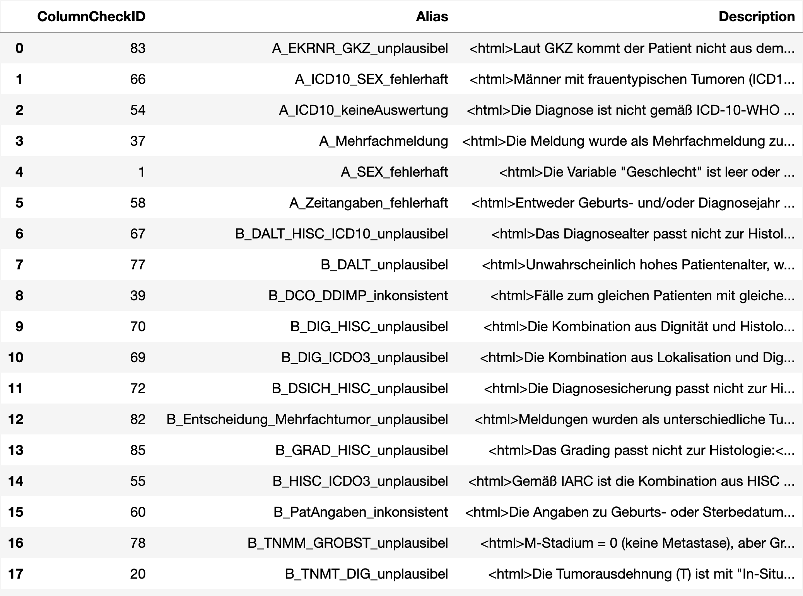
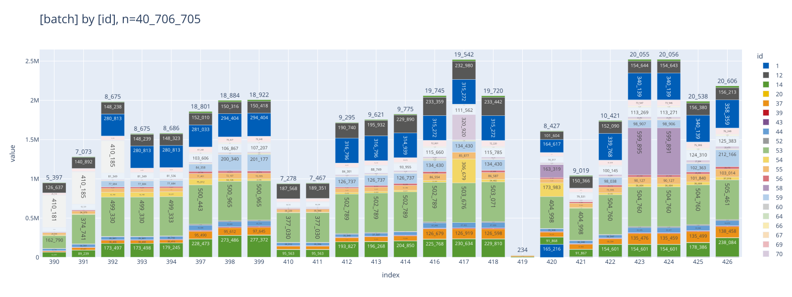
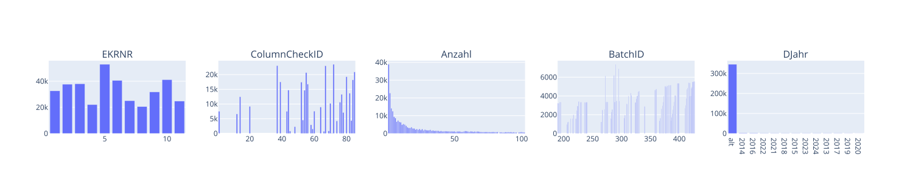

# <a id='toc1_'></a>[Datenqualität (intern) 📉](#toc0_)

**Inhalt**<a id='toc0_'></a>    
- [Datenqualität (intern) 📉](#toc1_)    
  - [Datenstand 🕥](#toc1_1_)    

<!-- vscode-jupyter-toc-config
	numbering=false
	anchor=true
	flat=false
	minLevel=1
	maxLevel=6
	/vscode-jupyter-toc-config -->
<!-- THIS CELL WILL BE REPLACED ON TOC UPDATE. DO NOT WRITE YOUR TEXT IN THIS CELL -->

<br>

## <a id='toc1_1_'></a>[Datenstand 🕥](#toc0_)

    🐍 3.12.8 | 📦 plotly: 6.6.0 | 📦 pandas: 2.3.3 | 📦 numpy: 1.26.4 | 📦 duckdb: 1.5.0 | 📦 pandas-plots: 2.0.3


    database file:           2026-05-13_data_epi.duckdb
    data tag:                epi2025_1
    sql table created:       2026-05-13 09:31:01
    doi:                     10.18444/5.03.01.0005.0022.0001
    document created:        2026-05-13 18:58:20


    <_duckdb.DuckDBPyConnection at 0x10c9a8770>


    
<picture>
  <source media="(prefers-color-scheme: dark)" srcset="internal_files_dark/output_9_0.png">
  <source media="(prefers-color-scheme: light)" srcset="internal_files/output_9_0.png">
  
</picture>
    


    
<picture>
  <source media="(prefers-color-scheme: dark)" srcset="internal_files_dark/output_10_0.svg">
  <source media="(prefers-color-scheme: light)" srcset="internal_files/output_10_0.svg">
  
</picture>
    


    🔵 *** df: checks ***  
    🟣 shape: (367_283, 5)
    🟣 duplicates: 94_635 (26%)  
    🟠 column stats all (dtype | uniques | missings) [values]  
    - index [0, 1, 2, 3, 4,]  
    - EKRNR (int32 | 11 | 0 (0%)) [1, 2, 3, 4, 5,]  
    - ColumnCheckID (int32 | 34 | 0 (0%)) [1, 12, 14, 20, 37,]  
    - Anzahl (int32 | 4_630 | 0 (0%)) [1, 2, 3, 4, 5,]  
    - BatchID (int32 | 149 | 0 (0%)) [73, 95, 119, 128, 132,]  
    - DJahr (object | 14 | 3_588 (1%)) ['2013', '2014', '2015', '2016', '2017',]  
    
    🟠 column stats numeric  
    
    column (n = 367_283) |    notnull     | min | lower |   q25   | median  |   mean    |   q75   | upper |    max    |    std     |   cv  
    ---------------------+----------------+-----+-------+---------+---------+-----------+---------+-------+-----------+------------+-------
    EKRNR                | 367_283 (100%) |   1 |     1 |   3.000 |   6.000 |     5.796 |   9.000 |    11 |        11 |      3.112 |  0.537
    ColumnCheckID        | 367_283 (100%) |   1 |     1 |  44.000 |  60.000 |    58.586 |  77.000 |    85 |        85 |     21.305 |  0.364
    Anzahl               | 367_283 (100%) |   1 |     1 |   5.000 |  26.000 | 3_532.242 | 122.000 |   297 | 3_869_437 | 69_506.958 | 19.678
    BatchID              | 367_283 (100%) |  73 |   119 | 275.000 | 329.000 |   328.401 | 393.000 |   426 |       426 |     73.150 |  0.223
    
    
    🟠 sample 3 rows  


```

```


```
    ┌───────┬───────────────┬────────┬─────────┬─────────┐
    │ EKRNR │ ColumnCheckID │ Anzahl │ BatchID │  DJahr  │
    ├───────┼───────────────┼────────┼─────────┼─────────┤
    │    10 │            14 │      1 │     420 │ alt     │
    │     3 │            14 │    950 │     420 │ alt     │
    │     3 │            14 │    157 │     420 │ alt     │
    └───────┴───────────────┴────────┴─────────┴─────────┘

```

