# <a id='toc1_'></a>[Technische Prüfungen in klinischen und epi Daten](#toc0_)

**Inhalt**<a id='toc0_'></a>    
- [Technische Prüfungen in klinischen und epi Daten](#toc1_)    
  - [Hintergrund](#toc1_1_)    
  - [⚙️ settings](#toc1_2_)    
  - [Datenstand ⏱️](#toc1_3_)    
  - [Anteil Mehrfachtumore](#toc1_4_)    
  - [Plausibilitätsprüfungen](#toc1_5_)    
    - [⚠️ 01-SH](#toc1_5_1_)    
    - [✅ 02-HH](#toc1_5_2_)    
    - [✅ 03-NI](#toc1_5_3_)    
    - [✅ 04-HB](#toc1_5_4_)    
    - [⚠️ 05-NW](#toc1_5_5_)    
    - [🚨 06-HE](#toc1_5_6_)    
    - [✅ 07-RP](#toc1_5_7_)    
    - [✅ 08-BW](#toc1_5_8_)    
    - [✅ 09-BY](#toc1_5_9_)    
    - [✅ 10-SL](#toc1_5_10_)    
    - [✅ 11-GKR (ehemals)](#toc1_5_11_)    
  - [Qualitätsprüfungen](#toc1_6_)    
    - [⚠️ geschlecht_missing](#toc1_6_1_)    
    - [✅ verstorben_missing](#toc1_6_2_)    
    - [⚠️ diagnose_missing](#toc1_6_3_)    
    - [⚠️ inzidenzort_missing](#toc1_6_4_)    
    - [✅ geschlecht_icd_konflikt](#toc1_6_5_)    
    - [⚠️ datum_missing](#toc1_6_6_)    
    - [datum_fehlerhaft](#toc1_6_7_)    
    - [nach hat_todesursache bei Nicht-Verstorbenen](#toc1_6_8_)    
  - [⚠️ Duplikate](#toc1_7_)    
    - [Echte Duplikate](#toc1_7_1_)    
    - [Duplikatverdacht](#toc1_7_2_)    
      - [Verteilung nach Inzidenzort](#toc1_7_2_1_)    
      - [Verteilung nach Diagnosejahr](#toc1_7_2_2_)    
      - [Verteilung nach ICD10](#toc1_7_2_3_)    
      - [Verteilung der Gruppen mit gleichen Merkmalen](#toc1_7_2_4_)    
  - [Datensatz](#toc1_8_)    

<!-- vscode-jupyter-toc-config
	numbering=false
	anchor=true
	flat=false
	minLevel=1
	maxLevel=6
	/vscode-jupyter-toc-config -->
<!-- THIS CELL WILL BE REPLACED ON TOC UPDATE. DO NOT WRITE YOUR TEXT IN THIS CELL -->

<br>

## <a id='toc1_1_'></a>[Hintergrund](#toc0_)
- Ziel der Auswertungen ist es, Qualitätsprüfungen auf **technischer** Ebene darzustellen
- im Abgrenzung zu den **inhaltlichen** Prüfungen des klinischen Datenberichtes sollen hier eher Auffälligkeiten des Verarbeitungsprozesses sichtbar werden, z.B. missings / Konflikte bei zentralen Variablen wie Datumsangaben, Geschlecht etc.
- die Auswertungen sind angelehnt an die bei den epi Daten etablierten _ABC Prüfungen_ (siehe `Bericht zur Datenqualität (epi2023)`)
- die Abgrenzung dieses Dokumentes zum DQ Bericht epi ist derzeit nicht zufriedenstellend gelöst und muss zukünftig verbessert werden
- dargestellt sind hier jeweils Auffälligkeiten sowohl in den klinischen als auch in den epi Daten
- weiterhin nehmen wir bei keinem dieser Prüfungen eine Korrektur in den **klinischen Daten** vor

<!-- ## <a id='toc1_2_'></a>[Zusammenfassung ⚖️](#toc0_)
- [fehlendes Geschlecht](#toc1_4_1_) tritt nicht auf in den klinischen Daten, in den epi Daten überwiegend in `06-HE`
- für [fehlende Diagnose](#toc1_4_3_) bei den klinischen Daten gibt es einige wenige Fälle in `13-MV` und `16-TH`. Für die epi Daten ist eine Bewertung schwierig aufgrund der vielfältigen Bearbeitungsschritte nach Lieferung
- fehlender Inzidenzort tritt in den klinischen Daten nur in `13-MV` auf. Bei den epi Daten wird diese Variable bei missings auto-korrigiert 
- Widerspruch zwischen Geschlecht und Diagnose ist in den klinischen Daten eine Randerscheinung, in den epi Daten treten diese Kombinationen inzwischen nicht mehr auf
- fehlende Datumsangaben sind in den klinischen Daten in etwa proportional zur Registergrösse, bei den epi Daten überwiegend in `10-SL`
- [echte Duplikate](#toc1_5_1_) (gleiches set an Merkmalen und gleiche ID) für klinische Daten kommen ausschliesslich aus `09-BY`, bleiben aber Randfälle
- [Duplikatverdachtsfälle](#toc1_5_2_) sind deutlich weniger auffällig als letztes Jahr. Diese verteilen sich hauptsächlich auf `11-BE`, `09-BY` und `03-NI`, was möglicherweise an lokalen Häufungen von Fällen mit gleichem Inzidenzort liegt -->

<br>

## <a id='toc1_2_'></a>[⚙️ settings](#toc0_)

    🐍 3.12.8 | 📦 pandas: 2.3.3 | 📦 numpy: 1.26.4 | 📦 duckdb: 1.5.0 | 📦 pandas-plots: 2.0.3


<br>

## <a id='toc1_3_'></a>[Datenstand ⏱️](#toc0_)

    database file:           2026-05-12_data_clin.duckdb
    data tag:                v2.4
    last kkr data import:    2026-04-18
    sql table created:       2026-05-12 16:38:32
    doi:                     -
    document created:        2026-05-13 18:53:02
    
    database file:           2026-05-13_data_epi.duckdb
    data tag:                epi2025_1
    sql table created:       2026-05-13 09:31:01
    doi:                     10.18444/5.03.01.0005.0022.0001
    document created:        2026-05-13 18:53:02


    
    aktuellster batch               426
    aktuellstes Diagnosejahr 📆     (2024)


<br>

## <a id='toc1_4_'></a>[Anteil Mehrfachtumore](#toc0_)
- Metrik: Anteil Tumore mit `A_Mehrfachmeldung` **(Werte sind in % angegeben)**
- markierte Mehrfachtumore werden vom ZfKD ausgeschlossen

> 💡 **ZfKD**
> 
> für `13-NI`,`14-SN` und `15-ST` ermittelt das ZfKD sichtbar erhöhte Anteile an Mehrfachtumoren für DJ seit Beginn der klin. Registrierung


```
    n = 17_758_787                     (100.0%) ██████████████████████████████
    └ [DJ 2010-2024]:   n = 11_720_684  (66.0%) ░░░░░░░░░░░███████████████████
    └ [nur gültige BL]: n = 11_711_456  (65.9%) ░░░░░░░░░░░███████████████████
```

<details>
<summary>filter-sql</summary>

```sql
z_dy between 2010 and 2024
and GKZbl::tinyint <= 16
```

</details>


    
    


    
<picture>
  <source media="(prefers-color-scheme: dark)" srcset="tech_files_dark/output_13_5.png">
  <source media="(prefers-color-scheme: light)" srcset="tech_files/output_13_5.png">
  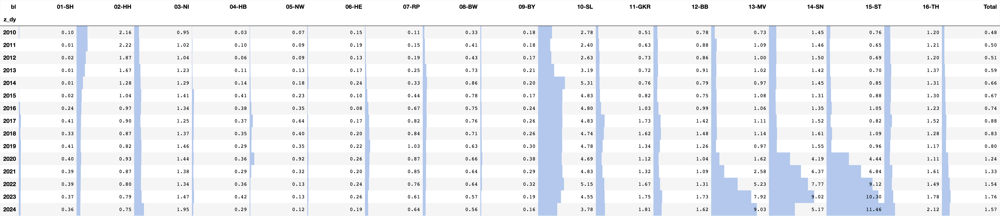
</picture>
    


<br>

## <a id='toc1_5_'></a>[Plausibilitätsprüfungen](#toc0_)
**Filter**
- **es ist jeweils nur das aktuellste DJ berücksichtigt (aktuell `epi2025`: 2024, zum Vergleich `epi2024`: 2023)**

Die Tabellen sind zur besseren Lesbarkeit nun aufgeteilt nach den Plausibilitätsprüfungen ([Liste als pdf](./docs/tech/Plausibilitätsprüfungen_Liste.pdf), [Details als pdf](./docs/tech/Plausibilitätsprüfungen_Details.pdf))
- `A`: Fälle ausgeschlossen
- `B`: Fälle markiert
- `C`: Fälle (auto) korrigiert

Spalten
- `cnt_epi2024`: Absolute Fallzahl der checks für das in diesem Datensatz höchste DJ (2023)
- `cnt_now`: Absolute Fallzahl der checks für das im aktuellen Datensatz höchsten DJ (2024)
- `pct_epi2024`: Anteil Fallzahl der checks an allen Fällen für das in diesem Datensatz höchste DJ (2023)
- `pct_now`: Anteil Fallzahl der checks an allen Fällen für das im aktuellen Datensatz höchste DJ (2024)
- _(Absolute Fallzahlen = nach Abzug der A-Prüfungen)_

Die markierten Fälle können im übermittelten Datensatz geprüft werden, Beispiel: 
<details>
    <summary>click</summary>

```sql
    select * 
    from Tumor4 
    where IARC like '%A_Mehrfach%'
```

</details>

<br>

### <a id='toc1_5_1_'></a>[⚠️ 01-SH](#toc0_)
- `B_TOD_Ja_Aber_Kein_SJ`: 0 -> 4%
- alle Fälle wurden korrigiert laut `C_TOD=1_korrigiert_aufgrund_Sterbeangaben`


<picture>
  <source media="(prefers-color-scheme: dark)" srcset="tech_files_dark/output_17_1.png">
  <source media="(prefers-color-scheme: light)" srcset="tech_files/output_17_1.png">
  
</picture>
    


<picture>
  <source media="(prefers-color-scheme: dark)" srcset="tech_files_dark/output_17_3.png">
  <source media="(prefers-color-scheme: light)" srcset="tech_files/output_17_3.png">
  
</picture>
    


<picture>
  <source media="(prefers-color-scheme: dark)" srcset="tech_files_dark/output_17_5.png">
  <source media="(prefers-color-scheme: light)" srcset="tech_files/output_17_5.png">
  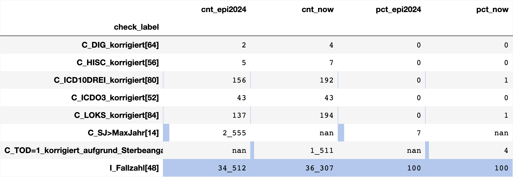
</picture>
    


<br>

### <a id='toc1_5_2_'></a>[✅ 02-HH](#toc0_)


<picture>
  <source media="(prefers-color-scheme: dark)" srcset="tech_files_dark/output_19_1.png">
  <source media="(prefers-color-scheme: light)" srcset="tech_files/output_19_1.png">
  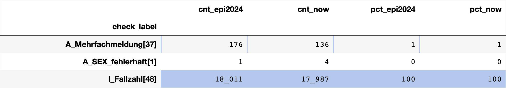
</picture>
    


<picture>
  <source media="(prefers-color-scheme: dark)" srcset="tech_files_dark/output_19_3.png">
  <source media="(prefers-color-scheme: light)" srcset="tech_files/output_19_3.png">
  
</picture>
    


<picture>
  <source media="(prefers-color-scheme: dark)" srcset="tech_files_dark/output_19_5.png">
  <source media="(prefers-color-scheme: light)" srcset="tech_files/output_19_5.png">
  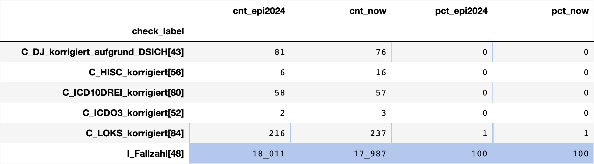
</picture>
    


<br>

### <a id='toc1_5_3_'></a>[✅ 03-NI](#toc0_)


<picture>
  <source media="(prefers-color-scheme: dark)" srcset="tech_files_dark/output_21_1.png">
  <source media="(prefers-color-scheme: light)" srcset="tech_files/output_21_1.png">
  
</picture>
    


<picture>
  <source media="(prefers-color-scheme: dark)" srcset="tech_files_dark/output_21_3.png">
  <source media="(prefers-color-scheme: light)" srcset="tech_files/output_21_3.png">
  
</picture>
    


<picture>
  <source media="(prefers-color-scheme: dark)" srcset="tech_files_dark/output_21_5.png">
  <source media="(prefers-color-scheme: light)" srcset="tech_files/output_21_5.png">
  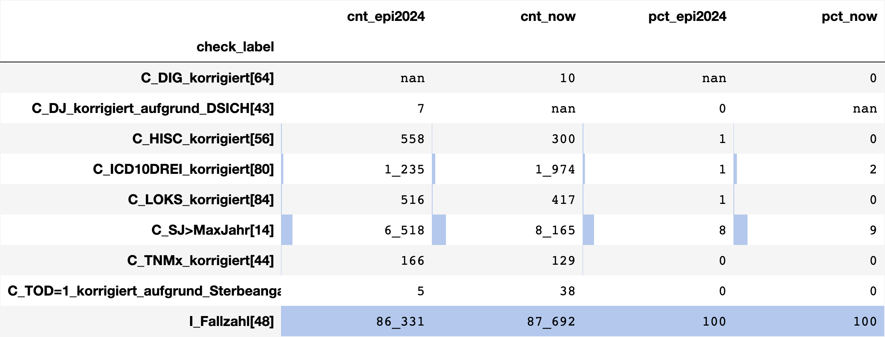
</picture>
    


<br>

### <a id='toc1_5_4_'></a>[✅ 04-HB](#toc0_)


<picture>
  <source media="(prefers-color-scheme: dark)" srcset="tech_files_dark/output_23_1.png">
  <source media="(prefers-color-scheme: light)" srcset="tech_files/output_23_1.png">
  
</picture>
    


<picture>
  <source media="(prefers-color-scheme: dark)" srcset="tech_files_dark/output_23_3.png">
  <source media="(prefers-color-scheme: light)" srcset="tech_files/output_23_3.png">
  
</picture>
    


<picture>
  <source media="(prefers-color-scheme: dark)" srcset="tech_files_dark/output_23_5.png">
  <source media="(prefers-color-scheme: light)" srcset="tech_files/output_23_5.png">
  
</picture>
    


<br>

### <a id='toc1_5_5_'></a>[⚠️ 05-NW](#toc0_)
- unverändert hohe werte bei `A_EKRNR_GKZ_unplausibel`


<picture>
  <source media="(prefers-color-scheme: dark)" srcset="tech_files_dark/output_25_1.png">
  <source media="(prefers-color-scheme: light)" srcset="tech_files/output_25_1.png">
  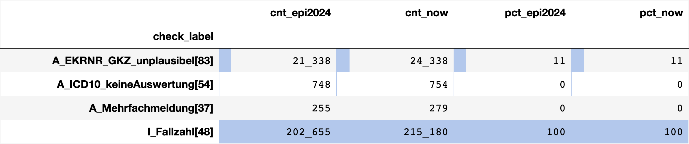
</picture>
    


<picture>
  <source media="(prefers-color-scheme: dark)" srcset="tech_files_dark/output_25_3.png">
  <source media="(prefers-color-scheme: light)" srcset="tech_files/output_25_3.png">
  
</picture>
    


<picture>
  <source media="(prefers-color-scheme: dark)" srcset="tech_files_dark/output_25_5.png">
  <source media="(prefers-color-scheme: light)" srcset="tech_files/output_25_5.png">
  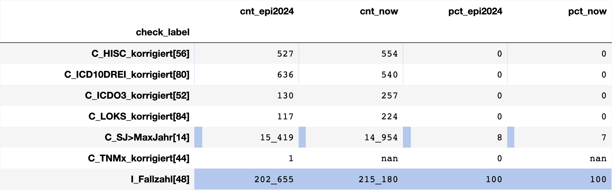
</picture>
    


<br>

### <a id='toc1_5_6_'></a>[🚨 06-HE](#toc0_)
- Fallzahl DJ=2024 deutlich geringer


<picture>
  <source media="(prefers-color-scheme: dark)" srcset="tech_files_dark/output_27_1.png">
  <source media="(prefers-color-scheme: light)" srcset="tech_files/output_27_1.png">
  
</picture>
    


<picture>
  <source media="(prefers-color-scheme: dark)" srcset="tech_files_dark/output_27_3.png">
  <source media="(prefers-color-scheme: light)" srcset="tech_files/output_27_3.png">
  
</picture>
    


<picture>
  <source media="(prefers-color-scheme: dark)" srcset="tech_files_dark/output_27_5.png">
  <source media="(prefers-color-scheme: light)" srcset="tech_files/output_27_5.png">
  
</picture>
    


<br>

### <a id='toc1_5_7_'></a>[✅ 07-RP](#toc0_)


<picture>
  <source media="(prefers-color-scheme: dark)" srcset="tech_files_dark/output_29_1.png">
  <source media="(prefers-color-scheme: light)" srcset="tech_files/output_29_1.png">
  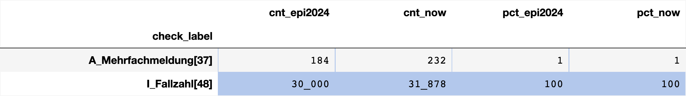
</picture>
    


<picture>
  <source media="(prefers-color-scheme: dark)" srcset="tech_files_dark/output_29_3.png">
  <source media="(prefers-color-scheme: light)" srcset="tech_files/output_29_3.png">
  
</picture>
    


<picture>
  <source media="(prefers-color-scheme: dark)" srcset="tech_files_dark/output_29_5.png">
  <source media="(prefers-color-scheme: light)" srcset="tech_files/output_29_5.png">
  
</picture>
    


<br>

### <a id='toc1_5_8_'></a>[✅ 08-BW](#toc0_)


<picture>
  <source media="(prefers-color-scheme: dark)" srcset="tech_files_dark/output_31_1.png">
  <source media="(prefers-color-scheme: light)" srcset="tech_files/output_31_1.png">
  
</picture>
    


<picture>
  <source media="(prefers-color-scheme: dark)" srcset="tech_files_dark/output_31_3.png">
  <source media="(prefers-color-scheme: light)" srcset="tech_files/output_31_3.png">
  
</picture>
    


<picture>
  <source media="(prefers-color-scheme: dark)" srcset="tech_files_dark/output_31_5.png">
  <source media="(prefers-color-scheme: light)" srcset="tech_files/output_31_5.png">
  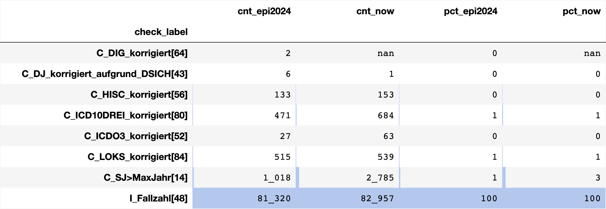
</picture>
    


<br>

### <a id='toc1_5_9_'></a>[✅ 09-BY](#toc0_)


<picture>
  <source media="(prefers-color-scheme: dark)" srcset="tech_files_dark/output_33_1.png">
  <source media="(prefers-color-scheme: light)" srcset="tech_files/output_33_1.png">
  
</picture>
    


<picture>
  <source media="(prefers-color-scheme: dark)" srcset="tech_files_dark/output_33_3.png">
  <source media="(prefers-color-scheme: light)" srcset="tech_files/output_33_3.png">
  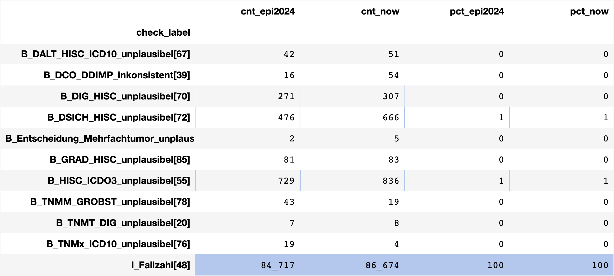
</picture>
    


<picture>
  <source media="(prefers-color-scheme: dark)" srcset="tech_files_dark/output_33_5.png">
  <source media="(prefers-color-scheme: light)" srcset="tech_files/output_33_5.png">
  
</picture>
    


<br>

### <a id='toc1_5_10_'></a>[✅ 10-SL](#toc0_)
- `A_Mehrfachmeldung` leicht erhöht mit ~4%


<picture>
  <source media="(prefers-color-scheme: dark)" srcset="tech_files_dark/output_35_1.png">
  <source media="(prefers-color-scheme: light)" srcset="tech_files/output_35_1.png">
  
</picture>
    


<picture>
  <source media="(prefers-color-scheme: dark)" srcset="tech_files_dark/output_35_3.png">
  <source media="(prefers-color-scheme: light)" srcset="tech_files/output_35_3.png">
  
</picture>
    


<picture>
  <source media="(prefers-color-scheme: dark)" srcset="tech_files_dark/output_35_5.png">
  <source media="(prefers-color-scheme: light)" srcset="tech_files/output_35_5.png">
  
</picture>
    


<br>

### <a id='toc1_5_11_'></a>[✅ 11-GKR (ehemals)](#toc0_)


<picture>
  <source media="(prefers-color-scheme: dark)" srcset="tech_files_dark/output_37_1.png">
  <source media="(prefers-color-scheme: light)" srcset="tech_files/output_37_1.png">
  
</picture>
    


<picture>
  <source media="(prefers-color-scheme: dark)" srcset="tech_files_dark/output_37_3.png">
  <source media="(prefers-color-scheme: light)" srcset="tech_files/output_37_3.png">
  
</picture>
    


<picture>
  <source media="(prefers-color-scheme: dark)" srcset="tech_files_dark/output_37_5.png">
  <source media="(prefers-color-scheme: light)" srcset="tech_files/output_37_5.png">
  
</picture>
    


<div style="page-break-after: always;"></div>


<br>

## <a id='toc1_6_'></a>[Qualitätsprüfungen](#toc0_)
- kein Filter, die Prüfungen wirken auf den gesamten Datenbestand
- zur Darstellung wird eine heatmap verwendet, dem maximalen Wert je Prüfung wird die kräftigste Farbe zugewiesen. Aus diesem relativ gesetzten Farbton ist nicht ableitbar, wie schwerwiegend die Fallzahl ist


```
    ┌──────────────────────┐
    │        z_hash        │
    ├──────────────────────┤
    │ 11187269956916151019 │
    │  4272033462461306400 │
    │ 11647736224215498133 │
    └──────────────────────┘
```

<br>

### <a id='toc1_6_1_'></a>[⚠️ geschlecht_missing](#toc0_)
- Variable `Geschlecht` / `SEX` missing

    🟧 🗄️ klin


    
<picture>
  <source media="(prefers-color-scheme: dark)" srcset="tech_files_dark/output_44_1.png">
  <source media="(prefers-color-scheme: light)" srcset="tech_files/output_44_1.png">
  
</picture>
    


    🟧 🗄️ epi


    
<picture>
  <source media="(prefers-color-scheme: dark)" srcset="tech_files_dark/output_45_1.png">
  <source media="(prefers-color-scheme: light)" srcset="tech_files/output_45_1.png">
  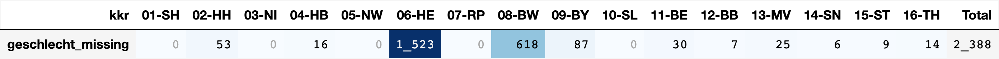
</picture>
    


<br>

### <a id='toc1_6_2_'></a>[✅ verstorben_missing](#toc0_)
- Variable `Verstorben` / `TOD` missing

>Die Variable `TOD` wird in den epi Daten imputiert, kann also dort auch nicht fehlen

    🟧 🗄️ klin


    
<picture>
  <source media="(prefers-color-scheme: dark)" srcset="tech_files_dark/output_47_1.png">
  <source media="(prefers-color-scheme: light)" srcset="tech_files/output_47_1.png">
  
</picture>
    


    🟧 🗄️ epi


    
<picture>
  <source media="(prefers-color-scheme: dark)" srcset="tech_files_dark/output_48_1.png">
  <source media="(prefers-color-scheme: light)" srcset="tech_files/output_48_1.png">
  
</picture>
    


<br>

### <a id='toc1_6_3_'></a>[⚠️ diagnose_missing](#toc0_)
- Variable `Diagnose_ICD10_Code` ist 
  - leer (konkret sind hier die Felder bei der Übermittlung zumeist nicht fehlend, sondern als `''` kodiert)
  - oder nicht in [`C`,`D`]
> klin: nur wenige Kodierungen im Datensatz aus anderen Kapiteln

> ⚠️ epi: In den ABC Prüfungen der epi Daten wird getestet, ob ein Diagnosecode leer ist oder ausserhalb des "Diagnosebandes" des ZfKD (konkret: `A_ICD10_keineAuswertung[54]`). Der Test ist auch im Datenbericht der epi Daten sichtbar, dort wird allerdings nur das letzte DJ herangezogen, um auf die aktuelle Entwicklung zu fokussieren.


    🟧 🗄️ klin

    


    
<picture>
  <source media="(prefers-color-scheme: dark)" srcset="tech_files_dark/output_50_2.png">
  <source media="(prefers-color-scheme: light)" srcset="tech_files/output_50_2.png">
  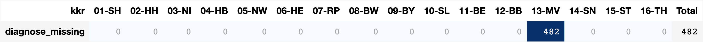
</picture>
    


    Verteilung icd10 ausserhalb [C,D]: {None: 482}


    🟧 🗄️ epi


    
<picture>
  <source media="(prefers-color-scheme: dark)" srcset="tech_files_dark/output_51_1.png">
  <source media="(prefers-color-scheme: light)" srcset="tech_files/output_51_1.png">
  
</picture>
    


    Verteilung icd10 ausserhalb [C,D]: {None: 37016}


<br>

### <a id='toc1_6_4_'></a>[⚠️ inzidenzort_missing](#toc0_)
- Variable `Inzidenzort` fehlt, oder ist unbrauchbar kodiert (_00000_, _99999_, oder Länge != 5)
> epi: die Variable GKZlk wird nachbearbeitet im workflow und weist daher keine missings auf

    🟧 🗄️ klin


    
<picture>
  <source media="(prefers-color-scheme: dark)" srcset="tech_files_dark/output_53_1.png">
  <source media="(prefers-color-scheme: light)" srcset="tech_files/output_53_1.png">
  
</picture>
    


    Verteilung inzidenzort missing oder ungültig{'99999': 8, None: 183}


    🟧 🗄️ epi


    
<picture>
  <source media="(prefers-color-scheme: dark)" srcset="tech_files_dark/output_54_1.png">
  <source media="(prefers-color-scheme: light)" srcset="tech_files/output_54_1.png">
  
</picture>
    


    Verteilung inzidenzort missing oder ungültig{}


<br>

### <a id='toc1_6_5_'></a>[✅ geschlecht_icd_konflikt](#toc0_)
- Widerspruch zwischen Geschlecht und Diagnose, eines der Kombinationen:
  - männlich und `['C51','C52','C53','C54','C55','C56','C57','C58']`
  - weiblich und `['C60','C61','C62','C63']`

    🟧 🗄️ klin


    
<picture>
  <source media="(prefers-color-scheme: dark)" srcset="tech_files_dark/output_56_1.png">
  <source media="(prefers-color-scheme: light)" srcset="tech_files/output_56_1.png">
  
</picture>
    


    Kombination Geschlecht - ICD10 ungültig: {'C61-W': 29, 'C62-W': 6, 'C54-M': 5, 'C56-M': 3, 'C53-M': 2, 'C52-M': 2, 'C55-M': 1, 'C60-W': 1, 'C57-M': 1, 'C51-M': 1, 'C58-M': 1, 'C63-W': 1}


    🟧 🗄️ epi


    
<picture>
  <source media="(prefers-color-scheme: dark)" srcset="tech_files_dark/output_57_1.png">
  <source media="(prefers-color-scheme: light)" srcset="tech_files/output_57_1.png">
  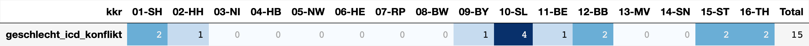
</picture>
    


    Kombination Geschlecht - ICD10 ungültig: {'C61-W': 6, 'C62-W': 3, 'C57-M': 1, 'C52-M': 1, 'C56-M': 1, 'C63-W': 1, 'C60-W': 1, 'C54-M': 1}


<br>

### <a id='toc1_6_6_'></a>[⚠️ datum_missing](#toc0_)
- `Diagnosedatum` oder `Geburtsdatum` ist leer (bzw. als Jahr 1900 kodiert)
- nicht gesetzte Angaben zum Vitalstatus sind ignoriert
> ⚠️ hier sind auch regulär übermittelte Fälle mit vollständig (`V`) geschätztem Datum enthalten

    🟧 🗄️ klin


    
<picture>
  <source media="(prefers-color-scheme: dark)" srcset="tech_files_dark/output_59_1.png">
  <source media="(prefers-color-scheme: light)" srcset="tech_files/output_59_1.png">
  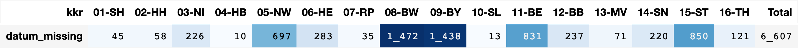
</picture>
    


    Verteilung top 3 (GebDat - DiagDat): {'1900-04-01-2023-07-15': 72, '1900-04-01-2024-01-15': 59, '1900-04-01-2024-03-15': 48}


    🟧 🗄️ epi


    
<picture>
  <source media="(prefers-color-scheme: dark)" srcset="tech_files_dark/output_60_1.png">
  <source media="(prefers-color-scheme: light)" srcset="tech_files/output_60_1.png">
  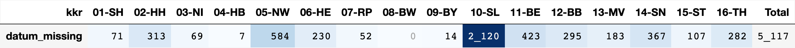
</picture>
    


    Verteilung top 3 (GebDat - DiagDat): {'<NA>-': 172, '1900-09-15-1990-01-15': 7, '1939-10-15-1900-04-15': 7}


<br>

### <a id='toc1_6_7_'></a>[datum_fehlerhaft](#toc0_)
- `Vitalstatus` vor `Geburt` oder `Diagnose` vor/gleich `Geburt`
- alle 3 beteiligten Felder dürfen nicht missing sein

    🟧 🗄️ klin


    
<picture>
  <source media="(prefers-color-scheme: dark)" srcset="tech_files_dark/output_62_1.png">
  <source media="(prefers-color-scheme: light)" srcset="tech_files/output_62_1.png">
  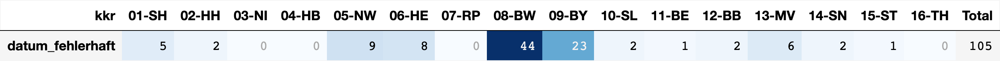
</picture>
    


    Verteilung datum_fehlerhaft top 5:

```
    ┌──────────────┬───────────────┬───────┐
    │ Geburtsdatum │ Diagnosedatum │  cnt  │
    ├──────────────┼───────────────┼───────┤
    │ 2023-11-15   │ 2023-11-15    │     4 │
    │ 2024-03-15   │ 2024-03-15    │     3 │
    │ 2020-01-15   │ 2020-01-15    │     3 │
    │ 2022-04-15   │ 2022-04-15    │     3 │
    │ 2020-11-15   │ 2020-11-15    │     3 │
    └──────────────┴───────────────┴───────┘
```

    🟧 🗄️ epi


    
<picture>
  <source media="(prefers-color-scheme: dark)" srcset="tech_files_dark/output_63_1.png">
  <source media="(prefers-color-scheme: light)" srcset="tech_files/output_63_1.png">
  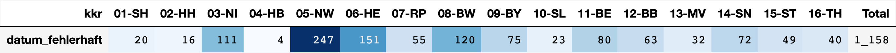
</picture>
    


    Verteilung datum_fehlerhaft top 5:

```
    ┌──────────────┬───────────────┬───────┐
    │ Geburtsdatum │ Diagnosedatum │  cnt  │
    ├──────────────┼───────────────┼───────┤
    │ 2013-09-15   │ 2013-09-15    │    12 │
    │ 2013-04-15   │ 2013-04-15    │    11 │
    │ 2013-11-15   │ 2013-11-15    │    11 │
    │ 2019-04-15   │ 2019-04-15    │    10 │
    │ 2011-05-15   │ 2011-05-15    │    10 │
    └──────────────┴───────────────┴───────┘
```

<br>

### <a id='toc1_6_8_'></a>[nach hat_todesursache bei Nicht-Verstorbenen](#toc0_)
- gezählt werden **Personen**
- **Filter: `Verstorben` = N**


```
    ┌─────────┬───────┬───────┬───────┬───────┬───────┬───────┬───────┬───────┬───────┬───────┬───────┬───────┬───────┬───────┬───────┬───────┐
    │   kkr   │ 01-SH │ 02-HH │ 03-NI │ 04-HB │ 05-NW │ 06-HE │ 07-RP │ 08-BW │ 09-BY │ 10-SL │ 11-BE │ 12-BB │ 13-MV │ 14-SN │ 15-ST │ 16-TH │
    ├─────────┼───────┼───────┼───────┼───────┼───────┼───────┼───────┼───────┼───────┼───────┼───────┼───────┼───────┼───────┼───────┼───────┤
    │ cnt_tu  │     1 │     0 │     0 │     0 │     0 │     0 │     0 │     0 │     2 │    15 │     1 │     3 │   478 │     0 │     0 │     2 │
    └─────────┴───────┴───────┴───────┴───────┴───────┴───────┴───────┴───────┴───────┴───────┴───────┴───────┴───────┴───────┴───────┴───────┘
```

<br>

## <a id='toc1_7_'></a>[⚠️ Duplikate](#toc0_)

- Echte Duplikate stellen Fälle **mit gleicher Id und gleichem hash-wert dar**
- Duplikat-Verdacht: Duplikate **mit gleicher Id**, **aber ohne inhaltliche Gleichheit** sind häufiger, stellen aber lediglich eine Folge der Id Vergabe im GTDS Verbund dar. Da in der Verarbeitung eine zufällige `uuid` vergeben wird entstehen hier auch keine Kollisionen

<br/>


<br>

### <a id='toc1_7_1_'></a>[Echte Duplikate](#toc0_)
- analysiert werden Tumorfälle auf Basis gleicher `Tumor_ID` (original gelieferte Id)
- ebenfalls herangezogen wird ein #️⃣hash-wert über eine Auswahl von Spalten
- haben Tumorfälle den gleichen hash-wert, kann eine inhaltliche Gleichheit **angenommen** werden

- **Ergebnis**
  - ~1000 Paare mit echten Duplikaten sind in den Daten, alle aus `09-BY`.
  - keine der Paare sind innerhalb einer Lieferdatei, also keine Gefahr für die Verarbeitung
  - im Beispiel sind zwei Tumore mit gleicher originalen ID und gleichem hash-wert, aber verschiedenen Dateien
  - in allen Duplikaten werden technische ID neu vergeben, es kommt also nicht zu Kollisionen

Tests:

    Für den hash-wert sind folgende Spalten herangezogen:
    Diagnose_ICD10_Code, Morphologie_Code, Topographie_Code, Geburtsdatum, Diagnosedatum, Geschlecht, Verstorben, Inzidenzort, Seitenlokalisation, T_p, Grading, N_p, Diagnosesicherung, M_p


    Echte Duplikate (gleiche Tumor_ID UND gleicher Inhalt/hash):


```
    ┌──────┬──────────┬───────────┬───────────┬───────────────────┬────────────────────────────────────────────┐
    │ kkr  │ same_kkr │ same_file │ cnt_cases │ max_cases_in_dupl │              example_Tumor_ID              │
    ├──────┼──────────┼───────────┼───────────┼───────────────────┼────────────────────────────────────────────┤
    │    9 │ true     │ false     │         4 │                 2 │ 0C38B26E95677F0A15C56E8F238CFBFC4D94EB76_1 │
    └──────┴──────────┴───────────┴───────────┴───────────────────┴────────────────────────────────────────────┘

<br>
### <a id='toc1_7_2_'></a>[Duplikatverdacht](#toc0_)
- die originale `Tumor_ID` wird hier ignoriert
- es wird für alle Tumorfälle geprüft, ob es Fälle mit gleicher Kombination verschiedener Merkmale gibt
- Verdachtsfälle mit gleicher Kombination aus verschiedenen Registern und Patienten sind möglich
- die Übereinstimmungswahrscheinlichkeit steigt deutlich, wenn mehr Merkmale leer sind
    Verwendete Merkmale: Diagnose_ICD10_Code, Morphologie_Code, Topographie_Code, Geburtsdatum, Diagnosedatum, Geschlecht, Verstorben, Inzidenzort, Seitenlokalisation, T_p, Grading, N_p, Diagnosesicherung, M_p
    🟧 🗄️ klin
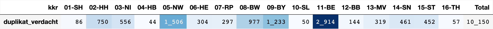
    🟧 🗄️ epi

<br>
#### <a id='toc1_7_2_1_'></a>[Verteilung nach Inzidenzort](#toc0_)
    🟧 🗄️ klin

    🟧 🗄️ epi
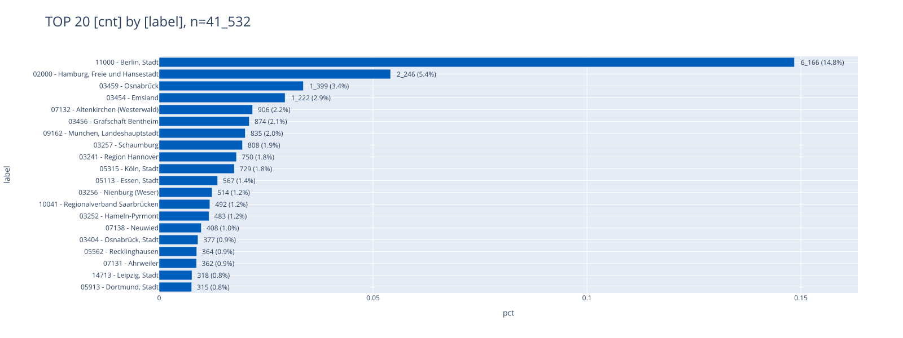
<br>
#### <a id='toc1_7_2_2_'></a>[Verteilung nach Diagnosejahr](#toc0_)
    🟧 🗄️ klin
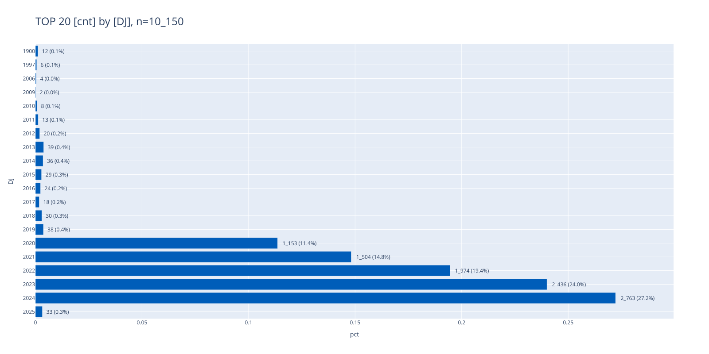
    🟧 🗄️ epi
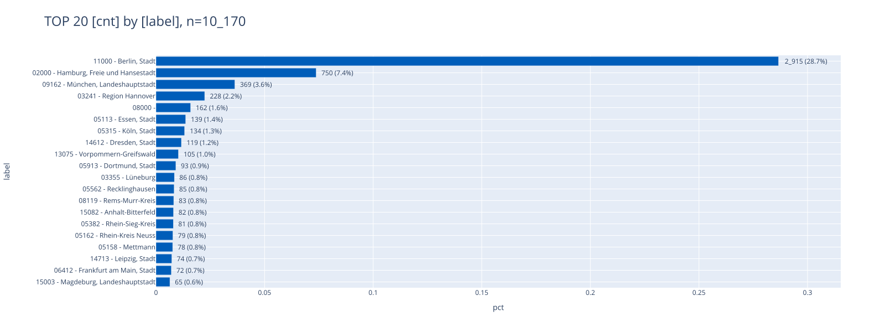
<br>
#### <a id='toc1_7_2_3_'></a>[Verteilung nach ICD10](#toc0_)
    🟧 🗄️ klin
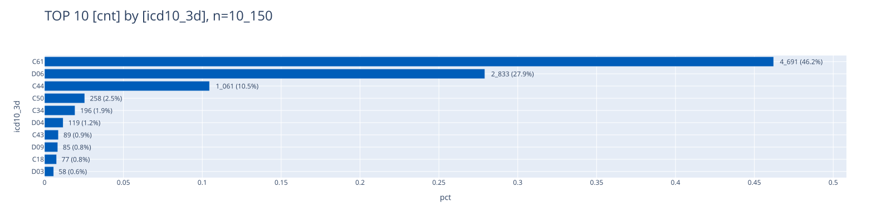
    🟧 🗄️ epi
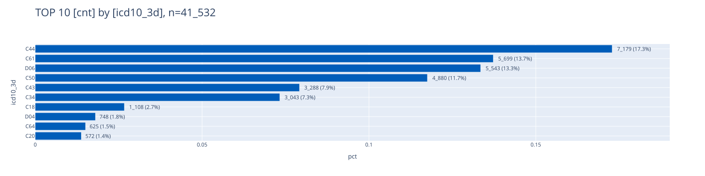
<br>
#### <a id='toc1_7_2_4_'></a>[Verteilung der Gruppen mit gleichen Merkmalen](#toc0_)
- "_Gruppe_" = >1 Verdachtsfälle mit gleichen Merkmalen
- verwendete Metriken (jeweils aufgetragen: `is_equal` = "alle Fälle in der Gruppe haben den gleichen Wert")
> es gibt wenige Gruppen, in denen die Duplikate aus verschiedenen kkr stammen  
> in den meisten Gruppen stammen die Duplikate nicht von einem einzelnen Patienten  
    🟧 🗄️ klin
    10_150 Fälle verteilen sich auf 4_899 Gruppen mit max 14 Fällen in einer Gruppe
    Anzahl Gruppen, in denen alle Fälle das gleiche Merkmal aufweisen: REGISTER {True: 4843, False: 56}
    Anzahl Gruppen, in denen alle Fälle das gleiche Merkmal aufweisen: PATIENTID {False: 4440, True: 459}
    🟧 🗄️ epi
    41_532 Fälle verteilen sich auf 20_385 Gruppen mit max 31 Fällen in einer Gruppe
    Anzahl Gruppen, in denen alle Fälle das gleiche Merkmal aufweisen: REGISTER {True: 20385}
    Anzahl Gruppen, in denen alle Fälle das gleiche Merkmal aufweisen: PATIENTID {False: 19061, True: 1324}
    ┌──────────────────────┬─────────────────────┬──────────────────┬──────────────────┬────────────────┬────────────────┬────────────────────┬─────────┬─────────┬─────────┬─────────┬─────────┬─────────┬─────────┬───────────────────┬────────────────┬──────────┬──────────────┬─────────────┬─────────────┬────────────┬────────────┬──────────────┬──────────────────────────┬───────────────┬───────────────────────────┬───────────────────┬───────────────────────────────┬──────────────────────┬──────────────────────┬───────┬──────────┬──────────┐
    │        hash2         │ Diagnose_ICD10_Code │ Morphologie_Code │ Topographie_Code │ UICC_Stadium_c │ UICC_Stadium_p │ Seitenlokalisation │   T_c   │   T_p   │ Grading │   N_p   │   N_c   │   M_c   │   M_p   │ Diagnosesicherung │ Lieferregister │ icd10_3d │ Diagnosejahr │ Inzidenzort │ Geburtsjahr │ Geschlecht │ Verstorben │ Geburtsdatum │ Geburtsdatum_Genauigkeit │ Diagnosedatum │ Diagnosedatum_Genauigkeit │ Datum_Vitalstatus │ Datum_Vitalstatus_Genauigkeit │       hash2_1        │      hash2_1_1       │  cnt  │ same_kkr │ same_pat │
    ├──────────────────────┼─────────────────────┼──────────────────┼──────────────────┼────────────────┼────────────────┼────────────────────┼─────────┼─────────┼─────────┼─────────┼─────────┼─────────┼─────────┼───────────────────┼────────────────┼──────────┼──────────────┼─────────────┼─────────────┼────────────┼────────────┼──────────────┼──────────────────────────┼───────────────┼───────────────────────────┼───────────────────┼───────────────────────────────┼──────────────────────┼──────────────────────┼───────┼──────────┼──────────┤
    │ 12796173889271493815 │ C44.3               │ 8071/3           │ C44.3            │ NULL           │ I              │ R                  │ NULL    │ 1       │ 2       │ 0       │ NULL    │ NULL    │ 0       │ 7                 │             13 │ C44      │         2022 │ 13075       │        1939 │ W          │ N          │ 1939-07-15   │ T                        │ 2022-02-15    │ T                         │ 2022-06-15        │ T                             │ 12796173889271493815 │ 12796173889271493815 │     3 │ true     │ true     │
    │ 12796173889271493815 │ C44.3               │ 8071/3           │ C44.3            │ NULL           │ I              │ R                  │ NULL    │ 1       │ 2       │ 0       │ NULL    │ NULL    │ 0       │ 7                 │             13 │ C44      │         2022 │ 13075       │        1939 │ W          │ N          │ 1939-07-15   │ T                        │ 2022-02-15    │ T                         │ 2022-06-15        │ T                             │ 12796173889271493815 │ 12796173889271493815 │     3 │ true     │ true     │
    │ 12796173889271493815 │ C44.3               │ 8071/3           │ C44.3            │ NULL           │ I              │ R                  │ NULL    │ 1       │ 2       │ 0       │ NULL    │ NULL    │ 0       │ 7                 │             13 │ C44      │         2022 │ 13075       │        1939 │ W          │ N          │ 1939-07-15   │ T                        │ 2022-02-15    │ T                         │ 2022-06-15        │ T                             │ 12796173889271493815 │ 12796173889271493815 │     3 │ true     │ true     │
    │ 10808291602251259537 │ C44.3               │ 8090/3           │ C44.31           │ NULL           │ NULL           │ R                  │ NULL    │ NULL    │ X       │ NULL    │ NULL    │ NULL    │ NULL    │ 71                │             15 │ C44      │         2015 │ 15089       │        1935 │ M          │ N          │ 1935-10-15   │ T                        │ 2015-06-15    │ T                         │ 2022-12-15        │ T                             │ 10808291602251259537 │ 10808291602251259537 │     2 │ true     │ true     │
    │ 10808291602251259537 │ C44.3               │ 8090/3           │ C44.31           │ NULL           │ NULL           │ R                  │ NULL    │ NULL    │ X       │ NULL    │ NULL    │ NULL    │ NULL    │ 71                │             15 │ C44      │         2015 │ 15089       │        1935 │ M          │ N          │ 1935-10-15   │ T                        │ 2015-06-15    │ T                         │ 2022-12-15        │ T                             │ 10808291602251259537 │ 10808291602251259537 │     2 │ true     │ true     │
    │ 17828479518542558588 │ C44.3               │ 8090/3           │ C44.3            │ NULL           │ NULL           │ L                  │ NULL    │ NULL    │ U       │ NULL    │ NULL    │ NULL    │ NULL    │ 71                │              9 │ C44      │         2019 │ 09376       │        1928 │ W          │ J          │ 1928-10-15   │ T                        │ 2019-05-15    │ T                         │ 2024-08-15        │ T                             │ 17828479518542558588 │ 17828479518542558588 │     2 │ true     │ true     │
    │ 17828479518542558588 │ C44.3               │ 8090/3           │ C44.3            │ NULL           │ NULL           │ L                  │ NULL    │ NULL    │ U       │ NULL    │ NULL    │ NULL    │ NULL    │ 71                │              9 │ C44      │         2019 │ 09376       │        1928 │ W          │ J          │ 1928-10-15   │ T                        │ 2019-05-15    │ T                         │ 2024-08-15        │ T                             │ 17828479518542558588 │ 17828479518542558588 │     2 │ true     │ true     │
    │  6955736735644645174 │ C18.7               │ 8140/3           │ C18.7            │ NULL           │ NULL           │ T                  │ X       │ 3       │ 2       │ 0       │ X       │ 0       │ 0       │ 7                 │              3 │ C18      │         2024 │ 03252       │        1963 │ M          │ N          │ 1963-10-15   │ T                        │ 2024-01-15    │ T                         │ 2025-09-15        │ T                             │  6955736735644645174 │  6955736735644645174 │     2 │ true     │ true     │
    │  6955736735644645174 │ C18.7               │ 8140/3           │ C18.7            │ NULL           │ NULL           │ T                  │ X       │ 3       │ 2       │ 0       │ X       │ 0       │ 0       │ 7                 │              3 │ C18      │         2024 │ 03252       │        1963 │ M          │ N          │ 1963-10-15   │ T                        │ 2024-01-15    │ T                         │ 2025-09-15        │ T                             │  6955736735644645174 │  6955736735644645174 │     2 │ true     │ true     │
    │ 16051131866897218622 │ C44.2               │ 8090/3           │ C44.21           │ NULL           │ NULL           │ R                  │ NULL    │ NULL    │ T       │ NULL    │ NULL    │ NULL    │ NULL    │ 71                │             15 │ C44      │         2022 │ 15002       │        1943 │ M          │ N          │ 1943-11-15   │ T                        │ 2022-07-15    │ T                         │ 2022-09-15        │ T                             │ 16051131866897218622 │ 16051131866897218622 │     2 │ true     │ true     │
    │ 16051131866897218622 │ C44.2               │ 8090/3           │ C44.21           │ NULL           │ NULL           │ R                  │ NULL    │ NULL    │ T       │ NULL    │ NULL    │ NULL    │ NULL    │ 71                │             15 │ C44      │         2022 │ 15002       │        1943 │ M          │ N          │ 1943-11-15   │ T                        │ 2022-07-15    │ T                         │ 2022-09-15        │ T                             │ 16051131866897218622 │ 16051131866897218622 │     2 │ true     │ true     │
    │  5470006345298220214 │ C44.59              │ 8091/3           │ C44.51           │ NULL           │ NULL           │ M                  │ NULL    │ NULL    │ T       │ NULL    │ NULL    │ NULL    │ NULL    │ 71                │             15 │ C44      │         2024 │ 15002       │        1954 │ W          │ N          │ 1954-06-15   │ T                        │ 2024-02-15    │ T                         │ 2024-02-15        │ T                             │  5470006345298220214 │  5470006345298220214 │     2 │ true     │ true     │
    │  5470006345298220214 │ C44.59              │ 8091/3           │ C44.51           │ NULL           │ NULL           │ M                  │ NULL    │ NULL    │ T       │ NULL    │ NULL    │ NULL    │ NULL    │ 71                │             15 │ C44      │         2024 │ 15002       │        1954 │ W          │ N          │ 1954-06-15   │ T                        │ 2024-02-15    │ T                         │ 2024-02-15        │ T                             │  5470006345298220214 │  5470006345298220214 │     2 │ true     │ true     │
    │  6878006408349744660 │ C44.6               │ 8090/3           │ C44.63           │ NULL           │ NULL           │ R                  │ NULL    │ 1       │ T       │ NULL    │ NULL    │ NULL    │ NULL    │ 71                │             15 │ C44      │         2019 │ 15003       │        1936 │ M          │ J          │ 1936-08-15   │ T                        │ 2019-01-15    │ T                         │ 2024-01-15        │ T                             │  6878006408349744660 │  6878006408349744660 │     2 │ true     │ true     │
    │  6878006408349744660 │ C44.6               │ 8090/3           │ C44.63           │ NULL           │ NULL           │ R                  │ NULL    │ 1       │ T       │ NULL    │ NULL    │ NULL    │ NULL    │ 71                │             15 │ C44      │         2019 │ 15003       │        1936 │ M          │ J          │ 1936-08-15   │ T                        │ 2019-01-15    │ T                         │ 2024-01-15        │ T                             │  6878006408349744660 │  6878006408349744660 │     2 │ true     │ true     │
    │ 16388838342108315683 │ C44.5               │ 8090/3           │ C44.53           │ NULL           │ I              │ L                  │ NULL    │ 1       │ X       │ 0       │ NULL    │ NULL    │ 0       │ 7                 │             13 │ C44      │         2015 │ 13073       │        1939 │ M          │ N          │ 1939-03-15   │ T                        │ 2015-02-15    │ T                         │ 2022-06-15        │ T                             │ 16388838342108315683 │ 16388838342108315683 │     2 │ true     │ true     │
    │ 16388838342108315683 │ C44.5               │ 8090/3           │ C44.53           │ NULL           │ I              │ L                  │ NULL    │ 1       │ X       │ 0       │ NULL    │ NULL    │ 0       │ 7                 │             13 │ C44      │         2015 │ 13073       │        1939 │ M          │ N          │ 1939-03-15   │ T                        │ 2015-02-15    │ T                         │ 2022-06-15        │ T                             │ 16388838342108315683 │ 16388838342108315683 │     2 │ true     │ true     │
    │  2210913079643294951 │ C44.3               │ 8090/3           │ C44.3            │ NULL           │ NULL           │ L                  │ NULL    │ NULL    │ U       │ NULL    │ NULL    │ NULL    │ NULL    │ 71                │              9 │ C44      │         2013 │ 09362       │        1934 │ W          │ N          │ 1934-10-15   │ T                        │ 2013-02-15    │ T                         │ 2021-10-15        │ T                             │  2210913079643294951 │  2210913079643294951 │     2 │ true     │ true     │
    │  2210913079643294951 │ C44.3               │ 8090/3           │ C44.3            │ NULL           │ NULL           │ L                  │ NULL    │ NULL    │ U       │ NULL    │ NULL    │ NULL    │ NULL    │ 71                │              9 │ C44      │         2013 │ 09362       │        1934 │ W          │ N          │ 1934-10-15   │ T                        │ 2013-02-15    │ T                         │ 2021-10-15        │ T                             │  2210913079643294951 │  2210913079643294951 │     2 │ true     │ true     │
    │   638802391294984625 │ C44.5               │ 8091/3           │ C44.51           │ NULL           │ NULL           │ L                  │ NULL    │ NULL    │ X       │ NULL    │ NULL    │ NULL    │ NULL    │ 71                │             15 │ C44      │         2020 │ 15083       │        1936 │ W          │ N          │ 1936-08-15   │ T                        │ 2020-09-15    │ T                         │ 2020-09-15        │ T                             │   638802391294984625 │   638802391294984625 │     2 │ true     │ true     │
    │   638802391294984625 │ C44.5               │ 8091/3           │ C44.51           │ NULL           │ NULL           │ L                  │ NULL    │ NULL    │ X       │ NULL    │ NULL    │ NULL    │ NULL    │ 71                │             15 │ C44      │         2020 │ 15083       │        1936 │ W          │ N          │ 1936-08-15   │ T                        │ 2020-09-15    │ T                         │ 2020-09-15        │ T                             │   638802391294984625 │   638802391294984625 │     2 │ true     │ true     │
    │ 14855949945120573835 │ C44.6               │ 8090/3           │ C44.6            │ NULL           │ I              │ L                  │ NULL    │ 1       │ T       │ 0       │ NULL    │ NULL    │ 0       │ 7                 │             13 │ C44      │         2021 │ 13075       │        1937 │ W          │ N          │ 1937-05-15   │ T                        │ 2021-03-15    │ T                         │ 2025-10-15        │ T                             │ 14855949945120573835 │ 14855949945120573835 │     2 │ true     │ true     │
    │ 14855949945120573835 │ C44.6               │ 8090/3           │ C44.6            │ NULL           │ I              │ L                  │ NULL    │ 1       │ T       │ 0       │ NULL    │ NULL    │ 0       │ 7                 │             13 │ C44      │         2021 │ 13075       │        1937 │ W          │ N          │ 1937-05-15   │ T                        │ 2021-03-15    │ T                         │ 2025-10-15        │ T                             │ 14855949945120573835 │ 14855949945120573835 │     2 │ true     │ true     │
    │ 15791116088353961633 │ C34.1               │ 8140/3           │ C34.1            │ NULL           │ NULL           │ R                  │ 4       │ NULL    │ 1       │ NULL    │ 0       │ 1c      │ NULL    │ 7                 │              3 │ C34      │         2023 │ 03252       │        1945 │ W          │ J          │ 1945-06-15   │ T                        │ 2023-11-15    │ T                         │ 2024-04-15        │ T                             │ 15791116088353961633 │ 15791116088353961633 │     2 │ true     │ true     │
    │ 15791116088353961633 │ C34.1               │ 8140/3           │ C34.1            │ NULL           │ NULL           │ R                  │ 4       │ NULL    │ 1       │ NULL    │ 0       │ 1c      │ NULL    │ 7                 │              3 │ C34      │         2023 │ 03252       │        1945 │ W          │ J          │ 1945-06-15   │ T                        │ 2023-11-15    │ T                         │ 2024-04-15        │ T                             │ 15791116088353961633 │ 15791116088353961633 │     2 │ true     │ true     │
    │           ·          │   ·                 │   ·              │   ·              │  ·             │ ·              │ ·                  │ ·       │ ·       │ ·       │ ·       │ ·       │ ·       │ ·       │ ·                 │              · │  ·       │           ·  │   ·         │          ·  │ ·          │ ·          │     ·        │ ·                        │     ·         │ ·                         │     ·             │ ·                             │           ·          │           ·          │     · │  ·       │  ·       │
    │           ·          │   ·                 │   ·              │   ·              │  ·             │ ·              │ ·                  │ ·       │ ·       │ ·       │ ·       │ ·       │ ·       │ ·       │ ·                 │              · │  ·       │           ·  │   ·         │          ·  │ ·          │ ·          │     ·        │ ·                        │     ·         │ ·                         │     ·             │ ·                             │           ·          │           ·          │     · │  ·       │  ·       │
    │           ·          │   ·                 │   ·              │   ·              │  ·             │ ·              │ ·                  │ ·       │ ·       │ ·       │ ·       │ ·       │ ·       │ ·       │ ·                 │              · │  ·       │           ·  │   ·         │          ·  │ ·          │ ·          │     ·        │ ·                        │     ·         │ ·                         │     ·             │ ·                             │           ·          │           ·          │     · │  ·       │  ·       │
    │  7410274048203460807 │ C44.5               │ 8090/3           │ C44.53           │ NULL           │ I              │ M                  │ NULL    │ 1       │ X       │ 0       │ NULL    │ NULL    │ 0       │ 71                │             15 │ C44      │         2014 │ 15003       │        1942 │ W          │ J          │ 1942-04-15   │ T                        │ 2014-07-15    │ T                         │ 2022-04-15        │ T                             │  7410274048203460807 │  7410274048203460807 │     2 │ true     │ true     │
    │  7410274048203460807 │ C44.5               │ 8090/3           │ C44.53           │ NULL           │ I              │ M                  │ NULL    │ 1       │ X       │ 0       │ NULL    │ NULL    │ 0       │ 71                │             15 │ C44      │         2014 │ 15003       │        1942 │ W          │ J          │ 1942-04-15   │ T                        │ 2014-07-15    │ T                         │ 2022-04-15        │ T                             │  7410274048203460807 │  7410274048203460807 │     2 │ true     │ true     │
    │  5383236411603845656 │ C44.5               │ 8097/3           │ C44.5            │ NULL           │ NULL           │ U                  │ NULL    │ NULL    │ U       │ NULL    │ NULL    │ NULL    │ NULL    │ 71                │              9 │ C44      │         2020 │ 09278       │        1956 │ M          │ N          │ 1956-02-15   │ T                        │ 2020-06-15    │ T                         │ 2020-06-15        │ T                             │  5383236411603845656 │  5383236411603845656 │     2 │ true     │ true     │
    │  5383236411603845656 │ C44.5               │ 8097/3           │ C44.5            │ NULL           │ NULL           │ U                  │ NULL    │ NULL    │ U       │ NULL    │ NULL    │ NULL    │ NULL    │ 71                │              9 │ C44      │         2020 │ 09278       │        1956 │ M          │ N          │ 1956-02-15   │ T                        │ 2020-06-15    │ T                         │ 2020-06-15        │ T                             │  5383236411603845656 │  5383236411603845656 │     2 │ true     │ true     │
    │  6244108136172076728 │ C44.3               │ 8090/3           │ C44.33           │ NULL           │ NULL           │ R                  │ NULL    │ NULL    │ T       │ NULL    │ NULL    │ NULL    │ NULL    │ 71                │             15 │ C44      │         2022 │ 15088       │        1967 │ W          │ N          │ 1967-12-15   │ T                        │ 2022-08-15    │ T                         │ 2022-08-15        │ T                             │  6244108136172076728 │  6244108136172076728 │     2 │ true     │ true     │
    │  6244108136172076728 │ C44.3               │ 8090/3           │ C44.33           │ NULL           │ NULL           │ R                  │ NULL    │ NULL    │ T       │ NULL    │ NULL    │ NULL    │ NULL    │ 71                │             15 │ C44      │         2022 │ 15088       │        1967 │ W          │ N          │ 1967-12-15   │ T                        │ 2022-08-15    │ T                         │ 2022-08-15        │ T                             │  6244108136172076728 │  6244108136172076728 │     2 │ true     │ true     │
    │  6189689892157904563 │ C44.3               │ 8090/3           │ C44.33           │ NULL           │ NULL           │ R                  │ NULL    │ NULL    │ T       │ NULL    │ NULL    │ NULL    │ NULL    │ 71                │             15 │ C44      │         2023 │ 15082       │        1953 │ M          │ N          │ 1953-05-15   │ T                        │ 2023-08-15    │ T                         │ 2025-05-15        │ T                             │  6189689892157904563 │  6189689892157904563 │     2 │ true     │ true     │
    │  6189689892157904563 │ C44.3               │ 8090/3           │ C44.33           │ NULL           │ NULL           │ R                  │ NULL    │ NULL    │ T       │ NULL    │ NULL    │ NULL    │ NULL    │ 71                │             15 │ C44      │         2023 │ 15082       │        1953 │ M          │ N          │ 1953-05-15   │ T                        │ 2023-08-15    │ T                         │ 2025-05-15        │ T                             │  6189689892157904563 │  6189689892157904563 │     2 │ true     │ true     │
    │  9989574425369208017 │ C61                 │ 8140/3           │ C61.9            │ NULL           │ NULL           │ T                  │ 1c      │ 2c      │ T       │ 0       │ 0       │ 0       │ NULL    │ 7                 │              3 │ C61      │         2021 │ 03456       │        1954 │ M          │ N          │ 1954-02-15   │ T                        │ 2021-03-15    │ T                         │ 2025-09-15        │ T                             │  9989574425369208017 │  9989574425369208017 │     2 │ true     │ true     │
    │  9989574425369208017 │ C61                 │ 8140/3           │ C61.9            │ NULL           │ NULL           │ T                  │ NULL    │ 2c      │ T       │ 0       │ NULL    │ NULL    │ NULL    │ 7                 │              3 │ C61      │         2021 │ 03456       │        1954 │ M          │ N          │ 1954-02-15   │ T                        │ 2021-03-15    │ T                         │ 2025-09-15        │ T                             │  9989574425369208017 │  9989574425369208017 │     2 │ true     │ true     │
    │ 15276093509548498471 │ D03.5               │ 8720/2           │ C44.53           │ NULL           │ 0              │ L                  │ NULL    │ is      │ U       │ 0       │ NULL    │ NULL    │ 0       │ 7                 │             13 │ D03      │         2016 │ 13072       │        1941 │ M          │ N          │ 1941-11-15   │ T                        │ 2016-04-15    │ T                         │ 2022-10-15        │ T                             │ 15276093509548498471 │ 15276093509548498471 │     2 │ true     │ true     │
    │ 15276093509548498471 │ D03.5               │ 8720/2           │ C44.53           │ NULL           │ 0              │ L                  │ NULL    │ is      │ U       │ 0       │ NULL    │ NULL    │ 0       │ 7                 │             13 │ D03      │         2016 │ 13072       │        1941 │ M          │ N          │ 1941-11-15   │ T                        │ 2016-04-15    │ T                         │ 2022-10-15        │ T                             │ 15276093509548498471 │ 15276093509548498471 │     2 │ true     │ true     │
    │  5276238805415467735 │ C71.2               │ NULL             │ C71.2            │ NULL           │ NULL           │ L                  │ NULL    │ NULL    │ NULL    │ NULL    │ NULL    │ NULL    │ NULL    │ 9                 │              7 │ C71      │         2020 │ 07312       │        1937 │ W          │ J          │ 1937-11-15   │ T                        │ 2020-11-15    │ T                         │ 2022-01-15        │ T                             │  5276238805415467735 │  5276238805415467735 │     2 │ true     │ true     │
    │  5276238805415467735 │ C71.2               │ NULL             │ C71.2            │ NULL           │ NULL           │ L                  │ NULL    │ NULL    │ NULL    │ NULL    │ NULL    │ NULL    │ NULL    │ 9                 │              7 │ C71      │         2020 │ 07312       │        1937 │ W          │ J          │ 1937-11-15   │ T                        │ 2020-11-15    │ T                         │ 2022-01-15        │ T                             │  5276238805415467735 │  5276238805415467735 │     2 │ true     │ true     │
    │  8522843578315997121 │ C44.5               │ 8090/3           │ C44.5            │ NULL           │ I              │ R                  │ NULL    │ 1       │ T       │ 0       │ NULL    │ NULL    │ 0       │ 7                 │             13 │ C44      │         2023 │ 13073       │        1957 │ W          │ N          │ 1957-04-15   │ T                        │ 2023-07-15    │ T                         │ 2025-11-15        │ T                             │  8522843578315997121 │  8522843578315997121 │     3 │ true     │ true     │
    │  8522843578315997121 │ C44.5               │ 8090/3           │ C44.5            │ NULL           │ I              │ R                  │ NULL    │ 1       │ T       │ 0       │ NULL    │ NULL    │ 0       │ 7                 │             13 │ C44      │         2023 │ 13073       │        1957 │ W          │ N          │ 1957-04-15   │ T                        │ 2023-07-15    │ T                         │ 2025-11-15        │ T                             │  8522843578315997121 │  8522843578315997121 │     3 │ true     │ true     │
    │  8522843578315997121 │ C44.5               │ 8090/3           │ C44.5            │ NULL           │ I              │ R                  │ NULL    │ 1       │ T       │ 0       │ NULL    │ NULL    │ 0       │ 7                 │             13 │ C44      │         2023 │ 13073       │        1957 │ W          │ N          │ 1957-04-15   │ T                        │ 2023-07-15    │ T                         │ 2025-11-15        │ T                             │  8522843578315997121 │  8522843578315997121 │     3 │ true     │ true     │
    │   961518092213708704 │ C44.3               │ 8090/3           │ C44.3            │ NULL           │ NULL           │ L                  │ NULL    │ NULL    │ U       │ NULL    │ NULL    │ NULL    │ NULL    │ 71                │              9 │ C44      │         2018 │ 09375       │        1943 │ M          │ N          │ 1943-01-15   │ T                        │ 2018-03-15    │ T                         │ 2025-08-15        │ T                             │   961518092213708704 │   961518092213708704 │     2 │ true     │ true     │
    │   961518092213708704 │ C44.3               │ 8090/3           │ C44.3            │ NULL           │ NULL           │ L                  │ NULL    │ NULL    │ U       │ NULL    │ NULL    │ NULL    │ NULL    │ 71                │              9 │ C44      │         2018 │ 09375       │        1943 │ M          │ N          │ 1943-01-15   │ T                        │ 2018-03-15    │ T                         │ 2025-08-15        │ T                             │   961518092213708704 │   961518092213708704 │     2 │ true     │ true     │
    │ 17786902993126224100 │ D03.5               │ 8742/2           │ C44.53           │ NULL           │ NULL           │ R                  │ NULL    │ is      │ T       │ NULL    │ NULL    │ NULL    │ NULL    │ 71                │             16 │ D03      │         2023 │ 16077       │        1959 │ W          │ N          │ 1959-06-15   │ T                        │ 2023-08-15    │ T                         │ 2023-08-15        │ T                             │ 17786902993126224100 │ 17786902993126224100 │     2 │ true     │ true     │
    │ 17786902993126224100 │ D03.5               │ 8742/2           │ C44.53           │ NULL           │ NULL           │ R                  │ NULL    │ is      │ T       │ NULL    │ NULL    │ NULL    │ NULL    │ 71                │             16 │ D03      │         2023 │ 16077       │        1959 │ W          │ N          │ 1959-06-15   │ T                        │ 2023-08-15    │ T                         │ 2023-08-15        │ T                             │ 17786902993126224100 │ 17786902993126224100 │     2 │ true     │ true     │
    │ 10981937348121506341 │ C44.5               │ 8071/3           │ C44.5            │ NULL           │ I              │ M                  │ NULL    │ 1       │ 2       │ 0       │ NULL    │ NULL    │ 0       │ 71                │             15 │ C44      │         2017 │ 15086       │        1955 │ M          │ J          │ 1955-08-15   │ T                        │ 2017-07-15    │ T                         │ 2023-09-15        │ T                             │ 10981937348121506341 │ 10981937348121506341 │     2 │ true     │ true     │
    │ 10981937348121506341 │ C44.5               │ 8071/3           │ C44.5            │ NULL           │ I              │ M                  │ NULL    │ 1       │ 2       │ 0       │ NULL    │ NULL    │ 0       │ 71                │             15 │ C44      │         2017 │ 15086       │        1955 │ M          │ J          │ 1955-08-15   │ T                        │ 2017-07-15    │ T                         │ 2023-09-15        │ T                             │ 10981937348121506341 │ 10981937348121506341 │     2 │ true     │ true     │
    │  3865409901786418165 │ C44.6               │ 8090/3           │ C44.61           │ NULL           │ NULL           │ L                  │ NULL    │ NULL    │ U       │ NULL    │ NULL    │ NULL    │ NULL    │ 71                │             15 │ C44      │         2014 │ 15091       │        1937 │ M          │ N          │ 1937-03-15   │ T                        │ 2014-07-15    │ T                         │ 2021-02-15        │ T                             │  3865409901786418165 │  3865409901786418165 │     2 │ true     │ true     │
    │  3865409901786418165 │ C44.6               │ 8090/3           │ C44.61           │ NULL           │ NULL           │ L                  │ NULL    │ NULL    │ U       │ NULL    │ NULL    │ NULL    │ NULL    │ 71                │             15 │ C44      │         2014 │ 15091       │        1937 │ M          │ N          │ 1937-03-15   │ T                        │ 2014-07-15    │ T                         │ 2021-02-15        │ T                             │  3865409901786418165 │  3865409901786418165 │     2 │ true     │ true     │
    └──────────────────────┴─────────────────────┴──────────────────┴──────────────────┴────────────────┴────────────────┴────────────────────┴─────────┴─────────┴─────────┴─────────┴─────────┴─────────┴─────────┴───────────────────┴────────────────┴──────────┴──────────────┴─────────────┴─────────────┴────────────┴────────────┴──────────────┴──────────────────────────┴───────────────┴───────────────────────────┴───────────────────┴───────────────────────────────┴──────────────────────┴──────────────────────┴───────┴──────────┴──────────┘
```

      943 rows (50 shown)                                                                                                                                                                                                                                                                                                                                                                                                                                                                                                                           33 columns
    


<br>

## <a id='toc1_8_'></a>[Datensatz](#toc0_)

    🔵 *** df: Tumor (id excluded) ***  
    🟣 shape: (4_062_856, 101)


    🟣 duplicates: 871 (0%)  
    🟠 column stats all (dtype | uniques | missings) [values]  
    - index [0, 1, 2, 3, 4,]  
    - Diagnosedatum (datetime64[us] | 723 | 0 (0%)) [1900-04-01 00:00:00, 1937-07-15 00:00:00, 1941-01-15 00:00:00, 1945-07-01 00:00:00,  
    1948-03-15 00:00:00,]  
    - Diagnosedatum_Genauigkeit (object | 3 | 0 (0%)) ['M', 'T', 'V',]  


    - Inzidenzort (object | 495 | 183 (0%)) ['01001', '01002', '01003', '01004', '01051',]  
    - Diagnose_ICD10_Code (object | 888 | 482 (0%)) ['<NA>', 'C00', 'C00.0', 'C00.1', 'C00.2',]  


    - Diagnose_ICD10_Version (object | 27 | 85_396 (2%)) ['10 2004 GM', '10 2005 GM', '10 2006 GM', '10 2008 GM', '10 2009 GM',]  
    - Topographie_Code (object | 709 | 29_133 (1%)) ['<NA>', 'C00.0', 'C00.1', 'C00.2', 'C00.3',]  


    - Topographie_Version (object | 4 | 128_967 (3%)) ['31', '32', '33', '<NA>',]  
    - Diagnosesicherung (object | 12 | 0 (0%)) ['0', '1', '2', '4', '5',]  


    - TNM_Auflage_c (object | 5 | 1_777_523 (44%)) ['6', '7', '8', '9', '<NA>',]  


    - y_Symbol_c (object | 2 | 4_061_170 (100%)) ['<NA>', 'y',]  


    - r_Symbol_c (object | 2 | 4_062_840 (100%)) ['<NA>', 'r',]  


    - a_Symbol_c (object | 2 | 4_062_381 (100%)) ['<NA>', 'a',]  


    - m_Symbol_c (object | 44 | 3_983_927 (98%)) ['(m)', '0', '1', '10', '108',]  


    - c_p_u_Praefix_T_c (object | 4 | 2_699_287 (66%)) ['<NA>', 'c', 'p', 'u',]  


    - T_c (object | 213 | 2_501_324 (62%)) ['0', '0(is)', '1', '1 (is)', '1 (m)',]  


    - c_p_u_Praefix_N_c (object | 4 | 2_629_182 (65%)) ['<NA>', 'c', 'p', 'u',]  


    - N_c (object | 195 | 2_441_308 (60%)) ['+', '0', '0 (0/14)', '0 (0/16)', '0 (0/31)',]  


    - c_p_u_Praefix_M_c (object | 4 | 2_551_763 (63%)) ['<NA>', 'c', 'p', 'u',]  


    - M_c (object | 45 | 2_369_803 (58%)) ['0', '0 (mind.)', '0(0)', '0(0/3sn)', '0(1)',]  


    - L_c (object | 4 | 3_526_092 (87%)) ['<NA>', 'L0', 'L1', 'LX',]  


    - V_c (object | 5 | 3_617_355 (89%)) ['<NA>', 'V0', 'V1', 'V2', 'VX',]  


    - Pn_c (object | 4 | 3_614_373 (89%)) ['<NA>', 'Pn0', 'Pn1', 'PnX',]  


    - S_c (object | 6 | 4_022_985 (99%)) ['<NA>', 'S0', 'S1', 'S2', 'S3',]  


    - UICC_Stadium_c (object | 36 | 3_174_176 (78%)) ['0', '0a', '0is', '<NA>', 'I',]  
    - TNM_Auflage_p (object | 5 | 1_555_895 (38%)) ['6', '7', '8', '9', '<NA>',]  


    - y_Symbol_p (object | 2 | 3_964_175 (98%)) ['<NA>', 'y',]  


    - r_Symbol_p (object | 2 | 4_062_813 (100%)) ['<NA>', 'r',]  


    - a_Symbol_p (object | 2 | 4_062_480 (100%)) ['<NA>', 'a',]  


    - m_Symbol_p (object | 53 | 4_005_552 (99%)) ['(2)', '(5)', '(m)', '0', '1',]  


    - c_p_u_Praefix_T_p (object | 4 | 2_095_432 (52%)) ['<NA>', 'c', 'p', 'u',]  


    - T_p (object | 562 | 2_093_497 (52%)) ['0', '0 (bifokal)', '0 (is)', '0(DCIS)', '0(bizentrisch)',]  


    - c_p_u_Praefix_N_p (object | 4 | 2_695_918 (66%)) ['<NA>', 'c', 'p', 'u',]  


    - N_p (object | 3_694 | 2_581_190 (64%)) ['0', '0  (sn)', '0  (sn))', '0  (sn, i-)', '0 (-i)',]  


    - c_p_u_Praefix_M_p (object | 4 | 2_987_068 (74%)) ['<NA>', 'c', 'p', 'u',]  


    - M_p (object | 52 | 2_826_246 (70%)) ['0', '0(0)', '0(0/20', '0(0/9)', '0(1)',]  


    - L_p (object | 4 | 3_141_710 (77%)) ['<NA>', 'L0', 'L1', 'LX',]  


    - V_p (object | 5 | 3_161_220 (78%)) ['<NA>', 'V0', 'V1', 'V2', 'VX',]  


    - Pn_p (object | 4 | 3_360_612 (83%)) ['<NA>', 'Pn0', 'Pn1', 'PnX',]  


    - S_p (object | 6 | 4_023_422 (99%)) ['<NA>', 'S0', 'S1', 'S2', 'S3',]  


    - UICC_Stadium_p (object | 36 | 3_158_584 (78%)) ['0', '0a', '0is', '<NA>', 'I',]  
    - Grading (object | 13 | 94_387 (2%)) ['0', '1', '2', '3', '4',]  
    - LK_befallen (Int32 | 88 | 3_262_737 (80%)) [0, 1, 2, 3, 4,]  
    - LK_untersucht (Int32 | 197 | 3_088_600 (76%)) [0, 1, 2, 3, 4,]  


    - Morphologie_Code (object | 1_401 | 94_387 (2%)) ['0000/0', '5255/3', '7432/0', '8000/0', '8000/1',]  
    - Morphologie_Version (object | 5 | 188_295 (5%)) ['31', '32', '33', '<NA>', 'bb',]  


    - Praetherapeutischer_Menopausenstatus (object | 4 | 3_775_123 (93%)) ['1', '3', '<NA>', 'U',]  


    - HormonrezeptorStatus_Oestrogen (object | 4 | 3_704_793 (91%)) ['<NA>', 'N', 'P', 'U',]  


    - HormonrezeptorStatus_Progesteron (object | 4 | 3_707_736 (91%)) ['<NA>', 'N', 'P', 'U',]  


    - Her2neuStatus (object | 4 | 3_695_913 (91%)) ['<NA>', 'N', 'P', 'U',]  
    - TumorgroesseInvasiv (Int32 | 211 | 3_854_180 (95%)) [0, 1, 2, 3, 4,]  
    - TumorgroesseDCIS (Int32 | 174 | 3_961_718 (98%)) [0, 1, 2, 3, 4,]  


    - RASMutation (object | 5 | 3_987_833 (98%)) ['<NA>', 'M', 'N', 'U', 'W',]  
    - RektumAbstandAnokutanlinie (Int32 | 101 | 4_020_045 (99%)) [0, 1, 2, 3, 4,]  


    - GradPrimaer (object | 6 | 3_816_197 (94%)) ['1', '2', '3', '4', '5',]  


    - GradSekundaer (object | 6 | 3_816_214 (94%)) ['1', '2', '3', '4', '5',]  


    - ScoreErgebnis (object | 12 | 3_745_551 (92%)) ['10', '2', '3', '4', '5',]  


    - AnlassGleasonScore (object | 4 | 3_818_355 (94%)) ['<NA>', 'O', 'S', 'U',]  
    - PSA (float32 | 12_956 | 3_815_447 (94%)) [0.0, 0.009999999776482582, 0.019999999552965164, 0.029999999329447746, 0.03999999910593033,]  
    - DatumPSA (datetime64[us] | 273 | 2_887_990 (71%)) [0002-07-15 00:00:00, 0202-06-15 00:00:00, 0202-12-15 00:00:00, 0210-08-15 00:00:00,  
    0221-07-15 00:00:00,]  


    - DatumPSA_Genauigkeit (object | 3 | 2_887_990 (71%)) ['<NA>', 'T', 'V',]  
    - Tumordicke (float32 | 286 | 4_003_801 (99%)) [0.009999999776482582, 0.05000000074505806, 0.10000000149011612, 0.12999999523162842,  
    0.14000000059604645,]  
    - LDH (Int32 | 515 | 4_054_773 (100%)) [1, 2, 5, 7, 10,]  


    - Ulzeration (object | 3 | 4_024_740 (99%)) ['<NA>', 'J', 'N',]  
    - Seitenlokalisation (object | 6 | 0 (0%)) ['B', 'L', 'M', 'R', 'T',]  
    - DCN (object | 2 | 0 (0%)) ['J', 'N',]  
    - Anzahl_Tage_Diagnose_Tod (Int32 | 11_571 | 2_894_405 (71%)) [-7324, -6000, -2433, -2344, -347,]  
    - z_kkr (int8 | 16 | 0 (0%)) [1, 2, 3, 4, 5,]  


    - z_kkr_label (object | 16 | 0 (0%)) ['01-SH', '02-HH', '03-NI', '04-HB', '05-NW',]  
    - z_dy (int16 | 77 | 0 (0%)) [1900, 1937, 1941, 1945, 1948,]  
    - z_age (float64 | 2_178 | 0 (0%)) [-122.0, -121.0, -118.67, -118.25, -112.5,]  


    - z_ag05 (object | 19 | 5_811 (0%)) ['<NA>', 'a00b04', 'a05b09', 'a10b14', 'a15b19',]  
    - z_icd10 (object | 594 | 2_444 (0%)) ['<NA>', 'C00.0', 'C00.1', 'C00.2', 'C00.3',]  


    - z_icd10_3d (object | 110 | 2_444 (0%)) ['<NA>', 'C00', 'C01', 'C02', 'C03',]  


    - z_t_c_0 (object | 43 | 2_501_327 (62%)) ['0', '1', '1a', '1a1', '1a2',]  


    - z_t_c_1 (object | 9 | 2_501_327 (62%)) ['0', '1', '2', '3', '4',]  


    - z_t_p_0 (object | 43 | 2_093_499 (52%)) ['0', '1', '1a', '1a1', '1a2',]  


    - z_t_p_1 (object | 9 | 2_093_499 (52%)) ['0', '1', '2', '3', '4',]  


    - z_n_c_0 (object | 29 | 2_441_655 (60%)) ['0', '0(i+)', '0(i+)(sn)', '0(i-)', '0(i-)(sn)',]  


    - z_n_c_1 (object | 6 | 2_441_655 (60%)) ['0', '1', '2', '3', '<NA>',]  


    - z_n_p_0 (object | 29 | 2_581_195 (64%)) ['0', '0(i+)', '0(i+)(sn)', '0(i-)', '0(i-)(sn)',]  


    - z_n_p_1 (object | 6 | 2_581_195 (64%)) ['0', '1', '2', '3', '<NA>',]  


    - z_m_c_0 (object | 22 | 2_388_689 (59%)) ['0', '0(0)', '0(1)', '0(i+)', '0(i-)',]  


    - z_m_c_1 (object | 3 | 2_388_689 (59%)) ['0', '1', '<NA>',]  


    - z_m_p_0 (object | 22 | 2_861_041 (70%)) ['0', '0(0)', '0(1)', '0(i+)', '0(i-)',]  


    - z_m_p_1 (object | 3 | 2_861_041 (70%)) ['0', '1', '<NA>',]  
    - z_m_pc_1 (object | 3 | 1_666_315 (41%)) ['0', '1', '<NA>',]  
    - z_is_dco (bool | 2 | 0 (0%)) [False, True,]  


    - z_last_tum_status (object | 11 | 2_787_054 (69%)) ['<NA>', 'B - klinische Besserung des Zustandes', 'D - divergentes Geschehen',  
    'K - keine Änderung', 'P - Progression',]  
    - z_tum_op_count (int16 | 25 | 0 (0%)) [0, 1, 2, 3, 4,]  
    - z_tum_st_count (int16 | 40 | 0 (0%)) [0, 1, 2, 3, 4,]  
    - z_tum_sy_count (int16 | 27 | 0 (0%)) [0, 1, 2, 3, 4,]  
    - z_tum_fo_count (int16 | 38 | 0 (0%)) [0, 1, 2, 3, 4,]  


    - z_first_treatment (object | 4 | 1_785_043 (44%)) ['<NA>', 'op', 'st', 'sy',]  
    - z_first_treatment_after_days (Int32 | 2_092 | 1_785_043 (44%)) [0, 1, 2, 3, 4,]  


    - z_event_order (object | 17_695 | 1_542_034 (38%)) ['<NA>', 'fo', 'fo-op', 'fo-op-fo', 'fo-op-fo-op',]  
    - z_events (object | 16 | 0 (0%)) ['-', 'fo', 'op', 'op|fo', 'op|st',]  


    - z_class_hpv (object | 4 | 4_015_933 (99%)) ['<NA>', 'N', 'P', 'U',]  
    - z_tum_order (int8 | 49 | 0 (0%)) [1, 2, 3, 4, 5,]  
    - z_sex (object | 5 | 0 (0%)) ['D', 'M', 'U', 'W', 'X',]  
    - z_period_diag_death_day (Int32 | 11_559 | 2_862_033 (70%)) [0, 1, 2, 3, 4,]  
    - z_period_diag_psa_day (Int32 | 509 | 3_850_626 (95%)) [-3623, -3592, -3561, -3530, -3502,]  
    
    🟠 column stats numeric  


    
    column (n = 4_062_856)       |     notnull      |   min    | lower  |    q25    |  median   |   mean    |    q75    |  upper  |    max     |    std    |   cv   
    -----------------------------+------------------+----------+--------+-----------+-----------+-----------+-----------+---------+------------+-----------+--------
    LK_befallen                  |    800_119 (19%) |        0 |      0 |     0.000 |     0.000 |     0.918 |     0.000 |       0 |        722 |     3.078 |   3.354
    LK_untersucht                |    974_256 (23%) |        0 |      0 |     1.000 |     5.000 |    10.636 |    17.000 |      41 |      2_319 |    13.656 |   1.284
    TumorgroesseInvasiv          |     208_676 (5%) |        0 |      0 |     9.000 |    15.000 |    19.617 |    25.000 |      49 |        999 |    19.210 |   0.979
    TumorgroesseDCIS             |     101_138 (2%) |        0 |      0 |     0.000 |     0.000 |    10.968 |    15.000 |      37 |        999 |    20.488 |   1.868
    RektumAbstandAnokutanlinie   |      42_811 (1%) |        0 |      0 |     5.000 |     9.000 |    11.289 |    14.000 |      27 |        930 |    16.996 |   1.506
    PSA                          |     247_409 (6%) |    0.000 |  0.000 |     5.630 |     8.740 |    90.354 |    18.000 |  36.550 | 99_999.000 |   741.810 |   8.210
    Tumordicke                   |      59_055 (1%) |    0.010 |  0.010 |     0.400 |     0.900 |     1.950 |     2.200 |   4.900 |     99.000 |     3.516 |   1.804
    LDH                          |       8_083 (0%) |        1 |     85 |   173.000 |   198.000 |   223.739 |   232.000 |     320 |      5_756 |   207.009 |   0.925
    Anzahl_Tage_Diagnose_Tod     |  1_168_451 (28%) |   -7_324 |   -347 |    53.000 |   262.000 |   660.850 |   714.000 |   1_705 |     30_590 | 1_280.215 |   1.937
    z_kkr                        | 4_062_856 (100%) |        1 |      1 |     5.000 |     8.000 |     7.806 |    10.000 |      16 |         16 |     3.918 |   0.502
    z_dy                         | 4_062_856 (100%) |     1900 |   2018 | 2_021.000 | 2_022.000 | 2_021.201 | 2_023.000 |    2026 |       2026 |     5.614 |   0.003
    z_age                        | 4_062_856 (100%) | -122.000 | 30.250 |    59.670 |    70.000 |    68.026 |    79.330 | 108.500 |    983.330 |    15.271 |   0.224
    z_tum_op_count               | 4_062_856 (100%) |        0 |      0 |     0.000 |     0.000 |     0.522 |     1.000 |       2 |         43 |     0.747 |   1.431
    z_tum_st_count               | 4_062_856 (100%) |        0 |      0 |     0.000 |     0.000 |     0.173 |     0.000 |       0 |        148 |     0.536 |   3.100
    z_tum_sy_count               | 4_062_856 (100%) |        0 |      0 |     0.000 |     0.000 |     0.395 |     0.000 |       0 |         57 |     0.915 |   2.319
    z_tum_fo_count               | 4_062_856 (100%) |        0 |      0 |     0.000 |     0.000 |     0.842 |     1.000 |       2 |         43 |     1.945 |   2.311
    z_first_treatment_after_days |  2_277_813 (56%) |        0 |      0 |     0.000 |    22.000 |    47.588 |    48.000 |     120 |      3_554 |   114.987 |   2.416
    z_tum_order                  | 4_062_856 (100%) |        1 |      1 |     1.000 |     1.000 |     1.220 |     1.000 |       1 |         49 |     0.740 |   0.606
    z_period_diag_death_day      |  1_200_823 (29%) |        0 |      0 |    54.000 |   261.000 |   653.261 |   709.000 |   1_691 |     30_590 | 1_265.148 |   1.937
    z_period_diag_psa_day        |     212_230 (5%) |   -3_623 |      0 |     0.000 |     0.000 |    -8.359 |     0.000 |       0 |      3_410 |   112.193 | -13.422
    
    
    🟠 sample 3 rows  


```

```


```
    ┌─────────────────────┬──────────────────────┬─────────────┬───┬─────────┬──────────────────────┬──────────────────────┐
    │    Diagnosedatum    │ Diagnosedatum_Genau… │ Inzidenzort │ … │  z_sex  │ z_period_diag_death… │ z_period_diag_psa_d… │
    ├─────────────────────┼──────────────────────┼─────────────┼───┼─────────┼──────────────────────┼──────────────────────┤
    │ 2022-07-15 00:00:00 │ T                    │ 08116       │ … │ W       │                 NULL │                 NULL │
    │ 2021-02-15 00:00:00 │ T                    │ 01060       │ … │ W       │                 1173 │                 NULL │
    │ 2021-12-15 00:00:00 │ T                    │ 03356       │ … │ W       │                 NULL │                 NULL │
    └─────────────────────┴──────────────────────┴─────────────┴───┴─────────┴──────────────────────┴──────────────────────┘
```

      3 rows                                                                                         101 columns (6 shown)
    


    
<picture>
  <source media="(prefers-color-scheme: dark)" srcset="tech_files_dark/output_89_71.svg">
  <source media="(prefers-color-scheme: light)" srcset="tech_files/output_89_71.svg">
  
</picture>
    


    
<picture>
  <source media="(prefers-color-scheme: dark)" srcset="tech_files_dark/output_89_72.png">
  <source media="(prefers-color-scheme: light)" srcset="tech_files/output_89_72.png">
  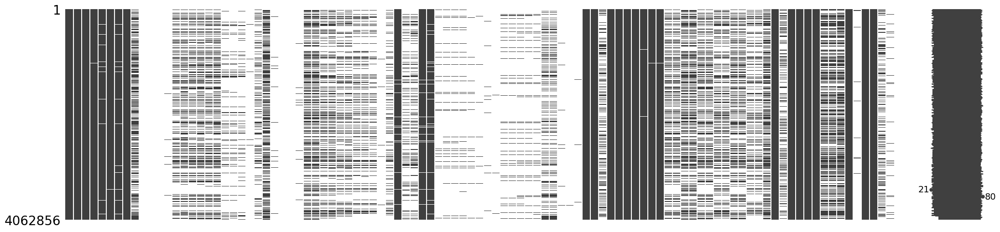
</picture>
    

