# <a id='toc1_'></a>[Bericht zur Datenqualität (epi2025_1)](#toc0_)

**Inhalt**<a id='toc0_'></a>    
- [Bericht zur Datenqualität (epi2025_1)](#toc1_)    
  - [Änderungen seit der letzten Version](#toc1_1_)    
  - [Hinweise](#toc1_2_)    
  - [Datenstand](#toc1_3_)    
  - [Fallzahlen im Verlauf der Jahreslieferungen](#toc1_4_)    
    - [original geliefert vor ZfKD Prüfungen](#toc1_4_1_)    
    - [jeweils letztes DJ nach ZfKD  Prüfungen](#toc1_4_2_)    
  - [Variablenverteilung](#toc1_5_)    
    - [Diagnosejahr](#toc1_5_1_)    
    - [Diagnosegruppen](#toc1_5_2_)    
    - [Diagnosesicherung](#toc1_5_3_)    
    - [DCO Diagramm](#toc1_5_4_)    
    - [DCO](#toc1_5_5_)    
    - [Angabe Register vs Bundesland](#toc1_5_6_)    
  - [Histologien](#toc1_6_)    
    - [Dignität](#toc1_6_1_)    
    - [Grading](#toc1_6_2_)    
    - [Altersgruppen Kinder und Heranwachsende](#toc1_6_3_)    
    - [UICC](#toc1_6_4_)    
    - [TNM-Auflage](#toc1_6_5_)    
    - [Tod](#toc1_6_6_)    
      - [Anteil Verstorbene](#toc1_6_6_1_)    
      - [Verteilung Todesursachen nach ICDT10](#toc1_6_6_2_)    

<!-- vscode-jupyter-toc-config
	numbering=false
	anchor=true
	flat=false
	minLevel=1
	maxLevel=6
	/vscode-jupyter-toc-config -->
<!-- THIS CELL WILL BE REPLACED ON TOC UPDATE. DO NOT WRITE YOUR TEXT IN THIS CELL -->

<br>

## <a id='toc1_1_'></a>[Änderungen seit der letzten Version](#toc0_)
<!-- - bisher wurden folgende Angaben in einer umfangreichen Verarbeitung im workflow umkodiert: `ICDGM10`, `HISC`, `ICDO3`, `DIG`. Diese Umformung wurde deaktiviert, es finden nun nur noch punktuelle Korrekturen statt -->
- Lieferung Daten mit **Diagnosejahr 2024**

<br>

## <a id='toc1_2_'></a>[Hinweise](#toc0_)
- Neben den Hinweisen zum Verständnis der Auswertungen sind auch häufig **Interpretationen** angefügt, diese sind optisch abgesetzt als **Notiz** erkennbar
- die jeweils angewendeten **Filter** sind für jede Auswertung dargestellt, jeweils zur besseren Einordnung als Anteil von der Gesamtzahl der Entität in unserer Datenbank
- die _relativen_ Barcharts enthalten ein `Total` item für den Gesamtvergleich
- die Filter können exakt nachvollzogen werden mit Hilfe der **ausklappbaren SQL Abfragen**
- in den Diagrammen gibt ebenfalls das angegebene _`n=`_ einen Hinweis auf die verwendete Grundgesamtheit
- der komplette Quellcode dieses Dokumentes ist [hier abrufbar](../../epi.ipynb)

<br>

## <a id='toc1_3_'></a>[Datenstand](#toc0_)

    database file:           2026-05-13_data_epi.duckdb
    data tag:                epi2025_1
    sql table created:       2026-05-13 09:31:01
    doi:                     10.18444/5.03.01.0005.0022.0001
    document created:        2026-05-22 15:38:43


    
    aktuellster batch               426
    aktuellstes Diagnosejahr 📆     (2024)


<div style="page-break-after: always;"></div>


<br>

## <a id='toc1_4_'></a>[Fallzahlen im Verlauf der Jahreslieferungen](#toc0_)
- kein Filter
- es werden Datenstände (_batch_) aus mehreren Lieferjahren dargestellt , welche über eine laufende Nummer sowie das Datum der Ausführung vergleichbar sind
- in Abgrenzung zu den klinischen Daten ist jede einzelne EKR Lieferung für das gesamte Lieferjahr gültig
- dargestellt sind die **letzten 5 veröffentlichten** Datenstände 

<br>

### <a id='toc1_4_1_'></a>[original geliefert vor ZfKD Prüfungen](#toc0_)
- die Übersicht macht erkennbar, wie sich die Fallzahlen absolut und relativ im Laufe der letzten Lieferungen entwickelt haben
- aufgeführt sind die Fallzahlen aus den überlieferten Dateien **vor** den ZfKD Anpassungen
- `batch_label` markiert den jeweils letzten offiziellen Datenstand des Lieferjahres, sowie den aktuellen Datenstand


    
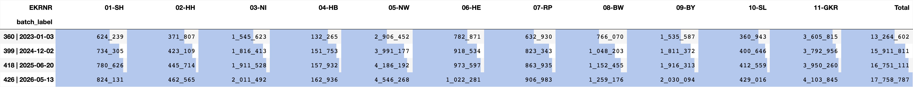
    


<br>

### <a id='toc1_4_2_'></a>[jeweils letztes DJ nach ZfKD  Prüfungen](#toc0_)
- Filter: jeweils das **letzte DJ** der einzelnen Jahreslieferung
- aufgeführt sind die Fallzahlen aus den überlieferten Dateien **nach** den ZfKD Anpassungen
<!-- - eine Aufschlüsselung von `11-GKR` wäre hier sinnhaft, allerdings  -->


    
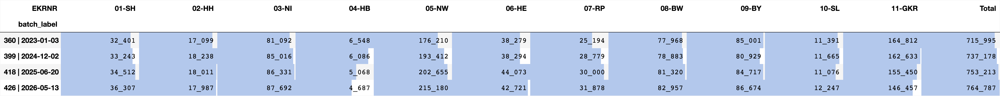
    


<div style="page-break-after: always;"></div>


<br>

## <a id='toc1_5_'></a>[Variablenverteilung](#toc0_)
<!-- - **Filter:**
  - **🚨 sofern nicht anders angegeben ist der Zeitraum beschränkt auf das höchste Diagnosejahr (für `epi2024`: 2023) 🚨**
  - Diagnosen: ausgeschlossen sind `C44` und alle `D` -->
- ab hier wird nur noch die **aktuelle Datenlieferung** dargestellt
- als ungültig markierte Fälle (_A-Prüfungen_) sind in allen Fallzahlen **ausgeschlossen**
- in den barplots sind die relativen Häufigkeiten von Variablen im Datensatz der Register aufgetragen
- zusätzlich ist die Angabe für alle Register enthalten (`Total`)
- näherungsweise sind **GKZ-Bundesländer** verwendet anstatt Lieferregister, um 11-16 aufspannen zu können

<br>

### <a id='toc1_5_1_'></a>[Diagnosejahr](#toc0_)


```
    n = 17_758_787                        (100.0%) 
    └ [nur gültige Fälle]: n = 17_038_328  (95.9%) 
    └ [DJ 2019-2025]:       n = 4_667_333  (26.3%) 
    └ [keine DCO]:          n = 4_446_303  (25.0%) 
    └ [keine C44,D04]:      n = 3_569_966  (20.1%)
```

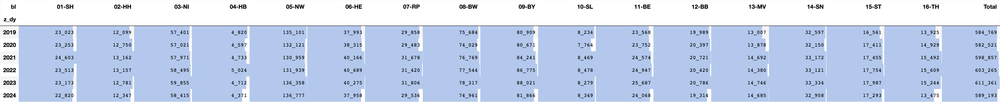
    


<br>

### <a id='toc1_5_2_'></a>[Diagnosegruppen](#toc0_)

> 💡 **ZfKD**: Auffallend ist vor allem der unterschiedlich hohe Anteil von C44 aufgrund unterschiedlicher Landesgesetze: Je nach Bundesland werden nicht-melanotische Hautkrebsformen unterschiedlich gemeldet oder vergütet. Während manche Länder noch alle Hauttumoren erfassen, konzentrieren sich andere bereits auf die &quot;prognostisch ungünstigen&quot; Verläufe, deren Erfassung im Rahmen der klinischen Krebsregistrierung seit 2023 von der GKV finanziert wird


```
    n = 17_758_787                        (100.0%) 
    └ [nur gültige Fälle]: n = 17_038_328  (95.9%) 
    └ [DJ 2024]:              n = 764_787   (4.3%)
```

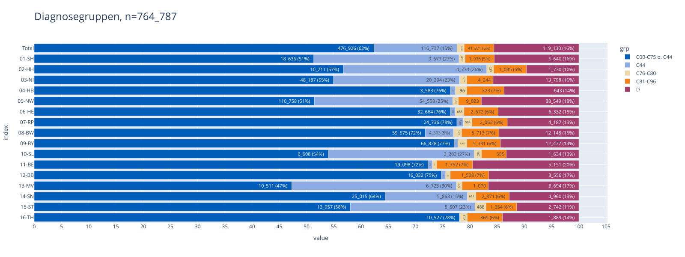
    


<br>

### <a id='toc1_5_3_'></a>[Diagnosesicherung](#toc0_)

> 💡 **ZfKD**
> - der Großteil der Meldungen basiert auf einer histologischen Sicherung der Diagnose
> - Der Anteil dieser Fälle hat in den ostdeutschen Registern zuletzt zugenommen
> - `08-BW` hat einen hohen Anteil an fehlenden Diagnosesicherungen mit zuletzt stark ansteigendem Trend
> - Der Anteil einer histologischen Sicherung einer Metastase ist insgesamt gering, zeigt aber teilweise deutliche Unterschiede zwischen den Registern (ca. zwischen 0 und 5%)


```
    n = 17_758_787                        (100.0%) 
    └ [nur gültige Fälle]: n = 17_038_328  (95.9%) 
    └ [DJ ab 2015]:         n = 7_675_888  (43.2%) 
    └ [keine C44,D04]:      n = 6_156_522  (34.7%)
```

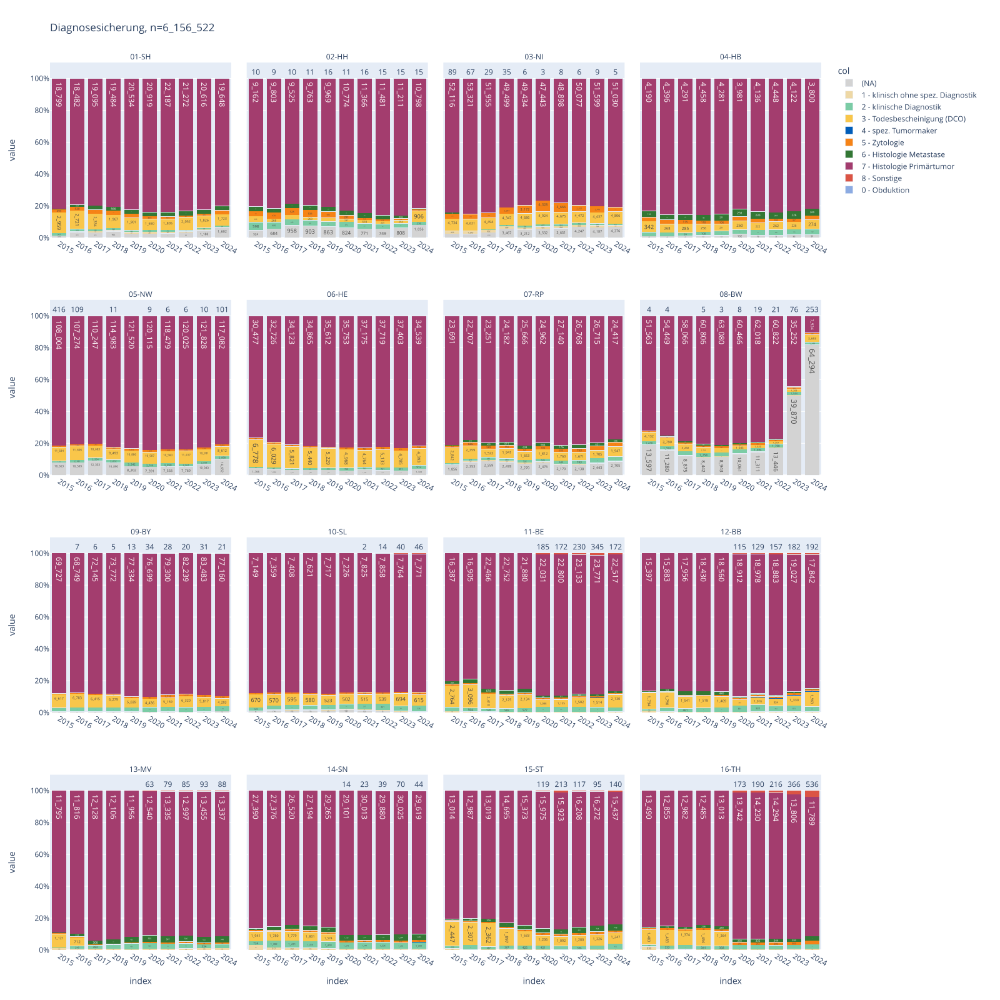
    


<!-- <br>


<br>

### <a id='toc1_5_4_'></a>[DCO Diagramm](#toc0_)
- **Filter: DJ = 2020-2024, C44 und D-Diagnosen sind ausgeschlossen, GKZbl 01-16**
- die epi Variable `DCO` wird wie folgt gebildet:
  - 1 wenn Diagnosesicherung = 3
  - sonst 2 (auch für Diagnosesicherung missing)  -->


<br>

### <a id='toc1_5_5_'></a>[DCO](#toc0_)
- Metrik: Anteil DCO an Gesamtfallzahl in %

> 💡 **ZfKD**
> - aus 08-BW sind in den ersten 6 Jahren nach Registerstart bewusst keine DCO-Fälle übermittelt worden
> - `13-MV` `14-SN` `16-TH` haben seit Beginn der klinischen Lieferungen aus den LKR fast keine DCO Fälle übermittelt


```
    n = 17_758_787                        (100.0%) 
    └ [nur gültige Fälle]: n = 17_038_328  (95.9%) 
    └ [ICD10 nur C]:       n = 15_030_686  (84.6%) 
    └ [keine C44,D04]:     n = 12_205_943  (68.7%) 
    └ [DJ ab 2010]:         n = 7_690_030  (43.3%)
```

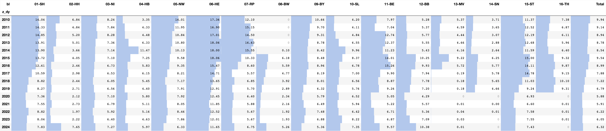
    


<br>

### <a id='toc1_5_6_'></a>[Angabe Register vs Bundesland](#toc0_)
- neue Bundesländer sind nicht aufgeführt, da Daten erst ab 2020 aus Länderregistern vorliegen
- Fälle ausserhalb des Einzugsbereichs werden im ZfKD ausgeschlossen (`A_EKRNR_GKZ_unplausibel`)

> 💡 **ZfKD**
> * generell wird angestrebt, dass die Fallübermittlung ausschließlich innerhalb des Einzugsbereichs stattfindet
> * `05-NW` übermittelt einen relativ hohen Anteil an Fällen aus anderen Bundesländern


```
    n = 17_758_787                (100.0%) 
    └ [keine NBL]: n = 13_654_942  (76.9%)
```

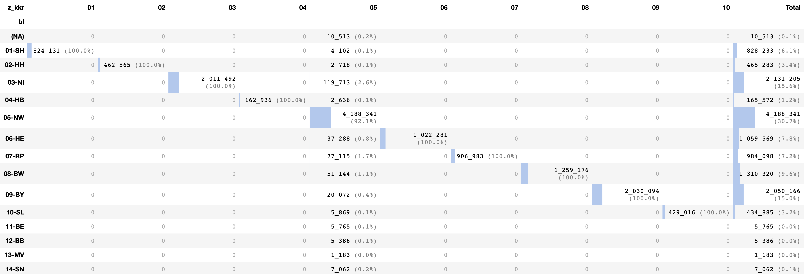
    


<br>

## <a id='toc1_6_'></a>[Histologien](#toc0_)


```
    n = 17_758_787                        (100.0%) 
    └ [nur gültige Fälle]: n = 17_038_328  (95.9%) 
    └ [DJ ab 2010]:        n = 11_293_487  (63.6%) 
    └ [keine C44,D04]:      n = 8_935_754  (50.3%) 
    └ [keine DCO]:          n = 8_284_161  (46.6%)
```

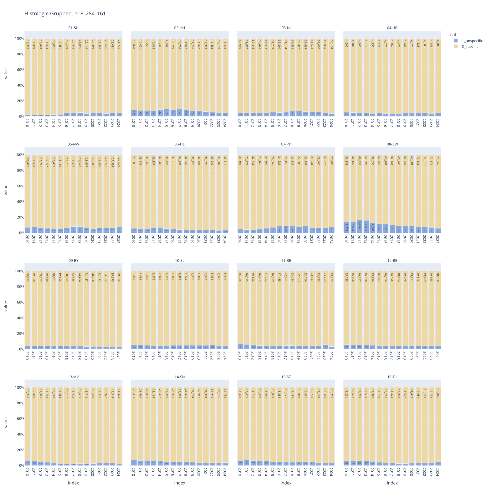
    


<br>

### <a id='toc1_6_1_'></a>[Dignität](#toc0_)

> 💡 **ZfKD**
> - keine gutartigen Fälle aus `01-SH`
> - keine gutartigen und Fälle unsicheren Verhaltens aus `02-HH`


```
    n = 17_758_787                        (100.0%) 
    └ [nur gültige Fälle]: n = 17_038_328  (95.9%) 
    └ [keine DCO]:         n = 15_591_317  (87.8%) 
    └ [keine C44,D04]:     n = 12_415_391  (69.9%)
```

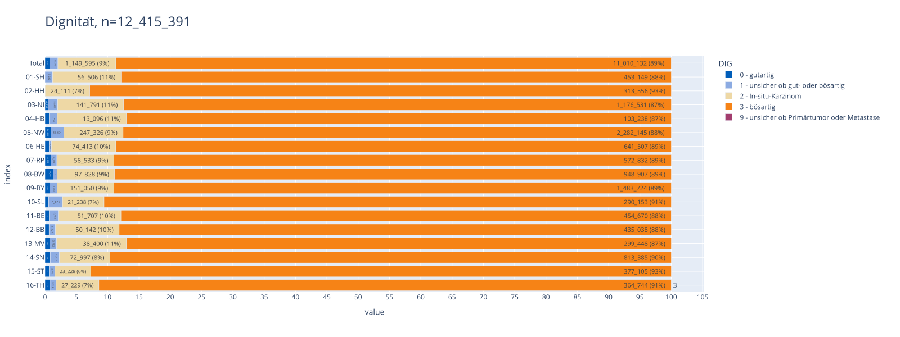
    


<br>

### <a id='toc1_6_2_'></a>[Grading](#toc0_)

> 💡 **ZfKD**: Es zeigen sich unterschiedlich hohe Anteile (0-20%) mit Verwendung des 3-stufigen Gradings (low-intermediate-high) je nach Bundesland


```
    n = 17_758_787                                  (100.0%) 
    └ [nur gültige Fälle]:           n = 17_038_328  (95.9%) 
    └ [DJ ab 2010]:                  n = 11_293_487  (63.6%) 
    └ [keine DCO]:                   n = 10_637_156  (59.9%) 
    └ [nur gradingrelevante Tumore]:  n = 3_693_956  (20.8%)
```

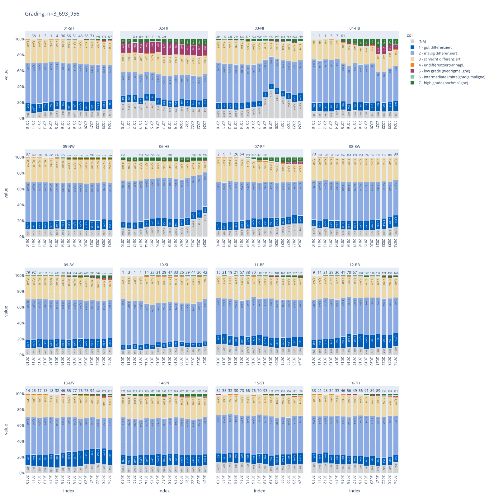
    


<br>

### <a id='toc1_6_3_'></a>[Altersgruppen Kinder und Heranwachsende](#toc0_)

> 💡 **ZfKD**: Die Abbildung zeigt deutlich, dass einige Register aktuell (fast) keine Fälle bei Kindern mehr erfassen, andere dagegen wahrscheinlich noch relativ vollständig


```
    n = 17_758_787                        (100.0%) 
    └ [nur gültige Fälle]: n = 17_038_328  (95.9%) 
    └ [DJ 2019-2025]:       n = 4_667_333  (26.3%) 
    └ [keine DCO]:          n = 4_446_303  (25.0%) 
    └ [keine C44,D04]:      n = 3_569_966  (20.1%) 
    └ [Alter <= 20]:           n = 13_955   (0.1%)
```

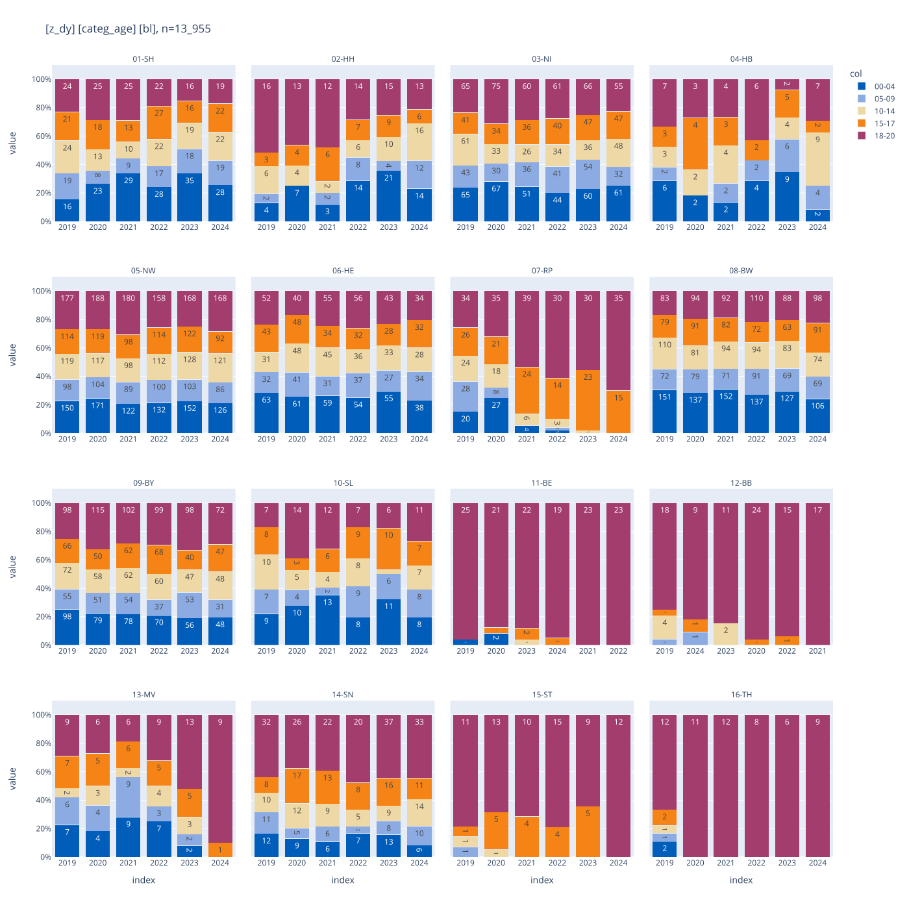
    


<br>

### <a id='toc1_6_4_'></a>[UICC](#toc0_)
- die Variable `UICC` wird vom ZfKD gebildet

> 💡 **ZfKD**: Bei TNM-relevanten Tumoren sind TNM-Angaben je nach BL in 42%-76% ausreichend für die Bildung des UICC-Stadiums (MX bzw. unbekannt wird als M0 gewertet) Diese Anteile aben sich in einigen Registern in den letzten 10 Jahren erhöht, in wenigen verringert


```
    n = 17_758_787                               (100.0%) 
    └ [nur gültige Fälle]:        n = 17_038_328  (95.9%) 
    └ [keine C44,D04]:            n = 13_852_611  (78.0%) 
    └ [keine DCO]:                n = 12_415_391  (69.9%) 
    └ [nur tnm-relevante Tumore]:  n = 8_940_895  (50.3%)
```

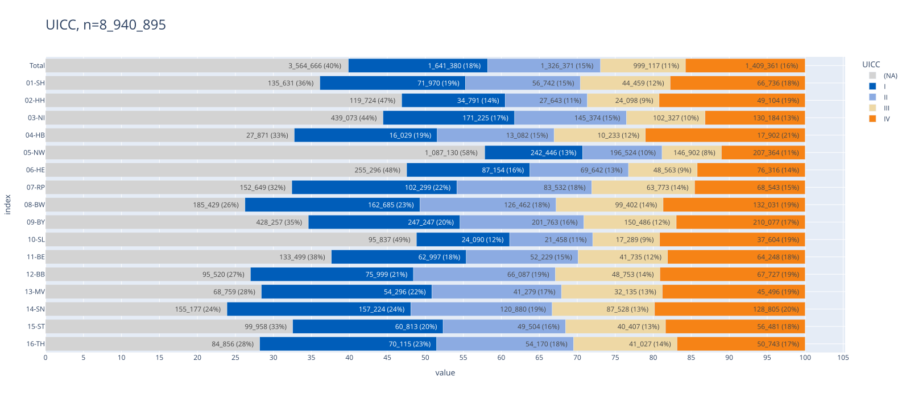
    


<br>

### <a id='toc1_6_5_'></a>[TNM-Auflage](#toc0_)
- nicht übermittelte Auflagen werden im ZfKD geschätzt und imputiert anhand des DJ, daher keine missings im Datensatz

> 💡 **ZfKD**: Auflage 7 wird nur noch von 03-NI in nennenswertem Umfang übermittelt


```
    n = 17_758_787                               (100.0%) 
    └ [nur gültige Fälle]:        n = 17_038_328  (95.9%) 
    └ [DJ ab 2010]:               n = 11_293_487  (63.6%) 
    └ [keine DCO]:                n = 10_637_156  (59.9%) 
    └ [nur tnm-relevante Tumore]:  n = 5_862_472  (33.0%)
```

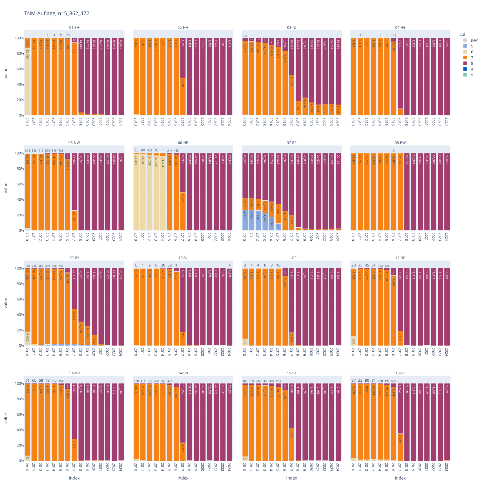
    


<br>

### <a id='toc1_6_6_'></a>[Tod](#toc0_)

#### <a id='toc1_6_6_1_'></a>[Anteil Verstorbene](#toc0_)
- gezählt sind **Personen**
- Metrik: Anteil Verstorbene

> 💡 **ZfKD**: 
> - auffallend (aber bekannt) ist hier der offensichtlich noch zu niedrige Anteil in TH
> - auch in einem Bezirk in Bayern (Oberbayern) ist der Mortalitätsabgleich zumindest für 2024 noch unvollständig


```
    count: distinct GLOBALPATID
    ---
    n = 15_146_405                        (100.0%) 
    └ [nur gültige Fälle]: n = 14_648_040  (96.7%) 
    └ [DJ 2020-2024]:       n = 3_611_701  (23.8%) 
    └ [keine C44,D04]:      n = 2_999_925  (19.8%)
```

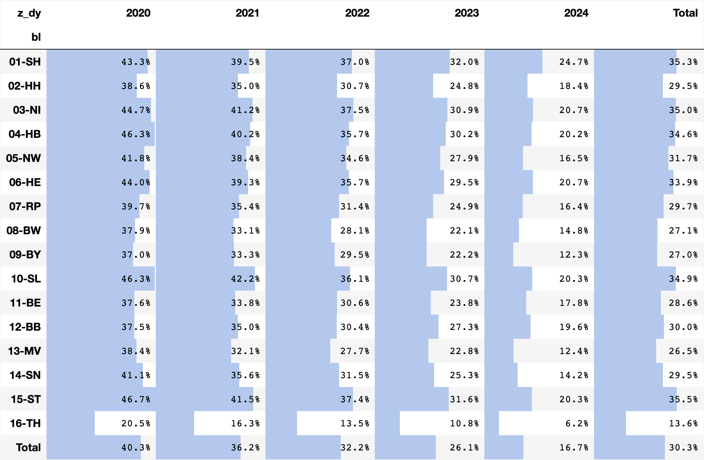
    


<br>

#### <a id='toc1_6_6_2_'></a>[Verteilung Todesursachen nach ICDT10](#toc0_)
- gezählt sind **Personen**
- `icdt10_1d` gibt die erste Stelle der Todesursache (TU) an

> 💡 **ZfKD**
> - mit steigender Beobachtungszeit steigt der Anteil von anderen Todesursachen natürlicherweise an
> - auffallend ist allerdings der in 2024 geringe (und zuletzt stark gesunkene) Anteil krebsbedingter Todesfälle in `09-BY`
> - in den westdeutschen Bundesländern sind zuletzt ganz überwiegend TU angegeben, aus den ostdeutschen Registern liegen aktuell keine Angaben vor.


```
    count: distinct GLOBALPATID
    ---
    n = 15_146_405                        (100.0%) 
    └ [nur gültige Fälle]: n = 14_648_040  (96.7%) 
    └ [nur Verstorbene]:    n = 7_576_084  (50.0%) 
    └ [SJ ab 2010]:         n = 5_116_941  (33.8%)
```

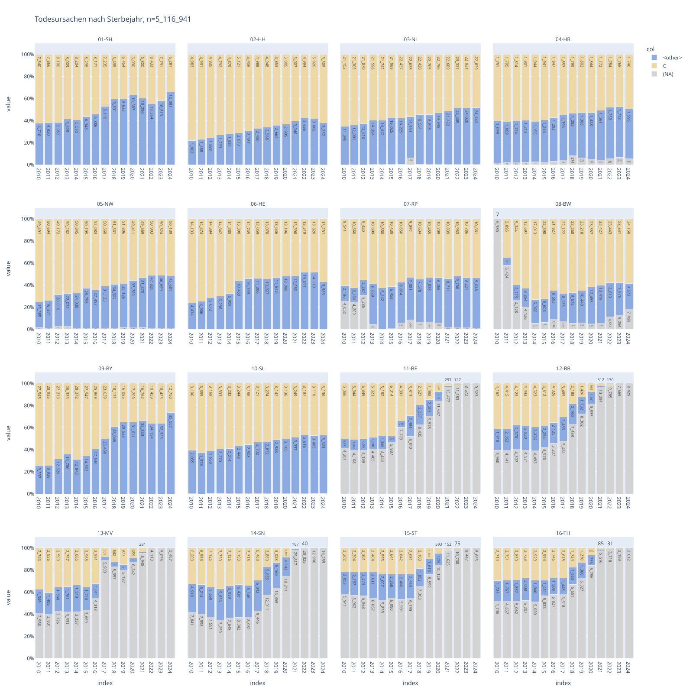
    

