# <a id='toc1_'></a>[# §12 Bericht](#toc0_)

**Table of contents**<a id='toc0_'></a>    
- [# §12 Bericht](#toc1_)    
  - [Datenstand](#toc1_1_)    
  - [⚙️ settings](#toc1_2_)    
  - [Bericht](#toc1_3_)    
    - [Aktualität](#toc1_3_1_)    
    - [Fallzahlen](#toc1_3_2_)    
    - [Vollständigkeit](#toc1_3_3_)    
      - [Personenangaben](#toc1_3_3_1_)    
      - [Grading](#toc1_3_3_2_)    
      - [TNM-T](#toc1_3_3_3_)    
        - [alle](#toc1_3_3_3_1_)    
        - [nur op](#toc1_3_3_3_2_)    
      - [weitere Tumorangaben](#toc1_3_3_4_)    
      - [Organmodule - Mamma](#toc1_3_3_5_)    
        - [Organmodule - Prostata](#toc1_3_3_5_1_)    
        - [Organmodule - Melanom](#toc1_3_3_5_2_)    
      - [Organmodule - Darm](#toc1_3_3_6_)    
      - [Verteilung Diagnosesicherung](#toc1_3_3_7_)    
      - [T Stadium](#toc1_3_3_8_)    
    - [Therapie](#toc1_3_4_)    
      - [Anteil Fälle ohne Therapie 1](#toc1_3_4_1_)    
      - [Anteil Fälle ohne Therapie 2](#toc1_3_4_2_)    
      - [Anteil Fälle ohne Therapie 3](#toc1_3_4_3_)    
      - [ops wenn op](#toc1_3_4_4_)    
      - [op wenn op erwartet](#toc1_3_4_5_)    
        - [C50](#toc1_3_4_5_1_)    
        - [C43](#toc1_3_4_5_2_)    
        - [C18-C20](#toc1_3_4_5_3_)    
        - [C62](#toc1_3_4_5_4_)    
      - [st wenn st erwartet](#toc1_3_4_6_)    
      - [sy wenn sy erwartet](#toc1_3_4_7_)    
      - [Anteil Fälle ohne R-Status nach OP wenn hohe Relevanz des R-Status](#toc1_3_4_8_)    
      - [Anteil Rezidive](#toc1_3_4_9_)    
        - [C50](#toc1_3_4_9_1_)    
        - [C18-C20](#toc1_3_4_9_2_)    
    - [date periods](#toc1_3_5_)    
      - [Anzahl Tage Diagnose Tod](#toc1_3_5_1_)    
      - [Anzahl Tage Diagnose OP](#toc1_3_5_2_)    

<!-- vscode-jupyter-toc-config
	numbering=false
	anchor=true
	flat=false
	minLevel=1
	maxLevel=6
	/vscode-jupyter-toc-config -->
<!-- THIS CELL WILL BE REPLACED ON TOC UPDATE. DO NOT WRITE YOUR TEXT IN THIS CELL -->

    🐍 3.12.8 | 📦 pandas: 2.3.3 | 📦 numpy: 1.26.4 | 📦 duckdb: 1.4.2 | 📦 pandas-plots: 0.24.0 | 📦 connection-helper: 0.13.2


## <a id='toc1_1_'></a>[Datenstand](#toc0_)

    database file:           2025-11-11_data_clin.duckdb
    data tag:                v2.3
    last kkr data import:    2025-09-30
    sql table created:       2025-11-11 11:52:01
    doi:                     10.18444/5.03.01.0005.0021.0002
    document created:        2025-12-19 16:21:46


## <a id='toc1_2_'></a>[⚙️ settings](#toc0_)

## <a id='toc1_3_'></a>[Bericht](#toc0_)

### <a id='toc1_3_1_'></a>[Aktualität](#toc0_)
- `kkr` = Klinisches Krebsregister
- `Lieferdatum` = Datum der letzten Übermittlung durch die KKR
- `Diagnosemonat` = letzter Diagnosemonat in den Daten
- `Lieferdatum` ist über das Jahr 2025 verteilt, Grund sind Nachlieferungen von einigen KKR

> einige KKR haben bereits (wenige) aktuelle Fälle in der Lieferung (z.B. `06-HE` mit Fällen aus `2025-04`)


    
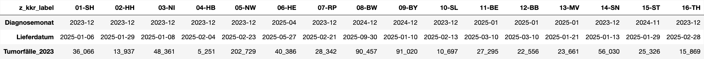
    


### <a id='toc1_3_2_'></a>[Fallzahlen](#toc0_)
- in den Darstellungen sind keine Filter angewendet, solange nicht explizit angegeben
- aufgespannt sind die Fallzahlen für Lieferregister und Elementknoten
- kein Filter, "Altfälle" (DJ < 2020) sind also enthalten
- die `%` Werte sowie die farbigen Datenbalken zeigen das relative Gewicht jedes KKR an "D gesamt" (`Total` Zeile)
- Erklärung für einige Elementknoten: (_cnt = count/Fallzahl)
  - `weitere_diag_cnt` = Weitere Klassifikation im Elementknoten "Diagnose"
  - `weitere_folge_cnt` = Weitere Klassifikation im Elementknoten "Folgeereignis"
  - `fm_folge_cnt`= Fernmetastasen im Elementknoten "Folgeereignis"
  - `fm_diag_cnt` = Fernmetastasen im Elementknoten "Diagnose"
  - `tnm_folge_cnt` = TNM im Elementknoten "Folgeereignis"

> inzwischen liegen fast alle Elemente flächendeckend vor. Ausnahmen sind `Applikationsart`, `Folgeereignisse`, `Protokolle` / `Substanzen`
>
> an den 3,2 Mio Tumorfällen in der Lieferung hat `05-NW` den höchsten Anteil
>
> an der Verteilung bei den Tumorfällen können andere Anteile gemessen werden: so ist `08-BW` bei den Folgeereignissen deutlich überrepräsentiert (30% bei Folgeereignissen ggü. 11% bei Tumoren)
>
> einige KKR liefern pro Strahlentherapie genau eine Teilbestrahlung (erkennbar an den gleichen Werten bei diesen Elementen)


    
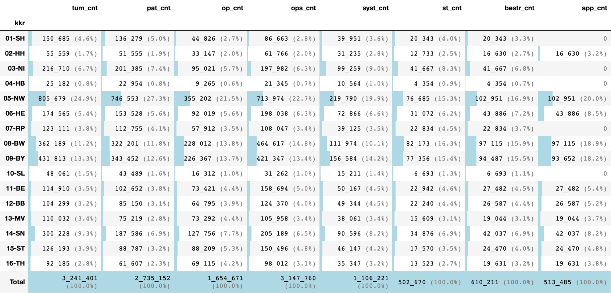
    


    
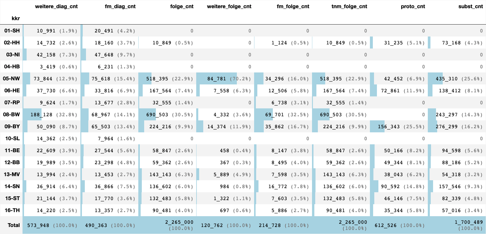
    


### <a id='toc1_3_3_'></a>[Vollständigkeit](#toc0_)

- es sind folgende Schwellwerte angezeigt:
  - 🟩 0% bis <5%
  - 🟨 5% bis <100%
  - 🟥 bei 100%
- **Filter: `DJ` 2020-2023** Weitere Filter sind extra aufgeführt
- dargestellt sind Variablen aus dem Schema in folgender Notation: `[Elementknoten]Variablenname`
- **Missings**
  - die graumelierte `0` kennzeichnet einen leeren Wert (=keine missings), 0% entsteht durch Rundung von kleinen Werten
- **Unbekannt** Kodierungen
    -  Grading: (U, T)
    -  Morphologie_Code: 8000-8011, 9590, 9591, 9800, 9801, 8050
    -  Lokalisation_Code: C26, C39, C76, C80,  C14.0, C57.9, C63.9, C68.9, C72.9, C75.9
    -  Diagnose_ICD10_Code: ('C80','C80.0', 'C80.1', 'C80.9', 'C79.9')
    -  Diagnosesicherung: 9
    -  Intention, Seite_Zielgebiet, Seitenlokalisation: U
    -  Datum_Genauigkeit: ('M','V')
    -  alles anderen: ('U', 'X', 'VX', 'SX', 'okk')

#### <a id='toc1_3_3_1_'></a>[Personenangaben](#toc0_)

> Personenangaben liegen komplett vollständig vor
>
> `Datum_Vitalstatus` ist in einigen Fällen geschätzt (bis zu 4% on `16-TH`), Geburtsdatum hingegen sehr selten (Datum 1900 ist nicht berücksichtigt)


    
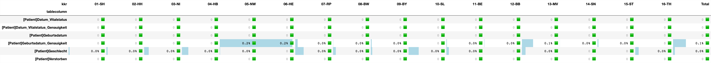
    


    
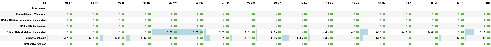
    


#### <a id='toc1_3_3_2_'></a>[Grading](#toc0_)
- **Filter: `DJ` 2020-2023, `DCO` = N, `ICD10`: C00-C33, C50-C57, C60-C68, `Morphologie`: 8010-8576**


    
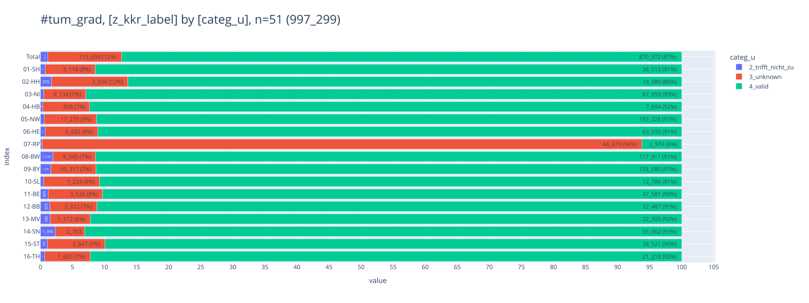
    


#### <a id='toc1_3_3_3_'></a>[TNM-T](#toc0_)

##### <a id='toc1_3_3_3_1_'></a>[alle](#toc0_)
- **Filter: `DJ` 2020-2023, `DCO` = N, `ICD10`: C00-C75 außer: C26, C39, C55, C14.0, C57.9, C63.9, C68.9, `Morphologie`: 8010-8790**


    
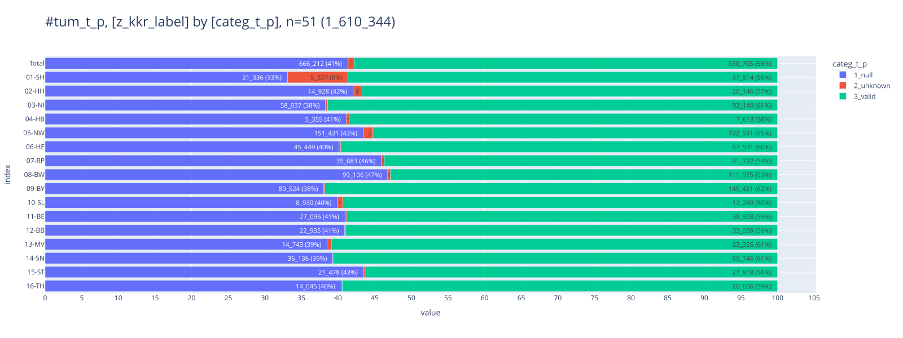
    


##### <a id='toc1_3_3_3_2_'></a>[nur op](#toc0_)
- **Filter: wie oben, aber nur mit dokumentiertem OPS aus Kapitel 5**


    
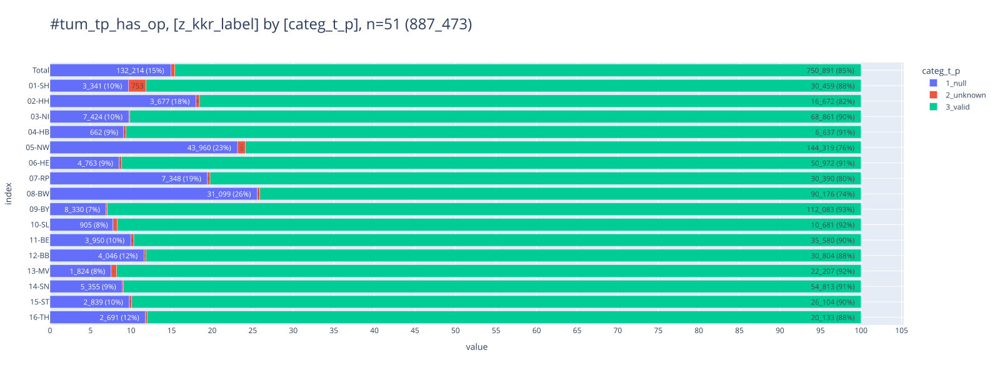
    


#### <a id='toc1_3_3_4_'></a>[weitere Tumorangaben](#toc0_)
- **Filter: `DJ` 2020-2023, `DCO` = N, `ICD10` kein C44**
> `Diagnosesicherung` ist komplett bzw. überwiegend vollständig, weist jedoch viele Unbekannt Kodierungen auf


    
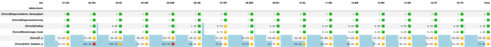
    


    
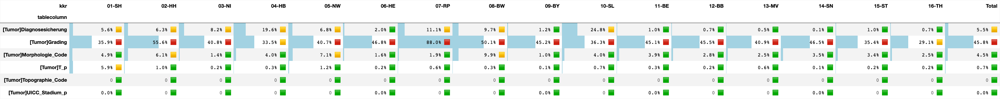
    


    Filter: 
        z_dy between 2020 and 2023
        and not z_is_dco
        and z_icd10_3d not in ('C44','D04')
    


    
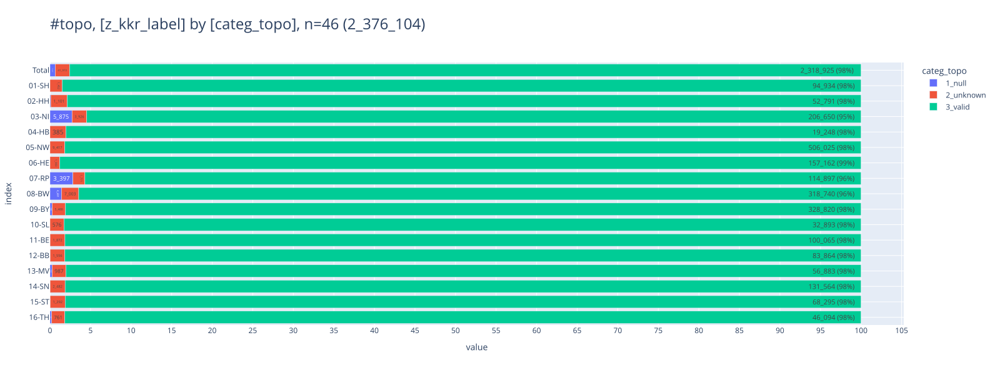
    


#### <a id='toc1_3_3_5_'></a>[Organmodule - Mamma](#toc0_)
- **Filter: `DJ` 2020-2023, `DCO` = N, `ICD10` = C50**
> keine Angaben aus `02-HH` übermittelt (gilt für alle Organmodule)


    
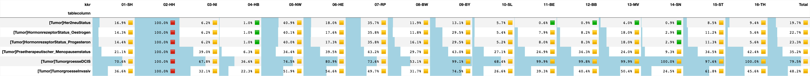
    


    
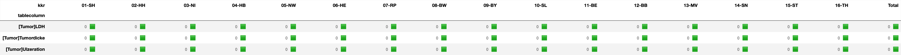
    


##### <a id='toc1_3_3_5_1_'></a>[Organmodule - Prostata](#toc0_)
- **Filter: `DJ` 2020-2023, `DCO` = N, `ICD10` = C61**


    
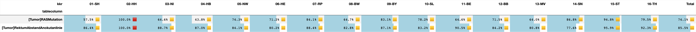
    


    
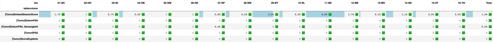
    


##### <a id='toc1_3_3_5_2_'></a>[Organmodule - Melanom](#toc0_)
- **Filter: `DJ` 2020-2023, `DCO` = N, `ICD10` = C43**


    
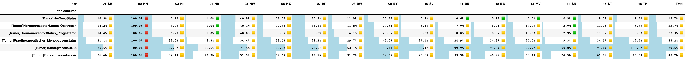
    


    

    


#### <a id='toc1_3_3_6_'></a>[Organmodule - Darm](#toc0_)
- **Filter: `DJ` 2020-2023, `DCO` = N, `ICD10` = C18, C19, C20**


    
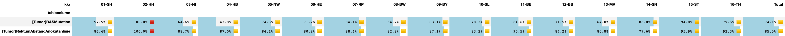
    


    
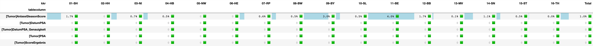
    


#### <a id='toc1_3_3_7_'></a>[Verteilung Diagnosesicherung](#toc0_)
- **Filter: `DJ` 2020-2023**

> keine DCO Kodierungen in `03-NI`, `13-MV`, `15-ST`, `16-TH`  
>
> `>20%` Unbekannt in `10-SL`


    
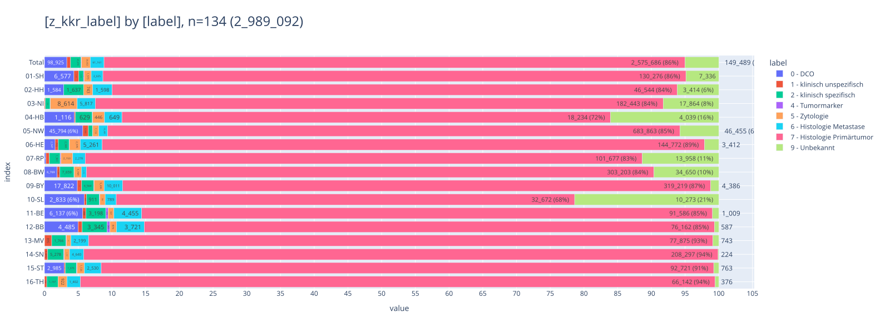
    


#### <a id='toc1_3_3_8_'></a>[T Stadium](#toc0_)
- **Filter: `DJ` 2020-2023, `DCO` = N, `ICD10`: C00-C75 außer: C26, C39, C55, C14.0, C57.9, C63.9, C68.9, `Morphologie`: 8010-8790**
- Kategorien
  - `1_t_cp` - cT und pT sind vorhanden und nicht `X`
  - `2_t_c`- cT ist vorhanden und nicht `X`, pT ist leer
  - `3_t_p`- pT ist vorhanden und nicht `X`, cT ist leer
  - `4_no_t`- beide leer


    
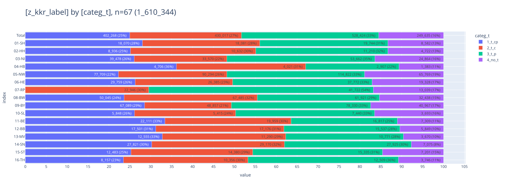
    


### <a id='toc1_3_4_'></a>[Therapie](#toc0_)

#### <a id='toc1_3_4_1_'></a>[Anteil Fälle ohne Therapie 1](#toc0_)

- **Filter: `DJ` = 2020-2023, `DCO` = N, `ICD10` nur solide Tumoren** (_solide Tumoren_ schliesst folgende Diagnosen _aus_: C44, C70-C72, C76-C97, alle D)
- ein Wert von bspw. 0.68 ist zu interpretieren als: _"68% aller Tumorfälle im KKR haben keine zugeordneten OP Angaben, die restlichen 32% mindestens eine."_
- `treat_missing_per_tum` stellt den Anteil Fälle dar, bei denen keinerlei Therapieangabe (OP, ST, SYST) vorliegt
- in der Darstellung sind die Max/Min Werte pro Kennzahl mit 🟥/🟩 markiert (kleiner ist besser)
> 💡 `ZfKD`: _aus `st_missing_per_tum` lässt sich ablesen, dass ~23% der Tumoren deutschlandweit mind. eine ST zugeordnet ist (Total: 1 - 0.77 = 0.23). Das entspricht in etwa der Annahme von 30% Anteil von Strahlentherapien an primären Diagnosen_


    
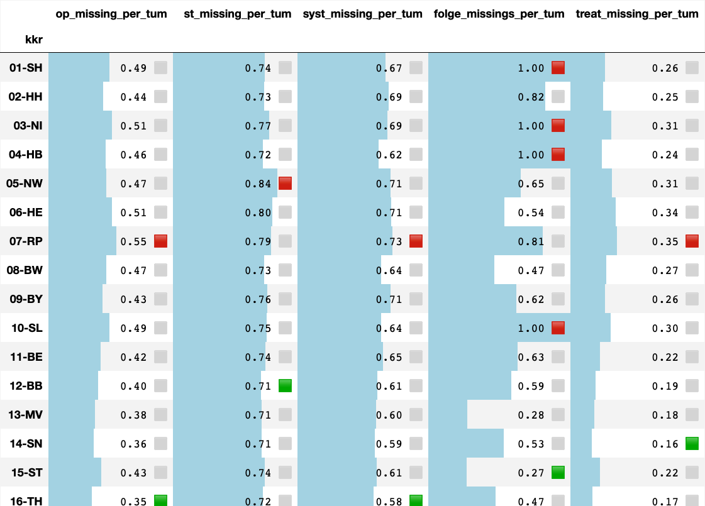
    


#### <a id='toc1_3_4_2_'></a>[Anteil Fälle ohne Therapie 2](#toc0_)

- **Filter: `DJ` = 2020-2023 (1. Halbjahr), `DCO` = N, kein `C44` / `D04`, keine D Diagnosen**

    Filter: 
        not z_is_dco
        and z_icd10_3d not in ('C44','D04')
        and Diagnosedatum between '2020-01-01' and '2023-06-30'
        and left(z_icd10_3d,1) in ('C')
    


    

    


#### <a id='toc1_3_4_3_'></a>[Anteil Fälle ohne Therapie 3](#toc0_)

    Filter: 
        not z_is_dco
        and z_icd10_3d not in ('C44','D04')
        and Diagnosedatum between '2020-01-01' and '2023-06-30'
        and left(z_icd10_3d,1) in ('C')
        and ifnull(z_m_pc_1,'') <> '1'
        and ifnull(z_period_diag_death_day,181) >= 180
        and z_age < 80
    


    

    


#### <a id='toc1_3_4_4_'></a>[ops wenn op](#toc0_)
- **Filter: `DJ` = 2020-2023**


    
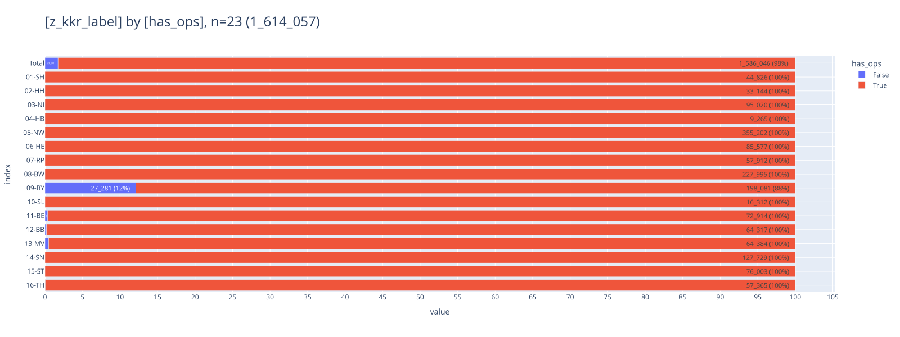
    


#### <a id='toc1_3_4_5_'></a>[op wenn op erwartet](#toc0_)
- kategorien
  - `1_op`: ops im definierten Bereich (3Steller) ist dokumentiert
  - `2_no_op_but_tp`: keine ops, aber pT 0-4 ist dokumentiert
  - `3_no_op_tp_but_other`: weder noch, aber ST oder SYST mit OP Stellung `O` ist dokumentiert
  - `4_no_treat`: keines der genannten trifft zu


```python
    counts: rows
    ---
    n = 3_241_401                                    (100.0%) ██████████████████████████████
    └ [2020-2023]:                     n = 2_989_092  (92.2%) ░░░███████████████████████████
    └ [keine M1]:                      n = 2_715_663  (83.8%) ░░░░░█████████████████████████
    └ [keine Verstorbenen < 180 Tage]: n = 2_423_924  (74.8%) ░░░░░░░░██████████████████████
    └ [C50]:                             n = 283_195   (8.7%) ░░░░░░░░░░░░░░░░░░░░░░░░░░░░██
    └ [unter 80 Jahre]:                  n = 237_448   (7.3%) ░░░░░░░░░░░░░░░░░░░░░░░░░░░░██
```

##### <a id='toc1_3_4_5_1_'></a>[C50](#toc0_)

    Filter: ifnull(z_period_diag_death_day,181) >= 180 and ifnull(z_m_pc_1,'') <> '1' and z_dy between 2020 and 2023 and z_icd10_3d = 'C50'


    
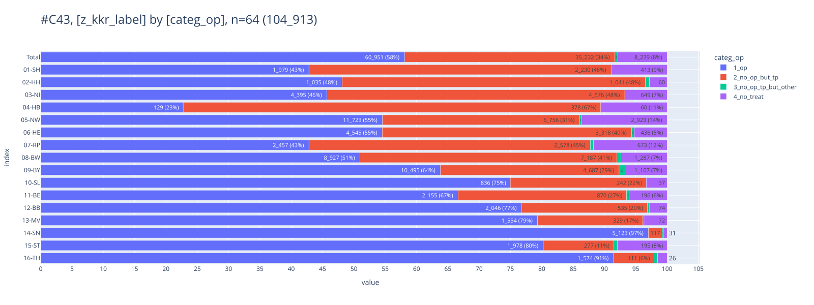
    


    Filter: ifnull(z_period_diag_death_day,181) >= 180 and ifnull(z_m_pc_1,'') <> '1' and z_dy between 2020 and 2023 and z_icd10_3d = 'C50' and z_age < 80


    
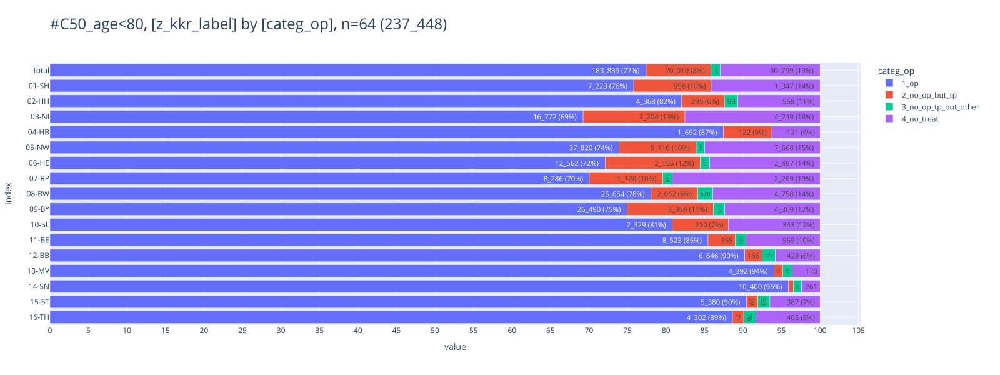
    


##### <a id='toc1_3_4_5_2_'></a>[C43](#toc0_)

    Filter: ifnull(z_period_diag_death_day,181) >= 180 and ifnull(z_m_pc_1,'') <> '1' and z_dy between 2020 and 2023 and z_icd10_3d = 'C43'


    

    


    Filter: ifnull(z_period_diag_death_day,181) >= 180 and ifnull(z_m_pc_1,'') <> '1' and z_dy between 2020 and 2023 and z_icd10_3d = 'C43' and z_age < 80


    
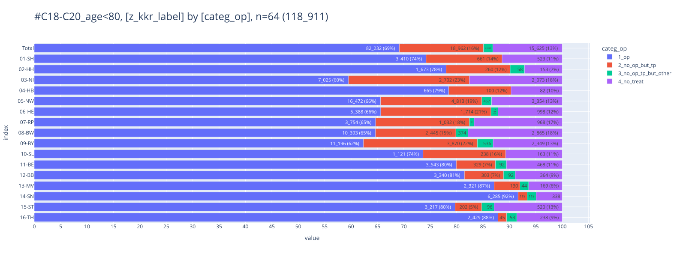
    


##### <a id='toc1_3_4_5_3_'></a>[C18-C20](#toc0_)

    Filter: ifnull(z_period_diag_death_day,181) >= 180 and ifnull(z_m_pc_1,'') <> '1' and z_dy between 2020 and 2023 and z_icd10_3d in ('C18', 'C19', 'C20')


    
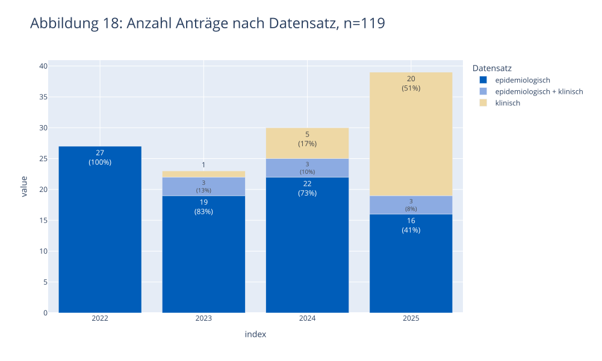
    


    Filter: ifnull(z_period_diag_death_day,181) >= 180 and ifnull(z_m_pc_1,'') <> '1' and z_dy between 2020 and 2023 and z_icd10_3d in ('C18', 'C19', 'C20') and z_age < 80


    
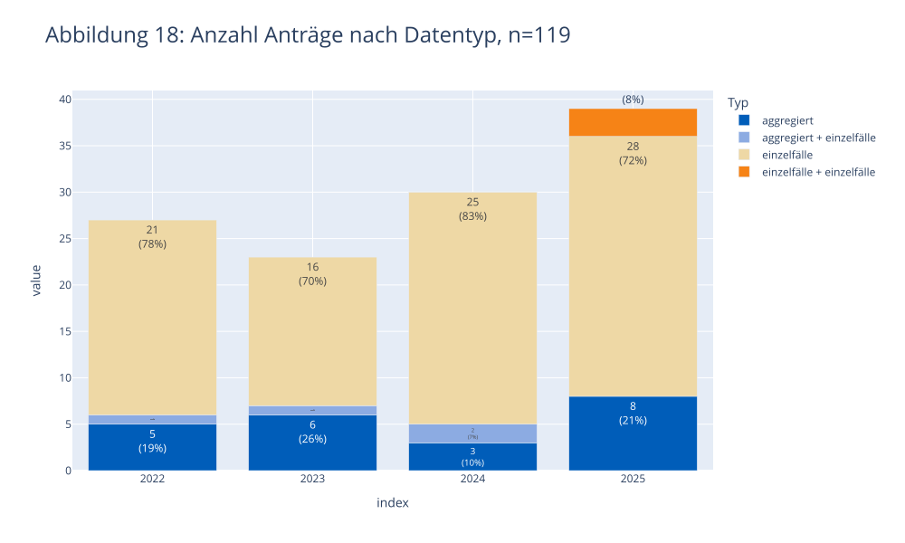
    


##### <a id='toc1_3_4_5_4_'></a>[C62](#toc0_)

    Filter: ifnull(z_period_diag_death_day,181) >= 180 and ifnull(z_m_pc_1,'') <> '1' and z_dy between 2020 and 2023 and z_icd10_3d in ('C62')


    
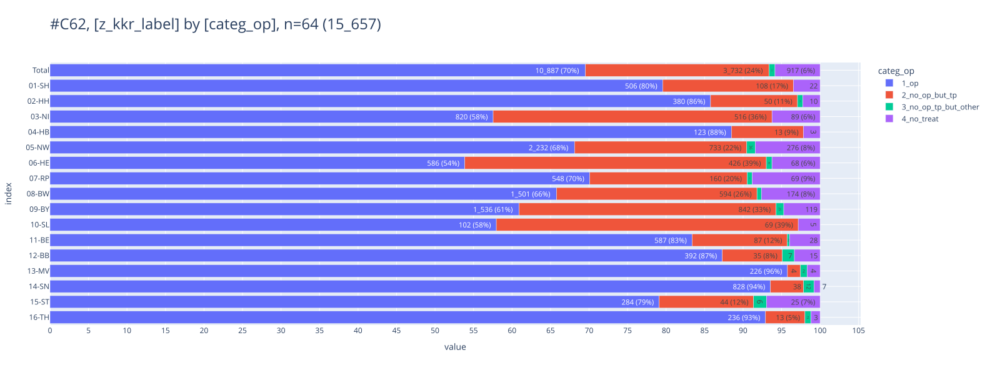
    


    Filter: ifnull(z_period_diag_death_day,181) >= 180 and ifnull(z_m_pc_1,'') <> '1' and z_dy between 2020 and 2023 and z_icd10_3d in ('C62') and z_age < 80


    
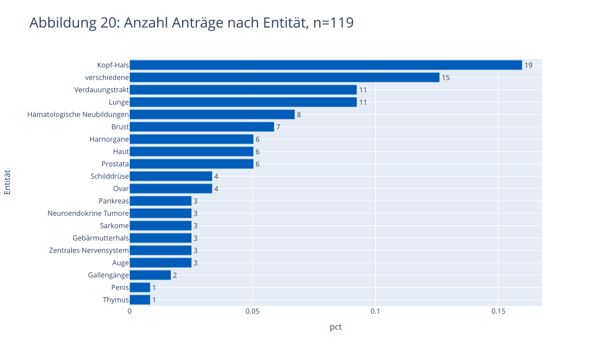
    


#### <a id='toc1_3_4_6_'></a>[st wenn st erwartet](#toc0_)


```python
    counts: distinct z_tum_id
    ---
    n = 3_241_401                                    (100.0%) ██████████████████████████████
    └ [2020-2023.07]:                  n = 2_633_644  (81.3%) ░░░░░░████████████████████████
    └ [keine M1]:                      n = 2_390_195  (73.7%) ░░░░░░░░██████████████████████
    └ [keine Verstorbenen < 180 Tage]: n = 2_133_196  (65.8%) ░░░░░░░░░░░███████████████████
    └ [C50]:                             n = 248_991   (7.7%) ░░░░░░░░░░░░░░░░░░░░░░░░░░░░██
    └ [OPS: BET]:                        n = 143_832   (4.4%) ░░░░░░░░░░░░░░░░░░░░░░░░░░░░░█
```

    Filter: ifnull(z_period_diag_death_day,181) >= 180 and ifnull(z_m_pc_1,'') <> '1' and Diagnosedatum between '2020-01-01' and '2023-06-30' and left(Code,5) in ('5-870') and z_icd10_3d = 'C50'


    
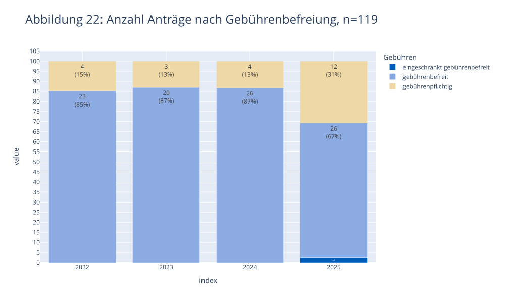
    


#### <a id='toc1_3_4_7_'></a>[sy wenn sy erwartet](#toc0_)


```python
    counts: rows
    ---
    n = 3_241_401                                                      (100.0%) ██████████████████████████████
    └ [2020-2023.07]:                                    n = 2_633_644  (81.3%) ░░░░░░████████████████████████
    └ [not z_is_dco]:                                    n = 2_547_636  (78.6%) ░░░░░░░███████████████████████
    └ [keine M1]:                                        n = 2_305_215  (71.1%) ░░░░░░░░░█████████████████████
    └ [keine Verstorbenen < 180 Tage]:                   n = 2_132_064  (65.8%) ░░░░░░░░░░░███████████████████
    └ [z_icd10 in ('C91.0', 'C92.0', 'C83.3', 'C82.4')]:    n = 27_653   (0.9%) ░░░░░░░░░░░░░░░░░░░░░░░░░░░░░░
```

    Filter: ifnull(z_period_diag_death_day,181) >= 180 and ifnull(z_m_pc_1,'') <> '1' and Diagnosedatum between '2020-01-01' and '2023-06-30' and left(Code,5) in ('5-870') and z_icd10_3d = 'C50'


    
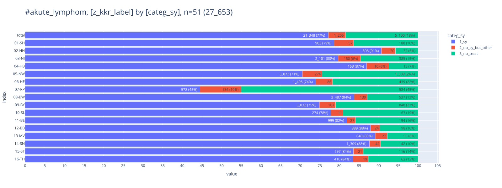
    


    Filter: ifnull(z_period_diag_death_day,181) >= 180 and ifnull(z_m_pc_1,'') <> '1' and Diagnosedatum between '2020-01-01' and '2023-06-30' and left(Code,5) in ('5-870') and z_icd10_3d = 'C50'


    
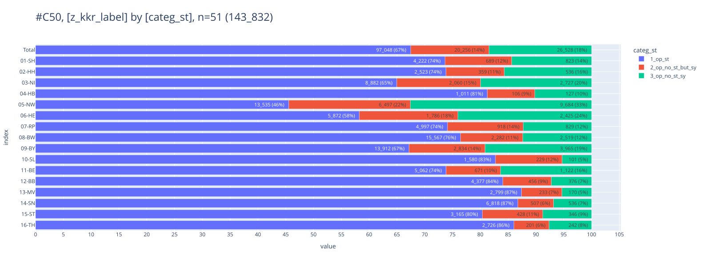
    


#### <a id='toc1_3_4_8_'></a>[Anteil Fälle ohne R-Status nach OP wenn hohe Relevanz des R-Status](#toc0_)
- gezählt sind nun Tumore, nicht mehr OP
- `r_status`
  - `1_R0`: wenn >= 1 OP zum Tumor dokumentiert is mit `R0`
  - `2_R1_R2`: wenn kein `R0` dokumentiert, aber >= 1 OP mit `R1` oder `R2`
  - `3_NA_U_RX`: wenn beides nicht zutrifft (Feld ist leer, `U` oder `RX`)

    z_dy between 2020 and 2023 and z_icd10_3d = 'C50' and z_tum_op_count > 0


    
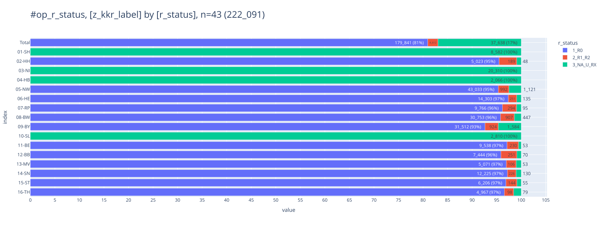
    


    
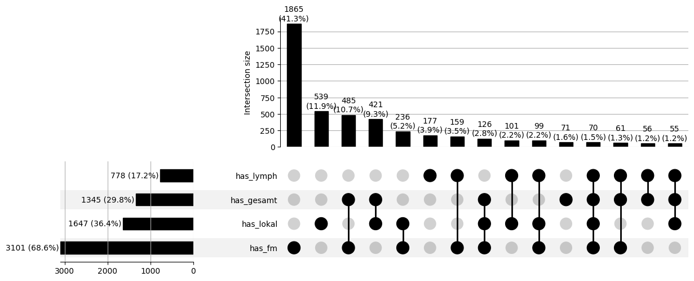
    


#### <a id='toc1_3_4_9_'></a>[Anteil Rezidive](#toc0_)

##### <a id='toc1_3_4_9_1_'></a>[C50](#toc0_)


```python
    counts: distinct z_tum_id
    ---
    n = 3_241_401                                    (100.0%) ██████████████████████████████
    └ [2020-2021]:                     n = 1_495_715  (46.1%) ░░░░░░░░░░░░░░░░░█████████████
    └ [keine M1]:                      n = 1_355_097  (41.8%) ░░░░░░░░░░░░░░░░░░████████████
    └ [C50]:                             n = 146_979   (4.5%) ░░░░░░░░░░░░░░░░░░░░░░░░░░░░░█
    └ [R0]:                               n = 89_812   (2.8%) ░░░░░░░░░░░░░░░░░░░░░░░░░░░░░░
    └ [keine Verstorbenen < 180 Tage]:    n = 89_461   (2.8%) ░░░░░░░░░░░░░░░░░░░░░░░░░░░░░░
```

    Filter: z_dy between 2020 and 2021 and ifnull(z_m_pc_1,'') <> '1' and upper(left(Lokale_Beurteilung_Residualstatus,2)) = 'R0' and ifnull(z_period_diag_death_day,181) >= 180 and z_icd10_3d = 'C50'


    

    


    n = 89_461 | n(true) = 4_521


    
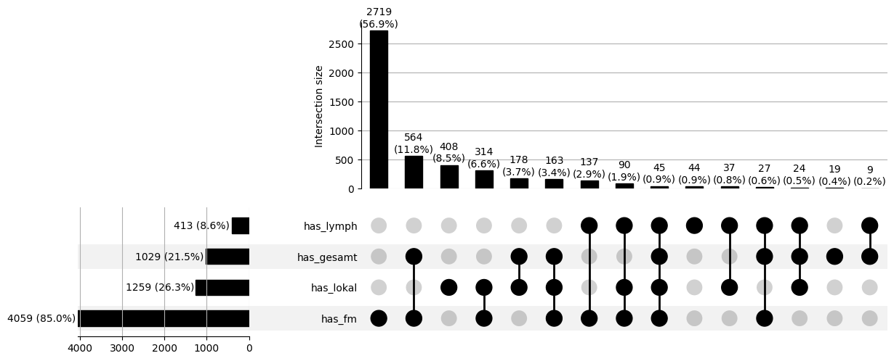
    


##### <a id='toc1_3_4_9_2_'></a>[C18-C20](#toc0_)

    Filter: z_dy between 2020 and 2021 and ifnull(z_m_pc_1,'') <> '1' and upper(left(Lokale_Beurteilung_Residualstatus,2)) = 'R0' and ifnull(z_period_diag_death_day,181) >= 180 and z_icd10_3d in ('C18','C19','C20')


    
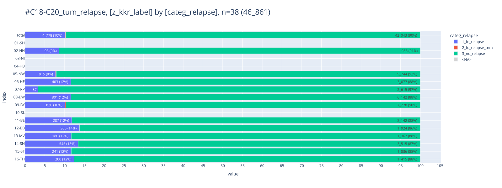
    


    n = 46_861 | n(true) = 4_778


    

    


### <a id='toc1_3_5_'></a>[date periods](#toc0_)

#### <a id='toc1_3_5_1_'></a>[Anzahl Tage Diagnose Tod](#toc0_)


    
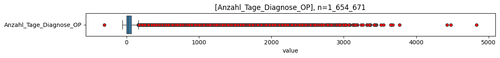
    


    
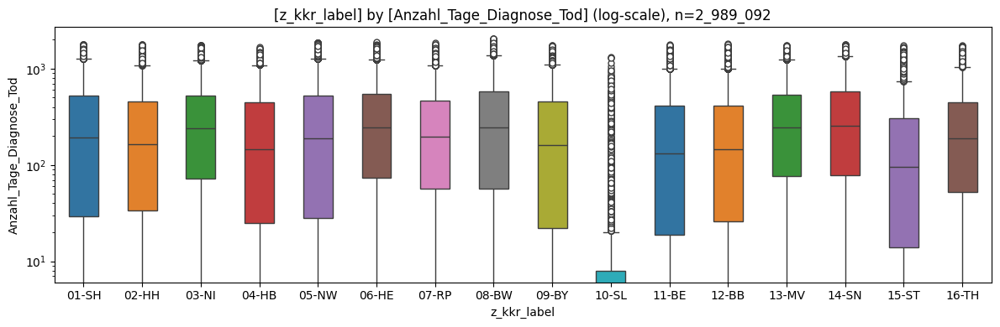
    


    
    column (n = 2_989_092)   |    present    |   min   | lower |  q25  | median |  mean  |  q75   | upper |  max  |  std   |  cv 
    -------------------------+---------------+---------+-------+-------+--------+--------+--------+-------+-------+--------+-----
    Anzahl_Tage_Diagnose_Tod | 807_950 (27%) | -27_320 |  -212 | 41.00 | 198.00 | 330.51 | 509.00 | 1_211 | 2_043 | 368.03 | 1.11
    
    
    item (n = 2_989_092) |  count  |   min   | lower |  q25  | median |  mean  |  q75   | upper |  max  |  std   |  cv 
    ---------------------+---------+---------+-------+-------+--------+--------+--------+-------+-------+--------+-----
    01-SH                |  40_150 |       0 |     0 | 29.00 | 193.00 | 336.30 | 527.00 | 1_274 | 1_783 | 381.00 | 1.13
    02-HH                |  17_898 |       0 |     0 | 34.00 | 163.00 | 301.57 | 456.00 | 1_089 | 1_784 | 350.78 | 1.16
    03-NI                |  62_000 |       0 |     0 | 72.00 | 238.00 | 354.04 | 529.00 | 1_214 | 1_752 | 352.65 | 1.00
    04-HB                |   7_806 |       0 |     0 | 25.00 | 145.00 | 287.97 | 451.00 | 1_089 | 1_688 | 339.30 | 1.18
    05-NW                | 230_941 |       0 |     0 | 28.00 | 187.00 | 333.87 | 523.00 | 1_265 | 1_847 | 383.06 | 1.15
    06-HE                |  47_132 |       0 |     0 | 74.00 | 244.00 | 361.28 | 542.00 | 1_244 | 1_885 | 358.23 | 0.99
    07-RP                |  25_580 |       0 |     0 | 57.00 | 197.00 | 309.62 | 463.00 | 1_072 | 1_857 | 324.37 | 1.05
    08-BW                | 112_990 |       0 |     0 | 57.00 | 245.00 | 375.67 | 579.00 | 1_362 | 2_043 | 391.48 | 1.04
    09-BY                |  98_333 |       0 |     0 | 22.00 | 162.00 | 289.89 | 453.00 | 1_099 | 1_751 | 334.38 | 1.15
    10-SL                |   2_724 |       0 |     0 |  0.00 |   0.00 |  36.19 |   8.00 |    20 | 1_309 | 120.67 | 3.33
    11-BE                |  34_190 |       0 |     0 | 19.00 | 132.00 | 267.95 | 410.00 |   996 | 1_790 | 326.35 | 1.22
    12-BB                |  29_755 |       0 |     0 | 26.00 | 145.00 | 275.85 | 414.00 |   996 | 1_819 | 330.76 | 1.20
    13-MV                |  19_682 | -27_320 |  -212 | 77.00 | 244.00 | 357.95 | 540.00 | 1_234 | 1_729 | 454.01 | 1.27
    14-SN                |  52_785 |       0 |     0 | 78.00 | 257.00 | 380.17 | 580.00 | 1_333 | 1_765 | 370.31 | 0.97
    15-ST                |  16_602 |       0 |     0 | 14.00 |  95.00 | 208.39 | 306.00 |   744 | 1_756 | 270.35 | 1.30
    16-TH                |   9_382 |       0 |     0 | 52.00 | 188.00 | 308.18 | 449.00 | 1_043 | 1_756 | 332.87 | 1.08
    


    

    


#### <a id='toc1_3_5_2_'></a>[Anzahl Tage Diagnose OP](#toc0_)


    

    


    
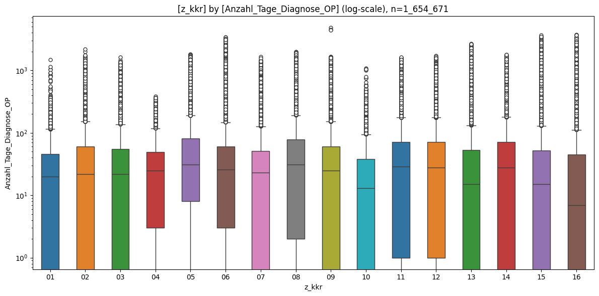
    


    
    column (n = 1_654_671)  |     present     | min  | lower | q25  | median | mean  |  q75  | upper |  max  |  std   |  cv 
    ------------------------+-----------------+------+-------+------+--------+-------+-------+-------+-------+--------+-----
    Anzahl_Tage_Diagnose_OP | 1_632_658 (98%) | -304 |   -56 | 0.00 |  26.00 | 74.88 | 65.00 |   162 | 4_835 | 163.28 | 2.18
    
    
    item (n = 1_654_671) |  count  | min  | lower | q25  | median | mean  |  q75  | upper |  max  |  std   |  cv 
    ---------------------+---------+------+-------+------+--------+-------+-------+-------+-------+--------+-----
    01                   |  44_153 |    0 |     0 | 0.00 |  20.00 | 39.21 | 46.00 |   115 | 1_498 |  59.89 | 1.53
    02                   |  33_147 |    0 |     0 | 0.00 |  22.00 | 77.09 | 61.00 |   152 | 2_204 | 169.17 | 2.19
    03                   |  92_380 |    0 |     0 | 0.00 |  22.00 | 47.08 | 55.00 |   137 | 1_635 |  76.37 | 1.62
    04                   |   9_001 |    0 |     0 | 3.00 |  25.00 | 42.04 | 49.00 |   118 |   384 |  57.03 | 1.36
    05                   | 344_903 |    0 |     0 | 8.00 |  31.00 | 92.92 | 81.00 |   190 | 1_812 | 183.44 | 1.97
    06                   |  92_019 |    0 |     0 | 3.00 |  26.00 | 70.56 | 61.00 |   148 | 3_448 | 166.10 | 2.35
    07                   |  55_139 |    0 |     0 | 0.00 |  23.00 | 50.58 | 51.00 |   127 | 1_649 |  98.22 | 1.94
    08                   | 223_074 |    0 |     0 | 2.00 |  31.00 | 91.13 | 78.00 |   192 | 1_996 | 187.00 | 2.05
    09                   | 226_364 |    0 |     0 | 0.00 |  25.00 | 65.13 | 61.00 |   152 | 4_835 | 134.19 | 2.06
    10                   |  15_891 |    0 |     0 | 0.00 |  13.00 | 35.94 | 38.00 |    95 | 1_080 |  65.85 | 1.83
    11                   |  73_421 |    0 |     0 | 1.00 |  29.00 | 74.31 | 71.00 |   176 | 1_619 | 143.70 | 1.93
    12                   |  64_795 |    0 |     0 | 1.00 |  28.00 | 75.85 | 71.00 |   176 | 1_724 | 149.43 | 1.97
    13                   |  73_292 | -304 |   -56 | 0.00 |  15.00 | 70.74 | 53.00 |   132 | 2_702 | 186.60 | 2.64
    14                   | 127_756 |    0 |     0 | 0.00 |  28.00 | 81.02 | 72.00 |   180 | 1_799 | 167.22 | 2.06
    15                   |  88_209 |    0 |     0 | 0.00 |  15.00 | 64.46 | 52.00 |   130 | 3_656 | 179.19 | 2.78
    16                   |  69_114 |    0 |     0 | 0.00 |   7.00 | 67.64 | 45.00 |   112 | 3_770 | 204.89 | 3.03
    


    

    


