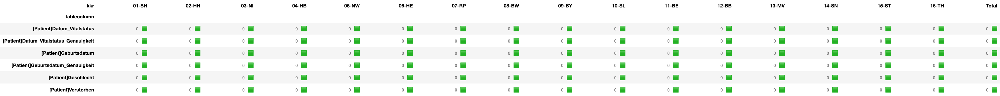
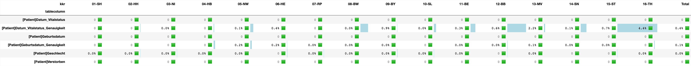
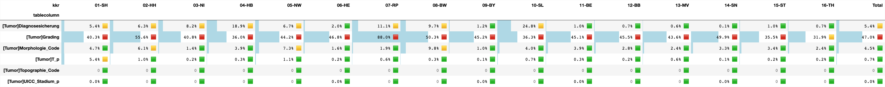
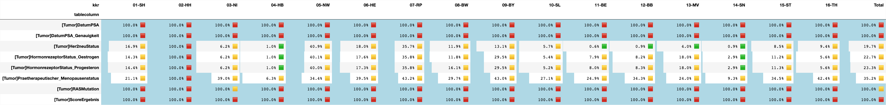
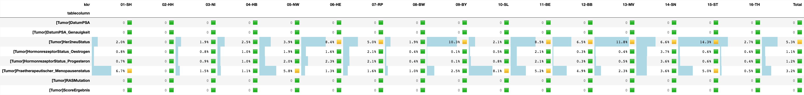
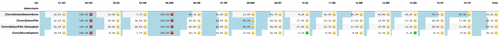
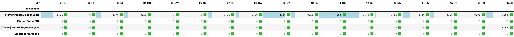
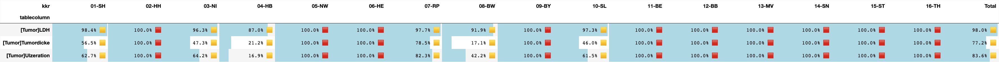
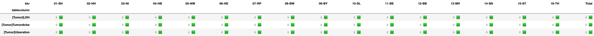
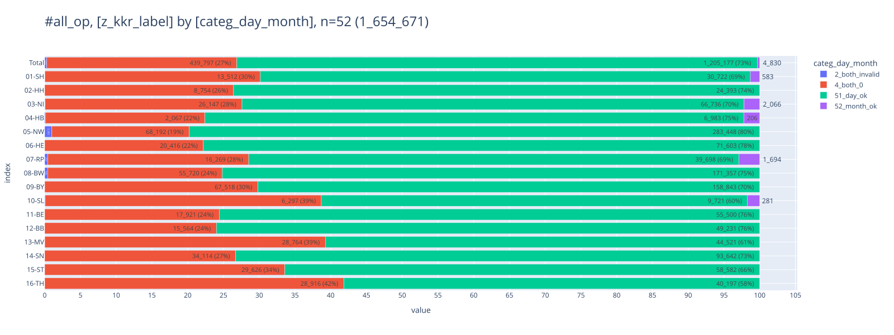

# <a id='toc1_'></a>[# §12 Bericht](#toc0_)

**Table of contents**<a id='toc0_'></a>    
- [# §12 Bericht](#toc1_)    
  - [Datenstand](#toc1_1_)    
  - [⚙️ settings](#toc1_2_)    
  - [Bericht](#toc1_3_)    
    - [Aktualität](#toc1_3_1_)    
    - [Vollständigkeit](#toc1_3_2_)    
      - [Personenangaben](#toc1_3_2_1_)    
      - [Tumorangaben](#toc1_3_2_2_)    
      - [Organmodule - Mamma](#toc1_3_2_3_)    
        - [Organmodule - Prostata](#toc1_3_2_3_1_)    
        - [Organmodule - Melanom](#toc1_3_2_3_2_)    
    - [Therapie](#toc1_3_3_)    
      - [Anteil Fälle ohne Therapie](#toc1_3_3_1_)    
      - [ops wenn op](#toc1_3_3_2_)    
      - [OP wenn OP erwartet](#toc1_3_3_3_)    
      - [st wenn st erwartet](#toc1_3_3_4_)    
      - [sy wenn sy erwartet](#toc1_3_3_5_)    
      - [Anteil Fälle ohne R-Status nach OP wenn hohe Relevanz des R-Status](#toc1_3_3_6_)    
      - [Anteil Lokalrezidive (erstmal breite Definition)](#toc1_3_3_7_)    
  - [debug](#toc1_4_)    

<!-- vscode-jupyter-toc-config
	numbering=false
	anchor=true
	flat=false
	minLevel=1
	maxLevel=6
	/vscode-jupyter-toc-config -->
<!-- THIS CELL WILL BE REPLACED ON TOC UPDATE. DO NOT WRITE YOUR TEXT IN THIS CELL -->

    🐍 3.12.8 | 📦 pandas: 2.3.3 | 📦 numpy: 1.26.4 | 📦 duckdb: 1.4.2 | 📦 pandas-plots: 0.23.1 | 📦 connection-helper: 0.13.2


## <a id='toc1_1_'></a>[Datenstand](#toc0_)

    database file:           2025-11-11_data_clin.duckdb
    data tag:                v2.3
    last kkr data import:    2025-09-30
    sql table created:       2025-11-11 11:52:01
    doi:                     10.18444/5.03.01.0005.0021.0002
    document created:        2025-12-02 11:01:22


    🗄️ db_clin_all	3_241_401, 31
    	("tum_id, pat_id, kkr, system, z_dy, z_icd10, z_icd10_3d, dsich, bl, z_is_dco, op_cnt, ops_cnt, st_cnt, syst_cnt, bestr_cnt, folge_cnt, app_cnt, weitere_diag_cnt, weitere_folge_cnt, fm_folge_cnt, fm_diag_cnt, proto_cnt, subst_cnt, tnm_folge_cnt, op_missing, st_missing, syst_missing, folge_missing, thera_missing, is_solid, code_kid")

```python
    ┌──────────────────────────────────────┬──────────────────────────────────────┬─────────┬─────────┬───────┬─────────┬────────────┬─────────┬──────┬──────────┬────────┬─────────┬────────┬──────────┬───────────┬───────────┬─────────┬──────────────────┬───────────────────┬──────────────┬─────────────┬───────────┬───────────┬───────────────┬────────────┬────────────┬──────────────┬───────────────┬───────────────┬──────────┬──────────┐
    │                tum_id                │                pat_id                │   kkr   │ system  │ z_dy  │ z_icd10 │ z_icd10_3d │  dsich  │  bl  │ z_is_dco │ op_cnt │ ops_cnt │ st_cnt │ syst_cnt │ bestr_cnt │ folge_cnt │ app_cnt │ weitere_diag_cnt │ weitere_folge_cnt │ fm_folge_cnt │ fm_diag_cnt │ proto_cnt │ subst_cnt │ tnm_folge_cnt │ op_missing │ st_missing │ syst_missing │ folge_missing │ thera_missing │ is_solid │ code_kid │
    │               varchar                │               varchar                │ varchar │ varchar │ int16 │ varchar │  varchar   │ varchar │ int8 │ boolean  │ int16  │  int64  │ int16  │  int16   │   int64   │   int16   │  int64  │      int64       │       int64       │    int64     │    int64    │   int64   │   int64   │     int64     │   int32    │   int32    │    int32     │     int32     │     int32     │ boolean  │ varchar  │
    ├──────────────────────────────────────┼──────────────────────────────────────┼─────────┼─────────┼───────┼─────────┼────────────┼─────────┼──────┼──────────┼────────┼─────────┼────────┼──────────┼───────────┼───────────┼─────────┼──────────────────┼───────────────────┼──────────────┼─────────────┼───────────┼───────────┼───────────────┼────────────┼────────────┼──────────────┼───────────────┼───────────────┼──────────┼──────────┤
    │ 9330094e-3ef6-4eb5-84d1-0985b3e0412a │ 8bb78cf7-b1cd-4a82-84fd-fb699e81ccad │ 09-BY   │ gtds    │  2020 │ C61     │ C61        │ 7       │    9 │ false    │      2 │       2 │      0 │        0 │         0 │         3 │       0 │                0 │                 0 │            0 │           0 │         0 │         0 │             3 │          0 │          1 │            1 │             0 │             0 │ true     │ C61      │
    │ 05f84a5f-2214-41ad-8a39-f0925813448a │ 9a67d26b-7093-42f0-be9b-e30e7dac191c │ 09-BY   │ gtds    │  2020 │ C61     │ C61        │ 7       │    9 │ false    │      2 │       3 │      0 │        0 │         0 │         3 │       0 │                0 │                 0 │            0 │           0 │         0 │         0 │             3 │          0 │          1 │            1 │             0 │             0 │ true     │ C61      │
    │ 4bafc7f6-f7b9-4f79-9250-424f7bdbad2d │ ebdcae78-0e45-443e-a99f-e655613f169e │ 14-SN   │ gtds    │  2022 │ C61     │ C61        │ 7       │   14 │ false    │      1 │       2 │      0 │        0 │         0 │         2 │       0 │                0 │                 0 │            0 │           0 │         0 │         0 │             2 │          0 │          1 │            1 │             0 │             0 │ true     │ C61      │
    └──────────────────────────────────────┴──────────────────────────────────────┴─────────┴─────────┴───────┴─────────┴────────────┴─────────┴──────┴──────────┴────────┴─────────┴────────┴──────────┴───────────┴───────────┴─────────┴──────────────────┴───────────────────┴──────────────┴─────────────┴───────────┴───────────┴───────────────┴────────────┴────────────┴──────────────┴───────────────┴───────────────┴──────────┴──────────┘
```

## <a id='toc1_2_'></a>[⚙️ settings](#toc0_)

## <a id='toc1_3_'></a>[Bericht](#toc0_)

### <a id='toc1_3_1_'></a>[Aktualität](#toc0_)


    

    


### <a id='toc1_3_2_'></a>[Vollständigkeit](#toc0_)

- es sind folgende Schwellwerte angezeigt:
  - 🟩 0 bis <5%
  - 🟨 5 bis <100%
  - 🟥 bei 100%
- **Filter: `DJ` 2020-2023** Weitere Filter sind extra aufgeführt
- dargestellt sind Variablen aus dem Schema in folgender Notation: `[Elementknoten]Variablenname`
- **Missings**
  - die graumelierte `0` kennzeichnet einen leeren Wert (=keine missings), 0% entsteht durch Rundung von kleinen Werten
- **Unbekannt**
    -  ('U', 'X', 'VX', 'SX', 'okk')
    -  Grading: (U, T)
    -  Morphologie_Code: 8000-8011, 9590, 9591, 9800, 9801, 8050
    -  Lokalisation_Code: C26, C39, C76, C80,  C14.0, C57.9, C63.9, C68.9, C72.9, C75.9
    -  Diagnose_ICD10_Code: ('C80','C80.0', 'C80.1', 'C80.9', 'C79.9')
    -  Diagnosesicherung: 9
    -  Intention, Seite_Zielgebiet, Seitenlokalisation: U
    -  Datum_Genauigkeit: ('M','V') 


#### <a id='toc1_3_2_1_'></a>[Personenangaben](#toc0_)


    

    


    

    


#### <a id='toc1_3_2_2_'></a>[Tumorangaben](#toc0_)


    

    


    

    


#### <a id='toc1_3_2_3_'></a>[Organmodule - Mamma](#toc0_)


    

    


    

    


##### <a id='toc1_3_2_3_1_'></a>[Organmodule - Prostata](#toc0_)


    

    


    

    


##### <a id='toc1_3_2_3_2_'></a>[Organmodule - Melanom](#toc0_)


    

    


    

    


### <a id='toc1_3_3_'></a>[Therapie](#toc0_)

#### <a id='toc1_3_3_1_'></a>[Anteil Fälle ohne Therapie](#toc0_)

- **Filter: `DJ` = 2020-2023, `DCO` = N, `ICD10` nur solide Tumoren** (_solide Tumoren_ schliesst folgende Diagnosen _aus_: C44, C70-C72, C76-C97, alle D)
- ein Wert von bspw. 0.68 ist zu interpretieren als: _"68% aller Tumorfälle im KKR haben keine zugeordneten OP Angaben, die restlichen 32% mindestens eine."_
- `treat_missing_per_tum` stellt den Anteil Fälle dar, bei denen keinerlei Therapieangabe (OP, ST, SYST) vorliegt
- in der Darstellung sind die Max/Min Werte pro Kennzahl mit 🟥/🟩 markiert (kleiner ist besser)
> 💡 `ZfKD`: _aus `st_missing_per_tum` lässt sich ablesen, dass ~23% der Tumoren deutschlandweit mind. eine ST zugeordnet ist (Total: 1 - 0.77 = 0.23). Das entspricht in etwa der Annahme von 30% Anteil von Strahlentherapien an primären Diagnosen_


    

    


#### <a id='toc1_3_3_2_'></a>[ops wenn op](#toc0_)


#### <a id='toc1_3_3_3_'></a>[OP wenn OP erwartet](#toc0_)


```python
    counts: rows
    ---
    n = 3_241_401                                    (100.0%) ██████████████████████████████
    └ [2020-2023]:                     n = 2_989_092  (92.2%) ░░░███████████████████████████
    └ [keine M1]:                      n = 2_715_663  (83.8%) ░░░░░█████████████████████████
    └ [keine Verstorbenen < 180 Tage]: n = 2_423_924  (74.8%) ░░░░░░░░██████████████████████
    └ [C50]:                             n = 283_195   (8.7%) ░░░░░░░░░░░░░░░░░░░░░░░░░░░░██
```

#### <a id='toc1_3_3_4_'></a>[st wenn st erwartet](#toc0_)


```python
    counts: distinct z_tum_id
    ---
    n = 3_241_401                                    (100.0%) ██████████████████████████████
    └ [2020-2023]:                     n = 2_989_092  (92.2%) ░░░███████████████████████████
    └ [keine M1]:                      n = 2_715_663  (83.8%) ░░░░░█████████████████████████
    └ [keine Verstorbenen < 180 Tage]: n = 2_423_924  (74.8%) ░░░░░░░░██████████████████████
    └ [C50]:                             n = 283_195   (8.7%) ░░░░░░░░░░░░░░░░░░░░░░░░░░░░██
    └ [OPS: BET]:                        n = 160_759   (5.0%) ░░░░░░░░░░░░░░░░░░░░░░░░░░░░░█
```

#### <a id='toc1_3_3_5_'></a>[sy wenn sy erwartet](#toc0_)


#### <a id='toc1_3_3_6_'></a>[Anteil Fälle ohne R-Status nach OP wenn hohe Relevanz des R-Status](#toc0_)


#### <a id='toc1_3_3_7_'></a>[Anteil Lokalrezidive (erstmal breite Definition)](#toc0_)
- ❗ neue vs alte definition


```python
    counts: distinct z_tum_id
    ---
    n = 3_241_401                (100.0%) ██████████████████████████████
    └ [2020-2021]: n = 1_495_715  (46.1%) ░░░░░░░░░░░░░░░░░█████████████
    └ [keine M1]:  n = 1_355_097  (41.8%) ░░░░░░░░░░░░░░░░░░████████████
    └ [C50]:         n = 146_979   (4.5%) ░░░░░░░░░░░░░░░░░░░░░░░░░░░░░█
    └ [R0]:           n = 89_812   (2.8%) ░░░░░░░░░░░░░░░░░░░░░░░░░░░░░░
```

    🗄️ relapse	89_812, 14
    	("z_tum_id, z_pat_id, z_m_pc_1, z_kkr_label, has_fo, has_r_symbol, has_t2plus, has_n2plus, has_m2plus, has_rel3, has_rel1, has_rel2, Verstorben, categ_relapse")

```python
    ┌──────────────────────────────────────┬──────────────────────────────────────┬──────────┬─────────────┬─────────┬──────────────┬────────────┬────────────┬────────────┬──────────┬──────────┬──────────┬────────────┬───────────────┐
    │               z_tum_id               │               z_pat_id               │ z_m_pc_1 │ z_kkr_label │ has_fo  │ has_r_symbol │ has_t2plus │ has_n2plus │ has_m2plus │ has_rel3 │ has_rel1 │ has_rel2 │ Verstorben │ categ_relapse │
    │               varchar                │               varchar                │ varchar  │   varchar   │ boolean │   varchar    │  varchar   │  varchar   │  varchar   │ varchar  │ boolean  │ boolean  │  varchar   │    varchar    │
    ├──────────────────────────────────────┼──────────────────────────────────────┼──────────┼─────────────┼─────────┼──────────────┼────────────┼────────────┼────────────┼──────────┼──────────┼──────────┼────────────┼───────────────┤
    │ f74dbc1d-da5e-412d-8c46-7a708107890c │ d9a7106b-80c3-449f-a4d8-231202a78167 │ 0        │ 05-NW       │ true    │ false        │ NULL       │ NULL       │ NULL       │ false    │ false    │ false    │ N          │ 4_no_relapse  │
    │ a47a7fda-3ea4-4bbb-a749-24345c71dcdd │ 6315be11-f704-40c4-8b97-63c4c293780c │ 0        │ 08-BW       │ true    │ false        │ NULL       │ NULL       │ NULL       │ false    │ false    │ false    │ N          │ 4_no_relapse  │
    │ 9d3942da-df8d-4bb8-9da5-f53a5ed89f23 │ 9a346d5e-6720-4de6-8405-2114a23f5221 │ 0        │ 08-BW       │ true    │ false        │ NULL       │ NULL       │ NULL       │ false    │ false    │ false    │ N          │ 4_no_relapse  │
    └──────────────────────────────────────┴──────────────────────────────────────┴──────────┴─────────────┴─────────┴──────────────┴────────────┴────────────┴────────────┴──────────┴──────────┴──────────┴────────────┴───────────────┘
```

### date periods
[analysis](../quality-analysis/02-date-periods/docs/date_periods.md)


    

    


### Numerische Werte
[analyis](../quality-reports/docs/clin/clin_2_analyze.md#numerische-variablen-)

## <a id='toc1_4_'></a>[debug](#toc0_)
