# <a id='toc1_'></a>[Bericht zur Datenqualität nach § 12 BKRG](#toc0_)

**Inhalt**<a id='toc0_'></a>    
- [Bericht zur Datenqualität nach § 12 BKRG](#toc1_)    
  - [Informationen zum Dokument](#toc1_1_)    
  - [Einführung](#toc1_2_)    
    - [Gesetzliche Grundlagen für den Datensatz des ZfKD und den vorliegenden Bericht](#toc1_2_1_)    
    - [Beschreibung der aktuell am ZfKD verfügbaren Datensätze](#toc1_2_2_)    
      - [Epidemiologischer Datensatz](#toc1_2_2_1_)    
      - [Klinischer Datensatz](#toc1_2_2_2_)    
      - [Unterschiede zwischen ZfKD-Datensatz und oBDS](#toc1_2_2_3_)    
  - [Zusammenarbeit mit den Krebsregistern](#toc1_3_)    
  - [Angaben zur Datenqualität](#toc1_4_)    
    - [Vorbemerkungen und methodische Aspekte](#toc1_4_1_)    
    - [Vollzähligkeit der Erfassung von Krebsneuerkrankungen](#toc1_4_2_)    
    - [Landesspezifische Besonderheiten im aktuellen Datensatz](#toc1_4_3_)    
    - [Informationen zur Diagnose](#toc1_4_4_)    
      - [Anteil fehlendes Grading (wenn Angaben zum Grading erwartet werden)](#toc1_4_4_1_)    
      - [Vollständigkeit der Angaben zum klinischen und pathologischem T-Stadium](#toc1_4_4_2_)    
      - [Vollständigkeit pathologischer T-Stadien bei dokumentierter Operation](#toc1_4_4_3_)    
    - [Informationen zur Therapie](#toc1_4_5_)    
      - [Fälle ohne Therapieangaben](#toc1_4_5_1_)    
      - [Fehlende Angaben zur Operation bei erwartbarer Operation (Brust- Darm-, Hodenkrebs und Malignes Melanom)](#toc1_4_5_2_)    
      - [Fehlende Angaben zur Strahlentherapie bei erwarteter Strahlentherapie (nach brusterhaltender Operation bei Brustkrebs)](#toc1_4_5_3_)    
    - [Fehlende Angaben zur systemischen Therapie bei erwarteter systemischer Therapie (akute Leukämien und hochmaligne Lymphome, Kolonkarzinom Stadium III)](#toc1_4_6_)    
    - [Abstand zwischen Diagnose und erster Operation](#toc1_4_7_)    
    - [Informationen zum Krankheitsverlauf](#toc1_4_8_)    
      - [Nach Brustkrebs](#toc1_4_8_1_)    
      - [Nach Darmkrebs](#toc1_4_8_2_)    
    - [Einordnung der Ergebnisse zur Datenqualität](#toc1_4_9_)    
    - [Erfahrungen mit der Antragsbearbeitung und Datenübermittlung](#toc1_4_10_)    
      - [Einleitung - Gesetzliche Vorgaben für die Bearbeitung von Datennutzungsanträgen](#toc1_4_10_1_)    
      - [Eingang und Prüfung von Datennutzungsanträgen im ZfKD](#toc1_4_10_2_)    
      - [Vorlage von Datennutzungsanträgen beim wissenschaftlichen Ausschuss](#toc1_4_10_3_)    
      - [Aufgabenverwaltung](#toc1_4_10_4_)    
    - [Statistiken zu Datenanträgen](#toc1_4_11_)    
      - [Nach Datensatz und Datentyp](#toc1_4_11_1_)    
      - [Nach Datentyp](#toc1_4_11_2_)    
      - [Nach Entität](#toc1_4_11_3_)    
      - [Nach Art der antragstellenden Einrichtung](#toc1_4_11_4_)    
      - [Nach Auswertungszielen und Forschungszweck](#toc1_4_11_5_)    
      - [Nach Gebührenpflichtigkeit](#toc1_4_11_6_)    
      - [Fazit und Perspektiven](#toc1_4_11_7_)    

<!-- vscode-jupyter-toc-config
	numbering=false
	anchor=true
	flat=false
	minLevel=1
	maxLevel=6
	/vscode-jupyter-toc-config -->
<!-- THIS CELL WILL BE REPLACED ON TOC UPDATE. DO NOT WRITE YOUR TEXT IN THIS CELL -->


<br>

## <a id='toc1_1_'></a>[Informationen zum Dokument](#toc0_)
- die jeweils angewendeten **Filter** sind für jede Auswertung dargestellt, jeweils zur besseren Einordnung als Anteil von der Gesamtzahl der Entität in unserer Datenbank
- die _relativen_ Barcharts enthalten ein `Total` item für den Gesamtvergleich
- die Filter können exakt nachvollzogen werden mit Hilfe der **ausklappbaren SQL Abfragen**
- in den Diagrammen gibt ebenfalls das angegebene _`n=`_ einen Hinweis auf die verwendete Grundgesamtheit
- der komplette Quellcode dieses Dokumentes ist [hier abrufbar](../report.ipynb)

**Datenstand: Diagnosejahr 2023**

    database file:           2025-11-11_data_clin.duckdb
    data tag:                v2.3
    last kkr data import:    2025-09-30
    sql table created:       2025-11-11 11:52:01
    doi:                     10.18444/5.03.01.0005.0021.0002
    document created:        2026-06-05 11:52:30


<br>

## <a id='toc1_2_'></a>[Einführung](#toc0_)

### <a id='toc1_2_1_'></a>[Gesetzliche Grundlagen für den Datensatz des ZfKD und den vorliegenden Bericht](#toc0_)
Mit dem Gesetz zur Zusammenführung von Krebsregisterdaten (2021) wurde auch das Bundeskrebsregisterdatengesetz (BKRG) novelliert. Unter anderem wurde der jährlich aus den Landeskrebsregistern an das Zentrum für Krebsregisterdaten (ZfKD) am Robert Koch-Institut zu übermittelnde Datensatz um wesentliche Elemente der klinischen Krebsregistrierung (Angaben zur Therapie und Krankheitsverlauf) sowie zusätzliche diagnostische Variablen für ausgewählte Diagnosen erweitert. Diese werden in den Krebsregistern je nach Zeitpunkt der landesgesetzlichen Umsetzung des Krebsfrüherkennungs- und Registergesetzes (KFRG 2013) mindestens seit 2019 erfasst. DieDefinition der einzelnen Variablen im Onkologischen Basisdatensatz (oBDS) erfolgt durch die Arbeitsgemeinschaft Deutscher Tumorzentren und den Deutsche Krebsregister e.V. (vormals: Gesellschaft der epidemiologischen Krebsregister in Deutschland) und werden nach § 65c Abs. 1a S. 1 regelmäßig angepasst. 
Um aus dem  für die Meldungen an die  Krebsregister maßgeblichen OBDS im Rahmen der Vorgaben des BKRG einen auswertefähigen Datensatz für die Übermittlung an das ZfKD zu erzeugen, wurde im Jahr 2022 entsprechend § 5 Abs. 3 BKRG in einer Arbeitsgruppe aus Vertretern des ZfKD und den Krebsregistern der „ZfKD-Lieferdatensatz“ vereinbart. 
Der vorliegende Bericht über die Erfahrungen mit der bundesweiten Erfassung von Krebsregisterdaten nach §12 BKRG enthält Angaben zur Datenqualität, zur Zusammenarbeit des ZfKD mit den Krebsregistern und zur Bearbeitung externer Datennutzungsanträge.


<br>

### <a id='toc1_2_2_'></a>[Beschreibung der aktuell am ZfKD verfügbaren Datensätze](#toc0_)
Wegen der institutionellen Trennung der (flächendeckenden) epidemiologischen und klinischen Krebsregistrierung in Niedersachsen und Baden-Württemberg, der in den meisten Registern bereits etablierten Schnittstelle für die epidemiologischen Daten  und der unterschiedlich langen verfügbaren Zeitreihen wurde zunächst vereinbart, dass die Register jeweils einen epidemiologischen Datensatz im bisherigen csv-Format (ab erstem verfügbarem Diagnosejahr, je nach Bundesland also mindestens ab 2009) und einen „klinischen Datensatz“ als relationalen Datensatz im xml-Format (für Diagnosen ab 2020) übermitteln. Auf die früher aus einzelnen Bundesländern verfügbaren wenig detaillierten Angaben zur Primärtherapie (z.B. Operation ja/nein) wurde wegen der fehlenden Überführbarkeit in den aktuellen  klinischen Datensatz und der sehr heterogenen Verfügbarkeit und Vollständigkeit  verzichtet. Im ersten Quartal 2023 wurden neben den epidemiologischen Daten erstmals klinische Daten im neuen Datenformat für die Diagnosejahre 2020 und 2021 an das ZfKD übermittelt.

Inhaltlich kann der epidemiologische Datensatz als Teilmenge der klinischen Daten angesehen werden. Unterschiede bestehen bezüglich der Falldefinition: Während für den epidemiologischen Datensatz die internationale gültige Regel gilt, nach der mehrere Tumoren in gleichen Organen oder Organsystemen unter bestimmten Bedingungen (gleicher histologischer Typ) nur einmal gezählt werden, weicht die klinische Falldefinition in einigen Fällen davon ab. So werden zwei Tumoren in paarigen Organen (z.B. Niere, Hoden, Brust) doppelt erfasst, wenn sie beidseitig auftreten, ebenso wird bei zeitlich nacheinander auftretenden in situ und invasiven Tumoren des gleichen Organs und in bestimmten Fällen bei mehreren Darm- und Hauttumoren unterschiedlicher Lokalisation vorgegangen.


<br>

#### <a id='toc1_2_2_1_'></a>[Epidemiologischer Datensatz](#toc0_)
Der epidemiologische Datensatz enthält alle Angaben, die in den meisten internationalen bevölkerungsbezogenen Krebsregistern erfasst werden: Angaben zur Diagnose (inkl. monatsgenauem Diagnosedatum, Topographie und Morphologie nach ICD-O, Tumorstadium nach TNM, Differenzierungsgrad sowie Art der Diagnosesicherung) sowie zum monatsgenauen Sterbedatum und zur Todesursache.


<br>

#### <a id='toc1_2_2_2_'></a>[Klinischer Datensatz](#toc0_)
Der klinische Datensatz enthält darüber hinaus detaillierte Angaben zur Therapie (Operationen nach OPS-Klassifikation inklusive Residualstatus, Strahlentherapie inkl. Angaben zum Zielgebiet und systemische Therapie einschließlich der verwendeten Medikamente bzw. Protokolle, sowie jeweils monatsgenaue Datumsangaben und tagesgenaue zeitliche Abstände zwischen Diagnose und Therapiebeginn). Für die Strahlentherapie und systemische Therapie ist zudem die Stellung zur OP (adjuvant oder neoadjuvant) angegeben. Therapieangaben betreffen den gesamten Krankheitsverlauf und damit auch Informationen zu Zweit- oder Drittlinientherapien sowie Therapien nach Rezidiven und Progression. Daher handelt es sich technisch im Gegensatz zu den epidemiologischen Daten um einen relationalen Datensatz mit mehreren, auf Tumorebene verknüpfbaren Tabellen. Für ausgewählte Entitäten (bisher: Darm-, Prostata und Brustkrebs sowie malignes Melanom) sind ergänzende Angaben zur Diagnose aus den entsprechenden Modulen des oBDS übernommen worden (u.a. Gleason-Score und prätherapeutischer PSA-Wert beim Prostatakarzinom, Hormonrezeptor- und Her2neu-Status beim Brustkrebs).


<br>

#### <a id='toc1_2_2_3_'></a>[Unterschiede zwischen ZfKD-Datensatz und oBDS](#toc0_)

Im Vergleich zum oBDS fehlen in den Daten des ZfKD vor allem Angaben zu den meldenden bzw. behandelnden Einrichtungen, Nebenwirkungen der Therapie, Tumorkonferenzen, zum allgemeinen Leistungszustand (ECOG oder Karnofsky), sowie Gründe für Beendigung einer systemischen Therapie und Strahlendosis. 


<br>

## <a id='toc1_3_'></a>[Zusammenarbeit mit den Krebsregistern](#toc0_)
Die Datenlieferung für die klinischen Daten erfolgt nach dem vereinbarten xml-Schema, die epidemiologischen Daten werden nach dem früheren Schema als csv-Dateien übermittelt. Bei jeder Datenlieferung werden jeweils die Daten aus allen Diagnosejahren übermittelt, um Nachmeldungen und Änderungen des Vitalstatus und (bei den klinischen Daten) des Krankheitsverlaufs abbilden zu können. Die Register der ostdeutschen Bundesländer (Berlin/Brandenburg, Mecklenburg-Vorpommern, Sachsen, Sachsen-Anhalt und Thüringen) liefern bisher nur einen klinischen Datensatz ab dem Diagnosejahr 2020, aus dem das ZfKD nach Prüfung auf Mehrfachtumoren (nach epidemiologischer Zählweise) jeweils epidemiologische Datensätze erzeugt. Die aus diesen Ländern am ZfKD verfügbaren epidemiologischen Daten bis einschließlich 2019 stammen noch aus der letzten Datenlieferung des Gemeinsamen Krebsregisters der neuen Bundesländer und Berlins (GKR), das seit Ende 2022 nicht mehr besteht, weshalb der Vitalstatus für diese Fälle bisher noch nicht aktualisiert werden konnte.  Nach Einarbeitung der Daten aus dem Datenbestand des GKR und Aktualisierung des Vitalstatus dieser Fälle (nachträgliche Abgleiche mit den Sterbefällen und Wegzügen in den jeweiligen Bundesländern) werden diese Register voraussichtlich in absehbarer Zeit (mindestens Sachsen-Anhalt schon im kommenden Jahr) in der Lage sein, auch epidemiologische Daten über eine längere Zeitreihe bereitzustellen.
  
Nach eigenem Ermessen und Rücksprache mit dem ZfKD liefern einige Register im Laufe des Jahres aktualisierte Datenstände, häufig mit einer deutlich höheren Fallzahl für das jeweils letzte Diagnosejahr, und tragen damit auch unterjährig zu einer Verbesserung der Datenbasis und Datenqualität bei.

Rückmeldungen an die Register erfolgen mittels automatisierter Qualitätsberichte, die inhaltlich fortlaufend erweitert und mindestens einmal jährlich in Videokonferenzen mit den Registervertretern diskutiert werden. Bei Unklarheiten und Auffälligkeiten erfolgt zusätzlich ein bilateraler Austausch. 
Darüber hinaus nimmt das ZfKD an den alle 6 bis 8 Wochen stattfindenden Treffen der Plattform der klinischen Krebsregister („§65c“) teil und entsendet zwei Vertreter als Mitglied in den Deutsche Krebsregister e.V. (derzeit ein Vertreter im Vorstand). An den vielfältigen Arbeitsgruppen von Plattform und Verein nimmt das ZfKD nur sporadisch teil. Hier wäre eine stärkere Beteiligung sinnvoll, kann aber bisher aus Kapazitätsgründen nicht geleistet werden. Entsprechend hat das ZfKD praktisch keine Ressourcen für eine zentrale Unterstützung der Krebsregister bei übergreifenden Problemstellungen wie den anstehenden Versionswechseln der für die Krebsregistrierung relevanten Klassifikationssysteme (TNM-9, ICD-O-4 und ICD-11).
Die Zusammenarbeit mit den Landeskrebsregistern kann seitens des ZfKD als sehr harmonisch und konstruktiv beschrieben werden. Kooperationen gehen über die reine Datenübermittlung und -prüfung hinaus und betreffen u.a. auch wissenschaftliche Projekte und Vorträge, Drittmittelanträge sowie Gremien- und Öffentlichkeitsarbeit. So ist für 2026 die Bereitstellung eines gemeinsamen interaktiven bundesweiten Datenberichts aus dem ZfKD-Datensatz über die Website des DKR e.V. geplant.


<br>

## <a id='toc1_4_'></a>[Angaben zur Datenqualität](#toc0_)

### <a id='toc1_4_1_'></a>[Vorbemerkungen und methodische Aspekte](#toc0_)
Die Prüfung der Qualität der von den Krebsregistern übermittelten Daten sowie entsprechende Rückmeldungen an die Register gehören zu den gesetzlichen Aufgaben des ZfKD. Im Folgenden werden erstmals ausgewählte Auswertungen zur Datenqualität öffentlich bereitgestellt, um auch potentiell Datennutzenden außerhalb der Krebsregistrierung einen ersten Überblick zur Vollständigkeit bestimmter Angaben im Datensatz zu verschaffen. Zukünftig ist mindestens alle zwei Jahre eine Aktualisierung, gegenenfalls mit Erweiterung der entsprechenden Auswertungen, geplant.

Der Fokus der Auswertungen liegt dabei auf der Vollständigkeit von Angaben zur Diagnose (einschließlich Tumorstadien, Differenzierungsgrad) und Therapie, sowie ersten orientierenden Analysen zu Ereignissen im Krankheitsverlauf.  Die hier vorgelegten Auswertungen beziehen sich, mit Ausnahme der Aussagen zur geschätzten Vollzähligkeit der Erfassung, auf den klinischen Datensatz (Diagnosejahre 2020-2023). Nur auf Todesbescheinigungen beruhende Fälle (DCO=death vcertificate only) sowie Fälle mit  nicht-melannotischem Hautkrebs sind ausgeschlossen. Auswertungen zum  epidemiologischen Datensatz, die auch Veränderungen über einen längeren Zeitraum abbilden und Aussagen zur Qualität der Sterbedaten/Angaben zum Vitalstatus beinhalten, werden zu einem späteren Zeitpinkt gesondert veröffentlicht. 

Für Auswertungen zur Vollständigkeit von Therapieangaben wurden Diagnosen aus dem 2. Halbjahr 2023 ausgeschlossen, da Therapiemeldungen häufig deutlich später als Diagnosemeldungen im Krebsregister eingehen. Ausgeschlossen wurden außerdem Personen, die innerhalb von 6 Monaten nach Diagnose verstorben waren, da hier eine eine höhere Wahrscheinlichkeit von Kontraindikationen für eine tumorbezogene Therapie vermutet werden kann. Bei den Operationen wurden alle Prozeduren aus dem Kapitel 5 des OPS berücksichtigt, nur bei den organspezifischen Auswertungen (3.5.2) wurde überprüft, ob der OPS-Kode mit einer tumorresektierenden Operation vereinbar war. Die jeweiligen Filterfunktionen zu den einzelnen Auswertungen sind als eigene Grafiken mit Nennung der Fallzahlen den eigentlichen Abbildungen vorangestellt.

	


<br>

### <a id='toc1_4_2_'></a>[Vollzähligkeit der Erfassung von Krebsneuerkrankungen](#toc0_)

Die Vollzähligkeit der Erfassung von Krebserkrankungen (ohne nicht-melanotischem Hautkrebs) wird vom ZfKD lediglich auf Basis des epidemiologischen Datensatzes regelmäßig geschätzt. Nicht berücksichtigt werden Fälle, die den Registern nur über eine Todesbescheinigung oder einen entsprechenden Datenabgleich bekannt werden (DCO-Fälle). Die Schätzung basiert im Kern auf der sogenannten „M/I“ Methode, die in ihrer ursprünglichen Form von einem konstanten Verhältnis der Mortalität zur Inzidenz (M/I), nach Geschlecht, Alter und Diagnose ausgeht. Die Methode der Vollzähligkeitsschätzung war ursprünglich vor allem als Orientierung für neue Register in deren Aufbaujahren konzipiert. Sie wurde im Laufe der Jahre weiterentwickelt und berücksichtigt inzwischen unter bestimmten Bedingungen regionale Abweichungen des Verhältnisses von M/I,  die nach den Ergebnissen aus internationalen und nationalen Studien z.B. in Abhängigkeit von sozioökonomischen Faktoren auf regionaler Ebene auch zu erwarten sind. Dennoch muss betont werden, dass es sich um eine Schätzung mit nicht unerheblichen Unsicherheiten handelt und die Methode mangels Goldstandards in Deutschland noch nicht validiert werden konnte.
Die aktuellen Ergebnisse der Schätzung deuten darauf hin, dass seit mindestens 2020 alle Register eine ausreichende Vollzähligkeit der Erfassung bösartiger Tumorerkrankungen (ohne Berücksichtigung nicht-melanotischer Hautkrebsfälle) nach epidemiologischer Zählweise aufweisen, da jeweils mehr als 90 % der aus dem Schätzmodell errechneten erwarteten Fälle erfasst wurden. Für einige Register konnte dieser Wert für das jeweils letzte Lieferdatenjahr erst durch Nachlieferungen im laufenden Jahr erreicht werden, eine ausreichende Vollzähligkeit war in diesen Fällen also erst einige Monate nach dem gesetzlich vorgesehen Lieferdatum gegeben. Wenn man berücksichtigt, dass sich die Frist für die Datenlieferung durch die Register ab 2023 von zwei Jahren auf ein Jahr verkürzt hat, ist dennoch festzustellen, dass sich die Aktualität der im ZfKD verfügbaren Daten in den letzten Jahren deutlich verbessert hat, was eine aktuellere Berichterstattung des ZfKD ermöglicht. 
Teilweise sehr aufwändige Nachrecherche z.B. nur über Sterbe- oder Pathologiemeldungen bekannt gewordener Fälle führen in der Regel zu deutlich verzögert eingehenden Meldungen, die jedoch die Vollzähligkeit und Vollständigkeit der Erfassung verbessern. Daher ist auch in Zukunft damit zu rechnen, dass sich Ergebnisse aus zurückliegenden Jahren nachträglich noch leicht verändern können, was für bevölkerungsbezogene Krankheitsregister generell gilt (Prinzip der „lebenden Datenbanken“).


<br>

### <a id='toc1_4_3_'></a>[Landesspezifische Besonderheiten im aktuellen Datensatz](#toc0_)
In Thüringen, Sachsen-Anhalt und Bayern (Regierungsbezirk Oberbayern) ist davon auszugehen, dass Sterbefälle in den aktuellen Jahren (ab 2020 oder später) noch nicht vollständig eingegangen sind, da der entsprechende Datenabgleich zum Zeitpunkt der Datenlieferung noch nicht etabliert war oder sich (in Oberbayern) verzögerte. 
Für Niedersachsen enthält der klinische Datensatz derzeit noch nicht alle Fälle, die im epidemiologischen Datensatz übermittelt wurden.
In Thüringen fehlen im klinischen (und damit auch in den daraus abgeleiteten epidemiologischen Daten ab 2020) derzeit noch etwa 20-25 % der Fälle, der zugrundeliegende  Fehler (beim Datenexport aus den regionalen Register) wurde inzwischen identifiziert und behoben. Eine probeweise Neulieferung aktueller Diagnosejahre ergab plausible Fallzahlen, so dass der 2026 verfügbare Datensatz (2020-2024) für Thüringen aller Voraussicht nach eine ausreichende Vollzähligkeit aufweisen wird. In Sachsen-Anhalt führte eine abweichende Kodierung der Dignität bei über eine Fernmetastase diagnostizierten Primärtumoren dazu, dass im aktuellen ZfKD-Datensatz knapp 5 Prozent der Fälle aus den aktuellen Jahren fehlen. Auch dies wird bei der kommenden Datenlieferung korrigiert werden. 
Aus Schleswig-Holstein, Niedersachsen, Bremen und dem Saarland wurden dem ZfKD bisher keine Daten zu Verlaufsereignissen und zum Residualstatus übermittelt. Aus Hamburg fehlen Angaben aus allen Organmodulen, in Nordrhein-Westfalen aus dem Prostatamodul, und nur aus sechs Bundesländern liegen Angaben aus dem Modul zum malignen Melanom vor. Dies bedeutet nicht, dass in diesen Ländern keine entsprechenden Informationen vorliegen: in erster Linie liegt  der Grund für die noch bestehenden Lücken in noch nicht umgesetzten „Best-of“-Programmierungen zur Zusammenfassung von Informationen aus mehreren Meldungen entsprechend der ZfKD-Schnittstelle. Diese Lücken sollten sich aller Voraussicht nach in absehbarer Zeit (auch nachträglich für die bereits übermittelten Diagnosejahre) schließen lassen.


<br>

### <a id='toc1_4_4_'></a>[Informationen zur Diagnose](#toc0_)
#### <a id='toc1_4_4_1_'></a>[Anteil fehlendes Grading (wenn Angaben zum Grading erwartet werden)](#toc0_)
Der Differenzierungsgrad (Grading)  ist nur für bestimmte Tumoren relevant, die folgenden Auswertung beschränkt sich daher auf Karzinome (ICD-O-3: 81010/3 – 8576/3) und Tumorlokalisationen, bei denen im Falle einer histologischen Sicherung in der Regel eine Angabe zum Grading erwartet werden kann (C00-C33, C50-C57, C60, C62-C68). Prostatakarzinome (C61) wurden hier nicht berücksichtigt, da hier in der Regel der spezifischere Gleason-Score über das entsprechende Modul übermittelt wurde.  Der Anteil fehlender Werte zum Differenzierungsgrad bei den genannten Entiäten lag bundesweit (ohne Rheinland-Pfalz) bei 9 %. Für Rheinland Pfalz führte ein Fehler beim Datenexport zu einer sehr hohen Anteil fehlender Werte, dieser Fehler wird bei der nächsten Datenlieferung korrigiert werden.


> [!NOTE]
> _gradingrelevant_: Lokalisationen C00-C33, C50-C57, C60-C68 und Morphologie: 8010-8576
> 
> Kategorien:
>  - `1_null` - kein Wert vorhanden
>  - `2_undefined` - Wert T oder U
>  - `3_valid` - restliche Werte


<details>
<summary>filter-sql</summary>

```sql
z_dy between 2020 and 2023
and not z_is_dco
and 
    (
        left(z_icd10_3d, 1) ='C' and
        (
            right(z_icd10_3d, 2)::int8 between 00 and 33
            or right(z_icd10_3d, 2)::int8 between 50 and 57
            or right(z_icd10_3d, 2)::int8 between 63 and 68
            or right(z_icd10_3d, 2)::int8 = 60
        )
        and left(Morphologie_Code,4)::int between 8010 and 8576
    )
and z_kkr <> 7
```

</details>


    
    


<picture>
  <source media="(prefers-color-scheme: dark)" srcset="report_files_dark/output_11_3.svg">
  <source media="(prefers-color-scheme: light)" srcset="report_files/output_11_3.svg">
  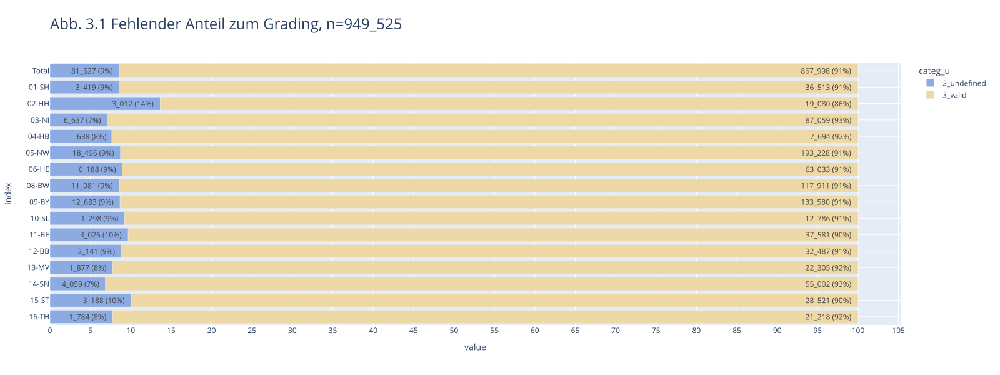
</picture>
    


<br>

#### <a id='toc1_4_4_2_'></a>[Vollständigkeit der Angaben zum klinischen und pathologischem T-Stadium](#toc0_)
In bundesweit  84 % der Fälle mit Diagnosen, für die ein TNM-Stadium in der Regel definiert ist, liegt mindestens ein klinisches (cT) oder pathologisches (pT) T-Stadium vor (Bundesländer: 81-92 %), in 25 % sind beide Angaben vorhanden (Abbildung 2). Aus Rheinland-Pfalz wurde grundsätzlich nur entweder ein pT oder cT übermittelt.

> [!NOTE]
> _tnm-relevant_: Lokalisationen C00-C43, C45-C69, C73-C75 außer: C26, C39, C55, C14.0, C57.9, C63.9, C75.9 und Morphologie: 8010-8790
>
> Kategorien
>  - `1_t_cp` - cT und pT sind vorhanden und nicht `X`
>  - `2_t_c`- cT ist vorhanden und nicht `X`, pT ist leer
>  - `3_t_p`- pT ist vorhanden und nicht `X`, cT ist leer
>  - `4_no_t`- beide leer


```
    n = 3_241_401                               (100.0%) ██████████████████████████████
    └ [DJ 2020-2023]:             n = 2_989_092  (92.2%) ░░░███████████████████████████
    └ [keine DCO]:                n = 2_890_167  (89.2%) ░░░░██████████████████████████
    └ [nur tnm-relevante Tumore]: n = 1_610_344  (49.7%) ░░░░░░░░░░░░░░░░██████████████
```

<details>
<summary>filter-sql</summary>

```sql
z_dy between 2020 and 2023
and not z_is_dco
and 
    (
        left(z_icd10_3d, 1) ='C' and
        (
            right(z_icd10_3d, 2)::int8 between 00 and 43
            or right(z_icd10_3d, 2)::int8 between 45 and 69
            or right(z_icd10_3d, 2)::int8 between 73 and 74
        )
        and left(Morphologie_Code,4)::int between 8010 and 8790
        and z_icd10_3d not in ('C26', 'C39', 'C55')
        and z_icd10 not in ('C14.0', 'C57.9', 'C63.9')
    )
```

</details>


    
    


<picture>
  <source media="(prefers-color-scheme: dark)" srcset="report_files_dark/output_13_6.svg">
  <source media="(prefers-color-scheme: light)" srcset="report_files/output_13_6.svg">
  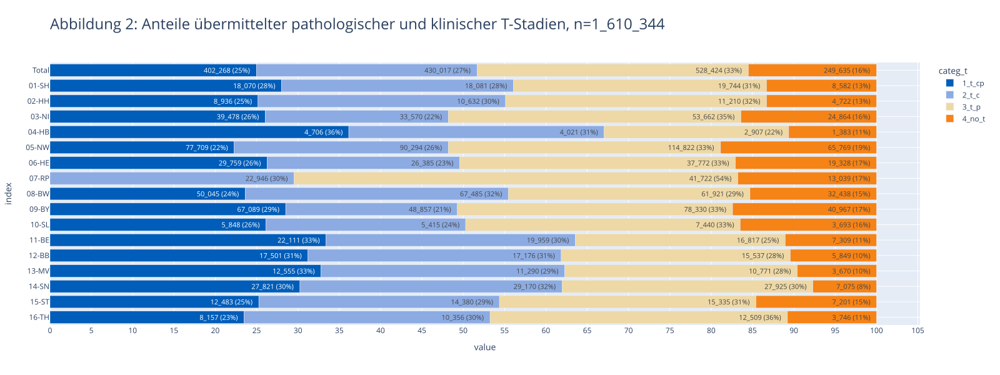
</picture>
    


<br>

#### <a id='toc1_4_4_3_'></a>[Vollständigkeit pathologischer T-Stadien bei dokumentierter Operation](#toc0_)

Nach einer in den Krebsregistern dokumentierten Operation (innerhalb von 6 Monaten nach Diagnose)  ist in 85 % der Fälle ein der Tumordiagnose zugeordnetes pathologisches T-Stadium vorhanden (Bundesländer: 74-93 %, Abbildung 3). Bei Vorhandensein des pT ist bundesweit in 88 % auch ein gültiger pathologischer Lymphknotenstatus (pN, ohne pNX) dokumentiert (Bundesländer: 73-99 %, ohne Abbildung).

> [!NOTE]
> _tnm-relevant:_ Lokalisationen C00-C43, C45-C69, C73-C75  außer: C26, C39, C55, C14.0, C57.9, C63.9, C75.9 und mit Morphologie: 8010-8790
>  - `1_null` - kein Wert vorhanden
>  - `2_unknown` - Wert X
>  - `3_valid` - restliche Werte
 


```
    n = 3_241_401                                        (100.0%) ██████████████████████████████
    └ [DJ 2020-2023]:                      n = 2_989_092  (92.2%) ░░░███████████████████████████
    └ [keine DCO]:                         n = 2_890_167  (89.2%) ░░░░██████████████████████████
    └ [nur tnm-relevante Tumore]:          n = 1_610_344  (49.7%) ░░░░░░░░░░░░░░░░██████████████
    └ [Tumor hat OP < 180d nach Diagnose]:   n = 835_516  (25.8%) ░░░░░░░░░░░░░░░░░░░░░░░███████
    └ [nur Tumore mit OPS Kap. 5]:           n = 817_684  (25.2%) ░░░░░░░░░░░░░░░░░░░░░░░███████
```

<details>
<summary>filter-sql</summary>

```sql
z_dy between 2020 and 2023
and not z_is_dco
and 
    (
        left(z_icd10_3d, 1) ='C' and
        (
            right(z_icd10_3d, 2)::int8 between 00 and 43
            or right(z_icd10_3d, 2)::int8 between 45 and 69
            or right(z_icd10_3d, 2)::int8 between 73 and 74
        )
        and left(Morphologie_Code,4)::int between 8010 and 8790
        and z_icd10_3d not in ('C26', 'C39', 'C55')
        and z_icd10 not in ('C14.0', 'C57.9', 'C63.9')
    )
and z_tum_id in (select distinct z_tum_id from OP where z_period_diag_op_day < 180)
and z_tum_id in (select distinct z_tum_id from OPS where left(ops.Code,1) in ('5'))
```

</details>


    
    


<picture>
  <source media="(prefers-color-scheme: dark)" srcset="report_files_dark/output_15_7.svg">
  <source media="(prefers-color-scheme: light)" srcset="report_files/output_15_7.svg">
  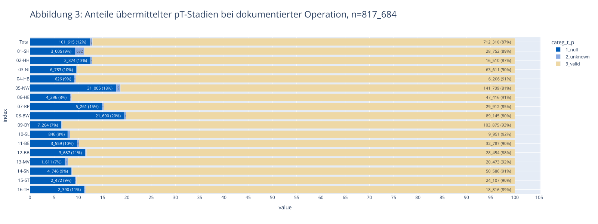
</picture>
    


<br>

### <a id='toc1_4_5_'></a>[Informationen zur Therapie](#toc0_)
#### <a id='toc1_4_5_1_'></a>[Fälle ohne Therapieangaben](#toc0_)

Der Anteil von Fällen ohne Therapieangaben betrug bundesweit über alle bösartigen Tumorerkrankungen (C00-C97 ohne C44, mit den unter 3.1. genannten Ausschlusskriterien) 23 % (nach Bundesland: 10-31 %). Der Anteil lag in den neuen Bundesländern und Berlin fast durchgehend niedriger (10-19 %) als in den alten Bundesländern (17-31 %) und bei soliden Tumoren (22 %) niedriger als bei systemischen Erkrankungen (Leukämien und Lymphome: 35 %). Im Zeitverlauf ist zwischen 2020 und 2022 keine Tendenz zu beobachten. Trotz Ausschluss der Diagnosen im 2. Halbjahr 2023 liegt der Anteil von Fällen ohne Therapieangaben in 2023 noch etwas über dem Wert der Vorjahre, auch hier ist wahrscheinlich noch mit nachträglich eingehenden Informationen zu rechnen.


```
    n = 3_241_401                                    (100.0%) 
    └ [DJ 2020-2023 ohne letzte 6m]:   n = 2_633_644  (81.3%) 
    └ [ICD10 nur C]:                   n = 2_207_903  (68.1%) 
    └ [keine DCO]:                     n = 2_129_378  (65.7%) 
    └ [keine C44,D04]:                 n = 1_736_942  (53.6%) 
    └ [keine Verstorbenen < 180 Tage]: n = 1_486_572  (45.9%)
```

<details>
<summary>filter-sql</summary>

```sql
Diagnosedatum between '2020-01-01' and '2023-06-30'
and left(z_icd10_3d,1) = 'C'
and not z_is_dco
and z_icd10_3d not in ('C44','D04')
and ifnull(z_period_diag_death_day,181) >= 180
```

</details>


    
    


<picture>
  <source media="(prefers-color-scheme: dark)" srcset="report_files_dark/output_17_6.svg">
  <source media="(prefers-color-scheme: light)" srcset="report_files/output_17_6.svg">
  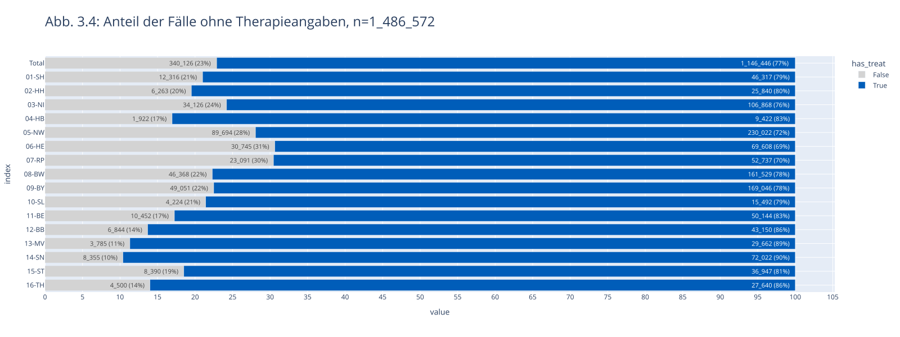
</picture>
    


<br>

#### <a id='toc1_4_5_2_'></a>[Fehlende Angaben zur Operation bei erwartbarer Operation (Brust- Darm-, Hodenkrebs und Malignes Melanom)](#toc0_)
In den folgenden Auswertungen wurden zusätzlich zu den unter 3.1. genannten Fällen auch noch solche mit primärer Fernmetastasierung ausgeschlossen. Für Fälle ohne dokumentierte, das jeweilige Organ betreffende Operation (ohne Berücksichtigung diagnostischer Eingriffe) wurde zusätzlich ausgewertet, ob ein gültiges pathologisches T-Stadium (pT) vorlag, was als Hinweis auf eine fehlende oder unvollständige klinische Meldung interpretiert werden kann. 

Nach Brustkrebsdiagnose liegen bundesweit in 25 % (nach Bundesländern: 9-32 %) keine Angaben zu einer Operation an der Brust vor. Bei etwa einem Drittel dieser Fälle ist ein pT vorhanden. Der Anteil von Fällen ohne dokumentierte Operation sinkt bei Ausschluss älterer Patientinnen (über 80 Jahre) von 25 % auf 23 %.
Nach dokumentierten Operationen war ein R-Status in 98 % der Fälle mit R0-2 angegeben (Bundesländer: 95-99 %), unter den sonstigen Fällen sind fehlende Befunde aufgrund nicht beurteilbarer Präparate (RX) eingerechnet (ohne Abbildung).

> [!NOTE]
> berücksichtigt sind UICC I-III
>
> Kategorien
>  - `1_op`: mind. eine OPS im definierten Bereich (3Steller, organspezifisch) ist dokumentiert
>  - `2_no_op_but_tp`: keine OPS, aber pT 1-4 ist dokumentiert
>  - `3_valid`: keine der zuvor genannten Merkmale trifft zu


```
    n = 3_241_401                                    (100.0%) ██████████████████████████████
    └ [DJ 2020-2023]:                  n = 2_989_092  (92.2%) ░░░███████████████████████████
    └ [ICD10 C50]:                       n = 316_685   (9.8%) ░░░░░░░░░░░░░░░░░░░░░░░░░░░░██
    └ [kein M1]:                         n = 295_287   (9.1%) ░░░░░░░░░░░░░░░░░░░░░░░░░░░░██
    └ [keine Verstorbenen < 180 Tage]:   n = 283_195   (8.7%) ░░░░░░░░░░░░░░░░░░░░░░░░░░░░██
```

<details>
<summary>filter-sql</summary>

```sql
z_dy between 2020 and 2023
and z_icd10_3d = 'C50'
and ifnull(z_m_pc_1,'') <> '1'
and ifnull(z_period_diag_death_day,181) >= 180
```

</details>


    
    


<picture>
  <source media="(prefers-color-scheme: dark)" srcset="report_files_dark/output_19_6.svg">
  <source media="(prefers-color-scheme: light)" srcset="report_files/output_19_6.svg">
  
</picture>
    


Beim Darmkrebs (C18-C20) liegen bundesweit in 32 % (nach Bundesländern: 10-41 %) keine Angaben zu einer Darmoperation (Abbildung 6) vor. In rund der Hälfte dieser Fälle ist ein pT vorhanden. Der Anteil von Fällen ohne dokumentierte Operation sinkt bei Ausschluss älterer Patientinnen und Patienten (>80 Jahre) auf 31 %. 


```
    n = 3_241_401                                    (100.0%) ██████████████████████████████
    └ [DJ 2020-2023]:                  n = 2_989_092  (92.2%) ░░░███████████████████████████
    └ [ICD10 C18-C20]:                   n = 226_382   (7.0%) ░░░░░░░░░░░░░░░░░░░░░░░░░░░░██
    └ [kein M1]:                         n = 187_563   (5.8%) ░░░░░░░░░░░░░░░░░░░░░░░░░░░░░█
    └ [keine Verstorbenen < 180 Tage]:   n = 161_924   (5.0%) ░░░░░░░░░░░░░░░░░░░░░░░░░░░░░█
```

<details>
<summary>filter-sql</summary>

```sql
z_dy between 2020 and 2023
and z_icd10_3d in ('C18', 'C19', 'C20')
and ifnull(z_m_pc_1,'') <> '1'
and ifnull(z_period_diag_death_day,181) >= 180
```

</details>


    
    


<picture>
  <source media="(prefers-color-scheme: dark)" srcset="report_files_dark/output_21_6.svg">
  <source media="(prefers-color-scheme: light)" srcset="report_files/output_21_6.svg">
  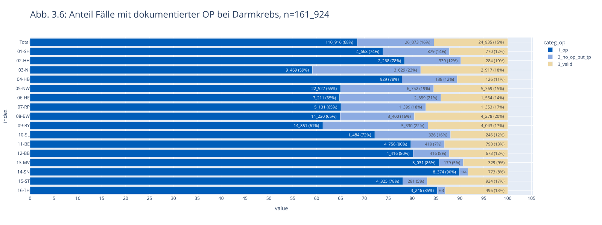
</picture>
    


Beim Malignen Hautmelanom (C43) liegen bundesweit in 42 % (nach Bundesländern: 3-77 %) keine Angaben zu einer zur Diagnose passenden Operation vor (Abbildung 7). In rund 80 % dieser Fälle ist ein pT vorhanden. Auch nach Ausschluss älterer am Melanom erkrankter Personen (>80 Jahre) liegt der Anteil von Fällen ohne dokumentierte Operationen bei 42 %.


```
    n = 3_241_401                                    (100.0%) ██████████████████████████████
    └ [DJ 2020-2023]:                  n = 2_989_092  (92.2%) ░░░███████████████████████████
    └ [C43]:                             n = 110_067   (3.4%) ░░░░░░░░░░░░░░░░░░░░░░░░░░░░░█
    └ [kein M1]:                         n = 107_527   (3.3%) ░░░░░░░░░░░░░░░░░░░░░░░░░░░░░░
    └ [keine Verstorbenen < 180 Tage]:   n = 104_913   (3.2%) ░░░░░░░░░░░░░░░░░░░░░░░░░░░░░░
```

<details>
<summary>filter-sql</summary>

```sql
z_dy between 2020 and 2023
and z_icd10_3d = 'C43'
and ifnull(z_m_pc_1,'') <> '1'
and ifnull(z_period_diag_death_day,181) >= 180
```

</details>


    
    


<picture>
  <source media="(prefers-color-scheme: dark)" srcset="report_files_dark/output_23_6.svg">
  <source media="(prefers-color-scheme: light)" srcset="report_files/output_23_6.svg">
  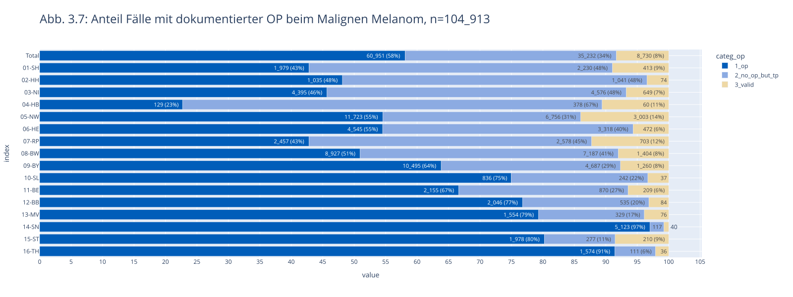
</picture>
    


Beim Hodenkrebs (C62) liegen bundesweit in 30 % (nach Bundesländern: 4-46 %) keine Angaben zu einer Hodenoperation vor (Abbildung 8). In rund 80 % dieser Fälle ist ein pT vorhanden. Auch nach Ausschluss älterer Hodenkrebspatienten (>80 Jahre) liegt der Anteil von Fällen ohne dokumentierte Operationen bei 30 %.


```
    n = 3_241_401                                    (100.0%) ██████████████████████████████
    └ [DJ 2020-2023]:                  n = 2_989_092  (92.2%) ░░░███████████████████████████
    └ [ICD10 C62]:                        n = 16_882   (0.5%) ░░░░░░░░░░░░░░░░░░░░░░░░░░░░░░
    └ [kein M1]:                          n = 15_892   (0.5%) ░░░░░░░░░░░░░░░░░░░░░░░░░░░░░░
    └ [keine Verstorbenen < 180 Tage]:    n = 15_657   (0.5%) ░░░░░░░░░░░░░░░░░░░░░░░░░░░░░░
```

<details>
<summary>filter-sql</summary>

```sql
z_dy between 2020 and 2023
and z_icd10_3d in ('C62')
and ifnull(z_m_pc_1,'') <> '1'
and ifnull(z_period_diag_death_day,181) >= 180
```

</details>


    
    


<picture>
  <source media="(prefers-color-scheme: dark)" srcset="report_files_dark/output_25_6.svg">
  <source media="(prefers-color-scheme: light)" srcset="report_files/output_25_6.svg">
  
</picture>
    


<br>

#### <a id='toc1_4_5_3_'></a>[Fehlende Angaben zur Strahlentherapie bei erwarteter Strahlentherapie (nach brusterhaltender Operation bei Brustkrebs)](#toc0_)
Nach brusterhaltender Operation eines bösartigen Tumors der Brust (BET) liegen bundesweit in 33 % (nach Bundesländern: 13-54 %) keine Angaben zu einer Strahlentherapie vor (Abbildung 9). Bei etwas mehr als der Hälfte dieser Fälle ist auch keine systemische Therapie dokumentiert, dies betrifft bundesweit insgesamt 18 % der Fälle. 

> [!NOTE]
> Brusterhaltende Therapie (BET): ein OPS Code mit den ersten 5 Stellen `5-870` liegt vor


```
    count: distinct z_tum_id
    ---
    n = 3_241_401                                    (100.0%) ██████████████████████████████
    └ [DJ 2020-2023 ohne letzte 6m]:   n = 2_633_644  (81.3%) ░░░░░░████████████████████████
    └ [ICD10 C50]:                       n = 278_699   (8.6%) ░░░░░░░░░░░░░░░░░░░░░░░░░░░░██
    └ [kein M1]:                         n = 259_569   (8.0%) ░░░░░░░░░░░░░░░░░░░░░░░░░░░░██
    └ [nur OPS für BET]:                 n = 144_136   (4.4%) ░░░░░░░░░░░░░░░░░░░░░░░░░░░░░█
    └ [keine Verstorbenen < 180 Tage]:   n = 143_832   (4.4%) ░░░░░░░░░░░░░░░░░░░░░░░░░░░░░█
```

<details>
<summary>filter-sql</summary>

```sql
Diagnosedatum between '2020-01-01' and '2023-06-30'
and z_icd10_3d = 'C50'
and ifnull(z_m_pc_1,'') <> '1'
and left(Code,5) in ('5-870')
and ifnull(z_period_diag_death_day,181) >= 180
```

</details>


    
    


<picture>
  <source media="(prefers-color-scheme: dark)" srcset="report_files_dark/output_27_7.svg">
  <source media="(prefers-color-scheme: light)" srcset="report_files/output_27_7.svg">
  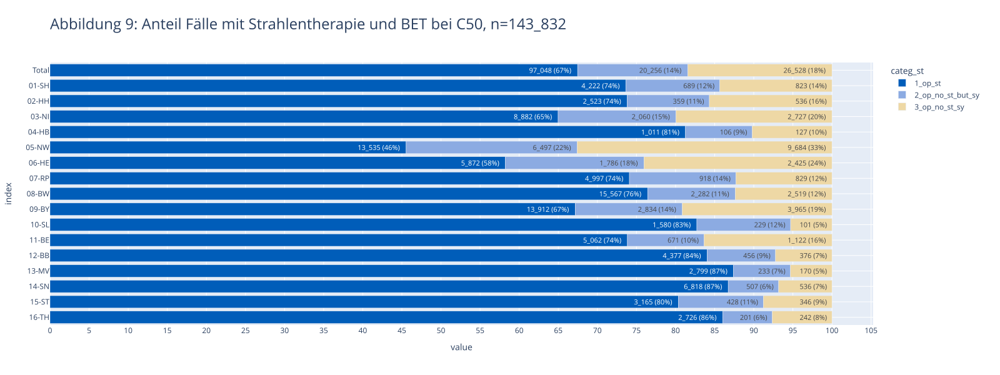
</picture>
    


<br>

### <a id='toc1_4_6_'></a>[Fehlende Angaben zur systemischen Therapie bei erwarteter systemischer Therapie (akute Leukämien und hochmaligne Lymphome, Kolonkarzinom Stadium III)](#toc0_)
Bei akut verlaufenden Leukämien und Lymphome (akute myeloide und lymphatische Leukämie, diffuses großzelliges B-Zell-Lymphom, follikuläres Lymphom Grad IIIb) liegen bundesweit in 23 % (nach Bundesländern: 9-55 %) keine Angaben zu einer systemischen Therapie vor (Abbildung 10). In der überwiegenden Mehrzahl dieser Fälle ist auch keine andere Therapie dokumentiert, dies betrifft bundesweit insgesamt 18 % der Fälle. 


Beim Kolonkarzinom im Stadium III (regionäre Lymphknotenbeteiligung) liegen bundesweit in 54 % (nach Bundesländern: 42-62 %) keine Angaben zu einer systemischen Therapie vor (Abbildung 11). In der überwiegenden Mehrzahl dieser Fälle ist eine andere Therapie, nur in 11 % der Fälle ist keine Therapie dokumentiert.

> [!NOTE]
> (Stadium III)
>
> Kategorien:
>   - `1_sy` - systemische Therapie
>   - `2_no_sy_but_other` - keine systemische Therapie, aber andere Therapie
>   - `3_no_treat` - keine Therapie


```
    n = 3_241_401                                                      (100.0%) ██████████████████████████████
    └ [DJ 2020-2023 ohne letzte 6m]:                     n = 2_633_644  (81.3%) ░░░░░░████████████████████████
    └ [z_icd10 in ('C91.0', 'C92.0', 'C83.3', 'C82.4')]:    n = 38_768   (1.2%) ░░░░░░░░░░░░░░░░░░░░░░░░░░░░░░
    └ [keine DCO]:                                          n = 37_488   (1.2%) ░░░░░░░░░░░░░░░░░░░░░░░░░░░░░░
    └ [kein M1]:                                            n = 37_461   (1.2%) ░░░░░░░░░░░░░░░░░░░░░░░░░░░░░░
    └ [keine Verstorbenen < 180 Tage]:                      n = 27_653   (0.9%) ░░░░░░░░░░░░░░░░░░░░░░░░░░░░░░
```

<details>
<summary>filter-sql</summary>

```sql
Diagnosedatum between '2020-01-01' and '2023-06-30'
and z_icd10 in ('C91.0', 'C92.0', 'C83.3', 'C82.4')
and not z_is_dco
and ifnull(z_m_pc_1,'') <> '1'
and ifnull(z_period_diag_death_day,181) >= 180
```

</details>


    
    


<picture>
  <source media="(prefers-color-scheme: dark)" srcset="report_files_dark/output_30_6.svg">
  <source media="(prefers-color-scheme: light)" srcset="report_files/output_30_6.svg">
  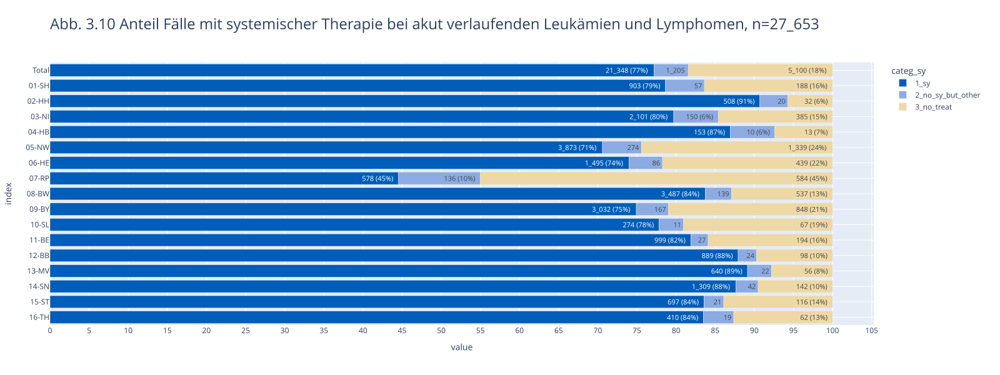
</picture>
    


```
    n = 3_241_401                                    (100.0%) ██████████████████████████████
    └ [DJ 2020-2023 ohne letzte 6m]:   n = 2_633_644  (81.3%) ░░░░░░████████████████████████
    └ [ICD10 C18]:                       n = 135_471   (4.2%) ░░░░░░░░░░░░░░░░░░░░░░░░░░░░░█
    └ [keine DCO]:                       n = 131_038   (4.0%) ░░░░░░░░░░░░░░░░░░░░░░░░░░░░░█
    └ [kein M1]:                         n = 107_658   (3.3%) ░░░░░░░░░░░░░░░░░░░░░░░░░░░░░░
    └ [keine Verstorbenen < 180 Tage]:    n = 95_755   (3.0%) ░░░░░░░░░░░░░░░░░░░░░░░░░░░░░░
    └ [pN in (1,2)]:                      n = 23_730   (0.7%) ░░░░░░░░░░░░░░░░░░░░░░░░░░░░░░
```

<details>
<summary>filter-sql</summary>

```sql
Diagnosedatum between '2020-01-01' and '2023-06-30'
and z_icd10_3d in ('C18')
and not z_is_dco
and ifnull(z_m_pc_1,'') <> '1'
and ifnull(z_period_diag_death_day,181) >= 180
and left(z_n_p_1,1) in ('1','2')
```

</details>


    
    


<picture>
  <source media="(prefers-color-scheme: dark)" srcset="report_files_dark/output_31_6.svg">
  <source media="(prefers-color-scheme: light)" srcset="report_files/output_31_6.svg">
  
</picture>
    


<br>

### <a id='toc1_4_7_'></a>[Abstand zwischen Diagnose und erster Operation](#toc0_)
Der mediane Abstand zwischen Diagnose und erster Operation lag bei 26 Tagen (nach Bundesländern: 7-31 Tage, Abbildung 12).


```
    count: distinct z_tum_id
    ---
    n = 3_241_401                   (100.0%) ██████████████████████████████
    └ [DJ 2020-2023]: n = 2_989_092  (92.2%) ░░░███████████████████████████
    └ [nur erste OP]: n = 1_290_573  (39.8%) ░░░░░░░░░░░░░░░░░░░███████████
```

<details>
<summary>filter-sql</summary>

```sql
z_dy between 2020 and 2023
and z_op_order = 1
```

</details>


    
    


<picture>
  <source media="(prefers-color-scheme: dark)" srcset="report_files_dark/output_33_6.png">
  <source media="(prefers-color-scheme: light)" srcset="report_files/output_33_6.png">
  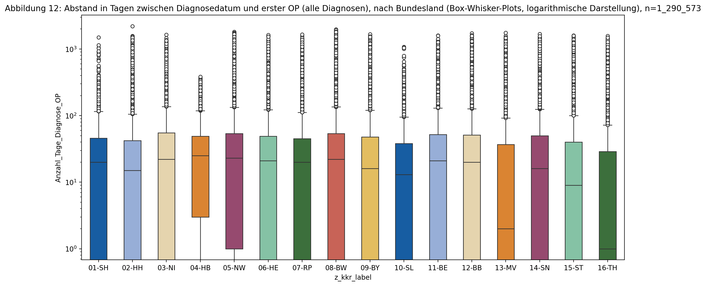
</picture>
    


    
    column (n = 1_290_573)  |     notnull     | min  | lower | q25  | median | mean  |  q75  | upper |  max  |  std  |  cv 
    ------------------------+-----------------+------+-------+------+--------+-------+-------+-------+-------+-------+-----
    Anzahl_Tage_Diagnose_OP | 1_271_631 (98%) | -304 |   -34 | 0.00 |  19.00 | 47.54 | 49.00 |   122 | 2_204 | 98.96 | 2.08
    


    
    item (n = 1_290_573) |  count  | min  | lower | q25  | median | mean  |  q75  | upper |  max  |  std   |  cv 
    ---------------------+---------+------+-------+------+--------+-------+-------+-------+-------+--------+-----
    01-SH                |  44_153 |    0 |     0 | 0.00 |  20.00 | 39.21 | 46.00 |   115 | 1_498 |  59.89 | 1.53
    02-HH                |  26_895 |    0 |     0 | 0.00 |  15.00 | 45.86 | 42.00 |   105 | 2_204 | 107.44 | 2.34
    03-NI                |  92_380 |    0 |     0 | 0.00 |  22.00 | 47.08 | 55.00 |   137 | 1_635 |  76.37 | 1.62
    04-HB                |   9_001 |    0 |     0 | 3.00 |  25.00 | 42.04 | 49.00 |   118 |   384 |  57.03 | 1.36
    05-NW                | 257_291 |    0 |     0 | 1.00 |  23.00 | 58.11 | 54.00 |   133 | 1_812 | 124.40 | 2.14
    06-HE                |  69_922 |    0 |     0 | 0.00 |  21.00 | 45.40 | 49.00 |   122 | 1_632 |  83.01 | 1.83
    07-RP                |  48_914 |    0 |     0 | 0.00 |  20.00 | 43.81 | 45.00 |   112 | 1_649 |  88.96 | 2.03
    08-BW                | 166_886 |    0 |     0 | 0.00 |  22.00 | 53.24 | 54.00 |   135 | 1_967 | 112.39 | 2.11
    09-BY                | 179_760 |    0 |     0 | 0.00 |  16.00 | 44.65 | 48.00 |   120 | 1_671 |  89.88 | 2.01
    10-SL                |  15_891 |    0 |     0 | 0.00 |  13.00 | 35.94 | 38.00 |    95 | 1_080 |  65.85 | 1.83
    11-BE                |  56_246 |    0 |     0 | 0.00 |  21.00 | 47.61 | 52.00 |   130 | 1_599 |  90.79 | 1.91
    12-BB                |  48_958 |    0 |     0 | 0.00 |  20.00 | 47.47 | 51.00 |   127 | 1_724 |  93.58 | 1.97
    13-MV                |  51_567 | -304 |   -34 | 0.00 |   2.00 | 36.04 | 37.00 |    92 | 1_753 |  86.56 | 2.40
    14-SN                |  95_890 |    0 |     0 | 0.00 |  16.00 | 46.77 | 50.00 |   125 | 1_680 |  96.66 | 2.07
    15-ST                |  61_468 |    0 |     0 | 0.00 |   9.00 | 36.29 | 40.00 |   100 | 1_595 |  79.32 | 2.19
    16-TH                |  46_409 |    0 |     0 | 0.00 |   1.00 | 30.89 | 29.00 |    72 | 1_569 |  81.09 | 2.62
    


<br>

### <a id='toc1_4_8_'></a>[Informationen zum Krankheitsverlauf](#toc0_)
#### <a id='toc1_4_8_1_'></a>[Nach Brustkrebs](#toc0_)
Für Patientinnen mit Brustkrebsdiagnosen und Operation ohne Residualtumor (R0) aus den Jahren 2020/2021 ist bis Ende 2023 in 5 % der Fälle (nach Bundesländern: 2-8 %, 4 Bundesländer ohne Angaben, Abbildung 13) ein Verlaufsereignis dokumentiert. In gut zwei Drittel dieser Fälle betraf dies Fernmetastasen, teilweise in Kombination mit Lokalrezidiven und Lymphknotenmetastasen. Für diese Auswertungen wurden verschiedene Variablen genutzt, Abbildung 14 zeigt alle Kombinationen der relevanten Ausprägungen. Es wurde kein Mindestabstand zum Diagnosedatum festgelegt. 

> [!NOTE]
> Zeitraum bis Ende 2023 nach Brustkrebsdiagnose in 2020/2021
> 
> Kategorien:
>   - `1_fo_relapse` - Rezidiven
>   - `2_fo_relapse_tnm` - Rezidiven nach TNM
>   - `3_no_relapse` - Kein Rezidiv


```
    count: distinct z_tum_id
    ---
    n = 3_241_401                                    (100.0%) ██████████████████████████████
    └ [DJ 2020-2021]:                  n = 1_495_715  (46.1%) ░░░░░░░░░░░░░░░░░█████████████
    └ [ICD10 C50]:                       n = 157_980   (4.9%) ░░░░░░░░░░░░░░░░░░░░░░░░░░░░░█
    └ [kein M1]:                         n = 146_979   (4.5%) ░░░░░░░░░░░░░░░░░░░░░░░░░░░░░█
    └ [Residualstatus R0]:                n = 89_812   (2.8%) ░░░░░░░░░░░░░░░░░░░░░░░░░░░░░░
    └ [keine Verstorbenen < 180 Tage]:    n = 89_461   (2.8%) ░░░░░░░░░░░░░░░░░░░░░░░░░░░░░░
```

<details>
<summary>filter-sql</summary>

```sql
z_dy between 2020 and 2021
and z_icd10_3d = 'C50'
and ifnull(z_m_pc_1,'') <> '1'
and upper(left(Lokale_Beurteilung_Residualstatus,2)) = 'R0'
and ifnull(z_period_diag_death_day,181) >= 180
```

</details>


    
    


<picture>
  <source media="(prefers-color-scheme: dark)" srcset="report_files_dark/output_35_6.svg">
  <source media="(prefers-color-scheme: light)" srcset="report_files/output_35_6.svg">
  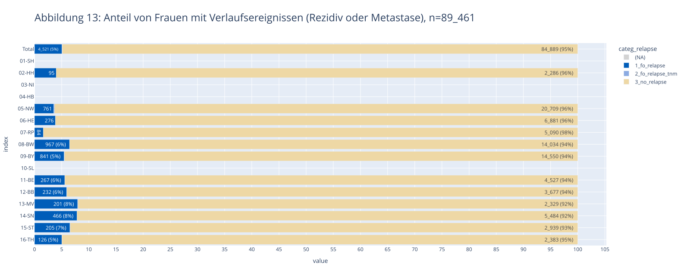
</picture>
    


Abbildung 14: Verteilung der Verlaufsereignisse bis Ende 2023 nach Brustkrebsdiagnose in 2020/2021 (inkl. aller Kombinationen)

    n = 89_461 | n(true) = 4_521


    
<picture>
  <source media="(prefers-color-scheme: dark)" srcset="report_files_dark/output_37_1.png">
  <source media="(prefers-color-scheme: light)" srcset="report_files/output_37_1.png">
  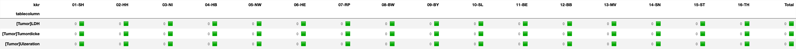
</picture>
    


<br>

#### <a id='toc1_4_8_2_'></a>[Nach Darmkrebs](#toc0_)
Für Personen mit Darmkrebsdiagnosen und Operation ohne Residualtumor (R0) aus den Jahren 2020/2021 ist bis Ende 2023 in 10 % der Fälle (nach Bundesländern: 3-14 %, 4 Bundesländer ohne Angaben) ein Verlaufsereignis dokumentiert (Abbildung 15). In gut zwei Drittel dieser Fälle betraf dies Fernmetastasen, teilweise in Kombination mit Lokalrezidiven und Lymphknotenmetastasen. Für diese Auswertungen wurden verschiedene Variablen genutzt, Abbildung 16 zeigt alle Kombinationen der relevanten Ausprägungen. Es wurde kein Mindestabstand zum Diagnosedatum festgelegt. 


```
    count: distinct z_tum_id
    ---
    n = 3_241_401                                    (100.0%) ██████████████████████████████
    └ [DJ 2020-2021]:                  n = 1_495_715  (46.1%) ░░░░░░░░░░░░░░░░░█████████████
    └ [ICD10 C18-C20]:                   n = 114_553   (3.5%) ░░░░░░░░░░░░░░░░░░░░░░░░░░░░░█
    └ [kein M1]:                          n = 94_460   (2.9%) ░░░░░░░░░░░░░░░░░░░░░░░░░░░░░░
    └ [Residualstatus R0]:                n = 49_856   (1.5%) ░░░░░░░░░░░░░░░░░░░░░░░░░░░░░░
    └ [keine Verstorbenen < 180 Tage]:    n = 46_861   (1.4%) ░░░░░░░░░░░░░░░░░░░░░░░░░░░░░░
```

<details>
<summary>filter-sql</summary>

```sql
z_dy between 2020 and 2021
and z_icd10_3d in ('C18', 'C19', 'C20')
and ifnull(z_m_pc_1,'') <> '1'
and upper(left(Lokale_Beurteilung_Residualstatus,2)) = 'R0'
and ifnull(z_period_diag_death_day,181) >= 180
```

</details>


    
    


<picture>
  <source media="(prefers-color-scheme: dark)" srcset="report_files_dark/output_39_8.svg">
  <source media="(prefers-color-scheme: light)" srcset="report_files/output_39_8.svg">
  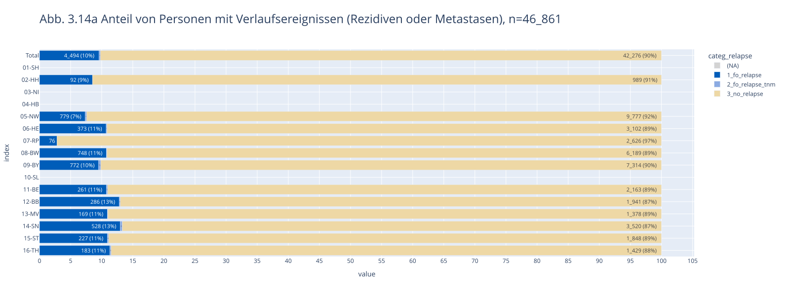
</picture>
    


Abbildung 16: Verteilung der Verlaufsereignisse bis Ende 2023 nach Darmkrebsdiagnose 2020/2021 (inkl. aller Kombinationen)

    n = 46_861 | n(true) = 4_494


    
<picture>
  <source media="(prefers-color-scheme: dark)" srcset="report_files_dark/output_41_1.png">
  <source media="(prefers-color-scheme: light)" srcset="report_files/output_41_1.png">
  
</picture>
    


<br>

### <a id='toc1_4_9_'></a>[Einordnung der Ergebnisse zur Datenqualität](#toc0_)

Bei der Interpretation der Auswertungen sind folgende Aspekte zu berücksichtigen:

Bei Krebsregisterdaten ist grundsätzlich nicht zu erwarten, dass die Qualität von Daten aus klinischen, z.B.  Zulassungsstudien erreicht werden kann. Trotz Meldepflicht können die Register eine vollständige und fehlerfreie Meldung aller klinisch verfügbaren Informationen (soweit im oBDS abbildbar) nicht erzwingen.
Viele Methoden, die in Studien zur Steigerung der Datenqualität zur Anwendung kommen (Datenaudits, Validierung anhand von Krankenakten) kommen in bevölkerungsbezogenen Krebsregistern nicht oder nur bedingt zum Einsatz. Auch Plausibilitätsprüfungen bei der Dateneingabe bzw. beim Export aus Krankenhausinformationssystemen können nur einen gewissen Teil fehlerhafte Meldungen abfangen, oft ergeben sich Widersprüche aus Meldungen unterschiedlicher Einrichtungen zum gleichen Erkrankungsfall. 

Unvollständige Daten, z.B. zum Tumorstadium, können sich auch aus der klinischen Situation ergeben: so wird auf umfassende Untersuchungen zum Staging im klinischen Alltag im bestimmten Fällen, aufgrund des gesundheitlichen Zustands oder auf Wunsch der Betroffenen, verzichtet, vor allem, wenn sich aus den Ergebnissen absehbar keine therapeutischen Konsequenzen ergeben würden. 

Bezüglich der Daten zur Therapie und zum Krankheitsverlauf kann in den Krebsregisterdaten nicht zwischen nicht gemeldeten und nicht durchgeführten Therapien bzw. stattgefunden Ereignissen unterschieden werden. Es gibt für die Meldenden außerdem keine Möglichkeit, den Grund für eine Abweichung von etablierten Therapieschemata bzw. Leitlinien im OBDS zu dokumentieren. 

In den obigen Auswertungen wurden exemplarische Fallkonstellationen ausgewählt, in denen (mangels gleichwertiger Alternativen) eine bestimmte Therapie in der Regel bzw. nach aktuellen Leitlinien zu erwarten wäre (z.B. Operationen bei Brustkrebs im Stadium I-III). Im klinischen Alltag ist aus den genannten Gründen (z.B. schwere Begleiterkrankungen) jedoch nicht davon auszugehen, dass diese Therapien in allen Fällen durchgeführt werden.  Es ist vielmehr damit zu rechnen, dass sich in einem gewissen Anteil der Fälle Behandelnde und/oder Betroffene begründet gegen eine bestimmte Behandlung entschieden haben. Die je nach Diagnose und Therapieart gefundenen Anteile und die teilweise große Heterogenität zwischen den Bundesländern spricht jedoch dafür, dass tumorbezogene Therapien derzeit noch nicht vollständig in den Krebsregistern erfasst werden. Der in allen Registern gefundene hohe Anteil von Patientinnen und Patienten ohne gemeldete bzw. dokumentierte systemische Therapie bei bösartigen Tumoren des Kolons im Stadium III (Lymphknotenbefall)  könnte aber auch darauf hindeuten, dass diese Therapie in einem relevanten Anteil der Fälle entgegen der Leitlinienempfehlungen nicht durchgeführt wird.

Der Anteil nicht erfasster Therapien lässt sich aus den Ergebnissen aus den genannten gründen nicht direkt ableiten.  Es ist daher auch nicht auszuschließen, dass die gezeigten Unterschiede zwischen den Bundesländern bezüglich nicht gemeldeter (aber erwarteter) Therapien zum Teil auch reale Unterschiede in der Versorgung abbilden. Außerdem sind die hier gezeigten Ergebnisse für ausgewählte Diagnosen nicht ohne weiteres auf andere Entitäten übertragbar.

Insgesamt ist allerdings davon auszugehen, dass die Erfassung von inzidenter Krebsdiagnosen in den Krebsregistern derzeit noch vollständiger gelingt als die Erfassung der Therapien. Dies ist auch dadurch bedingt, dass pathologische Institute direkt an das Krebsregister melden, da sie zu den „Krebserkrankungen diagnostizierenden“ Einrichtungen gehören. Eine pathologische Befundmeldung reicht in vielen Fällen aus, um im Krebsregister Angaben zur Diagnose differenziert (nach Lokalisation, Histologie und Tumorstadium) zu dokumentieren, bei Fehlen einer klinischen Meldung wären dann allerdings keine Angaben zur Therapie vorhanden. Umgekehrt ist es bei Fehlen einer pathologischen Meldung und Vorhandensein einer klinischen Meldung in der Regel zu erwarten, dass die wesentlichen Informationen aus dem pathologischen Befund (z.B. zu Histologie und pathologischem Tumorstadium) über die klinische Meldung an das Register übermittelt werden. Da im Datensatz des ZfKD Informationen von verschiedenen meldenden Einrichtungen zusammengefasst sind („Best-of“), ist in den Daten nicht direkt erkennbar, welche Meldungstypen den Angaben zugrunde liegen. Ein Hinweis auf eine fehlende oder unvollständige klinische Meldung bei vorhandener pathologischer Meldung kann die relativ häufig vorhandene gültige Angabe zum pathologischem T-Stadium („pT“) bei fehlenden Angaben zu einer (zur Lokalisation des Tumors passenden) Operation sein. In Einzelfällen kann es allerdings zumindest beim Melanom und beim Darmkrebs vorkommen, dass der Tumor im Rahmen einer ursprünglich diagnostischen Prozedur im Ganzen entfernt werden kann und daher auch ohne Operation eine pathologisches T-Stadium bestimmbar ist, dies könnte einen Teil der Fälle mit pT ohne Operation erklären.

Die in einigen Registern deutlich nach unten abweichenden medianen Abstände zwischen Diagnose und erster Operation lassen auf Unterschiede zwischen den Registern bei der Definition des Diagnosedatums oder unterschiedliches Meldeverhalten zu dieser Variable schließen. 

Derzeit kann die Vollständigkeit der Erfassung bestimmter Ereignisse im Krankheitsverlauf noch nicht beurteilt werden. Zum einen ist die Beobachtungszeit ab Erstdiagnose noch relativ kurz (maximal knapp vier Jahre), zum anderen existiert derzeit keine einzelne Datenquelle, mit denen sich an den Krebsregisterdaten ermittelten diagnosespezifischen Rezidiv- und Metastasierungsraten validieren lassen. 

Das ZfKD plant eine entsprechende Evaluation in den nächsten zwei Jahren anhand einer ausführlichen Literaturrecherche für ausgewählte Diagnosen, ggf. in Abhängigkeit vom Tumorstadium.

Eine gewisse Einschränkung bei der Beurteilung von Rezidiven ergibt sich aus der Definition eines Rezidivs. Ein Rezidiv kann grundsätzlich nur festgestellt werden, wenn zuvor Tumorfreiheit (Remission) bestand. Diese kann grundsätzlich nach einer Operation, Strahlentherapie, systemischen Therapie oder einer Kombination verschiedener Therapieformen erzielt werden. 

Im Datensatz des ZfKD kann Tumorfreiheit durch den R-Status nach Operation (R0), durch ein yT0 während oder nach multimodaler Therapie oder durch die Angabe einer Remission im Krankheitsverlauf abgebildet werden. Da eine Remission im Verlauf in vielen Bundesländern kein meldebegründendes Ereignis darstellt (im Gegensatz zum Lokalrezidiv, einer Metastasierung oder einer Änderung der Therapie) wird in einigen Fällen die Abgrenzung zwischen einem Fortschreiten der Erkrankung (Progression) und einem Rezidiv schwierig sein, vor allem wenn eine Tumorfreiheit nicht primär durch eine Operation erzielt wurde.  Dies gilt vor allem für Neubildungen der blutbildenden und lymphatischen Organe, für die in der Regel werder der R-Status noch das y-TNM zur Verfügung steht. Dazu kommt, dass auch bei operativ behandelten Tumoren nach den Erfahrungen aus den Landeskrebsregistern die Angaben zu  Rezidiven und Progressionen in den klinischen Verlaufsmeldungen häufig inkonsistent sind. 

Mögliche Gründe für unterbliebene oder unvollständige (klinische) Meldungen an die Krebsregister können aus den Daten des ZfKD nicht abgeleitet werden. Bekannt ist, dass die Meldung für nicht auf Krebsbehandlungen spezialisierte Kliniken und vor allem für niedergelassene Ärztinnen und Ärzte um einiges aufwändiger ist als für zertifizierte Tumorzentren und Pathologische Institute. Gerade im Bereich der Niedergelassenen, aber auch in vielen Kliniken ist eine automatisierte Meldung über eine Schnittstelle aus der elektronischen Klinik- oder Praxisdokumentation noch nicht realisiert. Hier liegt es nahe, dass Meldungen an das Krebsregister wegen des hohen Aufwands trotz Meldepflicht im Praxis- oder Klinikalltag häufiger unterbleiben.


<br>

### <a id='toc1_4_10_'></a>[Erfahrungen mit der Antragsbearbeitung und Datenübermittlung](#toc0_)

#### <a id='toc1_4_10_1_'></a>[Einleitung - Gesetzliche Vorgaben für die Bearbeitung von Datennutzungsanträgen](#toc0_)

Die Bedingungen und Fristen für eine Bereitstellung oder Übermittlung von Daten des ZfKD zu Forschungszwecken sind in § BKRG geregelt. Danach ist jeder Datennutzungsantrag vom ZfKD zu prüfen und dem wissenschaftlichen Ausschuss beim ZfKD vorzulegen. Der wissenschaftliche Ausschuss hat die Möglichkeit zur Stellungnahme (§ 4 Abs. 2 BKRG). Diese kann, soweit „der Umfang und die Schwierigkeit der Prüfung“ es erfordern, auch durch das ZfKD eingefordert werden. Die Prüfung eines Datennutzungsantrags betrifft unter anderem den beantragten Datenumfang und dessen Eignung und Erforderlichkeit für die geplanten Forschungszwecke (§ 8 Abs. 1 BKRG). 

Die Zusammenarbeit zwischen dem ZfKD und dem wissenschaftlichen Ausschuss orientiert sich an der im Jahr 2022 verabschiedeten und im März 2025 überarbeiteten Geschäftsordnung des wissenschaftlichen Ausschusses und den dort festgelegten Abläufen und Fristen. Die ZfKD-internen Arbeitsabläufe bei der Antragsbearbeitung folgen einem standardisierten Vorgehen, das in einer Verfahrensanweisung, mehreren Kurzanleitungen und einem Leitfaden für die Bewertung des spezifischen Reidentifizierungsrisikos beschrieben ist. Datennutzungsanträge müssen in der Regel innerhalb von drei, bei erhöhtem Prüfungsaufwand nach spätestens vier Monaten ab Eingang des vollständigen Antrags beschieden werden (§ 8 Abs. 4 BKRG).


<br>

#### <a id='toc1_4_10_2_'></a>[Eingang und Prüfung von Datennutzungsanträgen im ZfKD](#toc0_)

Um einen Datennutzungsantrag einzureichen, müssen Interessierte die auf den Internetseiten des ZfKD als PDF-Dokument bereitstehenden Antragsformulare ausfüllen und als E-Mail-Anhang einsenden. Bei der Sichtung eingesandter Antragsformulare entstehen seitens des ZfKD häufig Rückfragen, die eine Überarbeitung des Antrags durch die Antragsteller erforderlich machen, beispielsweise weil der beantragte Datenumfang nicht ausreichend begründet ist oder weil Angaben zum Datenschutz fehlen. Das heißt, Antragsteller müssen ihren Antrag bzw. einzelne Formulare erneut, mitunter mehrfach, einsenden, bevor der Datennutzungsantrag dem ZfKD vollständig und widerspruchsfrei vorliegt. Jede Anpassung bzw. jeder erneute Eingang wird im ZfKD dokumentiert. Die inhaltliche Prüfung von Datennutzungsanträgen beschränkt sich im Wesentlichen auf die Frage, ob die beantragten Daten für die Beantwortung der Forschungsfragen notwendig und hinreichend sind. Inwieweit beispielsweise der aktuelle Wissensstand in Bezug auf die Forschungsfrage korrekt wiedergegeben ist oder ob die beschriebenen Auswertungsmethoden dem aktuellen Stand der Forschung entsprechen, ist nicht Gegenstand
der Prüfung. Eine Stellungnahme des wissenschaftlichen Ausschusses wird vor allem dann angefordert, wenn Zweifel an der Eignung der Daten für die Beantwortung der Forschungsfragen oder Hinweise für ein erhöhtes Reidentifikationsrisiko (unter Berücksichtigung dateninhärenter und kontextueller Faktoren) bestehen.

Das ZfKD hat wiederholt Anpassungen der PDF-Formulare vorgenommen, um deren Verständlichkeit zu verbessern, um aktuelle Datenschutzanforderungen korrekt abzubilden oder um die Formulare sehbehinderten Nutzern zugänglich zu machen.

Die PDF-Formulare werden nach ihrem Eingang im E-Mail-Funktionspostfach des ZfKD für die weitere Antragsbearbeitung an verschiedenen Orten gespeichert bzw. zugänglich gemacht: (i) im Dokumenten-Management-System des Robert Koch-Instituts zur Veraktung, (ii) auf dem Laufwerk des ZfKD für die inhaltliche Prüfung und (iii) auf dem BSCW-Server des Informationstechnikzentrums Bund, um die Unterlagen dem wissenschaftlichen Ausschuss bereitzustellen (Abschnitt 4.3).


<br>

#### <a id='toc1_4_10_3_'></a>[Vorlage von Datennutzungsanträgen beim wissenschaftlichen Ausschuss](#toc0_)

Antragsformulare und begleitende Dokumente, insbesondere die Dokumentation über die Berechnung des dateninhärenten Verknüpfungspotenzials, werden den Mitgliedern des wissenschaftlichen Ausschusses über den BSCW-Server des Informationstechnikzentrums Bund zugänglich gemacht.

Für die Mitglieder des wissenschaftlichen Ausschusses wurden durch das ZfKD Nutzerkonten auf dem BSCW-Server angelegt. Dessen intuitive Bedienbarkeit und Nutzungsmöglichkeiten sind begrenzt.  Beispielsweise sind die direkte Kommentierung von Antragsunterlagen oder die gemeinsame Erarbeitung von Beschlussvorlagen auf dem BSCW-Server nicht möglich.


<br>

#### <a id='toc1_4_10_4_'></a>[Aufgabenverwaltung](#toc0_)

Zur Nachverfolgung des Fortschritts bei der Bearbeitung von Datennutzungsanträgen nutzt das ZfKD die seit 2021 am Robert Koch-Institut für interne Zwecke verfügbare Anwendung Jira. Die Bearbeitung jedes Datennutzungsantrags ist dort in zwölf und mehr definierte Unteraufgaben mit zugewiesenen Zuständigkeiten gegliedert, darunter die Aufbereitung des dateninhärenten Reidentifizierungsrisikos (Details im Abschnitt 4.5), die Erstellung des Kostenbescheids (Abschnitt 4.7) oder das Anlegen eines Eintrags im öffentlichen Verzeichnis bewilligter Datennutzungsanträge (Abschnitt 4.11). In der Anwendung wird auch dokumentiert, ob für einen Datennutzungsantrag die Stellungnahme des wissenschaftlichen Ausschusses angefordert werden soll (Abschnitt 4.6), ob der Antragsteller einen PGP-Schlüssel für die Datenverschlüsselung bereitgestellt hat (Abschnitt 4.8) und ob der Datenempfänger das ZfKD über die Löschung der übermittelten Daten (Abschnitt 4.10) oder über eine Ergebnispublikation (Abschnitt 4.12) informiert hat. Der interne Austausch zu einzelnen Aufgaben ist über eine Kommentarfunktion möglich.

Über individuell konfigurierbare Jira-Assets können Befreiungstatbestände mit antragstellenden Einrichtungen und antragstellende Einrichtungen mit einzelnen Anträgen verknüpft werden. Ebenso können Kassenzeichen für die Rechnungslegung oder Berichterstatter elektronisch einzelnen Anträgen zugewiesen werden. Die Konfiguration von Assets und die Anpassung von Prozessen erfolgt im engen Austausch zwischen ZfKD und der Abteilung für Informationstechnologie des Robert Koch-Instituts.

Im Jahr 2025 waren zu jedem Zeitpunkt zwischen 10 und 15 Datennutzungsanträge beim ZfKD in Bearbeitung.


<br>

#### <a id='toc1_4_10_5_'></a>[Bewertung des spezifischen Reidentifizierungsrisikos, Festlegung allgemeiner Vorgaben zur Risikobewertung, Berechnung des dateninhärenten Verknüpfungspotenzials, Maßnahmen zur Risikominimierung](#toc0_)
Vor jeder Datenübermittlung bewertet das ZfKD entsprechend § 8 Abs. 5 Satz 1 BKRG das assoziierte spezifische Reidentifizierungsrisiko und minimiert dieses gegebenenfalls durch geeignete Maßnahmen, die die angestrebten Forschungsziele möglichst wenig beeinträchtigen. In seine Bewertung bezieht das ZfKD sowohl dateninhärente als auch kontextuelle Faktoren (z.B. Datensicherheit in der datenverarbeitenden Einrichtung) ein. Die allgemeinen Vorgaben, die der Risikobewertung des ZfKD zugrunde liegen, wurden entsprechend den Vorgaben des § 8 Abs. 5 Satz 2 BKRG gemeinsam mit dem wissenschaftlichen Ausschuss erarbeitet. Hierzu wurde im Jahr 2022 eine Arbeitsgruppe aus Vertretern des ZfKD, Mitgliedern des wissenschaftlichen Ausschusses und externen Experten ins Leben gerufen, deren Arbeit in einen Leitfaden zur Bewertung des spezifischen Reidentifizierungsrisikos mündete, der im Oktober 2024 einschließlich mehrerer Anlagen (inkl. Checklisten) auf der Internetseite des ZfKD veröffentlicht wurde. Für die Berechnung des dateninhärenten Verknüpfungspotenzials von Einzelfalldaten wurde am ZfKD ein R-Skript entwickelt, das individuell an die jeweilige Datenanforderung angepasst wird. Bei der Berechnung werden mehrere denkbare Szenarien einbezogen, die von unterschiedlich detailliertem Vorwissen eines potenziellen Angreifers ausgehen. Die Ergebnisse der Berechnung werden in einem HTML-Dokument abgebildet, das dem ZfKD und dem wissenschaftlichen Ausschuss als Grundlage für die Bewertung des spezifischen Reidentifizierungsrisikos und für die Ableitung geeigneter Maßnahmen für dessen Minimierung dient.

Die Beurteilung kontextueller Risiko- bzw. Schutzfaktoren erfolgt anhand der Angaben der Antragsteller in den Antragsformularen, die zuletzt im Oktober 2025 in Zusammenarbeit mit der Datenschutzbeauftragten des Robert Koch-Instituts überarbeitet wurden. In den Antragsformularen werden u. a. die Rollen der an der Datenverarbeitung beteiligten Personen, deren regelmäßige Teilnahme an Schulungen zum datenschutzkonformen Umgang mit personenbezogenen Daten und das Vorliegen eines Datenschutzkonzepts an der antragstellenden Einrichtung abgefragt. Werden aggregierte Daten beantragt, müssen Antragsteller keine Angaben zu kontextuellen Risikofaktoren machen, da bei der Übermittlung aggregierter Daten in aller Regel von einer geringen dateninhärenten Verknüpfungswahrscheinlichkeit und einem sehr begrenzten Informationszugewinn (im Falle einer erfolgreichen Verknüpfung) ausgegangen werden kann. Sollte es bei aggregierten Daten zur Einschätzung eines erhöhten spezifischen Reidentifizierungsrisikos kommen, werden diese Angaben nachträglich erhoben. Wird bei der Bewertung eines Datennutzungsantrags ein erhöhtes (spezifisches) Reidentifizierungsrisiko festgestellt, empfiehlt das ZfKD geeignete Maßnahmen zur Risikominimierung. Dabei berücksichtigt es die angestrebten Forschungsziele und bezieht, soweit möglich, die Antragsteller ein. Auch der wissenschaftliche Ausschuss kann im Rahmen der Antragsbegutachtung entsprechende Maßnahmen empfehlen. Zu den häufig umgesetzten spezifischen Risikominimierungsmaßnahmen gehören (i) die Vergröberung des monats- oder jahresgenauen Diagnosealters, z. B. zu Fünf-Jahres-Altersgruppen, (ii) der Verzicht auf die Übermittlung von Tumorfällen mit einem Diagnosealter unter 18 Jahren oder (iii) der Verzicht auf die Übermittlung monatsgenauer Datumsangaben (Geburt, Diagnose, Therapiebeginn, Tod), wenn dieser für die geplanten Auswertungen nicht zwingend benötigt wird. Dies betrifft z. B. das Geburtsdatum bei gleichzeitiger Beantragung des Diagnosealters. In der Regel werden stattdessen die zeitlichen Abstände zwischen den für die geplanten Auswertungen relevanten Ereignissen monats- oder (soweit vorliegend) tagesgenau übermittelt.


<br>

#### <a id='toc1_4_10_6_'></a>[Abgabe von Stellungnahmen, Erstellung von Beschlussvorlagen, Beschlussfassung](#toc0_)
Mit steigender Zahl der Anträge und zunehmender Erfahrung bei der Antragsbearbeitung ist der Anteil der Anträge, bei denen das ZfKD den wissenschaftlichen Ausschuss nach § 8 Abs. 3 BKRG zur Abgabe einer Stellungnahme aufgefordert und jeweils zwei Mitglieder des wissenschaftlichen Ausschusses als Berichterstatter angefragt hat, zurückgegangen. Im Jahr 2025 war dies noch bei 14 von insgesamt 41 Datennutzungsanträgen der Fall. In bisherigen Stellungnahmen formulierten Berichterstatter fachliche Hinweise an die Datenempfänger, beispielsweise zu möglichen Verzerrungen oder Limitationen, sie
stellten Rückfragen zu den im Antrag genannten Auswertungszielen oder sie forderten zusätzliche Angaben oder Dokumente zu Datenschutzaspekten ein, zum Beispiel präzisierende Angaben zum Datenverarbeitungsort oder eine Erklärung des Datenschutzbeauftragten. Fachliche Hinweise der Berichterstatter zur Datenauswertung und -interpretation werden vom ZfKD im Datennutzungsbescheid an den Datenempfänger weitergegeben. 

Das ZfKD unterstützt die Berichterstatter nach § 4 Abs. 2 der Geschäftsordnung bei der Erstellung ihrer Beschlussvorlagen, indem es für jeden Datennutzungsantrag eine entsprechende Vorlage erstellt. Die Abstimmung über Beschlussvorlagen erfolgt entweder elektronisch auf dem BSCW-Server oder im Rahmen von Präsenz- oder Online-Sitzungen des wissenschaftlichen Ausschusses. 

Alle im Jahr 2025 zur Abstimmung gestellten Beschlussvorlagen wurden von der erforderlichen Mehrheit angenommen. Der wissenschaftliche Ausschuss hat bisher noch nicht von seiner Möglichkeit Gebrauch gemacht, eigeninitiative Stellungnahmen abzugeben. 

Die Zusammenarbeit mit dem wissenschaftlichen Ausschuss ist konstruktiv und seine fachlichen Hinweise insbesondere für die spätere Datenauswertung sind aus Sicht des ZfKD sehr wertvoll.


<br>

#### <a id='toc1_4_10_7_'></a>[Prüfung von Bescheiden und Befreiungstatbeständen](#toc0_)
Das Rechtsreferat des Robert Koch-Instituts ist in die Bearbeitung von Datennutzungsanträgen eingebunden. Auf Anfrage des ZfKD prüft es ausgehende Datennutzungs-, Änderungs- und Ergänzungsbescheide, Zustimmungsschreiben und das Vorliegen der Bedingungen für eine Gebührenbefreiung. Außerdem prüft und zeichnet das Rechtsreferat jeden Kostenbescheid. Für die Prüfung von Bescheiden durch das Rechtsreferat ist seitens des ZfKD eine Frist von mindestens einem Monat einzuplanen, für die Prüfung von Befreiungstatbeständen mindestens acht Werktage.

Das Rechtsreferat des Robert Koch-Instituts berät das ZfKD bei gesetzlichen Auslegungsfragen, zu Anpassungen der Antragsformulare oder bei der Überarbeitung der Geschäftsordnung des wissenschaftlichen Ausschusses, an dessen Sitzungen es regelmäßig teilnimmt.


<br>

#### <a id='toc1_4_10_8_'></a>[Datenübermittlung](#toc0_)
Für die Übermittlung bewilligter Daten nutzt das ZfKD die Austauschplattform Cryptshare: Der Datenempfänger erhält per E-Mail einen passwortgeschützten Link zum Herunterladen der bewilligten Daten. Das zugehörige Passwort erhält der Datenempfänger mit dem Datennutzungsbescheid auf dem Postweg. Für die Übermittlung von Einzelfalldaten nutzt das ZfKD seit Mitte 2025 zusätzlich zu Cryptshare eine Ende-zu-Ende-Verschlüsselung: Das ZfKD verschlüsselt die bewilligten Daten mit dem vom Datenempfänger bereitgestellten öffentlichen PGP-Schlüssel (pgp public key) und signiert diese, der Datenempfänger entschlüsselt die auf seinen Rechner heruntergeladenen Daten mit seinem geheimen PGP-Schlüssel (pgp private key). Die Schlüsselpaare sind im Gegensatz zu Cryptshare-Link und Cryptshare-Passwort personengebunden. Zusätzlich zeigt die Signatur der verschlüsselten Daten dem Datenempfänger an, dass die Daten tatsächlich vom ZfKD stammen (Authentizität des Absenders) und bei der Übermittlung nicht verändert wurden (Integrität des Inhalts). Für die Datenempfänger stellt das neu eingeführte Verschlüsselungsverfahren bzw. die hierfür erforderliche Generierung eines PGP-Schlüsselpaares in der Regel keine größere Hürde dar.


<br>

#### <a id='toc1_4_10_9_'></a>[Bereitstellung von Daten in gesicherter physischer oder virtueller Umgebung unter Kontrolle des ZfKD](#toc0_)
§ 8 Abs. 6 BKRG verlangt für die Bereitstellung von pseudonymisierten Einzeldatensätzen eine „gesicherte physische oder virtuelle Umgebung unter Kontrolle des Zentrums für Krebsregisterdaten“. Eine solche kontrollierte Umgebung steht dem ZfKD zum Zeitpunkt der Berichtslegung noch nicht zur Verfügung. Eine diesbezügliche Zusammenarbeit mit der Abteilung für Informationstechnologie des Robert Koch-Instituts (RKI), die im Jahr 2022 aufgenommen wurde und in deren Rahmen verschiedene Möglichkeiten für eine kontrollierte Datenbereitstellung diskutiert wurden, hat bisher kein geeignetes bzw. für das RKI finanzierbares Produkt oder Verfahren aufgezeigt. Bisher wurde bei allen Datennutzungsanträgen das spezifische Reidentifikationsrisiko als nicht erhöht eingeschätzt oder es wurden, im Einvernehmen mit den Antragstellenden, andere geeignete Maßnahmen getroffen, um das entsprechende Risiko zu minimieren. In allen anderen Fällen müssten derzeit die Auswertungen am ZfKD selbst erfolgen, soweit möglich unter Nutzung von durch die Antragstellenden auf Basis von Testdaten bereitgestellten Auswertungsskripten, z.B. in der Programmiersprache „R“. Je nach Komplexität solcher Auswertungen wäre die Kapazitäten am ZfKD für solche Projekte allerdings begrenzt. In Vorbereitung des Europäischen Gesundheitsdatenraums (EHDS) ist in den nächsten Jahren zu erwarten, dass, nach Veröffentlichung entsprechender EU-Vorgaben, technische Lösungen für kontrollierte Verarbeitungsumgebungen entwickelt werden, an denen sich das RKI beteiligen kann.


<br>

#### <a id='toc1_4_10_10_'></a>[Löschanzeigen](#toc0_)
Datenempfänger sind dazu verpflichtet, die vom ZfKD übermittelten Daten nach Abschluss des Forschungsvorhabens, in dessen Rahmen die Datennutzung beantragt wurde, zu löschen und die Löschung gegenüber dem ZfKD anzuzeigen. Auf diese Verpflichtung werden Datenempfänger in einer Nebenbestimmung des Datennutzungsbescheids hingewiesen. Das ZfKD dokumentiert Löschanzeigen in der für das Aufgabenmanagement am Robert Koch-Institut genutzten Anwendung (Abschnitt 4.4). Insgesamt gehen Löschanzeigen bisher nur selten am ZfKD ein. Es kann nicht nachvollzogen werden, ob das jeweilige Forschungsvorhaben noch andauert, oder ob die Datenlöschung und/oder die Löschanzeige versäumt wurde.


<br>

#### <a id='toc1_4_10_11_'></a>[Öffentliches Antragsverzeichnis](#toc0_)
Nach der Bewilligung eines Datennutzungsantrags wird für diesen entsprechend § 9 Abs. 1 BKRG durch das ZfKD ein Eintrag im Anfang 2022 eingerichteten öffentlichen Antragsverzeichnis erzeugt (Abbildung 17). Das Antragsverzeichnis liegt auf dem Publikationsserver des Robert Koch-Instituts und ist auf der Internetseite des ZfKD verlinkt. Es enthält zu jedem Antrag den Namen des Antragstellers sowie den Titel und die Kurzbeschreibung des Forschungsvorhabens, wie sie im Antragsformular angegeben wurden. Außerdem ist das Kalenderjahr der Entscheidung über den Antrag vermerkt
(ausschließlich in der Langanzeige sichtbar). 

Weil der Publikationsserver primär der Bereitstellung von Dokumenten (u. a. Fachartikel, historische Schriften) dient, sind die verfügbaren Metadatenfelder und Publikationskategorien für ein Antragsverzeichnis nur bedingt geeignet. So wird beispielsweise jeder Verzeichnis-Eintrag als „Studienarbeit“ erfasst, weil eine treffendere Kategorie nicht verfügbar ist. Außerdem fehlen Felder für die Erfassung der Anschrift des Antragstellers. Für jeden Verzeichnis-Eintrag wird ein Digitaler Objektbezeichner (engl. DOI, digital object identifier) händisch von den Mitarbeitern der Bibliothek des Robert Koch-Instituts erzeugt.

Das öffentliche Antragsverzeichnis bietet einen Überblick über derzeit in Bearbeitung befindliche oder abgeschlossene Projekte mit Nutzung der am ZfKD verfügbaren Daten. Es wäre sinnvoll, die Einträge beispielsweise um strukturierte Angaben wie die beantragten Datenjahre, den beantragten Datensatz (epidemiologisch, klinisch) oder den beantragten Datentyp (Einzelfalldaten, aggregierte Daten) zu erweitern. Dies ist im aktuell genutzten System jedoch technisch nicht umsetzbar und setzt nach § 9 Abs. 2 BKRG die Zustimmung des Datenempfängers voraus. Optimal wäre ein digitales Antragsportal, aus dem die gesetzlich vorgegebenen Angaben automatisiert in das öffentliche Verzeichnis übernommen werden.


<br>

#### <a id='toc1_4_10_12_'></a>[Veröffentlichungen aus bewilligten Datennutzungsanträgen](#toc0_)
Datenempfänger sind dazu verpflichtet, das ZfKD über die Ergebnisse ihres Forschungsvorhabens zu informieren, sobald diese veröffentlicht wurden. Darauf werden sie in einer Nebenbestimmung des Datennutzungsbescheids hingewiesen. Der Datennutzungsbescheid enthält außerdem eine Zitierempfehlung für den ZfKD-Datensatz einschließlich eines Digitalen Objektbezeichners (engl. DOI, digital object identifier). Sofern die Datenempfänger das ZfKD über Ergebnispublikationen informieren, übernimmt das ZfKD die in § 9 Abs. 1  Nr. 3 BKRG vorgegebenen Angaben in das öffentliche Verzeichnis bewilligter Datennutzungsanträge. Die Verweise auf Ergebnispublikationen im öffentlichen Antragsverzeichnis können im verwendeten System nicht mit einer URL hinterlegt werden, d. h. durch Anklicken des Eintrags gelangt der Nutzer nicht zur jeweiligen Publikation.

Bisher sind Veröffentlichungsmitteilungen auch mehrere Jahre nach einer Datenübermittlung selten. Das ZfKD führt in diesen Fällen gezielte Rückfragen bei den Projektverantwortlichen nach entsprechenden Veröffentlichungen durch. In Einzelfällen konnte auf diesem Weg eine Ergebnispublikationen nachermittelt werden. Allerdings konnten Rückfragen aufgrund veralteter Kontaktdaten der Projektverantwortlichen nicht immer zugestellt werden. Mitunter wurde dem ZfKD von den Projektverantwortlichen zurückgemeldet, dass die Auswertungen nicht abgeschlossen oder die Auswertungsergebnisse nicht veröffentlicht wurden.

Die Bibliothek des Robert Koch-Instituts unterstützt das ZfKD bei der Nachermittlung von Ergebnispublikationen. Sie nutzt hierfür elektronische DOI- und Stichwortsuchen in Referenzlisten veröffentlichter Fachartikel. Dabei hat sich herausgestellt, dass Datenempfänger in ihren Publikationen nicht immer die empfohlene Zitierweise nutzen. Wird der DOI des ZfKD-Datensatzes nicht referenziert, können Ergebnispublikationen nur über eine Stichwortsuche identifiziert werden. Diese ist unpräzise und führt auf zahlreiche Publikationen, denen kein Datennutzungsantrag am ZfKD zugrunde lag.

Diese Umstände und die häufig mehrjährige Latenz zwischen Datenübermittlung und Veröffentlichung von Auswertungsergebnissen führen dazu, dass die Zahl der im öffentlichen Verzeichnis hinterlegten Publikationen (noch) begrenzt ist: 14 von insgesamt 105 Einträgen im Verzeichnis enthalten Angaben zu einer Veröffentlichung (Stand: 17.12.2025).


<br>

#### <a id='toc1_4_10_13_'></a>[Antworten auf häufig gestellte Fragen](#toc0_)
Erstmalig Ende 2024 hat das ZfKD Antworten auf häufig gestellte Fragen (FAQ: frequently asked questions) rund um die Antragstellung und Antragsbearbeitung zusammengestellt und auf der Internetseite des ZfKD veröffentlicht. Seitdem werden die FAQ bedarfsweise erweitert und angepasst, um Interessierte vor einer Antragstellung bestmöglich über den Ablauf der Antragsbearbeitung, die zu erwartende Datenqualität, das Datenübermittlungsverfahren und weitere Aspekte der Antragstellung und -bearbeitung zu informieren. Die FAQ umfassen aktuell acht Themenbereiche:
* Allgemeines zu den verfügbaren Datensätzen
* Datenformate, Datenübermittlung, Datentransfer in Drittländer
* Datenqualität
* Bearbeitungsdauer
* Gebühren
* Datenschutz
* Veröffentlichung von Forschungsergebnissen
* Fragen zu spezifischen Informationen


<br>

##### <a id='toc1_4_10_13_1_'></a>[Anfragen an das ZfKD](#toc0_)
* Das ZfKD erreichen regelmäßig elektronische Anfragen u. a. zur Verfügbarkeit spezifischer Variablen, zur voraussichtlichen Bearbeitungsdauer für einen Datennutzungsantrag, zu den Möglichkeiten einer Gebührenbefreiung und zur Interpretation übermittelter Daten. Die Anfragen werden möglichst zeitnah beantwortet. Der zeitliche und personelle Aufwand für die Bearbeitung von Anfragen hängt maßgeblich von der spezifischen Fragestellung ab. Wiederkehrende Fragen werden zusätzlich, sofern dort noch nicht adressiert, in die FAQ aufgenommen (Abschnitt 4.13).
* Ein zunehmender Teil der Antragstellenden sucht bereits vor der Antragstellung mit konkreten Projektideen v.a. zum klinischen Datensatz den Kontakt mit dem ZfKD, um sich über Möglichkeiten und Grenzen der geplanten Auswertungen, Aspekte der Datenqualität und zur Verfügung stehende Fallzahlen für bestimmte Fallkonstellationen zu informieren. Solche Beratungen bedeuten zwar zusätzlichen Aufwand, werden aber in aller Regel als sinnvoll angesehen, auch weil sie zum Aufbau von Auswertungskompetenz für klinische Fragestellungen am ZfKD beitragen. Bei weiter zunehmendem Antragsvolumen kann allerdings nicht ausgeschlossen werden, dass dieser Service aus Kapazitätsgründen eingeschränkt werden muss.


<br>

#### <a id='toc1_4_10_14_'></a>[Zusammenfassung, Einordnung und Ausblick](#toc0_)
**Antragsverfahren und Beratung der Antragstellenden**
* Datennutzungsanträge erreichen das ZfKD als E-Mail-Anhang. Aufgrund initial unvollständiger oder widersprüchlicher Angaben müssen Antragsteller ihren Antrag oder einzelne PDF-Formulare häufig mehrmals neu einsenden, bevor der Antrag dem ZfKD vollständig vorliegt und bearbeitet werden kann.
* Das ZfKD prüft eingehende Datennutzungsanträge auf Vollständigkeit, Widerspruchsfreiheit und Angemessenheit des beantragten Datenumfangs. Die wissenschaftliche Qualität der Vorhaben ist nicht Gegenstand der Prüfung.
* Das ZfKD bewertet vor jeder Datenübermittlung das spezifische Reidentifizierungsrisiko. Dafür nutzt es einen von ZfKD, wissenschaftlichem Ausschuss und externen Experten erarbeiteten und auf der Internetseite des ZfKD veröffentlichten Leitfaden. Der Leitfaden beschreibt die Grundsätze der Bewertung des spezifischen Reidentifizierungsrisikos und standardisiert die Arbeitsabläufe. In die Risikobewertung werden sowohl dateninhärente als auch kontextuelle Faktoren einbezogen. Für die Berechnung des dateninhärenten Verknüpfungspotenzials von Einzelfalldaten wird ein am ZfKD entwickeltes Skript genutzt. Kontextuelle Risiko- bzw. Schutzfaktoren werden in den Antragsformularen abgefragt.
* Das ZfKD wird von mehreren weiteren Organisationseinheiten des RKI (Rechtsabteilung, Datenschutz, IT (mit Bereitsstellung einer Personalstelle), Forschungsdatenmanagement und Bibliothek) unterstützt. Dieser Unterstützungsbedarf hat seit der Novellierung des BKRG deutlich zugenommen.
* Die Zusammenarbeit mit dem wissenschaftlichen Ausschuss ist konstruktiv und seine fachlichen Hinweise insbesondere für die spätere Datenauswertung sehr wertvoll. Der Zeitaufwand für die ehrenamtlich tätigen Ausschussmitglieder ist nicht zu unterschätzen und hat ebenfalls deutlich zugenommen.
* Auch der Bedarf an personellen Ressourcen für die Antragsbearbeitung am ZfKD hat seit 2021 deutlich zugenommen, bedingt durch die steigende Zahl von Anträgen, den höheren Beratungsbedarf durch die komplexeren klinischen Daten und das aufwändiger gewordene Antragsverfahren. Eigene wissenschaftliche Aktivitäten am ZfKD wurden als Konsequenz daraus deutlich eingeschränkt.

**Datenübermittlung und Löschanzeige**
* Eine (durch das ZfKD) kontrollierte virtueller Auswertungsumgebung steht derzeit noch nicht zur Verfügung. Bisher waren andere Maßnahmen zur Minimierung des Reidentifikationsrisikos ausreichend, dies kann für künftige Anträge nicht unbedingt vorausgesetzt werden.
* Die Sicherheit der Übermittlung von Einzelfalldaten wurde durch die Einführung eines PGP-Verschlüsselungsverfahrens erhöht.
* Übermittelte ZfKD-Daten sollen nach Erfüllung des Übermittlungszwecks vom Datenempfänger gelöscht und die Datenlöschung beim ZfKD angezeigt werden. Das ZfKD wird bisher nur selten über Datenlöschungen informiert. Die Gründe hierfür sind unklar.

**Antragsverzeichnis**
* Das öffentliche Verzeichnis bewilligter Datennutzungsanträge auf dem Publikationsserver des RKI stellt Transparenz über die vom ZfKD bewilligten Datennutzungsanträge her. Zusätzliche strukturierte Angaben würden die Aussagekraft eines Eintrags deutlich erhöhen, sind aber mit dem bisher verwendeten System nicht umsetzbar.
* Das Antragsverzeichnis soll neben Informationen zu bewilligten Datennutzungsanträgen auch veröffentlichte Ergebnisse der mit ZfKD-Daten umgesetzten Forschungsvorhaben abbilden. Allerdings enthält bisher nur etwa jeder zehnte Eintrag im öffentlichen Verzeichnis einen Verweis auf eine Ergebnispublikation, und diese Verweise wurden teilweise erst nach Recherchen des RKI ermöglicht. Vermutlich tragen verschiedene Gründe zur Unvollständigkeit der Einträge bei.

**Perspektiven**
* Antragsformulare und eventuelle Anlagen müssen nach ihrem Eingang im ZfKD an verschiedenen Stellen abgespeichert werden, um allen Beteiligten Einsicht in die Dokumente zu ermöglichen. Die hierbei zur Verfügung stehenden Softwareanwendungen bieten einen unterschiedlichen Grad an Nutzerfreundlichkeit. Das Verfahren ist insgesamt zeitaufwändig und erschwert die korrekte Versionierung der Unterlagen.
* Für alle Beteiligten wäre die Entwicklung eines Antragsportals mit elektronischen Antragsmaske zur Vereinfachung der Abläufe und Dokumentation sinnvoll, konnte aber bisher noch nicht realisiert werden. Perspektivisch wird die Integration in das in Entwicklung begriffene registerübergreifende Antragsportal des DKR e.V. geprüft.
* Das ZfKD ist, unter anderem in Zusammenarbeit mit dem „Zentrum für Künstliche Intelligenz in der Public Health-Forschung“ (ZKI-PH) am RKI, an mehreren Projekten beteiligt, die die Generierung synthetischer Krebsregisterdaten zum Ziel haben. Dies würden in einigen Fällen die wissenschaftliche und datenschutzgerechte Nutzung der Krebsregisterdaten wirkungsvoll unterstützen. Aufgrund der Komplexität der (klinischen) Krebsregisterdaten ist ein Einsatz solcher Daten in der Praxis derzeit noch nicht abzusehen.


<br>

### <a id='toc1_4_11_'></a>[Statistiken zu Datenanträgen](#toc0_)

#### <a id='toc1_4_11_1_'></a>[Nach Datensatz und Datentyp](#toc0_)
Das jährliche Antragsvolumen hat sich über die letzten Jahren deutlich erhöht. Abbildung 18 veranschaulicht das wachsende Interesse an den bundesweiten klinischen Krebsregisterdaten, die erstmals 2023 beim ZfKD beantragt werden konnten.
21 von insgesamt 41 Datennutzungsanträgen im Jahr 2025 entfielen allein auf klinische Daten (Stand: 17.12.2025). In 3 Fällen wurden klinische und epidemiologische Daten beantragt.


<picture>
  <source media="(prefers-color-scheme: dark)" srcset="report_files_dark/output_46_1.svg">
  <source media="(prefers-color-scheme: light)" srcset="report_files/output_46_1.svg">
  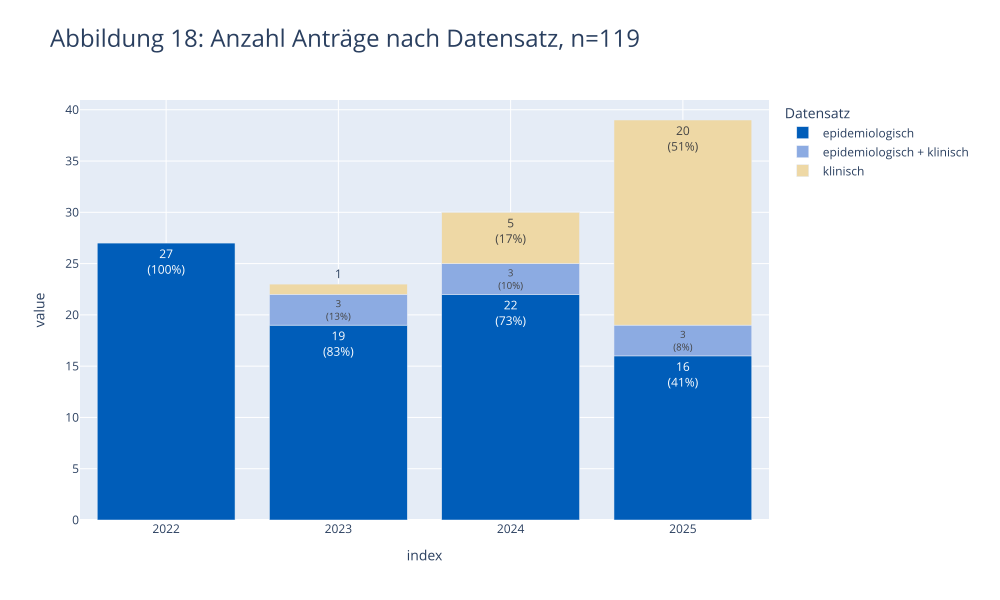
</picture>
    


<br>

#### <a id='toc1_4_11_2_'></a>[Nach Datentyp](#toc0_)

Grundsätzlich können Einzelfalldaten oder zusammenfassende (aggregierte) Daten, beispielsweise
Fallzahlen oder Überlebensraten, beantragt werden. Abbildung 19 zeigt, dass mehrheitlich Einzelfalldaten, seltener aggregierte Daten oder eine Kombination mehrerer Datentypen, beispielsweise klinischer und epidemiologischer Einzelfalldaten, beantragt wurden.


<picture>
  <source media="(prefers-color-scheme: dark)" srcset="report_files_dark/output_48_1.svg">
  <source media="(prefers-color-scheme: light)" srcset="report_files/output_48_1.svg">
  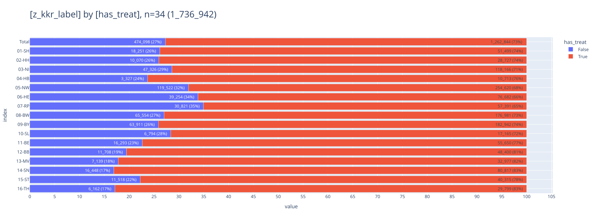
</picture>
    


<br>

#### <a id='toc1_4_11_3_'></a>[Nach Entität](#toc0_)

Fasst man die im Zeitraum 2022 bis 2025 eingegangenen Datennutzungsanträge entsprechend der anatomischen Region (z. B. Zentrales Nervensystem, Verdauungstrakt) oder Histologie (z. B. Sarkom, neuroendokrine Tumore) zusammen, die im Fokus des jeweils geplanten Forschungsvorhabens stand, ergibt sich die Kopf-Hals-Region als „populärstes“ Forschungsgebiet (20 Anträge). Häufig wurden auch Krebsregisterdaten zu mehreren Entitäten (15 Anträge), zu Lungenkrebs (11 Anträge) und zu Krebs des Verdauungstrakts (11 Anträge) beantragt (Abbildung 20).


<picture>
  <source media="(prefers-color-scheme: dark)" srcset="report_files_dark/output_50_1.svg">
  <source media="(prefers-color-scheme: light)" srcset="report_files/output_50_1.svg">
  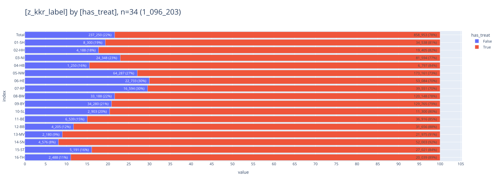
</picture>
    


<br>

#### <a id='toc1_4_11_4_'></a>[Nach Art der antragstellenden Einrichtung](#toc0_)

Mit der Verfügbarkeit klinischer Krebsregisterdaten hat sich das Interesse von pharmazeutischen Unternehmen und Auftragsforschungsinstituten an den Daten des ZfKD erhöht. Knapp ein Drittel aller in 2025 eingegangenen Datennutzungsanträge wurde von pharmazeutischen Unternehmen oder Auftragsforschungsinstituten eingereicht (Abbildung 21). Universitäten bzw. Universitätskliniken stellten mit rund 50 % weiterhin die größte Gruppe der Antragsteller. Etwa jeder fünfte Datennutzungsantrag in 2025 entfiel auf außeruniversitäre Forschungseinrichtungen wie das Deutsche Krebsforschungszentrum oder das Leibniz-Institut für Präventionsforschung und Epidemiologie. Natürliche Personen haben im Zeitraum von 2022 bis 2025 nicht von der Möglichkeit zur Antragstellung Gebrauch gemacht.


<picture>
  <source media="(prefers-color-scheme: dark)" srcset="report_files_dark/output_52_1.svg">
  <source media="(prefers-color-scheme: light)" srcset="report_files/output_52_1.svg">
  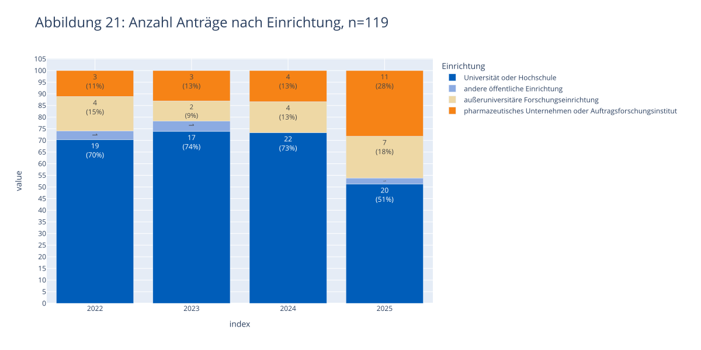
</picture>
    


<br>

#### <a id='toc1_4_11_5_'></a>[Nach Auswertungszielen und Forschungszweck](#toc0_)

Eine systematische Auswertung der Forschungsthemen der vom ZfKD bearbeiteten Datennutzungsanträge findet nicht statt. An dieser Stelle können nur einige Tendenzen beschrieben werden, wie sie sich in der täglichen Beschäftigung mit eingehenden Datennutzungsanträgen darstellen:

* Häufiges Ziel einer Beantragung aggregierter epidemiologischer Daten durch pharmazeutische Unternehmen oder Auftragsforschungsinstitute ist die Erstellung eines Dossiers für die Nutzenbewertung von Arzneimitteln nach § 35a SGB V.
* Klinische Einzelfalldaten sollen zum einen als Grundlage deskriptiver Darstellungen von Patientenpopulationen und Tumoreigenschaften herangezogen werden, zum anderen in die Berechnung spezifischer, klinisch relevanter Endpunkte einfließen, darunter die Häufigkeit von Rezidiven, die metastasenfreie Überlebenszeit oder das Gesamtüberleben nach einem definierten Zeitraum ab Diagnose oder Behandlungsbeginn.
* Einige Antragsteller möchten bundesweite Daten zur Zusammensetzung spezifischer Patientenpopulationen oder zu Behandlungsergebnissen mit anderen Datenquellen (Abrechnungsdaten, Studiendaten) vergleichen.
* Häufig sollen Behandlungsregime und -abfolgen abgebildet und die Übereinstimmung mit Behandlungsleitlinien festgestellt werden. Einigen Antragstellerngeht es um die Anwendungshäufigkeit eines spezifischen Wirkstoffes in einer bestimmten Indikation, nachdem er für diese zugelassen wurde.
* Mitunter beantragen Universitätskliniken klinische Einzelfalldaten auf Landkreisebene, um die daraus errechneten Behandlungsergebnisse denen der eigenen Klinik gegenüberzustellen.
* Mehrere Forschungsvorhaben auf Basis epidemiologischer Daten streben eine Berechnung der Korrelation von Krebshäufigkeiten mit Umweltdaten (z. B. Konzentration von Luftschadstoffen) oder mit industriellen Standortdaten auf Landkreisebene an.

Die mit einem Datennutzungsantrag verfolgten Auswertungsziele sind oft sehr vielfältig und umfassen mehrere Endpunkte. Wenige Antragsteller planen eine Machbarkeitsanalyse ein, die klären soll, ob die vorliegenden Fallzahlen und Datenqualität ausreichend sind, um aus den späteren Auswertungen belastbare Aussagen ableiten zu können. In diesem Jahr haben uns allerdings einige Anfragen von Forschenden erreicht, die sich vor Antragstellung nach entsprechenden Fallzahlen zur Beurteilung der Machbarkeit bestimmter Analysen erkundigt haben.

Die Auswertungsziele der Antragsteller und die mit ihren Forschungsvorhaben verfolgten Forschungszwecke können in diesem Bericht nicht vollständig abgebildet werden. Es sei daher auf das öffentliche Verzeichnis bewilligter Datennutzungsanträge verwiesen, das jedes geplante Forschungsvorhaben nach den Angaben der Antragsteller zusammenfasst und, soweit vorhanden, entsprechende Ergebnispublikationen verknüpft (Abschnitt 4.11 und 4.12).


<br>

#### <a id='toc1_4_11_6_'></a>[Nach Gebührenpflichtigkeit](#toc0_)

Öffentliche oder im Bereich Wissenschaft und Forschung gemeinnützige Einrichtungen können oft eine vollständige oder eingeschränkte Befreiung von Bearbeitungsgebühren geltend machen. Das Vorliegen sogenannter Befreiungstatbestände muss von den Antragstellern nachgewiesen werden.

Im Jahr 2025 wurde für knapp ein Drittel aller in diesem Jahr eingegangenen Datennutzungsanträge ein Kostenbescheid versandt (Abbildung 22).


<picture>
  <source media="(prefers-color-scheme: dark)" srcset="report_files_dark/output_54_1.svg">
  <source media="(prefers-color-scheme: light)" srcset="report_files/output_54_1.svg">
  
</picture>
    


<br>

#### <a id='toc1_4_11_7_'></a>[Fazit und Perspektiven](#toc0_)

Insgesamt ist hervorzuheben, dass in Deutschland in den Landeskrebsregistern und am ZfKD ein international wahrscheinlich einmaliger Datensatz entsteht, in der der gesamte Krankheits- und Therapieverlauf aller Krebserkrankungen in einer großen Bevölkerung dokumentiert wird. Durch den jährlichen Aufwuchs der Datenbasis und entsprechend länger werdenden Beobachtungszeiten wird das Potential dieser Daten für die Forschung weiter zunehmen, umso mehr, wenn es gelingt, die noch bestehenden Datenlücken nach und nach abzubauen.

Die sich durch das Gesundheitsdatennutzungsgesetz (GDNG) und perspektivisch im Europäischen Gesundheitsdatenraum (EHDS) ergebenden Verknüpfungsmöglichkeiten mit anderen Datensätzen werden dieses Potential noch erhöhen: Alleine schon die durch die im GDNG ermöglichte (technisch aber derzeit noch nicht umgesetzte) Verknüpfung mit Abrechnungsdaten der gesetzlichen Krankenversicherung (GKV) ergeben sich vielfältige neue Möglichkeiten, da sich beide Datensätze sehr gut ergänzen: die Krebsregisterdaten mit ihrer Detailtiefe zu Krebsdiagnosen und Krankheitsverläufen, die GKV-Daten mit der Vollständigkeit abgerechneter Leistungen und der Dokumentation zu Diagnosen und Behandlungen auch außerhalb des Krebsregisterspektrums.

Auf der anderen Seite enthalten Krebsregisterdaten Informationen, die sich bevölkerungsweit und außerhalb von Studien in dieser Qualität und Detailtiefe derzeit und auch absehbar nicht in anderen Datensätzen (z.B. Abrechnungs- oder Krankenhausdaten) finden. Dies betrifft unter anderem prognostisch und therapeutisch relevante Informationen zur Diagnose, aber auch bestimmte Aspekte der Therapie (z.B. stationär durchgeführte bzw. eingeleitete Chemotherapie) sowie den Angaben zum Krankheitsverlauf. Dies wird auch durch die zuletzt deutlich zunehmende Nachfrage nach den klinischen Daten-sätzen unterstrichen.

Entgegen teilweise bei Einführung der bundesweiten klinischen Krebsregistrierung geäußerten Befürchtungen ist die Datenbasis für epidemiologische Auswertungen in Deutschland nicht schlechter geworden, sondern hat sich teilweise sogar verbessert: In einigen Bundesländern (z.B. Hessen und Berlin) hat sich die Vollzähligkeit der Erfassung deutlich erhöht, die Vollständigkeit und Spezifität von Angaben zur Diagnose konnte tendenziell gesteigert werden. Auch hat sich die Datenbasis zu nicht-invasiven Tumorerkrankungen wie in-situ Tumoren und gutartigen Hirntumoren deutlich verbessert, so dass diese Diagnosen erstmalig in die regelmäßige Berichterstattung bzw. der x|. Ausgabe von „Krebs in Deutschland“ aufgenommen werden konnten. Auch dies ist international nur in sehr wenigen Ländern der Fall. Sowohl epidemiologische Forschung als auch Gesundheitsberichterstattung profitieren zudem von zusätzlich in den Datensatz aufgenommen Items wie z.B. den Hormonrezeptoren beim Brustkrebs und der Dokumentation von Verlaufsereignissen, die eine genauere Beschreibung der Krankheitslast ermöglichen.

Die Verknüpfung mit den Abrechnungsdaten wird auch die Beurteilung wichtiger Aspekte der Datenqualität erleichtern, dies gilt in beide Richtungen: In den Krebsregistern ist eine höhere Validität der Diagnosen zu erwarten, während in Abrechnungsdaten Operationen, aber auch ambulante Therapien für GKV-Versicherte vollständiger abgebildet sein dürften.

Der vorliegende Bericht kann nicht alle Aspekte der Datenqualität der Krebsregister umfassend behandeln, auch weil das ZfKD in seinen Ressourcen nicht mit seinen Aufgaben und der Komplexität der Daten mitgewachsen ist. Der weitere Auf- und Ausbau eines bundesweiten Datenqualitätsmonitorings ist jedoch für das ZfKD ein wichtiges Anliegen, von dem sowohl Krebsregister als auch Forschende profitieren sollen.
